# FP Unit Design — From CLA/CRA to Add, Multiply, FMA, Divide, Root, and SFU

> **Layer:** L2.
> **Prerequisites:** a ripple-carry adder (RCA/CRA), carry-lookahead adder (CLA), two's-complement subtraction, muxes, registers, and [On_Chip_Memory_Hardware](01_On_Chip_Memory_Hardware.md). No prior IEEE-754 knowledge is assumed.
> **Hands off to:** [Systolic_Arrays_and_Dataflow](03_Systolic_Arrays_and_Dataflow.md), [L3 Microarchitecture](../L3_Microarchitecture/00_Index.md).

---

## 0. Why this layer matters

Every TFLOPS number on a Blackwell or MI355X spec sheet is the product of four factors:

$$
\text{TFLOPS} \;=\; N_{\text{MAC}} \cdot \text{ops/MAC/cycle} \cdot f_{\text{clk}} \cdot \text{utilization}
$$

L0 sets the silicon area budget; L1 sets the operand-bandwidth ceiling; L2 determines **how many arithmetic lanes fit, which formats they support, how fast they switch, and where they round**. The significand multiplier begins with an $O(M^2)$ partial-product problem, but the complete lane also pays for exponent/classification logic, alignment, a wide accumulator, routing, and register/clock power. Narrower formats create a density and packing opportunity; the actual throughput ratio is the minimum of provisioned compute, issue, operand, accumulator, and power resources.

---

## 1. The IEEE-754 vs MX format zoo

### 1.1 IEEE-754 representation

A floating-point number:

$$
V \;=\; (-1)^S \cdot (1.M) \cdot 2^{E - \text{bias}}
$$

with sign bit $S$, mantissa $M$ ($m$ explicit bits + 1 implicit leading 1), exponent $E$ ($e$ bits) and bias $= 2^{e-1} - 1$.

| Format | Bits | S | E | M | Bias | Dynamic range | AI use |
|---|---|---|---|---|---|---|---|
| FP64 | 64 | 1 | 11 | 52 | 1023 | $\pm 1.8\times 10^{308}$ | scientific only |
| FP32 | 32 | 1 | 8 | 23 | 127 | $\pm 3.4\times 10^{38}$ | accumulation, softmax, master weights |
| TF32 | 19 | 1 | 8 | 10 | 127 | $\pm 3.4\times 10^{38}$ | Ampere matmul |
| BF16 | 16 | 1 | 8 | 7 | 127 | $\pm 3.4\times 10^{38}$ | training (gradient-robust) |
| FP16 | 16 | 1 | 5 | 10 | 15 | $\pm 65 504$ | legacy inference |
| FP8 E4M3 | 8 | 1 | 4 | 3 | 7 | $\pm 448$ | forward, activations |
| FP8 E5M2 | 8 | 1 | 5 | 2 | 15 | $\pm 57 344$ | backward, gradients |
| FP6 E3M2 | 6 | 1 | 3 | 2 | 3 | $\pm 28$ | research |
| FP4 E2M1 | 4 | 1 | 2 | 1 | 1 | $\pm 6$ | Blackwell inference |

Range vs precision tradeoff: BF16 and FP8 E5M2 keep wide range (large exponent) at the cost of mantissa precision. FP16 and FP8 E4M3 do the inverse.

#### 1.1.1 The five encoded classes

An FP word is not always `1.M × 2^(E-bias)`. The exponent field selects a class:

| Exponent field | Fraction | Class | Hidden bit | Value/meaning |
|---|---|---|---:|---|
| all zero | zero | signed zero | 0 | $+0$ or $-0$ |
| all zero | nonzero | subnormal | 0 | $(-1)^S(0.M)2^{e_{\min}}$ |
| neither extreme | any | normal | 1 | $(-1)^S(1.M)2^{E-\text{bias}}$ |
| all one | zero | infinity | — | $+\infty$ or $-\infty$ |
| all one | nonzero | NaN | — | quiet/signaling payload per format/profile |

The classifier is a reduction tree:

```text
exp_is_zero = ~(|E)
exp_is_ones =  &E
frac_is_zero = ~(|M)
is_zero      = exp_is_zero & frac_is_zero
is_subnormal = exp_is_zero & ~frac_is_zero
is_inf       = exp_is_ones & frac_is_zero
is_nan       = exp_is_ones & ~frac_is_zero
```

These are AND/OR reductions plus a few gates. They run in parallel with operand unpacking and control the final result mux. The wide significand datapath should be operand-gated when a special-case result wins.

#### 1.1.2 Use an internal raw representation

Do not carry the packed IEEE word through arithmetic. Decode it to:

```text
class = {zero, finite, infinity, NaN}
sign  = 1 bit
sExp  = signed exponent with headroom
sig   = explicit significand, including hidden bit
```

For subnormals, either:

- keep hidden bit 0 and handle a variable leading-one position in each operation; or
- normalize once at decode with a leading-zero counter, decrementing the internal exponent.

Berkeley HardFloat uses a recoded/internal form so subnormals enter arithmetic already normalized. That is an implementation technique, not a different numerical format: pack/unpack preserve a one-to-one mapping with the architectural bits.

#### 1.1.3 One universal operation shell


The **operation core** is where your known integer block lives:

- FP add/sub: exponent subtract + right shifter + significand CLA;
- FP multiply: exponent add + unsigned significand multiplier;
- FMA: multiplier compression tree plus aligned addend, then one wide CPA;
- divide/root: a registered sequence of shifts, add/subtracts, table lookups, and/or FMAs;
- conversions/SFU: leading-zero logic, shifters, tables, and reused FMA lanes.

#### 1.1.4 Guard, round, sticky, and the round increment

Let the destination keep $p$ significand bits. The exact internal result normally has more bits:

```text
... retained significand ... | G | R | lower discarded bits
                                           \_____ OR _____/ = S
```

- **G** is the first discarded bit.
- **R** is the second discarded bit.
- **S** is the OR of every lower discarded bit and every bit previously lost by alignment.
- **L** is the retained least-significant bit.
- $D=G\lor R\lor S$ means the result is inexact.

The round increment is:

| Mode | Increment |
|---|---|
| RNE, nearest ties even | $G(R\lor S\lor L)$ |
| RTZ, toward zero | $0$ |
| RUP, toward $+\infty$ | $\overline{sign}\,D$ |
| RDN, toward $-\infty$ | $sign\,D$ |
| RMM/ties to maximum magnitude | $G$ |

After increment, `1.111... + 1 ULP` can become `10.000...`; the result must shift right and increment its exponent. Rounding is therefore part of normalization/range handling, not a formatting afterthought.

#### 1.1.5 Architectural exception flags

A typical IEEE-style ISA exposes five accrued conditions:

| Flag | Meaning | Example |
|---|---|---|
| invalid | operation has no defined numeric result | $0\times\infty$, $\infty-\infty$, $\sqrt{-1}$ |
| divide by zero | finite nonzero divided by zero | $1/(+0)$ |
| overflow | rounded magnitude exceeds finite range | largest finite × 2 |
| underflow | tiny result under the profile's tininess/inexact rule | tiny inexact subnormal |
| inexact | discarded information changed or could change exactness | most divisions |

The flags travel beside the transaction through every pipeline register. A result with the wrong flags is architecturally wrong even when its data bits look plausible.

### 1.2 OCP MX (microscaling) formats

Sub-8-bit formats (FP4, FP6) have such tiny native dynamic range that a single layer's activations would saturate. The fix: **a shared exponent over a block** of $K$ elements:

$$
V_i \;=\; (-1)^{S_i} \cdot (1.M_i) \cdot 2^{E_i - \text{bias}} \cdot 2^{E_{\text{shared}} - \text{bias}_{\text{shared}}}
$$

OCP MX standard:
- $K = 32$ elements per block
- Shared scale: 8-bit E8M0 (no mantissa, just an exponent)
- Block: 32 element values

For MXFP4: $32 \cdot 4 + 8 = 136$ bits per block → **4.25 bits/element amortized**. FP4 alone has a very small local range; the E8M0 scale moves that local range through roughly the exponent range of an eight-bit scale. Do not describe this as “FP4 suddenly has 128 exponent bits”: the 32 elements still share one scale, so their *within-block* relative range remains limited.

NVFP4 is NVIDIA's variant: $K = 16$ instead of 32, FP8 (not FP4) shared scale. Trades amortization for finer-grained precision.

---

## 2. The integer multiplier

> **Primer — the vocabulary in this section (read once).** A few terms recur throughout; here they are in plain language:
>
> - **Partial products (PPs).** Long multiplication in binary. To compute $A\times B$, for every `1` bit in the multiplier $B$ you write down a shifted copy of $A$; those shifted copies are the *partial products*, and summing them gives the product. A naive $M$-bit × $M$-bit multiply makes $M$ PP rows of $M$ bits.
> - **Carry-save (redundant) representation.** Ordinary addition *propagates a carry* left-to-right, which is slow. A **carry-save adder (CSA)** instead keeps a number as **two rows — a "sum" row and a "carry" row — not yet added together**. You can keep folding in more numbers without ever waiting for a carry to ripple; you pay for one real carry-propagation only at the very end. "Carry-save" just means "carries postponed." A plain full adder used this way is a **3:2 counter** (3 bits in → 1 sum bit + 1 carry bit).
> - **CPA — carry-propagate adder.** The "real" adder that finally collapses the two carry-save rows into one binary number by propagating carries. It is the slow step, done *once*, at the end.
> - **FO4 ("fan-out-of-4").** A normalized delay reference: one inverter driving four copies of itself. It lets architects compare logical depth, but its picoseconds still depend on process, cell flavor, voltage, PVT, wire, and load.
> - **ULP ("unit in the last place").** The weight of the least-significant mantissa bit — the gap between two adjacent representable floating-point numbers. "Error ≤ 0.5 ULP" means "correctly rounded to the nearest representable value," the best achievable.
> - **Barrel shifter.** A tree of multiplexers that shifts a number left or right by *any* amount in a single step (versus one bit per clock). It is large — often the second-biggest block in an FP unit after the multiplier.
> - **Two's-complement negation.** To form $-x$ in hardware: invert every bit of $x$ and add 1. (This is why "negating a partial-product row" below costs a bit-invert plus a `+1` correction term.)

### 2.1 Area scaling: O(M²)

An $M$-bit × $M$-bit unsigned multiplier is fundamentally a 2D array of partial-product (PP) gates. The **simplest** scheme ANDs every multiplicand bit with every multiplier bit: $M$ PP *rows* of $M$ bits each, i.e. $M^2$ AND gates. Those rows are collapsed to two operands by a **compressor tree** (Wallace/Dadda/4:2), then a final **CPA** (carry-propagate adder) resolves the sum. Two independent levers set the cost: *how many PP rows you start with* (attacked by **Booth encoding**, §2.2) and *how fast you crush them* (attacked by **4:2 compressors**, §2.3).

> **Terminology trap.** "Booth radix-2" is not the plain AND-array; it is a one-bit recoding whose row-count benefit is limited. **Radix-4 modified Booth** is a common high-speed choice because it roughly halves the row count. Small or highly regular multipliers may still use arrays or other structures.

| Precision $p$ | Example explicit significand | Naïve PP bits $p^2$ | Approx. radix-4 rows for zero-extended unsigned input |
|---:|---|---:|---:|
| 2 | FP4 E2M1 | 4 | 2 |
| 3 | FP6 E3M2 | 9 | 2 |
| 4 | FP8 E4M3 | 16 | 3 |
| 8 | BF16 | 64 | 5 |
| 11 | FP16 / TF32 | 121 | 6 |
| 24 | FP32 | 576 | 13 |

The raw PP-bit count scales quadratically, while total synthesized area also includes encoders, compressors, CPA, wiring, pipeline registers, and mode muxes. **Radix-4 Booth** consumes two multiplier bits per digit and roughly halves rows. **Radix-8** consumes three bits per digit but needs an odd multiple such as $3A=2A+A$, so its encoder/precompute trade is more complex. Whether it wins depends on width, target cells, and physical design.

### 2.2 Radix-4 modified Booth encoding — a common high-speed choice

Many wide, high-speed multipliers **recode the multiplier operand** so fewer PP rows are generated. Radix-4 modified Booth reads multiplier $B$ two bits at a time with one bit of overlap, turning each window into a signed digit in $\{-2,-1,0,+1,+2\}$. A zero-extended unsigned $M$-bit significand needs about $\lceil(M+1)/2\rceil$ rows—13 for a 24-bit FP32 significand and 6 for an 11-bit FP16 significand.

> **Intuition — why recoding helps.** A run of 1s in the multiplier is expensive if you add one PP row per 1. But `0111₂=7=8-1`, so one shifted positive row and one negative row replace three positive rows. Radix-4 Booth applies this two bits at a time and chooses $\{-2,-1,0,+1,+2\}\times A$. Negative rows use inversion plus correction bits inside the reduction tree; that is cheaper than a separate subtractor, but not literally free.

**How the recoding works.** Append an implicit $b_{-1}=0$ below the LSB, then form overlapping triplets $(b_{2i+1}, b_{2i}, b_{2i-1})$. Each triplet selects a multiple of the multiplicand $A$:

| $b_{2i+1}$ | $b_{2i}$ | $b_{2i-1}$ | Digit | PP row |
|:---:|:---:|:---:|:---:|:---:|
| 0 | 0 | 0 | 0  | $0$ |
| 0 | 0 | 1 | +1 | $+A$ |
| 0 | 1 | 0 | +1 | $+A$ |
| 0 | 1 | 1 | +2 | $+2A\ (A\!\ll\!1)$ |
| 1 | 0 | 0 | −2 | $-2A$ |
| 1 | 0 | 1 | −1 | $-A$ |
| 1 | 1 | 0 | −1 | $-A$ |
| 1 | 1 | 1 | 0  | $0$ |

**Gate-level realization** — two tiny blocks:

- **Booth encoder** (one per triplet, $\lceil(M+1)/2\rceil$ total) emits three control lines:
  - `neg` $= b_{2i+1}$ — this row is negated
  - `one` $= b_{2i} \oplus b_{2i-1}$ — select $\pm 1\times$
  - `two` $= (b_{2i+1}\,\overline{b_{2i}}\,\overline{b_{2i-1}}) + (\overline{b_{2i+1}}\,b_{2i}\,b_{2i-1})$ — select $\pm 2\times$
- **Booth selector** (one per PP bit) is a mux + XOR:

$$pp_{i,j} \;=\; \text{neg}_i \,\oplus\, \big[(\text{one}_i \wedge A_j)\,\vee\,(\text{two}_i \wedge A_{j-1})\big]$$

  Pass $A_j$ for $\times 1$, the shifted $A_{j-1}$ for $\times 2$, then conditionally invert for the negative digits. The extra "$+1$" that finishes two's-complement negation is injected as a **correction bit** at that row's LSB column and absorbed by the existing reduction tree, avoiding a separate carry-propagate incrementer.

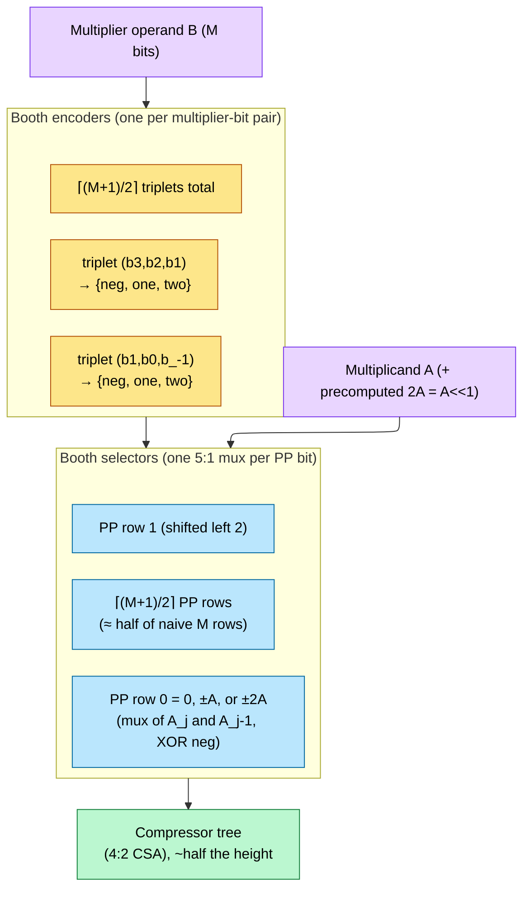

**Two wrinkles VLSI students hit:**

1. **Sign extension.** Because negative Booth digits produce *negative* PP rows, each row is a two's-complement number that must be **sign-extended** — its sign bit copied leftward to fill the full product width so the additions line up. Done literally, those copied sign bits fill a large triangular region of the array with wasted gates. High-speed designs commonly use a **sign-extension-elimination pattern**: replace long sign runs with a short fixed pattern plus correction bits. The exact pattern depends on the Booth formulation and product width, so verify it algebraically for the chosen RTL instead of copying a diagram blindly.
2. **$2A$ is wiring, while $3A$ is arithmetic.** Selecting $2A$ needs a one-bit shift. Radix-8 also needs $3A=2A+A$, which introduces precompute or selection cost. Whether the lower row count repays that cost depends on operand width, available cells, routing, and timing target.

### 2.3 Partial-product reduction: 3:2 counters and 4:2 compressors

A Wallace tree reduces $N$ partial-product **rows** using **3:2 counters** (full adders, 3 input bits of one weight → a sum bit of that weight and a carry bit of the next weight). Ignoring shorter edge columns, a level reduces the maximum column height by roughly a factor of $3/2$:

$$
N_{\text{rows after } L \text{ levels}} \;=\; N \cdot \left(\frac{2}{3}\right)^L
$$

Solving for $L$ to reach 2 rows (so a final CPA can sum them):

$$
L \;=\; \log_{3/2}\!\left(\frac{N}{2}\right) \;=\; \frac{\log_2(N/2)}{\log_2(1.5)} \;=\; \frac{\log_2(N/2)}{0.585}
$$

An unsigned $8\times8$ array has **8 rows containing 64 AND bits**, not 64 rows. The approximation gives $L\approx3.4$, so expect about four 3:2 reduction levels before the final CPA. Edge-column heights mean an actual Wallace/Dadda schedule is counted column by column, but the row model gives the right architectural intuition.

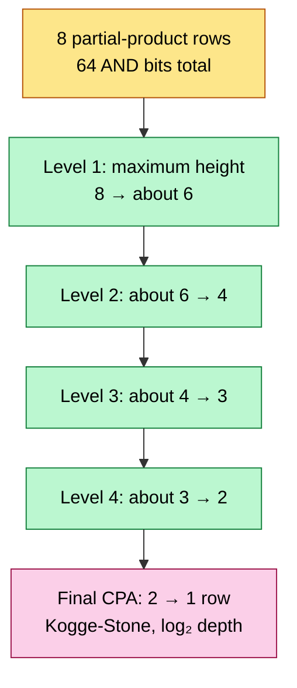

(Height-only view of a naïve $8\times8$ array. A real schedule tracks every bit column because the outer columns are shorter. An 11-bit FP16 significand commonly starts from about 6 radix-4 Booth rows (§2.2). Dadda reduction reaches the same exact product with a schedule chosen to reduce counter count.)

#### 2.3.1 3:2 counters vs 4:2 compressors

The Wallace levels above use **3:2 counters** — plain full adders (3 in, 2 out: $\text{sum}=a\oplus b\oplus c$, $\text{carry}=ab+bc+ca$). Exact delay depends on the full-adder cell/mapping and wire load. Wallace schedules prioritize reduction depth; Dadda schedules delay some reductions to use fewer counters. Both produce the same exact product but can create irregular routing.

Many throughput-oriented multipliers use **4:2 compressors** — think of one as a regular block that combines four same-weight data bits plus a carry-in and emits a sum plus two next-weight carry signals:

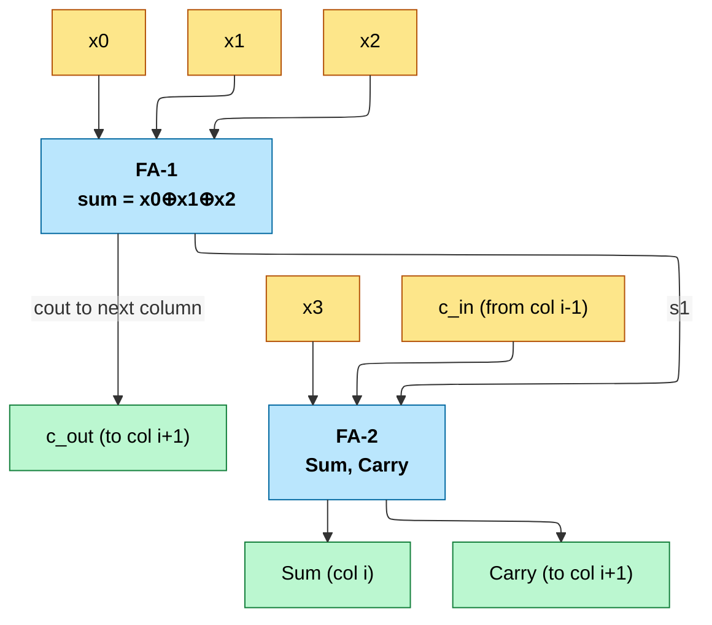

It can be composed from two full adders, but optimized 4:2 cells arrange the horizontal carry so it does not create a carry-propagation chain across all columns. Exact XOR/MUX depth depends on the selected compressor equation and cell mapping. Two properties make it attractive:

- **Regular reduction tree.** An idealized 4:2 stage roughly halves the active row count. For 13 Booth rows, a schedule such as $13\to7\to4\to2$ uses three compressor stages before the final CPA, although edge columns and sign/correction bits make the physical array irregular. Booth row reduction and compressor-stage reduction compound.
- **Layout regularity.** A balanced structure with near-equal arrival times can place and route more predictably. Whether it beats a Wallace/Dadda schedule is a physical-design result, especially when wires and congestion dominate nominal cell depth.

| Reducer | In → out | Crit. path | Depth for $N$ rows | Used for |
|---|:---:|:---:|:---:|---|
| 3:2 counter (full adder) | 3 → 2 | cell/mapping dependent | $\log_{1.5}(N/2)\approx 4$ ($N{=}8$) | Wallace/Dadda trees |
| **4:2 compressor** | 4 → 2 (+cin/cout) | cell/mapping dependent | idealized $\log_2(N/2)\approx 3$ ($N{=}13$) | regular high-throughput trees |
| 7:3 / 5:3 counters | — | more | fewer levels | wide FP64 datapaths |

### 2.4 The carry-propagate adder (parallel-prefix)

After reduction two operands remain; a CPA sums them. Naïve ripple-carry takes $O(M)$ time. AI hardware uses parallel-prefix variants:

| CPA topology | Delay | Area |
|---|---|---|
| Ripple-carry | $O(M)$ | $O(M)$ |
| Brent-Kung | $O(\log M)$ | $O(M)$ |
| Kogge-Stone | $O(\log M)$ | $O(M\log M)$ |
| Han-Carlson | $O(\log M)$ | between BK and KS |

Kogge-Stone minimizes prefix depth and node fanout at the cost of wiring; Brent-Kung uses fewer prefix cells and less wiring but more stages; Han-Carlson is a hybrid. A timing-critical accumulator may choose a dense prefix topology while less critical paths use a smaller one, but the final choice is made from synthesis and physical-design results.

**Gate-level, a prefix adder is three stages:** (1) a **pre-compute** row forms per-bit *generate/propagate* $g_i=a_ib_i,\ p_i=a_i\oplus b_i$; (2) a **prefix network** of $\log_2 M$ levels combines them with the associative operator $(g,p)\circ(g',p') = (g + p\,g',\ p\,p')$ to produce the carry into every bit; (3) a **sum** row XORs $p_i$ with the incoming carry. Kogge-Stone minimizes logic levels and per-node fanout at the cost of $O(M\log M)$ cells and dense wiring; Brent-Kung inverts that trade. A **compound adder** can share prefix information to prepare `sum` and `sum+1`, then let the rounding decision select one; that costs extra logic but can remove a serial round-increment adder (§4.4).

### 2.5 Standard-cell and timing reality

A "gate delay" is often normalized to **FO4** (fanout-of-4 inverter delay) for architectural comparison. Its picoseconds depend strongly on process option, cell flavor, supply, PVT corner, load, and wire; do not attach one public node-wide constant to it. A full adder may map to a dedicated arithmetic cell or XOR/majority composition; a 4:2 compressor may be a custom/datapath cell or synthesized network. At advanced nodes, wiring and placement can dominate nominal logic depth.

The design number that matters is post-synthesis/post-route slack for the chosen widths and mode muxes. The FMA is pipelined (§4.1) to keep each register-to-register segment within that measured budget. Operand isolation and clock gating reduce unnecessary $P=\alpha C V^2 f$ switching, but their enables, isolation muxes, and clock-tree effects also require timing/power sign-off.

---

## 3. Floating-point multiplication

Doing $A \times B$ in IEEE-754 splits into three parallel tracks:

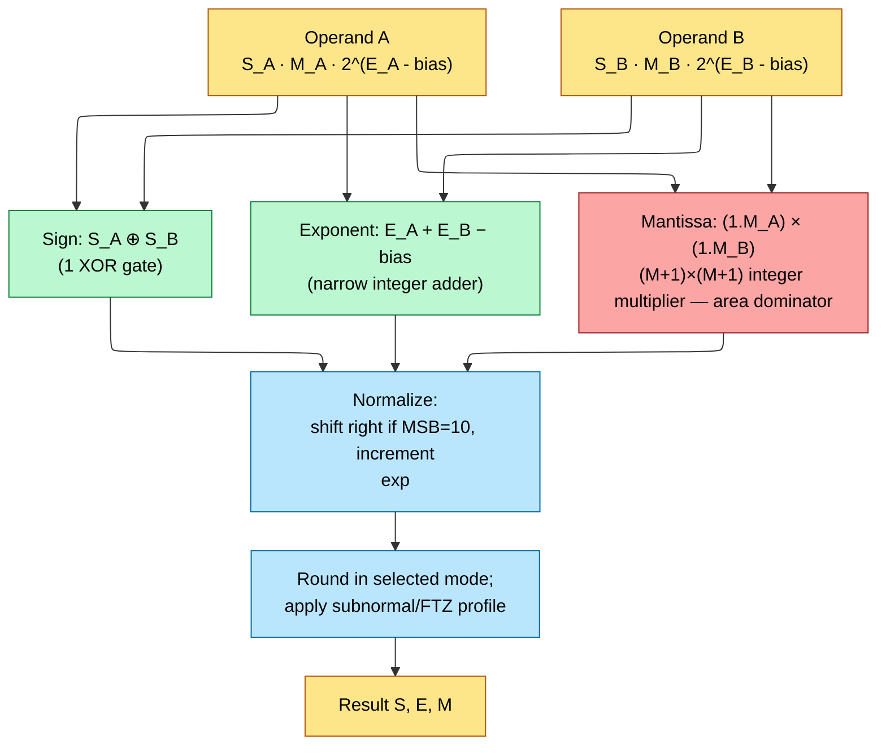

Of the three, only the mantissa multiplier's area scales with mantissa width — sign is one XOR, exponent is a narrow adder.

### 3.1 Finite multiply, cycle by cycle

For finite nonzero inputs:

1. **Unpack.** Restore each hidden bit; normalize subnormals if supported.
2. **Sign.** $S_z=S_a\oplus S_b$.
3. **Exponent.** Add unbiased signed exponents in a width with at least two headroom bits:

   $$
   e_{\text{raw}}=e_a+e_b.
   $$

   If packed exponents are added directly, subtract one bias—not two—because both inputs include bias but the output needs one.
4. **Significand multiply.** Feed the explicit $p$-bit unsigned significands to the §2 Booth/compressor multiplier and retain the full $2p$-bit product.
5. **Normalize.** For normalized operands, the product lies in $[1,4)$. Its top two bits are therefore `01`, `10`, or `11`:
   - `01.x...`: already in $[1,2)$;
   - `1x.x...`: shift right one and increment the exponent.
6. **Form GRS.** Keep the leading $p$ product bits; take the next two as G/R and OR every lower bit into S.
7. **Round.** Use §1.1.4. If rounding creates `10.000...`, shift and increment again.
8. **Range.** If the exponent is below $e_{\min}$, right-shift-jam into the subnormal range before the final rounding. If it exceeds $e_{\max}$, choose infinity or maximum finite according to rounding mode/sign.
9. **Pack and flag.**

The integer multiplier is exact. Every FP error in this operation comes from the one final reduction from $2p$ product bits to $p$ destination bits.

### 3.2 Worked $p=4$ multiply

Let:

$$
A=1.101_2\times2^2=6.5,\qquad
B=1.110_2\times2^{-1}=0.875.
$$

The §2 integer multiplier receives `1101₂` and `1110₂` (the binary points are metadata) and produces:

$$
1.101_2\times1.110_2=10.11011_2.
$$

Exponent sum is $2+(-1)=1$. The product begins `10`, so normalize:

```text
raw product           10.11011 × 2^1
normalized             1.011011 × 2^2
retained p=4           1.011 | G=0 R=1 S=1
RNE result             1.011 × 2^2 = 5.5
```

The exact value is $5.6875$. One ULP at exponent 2 with $p=4$ is $0.5$, so the error is $0.1875<0.5$ ULP.

### 3.3 Multiply special-case controller

| Inputs | Result | Flag |
|---|---|---|
| signaling NaN | quiet NaN | invalid |
| quiet NaN | propagated/canonical quiet NaN per profile | normally none |
| zero × infinity | quiet NaN | invalid |
| infinity × finite nonzero | signed infinity | none |
| zero × finite | signed zero; sign is XOR | none |
| finite × finite | main datapath | overflow/underflow/inexact as generated |

This decision can complete before the multiplier tree. Operand isolation should hold the partial-product array quiet when the bypass wins; clock gating pipeline registers alone does not prevent combinational toggles caused by changing inputs.

### 3.4 IEEE behavior versus reduced AI profiles

An IEEE-conforming operation profile defines:

- subnormal input/result behavior;
- supported rounding-direction attributes;
- exact sticky-bit tracking needed for the promised rounding;
- NaN/infinity/signed-zero behavior and exception flags.

Some tensor and DSP profiles deliberately choose FTZ/DAZ, one rounding mode, saturation, finite-only encodings, or an approximate error bound. Those choices are legal only because the instruction/format contract says so; they are not “almost IEEE.” Even a narrow AI unit needs enough discarded-bit information to meet its stated rounding/error contract. Do not quote a universal area percentage for these trims: the saving depends on format width, pipeline sharing, whether subnormals were normalized at decode, and how much of the rounder/classifier is amortized across lanes.

---

## 4. Floating-point addition and fused multiply-add

### 4.0 Build an FP adder around the CLA/CRA

An integer CLA can add only bits with the same weight. FP operands generally have different exponents, so the smaller significand's binary point must move before the CLA sees it.


For destination precision $p$, a straightforward datapath carries the explicit significand plus GRS and a high carry bit—roughly `p+4` bits—through the add/subtract. The steps are:

1. Classify and unpack each operand.
2. Compare magnitudes and swap so $|A|\ge|B|$.
3. Compute $\Delta E=e_A-e_B\ge0$.
4. Append GRS zeros and right-shift-jam $B$ by $\Delta E$.
5. Equal signs: add magnitudes and keep the sign. Different signs: subtract smaller magnitude from larger and take the larger's sign.
6. Equal-sign carry-out: right-shift one and increment exponent.
7. Opposite-sign cancellation: count leading zeros, left-shift, and decrement exponent down to the subnormal floor.
8. Round using §1.1.4, repair a rounding carry, set flags, and pack.

The CLA is step 5. A CRA/RCA is functionally valid but its linear carry chain usually misses a high-frequency target. A Kogge–Stone, Brent–Kung, Han–Carlson, or synthesis-selected prefix adder changes delay/wiring—not the FP algorithm.

#### 4.0.1 Shift-right-jam is not an ordinary shift

If the smaller significand is:

```text
1.0101011001
```

and alignment discards `1001`, sticky must become 1. For shift distance $d$:

```text
shifted = sig >> d
sticky  = OR(sig[d-1:0])
shifted[0] |= sticky
```

In synthesizable RTL, guard against $d$ greater than the vector width; use a saturating shift amount and an OR-reduction of the whole input. An unsized dynamic slice is a common bug at exactly the exponent-gap tests that determine correct rounding.

#### 4.0.2 Worked add with rounding carry

Use $p=4$:

$$
A=1.101_2\times2^3=13,\qquad
B=1.011_2\times2^1=2.75.
$$

```text
A                    1.10100 × 2^3
B after ΔE=2         0.01011 × 2^3
raw sum               1.11111 × 2^3
retain                 1.111 | G=1 R=1 S=0
```

RNE increments. `1.111 + 1 ULP = 10.000`, so the rounder causes a second normalization and exponent increment:

$$
Z=1.000_2\times2^4=16.
$$

The exact result $15.75$ is nearer 16 than 15.

#### 4.0.3 Worked cancellation

For:

$$
A=1.0001_2\times2^5,\qquad
B=1.0000_2\times2^5,
$$

opposite signs or subtraction produce:

$$
0.0001_2\times2^5=1.0000_2\times2^1.
$$

To move the `1` into the hidden-bit position, the word must shift left four places, so the exponent falls from 5 to 1. An LZC whose input includes the would-be hidden-bit position returns 4. If an RTL block counts only the three fractional zeros, its controller must add 1. State that convention in the interface; otherwise this cancellation path acquires a classic one-bit exponent error.

#### 4.0.4 Add/subtract special cases

| Condition | Result | Flag |
|---|---|---|
| signaling NaN | quiet NaN | invalid |
| quiet NaN | quiet NaN per profile | normally none |
| $+\infty+(-\infty)$ or infinity minus same-signed infinity | quiet NaN | invalid |
| one nonconflicting infinity | that signed infinity | none |
| exact finite cancellation | signed zero per rounding/profile rule | none |
| finite operation | main datapath | range/inexact as generated |

#### 4.0.5 Why high-speed adders use near/far paths

A single path puts a large right aligner and a large left normalizer in series. Yet:

- large exponent difference → large alignment, but cancellation cannot require a large left shift;
- near-equal exponents → cancellation may require a large left shift, but alignment is only zero or one bit.

The dual-path implementation in §4.3 exploits this mutual exclusion.

A tensor core or scalar FMA does not compute $A \times B$ then $+ C$ as two rounded operations. It computes $D=A\times B+C$ while holding the unrounded product at full precision, then rounds the final sum once.

### 4.1 The FMA pipeline

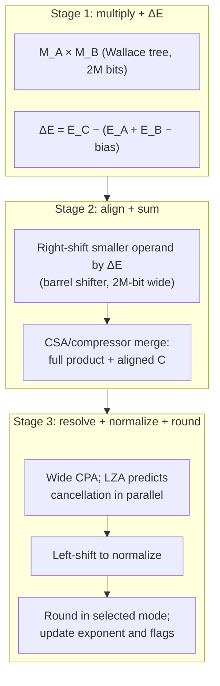

The drawing is a logical partition, not a universal three-cycle implementation. Register placement is selected from characterized cell and wire delay; designs may split multiplication, alignment, final addition, normalization, and rounding across more stages, or combine them at a lower frequency. Latency is hidden only when the scheduler has independent work and the pipeline initiation interval allows a new operation.

#### 4.1.1 Finite FMA, stage by stage

For $Z=A\times B+C$:

1. Unpack and classify all three operands.
2. XOR $A$ and $B$ signs and add their unbiased exponents.
3. Multiply the two $p$-bit significands to the **full $2p$-bit product**. A compressor-tree multiplier may keep the product as carry-save sum/carry rows.
4. Compare the product exponent with $C$'s exponent. Shift-right-jam the smaller-magnitude term into one common, approximately $2p$-bit fixed-point window.
5. If the effective signs differ, complement the term being subtracted and inject its two's-complement correction bit into the compressor tree.
6. Compress the product rows, aligned $C$, and correction bit to two rows; resolve them once with a wide CPA.
7. Normalize. Product/addend cancellation may require a large left shift, so an LZA can work beside the CPA.
8. Form the final GRS bits, round **once**, repair a rounding carry, apply range rules, set flags, and pack.

The invariant is stronger than “keep a few extra product bits”: **no bit that can affect the correctly rounded value of the exact $A\times B+C$ may be discarded before the one architectural rounding point.**

#### 4.1.2 Worked $p=4$ example: the bit a separate multiply loses

Choose two representable $p=4$ operands:

$$
A=B=1.111_2=1.875,\qquad C=-1.110_2\times2^1=-3.5.
$$

Their exact product is:

$$
A B=11.100001_2
=1.1100001_2\times2^1
=3.515625.
$$

A separate $p=4$ multiply sees `1.110 | G=0 R=0 S=1`, rounds to $3.5$, then adds $-3.5$ and returns zero. The fused datapath instead retains `11.100001`, aligns $C=-11.100000_2$, and subtracts:

$$
11.100001_2-11.100000_2
=0.000001_2
=2^{-6}.
$$

That answer is exactly representable. FMA returns $2^{-6}$, while separate multiply then add returns zero. The difference is not a faster instruction sequence; it is the physical location of the rounding boundary.

#### 4.1.3 FMA special-case priority

| Condition | Result | Flag |
|---|---|---|
| signaling NaN input | quiet NaN | invalid |
| $0\times\infty$ or $\infty\times0$ | quiet NaN | invalid |
| infinite product plus opposite-signed infinite $C$ | quiet NaN | invalid |
| infinite product without a conflict | signed infinity | none |
| finite product plus infinite $C$ | $C$ infinity | none |
| quiet NaN with no higher-priority invalid condition | propagated/canonical quiet NaN per profile | normally none |
| all finite | fused datapath | overflow/underflow/inexact as generated |

This is one three-operand operation. Feeding a multiplier's rounded/special result into an FP adder can produce both the wrong data and the wrong invalid flag.

### 4.2 Why the LZA is necessary

When adding two operands of opposite sign and similar magnitude (e.g., $1.0001 \cdot 2^4 - 1.0000 \cdot 2^4$), the result has many leading zeros (catastrophic cancellation). To re-normalize, the result must be left-shifted by the leading-zero count.

**Naïve approach:** wait for CPA to finish, then count leading zeros, then shift. This serializes on the critical path → kills $f_{\max}$.

**LZA approach:** in parallel with the CPA, a separate combinational network analyzes the *input* operands and predicts the leading-zero count of the sum. Boolean derivation: for inputs $A$ and $B$, leading zero pattern is roughly $\bar{A} \cdot \bar{B} + A \cdot B$ propagated bitwise with carry-like rules. Off by ±1 in worst case (corrected by a small shift after).

The LZA is useful when its prediction and routing arrive early enough to overlap the CPA in the target library. Its advantage must be measured after synthesis/place-and-route; a universal FO4 saving cannot be quoted without the cell library, width, topology, and wire load.

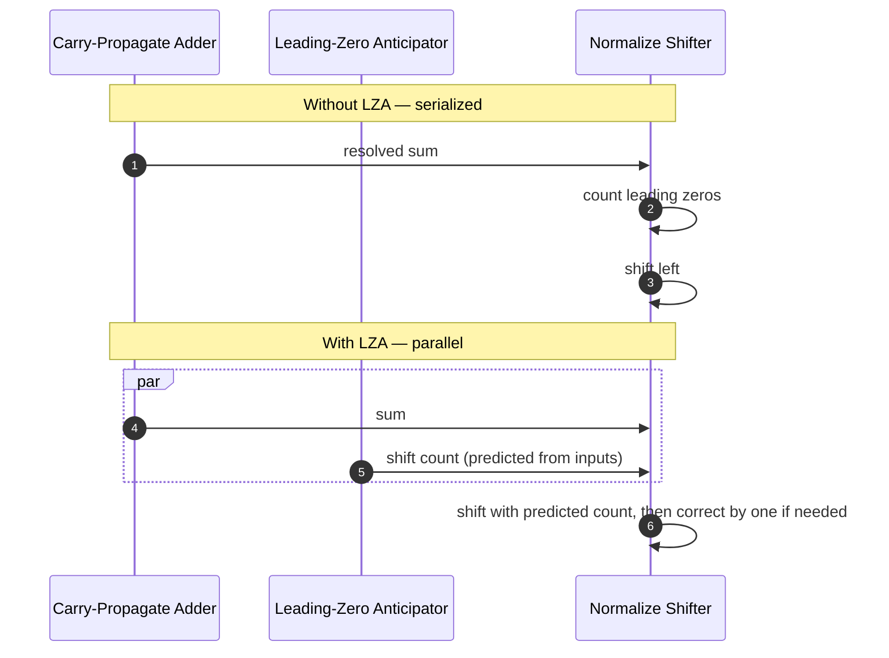


### 4.3 The FP adder's dual-path (near/far) architecture

The §4.0 datapath hides a subtlety: an FP add needs **two** variable shifts — a pre-shift to *align* significands (by the exponent difference $\Delta E$) and a post-shift to *normalize* the result — and doing them in series can dominate the critical path. A common high-speed solution is the **dual-path** (two-path or near/far) design, which exploits this property: **the big alignment shift and the big normalization shift are mutually exclusive.**

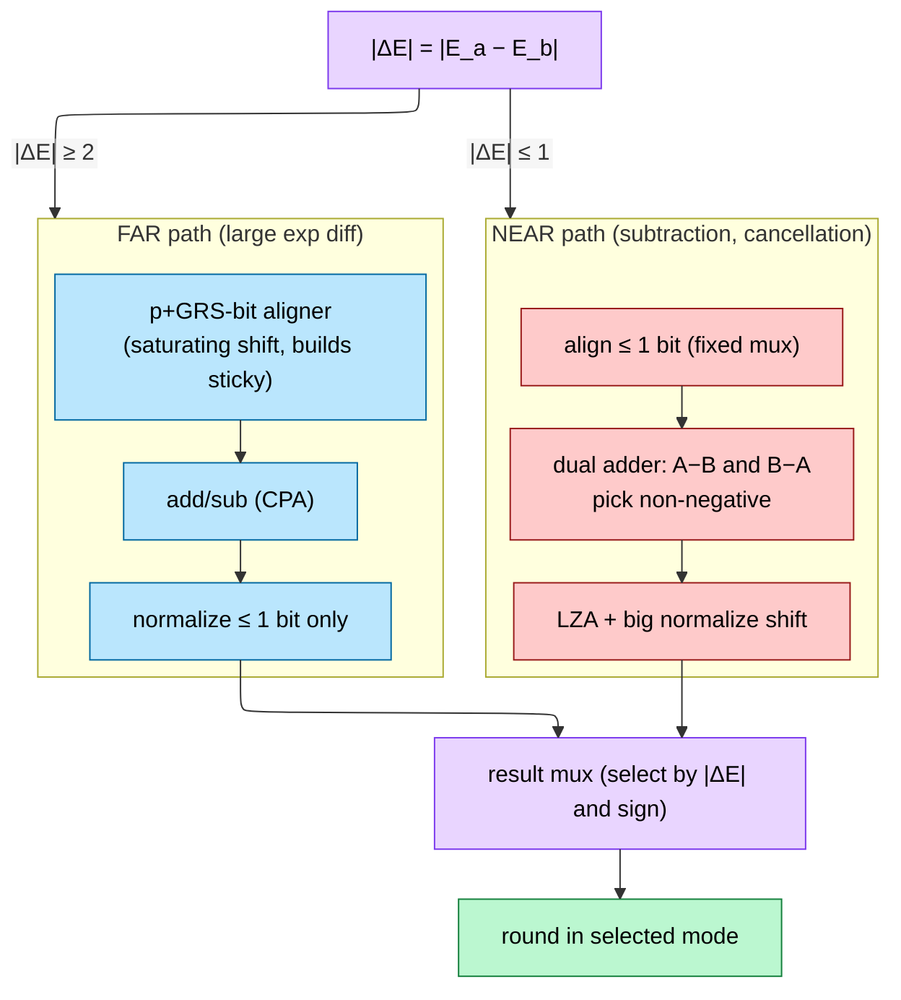

- **FAR path ($|\Delta E| \ge 2$):** the smaller operand is right-shifted by up to the full width — one big barrel shifter — but because the exponents differ by ≥ 2, catastrophic cancellation is impossible, so the result needs **at most a 1-bit** normalize. The bits shifted out feed the sticky-bit OR-tree.
- **NEAR path ($|\Delta E| \le 1$):** alignment is 0 or 1 bit (a cheap fixed mux), so there is **no** big aligner — but a subtraction of near-equal magnitudes can leave many leading zeros, so this path carries the **LZA + full-width normalization shifter** (§4.2). It typically computes both $A-B$ and $B-A$ so the sign is resolved without a second pass.

Neither path contains a big aligner *and* a big normalizer in series, so the longest combinational chain is reduced. The actual frequency gain depends on duplicated logic, mux placement, wiring, and pipeline cuts. A final mux picks the path by $\Delta E$ and result sign.

### 4.4 Rounding at the gate level (round-by-injection)

IEEE round-to-nearest-even needs three bits below the kept mantissa: **Guard (G)**, **Round (R)**, and **Sticky (S)**, where $S$ is the OR of *every* bit shifted past R. Hardware produces them cheaply: the multiplier's low $\sim\!M$ product bits collapse to G/R/S through an **OR-tree**, and the aligner's shifted-out bits OR into the same sticky. The round-up condition is a handful of gates:

$$\text{round\_up} \;=\; G\cdot(R + S) \;+\; G\cdot\overline{R}\cdot\overline{S}\cdot L \qquad (L=\text{result LSB, the "even" tie-break})$$

The naïve implementation would add 1 to the mantissa *after* the main add — another carry propagation on the critical path. Common repairs include **round-by-injection**, a compound adder that computes sum and sum+1 in parallel, or a dedicated short increment path. In an FMA, a rounding constant may be folded into the compressor representation; in a standalone adder, selecting between sum/sum+1 is often cleaner. The best mapping is library- and topology-dependent, but the goal is always to avoid serializing a second full-width CPA after the main result.

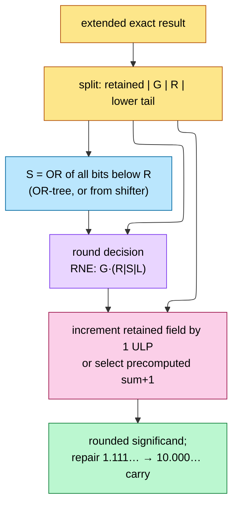

### 4.5 The *fused* datapath — why "fused" is a hardware statement

"Fused" is a hardware contract: in $D=A\times B+C$, the aligned addend is merged with the full-precision product—often while the product is still in carry-save form—before the one final normalization and rounding. Depending on alignment, $C$ can occupy several product-relative regions, so the internal fixed-point window is wider than the destination significand. The implementation may inject one or more aligned/correction rows into a compressor tree or use an equivalent wide add path. Correctly rounded FMA guarantees the nearest destination result (at most half an ULP under RNE) because no intermediate product rounding occurs.

### 4.6 From one FMA to the tensor-core dot-product datapath

A tensor/matrix instruction commonly forms several products in parallel and reduces them into a wider accumulator. The exact architectural rounding boundary varies: some instructions define a fused dot-product-like operation; others update an accumulator across instructions, so rounding/precision semantics must be read from the ISA. A representative wide-accumulation datapath is:

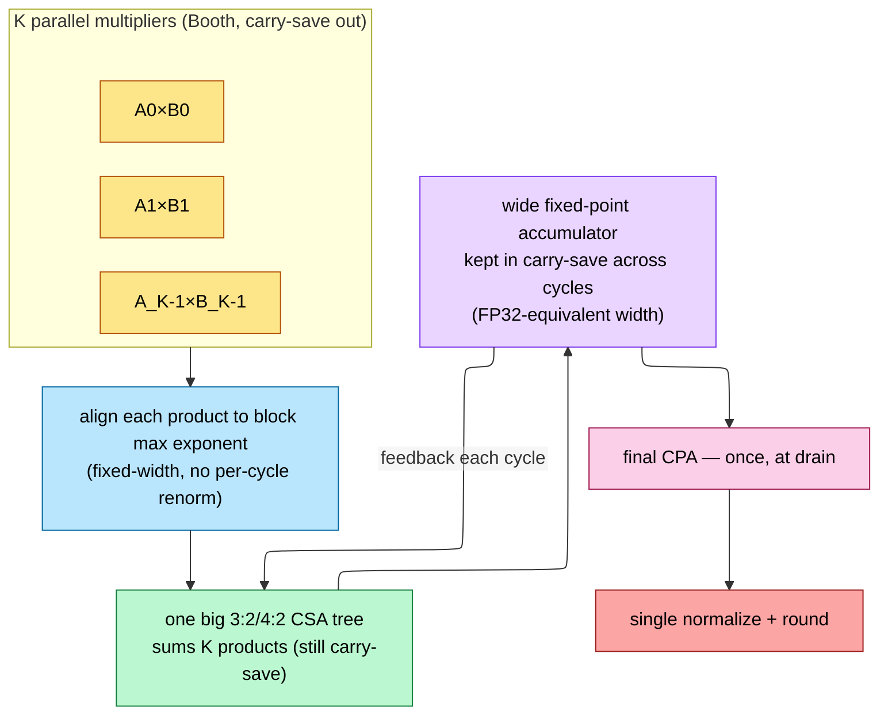

Three ideas do all the work, and they explain numbers elsewhere in this note:

1. **Wide accumulation.** The accumulator is wider than the inputs—often FP32-like or a wide fixed-point field—so more product bits survive a long reduction. Width and rounding points are architecture-specific.
2. **Carry-save reduction.** Parallel products can be compressed to two rows before a CPA. Some designs also keep accumulator feedback redundant across internal steps; others resolve at instruction boundaries.
3. **Amortized alignment/normalization.** Shared exponents or a common accumulator scale can reduce per-product work, but the exact number of shifts/rounds follows the instruction and format contract.

The MX “sum-together” optimization (§6) specializes this idea to a shared block scale. When algebra and format semantics permit factoring the common scale outside a local integer reduction, scale alignment can be amortized once per block rather than repeated per element. This is a design option to verify, not a requirement of every MX implementation.

**Why low precision is "mostly wires and accumulator."** For FP4 the mantissa multiply is a $2\times2$ array (four PP bits — trivial); for FP8 it is $4\times4$. At those widths the Booth/compressor machinery nearly vanishes and the MAC is dominated by the exponent logic, the aligners, the format MUXes (§8) and that wide shared accumulator. This is the gate-level reason throughput scales *sublinearly* as you drop bits — and why the roadmap chases packing and accumulator sharing rather than ever-smaller multipliers.

---

## 5. Why FP4 is often exposed as a 2× FP8 tier—not a universal law

Halving element width offers two independent benefits:

- a smaller significand multiplier;
- twice as many packed operands per fixed-width register, SRAM word, or interconnect beat.

Neither proves an exact chip-level throughput ratio. Accumulator width, format routing, issue bandwidth, register-file ports, clock frequency, power, and the number of physically provisioned lanes remain.

### 5.1 MAC area decomposition

$$
A_{\text{lane}}(b)
=\alpha\,p(b)^2
+A_{\text{accum}}
+A_{\text{align/round}}
+A_{\text{routing}}(b),
$$

- $b$ is encoded element width.
- $p(b)$ is explicit significand precision including the hidden bit.
- $\alpha p^2$ models partial-product/compressor cost.
- the accumulator may be shared, fixed-point, FP32-like, or instruction-dependent;
- alignment, rounding, scale decode, and multi-format muxing do not shrink as $p^2$.

For very small $p$, fixed and wiring terms dominate. That is why quartering the raw multiplier array does not quarter a complete tensor lane.

### 5.2 A transparent illustrative area calculation

Assume an illustrative—not measured—lane model:

$$
\alpha=1,\quad A_{\text{fixed}}=
A_{\text{accum}}+A_{\text{align/round}}+A_{\text{routing}}=12.
$$

With $p_{\text{FP8}}=4$ and $p_{\text{FP4}}=2$:

$$
A_8=4^2+12=28,\qquad
A_4=2^2+12=16.
$$

$$
\frac{A_8}{A_4}=1.75.
$$

The multiplier alone improved 4×; the hypothetical whole lane improved only 1.75×. Change the amount of sharing or routing and the ratio changes. Synthesis with the actual cell library and physical floorplan—not the $p^2$ slogan—produces the real number.

### 5.3 Operand-fetch and packing

FP4 packs twice as many elements as FP8 into the same number of bits. If fetch/issue is the only bottleneck, that gives a 2× ceiling:

$$
R_{\text{packing}}=\frac{8}{4}=2.
$$

But achievable throughput is bounded by the minimum provisioned resource:

$$
\frac{T_4}{T_8}
\le
\min\!\left(
R_{\text{lanes}},
R_{\text{operand bits}},
R_{\text{issue}},
R_{\text{accumulator ports}},
R_{\text{power}}
\right).
$$

Vendors often provision packed datapaths so the **published peak tier** doubles when moving FP8→FP4. That is a product allocation and ISA packing choice consistent with the 2× bit-packing opportunity; it is not a mathematical consequence that every design or workload must realize.

### 5.4 Why application speedup is usually below peak ratio

- Kernels still execute address arithmetic, loads/stores, reductions, synchronization, and non-tensor instructions.
- Conversion/scaling and packing may consume cycles or bandwidth.
- Shared-memory/register-file bank conflicts do not automatically halve.
- A memory-bound kernel may benefit from smaller operands but never reach tensor peak.
- Thermal/power limits can lower clock or active-lane count.
- The model may require wider accumulation or occasional higher-precision operations.

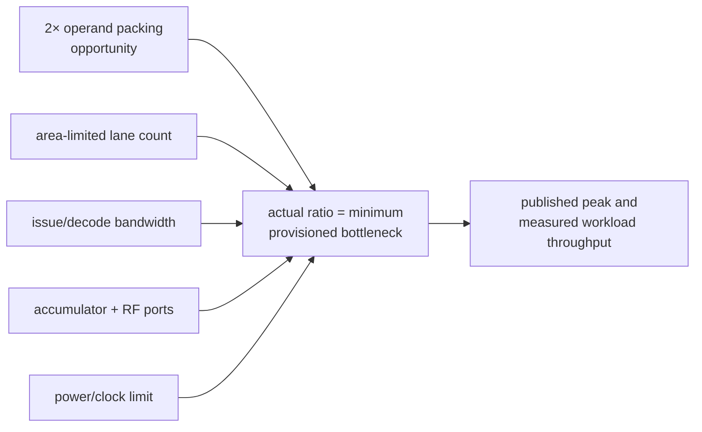

---

## 6. MX shared-scale factoring in a dot-product unit

For one MX block, write each decoded element as a block scale times a local element value:

$$
A_i=S_A\,\tilde A_i,\qquad B_i=S_B\,\tilde B_i.
$$

Then:

$$
\sum_{i=0}^{K-1}A_iB_i
=S_AS_B\sum_{i=0}^{K-1}\tilde A_i\tilde B_i.
$$

The **block scales** factor outside the local reduction. This does not mean every MX floating-point element is a plain integer: MXFP8/MXFP6/MXFP4 local values can retain their own small exponent/significand fields, and their products may still need local alignment before summation.

### 6.1 Naïve: apply scale per-element

Decode $S_A$ and $S_B$ into every lane, apply them to each product, and then align/reduce the fully scaled products. This repeats block-scale exponent arithmetic and expands scale distribution/routing across all lanes.

### 6.2 Factored implementation

1. Decode the local element formats.
2. Multiply $\tilde A_i\tilde B_i$ in each lane.
3. Align those **local products** as required by their local exponents or the chosen accumulator scale.
4. Reduce them in a wide carry-save/fixed-point accumulator.
5. Apply the combined block exponent $E_{S_A}+E_{S_B}$ once to the block result.

For MXINT, step 3 can be especially simple because local elements are integer-like. For MXFP, do not delete the local exponent/alignment logic unless the accumulator representation proves it unnecessary.

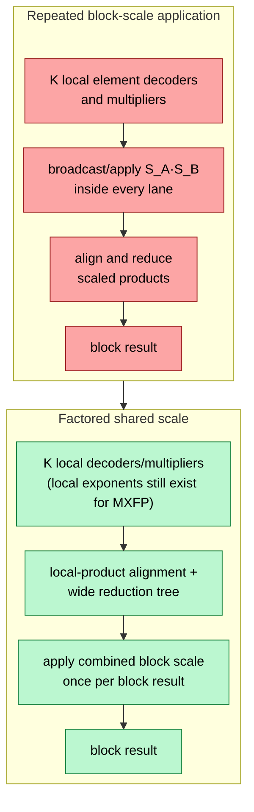

The robust saving is **amortized block-scale application and distribution**. Exact gates saved depend on the local element encoding, accumulator representation, lane count, and whether scale adjustment is already absorbed into exponent arithmetic. Claiming that all but one arbitrary alignment shifter disappears is valid only for a specific restricted datapath, not MX in general.

### 6.3 Numerical implications

Factoring is algebraically exact before rounding. Hardware equivalence additionally requires:

- enough local accumulator width that deferring the block scale does not overflow or discard bits;
- the same intended rounding boundary;
- correct alignment when partial sums from different MX blocks have different combined scales;
- defined behavior for scale NaNs/reserved encodings and local exceptional values.

Different grouping or intermediate rounding can change final bits even when the real-number algebra is identical.

---

## 7. Hardware sparsity (2:4)

NVIDIA-style structured 2:4 sparsity constrains each defined group of four weights to at most two retained values. Hardware can expose a 2× **sparse peak tier** when it is physically provisioned to consume two stored values plus metadata while advancing four logical positions. Model accuracy is not guaranteed; it depends on pruning/training and validation.

### 7.1 Memory layout

Dense row: `[A, 0, 0, B]` (4 values). Compressed: `[A, B]` + 4-bit metadata `1001`.

### 7.2 Hardware execution

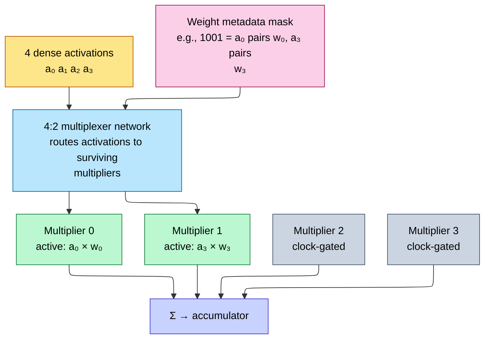

Unused lanes need **operand isolation** or clock/data gating so metadata changes do not toggle their combinational multiplier trees. Gating reduces dynamic switching; it does not remove leakage, clock-tree overhead outside the gated boundary, metadata decode, or routing energy. A 2× sparse peak requires a datapath and instruction schedule designed to advance four logical positions using two physical products in the time the dense mode handles two—not merely clock-gating two lanes.

### 7.3 Why 2:4 specifically?

- **2:4** is a practical balance among pruning freedom, compact metadata, fixed-lane routing, and dense/sparse mode sharing. Other ratios are possible and have different accuracy/compression/routing tradeoffs; there is no universal proof that 2:4 is the area optimum.
- **Metadata cost depends on encoding.** Six choices exist for exactly two positions out of four, so the information-theoretic minimum is $\lceil\log_2 6\rceil=3$ bits per group; implementations may use wider convenient encodings. Compute overhead from metadata must be counted with compressed value storage.

---

## 8. Cross-format support cost

A modern tensor core may support several floating-point, integer, and block-scaled formats. The hardware does not necessarily instantiate one completely separate datapath per format. Common implementation choices include:

- separate optimized narrow and wide pipes;
- one segmented multiplier whose sub-arrays operate independently for packed narrow values;
- shared exponent/classification/rounding blocks around replicated integer multipliers;
- mode-controlled muxes and operand isolation for unused segments.

Segmentation is not as simple as “an 11×11 array contains two independent 4×4 arrays”: sign extension, Booth grouping, compressor routing, product placement, accumulator ports, and rounding lanes must all support the packed mode. Every additional mode adds some combination of muxing, verification state, clock/power controls, and physical congestion. Quantify that overhead by synthesizing the actual mode set; a universal percentage per format is not defensible.

---

## 9. End-to-end cause / effect

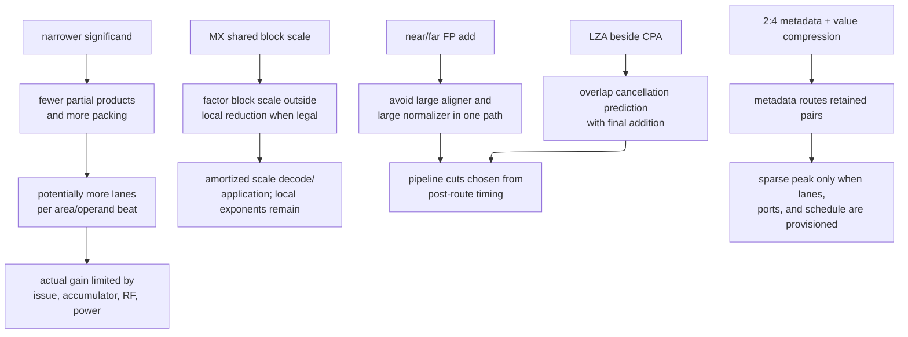

---

## 10. Floating-point divide and reciprocal

For finite nonzero operands:

$$
\frac{A}{B}
=(-1)^{S_A\oplus S_B}
\left(\frac{M_A}{M_B}\right)
2^{e_A-e_B}.
$$

Sign is one XOR; exponent is one signed subtract. The quotient of two explicit significands is the engine.

### 10.1 Front end and normalization

1. Classify operands and resolve NaN/infinity/zero cases.
2. Normalize supported subnormals.
3. Set result sign to XOR.
4. Compute an internal exponent difference with headroom.
5. Scale numerator/divisor so the divisor is in a known interval such as $[1,2)$.
6. Generate a quotient significand plus extra bits/remainder for rounding.
7. Normalize quotient, round, range-check, and pack.

If $M_A/M_B<1$, either accept a quotient in $[0.5,1)$ and normalize left once, or pre-shift the numerator and decrement the exponent. Pick one convention and make the state machine, iteration count, and round-bit positions agree.

### 10.2 Radix-2 restoring divider from one CLA

A compact divider reuses one subtractor each cycle:

```text
state: partial remainder R, quotient Q, divisor D, bit counter

R_trial = (R << 1) | next_numerator_bit
T       = R_trial - D              // CLA/subtractor
if T >= 0:
    R = T
    Q = (Q << 1) | 1
else:
    R = R_trial                    // restore via mux
    Q = (Q << 1) | 0
```

The recurrence is:

$$
R_{i+1}=2R_i-q_{i+1}D,\qquad q_{i+1}\in\{0,1\}.
$$

The subtractor carry/sign selects the mux and the quotient bit. Generate enough bits for the destination plus G/R; `R_final != 0` contributes to sticky. This architecture is small, naturally variable-latency by precision, and normally accepts no new divide until the current context finishes unless several remainder contexts are interleaved.

### 10.3 Non-restoring and radix-4 SRT

**Non-restoring** permits a signed remainder and chooses add/subtract from its sign in the next iteration, avoiding an explicit restore operation. **SRT** permits redundant quotient digits:

$$
R_{i+1}=rR_i-q_{i+1}D.
$$

For radix 4:

$$
q_{i+1}\in\{-2,-1,0,+1,+2\}.
$$

Hardware per iteration:


Redundant digits create overlapping valid regions, so the table can use truncated leading bits instead of a full-width comparison. Correctness requires a maintained remainder bound such as:

$$
|R_i|\le \rho D
$$

for the chosen redundancy factor $\rho$. Formally prove every table entry maps its input region to a legal next remainder. The Pentium FDIV incident is the canonical warning: a few missing quotient-table entries can escape ordinary random testing.

### 10.4 Reciprocal by Newton–Raphson

Normalize $B$, index a ROM with its leading fraction bits, and obtain $X_0\approx1/B$. Iterate:

$$
X_{n+1}=X_n(2-BX_n).
$$

With error $e_n=1-BX_n$:

$$
e_{n+1}=e_n^2.
$$

Thus each refinement roughly doubles correct bits. An FMA-based schedule is:

```text
t  = fma(-B, X, 1)     // accurate residual 1 - B*X
X' = fma( X, t, X)     // X + X*t
```

Then compute $Q=A X_n$. The internal precision must exceed destination precision; a final residual/correction step distinguishes adjacent rounded quotient candidates. “Two iterations” is not a format-independent rule—it depends on seed accuracy, internal precision, FMA rounding, and target error.

### 10.5 Goldschmidt division

Choose $F_0\approx1/B$ and update:

$$
N_{i+1}=N_iF_i,\qquad
D_{i+1}=D_iF_i,\qquad
F_{i+1}=2-D_{i+1}.
$$

As $D_i\to1$, $N_i\to A/B$. The numerator and denominator multiplies are independent and pipeline well, but finite-rounding errors in multiple state variables require careful guard precision. Newton is self-correcting through its explicit residual; Goldschmidt trades some of that robustness for parallelism.

### 10.6 Divide special cases

| Condition | Result | Flag |
|---|---|---|
| signaling NaN | quiet NaN | invalid |
| $0/0$ or $\infty/\infty$ | quiet NaN | invalid |
| finite nonzero / zero | signed infinity | divide-by-zero |
| zero / finite nonzero | signed zero | none |
| finite / infinity | signed zero | none |
| infinity / finite nonzero | signed infinity | none |
| finite nonzero / finite nonzero | divide engine | range/inexact as generated |

---

## 11. Square root and reciprocal square root

For positive finite $X=M2^e$, first make $e$ even:

```text
if e is odd:
    M = 2*M
    e = e-1
root exponent = e/2
```

Now only the root of a bounded significand remains.

### 11.1 Digit-by-digit root

Binary long square root consumes radicand bits in pairs. At iteration $i$:

1. shift the partial remainder left by two and append the next radicand pair;
2. form a trial divisor from the partial root, conceptually $(2Q_i+1)$ at the current weight;
3. subtract it with the shared CLA;
4. if nonnegative, keep the remainder and append root bit 1;
5. otherwise restore and append root bit 0.

This is division's shift/subtract/test/mux machine with a root-dependent trial divisor. A combined divide/sqrt block shares the remainder register, CSA/CPA, leading-bit selection, iteration counter, and final rounder while changing recurrence control.

### 11.2 Newton reciprocal square root

For $Y\approx1/\sqrt X$:

$$
Y_{n+1}
=\frac12Y_n(3-XY_n^2).
$$

One possible FMA/multiply schedule:

```text
y2 = y*y
r  = fma(-x, y2, 3)     // 3 - x*y^2
y  = 0.5 * y * r
```

The factor 0.5 is an exponent decrement. A table seed plus refinements supplies an approximate `rsqrt`; multiply by $X$ for `sqrt`. Correctly rounded square root needs additional precision and a final proof/correction. First bracket the exact root between adjacent representable values $z_\text{lo}$ and $z_\text{hi}$:

$$
z_\text{lo}^2\le X < z_\text{hi}^2.
$$

For RNE, compare $X$ with the exact squared midpoint

$$
\left(\frac{z_\text{lo}+z_\text{hi}}{2}\right)^2
$$

and use the even significand on an exact tie. Other rounding modes select from the same bracket using sign/direction rules.

### 11.3 Root special cases

| Input | `sqrt` result | Flag |
|---|---|---|
| $+0$ | $+0$ | none |
| $-0$ | $-0$ in IEEE-style arithmetic | none |
| positive finite | computed root | inexact if applicable |
| $+\infty$ | $+\infty$ | none |
| negative finite nonzero or $-\infty$ | quiet NaN | invalid |
| signaling NaN | quiet NaN | invalid |

Approximate `rsqrt` instructions may define different FTZ, error, and special-value behavior. Keep that contract separate from a correctly rounded `sqrt`.

---

## 12. Conversions, comparisons, min/max, and simple functions

### 12.1 Integer → floating point

1. Save sign; take absolute magnitude using invert-plus-one for a negative integer.
2. Leading-zero-count the magnitude.
3. Highest-one position becomes the unbiased exponent.
4. Shift that one into the hidden-bit position.
5. If more than $p$ bits remain, form GRS and round.
6. Repair a rounding carry, rebias exponent, and pack.

All integers with magnitude below $2^p$ are exactly representable. Wider magnitudes can be inexact even without overflow.

### 12.2 Floating point → integer

1. Classify NaN/infinity and select the ISA's invalid result.
2. Compare exponent with zero and the destination integer width.
3. Shift the significand left or right to place the binary point.
4. Build discarded-bit information and round according to the instruction mode.
5. Apply sign.
6. detect signed/unsigned overflow and select the specified saturation/indefinite behavior.

Boundary tests must include `INT_MAX±fraction`, `INT_MIN±fraction`, half-integers for every rounding mode, both zeros, NaNs, and infinities.

### 12.3 FP format conversion

- Widening binary formats is exact for finite values: rebias exponent and append fraction zeros.
- Narrowing is a full FP rounding/range operation.
- A source subnormal can become a destination normal, zero, or subnormal depending on formats.
- NaN payload/quiet-bit conversion follows the architecture's profile.
- Widen→operate→narrow can double-round; native destination-format FMA may differ by an ULP.

### 12.4 Comparison logic

After NaN/zero handling:

```text
if signs differ: negative < positive
else if both positive: compare {exponent, fraction} unsigned
else: reverse the unsigned magnitude comparison
```

`+0 == -0`. A NaN is unordered for ordinary numeric comparison. Signaling and quiet comparison instructions differ in when invalid is raised. `min`/`max` also need explicit NaN and signed-zero rules; do not infer them from a generic comparator/mux.

### 12.5 Cheap sign functions

`abs`, `neg`, and `copySign` can be bit-field operations, but their signaling-NaN behavior comes from the ISA definition. `classify` is a direct exposure of the §1.1.1 reduction logic. Round-to-integral operations reuse exponent inspection, shifting, GRS, and the round increment without changing format.

---

## 13. Elementary and activation-function hardware

Reciprocal, `rsqrt`, exponentials, logarithms, trigonometric functions, `tanh`, sigmoid, GELU, and erf are usually implemented by:

$$
\boxed{\text{range reduce}\ \rightarrow\ \text{approximate on a small interval}\ \rightarrow\ \text{reconstruct}}
$$

### 13.1 Range reduction

| Function | Reduction | Cheap reconstruction |
|---|---|---|
| $2^x$ | $x=k+f$ | add integer $k$ to exponent |
| $e^x$ | $x=k\ln2+r$ | multiply by $2^k$ through exponent |
| $\log_2x$ | $x=M2^e$ | add extracted integer $e$ |
| $\sin/\cos$ | quadrant and $r=x-k\pi/2$ | quadrant-controlled swap/sign |
| $\tanh$ | odd symmetry; clamp large $|x|$ | restore sign/saturation |
| sigmoid | $\sigma(-x)=1-\sigma(x)$; clamp tails | complement negative side |

Huge trigonometric inputs require a high-precision reducer such as Payne–Hanek. A destination-width subtraction of a large multiple of $\pi/2$ can cancel away every meaningful remainder bit before the polynomial even starts.

### 13.2 Polynomial datapath

For reduced $r$, use a minimax polynomial:

$$
P(r)=c_0+r(c_1+r(c_2+\cdots)).
$$

**Horner** needs one dependent FMA per degree and minimal hardware. **Estrin** evaluates groups in parallel:

$$
P(r)=(c_0+c_1r)+(c_2+c_3r)r^2+\cdots
$$

which reduces dependency depth at the cost of more simultaneous multipliers and powers of $r$. Coefficients are quantized constants; their quantization error belongs in the error budget.

### 13.3 Table plus interpolation

Split the reduced argument:

```text
r = {index bits, interpolation bits, discarded tail}
```

The index reads base value and optional slope/curvature from ROM. A linear or quadratic interpolator uses narrow multipliers/FMAs:

$$
f(r_0+\delta)\approx
T_0[r_0]+\delta T_1[r_0]+\delta^2T_2[r_0].
$$

More address bits increase table area but shrink each segment; higher polynomial degree saves table entries but adds arithmetic and latency. ROM contents, segment boundaries, and coefficient quantization are part of the RTL deliverable and verification database.

### 13.4 CORDIC

CORDIC chooses micro-angles with:

$$
\tan\alpha_i=2^{-i},
$$

so rotations use only add/subtract and shifts:

$$
x_{i+1}=x_i-d_i y_i2^{-i},\quad
y_{i+1}=y_i+d_i x_i2^{-i},\quad
z_{i+1}=z_i-d_i\alpha_i.
$$

It produces roughly one additional accuracy bit per iteration and needs a known gain correction. CORDIC is attractive when multipliers are scarce or a single iterative engine must support several circular/hyperbolic functions; an AI accelerator with abundant FMA lanes often prefers tables/polynomials.

### 13.5 Accuracy contract

Choose explicitly:

- correctly rounded;
- faithful (one of the adjacent representable values);
- maximum ULP/relative/absolute error;
- monotonicity;
- special-value/domain behavior;
- subnormal/FTZ policy.

An approximate ISA operation and a correctly rounded operation are different products. NVIDIA PTX, for example, names several operations with an explicit `.approx` contract. The compiler, framework, and model-quality tests must know which contract the RTL implements.

---

## 14. FPU integration, control, and verification

### 14.1 Shared shell and execution engines

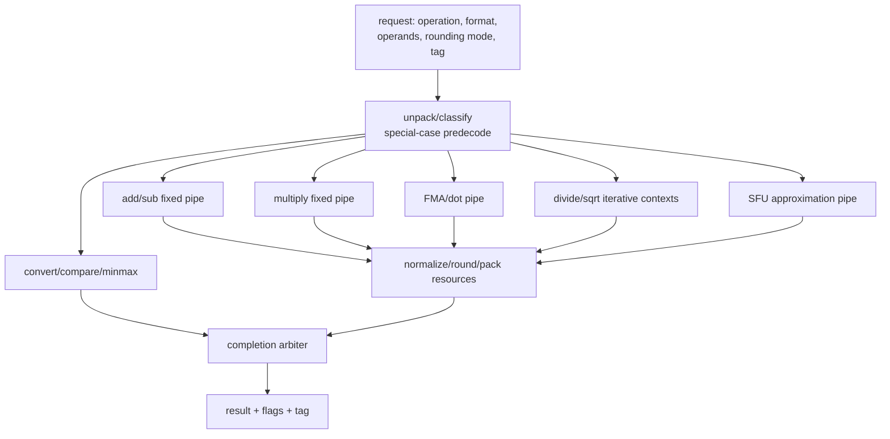

Every register/context must carry operation, format, rounding mode, class bits, pending flags, destination tag, valid, and kill/flush state. For example, a fixed pipeline might have latency 4 and initiation interval 1, while a simple iterative divider might have latency 20 and initiation interval 20; interleaved contexts can improve the latter's throughput. These are illustrative parameters, not format constants. Latency and initiation interval are not synonyms.

If several producers share one rounder, prove the completion arbiter has buffering for simultaneous finishes. Otherwise an arithmetically correct unit can drop a result under contention.

### 14.2 Verification matrix

Use an independent bit-exact reference such as Berkeley SoftFloat/TestFloat or HardFloat's test infrastructure. Cross:

- all operand classes and signs;
- all supported rounding modes;
- exact/inexact;
- exponent gaps near 0, 1, $p$, $p+1$, and saturation;
- cancellation lengths 0 through $p$;
- exact ties with retained LSB 0/1;
- normal/subnormal and maximum-finite/infinity boundaries;
- FMA invalid precedence and fused-cancellation cases;
- divider selection-table boundaries and nonzero remainder;
- values adjacent to perfect squares;
- conversion integer limits and half-integers;
- SFU segment boundaries and error extrema;
- stalls, flushes, reset, simultaneous completions, and backpressure.

### 14.3 Assertions and formal targets

- accepted request = retired + live + killed;
- transaction tag/mode/format never separate from data;
- exactly one result class is selected;
- sticky is the OR of all discarded information;
- GRS zero implies no round increment;
- RNE ties leave retained LSB even;
- FMA has one architectural rounding boundary;
- SRT remainder invariant holds for every digit-table entry;
- iterative contexts cannot be overwritten;
- SFU symmetry/monotonicity and specified error bound hold;
- no special-case bypass toggles an unneeded high-power array when operand isolation is enabled.

Exhaustively prove a tiny format such as exponent width 4 and precision 4. Small-format proof exposes normalization, signed-zero, tie, table, and flag bugs that are structurally identical at FP32 width.

---

## 15. Numbers and rules to remember

| Quantity | Value | Why |
|---|---|---|
| Multiplier area scaling | $O(M^2)$ | Partial products = $M^2$ |
| Wallace tree depth | approximately $\log_{1.5}(N/2)$ | idealized 3:2 row-height reduction; schedule columns exactly |
| Multiplier delay | library/layout dependent | use logical depth for architecture; use STA for time |
| FMA pipeline depth | target dependent | partition multiply/align/resolve/normalize/round to meet STA |
| FP4 / FP8 packing opportunity | 2× elements per bit budget | actual throughput is bottleneck/provision dependent |
| MX block size K | 32 (OCP) or 16 (NVIDIA NVFP4) | Element block |
| MX shared-exponent width | 8 b (E8M0) | Block scale |
| MXFP4 amortized bits/element | 4.25 | $32\cdot 4 + 8 = 136$ b / 32 |
| LZA prediction error | commonly designed for at most a small correction | exact bound depends on LZA formulation; assert/correct it |
| 2:4 sparse peak opportunity | up to 2× logical positions/product count | requires compressed storage, metadata routing, provisioned lanes, and acceptable accuracy |
| Exactly-two-of-four metadata minimum | 3 bits/group | $\lceil\log_2{6}\rceil$; implementations may use wider encodings |
| Multi-format overhead | design dependent | mode muxes, segmentation, rounding lanes, verification, and routing |
| Accumulator cost | often dominant at narrow input widths | width/sharing/rounding boundary are architecture-specific |
| Radix-4 Booth PP rows | $\lceil (M{+}1)/2\rceil$ | ~half of naïve $M$ rows |
| 4:2 compressor timing | cell/topology dependent | avoid a horizontal full-width carry chain; characterize mapped cell |
| Example 13-row reduction | $13\to7\to4\to2$ | three idealized compressor stages before CPA |
| High-speed FP adder option | dual-path (near/far) | avoids serial large align and large normalize shifts |
| Rounder timing repair | compound sum/sum+1 or injected constant | avoids a serial second CPA; mapping is topology-dependent |
| FO4 | normalized logic-delay metric | picoseconds require a characterized PVT/load |
| Tensor accumulation | wide reduction, often carry-save internally | exact accumulator width and rounding boundary follow the ISA |

---

## 16. References

**Foundational arithmetic**
- Parhami, *Computer Arithmetic: Algorithms and Hardware Designs*, 2nd ed. — Booth recoding, Wallace/Dadda, compressors, CPA topology, LZA.
- Ercegovac & Lang, *Digital Arithmetic*. — dual-path FP adder, FMA design patterns.
- Muller et al., *Handbook of Floating-Point Arithmetic*, 2nd ed. — near/far adders, rounding (guard/round/sticky, injection), LZA correctness.
- A. D. Booth, "A Signed Binary Multiplication Technique," *Q. J. Mech. Appl. Math.*, 1951 — origin of Booth recoding.
- Weste & Harris, *CMOS VLSI Design*, 4th ed. — 4:2 compressors, parallel-prefix adders, FO4 methodology, standard-cell datapaths.

**Standards**
- IEEE, [*Standard for Floating-Point Arithmetic (IEEE 754-2019)*](https://standards.ieee.org/ieee/754/6210/).
- Open Compute Project, [*Microscaling Formats (MX) Specification v1.0*](https://www.opencompute.org/documents/ocp-microscaling-formats-mx-v1-0-spec-final-pdf).
- RISC-V International, [*“F” Extension for Single-Precision Floating-Point*](https://docs.riscv.org/reference/isa/unpriv/f-st-ext.html) and [*Zfa Additional Floating-Point Instructions*](https://docs.riscv.org/reference/isa/unpriv/zfa.html).
- NVIDIA, [*PTX ISA Floating-Point Instructions*](https://docs.nvidia.com/cuda/parallel-thread-execution/index.html) — rounded and explicitly approximate operations.

**Open reference implementations**
- John Hauser, [*Berkeley HardFloat Verilog Modules*](https://www.jhauser.us/arithmetic/HardFloat-1/doc/HardFloat-Verilog.html) — recoded/raw forms; add, multiply, FMA, divide/sqrt, conversion, comparison, rounding.
- John Hauser, [*Berkeley TestFloat/SoftFloat*](https://www.jhauser.us/arithmetic/) — bit-exact reference and randomized differential testing.
- OpenHW Group, [*FPnew / CVFPU*](https://github.com/openhwgroup/cvfpu) — parameterized multi-format transprecision FPU integration.

**Recent**
- Rouhani et al., *Microscaling Data Formats for Deep Learning*, arXiv 2310.10537.
- Sun et al., *Hybrid 8-bit Floating Point Training for Deep Neural Networks*, NeurIPS 2019 (origin of E4M3 / E5M2 split).
- Kuzmin et al., *FP8 Quantization: The Power of the Exponent*, NeurIPS 2022.

---

**Up the stack:** [Systolic_Arrays_and_Dataflow](03_Systolic_Arrays_and_Dataflow.md) → [Digital_Design_For_AI](04_Digital_Design_For_AI.md) → [L3 Microarchitecture](../L3_Microarchitecture/00_Index.md).
**Down the stack:** [On_Chip_Memory_Hardware](01_On_Chip_Memory_Hardware.md).
