# Digital Design for AI — Pipelining, CDC, DMA/TMA, and Interconnects

> **Layer:** L2 (integration page).
> **Prerequisites:** [On_Chip_Memory_Hardware](01_On_Chip_Memory_Hardware.md), [FP_Unit_Design](02_FP_Unit_Design.md), [Systolic_Arrays_and_Dataflow](03_Systolic_Arrays_and_Dataflow.md). RTL fluency (FFs, FSMs, FIFOs).
> **Hands off to:** [L3 Microarchitecture](../L3_Microarchitecture/00_Index.md) — where these patterns become SMs, ISAs, and rooflines.

---

## 0. Where this page sits

The previous three L2 pages gave you the *building blocks*: memory cells, FP units, and dataflow patterns. This page is about **how those blocks are wired into a working chip** at the synthesizable RTL level. Specifically:

1. Pipelining and timing closure ($f_{\max}$ derivations, FO4 budget).
2. Clock-domain crossing (CDC), which becomes mandatory at multi-die scale.
3. Async copy engines (TMA-style) — the magic that decouples HBM latency from compute.
4. Network-on-chip (NoC) topology and routing math.
5. Clock and power gating — the only way to keep TDP within thermal budget.
6. Verification reality: why formal tools work for arithmetic but fail for FSM interactions, why errata exists.

Read the prior three L2 pages first; this one assumes them.

---

## 1. Pipelining and timing closure

### 1.1 The fundamental clock-period equation

For a synchronous pipeline stage, the minimum clock period is

$$
T_{\text{clk}} \;\ge\; t_{c\to q} + t_{\text{logic}} + t_{\text{setup}} + t_{\text{skew}}
$$

- $t_{c\to q}$: clock-to-Q delay of the source flip-flop, typically 30–60 ps at TSMC N4.
- $t_{\text{logic}}$: combinational delay through the stage's logic (the variable you control).
- $t_{\text{setup}}$: setup time of the destination flip-flop, ~30–50 ps.
- $t_{\text{skew}}$: clock-distribution skew between source and destination clocks, ~20–60 ps depending on clock-tree quality.

Total flip-flop overhead is usually budgeted at **~100 ps**. At a 2 GHz target ($T_{\text{clk}} = 500$ ps), the usable logic budget is **~400 ps**.

### 1.2 The FO4 unit

Process-independent timing reasoning uses **FO4** — the delay of an inverter driving four identical inverters. Key process-node FO4s:

| Node | FO4 (ps) |
|---|---|
| TSMC N7 | ~10 |
| TSMC N5 | ~7 |
| TSMC N4P | ~6 |
| TSMC N3E | ~5 |
| TSMC N2 (proj.) | ~4.2 |

A 400 ps logic budget at N4 = ~67 FO4 of usable depth. This is why combinational structures with deep paths (24-bit CPA, FP32 alignment shifter) must be pipelined into multiple stages.

### 1.3 Pipelining a deep MAC

A purely combinational FP32 FMA exceeds 50 FO4 (multiply tree + alignment + CPA + LZA + normalize + round). At N4 (~6 ps/FO4), that's ~300 ps — already past the 400 ps logic budget at 2 GHz, with no margin for variation.

Solution: pipeline. For a 5-stage pipeline:

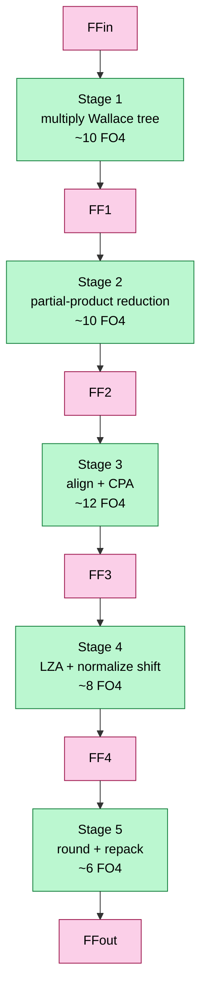

Each stage now has ~10 FO4 of logic + 4 FO4 of FF overhead = ~14 FO4 ≈ 84 ps at N4 — well under the 500 ps budget at 2 GHz. Cost: 5-cycle execution latency per FMA. The warp scheduler must issue independent FMAs to keep the pipeline full (covered in [L3 GPU_Architecture](../L3_Microarchitecture/00_Index.md)).

### 1.4 The pipeline-vs-area tradeoff

Each pipeline boundary inserts $\sim 24 \cdot N_{\text{bits}}$ flip-flops (sum + carry vectors at FP32 = 50 bits → ~1 200 FFs per boundary). At ~10 NAND2-equivalent area per FF, a 5-stage FMA carries ~6 000 NAND2 of pipeline overhead — already comparable to the multiplier itself. Pipelining beyond ~6 stages costs more area than the combinational logic it splits up. This is the practical ceiling: **you can't just keep pipelining to push $f_{\max}$ higher**.

---

---

## 1b. Timing closure in practice — hold, clock trees, and signoff corners

§1.1 gave *one* timing constraint. Real closure has a second one, a clock-distribution problem, and a signoff step across a dozen corners — the parts that actually consume a physical-design team's year.

### 1b.1 The other constraint: hold time

The setup (max-delay) equation says the *slowest* path must fit in a cycle. Its twin, the **hold (min-delay)** constraint, says the *fastest* path must not race through and corrupt the capture flop in the **same** edge:

$$
t_{c\to q}^{\min} + t_{\text{logic}}^{\min} \;\ge\; t_{\text{hold}} + t_{\text{skew}}
$$

Two facts make hold the scarier of the pair:

- **It is frequency-independent.** You cannot fix a hold violation by slowing the clock — a hold failure is a race between data and clock at *one* edge. A chip that fails hold is simply broken at any frequency.
- **It fails on short/fast paths at the *fast* corner** (opposite of setup, which fails on long paths at the slow corner). The fix is to *add* delay — insert buffers ("hold-fixing padding") on the offending fast paths. A modern block can spend a few percent of its cells purely on hold buffers, and positive clock skew toward the capture flop directly eats hold margin.

### 1b.2 The clock tree (CTS)

A 2 GHz edge has to arrive at millions of flip-flops with minimal **skew** (spatial arrival mismatch) and **jitter** (cycle-to-cycle temporal wander). The distribution network is built by **clock-tree synthesis (CTS)**, which inserts balanced buffers so every leaf sees nearly the same **insertion delay** (root-to-leaf latency, tens of ps to >100 ps):

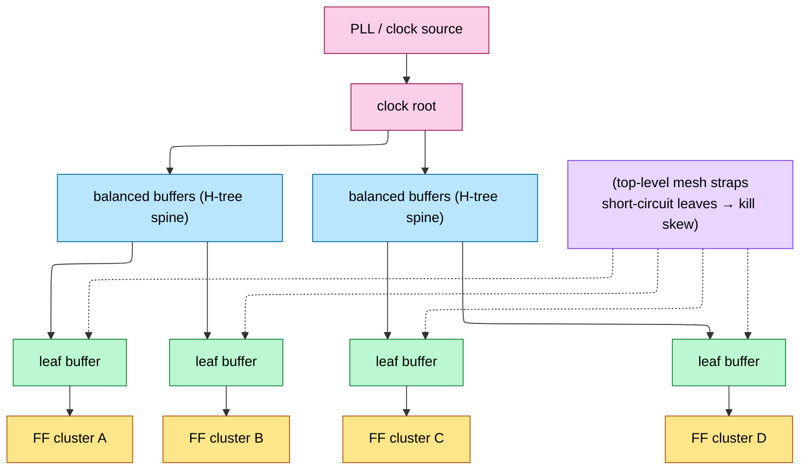

- **H-tree**: a balanced binary tree — naturally low skew, moderate power.
- **Clock mesh/grid**: straps that short the leaves together — near-zero skew but high power (the whole mesh switches every cycle). Frontier CPUs/GPUs use a mesh on the top level for the tightest skew.
- The clock network alone burns **~30% of dynamic power** — which is exactly why clock gating (§5.1) targets it first.

### 1b.3 Useful skew, time borrowing, and retiming

Zero skew is not actually optimal. **Useful skew** *deliberately* delays a capture clock to hand a too-slow stage some of the next stage's slack (clock-skew scheduling). Latch-based pipelines do the analog automatically — **time borrowing**, where a transparent latch lets a fast stage lend slack to a slow neighbor. And **retiming** (Leiserson–Saxe) moves registers *across* combinational logic without changing what the circuit computes — like re-spacing mile-markers so no single stretch is too long — so synthesis can even out the lumpy FMA stages of §1.3 (if stage 3 is the slow one, push a register earlier to hand it some of stage 2's time). These three levers win the last 10–15% of $f_{\max}$ after raw pipelining runs out.

### 1b.4 Signoff: multi-corner, multi-mode (MCMM)

You never close timing *once*. Silicon must work across **process** (slow/typical/fast — SS/TT/FF), **voltage** (Vmin…Vmax), **temperature** (−40 … 125 °C), and RC-extraction corners — the **MCMM** matrix. The rules of thumb:

- **Setup signs off at the slow corner**, **hold at the fast corner** — you must pass *both* simultaneously.
- **Temperature inversion**: at the low voltages AI chips run (§L0), cells get *slower when cold*, inverting the classic assumption — so both temperature extremes must be checked for *both* setup and hold.
- **On-chip variation (OCV)**: even on *one* die, no two transistors are identical (Pelgrom mismatch, dopant fluctuation), so two "identical" gates run at slightly different speeds. Signoff **derates** (pads) path delays to cover this — flat margins (OCV), distance/depth-aware margins (AOCV = *advanced* OCV), or statistical ones (POCV = *parametric* OCV). Advanced nodes use POCV because a flat guard-band at N3 would throw away too much frequency.

"The chip runs at 2 GHz" really means "it closes timing across ~a dozen corners with OCV derating and still has margin." That gap between a single-corner number and signoff is where months go.

## 2. Clock-domain crossing (CDC)

### 2.1 The mesochronous problem

A multi-die GPU (e.g., B200 with two dies bridged by NV-HBI) runs both dies at nominally 2 GHz. But:

- Each die has its own PLL, so frequencies match to ±100 ppm but phase relationship is unknown.
- Voltage droop, thermal drift, and routing delay over the 5–10 mm bridge introduce sub-cycle phase wandering.
- Time-of-flight across the bridge is ~50 ps — already 25% of a 2 GHz cycle.

Sending data across this boundary requires explicit synchronization. **Mesochronous** = same nominal frequency, unknown drifting phase. Sub-classes:

- **Synchronous:** same clock signal physically distributed → trivial.
- **Mesochronous:** same frequency, fixed phase offset → easy (delay-line tune).
- **Plesiochronous:** very-close-but-not-equal frequencies → needs occasional FIFO drain.
- **Asynchronous:** unrelated frequencies → expensive synchronizers.

NV-HBI is mesochronous-with-phase-drift; the receiver needs phase tracking but not full-blown async sync.

### 2.2 The phase interpolator + elastic FIFO

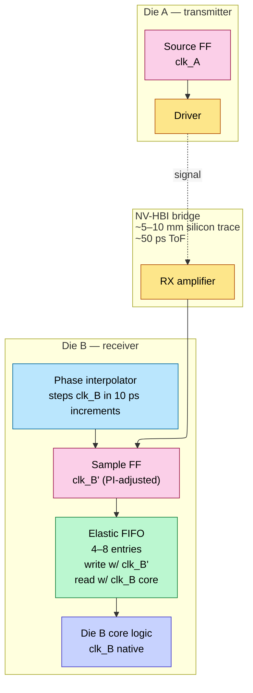

How it works:

1. **Phase interpolator (PI):** a mixed-signal block that mixes two phase-shifted clocks (e.g., 0° and 90°) in continuous proportion to produce an arbitrary phase $\phi \in [0, 360°)$. Resolution typically 16–64 phase steps per cycle.
2. **Per-pin training:** at boot, a pseudo-random pattern is sent. The receiver sweeps the PI across phase, sampling each setting and measuring bit-error rate (BER). The sweep finds the *phase that centers the eye*.
3. **Elastic FIFO:** writes occur on the PI-adjusted sample clock; reads occur on the receiver's native core clock. The FIFO depth (4–8 entries) absorbs the small phase drift between the two clocks during runtime.

### 2.3 CDC latency cost

Each CDC adds 2–4 cycles (PI + FIFO traverse). For a B200 with NV-HBI between two dies, a memory access from die A to die B's HBM pays:

$$
\text{cross-die latency} \;\approx\; \underbrace{\text{NV-HBI traverse}}_{\sim 4\text{ cyc}} \;+\; \underbrace{\text{die-B local path}}_{\sim 2\text{ cyc}} \;+\; \underbrace{\text{HBM access}}_{300\text{ cyc}}
\;\approx\; 306\text{ cyc}
$$

vs ~302 cycles on the local die. <2% latency penalty. This is why NVIDIA can claim "single GPU" coherency on B200 — the CDC is engineered to be invisible to software at typical access granularity.

### 2.4 True async CDC: the synchronizer chain

When two clock domains have *unrelated* frequencies (e.g., a peripheral clock domain at 200 MHz vs core at 2 GHz), simple PI + FIFO doesn't help. You need a **multi-flop synchronizer**:

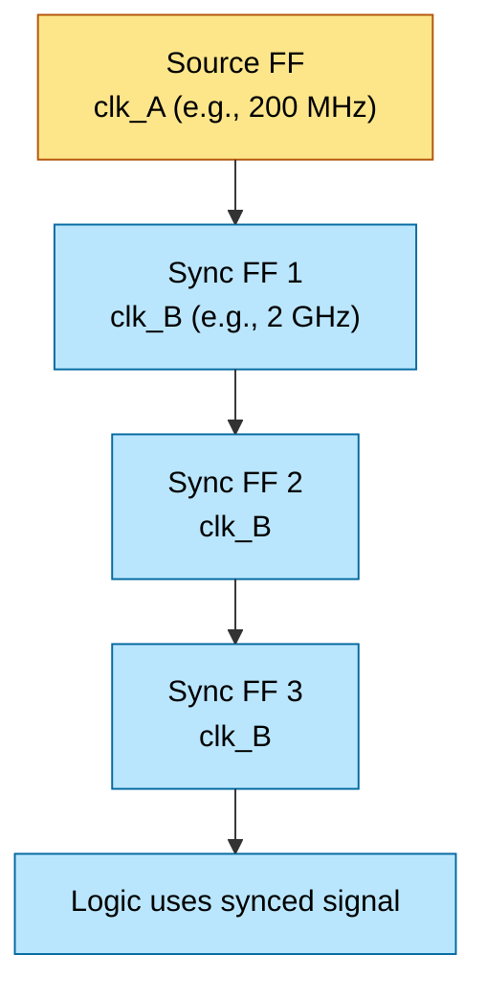

The reason for multiple stages: when clk_A's edge arrives within the metastability window of SYNC1, SYNC1's output may oscillate (metastability) for several picoseconds. Each subsequent stage gives metastability more time to resolve. **Mean Time Between Failure (MTBF):**

$$
\text{MTBF} \;\propto\; \frac{1}{T_{\text{clk}}} \cdot \exp\!\left(\frac{N \cdot T_{\text{slack}}}{\tau}\right)
$$

where $N$ is the number of sync stages, $T_{\text{slack}}$ is the time per stage minus FF setup, and $\tau$ is a process-dependent metastability time constant (~10–30 ps). 3 stages typically gives MTBF > 10⁹ years. The multi-flop synchronizer is the single most important RTL pattern in chip-multi-clock-domain design.

---

## 3. Async copy engines (TMA pattern)

### 3.1 First separate three kinds of “DMA”

All three move data without a thread executing one load/store per word, but their software contracts and hardware placement differ:

| Engine | Example use | Command source | Typical endpoints |
|---|---|---|---|
| host/device copy engine | `cudaMemcpyAsync`, storage/network transfer | runtime/driver queue | host memory, peer GPU, HBM |
| conventional on-chip DMA | firmware descriptor ring | CPU or command processor | SRAM, DRAM, peripherals |
| SM async/tensor copy engine | PTX bulk/tensor async copy (TMA family) | one CUDA thread/warp in a kernel | global memory ↔ shared/cluster memory |

The first two are autonomous device-level masters. The third is part of the GPU execution machinery: a kernel launches a copy, hardware performs multidimensional address generation and data movement, and an async-group or memory barrier communicates completion back to participating threads. NVIDIA documentation deliberately calls TMA operations **bulk-asynchronous copies** and notes that they must not be confused with CPU↔GPU asynchronous copies.

### 3.2 Why an SM copy engine exists

In the classical path, a warp cooperatively loads a tile:

```cuda
int lane = threadIdx.x & 31;
for (int i = lane; i < tile_elements; i += 32)
    smem[i] = global[base + layout(i)];
__syncthreads();
```

This consumes:

- instruction issue slots for address arithmetic, loads, and stores;
- 32 per-thread address/data paths even when the access pattern is regular;
- load-store queue and scoreboard entries;
- registers for pointers, loop counters, and temporary data;
- explicit layout/swizzle instructions;
- a full-block synchronization step.

A tensor copy engine replaces that instruction stream with a compact descriptor plus a launch. The savings are workload- and implementation-dependent; there is no universal “2-cycle command” or fixed speedup. The architectural advantage is fewer issued instructions and less address/register traffic while the copy overlaps independent work.

### 3.3 Hardware hierarchy and state

The precise proprietary placement is generation-specific. A reconstructable representative design is:

```mermaid
%%{init: {"flowchart": {"defaultRenderer": "elk", "nodeSpacing": 45, "rankSpacing": 45, "htmlLabels": false}}}%%
flowchart LR
    subgraph SW["Software-visible state"]
        TD["Tensor-map descriptor<br/>base, rank, extents, strides,<br/>element size, swizzle, OOB policy"]
        INS["PTX/SASS bulk-copy launch<br/>coordinates, direction, barrier"]
    end
    subgraph SM["SM-side hardware"]
        DEC["Instruction decode<br/>scope and completion mode"]
        CQ["Copy command queue<br/>context, barrier, bytes expected"]
        AGU["Nested-loop AGUs<br/>bounds + address generation"]
        SPL["Segment/coalesce unit<br/>alignment, sectors, boundaries"]
        OT["Outstanding-tag table<br/>offset, length, epoch"]
        DB["Data/reorder buffers<br/>byte valid + transform state"]
        SWZ["Format/swizzle/OOB unit"]
        SP["Shared-memory crossbar<br/>banks and write/read ports"]
        MB["mbarrier / async-group<br/>transaction accounting"]
    end
    subgraph MEM["Global-memory path"]
        NI["SM memory network interface"]
        L2["Distributed L2 slices"]
        MC["Memory controllers"]
        HBM["HBM"]
    end
    TD --> DEC
    INS --> DEC --> CQ --> AGU --> SPL --> OT --> NI
    NI <--> L2 <--> MC <--> HBM
    NI --> DB --> SWZ --> SP
    OT --> MB
    SP --> MB
```

A command-queue entry needs at least:

```text
issuing context/CTA and reset epoch
descriptor snapshot or stable descriptor reference
tensor coordinates and copy direction
source/destination address spaces
total and remaining transaction bytes
completion kind: mbarrier or async group
barrier address/phase and expected-byte contribution
outstanding request bitmap/count
fault/poison status
```

The descriptor encodes a logical tensor, while the instruction supplies tile coordinates. For dimension indices $i_0,\ldots,i_{n-1}$, the generic byte address is

$$
A=base+\sum_{d=0}^{n-1} i_d\,stride_d.
$$

Hardware nested-loop counters generate the addresses, split them at supported boundaries, coalesce contiguous sectors, and attach each request to the destination tile offset. Address arithmetic must be widened so overflow is detected before truncation.

### 3.4 From one command to many memory transactions

For a 2D tile with `x_bytes=64`, `y_count=16`, and `global_stride=256`, the engine generates:

```text
row 0: global base +   0  -> shared tile +   0
row 1: global base + 256  -> shared tile +  64
...
row15: global base +3840  -> shared tile + 960
```

Each row may split again because of cache-sector, page, interconnect-packet, or alignment limits. Responses can return out of order. The outstanding table therefore maps response tag → command, row, byte offset, length, and epoch. Returned bytes enter data buffers, pass through optional swizzle/format logic, and then request shared-memory banks.

The engine must reserve data-buffer space **before** issuing a read. Otherwise global-memory responses can fill every buffer while shared memory is backpressured, creating a deadlock that also prevents unrelated requests from draining.

For shared→global copies, the direction reverses: shared-memory reads feed global write requests. Completion must distinguish “the engine has finished reading shared memory, so software may reuse that buffer” from “the global writes are visible to later observers.” PTX exposes completion mechanisms appropriate to each operation; kernel code must use the documented one rather than assume kernel issue order is sufficient.

### 3.5 Swizzle, out-of-bounds, and shared-memory banks

The transform block can:

- map a multidimensional logical tile into a bank-friendly shared-memory layout;
- permute low-order address bits (swizzle) to reduce systematic bank conflicts;
- fill or suppress out-of-bounds elements according to the instruction contract;
- expand/pack supported element representations;
- multicast a global tile into distributed shared memory when supported.

Swizzle does not “remove” bank conflicts for every later access. It chooses a mapping intended to make a specified tensor access pattern distribute across banks. The consumer's lane-to-element mapping still matters.

Every destination beat carries byte-valid metadata. A partial first/last beat must not overwrite neighboring shared-memory bytes. Conflicting writes from ordinary threads and the async engine are a data race unless software establishes the required proxy ordering.

### 3.6 The crucial ordering rule: async work is another proxy

The initiating CUDA thread and the asynchronous copy engine are distinct memory actors. NVIDIA's model describes relevant TMA/tensor operations as an **async proxy**. Ordinary loads/stores use the generic proxy. A barrier can report transaction completion, but proxy fences are required at documented handoff points so the two proxies agree on visibility.

The global→shared pattern is:

1. initialize the shared-memory barrier;
2. make barrier initialization visible to the async proxy;
3. launch the bulk/tensor copy and add its expected byte count;
4. other participating threads arrive;
5. wait for the barrier phase to complete;
6. only then read the shared tile with ordinary thread instructions.

For shared→global reuse:

1. finish ordinary thread writes to the shared tile;
2. use the required generic↔async proxy fence and thread synchronization;
3. launch the bulk copy;
4. wait until the async operation has finished **reading** shared memory;
5. only then let threads overwrite that shared buffer.

```mermaid
sequenceDiagram
    participant P as Producer threads (generic proxy)
    participant B as Shared mbarrier
    participant T as Tensor copy engine (async proxy)
    participant C as Consumer threads
    P->>B: initialize barrier
    P->>T: proxy fence makes initialization visible
    P->>T: launch copy; register expected bytes
    T->>T: generate addresses and move sectors
    T->>B: decrement transaction bytes as data arrives
    C->>B: arrive and wait for phase
    B-->>C: phase complete
    C->>C: safely consume shared tile
```

`__syncthreads()` is a thread barrier; a PTX/CUDA memory fence orders memory; an `mbarrier` also tracks asynchronous transaction completion; a proxy fence orders actors using different access mechanisms. They solve related but non-interchangeable problems.

### 3.7 Double buffering as a hardware/software pipeline

With two shared-memory stages, software assigns ownership:

```text
stage 0: async engine filling tile k+1
stage 1: tensor core consuming tile k
```

After the consumer finishes stage 1 and the producer's copy into stage 0 completes, roles rotate. A correct state machine per stage is:

```text
FREE -> COPY_IN_FLIGHT -> READY_FOR_COMPUTE
     -> COMPUTE_IN_FLIGHT -> SAFE_TO_REUSE -> FREE
```

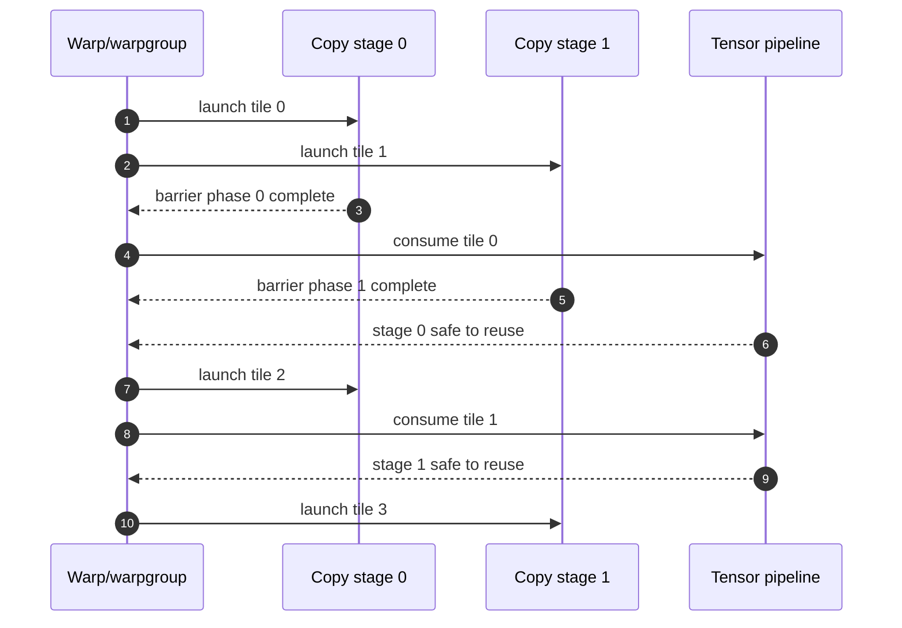

The number of stages is a resource trade-off:

$$
T_{tile}\approx\max(T_{copy}/S,\ T_{compute})
$$

only when $S$ buffered stages plus outstanding capacity cover copy latency and the memory/SMEM ports sustain the rate. More stages consume shared memory, barrier state, copy queue entries, and registers; beyond latency coverage they reduce occupancy without improving throughput.

### 3.8 Conventional DMA inside an accelerator

Device-level copy engines use the same core mechanisms at larger scope:

```mermaid
flowchart LR
    RING["Runtime/driver command ring"] --> DF["Descriptor fetch + validation"]
    DF --> CS["Channel scheduler"]
    CS --> AG["1D/2D/scatter-gather AGU"]
    AG --> VM["GMMU/IOMMU translation<br/>requester/process identity"]
    VM --> RD["Read issue + reorder"]
    RD --> NOC["GPU NoC / PCIe / peer fabric"]
    NOC --> BUF["Data buffers + width/alignment"]
    BUF --> WR["Write issue + response tracking"]
    WR --> NOC
    WR --> CP["Ordered completion record<br/>interrupt/event"]
```

The descriptor ring uses release/doorbell/acquire rules just like any producer-consumer queue. The engine must split at translation and protocol boundaries, retain exact progress across recoverable page faults, and publish completion only after destination writes reach the promised visibility point. Coherent and noncoherent host/peer paths need different cache-maintenance and ordering contracts.

To sustain $B$ bytes/s across round-trip latency $L$, data in flight must be at least $BL$. At 100 GB/s and 300 ns, about 30 KiB must be outstanding. Request IDs, read-return buffers, write buffers, and NoC credits must all support that amount; sizing just one of them does not deliver bandwidth.

### 3.9 What to verify and count

Assertions and scoreboards:

- every accepted source byte reaches exactly its descriptor-selected destination byte once;
- no request is issued without reserved response/data capacity;
- response tags and reset epochs cannot alias;
- barrier bytes cannot reach zero before all corresponding destination writes complete;
- a stage cannot transition to compute-ready before the required proxy/transaction completion;
- shared-buffer reuse cannot precede the documented read-completion point;
- descriptor bounds, address overflow, alignment, and out-of-bounds behavior are exact;
- faults, aborts, and retries cannot duplicate visible writes.

Counters: command queue depth, generated sectors per command, useful/fabric-byte ratio, outstanding transactions, global and shared-port stalls, bank conflicts, translation hit/miss/fault, barrier wait, proxy-fence wait, copy/compute overlap, and stage occupancy. Those counters distinguish a poor tensor layout from insufficient outstanding state or a saturated memory network.

---

## 4. Interconnect hardware — on-die NoC to inter-chip fabrics

### 4.1 Why the GPU needs several interconnects

A modern GPU is not one flat network. It commonly has:

- an SM-local crossbar connecting operand collectors, LSU ports, shared-memory banks, and L1;
- cluster-level paths among neighboring SMs or distributed shared memory;
- a global request/data network from SM clusters and copy engines to distributed L2 slices;
- response networks returning fills and acknowledgements;
- coherence/control paths for invalidation, atomics, page-table, interrupt, and system traffic;
- off-die links to HBM controllers, peer GPUs, CPU/PCIe/CXL, or another die.

Public architecture diagrams expose only some of these boundaries. The hierarchy below is a **design model**, not a claim about one vendor's undisclosed router count:

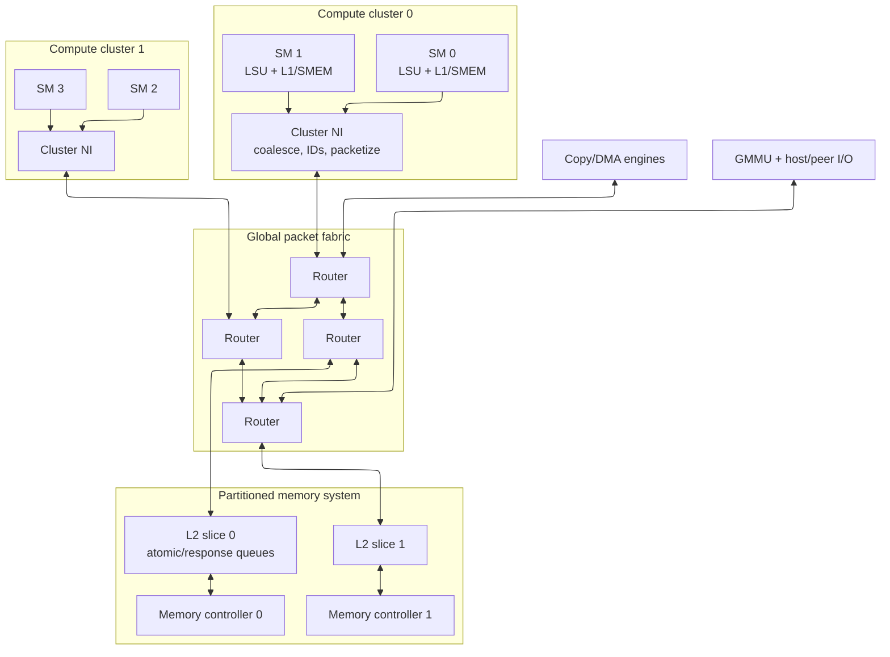

A monolithic all-to-all crossbar gives low hop count, but mux/arbiter complexity and global wiring grow rapidly with ports and width. Rings and meshes replace global wires with repeated local links and routers. Hierarchical hybrids match physical clusters and memory partitions but add queues/order boundaries.

### 4.2 The network interface: transactions become packets

The SM LSU produces memory transactions: address sectors, operation, byte mask, warp/context identity, cache policy, scope, and ordering semantics. The network interface:

1. checks/adopts the destination L2 slice or home;
2. allocates/remaps a globally unique transaction ID;
3. associates an ordering domain and sequence where required;
4. packetizes request/data into flow-control units (**flits**);
5. selects a virtual network and virtual channel;
6. reserves credits and injects;
7. reassembles responses and routes each sector to the correct MSHR/warp;
8. maps poison, faults, retries, and reset epochs.

A representative head flit carries destination, source/return route, transaction ID, operation, address, length, traffic class, ordering/scope attributes, packet length, and error/epoch bits. Body flits carry data and byte validity; a tail releases packet-held routing state.

Coalescing happens before or at the NI: active warp lanes that touch the same cache sector become one transaction. The return metadata still records which byte/word feeds each lane. The NoC transports transactions; it does not know CUDA thread semantics.

### 4.3 Router datapath in hardware

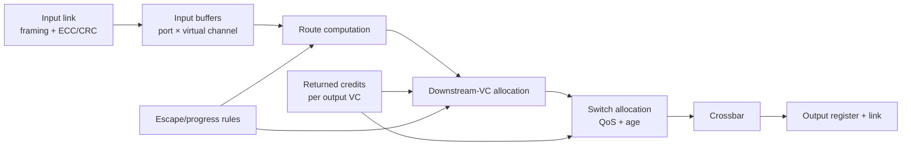

Per input VC, RTL stores:

```text
read/write pointers and occupancy
head/body/tail state
decoded candidate output ports
allocated downstream VC
packet transaction/epoch identity
QoS class and age
error/poison state
```

The head flit computes a route and reserves a downstream VC. Each cycle, ready input VCs request physical output ports; switch arbitration grants at most one input per output (and normally at most the allowed speedup per input). Body/tail flits follow the reservation. The tail releases it.

Physical pipelines vary. Route computation, VC allocation, switch allocation, crossbar traversal, and link traversal may occupy separate cycles, combine speculatively, or be bypassed when empty. It is therefore misleading to assign a universal cycles-per-hop number to a commercial GPU.

### 4.4 Credit flow control

If the downstream VC has depth $D$, upstream starts with $D$ credits after reset/epoch synchronization. Sending a flit consumes one; freeing the downstream slot returns one. For a clearly chosen boundary:

$$
C_{available}+F_{in\ flight}+S_{occupied}=D.
$$

Returning a credit too early can overwrite a full buffer. Losing one permanently reduces capacity and may deadlock. Long pipelined links need enough buffering to cover the delay before backpressure/credits return.

An NI must reserve response or data-buffer capacity before issuing traffic whose response cannot be refused. This is especially important for TMA/DMA: allowing reads to fill every return buffer while shared-memory/global-write destinations are blocked can create a cyclic wait.

### 4.5 Topology, routing, and traffic cuts

| Topology | Strength | Weakness | Good fit |
|---|---|---|---|
| crossbar | one logical hop | global wires and arbitration scale poorly | small local cluster |
| ring | compact router ports | distance and cut bottlenecks | moderate clustered fabric |
| 2D mesh | regular physical replication | multi-hop latency, bisection limits | many tiles |
| tree/fat tree | hierarchical aggregation | shared ancestors, placement | clustered endpoints |
| hierarchical hybrid | follows floorplan | boundary queues/order | large GPUs/accelerators |

For link payload width $w$, clock $f$, and useful utilization $\eta$,

$$B_{link}=wf\eta.$$

But aggregate injection bandwidth is irrelevant if a bisection or one L2/DRAM partition saturates. Given source–destination traffic $D_{sd}$ and route indicator $R_{sd,l}$, load on link $l$ is

$$L_l=\sum_{s,d}D_{sd}R_{sd,l}.$$

Route tensor addresses across L2 slices so common strides use multiple partitions; otherwise many SMs can camp on one slice even while the rest of the fabric is idle.

Deterministic dimension-order routing is easy to prove. Adaptive routing can avoid congestion but may reorder packets and needs a guaranteed acyclic escape path. Ordered domains may use pinned routes or destination reorder buffers.

### 4.6 Virtual channels are for progress, not extra wire bandwidth

Virtual channels share one physical link but have independent buffer/reservation state. They reduce head-of-line blocking and can break dependency cycles. They do **not** multiply link bandwidth.

Draw a channel-dependency graph. A node is a buffer/VC class; edge `A→B` means a transaction can hold A while requesting B. Coherent GPU traffic might include:

```text
request -> home/L2 entry
home entry -> invalidate/probe
probe -> acknowledgement/writeback
response -> SM ejection/MSHR
```

If requests consume all storage required for responses or probes that release those requests, the machine can freeze. Separate virtual networks, reserved response/probe slots, and an acyclic escape VC are structural solutions. Merely adding arbitrary VCs is not a proof.

Progress extends into endpoints: L2 miss queues, atomic queues, DMA buffers, GMMU walkers, and SM response queues belong in the same dependency analysis. Router-level deadlock freedom cannot fix a target controller that holds a request while waiting for a response buffer occupied by that same class.

### 4.7 GPU memory ordering and atomics cross the NoC

The NoC may reorder unrelated transactions. Correctness is reconstructed by:

- per-address serialization at the owning L2/home slice;
- per-scope/domain sequence tracking where the ISA requires order;
- fence packets or acknowledgement ledgers that wait for prior traffic's ordering points;
- response reordering at the NI;
- separate device/system routes for operations whose scope extends beyond the GPU.

A global atomic can be implemented by acquiring exclusive cache ownership at the requester or by executing in an L2/home atomic unit. In either case, one serialization point must return the old value and apply the update exactly once. A retry must distinguish “never executed” from “executed but response lost.”

A release store cannot publish its flag packet until selected earlier writes reach the required GPU/system ordering point. An acquire load cannot allow younger dependent observations to become irrevocable before the acquire response. The warp scheduler and LSU may speculate, but the NI/L2 completion state must support validation or replay. Section 6 of [ISA and Execution Model](../L3_Microarchitecture/01_ISA_and_Execution_Model.md) connects these hardware events to CUDA/PTX.

### 4.8 Latency and throughput model

For a packet of $F$ flits across $H$ unloaded wormhole hops:

$$
L\approx L_{source\ NI}+H L_{head-hop}+(F-1)+L_{destination\ NI}+L_{target}.
$$

Under load add queueing at injection, every allocator, ejection, and the L2/DRAM target. The `F-1` term is serialization behind the head. A cache miss's user-visible latency also includes TLB/GMMU, L2 lookup, memory-controller scheduling, HBM, fill, and warp wakeup—NoC traversal is only one component.

Average utilization near 100% causes steep queueing. Design with headroom against realistic bursts and hot spots, then report latency percentiles, not only average bandwidth.

### 4.9 QoS, multicast, reset, and verification

GPU traffic classes include demand loads, writebacks, atomics, page walks, TMA/DMA, display/real-time traffic, coherence/control, interrupts, and debug. QoS requires:

- source admission/outstanding caps;
- class mapping that cannot be forged across security contexts;
- byte- or flit-aware weighted service;
- age promotion/starvation bounds;
- reserved progress resources for control/response traffic;
- matching policy at L2 and memory controllers.

Probe, TLB-invalidation, cluster-shared, and control traffic may multicast. Replicate at branch routers to save link bandwidth, while tracking every branch so one blocked output cannot corrupt or duplicate another.

Reset/power transitions stop injection, drain or terminate outstanding traffic, exchange epochs, restore credit counts, and reject late old-epoch flits. Initializing credit counters at one end before the downstream buffers are ready is a silicon bring-up bug.

Core assertions:

```text
credit is always between zero and buffer depth
send implies positive prior credit
one output has at most one granted input per transfer slot
no flit is created, lost, duplicated, or misrouted
head/body/tail and downstream-VC reservation are consistent
ordered-domain sequence is not released out of order
every admitted packet eventually ejects or reports an error under fairness assumptions
```

Test single-router exhaustively where practical, then multi-router backpressure, hot spots, all source/destination pairs, protocol causal cycles, adaptive routes, TMA/DMA saturation, atomics, multicast, faults, clock ratios, power/reset epochs, and link errors. Count per-VC occupancy, credit starvation, allocator loss, hop/queue/serialization latency, link/cut utilization, endpoint backpressure, class service, reorders, retries, and timeouts.

### 4.10 The path does not end at the die edge

An inter-chip operation traverses two on-die networks plus boundary hardware:

```mermaid
flowchart LR
    subgraph GA["GPU/accelerator A"]
        SM["SM/TMA/DMA"] --> NIA["NoC NI<br/>coalesce, ID, order"]
        NIA --> PA["Inter-chip protocol adapter<br/>remote read/write/atomic/message"]
        PA --> LLA["Link layer<br/>VC, credit, sequence, CRC/replay"]
        LLA --> PHYA["PHY<br/>gearbox, lanes, FEC, training"]
    end
    PHYA <--> MED["Package traces, PCB/cable,<br/>retimer, or switch fabric"]
    subgraph GB["GPU/accelerator B"]
        PHYB["PHY"] --> LLB["Link layer<br/>integrity + duplicate suppression"]
        LLB --> PB["Remote protection +<br/>protocol reconstruction"]
        PB --> NIB["Destination NoC NI"]
        NIB --> L2B["L2/home/atomic/memory<br/>or collective engine"]
    end
    MED <--> PHYB
    L2B -. "response/completion path" .-> SM
```

The stages answer different questions:

- **NoC:** how does a transaction reach the local boundary?
- **protocol adapter:** what remote operation and memory semantics does it mean?
- **link layer:** did the adjacent endpoint receive the encoded packet exactly once?
- **PHY:** can bits cross this electrical/optical channel?
- **switch fabric:** which remote chip/partition is the destination?
- **destination home/memory:** when is the operation ordered and visible?

A link ACK is not a CUDA event, remote memory fence, or atomic completion. It only retires hop-local replay state.

### 4.11 Inter-chip endpoint state

A scale-up endpoint resembles a NoC NI plus an IOMMU, reliable link, and remote completion engine:

```text
source GPU/context/process and remote destination
local virtual pointer -> remote accelerator/address handle
permissions, key/partition, cache/coherence attributes
operation, size, byte mask, atomic operand
scope and acquire/release/SC ordering state
end-to-end transaction/sequence ID
chosen route, plane, and packet/chunk sequence
outstanding response/beat bitmap
hop-local link sequence and immutable retry copy
VC credits, timeout, poison/error, reset epoch
```

Transaction ID and link sequence are not interchangeable. The transaction ID survives switches and completes one remote operation. Each hop's link sequence only detects/replays corrupt or missing units on that hop.

The address path also changes. A remote-memory API first exports an allocation, grants another process/device access, and creates a mapping such as:

```text
local virtual range -> {destination accelerator,
                        remote address/handle,
                        permissions,
                        mapping generation}
```

The source MMU/GMMU recognizes that the address is remote and routes it to the scale-up endpoint. The destination validates source identity and generation before admitting the request. Revocation waits for old operations or changes the generation so a stale packet cannot touch reallocated memory.

### 4.12 PHY choices: package-parallel versus long-reach SerDes

| Property | Same-package die-to-die | Board/rack serial link |
|---|---|---|
| lanes | many wide parallel wires | fewer high-rate SerDes lanes |
| clock | often forwarded clock | clock/data recovery or embedded clock |
| channel | short package/interposer | PCB, connector, copper/optical cable, retimer |
| main cost | bumps and die-edge “beachfront” | serializer/equalizer/FEC power and latency |
| repair | spare lanes/down-width | lane repair, retimer, down-rate/down-width |

Transmit hardware can include gearbox/serializer, lane striping, scrambling, FEC, pre-emphasis/FFE, and driver. Receive hardware includes termination, CDR or forwarded-clock capture, CTLE/DFE, deserializer, FEC, alignment-marker detection, lane deskew FIFOs, and integrity checks.

PAM4 carries two bits per symbol but has three decision thresholds and less noise margin than NRZ, so it needs stronger equalization/coding. FEC can correct common channel errors; CRC detects residual corruption; link replay retransmits a unit that remains bad. These are complementary layers.

Report:

$$
B_{one-way}=N_{lanes}R_{lane}
\eta_{mod/encoding}\eta_{FEC}\eta_{flit}
\eta_{protocol}\eta_{retry}.
$$

Every efficiency factor multiplies the raw rate. Direction matters: adding TX and RX produces a “bidirectional” marketing number that a one-way tensor transfer cannot use.

For chiplets, also report

$$
B_{edge-density}=\frac{B_{one-way}}{\text{millimeters of die edge}},
$$

because bump rows, power/ground, keepout, and PHY macros limit how much link can physically fit.

### 4.13 Reliable link protocol and bring-up

The transmitter maintains `next_seq`, `oldest_unacked`, a replay buffer, credits per VC, and an epoch. The receiver maintains expected/accepted sequence state and returns:

- an **ACK** when a unit was received with valid integrity, allowing retry storage to retire;
- a **credit** when a receive slot is free, allowing new traffic.

Returning a credit with the ACK is only safe if the buffer really became reusable. Otherwise a legal burst can overwrite live data.

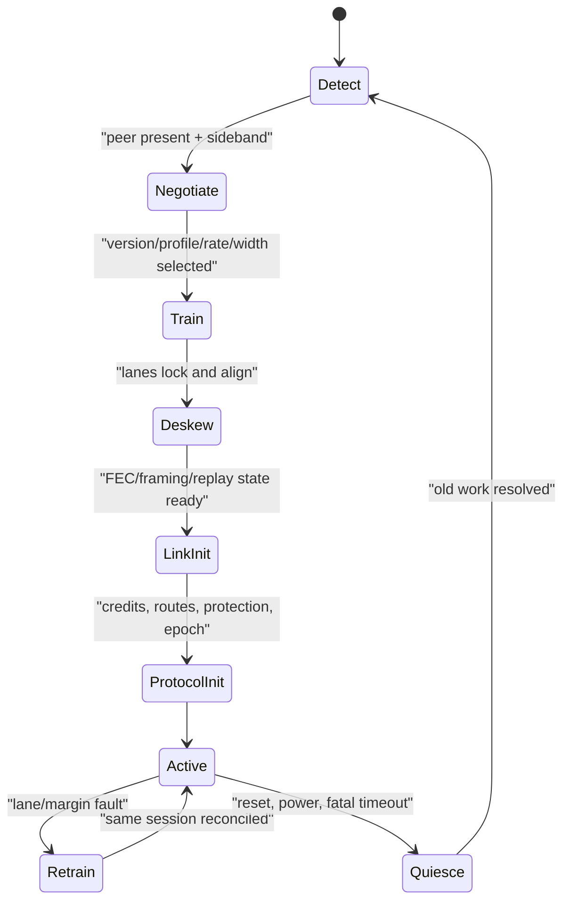

Lane fallback changes serialization latency, bandwidth-delay product, and timeouts. Hardware/firmware must update scheduling and advertised performance after negotiation.

### 4.14 Protocol families and what they actually promise

| Family | Boundary/use | Main operations | Coherence model |
|---|---|---|---|
| UCIe-class D2D | chiplets in one package | mapped PCIe/CXL or streaming/raw protocol | whatever mapped protocol defines |
| PCIe | host/device I/O | configuration, DMA, messages, atomics where supported | ordinarily noncoherent DMA |
| CXL | host/device memory/cache | `.io`, `.cache`, `.mem` | explicit host/home coherent roles |
| proprietary accelerator scale-up | GPU/accelerator peers and switches | peer loads/stores, atomics, DMA, collectives | vendor/version-specific |
| UALink | open accelerator scale-up | remote reads, writes, atomics, DMA | I/O-coherent destination-node contract; software coherence across accelerator caches |
| InfiniBand/RoCE/UEC-class | scale-out networking | messages and RDMA | software/message ownership, not shared cache coherence |

Memory semantics do **not** automatically mean all remote accelerator caches snoop each other. UALink 1.0 deliberately uses software coherence across accelerators while providing remote memory operations and destination system-node I/O-coherency behavior. CXL instead names host/device coherence roles; UCIe can carry CXL but does not itself invent CXL semantics. Proprietary NVLink/Infinity-class guarantees must be read from the product/platform contract rather than inferred from bandwidth.

This distinction decides the software sequence:

```text
hardware-coherent path:
    release remote write -> acquire remote read/atomic

software-coherent peer path:
    producer finishes local writes
    producer flushes/orders data to the exported domain
    remote operation or signal is issued
    consumer waits/acquires
    consumer invalidates stale cached copies if the contract requires
    consumer uses data
```

### 4.15 Switch fabric, routing, and collective offload

A scale-up switch contains ingress PHY/link endpoints, route/partition lookup, per-class buffers, a crossbar or multistage fabric, egress endpoints, and management/telemetry. Several switches may form leaf/spine stages or parallel planes.

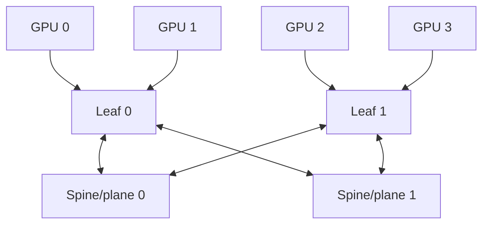

The sum of GPU port rates is not the delivered all-to-all bandwidth. Map the traffic matrix through routes and evaluate every cut. A fabric is nonblocking only for a defined simultaneous traffic set; large systems can deliberately oversubscribe and rely on software placement/scheduling.

Packet striping across planes improves utilization but can reorder. Either pin an ordered flow to one route or carry chunk/sequence metadata and reorder at the endpoint. On failure, reroute cannot let an old-path packet arrive after a new-path completion without epoch/sequence handling.

Collective offload adds reduction/multicast engines to switches. A reduction context stores team/group, collective generation, datatype/op, chunk offset, expected contributor bitmap/count, partial accumulator, output tree, and timeout/error. It reduces network bytes but uses finite switch state and supports only provisioned operations/formats.

### 4.16 Worked remote atomic

GPU A executes a release-qualified fetch-add in GPU B memory:

1. A's ordering ledger waits for selected earlier stores.
2. GMMU mapping chooses destination B and validates remote-atomic permission.
3. endpoint allocates transaction `T90`, selects route/plane, and packetizes;
4. every hop uses its own CRC/sequence/replay state;
5. B validates the request and sends it through B's NoC to the owning L2/home atomic queue;
6. the queue serializes the address, reads `old`, writes `old+operand` exactly once, and responds with `old`;
7. A matches `T90`, applies acquire-side ordering if requested, writes the destination register, and wakes the warp.

If the request was never accepted, retry is safe. If B updated memory but the response was lost, issuing a fresh add is unsafe. End-to-end duplicate suppression or a protocol recovery state must establish performed versus not performed.

### 4.17 Sizing and verification

For end-to-end response or credit latency $L$ and target one-way bandwidth $B$:

$$W_{outstanding}\ge BL.$$

At 200 GB/s and 500 ns, about 100 KB must be in flight. Request IDs, replay buffers, switch credits, destination queues, and response buffers must all cover the window; the smallest stage limits throughput.

Verify and count:

- address import/export, protection, generation revocation, and process isolation;
- all rate/width/lane-repair states, deskew, FEC, CRC, replay, and sequence wrap;
- ACK versus credit conservation and immutable retry copies;
- no lost/duplicate/misrouted transaction through multipath or reset;
- remote write/atomic exactly-once and acquire/release ordering;
- coherent versus software-coherent cache ownership sequences;
- bisection, congestion, QoS, reroute, and head-of-line blocking;
- collective group/generation separation, missing member, and switch reset;
- link margin, corrected/uncorrected error, useful/raw bytes, retry traffic, VC occupancy, path latency, remote atomic queues, and retrain/down-width time.

---

## 5. Clock and power gating

### 5.1 Clock gating

Dynamic power $P = \alpha C V^2 f$. Idle logic with no useful work to do still toggles internal nodes if its clock keeps running. Solution: insert an AND gate (or, in modern flows, a dedicated **integrated clock gating cell** ICG) that masks the clock when the logic is unused.

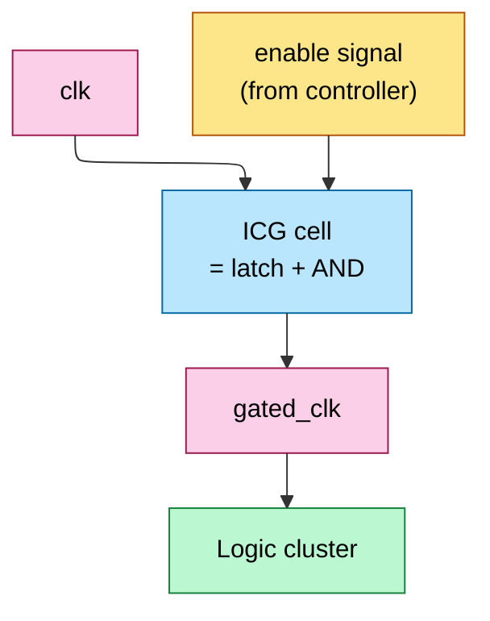

When EN is low, GCLK doesn't toggle → flip-flops in the cluster don't update → no internal switching. Saves the *clock-tree* portion of dynamic power (which is itself ~30% of total dynamic power on a frontier accelerator) plus the FF and combinational power downstream.

The latch in the ICG cell is critical: it prevents glitches on EN from creating spurious clock edges — a glitch through a plain AND gate would clock the entire cluster mid-cycle, corrupting state.

### 5.2 Power gating

For deeper savings, *cut the supply rail* to an idle block via a header switch (PMOS pass transistor). Eliminates leakage as well as dynamic. Cost:

- Header switch area: ~5% of the gated block.
- Wakeup time: ~10s of cycles to charge the rail back up (deep-trench-cap recharge rate limits).
- State loss: gated FFs lose their state — must save to retention FFs or to L2 before powering off.

GPU SMs use coarse-grain power gating: when fewer than N warps are active, idle SMs are fully powered off until the kernel scales up. Wakeup cost is amortized over the kernel runtime.

### 5.3 DVFS — dynamic voltage and frequency scaling

The chip can drop $V_{dd}$ when it doesn't need peak frequency. Power scales as $V^2 f$, and at fixed $f$ you can lower $V$ by ~50–100 mV before timing fails. Saves ~25% of dynamic power for free during memory-bound phases.

Modern GPUs DVFS at sub-millisecond granularity, with ~10 distinct V/f operating points selected by the on-die power-management controller (PMU) responding to telemetry from MAC utilization counters.

---

---

## 5b. The physical-design flow

Everything above is RTL and cells; turning that into a mask set is the **physical-design (PD) / place-and-route** flow. A chip-design student should know its shape because every earlier constraint (SRAM macros, datapath regularity, the power grid that fights the voltage droop of L0) lands here.

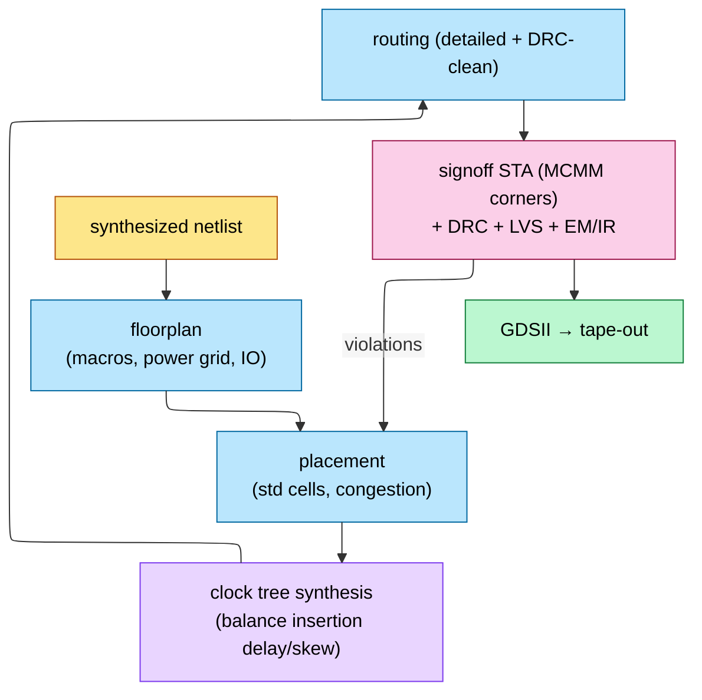

1. **Floorplan.** Place the big hard macros first — the SRAM banks (§2b), HBM PHYs, NoC routers — then define the **power delivery network (PDN)** and I/O. For an AI die this step is macro-dominated: SMEM/RF/L2 arrays are most of the area, and the PDN must deliver ~1 kW without the IR-drop / $L\,di/dt$ droop that L0 warns about.
2. **Placement.** Standard cells are placed under simultaneous timing- and congestion-driven optimization. Regular datapaths (the multiplier arrays, the systolic PEs) are often **structured/relationally placed** by hand or datapath tools so the bit-slice regularity of §FP survives into silicon.
3. **CTS** (§1b.2) builds the balanced clock network.
4. **Routing.** Detailed routing over a dozen-plus metal layers, DRC-clean, honoring the same wire-dominated reality that made 4:2 compressors and Booth attractive in the first place.
5. **Signoff.** MCMM STA (§1b.4) **plus** DRC (design rules), LVS (layout-vs-schematic), and **EM/IR** (electromigration + IR-drop on the PDN). Violations loop back into placement/routing. Only a clean signoff yields **GDSII** for tape-out.

The reticle limit (~858 mm²) caps a single die here — which is precisely why the biggest accelerators go multi-die and pay the CDC cost of §2 (and the packaging cost of L1).

## 6. Verification reality

### 6.1 Why exhaustive simulation fails

A single FP MAC has $2^{64}$ possible input combinations. At 1 ns per simulated FMA, exhaustive testing takes $2^{64} \cdot 10^{-9}$ s ≈ 585 years. Multiply by hundreds of thousands of MACs and millions of FSM states — *totally* infeasible.

### 6.2 Formal verification

Mathematical proof (SAT/SMT solvers) checks logical properties:

- "For all inputs A, B with A=0, the multiplier output is exactly 0."
- "For all sequences, no two threads write to the same RF entry in the same cycle."
- "The wgmma issue FSM never enters the deadlock state where READY and ACK are both stuck low."

Formal scales to ~10^7 state-space exploration; large enough to verify isolated arithmetic blocks (multipliers, adders) and small FSMs but not entire SMs.

### 6.3 Coverage-driven simulation (UVM)

For larger blocks, randomized testing with coverage tracking. Stimulus generators randomize input streams; coverage points (FSM state visits, edge cases, corner-case interactions) are tracked. Test ends when coverage closes, not when "no bug found".

Typical bring-up campaign: 10⁹–10¹² simulated cycles per major block, taking 6+ months on a server farm.

### 6.4 Errata: where verification fails

State-space explosion masks deep corner-case bugs in *interacting* FSMs. Examples that have shipped:

- Hopper TMA + wgmma + interrupt corner case → silent NaN.
- AMD MI250 inter-XCD coherency violation under specific atomics ordering → data race.
- TPU v4 SparseCore matmul truncation under specific batch shapes → silent wrong answer.

When found, vendors release **errata** documents and driver-level workarounds. AI researchers occasionally hit "non-deterministic NaNs on specific matrix sizes" — usually an undocumented erratum being sloppily masked.

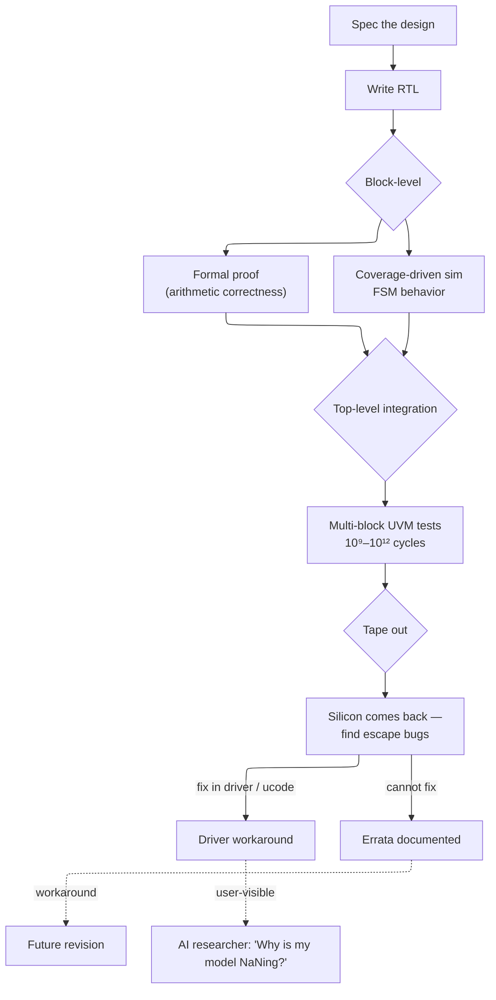

---

## 7. RAS for AI Accelerators

RAS = **Reliability, Availability, Serviceability**. At rack scale, a single GPU failure rate of ~0.1% per month means a 72-GPU NVL72 pod expects a GPU failure roughly every 2 weeks. RAS features are the hardware and firmware mechanisms that keep the cluster productive despite component failures.

### 7.1 ECC in datapaths

SRAM arrays throughout the accelerator (SMEM, register file, L2 slices) are protected by **SECDED** — Single Error Correction, Double Error Detection — typically using a Hamming code (e.g., 72-bit codeword = 64 data bits + 8 check bits).

- **Area overhead**: ~6.25% for 64-bit data (8 check bits / 128 total with ECC).
- **Behavior on single-bit error**: hardware transparently corrects the bit in-line; no pipeline stall, no software notification required.
- **Behavior on double-bit error**: uncorrectable; raises a machine-check interrupt. The driver must decide whether to kill the workload or attempt recovery.

HBM uses a two-layer protection scheme:
- **On-die ECC**: per-HBM-chip, transparent to the GPU. Each HBM DRAM chip stores extra check bits alongside data; single-bit errors within the DRAM chip are corrected before the data leaves the HBM package.
- **Link-level CRC**: data in transit across the HBM PHY is protected by a CRC that detects multi-bit transmission errors (caused by EMI, voltage droop, or clock jitter on the PHY). CRC failure triggers a link-level retry.

### 7.2 NoC error detection

The on-chip NoC (Section 4) carries flits (flow-control units) between SMs, L2 slices, and HBM controllers. Error detection is applied at the flit level:

- **Parity on flit headers**: a single parity bit covers the routing, virtual-channel, and control fields. Header parity failure indicates a routing or arbitration error.
- **ECC on flit payload**: SECDED protection on the data payload, matching the L2/SRAM ECC scheme.
- **Credit-based flow control with timeout-based deadlock detection**: each VC maintains a credit counter. If credits are not returned within a timeout window (typically ~1 us), the NoC raises a deadlock alert. This catches both hardware routing bugs and software-induced protocol deadlocks.

### 7.3 Hardware scrubbers

Soft errors (cosmic-ray-induced bit flips) accumulate in SRAM arrays over time. At the error rates typical of frontier silicon (~100–400 FIT per Mb), a 50 MB L2 cache expects ~0.5–2 soft errors per day. **Background ECC scrubbers** scan SRAM arrays during idle cycles, reading each location, checking ECC, and correcting single-bit errors before they accumulate into uncorrectable double-bit errors. Scrubbing rate is typically one full scan every 1–10 seconds.

### 7.4 RAS implications for rack-scale

At production scale, RAS is not optional — it is a survival requirement:

- **Single GPU failure rate**: ~0.1% per month in production (based on Google and Meta fleet data). For a 72-GPU NVL72 pod, this translates to an expected GPU failure every ~2 weeks.
- **NVL72 fault containment**: the rack-level interconnect must handle single-GPU failures without killing the entire job. Two strategies: (a) **checkpoint-restart** — periodically snapshot model state to shared storage; on failure, restart the job on the remaining 71 GPUs. (b) **Live migration** — dynamically remap the failed GPU's shard to a spare GPU in the rack, with minimal interruption. NVIDIA's NVL72 architecture includes spare GPU slots for this purpose.
- **PCIe/CXL AER (Advanced Error Reporting)**: the PCIe/CXL link between the GPU and the host CPU provides detailed error status for link-level errors (correctable and uncorrectable), enabling the driver to distinguish between transient errors (retry) and permanent failures (isolate the GPU).

### 7.5 RAS in the verification flow

RAS features add to the verification burden (Section 6). Error-injection tests (deliberately flipping bits in SRAM, injecting CRC errors on HBM links, forcing NoC timeouts) are a standard part of the bring-up campaign. Formal verification can prove that SECDED correction logic is correct for all single-bit error patterns, but system-level RAS behavior (e.g., "a GPU failure during a distributed all-reduce does not corrupt the remaining GPUs") requires full-system UVM tests that are among the most complex in the verification campaign.

---

## 8. End-to-end cause / effect

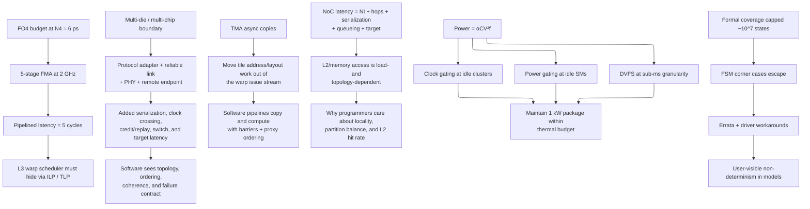

---

## 9. Numbers to memorize

| Quantity | Value | Why |
|---|---|---|
| FF clk-to-Q delay (TSMC N4) | 30–60 ps | Pipeline overhead floor |
| FF setup time | 30–50 ps | Pipeline overhead floor |
| Clock skew typical | 20–60 ps | Distribution-tree quality |
| Total FF overhead per stage | ~100 ps | What you "lose" to pipelining |
| FO4 (TSMC N4) | ~6 ps | Process-independent timing unit |
| FO4 (TSMC N2 proj.) | ~4.2 ps | Next gen |
| Logic budget per stage at 2 GHz | ~400 ps ≈ 67 FO4 | Usable depth |
| FP32 FMA combinational depth | ~50 FO4 | Why pipelined |
| Typical FMA pipeline depth | 4–6 stages | Latency vs $f_{\max}$ |
| Multi-flop sync stages for MTBF > 10⁹ y | 3 | Async CDC standard |
| NV-HBI mesochronous CDC penalty | 2–4 cycles | Cross-die access |
| Async-copy address | $base+\sum i_d stride_d$ | nested-loop AGU |
| Data required in flight | $BL$ | bandwidth × round-trip latency |
| NoC link useful bandwidth | $wf\eta$ | width × frequency × efficiency |
| NoC unloaded packet latency | $L_{srcNI}+HL_{head-hop}+F-1+L_{dstNI}+L_{target}$ | separates hop and serialization costs |
| VC credit invariant | available + in-flight + occupied = depth | prevents loss/overflow/deadlock |
| Inter-chip delivered bandwidth | $NR\prod\eta_i$ one way | separates raw lanes from usable payload |
| Inter-chip outstanding window | $W\ge BL$ | tags, replay, credits, and buffers must all cover the loop |
| ACK versus completion | adjacent receipt versus remote visibility | prevents early software/buffer reuse |
| transaction ID versus link sequence | end-to-end operation versus hop retry | enables exactly-once atomics/writes |
| D2D bandwidth density | one-way GB/s per mm die edge | chiplet shoreline/bump constraint |
| UALink 1.0 cache coherence | software across accelerator caches | remote memory semantics are not full snoop coherence |
| ICG cell area overhead | ~5% of gated block | Standard |
| Power-gating wakeup time | ~10s of cycles | DTC recharge |
| DVFS granularity | sub-ms | PMU-driven |
| Formal verification scaling ceiling | ~10⁷ states | Why FSMs escape |
| Block-level UVM cycles | 10⁹–10¹² | Months on farm |
| Errata count per major GPU launch | 50–200 | Documented post-tape-out |
| Hold constraint | t_cq,min + t_logic,min ≥ t_hold + t_skew | frequency-independent; fixed by padding |
| Clock insertion delay | tens–>100 ps | root-to-leaf latency |
| Clock-network power share | ~30% of dynamic | why clock gating targets it |
| Signoff matrix | MCMM: SS/TT/FF × Vmin..max × T | setup@slow, hold@fast |
| Temperature inversion | slower when cold at low V | check both T extremes |
| PD signoff checks | STA + DRC + LVS + EM/IR | all must be clean for GDSII |

---

## 10. References

**Foundational**
- Dally & Towles, *Principles and Practices of Interconnection Networks* — NoC topology, deadlock, VCs.
- Dally & Poulton, *Digital Systems Engineering* — CDC, signaling, PI design.
- Weste & Harris, *CMOS VLSI Design* — pipelining, clock-tree, ICG patterns.
- Kahng, Lienig, Markov & Hu, *VLSI Physical Design: From Graph Partitioning to Timing Closure* — floorplan → place → CTS → route → signoff.
- Bhasker & Chadha, *Static Timing Analysis for Nanometer Designs* — setup/hold, OCV, MCMM corners.
- Leiserson & Saxe, *Retiming Synchronous Circuitry*, Algorithmica 1991 — register balancing.

**Recent**
- Choquette et al., *NVIDIA Hopper Architecture*, IEEE Micro 2023 — TMA disclosure.
- NVIDIA, [CUDA Programming Guide](https://docs.nvidia.com/cuda/cuda-programming-guide/) — asynchronous copies, TMA, barriers, thread scopes, memory synchronization domains, and CUDA C++ memory model.
- NVIDIA, [Parallel Thread Execution ISA](https://docs.nvidia.com/cuda/parallel-thread-execution/) — bulk/tensor async instructions, `mbarrier`, scoped fences/atomics, and proxy ordering.
- PCI-SIG, [PCI Express Base Specification Revision 7.0](https://pcisig.com/PCIExpress/Spec/Base/_7.0).
- Compute Express Link Consortium, [CXL Specification 4.0](https://computeexpresslink.org/).
- UCIe Consortium, [UCIe Specification 3.0](https://www.uciexpress.org/specifications).
- UALink Consortium, [UALink specifications](https://ualinkconsortium.org/specification/).
- Wang et al., *NV-HBI Cross-Die Bridge for Blackwell*, Hot Chips 2024.
- Foundry-DTCO disclosures from TSMC / Intel — pipelining-friendly cell libraries.

---

**Up the stack:** [L3 Microarchitecture](../L3_Microarchitecture/00_Index.md) — these RTL patterns become SMs, ISAs, and rooflines.
**Down the stack:** [Systolic_Arrays_and_Dataflow](03_Systolic_Arrays_and_Dataflow.md), [FP_Unit_Design](02_FP_Unit_Design.md), [On_Chip_Memory_Hardware](01_On_Chip_Memory_Hardware.md).
