# Digital Design for AI — Pipelining, CDC, DMA/TMA, and Interconnects

> **Layer:** L2 (integration page).
> **Prerequisites:** [On_Chip_Memory_Hardware](01_On_Chip_Memory_Hardware.md), [FP_Unit_Design](02_FP_Unit_Design.md), [Systolic_Arrays_and_Dataflow](03_Systolic_Arrays_and_Dataflow.md). RTL fluency (FFs, FSMs, FIFOs).
> **Hands off to:** [L3 Microarchitecture](../L3_Microarchitecture/00_Index.md) — where these patterns become SMs, ISAs, and rooflines.

---

## 0. Where this page sits

The previous three L2 pages gave you the *building blocks*: memory cells, FP units, and dataflow patterns. This page is about **how those blocks are wired into a working chip** at the synthesizable RTL level. Specifically:

1. Pipelining and timing closure ($f_{\max}$ derivations, FO4 budget).
2. Clock-domain crossing (CDC), which becomes mandatory at multi-die scale.
3. Async copy engines (TMA-style) — the magic that decouples HBM latency from compute.
4. Interconnects from on-die NoC through inter-chip protocol/link/PHY and switched fabrics.
5. Clock and power gating — the only way to keep TDP within thermal budget.
6. Verification and RAS: how local formal proofs, constrained-random testing, emulation, fault injection, and silicon observability cover different failure classes.

Read the prior three L2 pages first; this one assumes them.

---

## 1. Pipelining and timing closure

### 1.1 The fundamental clock-period equation

For one register-to-register setup path, a conservative budget is

$$
T_{\text{clk}}
\ge
t_{c\to q}^{\max}
+t_{\text{comb}}^{\max}
+t_{\text{setup}}
+t_{\text{uncertainty}}
+t_{\text{margin}}.
$$

- $t_{c\to q}^{\max}$ and $t_{\text{setup}}$ come from the selected sequential cell at the signoff PVT/load/slew condition.
- $t_{\text{comb}}^{\max}$ includes cell and extracted wire delay through the actual muxes, arithmetic, buffers, and fanout.
- $t_{\text{uncertainty}}$ covers the signoff treatment of jitter and clock-arrival uncertainty.
- $t_{\text{margin}}$ represents the project's variation/aging/guard-band methodology when it is not already embedded in derates and libraries.

Clock skew is not always a positive constant added to every path: launch/capture arrival difference can help one setup path while hurting another and has the opposite effect on hold. Static timing analysis uses propagated clock trees and the selected analysis mode; an architecture spreadsheet may reserve a conservative uncertainty before CTS.

For an **illustrative** 2 GHz target, $T_{\text{clk}}=500$ ps. If characterized sequential overhead, uncertainty, and margin consume 120 ps in one selected corner/mode, about 380 ps remains for extracted combinational delay. Change the cell library, voltage, corner, clock strategy, or load and that number changes. Never copy a picosecond budget from another chip.

### 1.2 The FO4 unit

FO4 is the delay of an inverter driving four identical inverters. It is useful for comparing logical depth before a cell library and layout exist, but it is not a foundry timing guarantee:

- a real gate has input slew, output load, threshold-voltage choice, fanout, and wire RC;
- a barrel shifter and prefix adder are routing structures as much as logic-depth structures;
- a flip-flop's clock-to-Q/setup/clock power is not captured by counting combinational FO4;
- process names do not define one universal FO4 number.

Use FO4 to reject obviously deep architectures and compare prefix/tree choices. Use synthesis with characterized libraries for the next cut, then placement, clock-tree synthesis, extraction, and MCMM STA for signoff. A statement such as “this FMA stage is 10 FO4” is incomplete without the topology, load, and wire assumption.

### 1.3 Pipelining a deep MAC

A scalar FMA contains several independently placeable cuts. One candidate—not a universal latency—is:

```mermaid
flowchart LR
    R0["R0<br/>request + mode/tag"] --> C0["classify/unpack;<br/>sign and exponent prep"]
    C0 --> R1["R1<br/>raw operands"]
    R1 --> C1["Booth rows +<br/>early compression"]
    C1 --> R2["R2<br/>carry-save product rows"]
    R2 --> C2["finish compression;<br/>compare/align C"]
    C2 --> R3["R3<br/>aligned rows + tail state"]
    R3 --> C3["carry-save merge;<br/>final CPA + LZA"]
    C3 --> R4["R4<br/>sum + predicted shift"]
    R4 --> C4["normalize/correct;<br/>GRS + round/range"]
    C4 --> R5["R5<br/>packed result + flags/tag"]
```

Each register stores arithmetic state **and** class bits, format, rounding mode, pending flags, destination tag, valid, and kill. Carry-save cuts store two rows with a documented carry-bit weight. The $C$ aligner carries signed-tail/correction state needed for correct subtraction and final rounding.

Partition using timing reports:

1. synthesize an initial RTL cut with realistic mode muxes and constraints;
2. inspect worst paths and total negative slack, not only arithmetic depth;
3. split a compressor level, aligner, CPA/LZA, or normalize/round boundary where physical paths are long;
4. retime only when sideband/valid/kill movement remains functionally equivalent;
5. place and route, then repeat with extracted wires and clock uncertainty.

The initiation interval can be one even when latency is five or seven cycles: a new independent FMA enters each cycle and each stage works on a different tag. A dependency chain still waits for result availability or forwarding, so the warp scheduler needs independent instructions/warps to cover latency.

### 1.4 The pipeline-vs-area tradeoff

Count the actual registered bits at each cut:

$$
N_{\text{state bits}}
=\sum_i
\left(
W_{\text{data},i}
+W_{\text{control},i}
+W_{\text{tag},i}
+W_{\text{valid/kill},i}
\right).
$$

For a carry-save product cut, `data` can include two wide rows; another cut may hold aligned $C$, exponent state, LZA inputs, and tail metadata. There is no valid shortcut such as “24 flip-flops per datapath bit.” Map the chosen registers to the actual standard-cell library and include:

- data and clock-pin capacitance;
- clock-tree buffers and local skew constraints;
- scan mux/cell overhead;
- enable/hold muxes for elastic stages;
- extra bypass/forwarding latency in the execution cluster;
- placement area and wide-bus routing.

More stages can raise frequency until register overhead, unbalanced logic, routing, clock power, or a feedback loop dominates. There is no universal five- or six-stage ceiling. An iterative accumulator feedback path, for example, must complete within its recurrence interval unless the algorithm is transformed; independent feed-forward compressor levels can be pipelined more freely.

---

---

## 1b. Timing closure in practice — hold, clock trees, and signoff corners

§1.1 gave *one* timing constraint. Real closure has a second one, a clock-distribution problem, and a signoff step across a dozen corners — the parts that actually consume a physical-design team's year.

### 1b.1 The other constraint: hold time

The setup (max-delay) equation says the *slowest* path must fit in a cycle. Its twin, the **hold (min-delay)** constraint, says the *fastest* path must not race through and corrupt the capture flop in the **same** edge:

$$
t_{c\to q}^{\min} + t_{\text{logic}}^{\min} \;\ge\; t_{\text{hold}} + t_{\text{skew}}
$$

Two facts make hold the scarier of the pair:

- **It is frequency-independent.** You cannot fix a hold violation by slowing the clock — a hold failure is a race between data and clock at *one* edge. A chip that fails hold is simply broken at any frequency.
- **It fails on minimum-delay paths.** A fast-process/high-voltage corner is often important, but the actual worst analysis also depends on temperature inversion, RC corner, clock derates, and propagated skew. Fixes add controlled data delay, change cells/routing, or adjust the clock tree while rechecking setup; positive capture skew that helps setup can hurt hold.

### 1b.2 The clock tree (CTS)

A high-rate clock must reach a large sequential load with controlled **skew** (spatial arrival mismatch), slew, insertion delay, duty cycle, and jitter. **Clock-tree synthesis (CTS)** inserts and routes clock cells to satisfy those limits under the selected modes/corners:

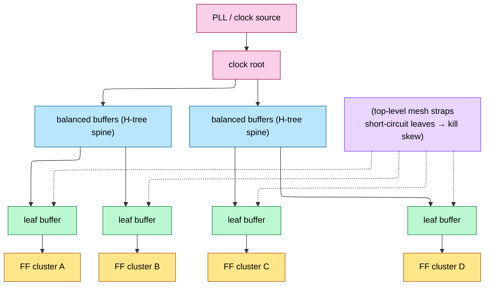

- **H-tree**: a balanced binary tree — naturally low skew, moderate power.
- **Clock mesh/grid**: straps that short the leaves together — near-zero skew but high power (the whole mesh switches every cycle). Frontier CPUs/GPUs use a mesh on the top level for the tightest skew.
- The clock network and clocked state can consume a large share of dynamic power because they switch every active cycle. Measure the share from the implemented clock tree and activity; this is why clock gating (§5.1) is a first-class design feature.

### 1b.3 Useful skew, time borrowing, and retiming

Zero skew is not automatically optimal. **Useful skew** deliberately changes capture arrival to trade setup slack between neighboring stages while respecting hold. Latch-based pipelines allow **time borrowing**, where a transparent phase lets a slow stage use part of the next stage's time. **Retiming** moves registers across combinational logic without changing the cycle-level function when its legality conditions hold. These can balance lumpy FMA stages, but their benefit is design- and constraint-dependent; they also move hold, test, enable, and sideband-control obligations.

### 1b.4 Signoff: multi-corner, multi-mode (MCMM)

Timing must close across the product's required **process**, **voltage**, **temperature**, RC-extraction, and functional/test modes—the **MCMM** matrix. The rules of thumb:

- **Setup signs off at the slow corner**, **hold at the fast corner** — you must pass *both* simultaneously.
- **Temperature inversion**: at the low voltages AI chips run (§L0), cells get *slower when cold*, inverting the classic assumption — so both temperature extremes must be checked for *both* setup and hold.
- **On-chip variation (OCV)**: even on *one* die, no two transistors are identical (Pelgrom mismatch, dopant fluctuation), so two "identical" gates run at slightly different speeds. Signoff **derates** (pads) path delays to cover this — flat margins (OCV), distance/depth-aware margins (AOCV = *advanced* OCV), or statistical ones (POCV = *parametric* OCV). Advanced nodes use POCV because a flat guard-band at N3 would throw away too much frequency.

"The chip runs at 2 GHz" really means "it closes timing across ~a dozen corners with OCV derating and still has margin." That gap between a single-corner number and signoff is where months go.

## 2. Clock-domain crossing (CDC)

### 2.1 The mesochronous problem

A die-to-die boundary can use several clock contracts:

| Contract | Frequency relation | Receiver hardware |
|---|---|---|
| common synchronous clock | same distributed clock with bounded skew | ordinary STA if the complete cross-die clock/data path is timed |
| source-synchronous/forwarded clock | transmitter sends clock/strobe with data | input sampling phase training, lane deskew, then transfer into core clock |
| mesochronous | same frequency, unknown phase | phase aligner and/or elastic buffer |
| plesiochronous | nominally close frequencies that can slip | elastic/async FIFO sized for frequency offset and service interval |
| asynchronous | no bounded relation | synchronizers for controls; handshake or async FIFO for data |

Do not infer one of these from “multi-die GPU.” The package link specification must define clock source, maximum frequency offset/drift, lane skew, training, reset order, and whether the receive clock is related to the destination core clock. Vendor products can use proprietary mechanisms not publicly specified.

### 2.2 The phase interpolator + elastic FIFO

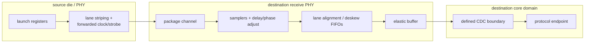

One possible receive implementation:

1. Training sends known patterns and sweeps delay/phase settings to find a valid sampling window.
2. Per-lane delay and deskew FIFOs align bits/lanes to a common word boundary.
3. A phase interpolator or delay-locked loop tracks the sampling phase if the PHY architecture uses one.
4. An elastic buffer absorbs bounded phase/frequency slip and decouples PHY delivery from endpoint service.
5. A defined CDC transfers words/status into the core domain.

Derive elastic depth from worst-case frequency difference, maximum interval between compensation opportunities, burst/service jitter, and safety margin:

$$
D_{\text{slip}}
\ge
\left|f_w-f_r\right|T_{\text{max-service}}
+D_{\text{burst}}
+D_{\text{margin}}.
$$

If no bound exists on $f_w-f_r$, use a true dual-clock FIFO and backpressure; a small “phase FIFO” cannot absorb unlimited drift.

### 2.3 CDC latency cost

Account for each implemented stage:

$$
L_{\text{cross-die}}
=L_{\text{source adapter}}
+L_{\text{TX/RX PHY}}
+L_{\text{deskew/elastic}}
+L_{\text{CDC}}
+L_{\text{destination adapter}}
+L_{\text{remote NoC/target}}.
$$

Some components are fixed pipeline latency; elastic/async FIFO wait depends on phase and occupancy; target/NoC delay depends on traffic. Measure minimum, average, and tail separately. Coherence or a single-device software abstraction comes from the complete memory/protocol contract, not from CDC latency being a small percentage of DRAM access.

### 2.4 True async CDC: the synchronizer chain

For one slowly changing **single-bit level**, use a destination-clock synchronizer:

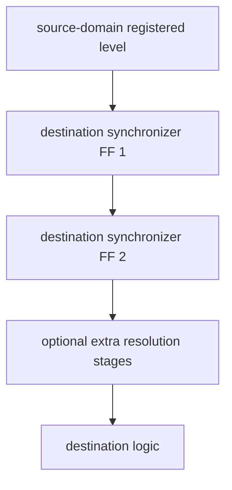

The first stage may become metastable when the source changes near its sampling aperture. Later stages provide resolution time before destination logic observes the value. A common MTBF model is

$$
\text{MTBF}
\approx
\frac{\exp(T_{\text{resolve}}/\tau)}
C f_{\text{dst}} f_{\text{toggle}}},
$$

where $\tau$ and $C$ come from characterization, $T_{\text{resolve}}$ is the actual resolution time after clock uncertainty/routing/setup, and the two frequencies are destination sampling and source toggle rates. Choose the stage count from the characterized synchronizer cell, routing constraint, required FIT/MTBF, voltage/corner, and number of crossings. There is no universal “three stages means $10^9$ years.”

Do not synchronize every bit of a bus independently: bits can settle on different cycles and form a word that never existed. Use:

- request/acknowledge handshake for a stable multi-bit payload;
- toggle/pulse-stretch protocol for events;
- Gray-coded pointers plus dual-port storage for a dual-clock FIFO;
- bundled-data/source-synchronous capture when that timing contract is explicitly verified.

CDC verification checks reconvergence, pulse loss/duplication, reset release, FIFO full/empty correctness, Gray-pointer synchronization, and constraints/placement of the synchronizer chain—not only the presence of two flip-flops.

---

## 3. Async copy engines (TMA pattern)

### 3.1 First separate three kinds of “DMA”

All three move data without a thread executing one load/store per word, but their software contracts and hardware placement differ:

| Engine | Example use | Command source | Typical endpoints |
|---|---|---|---|
| host/device copy engine | `cudaMemcpyAsync`, storage/network transfer | runtime/driver queue | host memory, peer GPU, HBM |
| conventional on-chip DMA | firmware descriptor ring | CPU or command processor | SRAM, DRAM, peripherals |
| SM async/tensor copy engine | PTX bulk/tensor async copy (TMA family) | one CUDA thread/warp in a kernel | global memory ↔ shared/cluster memory |

The first two are autonomous device-level masters. The third is part of the GPU execution machinery: a kernel launches a copy, hardware performs multidimensional address generation and data movement, and an async-group or memory barrier communicates completion back to participating threads. NVIDIA documentation deliberately calls TMA operations **bulk-asynchronous copies** and notes that they must not be confused with CPU↔GPU asynchronous copies.

### 3.2 Why an SM copy engine exists

In the classical path, a warp cooperatively loads a tile:

```cuda
int lane = threadIdx.x & 31;
for (int i = lane; i < tile_elements; i += 32)
    smem[i] = global[base + layout(i)];
__syncthreads();
```

This consumes:

- instruction issue slots for address arithmetic, loads, and stores;
- 32 per-thread address/data paths even when the access pattern is regular;
- load-store queue and scoreboard entries;
- registers for pointers, loop counters, and temporary data;
- explicit layout/swizzle instructions;
- a full-block synchronization step.

A tensor copy engine replaces that instruction stream with a compact descriptor plus a launch. The savings are workload- and implementation-dependent; there is no universal “2-cycle command” or fixed speedup. The architectural advantage is fewer issued instructions and less address/register traffic while the copy overlaps independent work.

### 3.3 Hardware hierarchy and state

The precise proprietary placement is generation-specific. A reconstructable representative design is:

```mermaid
%%{init: {"flowchart": {"defaultRenderer": "elk", "nodeSpacing": 45, "rankSpacing": 45, "htmlLabels": false}}}%%
flowchart LR
    subgraph SW["Software-visible state"]
        TD["Tensor-map descriptor<br/>base, rank, extents, strides,<br/>element size, swizzle, OOB policy"]
        INS["PTX/SASS bulk-copy launch<br/>coordinates, direction, barrier"]
    end
    subgraph SM["SM-side hardware"]
        DEC["Instruction decode<br/>scope and completion mode"]
        CQ["Copy command queue<br/>context, barrier, bytes expected"]
        AGU["Nested-loop AGUs<br/>bounds + address generation"]
        SPL["Segment/coalesce unit<br/>alignment, sectors, boundaries"]
        OT["Outstanding-tag table<br/>offset, length, epoch"]
        DB["Data/reorder buffers<br/>byte valid + transform state"]
        SWZ["Format/swizzle/OOB unit"]
        SP["Shared-memory crossbar<br/>banks and write/read ports"]
        MB["mbarrier / async-group<br/>transaction accounting"]
    end
    subgraph MEM["Global-memory path"]
        NI["SM memory network interface"]
        L2["Distributed L2 slices"]
        MC["Memory controllers"]
        HBM["HBM"]
    end
    TD --> DEC
    INS --> DEC --> CQ --> AGU --> SPL --> OT --> NI
    NI <--> L2 <--> MC <--> HBM
    NI --> DB --> SWZ --> SP
    OT --> MB
    SP --> MB
```

A command-queue entry needs at least:

```text
issuing context/CTA and reset epoch
descriptor snapshot or stable descriptor reference
tensor coordinates and copy direction
source/destination address spaces
total and remaining transaction bytes
completion kind: mbarrier or async group
barrier address/phase and expected-byte contribution
outstanding request bitmap/count
fault/poison status
```

The descriptor encodes a logical tensor, while the instruction supplies tile coordinates. For dimension indices $i_0,\ldots,i_{n-1}$, the generic byte address is

$$
A=base+\sum_{d=0}^{n-1} i_d\,stride_d.
$$

Hardware nested-loop counters generate the addresses, split them at supported boundaries, coalesce contiguous sectors, and attach each request to the destination tile offset. Address arithmetic must be widened so overflow is detected before truncation.

### 3.4 From one command to many memory transactions

For a 2D tile with `x_bytes=64`, `y_count=16`, and `global_stride=256`, the engine generates:

```text
row 0: global base +   0  -> shared tile +   0
row 1: global base + 256  -> shared tile +  64
...
row15: global base +3840  -> shared tile + 960
```

Each row may split again because of cache-sector, page, interconnect-packet, or alignment limits. Responses can return out of order. The outstanding table therefore maps response tag → command, row, byte offset, length, and epoch. Returned bytes enter data buffers, pass through optional swizzle/format logic, and then request shared-memory banks.

The engine must reserve data-buffer space **before** issuing a read. Otherwise global-memory responses can fill every buffer while shared memory is backpressured, creating a deadlock that also prevents unrelated requests from draining.

For shared→global copies, the direction reverses: shared-memory reads feed global write requests. Completion must distinguish “the engine has finished reading shared memory, so software may reuse that buffer” from “the global writes are visible to later observers.” PTX exposes completion mechanisms appropriate to each operation; kernel code must use the documented one rather than assume kernel issue order is sufficient.

### 3.5 Swizzle, out-of-bounds, and shared-memory banks

The transform block can:

- map a multidimensional logical tile into a bank-friendly shared-memory layout;
- permute low-order address bits (swizzle) to reduce systematic bank conflicts;
- fill or suppress out-of-bounds elements according to the instruction contract;
- expand/pack supported element representations;
- multicast a global tile into distributed shared memory when supported.

Swizzle does not “remove” bank conflicts for every later access. It chooses a mapping intended to make a specified tensor access pattern distribute across banks. The consumer's lane-to-element mapping still matters.

Every destination beat carries byte-valid metadata. A partial first/last beat must not overwrite neighboring shared-memory bytes. Conflicting writes from ordinary threads and the async engine are a data race unless software establishes the required proxy ordering.

### 3.6 The crucial ordering rule: async work is another proxy

The initiating CUDA thread and the asynchronous copy engine are distinct memory actors. NVIDIA's model describes relevant TMA/tensor operations as an **async proxy**. Ordinary loads/stores use the generic proxy. A barrier can report transaction completion, but proxy fences are required at documented handoff points so the two proxies agree on visibility.

The global→shared pattern is:

1. initialize the shared-memory barrier;
2. make barrier initialization visible to the async proxy;
3. launch the bulk/tensor copy and add its expected byte count;
4. other participating threads arrive;
5. wait for the barrier phase to complete;
6. only then read the shared tile with ordinary thread instructions.

For shared→global reuse:

1. finish ordinary thread writes to the shared tile;
2. use the required generic↔async proxy fence and thread synchronization;
3. launch the bulk copy;
4. wait until the async operation has finished **reading** shared memory;
5. only then let threads overwrite that shared buffer.

```mermaid
sequenceDiagram
    participant P as Producer threads (generic proxy)
    participant B as Shared mbarrier
    participant T as Tensor copy engine (async proxy)
    participant C as Consumer threads
    P->>B: initialize barrier
    P->>T: proxy fence makes initialization visible
    P->>T: launch copy; register expected bytes
    T->>T: generate addresses and move sectors
    T->>B: decrement transaction bytes as data arrives
    C->>B: arrive and wait for phase
    B-->>C: phase complete
    C->>C: safely consume shared tile
```

`__syncthreads()` is a thread barrier; a PTX/CUDA memory fence orders memory; an `mbarrier` also tracks asynchronous transaction completion; a proxy fence orders actors using different access mechanisms. They solve related but non-interchangeable problems.

### 3.7 Double buffering as a hardware/software pipeline

With two shared-memory stages, software assigns ownership:

```text
stage 0: async engine filling tile k+1
stage 1: tensor core consuming tile k
```

After the consumer finishes stage 1 and the producer's copy into stage 0 completes, roles rotate. A correct state machine per stage is:

```text
FREE -> COPY_IN_FLIGHT -> READY_FOR_COMPUTE
     -> COMPUTE_IN_FLIGHT -> SAFE_TO_REUSE -> FREE
```

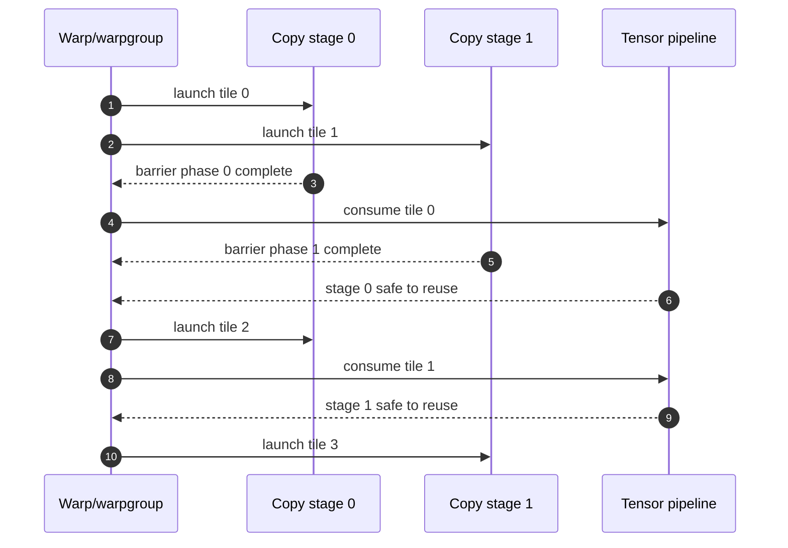

The number of stages is a resource trade-off:

$$
T_{tile}\approx\max(T_{copy}/S,\ T_{compute})
$$

only when $S$ buffered stages plus outstanding capacity cover copy latency and the memory/SMEM ports sustain the rate. More stages consume shared memory, barrier state, copy queue entries, and registers; beyond latency coverage they reduce occupancy without improving throughput.

### 3.8 Conventional DMA inside an accelerator

Device-level copy engines use the same core mechanisms at larger scope:

```mermaid
flowchart LR
    RING["Runtime/driver command ring"] --> DF["Descriptor fetch + validation"]
    DF --> CS["Channel scheduler"]
    CS --> AG["1D/2D/scatter-gather AGU"]
    AG --> VM["GMMU/IOMMU translation<br/>requester/process identity"]
    VM --> RD["Read issue + reorder"]
    RD --> NOC["GPU NoC / PCIe / peer fabric"]
    NOC --> BUF["Data buffers + width/alignment"]
    BUF --> WR["Write issue + response tracking"]
    WR --> NOC
    WR --> CP["Ordered completion record<br/>interrupt/event"]
```

The descriptor ring uses release/doorbell/acquire rules just like any producer-consumer queue. The engine must split at translation and protocol boundaries, retain exact progress across recoverable page faults, and publish completion only after destination writes reach the promised visibility point. Coherent and noncoherent host/peer paths need different cache-maintenance and ordering contracts.

To sustain $B$ bytes/s across round-trip latency $L$, data in flight must be at least $BL$. At 100 GB/s and 300 ns, about 30 KiB must be outstanding. Request IDs, read-return buffers, write buffers, and NoC credits must all support that amount; sizing just one of them does not deliver bandwidth.

### 3.9 What to verify and count

Assertions and scoreboards:

- every accepted source byte reaches exactly its descriptor-selected destination byte once;
- no request is issued without reserved response/data capacity;
- response tags and reset epochs cannot alias;
- barrier bytes cannot reach zero before all corresponding destination writes complete;
- a stage cannot transition to compute-ready before the required proxy/transaction completion;
- shared-buffer reuse cannot precede the documented read-completion point;
- descriptor bounds, address overflow, alignment, and out-of-bounds behavior are exact;
- faults, aborts, and retries cannot duplicate visible writes.

Counters: command queue depth, generated sectors per command, useful/fabric-byte ratio, outstanding transactions, global and shared-port stalls, bank conflicts, translation hit/miss/fault, barrier wait, proxy-fence wait, copy/compute overlap, and stage occupancy. Those counters distinguish a poor tensor layout from insufficient outstanding state or a saturated memory network.

---

## 4. Interconnect hardware — on-die NoC to inter-chip fabrics

### 4.1 Why the GPU needs several interconnects

A modern GPU is not one flat network. It commonly has:

- an SM-local crossbar connecting operand collectors, LSU ports, shared-memory banks, and L1;
- cluster-level paths among neighboring SMs or distributed shared memory;
- a global request/data network from SM clusters and copy engines to distributed L2 slices;
- response networks returning fills and acknowledgements;
- coherence/control paths for invalidation, atomics, page-table, interrupt, and system traffic;
- off-die links to HBM controllers, peer GPUs, CPU/PCIe/CXL, or another die.

Public architecture diagrams expose only some of these boundaries. The hierarchy below is a **design model**, not a claim about one vendor's undisclosed router count:

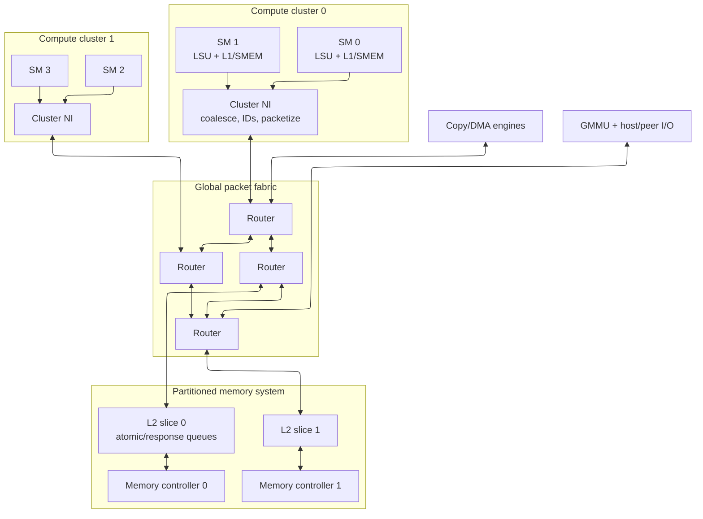

A monolithic all-to-all crossbar gives low hop count, but mux/arbiter complexity and global wiring grow rapidly with ports and width. Rings and meshes replace global wires with repeated local links and routers. Hierarchical hybrids match physical clusters and memory partitions but add queues/order boundaries.

### 4.2 The network interface: transactions become packets

The SM LSU produces memory transactions: address sectors, operation, byte mask, warp/context identity, cache policy, scope, and ordering semantics. The network interface:

1. checks/adopts the destination L2 slice or home;
2. allocates/remaps a globally unique transaction ID;
3. associates an ordering domain and sequence where required;
4. packetizes request/data into flow-control units (**flits**);
5. selects a virtual network and virtual channel;
6. reserves credits and injects;
7. reassembles responses and routes each sector to the correct MSHR/warp;
8. maps poison, faults, retries, and reset epochs.

A representative head flit carries destination, source/return route, transaction ID, operation, address, length, traffic class, ordering/scope attributes, packet length, and error/epoch bits. Body flits carry data and byte validity; a tail releases packet-held routing state.

Coalescing happens before or at the NI: active warp lanes that touch the same cache sector become one transaction. The return metadata still records which byte/word feeds each lane. The NoC transports transactions; it does not know CUDA thread semantics.

### 4.3 Router datapath in hardware

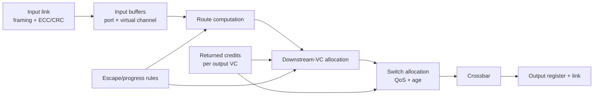

Per input VC, RTL stores:

```text
read/write pointers and occupancy
head/body/tail state
decoded candidate output ports
allocated downstream VC
packet transaction/epoch identity
QoS class and age
error/poison state
```

The head flit computes a route and reserves a downstream VC. Each cycle, ready input VCs request physical output ports; switch arbitration grants at most one input per output (and normally at most the allowed speedup per input). Body/tail flits follow the reservation. The tail releases it.

Physical pipelines vary. Route computation, VC allocation, switch allocation, crossbar traversal, and link traversal may occupy separate cycles, combine speculatively, or be bypassed when empty. It is therefore misleading to assign a universal cycles-per-hop number to a commercial GPU.

### 4.4 Credit flow control

If the downstream VC has depth $D$, upstream starts with $D$ credits after reset/epoch synchronization. Sending a flit consumes one; freeing the downstream slot returns one. For a clearly chosen boundary:

$$
C_{available}+F_{in\ flight}+S_{occupied}=D.
$$

Returning a credit too early can overwrite a full buffer. Losing one permanently reduces capacity and may deadlock. Long pipelined links need enough buffering to cover the delay before backpressure/credits return.

An NI must reserve response or data-buffer capacity before issuing traffic whose response cannot be refused. This is especially important for TMA/DMA: allowing reads to fill every return buffer while shared-memory/global-write destinations are blocked can create a cyclic wait.

### 4.5 Topology, routing, and traffic cuts

| Topology | Strength | Weakness | Good fit |
|---|---|---|---|
| crossbar | one logical hop | global wires and arbitration scale poorly | small local cluster |
| ring | compact router ports | distance and cut bottlenecks | moderate clustered fabric |
| 2D mesh | regular physical replication | multi-hop latency, bisection limits | many tiles |
| tree/fat tree | hierarchical aggregation | shared ancestors, placement | clustered endpoints |
| hierarchical hybrid | follows floorplan | boundary queues/order | large GPUs/accelerators |

For link payload width $w$, clock $f$, and useful utilization $\eta$,

$$B_{link}=wf\eta.$$

But aggregate injection bandwidth is irrelevant if a bisection or one L2/DRAM partition saturates. Given source–destination traffic $D_{sd}$ and route indicator $R_{sd,l}$, load on link $l$ is

$$L_l=\sum_{s,d}D_{sd}R_{sd,l}.$$

Route tensor addresses across L2 slices so common strides use multiple partitions; otherwise many SMs can camp on one slice even while the rest of the fabric is idle.

Deterministic dimension-order routing is easy to prove. Adaptive routing can avoid congestion but may reorder packets and needs a guaranteed acyclic escape path. Ordered domains may use pinned routes or destination reorder buffers.

### 4.6 Virtual channels are for progress, not extra wire bandwidth

Virtual channels share one physical link but have independent buffer/reservation state. They reduce head-of-line blocking and can break dependency cycles. They do **not** multiply link bandwidth.

Draw a channel-dependency graph. A node is a buffer/VC class; edge `A→B` means a transaction can hold A while requesting B. Coherent GPU traffic might include:

```text
request -> home/L2 entry
home entry -> invalidate/probe
probe -> acknowledgement/writeback
response -> SM ejection/MSHR
```

If requests consume all storage required for responses or probes that release those requests, the machine can freeze. Separate virtual networks, reserved response/probe slots, and an acyclic escape VC are structural solutions. Merely adding arbitrary VCs is not a proof.

Progress extends into endpoints: L2 miss queues, atomic queues, DMA buffers, GMMU walkers, and SM response queues belong in the same dependency analysis. Router-level deadlock freedom cannot fix a target controller that holds a request while waiting for a response buffer occupied by that same class.

### 4.7 GPU memory ordering and atomics cross the NoC

The NoC may reorder unrelated transactions. Correctness is reconstructed by:

- per-address serialization at the owning L2/home slice;
- per-scope/domain sequence tracking where the ISA requires order;
- fence packets or acknowledgement ledgers that wait for prior traffic's ordering points;
- response reordering at the NI;
- separate device/system routes for operations whose scope extends beyond the GPU.

A global atomic can be implemented by acquiring exclusive cache ownership at the requester or by executing in an L2/home atomic unit. In either case, one serialization point must return the old value and apply the update exactly once. A retry must distinguish “never executed” from “executed but response lost.”

A release store cannot publish its flag packet until selected earlier writes reach the required GPU/system ordering point. An acquire load cannot allow younger dependent observations to become irrevocable before the acquire response. The warp scheduler and LSU may speculate, but the NI/L2 completion state must support validation or replay. Section 6 of [ISA and Execution Model](../L3_Microarchitecture/01_ISA_and_Execution_Model.md) connects these hardware events to CUDA/PTX.

### 4.8 Latency and throughput model

For a packet of $F$ flits across $H$ unloaded wormhole hops:

$$
L\approx L_{source\ NI}+H L_{head-hop}+(F-1)+L_{destination\ NI}+L_{target}.
$$

Under load add queueing at injection, every allocator, ejection, and the L2/DRAM target. The `F-1` term is serialization behind the head. A cache miss's user-visible latency also includes TLB/GMMU, L2 lookup, memory-controller scheduling, HBM, fill, and warp wakeup—NoC traversal is only one component.

Average utilization near 100% causes steep queueing. Design with headroom against realistic bursts and hot spots, then report latency percentiles, not only average bandwidth.

### 4.9 QoS, multicast, reset, and verification

GPU traffic classes include demand loads, writebacks, atomics, page walks, TMA/DMA, display/real-time traffic, coherence/control, interrupts, and debug. QoS requires:

- source admission/outstanding caps;
- class mapping that cannot be forged across security contexts;
- byte- or flit-aware weighted service;
- age promotion/starvation bounds;
- reserved progress resources for control/response traffic;
- matching policy at L2 and memory controllers.

Probe, TLB-invalidation, cluster-shared, and control traffic may multicast. Replicate at branch routers to save link bandwidth, while tracking every branch so one blocked output cannot corrupt or duplicate another.

Reset/power transitions stop injection, drain or terminate outstanding traffic, exchange epochs, restore credit counts, and reject late old-epoch flits. Initializing credit counters at one end before the downstream buffers are ready is a silicon bring-up bug.

Core assertions:

```text
credit is always between zero and buffer depth
send implies positive prior credit
one output has at most one granted input per transfer slot
no flit is created, lost, duplicated, or misrouted
head/body/tail and downstream-VC reservation are consistent
ordered-domain sequence is not released out of order
every admitted packet eventually ejects or reports an error under fairness assumptions
```

Test single-router exhaustively where practical, then multi-router backpressure, hot spots, all source/destination pairs, protocol causal cycles, adaptive routes, TMA/DMA saturation, atomics, multicast, faults, clock ratios, power/reset epochs, and link errors. Count per-VC occupancy, credit starvation, allocator loss, hop/queue/serialization latency, link/cut utilization, endpoint backpressure, class service, reorders, retries, and timeouts.

### 4.10 The path does not end at the die edge

An inter-chip operation traverses two on-die networks plus boundary hardware:

```mermaid
flowchart LR
    subgraph GA["GPU/accelerator A"]
        SM["SM/TMA/DMA"] --> NIA["NoC NI<br/>coalesce, ID, order"]
        NIA --> PA["Inter-chip protocol adapter<br/>remote read/write/atomic/message"]
        PA --> LLA["Link layer<br/>VC, credit, sequence, CRC/replay"]
        LLA --> PHYA["PHY<br/>gearbox, lanes, FEC, training"]
    end
    PHYA <--> MED["Package traces, PCB/cable,<br/>retimer, or switch fabric"]
    subgraph GB["GPU/accelerator B"]
        PHYB["PHY"] --> LLB["Link layer<br/>integrity + duplicate suppression"]
        LLB --> PB["Remote protection +<br/>protocol reconstruction"]
        PB --> NIB["Destination NoC NI"]
        NIB --> L2B["L2/home/atomic/memory<br/>or collective engine"]
    end
    MED <--> PHYB
    L2B -. "response/completion path" .-> SM
```

The stages answer different questions:

- **NoC:** how does a transaction reach the local boundary?
- **protocol adapter:** what remote operation and memory semantics does it mean?
- **link layer:** did the adjacent endpoint receive the encoded packet exactly once?
- **PHY:** can bits cross this electrical/optical channel?
- **switch fabric:** which remote chip/partition is the destination?
- **destination home/memory:** when is the operation ordered and visible?

A link ACK is not a CUDA event, remote memory fence, or atomic completion. It only retires hop-local replay state.

### 4.11 Inter-chip endpoint state

A scale-up endpoint resembles a NoC NI plus an IOMMU, reliable link, and remote completion engine:

```text
source GPU/context/process and remote destination
local virtual pointer -> remote accelerator/address handle
permissions, key/partition, cache/coherence attributes
operation, size, byte mask, atomic operand
scope and acquire/release/SC ordering state
end-to-end transaction/sequence ID
chosen route, plane, and packet/chunk sequence
outstanding response/beat bitmap
hop-local link sequence and immutable retry copy
VC credits, timeout, poison/error, reset epoch
```

Transaction ID and link sequence are not interchangeable. The transaction ID survives switches and completes one remote operation. Each hop's link sequence only detects/replays corrupt or missing units on that hop.

The address path also changes. A remote-memory API first exports an allocation, grants another process/device access, and creates a mapping such as:

```text
local virtual range -> {destination accelerator,
                        remote address/handle,
                        permissions,
                        mapping generation}
```

The source MMU/GMMU recognizes that the address is remote and routes it to the scale-up endpoint. The destination validates source identity and generation before admitting the request. Revocation waits for old operations or changes the generation so a stale packet cannot touch reallocated memory.

### 4.12 PHY choices: package-parallel versus long-reach SerDes

| Property | Same-package die-to-die | Board/rack serial link |
|---|---|---|
| lanes | many wide parallel wires | fewer high-rate SerDes lanes |
| clock | often forwarded clock | clock/data recovery or embedded clock |
| channel | short package/interposer | PCB, connector, copper/optical cable, retimer |
| main cost | bumps and die-edge “beachfront” | serializer/equalizer/FEC power and latency |
| repair | spare lanes/down-width | lane repair, retimer, down-rate/down-width |

Transmit hardware can include gearbox/serializer, lane striping, scrambling, FEC, pre-emphasis/FFE, and driver. Receive hardware includes termination, CDR or forwarded-clock capture, CTLE/DFE, deserializer, FEC, alignment-marker detection, lane deskew FIFOs, and integrity checks.

PAM4 carries two bits per symbol but has three decision thresholds and less noise margin than NRZ, so it needs stronger equalization/coding. FEC can correct common channel errors; CRC detects residual corruption; link replay retransmits a unit that remains bad. These are complementary layers.

Report:

$$
B_{one-way}=N_{lanes}R_{lane}
\eta_{mod/encoding}\eta_{FEC}\eta_{flit}
\eta_{protocol}\eta_{retry}.
$$

Every efficiency factor multiplies the raw rate. Direction matters: adding TX and RX produces a “bidirectional” marketing number that a one-way tensor transfer cannot use.

For chiplets, also report

$$
B_{edge-density}=\frac{B_{one-way}}{\text{millimeters of die edge}},
$$

because bump rows, power/ground, keepout, and PHY macros limit how much link can physically fit.

### 4.13 Reliable link protocol and bring-up

The transmitter maintains `next_seq`, `oldest_unacked`, a replay buffer, credits per VC, and an epoch. The receiver maintains expected/accepted sequence state and returns:

- an **ACK** when a unit was received with valid integrity, allowing retry storage to retire;
- a **credit** when a receive slot is free, allowing new traffic.

Returning a credit with the ACK is only safe if the buffer really became reusable. Otherwise a legal burst can overwrite live data.

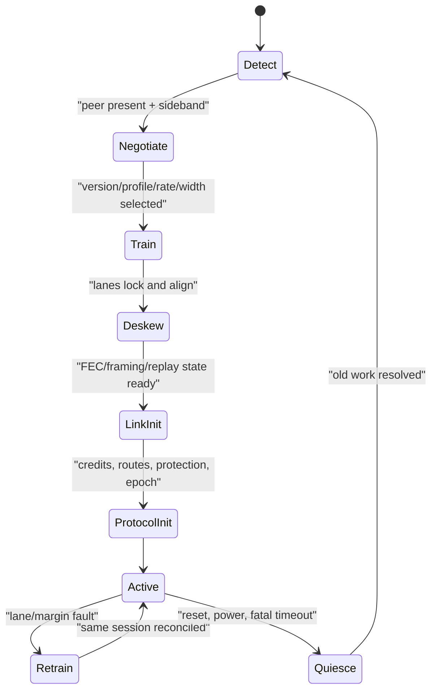

Lane fallback changes serialization latency, bandwidth-delay product, and timeouts. Hardware/firmware must update scheduling and advertised performance after negotiation.

### 4.14 Protocol families and what they actually promise

| Family | Boundary/use | Main operations | Coherence model |
|---|---|---|---|
| UCIe-class D2D | chiplets in one package | mapped PCIe/CXL or streaming/raw protocol | whatever mapped protocol defines |
| PCIe | host/device I/O | configuration, DMA, messages, atomics where supported | ordinarily noncoherent DMA |
| CXL | host/device memory/cache | `.io`, `.cache`, `.mem` | explicit host/home coherent roles |
| proprietary accelerator scale-up | GPU/accelerator peers and switches | peer loads/stores, atomics, DMA, collectives | vendor/version-specific |
| UALink | open accelerator scale-up | remote reads, writes, atomics, DMA | I/O-coherent destination-node contract; software coherence across accelerator caches |
| InfiniBand/RoCE/UEC-class | scale-out networking | messages and RDMA | software/message ownership, not shared cache coherence |

Memory semantics do **not** automatically mean all remote accelerator caches snoop each other. UALink 1.0 deliberately uses software coherence across accelerators while providing remote memory operations and destination system-node I/O-coherency behavior. CXL instead names host/device coherence roles; UCIe can carry CXL but does not itself invent CXL semantics. Proprietary NVLink/Infinity-class guarantees must be read from the product/platform contract rather than inferred from bandwidth.

This distinction decides the software sequence:

```text
hardware-coherent path:
    release remote write -> acquire remote read/atomic

software-coherent peer path:
    producer finishes local writes
    producer flushes/orders data to the exported domain
    remote operation or signal is issued
    consumer waits/acquires
    consumer invalidates stale cached copies if the contract requires
    consumer uses data
```

### 4.15 Switch fabric, routing, and collective offload

A scale-up switch contains ingress PHY/link endpoints, route/partition lookup, per-class buffers, a crossbar or multistage fabric, egress endpoints, and management/telemetry. Several switches may form leaf/spine stages or parallel planes.

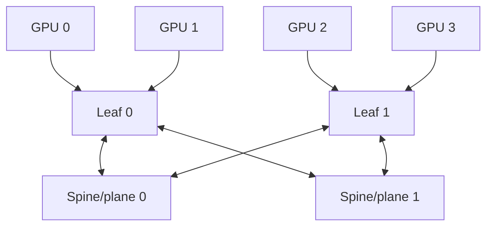

The sum of GPU port rates is not the delivered all-to-all bandwidth. Map the traffic matrix through routes and evaluate every cut. A fabric is nonblocking only for a defined simultaneous traffic set; large systems can deliberately oversubscribe and rely on software placement/scheduling.

Packet striping across planes improves utilization but can reorder. Either pin an ordered flow to one route or carry chunk/sequence metadata and reorder at the endpoint. On failure, reroute cannot let an old-path packet arrive after a new-path completion without epoch/sequence handling.

Collective offload adds reduction/multicast engines to switches. A reduction context stores team/group, collective generation, datatype/op, chunk offset, expected contributor bitmap/count, partial accumulator, output tree, and timeout/error. It reduces network bytes but uses finite switch state and supports only provisioned operations/formats.

### 4.16 Worked remote atomic

GPU A executes a release-qualified fetch-add in GPU B memory:

1. A's ordering ledger waits for selected earlier stores.
2. GMMU mapping chooses destination B and validates remote-atomic permission.
3. endpoint allocates transaction `T90`, selects route/plane, and packetizes;
4. every hop uses its own CRC/sequence/replay state;
5. B validates the request and sends it through B's NoC to the owning L2/home atomic queue;
6. the queue serializes the address, reads `old`, writes `old+operand` exactly once, and responds with `old`;
7. A matches `T90`, applies acquire-side ordering if requested, writes the destination register, and wakes the warp.

If the request was never accepted, retry is safe. If B updated memory but the response was lost, issuing a fresh add is unsafe. End-to-end duplicate suppression or a protocol recovery state must establish performed versus not performed.

### 4.17 Sizing and verification

For end-to-end response or credit latency $L$ and target one-way bandwidth $B$:

$$W_{outstanding}\ge BL.$$

At 200 GB/s and 500 ns, about 100 KB must be in flight. Request IDs, replay buffers, switch credits, destination queues, and response buffers must all cover the window; the smallest stage limits throughput.

Verify and count:

- address import/export, protection, generation revocation, and process isolation;
- all rate/width/lane-repair states, deskew, FEC, CRC, replay, and sequence wrap;
- ACK versus credit conservation and immutable retry copies;
- no lost/duplicate/misrouted transaction through multipath or reset;
- remote write/atomic exactly-once and acquire/release ordering;
- coherent versus software-coherent cache ownership sequences;
- bisection, congestion, QoS, reroute, and head-of-line blocking;
- collective group/generation separation, missing member, and switch reset;
- link margin, corrected/uncorrected error, useful/raw bytes, retry traffic, VC occupancy, path latency, remote atomic queues, and retrain/down-width time.

---

## 5. Clock and power gating

### 5.1 Clock gating

Dynamic power $P = \alpha C V^2 f$. Idle logic with no useful work to do still toggles internal nodes if its clock keeps running. Solution: insert an AND gate (or, in modern flows, a dedicated **integrated clock gating cell** ICG) that masks the clock when the logic is unused.

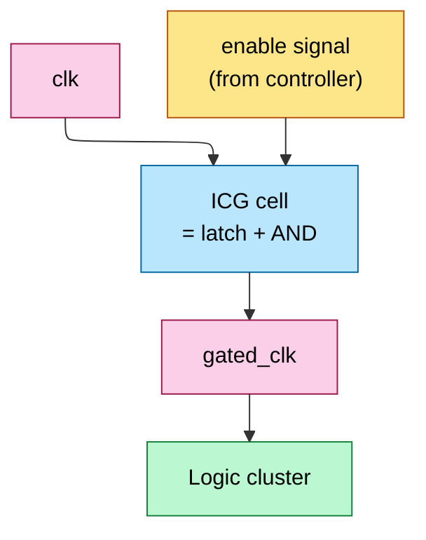

When EN is low, GCLK does not toggle, so the gated flip-flops stop receiving active clock edges. This saves their clock-pin/local-tree power and can prevent downstream combinational switching when state stays constant. The saving depends on the implemented clock tree, enable duty cycle, data activity, and gating boundary; measure it rather than assuming a universal percentage.

The latch in the ICG cell is critical: it prevents glitches on EN from creating spurious clock edges — a glitch through a plain AND gate would clock the entire cluster mid-cycle, corrupting state.

### 5.2 Power gating

For deeper savings, disconnect an idle voltage domain with distributed header or footer switch cells. The implementation also needs:

- isolation cells on outputs so a collapsed domain cannot drive X/illegal levels;
- retention flops or an architectural save/restore path for state that must survive;
- always-on control, reset, test, and acknowledgement logic;
- a switch network sized for active current and acceptable virtual-rail IR drop;
- staged turn-on to limit inrush and package/die droop;
- power-intent specification and checks for every legal domain combination.

The sequence is a hardware/firmware state machine:

```text
quiesce new work -> drain/abort outstanding transactions
-> save retention state -> assert isolation -> gate clock
-> turn off switches -> wait for acknowledged off state

turn on switches in stages -> wait for rail-good
-> restore/reset state -> enable clock -> deassert isolation
-> reopen admission
```

Switch area and wake time depend on domain size, leakage target, rail capacitance, allowed inrush, PDN impedance, retention choice, voltage monitors, and clock/reset sequence. Estimate them from the actual power-domain implementation, not a fixed percentage or cycle count.

### 5.3 DVFS — dynamic voltage and frequency scaling

Dynamic power contains the familiar $\alpha C V^2f$ term, while leakage and regulator losses also change with voltage/temperature. Each operating point must have characterized timing, memory/PHY limits, reliability margin, and a legal clock/voltage sequence.

A PMU transition can:

1. throttle/park request injection;
2. move the clock to a safe divider/source;
3. request the regulator voltage and wait for rail-good;
4. reprogram/lock PLL or clock divider;
5. update memory/interconnect timeout and QoS assumptions if required;
6. release traffic and monitor droop/thermal/error telemetry.

When lowering performance, frequency normally falls before voltage. When raising it, voltage rises before frequency. Rail slew and PLL lock make transition latency product-specific, and rapid transitions consume energy. “Lower voltage at fixed frequency” is safe only if STA/silicon characterization says the target frequency still closes at that voltage and environment.

---

---

## 5b. The physical-design flow

Everything above is RTL and cells; turning that into a mask set is the **physical-design (PD) / place-and-route** flow. A chip-design student should know its shape because every earlier constraint (SRAM macros, datapath regularity, the power grid that fights the voltage droop of L0) lands here.

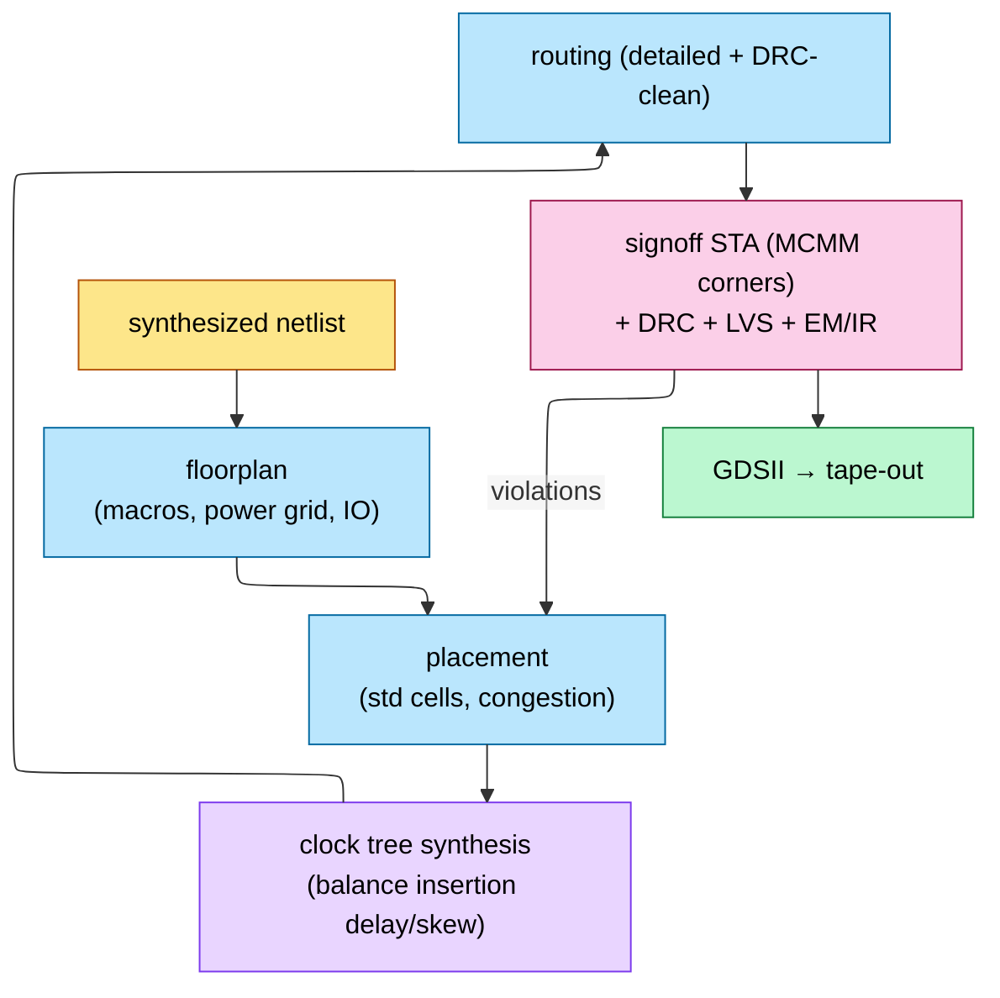

1. **Floorplan.** Place the big hard macros first—SRAM/register-file/cache macros, PHYs, and major fabric endpoints—then define I/O, channels, and the **power delivery network (PDN)**. The PDN must deliver the product's worst legal current step within static IR-drop, dynamic droop, electromigration, and thermal limits.
2. **Placement.** Standard cells are placed under simultaneous timing- and congestion-driven optimization. Regular datapaths (the multiplier arrays, the systolic PEs) are often **structured/relationally placed** by hand or datapath tools so the bit-slice regularity of §FP survives into silicon.
3. **CTS** (§1b.2) builds the balanced clock network.
4. **Routing.** Detailed routing over a dozen-plus metal layers, DRC-clean, honoring the same wire-dominated reality that made 4:2 compressors and Booth attractive in the first place.
5. **Signoff.** MCMM STA (§1b.4) **plus** DRC (design rules), LVS (layout-vs-schematic), and **EM/IR** (electromigration + IR-drop on the PDN). Violations loop back into placement/routing. Only a clean signoff yields **GDSII** for tape-out.

The exposure-field/reticle limit is one upper bound on die dimensions, but yield, cost, IP partitioning, memory shoreline, power delivery, and package technology usually constrain the economically useful die earlier. Multi-die partitioning trades those benefits against D2D PHY/adapter area, CDC, latency, power, verification, and package cost.

## 6. Verification reality

### 6.1 Why exhaustive simulation fails

FP32 addition already has $2^{64}$ ordered operand bit pairs before rounding mode and control state. A three-operand FP32 FMA has $2^{96}$ operand tuples. Pipelines, stalls, flushes, power/reset, and interacting queues multiply the sequential state. Simulation therefore samples behavior; it cannot enumerate the complete design.

Use different methods for different proof shapes:

- exact arithmetic equivalence and local invariants: formal/equivalence checking;
- long transaction interactions and software-visible sequences: constrained-random simulation/emulation;
- analog/CDC/physical assumptions: dedicated structural tools, characterization, and signoff;
- post-silicon rare events: assertions, trace, counters, error injection, and recovery telemetry.

### 6.2 Formal verification

Formal tools check assertions over all behaviors allowed by the assumptions, for example:

- accepted request is eventually retired or explicitly killed under a stated fairness assumption;
- no FIFO/credit counter overflows or underflows;
- each supported tiny FP format matches an exact integer reference for every input/mode;
- an iterative context cannot be overwritten;
- two grants cannot claim one single-ported resource in the same cycle.

There is no universal “number of states formal can handle.” Capacity depends on property, abstraction, structure, depth, memories, datapath width, assumptions, and engine. Use assume-guarantee decomposition, cut points, symmetry, parameter reduction, and targeted abstractions; separately validate that assumptions match integration.

### 6.3 Coverage-driven simulation (UVM)

For larger blocks, constrained-random stimulus drives legal and deliberately erroneous traffic while scoreboards compare architectural results. Coverage must include:

- functional crosses such as operation × format × class × rounding × stall/flush;
- assertion coverage and vacuity checks;
- code/toggle/FSM coverage with justified exclusions;
- queue occupancy, simultaneous completion, reset/power/clock transitions;
- injected corruption, timeout, replay, poison, and containment cases.

Coverage closure means every planned requirement has evidence or an approved justification. It does not prove the absence of bugs, and raw simulated cycle count is not a portable quality metric.

### 6.4 Errata: where verification fails

Escapes often occur at specification ambiguity or subsystem boundaries: arithmetic mode plus flush, DMA plus page fault, credit return plus reset, atomic response plus replay, power transition plus outstanding work, or firmware programming an unverified combination. The response can be:

- microcode/firmware/driver workaround;
- feature disable or constrained operating mode;
- reset/retry/containment procedure;
- new mask revision for logic that software cannot safely work around.

Do not diagnose a model NaN as a silicon erratum without reproducing it, checking software/race/numeric causes, collecting hardware error state, and matching a published or vendor-confirmed issue.

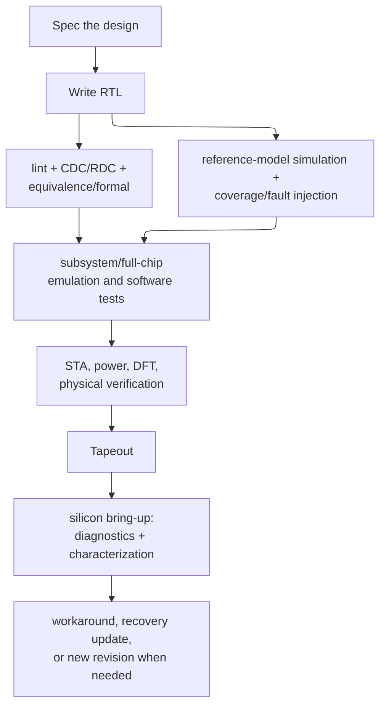

---

## 7. RAS for AI Accelerators

RAS means **reliability, availability, and serviceability**. The chip-design task is to define, for every storage/transport structure:

```text
fault model -> detection coverage -> correction/retry/containment
-> architectural indication -> telemetry -> recovery owner
```

A parity bit, SECDED code, CRC, or timeout is not “RAS” by itself. It is one detector inside a recovery contract.

### 7.1 ECC in datapaths

For a Hamming-style 64-data-bit SECDED word, seven location parity bits satisfy $2^7\ge64+7+1$, and one additional overall parity bit enables double-error detection: 72 stored bits before macro granularity, tags, spare rows, and routing. The raw check-bit overhead is therefore $8/64=12.5\%$, not a universal cache-area percentage.

Read hardware computes a syndrome and overall parity:

| Syndrome | Overall parity | Interpretation/action |
|---:|---:|---|
| zero | zero | no detected error |
| nonzero | one | correct the addressed codeword bit |
| zero | one | correct/ignore the overall-parity bit according to convention |
| nonzero | zero | detected uncorrectable even-weight error for SECDED |

The exact table depends on the parity convention, so encode and verify the chosen code matrix. Correction uses a syndrome decoder plus bit-flip mux/XOR network. That logic can sit:

- before the consumer in one cycle, increasing read latency/critical path;
- in a registered correction stage;
- on a replay path where the consumer is stalled and the corrected read is reissued.

Different structures choose different policies. Register files, shared memory, cache data, cache tags, queues, and control SRAMs have different widths, port counts, latency budgets, and consequences of an uncorrectable error. Some use parity plus replay, some SECDED, some stronger/burst-oriented codes, and some duplicate critical control state. HBM-side and link protection are generation/platform contracts; do not assume every detected transfer error supports transparent retry.

### 7.2 NoC error detection

Protect the fields according to consequence:

- header corruption can misroute or change operation/length, so validate it before route/state allocation;
- payload corruption can be corrected, replayed, or delivered as poison depending on the code and end-to-end protocol;
- router/NI buffers need ECC/parity because a flit may sit there for many cycles;
- credit counters, VC state, and route tables are control state and may need parity/duplication plus a recovery action.

A hop can use CRC/parity and replay if the transmitter retains an immutable copy and the receiver suppresses duplicates. Without replay state, detection must drop/poison/escalate; “CRC” does not itself retransmit.

Timeout is a watchdog, not proof of deadlock. Congestion, a powered-down destination, clock gating, or an intentionally long operation can all delay progress. Hardware should expose age/occupancy/credit/route diagnostics and apply a staged policy: warn, snapshot, stop injection, isolate a route/domain, then reset only when outstanding transaction disposition is defined.

### 7.3 Hardware scrubbers

A scrubber is an address generator plus read/check/correct/writeback FSMD:

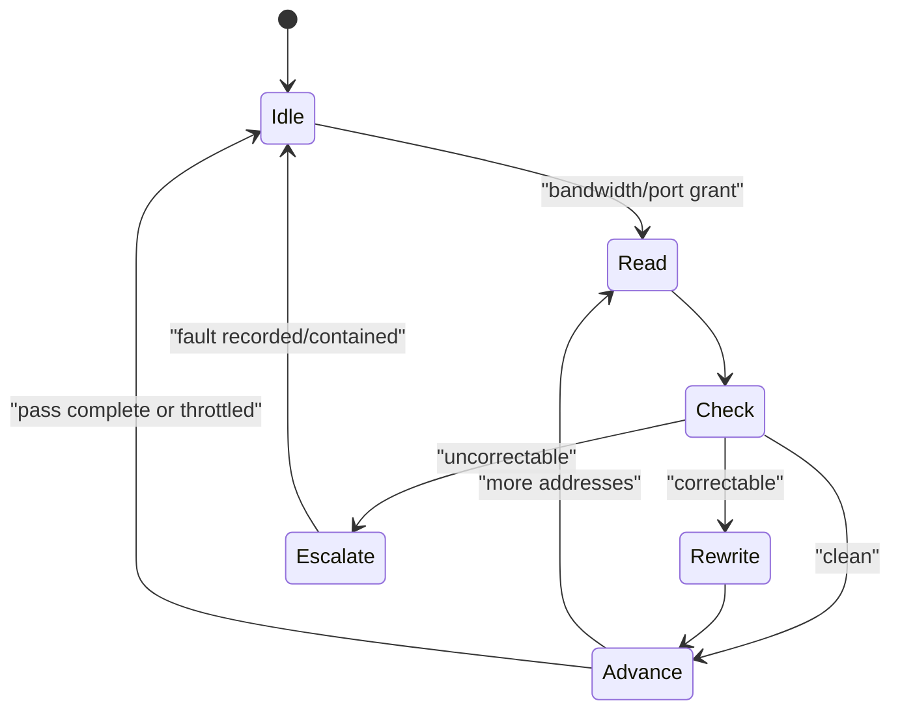

The scrub interval is derived from measured/qualified upset rate, codeword organization, acceptable probability of a second fault before repair, array availability target, and port/bandwidth cost. It is not a universal seconds value. The scrubber arbitrates with demand traffic, respects dirty/tag/coherence state, records syndrome/address counts, and must not overwrite a newer demand write.

### 7.4 RAS implications for rack-scale

Hardware fault containment can:

1. stop new traffic to a failed endpoint;
2. classify outstanding operations as completed, replayable, poisoned, or aborted;
3. contain dirty cache/memory ownership or report that it cannot be recovered;
4. preserve error logs and first-failure state;
5. reset/retrain a link, engine, SM partition, memory stack, or whole device;
6. expose health and topology changes to firmware/driver/fabric management.

Software owns checkpoint cadence, rank/job restart, spare allocation, tensor-shard reconstruction, and whether a degraded topology is usable. Hardware cannot infer how to rebuild distributed optimizer/model state. PCIe/CXL and accelerator fabrics expose their specified error/status/recovery mechanisms, but a link-level correctable error, an endpoint-fatal error, and lost application state require different responses.

### 7.5 RAS in the verification flow

Verify by fault site and recovery phase:

- exhaustively prove each single-bit codeword error corrects and every promised double-bit pattern detects;
- inject errors before/after ECC, in tags, route state, FIFOs, credits, replay buffers, and completion records;
- corrupt one link unit and prove replay does not duplicate an architectural write/atomic;
- collide scrub rewrite with demand read/write, eviction, and reset;
- fail an endpoint with outstanding reads, writes, atomics, and dirty ownership;
- prove poisoned data cannot be consumed silently;
- prove fatal-error containment stops new admission and preserves the first useful diagnostic;
- test repeated/cascading faults and failure of the recovery mechanism itself.

Arithmetic/formal proof covers the code and local control. Full-chip emulation/UVM/software tests cover firmware notification, reset sequencing, driver recovery, and distributed-job behavior.

---

## 8. End-to-end cause / effect

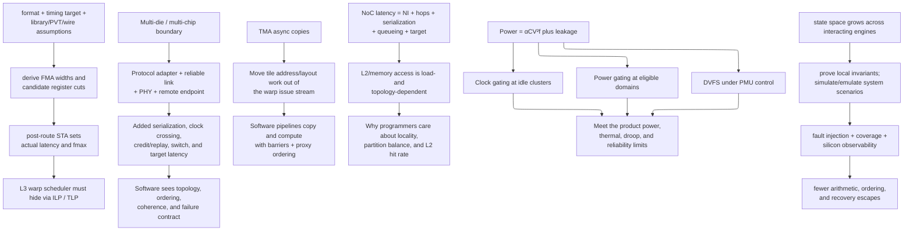

---

## 9. Numbers to memorize

| Quantity | Value | Why |
|---|---|---|
| setup budget | $T_{clk}\ge t_{cq}^{max}+t_{comb}^{max}+t_{setup}+t_{uncertainty}+t_{margin}$ | derive from the selected library/corner |
| hold constraint | $t_{cq}^{min}+t_{comb}^{min}\ge t_{hold}+\text{clock-arrival effect}$ | frequency-independent min-delay check |
| FO4 | inverter driving four identical inverters | logical-depth comparison, not a foundry ps guarantee |
| FMA latency/II | implementation and contract dependent | register cuts come from arithmetic state plus post-route timing |
| pipeline storage | $\sum_i(W_{data}+W_{control}+W_{tag}+W_{valid/kill})$ | count real registered bundles |
| synchronizer MTBF | proportional to $e^{T_{resolve}/\tau}/(f_{src}f_{dst}C)$ | choose stages from characterized library and target reliability |
| Async-copy address | $base+\sum i_d stride_d$ | nested-loop AGU |
| Data required in flight | $BL$ | bandwidth × round-trip latency |
| NoC link useful bandwidth | $wf\eta$ | width × frequency × efficiency |
| NoC unloaded packet latency | $L_{srcNI}+HL_{head-hop}+F-1+L_{dstNI}+L_{target}$ | separates hop and serialization costs |
| VC credit invariant | available + in-flight + occupied = depth | prevents loss/overflow/deadlock |
| Inter-chip delivered bandwidth | $NR\prod\eta_i$ one way | separates raw lanes from usable payload |
| Inter-chip outstanding window | $W\ge BL$ | tags, replay, credits, and buffers must all cover the loop |
| ACK versus completion | adjacent receipt versus remote visibility | prevents early software/buffer reuse |
| transaction ID versus link sequence | end-to-end operation versus hop retry | enables exactly-once atomics/writes |
| D2D bandwidth density | one-way GB/s per mm die edge | chiplet shoreline/bump constraint |
| UALink 1.0 cache coherence | software across accelerator caches | remote memory semantics are not full snoop coherence |
| ECC raw check overhead example | 64 data + 8 SECDED bits = 72 bits | 12.5% raw bits before macro/system overhead |
| scrub rate | reliability target / upset model / port budget dependent | no universal patrol interval |
| clock/power gating cost | library, domain, CTS, isolation, retention dependent | verify timing, test, wake, and energy |
| signoff matrix | all required PVT/RC/mode/variation analyses | setup and hold can have different worst cases |
| temperature inversion | possible at low voltage | check characterized corners, not a fixed hot/slow rule |
| PD signoff checks | STA + DRC + LVS + EM/IR | all must be clean for GDSII |

---

## 10. References

**Foundational**
- Dally & Towles, *Principles and Practices of Interconnection Networks* — NoC topology, deadlock, VCs.
- Dally & Poulton, *Digital Systems Engineering* — CDC, signaling, PI design.
- Weste & Harris, *CMOS VLSI Design* — pipelining, clock-tree, ICG patterns.
- Kahng, Lienig, Markov & Hu, *VLSI Physical Design: From Graph Partitioning to Timing Closure* — floorplan → place → CTS → route → signoff.
- Bhasker & Chadha, *Static Timing Analysis for Nanometer Designs* — setup/hold, OCV, MCMM corners.
- Leiserson & Saxe, *Retiming Synchronous Circuitry*, Algorithmica 1991 — register balancing.

**Recent**
- Choquette et al., *NVIDIA Hopper Architecture*, IEEE Micro 2023 — TMA disclosure.
- NVIDIA, [CUDA Programming Guide](https://docs.nvidia.com/cuda/cuda-programming-guide/) — asynchronous copies, TMA, barriers, thread scopes, memory synchronization domains, and CUDA C++ memory model.
- NVIDIA, [Parallel Thread Execution ISA](https://docs.nvidia.com/cuda/parallel-thread-execution/) — bulk/tensor async instructions, `mbarrier`, scoped fences/atomics, and proxy ordering.
- PCI-SIG, [PCI Express Base Specification Revision 7.0](https://pcisig.com/PCIExpress/Spec/Base/_7.0).
- Compute Express Link Consortium, [CXL Specification 4.0](https://computeexpresslink.org/).
- UCIe Consortium, [UCIe Specification 3.0](https://www.uciexpress.org/specifications).
- UALink Consortium, [UALink specifications](https://ualinkconsortium.org/specification/).
- Wang et al., *NV-HBI Cross-Die Bridge for Blackwell*, Hot Chips 2024.
- Foundry-DTCO disclosures from TSMC / Intel — pipelining-friendly cell libraries.

---

**Up the stack:** [L3 Microarchitecture](../L3_Microarchitecture/00_Index.md) — these RTL patterns become SMs, ISAs, and rooflines.
**Down the stack:** [Systolic_Arrays_and_Dataflow](03_Systolic_Arrays_and_Dataflow.md), [FP_Unit_Design](02_FP_Unit_Design.md), [On_Chip_Memory_Hardware](01_On_Chip_Memory_Hardware.md).
