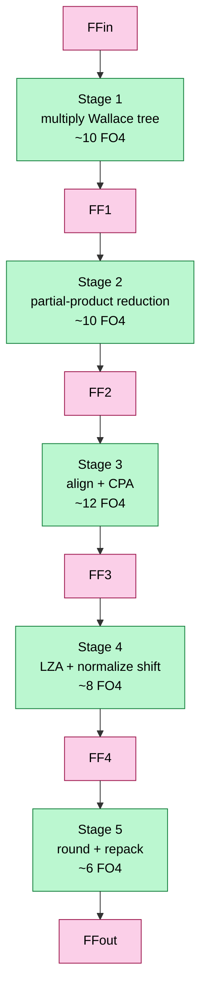
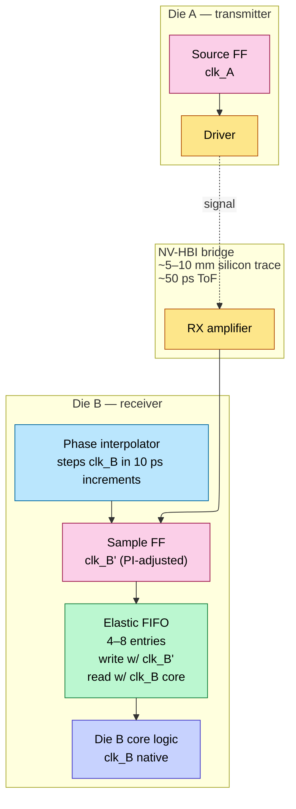
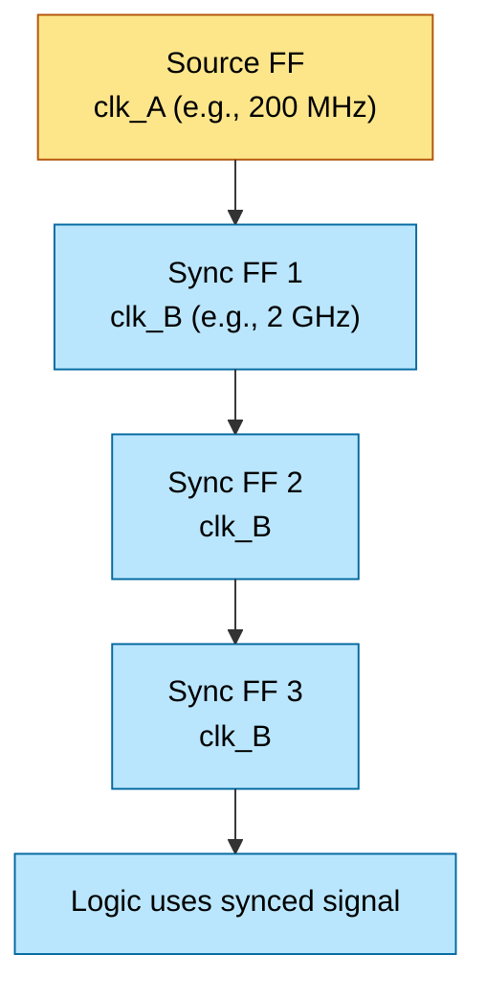
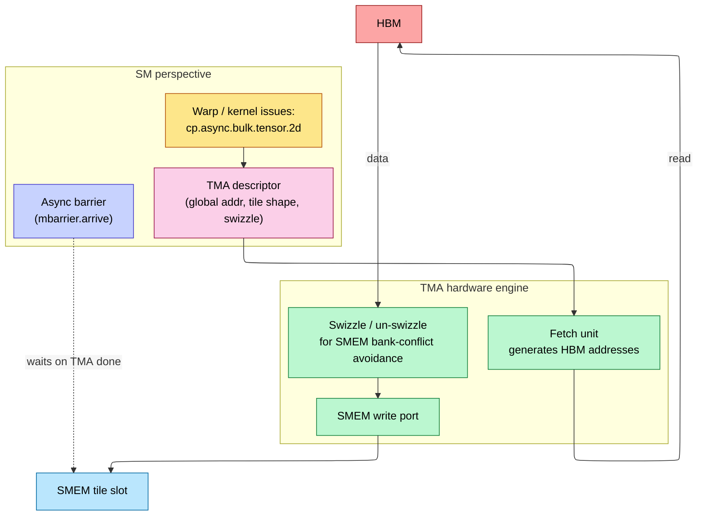
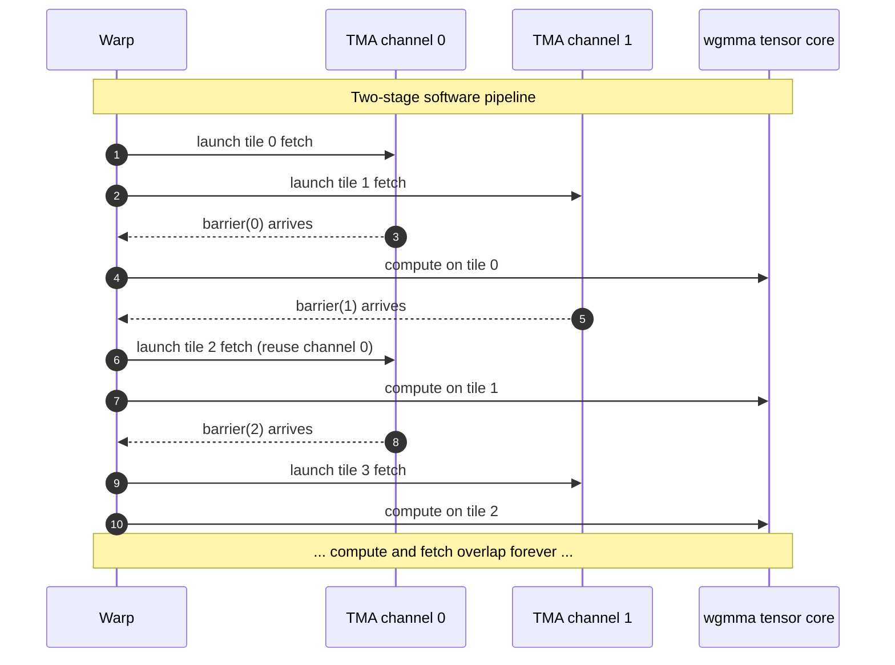
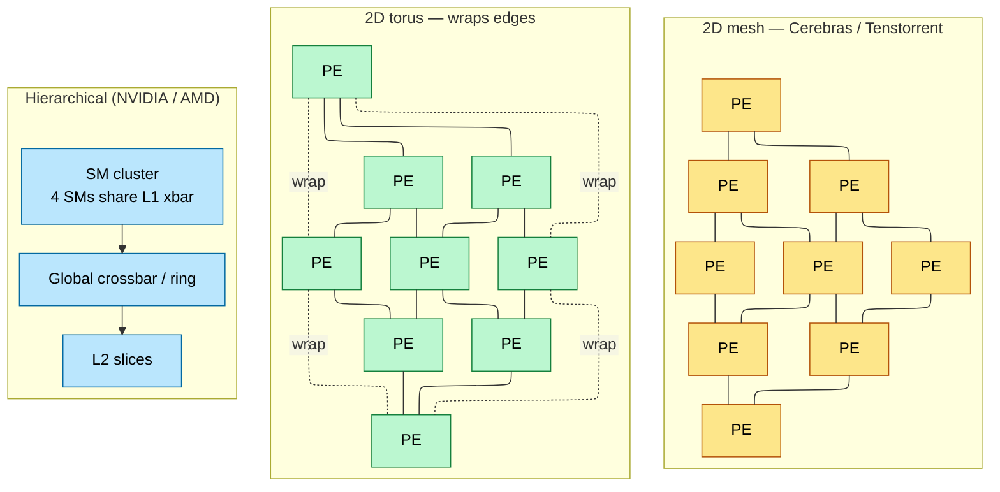
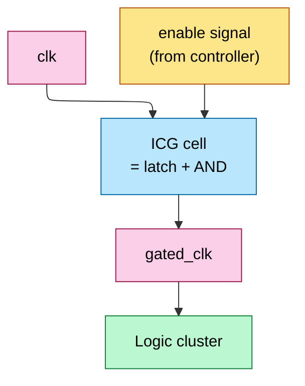
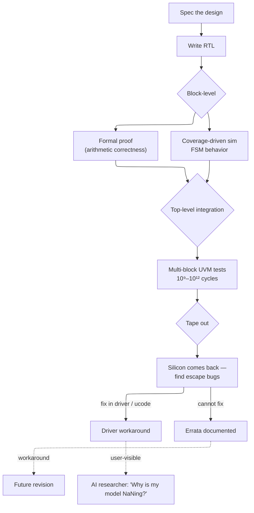
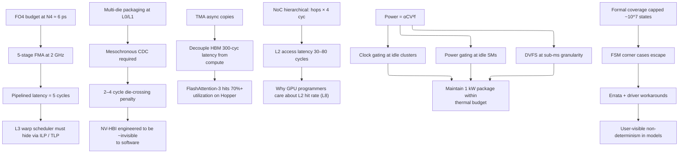

# Digital Design for AI — Pipelining, CDC, NoC, Async Copies

> **Layer:** L2 (integration page).
> **Prerequisites:** [On_Chip_Memory_Hardware](01_On_Chip_Memory_Hardware.md), [FP_Unit_Design](02_FP_Unit_Design.md), [Systolic_Arrays_and_Dataflow](03_Systolic_Arrays_and_Dataflow.md). RTL fluency (FFs, FSMs, FIFOs).
> **Hands off to:** [L3 Microarchitecture](../L3_Microarchitecture/00_Index.md) — where these patterns become SMs, ISAs, and rooflines.

---

## 0. Where this page sits

The previous three L2 pages gave you the *building blocks*: memory cells, FP units, and dataflow patterns. This page is about **how those blocks are wired into a working chip** at the synthesizable RTL level. Specifically:

1. Pipelining and timing closure ($f_{\max}$ derivations, FO4 budget).
2. Clock-domain crossing (CDC), which becomes mandatory at multi-die scale.
3. Async copy engines (TMA-style) — the magic that decouples HBM latency from compute.
4. Network-on-chip (NoC) topology and routing math.
5. Clock and power gating — the only way to keep TDP within thermal budget.
6. Verification reality: why formal tools work for arithmetic but fail for FSM interactions, why errata exists.

Read the prior three L2 pages first; this one assumes them.

---

## 1. Pipelining and timing closure

### 1.1 The fundamental clock-period equation

For a synchronous pipeline stage, the minimum clock period is

$$
T_{\text{clk}} \;\ge\; t_{c\to q} + t_{\text{logic}} + t_{\text{setup}} + t_{\text{skew}}
$$

- $t_{c\to q}$: clock-to-Q delay of the source flip-flop, typically 30–60 ps at TSMC N4.
- $t_{\text{logic}}$: combinational delay through the stage's logic (the variable you control).
- $t_{\text{setup}}$: setup time of the destination flip-flop, ~30–50 ps.
- $t_{\text{skew}}$: clock-distribution skew between source and destination clocks, ~20–60 ps depending on clock-tree quality.

Total flip-flop overhead is usually budgeted at **~100 ps**. At a 2 GHz target ($T_{\text{clk}} = 500$ ps), the usable logic budget is **~400 ps**.

### 1.2 The FO4 unit

Process-independent timing reasoning uses **FO4** — the delay of an inverter driving four identical inverters. Key process-node FO4s:

| Node | FO4 (ps) |
|---|---|
| TSMC N7 | ~10 |
| TSMC N5 | ~7 |
| TSMC N4P | ~6 |
| TSMC N3E | ~5 |
| TSMC N2 (proj.) | ~4.2 |

A 400 ps logic budget at N4 = ~67 FO4 of usable depth. This is why combinational structures with deep paths (24-bit CPA, FP32 alignment shifter) must be pipelined into multiple stages.

### 1.3 Pipelining a deep MAC

A purely combinational FP32 FMA exceeds 50 FO4 (multiply tree + alignment + CPA + LZA + normalize + round). At N4 (~6 ps/FO4), that's ~300 ps — already past the 400 ps logic budget at 2 GHz, with no margin for variation.

Solution: pipeline. For a 5-stage pipeline:

Each stage now has ~10 FO4 of logic + 4 FO4 of FF overhead = ~14 FO4 ≈ 84 ps at N4 — well under the 500 ps budget at 2 GHz. Cost: 5-cycle execution latency per FMA. The warp scheduler must issue independent FMAs to keep the pipeline full (covered in [L3 GPU_Architecture](../L3_Microarchitecture/00_Index.md)).

### 1.4 The pipeline-vs-area tradeoff

Each pipeline boundary inserts $\sim 24 \cdot N_{\text{bits}}$ flip-flops (sum + carry vectors at FP32 = 50 bits → ~1 200 FFs per boundary). At ~10 NAND2-equivalent area per FF, a 5-stage FMA carries ~6 000 NAND2 of pipeline overhead — already comparable to the multiplier itself. Pipelining beyond ~6 stages costs more area than the combinational logic it splits up. This is the practical ceiling: **you can't just keep pipelining to push $f_{\max}$ higher**.

---

## 2. Clock-domain crossing (CDC)

### 2.1 The mesochronous problem

A multi-die GPU (e.g., B200 with two dies bridged by NV-HBI) runs both dies at nominally 2 GHz. But:

- Each die has its own PLL, so frequencies match to ±100 ppm but phase relationship is unknown.
- Voltage droop, thermal drift, and routing delay over the 5–10 mm bridge introduce sub-cycle phase wandering.
- Time-of-flight across the bridge is ~50 ps — already 25% of a 2 GHz cycle.

Sending data across this boundary requires explicit synchronization. **Mesochronous** = same nominal frequency, unknown drifting phase. Sub-classes:

- **Synchronous:** same clock signal physically distributed → trivial.
- **Mesochronous:** same frequency, fixed phase offset → easy (delay-line tune).
- **Plesiochronous:** very-close-but-not-equal frequencies → needs occasional FIFO drain.
- **Asynchronous:** unrelated frequencies → expensive synchronizers.

NV-HBI is mesochronous-with-phase-drift; the receiver needs phase tracking but not full-blown async sync.

### 2.2 The phase interpolator + elastic FIFO

How it works:

1. **Phase interpolator (PI):** a mixed-signal block that mixes two phase-shifted clocks (e.g., 0° and 90°) in continuous proportion to produce an arbitrary phase $\phi \in [0, 360°)$. Resolution typically 16–64 phase steps per cycle.
2. **Per-pin training:** at boot, a pseudo-random pattern is sent. The receiver sweeps the PI across phase, sampling each setting and measuring bit-error rate (BER). The sweep finds the *phase that centers the eye*.
3. **Elastic FIFO:** writes occur on the PI-adjusted sample clock; reads occur on the receiver's native core clock. The FIFO depth (4–8 entries) absorbs the small phase drift between the two clocks during runtime.

### 2.3 CDC latency cost

Each CDC adds 2–4 cycles (PI + FIFO traverse). For a B200 with NV-HBI between two dies, a memory access from die A to die B's HBM pays:

$$
\text{cross-die latency} \;\approx\; \underbrace{\text{NV-HBI traverse}}_{\sim 4\text{ cyc}} \;+\; \underbrace{\text{die-B local path}}_{\sim 2\text{ cyc}} \;+\; \underbrace{\text{HBM access}}_{300\text{ cyc}}
\;\approx\; 306\text{ cyc}
$$

vs ~302 cycles on the local die. <2% latency penalty. This is why NVIDIA can claim "single GPU" coherency on B200 — the CDC is engineered to be invisible to software at typical access granularity.

### 2.4 True async CDC: the synchronizer chain

When two clock domains have *unrelated* frequencies (e.g., a peripheral clock domain at 200 MHz vs core at 2 GHz), simple PI + FIFO doesn't help. You need a **multi-flop synchronizer**:

The reason for multiple stages: when clk_A's edge arrives within the metastability window of SYNC1, SYNC1's output may oscillate (metastability) for several picoseconds. Each subsequent stage gives metastability more time to resolve. **Mean Time Between Failure (MTBF):**

$$
\text{MTBF} \;\propto\; \frac{1}{T_{\text{clk}}} \cdot \exp\!\left(\frac{N \cdot T_{\text{slack}}}{\tau}\right)
$$

where $N$ is the number of sync stages, $T_{\text{slack}}$ is the time per stage minus FF setup, and $\tau$ is a process-dependent metastability time constant (~10–30 ps). 3 stages typically gives MTBF > 10⁹ years. The multi-flop synchronizer is the single most important RTL pattern in chip-multi-clock-domain design.

---

## 3. Async copy engines (TMA pattern)

### 3.1 Why the warp can't move data efficiently

In the GPU's "classical" model, a warp of 32 threads cooperatively loads a tile from HBM into SMEM via 32 individual loads. Cost:

- Each thread issues a load instruction → consumes scheduler issue slot.
- Each load occupies the load-store unit's pipeline.
- Latency-hiding via warp swap is the only way to absorb HBM's 300-cycle round-trip.

This wastes scheduler bandwidth. NVIDIA's solution: **TMA (Tensor Memory Accelerator)** in Hopper / Blackwell.

### 3.2 TMA architecture

Properties:

- **Single instruction** moves an entire 2D / 3D tile (KB to MB scale).
- **Async**: the warp continues executing other instructions while the TMA fetches.
- **Hardware-managed addresses, swizzle, and bank-conflict layout** — the kernel writer just describes the tile shape; the TMA generates compatible addresses.
- **Barrier-synchronized**: an `mbarrier` token indicates completion; the warp waits on the barrier before consuming the data.

Performance impact: a Hopper SMEM tile load that previously cost ~50 cycles of warp issue now costs ~2 cycles (just to issue the TMA command). Effective scheduler throughput rises ~25× for memory-heavy kernels.

### 3.3 The double-buffered TMA pattern

The canonical kernel:

This is what gives FlashAttention its >70% utilization on Hopper — the TMA fetches the next $K$ tile while the wgmma computes on the current one.

---

## 4. Network-on-chip (NoC)

### 4.1 Why crossbars don't scale

A direct crossbar between $N$ source SMs and $M$ L2 slices has $N \cdot M$ wires. For 128 SMs × 64 L2 slices = ~8 200 wires per *bit* of payload — at 256-bit transactions, ~2.1 M wires across the chip. Routing density is impossible at frontier nodes; arbitration logic alone exceeds 10% of die area.

### 4.2 Mesh, torus, and hierarchical NoCs

| Topology | Bisection BW | Avg hops | Use case |
|---|---|---|---|
| 2D mesh ($N×N$) | $O(N)$ | $N/3$ | Cerebras WSE, Tenstorrent |
| 2D torus | $O(N)$ × 2 | $N/4$ | TPU pod (3D torus extended) |
| Hierarchical ring + xbar | $O(\sqrt{N})$ | $O(\log N)$ | NVIDIA SM-to-L2 |
| Fat tree | $O(N)$ | $O(\log N)$ | InfiniBand off-chip (L4) |

### 4.3 Routing, virtual channels, deadlock

A naïve mesh with adaptive routing can deadlock: cyclic dependencies on buffer space (e.g., NW-SE traffic blocks NE-SW traffic which blocks NW-SE...). Solutions:

- **Dimension-order routing (DOR / XY):** always route X first, then Y. Provably deadlock-free but underutilizes bandwidth.
- **Virtual channels (VC):** split each physical link into 2–4 logical channels with independent buffer pools. Cycles in dependency graph are broken by routing certain traffic on dedicated VCs.
- **Adaptive routing with VCs:** combines high utilization with deadlock freedom.

NVIDIA's hierarchical NoC uses dedicated VCs for: requests, responses, write-acks, snoop traffic, and broadcast. ~5 VCs typical; each VC has 4–8 entry buffers. Per-router area: ~0.05 mm² at N4.

### 4.4 Latency budget

Per router traversal:

- Routing computation: 1 cycle.
- VC arbitration: 1 cycle.
- Crossbar traversal: 1 cycle.
- Link traversal: 1 cycle (wire delay across ~1 mm).

So 4 cycles per hop is typical. Across a 12-hop diameter (B200 die corner-to-corner): ~48 cycles of NoC latency *just to reach L2*. This is why ALU latency is fully hidden by the warp scheduler but L2 latency is *not* — and why GPU programmers care about L2 hit rate.

---

## 5. Clock and power gating

### 5.1 Clock gating

Dynamic power $P = \alpha C V^2 f$. Idle logic with no useful work to do still toggles internal nodes if its clock keeps running. Solution: insert an AND gate (or, in modern flows, a dedicated **integrated clock gating cell** ICG) that masks the clock when the logic is unused.

When EN is low, GCLK doesn't toggle → flip-flops in the cluster don't update → no internal switching. Saves the *clock-tree* portion of dynamic power (which is itself ~30% of total dynamic power on a frontier accelerator) plus the FF and combinational power downstream.

The latch in the ICG cell is critical: it prevents glitches on EN from creating spurious clock edges — a glitch through a plain AND gate would clock the entire cluster mid-cycle, corrupting state.

### 5.2 Power gating

For deeper savings, *cut the supply rail* to an idle block via a header switch (PMOS pass transistor). Eliminates leakage as well as dynamic. Cost:

- Header switch area: ~5% of the gated block.
- Wakeup time: ~10s of cycles to charge the rail back up (deep-trench-cap recharge rate limits).
- State loss: gated FFs lose their state — must save to retention FFs or to L2 before powering off.

GPU SMs use coarse-grain power gating: when fewer than N warps are active, idle SMs are fully powered off until the kernel scales up. Wakeup cost is amortized over the kernel runtime.

### 5.3 DVFS — dynamic voltage and frequency scaling

The chip can drop $V_{dd}$ when it doesn't need peak frequency. Power scales as $V^2 f$, and at fixed $f$ you can lower $V$ by ~50–100 mV before timing fails. Saves ~25% of dynamic power for free during memory-bound phases.

Modern GPUs DVFS at sub-millisecond granularity, with ~10 distinct V/f operating points selected by the on-die power-management controller (PMU) responding to telemetry from MAC utilization counters.

---

## 6. Verification reality

### 6.1 Why exhaustive simulation fails

A single FP MAC has $2^{64}$ possible input combinations. At 1 ns per simulated FMA, exhaustive testing takes $2^{64} \cdot 10^{-9}$ s ≈ 585 years. Multiply by hundreds of thousands of MACs and millions of FSM states — *totally* infeasible.

### 6.2 Formal verification

Mathematical proof (SAT/SMT solvers) checks logical properties:

- "For all inputs A, B with A=0, the multiplier output is exactly 0."
- "For all sequences, no two threads write to the same RF entry in the same cycle."
- "The wgmma issue FSM never enters the deadlock state where READY and ACK are both stuck low."

Formal scales to ~10^7 state-space exploration; large enough to verify isolated arithmetic blocks (multipliers, adders) and small FSMs but not entire SMs.

### 6.3 Coverage-driven simulation (UVM)

For larger blocks, randomized testing with coverage tracking. Stimulus generators randomize input streams; coverage points (FSM state visits, edge cases, corner-case interactions) are tracked. Test ends when coverage closes, not when "no bug found".

Typical bring-up campaign: 10⁹–10¹² simulated cycles per major block, taking 6+ months on a server farm.

### 6.4 Errata: where verification fails

State-space explosion masks deep corner-case bugs in *interacting* FSMs. Examples that have shipped:

- Hopper TMA + wgmma + interrupt corner case → silent NaN.
- AMD MI250 inter-XCD coherency violation under specific atomics ordering → data race.
- TPU v4 SparseCore matmul truncation under specific batch shapes → silent wrong answer.

When found, vendors release **errata** documents and driver-level workarounds. AI researchers occasionally hit "non-deterministic NaNs on specific matrix sizes" — usually an undocumented erratum being sloppily masked.

---

## 7. RAS for AI Accelerators

RAS = **Reliability, Availability, Serviceability**. At rack scale, a single GPU failure rate of ~0.1% per month means a 72-GPU NVL72 pod expects a GPU failure roughly every 2 weeks. RAS features are the hardware and firmware mechanisms that keep the cluster productive despite component failures.

### 7.1 ECC in datapaths

SRAM arrays throughout the accelerator (SMEM, register file, L2 slices) are protected by **SECDED** — Single Error Correction, Double Error Detection — typically using a Hamming code (e.g., 72-bit codeword = 64 data bits + 8 check bits).

- **Area overhead**: ~6.25% for 64-bit data (8 check bits / 128 total with ECC).
- **Behavior on single-bit error**: hardware transparently corrects the bit in-line; no pipeline stall, no software notification required.
- **Behavior on double-bit error**: uncorrectable; raises a machine-check interrupt. The driver must decide whether to kill the workload or attempt recovery.

HBM uses a two-layer protection scheme:
- **On-die ECC**: per-HBM-chip, transparent to the GPU. Each HBM DRAM chip stores extra check bits alongside data; single-bit errors within the DRAM chip are corrected before the data leaves the HBM package.
- **Link-level CRC**: data in transit across the HBM PHY is protected by a CRC that detects multi-bit transmission errors (caused by EMI, voltage droop, or clock jitter on the PHY). CRC failure triggers a link-level retry.

### 7.2 NoC error detection

The on-chip NoC (Section 4) carries flits (flow-control units) between SMs, L2 slices, and HBM controllers. Error detection is applied at the flit level:

- **Parity on flit headers**: a single parity bit covers the routing, virtual-channel, and control fields. Header parity failure indicates a routing or arbitration error.
- **ECC on flit payload**: SECDED protection on the data payload, matching the L2/SRAM ECC scheme.
- **Credit-based flow control with timeout-based deadlock detection**: each VC maintains a credit counter. If credits are not returned within a timeout window (typically ~1 us), the NoC raises a deadlock alert. This catches both hardware routing bugs and software-induced protocol deadlocks.

### 7.3 Hardware scrubbers

Soft errors (cosmic-ray-induced bit flips) accumulate in SRAM arrays over time. At the error rates typical of frontier silicon (~100–400 FIT per Mb), a 50 MB L2 cache expects ~0.5–2 soft errors per day. **Background ECC scrubbers** scan SRAM arrays during idle cycles, reading each location, checking ECC, and correcting single-bit errors before they accumulate into uncorrectable double-bit errors. Scrubbing rate is typically one full scan every 1–10 seconds.

### 7.4 RAS implications for rack-scale

At production scale, RAS is not optional — it is a survival requirement:

- **Single GPU failure rate**: ~0.1% per month in production (based on Google and Meta fleet data). For a 72-GPU NVL72 pod, this translates to an expected GPU failure every ~2 weeks.
- **NVL72 fault containment**: the rack-level interconnect must handle single-GPU failures without killing the entire job. Two strategies: (a) **checkpoint-restart** — periodically snapshot model state to shared storage; on failure, restart the job on the remaining 71 GPUs. (b) **Live migration** — dynamically remap the failed GPU's shard to a spare GPU in the rack, with minimal interruption. NVIDIA's NVL72 architecture includes spare GPU slots for this purpose.
- **PCIe/CXL AER (Advanced Error Reporting)**: the PCIe/CXL link between the GPU and the host CPU provides detailed error status for link-level errors (correctable and uncorrectable), enabling the driver to distinguish between transient errors (retry) and permanent failures (isolate the GPU).

### 7.5 RAS in the verification flow

RAS features add to the verification burden (Section 6). Error-injection tests (deliberately flipping bits in SRAM, injecting CRC errors on HBM links, forcing NoC timeouts) are a standard part of the bring-up campaign. Formal verification can prove that SECDED correction logic is correct for all single-bit error patterns, but system-level RAS behavior (e.g., "a GPU failure during a distributed all-reduce does not corrupt the remaining GPUs") requires full-system UVM tests that are among the most complex in the verification campaign.

---

## 8. End-to-end cause / effect

---

## 9. Numbers to memorize

| Quantity | Value | Why |
|---|---|---|
| FF clk-to-Q delay (TSMC N4) | 30–60 ps | Pipeline overhead floor |
| FF setup time | 30–50 ps | Pipeline overhead floor |
| Clock skew typical | 20–60 ps | Distribution-tree quality |
| Total FF overhead per stage | ~100 ps | What you "lose" to pipelining |
| FO4 (TSMC N4) | ~6 ps | Process-independent timing unit |
| FO4 (TSMC N2 proj.) | ~4.2 ps | Next gen |
| Logic budget per stage at 2 GHz | ~400 ps ≈ 67 FO4 | Usable depth |
| FP32 FMA combinational depth | ~50 FO4 | Why pipelined |
| Typical FMA pipeline depth | 4–6 stages | Latency vs $f_{\max}$ |
| Multi-flop sync stages for MTBF > 10⁹ y | 3 | Async CDC standard |
| NV-HBI mesochronous CDC penalty | 2–4 cycles | Cross-die access |
| TMA tile size | KB to MB | One instruction per tile |
| TMA scheduler issue cost | ~2 cycles | vs ~50 for naïve loads |
| NoC router latency | ~4 cycles/hop | Routing + arb + xbar + link |
| Hierarchical NoC diameter (B200 die) | ~12 hops | ~48 cycle latency to far L2 |
| ICG cell area overhead | ~5% of gated block | Standard |
| Power-gating wakeup time | ~10s of cycles | DTC recharge |
| DVFS granularity | sub-ms | PMU-driven |
| Formal verification scaling ceiling | ~10⁷ states | Why FSMs escape |
| Block-level UVM cycles | 10⁹–10¹² | Months on farm |
| Errata count per major GPU launch | 50–200 | Documented post-tape-out |

---

## 10. References

**Foundational**
- Dally & Towles, *Principles and Practices of Interconnection Networks* — NoC topology, deadlock, VCs.
- Dally & Poulton, *Digital Systems Engineering* — CDC, signaling, PI design.
- Weste & Harris, *CMOS VLSI Design* — pipelining, clock-tree, ICG patterns.

**Recent**
- Choquette et al., *NVIDIA Hopper Architecture*, IEEE Micro 2023 — TMA disclosure.
- Wang et al., *NV-HBI Cross-Die Bridge for Blackwell*, Hot Chips 2024.
- Foundry-DTCO disclosures from TSMC / Intel — pipelining-friendly cell libraries.

---

**Up the stack:** [L3 Microarchitecture](../L3_Microarchitecture/00_Index.md) — these RTL patterns become SMs, ISAs, and rooflines.
**Down the stack:** [Systolic_Arrays_and_Dataflow](03_Systolic_Arrays_and_Dataflow.md), [FP_Unit_Design](02_FP_Unit_Design.md), [On_Chip_Memory_Hardware](01_On_Chip_Memory_Hardware.md).
