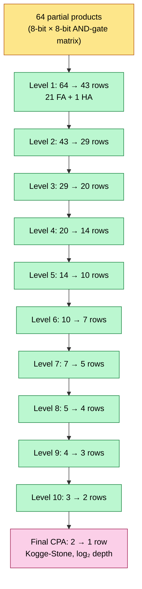
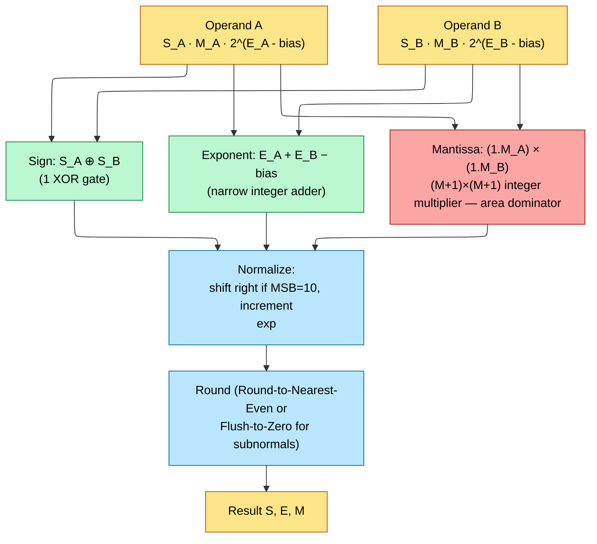
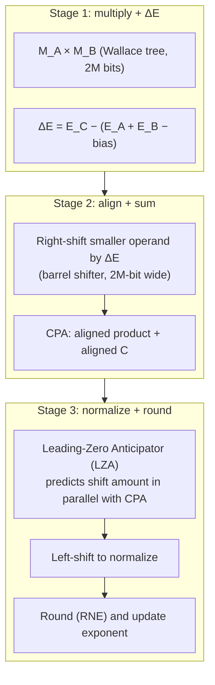
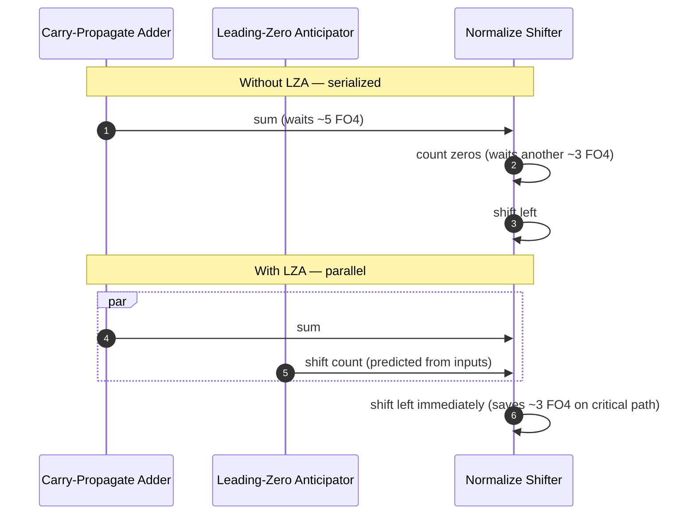
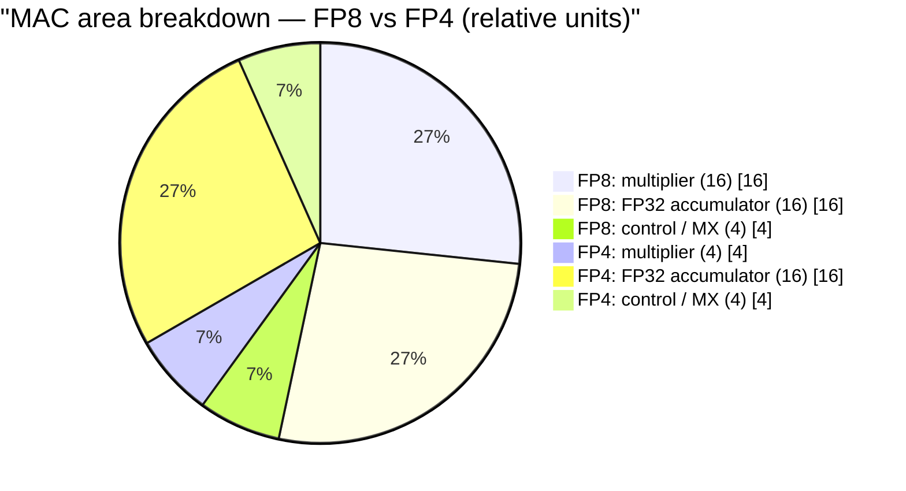
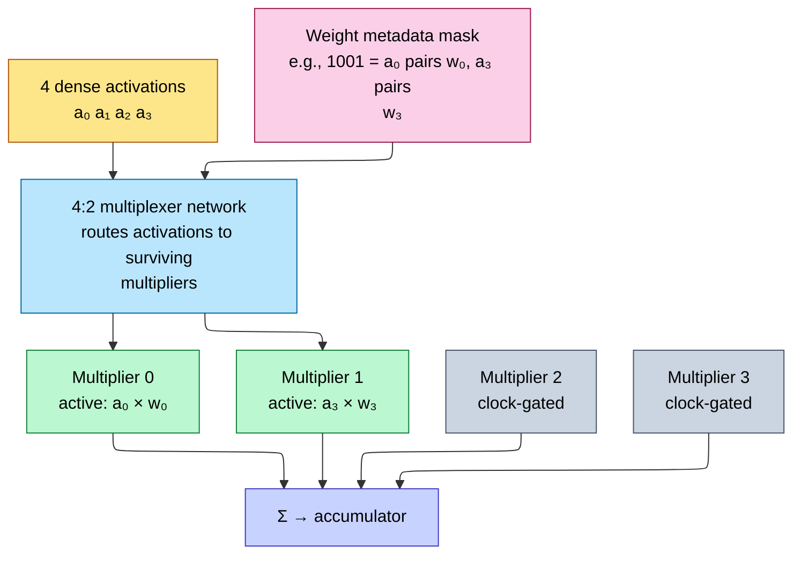
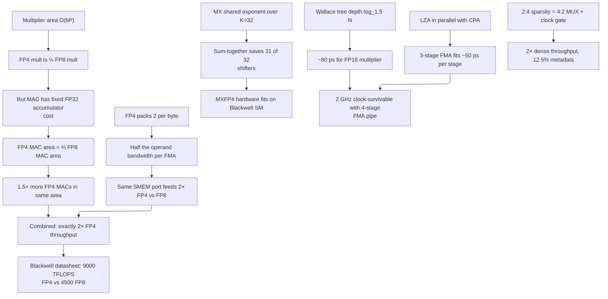

# FP Unit Design — Multipliers, Wallace Trees, FMA, MX Formats

> **Layer:** L2.
> **Prerequisites:** [On_Chip_Memory_Hardware](On_Chip_Memory_Hardware.md). IEEE-754 basics assumed.
> **Hands off to:** [Systolic_Arrays_and_Dataflow](Systolic_Arrays_and_Dataflow.md), [L3 Microarchitecture](../L3_Microarchitecture/Index.md).

---

## 0. Why this layer matters

Every TFLOPS number on a Blackwell or MI355X spec sheet is the product of four factors:

$$
\text{TFLOPS} \;=\; N_{\text{MAC}} \cdot \text{ops/MAC/cycle} \cdot f_{\text{clk}} \cdot \text{utilization}
$$

L0 sets the silicon area budget; L1 sets the operand-bandwidth ceiling; L2's contribution is **how many MAC units you can fit and how fast they switch**. The answer is set by two things: (1) the integer multiplier's $O(M^2)$ area scaling and (2) the FP32 accumulator's fixed cost. Once you internalize that the FP4-vs-FP8 throughput law is *exactly* 2× — not 4× — for *exactly this reason*, every roadmap decision (Blackwell FP4, MI400 FP4, future FP3) becomes predictable.

---

## 1. The IEEE-754 vs MX format zoo

### 1.1 IEEE-754 representation

A floating-point number:

$$
V \;=\; (-1)^S \cdot (1.M) \cdot 2^{E - \text{bias}}
$$

with sign bit $S$, mantissa $M$ ($m$ explicit bits + 1 implicit leading 1), exponent $E$ ($e$ bits) and bias $= 2^{e-1} - 1$.

| Format | Bits | S | E | M | Bias | Dynamic range | AI use |
|---|---|---|---|---|---|---|---|
| FP64 | 64 | 1 | 11 | 52 | 1023 | $\pm 1.8\times 10^{308}$ | scientific only |
| FP32 | 32 | 1 | 8 | 23 | 127 | $\pm 3.4\times 10^{38}$ | accumulation, softmax, master weights |
| TF32 | 19 | 1 | 8 | 10 | 127 | $\pm 3.4\times 10^{38}$ | Ampere matmul |
| BF16 | 16 | 1 | 8 | 7 | 127 | $\pm 3.4\times 10^{38}$ | training (gradient-robust) |
| FP16 | 16 | 1 | 5 | 10 | 15 | $\pm 65 504$ | legacy inference |
| FP8 E4M3 | 8 | 1 | 4 | 3 | 7 | $\pm 448$ | forward, activations |
| FP8 E5M2 | 8 | 1 | 5 | 2 | 15 | $\pm 57 344$ | backward, gradients |
| FP6 E3M2 | 6 | 1 | 3 | 2 | 3 | $\pm 28$ | research |
| FP4 E2M1 | 4 | 1 | 2 | 1 | 1 | $\pm 6$ | Blackwell inference |

Range vs precision tradeoff: BF16 and FP8 E5M2 keep wide range (large exponent) at the cost of mantissa precision. FP16 and FP8 E4M3 do the inverse.

### 1.2 OCP MX (microscaling) formats

Sub-8-bit formats (FP4, FP6) have such tiny native dynamic range that a single layer's activations would saturate. The fix: **a shared exponent over a block** of $K$ elements:

$$
V_i \;=\; (-1)^{S_i} \cdot (1.M_i) \cdot 2^{E_i - \text{bias}} \cdot 2^{E_{\text{shared}} - \text{bias}_{\text{shared}}}
$$

OCP MX standard:
- $K = 32$ elements per block
- Shared scale: 8-bit E8M0 (no mantissa, just an exponent)
- Block: 32 element values

For MXFP4: $32 \cdot 4 + 8 = 136$ bits per block → **4.25 bits/element amortized**. FP4 alone has a dynamic range of $\pm 6$; with the 8-bit shared exponent the effective range becomes $2^{2^7} = 2^{128}$ — vastly more than enough.

NVFP4 is NVIDIA's variant: $K = 16$ instead of 32, FP8 (not FP4) shared scale. Trades amortization for finer-grained precision.

---

## 2. The integer multiplier

### 2.1 Area scaling: O(M²)

An $M$-bit × $M$-bit unsigned multiplier is fundamentally a 2D array of partial-product gates. With Booth-radix-2 encoding (each multiplicand bit ANDed with each multiplier bit), there are $M^2$ partial products. Wallace/Dadda reduction collapses them to two final operands, then a CPA (carry-propagate adder) resolves the sum.

| $M$ | Multiplier name | Partial products | Approx area (NAND2 equiv) |
|---|---|---|---|
| 2 | FP4 mantissa | 4 | ~12 |
| 3 | FP6 mantissa | 9 | ~30 |
| 4 | FP8 mantissa | 16 | ~70 |
| 8 | FP16 mantissa | 64 | ~280 |
| 11 | FP16 (full) | 121 | ~520 |
| 24 | FP32 mantissa | 576 | ~2 500 |

Empirically area scales between $M^{1.8}$ and $M^{2.0}$ depending on encoding. Booth-2 reduces partial-product count by 2× (sign-extended pairs); Booth-3 by 3× but with more complex encoders. Net area savings ~30% over naïve.

### 2.2 Wallace tree depth: O(log_{1.5} N)

A Wallace tree reduces $N$ partial products using **3:2 compressors** (full adders, 3 inputs → 2 outputs). Each level reduces row count by a factor of 3/2:

$$
N_{\text{rows after } L \text{ levels}} \;=\; N \cdot \left(\frac{2}{3}\right)^L
$$

Solving for $L$ to reach 2 rows (so a final CPA can sum them):

$$
L \;=\; \log_{3/2}\!\left(\frac{N}{2}\right) \;=\; \frac{\log_2(N/2)}{\log_2(1.5)} \;=\; \frac{\log_2(N/2)}{0.585}
$$

Worked: $N=64$ partial products (FP16-mantissa) → $L \approx 8.7$, so 9 levels of FAs. Each level adds ~1 FO4 of delay → ~9 FO4 ≈ ~50 ps at TSMC N4. Add the CPA's $\log_2$ delay (~5 FO4) and an $11\times 11$ multiplier comes in around 80 ps combinational — well below a 500 ps clock period.



(Wallace structure for an FP16 mantissa multiplier. Dadda's variant is similar but optimizes for minimum total adders rather than each level's row reduction; numerically equivalent.)

### 2.3 The CPA (carry-propagate adder)

After Wallace reduction, two operands remain; a CPA sums them. Naïve ripple-carry takes $O(M)$ time. AI hardware uses parallel-prefix variants:

| CPA topology | Delay | Area |
|---|---|---|
| Ripple-carry | $O(M)$ | $O(M)$ |
| Brent-Kung | $O(\log M)$ | $O(M)$ |
| Kogge-Stone | $O(\log M)$ | $O(M\log M)$ |
| Han-Carlson | $O(\log M)$ | between BK and KS |

Kogge-Stone is the speed champion (also lowest fanout per stage); Brent-Kung wins area; Han-Carlson is a common compromise. AI tensor cores use Kogge-Stone for the timing-critical accumulate adder and Brent-Kung for less critical paths.

---

## 3. Floating-point multiplication

Doing $A \times B$ in IEEE-754 splits into three parallel tracks:



Of the three, only the mantissa multiplier's area scales with mantissa width — sign is one XOR, exponent is a narrow adder.

### 3.1 IEEE-754 deviations in AI

Strict IEEE-754 requires:
- Subnormal handling (gradual underflow with denormalized mantissa).
- All four rounding modes (RNE, RTZ, RDN, RUP).
- Sticky-bit tracking through arbitrary shifts.
- NaN/Inf propagation per spec.

AI tensor cores trim everything that costs area:
- **Flush-to-Zero (FTZ)** for subnormals — they're rare and the precision loss is irrelevant.
- **Round-to-Nearest-Even only** — single rounding logic.
- **NaN/Inf** still handled (they happen during training).
- **Sticky-bit** approximated, often dropped for FP4/FP8.

These trims cut per-MAC area by ~15–20%.

---

## 4. Fused Multiply-Add (FMA)

A tensor core doesn't compute $A \times B$ then $+ C$ as two ops. It does the fused operation $D = A \times B + C$ holding the *un-rounded* product at full $2M$-bit precision before adding. This bounds error to **0.5 ULP** in the final result (vs ~1 ULP for separate ops).

### 4.1 The FMA pipeline



Pipelining the FMA into 3 stages drops the per-stage logic depth into the ~10 FO4 range (~50 ps), enabling 2 GHz operation. Cost: 3-cycle execution latency, which the warp scheduler must hide by issuing independent FMAs.

### 4.2 Why the LZA is necessary

When adding two operands of opposite sign and similar magnitude (e.g., $1.0001 \cdot 2^4 - 1.0000 \cdot 2^4$), the result has many leading zeros (catastrophic cancellation). To re-normalize, the result must be left-shifted by the leading-zero count.

**Naïve approach:** wait for CPA to finish, then count leading zeros, then shift. This serializes on the critical path → kills $f_{\max}$.

**LZA approach:** in parallel with the CPA, a separate combinational network analyzes the *input* operands and predicts the leading-zero count of the sum. Boolean derivation: for inputs $A$ and $B$, leading zero pattern is roughly $\bar{A} \cdot \bar{B} + A \cdot B$ propagated bitwise with carry-like rules. Off by ±1 in worst case (corrected by a small shift after).

LZA takes ~1.5 FO4 less than the CPA → totally hidden on the critical path.



---

## 5. The 2× FP4 throughput law — full derivation

Goal: prove that within a fixed silicon area budget, FP4 yields *exactly* 2× the FLOPS of FP8 (not 4×, not 1.5×).

### 5.1 MAC area decomposition

$$
A_{\text{MAC}} \;=\; A_{\text{mult}}(M) \;+\; A_{\text{accum}}(\text{FP32}) \;+\; A_{\text{ctrl}}
$$

- $A_{\text{mult}}(M) \propto M^2$ (Wallace + CPA).
- $A_{\text{accum}}$ is fixed because *both* FP4 and FP8 accumulate to FP32 to avoid catastrophic cancellation.
- $A_{\text{ctrl}}$ (decoders, MUXes, MX-scale logic) is roughly fixed.

### 5.2 Plug in numbers

For FP8 (M=4): $A_{\text{mult}} = 4^2 = 16$ units. Empirical $A_{\text{accum}} \approx 16$ units. $A_{\text{ctrl}} \approx 4$. Total $A_{\text{MAC,FP8}} = 36$ units.

For FP4 (M=2): $A_{\text{mult}} = 2^2 = 4$ units. $A_{\text{accum}} = 16$. $A_{\text{ctrl}} = 4$. Total $A_{\text{MAC,FP4}} = 24$ units.

Ratio:

$$
\frac{A_{\text{MAC,FP8}}}{A_{\text{MAC,FP4}}} \;=\; \frac{36}{24} \;=\; 1.5
$$

So at the *MAC* level FP4 wins 1.5×, not 2×. Where does the other 0.33× come from?

### 5.3 Operand-fetch and packing

FP4 packs 2 elements per byte; FP8 is one element per byte. So per-cycle operand traffic for the same number of FMAs is:

- FP8: 1 byte/operand × 2 operands = 2 B/MAC/cycle.
- FP4: 0.5 B/operand × 2 operands = 1 B/MAC/cycle.

Halving operand bandwidth means **the same SMEM/TMEM port can feed twice as many FP4 MACs as FP8**. Combined with the 1.5× MAC-area ratio:

$$
\text{Throughput ratio FP4/FP8} \;=\; 1.5 \cdot \underbrace{\frac{2}{1.5}}_{\text{port utilization}} \;=\; 2.0
$$

Exactly 2×. Not coincidence — the operand-fetch port budget is what the Blackwell architects sized to land on the round number.

### 5.4 Could FP4 beat 2×?

Only by either (a) shrinking the accumulator (precision loss → unusable) or (b) breaking the 1-byte minimum addressability of memory (which would require a totally new SRAM bitcell). Both are off the table. So **FP4 = 2× FP8** is structural, not a design choice.



---

## 6. The MX sum-together hardware optimization

The naïve MX dot product (32 FP4 elements per block, with shared scale):

$$
\text{dot}(A, B) \;=\; \sum_{i=1}^{32} A_i \cdot B_i \;=\; \sum_{i=1}^{32} (M_{A_i} \cdot 2^{E_{\text{shared,A}}}) \cdot (M_{B_i} \cdot 2^{E_{\text{shared,B}}})
$$

Two ways to implement:

### 6.1 Naïve: apply scale per-element

Each of 32 multipliers does an FP-style multiply with the per-element exponent applied immediately, requiring 32 separate alignment shifters before accumulation. Cost: 32 wide barrel shifters.

### 6.2 Sum-together: defer the scale

Because *all 32 elements share the same exponent pair*, the scale is constant across the entire block. So we can:

1. Multiply 32 pairs of *micro-mantissas* as integers.
2. Sum the 32 integer products into a single wide integer accumulator.
3. Only **once per block**, apply the unified shared-exponent shift to the sum.

```mermaid
%%{init: {"flowchart": {"defaultRenderer": "elk", "nodeSpacing": 60, "rankSpacing": 60, "htmlLabels": false}}}%%
flowchart TD
    subgraph N["Naïve (32 alignment shifters)"]
        direction TB
        N1[32 × FP multiply<br/>w/ alignment]:::naive
        N2[32 × barrel shifter<br/>per element]:::naive
        N3[Tree reduction<br/>FP add]:::naive
        N4[Result]:::naive
        N1 --> N2 --> N3 --> N4
    end
    subgraph S["Sum-together (1 alignment shifter)"]
        direction TB
        S1[32 × integer multiply<br/>(M_A × M_B)]:::smart
        S2[Integer reduction tree<br/>(wider, but no shifts)]:::smart
        S3[Apply shared exponent<br/>1 barrel shifter]:::smart
        S4[Result]:::smart
        S1 --> S2 --> S3 --> S4
    end
    N --> S
    classDef naive fill:#fca5a5,stroke:#991b1b,color:#000
    classDef smart fill:#bbf7d0,stroke:#15803d,color:#000
```

Savings: **31 of 32 alignment shifters deleted per block**. A barrel shifter for 24-bit FP32 alignment is ~200 NAND2; 31 of them × 32 blocks per SM × 128 SMs = millions of gates saved per die. This is the structural reason MXFP4 hardware fits on a single SM at all.

### 6.3 Numerical implications

Sum-together is mathematically *equivalent* to naïve only because the shared exponent factors out. Different blocks need different shifts, so the dot product across multiple blocks still requires alignment between block sums — but only once per 32 elements, not once per element.

---

## 7. Hardware sparsity (2:4)

NVIDIA's structured 2:4 sparsity ("for every 4 contiguous weights, at most 2 are non-zero") gives 2× tensor-core throughput at zero quality loss when the model is pruned during training.

### 7.1 Memory layout

Dense row: `[A, 0, 0, B]` (4 values). Compressed: `[A, B]` + 4-bit metadata `1001`.

### 7.2 Hardware execution



The clock-gated multipliers consume zero dynamic power ($P = \alpha C V^2 f \to 0$ when $f \to 0$). Throughput: 4 logical elements per 2 physical MAC cycles → exactly 2× dense.

### 7.3 Why 2:4 specifically?

- **2:4** balances pruning ratio (50%) against routing complexity. A 1:4 ratio (75% sparsity) would need only one MAC per group — but the routing MUXes need 4-input width, not 2-input, which actually costs more area than the saved MACs. 2:4 is the local minimum of "sparsity throughput / hardware cost".
- **Coarse granularity** (groups of 4) keeps the metadata tiny: 4 bits per 4 weights = 12.5% overhead. Finer granularity (e.g., per-weight masks) would double weight storage.

---

## 8. Cross-format support cost

A B200 tensor core supports FP16 / BF16 / FP8(E4M3, E5M2) / FP6 / FP4 / INT8 / INT4 / MXFP4 / NVFP4 — about 10 distinct formats. The hardware does not have 10 separate datapaths. Instead:

- One physical multiplier sized for the largest format (FP16 mantissa = 11×11 → 121 partial products).
- Subdivide the multiplier into smaller sub-arrays for narrower formats. An 11×11 array contains an 8×8 in its corner, two 4×4s, etc.
- MUXes route operands and partial products to enable / disable sub-arrays.

The catch: MUX routing takes up area too. Empirical: every additional supported format adds ~3% to MAC area. A 10-format MAC is ~30% larger than a single-format equivalent. Vendors compromise by dropping rarely-used formats (e.g., FP6 was added in Blackwell but has lower priority on MUX routing — its $f_{\max}$ is 10% lower than FP8 even at the same mantissa depth).

---

## 9. End-to-end cause / effect



---

## 10. Numbers to memorize

| Quantity | Value | Why |
|---|---|---|
| Multiplier area scaling | $O(M^2)$ | Partial products = $M^2$ |
| Wallace tree depth | $\log_{1.5}(N/2)$ | 3:2 compressor reduction |
| FP16 mantissa multiplier delay | ~80 ps | At TSMC N4 |
| FMA pipeline depth | 3–5 stages | Hides FO4 budget at 2 GHz |
| FP4 / FP8 throughput ratio | exactly 2.0 | Mult ratio × bandwidth ratio |
| MX block size K | 32 (OCP) or 16 (NVIDIA NVFP4) | Element block |
| MX shared-exponent width | 8 b (E8M0) | Block scale |
| MXFP4 amortized bits/element | 4.25 | $32\cdot 4 + 8 = 136$ b / 32 |
| LZA error worst-case | ±1 bit | Corrected post-shift |
| 2:4 sparse throughput gain | 2.0× dense | At zero accuracy cost (when trained-aware) |
| 2:4 metadata overhead | 12.5% | 4 bits per 4 weights |
| Multi-format MAC area overhead | ~3% per format | Routing MUXes |
| FP32 accumulator area share | ~50% of MAC | Why FP4 ≠ 4× FP8 |
| Operand-bandwidth share of "2× FP4" | ~33% (bandwidth) + 50% (MAC area) | Combined factor |
| Number of distinct formats on B200 tensor core | ~10 | FP16/BF16/FP8/FP6/FP4/INT/MX |

---

## 11. References

**Foundational arithmetic**
- Parhami, *Computer Arithmetic: Algorithms and Hardware Designs*, 2nd ed. — Wallace, Booth, LZA, CPA topology.
- Ercegovac & Lang, *Digital Arithmetic*. — FMA design patterns.

**Standards**
- IEEE 754-2019.
- OCP Microscaling Formats (MX) Specification v1.0 (2023).
- NVIDIA NVFP4 white paper (2024).

**Recent**
- Rouhani et al., *Microscaling Data Formats for Deep Learning*, arXiv 2310.10537.
- Sun et al., *Hybrid 8-bit Floating Point Training for Deep Neural Networks*, NeurIPS 2019 (origin of E4M3 / E5M2 split).
- Kuzmin et al., *FP8 Quantization: The Power of the Exponent*, NeurIPS 2022.

---

**Up the stack:** [Systolic_Arrays_and_Dataflow](Systolic_Arrays_and_Dataflow.md) → [Digital_Design_For_AI](Digital_Design_For_AI.md) → [L3 Microarchitecture](../L3_Microarchitecture/Index.md).
**Down the stack:** [On_Chip_Memory_Hardware](On_Chip_Memory_Hardware.md).
