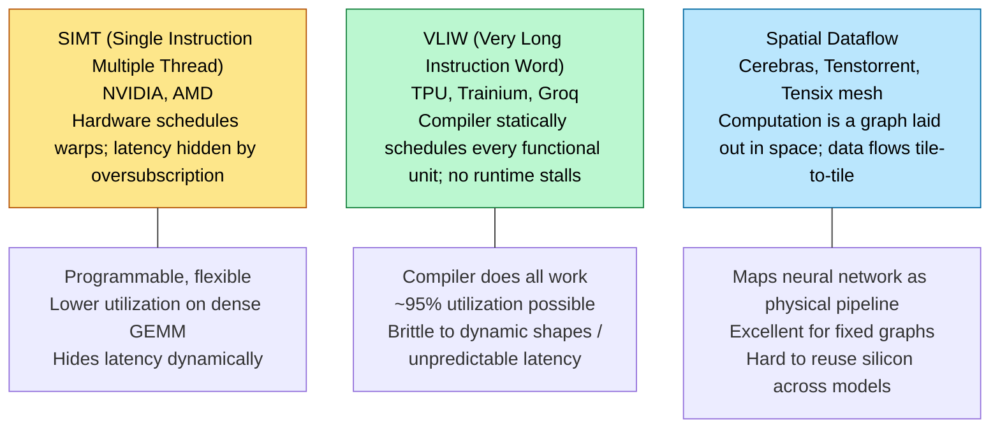
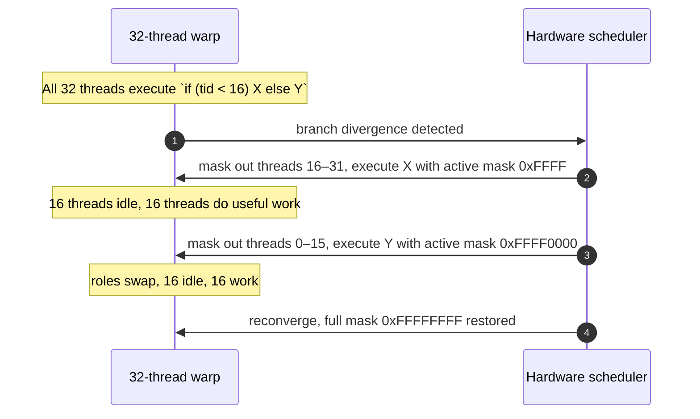
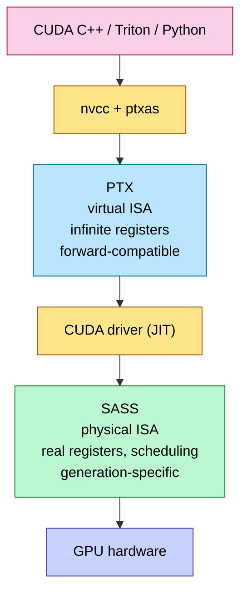
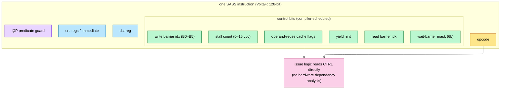
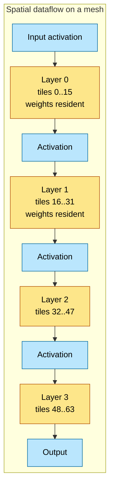
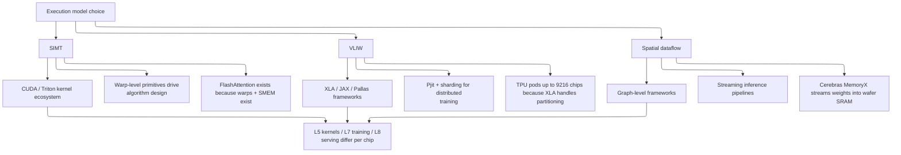

# ISA and Execution Model — SIMT, VLIW, Spatial Dataflow

> **Layer:** L3 (foundational page).
> **Prerequisites:** [L2 Digital_Design_For_AI](../L2_Digital_Design_for_AI/04_Digital_Design_For_AI.md) (pipelining, FSMs, NoC).
> **Hands off to:** [GPU_Architecture](02_GPU_Architecture.md), [Memory_Hierarchy_and_Roofline](03_Memory_Hierarchy_and_Roofline.md), and every per-vendor page in this layer.

---

## 0. Three families of execution model

Every AI accelerator picks one of three execution models. The choice cascades through compiler design, kernel ergonomics, latency-hiding strategy, and ultimately the achievable utilization on each workload.



---

## 1. SIMT — the NVIDIA and AMD model

### 1.1 The warp / wavefront

A **warp** (NVIDIA) or **wavefront** (AMD) is a group of threads that execute the same instruction in lockstep across SIMD lanes:

- NVIDIA: 32 threads/warp.
- AMD CDNA: 64 threads/wavefront (wave64); CDNA-3+ also supports wave32 for compatibility.
- Intel Xe: variable subgroup size 8/16/32.

Each thread has its own register set, program counter (since Volta), and stack pointer; they all share the SIMD instruction stream. When threads diverge (different control-flow branches), the hardware **serializes** the divergent paths via a divergence stack:



Divergence is the signature SIMT pathology: a 50/50 if-else *halves* throughput across that block. AI workloads are mostly divergence-free (uniform tensor ops), which is why SIMT is a good fit.

### 1.2 Latency hiding via warp oversubscription

The defining SIMT mechanism: the SM holds far more warps than it can issue per cycle, and the scheduler swaps among them at zero cost.

Required active warps:

$$
W_{\min} \;=\; \frac{L_{\text{mem}}}{I_{\text{warp}}}
$$

where $L_{\text{mem}}$ is the round-trip latency of the slowest dependency (HBM ≈ 400 cycles) and $I_{\text{warp}}$ is the number of independent instructions the warp can execute before that load result is needed.

Worked: $L_{\text{mem}} = 400$ cycles, $I_{\text{warp}} = 5$ (typical). $W_{\min} = 80$. An SM with 64 warps falls short → the SM stalls and drops occupancy. This is why **register pressure matters**: more registers per thread → fewer resident threads → fewer warps → potential undershooting of $W_{\min}$.

### 1.3 The two-stage compilation: PTX vs SASS

NVIDIA's stack:



| Property | PTX | SASS |
|---|---|---|
| Register count | virtual / unbounded | physical (R0..R255) |
| Forward compatibility | yes (Ampere PTX runs on Blackwell) | no — generation-specific |
| Documented | yes | no, reverse-engineered |
| Reveals spilling? | no | yes |
| Reveals stall slots? | no | yes (control codes) |
| Used for | source-level optimization | final-stage tuning |

For peak-performance kernels, you must read SASS via `cuobjdump -sass`. PTX hides the register-spill behavior that destroys real-world performance.

### 1.4 AMD's GCN/CDNA equivalent

AMD's stack mirrors NVIDIA's but with different naming:

| NVIDIA | AMD |
|---|---|
| PTX (virtual ISA) | RDNA/CDNA IR |
| SASS (physical ISA) | GCN ISA / CDNA ISA |
| `nvcc` | `hipcc` / Clang ROCm |
| Warp (32 threads) | Wavefront (64 or 32) |
| SM | Compute Unit (CU) / XCC |
| Tensor Core | Matrix Core (MFMA) |
| SMEM | LDS (Local Data Share) |
| TMA | (no direct equivalent; uses async copy intrinsics) |

CDNA ISA is documented (unlike SASS), which makes AMD GPUs more transparent to optimize but also exposes more design churn between generations.

### 1.5 SIMT control-flow primitives

Every SIMT ISA exposes a few key primitives:

- **`__syncthreads()`** / `s_barrier`: barrier across an entire block / workgroup.
- **`__shfl_sync()`** / `ds_swizzle`: warp-level shuffle (thread i reads from thread j's register).
- **`__ballot_sync()`** / `s_ballot`: reduce a per-thread predicate to a 32-bit mask.
- **`mbarrier`** (Hopper+): hardware async barrier with arrive/wait separation.

These are the building blocks of warp-level reductions (e.g., online softmax max+sum across 32 lanes), which are how kernels avoid SMEM round-trips.

---

### 1.6 SASS at the bit level — control codes and the software scoreboard

The PTX-vs-SASS table hides the single most important microarchitectural fact about NVIDIA's ISA: since Kepler, and fully since Volta, **dependency scheduling was moved out of hardware and into the compiler**, encoded as **control bits packed into every instruction**. The hardware scoreboard of [GPU_Architecture §1.4](02_GPU_Architecture.md) does *not* analyze dependencies at runtime for fixed-latency instructions — it simply obeys the control bits `ptxas` already computed.



Each Volta+ instruction (a 128-bit word) carries a control field the scheduler reads directly:

- **Stall count (0–15 cycles).** For *fixed-latency* ops (an FFMA is, say, 4–6 cycles), the compiler literally writes "then stall N cycles" so the dependent instruction issues exactly when the result is ready. No hardware hazard detection needed — the cost was moved to compile time.
- **Read / write dependency barriers (B0–B5).** For *variable-latency* ops (loads, MUFU/SFU transcendentals, MMA), the compiler can't know the latency, so it assigns one of six **scoreboard barriers**: the producer sets a barrier, and a later consumer carries a **wait mask** that blocks its own issue until that barrier clears. This is the software-managed version of the register scoreboard.
- **Yield hint.** One bit that tells the scheduler whether to keep issuing from this warp (greedy) or yield to another — the GTO policy's software knob.
- **Operand-reuse cache flags.** Volta added a small per-lane **reuse cache** in front of the register file; a `.reuse` flag says "this source operand is identical to the last instruction's — read it from the reuse latch, not the RF." This directly cuts register-file bank conflicts (the operand-collector pressure of [§1.4C](02_GPU_Architecture.md)) and RF read power.

Two consequences a kernel writer lives with:

1. **This is why you read SASS, not PTX.** PTX has none of these fields — they are invented by `ptxas` during the PTX→SASS pass. The quality of that scheduling (stall packing, barrier reuse, `.reuse` coverage) is often the difference between 60% and 85% of peak, and it is invisible above SASS.
2. **It is why NVIDIA's ISA is "statically scheduled SIMT."** The warp scheduler still hides *memory* latency dynamically by swapping warps, but *within* a warp the instruction timing is compiler-planned like a VLIW — a hybrid of the two models in §1 and §2.

AMD's CDNA ISA exposes the analogous machinery openly (here *vmcnt* counts outstanding vector-memory operations and *lgkmcnt* counts outstanding LDS/scalar-memory operations — a running tally of "loads not yet finished"): explicit `s_waitcnt` instructions gate on `vmcnt`/`lgkmcnt` counters (outstanding vector-memory / LDS-and-scalar operations), which is the same idea — software-issued waits on hardware completion counters — just as separate instructions instead of packed control bits.

---

### 1.7 GPU memory consistency, fences, and atomics

SIMT changes the number of threads, not the fundamental synchronization problem. Each CUDA thread has program order, but compilers, SM pipelines, store queues, caches, L2 slices, interconnect paths, copy engines, peers, and CPUs can observe independent addresses in different orders. A correct GPU design connects five contracts:

$$
\text{CUDA C++}\rightarrow\text{PTX}\rightarrow\text{machine ISA}\rightarrow
\text{SM/L2/NoC}\rightarrow\text{system memory}.
$$

#### 1.7.1 First distinguish execution synchronization from memory ordering

| Primitive | Main question answered | Example |
|---|---|---|
| warp/block/cluster barrier | have participating threads arrived? | `__syncthreads()`, `bar.sync`, `mbarrier` |
| memory fence | in what order may memory operations become observable? | `__threadfence*`, PTX `fence` |
| atomic | can another operation intervene at this location? | `atomicAdd`, `cuda::atomic_ref` |
| async completion | has another engine finished moving/using these bytes? | `mbarrier`, async-group wait |
| proxy fence | do different memory-access mechanisms agree on visibility? | PTX/CUDA async-proxy fence |

A barrier often includes specified memory-order effects for participating threads, but a fence alone does not make other threads wait, and an atomic does not automatically order unrelated addresses unless it has acquire/release/SC semantics. `volatile` affects compiler/access behavior; it is not a substitute for a synchronization edge.

#### 1.7.2 Scope: which observers participate?

CUDA/PTX exposes a hierarchy because local synchronization is cheaper:

| CUDA notion | PTX scope | Intended participants | Representative hardware ordering point |
|---|---|---|---|
| thread | — | one thread | compiler/thread pipeline |
| block | `.cta` | threads in one cooperative thread array | one SM's shared-memory/L1/barrier domain |
| cluster | `.cluster` | blocks in one thread-block cluster | cluster fabric/distributed shared-memory domain |
| device | `.gpu` | threads on one GPU | GPU L2/coherence point |
| system | `.sys` | GPU plus participating CPU/peer/system agents | system/host coherent or I/O ordering point |

The row describes the architectural scope, not a promise that every implementation has exactly that physical block. A **warp is not a PTX memory-consistency scope**. Warp-synchronous code still needs the documented warp primitive and mask; independent thread scheduling makes “lanes happen to execute together” an unsafe memory protocol.

An atomic/fence pair synchronizes only when scopes are sufficiently inclusive of both participants. A device-scope operation cannot by itself synchronize with a CPU outside the device. System scope can be more expensive because completion may cross L2, I/O, peer, or host-coherence boundaries.

#### 1.7.3 Semantics: relaxed, acquire, release, acquire-release, SC

Represent an atomic RMW as:

```text
selected older operations
          |
       release
          v
[ per-location atomic serialization ]
          |
       acquire
          v
selected younger operations
```

- **relaxed:** only indivisibility/one-location modification order;
- **release:** selected earlier operations are ordered before the publication;
- **acquire:** selected later operations are ordered after observing the publication;
- **acquire-release:** both sides around one RMW;
- **sequentially consistent (SC):** stronger global SC-order constraints in addition to acquire/release effects.

The compiler maps source semantics to PTX instructions and scopes, then the backend maps PTX to target machine instructions. Do not memorize one SASS sequence as universal: mappings can change by GPU generation and memory space. PTX's atomic ABI describes, for example, how C++ acquire/release/SC operations are represented with scoped atomic operations and fences.

#### 1.7.4 The publication litmus test

Initially `data=0`, `flag=0`. The producer writes data then releases a flag; the consumer acquires the flag before reading data:

```cuda
#include <cuda/atomic>

__device__ int data;
__device__ int flag;

__global__ void publish_or_consume() {
    cuda::atomic_ref<int, cuda::thread_scope_device> f(flag);

    if (blockIdx.x == 0 && threadIdx.x == 0) {
        data = 42;  // ordinary store
        f.store(1, cuda::memory_order_release);
    }

    if (blockIdx.x == 1 && threadIdx.x == 0) {
        if (f.load(cuda::memory_order_acquire) == 1) {
            int observed = data; // must observe 42 through the synchronizes-with edge
            use(observed);
        }
    }
}
```

The release prevents the `data` write from being published after `flag=1`; the matching acquire prevents the later data load from becoming an irrevocable earlier observation. Both use device scope because the participants can be in different blocks/SMs on one GPU.

Using relaxed operations for `flag` preserves atomicity of the flag but breaks the cross-address publication edge. Using a block-scoped atomic across blocks is also wrong. Replacing the atomic with a plain/volatile flag creates a data race in CUDA C++ rather than a “slightly weaker” protocol.

#### 1.7.5 What the SM and memory system implement

A representative GPU ordering path is:

```mermaid
flowchart LR
    DEC["Decode load/store/atomic/fence<br/>semantics + scope"] --> LSU["LSU ordering entry<br/>warp, age, address, byte mask"]
    LSU --> COAL["Warp coalescer<br/>sector requests"]
    COAL --> SQ["Store queue / outstanding table<br/>sequence and completion bits"]
    SQ --> NI["SM/cluster network interface<br/>domain + transaction ID"]
    NI --> NOC["Request/response NoC"]
    NOC --> L2["Owning L2 slice/home<br/>visibility + atomic serialization"]
    L2 --> SYS["Memory controller or<br/>system/peer coherence point"]
    L2 --> ACK["Scoped completion/ack"]
    SYS --> ACK
    ACK --> LED["Fence/acquire/release ledger"]
    LED --> RET["Release successors,<br/>wake warp, retire"]
```



An ordering entry carries:

```text
warp/context identity and instruction age
operation and memory space
scope and semantic strength
predecessor/successor classes
sector/byte masks and transaction IDs
store sequence or atomic serialization status
outstanding acknowledgement bitmap
translation/fault/poison state
reset and replay epoch
```

A **release** store can snapshot older stores and wait until their contiguous completion sequence reaches the required L2/system ordering point before allowing the publication to become visible. “Requests left the SM” is too early. “Dirty lines reached HBM cells” is often too late. The design must name the earliest point that satisfies the chosen scope.

An **acquire** response can release younger memory operations only after the acquire event is established. A high-performance SM may issue younger loads speculatively, but it must retain enough scoreboard/load-queue/invalidation state to replay them if the acquire or coherence events make their early observation illegal.

A **fence** is a parameterized ordering micro-operation, not a cache flush. Its completion ledger can separately wait for:

- older generic loads to finish and be validated;
- older stores to reach the scoped visibility point;
- atomics to pass their serialization point;
- device/system transactions to receive the required response;
- async/tensor proxy handoffs;
- special cache/TLB/instruction-maintenance acknowledgements.

System scope routes the ledger to a farther ordering point than block/device scope. CUDA memory synchronization domains can reduce accidental fence interference by separating traffic that need not be ordered together.

#### 1.7.6 Atomic datapath and serialization

Atomics need one serialization point for overlapping operands. Common implementations are:

1. obtain exclusive cache-line authority at the requester, lock the local line for the short read/modify/write interval, update it, then release; or
2. send an atomic command to the owning shared-memory/L2/home slice, which queues conflicting operations, reads the old value, computes the new value, updates data/ECC, and returns the old value.

Shared-memory atomics can serialize in/near the SM bank. Device/global atomics commonly serialize at a GPU-wide cache/home point. System atomics additionally require platform support and a system-visible point. These are architectural patterns; exact vendor placement and throughput are generation-dependent.

An atomic entry stores address/size/byte mask, operation, operands, scope/semantics, old/new values, result destination, transaction/retry epoch, and ordering state. For fetch-add:

```text
old = memory[address]       // under serialization authority
new = old + operand
memory[address] = new      // update exactly once
return old
```

For compare-and-swap, the dirty/data update is gated by `old == expected`; failed comparison is still an atomic read and can still carry acquire semantics. A protocol retry must distinguish **not performed** from **performed but response lost**, because replaying a completed increment applies it twice.

Atomicity granule and coherence granule differ. A 32-bit atomic may own a whole cache line. The hardware must define legal alignment and behavior for overlapping subword operations and must never split an architecturally atomic operand into independently visible requests.

Under contention, one address is a serial server. If service time is $S$, throughput cannot exceed roughly $1/S$ no matter how many warps issue. More warps add queueing and ownership traffic. L2/home queues need fairness, hotspot throttling, and progress resources so one lock does not consume every miss/response entry.

#### 1.7.7 Async and alias proxies

Ordinary CUDA thread loads/stores use the generic proxy. TMA and some asynchronous tensor operations use an async proxy. Different virtual aliases can also require an alias-proxy fence in PTX. The memory model does not assume that two mechanisms automatically observe each other's operations in program order.

For TMA global→shared:

```text
initialize mbarrier
fence initialization to async proxy
launch bulk/tensor copy and register expected bytes
wait for barrier phase/transaction bytes
consume shared tile
```

For thread writes followed by async shared→global, software first orders generic writes into the async proxy, synchronizes participating producers, launches the copy, and waits for the documented async-group read-completion before reusing shared storage. See [L2 Digital Design §3](../L2_Digital_Design_for_AI/04_Digital_Design_For_AI.md) for the engine datapath.

#### 1.7.8 Fences and atomics do not fix lifetime or scheduling bugs

Thread blocks may execute in any order unless launched cooperatively with the required residency guarantees. A spin-waiting consumer block can occupy all SM resources while the producer block never becomes resident. Correct memory ordering does not solve that scheduling deadlock.

Similarly:

- a fence does not keep an object alive;
- a barrier is invalid if not all required participants reach it;
- an atomic counter does not make the data it counts safe without release/acquire;
- a system-scope fence does not turn unsupported host memory into coherent atomic memory;
- kernel completion/stream events have host/runtime ordering semantics distinct from in-kernel fences.

#### 1.7.9 Verification and performance plan

Use GPU litmus tests parameterized by memory space, scope, semantic strength, cache hit/miss, SM placement, and proxy:

- store buffering and load buffering;
- release/acquire message passing;
- independent reads of independent writes;
- atomic RMW versus ordinary accesses to the same sector;
- block/device/system scope mismatch;
- TMA barrier/proxy handoff;
- peer/host coherent and noncoherent paths;
- fence with L2 miss, eviction, page walk, backpressure, and reset.

Hardware assertions:

```text
retired release implies every selected older write reached its scoped ordering point
no selected younger observation passes a completed acquire illegally
each atomic update has exactly one serialization point and occurs at most once
failed compare-and-swap performs no write
fence completion accounts for every older split sector and retry
old-epoch acknowledgements cannot complete new operations
async barrier completion cannot precede all registered transaction bytes
```

Counters should separate fence wait by store drain, load validation, atomic queue, NoC/L2, system scope, and proxy; atomics by address hotness, operation, scope, latency, and queue depth; and async copies by command, bytes, barrier wait, and overlap. A single “memory stall” counter hides the design bottleneck.

---

## 2. VLIW — TPU, Trainium, Groq

### 2.1 The compiler-takes-everything philosophy

VLIW packs multiple parallel operations into a single instruction word. There is no hardware scheduler; the compiler decides at compile time exactly which functional unit fires which op on which cycle. No runtime stalls, no out-of-order, no warp scheduling — and no flexibility to handle anything the compiler couldn't predict.

A TPU "VLIW bundle" might contain:

```ascii-graph
[ cycle k ]
  TensorEngine:  MAC (tile_addr_A, tile_addr_B, tile_addr_C)
  VectorEngine:  vec_exp (input_addr, output_addr)
  ScalarEngine:  add r1, r2 → r3   (loop counter)
  DMA:           start_load (HBM_addr → SRAM_addr, 4 KB)
```

Four functional units, four parallel ops, packaged into one instruction. The next bundle picks up where this one left off — typically within 1 cycle, because the compiler has scheduled the dependencies.

### 2.2 The compiler burden

The compiler must:

- Solve the modulo-scheduling problem: arrange ops across cycles so all units are busy and no dependency is violated.
- Predict every memory-access latency exactly (TPU SMEM latency is fixed; HBM latency is bounded with hardware support).
- Insert NOPs where it cannot find a useful op → "VLIW NOP" is a literal cycle of wasted compute.
- Statically allocate all registers; no spilling at runtime.

For TPU, this is XLA + the LLVM-derived JAX/Pallas compiler. For Trainium, it's the Neuron Compiler. For Groq, the Groq compiler does it down to the picosecond.

### 2.3 Pros and cons

| Pro | Con |
|---|---|
| Highest dense-GEMM utilization (~95%) | Brittle to dynamic shapes — recompile per shape |
| Predictable latency (every kernel runs in N cycles, not N±20%) | Compiler complexity is enormous |
| No hardware scheduler → silicon area saved | A 1-cycle delay on one input wastes one VLIW bundle |
| Easier to reason about energy (no speculative execution) | Cannot easily handle data-dependent control flow |

### 2.4 Why TPUs lose on small matmuls

A TPU MXU is a 128×128 systolic array. The compiler unrolls into VLIW bundles assuming K is large enough to amortize fill+drain. For K = 64 (one attention head's $Q \cdot K^T$), the array is effectively half-empty for half the latency. VLIW cannot dynamically "skip ahead" — it issued a fixed schedule. Net utilization: ~30%.

GPUs (SIMT) handle this by scheduling more independent kernels in parallel; they trade utilization on big matmuls for graceful degradation on small ones.

---

## 3. Spatial dataflow — Cerebras, Tenstorrent

### 3.1 The neural-network-as-circuit idea

Spatial dataflow lays the *graph* of a neural network onto the physical mesh of the chip: layer 0 occupies a region, layer 1 the adjacent region, etc. Activations stream from one region to the next via the on-chip NoC; weights live where they're used.



### 3.2 Properties

- **No HBM round-trip between layers** — activations stream tile-to-tile via NoC.
- **Massive on-die SRAM** — Cerebras WSE-3 has 44 GB on-die SRAM, replacing HBM entirely.
- **Excellent for fixed graphs** — once a model is mapped, throughput is deterministic.
- **Painful to remap** — changing the model requires re-floor-planning the chip; Cerebras can do this in seconds via reconfiguration but at lower flexibility than a CUDA kernel swap.

### 3.3 Programming model

Spatial dataflow chips expose a **graph-level** API: you pass the framework a TensorFlow / PyTorch / ONNX graph, the compiler partitions it across tiles, and the runtime streams data through. There is no kernel-level programming; a CUDA-equivalent doesn't exist. Tradeoff: ergonomic for users who never want to touch a kernel, opaque for power users.

---

## 4. Comparison matrix

| Property | SIMT (NVIDIA, AMD) | VLIW (TPU, Trainium, Groq) | Spatial Dataflow (Cerebras, Tenstorrent) |
|---|---|---|---|
| Scheduling | Hardware (warp scheduler) | Compiler, static | Compiler, static (graph mapping) |
| Latency hiding | Warp oversubscription | None — predictable latency | Pipeline-stage parallelism |
| Best workload | General-purpose, dynamic shapes | Dense GEMM, fixed shapes | Fixed inference graphs |
| Dense-GEMM utilization | ~70% | ~95% | ~80% |
| Small-matmul utilization | ~50% | ~30% | ~60% |
| Compiler complexity | Moderate (nvcc, LLVM) | Extreme (XLA, Neuron, Groq) | Extreme (graph partitioner) |
| Programmer effort for peak | Kernel writing (CUDA / Triton) | High-level (XLA / JAX) | Graph-only (no kernel API) |
| Reuse across models | Excellent — write any kernel | Good — recompile per shape | Limited — re-map per model |
| Energy per FLOP | Worst | Best (no scheduler overhead) | Best (no HBM, no scheduler) |
| Determinism | Low (warp interleaving) | High | Very high |
| Debugging | mature toolchain (Nsight) | per-vendor | minimal |

---

## 5. The execution-model choice cascades up



This is why "just port CUDA to TPU" doesn't work — the abstraction levels are different. CUDA exposes warps, threads, blocks, grids; XLA exposes operators, sharding, replication. They're not refactorings of each other.

---

## 6. Numbers to memorize

| Quantity | Value | Why |
|---|---|---|
| NVIDIA warp size | 32 threads | SIMT lane count |
| AMD wavefront size | 64 (CDNA), 32 (RDNA + CDNA-3) | Matches SIMD ALU width |
| HBM round-trip latency | ~400 cycles | Drives warp oversubscription requirement |
| Min warps to hide HBM | ~80 | $L/I$ rule |
| NVIDIA SM warp capacity | 64 | Hopper / Blackwell |
| NVIDIA registers per SM | 65 536 × 32-bit = 256 KB | Shared across resident threads |
| Max registers per thread (32 warps) | 64 | Beyond this → spill or reduce occupancy |
| TPU VLIW bundle width | 4–8 ops | Tensor + Vector + Scalar + DMA |
| Groq deterministic latency error | ~0% (per cycle exact) | Fully scheduled SRAM |
| Cerebras WSE-3 SRAM | 44 GB | Replaces HBM |
| Cerebras WSE-3 cores | 900 000 | Mesh tiles |
| SASS instruction width (Volta+) | 128-bit | opcode + operands + control |
| Fixed-latency scheduling | compiler stall count (0–15) | no runtime hazard detection |
| Variable-latency barriers | 6 scoreboard barriers (B0–B5) | loads/SFU/MMA wait masks |
| Operand-reuse cache | `.reuse` flag per source | cuts RF bank conflicts & read power |
| AMD equivalent | `s_waitcnt vmcnt/lgkmcnt` | explicit wait instructions |
| PTX inter-thread fence scopes | `.cta`, `.cluster`, `.gpu`, `.sys` | choose the smallest domain containing both participants |
| Atomic versus ordering | serialization at one location versus edges across locations | relaxed atomic is indivisible but does not publish other data |
| Release/acquire publication | data → release flag → acquire flag → data | canonical cross-thread handoff |
| Warp scope | none in the PTX fence-scope list | use documented warp synchronization, not assumed lockstep |

---

## 7. References

- Lindholm et al., *NVIDIA Tesla: A Unified Graphics and Computing Architecture*, IEEE Micro 2008 — the original SIMT paper.
- Jouppi et al., *In-Datacenter Performance Analysis of a TPU*, ISCA 2017 — VLIW + systolic for AI.
- Jia, Maggioni et al., *Dissecting the NVIDIA Volta/Turing/Ampere GPU Architecture via Microbenchmarking*, arXiv — SASS control codes, reuse cache, barrier scheduling.
- Kirk & Hwu, *Programming Massively Parallel Processors*, 4th ed.
- NVIDIA, [CUDA Programming Guide](https://docs.nvidia.com/cuda/cuda-programming-guide/) — CUDA execution hierarchy, memory scopes/domains, barriers, atomics, and async copies.
- NVIDIA, [Parallel Thread Execution ISA](https://docs.nvidia.com/cuda/parallel-thread-execution/) — formal PTX memory model, scoped `fence`/`atom`, proxy fences, and `mbarrier`.
- NVIDIA, [PTX Atomic ABI](https://docs.nvidia.com/cuda/ptx-writers-guide-to-interoperability/atomic-abi.html) — mapping C++ atomic scopes/orders to PTX.
- Lie, *Scaling Deep Learning to Wafer Scale*, Hot Chips 2024 — Cerebras.
- Abts et al., *Think Fast: A Tensor Streaming Processor (TSP)*, ISCA 2020 — Groq.

---

**Up the stack:** [GPU_Architecture](02_GPU_Architecture.md) → [Memory_Hierarchy_and_Roofline](03_Memory_Hierarchy_and_Roofline.md) → [Blackwell_Architecture](04_Blackwell_Architecture.md) and per-vendor pages.
