# GPU Architecture — The SIMT Reference Chip

> **Layer:** L3.
> **Prerequisites:** [ISA_and_Execution_Model](01_ISA_and_Execution_Model.md), [L2 On_Chip_Memory_Hardware](../L2_Digital_Design_for_AI/01_On_Chip_Memory_Hardware.md), [L2 FP_Unit_Design](../L2_Digital_Design_for_AI/02_FP_Unit_Design.md).
> **Hands off to:** [Memory_Hierarchy_and_Roofline](03_Memory_Hierarchy_and_Roofline.md), [Blackwell_Architecture](04_Blackwell_Architecture.md), [AMD_Instinct](05_AMD_Instinct.md).

---

## 0. Why GPUs won AI

Three structural advantages explain GPU dominance over CPUs for AI:

1. **Throughput orientation.** A CPU optimizes for *single-thread latency* via OOO execution, deep caches, and branch prediction. A GPU optimizes for *aggregate throughput* via thousands of in-flight threads. AI workloads are throughput-dominated (no branchy single-thread critical path; lots of independent FMAs).

2. **Tensor cores.** A CPU's SIMD ALU does ~16 BF16 FMAs per cycle. A GPU's tensor core does 256–4 096 FMAs per cycle as a single instruction. The throughput-per-watt ratio is ~30× in favor of tensor cores on dense GEMM.

3. **HBM bandwidth.** A CPU has DDR at ~50 GB/s/socket. A GPU has HBM at ~10 TB/s/package. Without the bandwidth, the FMAs starve.

This page covers the canonical SIMT GPU at the L3 level: SM organization, warp scheduling, tensor cores, register file, SMEM, TMA, and the roofline implications. Architecture-specific pages (Blackwell, MI300/MI355) specialize this material.

---

## 1. The Streaming Multiprocessor (SM)

### 1.1 The Execution Hierarchy: Software to Hardware

Before dissecting the SM, separate **software groupings** from **physical structures**:

| CUDA/program object | Hardware relationship |
|---|---|
| **Thread** | owns architectural state such as registers, predicates, index, and program state; it is **not permanently wired to one CUDA core** |
| **Warp** | 32 consecutive threads grouped by hardware for scheduling and SIMT instruction issue |
| **Thread block / CTA** | admitted to one SM, where it reserves registers, shared memory, warp slots, and barriers until completion |
| **Thread-block cluster** | optional group of blocks co-scheduled within one GPC on supported devices; enables cluster synchronization and distributed shared memory |
| **Grid** | all blocks in one kernel launch; blocks are distributed dynamically across the GPU over time |
| **Stream** | an ordered command sequence tracked by the front end; not a compute unit |

A physical ALU lane, load/store pipe, or tensor core is **time-multiplexed across many resident warps**. One thread's FP instruction can use FP lanes, its load can use the LSU, and a cooperative matrix instruction can use tensor cores. Several blocks may reside on one SM; a grid normally contains far more blocks than there are SMs.

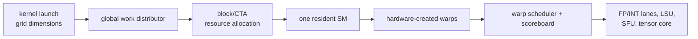

The full-chip compute **and memory** hierarchy, block lifecycle, thread/warp mapping, global-load path, copy engines, GMMU, L2 slices, memory controllers, and HBM are developed in §2. That section is the canonical correction to one-to-one slogans such as “thread = core” or “block = SM.”

### 1.2 Anatomy of the SM

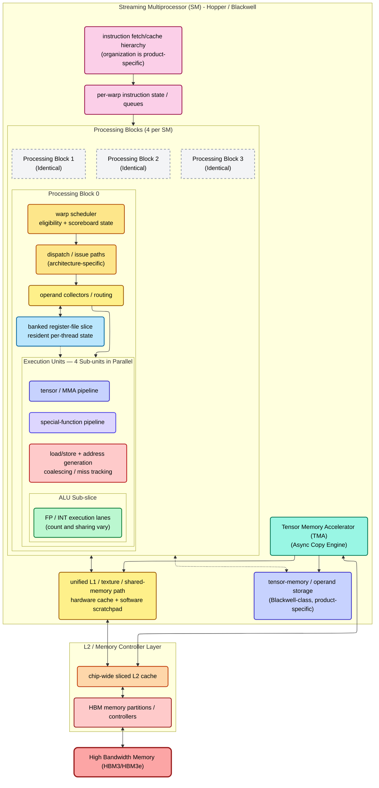

The stable SM design pattern is:

- **Several scheduler/subpartition domains.** Each owns a pool of resident warps and a slice of register/issue resources. NVIDIA documents four warp schedulers per Hopper SM, but dispatch widths and pipeline pairings remain generation-specific.
- **Several execution-pipeline classes.** FP, integer, special-function, load/store, and tensor/MMA instructions do not all use one generic “CUDA core.” A warp instruction is dispatched to the compatible pipeline; physical lanes are reused by other warps later.
- **Banked register storage and operand delivery.** Resident thread state stays in an on-SM register file. Banking and collectors provide practical bandwidth without a prohibitively multiported SRAM. Exact bank counts and port topology are implementation details unless NVIDIA documents them.
- **Unified on-SM data storage.** Shared memory is software-addressed per block; L1/texture caching is hardware-managed. They share parts of the physical SRAM/path on modern devices but retain different semantics and product-specific capacity partitions.
- **Independent data-movement machinery.** The LSU coalesces lane addresses and tracks misses; Hopper-class TMA can move multidimensional tiles asynchronously; tensor-memory structures are generation-specific. L2, GMMU, NoC, memory controllers, and HBM sit outside the SM.

Use device attributes and the architecture tuning guide for resource capacities. Do not copy a capacity or lane count from H100 to a Blackwell product merely because both use the word “SM.”

### 1.3 Issue Rate, Dual-Issue, and the Instruction Mix

Each SM subpartition has one or more dispatch paths into several execution-pipeline classes. Some architectures can issue compatible independent operations in the same cycle, but the legal pairings and rates are microarchitecture-specific and should be measured with the tuning/profiling guide rather than assumed from a generic “dual issue” rule.

The issue ceiling still defines a fundamental bound:

- A single `FMA` instruction computes 64 FLOPs (32 threads × 2 ops).
- A cooperative MMA instruction describes many multiply-accumulate operations while consuming relatively few front-end issue events.
- Therefore, high tensor throughput relies on keeping the MMA pipelines fed while minimizing address, synchronization, and data-movement issue overhead.

If a kernel relies heavily on scalar address arithmetic or standard CUDA cores, it will hit the issue ceiling long before it hits the theoretical compute ceiling. The ratio of tensor-core-to-ALU issue density is the primary reason CUDA kernels for AI are structured around massive MMA instructions with minimal scalar overhead.

### 1.4 Expert-Level Pipeline Mechanics: From Fetch to Execute

The process of taking an instruction from a warp and executing it on the silicon is extraordinarily complex, designed specifically to hide memory latency without paying the context-switching penalties of a CPU.

#### A. The Scoreboard and Dependency Tracking
The Warp Scheduler does not randomly guess which warp is ready; it relies on a hardware **Scoreboard** (a highly scaled version of the CDC 6600 algorithm).
- Every warp maintains a small dedicated SRAM bitmask representing its physical registers.
- When an instruction is issued (e.g., `LDG R1, [R2]`), the scoreboard marks the destination register (`R1`) as **pending**.
- A warp is mathematically ineligible for scheduling if the source registers for its *next* instruction have their pending bits set.
- When the memory controller finally writes the payload from HBM back to the Register File, it signals the scoreboard to clear the pending bit. On the very next clock cycle, the warp enters the "Ready/Eligible" pool.

#### B. Scheduling Policies: GTO vs. LRR, and Warp Stall Causes
Once the scoreboard identifies eligible warps, a scheduler selects among them subject to pipeline availability and fairness. Research simulators commonly model policies such as **loose round robin (LRR)** or **greedy-then-oldest (GTO)** because they expose useful locality/fairness trade-offs. They are analytical models, not a promise that a shipping NVIDIA part implements that named policy. NVIDIA does not publish every generation's complete arbitration algorithm.

The architectural facts software can rely on are narrower:

- a stalled warp does not prevent another eligible resident warp from issuing;
- a warp must have its operands ready and target pipeline available;
- schedulers manage fixed resident-warp pools/subpartitions;
- the observed policy affects locality, fairness, and latency hiding, so profiling eligible/issued warps matters more than guessing its name.

**What causes a warp to stall (lose eligibility):**

| Stall type | Cause | Duration | Scoreboard behavior |
|---|---|---|---|
| **Memory dependency** | `LDG`/`STG` instruction awaiting HBM or L2 response | 30–400+ cycles | Destination register marked pending; scoreboard blocks any instruction reading that register |
| **Barrier stall** | `bar.sync` or `membar` — warp waits for other warps in the CTA | Indeterminate (until all arrive) | Special barrier register, not a general scoreboard entry |
| **Long ALU operation** | SFU transcendental (`sin`, `exp`), integer divide | 8–20 cycles | Single-issue through SFU; scoreboard holds destination pending |
| **Tensor core occupancy** | Previous `wgmma` still executing in background | 16–32 cycles for wgmma | The warp is NOT stalled — wgmma is async. The warp stalls only on `wgmma.wait_group` if results are not ready |
| **Instruction fetch miss** | L1 I-cache miss, waiting for fill from L2 | 50–100 cycles | The entire PB stalls; no warp can issue |
| **Register bank conflict** | Operand Collector detects SRAM bank collision | 1–3 extra cycles injected | The dispatch unit inserts bubbles; not visible at scoreboard level |
| **Structural hazard** | Target execution unit busy (e.g., all SFUs occupied) | 1–2 cycles | Warp is eligible but dispatch fails; scheduler tries next warp |

The critical insight is workload-dependent: a kernel can be limited by memory dependencies, execution dependencies, barriers, instruction supply, or a saturated target pipeline. More resident warps improve the scheduler's chance of finding eligible work, but no fixed “40–60 warps” rule guarantees latency hiding; instruction-level parallelism, cache hit rate, async pipelines, and issue demand all change the required residency.

#### C. The Operand Collector and Register Bank Conflicts
Before an instruction reaches the ALU, its operands must be fetched from the Register File (RF). For a 32-thread `FFMA` instruction, the hardware requires 3 source operands per thread simultaneously. That is **96 registers per cycle**.
- **Banked SRAM Architecture:** A literal 96-read-port SRAM would be prohibitively expensive. The RF is therefore banked and read over the ports/cycles the implementation provides.
- **Operand collection:** Collector buffers and routing gather available operands and hold them until an instruction can dispatch. Exact bank count, collector count, and crossbar topology are generation-specific.
- **Register Bank Conflicts:** If multiple threads within a warp require source registers that physically map to the *exact same SRAM bank*, the read cannot happen in parallel. The Operand Collector's arbiter must serialize the reads, injecting physical "bubble" stalls into the pipeline. Compilers fiercely optimize register allocation to minimize bank conflicts, but they are a primary cause of low IPC in unoptimized kernels.

#### D. Independent Thread Scheduling and the SSR (Volta+)
Before Volta, programmers could reason about a warp as sharing one control path plus an active mask. Volta introduced **Independent Thread Scheduling**: hardware maintains execution state at per-thread granularity and a schedule optimizer groups active threads into SIMT issue groups.

This improves correctness for divergent fine-grained algorithms, but it does not make implicit warp-synchronous communication safe. Code that exchanges data through shared/global memory must use the required `__syncwarp()`/barrier and memory-ordering operations. Native reconvergence instructions and barrier-register details are compiler/microarchitecture mechanisms, not portable PTX source contracts.

#### E. Why resident-warp switching is cheap
When a block becomes resident, its registers, shared memory, warp state, and barriers are allocated on the SM. The scheduler can choose a different eligible resident warp on a later issue opportunity without an operating-system-style save/restore of architectural state. That is the useful meaning of “zero-overhead warp scheduling.”

It is not a guarantee that every switch issues in the very next cycle: instruction fetch, operand collection, pipeline availability, and scoreboard state can still create bubbles. Nor does it describe preemption/context switching between processes, which can require saving substantially more state.

### 1.5 Global Scheduling: The GigaThread Engine
While Warp Schedulers manage execution *inside* an SM, the **GigaThread Engine** is the global hardware scheduler that manages the entire chip.

- **Two-Level Hierarchy:** The GigaThread Engine sits at the front end, receiving Grids from the CPU via PCIe. It evaluates the exact resource requirements of a Thread Block (Registers, SMEM, Thread Count) and dispatches it to an SM with available capacity. Once dispatched, control is handed off to the SM's internal Warp Schedulers.
- **Hyper-Q and Hardware Queues:** Prior to the Kepler architecture, GPUs processed kernels from a single hardware queue, leading to false serialization (a large kernel would block small kernels). Modern GigaThread engines implement **Hyper-Q (32+ hardware queues)**, allowing independent streams and even different CPU processes to feed the GPU concurrently, filling execution holes and maintaining 100% SM utilization.
- **Immediate Replacement:** When a Thread Block retires, the GigaThread Engine immediately dispatches a new block to that specific SM without CPU intervention, minimizing tail latency and keeping the SM oversubscribed.

---

---

## 2. GPU Hardware–Software Mapping — From CUDA Source to HBM

> **Layer:** L3.
>
> **Purpose:** make the CUDA programming hierarchy and the physical NVIDIA-style GPU hierarchy precise enough that a new IC or CUDA designer can trace one source statement through scheduling, execution, caches, the on-chip fabric, memory controllers, and HBM.
>
> **Architecture boundary:** CUDA defines a portable programming model. The diagrams below show a representative modern NVIDIA compute GPU. GPC/TPC/SM counts, SM partitions, cache sizes, issue paths, tensor-memory structures, and memory-partition counts vary by product and generation. Correct CUDA code cannot depend on an undocumented physical count.

> **Prerequisites:** [ISA and Execution Model](01_ISA_and_Execution_Model.md), then §1 of this chapter.
>
> **Primary references:** NVIDIA, [CUDA Programming Guide — Programming Model](https://docs.nvidia.com/cuda/cuda-programming-guide/01-introduction/programming-model.html); NVIDIA, [PTX ISA — Programming Model](https://docs.nvidia.com/cuda/parallel-thread-execution/index.html); NVIDIA, [Hopper Architecture In-Depth](https://developer.nvidia.com/blog/nvidia-hopper-architecture-in-depth/); NVIDIA, [Blackwell Tuning Guide](https://docs.nvidia.com/cuda/blackwell-tuning-guide/contents.html).

---

### 2.0 Three layers that must not be confused

| Layer | Examples | Who defines it? | Is it a physical block? |
|---|---|---|---:|
| **programming abstraction** | kernel, grid, block, cluster, thread, stream, event | CUDA/API + programmer | no |
| **architectural execution state** | warp, lane mask, per-thread PC/registers, CTA residency, barriers | GPU ISA/microarchitecture | state held by hardware, not a standalone “box” |
| **physical structure** | command processor, GPC, SM, scheduler, register file, ALU lane, tensor core, LSU, L1/shared SRAM, NoC, L2 slice, GMMU, memory controller, HBM stack | chip implementation | yes |

The bridge between them is allocation and scheduling:

```mermaid
%%{init: {"flowchart": {"defaultRenderer": "elk", "nodeSpacing": 38, "rankSpacing": 45, "htmlLabels": false}}}%%
flowchart LR
    SRC["CUDA source<br/>kernel + launch geometry"] --> COMP["nvcc / compiler<br/>host code + PTX + device binary"]
    COMP --> CMD["driver/runtime<br/>command buffers, streams,<br/>kernel descriptor"]
    CMD --> GRID["grid state<br/>block count and dimensions"]
    GRID --> CTA["CTA/block allocator"]
    CTA --> SM["resident block on one SM<br/>register + shared-memory allocation"]
    SM --> WARP["hardware forms warps<br/>from consecutive thread IDs"]
    WARP --> ISSUE["warp scheduler issues<br/>one common instruction + active mask"]
    ISSUE --> FU["ALU / tensor / LSU / SFU"]
```

**The most important correction:** a CUDA thread does **not** permanently map to one physical CUDA core. A thread owns architectural state—index, registers, predicate state, program counter—but its instructions use whatever compatible execution unit is scheduled. Physical ALU lanes are reused cycle after cycle by many warps.

---

### 2.1 Complete chip hierarchy: compute and memory

This diagram includes the blocks usually omitted by compute-only GPU drawings.

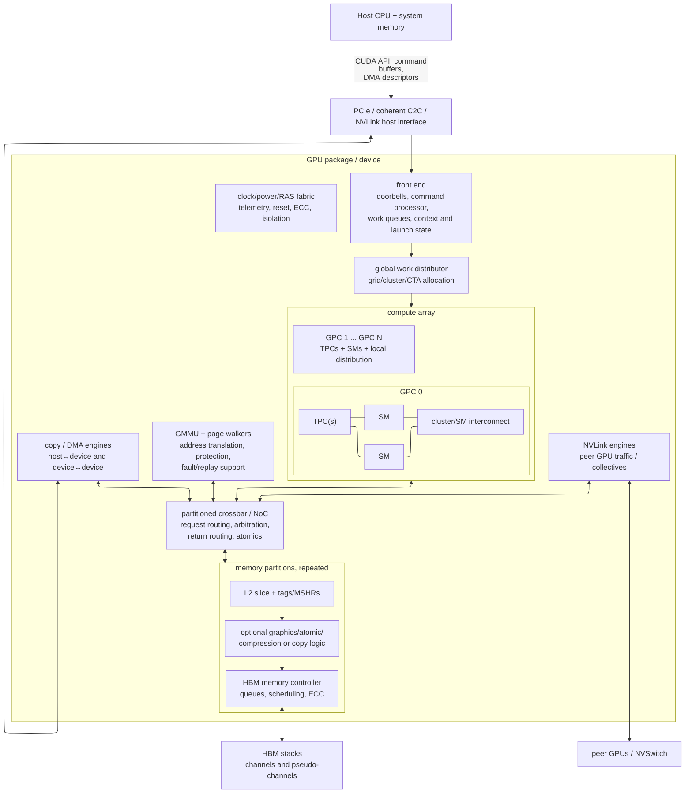

#### 2.1.1 What each chip-level block does

| Hardware block | Function | CUDA-visible consequence |
|---|---|---|
| host interface / doorbells | receives commands and exposes memory apertures | launch and transfer latency |
| command processor/front end | reads stream command buffers, establishes context, launches kernels | stream ordering, graphs, concurrent kernels |
| global work distributor | assigns clusters/CTAs to eligible GPCs/SMs | block scheduling is unordered and dynamic |
| GPC/TPC hierarchy | physical grouping and local distribution; exact structure is product-specific | clusters are co-scheduled within one GPC on supported devices |
| SM | resident execution/resource island | a block lives on one SM until completion |
| copy engines | bulk DMA without consuming normal warp issue for every byte | `cudaMemcpyAsync`, overlap of copy and kernels |
| GMMU/TLB/page walkers | virtual-to-physical translation and protection | unified virtual addressing, page faults, migration/replay |
| NoC/crossbar | routes SM/copy/NVLink traffic to address-owned L2/memory partitions | far-slice latency, partition hotspots |
| L2 slices | chip-wide coherent cache and atomic/traffic rendezvous | inter-block reuse, L2 persistence controls |
| memory controllers | schedule DRAM commands, ECC, refresh, channel mapping | HBM bandwidth depends on request distribution/locality |
| HBM stacks | off-die capacity and high bandwidth | CUDA global/device memory normally resides here |
| NVLink engines | peer/device fabric endpoint | remote GPU memory and collectives |
| clock/power/RAS | frequency, gating, telemetry, fault containment | boost behavior, throttling, ECC errors |

GPC and TPC are **physical organization names**, not objects a normal kernel directly creates. An SM is the main residency and execution scope exposed indirectly through resource limits. L2 and HBM are chip/package-wide memory resources shared by all SMs.

---

### 2.2 CUDA hierarchy mapped correctly

| CUDA/program object | What software chooses | What hardware does | Physical mapping |
|---|---|---|---|
| host thread | API call order, streams, dependencies | driver builds commands | CPU core; not GPU execution |
| stream | ordered command sequence | front end tracks runnable work and dependencies | queue/context state, not a compute unit |
| kernel | function and arguments | device code is launched over a grid | code in instruction memory/caches |
| grid | number/shape of blocks | work distributor enumerates blocks/clusters | spans the GPU over time |
| thread-block cluster | cluster shape on supported devices | co-schedules member blocks in one GPC and enables cluster sync/DSMEM | several SMs within one GPC; placement is hardware-managed |
| block / CTA | dimensions, dynamic shared-memory bytes | allocates registers, shared memory, barrier slots, warp slots on one SM | **one SM for its entire lifetime** |
| warp | not explicitly launched; implied by block size | groups consecutive thread IDs, tracks readiness, issues instructions | scheduler/scoreboard state plus 32 logical lanes |
| thread | index and per-thread control/data | maintains PC, predicates, registers; participates in warp issue | architectural lane state, **not a permanent ALU** |
| instruction | compiler-selected PTX/native operation | scheduler dispatches eligible warp to compatible pipeline | FP/INT/SFU/LSU/tensor/barrier unit |

#### 2.2.1 What is software-invented and what is hardware-created

**Software/programming model creates or selects:**

- kernel functions and launch parameters;
- grid, block, and optional cluster dimensions;
- mapping from indices to tensor/data elements;
- dynamic shared-memory size and cache preference;
- streams, events, graphs, priorities, and dependencies;
- memory allocation, placement hints, and copy operations;
- algorithms for tiling, synchronization, warp specialization, and layout.

**Hardware creates or owns:**

- the actual block-to-SM placement and timing;
- warp formation from consecutive linear thread IDs;
- eligible-warp selection each cycle;
- branch active masks and reconvergence machinery;
- register-file/shared-memory physical allocation;
- coalescing of lane addresses into memory transactions;
- cache fills/evictions, NoC routing, L2 slice choice, DRAM scheduling;
- instruction replay, dependency scoreboards, TLB walks, ECC, and throttling.

**Compiler/runtime bridge:**

- decides register count, spills, instruction selection, and many memory operations;
- encodes kernel resource requirements in launch metadata;
- converts source to PTX and target-native instructions;
- can transform one source operation into several instructions or remove it entirely.

---

### 2.3 A block is a resource reservation, not a hardware block

When a CTA is assigned to an SM, hardware reserves:

- registers for all of its threads;
- its static + dynamic shared-memory allocation;
- one or more block/CTA slots;
- warp slots and scoreboards;
- barrier and bookkeeping entries;
- optional cluster resources.

The block becomes resident only if all limits fit:

$$
B_{\text{resident}} =
\min\left(
\left\lfloor\frac{R_{\text{SM}}}{R_{\text{block}}}\right\rfloor,
\left\lfloor\frac{S_{\text{SM}}}{S_{\text{block}}}\right\rfloor,
\left\lfloor\frac{T_{\text{SM}}}{T_{\text{block}}}\right\rfloor,
B_{\text{architectural cap}}
\right)
$$

with allocation-granularity rounding applied in real hardware.

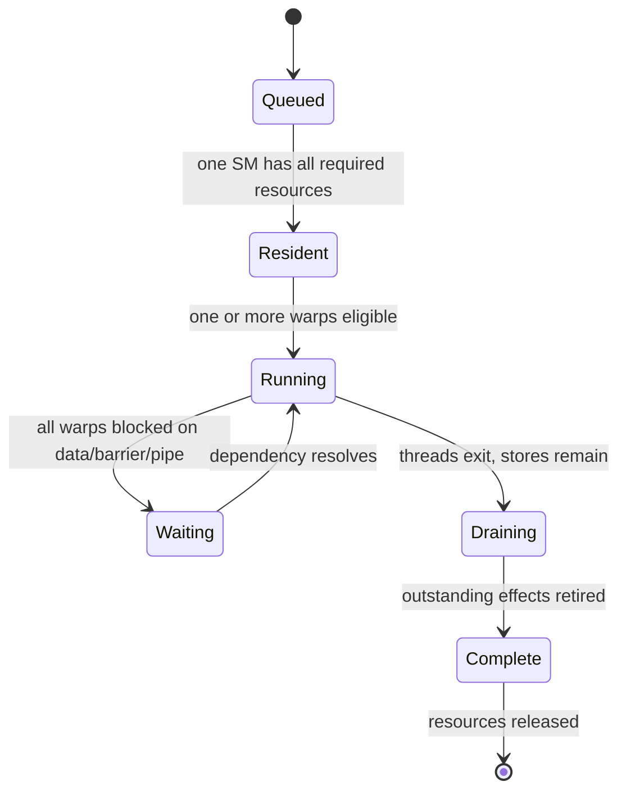

Multiple blocks can reside on one SM. One block never migrates between SMs during ordinary execution. Blocks of one grid can execute in any order, which is why ordinary blocks cannot safely communicate through a “block 0 runs first” assumption.

---

### 2.4 A warp is the scheduling unit; lanes are reused

Suppose a block contains 256 threads. Hardware linearizes `(threadIdx.x, y, z)` and creates 8 warps:

```text
warp 0: linear thread IDs   0..31
warp 1: linear thread IDs  32..63
...
warp 7: linear thread IDs 224..255
```

The warp scheduler tracks:

- next instruction/program state;
- active lanes and predicates;
- register dependencies in the scoreboard;
- barrier/wait state;
- assigned SM subpartition;
- outstanding memory/tensor/async operations.

On an issue opportunity:

1. scheduler finds a warp whose next instruction is decoded/available;
2. scoreboard says its source operands are ready;
3. target execution pipeline can accept it;
4. scheduler issues one instruction plus the warp's active mask;
5. execution lanes process active threads over the pipeline's required cycles.

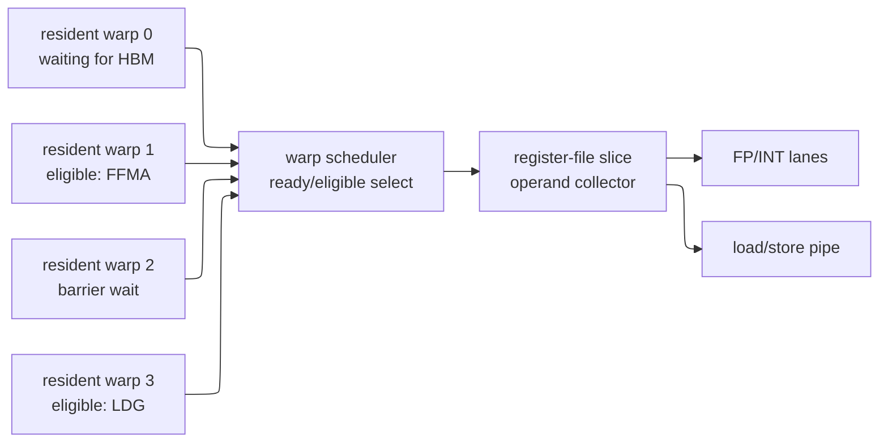

The same FP lanes might execute warp 1 now and warp 9 next cycle. This time-multiplexing is the physical basis of “zero-cost warp switching”: resident state already occupies on-chip registers and schedulers select a different warp without saving/restoring a CPU-style context.

#### 2.4.1 Divergence

If lanes take different branches, hardware executes the needed paths with different active masks. Independent thread scheduling gives each thread architectural execution state, but it does not turn a warp into 32 fully independent scalar cores. Throughput still depends on how many lanes participate in each issued instruction.

---

### 2.5 Detailed SM hierarchy

This is a representative logical structure; exact partition counts and datapath sharing vary.

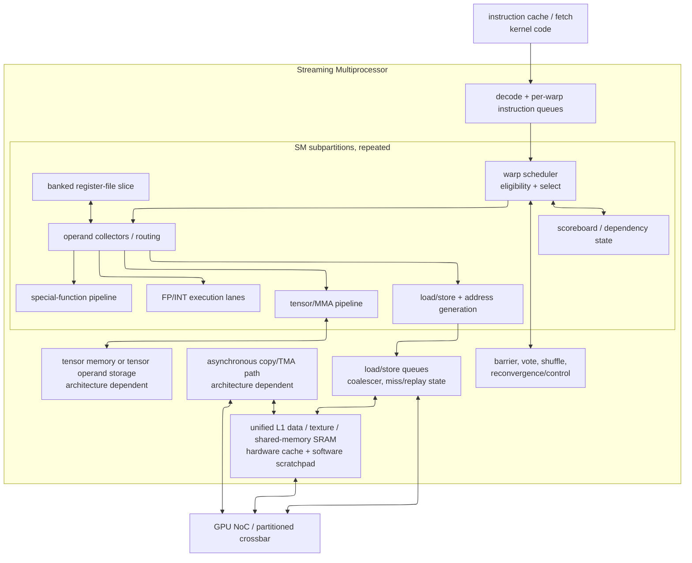

#### 2.5.1 Front end and scheduling

- instruction cache/fetch supplies native instructions;
- scheduler does not execute code itself—it chooses a ready warp;
- scoreboard tracks unavailable destination registers and async dependencies;
- barrier/reconvergence state controls which threads can proceed.

#### 2.5.2 Operand delivery

The register file is a large, banked SRAM. An operand collector gathers source registers over available banks/ports and routes them to the target pipeline. High register count improves locality but reduces the number of resident warps/blocks.

#### 2.5.3 Execution pipelines

- **FP/INT lanes:** scalar arithmetic per active warp lane;
- **SFU:** reciprocal, transcendental, interpolation or other specialized operations;
- **LSU:** effective-address generation and memory-space operations;
- **tensor core/MMA:** cooperative matrix instruction across a warp or warp group, not “one tensor core per CUDA thread”;
- **barrier/shuffle/vote:** warp/block coordination and lane exchange.

#### 2.5.4 Data movement structures

- coalescer merges per-lane global addresses into sector/cache requests;
- load/store queue holds misses, tracks return fragments, and replays as needed;
- L1/TEX cache is hardware-managed;
- shared memory is an addressable software-managed portion/path through on-SM SRAM;
- TMA/async copy moves bulk tensor tiles without issuing one ordinary load per element;
- L2 and HBM are outside the SM.

---

### 2.6 CUDA memory spaces versus physical storage

| CUDA name/source construct | Scope/lifetime | Usual physical realization | Important caveat |
|---|---|---|---|
| automatic scalar/array | one thread | registers if possible | compiler can spill to local memory |
| register | one thread | SM register file | no source keyword guarantees a particular register allocation |
| local memory | one thread logically | device memory addressed per thread, cached in L1/L2 | “local” means private addressing, not physically on-chip |
| `__shared__` | one block | on-SM shared-memory SRAM | capacity allocated per resident block; bank conflicts matter |
| distributed shared memory | one cluster | member blocks' physically separate SM shared memories via cluster fabric | requires co-resident cluster and cluster synchronization |
| global/device allocation | device/context | normally HBM/device DRAM, cached by L2 and often L1 | address may map to peer/system memory |
| constant space | device read-only view | device memory plus specialized cache/broadcast path | best when a warp reads the same address |
| texture/surface view | device | cached path with addressing/format features | API view, not a separate DRAM |
| unified memory | system virtual allocation | pages can reside in GPU memory or system/peer memory | a placement/migration/coherence policy, not a new SRAM |
| L1/L2 cache | hardware-managed | SRAM arrays on SM/chip | not directly allocated like shared memory |
| HBM | package memory | stacked DRAM + controllers | visible through global address space, not named by a CUDA variable qualifier |

#### 2.6.1 Scope and synchronization align

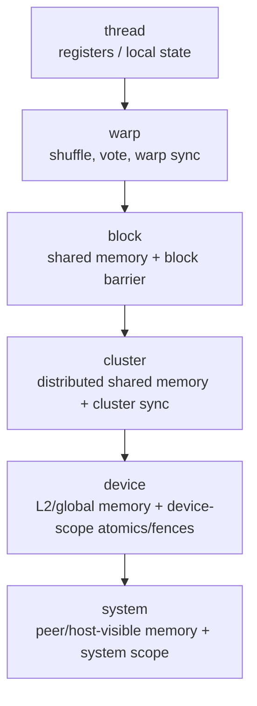

Farther scopes cost more because more physical agents and buffers must agree. A barrier is an execution rendezvous; a fence orders memory observations; an atomic combines access and ordering at a defined scope. They are related but not interchangeable.

---

### 2.7 One global load from source code to HBM

Consider:

```cuda
int i = blockIdx.x * blockDim.x + threadIdx.x;
float x = a[i];
```

End-to-end:

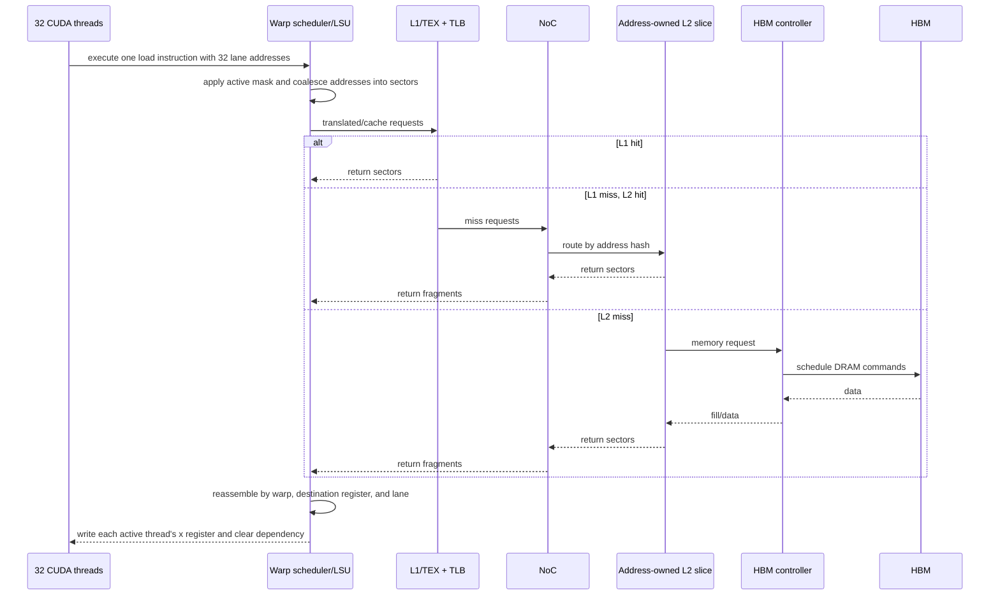

The source has 32 conceptual loads, the warp issues one vector-like instruction, and the coalescer generates the actual cache/memory transactions. Contiguous aligned FP32 addresses normally occupy four 32-byte sectors for 128 useful bytes. A stride that places every lane in a different sector can generate up to 32 sector requests and use only 4 bytes from each.

**Hardware/software split:**

- software chooses `i` and data layout;
- compiler emits address arithmetic and load instruction;
- hardware knows runtime addresses and performs coalescing, caching, routing, and return matching.

---

### 2.8 Worked mapping: vector addition

```cuda
__global__ void add(const float* a, const float* b, float* c, int n) {
    int i = blockIdx.x * blockDim.x + threadIdx.x;
    if (i < n) c[i] = a[i] + b[i];
}

int threads = 256;
int blocks  = (n + threads - 1) / threads;
add<<<blocks, threads>>>(a, b, c, n);
```

#### 2.8.1 Software interpretation

- one grid with `blocks` CTAs;
- each CTA has 256 threads;
- each thread computes one element;
- the bounds branch protects the tail.

#### 2.8.2 Hardware interpretation

- front end creates a grid descriptor;
- work distributor sends ready CTAs to SMs with enough register/warp slots;
- every CTA forms 8 warps;
- each warp executes integer index math, predicate compare, two global loads, one add, and one global store;
- tail divergence affects only the last partial warp;
- contiguous indexing lets the coalescer generate efficient sectors;
- several CTAs can reside on each SM and their warps hide L2/HBM latency.

There is no requirement that block 0 runs on SM 0, or that thread 17 uses physical ALU 17. Those are precisely the choices hardware is allowed to change.

---

### 2.9 Worked mapping: tiled matrix multiply

For a tiled GEMM, software normally assigns:

- grid coordinates → output matrix tiles;
- one block → one output tile;
- warps/warp groups → subtiles or producer/consumer roles;
- threads → fragments, vector loads, or scalar elements;
- shared memory → reusable A/B tiles;
- registers/tensor memory → accumulator fragments;
- async copy/TMA → HBM/L2-to-shared tile movement;
- tensor-core MMA → cooperative matrix update.

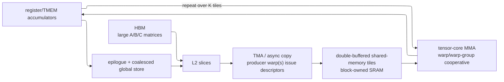

The block, warp roles, tile sizes, shared-memory layout, and pipeline stages are **software choices constrained by hardware resources**. The tensor cores, TMA engine, shared-memory banks, register files, and caches are **hardware**. Performance comes from making the software pipeline feed those physical units without bank conflicts, dependency bubbles, or HBM round trips.

---

### 2.10 Commands, streams, and concurrency

A CUDA stream is not an SM lane. It is an ordered software command sequence. The front end can overlap commands from streams when dependencies and hardware resources allow:

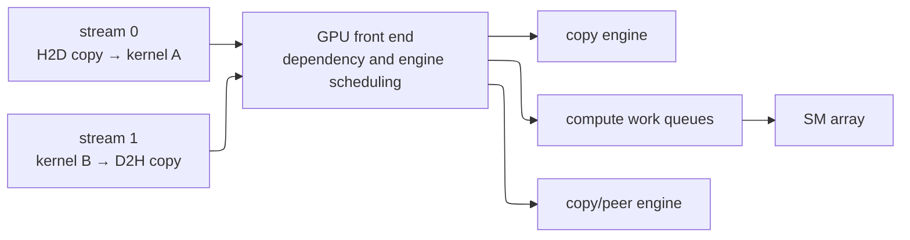

Concurrency can be limited by:

- false dependencies in the stream graph;
- only one copy engine/path for a direction;
- all SM resources consumed by one kernel's resident blocks;
- shared HBM/L2/NoC bandwidth;
- context, priority, or partitioning policy;
- synchronization that forces global quiescence.

CUDA Graphs reduce host/front-end launch overhead; they do not merge the physical memory and compute units.

---

### 2.11 Common wrong mappings

| Wrong statement | Correct model |
|---|---|
| “one CUDA thread runs on one CUDA core” | a thread is architectural state; its instructions are time-multiplexed onto compatible execution lanes |
| “one block equals one SM” | a block resides on one SM, but several blocks may share that SM and the grid usually has far more blocks than SMs |
| “one warp equals one scheduler” | one scheduler manages a pool of resident warps over time |
| “grid equals GPU” | a grid is a launch/work collection; its blocks occupy subsets of the GPU over time |
| “shared memory is shared by the whole GPU” | ordinary shared memory belongs to one block on one SM; cluster DSMEM extends access only within a co-scheduled cluster |
| “local memory is on-chip” | local is a per-thread address space usually backed by device memory and cached |
| “global memory is always HBM” | it is an address space; pages can map to local device, peer, or system memory |
| “L1/shared memory is one software object” | they may share physical SRAM resources, but cache and explicitly addressed shared memory have different semantics |
| “tensor core executes one thread's matrix” | warp/warp-group threads cooperate to provide fragments/descriptors for a matrix instruction |
| “TMA automatically makes a kernel fast” | software must build a correct producer/consumer pipeline, barriers, layouts, and reuse around the hardware copy engine |
| “high occupancy means high performance” | occupancy provides latency-hiding capacity; execution, memory bandwidth, divergence, and reuse can still bind |

---

### 2.12 What to inspect in tools

#### Compiler boundary

- resource report: registers/thread, static/dynamic shared memory, spills;
- PTX/native disassembly: load/store widths, MMA/TMA instructions, barriers;
- launch bounds and cluster attributes.

#### Scheduler/SM

- active and eligible warps per scheduler;
- issued warps/instructions and stall reasons;
- achieved versus theoretical occupancy;
- tensor/FP/INT/LSU pipeline utilization.

#### Memory

- global-load/store sector count and requested bytes;
- shared-memory bank conflicts;
- L1/TEX and L2 hit rates;
- DRAM bandwidth and memory-partition balance;
- TLB/page-fault/migration activity;
- NoC/L2/DRAM queue pressure.

#### System

- launch gaps and CPU submission overhead;
- stream overlap;
- copy-engine utilization;
- NVLink/PCIe traffic;
- power/thermal clock throttling.

The profiler is observing hardware structures; CUDA source names are correlation labels. Always walk from the limiting hardware counter back to the source access/scheduling choice.

---

### 2.13 Design questions a new GPU architect should be able to answer

1. What hardware owns a block from admission to completion?
2. Which per-SM resources limit resident blocks and warps?
3. How does one warp instruction reach operands and a target execution pipeline?
4. How are lane addresses merged and later reassembled into per-thread registers?
5. What is stored in registers, shared memory, L1, L2, and HBM, and who manages each?
6. How do cache misses find the owning L2 slice and memory controller?
7. Which structures track outstanding misses, page walks, async copies, and tensor operations?
8. What is the completion point for a store, barrier, block, kernel, stream event, and DMA?
9. Where can backpressure occur, and which queues/resources can form a deadlock or starvation cycle?
10. Which CUDA choices change physical traffic or residency rather than only source-code organization?

If any answer uses a one-to-one slogan (“thread = core,” “block = SM”), replace it with an allocation, lifetime, and multiplexing explanation.

---

### 2.14 Reading path

1. Revisit §§1, 3, and 4 of this chapter for scheduler, tensor-core, and TMA mechanics.
2. Read [Memory Hierarchy and Roofline](03_Memory_Hierarchy_and_Roofline.md) to turn the hierarchy into a performance model.
3. Read [CUDA Programming](../L5_Kernels_and_Programming/01_CUDA_Programming.md) to express the hierarchy in code.
4. Read [CUDA Optimization](../L5_Kernels_and_Programming/02_CUDA_Optimization.md) to diagnose the limiting physical structure.
5. Read [Blackwell Architecture](04_Blackwell_Architecture.md) for generation-specific specialization.

---

## 3. Tensor Cores

### 3.1 The Architectural Paradigm Shift
A Tensor Core is a matrix multiply-accumulate pipeline inside the SM. It amortizes instruction/control overhead across a tile:

$$D = A B + C$$

with instruction-defined tile shape and data types. The operation is **cooperative**: a warp (`mma.sync`) or warp group (`wgmma`) collectively supplies operands/descriptors and owns the distributed result. No single CUDA thread owns the full matrix, and the instruction shape is not a literal count of physical multipliers.

### 3.2 Microarchitecture: Datapath and the MMA Dataflow

The public ISA exposes the **logical dataflow**, not the transistor-level implementation:

1. global tiles arrive through L2/L1/TMA into shared memory or registers;
2. `ldmatrix`/normal loads or shared-memory descriptors present instruction-specific fragments;
3. the warp/warp group issues MMA operations over successive K tiles;
4. accumulators remain in per-thread registers on earlier instruction families or in tensor memory on supported Blackwell-class paths;
5. an epilogue converts/scales/biases and stores results.

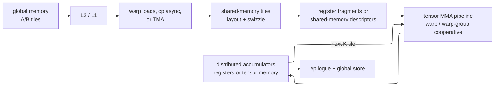

Whether a generation internally uses dot-product units, outer-product organization, systolic movement, compressor trees, or another arrangement is an implementation choice unless NVIDIA documents it. Do not infer physical parallelism or latency from `m64n256k16`.

### 3.2.1 The MMA Dataflow in Detail: From Registers to Accumulator

A Matrix Multiply-Accumulate computes $D_{m,n}=\sum_k A_{m,k}B_{k,n}+C_{m,n}$. CUDA kernels tile the full GEMM and repeat an instruction-supported K step.

**Warp-level MMA (`mma.sync` family):**

- one 32-thread warp participates;
- PTX defines which registers each thread contributes to A, B, C, and D fragments;
- fragment layout depends on shape/type/layout and is intentionally treated as opaque by higher-level WMMA APIs;
- `ldmatrix` and shared-memory layouts help populate fragments efficiently.

**Hopper warp-group MMA (`wgmma.mma_async` family):**

- four warps (128 threads) form the participating warp group;
- instruction variants accept shared-memory matrix descriptors and, for supported A forms, register operands;
- accumulator elements are distributed across participating threads' registers;
- issue is asynchronous relative to later scalar instructions and software uses fence/commit/wait operations with the exact semantics in the PTX ISA.

**Blackwell-class tensor-memory path:**

- new tensor-generation instructions and tensor memory change accumulator/operand staging;
- tensor memory is a specialized on-SM hardware resource with explicit allocation/access rules, not ordinary CUDA shared memory;
- use the Blackwell PTX/tuning documentation for supported shapes and layouts rather than applying Hopper `wgmma` operand rules.

The compiler/library normally owns fragment mapping. Hand-written PTX must follow the exact table for the selected instruction and PTX version.

### 3.3 Generation History

| Generation | Representative architecture | Programming-visible additions |
|---|---|---|
| 1st | Volta | warp-level FP16 matrix MMA with FP16/FP32 accumulation options |
| 2nd | Turing | integer low-precision tensor operations |
| 3rd | Ampere | BF16, TF32, structured sparsity, improved fragment-loading path |
| 4th | Hopper | FP8, warp-group asynchronous MMA, TMA/transaction barriers |
| 5th | Blackwell | FP4/FP6 and microscaling formats, tensor-memory and new tensor-generation instruction paths |

### 3.4 The `wgmma` Instruction and Async Semantics
Introduced in Hopper, `wgmma` (Warp-Group MMA) expands collaboration from 1 warp to **4 warps (128 threads)** computing collaboratively.

```text
wgmma.mma_async.sync.aligned.m64n256k16.f32.f16.f16
    {acc_regs},          // Destination FP32 accumulator registers
    desc_a,              // Shared-memory descriptor for A in this variant
    desc_b,              // Shared-memory descriptor for B
    ...                  // Variant-specific scale/layout controls
```

The operation is asynchronous with explicit ordering primitives. Software establishes shared-memory visibility, issues one or more MMA operations, commits a group, and waits before consuming accumulator results or reusing protected storage. Precise fence/commit/wait requirements come from the PTX ISA; “the warp immediately continues” does not remove data hazards.

### 3.5 Tensor-Core Throughput Math
A logical $M\times N\times K$ MMA accounts for:

$$ \text{ops} \;=\; 2 \cdot 64 \cdot 256 \cdot 16 \;=\; 524\,288\ \text{FLOPs} $$

This is **work per logical instruction**, not FLOP/cycle. Do not divide by K or an assumed pipeline depth and then multiply by a marketing “tensor core count”: instruction latency, initiation interval, internal decomposition, and sharing are architecture-specific, and that method double-counts physical parallelism.

Use the product's published dense/sparse peak for the selected type as the hardware roof. Measure sustained instruction throughput and check operand-delivery, shared-memory, tensor-pipe, and dependency counters. The attainable rate is bounded by:

$$
P_{\text{tensor}} \le
\min(P_{\text{published compute roof}},
I_{\text{SMEM}}\cdot B_{\text{SMEM}},
I_{\text{HBM}}\cdot B_{\text{HBM}},
P_{\text{issue/operand}})
$$

---

### 3.6 Arithmetic implementation model (bridge to L2, not a published netlist)

NVIDIA publishes ISA behavior and selected throughput/resource facts, not a complete gate-level tensor-core netlist. The following is a **generic implementation model** showing the arithmetic structures any low-precision dot-product engine needs; it must not be cited as the exact Hopper/Blackwell circuit.

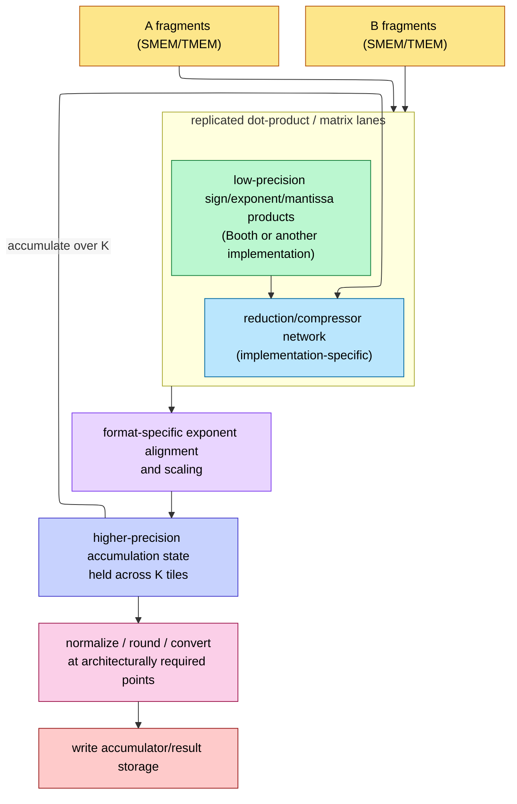

Reading it against [L2 FP Unit Design](../L2_Digital_Design_for_AI/02_FP_Unit_Design.md):

- narrower formats reduce multiplier/input bandwidth, but accumulation and data movement do not shrink by the same factor;
- reduction hardware can retain redundant/carry-save state internally to avoid a full carry-propagate operation after every product, but the exact grouping is not architectural;
- block-scaled/microscaling formats reduce some exponent metadata/alignment work while adding scale handling;
- the architectural accumulator type and documented rounding behavior—not an assumed internal FP32 wire—define numerical correctness.

The useful bridge to L2 is the list of required functions: multiply, align/scale, reduce, accumulate, normalize/round, and write back. Their replication, pipeline depth, and circuit choices require silicon/vendor evidence.

---

## 4. Memory Hierarchy from the SM's Perspective

### 4.1 Tier Latencies

| Tier | Sharing scope | Management | Relative access cost |
|---|---|---|---|
| register file | one thread logically; RF shared by resident warps | compiler + SM allocation | lowest, but banking/operand collection can add stalls |
| tensor memory/operand storage | cooperative tensor operation, where supported | instructions/compiler | on-SM and specialized; generation-specific |
| shared memory | one block | software addressed | on-SM, normally tens-of-cycles class |
| distributed shared memory | blocks in one cluster | software addressed + cluster fabric | higher than local shared memory; lower scope than chip-wide L2 |
| L1/TEX | one SM | hardware cache | on-SM, hit/miss and replay dependent |
| L2 | whole GPU | hardware cache | NoC traversal plus slice lookup |
| HBM/device DRAM | whole device/package | memory controllers | highest local-device latency, highest capacity |

Exact latency, bandwidth, and capacity vary by device, clock, access pattern, cache state, and contention. Query device attributes for capacity and use microbenchmarks/profiler counters for latency/bandwidth. The stable architectural lesson is locality: tiling keeps reusable operands in registers/shared memory and avoids repeated chip-wide/off-package movement.

### 4.2 SMEM Banking and Strides
For the common 32-bank, 4-byte bank mode, bank index is `(addr/4) mod 32`.

- **Stride-1 32-bit words:** consecutive lanes normally address distinct banks.
- **Stride-32 32-bit words:** lanes can address different words in the same bank and serialize; if all lanes read the *same* word, hardware can use the broadcast behavior instead of treating it as a 32-way conflict.
- **Padding:** changing a leading dimension from 32 to 33 is a classic repair for one matrix-column access pattern. It is not a universal guarantee; vector width, element size, swizzle, and instruction access pattern determine the bank mapping.

### 4.3 Memory Coalescing (Global Memory)
When the 32 threads of a warp execute a global memory load (HBM), the hardware Load/Store Unit (LSU) aggressively attempts to *coalesce* the 32 individual physical addresses into as few 32-byte cache line transactions as possible.
- **Perfect Coalescing:** Threads access contiguous memory (`A[threadIdx.x]`). The LSU groups this into exactly four 32-byte transactions. 100% bus utilization.
- **Uncoalesced Access:** Threads stride through memory (`A[threadIdx.x * 32]`). The LSU must issue 32 totally separate 32-byte transactions. Because only 4 bytes of each 32-byte cache line are actually needed, the remaining 28 bytes are thrown away. HBM bandwidth drops by up to ~87% ($1/8$). This is fatal for inference workloads.

### 4.4 Thread Block Clusters and DSMEM (Hopper+)
Before thread-block clusters, ordinary blocks communicated through device/global memory and its cache hierarchy; one block could not directly address another block's shared-memory allocation. Hopper adds an optional cluster level:

- cluster member blocks are co-scheduled within one GPC;
- `cluster.sync()` provides a cluster rendezvous;
- a block can read, write, or perform supported atomics to another member block's shared-memory allocation through **distributed shared memory (DSMEM)**;
- distributed capacity is the sum of the member blocks' separate per-block allocations, not one physically monolithic SRAM.

DSMEM can avoid some L2/global-memory traffic, but its latency/bandwidth and the occupancy cost of co-scheduling a cluster are device- and pattern-dependent.

### 4.5 TMA — The Async Copy Revolution
Before Hopper TMA, software commonly used warp-cooperative loads and, on Ampere, `cp.async`-class global-to-shared copies. Hopper TMA extends this with descriptor-driven one- through five-dimensional bulk movement, reducing address-generation/register/issue overhead and allowing data movement to overlap computation.

The **Tensor Memory Accelerator (TMA)** offloads this completely to an independent hardware **Proxy Engine**:

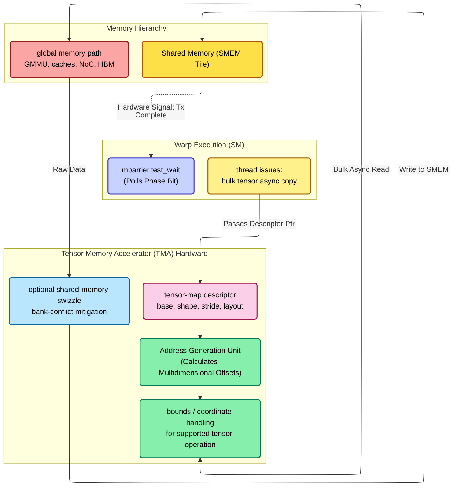

**TMA Expert Microarchitectural Breakdown:**

1. **Tensor map:** software/driver encodes base address, dimensional shapes/strides, element type, and supported layout/swizzle options in a descriptor.
2. **Bulk address generation:** one initiating thread can launch a large transfer; TMA generates the many element addresses and applies supported bounds behavior.
3. **Memory path:** requests still pass through translation, caches, the on-chip fabric, and memory controllers. TMA is not a private bypass wire to HBM.
4. **Layout/swizzle:** supported swizzles can reduce shared-memory bank conflicts, but software must select a layout compatible with the consumer instruction. “TMA guarantees zero conflicts” is not a protocol guarantee.
5. **Transaction barrier:** an `mbarrier`/pipeline records arrivals and asynchronous transaction completion. Phase/parity lets software safely reuse a pipeline stage. Waiting prevents consumption before completion; it should not be interpreted as a promised physical low-power sleep implementation.

### 4.6 L2 Cache and Memory Controller Organization

The chip-wide L2 is physically partitioned. An address mapping/hash selects a slice/memory partition; the NoC routes the SM request there. On a hit, data returns from L2. On a miss, the associated memory path sends work to an HBM controller, which schedules DRAM commands and returns the line through L2/NoC.

For a concrete documented example, H100 SXM5 exposes 50 MB of L2 and five active HBM3 stacks through ten 512-bit memory controllers; a full GH100 implementation has different enabled resources. Blackwell products have different capacities and organization. Do not generalize “32 controllers” or one slice size across them.

Architecturally:

- L2 is the rendezvous for chip-wide caching, many atomics, peer/copy traffic, and persistence controls;
- slice selection and memory-channel mapping can create partition hotspots for adversarial strides;
- an L2 hit avoids HBM traffic but still pays NoC and slice contention;
- effective hit rate is workload and schedule dependent, so fixed hit-rate tables for “GEMM” or “decode” are not portable.

For a simple first-order estimate:

$$T_{\text{average}} \approx hT_{\text{L2 hit}}+(1-h)T_{\text{L2 miss}}$$

but measure `h` and both latency distributions on the target GPU. Use the current Nsight Compute Memory Workload Analysis rather than hard-coding metric names that can change by architecture/tool release.

### 4.7 Virtual Memory, TLBs, and Unified Memory (UVM)
Modern GPUs issue virtual addresses. TLBs cache translations and page walkers consult page tables on a miss. The GMMU enforces address-space and protection rules while replay/fault machinery records affected work.

Unified Memory provides a common virtual allocation whose pages can reside in GPU, system, or peer memory depending on platform and policy. A nonresident access can fault; hardware reports/buffers the fault and the CUDA/UVM driver participates in placement, mapping, and any page migration. This is not a purely autonomous “page-migration engine” transaction in all systems. Migration and remote access can be orders of magnitude slower than an L2/HBM hit, so prefetch/advice and working-set placement matter when faults appear in profiles.

### 4.8 Hardware Memory Compression
Some NVIDIA products support transparent inline/compression paths for eligible traffic or surfaces in L2/memory partitions. The algorithms, eligibility, and realized ratio are data- and product-dependent; do not assume every CUDA allocation uses “delta color compression” or receives a fixed bandwidth multiplier.

Compression saves bytes only when data is compressible and the access path supports it. Capacity/bandwidth counters and the product tuning guide are the evidence. Unified-memory migration behavior must be measured separately rather than attributed to an undocumented decompression penalty.

---

## 5. The Interconnect Fabric

### 5.1 Network on Chip (NoC) and The Partitioned Crossbar
Connecting 128 SMs to massive L2 caches and HBM stacks requires a sophisticated internal fabric.
- **Partitioned Xbar:** The primary interconnect is a massive hierarchical crossbar. However, the L2 cache is physically partitioned across the die.
- **Near vs. Far Hits:** An SM accessing an L2 slice physically adjacent to it (Near Hit) experiences low latency. Accessing an L2 slice on the opposite side of the chip (Far Hit) requires traversing the main crossbar, adding ~40-70 cycles of latency. Hashing algorithms ensure memory addresses are uniformly striped across L2 slices to prevent hotspotting.

### 5.2 NVLink and NV-HBI (Die-to-Die)
To scale beyond a single reticle limit, NVIDIA uses extremely dense point-to-point interconnects.
- **NVLink (Node-Scale):** Operates at up to 1.8 TB/s per GPU (Blackwell). NVLink utilizes proprietary packet framing (FLITs) and signaling to connect multiple GPUs on a board or across a rack via **NVSwitch** ASICs, maintaining shared address spaces and atomic operations at speeds an order of magnitude faster than PCIe.
- **NV-HBI (Chiplet-Scale):** In the dual-die Blackwell B200, the two silicon dies are stitched together via the NV-HBI (High Bandwidth Interface), delivering 10 TB/s. The NoC routes traffic across this bridge natively. To the software, the two dies maintain L2 cache coherency and present as a single monolithic logical GPU.

---

## 6. Hopper vs Blackwell — what changed

### 6.1 Architectural deltas

| Feature | Hopper H100 | Blackwell B200 |
|---|---|---|
| Process | TSMC 4N | TSMC 4NP, dual-die |
| Die area | 814 mm² | 2 × ~800 mm² (NV-HBI bridged) |
| SMs | 132 active (of 144 physical) | 128 per die, 256 logical (one GPU view) |
| FP8 TFLOPS | ~1 980 (dense) | ~4 500 (dense) |
| FP4 TFLOPS | n/a | ~9 000 (dense, MXFP4) |
| HBM | 80 GB HBM3 (3.35 TB/s) | 192 GB HBM3e (8 TB/s) |
| TMEM | n/a | 256 KB/SM |
| 5th-gen TC formats | FP8, BF16 | + FP4, FP6, MXFP4, NVFP4 |
| NVLink | 4 (900 GB/s/GPU) | 5 (1.8 TB/s/GPU) |
| Domain | NVL8/NVL256 | NVL72 / NVL576 |

### 6.2 NV-HBI mesochronous bridge

Two compute dies bridged via 10 TB/s die-to-die link. CUDA presents them as one GPU; cache-coherent at L2. Cross-die access penalty: 2–4 cycles + ~50 cycles (NoC traversal on remote die). Negligible for HBM accesses (already 400 cycles), modest for L2 accesses.

### 6.3 TMEM (covered fully in Blackwell page)

256 KB dedicated tensor-operand SRAM per SM, separating wgmma traffic from general SMEM. Required because FP4 demand on operand bandwidth exceeds SMEM port budget.

---

## 7. Achievable utilization in practice

### 7.1 Roofline-bound

Peak TFLOPS only achieved when:

- Workload arithmetic intensity exceeds ridge point (~295 FLOP/B on H100 FP16, ~1 125 on B200 FP4).
- Operand fetch keeps tensor cores fed (TMA + double-buffered tiles).
- Occupancy ≥ $W_{\min}$ to hide HBM latency on misses.

### 7.2 Real-world utilization

| Workload | Typical utilization on H100 | On B200 |
|---|---|---|
| Dense BF16 GEMM (large M,K,N) | 70–80% | 65–75% |
| FlashAttention fwd | 70–80% | 60–70% |
| Decode (bs=1, 70B model) | <5% (memory-bound) | <5% |
| MoE prefill | 50–65% | 50–60% |
| MoE decode | 10–20% | 10–20% |

The FP4 generation often shows *lower* % utilization than FP8 because peak FLOPS doubled but operand bandwidth didn't keep up everywhere. Absolute throughput still rises ~1.6×.

---

## 8. Microarchitectural Cause and Effect

The physical constraints of the GPU hardware fundamentally dictate algorithm design at the software layer:

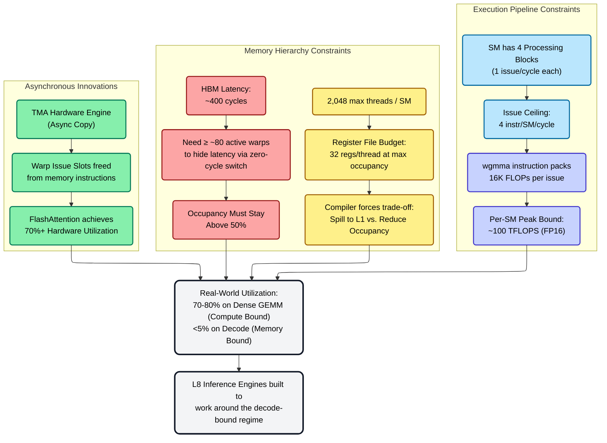

---

## 9. Numbers to memorize

| Quantity | Value | Why |
|---|---|---|
| H100 SMs | 132 (132 active, 144 physical) | Architecture spec |
| Blackwell B200 SMs (dual-die) | 256 (128 per die) | Architecture spec |
| Threads / SM | 2 048 | 64 warps × 32 |
| Registers / SM | 65 536 × 32-bit | 256 KB |
| Tensor cores / SM | 4 | 1 per PB |
| FP16 wgmma rate per SM | ~100 TFLOPS | At 1.6 GHz |
| H100 FP16 peak | ~990 TFLOPS dense | 1.98 PF FP8 |
| B200 FP8 peak | ~4 500 TFLOPS dense | Both dies |
| B200 FP4 peak | ~9 000 TFLOPS dense | NVFP4 |
| H100 HBM BW | 3.35 TB/s | HBM3 |
| B200 HBM BW | 8 TB/s | HBM3e |
| H100 ridge point (FP16) | ~295 FLOP/B | π/β |
| B200 ridge point (FP4) | ~1 125 FLOP/B | Why decode is bad |
| TMEM size (Blackwell) | 256 KB/SM | New tier |
| L2 size (H100/B200) | ~50 MB | Distributed |
| HBM latency | ~400 cycles | Drives oversubscription |
| L2 latency | 30–80 cycles | Per slice distance |
| SMEM latency | 20–30 cycles | Bank-bounce (Hopper) |
| RF latency | 1 cycle | After operand collector |
| NV-HBI BW (die-to-die) | ~10 TB/s | Cross-die |
| NV-HBI penalty | 2–4 cycles | CDC overhead |
| Min warps to hide HBM | ~80 | $L/I$ rule |

---

## 10. References

- NVIDIA H100 / Hopper / Blackwell Tuning Guides — official ISA + microarch docs.
- Choquette et al., *NVIDIA Hopper Architecture*, IEEE Micro 2023.
- Jia, Maggioni et al., *Dissecting the NVIDIA Hopper Architecture*, arXiv 2402.13499.
- Patterson & Hennessy, *Computer Architecture: A Quantitative Approach*, 6th ed. — SIMT chapter.

---

**Up the stack:** [Memory_Hierarchy_and_Roofline](03_Memory_Hierarchy_and_Roofline.md) → [Blackwell_Architecture](04_Blackwell_Architecture.md).
**Down the stack:** [ISA_and_Execution_Model](01_ISA_and_Execution_Model.md), [L2 Digital_Design_For_AI](../L2_Digital_Design_for_AI/04_Digital_Design_For_AI.md).
