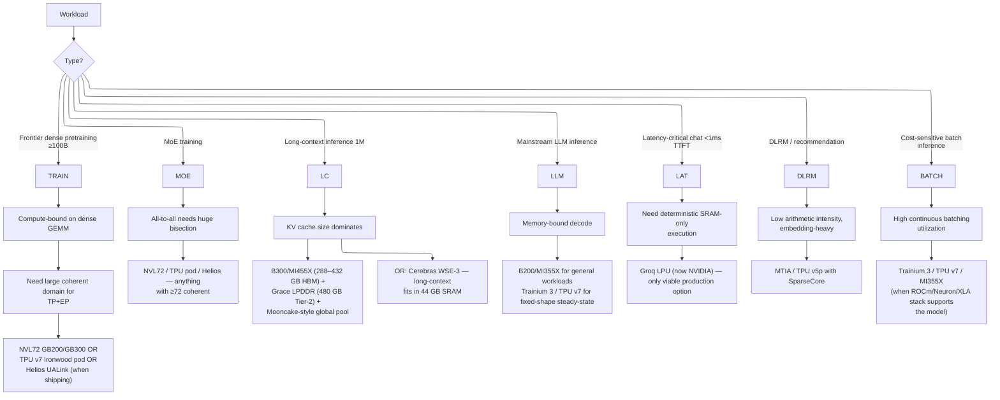
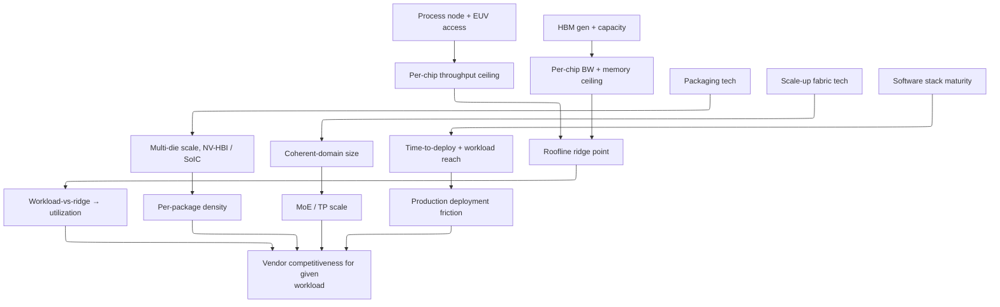

# Accelerator Landscape 2026 — Comparative Survey

> **Layer:** L3 (closing summary).
> **Prerequisites:** every other L3 page (this is the synthesis).
> **Hands off to:** L4 (networking), L8 (inference engines), L7 (training), and the production-architecture decisions throughout.

---

## 0. The map of the territory

Twelve distinct families ship AI silicon at scale in 2026. Each occupies a niche defined by execution model, scale-up domain, and software ecosystem. This page is the comparative cross-section that lets you pick the right chip for a workload — or understand why a given workload is going to a given chip.

---

## 1. The 2026 production lineup

| Vendor | Part | Microarch | Process | HBM (GB) | Mem BW (TB/s) | FP8 dense (PFLOPS) | FP4 dense (PFLOPS) | Scale-up domain | Software | TDP (W) |
|---|---|---|---|---|---|---|---|---|---|---|
| NVIDIA | H100 | Hopper | TSMC 4N | 80 | 3.35 | 1.98 | – | NVLink-4 (8) | CUDA | 700 |
| NVIDIA | H200 | Hopper | TSMC 4N | 141 | 4.8 | 1.98 | – | NVLink-4 (8) | CUDA | 700 |
| NVIDIA | B200 | Blackwell | TSMC 4NP dual-die | 192 | 8.0 | 4.5 | 9.0 | NVL72 (72) | CUDA + TE2 | 1 000 |
| NVIDIA | B300 | Blackwell Ultra | TSMC 4NP dual-die | 288 | 8.0 | 5.4 | 10.8 | NVL72 (72) | CUDA + TE2 | 1 200 |
| NVIDIA | R100 | Vera Rubin (announced GTC Mar 2026) | TSMC 3NP dual-die, Vera CPU | 288 (HBM4) | 22.0 | ~25 | ~50 | NVL576 (576), NVLink-6 | CUDA + TE3 | ~1 500 |
| AMD | MI300X | CDNA 3 | N5 + N6 | 192 | 5.3 | 2.6 | – | xGMI (8) | ROCm 6 | 750 |
| AMD | MI355X | CDNA 4 | N3 + N6 | 288 | 8.0 | 10.1 | 20.1 | xGMI (8) | ROCm 7 | 1 000 |
| AMD | MI450 | Altair (CDNA 5) | TSMC N2 | 432 (HBM4) | 19.6 | ~20 | ~40 | Helios rack (64/72/128 GPU) | ROCm 7+ | <1 200 (volume SKU) |
| AMD | MI430X | Altair (CDNA 5) | TSMC N2 | 432 (HBM4) | 19.6 | FP64-optimized | – | Helios rack | ROCm 7+ | ~1 100 (HPC/sovereign) |
| AMD | MI455X | Altair | TSMC N2 | 432 (HBM4) | 19.6 | ~20 | ~40 | UALink (72), UALoE72 confirmed | ROCm 7+ | 1 200 |
| Google | TPU v5p | TPU v5p | – | 95 | 2.7 | – (BF16: 0.46) | – | ICI (8 960) + OCS | XLA / JAX | ~600 |
| Google | TPU v6e | Trillium | – | 32 | 1.6 | ~1.8 INT8 | – | ICI (256) | XLA / JAX | ~400 |
| Google | TPU v7 | Ironwood | – | 192 | 7.37 | 4.6 | – | ICI (9 216) + OCS | XLA / JAX / Pallas | ~900 |
| Google | TPU 8t | v8 training (Broadcom) | – | 216 (HBM3e) | 6.53 | – | 12.6 | ICI superpod (9 600, 2 PB HBM) | XLA / JAX / Pallas | TBD |
| Google | TPU 8i | v8 inference (MediaTek) | – | 288 (HBM3e) + 384 MB SRAM | 8.6 | – | 10.1 | Boardfly + CAE (→1M cluster) | XLA / JAX / Pallas | TBD |
| AWS | Trainium 2 | NeuronCore-v3 | TSMC 5nm | 96 | 2.9 | 1.3 | – | NeuronLink (16) | Neuron + NKI | ~700 |
| AWS | Trainium 3 | NeuronCore-v4 | TSMC 3nm | 144 | 4.9 | 2.52 | (MXFP4) | NeuronLink (16) | Neuron + NKI | ~900 |
| Meta | MTIA v2 | Artemis mesh | TSMC 5nm | 128 LPDDR5 | 0.2 | inference-tier | – | PCIe / Meta-internal | Triton-MTIA | 90 |
| Meta | MTIA v3 | Iris | TSMC 3nm + HBM | TBD | TBD | TBD | – | TBD | Triton-MTIA | TBD |
| Cerebras | WSE-3 (IPO May 15, 2026) | wafer mesh | TSMC 5nm wafer | 0.044 (SRAM) | 21 000 (SRAM) | – (FP16: 125) | – | SwarmX (192 nodes) | Cerebras SDK | 23 000 (system) |
| Groq (NVIDIA) | LPU | TSP | TSMC 14nm | 0.23 (SRAM) | (huge SRAM BW) | (~0.75 INT8) | – | GroqLink (600+) | Groq compiler → CUDA integration | ~300 |
| Tenstorrent | Blackhole | NoC mesh + RISC-V | TSMC 5nm | ~30 GB HBM3 | ~1.6 | ~1.0 | – | Ethernet NoC | TT-NN + Triton | ~300 |
| Huawei | Ascend 910C | DaVinci 3.0 | SMIC 7nm dual-die | 128 HBM3 | 3.2 | (INT8 emul.) | – | HCCS / CM-384 (384) | CANN + MindIE | ~600 |

Performance numbers are dense steady-state thermal-budget throughput. Sparse (2:4) effectively doubles for vendors that support it (NVIDIA, AMD CDNA-4).

---

## 2. Roofline ridge points (the universal scoring metric)

Recall (from [Memory_Hierarchy_and_Roofline](Memory_Hierarchy_and_Roofline.md)): **ridge point = π/β**. Below ridge → memory-bound, above → compute-bound.

```mermaid
%%{init: {"flowchart": {"defaultRenderer": "elk", "nodeSpacing": 60, "rankSpacing": 60, "htmlLabels": false}}}%%
xychart-beta
    title "Ridge points (FP8 / FP4 / BF16) — log-conceptual"
    x-axis "Chip" ["WSE-3", "TPU v7", "H100 (FP8)", "B200 (FP8)", "B300 (FP8)", "B200 (FP4)", "MI355X (FP4)", "Rubin (FP4)"]
    y-axis "Ridge (FLOP/B)" 0 --> 3000
    bar [6, 626, 591, 562, 675, 1125, 2513,<br/>2273]
```

The lower the bar, the more workloads are compute-bound on that chip. Cerebras inverts the regime entirely; FP4 generations push the ridge so high that essentially everything becomes memory-bound.

---

## 3. Scale-up fabric comparison

| Vendor | Fabric | Per-chip BW | Coherent domain | Topology | Switch tech |
|---|---|---|---|---|---|
| NVIDIA | NVLink 5 | 1.8 TB/s unidirectional | NVL72 (72) → NVL576 (576) | Folded Clos | Electrical NVSwitch |
| NVIDIA | NVLink 6 (Vera Rubin, confirmed GTC Mar 2026) | 3.6 TB/s | NVL576 / 576 | Optical-augmented Clos | Electrical + optical |
| AMD | xGMI | 0.45 TB/s (MI300X) | 8 | Direct mesh | none (direct) |
| AMD | UALink (Helios) | ~1 TB/s | 72 | Switch-based | UALink switch |
| Google | ICI | ~50–100 GB/s/link | 9 216 (Ironwood pod) | 3D torus + OCS | Electrical (intra-rack) + MEMS optical (inter-rack) |
| AWS | NeuronLink | ~200 GB/s/pair | 16 | Direct mesh | none |
| Cerebras | SwarmX | 1.2 TB/s aggregate | 192 wafers | Broadcast tree | Optical switches |
| Huawei | HCCS / CM-384 | ~0.4 TB/s | 384 (CM-384) | Mesh + optical | Custom |
| Tenstorrent | Ethernet NoC | depends | Ethernet-scale | Standard Ethernet | Ethernet switches |

Two design philosophies:

- **Coherent domain wins** (NVIDIA, AMD, Google, AWS) — make every accelerator addressable as a single logical machine via cache-coherent interconnect.
- **Scale-out everywhere** (Cerebras, Tenstorrent, sometimes AMD) — accept non-coherent inter-chip traffic, optimize the message-passing layer.

For MoE training and large-TP workloads, coherent domain wins. For weight-streaming inference and dataflow architectures, scale-out is fine.

---

## 4. Software ecosystem comparison

| Stack | First-class user code | Compiler | Distributed | Inference engine | Custom kernel DSL |
|---|---|---|---|---|---|
| CUDA / NVIDIA | C++, Python | nvcc | NCCL | TensorRT-LLM, vLLM, SGLang | CUDA C, Triton |
| ROCm / AMD | HIP, Python | clang/LLVM | RCCL | vLLM-AMD, SGLang-AMD | HIP, Triton-AMD |
| Neuron / AWS | PyTorch (via plugin) | Neuron Compiler | NeuronLink CCL | Neuron Inference | NKI |
| XLA / Google | JAX, TF, PyTorch-XLA | XLA | JAX pjit | Vertex AI inference | Pallas |
| CANN / Huawei | MindSpore, PyTorch (via torch_npu) | CCE | HCCL | MindIE | AscendC |
| Cerebras | PyTorch / TF (graph-only) | Cerebras compiler | builtin | builtin | none |
| Groq (NVIDIA) | proprietary | Groq compiler | builtin | builtin | none (→ CUDA integration underway) |
| Tenstorrent | Python | TT compiler | TT-NN | TT-NN | TT-NN, Triton (forked) |

Maturity ranking (approximate, 2026):

1. CUDA — gold standard.
2. XLA / JAX — strong in JAX users; weaker for PyTorch.
3. ROCm 7 — caught up dramatically; ~85–95% perf parity for major frameworks.
4. CANN — strong in China; bumpy outside the Huawei ecosystem.
5. Neuron / NKI — production-ready for AWS Bedrock customers.
6. Triton-MTIA — early adopter only.
7. Cerebras / Groq (NVIDIA) / Tenstorrent — vendor-managed; rare for users to drop low-level. Groq being absorbed into NVIDIA stack post-acquisition.

---

## 5. Workload → chip decision tree



---

## 6. The economic axis

Per-token cost ≈ (capex amortization + power + facility) / throughput. Rough estimates for Llama-3 70B inference:

| Chip | $/1M tokens (approx) | Caveat |
|---|---|---|
| B200 (NVL72, batched) | $0.20 | best $/token for general-purpose |
| MI355X (xGMI, batched) | $0.25 | catching up via ROCm 7 |
| Trainium 3 | $0.18 | only with AWS Bedrock |
| TPU v7 (batched) | $0.22 | only via Vertex AI |
| Cerebras WSE-3 | $1.50 | premium — long-context advantage |
| Groq LPU (NVIDIA) | $20.00 | latency-critical only; now part of NVIDIA inference portfolio |
| Ascend 910C (CM-384) | $0.30 | China-restricted ecosystem |

Numbers are illustrative; real numbers depend on contract pricing and workload mix.

---

## 7. The 2026 bottlenecks

What's gating each platform's growth:

| Platform | Bottleneck |
|---|---|
| NVIDIA | TSMC CoWoS-L capacity, HBM3e supply, EUV scanner allocation |
| AMD | TSMC N3 + HBM3e supply (downstream of NVIDIA), ROCm software polish for niche models; MI400 "Altair" engineering samples H2 2026 on track; ZT Systems ($4.9B) for rack-scale engineering; Sanmina as NPI manufacturing partner |
| Google | TPU manufacturing capacity (TSMC + Broadcom), pod construction time |
| AWS | Trainium 3 fab ramp, Neuron Compiler maturity for non-mainstream models |
| Meta | MTIA v3 ramp, Triton-MTIA polish |
| Cerebras | Wafer yield (44 GB SRAM yield + cost), SwarmX scale-out; IPO completed May 15, 2026 — improved visibility for WSE-3/WSE-4 roadmap |
| Groq (NVIDIA) | Total capex per Llama-class deployment; now being integrated into NVIDIA's GPU+LPU heterogeneous inference architecture post-$20B acquisition |
| Huawei | SMIC node maturity, HBM supply (geopolitical), SW ecosystem outside China |
| Tenstorrent | Ecosystem; per-chip throughput vs GPUs |

---

## 8. Intel Gaudi / Ponte Vecchio

Intel's datacenter AI accelerator line, derived from the Habana Gaudi architecture (acquired 2019), occupies a distinct niche:

- **Intel Gaudi 3**: 8 nm TSMC, 96 GB HBM3, ~1.8 PFLOPS FP8, 900 W TDP.
- **Architecture**: programmable VLIW tensor processors with local SRAM (not a GPU-style warp scheduler; closer to a TPU-style systolic array with explicit data-movement instructions).
- **Software**: Habana SynapseAI with PyTorch integration; oneAPI/SYCL for custom kernels. The SynapseAI stack handles graph-level optimization, operator fusion, and distributed training across Gaudi nodes.
- **Strategic context**: Intel has pivoted away from Ponte Vecchio (Xe-HPC GPU) for AI workloads; the Gaudi line is now the primary datacenter AI offering. Ponte Vecchio remains relevant for HPC/simulation but not for LLM training/inference at scale.
- **Status**: Gaudi 3 shipping 2025, limited adoption vs NVIDIA/AMD. Key barriers: CUDA ecosystem lock-in, ROCm momentum, and Intel's own organizational instability in the accelerator division.

Gaudi 3's FP8 throughput (~1.8 PF) places it between H100 and H200 in raw compute, but software maturity and scale-up fabric (Ethernet-based, no NVLink/UALink equivalent) limit its competitiveness for frontier-model training.

---

## 9. Edge AI Accelerators

On-device inference accelerators complement datacenter GPUs by reducing latency and cost for small models and enabling privacy-sensitive use cases.

| Accelerator | Vendor | Peak Throughput | Key Feature |
|---|---|---|---|
| Apple Neural Engine (ANE) | Apple | ~15.8 TOPS (A17 Pro) | 16-core design in A-series/M-series SoCs, optimized for transformer inference on-device |
| Qualcomm Hexagon NPU | Qualcomm | 45 TOPS (Snapdragon 8 Gen 3) | INT8/INT4 quantized inference, integrated into Snapdragon mobile SoCs |
| Google Edge TPU | Google | 4 TOPS INT8 | Used in Coral devices for embedded ML, TensorFlow Lite integration |

**Relevance to datacenter AI engineers**: on-device inference reduces latency and cost for small models and complements cloud inference for privacy-sensitive use cases. The trend toward on-device LLM inference (e.g., Apple Intelligence, Gemini Nano) means that some fraction of inference demand is shifting from datacenter GPUs to edge accelerators.

**Key constraint — memory bandwidth**: LPDDR5 on mobile provides ~60 GB/s vs HBM at ~3.3 TB/s on datacenter accelerators — a ~55x gap. This constrains on-device model size (typically <10B parameters with aggressive quantization) and makes memory-bound decode proportionally more expensive per token than on a B200/MI355X. The bandwidth gap is the fundamental reason edge inference is limited to small, heavily quantized models.

---

## 10. NVIDIA–Groq Acquisition ($20B, March 2026)

NVIDIA acquired Groq for approximately $20 billion in March 2026, giving NVIDIA control of both the GPU and LPU inference paths. Key technical details:

- **Groq 3 LPX rack**: 256 LPU chips, 315 PFLOPS aggregate throughput, 128 GB SRAM total, 40 PB/s internal bandwidth. This is a purpose-built inference appliance — no GPU-style scheduling overhead, deterministic latency per token.
- **Heterogeneous GPU+LPU inference architecture**: the post-acquisition roadmap pairs NVIDIA GPUs (prefill / attention-heavy phases) with Groq LPUs (low-latency decode). This is a disaggregated serving topology: GPUs handle the compute-intensive prefill, LPUs handle the memory-bandwidth-bound decode at minimal jitter.
- **Attention-FFN Disaggregation (AFD)**: within the decode stage itself, attention operations are separated from FFN operations. LPUs execute FFN at deterministic SRAM speed; attention is either co-located on GPU or offloaded to a dedicated attention tier. This reduces per-token decode latency by eliminating pipeline stalls between attention and FFN within a single device.
- **Implications**: NVIDIA now owns both the general-purpose GPU path (Hopper → Blackwell → Vera Rubin) and the latency-optimized LPU path. For inference-serving operators, the decision shifts from "GPU vs LPU" to "which NVIDIA inference tier" — analogous to how NVIDIA already segments networking (NVLink vs Ethernet via Spectrum-X).

---

## 11. NVIDIA Vera Rubin (announced GTC March 2026)

The Rubin architecture, officially named **Vera Rubin** at GTC March 2026, pairs the Vera CPU with the Rubin GPU:

> The microarchitectural lineage leading here — B100→B300 die configurations, NV-HBI, TMEM, and the NVL72→NVL576 scale-up path — is covered in [Blackwell_Architecture](Blackwell_Architecture.md), with the Rubin outlook in its §9.

- **Confirmed specs**: TSMC 3NP dual-die, NVL576 interconnect, NVLink-6 at 3.6 TB/s unidirectional per-chip bandwidth.
- **Memory**: 288 GB HBM4 per GPU, 22.0 TB/s memory bandwidth.
- **Performance**: ~25 PFLOPS FP8 dense, ~50 PFLOPS FP4 dense (estimated).
- **Scale-up**: NVL576 provides a 576-GPU coherent domain — 5x larger than NVL72 (Blackwell). This is the first NVIDIA architecture to break the 72-GPU NVLink barrier via optical-augmented Clos.
- **Transistor count / process**: 336 B transistors, TSMC 3nm dual-die. R100/R200 delivers ~50 PFLOPS NVFP4 inference per package with 288 GB HBM4 at 22 TB/s (vs 8 TB/s HBM3e on Blackwell Ultra).
- **Vera CPU ("Olympus")**: 88 Armv9.2 cores / 176 threads (Spatial Multithreading), up to 1.5 TB LPDDR5X, NVLink-C2C at 1.8 TB/s to the GPUs.
- **VR200 NVL144 rack**: 72 Vera Rubin Superchips (1 Vera CPU + 2 Rubin GPUs each) = 144 GPU dies. NVIDIA claims 3.3× FP4 and 1.6× FP8 vs GB300 NVL72. Rack power climbs to ~190–230 kW (vs 120–130 kW Blackwell).
- **Rubin CPX**: a separate prefill-specialized GPU for massive-context inference — GDDR7 instead of HBM, optimized for compute-bound prefill; pairs with HBM4 Rubin for decode (hardware-level prefill-decode disaggregation; see [Prefill_Decode_Disaggregation](../L8_Inference_and_Serving/Prefill_Decode_Disaggregation.md)).
- **Status**: announced GTC Mar 2026; **in full production as of CES Jan 2026 statements, volume H2 2026**.

---

## 12. AMD MI400 "Altair" Series

AMD's next-generation MI400 family, codenamed **Altair** (CDNA 5), was detailed at CES 2026 with three SKUs:

- **MI455X (flagship)**: 320 B transistors, 12 TSMC N2 compute chiplets + 3 N3 base chiplets, 432 GB HBM4, 19.6 TB/s, 40 PFLOPS FP4 / 20 PFLOPS FP8 dense.
- **MI450 (volume)**: same 432 GB HBM4 / 19.6 TB/s at a lower power envelope — the volume large-scale-deployment SKU.
- **MI430X (HPC/sovereign)**: FP64-optimized variant for HPC and sovereign-AI procurement.
- **Helios rack**: 72× MI455X + EPYC "Venice" (Zen 6, >4 600 cores/rack) = 31 TB aggregate HBM4, 1.4 PB/s aggregate bandwidth, 2.9 EFLOPS FP4 / 1.4 EFLOPS FP8 per rack. On track for **H2 2026** shipment.
- **Helios rack configurations**: 64, 72, or 128 GPUs per system, offering deployment flexibility from mid-scale to ultra-scale training.
- **UALoE72 configuration confirmed**: the UALink-over-Ethernet 72-GPU domain is a confirmed Helios topology, giving AMD a coherent 72-GPU domain comparable to NVL72 without requiring custom silicon switches.
- **Engineering samples H2 2026, on track**: AMD has confirmed the MI400 timeline is proceeding as planned.
- **ZT Systems acquisition ($4.9B)**: provides AMD with rack-scale integration engineering — assembling full liquid-cooled AI racks in-house rather than relying on ODMs. This is AMD's answer to NVIDIA's DGX/NVL integrated systems.
- **Sanmina as NPI manufacturing partner**: Sanmina handles new-product-introduction manufacturing for Altair, supplementing AMD's internal packaging capacity.

---

## 13. Google TPU v8

Google announced the **eighth TPU generation** on April 22, 2026 (Cloud Next) — and split it into two chips for the first time:

- **TPU 8t (training, Broadcom co-design)**: 12.6 FP4 PFLOPS, 216 GB HBM3e @ 6 528 GB/s. Superpod = 9 600 chips with 2 PB shared HBM and ICI at 2× Ironwood bandwidth (~121 FP4 EFLOPS/superpod).
- **TPU 8i (inference, MediaTek co-design)**: 10.1 FP4 PFLOPS, 288 GB HBM3e @ 8 601 GB/s, **384 MB on-chip SRAM** (3× Ironwood). "Boardfly" topology + Collectives Acceleration Engine (5× lower sync latency); fabric scales toward 1M TPUs per cluster.
- **Implication**: confirms the industry-wide training/inference silicon bifurcation (cf. Rubin CPX, Trainium/Inferentia). The 8i's huge SRAM directly targets agentic/reasoning decode where KV-cache residency dominates. GA later in 2026 via AI Hypercomputer. See [Google_TPU](Google_TPU.md) for details.

---

## 14. Cerebras IPO (May 15, 2026)

Cerebras completed its IPO on May 15, 2026:

- **Implications for WSE-3/WSE-4 roadmap**: public-company status provides financial transparency and investor pressure that will likely accelerate WSE-4 announcements and customer commitments. The wafer-scale thesis is now publicly testable against quarterly financials.
- **Strategic read**: Cerebras needed public capital to fund WSE-4 development on a leading-edge node. The IPO validates wafer-scale computing as a viable business, even if the addressable market remains smaller than GPU-based inference.

---

## 15. NVIDIA–Marvell NVLink Fusion ($2B partnership, March 31, 2026)

NVIDIA and Marvell announced a $2 billion partnership on March 31, 2026, centered on **NVLink Fusion** — extending NVLink fabric technology beyond NVIDIA's own silicon to support custom accelerators from other vendors. This allows third-party chips to participate in NVLink coherent domains, potentially expanding the NVLink ecosystem beyond NVIDIA GPUs.

---

## 16. NVIDIA Spectrum-X MRC (May 6, 2026)

NVIDIA announced **Spectrum-X MRC** (Multi-Resource Coordination) on May 6, 2026:

- **Gigascale AI Ethernet networking** with coordinated scheduling across compute, memory, and network resources.
- MRC extends the Spectrum-X Ethernet platform (already positioned as the AI-optimized Ethernet alternative to InfiniBand) with explicit coordination between the NIC, switch, and GPU scheduler — reducing tail latency and improving batch utilization at the rack-and-cluster level.

---

## 17. End-to-end cause / effect



---

## 18. Numbers to memorize

| Quantity | Value | Why |
|---|---|---|
| Frontier per-chip BF16 (2026) | ~5 PF (MI355X), ~4.5 PF (B200), ~25 PF (R100 Vera Rubin) | range across vendors |
| Frontier HBM capacity per chip | 192 GB (B200) → 432 GB (MI455X) | HBM4 era jump |
| Largest coherent domain | NVL576 (576) → TPU v7 (9 216 with OCS) | by tech |
| Largest aggregate-BW domain | TPU v7 pod — exabyte-scale aggregate | by chip count |
| Fastest single-chip inference | Groq LPU (NVIDIA) sub-1ms TTFT | latency niche, now part of NVIDIA inference stack |
| Lowest ridge point | Cerebras 6 FLOP/B | inverts roofline |
| Highest ridge point | MI355X FP4 ~2 513 FLOP/B | hardest to feed |
| Best cost / token (general) | Trainium 3 ~$0.18/M | AWS Bedrock |
| Most software-mature | NVIDIA CUDA | gold standard |
| Most efficient W/FLOP | TPU v7, Trainium 3 (no scheduler overhead) | VLIW advantage |

---

## 19. Worked decision problems

**Q1.** *You're building a startup serving Llama-4 inference at 100K req/day, latency target 200 ms TTFT. Which chip family?*

100K req/day = ~1 req/sec average — small. Latency target is GPU-comfortable (200 ms allows BS=8+ batching). Cost-optimize: B200 or MI355X via vLLM/SGLang. Skip Groq (latency overkill, cost prohibitive) and Cerebras (scale overkill). Skip TPU/Trainium unless you're already on GCP/AWS — vendor lock-in plus model-availability cost. Recommendation: rent B200 instances from any cloud, run vLLM with continuous batching.

**Q2.** *Frontier lab pretraining 1T-parameter dense model. Chip family?*

Need: huge compute + huge memory + scale-up domain for TP/EP. Options: (a) NVL576 with R100 (~2027 timeline) — fits 1T at FP16 across the domain; (b) TPU v7 Ironwood pod (9 216 chips) — bigger domain, mature XLA distributed; (c) Helios MI455X cluster — comparable to NVL576 in 2026. Decision factor: software stack. JAX-native lab → TPU. PyTorch-native lab → NVIDIA. Cost-sensitive → AMD if ROCm 7 supports your model.

**Q3.** *Long-context (4M tokens) inference for legal research. Chip?*

KV cache for 4M tokens at 70B FP16 GQA = ~1 TB. Doesn't fit on any single GPU. Two paths:
(a) **Mooncake/Dynamo on B300 NVL72** — KV cache global pool across 72 GPUs (288 GB × 72 = 20 TB) → fits with margin. Good for batched workloads.
(b) **Cerebras** — model fits if 70B in FP8 = 70 GB > 44 GB on-wafer; needs MemoryX streaming. Good for single long-context queries with deterministic latency.
Decision: B300 if cost-sensitive, Cerebras if "longest possible context per query" is the spec.

**Q4.** *Why is Groq economically only viable for latency-critical inference?*

Per-Llama-70B replica = 600 chips × $20K = $12M capex. Throughput ~500 tok/s. Even at 100% utilization = 43M tok/day. At $20/M tokens revenue = $864/day → $315K/year. ROI: 38 years on capex. Only works if customers pay 100× normal $/token for sub-1ms TTFT — niche but real (high-frequency trading, robotics, premium chat). Post-NVIDIA-acquisition, the economics improve via heterogeneous GPU+LPU serving: GPUs amortize prefill cost while LPUs handle low-latency decode, but the fundamental capex per decode-only LPU replica remains high.

**Q5.** *What workload makes Cerebras WSE-3 economically dominant?*

(a) **Per-query long-context** (no batching) where each query is a 1M-token document → Cerebras's deterministic per-query throughput beats GPU's batched amortization. (b) **Few-shot training of small models** — small model fits in 44 GB SRAM; CS-3's compute density is excellent for dense training of <22B parameter models. (c) **Streaming-inference where latency variance is unacceptable** — biological / pharmaceutical seq-modeling. Outside these niches, Cerebras's ~10× higher $/parameter loses to GPU economics.

---

## 20. References

- All other L3 pages in this notebook.
- *Hot Chips 2024 / 2025* proceedings.
- *MLPerf Training v4 / v5 / Inference v4 / v5* benchmark results.
- Vendor architecture white papers (NVIDIA Blackwell, AMD CDNA-4, Google TPU v7, etc.).
- Sasha Levin's *AI Hardware in 2025* survey blog (good cross-vendor synthesis).
- NVIDIA GTC March 2026 keynote and technical sessions (Vera Rubin announcement, Groq acquisition details).
- AMD Computex / datacenter event 2026 (MI400 Altair announcement, Helios rack configs).
- Google TPU v8 announcement (~April 24, 2026).
- Cerebras IPO filing and S-1 (May 2026).
- NVIDIA–Marvell NVLink Fusion partnership announcement (March 31, 2026).
- NVIDIA Spectrum-X MRC announcement (May 6, 2026).

---

**Up the stack:** [L4 Networking & Interconnects](../L4_Systems_and_Interconnects/Index.md), [L7 Distributed Training](../L7_Training_Stack/Index.md), [L8 Inference & Serving](../L8_Inference_and_Serving/Index.md).
**Down the stack:** every other page in L3 — this is the synthesis.
