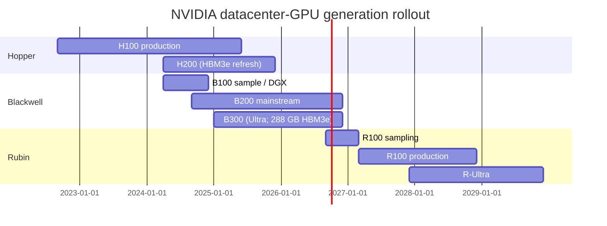
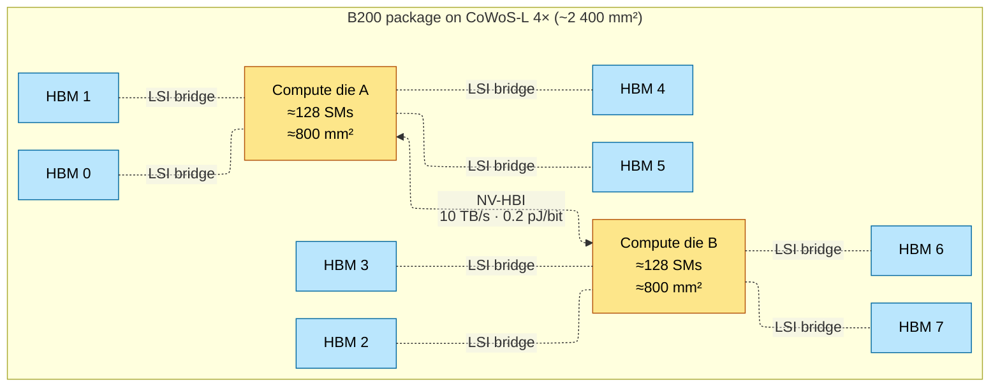
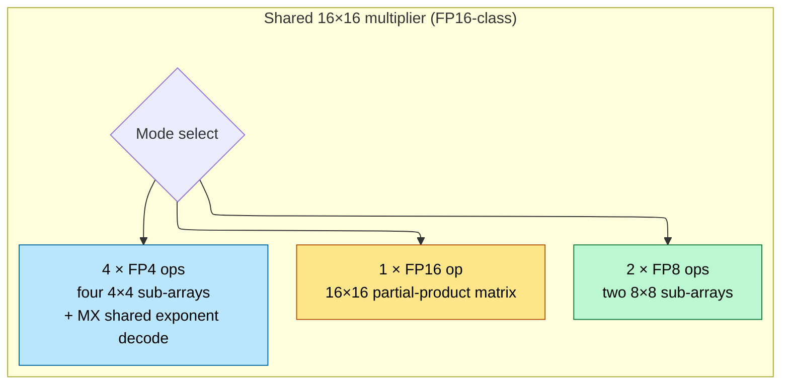
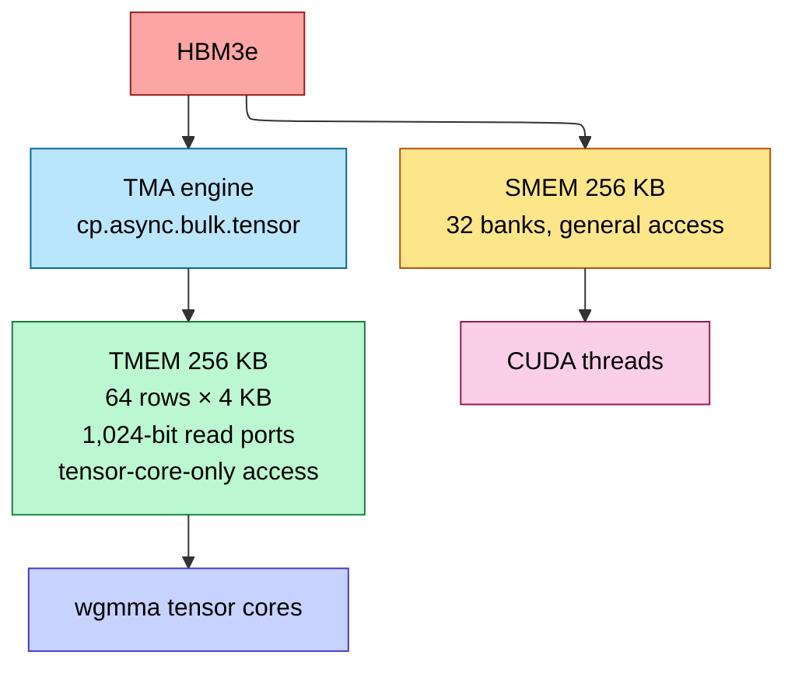
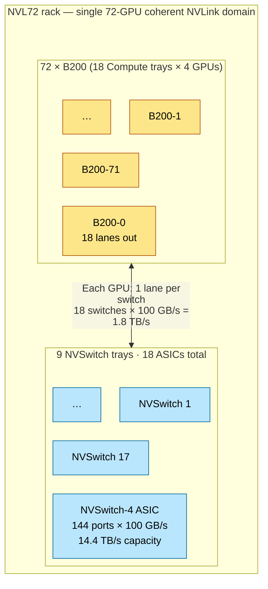
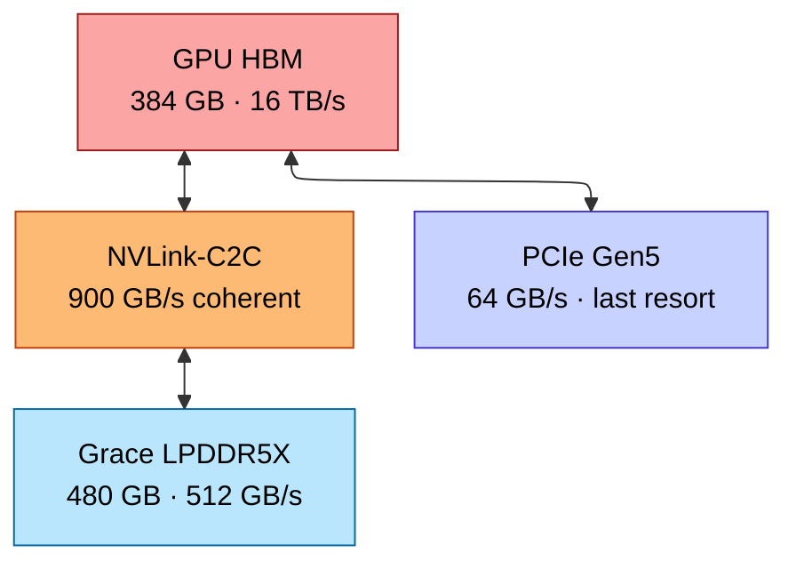
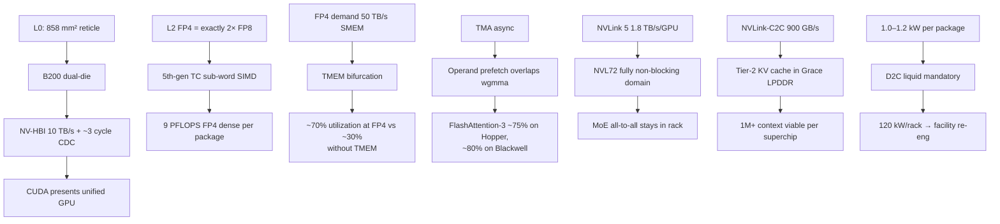

# Blackwell Architecture — B100 / B200 / B300 / GB200 / GB300, Rubin Outlook

> **Layer:** L3 (frontier-NVIDIA specialization).
> **Prerequisites:** [GPU_Architecture](GPU_Architecture.md), [Memory_Hierarchy_and_Roofline](Memory_Hierarchy_and_Roofline.md), [L1 Advanced_Packaging](../L1_Packaging_and_Memory/Advanced_Packaging.md), [L2 FP_Unit_Design](../L2_Digital_Design_for_AI/FP_Unit_Design.md).
> **Hands off to:** [L4 Rack_Scale_Design](../L4_Systems_and_Interconnects/Rack_Scale_Design.md), [L6 Modern_Quantization_Frontier](../L6_Algorithms_and_Models/Modern_Quantization_Frontier.md), all L8 inference pages.

---

## 0. What's actually new in Blackwell

Blackwell is **the** generation that made FP4 a hardware-supported tensor-core format. Five concrete things changed vs Hopper:

1. **Dual-die packaging** (NV-HBI bridge) — first NVIDIA datacenter GPU exceeding the EUV reticle limit.
2. **5th-gen tensor cores** with native FP4, FP6, MXFP4, NVFP4 support.
3. **TMEM** — a dedicated tensor-operand SRAM tier separating wgmma traffic from SMEM.
4. **NVLink 5** at 1.8 TB/s/GPU, supporting NVL72 (and eventually NVL576) coherent domains.
5. **HBM3e at 8 TB/s/package**, growing to 12 TB/s on Blackwell Ultra (B300).

This page covers all five; per-page focus on the architectural mechanisms, derivations, and L4 implications.

---

## 1. Generation map

| Family | First ship | Process | Die config | HBM | TDP | Highlights |
|---|---|---|---|---|---|---|
| Hopper H100 | 2022 | TSMC 4N | monolithic (~814 mm²) | 80 GB HBM3 | 700 W | wgmma, TMA, FP8, NVLink-4 |
| Hopper H200 | 2024 | TSMC 4N | monolithic | 141 GB HBM3e | 700 W | HBM3e refresh, more capacity |
| Blackwell B100 | 2024 | TSMC 4NP | dual-die | 192 GB HBM3e | 700 W | early sample / DGX |
| Blackwell B200 | 2024 | TSMC 4NP | dual-die | 192 GB HBM3e | 1000 W | mainstream FP4 part |
| Blackwell Ultra B300 | 2025 | TSMC 4NP | dual-die | 288 GB HBM3e | 1200 W | larger HBM, higher TDP |
| Rubin R100 (announced) | 2026 | TSMC 3NP | dual-die | 288 GB HBM4 | ~1500 W | NVLink-6, FP3 likely; Vera Rubin platform |
| Rubin Ultra (announced) | 2027 | TSMC 3NP / A16 | quad-die | ~512 GB HBM4 | ~1800 W | NVL576 domain; announced at GTC March 2026 |

---

## 2. Dual-die microarchitecture

### 2.1 Why two dies

L0 fact: EUV reticle limit ≈ 858 mm². NVIDIA wants ~1 600 mm² of compute → must split. Two ~800 mm² dies bridged by NV-HBI on a CoWoS-L 4× substrate.

### 2.2 NV-HBI cross-die bridge

- 10 TB/s bidirectional aggregate.
- ~20 000 wires at 2 Gbps each, single-ended USR signaling.
- ~0.2 pJ/bit → ~16 W of power dissipated in the bridge alone.
- Mesochronous CDC; ~2–4 cycle penalty for cross-die access.
- Cache-coherent at L2 → CUDA presents both dies as one GPU.

### 2.3 Programming-model implications

CUDA's **co-located block** abstraction extends across dies; an SM on die A reads die-B HBM transparently. But:

- **Cross-die HBM access** pays NV-HBI traversal (~50 ns) on top of the ~250 ns local HBM latency → ~20% latency penalty.
- **Cross-die L2 access** is the bigger penalty — local L2 ~30 ns, cross-die ~80 ns due to NoC + NV-HBI.
- **Optimal kernels** affinity-bind thread blocks to dies (via cluster API) so weight streams stay local. NCCL collectives handle this for tensor-parallel work.

For most workloads the penalty is negligible (decode is HBM-bound; the few extra ns don't matter). For latency-critical small kernels (e.g., per-step KV updates), affinity matters.

---

## 3. 5th-gen tensor cores

### 3.1 Format support matrix

| Format | New in | Peak relative (vs FP16) | Use case |
|---|---|---|---|
| FP16 | V100 | 1× | training baseline |
| BF16 | A100 | 1× | gradient training |
| TF32 | A100 | 0.5× | drop-in for FP32 |
| FP8 E4M3 | H100 | 2× | forward, activations |
| FP8 E5M2 | H100 | 2× | backward, gradients |
| **MXFP4** | B200 | 4× | OCP block-scaled inference |
| **NVFP4** | B200 | 4× | NVIDIA variant (K=16, FP8 scale) |
| **FP6 E3M2** | B200 | 3× | research |
| **MX-FP8** | B200 | 2× | block-scaled FP8 |
| FP3 (announced) | R100 | 8× | Rubin frontier |

### 3.2 Sub-word SIMD inside the tensor core

Blackwell does **not** have separate physical FP4 multipliers. The hardware reuses the same Wallace tree, dynamically reconfigured:

The same silicon area runs at 1× FP16 OR 2× FP8 OR 4× FP4 throughput depending on the format. The MX shared exponent is decoded once per 32-element block, applied to all elements in the block — covered fully in [L2 FP_Unit_Design §6](../L2_Digital_Design_for_AI/FP_Unit_Design.md).

### 3.3 FP4 Tensor Core Instruction Detail

**How the FP4 tensor core instruction works:**

The Blackwell FP4 tensor core operates on NVFP4 format: each element is a 4-bit value (1 sign bit, 2 mantissa bits, 1 implicit exponent bit), with a shared FP8 scale factor per block of 16 elements. The MMA operation proceeds as:

1. **Block-scale decode:** Each 16-element block has an associated FP8 E4M3 scale. The hardware decodes this once per block and broadcasts it across the 16 elements, converting each 4-bit value into a full-width significand for the multiplier array.

2. **MMA shapes supported (FP4):**

| Instruction | M × N × K (elements) | FLOPs per instruction | Accumulator dtype |
|---|---|---|---|
| `wgmma.mma_async.m64n256k64` | 64 × 256 × 64 | $2 \times 64 \times 256 \times 64 = 2{,}097{,}152$ | FP32 |
| `wgmma.mma_async.m64n128k64` | 64 × 128 × 64 | 1,048,576 | FP32 |
| `wgmma.mma_async.m32n256k64` | 32 × 256 × 64 | 1,048,576 | FP32 |

The K dimension is 64 (vs 32 for FP8, 16 for FP16) because each 32-bit word holds 8 FP4 elements. The outer-product engine processes K=64 elements in the same number of pipeline cycles as K=16 for FP16 — this is how the 4× throughput is achieved.

3. **How 2× FP8 throughput is achieved:** FP8 uses K=32 per wgmma instruction (2 elements per byte × 16 bytes/word = 32). FP4 uses K=64 (4 elements per byte × 16 bytes/word = 64). The outer product engine performs 64 micro-accumulations in the same pipeline depth as 32, because the multiplier array is 4× sub-arrayed for FP4 — 4 parallel 4-bit multipliers per FP16 multiplier slot. The result: exactly 2× the FLOPs of FP8 per instruction.

4. **Accuracy implications and calibration requirements:**

FP4 has only 2 mantissa bits, giving ~0.25 relative precision per element. Without calibration, FP4 training diverges. The calibration pipeline (Transformer Engine v2):

- **Dynamic range tracking:** TE maintains per-tensor running statistics of activation/gradient magnitudes during training.
- **Block-scale optimization:** The FP8 shared scale for each 16-element block is chosen to minimize quantization error given the tracked distribution.
- **Mixed-precision fallback:** TE automatically selects FP8 or FP16 for layers where FP4 causes >1% accuracy degradation (typically embedding layers, layer norms, and the final output projection).
- **Loss scaling:** For FP4 backward, TE applies dynamic loss scaling to prevent gradient underflow in the narrow FP4 range.

**Practical accuracy numbers (from NVIDIA benchmarks):**
- Dense LLM training (7B–70B): FP4 achieves within 0.5% perplexity of BF16 baseline with TE calibration.
- MoE training: FP4 for expert FFN layers, FP8 for shared layers — within 1% of BF16.
- Without TE: FP4 diverges within 100–500 steps on most architectures.

### 3.3 Throughput numbers

| Format | B200 dense (per package, dual-die) | B300 dense |
|---|---|---|
| BF16 | 2 250 TFLOPS | 2 700 TFLOPS |
| FP8 | 4 500 TFLOPS | 5 400 TFLOPS |
| FP6 | 6 750 TFLOPS | 8 100 TFLOPS |
| FP4 (MXFP4 / NVFP4) | 9 000 TFLOPS | 10 800 TFLOPS |
| Sparse (2:4 multiplier) | 2× the above | 2× |

These are *spec sheet dense* numbers. Real-world utilization at FP4 caps around 60–70% on optimized kernels, since the 2× FP4 advantage (proven at L2) is bottlenecked by operand-fetch from TMEM.

---

## 4. TMEM — Tightly-coupled Memory for Tensor Cores

### 4.1 Why TMEM exists

Covered in detail at [L2 On_Chip_Memory_Hardware §5](../L2_Digital_Design_for_AI/On_Chip_Memory_Hardware.md). TL;DR:

- FP4 wgmma demands ~50 TB/s/SM operand bandwidth.
- SMEM provides ~30 TB/s/SM (32 banks, mod-32 conflict-prone).
- Doubling SMEM doubles capacity, not port count → doesn't help.
- TMEM = 256 KB/SM with wide read ports (1 024 b each) geometrically matched to wgmma tile rows, accessible *only* by tensor cores.

### 4.2 TMEM Architecture Detail

TMEM is a dedicated SRAM structure per SM, physically separate from SMEM, designed exclusively as a staging buffer for tensor core operands. It is not a cache — there is no tag array, no eviction, no replacement policy. It is a software-managed scratchpad with a hardware interface optimized for wgmma tile shapes.

**Capacity and organization:**
- 256 KB per SM (73.7 MB total across 288 logical SMs on B200 — significant silicon area).
- Organized as 64 rows × 4 KB/row, where each row maps to one tile row in the wgmma inner dimension.
- Read port width: 1,024 bits per cycle — wide enough to feed an entire wgmma K-dimension strip in one cycle.
- Write port: filled exclusively by the TMA engine (async DMA from HBM/L2).
- Latency: 2–4 cycles from wgmma issue to operand availability (vs 8–20 for SMEM).

**How TMEM is accessed:**
- TMA `cp.async.bulk.tensor` instructions specify a TMEM destination via the tensor map descriptor. The TMA engine handles address generation, bounds checking, and swizzling.
- `wgmma` instructions reference a TMEM-based descriptor (not register-based fragments). The tensor core reads operands directly from TMEM without going through the register file or SMEM.
- CUDA threads cannot read or write TMEM directly. This eliminates contention: no thread can evict or corrupt a tensor tile mid-computation.
- Synchronization uses the same `mbarrier` mechanism as SMEM: `cp.async.bulk` signals the barrier when the TMEM fill completes; `wgmma.wait_group` blocks until the tensor core has consumed the operands.

**Use cases for AI kernels:**

| Kernel | TMEM role | Benefit |
|---|---|---|
| Dense GEMM (FP4) | A and B tiles staged in TMEM; accumulator in registers | Eliminates SMEM bank conflicts; doubles effective operand bandwidth |
| FlashAttention-3 | Q tile in TMEM; K, V streamed through SMEM | Q is reused across all K blocks — TMEM gives 2× bandwidth for the hot operand |
| MoE expert FFN | Expert weights prefetched into TMEM | Expert switching is a TMEM descriptor swap, not a cache flush |
| Convolution (im2col) | Input tile in TMEM, weight in SMEM | Avoids redundant SMEM reads for sliding-window access patterns |

### 4.3 Programming model

- TMA copies tiles HBM → TMEM via async DMA (with mbarrier signal).
- wgmma reads operands directly from TMEM (no SMEM round-trip).
- General CUDA threads cannot touch TMEM → no contention with wgmma.

### 4.3 Performance impact

A FlashAttention-3 kernel on Hopper hits ~75% of FP8 peak. The same algorithm refactored for Blackwell TMEM hits ~80% of FP4 peak — and FP4 peak is 2× FP8 peak. Net: **~2× speedup at iso-quality** with calibrated quantization.

---

## 5. Transformer Engine v2 (software)

Transformer Engine (TE) is NVIDIA's framework integration that:

- Automatically calibrates per-tensor scaling for FP8 / FP4.
- Inserts dynamic-range probes into training to track activation/gradient distributions.
- Selects per-layer precision (e.g., embedding layers FP8, MoE expert FFN FP4).
- Manages the MX shared-exponent metadata.

TE v2 (Blackwell) adds:

- NVFP4 support (16-element blocks, FP8 shared scale).
- Per-channel scaling for gradients (more robust than per-tensor).
- Automatic loss-scale management for FP4 backward.

Without TE, FP4 training is ~95% likely to diverge. With TE, it converges within 1% of BF16 quality on most architectures.

---

## 6. NVLink-5 and the NVL72 fabric

### 6.1 NVLink-5 signaling and lane architecture

NVLink-5 doubles the per-GPU bandwidth of NVLink-4 (900 GB/s on H100) to 1.8 TB/s unidirectional (3.6 TB/s bidirectional) through a combination of more lanes and faster signaling:

| Parameter | NVLink-4 (H100) | NVLink-5 (B200) | Delta |
|---|---|---|---|
| Signaling rate | 100 Gbps/lane (PAM4) | 200 Gbps/lane (PAM4) | 2× per lane |
| Lanes per GPU | 18 | 18 | Same |
| Unidirectional BW per lane | 50 GB/s | 100 GB/s | 2× |
| Total unidirectional BW | 900 GB/s | 1.8 TB/s | 2× |
| Total bidirectional BW | 1.8 TB/s | 3.6 TB/s | 2× |
| PHY power per port | ~3 W | ~5 W | Higher due to faster SerDes |

The 200 Gbps/lane PAM4 SerDes uses a 56 GHz Nyquist frequency with advanced DSP equalization (DFE + FFE) at both TX and RX. Each lane is a differential pair over copper cables or PCB traces within the rack. The 18 lanes connect to 9 NVSwitch ASICs (2 lanes per switch port).

**NVLink-C2C vs NVLink:** These are distinct physical layers for distinct purposes:

| | NVLink-5 | NVLink-C2C |
|---|---|---|
| **Purpose** | GPU-to-GPU communication within rack | GPU-to-CPU (Grace) or GPU-to-GPU chiplet bridging |
| **Bandwidth** | 1.8 TB/s unidirectional (B200) | 900 GB/s bidirectional (GB200) |
| **Topology** | Through NVSwitch fabric | Direct die-to-die via advanced packaging (CoWoS) |
| **Latency** | ~1–5 μs (through NVSwitch) | ~100–200 ns (on-package) |
| **Coherence** | GPUDirect, atomics | Full cache coherence (CPU ↔ GPU) |
| **Cable/medium** | Copper cable cartridge or PCB trace | Silicon bridge (NV-HBI) on CoWoS substrate |

### 6.2 NVL72 topology: why 72 GPUs?

The NVL72 rack contains exactly 72 B200 GPUs because of the arithmetic of NVSwitch radix and lane count:

- Each B200 has 18 NVLink-5 lanes.
- Each NVSwitch-4 ASIC has 144 ports at 100 GB/s = 14.4 TB/s switching capacity.
- A single NVSwitch ASIC can connect to 144 / 2 = 72 GPUs (2 lanes per GPU).
- With 2 NVSwitch ASICs per tray and 9 trays, the total switching capacity is 18 × 14.4 = 259 TB/s.
- Each GPU connects to all 18 NVSwitch ASICs (1 lane per ASIC), providing 18 × 100 GB/s = 1.8 TB/s injection bandwidth.

**The topology is a single-tier fat tree (non-blocking):** Every pair of GPUs has a guaranteed 1.8 TB/s path through exactly one NVSwitch hop. No oversubscription. The 72-GPU count is the maximum radix achievable with 18 lanes per GPU and the NVSwitch-4 port count.

- **NVSwitch ASIC radix:** 144 ports × 100 GB/s = 14.4 TB/s switching capacity per ASIC.
- **Total switch capacity:** 18 × 14.4 = 259 TB/s — well above GPU aggregate (72 × 1.8 = 129.6 TB/s), providing headroom for all-to-all patterns.
- **Cable/cartridge system:** GPUs connect to NVSwitch trays via high-density copper cable cartridges (NVIDIA "OSFP" cage). Each cartridge bundles multiple differential pairs. The cable length within the rack is ~0.5–1 m, with signal integrity maintained by the DSP equalization in the SerDes. Cable failures are the most common hardware fault in NVL72 deployments.

**Why NVL72 is the sweet spot for FP8 training of large models:**

A 400B MoE model (DeepSeek-V3 class) with 256 experts, EP=64, requires two all-to-all operations per MoE layer. Each all-to-all transfers ~500 MB. At 1.8 TB/s injection bandwidth per GPU, the all-to-all across 64 GPUs takes:

$$T_{\text{all-to-all}} \approx \frac{N \times M}{B_{\text{injection}}} = \frac{64 \times 0.5 \;\text{GB}}{1{,}800 \;\text{GB/s}} \approx 18 \;\text{ms per layer}$$

With 58 MoE layers: ~1 second of all-to-all per step. If this crossed the rack boundary onto InfiniBand (50 GB/s per link), it would take ~30 seconds — the training would be communication-bound. NVL72 keeps the entire EP domain within a single rack with full injection bandwidth.

### 6.3 NVSwitch generation detail

The NVSwitch-4 ASIC (Blackwell generation) features:
- 144 NVLink ports at 100 GB/s each = 14.4 TB/s bisection bandwidth
- Hardware multicast support (reduces AllReduce latency by eliminating store-and-forward)
- SHARP-like in-switch reduction for NVLink traffic (reduces AllReduce volume within the rack)
- ~300 W TDP per ASIC, liquid-cooled
- 9 trays × 2 ASICs × 300 W = 5.4 kW just for NVSwitch — significant fraction of rack power

#### 6.3 NVL576 (announced for Vera Rubin at GTC 2026)

- 576-GPU coherent domain via 2-tier NVSwitch + optical interconnects.
- Required for trillion-parameter dense models in TP+EP mode.
- Scale-out (multi-NVL576) still goes via InfiniBand at L4.
- Officially announced as part of the Vera Rubin platform at GTC March 2026.

---

## 7. GB200 Superchip and NVLink-C2C

### 7.1 The Grace–Blackwell pairing

Each GB200 Superchip = 1 Grace ARM CPU (72 cores Neoverse V2) + 2 B200 GPUs, glued by NVLink-C2C at 900 GB/s coherent.

- Grace has 480 GB LPDDR5X (~512 GB/s).
- NVLink-C2C makes Grace memory addressable by GPU at ~900 GB/s — much faster than PCIe Gen5 (64 GB/s).
- Total addressable memory per Superchip: 480 GB LPDDR + 384 GB HBM = 864 GB.

### 7.2 Tier-2 KV cache

For long-context decode (1M+ tokens), KV cache exceeds HBM. Without C2C, swapping to host memory over PCIe stalls the GPU. With C2C, host LPDDR becomes a viable Tier-2:

This unlocks ~10× higher concurrent batch size for million-token-context workloads. Mooncake-style global KV pools (L8) build on this.

---

## 8. Power and thermal

### 8.1 Per-package

| Part | TDP | Currents @ 0.7 V |
|---|---|---|
| H100 SXM5 | 700 W | ~933 A |
| B200 (HGX) | 1 000 W | ~1 430 A |
| B300 (HGX) | 1 200 W | ~1 715 A |
| GB200 Superchip (2 GPUs + 1 CPU) | 2 700 W | mixed |
| GB300 (proj.) | ~3 200 W | mixed |

Drives mandatory direct-to-chip liquid cooling on every Blackwell-class part.

### 8.2 Rack-level

NVL72 GB200 rack:

- 36 GB200 superchips × 2 700 W = 97 kW logic
- HBM, voltage regulators, NVSwitch trays, PSUs: ~25 kW more
- **~120–140 kW per rack** depending on configuration

Coolant flow rate from $Q = \dot{m} C_p \Delta T$:

$$
\dot{m} \;=\; \frac{120\,000\,\text{W}}{4184\,\text{J/(kg·K)} \cdot 10\,\text{K}} \;\approx\; 2.87\,\text{kg/s} \;\approx\; 45\,\text{gal/min}
$$

at a strict 10 °C inlet-to-outlet rise (HBM thermal-zone-2 requires inlet ≤ 35 °C).

---

## 9. Rubin outlook

Announced at GTC March 2026 as the **Vera Rubin** platform (Vera CPU + Rubin GPU). Public projections confirmed:

- **Platform name:** Vera Rubin (Vera ARM CPU + Rubin GPU)
- **Process:** TSMC 3NP (Rubin) → A16 (Rubin Ultra)
- **Die config:** dual-die (Rubin) → quad-die (Rubin Ultra)
- **HBM:** HBM4 → HBM4e
- **Compute:** ~25 PFLOPS FP8 / ~50 PFLOPS FP4 (Rubin), 2× more for Ultra
- **NVLink:** NVLink-6 at 3.6 TB/s/GPU
- **Coherent domain:** NVL576 → NVL576-Ultra
- **TDP:** ~1 500 W → ~1 800 W

The headline architectural change: with **High-NA EUV** halving the reticle field, dies must shrink in area and packages must grow in die-count. Rubin will normalize 4-die compute clusters; Rubin Ultra will push to 6-die. NV-HBI evolves to NV-HBI-2 with hybrid bonding.

---

## 10. End-to-end cause / effect

---

## 11. Numbers to memorize

| Quantity | Value | Why |
|---|---|---|
| B200 die count | 2 | NV-HBI bridged |
| B200 SMs (logical) | 256 (128 × 2) | dual-die unified |
| B200 BF16 dense | 2 250 TFLOPS | spec |
| B200 FP8 dense | 4 500 TFLOPS | spec |
| B200 FP4 dense | 9 000 TFLOPS | NVFP4 |
| B200 HBM | 192 GB HBM3e @ 8 TB/s | spec |
| B300 HBM | 288 GB HBM3e @ 8 TB/s | Ultra refresh |
| B200 ridge FP4 | 1 125 FLOP/B | π/β |
| B200 TMEM | 256 KB/SM | new tier |
| NV-HBI BW | 10 TB/s bidirectional | die-to-die |
| NV-HBI energy | ~0.2 pJ/bit | silicon-bridge floor |
| NVLink-5 per-GPU | 1.8 TB/s (3.6 bidir) | 18 lanes × 100 GB/s |
| NVL72 GPUs | 72 | non-blocking domain |
| NVL72 fabric capacity | 130 TB/s | matches GPU aggregate |
| NVLink-C2C | 900 GB/s | Grace ↔ B200 |
| GB200 LPDDR (Grace) | 480 GB | Tier-2 KV cache |
| B200 TDP | 1 000 W | HGX baseboard |
| GB200 NVL72 rack power | ~120–140 kW | facility reengineering |
| Liquid coolant flow | ~45 gal/min/rack | sensible-heat math |

---

## 12. References

- NVIDIA Blackwell Architecture white paper (2024).
- Choquette et al., *NVIDIA Hopper Architecture*, IEEE Micro 2023 — for what Blackwell extends.
- *Dissecting the NVIDIA Hopper Architecture*, Jia, Maggioni et al. arXiv 2402.13499.
- Community Blackwell reverse-engineering papers (2025).
- OCP Microscaling Formats v1.0 + NVIDIA NVFP4 white paper.
- Hot Chips 2024 — NVL72 / NV-HBI disclosures.

---

**Up the stack:** [AMD_Instinct](AMD_Instinct.md), [L4 Networking & Interconnects](../L4_Systems_and_Interconnects/Index.md), [L6 Modern_Quantization_Frontier](../L6_Algorithms_and_Models/Modern_Quantization_Frontier.md).
**Down the stack:** [GPU_Architecture](GPU_Architecture.md), [L1 Advanced_Packaging](../L1_Packaging_and_Memory/Advanced_Packaging.md), [L2 FP_Unit_Design](../L2_Digital_Design_for_AI/FP_Unit_Design.md).
