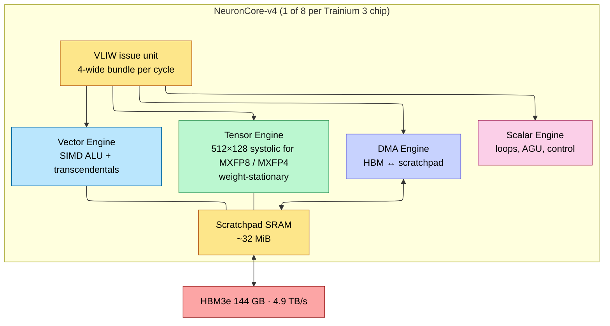
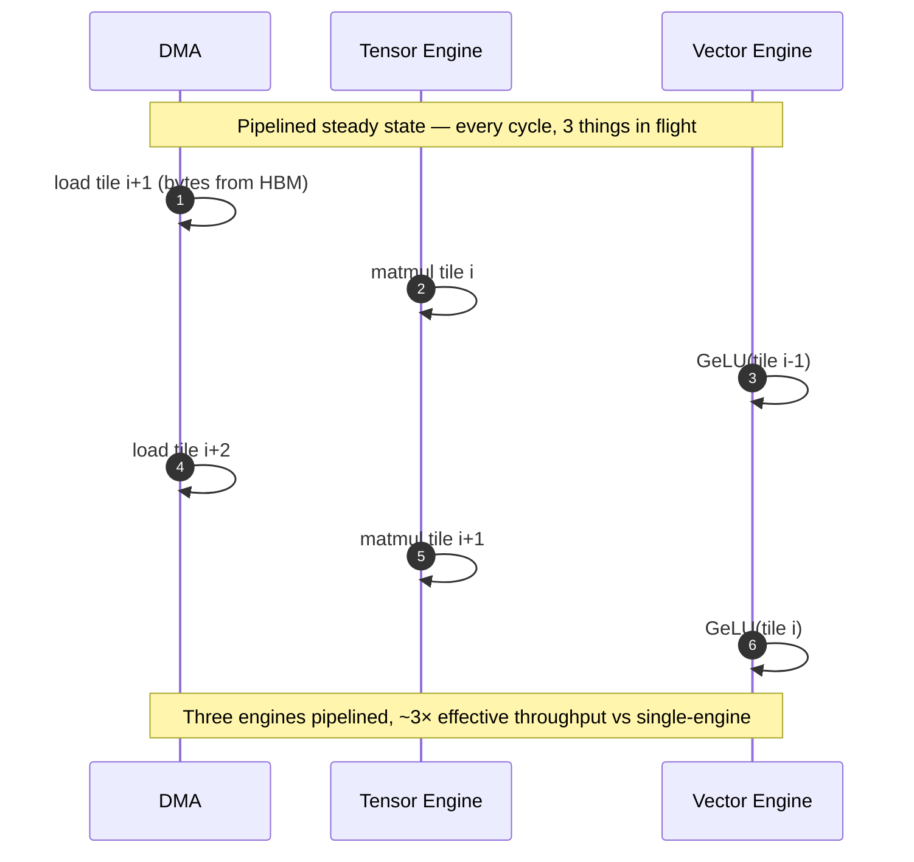
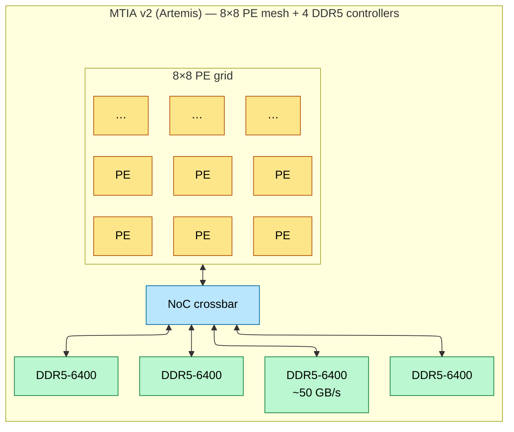
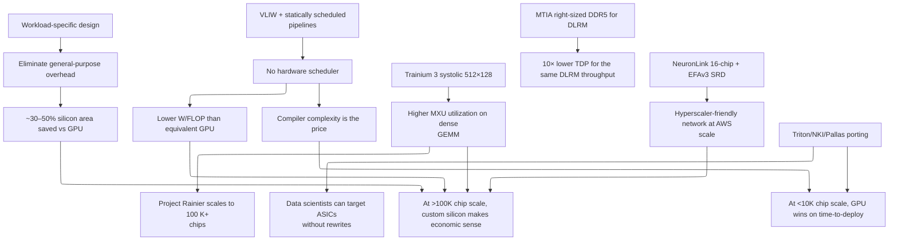

# Cloud-Vendor ASICs — AWS Trainium / Inferentia, Meta MTIA

> **Layer:** L3.
> **Prerequisites:** [ISA_and_Execution_Model](ISA_and_Execution_Model.md) (VLIW), [Memory_Hierarchy_and_Roofline](Memory_Hierarchy_and_Roofline.md), [L2 Systolic_Arrays_and_Dataflow](../L2_Digital_Design_for_AI/Systolic_Arrays_and_Dataflow.md).
> **Hands off to:** [L4 Networking & Interconnects](../L4_Systems_and_Interconnects/Index.md), [Specialty_Accelerators](Specialty_Accelerators.md).

---

## 0. Why hyperscalers build their own silicon

Three reasons:

1. **Workload specialization** — AWS knows it serves N% Llama-class inference; Meta knows ~70% of MTIA workload is DLRM. Co-designing silicon to that specific shape eliminates 30–50% of GPU silicon dedicated to general-purpose flexibility.
2. **Cost economics at scale** — at $50M+/yr GPU spend, custom silicon's $1B NRE amortizes within 2 years.
3. **Supply security** — not waiting in line behind every other hyperscaler for Blackwell allocation.

This page covers AWS Trainium / Inferentia and Meta MTIA — the two production-deployed cloud ASICs at scale in 2026.

---

## 1. AWS Trainium / Inferentia

### 1.1 Generation map

| Family | Year | Process | Memory | Compute | Scale-up | Focus |
|---|---|---|---|---|---|---|
| Inferentia 2 | 2023 | TSMC 7nm | 32 GB HBM2 | ~190 TFLOPS BF16 | 1 chip | First HBM inference target |
| Trainium 2 | 2024 | TSMC 5nm | 96 GB HBM3 (2.9 TB/s) | 1.3 PFLOPS FP8 | NeuronLink (16 chips) | Project Rainier |
| Trainium 3 | 2026 | TSMC 3nm | 144 GB HBM3e (4.9 TB/s) | 2.52 PFLOPS FP8 / MXFP4 | NeuronLink (16 chips) | Inference-training parity |

Trainium 2 powers AWS's "Project Rainier" — a 100 K+-chip cluster training Anthropic's models. Trainium 3 is the production part for 2026.

### 1.2 NeuronCore microarchitecture

Trainium 3 has **8 NeuronCore-v4** cores. Each core is a heterogeneous VLIW pipeline:

Properties:

- **VLIW bundle**: 4 ops/cycle (Tensor + Vector + Scalar + DMA), all issued simultaneously, statically scheduled.
- **Tensor Engine**: 512×128 systolic array — taller than TPU's 128×128 but narrower. Same weight-stationary dataflow.
- **Scratchpad**: 32 MiB SRAM per core × 8 cores = 256 MiB on-chip SRAM per package — comparable to AMD's Infinity Cache.
- **No warp scheduler**: Neuron Compiler does all scheduling at compile time.

### 1.3 The pipeline overlap

The compiler stitches compute, memory, and activations into overlapping streams via **modulo scheduling**:

The cost: a single missed dependency (e.g., DMA late by 1 cycle) bubbles all 3 engines for 1 cycle. **Compiler precision is mandatory**.

### 1.4 NeuronLink fabric

Intra-server: 16-chip UltraServer with all-to-all NeuronLink (~200 GB/s bidirectional per pair). Comparable to NVLink but at smaller domain (16 vs 72 NVL).

### 1.5 EFAv3 inter-server fabric (preview to L4)

AWS's Elastic Fabric Adapter v3 uses **SRD (Scalable Reliable Datagram)** instead of standard RDMA RoCE. SRD sprays packets across all ECMP paths (multipath) and retransmits in microseconds rather than waiting for TCP RTOs. Designed to handle the messy reality of AWS's commodity-Ethernet datacenter without requiring lossless networking.

For frontier-model training at 100K+-chip scale, SRD's ability to maintain throughput under transient packet loss is a structural win over IB.

### 1.6 NKI — kernel programming

**NKI** (Neuron Kernel Interface) is the Triton-equivalent for Trainium. Python-like DSL that compiles to Neuron VLIW. Used for FlashAttention-equivalent custom kernels. Less mature than Triton but improving.

---

## 2. Meta MTIA — DLRM-optimized inference

### 2.1 The DLRM problem

Meta's recommendation models (DLRM-class) have a workload profile *very* different from LLMs:

- 99% of compute: massive embedding lookups (read N rows from a billion-row table).
- 1%: small dense matmuls on the lookups.
- Arithmetic intensity: ~0.1 FLOP/B (much worse than LLM decode).

A GPU's 8 TB/s HBM is wasted because each lookup is one row × 128 dim × 2 B = 256 B per access. The MAC array is empty 99% of the time.

MTIA right-sizes: **less compute, less HBM, more memory ports per FLOP, and a NoC topology designed for small-message-many-destination access**.

### 2.2 MTIA v2 (Artemis) architecture

- **64 PEs** total. Each PE: small MAC array (~8 TOPS INT8) + small SRAM (~128 KB) + scheduler.
- **DDR5 instead of HBM**: 4 channels × ~51 GB/s = ~200 GB/s aggregate. *Way* less than HBM but right-sized for DLRM's low arithmetic intensity.
- **NoC crossbar**: every PE can reach every DDR controller in 1 hop. Optimized for the small-message access pattern.
- **TDP ~90 W per chip**: ~10× lower than a GPU, perfect for dense rack deployment.

### 2.3 MTIA v3 (Iris)

Moving to TSMC 3nm + HBM. Bridges the gap between DLRM-only and LLM inference:

- HBM brings BW closer to GPU.
- Increased PE count for higher dense throughput.
- Static mesh routing retained (no warp scheduler, predictable latency).

MTIA v3 is Meta's bet on serving Llama-3-class inference at lower cost than GPU. As of mid-2026, Meta serves a meaningful fraction of internal Llama inference on MTIA v3.

### 2.4 Triton-MTIA

Meta forked Triton to target MTIA. Same Python DSL, different backend. Lets data scientists write FlashAttention on MTIA without learning a new tool.

---

## 3. Microsoft Maia and Google's other chips (briefer)

### 3.1 Microsoft Maia 100 (Athena)

Announced 2023, deployed 2024. ~5 nm process, ~105 GB HBM3, ~800 W TDP. Uses Microsoft's own ISA. Targeted at OpenAI inference workloads (Microsoft Azure runs ChatGPT). Reportedly under-performs Hopper at iso-watt as of 2025; second-gen Maia 200 due 2026.

### 3.2 Google Axion (CPU + on-chip AI accelerator)

ARM-based CPU with a small TPU-style accelerator on the same die. Targeted at general-purpose serving + light inference. Not in the same league as TPU v7 for training.

---

## 4. Cloud-ASIC tradeoffs

| Property | Cloud ASIC (Trainium / MTIA) | Merchant GPU |
|---|---|---|
| Per-chip TFLOPS | Lower (1.3–2.5 PF FP8) | Higher (4.5+ PF FP8 on B200) |
| Dollar / TFLOPS | Lower (custom amortized) | Higher (vendor margin) |
| Watt / TFLOPS | Lower (no overhead) | Higher (general-purpose silicon) |
| Software ecosystem | Limited (CUDA-equivalent only at fork) | Mature (CUDA + everything) |
| R&D iteration | Slow (annual chip cycles) | Fast (PyTorch nightly) |
| Workload flexibility | Compiled targets only | Anything |
| Deployment lead time | Months (ASIC fab cycle) | Weeks (GPU allocation) |

The economics: cloud ASICs win on $/inference for steady-state workloads (chat, recommendations) deployed at >100K-chip scale; lose for R&D, exotic workloads, and short-lived models.

---

## 5. End-to-end cause / effect

---

## 6. Numbers to memorize

| Quantity | Value | Why |
|---|---|---|
| Trainium 3 process | TSMC 3nm | spec |
| Trainium 3 NeuronCores | 8 | per chip |
| Trainium 3 HBM | 144 GB HBM3e | spec |
| Trainium 3 BW | 4.9 TB/s | spec |
| Trainium 3 FP8 | 2.52 PFLOPS dense | spec |
| Trainium 3 systolic | 512×128 | per Tensor Engine |
| Trainium 3 scratchpad | 32 MiB/core × 8 = 256 MiB | per chip |
| NeuronLink domain | 16 chips | UltraServer |
| MTIA v2 PEs | 64 (8×8 mesh) | spec |
| MTIA v2 memory | 4× DDR5 → ~200 GB/s | DLRM-sized |
| MTIA v2 TDP | ~90 W | low-power dense rack |
| MTIA v3 process | TSMC 3nm + HBM | spec |
| Project Rainier scale | 100 K+ Trainium chips | AWS deployment |
| EFAv3 protocol | SRD (multipath, μs retransmit) | vs RoCE |

---

## 7. References

- *AWS re:Invent 2024* — Trainium 3 disclosure, Project Rainier.
- *Hot Chips 2023* — Meta MTIA v1 paper.
- *Hot Chips 2025* — MTIA v3, Trainium 3.
- *Microsoft Maia 100*, OpenAI x Microsoft 2023 disclosure.
- AWS Neuron SDK documentation.

---

**Up the stack:** [Specialty_Accelerators](Specialty_Accelerators.md), [L4 Networking & Interconnects](../L4_Systems_and_Interconnects/Index.md).
**Down the stack:** [ISA_and_Execution_Model](ISA_and_Execution_Model.md), [L2 Systolic_Arrays_and_Dataflow](../L2_Digital_Design_for_AI/Systolic_Arrays_and_Dataflow.md).
