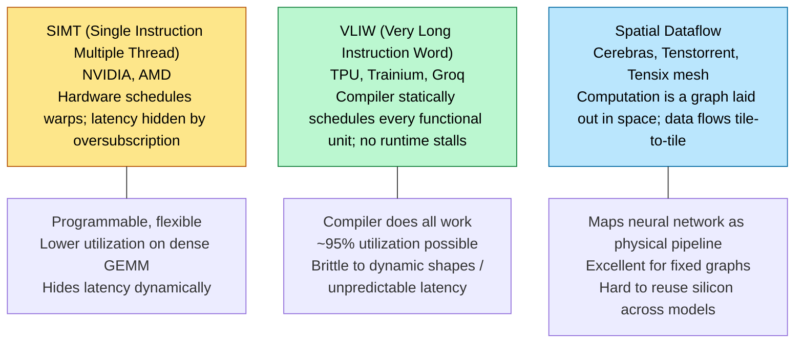
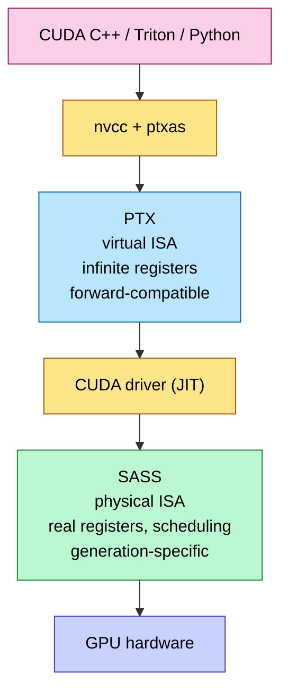
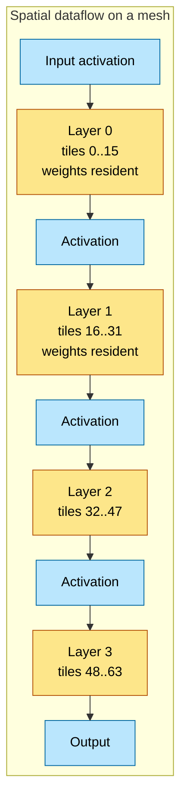
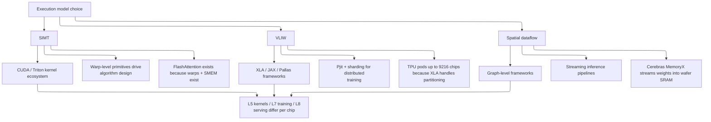

# ISA and Execution Model — SIMT, VLIW, Spatial Dataflow

> **Layer:** L3 (foundational page).
> **Prerequisites:** [L2 Digital_Design_For_AI](../L2_Digital_Design_for_AI/Digital_Design_For_AI.md) (pipelining, FSMs, NoC).
> **Hands off to:** [GPU_Architecture](GPU_Architecture.md), [Memory_Hierarchy_and_Roofline](Memory_Hierarchy_and_Roofline.md), and every per-vendor page in this layer.

---

## 0. Three families of execution model

Every AI accelerator picks one of three execution models. The choice cascades through compiler design, kernel ergonomics, latency-hiding strategy, and ultimately the achievable utilization on each workload.



---

## 1. SIMT — the NVIDIA and AMD model

### 1.1 The warp / wavefront

A **warp** (NVIDIA) or **wavefront** (AMD) is a group of threads that execute the same instruction in lockstep across SIMD lanes:

- NVIDIA: 32 threads/warp.
- AMD CDNA: 64 threads/wavefront (wave64); CDNA-3+ also supports wave32 for compatibility.
- Intel Xe: variable subgroup size 8/16/32.

Each thread has its own register set, program counter (since Volta), and stack pointer; they all share the SIMD instruction stream. When threads diverge (different control-flow branches), the hardware **serializes** the divergent paths via a divergence stack:

```mermaid
%%{init: {"flowchart": {"defaultRenderer": "elk", "nodeSpacing": 60, "rankSpacing": 60, "htmlLabels": false}}}%%
sequenceDiagram
    autonumber
    participant Warp as 32-thread warp
    participant SCH as Hardware scheduler
    Note over Warp: All 32 threads execute `if (tid < 16) X else Y`
    Warp->>SCH: branch divergence detected
    SCH->>Warp: mask out threads 16–31; execute X with active mask 0xFFFF
    Note over Warp: 16 threads idle, 16 threads do useful work
    SCH->>Warp: mask out threads 0–15; execute Y with active mask 0xFFFF0000
    Note over Warp: roles swap; 16 idle, 16 work
    SCH->>Warp: reconverge; full mask 0xFFFFFFFF restored
```

Divergence is the signature SIMT pathology: a 50/50 if-else *halves* throughput across that block. AI workloads are mostly divergence-free (uniform tensor ops), which is why SIMT is a good fit.

### 1.2 Latency hiding via warp oversubscription

The defining SIMT mechanism: the SM holds far more warps than it can issue per cycle, and the scheduler swaps among them at zero cost.

Required active warps:

$$
W_{\min} \;=\; \frac{L_{\text{mem}}}{I_{\text{warp}}}
$$

where $L_{\text{mem}}$ is the round-trip latency of the slowest dependency (HBM ≈ 400 cycles) and $I_{\text{warp}}$ is the number of independent instructions the warp can execute before that load result is needed.

Worked: $L_{\text{mem}} = 400$ cycles, $I_{\text{warp}} = 5$ (typical). $W_{\min} = 80$. An SM with 64 warps falls short → the SM stalls and drops occupancy. This is why **register pressure matters**: more registers per thread → fewer resident threads → fewer warps → potential undershooting of $W_{\min}$.

### 1.3 The two-stage compilation: PTX vs SASS

NVIDIA's stack:



| Property | PTX | SASS |
|---|---|---|
| Register count | virtual / unbounded | physical (R0..R255) |
| Forward compatibility | yes (Ampere PTX runs on Blackwell) | no — generation-specific |
| Documented | yes | no, reverse-engineered |
| Reveals spilling? | no | yes |
| Reveals stall slots? | no | yes (control codes) |
| Used for | source-level optimization | final-stage tuning |

For peak-performance kernels, you must read SASS via `cuobjdump -sass`. PTX hides the register-spill behavior that destroys real-world performance.

### 1.4 AMD's GCN/CDNA equivalent

AMD's stack mirrors NVIDIA's but with different naming:

| NVIDIA | AMD |
|---|---|
| PTX (virtual ISA) | RDNA/CDNA IR |
| SASS (physical ISA) | GCN ISA / CDNA ISA |
| `nvcc` | `hipcc` / Clang ROCm |
| Warp (32 threads) | Wavefront (64 or 32) |
| SM | Compute Unit (CU) / XCC |
| Tensor Core | Matrix Core (MFMA) |
| SMEM | LDS (Local Data Share) |
| TMA | (no direct equivalent; uses async copy intrinsics) |

CDNA ISA is documented (unlike SASS), which makes AMD GPUs more transparent to optimize but also exposes more design churn between generations.

### 1.5 SIMT control-flow primitives

Every SIMT ISA exposes a few key primitives:

- **`__syncthreads()`** / `s_barrier`: barrier across an entire block / workgroup.
- **`__shfl_sync()`** / `ds_swizzle`: warp-level shuffle (thread i reads from thread j's register).
- **`__ballot_sync()`** / `s_ballot`: reduce a per-thread predicate to a 32-bit mask.
- **`mbarrier`** (Hopper+): hardware async barrier with arrive/wait separation.

These are the building blocks of warp-level reductions (e.g., online softmax max+sum across 32 lanes), which are how kernels avoid SMEM round-trips.

---

## 2. VLIW — TPU, Trainium, Groq

### 2.1 The compiler-takes-everything philosophy

VLIW packs multiple parallel operations into a single instruction word. There is no hardware scheduler; the compiler decides at compile time exactly which functional unit fires which op on which cycle. No runtime stalls, no out-of-order, no warp scheduling — and no flexibility to handle anything the compiler couldn't predict.

A TPU "VLIW bundle" might contain:

```ascii-graph
[ cycle k ]
  TensorEngine:  MAC (tile_addr_A, tile_addr_B, tile_addr_C)
  VectorEngine:  vec_exp (input_addr, output_addr)
  ScalarEngine:  add r1, r2 → r3   (loop counter)
  DMA:           start_load (HBM_addr → SRAM_addr, 4 KB)
```

Four functional units, four parallel ops, packaged into one instruction. The next bundle picks up where this one left off — typically within 1 cycle, because the compiler has scheduled the dependencies.

### 2.2 The compiler burden

The compiler must:

- Solve the modulo-scheduling problem: arrange ops across cycles so all units are busy and no dependency is violated.
- Predict every memory-access latency exactly (TPU SMEM latency is fixed; HBM latency is bounded with hardware support).
- Insert NOPs where it cannot find a useful op → "VLIW NOP" is a literal cycle of wasted compute.
- Statically allocate all registers; no spilling at runtime.

For TPU, this is XLA + the LLVM-derived JAX/Pallas compiler. For Trainium, it's the Neuron Compiler. For Groq, the Groq compiler does it down to the picosecond.

### 2.3 Pros and cons

| Pro | Con |
|---|---|
| Highest dense-GEMM utilization (~95%) | Brittle to dynamic shapes — recompile per shape |
| Predictable latency (every kernel runs in N cycles, not N±20%) | Compiler complexity is enormous |
| No hardware scheduler → silicon area saved | A 1-cycle delay on one input wastes one VLIW bundle |
| Easier to reason about energy (no speculative execution) | Cannot easily handle data-dependent control flow |

### 2.4 Why TPUs lose on small matmuls

A TPU MXU is a 128×128 systolic array. The compiler unrolls into VLIW bundles assuming K is large enough to amortize fill+drain. For K = 64 (one attention head's $Q \cdot K^T$), the array is effectively half-empty for half the latency. VLIW cannot dynamically "skip ahead" — it issued a fixed schedule. Net utilization: ~30%.

GPUs (SIMT) handle this by scheduling more independent kernels in parallel; they trade utilization on big matmuls for graceful degradation on small ones.

---

## 3. Spatial dataflow — Cerebras, Tenstorrent

### 3.1 The neural-network-as-circuit idea

Spatial dataflow lays the *graph* of a neural network onto the physical mesh of the chip: layer 0 occupies a region, layer 1 the adjacent region, etc. Activations stream from one region to the next via the on-chip NoC; weights live where they're used.



### 3.2 Properties

- **No HBM round-trip between layers** — activations stream tile-to-tile via NoC.
- **Massive on-die SRAM** — Cerebras WSE-3 has 44 GB on-die SRAM, replacing HBM entirely.
- **Excellent for fixed graphs** — once a model is mapped, throughput is deterministic.
- **Painful to remap** — changing the model requires re-floor-planning the chip; Cerebras can do this in seconds via reconfiguration but at lower flexibility than a CUDA kernel swap.

### 3.3 Programming model

Spatial dataflow chips expose a **graph-level** API: you pass the framework a TensorFlow / PyTorch / ONNX graph, the compiler partitions it across tiles, and the runtime streams data through. There is no kernel-level programming; a CUDA-equivalent doesn't exist. Tradeoff: ergonomic for users who never want to touch a kernel, opaque for power users.

---

## 4. Comparison matrix

| Property | SIMT (NVIDIA, AMD) | VLIW (TPU, Trainium, Groq) | Spatial Dataflow (Cerebras, Tenstorrent) |
|---|---|---|---|
| Scheduling | Hardware (warp scheduler) | Compiler, static | Compiler, static (graph mapping) |
| Latency hiding | Warp oversubscription | None — predictable latency | Pipeline-stage parallelism |
| Best workload | General-purpose, dynamic shapes | Dense GEMM, fixed shapes | Fixed inference graphs |
| Dense-GEMM utilization | ~70% | ~95% | ~80% |
| Small-matmul utilization | ~50% | ~30% | ~60% |
| Compiler complexity | Moderate (nvcc, LLVM) | Extreme (XLA, Neuron, Groq) | Extreme (graph partitioner) |
| Programmer effort for peak | Kernel writing (CUDA / Triton) | High-level (XLA / JAX) | Graph-only (no kernel API) |
| Reuse across models | Excellent — write any kernel | Good — recompile per shape | Limited — re-map per model |
| Energy per FLOP | Worst | Best (no scheduler overhead) | Best (no HBM, no scheduler) |
| Determinism | Low (warp interleaving) | High | Very high |
| Debugging | mature toolchain (Nsight) | per-vendor | minimal |

---

## 5. The execution-model choice cascades up



This is why "just port CUDA to TPU" doesn't work — the abstraction levels are different. CUDA exposes warps, threads, blocks, grids; XLA exposes operators, sharding, replication. They're not refactorings of each other.

---

## 6. Numbers to memorize

| Quantity | Value | Why |
|---|---|---|
| NVIDIA warp size | 32 threads | SIMT lane count |
| AMD wavefront size | 64 (CDNA), 32 (RDNA + CDNA-3) | Matches SIMD ALU width |
| HBM round-trip latency | ~400 cycles | Drives warp oversubscription requirement |
| Min warps to hide HBM | ~80 | $L/I$ rule |
| NVIDIA SM warp capacity | 64 | Hopper / Blackwell |
| NVIDIA registers per SM | 65 536 × 32-bit = 256 KB | Shared across resident threads |
| Max registers per thread (32 warps) | 64 | Beyond this → spill or reduce occupancy |
| TPU VLIW bundle width | 4–8 ops | Tensor + Vector + Scalar + DMA |
| Groq deterministic latency error | ~0% (per cycle exact) | Fully scheduled SRAM |
| Cerebras WSE-3 SRAM | 44 GB | Replaces HBM |
| Cerebras WSE-3 cores | 900 000 | Mesh tiles |

---

## 7. References

- Lindholm et al., *NVIDIA Tesla: A Unified Graphics and Computing Architecture*, IEEE Micro 2008 — the original SIMT paper.
- Jouppi et al., *In-Datacenter Performance Analysis of a TPU*, ISCA 2017 — VLIW + systolic for AI.
- Kirk & Hwu, *Programming Massively Parallel Processors*, 4th ed.
- Lie, *Scaling Deep Learning to Wafer Scale*, Hot Chips 2024 — Cerebras.
- Abts et al., *Think Fast: A Tensor Streaming Processor (TSP) for Accelerating Deep Learning Workloads*, ISCA 2020 — Groq.

---

**Up the stack:** [GPU_Architecture](GPU_Architecture.md) → [Memory_Hierarchy_and_Roofline](Memory_Hierarchy_and_Roofline.md) → [Blackwell_Architecture](Blackwell_Architecture.md) and per-vendor pages.
