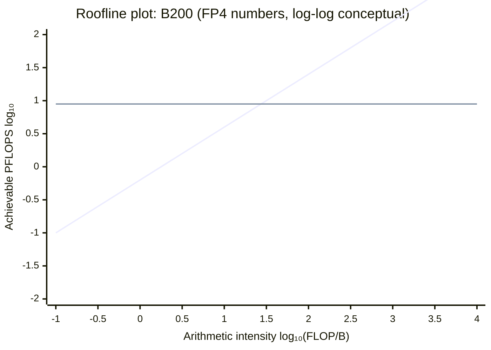
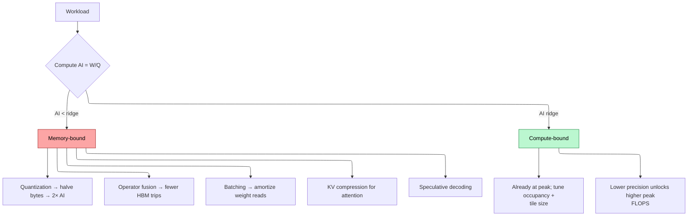
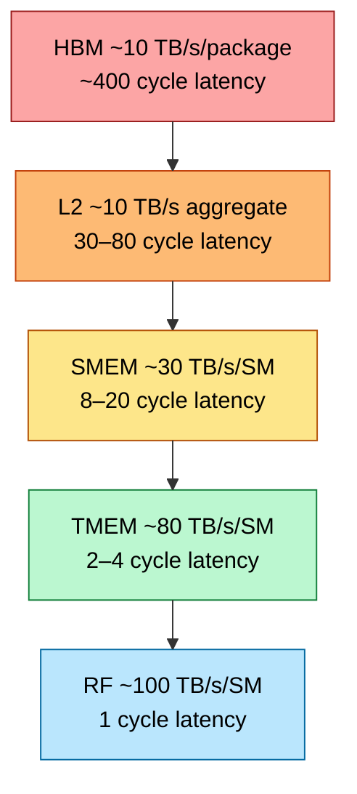
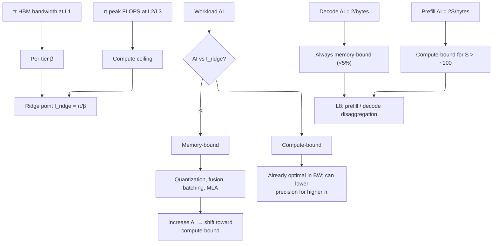

# Memory Hierarchy & Roofline — The Universal Performance Model

> **Layer:** L3 (analytical-framework page).
> **Prerequisites:** [GPU_Architecture](GPU_Architecture.md), [L1 HBM_Deep_Dive](../L1_Packaging_and_Memory/HBM_Deep_Dive.md), [L2 On_Chip_Memory_Hardware](../L2_Digital_Design_for_AI/On_Chip_Memory_Hardware.md).
> **Hands off to:** every per-vendor page in L3, every kernel page in L5, and the entire L8 inference layer.

---

## 0. Why this page exists at L3

The roofline model is the single most important analytical tool in AI-systems engineering. It predicts:

- Whether a workload is compute-bound or memory-bound on a given chip.
- How precision changes (FP16 → FP8 → FP4) affect achievable throughput.
- Why decode is fundamentally limited at <5% of peak FLOPS regardless of how good your kernel is.
- Which memory tier optimizations actually help and which are theatrics.

Every other page in this layer (Blackwell, MI355, TPU, etc.) gives you $\pi$ and $\beta$. This page gives you the **map** that turns those numbers into achievable performance.

---

## 1. The roofline model

### 1.1 The fundamental inequality

Achievable performance $P$ for a kernel on a given hardware tier:

$$
P \;=\; \min\!\big(\pi,\; I \cdot \beta\big)
$$

where:

- $\pi$ — peak compute throughput (FLOPS).
- $\beta$ — peak memory bandwidth at the bottleneck tier (B/s).
- $I$ — arithmetic intensity (FLOP/B), defined as $W/Q$ for $W$ ops and $Q$ bytes moved.

The minimum is the **performance ceiling**. Real performance is always at or below; the gap is "the rest of the architecture not getting in your way" (warp scheduling, instruction issue, memory-system interference, etc.).

### 1.2 The ridge point

$$
I_{\text{ridge}} \;\equiv\; \frac{\pi}{\beta}
$$

Geometrically, this is where the diagonal $I \cdot \beta$ crosses the horizontal $\pi$ ceiling. Workloads with $I < I_{\text{ridge}}$ are **memory-bound**; those with $I > I_{\text{ridge}}$ are **compute-bound**.



(Conceptual log-log roofline for B200. Actual ridge: $\pi/\beta = 9\,000\text{ TFLOPS}/8\text{ TB/s} = 1\,125$ FLOP/B.)

Below the ridge: $P = I \cdot \beta$ — every byte of HBM bandwidth turns into $I$ FLOPs. To go faster, increase $I$ or $\beta$.
Above the ridge: $P = \pi$ — flat. Cannot exceed the compute ceiling regardless of $I$.

### 1.3 Per-tier rooflines

The roofline is *per memory tier*: HBM, L2, SMEM, RF each have their own $\beta$, hence their own ridge. A kernel can be HBM-bound but L2-compute-bound. The HBM roofline is what dominates LLM serving; the SMEM roofline matters for kernel-internal optimizations (FlashAttention).

---

## 2. The ridge points of every major chip

| Chip | $\pi$ (FP16/BF16, TFLOPS) | $\pi$ (FP8) | $\pi$ (FP4) | $\beta$ HBM (TB/s) | $I_{\text{ridge}}$ FP16 | $I_{\text{ridge}}$ FP8 | $I_{\text{ridge}}$ FP4 |
|---|---|---|---|---|---|---|---|
| H100 SXM5 | 990 | 1 980 | – | 3.35 | 295 | 591 | – |
| H200 | 990 | 1 980 | – | 4.8 | 206 | 412 | – |
| B200 | 2 250 | 4 500 | 9 000 | 8.0 | 281 | 562 | 1 125 |
| B300 | 2 700 | 5 400 | 10 800 | 8.0 | 337 | 675 | 1 350 |
| Rubin R100 (proj.) | 12 500 | 25 000 | 50 000 | 22.0 | 568 | 1 136 | 2 273 |
| MI300X | 1 300 | 2 600 | – | 5.3 | 245 | 491 | – |
| MI355X | 5 050 | 10 100 | 20 100 | 8.0 | 631 | 1 263 | 2 513 |
| TPU v5p | 459 (BF16) | – | – | 2.7 | 170 | – | – |
| TPU v7 Ironwood | 2 307 (BF16) | 4 614 | – | 7.37 | 313 | 626 | – |
| Cerebras WSE-3 | 125 000 (FP16) | – | – | 21 000 (SRAM) | **6** | – | – |

Cerebras inverts the roofline: with on-die SRAM at 21 PB/s instead of HBM at TB/s, the ridge point collapses to 6 FLOP/B — almost every kernel becomes compute-bound. This is the entire reason wafer-scale exists.

---

## 3. Worked AI workload analyses

### 3.0 Complete worked example: Roofline on H100

This section walks through a full roofline analysis on the H100 SXM5 to establish the methodology before examining each workload individually.

**H100 SXM5 specifications:**
- $\pi_{\text{FP16}} = 990$ TFLOPS (dense, no sparsity)
- $\pi_{\text{FP8}} = 1{,}980$ TFLOPS
- $\beta_{\text{HBM}} = 3.35$ TB/s

**Ridge point:**

$$I_{\text{ridge}} = \frac{\pi}{\beta} = \frac{990 \times 10^{12}}{3.35 \times 10^{12}} = 295.5 \;\text{FLOP/B (FP16)}$$

$$I_{\text{ridge, FP8}} = \frac{1{,}980}{3.35} = 591 \;\text{FLOP/B}$$

Any kernel with arithmetic intensity above 295 (FP16) or 591 (FP8) is compute-bound on this chip.

---

**Example A: Dense Matmul $M=N=K=4096$, FP16**

$$W = 2MNK = 2 \times 4096 \times 4096 \times 4096 = 137{,}438{,}953{,}472 \;\text{FLOPs} \approx 137.4 \;\text{GFLOPs}$$

Bytes moved (loading A, B; storing C):

$$Q = (MN + NK + MK) \times 2\text{B} = 3 \times 4096 \times 4096 \times 2 = 100{,}663{,}296 \;\text{B} \approx 96 \;\text{MB}$$

$$I = \frac{W}{Q} = \frac{137.4 \times 10^9}{100.7 \times 10^6} = 1{,}365 \;\text{FLOP/B}$$

Compare to ridge: $1{,}365 \gg 295$ → **firmly compute-bound**.

$$P_{\text{achievable}} = \min(\pi, I \cdot \beta) = \min(990, 1{,}365 \times 3.35) = \min(990, 4{,}573) = 990 \;\text{TFLOPS}$$

At 70% practical utilization: $P_{\text{actual}} \approx 693$ TFLOPS.

$$T_{\text{kernel}} = \frac{137.4 \times 10^9}{693 \times 10^{12}} = 0.198 \;\text{ms}$$

**Example B: Attention Decode (batch=64, heads=32, dim=128, seq=2048, FP16)**

Decode computes $Q \times K^T$ for one new token against the full KV cache, then applies softmax and multiplies by V.

Per-layer FLOPs for attention:
- $QK^T$: batch × heads × dim × seq = $64 \times 32 \times 128 \times 2048 \times 2 = 1{,}073{,}741{,}824$ FLOPs
- $Attn \times V$: same magnitude: $64 \times 32 \times 2048 \times 128 \times 2 = 1{,}073{,}741{,}824$ FLOPs
- Total attention FLOPs per layer: $W_{\text{attn}} \approx 2.15$ GFLOPs

Bytes for Q/K/V reads (each element is 2 bytes):
- Q read: $64 \times 32 \times 128 \times 2 = 524{,}288$ B (tiny — one token per batch element)
- K read: $64 \times 32 \times 2048 \times 128 \times 2 = 1{,}073{,}741{,}824$ B ≈ 1 GB
- V read: same as K ≈ 1 GB
- O write: $64 \times 32 \times 128 \times 2 = 524{,}288$ B (tiny)

$$Q_{\text{attn}} \approx 2 \times 10^9 \;\text{B} = 2 \;\text{GB}$$

$$I_{\text{decode-attn}} = \frac{2.15 \times 10^9}{2 \times 10^9} = 1.075 \;\text{FLOP/B}$$

$I = 1.075 \ll 295$ → **catastrophically memory-bound**.

$$P_{\text{achievable}} = I \cdot \beta = 1.075 \times 3.35 = 3.6 \;\text{TFLOPS}$$

That is **0.36% of peak**. Even with FP8, $I$ only reaches 2.15 and achievable is 7.2 TFLOPS (0.36% of FP8 peak). This single calculation explains why decode is the hardest problem in AI systems — the arithmetic intensity is irreducibly low for single-token generation.

---

### 3.1 Dense GEMM (compute-bound regime)

GEMM $C = A B$ with $A \in \mathbb{R}^{M\times K}$, $B \in \mathbb{R}^{K\times N}$:

- $W = 2 M N K$ FLOPs.
- $Q = (M K + K N + M N) \cdot \text{bytes}$ (loads of A, B; stores of C).

Arithmetic intensity:

$$
I \;=\; \frac{2 M N K}{M K + K N + M N} \cdot \frac{1}{\text{bytes}}
$$

For square $M = N = K = 8192$, FP16 (2 B): $I = 2 \cdot 8192 / 3 \cdot 2 = 2730$ FLOP/B. Vastly above any modern ridge → compute-bound. B200 BF16 effective: ~70% of 2 250 = 1 575 TFLOPS.

For small matrices ($M=N=K=128$), FP16: $I = 2 \cdot 128 / 3 \cdot 2 = 42$ FLOP/B. Below B200's BF16 ridge of 281 → memory-bound.

### 3.2 LLM decode (catastrophic memory-bound regime)

Decode = matmul of a $1 \times d$ activation against a $d \times d$ weight matrix per layer, repeated for every layer.

For one decode token of an $N$-parameter model:

- $W = 2 N$ FLOPs.
- $Q = N \cdot \text{bytes}_{\text{weight}}$ (weights streamed once per token).

$$
I \;=\; \frac{2 N}{N \cdot \text{bytes}} \;=\; \frac{2}{\text{bytes}}
$$

| Precision | I (FLOP/B) |
|---|---|
| FP16 | 1.0 |
| FP8 | 2.0 |
| FP4 | 4.0 |

Below ANY chip's ridge by 100×. Effective decode performance:

$$
P_{\text{decode}} \;=\; I \cdot \beta \;=\; \text{constant in HBM bandwidth}
$$

For a 70 B FP8 model on B200: $P = 2 \cdot 8 = 16$ TFLOPS effective vs 4 500 peak ⇒ **0.36% utilization**. Tokens/s = $\beta / N \cdot \text{bytes} = 8 \text{ TB/s} / 70 \text{ GB} = 114$ tok/s.

This is the entire L8 problem. Every "speed up decode" technique (KV compression, MQA/GQA/MLA, speculative decoding, batching) is a way to *increase $I$* by reusing weight reads across more tokens / requests.

### 3.3 LLM prefill (compute-bound regime)

Prefill processes $S$ tokens against the same weights:

- $W = 2 N S$ FLOPs.
- $Q = N \cdot \text{bytes}$ (weights loaded once for the batch).

$$
I \;=\; \frac{2 N S}{N \cdot \text{bytes}} \;=\; \frac{2 S}{\text{bytes}}
$$

For $S = 4 096$ FP8: $I = 2 \cdot 4096 / 1 = 8 192$ FLOP/B. **Compute-bound**. B200 FP8 effective: ~70% of 4 500 ≈ 3 150 TFLOPS. Prefill is the easy part.

### 3.4 The decode/prefill bifurcation drives serving architecture

Different rooflines per phase ⇒ different optimal hardware ⇒ disaggregated serving (L8). Prefill needs FLOPS; decode needs HBM bandwidth. Mixing them on the same GPU creates head-of-line blocking. NVIDIA Dynamo, llm-d, Mooncake, DistServe, Splitwise all separate prefill and decode pools.

### 3.5 Attention (FlashAttention regime)

Attention is the interesting middle case. Naïve implementation:

- $W = O(S^2 d)$ FLOPs for sequence length $S$, head dim $d$.
- $Q = O(S^2)$ HBM bytes for the $S \times S$ score matrix.

$I = O(d) \approx 64$ — borderline compute-bound on H100 (ridge ~295), memory-bound on B200 FP4 (ridge ~1 125).

FlashAttention's trick: fuse the softmax into the matmul, avoid materializing the $S \times S$ score matrix in HBM. New:

- $W = O(S^2 d)$ unchanged.
- $Q = O(S d)$ — only Q/K/V/O moved to HBM.

$I = O(2S/3)$ — for $S = 2048$, $I \approx 1365$ FLOP/B → compute-bound everywhere. This is why FlashAttention exists: it converts an HBM-bound algorithm into an SMEM-bound one.

### 3.6 Multi-chip roofline analysis

The roofline model extends to multi-chip configurations, but the analysis changes because communication overhead modifies both the effective compute ceiling and the effective bandwidth.

#### 3.6.1 Tensor parallelism (TP)

With TP=$P$, each chip holds $1/P$ of every weight matrix and computes $1/P$ of the FLOPs. The naive expectation:

- Compute per chip: $W_{\text{chip}} = W / P$.
- Weight bytes per chip: $Q_{\text{chip}} = Q / P$ (each chip reads its own shard).
- Arithmetic intensity per chip: $I_{\text{chip}} = W_{\text{chip}} / Q_{\text{chip}} = W / Q = I$ — **unchanged**.

Per-chip AI is the same as single-chip AI. However, every layer requires an **AllReduce** of the output activation (hidden_dim $\times$ batch $\times$ seq $\times$ bytes_per_element). This communication is not captured in the single-chip roofline and acts as an overhead that reduces the effective FLOPS:

$$
\pi_{\text{eff}} = \pi \cdot \frac{t_{\text{compute}}}{t_{\text{compute}} + t_{\text{AllReduce}}}
$$

For TP on NVLink (1.8 TB/s on GB200), the AllReduce time for a hidden dimension $d$ with batch size $B$ and sequence length $S$:

$$
t_{\text{AllReduce}} \approx \frac{2 \cdot B \cdot S \cdot d \cdot \text{bytes}}{\beta_{\text{NVLink}}} \cdot \frac{P - 1}{P}
$$

The effective ridge point increases:

$$
I_{\text{ridge,eff}} = \frac{\pi_{\text{eff}}}{\beta} > \frac{\pi}{\beta}
$$

The system is effectively "more memory-bound" than the per-chip roofline suggests. For TP=8 on a B200 cluster with NVLink-5: the AllReduce overhead is ~5–10% of compute time for large GEMM (compute-bound regime, negligible impact) but ~30–50% for decode (where $t_{\text{compute}}$ is already tiny). This is why TP is efficient for prefill but costly for decode.

#### 3.6.2 Pipeline parallelism (PP)

With PP=$p$ stages, each stage processes independently with its own roofline. The pipeline bubble reduces utilization:

$$
\text{Utilization} = \frac{m}{m + p - 1}
$$

where $m$ is the number of microbatches. Each stage's roofline is analyzed independently — a stage with more MoE layers may be compute-bound while a stage with more attention layers may be bandwidth-bound. The **system throughput** is limited by the slowest stage (the bottleneck stage's effective throughput $\times$ pipeline utilization).

Key insight: PP does not change the roofline of any individual stage. It only reduces utilization via the bubble. The remedy is to increase $m$ (more microbatches, better amortization of the bubble) and to balance stages so that each has similar $t_{\text{compute}} + t_{\text{communication}}$.

#### 3.6.3 Expert parallelism (EP)

EP changes the bandwidth/compute ratio depending on the active-expert fraction. For an MoE model with $E$ experts and top-$k$ routing:

- Each GPU holds $E/P$ experts and receives $N \cdot k / P$ tokens (on average).
- Compute: $k \cdot 2 d \cdot d_{\text{ff}} \cdot N / P$ per GPU.
- All-to-all communication: $2 \cdot N \cdot d \cdot k \cdot (P-1)/P \cdot \text{bytes}$ per MoE layer.

The effective AI for the compute phase is unchanged (same as single-GPU MoE). But the all-to-all adds communication overhead that, like TP's AllReduce, reduces the effective throughput:

$$
\pi_{\text{eff,EP}} = \pi \cdot \frac{t_{\text{expert compute}}}{t_{\text{expert compute}} + t_{\text{all-to-all}}}
$$

For fine-grained MoE (DeepSeek V3 style) on NVL72, the all-to-all is ~25–50 $\mu$s per layer while expert compute is ~18 $\mu$s (Section 7.2 of Modern_MoE). Communication dominates, and the effective roofline is communication-bound — a qualitatively different regime than single-chip compute-bound.

#### 3.6.4 System-level ridge point

The effective ridge point of a multi-chip system is **higher** (worse) than the per-chip ridge point due to communication overhead:

$$
I_{\text{ridge,cluster}} = \frac{\pi_{\text{eff}}}{\beta_{\text{eff}}} \geq I_{\text{ridge,chip}}
$$

where $\pi_{\text{eff}} < \pi$ due to communication and $\beta_{\text{eff}} \approx \beta$ (each chip still reads from its own HBM). The system is effectively more bandwidth-bound than any single chip. This has practical consequences:

- **Training** (large batch, compute-bound on each chip): communication is a modest overhead (~10–20% of total time). The system-level roofline is close to per-chip.
- **Inference decode** (batch-1, memory-bound on each chip): communication is a large fraction of total time. The system-level roofline is much worse — the overhead of AllReduce/all-to-all can exceed the compute time.
- **Inference prefill** (large $S$, compute-bound): similar to training — communication is a modest overhead.

This asymmetry is why disaggregated serving (L8) separates prefill (run on fewer, larger-GPU clusters with TP) from decode (run on many individual GPUs with EP, avoiding multi-chip communication where possible).

---

## 4. The roofline-shifting toolkit

To move a kernel from memory-bound to compute-bound, increase $I$ via:

### 4.1 Quantization (decrease bytes-per-element)

Dropping precision from FP16 → FP8 → FP4 doubles $I$ at each step (since $I \propto 1/\text{bytes}$). For decode this is the single biggest lever:

- 70B model FP16: $I = 1$, decode = 4 TFLOPS effective.
- 70B model FP8: $I = 2$, decode = 8 TFLOPS effective.
- 70B model FP4: $I = 4$, decode = 16 TFLOPS effective.

Compute-utilization is still tiny but absolute throughput doubles.

### 4.2 Operator fusion (decrease HBM round-trips)

Naïve: matmul → write to HBM → load from HBM → GeLU → write. $Q = 3 M N$ for the activation alone.

Fused: matmul → in-register GeLU → write final. $Q = M N$ — eliminate two HBM round-trips.

$I$ rises 3×; the workload shifts toward compute-bound. Triton / cudnn / cuBLASLt all do this fusion automatically for common epilogues.

### 4.3 Tiling (capture data in faster tier)

Block the kernel so the working set fits in L2 or SMEM. The relevant $\beta$ becomes the higher tier's bandwidth, raising effective $\pi/\beta$ on the *outer* loop while staying compute-bound on the inner loop.

For GEMM tiled to fit SMEM: outer loop sees $\beta_{\text{HBM}}$ and a coarse arithmetic intensity proportional to $K_{\text{outer}}$; inner loop sees $\beta_{\text{SMEM}}$ and is always compute-bound.

### 4.4 Batching (amortize across requests)

For decode, batching $B$ requests through the same weight read changes:

- $W = 2 N B$ (per step).
- $Q = N \cdot \text{bytes}$ (weights loaded once).

$I = 2B / \text{bytes}$. At $B = 32$ FP8: $I = 64$ — still memory-bound on B200 (ridge 562) but **64× higher than batch-1**, so 64× more tokens/sec aggregate.

This is the entire reason continuous batching exists.

### 4.5 KV-cache compression (MLA, MQA, GQA)

For attention specifically, KV cache reads dominate decode HBM traffic at long context. MLA (DeepSeek) cuts KV bytes by 30×, raising $I$ on the decode path proportionally.

### 4.6 Speculative decoding

Verify $K$ candidate tokens in one weight read; if $\alpha$ are accepted, you got $\alpha K$ tokens for one weight load. Effective $I$ rises by $\alpha K$.

---

## 5. The roofline visualized for decision-making



---

## 6. Memory tiers re-examined

### 6.1 Complete latency/throughput hierarchy (H100 SXM5 numbers)

| Tier | Latency (cycles) | Latency (ns @ 1.83 GHz) | Bandwidth (per SM) | Bandwidth (aggregate) | Capacity | Access method |
|---|---|---|---|---|---|---|
| **Register File** | 1 | 0.55 | ~100 TB/s | ~14.4 PB/s (144 SMs) | 256 KB total (64 KB per PB) | Direct register read; bank-conflict penalty |
| **TMEM (Blackwell+)** | 2–4 | 1.1–2.2 | ~50 TB/s | ~7.2 PB/s (144 SMs) | 256 KB/SM | Tensor-core-only via wgmma descriptor |
| **SMEM / L1** | 8–20 | 4.4–11 | ~30 TB/s | ~4.3 PB/s (144 SMs) | 256 KB/SM (configurable) | 32 banks, 4B interleaved; bank conflict serializes |
| **L2 Cache** | 30–80 | 16–44 | N/A | ~10 TB/s | ~50 MB chip-wide | Hardware-managed; sliced across memory controllers |
| **HBM3** | 300–500 | 164–273 | N/A | 3.35 TB/s | 80 GB | Via L2 miss → memory controller → DRAM channel |

**Bandwidth ratio derivation:**

$$\frac{\beta_{\text{RF}}}{\beta_{\text{SMEM}}} = \frac{100}{30} \approx 3.3\times$$

$$\frac{\beta_{\text{SMEM}}}{\beta_{\text{L2}}} = \frac{30{,}000}{10{,}000} \approx 3\times \;\text{(per SM, but L2 is shared across all SMs)}$$

$$\frac{\beta_{\text{L2}}}{\beta_{\text{HBM}}} = \frac{10{,}000}{3{,}350} \approx 3\times$$

The "~3–10× per tier" rule holds across the stack. Each tier is roughly one order of magnitude slower but one order of magnitude larger.

**Per-tier roofline ridge points (H100 FP16, $\pi = 990$ TFLOPS):**

| Memory tier | $\beta$ | $I_{\text{ridge}} = \pi / \beta$ | Implication |
|---|---|---|---|
| RF (per SM) | ~100 TB/s/SM | ~7 FLOP/B | Any compute-resident kernel is compute-bound |
| SMEM (per SM) | ~30 TB/s/SM | ~22 FLOP/B | Tiled GEMM inner loop is compute-bound |
| L2 (aggregate) | ~10 TB/s | ~99 FLOP/B | Medium-size attention tiles can be compute-bound |
| HBM (aggregate) | 3.35 TB/s | 295 FLOP/B | Most LLM ops are memory-bound at this tier |

A kernel that fits its working set in SMEM sees an effective ridge of 22 FLOP/B — meaning even a modest algorithm with $I > 22$ is compute-bound. This is the fundamental reason tiling works: it shifts the bottleneck from the HBM roofline to the SMEM roofline.

### 6.2 Bandwidth ratios



The 10× per-tier rule. Each tier-shift is a step-function in throughput. Kernel design = choreographing *which tier each access lands in*.

### 6.2 The implicit roofline per tier

For SMEM-resident operands, $\beta_{\text{SMEM}} = 30$ TB/s/SM, $\pi_{\text{SM}} = 100$ TFLOPS at FP16 → $I_{\text{ridge,SMEM}} \approx 3$ FLOP/B. Trivially compute-bound. So once you're tile-resident in SMEM, throughput is bounded by tensor-core arithmetic, not memory.

This is *why* tiling works.

---

## 6.5 How to read an Nsight Compute roofline plot

NVIDIA Nsight Compute (`ncu`) generates roofline plots that show exactly where each kernel sits relative to the hardware ceilings. Here is how to read them:

**Axes and lines:**

| Element | Meaning | How to read |
|---|---|---|
| **X-axis** (log scale) | Arithmetic intensity $I = W/Q$ in FLOP/B | Left = memory-bound; right = compute-bound |
| **Y-axis** (log scale) | Achievable performance in FLOP/s | Higher is better; ceiling is peak hardware throughput |
| **Slanted line** (left) | $P = I \cdot \beta_{\text{HBM}}$ — memory-bound ceiling | Kernel dots below this line are not hitting HBM bandwidth limit (other bottleneck) |
| **Horizontal line** (right) | $P = \pi$ — compute-bound ceiling | Kernel dots below this are not hitting compute limit |
| **Ridge point** (intersection) | $I_{\text{ridge}} = \pi / \beta$ | The critical X-value dividing memory-bound from compute-bound |
| **Dots** (one per kernel) | Achieved $(I, P)$ for each profiled kernel | Position relative to the roofline reveals the bottleneck |

**Reading a dot:**
1. A dot **on the slanted line** (left of ridge): the kernel is HBM-bandwidth-bound and is achieving the maximum possible throughput given its arithmetic intensity. To go faster, increase $I$ (fusion, quantization, batching) or buy faster HBM.
2. A dot **on the horizontal line** (right of ridge): the kernel is compute-bound and is achieving near-peak FLOPS. To go faster, lower precision (FP8/FP4) or buy more tensor cores.
3. A dot **below both lines**: the kernel has an **unexploited bottleneck** — typically instruction issue limits, low occupancy, register bank conflicts, or poor memory coalescing. The gap between the dot and the nearest ceiling line quantifies the headroom available.
4. A dot **at $I \approx 1$** (far left): decode-class kernel. Achievable throughput is $\sim \beta$ FLOPS. The dot will be near $P = 3.35$ TFLOPS on H100 for FP16 ($I = 1$, $P = 1 \times 3.35$).

**Multiple rooflines in one plot:** Nsight Compute can overlay rooflines for different memory tiers (HBM, L2, L1/SMEM). Each tier has its own slanted line with a different slope ($\beta$). A kernel may be HBM-bound but L2-compute-bound — meaning the inner loop fits in L2 and hits the compute ceiling there, while the outer loop streams from HBM and is bandwidth-bound.

**Generating the plot:**

```bash
# Profile a kernel
ncu --set roofline --launch-skip 5 --launch-count 1 -o profile.ncu-rep ./my_kernel

# Generate the roofline plot (requires NVIDIA Nsight Compute 2023+)
ncu-ui profile.ncu-rep   # Opens GUI with roofline view
```

The `--set roofline` flag collects the FLOP counters and byte counters needed for the roofline. The resulting plot will show exactly which kernels are memory-bound vs. compute-bound and by how much.

---

## 7. End-to-end cause / effect



---

## 8. Numbers to memorize

| Quantity | Value | Why |
|---|---|---|
| H100 ridge point FP16 | 295 FLOP/B | $\pi/\beta$ |
| H100 ridge point FP8 | 591 FLOP/B | Doubled by precision |
| B200 ridge point FP4 | 1 125 FLOP/B | Frontier reference |
| B300 ridge point FP4 | 1 350 FLOP/B | Slightly higher π |
| Rubin ridge point FP4 | ~2 273 FLOP/B | Wider gap, more challenging |
| Cerebras ridge point FP16 | ~6 FLOP/B | SRAM only — flips the model |
| Decode AI FP16 | 1 FLOP/B | $2/\text{bytes}$ |
| Decode AI FP8 | 2 FLOP/B | doubled |
| Decode AI FP4 | 4 FLOP/B | doubled again |
| Prefill AI (S=4096) FP8 | ~8 192 FLOP/B | compute-bound |
| FlashAttention AI | $O(2S/3)$ | 1 365 at S=2048 |
| Tiled-GEMM SMEM ridge | ~3 FLOP/B | trivially compute-bound |
| Continuous batching at B=32 FP8 | I = 64 FLOP/B | 32× decode tokens/s |
| MLA KV reduction | 30× | Effective decode AI ×30 |
| Speculative-decode gain | $\alpha K$ on AI | typically 2–4× |

---

## 9. References

- Williams, Waterman, Patterson, *Roofline: An Insightful Visual Performance Model for Multicore Architectures*, CACM 2009 — original paper.
- *FlashAttention: Fast and Memory-Efficient Exact Attention with IO-Awareness*, Dao et al., NeurIPS 2022 — applied roofline.
- Patterson & Hennessy, *Computer Architecture: A Quantitative Approach*, 6th ed.
- NVIDIA Performance Guides for H100 / B200 — vendor-specific ridge tables.

---

**Up the stack:** [Blackwell_Architecture](Blackwell_Architecture.md) → all per-vendor pages → [L4 Networking & Interconnects](../L4_Systems_and_Interconnects/Index.md).
**Down the stack:** [GPU_Architecture](GPU_Architecture.md), [L1 HBM_Deep_Dive](../L1_Packaging_and_Memory/HBM_Deep_Dive.md).
