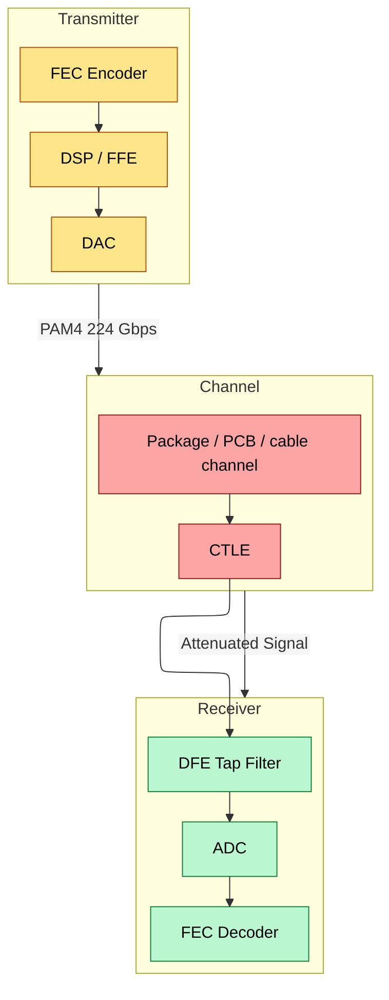
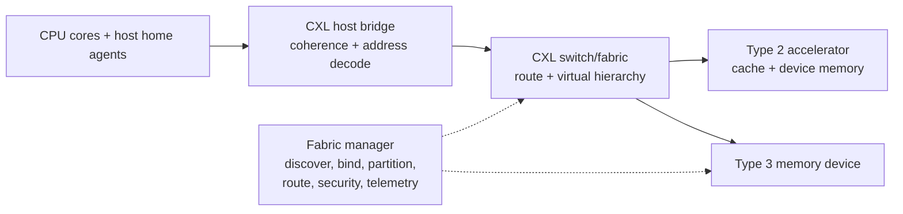
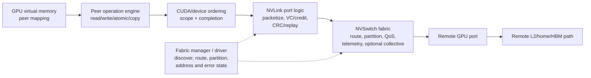
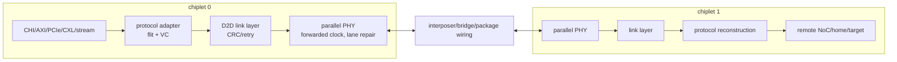
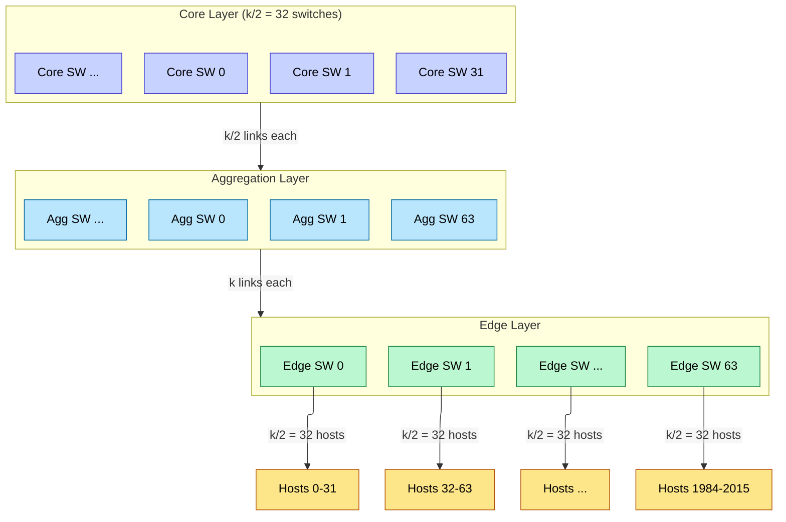
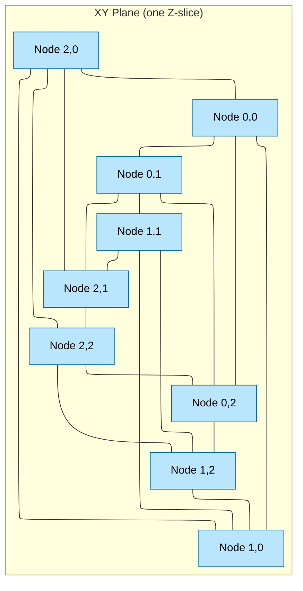
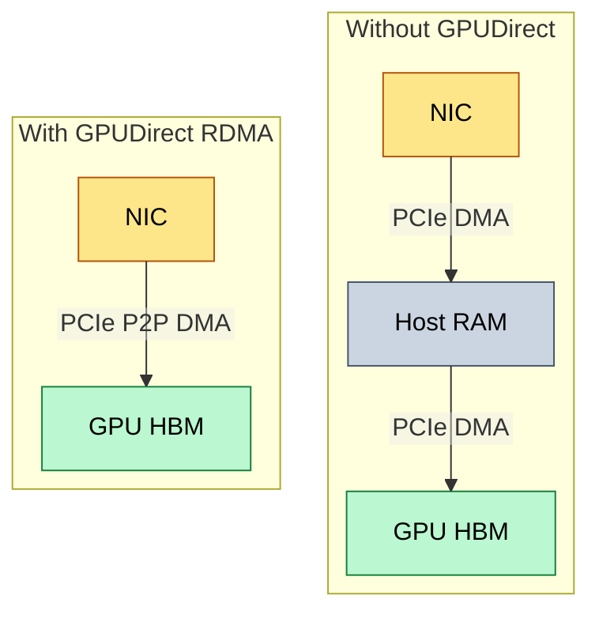
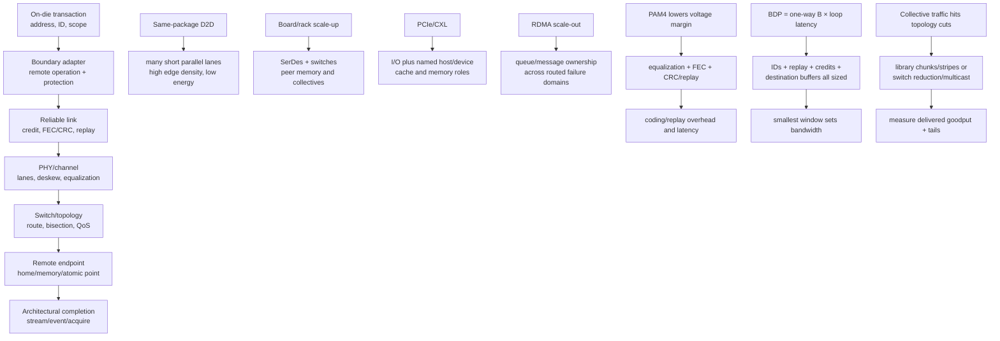

# Networking and Interconnect — From SerDes Physics to Cluster Topology

> **Layer:** L4.
> **Prerequisites:** [GPU_Architecture](../L3_Microarchitecture/02_GPU_Architecture.md), [Memory_Hierarchy_and_Roofline](../L3_Microarchitecture/03_Memory_Hierarchy_and_Roofline.md), [Advanced_Packaging](../L1_Packaging_and_Memory/01_Advanced_Packaging.md).
> **Hands off to:** [Rack_Scale_Design](02_Rack_Scale_Design.md), [Storage_and_Model_Loading](03_Storage_and_Model_Loading.md), [Collectives_and_NCCL](../L7_Training_Stack/02_Collectives_and_NCCL.md).

---

## 0. Why this page exists

Once work spans chips, useful scaling is bounded by both compute and communication. The ratio of arithmetic to transferred bytes, the fixed latency of synchronization, topology cuts, endpoint injection, and destination memory bandwidth determine whether another accelerator helps or stalls. This page builds the complete inter-chip stack: endpoint semantics, SerDes/parallel PHYs, link reliability, PCIe/CXL/UCIe and accelerator scale-up protocols, switches/topologies, RDMA, collectives, and congestion control.

Five working rules:

1. **A lane-rate generation is not payload bandwidth.** Modulation, coding, FEC, FLITs, headers, replay, lane count, and direction all matter.
2. **Reach comes from the channel budget.** Package loss, PCB material/length, connectors, cable, retimers, equalization, FEC, temperature, and target error rate determine whether a nominal speed works.
3. **Scale-up and scale-out are semantic as well as physical choices.** Peer memory/atomics and low-latency collectives differ from queued RDMA/messages even when both use high-rate SerDes or optics.
4. **Flow control and congestion control solve different problems.** Link/VC credits prevent local buffer overflow; end-to-end rate control, routing, admission, and collective scheduling manage shared-fabric congestion.
5. **Topology must be evaluated with a traffic matrix.** Port sum is not bisection bandwidth, and no topology name alone proves a system is nonblocking.

---

## 1. Physical Layer: SerDes and Signaling

### 1.1 NRZ vs PAM4

Non-Return-to-Zero (NRZ, also called PAM2) encodes 1 bit per symbol. PAM4 encodes 2 bits per symbol using four voltage levels. For the same baud rate B, NRZ achieves B bps while PAM4 achieves 2B bps.

The tradeoff is signal-to-noise ratio (SNR). With L voltage levels, the spacing between adjacent levels is:

$$\Delta V = \frac{V_{pp}}{L - 1}$$

For NRZ (L=2): $\Delta V = V_{pp}$. For PAM4 (L=4): $\Delta V = V_{pp}/3$. PAM4 sacrifices 9.5 dB of SNR (a factor of 3 in voltage, $20 \log_{10} 3 \approx 9.5$ dB) to double the data rate.

At 56 GHz Nyquist (224 Gbps PAM4), the channel insertion loss on FR-4 PCB material is approximately:

$$IL(f) \approx \alpha \cdot \ell \cdot \sqrt{f}$$

where $\alpha \approx 0.7$ dB/(inch·GHz$^{1/2}$) for Megtron-6 laminate, $\ell$ is trace length in inches, and $f$ is frequency in GHz. At $f = 56$ GHz:

$$IL(56\,\text{GHz}) \approx 0.7 \cdot \ell \cdot \sqrt{56} \approx 5.24 \cdot \ell \text{ dB}$$

A typical SerDes receiver needs ~25 dB of equalization budget. Subtracting package loss (~5 dB) and connector loss (~2 dB) leaves ~18 dB for the PCB trace, giving:

$$\ell_{max} \approx \frac{18}{5.24} \approx 3.4 \text{ inches} \approx 0.09 \text{ m}$$

This is an illustrative loss-budget calculation, not a reach guarantee. Real links use measured or simulated S-parameters and allocate loss among package, vias, PCB, connectors, cable, and margin. Better materials, shorter packages, retimers, active copper, or optics can change reach; the protocol name and data rate alone cannot.



### 1.2 Representative lane/port generations

Keep **per-lane transfer rate**, **payload bandwidth**, and **aggregate port/link bandwidth** in different columns. A protocol “link” can bond a product-specific number of lanes.

| Standard/profile | Raw/data rate named by standard | Modulation/framing | Boundary |
|---|---:|---|---|
| PCIe 3.0 | 8 GT/s/lane | NRZ, 128b/130b | board I/O |
| PCIe 4.0 | 16 GT/s/lane | NRZ, 128b/130b | board I/O |
| PCIe 5.0 | 32 GT/s/lane | NRZ, 128b/130b | board I/O / CXL PHY base |
| PCIe 6.x | 64 GT/s/lane | PAM4, 256-byte FLIT + FEC/CRC/replay | board I/O |
| PCIe 7.0 | 128 GT/s/lane | PAM4, compatible FLIT mode | board I/O |
| UCIe 3.0 | up to 64 GT/s/lane | short-reach die-to-die profiles | package D2D |
| UALink 200G 1.0 | 200 Gb/s data per lane | Ethernet-derived PAM4 PHY/FEC profile | accelerator scale-up |
| InfiniBand NDR | 400 Gb/s per port profile | bonded high-rate serial lanes | scale-out |

Reach is a channel-design result, not a constant of the protocol name. Package traces, PCB material, connectors, retimers, direct-attach copper, active cable, and optics produce different insertion loss and latency at the same nominal rate.

### 1.3 Equalization: CTLE, FFE, DFE

At 224 Gbps, the received eye is closed. Three stages reopen it:

**Continuous-Time Linear Equalizer (CTLE):** A peaking filter in the receiver that boosts high-frequency components attenuated by the channel. The transfer function approximates:

$$H_{CTLE}(f) = \frac{1 + j \cdot 2\pi f / \omega_z}{1 + j \cdot 2\pi f / \omega_p} \cdot G_{DC}$$

where $\omega_z$ is the zero frequency (typically 2–10 GHz) and $\omega_p$ is the pole. CTLE provides ~10–15 dB of high-frequency boost but amplifies noise proportionally.

**Feed-Forward Equalizer (FFE):** At the transmitter, a multi-tap FIR filter pre-distorts the signal. A 5-tap FFE with coefficients $c_{-2}, c_{-1}, c_0, c_{+1}, c_{+2}$ pre-cancels inter-symbol interference (ISI):

$$y[n] = \sum_{k=-2}^{2} c_k \cdot x[n-k]$$

The main cursor $c_0$ carries most of the energy; pre-cursor taps ($c_{-1}, c_{-2}$) cancel leading ISI, post-cursor taps ($c_{+1}, c_{+2}$) cancel trailing ISI.

**Decision Feedback Equalizer (DFE):** In the receiver, a nonlinear filter that subtracts decided symbols from the incoming signal. A DFE with $N$ taps cancels N post-cursor ISI terms without noise amplification (because it operates on decided bits, not noisy samples):

$$y[n] = r[n] - \sum_{k=1}^{N} d_k \cdot \hat{x}[n-k]$$

where $\hat{x}[n-k]$ are previously decided symbols. A wrong decision can feed back and cause a burst of errors, so DFE error propagation is a design concern; coding, FEC, adaptation limits, and receiver validation mitigate it.

An illustrative equalization allocation might assign roughly 12 dB to CTLE, 8 dB to transmitter FFE, and 10 dB to DFE, but these contributions are not freely additive guarantees. Compliance uses a specified channel, transmitter/receiver masks, jitter/noise budget, BER target, and FEC performance.

### 1.4 Forward error correction (FEC), CRC, and replay

PAM4's lower voltage margin raises raw error probability, so high-rate protocols combine:

- **FEC:** correct a bounded error pattern without retransmission;
- **CRC:** detect residual corruption after FEC;
- **link replay:** retransmit an uncorrectable FLIT/packet from a retained copy;
- **end-to-end checks:** detect misroute/corruption beyond one physical hop.

The code and framing are protocol-specific. PCIe 6.x/7.0 FLIT mode uses a 256-byte FLIT with lightweight FEC, CRC, and low-latency retry; Ethernet-derived UALink physical profiles use their specified Ethernet FEC/framing. Do not apply one RS code, 5.5% overhead, or 80–150 ns latency to every PAM4 link.

FEC decoder depth trades correction strength against latency/area/power. Replay probability consumes bandwidth and sets retry-buffer depth. Architects use the complete efficiency:

$$
\eta_{delivered}=\eta_{encoding}\eta_{FEC}\eta_{flit}
\eta_{protocol}\eta_{retry},
$$

then measure residual undetected-error rate and tail latency under injected error bursts.

---

## 2. Protocol layer: PCIe, CXL, UCIe, and accelerator scale-up

### 2.0 One transaction, several independent contracts

An inter-chip operation is not “put bytes on SerDes.” It crosses:

```mermaid
flowchart LR
    K["Kernel/runtime/driver<br/>copy, remote load/store,<br/>atomic, collective"] --> MMU["GPU/CPU MMU<br/>local or remote mapping"]
    MMU --> EP["Endpoint transaction layer<br/>operation, ID, order, protection"]
    EP --> LL["Data/link layer<br/>flit/TLP, VC, credit,<br/>CRC/FEC/replay"]
    LL --> PHY["PHY<br/>gearbox, lanes, equalization,<br/>deskew, training"]
    PHY --> FAB["Direct cable/package<br/>or switch fabric"]
    FAB --> RLL["Remote link endpoint"]
    RLL --> REP["Remote protocol endpoint"]
    REP --> MEM["Remote home/cache/memory,<br/>DMA or collective engine"]
```



Each layer has a different completion:

| Event | Meaning |
|---|---|
| source queue accepted | endpoint owns the command |
| link ACK | adjacent receiver got one encoded unit intact |
| destination accepted | remote protocol state exists |
| remote ordered/atomic point | operation joined destination memory order |
| architectural completion | source software/hardware may consume result or reuse buffer |

A link ACK is not a remote memory fence. CRC replay is not a retry of the architectural operation. Keeping hop-local link sequence separate from end-to-end transaction identity is the foundation of exactly-once writes and atomics.

### 2.1 PCIe Hierarchy

PCIe is the universal discovery and I/O hierarchy: a root complex connects through zero or more switches to endpoints. An endpoint exposes configuration space and functions; software discovers BARs/capabilities, establishes DMA mappings, creates queues, and enables interrupts.

The transaction layer creates TLPs:

- **posted:** a memory write has no ordinary completion, so later software-visible completion needs another ordering/response mechanism;
- **non-posted:** reads and selected requests receive completions;
- **completion:** returns status/data and the requester tag;
- **messages:** interrupts, errors, power-management, and other protocol events.

The data-link layer protects and retries traffic on one adjacent link, while the physical layer trains lanes. PCIe 6.0 and 7.0 use FLIT mode with PAM4, lightweight FEC, strong CRC, and low-latency link retry. As of 2026, PCIe 7.0 is the current approved base generation; compatibility means a real link can negotiate a lower speed/width.

For the familiar Gen5 one-direction payload-rate ceiling:

$$BW_{PCIe\ Gen5\ x16} = 16 \text{ lanes} \times 32 \text{ GT/s} \times \frac{128}{130} \text{ (encoding)} \times \frac{1}{8} \text{ (bytes)} \approx 63.0 \text{ GB/s}$$

Actual payload bandwidth is lower after TLP/FLIT headers, credit/update traffic, alignment, replay, and small-message effects. For AI systems PCIe commonly carries:

- host↔accelerator DMA and model/checkpoint loading;
- queue doorbells, completion records, interrupts, page faults, and management;
- GPU peer transfers when no accelerator scale-up path is selected;
- NIC/storage traffic through GPUDirect-style mappings.

PCIe can be a training communication path in systems without a dedicated scale-up fabric, but its per-device bandwidth/latency and shared switch/root cuts are usually weaker for fine-grained tensor parallelism. Avoid the absolute claim that it is “never” used.

An endpoint needs request tags, posted/non-posted/completion credits, replay storage, ordering-domain state, ATS/PASID/IOMMU context, poisoned/error completions, and reset epochs. Posted writes make device completion design especially important: “TLP sent” is not proof that a destination DMA write is visible.

### 2.2 CXL (Compute Express Link)

CXL uses PCIe electrical/link infrastructure while adding explicit cache and memory semantics. Current CXL 4.0 still organizes the fundamental roles around:

1. **CXL.io:** PCIe-compatible enumeration, configuration, register access, interrupts, and conventional DMA;
2. **CXL.cache:** a capable device coherently caches/accesses host memory under a host/home coherence role;
3. **CXL.mem:** the host accesses device-attached memory through coherent memory semantics.

The mix defines broad device types:

| Device | Protocol mix | Example role |
|---|---|---|
| Type 1 | `.io + .cache` | accelerator with no exposed device memory |
| Type 2 | `.io + .cache + .mem` | accelerator with local memory |
| Type 3 | `.io + .mem` | memory expander/pool |

“CXL memory” is not one performance class. The path can include a host bridge, switch stages, a device memory controller, media, and RAS/security state. Software sees NUMA capacity with latency/bandwidth/failure properties that must be measured per route.



Coherence is in the relevant physical-address/domain contract; devices still need ATS/IOMMU/PASID translation and protection for virtualized access. A fabric cannot infer object lifetime or application synchronization from an address.

### 2.2b CXL fabrics, pooling, and management

The fabric features introduced across CXL 2.x/3.x and extended in later revisions separate:

- **data plane:** cache/memory/I/O traffic on established routes;
- **fabric management:** discover components, create virtual hierarchies, bind logical devices/capacity to hosts, program routes, monitor health, and handle reconfiguration;
- **host software:** online/offline memory, choose NUMA placement/tiering, migrate pages, handle poison and hot-plug.

Pooling, sharing, and coherence are related but not identical:

- **pooling:** capacity can be dynamically assigned among hosts;
- **sharing:** a region can be simultaneously accessible to more than one host/device under a defined model;
- **coherence:** caches participating for that region have named home/agent rules.

Do not claim that every CPU/GPU accessing one CXL device automatically forms one flat snoop-coherent cache domain. The configured HDM mode, device capabilities, host/home topology, virtual hierarchy, and software mappings determine the actual semantics.

A Type-3 pool can hold cold model weights, KV-cache tiers, memory-capacity overflow, or checkpoint staging. It is useful when capacity saved exceeds remote-access and fabric-contention cost:

$$
N_{reuse}(L_{remote}-L_{local})
< L_{migration}+L_{mapping}+L_{coherence}
$$

means leave the object remote; reverse the inequality when repeated local use amortizes migration. Exact CXL latency is platform/topology/media dependent, so replace fixed “150–250 ns” rules with measured load-to-use, bandwidth, tail, and failure data.

The fabric manager may reside in a host, switch, or management controller. An established data plane can often continue when management is temporarily unavailable, but new binding/reallocation/recovery may fail. Reassignment must quiesce old traffic, revoke mappings, resolve dirty data, change generations/keys, and zeroize data as required before another tenant receives the capacity.

### 2.3 NVLink and NVSwitch

NVLink is NVIDIA's proprietary accelerator/CPU scale-up family; NVSwitch devices build switched NVLink domains. Exact link counts, port rates, topology, remote-memory behavior, and coherency depend on the GPU, switch generation, and platform. Treat a named system such as HGX/NVL as a profile, not as the definition of NVLink.

At an architectural level:



NVSwitch is not “one 144-port crossbar” across every generation. A switch chip/system can use crossbar or multistage internals, and several devices/planes can compose the advertised domain. The correct bandwidth test is:

1. per-GPU one-way injection/ejection;
2. per-switch port and internal capacity;
3. topology bisection for a simultaneous traffic pattern;
4. destination L2/HBM capacity;
5. useful payload after protocol/replay.

NVIDIA software exposes peer memory, copies, collectives, and on supported platforms memory-fabric management. NCCL may choose NVLink/NVSwitch paths and, where supported, NVLink SHARP-style collective reduction. The programming primitive still carries stream/event ordering and buffer lifetime; a physical link does not infer those.

Link CRC/replay protects delivery, switch ECC protects internal state, and route/partition tables enforce reachability. A failed link can down-width, reroute, or isolate a partition only if ordering epochs and outstanding operations are reconciled; otherwise a late packet can complete after software reused its transaction/buffer state.

### 2.4 UALink

UALink defines an open memory-semantic scale-up fabric for accelerators and switches. UALink 1.0 specifies remote reads, writes, atomics, DMA-oriented behavior, credit flow control, virtual channels, link retry, source/destination routing, and a partitioned global address-space model. Its maximum architectural endpoint scale is not a promise that every deployment has full bisection.

The critical correction is coherence: **UALink 1.0 does not define a snoop protocol that keeps all accelerator caches hardware coherent.** It defines an I/O-coherency model at the destination system node and expects software to maintain coherence among accelerator caches across nodes, for example by cache operations and kernel/ownership boundaries.

```mermaid
sequenceDiagram
    participant PA as "producer accelerator A"
    participant EA as "A UALink endpoint"
    participant SW as "UALink switch fabric"
    participant EB as "B endpoint"
    participant MB as "B memory/home"
    PA->>PA: "finish local writes; flush/order exported data"
    PA->>EA: "remote write or atomic + release intent"
    EA->>SW: "routed memory-semantic request"
    SW->>EB: "destination B"
    EB->>MB: "authorize; make latest B-node copy current"
    MB-->>EB: "completion / atomic old value"
    EB-->>EA: "response"
    EA-->>PA: "completion; acquire as required"
    Note over PA,MB: "software invalidates/changes ownership before a peer consumes cached data"
```

#### What is hardware versus software?

| Hardware | Software/runtime |
|---|---|
| link training, FEC/CRC/replay, credits/VCs | fabric discovery and workload partition |
| routing and protected remote address checks | allocation export/import and lifetime |
| remote read/write/atomic execution | cache ownership/maintenance between phases |
| destination-node I/O-coherent memory access | collective algorithm and chunk/plane mapping |
| completion/error/telemetry | recovery policy and job rescheduling |

Remote atomics still need exactly-once recovery. If the destination performed an add but the response was lost, a new add would duplicate the update. End-to-end transaction identity must survive link-local replay and switch reroute.

UALink 200G 1.0 supports high-rate lanes and switched domains; current consortium releases split common/protocol, data-link/physical, chiplet, and management specifications so these layers can evolve independently. The notebook therefore models lane rate, width, switch radix, bisection, and collective support as profile parameters instead of tying the protocol to one announced accelerator.

#### Accelerator scale-up comparison by semantics

| Question | Proprietary NVLink/Infinity-class fabric | UALink | CXL | RDMA scale-out |
|---|---|---|---|---|
| primary relationship | accelerator peer / CPU-accelerator, platform-specific | accelerator peer | host ↔ coherent device/memory | independent network endpoints |
| operation style | peer memory/copy/atomic/collective, product-specific | read/write/atomic/DMA | `.io`, `.cache`, `.mem` | send/receive, RDMA read/write/atomic |
| cache coherence | platform/version-specific | software across accelerator caches | named host/home coherent roles | software/message ownership |
| switch management | vendor fabric manager | standardized management profiles | CXL fabric manager | subnet/network control plane |
| best use | fine-grained scale-up on supported platform | open accelerator scale-up | memory expansion/coherent host-device | rack/cluster scale-out |

The programmer normally reaches these through CUDA/HIP queues, NCCL/RCCL, SHMEM/PGAS libraries, or runtime DMA—not by constructing a wire packet. The library selects paths, chunks tensors, issues remote operations, and turns endpoint completion into stream/event semantics.

### 2.4b UCIe and same-package chiplets

UCIe addresses a shorter boundary: die-to-die connections inside a package. It defines physical/link capabilities and mappings for PCIe/CXL and streaming/raw protocols. UCIe 3.0 supports newer rates, multiprotocol operation, enhanced sideband/manageability, and both 2D/2.5D/3D packaging profiles, but the mapped protocol owns the memory semantics.



Compared with board/rack SerDes, same-package D2D spends more bumps and die edge to reduce serialization energy/latency. Architects size bandwidth per millimeter of die edge, retry/credit round trip, adapter queues, lane repair, package escape routing, and thermal/power coupling.

### 2.4c Infinity Fabric and xGMI

AMD Infinity Fabric is a proprietary family spanning on-package/on-system coherent transport; xGMI is its external high-speed interconnect used for CPU socket and GPU peer connections on supported platforms. It can bridge fabric domains and expose peer memory/topology to ROCm, but link count, bandwidth, coherence scope, and whether a route is direct or switched are product/platform properties.

The software path is analogous to other scale-up systems:

```text
HIP/RCCL peer or collective operation
-> GPU virtual-memory/peer mapping
-> source Infinity/xGMI endpoint
-> direct peer or system fabric path
-> destination endpoint and L2/HBM
-> completion ordered into the HIP stream
```

For an eight-GPU full mesh, seven external links per GPU can provide one direct path to every peer; another product may expose fewer links or a hierarchical path. Topology discovery and NUMA-aware rank placement are therefore mandatory. “Infinity Fabric” names a family, not one fixed wire protocol or universal bandwidth.

### 2.5 Bandwidth-Delay Product (BDP)

The bandwidth-delay product (BDP) is the amount of data that must be "in flight" to fully saturate a network link:

$$\text{BDP} = BW \times \text{latency}$$

For a 400 Gbps (50 GB/s) InfiniBand NDR link with 2 $\mu$s one-way latency:

$$\text{BDP}_{IB} = 50 \text{ GB/s} \times 2\,\mu\text{s} = 100 \text{ KB}$$

This means the sender/path needs roughly 100 KB of outstanding window to sustain the link while feedback or completion is in flight. A single transfer much smaller than the BDP is usually startup-latency dominated; many independent small messages can still fill the link if queue depth, credits, and destinations permit enough aggregate bytes in flight.

#### Implications for Training Collectives

**Small-message AllReduce cannot saturate InfiniBand.** For gradient AllReduce during training, each gradient chunk must be larger than the BDP to fill the pipe. Consider tensor-parallel (TP) AllReduce over InfiniBand: each GPU sends $\frac{2D^2 L}{P}$ bytes per transformer layer (where $D$ is hidden dimension, $L$ is number of layers, and $P$ is TP degree). For Llama-3-70B with $D = 8192$, $L = 80$, TP $= 8$:

$$\text{AllReduce size} = \frac{2 \times 8192^2 \times 80}{8} = 1{,}342{,}177{,}280 \text{ bytes} \approx 1.34 \text{ GB}$$

Transfer time at 400 Gbps: $T = 1.34 \text{ GB} / 50 \text{ GB/s} = 26.8$ ms. BDP overhead: $100 \text{ KB} / 1.34 \text{ GB} \approx 0.007\%$ — negligible. The link is fully utilized.

But for a smaller model (8B, $D = 4096$, $L = 32$, TP $= 8$):

$$\text{AllReduce size} = \frac{2 \times 4096^2 \times 32}{8} \approx 134 \text{ MB}$$

BDP overhead: $100 \text{ KB} / 134 \text{ MB} \approx 0.075\%$ — still small, but the gradient chunks per layer (before ring fusion) are $\sim$8 MB each, and BDP overhead per chunk is $\sim$1.2%. This is why NCCL fuses small gradient buffers before transmitting.

#### RDMA Small-Message Optimization

RoCE v2 with DCQCN uses packet pacing and ECN marking for congestion control. For messages smaller than the BDP, inline RDMA writes eliminate the overhead of a separate data transfer. In a standard RDMA write, the sender posts a Work Queue Element (WQE) describing the data location, then the NIC DMAs the payload from host memory. With inline writes, the data is embedded directly in the WQE:

- **Standard RDMA write**: 2 $\mu$s latency (WQE processing + DMA read + network + DMA write).
- **Inline RDMA write**: $\sim$0.8 $\mu$s latency (WQE contains data, no separate DMA read needed).

Inline writes are limited to $\sim$64 bytes (the WQE size), so they only help for control messages and synchronization — but those are exactly the messages where BDP overhead is worst.

#### Scale-up endpoint BDP

Use **one-way delivered** bandwidth and the specific loop being hidden. For a scale-up path delivering 200 GB/s one way with a 500 ns request-to-response or credit loop:

$$\text{BDP}_{scaleup} = 200 \text{ GB/s} \times 500\,\text{ns} = 100 \text{ KB}.$$

With 256-byte requests, about 391 payloads must be represented in transaction IDs, replay storage, switch credits, destination queues, and return buffers before headroom. Marketing “bidirectional” bandwidth must not be multiplied by a one-way latency; the two directions are separate pipes.

Large collective chunks can cover BDP through streaming, while fine-grained remote loads/atomics remain latency-sensitive even when total bandwidth is enormous. This is why tensor parallelism benefits from scale-up fabrics but still needs chunking, multiple channels, and overlap.

### 2.6 InfiniBand

InfiniBand remains the dominant scale-out fabric for NVIDIA-based training clusters:

| Generation | Data Rate | Ports | Typical ToR |
|---|---|---|---|
| HDR | 200 Gb/s (2× 100G) | 40 ports | Quantum |
| NDR | 400 Gb/s | 64 ports | Quantum-2 |
| NDR400 | 400 Gb/s (8× 50G SerDes) | 64 ports | Quantum-2 X |
| XDR (proj. 2026) | 800 Gb/s | 64 ports | Quantum-3 |

InfiniBand features:
- **Lossless fabric**: credit-based flow control (no PFC needed)
- **Native RDMA**: verbs API, zero-copy kernel bypass
- **Adaptive routing**: packets can take different paths (packet spraying)
- **SHARP**: in-network reduction for AllReduce (offloads compute to switches)

An NDR switch provides $64 \times 400$ Gb/s $= 25.6$ Tb/s $= 3.2$ TB/s bidirectional switching capacity. A two-tier fat-tree of NDR switches supports $64^2 / 2 = 2{,}048$ endpoints.

### 2.7 InfiniBand XDR Architecture

XDR (Extended Data Rate) is the next InfiniBand generation, doubling NDR's per-port bandwidth:

- **Data rate**: 800 Gb/s per port (100 GB/s), doubling NDR's 400 Gb/s.
- **Signaling**: 100 Gbaud PAM4 per lane, 4 lanes per port. Compare NDR's 4 lanes at 50 Gbaud with NRZ-like PAM4 signaling. The move to 100 Gbaud PAM4 per lane is the key enabling technology.
- **Switch**: NVIDIA Quantum-X800 switch ASIC with 144 XDR ports, providing ~115.2 Tbps aggregate bandwidth ($144 \times 800$ Gb/s). This is ~4.5× the NDR Quantum-2's 25.6 Tbps.
- **Cable reach**:
  - DAC (Direct Attach Copper): ~2 m (limited by insertion loss at 100 Gbaud)
  - AOC (Active Optical Cable): ~100 m
  - Transceiver (pluggable optics): ~2–10 km
- **Relevance to AI**: doubles inter-node bandwidth for distributed training. For tensor parallelism across nodes, AllReduce time is communication-bound; doubling the link rate halves the AllReduce time for bandwidth-limited message sizes. This is particularly impactful for TP across nodes where the activation gradient exchange dominates the critical path.
- **Timeline**: 2025–2026 production deployment in NVIDIA reference architectures (GB300 / NVL72+ clusters).

### 2.8 RoCE v2 (RDMA over Converged Ethernet)

RoCE v2 encapsulates RDMA transport in UDP/IP, allowing RDMA over standard Ethernet switches. This is cheaper than InfiniBand but requires careful configuration for losslessness:

- **Priority Flow Control (PFC)**: pause frames at the link level. If a switch buffer exceeds a threshold, it sends a PAUSE frame upstream. This is the mechanism that creates the "lossless" Ethernet fabric.
- **ECN (Explicit Congestion Notification)**: switches mark packets when queue depth exceeds $K_{min}$. The receiver echoes the mark back as a CNP (Congestion Notification Packet).
- **DCQCN**: the rate-control algorithm running on the sender, described in detail in Section 4.

RoCE v2 bandwidth depends on the Ethernet PHY:

| Ethernet Gen | Per-Port BW | Typical ToR Ports |
|---|---|---|
| 400GbE | 400 Gb/s | 32–48 |
| 800GbE | 800 Gb/s | 32–64 |
| 1.6TbE (proj. 2027) | 1.6 Tb/s | 32–64 |

AWS EFAv3 uses SRD (Scalable Reliable Datagram) instead of RoCE v2. SRD is an AWS-proprietary transport that does path spraying at the NIC level and handles retransmission in hardware, avoiding the PFC/DCQCN complexity entirely.

---

## 3. Network Topologies

### 3.1 Fat-Tree (Clos)

A $k$-ary fat-tree is built from $k$-port switches arranged in three layers (core, aggregation, edge). For a $k$-ary fat-tree:

- **Number of hosts**: $N = k^3 / 4$
- **Number of switches**: $\frac{5k^2}{4}$
- **Bisection bandwidth**: $\frac{N \cdot b}{2}$ (full bisection for non-blocking variant), where $b$ is link bandwidth
- **Diameter**: $2 \log_k N$ (constant at 6 for typical deployments)

For NDR with $k = 64$: $N = 64^3 / 4 = 65{,}536$ hosts. This is the canonical 65k-GPU cluster topology.



**Cost analysis**: A 65k-host fat-tree needs $\frac{5 \times 64^2}{4} = 5{,}120$ NDR switches. At ~$30k per switch, the network alone costs ~$150M — comparable to the GPU cost. This is why network cost is 30–50% of total cluster capex.

### 3.2 Dragonfly

Dragonfly is a direct-connect topology that reduces diameter to 3 hops at the cost of lower bisection bandwidth per dollar.

A dragonfly has three levels of connectivity:
1. **Intra-group**: fully connected within a group of $p$ routers (a virtual switch)
2. **Inter-group**: each group connects to every other group via $h$ global links
3. **Optical**: global links use AOC (Active Optical Cable) or transceivers

Parameters: $p$ routers per group, $h$ global links per router, $a = p - 1$ intra-group links per router. Number of groups:

$$G = 1 + p \cdot h$$

Total endpoints: $N = G \cdot p = p(1 + ph)$.

**Diameter**: exactly 3 hops (intra-group → global → intra-group). This is the key advantage — latency is deterministic and bounded regardless of cluster size.

**Bisection bandwidth**:

$$B_{bisect}^{dragonfly} \approx \frac{G^2 \cdot h \cdot b}{4}$$

where $b$ is per-link bandwidth. For typical parameters ($p = 32, h = 8$): $G = 257$ groups, $N = 8{,}224$ endpoints. Bisection bandwidth is ~$132k \cdot b$, vs fat-tree's ~$4{,}112 \cdot b$ — dragonfly has ~32× more bisection BW because of its dense global connectivity.

The cost is cabling complexity: $G^2 / 2$ global links, each an AOC. For 257 groups: ~33k AOCs.

### 3.3 Dragonfly+

Dragonfly+ (used in some large deployments) uses a fat-tree within each group and dragonfly between groups. This combines the good properties:

- **Within group**: fat-tree gives full bisection, simple routing
- **Between groups**: dragonfly gives diameter-3 connectivity
- **Scalability**: each group can be a 2-tier fat-tree of $k$-port switches ($k^2/2$ hosts), with $G$ groups connected dragonfly-style

### 3.4 3D Torus (Google TPU)

Google's Inter-Core Interconnect (ICI) arranges TPU chips in a 3D torus. For an $X \times Y \times Z$ torus:

- **Links per node**: 6 (±X, ±Y, ±Z)
- **Number of nodes**: $N = X \cdot Y \cdot Z$
- **Diameter**: $D = \lfloor X/2 \rfloor + \lfloor Y/2 \rfloor + \lfloor Z/2 \rfloor$
- **Average hop count**: $H \approx \frac{X + Y + Z}{4}$
- **Bisection bandwidth**:

$$B_{bisect}^{torus} \approx 2 \cdot b \cdot (XY + XZ + YZ) \approx 2 \cdot b \cdot N^{2/3}$$

(for a cube $X = Y = Z = N^{1/3}$, bisection is along one cut plane: $6 \cdot N^{2/3} \cdot b$ total with 3 cuts, but only one plane at a time for any given cut).



**Comparison with Clos**: At $N = 8{,}960$ (TPU v5p pod), a Clos would give $B_{bisect} \propto N \cdot b = 8{,}960 b$. A 3D torus gives $\sim 2 \cdot b \cdot 8960^{2/3} \approx 2 \cdot b \cdot 432 \approx 864 b$. The torus has ~10× less bisection bandwidth. Google compensates with:

1. **Optical Circuit Switching (OCS)**: reconfigurable mirrors dynamically rewire torus links
2. **Model parallelism co-design**: Megatron-style TP/PP mapped to torus topology
3. **Sparse attention**: reduces All-to-All communication volume

### 3.5 Topology Comparison Table

| Property | Fat-Tree (Clos) | Dragonfly | Dragonfly+ | 3D Torus |
|---|---|---|---|---|
| Diameter | $2 \log_k N$ | 3 | ~5 | $\sim N^{1/3}/2$ |
| Bisection BW | $\frac{N \cdot b}{2}$ | $\sim \frac{G^2 h b}{4}$ | Between fat-tree and dragonfly | $\sim 2 b N^{2/3}$ |
| Switch count | $\frac{5k^2}{4}$ | $G \cdot p$ | Hybrid | 0 (direct-connect) |
| Cabling | Structured, uniform | Dense AOC between groups | Moderate | Structured, local |
| Routing | ECMP (multipath) | Minimal + VAL | Hybrid | DOR |
| Congestion risk | Incast at ToR | Global link hotspots | Moderate | Cut-plane hotspots |
| Scale limit | ~65k (k=64 NDR) | ~100k+ | ~100k+ | Limited by torus dim |

---

## 4. Congestion Control: DCQCN Deep Dive

### 4.1 The Incast Problem

In distributed training, the most communication-intensive collective is All-to-All (used in MoE expert parallelism and sequence parallelism). In an All-to-All of $N$ nodes, every node sends a message to every other node simultaneously. At the receiving ToR switch:

$$BW_{incast} = (N - 1) \cdot r_{sender}$$

where $r_{sender}$ is each sender's transmission rate. For $N = 64$ nodes each sending at 50 GB/s: $BW_{incast} = 63 \times 50 = 3{,}150$ GB/s $= 25.2$ Tb/s. A single NDR ToR switch has 51.2 Tb/s switching capacity — enough in theory, but the problem is **buffer occupancy**. Shared buffer SRAM in a typical ToR is 32–128 MB. At 400 Gb/s, 128 MB fills in:

$$T_{fill} = \frac{128 \text{ MB}}{50 \text{ GB/s}} = 2.56 \text{ ms}$$

Without congestion control, a single incast burst can overflow the buffer in under 3 ms, causing packet loss and retransmission.

### 4.2 DCQCN Derivation

DCQCN (Data Center Quantized Congestion Notification) operates in three phases:

**Phase 1: Switch marks ECN.** When queue depth $Q$ at an egress port exceeds threshold $K_{min}$, the switch probabilistically marks the IP ECN field:

$$P_{mark} = \begin{cases} 0 & Q < K_{min} \\ \frac{Q - K_{min}}{K_{max} - K_{min}} & K_{min} \le Q \le K_{max} \\ 1 & Q > K_{max} \end{cases}$$

Typical values: $K_{min} = 150$ KB, $K_{max} = 900$ KB, $K_{drop} = 3$ MB.

**Phase 2: Receiver generates CNP.** The receiving NIC detects the ECN mark and sends a Congestion Notification Packet (CNP) back to the sender. CNPs are rate-limited to one per flow per ~50 μs to prevent CNP floods.

**Phase 3: Sender rate update.** The sender maintains:

- Current rate $R_c$
- Target rate $R_t$
- ECN fraction $\alpha$ (exponentially weighted moving average)

On CNP arrival ($F = 1$):

$$\alpha \leftarrow (1 - g) \cdot \alpha + g \cdot 1$$

On no CNP in a timer period ($F = 0$):

$$\alpha \leftarrow (1 - g) \cdot \alpha + g \cdot 0$$

where $g \approx 1/256$ is the smoothing gain.

The rate update rule:

$$R_c \leftarrow R_c \left(1 - \frac{\alpha}{2}\right) \quad \text{(on CNP)}$$

$$R_t \leftarrow R_c \quad \text{(save current rate as target)}$$

On no CNP for a timer period, the sender probes for bandwidth:

$$R_c \leftarrow R_c + \frac{R_t - R_c}{R_{increase}}$$

where $R_{increase}$ controls the recovery speed. After $T_{timer}$ consecutive periods without CNP:

$$R_c \leftarrow R_t$$

This creates a classic additive-increase / multiplicative-decrease (AIMD) behavior:
- **Decrease**: $R_c \leftarrow R_c (1 - \alpha/2)$. With $\alpha = 1$ (every packet marked): $R_c \leftarrow R_c / 2$ (halving).
- **Increase**: linear recovery toward $R_t$ over multiple timer periods.

**Steady-state convergence**: With $N$ senders sharing a bottleneck link of capacity $C$, each sender converges to approximately $C/N$ in RTT $\cdot \log_2 N$ time. For $N = 64$ and RTT = 10 μs: convergence in ~60 μs.

### 4.3 Ultra Ethernet and Packet Spraying

The Ultra Ethernet Consortium (UEC) specification (targeting 2026 deployment) addresses DCQCN's limitations:

1. **Packet spraying**: instead of hashing flows to a single path (ECMP), spray packets across all available paths. This eliminates the "elephant flow" problem where a single large flow saturates one ECMP path while others are idle.
2. **Selective retransmission**: only lost packets are retransmitted (not the entire message), reducing waste.
3. **No PFC**: UEC targets PFC-free operation by combining spraying with large switch buffers and intelligent AQM (Active Queue Management).
4. **In-network telemetry**: INT headers carry real-time queue depth and latency information, allowing senders to make informed rate decisions.

The key mathematical benefit of spraying: with $K$ equal-cost paths, the maximum utilization of any single path under spraying is $1/K + O(\sqrt{\log K / K})$ by Chernoff bound, vs $1$ under ECMP (one path gets the entire elephant flow).

### 4.4 Recent Industry Partnerships and Initiatives (2026)

**NVIDIA-Marvell NVLink Fusion ($2B partnership, March 31, 2026):** NVIDIA and Marvell announced a $2B partnership to develop custom NVLink Fusion silicon. NVLink Fusion extends NVLink technology beyond NVIDIA's own GPUs, allowing third-party accelerators (custom ASICs, NPUs) to participate in NVLink coherent domains. This opens NVL72/NVL576 topologies to heterogeneous accelerator combinations — e.g., NVIDIA GPUs + Marvell-custom AI accelerators in the same NVLink fabric.

**NVIDIA Spectrum-X with MRC (May 6, 2026):** NVIDIA announced Spectrum-X Ethernet switches with MRC (Massive Radix Connectivity), targeting gigascale AI Ethernet networks. Spectrum-X with MRC provides:
- Up to 512 ports of 800GbE per switch — 10× the radix of traditional Ethernet ToR switches
- Purpose-built for AI training workloads with adaptive routing and congestion-aware scheduling
- Targets clusters of 100,000+ GPUs where Ethernet economics beat InfiniBand at extreme scale

**OpenAI-Microsoft "Build A Better Ethernet" Initiative (May 12, 2026):** OpenAI and Microsoft jointly announced an initiative to develop open Ethernet standards optimized for AI training. Goals include:
- Standardized congestion control profiles for All-to-All collectives at scale
- Open telemetry (INT) specifications for real-time network-aware training schedulers
- Target: make Ethernet competitive with InfiniBand for training at 100k+ GPU scale, using open standards instead of proprietary fabrics

---

## 5. GPUDirect RDMA and Storage

### 5.1 GPUDirect RDMA

GPUDirect RDMA allows a NIC to DMA directly into GPU HBM without staging through host memory. The data path comparison:

**Without GPUDirect**: NIC → Host RAM (DMA) → GPU HBM (PCIe DMA). Two PCIe traversals, CPU involvement for buffer management.

**With GPUDirect**: NIC → GPU HBM (PCIe peer-to-peer DMA). One PCIe traversal, no CPU involvement.



Bandwidth improvement: eliminating one PCIe traversal saves ~100 ns of latency and doubles effective throughput (from ~31.5 GB/s to ~63 GB/s for a single PCIe Gen5 x16 path).

### 5.2 GPUDirect Storage (GDS)

GDS extends GPUDirect to NVMe drives, enabling direct DMA from NVMe to GPU HBM:

$$BW_{GDS} = \min(BW_{NVMe}, BW_{PCIe}) = \min(7{,}000 \text{ MB/s}, 63{,}000 \text{ MB/s}) \approx 7 \text{ GB/s per NVMe drive}$$

With 8 NVMe drives per node: ~56 GB/s aggregate. A 70B model in FP16 (~140 GB) loads in:

$$T_{load}^{GDS} = \frac{140 \text{ GB}}{56 \text{ GB/s}} \approx 2.5 \text{ s}$$

Without GDS (staged through host RAM): ~5 s due to the extra copy and CPU overhead.

### 5.3 NVLink Peer-to-Peer

On supported systems, a GPU can map peer memory and the runtime can select an NVLink/NVSwitch route instead of staging through host RAM. The hardware path is:

```text
source copy/LSU engine -> source GMMU/peer map -> NVLink endpoint
-> zero or more NVSwitch stages -> destination endpoint
-> destination L2/home/HBM
```

For $M$ bytes:

$$
T_{P2P}\approx L_{launch}+L_{fabric}+\frac{M}{\min(B_{src},B_{path},B_{dst})}.
$$

Use the actual platform's **one-way delivered** bandwidth and topology. Aggregate bidirectional GPU bandwidth cannot be inserted as the denominator for one transfer, and a shared destination HBM/L2 or switch cut may be smaller than source port bandwidth.

Peer access removes host staging but not software work: the driver establishes reachability and page mappings, the runtime owns buffer lifetime and stream ordering, and collectives split/stripe tensors across links/planes. See [Disaggregated Serving](../L8_Inference_and_Serving/10_Disaggregated_Serving_2025.md).

---

## 5b. RDMA Programming for AI

### 5b.1 What RDMA is

**Remote Direct Memory Access (RDMA)** allows one machine to directly read or write memory on another machine without involving the remote CPU or operating system kernel. The key benefit: zero-copy, kernel-bypass transfers with latencies of 1-2 $\mu$s intra-rack (vs. ~50-100 $\mu$s for TCP/IP with kernel involvement).

### 5b.2 RDMA APIs

Two primary APIs are used in AI infrastructure:

| API | Full name | Use case | Provider |
|---|---|---|---|
| **libibverbs / librdmacm** | InfiniBand Verbs / RDMA CM | Direct InfiniBand programming | Mellanox/NVIDIA OFED |
| **libfabric (OFI)** | OpenFabrics Interface | Provider-agnostic RDMA | OpenFabrics Alliance |

`libibverbs` provides the lowest-level access to InfiniBand hardware. `libfabric` abstracts over InfiniBand, RoCE, and other transports, making it the preferred API for portable RDMA code.

### 5b.3 Core RDMA operations

| Operation | Type | Description | Remote CPU involvement |
|---|---|---|---|
| **RDMA Read** | One-sided | Read from remote memory | None |
| **RDMA Write** | One-sided | Write to remote memory | None |
| **Send / Recv** | Two-sided | Message passing | Remote must post receive buffer |
| **Atomic (CAS, FetchAdd)** | One-sided | Atomic compare-and-swap or fetch-and-add | None |

One-sided operations (Read, Write, Atomic) are the key advantage of RDMA: the remote CPU is never interrupted. The remote NIC DMA's directly to/from pre-registered memory.

### 5b.4 How NCCL uses RDMA

NCCL (NVIDIA Collective Communications Library) uses RDMA extensively for distributed training:

**AllReduce via RDMA Write (push-based):** Each rank writes its chunk of data to the next rank's pre-allocated memory buffer via RDMA Write. In Ring AllReduce, rank $i$ writes its segment to rank $(i+1) \mod N$'s memory, then rank $i+1$ reduces and forwards.

**AllReduce via RDMA Read (pull-based):** Each rank reads the required data from other ranks' buffers via RDMA Read. NCCL selects between push and pull based on the operation and topology.

The flow for Ring AllReduce with $N$ ranks:
1. Each rank registers its reduction buffer via RDMA memory registration.
2. Rank $i$ performs RDMA Write of its data chunk to rank $(i+1) \mod N$'s buffer.
3. Rank $(i+1) \mod N$ reads the incoming data, performs local reduction, and writes the result to the next rank.
4. This repeats for $2(N-1)$ steps (scatter-reduce + allgather).

### 5b.5 Memory registration

RDMA requires **pinning** (registering) memory regions before any transfer can occur. Registered memory is locked in physical RAM and cannot be swapped to disk.

```c
// Memory registration with libibverbs
struct ibv_mr *mr = ibv_reg_mr(
    pd,                    // protection domain
    buffer,                // host memory pointer
    buffer_size,           // size in bytes
    IBV_ACCESS_LOCAL_WRITE | IBV_ACCESS_REMOTE_WRITE | IBV_ACCESS_REMOTE_READ
);
// mr->rkey is the remote key shared with other nodes
// mr->lkey is the local key used for local operations
```

Overhead: approximately ~1 ms per registration for large buffers (hundreds of MB). This is a one-time cost per buffer, but it means RDMA is not suitable for ad-hoc memory regions — buffers are typically registered once at startup and reused.

Limitations of memory registration:
- Registered memory cannot be paged out (it is physically pinned).
- There is a limit on the number of registrations per NIC (typically thousands).
- GPUs with GPUDirect RDMA can register GPU memory directly (see Section 5.1).

### 5b.6 Queue Pairs (QPs)

Each RDMA connection requires a **Queue Pair (QP)**, consisting of a Send Queue and a Receive Queue. Work requests are posted to QPs, and completions are reaped from Completion Queues (CQs).

NCCL creates approximately 1 QP per GPU pair for communication. On an 8-GPU node with all-to-all connectivity:

$$\text{QPs per node} = 8 \times 7 = 56 \text{ (one QP per ordered GPU pair)}$$

For a cluster of 256 nodes with 8 GPUs each:
- Intra-node: NVLink (no RDMA QPs needed).
- Inter-node: each GPU needs ~1 QP to each remote GPU it communicates with.

### 5b.7 Key performance numbers

| Metric | InfiniBand NDR | RoCE v2 (400GbE) |
|---|---|---|
| RDMA latency (intra-rack) | 1-2 $\mu$s | 2-5 $\mu$s |
| RDMA latency (inter-rack) | 5-10 $\mu$s | 10-20 $\mu$s |
| Bandwidth per link | ~50 GB/s (400 Gb/s NDR) | ~50 GB/s (400 Gb/s) |
| Effective bandwidth (after protocol overhead) | ~45 GB/s | ~40 GB/s |

In AI training, the critical metric is **AllReduce latency for typical tensor sizes**. For a 1 GB AllReduce across 64 GPUs on NDR: theoretical minimum is ~20 $\mu$s (limited by bandwidth and ring steps); in practice, NCCL achieves ~50-100 $\mu$s including software overhead.

### 5b.8 GPUDirect RDMA

GPUDirect RDMA (covered in Section 5.1 from the hardware perspective) enables GPU memory to be registered directly for RDMA operations:

```c
// Register GPU memory for RDMA (via GPUDirect)
cudaMalloc(&d_buf, size);
// Get the buffer's BAR address for RDMA registration
unsigned long long bar_addr = get_gpu_bar_addr(d_buf);
struct ibv_mr *mr = ibv_reg_mr(pd, (void*)bar_addr, size, access_flags);
```

Without GPUDirect RDMA, inter-node GPU communication follows:
$$\text{GPU HBM} \xrightarrow{\text{PCIe}} \text{Host RAM} \xrightarrow{\text{RDMA}} \text{Host RAM (remote)} \xrightarrow{\text{PCIe}} \text{GPU HBM (remote)}$$

With GPUDirect RDMA:
$$\text{GPU HBM} \xrightarrow{\text{PCIe P2P + RDMA}} \text{GPU HBM (remote)}$$

Benefits: reduces latency by ~30-50% and avoids the CPU memcpy overhead. The host CPU is completely uninvolved in the data path, freeing it for other work.

---

## 5c. SHARP In-Network AllReduce — the switch-ASIC view

**SHARP (Scalable Hierarchical Aggregation and Reduction Protocol)** offloads AllReduce computation from GPU endpoints into the switch silicon. The hardware picture:

- **Reduction engine in the switch ASIC**: SHARP-capable switches (NVIDIA Quantum-2/Quantum-XR InfiniBand; NVLink Switch for NVLink SHARP) contain dedicated ALUs that perform element-wise sum/max/min on packets in flight, forwarding only the reduced result.
- **Traffic reduction**: each rank sends its buffer once up the tree and receives the result once ($M$ up + $M$ down on a full-duplex link, vs. $2(N{-}1)$ serialized ring steps) — and the switch absorbs all $N$ contributions, forwarding a single reduced result, so inter-switch traffic per tree level drops from $O(N \cdot M)$ to $O(M)$ and reduction latency scales with tree depth, not rank count.
- **Fixed-function precision**: the ASIC reduces in a fixed set of datatypes (FP32/FP16/BF16; sum/max/min only) — custom operators or exotic formats fall back to endpoint reduction.
- **Topology constraint**: the aggregation tree must be embedded in the physical switch hierarchy; deep fat-trees need multi-level SHARP, and per-switch aggregation-group resources are finite (a shared, schedulable resource across jobs).

> Algorithm-level treatment — SHARP vs ring/tree AllReduce math, message-size speedup profile (~2x large-message), NCCL integration and `NCCL_SHARP_*` tuning, and when MoE All-to-All defeats it — lives in [Collectives_and_NCCL](../L7_Training_Stack/02_Collectives_and_NCCL.md) §6.

---

## 6. End-to-end Cause / Effect



---

## 7. Numbers to memorize

| Quantity/relationship | Value | Why it matters |
|---|---|---|
| PCIe Gen5 x16 raw encoded ceiling | ≈63 GB/s one way before packet overhead | familiar host↔device reference |
| PCIe 7.0 lane rate | 128 GT/s, PAM4 FLIT mode | current approved PCIe generation in 2026 |
| UCIe 3.0 lane rate | up to 64 GT/s | same-package D2D profile parameter |
| UALink 200G 1.0 | 200 Gb/s data per lane; up to 1,024 endpoint addressing | open accelerator scale-up profile, not a bisection guarantee |
| useful one-way bandwidth | $N R\prod\eta_i$ | raw rate reduced by encoding/FEC/flit/protocol/replay |
| outstanding window | $W\ge B L$ | every queue/credit/tag stage must cover BDP |
| transfer time | $L_0+M/B_{delivered}$ | separates latency from streaming bandwidth |
| topology link load | $L_l=\sum D_{sd}R_{sd,l}$ | finds hot cuts and oversubscription |
| link ACK | adjacent unit received intact | retires replay state, not memory visibility |
| credit | downstream slot became reusable | prevents buffer overwrite |
| transaction ID | end-to-end operation identity | exactly-once remote completion |
| link sequence | hop-local retry identity | must not be reused as transaction identity |
| UALink 1.0 coherence | software across accelerator caches | memory semantics do not imply full snoop coherence |
| CXL sub-protocols | `.io`, `.cache`, `.mem` | explicit host/device I/O, cache, memory roles |
| D2D edge density | one-way GB/s per mm of die edge | package bump/shoreline limit |
| collective context | group + generation + chunk + contributor set | prevents mixing late and new reductions |

---

## 8. References

**Foundational**
- InfiniBand Trade Association, *InfiniBand Architecture Specification*, 2024.
- PCI-SIG, [PCI Express Base Specification Revision 7.0](https://pcisig.com/PCIExpress/Spec/Base/_7.0), 2025.
- Compute Express Link Consortium, [CXL Specification 4.0](https://computeexpresslink.org/), 2026.
- UCIe Consortium, [UCIe Specification 3.0](https://www.uciexpress.org/specifications), 2025.
- UALink Consortium, [UALink Specifications](https://ualinkconsortium.org/specification/) — common/protocol, data-link/PHY, chiplet, and manageability profiles.
- J. Kim, W. J. Dally, et al., "Technology-Driven, Highly-Scalable Dragonfly Topology," *ISCA 2008*.
- M. Alizadeh, et al., "CONGA: Distributed Congestion-Aware Load Balancing for Datacenters," *SIGCOMM 2014*.
- Y. Zhu, et al., "Congestion Control for Large-Scale RDMA Deployments," *SIGCOMM 2015* (DCQCN paper).

**Recent**
- Ultra Ethernet Consortium, *UEC Transport Specification v1.0*, 2025.
- NVIDIA, [NVLink/NVSwitch topology and link documentation](https://docs.nvidia.com/datacenter/dcgm/latest/learn/core-services/topology-and-links.html).
- NVIDIA, [NVLink Network/IMEX architecture](https://docs.nvidia.com/multi-node-nvlink-systems/imex-guide/overview.html).
- Broadcom, *Memory Fabric Architecture for AI*, Hot Chips 2025.
- Google, "TPU v5p System Architecture," *ISCA 2025*.

**Cross-references**
- [Advanced_Packaging](../L1_Packaging_and_Memory/01_Advanced_Packaging.md) — die-to-die interconnect (NV-HBI) at package level.
- [Blackwell_Architecture](../L3_Microarchitecture/04_Blackwell_Architecture.md) — NVLink-5 per-GPU implementation.
- [Google_TPU](../L3_Microarchitecture/06_Google_TPU.md) — ICI and OCS architecture.
- [Rack_Scale_Design](02_Rack_Scale_Design.md) — how these topologies become physical racks.
- [Collectives_and_NCCL](../L7_Training_Stack/02_Collectives_and_NCCL.md) — how AllReduce maps to these topologies.

---

**Up the stack:** [Rack_Scale_Design](02_Rack_Scale_Design.md), [Storage_and_Model_Loading](03_Storage_and_Model_Loading.md), [Collectives_and_NCCL](../L7_Training_Stack/02_Collectives_and_NCCL.md).
**Down the stack:** [GPU_Architecture](../L3_Microarchitecture/02_GPU_Architecture.md), [Advanced_Packaging](../L1_Packaging_and_Memory/01_Advanced_Packaging.md), [Silicon_For_AI](../L0_Silicon_and_Process/01_Silicon_For_AI.md).
