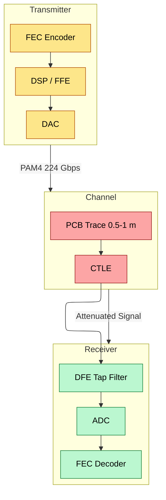
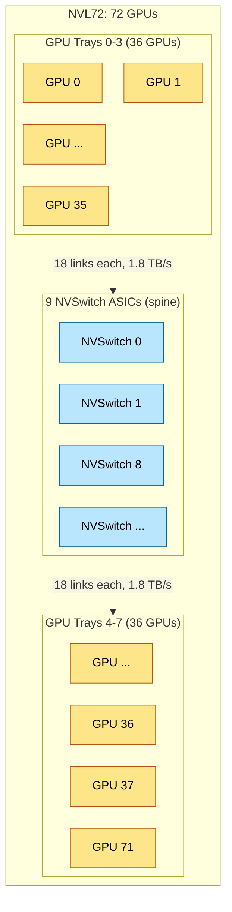
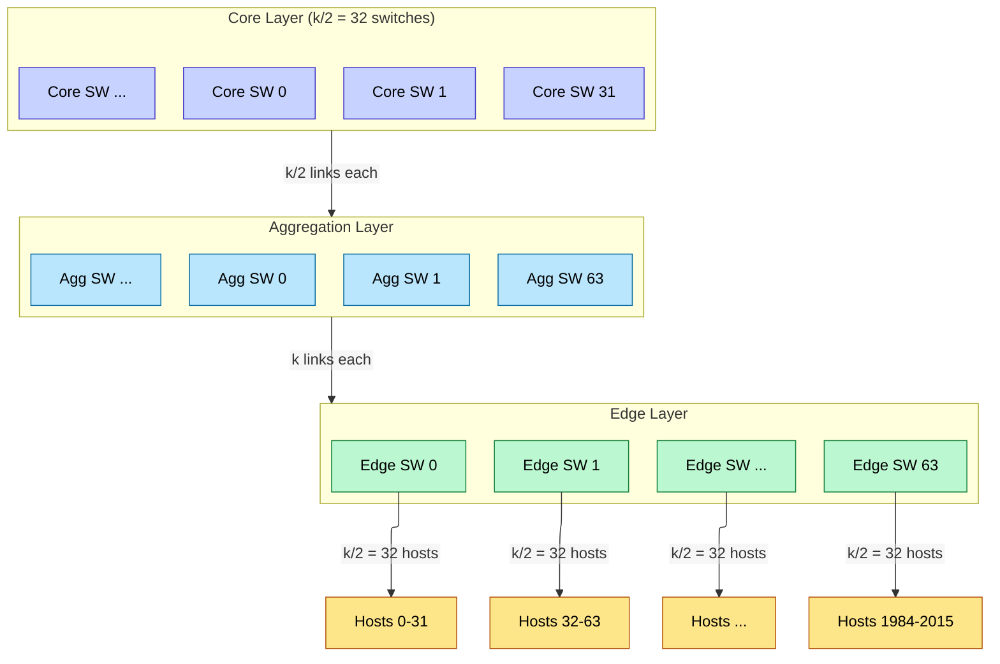
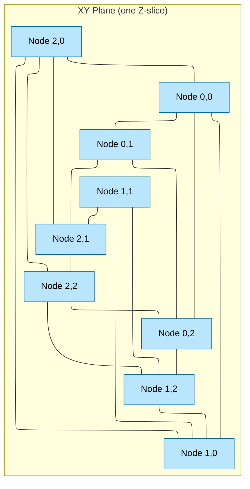
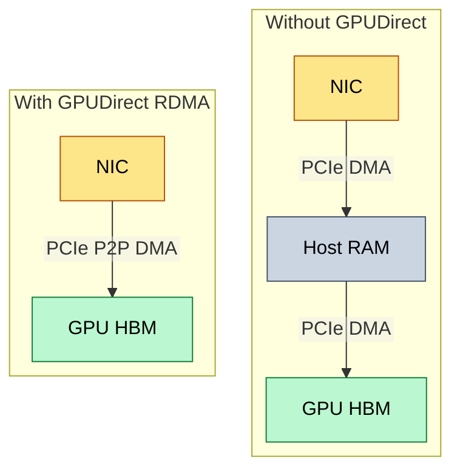
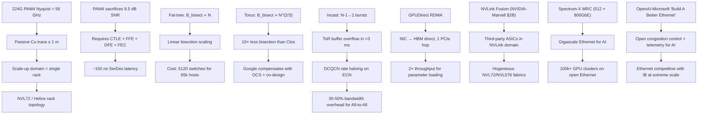

# Networking and Interconnect — From SerDes Physics to Cluster Topology

> **Layer:** L4.
> **Prerequisites:** [GPU_Architecture](../L3_Microarchitecture/GPU_Architecture.md), [Memory_Hierarchy_and_Roofline](../L3_Microarchitecture/Memory_Hierarchy_and_Roofline.md), [Advanced_Packaging](../L1_Packaging_and_Memory/Advanced_Packaging.md).
> **Hands off to:** [Rack_Scale_Design](Rack_Scale_Design.md), [Storage_and_Model_Loading](Storage_and_Model_Loading.md), [Collectives_and_NCCL](../L7_Training_Stack/Collectives_and_NCCL.md).

---

## 0. Why this page exists

Every AI cluster larger than one GPU is limited by the network, not the silicon. A B200 delivers 4.5 PFLOP/s of FP4 compute but only 1.8 TB/s of NVLink bandwidth and 100 GB/s of PCIe bandwidth. The ratio of compute to communication determines whether a training job scales or stalls. This page builds the interconnect stack from the bottom up: the physics of a single SerDes lane, the protocols built on top of it, the topologies that connect thousands of nodes, and the congestion-control algorithms that keep those topologies from collapsing under incast.

The five invariants:

1. **SerDes rate doubles every ~4 years** — 56 Gbps (2020) → 112 Gbps (2023) → 224 Gbps (2025) → 448 Gbps (proj. 2028). Each doubling makes signal integrity harder.
2. **Passive copper trace length is bounded by insertion loss** — at 224 Gbps PAM4, Nyquist is 56 GHz, and FR-4 attenuation ~1 dB/inch limits traces to ~1 m.
3. **Scale-up (NVLink, UALink) is a rack-scale problem** — the copper constraint means these domains cannot span racks without active optics.
4. **Scale-out (Ethernet, InfiniBand) is a congestion problem** — Incast from All-to-All collectives overwhelms switch buffers; DCQCN and packet spraying are the mitigations.
5. **Topology determines bisection bandwidth** — Clos scales linearly with N; torus scales as N^{2/3}; dragonfly is between them with better diameter.

---

## 1. Physical Layer: SerDes and Signaling

### 1.1 NRZ vs PAM4

Non-Return-to-Zero (NRZ, also called PAM2) encodes 1 bit per symbol. PAM4 encodes 2 bits per symbol using four voltage levels. For the same baud rate B, NRZ achieves B bps while PAM4 achieves 2B bps.

The tradeoff is signal-to-noise ratio (SNR). With L voltage levels, the spacing between adjacent levels is:

$$\Delta V = \frac{V_{pp}}{L - 1}$$

For NRZ (L=2): $\Delta V = V_{pp}$. For PAM4 (L=4): $\Delta V = V_{pp}/3$. PAM4 sacrifices 9.5 dB of SNR (a factor of 3 in voltage, $20 \log_{10} 3 \approx 9.5$ dB) to double the data rate.

At 56 GHz Nyquist (224 Gbps PAM4), the channel insertion loss on FR-4 PCB material is approximately:

$$IL(f) \approx \alpha \cdot \ell \cdot \sqrt{f}$$

where $\alpha \approx 0.7$ dB/(inch·GHz$^{1/2}$) for Megtron-6 laminate, $\ell$ is trace length in inches, and $f$ is frequency in GHz. At $f = 56$ GHz:

$$IL(56\,\text{GHz}) \approx 0.7 \cdot \ell \cdot \sqrt{56} \approx 5.24 \cdot \ell \text{ dB}$$

A typical SerDes receiver needs ~25 dB of equalization budget. Subtracting package loss (~5 dB) and connector loss (~2 dB) leaves ~18 dB for the PCB trace, giving:

$$\ell_{max} \approx \frac{18}{5.24} \approx 3.4 \text{ inches} \approx 0.09 \text{ m}$$

With better materials (Megtron-7G, $\alpha \approx 0.4$) and advanced equalization (up to ~35 dB budget), passive copper extends to ~0.5–1.0 m at 224 Gbps — but no further.



### 1.2 SerDes Generation Table

| Generation | Year | Data Rate | Modulation | Nyquist Freq | Max Cu Reach | Standard |
|---|---|---|---|---|---|---|
| PCIe Gen3 | 2012 | 8 GT/s | NRZ | 4 GHz | ~20 m | PCIe 3.0 |
| PCIe Gen4 | 2018 | 16 GT/s | NRZ | 8 GHz | ~5 m | PCIe 4.0 |
| PCIe Gen5 | 2021 | 32 GT/s | NRZ | 16 GHz | ~2 m | PCIe 5.0 |
| PCIe Gen6 | 2023 | 64 GT/s | PAM4 | 16 GHz | ~2 m | PCIe 6.0 |
| NVLink-4 | 2022 | 100 GB/s/link | NRZ | 25 GHz | ~1 m | Proprietary |
| NVLink-5 | 2024 | 200 GB/s/link | PAM4 | 56 GHz | ~1 m | Proprietary |
| UALink 1.0 | 2025 | 200 GB/s/link | PAM4 | 56 GHz | ~1 m | UALink Consortium |
| IB NDR400 | 2025 | 400 Gb/s/port | PAM4 | 56 GHz | ~2 m (active Cu) | InfiniBand |
| PCIe Gen7 (proj.) | 2027 | 128 GT/s | PAM4 | 32 GHz | ~2 m | PCIe 7.0 |
| 448G (proj.) | 2028 | 448 Gb/s | PAM4 | 112 GHz | <0.5 m | OIF CEI-112G |

### 1.3 Equalization: CTLE, FFE, DFE

At 224 Gbps, the received eye is closed. Three stages reopen it:

**Continuous-Time Linear Equalizer (CTLE):** A peaking filter in the receiver that boosts high-frequency components attenuated by the channel. The transfer function approximates:

$$H_{CTLE}(f) = \frac{1 + j \cdot 2\pi f / \omega_z}{1 + j \cdot 2\pi f / \omega_p} \cdot G_{DC}$$

where $\omega_z$ is the zero frequency (typically 2–10 GHz) and $\omega_p$ is the pole. CTLE provides ~10–15 dB of high-frequency boost but amplifies noise proportionally.

**Feed-Forward Equalizer (FFE):** At the transmitter, a multi-tap FIR filter pre-distorts the signal. A 5-tap FFE with coefficients $c_{-2}, c_{-1}, c_0, c_{+1}, c_{+2}$ pre-cancels inter-symbol interference (ISI):

$$y[n] = \sum_{k=-2}^{2} c_k \cdot x[n-k]$$

The main cursor $c_0$ carries most of the energy; pre-cursor taps ($c_{-1}, c_{-2}$) cancel leading ISI, post-cursor taps ($c_{+1}, c_{+2}$) cancel trailing ISI.

**Decision Feedback Equalizer (DFE):** In the receiver, a nonlinear filter that subtracts decided symbols from the incoming signal. A DFE with $N$ taps cancels N post-cursor ISI terms without noise amplification (because it operates on decided bits, not noisy samples):

$$y[n] = r[n] - \sum_{k=1}^{N} d_k \cdot \hat{x}[n-k]$$

where $\hat{x}[n-k]$ are previously decided symbols. DFE error propagation is bounded because PAM4 symbols have large enough spacing and FEC catches any residual errors.

Total equalization budget: CTLE (~12 dB) + FFE (~8 dB) + DFE (~10 dB) = ~30 dB, sufficient for ~1 m Megtron-6 trace at 224 Gbps.

### 1.4 Forward Error Correction (FEC)

PAM4 links require FEC to achieve $<10^{-15}$ post-correction BER. The standard approach is RS(544,514) interleaved with two codewords per 256-bit flit:

- Overhead: $\frac{544 - 514}{544} \approx 5.5\%$
- Coding gain: ~8–9 dB
- Latency: ~80–150 ns (encoding + decoding pipeline)

This is why raw 224 Gbps per lane yields effective ~200 Gbps data rate per direction. The 5.5% overhead accounts for the gap between "224 Gbps raw" and "200 GB/s per link" (along with 128b/130b encoding at the MAC layer).

---

## 2. Protocol Layer: PCIe, CXL, NVLink, UALink

### 2.1 PCIe Hierarchy

PCIe remains the universal host-to-accelerator interconnect. Key math for PCIe Gen5 x16:

$$BW_{PCIe\ Gen5\ x16} = 16 \text{ lanes} \times 32 \text{ GT/s} \times \frac{128}{130} \text{ (encoding)} \times \frac{1}{8} \text{ (bytes)} \approx 63.0 \text{ GB/s}$$

PCIe Gen6 doubles this to ~121 GB/s (x16) using PAM4, but adds FEC latency. For AI workloads, PCIe is used for:

- **Initial model loading**: host RAM → GPU HBM
- **Control plane**: kernel launches, small host-device transfers
- **Fallback path**: when NVLink/UALink is not available

PCIe is **never** the primary training communication path. At 63 GB/s per GPU, an 8-GPU node doing AllReduce would need $\frac{63}{8} \approx 7.9$ GB/s per-GPU contribution — far below the ~400 GB/s needed for TP across 8 GPUs.

### 2.2 CXL (Compute Express Link)

CXL runs on top of PCIe physical layer and adds three protocols:

1. **CXL.io**: equivalent to PCIe I/O (discovery, configuration, interrupts)
2. **CXL.cache**: coherent cache access — allows an accelerator to cache host memory
3. **CXL.mem**: allows the host (or any CXL agent) to access accelerator-attached memory

CXL Type-3 devices (memory expanders) are relevant for AI: they allow a GPU node to address remote CXL-attached DDR5 as if it were local memory. Bandwidth is limited to PCIe Gen5 x16 rates (~63 GB/s), but capacity can reach terabytes — useful for KV cache offload (see [KV_Cache](../L8_Inference_and_Serving/KV_Cache.md)).

CXL 3.0 adds multi-level switching and fabric management, but adoption in AI training clusters remains limited because NVLink and UALink provide much higher bandwidth.

### 2.2b CXL 3.1 and CXL Fabric

CXL 3.0 introduced multi-level switching and peer-to-peer communication between devices. CXL 3.1 extends these capabilities with fabric-level features:

- **CXL Fabric**: enables a pool of memory devices accessible by multiple hosts simultaneously. Unlike point-to-point CXL.mem, a fabric allows N hosts to share M memory devices through a switched CXL fabric topology.
- **Relevance to AI**: disaggregated memory pools for KV cache sharing across inference replicas. A pool of CXL-attached DDR5 can serve as a shared KV cache that multiple GPU nodes read from, avoiding per-node replication. Also enables CPU-offloaded expert storage in MoE serving, where expert weights reside in CXL-attached memory and are fetched on-demand.
- **Memory sharing**: multiple GPUs/CPUs can access the same CXL-attached memory with cache-coherence guaranteed by the CXL.cache protocol. Coherence traffic flows through the CXL fabric switches.
- **Latency**: CXL 3.x over PCIe Gen5 yields ~150–250 ns for memory access (vs ~80 ns for local DDR5, ~300 ns for RDMA). The coherence overhead adds ~50–100 ns relative to direct-attached DDR5.
- **Bandwidth**: CXL x16 Gen5 = 64 GB/s bidirectional, but this bandwidth is shared across all fabric participants accessing the same memory device. With 4 hosts sharing one memory expander, each host gets ~16 GB/s effective.
- **Deployment status**: 2025–2026 early production, primarily for memory pooling in datacenter servers. Not yet a mainstream component of AI training architectures, but relevant for inference-serving memory disaggregation.

### 2.3 NVLink and NVSwitch

NVLink is NVIDIA's proprietary GPU-to-GPU interconnect. NVLink-5 (Blackwell generation) specifications:

- **Per-link bandwidth**: 200 GB/s bidirectional (100 GB/s per direction)
- **Links per GPU**: 18 links on B200/B300
- **Total NVLink BW per GPU**: $18 \times 100 = 1{,}800$ GB/s = 1.8 TB/s bidirectional
- **NVLink protocol**: custom, cache-coherent within NVLink domain



The NVSwitch ASIC is a 144-port crossbar switch, each port at 50 GB/s. Aggregate switching capacity:

$$BW_{NVSwitch} = 144 \times 50 = 7{,}200 \text{ GB/s} = 7.2 \text{ TB/s}$$

With 9 NVSwitch ASICs in NVL72, aggregate switch capacity is $9 \times 7.2 = 64.8$ TB/s per direction, or 129.6 TB/s bidirectional — matching $72 \times 1.8 = 129.6$ TB/s total GPU NVLink bandwidth. This is **strictly non-blocking by design**.

### 2.4 UALink

UALink 1.0 is the industry-standard alternative to NVLink, backed by the Ultra Accelerator Link Consortium (AMD, Broadcom, Google, Intel, Meta, and others). It targets the same rack-scale GPU-to-GPU communication niche as NVLink but with an open protocol, full cache coherence, and a much larger scale-up domain.

#### NVLink-5 vs. UALink 1.0 Comparison

| Feature | NVLink-5 (B200/B300) | UALink 1.0 (AMD MI400+) |
|---------|---------------------|------------------------|
| Bandwidth per link | 200 GB/s per direction | 200 GB/s per direction |
| Max links per GPU | 18 (1.8 TB/s bidirectional) | 14 (planned for 1.0) |
| Max scale domain | 72 (NVL72 via NVSwitch) | 1,024 (planned via UALink switches) |
| Cache coherence | Limited (NVLink-C2C only for GH/GB) | Full memory semantics with cache coherency |
| Atomic operations | Limited to NVLink-C2C | Full set including fetch-and-add, CAS |
| Memory semantics | Load/store with remote direct access | Load/store with coherent caching |
| Multicast | Not supported | Planned for UALink 1.1 |
| Protocol owner | NVIDIA (proprietary) | Ultra Accelerator Link Consortium (open) |
| First silicon | B200 (2024) | MI400 (expected 2026) |
| Switch | NVSwitch (NVIDIA) | UALink switch (Broadcom, Astera) |

UALink's larger scale-up domain (1,024 vs 72) means that tensor parallelism can extend beyond a single rack without traversing the scale-out network. This is critical for AMD's Helios rack, which connects up to 1,024 MI400-class "Altair" GPUs. The **UALoE72** configuration — a 72-GPU UALink domain within a single Helios rack — has been confirmed, directly matching NVIDIA's NVL72 scale.

#### Key Architectural Differences

**Full cache coherence enables disaggregated memory.** UALink's coherence protocol allows any GPU in the 1,024-accelerator domain to cache any remote memory location, with hardware-maintained consistency. This is fundamentally different from NVLink's point-to-point DMA model, where the remote GPU's memory is accessed as a flat address space without local caching. With UALink, a GPU can hold a remote line in its L2 cache and the protocol ensures invalidation on remote writes — the same programming model as a multi-socket CPU system, scaled to 1,024 nodes.

**The 1,024-GPU scale domain targets the NVL576 problem space.** NVIDIA's NVL576 connects 576 GPUs via a three-tier NVSwitch fabric (36 NVSwitch trays). UALink targets 1,024 GPUs using a switch-based topology built from UALink switch ASICs (Broadcom, Astera). The switch-based topology simplifies cabling — each GPU connects to a UALink switch leaf, and switches connect in a fabric — but the bisection bandwidth is strictly worse than a full NVSwitch crossbar. At 1,024 GPUs, a full non-blocking crossbar would require $\binom{1024}{2} \times 200$ GB/s of switching capacity, which is infeasible. UALink switches must over-subscribe, meaning not all GPU pairs get full bandwidth simultaneously.

**Atomic operations over UALink enable fine-grained synchronization.** The full set of atomics — fetch-and-add, compare-and-swap, atomic AND/OR — can be executed on remote memory without moving the entire cache line. This enables distributed synchronization primitives (barrier counters, distributed locks, credit-based flow control) that currently require NCCL over InfiniBand with CPU-mediated atomic operations. For example, a barrier across 1,024 GPUs can be implemented as a shared atomic counter: each GPU increments it via fetch-and-add, and the last GPU to arrive sees the counter reach 1,024 and broadcasts release. Over NVLink, this requires either NCCL (which sends full messages over the interconnect) or NVLink-C2C atomics (limited to Grace-Hopper pairs).

**UALink is the interconnect backbone for the Ultra Ethernet Consortium's accelerated computing fabric.** The two standards are designed to compose: UALink handles scale-up (GPU-to-GPU within the rack), while UEC handles scale-out (rack-to-rack). A typical Helios-class system uses UALink for TP within the 1,024-GPU domain and UEC/RoCE for EP and DP across domains.

### 2.5 Bandwidth-Delay Product (BDP)

The bandwidth-delay product (BDP) is the amount of data that must be "in flight" to fully saturate a network link:

$$\text{BDP} = BW \times \text{latency}$$

For a 400 Gbps (50 GB/s) InfiniBand NDR link with 2 $\mu$s one-way latency:

$$\text{BDP}_{IB} = 50 \text{ GB/s} \times 2\,\mu\text{s} = 100 \text{ KB}$$

This means 100 KB of data must be buffered in the network pipeline (switches, NIC pipelines, link serialization) before the link reaches steady-state utilization. Messages smaller than the BDP cannot saturate the link — latency dominates.

#### Implications for Training Collectives

**Small-message AllReduce cannot saturate InfiniBand.** For gradient AllReduce during training, each gradient chunk must be larger than the BDP to fill the pipe. Consider tensor-parallel (TP) AllReduce over InfiniBand: each GPU sends $\frac{2D^2 L}{P}$ bytes per transformer layer (where $D$ is hidden dimension, $L$ is number of layers, and $P$ is TP degree). For Llama-3-70B with $D = 8192$, $L = 80$, TP $= 8$:

$$\text{AllReduce size} = \frac{2 \times 8192^2 \times 80}{8} = 1{,}342{,}177{,}280 \text{ bytes} \approx 1.34 \text{ GB}$$

Transfer time at 400 Gbps: $T = 1.34 \text{ GB} / 50 \text{ GB/s} = 26.8$ ms. BDP overhead: $100 \text{ KB} / 1.34 \text{ GB} \approx 0.007\%$ — negligible. The link is fully utilized.

But for a smaller model (8B, $D = 4096$, $L = 32$, TP $= 8$):

$$\text{AllReduce size} = \frac{2 \times 4096^2 \times 32}{8} \approx 134 \text{ MB}$$

BDP overhead: $100 \text{ KB} / 134 \text{ MB} \approx 0.075\%$ — still small, but the gradient chunks per layer (before ring fusion) are $\sim$8 MB each, and BDP overhead per chunk is $\sim$1.2%. This is why NCCL fuses small gradient buffers before transmitting.

#### RDMA Small-Message Optimization

RoCE v2 with DCQCN uses packet pacing and ECN marking for congestion control. For messages smaller than the BDP, inline RDMA writes eliminate the overhead of a separate data transfer. In a standard RDMA write, the sender posts a Work Queue Element (WQE) describing the data location, then the NIC DMAs the payload from host memory. With inline writes, the data is embedded directly in the WQE:

- **Standard RDMA write**: 2 $\mu$s latency (WQE processing + DMA read + network + DMA write).
- **Inline RDMA write**: $\sim$0.8 $\mu$s latency (WQE contains data, no separate DMA read needed).

Inline writes are limited to $\sim$64 bytes (the WQE size), so they only help for control messages and synchronization — but those are exactly the messages where BDP overhead is worst.

#### NVLink BDP

NVLink-5 at 1.8 TB/s bidirectional with $\sim$1 $\mu$s latency across NVSwitch:

$$\text{BDP}_{NVLink} = 1{,}800 \text{ GB/s} \times 1\,\mu\text{s} = 1.8 \text{ MB}$$

Even small AllReduce chunks (8 MB for an 8B model layer) fill the pipe easily — the chunk is 4.4× the BDP. This is another reason tensor parallelism stays within the NVLink domain: the BDP-to-message ratio is far more favorable than over InfiniBand, and there is no congestion-control overhead to compound the problem.

### 2.6 InfiniBand

InfiniBand remains the dominant scale-out fabric for NVIDIA-based training clusters:

| Generation | Data Rate | Ports | Typical ToR |
|---|---|---|---|
| HDR | 200 Gb/s (2× 100G) | 40 ports | Quantum |
| NDR | 400 Gb/s | 64 ports | Quantum-2 |
| NDR400 | 400 Gb/s (8× 50G SerDes) | 64 ports | Quantum-2 X |
| XDR (proj. 2026) | 800 Gb/s | 64 ports | Quantum-3 |

InfiniBand features:
- **Lossless fabric**: credit-based flow control (no PFC needed)
- **Native RDMA**: verbs API, zero-copy kernel bypass
- **Adaptive routing**: packets can take different paths (packet spraying)
- **SHARP**: in-network reduction for AllReduce (offloads compute to switches)

An NDR switch provides $64 \times 400$ Gb/s $= 25.6$ Tb/s $= 3.2$ TB/s bidirectional switching capacity. A two-tier fat-tree of NDR switches supports $64^2 / 2 = 2{,}048$ endpoints.

### 2.7 InfiniBand XDR Architecture

XDR (Extended Data Rate) is the next InfiniBand generation, doubling NDR's per-port bandwidth:

- **Data rate**: 800 Gb/s per port (100 GB/s), doubling NDR's 400 Gb/s.
- **Signaling**: 100 Gbaud PAM4 per lane, 4 lanes per port. Compare NDR's 4 lanes at 50 Gbaud with NRZ-like PAM4 signaling. The move to 100 Gbaud PAM4 per lane is the key enabling technology.
- **Switch**: NVIDIA Quantum-X800 switch ASIC with 144 XDR ports, providing ~115.2 Tbps aggregate bandwidth ($144 \times 800$ Gb/s). This is ~4.5× the NDR Quantum-2's 25.6 Tbps.
- **Cable reach**:
  - DAC (Direct Attach Copper): ~2 m (limited by insertion loss at 100 Gbaud)
  - AOC (Active Optical Cable): ~100 m
  - Transceiver (pluggable optics): ~2–10 km
- **Relevance to AI**: doubles inter-node bandwidth for distributed training. For tensor parallelism across nodes, AllReduce time is communication-bound; doubling the link rate halves the AllReduce time for bandwidth-limited message sizes. This is particularly impactful for TP across nodes where the activation gradient exchange dominates the critical path.
- **Timeline**: 2025–2026 production deployment in NVIDIA reference architectures (GB300 / NVL72+ clusters).

### 2.8 RoCE v2 (RDMA over Converged Ethernet)

RoCE v2 encapsulates RDMA transport in UDP/IP, allowing RDMA over standard Ethernet switches. This is cheaper than InfiniBand but requires careful configuration for losslessness:

- **Priority Flow Control (PFC)**: pause frames at the link level. If a switch buffer exceeds a threshold, it sends a PAUSE frame upstream. This is the mechanism that creates the "lossless" Ethernet fabric.
- **ECN (Explicit Congestion Notification)**: switches mark packets when queue depth exceeds $K_{min}$. The receiver echoes the mark back as a CNP (Congestion Notification Packet).
- **DCQCN**: the rate-control algorithm running on the sender, described in detail in Section 4.

RoCE v2 bandwidth depends on the Ethernet PHY:

| Ethernet Gen | Per-Port BW | Typical ToR Ports |
|---|---|---|
| 400GbE | 400 Gb/s | 32–48 |
| 800GbE | 800 Gb/s | 32–64 |
| 1.6TbE (proj. 2027) | 1.6 Tb/s | 32–64 |

AWS EFAv3 uses SRD (Scalable Reliable Datagram) instead of RoCE v2. SRD is an AWS-proprietary transport that does path spraying at the NIC level and handles retransmission in hardware, avoiding the PFC/DCQCN complexity entirely.

---

## 3. Network Topologies

### 3.1 Fat-Tree (Clos)

A $k$-ary fat-tree is built from $k$-port switches arranged in three layers (core, aggregation, edge). For a $k$-ary fat-tree:

- **Number of hosts**: $N = k^3 / 4$
- **Number of switches**: $\frac{5k^2}{4}$
- **Bisection bandwidth**: $\frac{N \cdot b}{2}$ (full bisection for non-blocking variant), where $b$ is link bandwidth
- **Diameter**: $2 \log_k N$ (constant at 6 for typical deployments)

For NDR with $k = 64$: $N = 64^3 / 4 = 65{,}536$ hosts. This is the canonical 65k-GPU cluster topology.



**Cost analysis**: A 65k-host fat-tree needs $\frac{5 \times 64^2}{4} = 5{,}120$ NDR switches. At ~$30k per switch, the network alone costs ~$150M — comparable to the GPU cost. This is why network cost is 30–50% of total cluster capex.

### 3.2 Dragonfly

Dragonfly is a direct-connect topology that reduces diameter to 3 hops at the cost of lower bisection bandwidth per dollar.

A dragonfly has three levels of connectivity:
1. **Intra-group**: fully connected within a group of $p$ routers (a virtual switch)
2. **Inter-group**: each group connects to every other group via $h$ global links
3. **Optical**: global links use AOC (Active Optical Cable) or transceivers

Parameters: $p$ routers per group, $h$ global links per router, $a = p - 1$ intra-group links per router. Number of groups:

$$G = 1 + p \cdot h$$

Total endpoints: $N = G \cdot p = p(1 + ph)$.

**Diameter**: exactly 3 hops (intra-group → global → intra-group). This is the key advantage — latency is deterministic and bounded regardless of cluster size.

**Bisection bandwidth**:

$$B_{bisect}^{dragonfly} \approx \frac{G^2 \cdot h \cdot b}{4}$$

where $b$ is per-link bandwidth. For typical parameters ($p = 32, h = 8$): $G = 257$ groups, $N = 8{,}224$ endpoints. Bisection bandwidth is ~$132k \cdot b$, vs fat-tree's ~$4{,}112 \cdot b$ — dragonfly has ~32× more bisection BW because of its dense global connectivity.

The cost is cabling complexity: $G^2 / 2$ global links, each an AOC. For 257 groups: ~33k AOCs.

### 3.3 Dragonfly+

Dragonfly+ (used in some large deployments) uses a fat-tree within each group and dragonfly between groups. This combines the good properties:

- **Within group**: fat-tree gives full bisection, simple routing
- **Between groups**: dragonfly gives diameter-3 connectivity
- **Scalability**: each group can be a 2-tier fat-tree of $k$-port switches ($k^2/2$ hosts), with $G$ groups connected dragonfly-style

### 3.4 3D Torus (Google TPU)

Google's Inter-Core Interconnect (ICI) arranges TPU chips in a 3D torus. For an $X \times Y \times Z$ torus:

- **Links per node**: 6 (±X, ±Y, ±Z)
- **Number of nodes**: $N = X \cdot Y \cdot Z$
- **Diameter**: $D = \lfloor X/2 \rfloor + \lfloor Y/2 \rfloor + \lfloor Z/2 \rfloor$
- **Average hop count**: $H \approx \frac{X + Y + Z}{4}$
- **Bisection bandwidth**:

$$B_{bisect}^{torus} \approx 2 \cdot b \cdot (XY + XZ + YZ) \approx 2 \cdot b \cdot N^{2/3}$$

(for a cube $X = Y = Z = N^{1/3}$, bisection is along one cut plane: $6 \cdot N^{2/3} \cdot b$ total with 3 cuts, but only one plane at a time for any given cut).



**Comparison with Clos**: At $N = 8{,}960$ (TPU v5p pod), a Clos would give $B_{bisect} \propto N \cdot b = 8{,}960 b$. A 3D torus gives $\sim 2 \cdot b \cdot 8960^{2/3} \approx 2 \cdot b \cdot 432 \approx 864 b$. The torus has ~10× less bisection bandwidth. Google compensates with:

1. **Optical Circuit Switching (OCS)**: reconfigurable mirrors dynamically rewire torus links
2. **Model parallelism co-design**: Megatron-style TP/PP mapped to torus topology
3. **Sparse attention**: reduces All-to-All communication volume

### 3.5 Topology Comparison Table

| Property | Fat-Tree (Clos) | Dragonfly | Dragonfly+ | 3D Torus |
|---|---|---|---|---|
| Diameter | $2 \log_k N$ | 3 | ~5 | $\sim N^{1/3}/2$ |
| Bisection BW | $\frac{N \cdot b}{2}$ | $\sim \frac{G^2 h b}{4}$ | Between fat-tree and dragonfly | $\sim 2 b N^{2/3}$ |
| Switch count | $\frac{5k^2}{4}$ | $G \cdot p$ | Hybrid | 0 (direct-connect) |
| Cabling | Structured, uniform | Dense AOC between groups | Moderate | Structured, local |
| Routing | ECMP (multipath) | Minimal + VAL | Hybrid | DOR |
| Congestion risk | Incast at ToR | Global link hotspots | Moderate | Cut-plane hotspots |
| Scale limit | ~65k (k=64 NDR) | ~100k+ | ~100k+ | Limited by torus dim |

---

## 4. Congestion Control: DCQCN Deep Dive

### 4.1 The Incast Problem

In distributed training, the most communication-intensive collective is All-to-All (used in MoE expert parallelism and sequence parallelism). In an All-to-All of $N$ nodes, every node sends a message to every other node simultaneously. At the receiving ToR switch:

$$BW_{incast} = (N - 1) \cdot r_{sender}$$

where $r_{sender}$ is each sender's transmission rate. For $N = 64$ nodes each sending at 50 GB/s: $BW_{incast} = 63 \times 50 = 3{,}150$ GB/s $= 25.2$ Tb/s. A single NDR ToR switch has 51.2 Tb/s switching capacity — enough in theory, but the problem is **buffer occupancy**. Shared buffer SRAM in a typical ToR is 32–128 MB. At 400 Gb/s, 128 MB fills in:

$$T_{fill} = \frac{128 \text{ MB}}{50 \text{ GB/s}} = 2.56 \text{ ms}$$

Without congestion control, a single incast burst can overflow the buffer in under 3 ms, causing packet loss and retransmission.

### 4.2 DCQCN Derivation

DCQCN (Data Center Quantized Congestion Notification) operates in three phases:

**Phase 1: Switch marks ECN.** When queue depth $Q$ at an egress port exceeds threshold $K_{min}$, the switch probabilistically marks the IP ECN field:

$$P_{mark} = \begin{cases} 0 & Q < K_{min} \\ \frac{Q - K_{min}}{K_{max} - K_{min}} & K_{min} \le Q \le K_{max} \\ 1 & Q > K_{max} \end{cases}$$

Typical values: $K_{min} = 150$ KB, $K_{max} = 900$ KB, $K_{drop} = 3$ MB.

**Phase 2: Receiver generates CNP.** The receiving NIC detects the ECN mark and sends a Congestion Notification Packet (CNP) back to the sender. CNPs are rate-limited to one per flow per ~50 μs to prevent CNP floods.

**Phase 3: Sender rate update.** The sender maintains:

- Current rate $R_c$
- Target rate $R_t$
- ECN fraction $\alpha$ (exponentially weighted moving average)

On CNP arrival ($F = 1$):

$$\alpha \leftarrow (1 - g) \cdot \alpha + g \cdot 1$$

On no CNP in a timer period ($F = 0$):

$$\alpha \leftarrow (1 - g) \cdot \alpha + g \cdot 0$$

where $g \approx 1/256$ is the smoothing gain.

The rate update rule:

$$R_c \leftarrow R_c \left(1 - \frac{\alpha}{2}\right) \quad \text{(on CNP)}$$

$$R_t \leftarrow R_c \quad \text{(save current rate as target)}$$

On no CNP for a timer period, the sender probes for bandwidth:

$$R_c \leftarrow R_c + \frac{R_t - R_c}{R_{increase}}$$

where $R_{increase}$ controls the recovery speed. After $T_{timer}$ consecutive periods without CNP:

$$R_c \leftarrow R_t$$

This creates a classic additive-increase / multiplicative-decrease (AIMD) behavior:
- **Decrease**: $R_c \leftarrow R_c (1 - \alpha/2)$. With $\alpha = 1$ (every packet marked): $R_c \leftarrow R_c / 2$ (halving).
- **Increase**: linear recovery toward $R_t$ over multiple timer periods.

**Steady-state convergence**: With $N$ senders sharing a bottleneck link of capacity $C$, each sender converges to approximately $C/N$ in RTT $\cdot \log_2 N$ time. For $N = 64$ and RTT = 10 μs: convergence in ~60 μs.

### 4.3 Ultra Ethernet and Packet Spraying

The Ultra Ethernet Consortium (UEC) specification (targeting 2026 deployment) addresses DCQCN's limitations:

1. **Packet spraying**: instead of hashing flows to a single path (ECMP), spray packets across all available paths. This eliminates the "elephant flow" problem where a single large flow saturates one ECMP path while others are idle.
2. **Selective retransmission**: only lost packets are retransmitted (not the entire message), reducing waste.
3. **No PFC**: UEC targets PFC-free operation by combining spraying with large switch buffers and intelligent AQM (Active Queue Management).
4. **In-network telemetry**: INT headers carry real-time queue depth and latency information, allowing senders to make informed rate decisions.

The key mathematical benefit of spraying: with $K$ equal-cost paths, the maximum utilization of any single path under spraying is $1/K + O(\sqrt{\log K / K})$ by Chernoff bound, vs $1$ under ECMP (one path gets the entire elephant flow).

### 4.4 Recent Industry Partnerships and Initiatives (2026)

**NVIDIA-Marvell NVLink Fusion ($2B partnership, March 31, 2026):** NVIDIA and Marvell announced a $2B partnership to develop custom NVLink Fusion silicon. NVLink Fusion extends NVLink technology beyond NVIDIA's own GPUs, allowing third-party accelerators (custom ASICs, NPUs) to participate in NVLink coherent domains. This opens NVL72/NVL576 topologies to heterogeneous accelerator combinations — e.g., NVIDIA GPUs + Marvell-custom AI accelerators in the same NVLink fabric.

**NVIDIA Spectrum-X with MRC (May 6, 2026):** NVIDIA announced Spectrum-X Ethernet switches with MRC (Massive Radix Connectivity), targeting gigascale AI Ethernet networks. Spectrum-X with MRC provides:
- Up to 512 ports of 800GbE per switch — 10× the radix of traditional Ethernet ToR switches
- Purpose-built for AI training workloads with adaptive routing and congestion-aware scheduling
- Targets clusters of 100,000+ GPUs where Ethernet economics beat InfiniBand at extreme scale

**OpenAI-Microsoft "Build A Better Ethernet" Initiative (May 12, 2026):** OpenAI and Microsoft jointly announced an initiative to develop open Ethernet standards optimized for AI training. Goals include:
- Standardized congestion control profiles for All-to-All collectives at scale
- Open telemetry (INT) specifications for real-time network-aware training schedulers
- Target: make Ethernet competitive with InfiniBand for training at 100k+ GPU scale, using open standards instead of proprietary fabrics

---

## 5. GPUDirect RDMA and Storage

### 5.1 GPUDirect RDMA

GPUDirect RDMA allows a NIC to DMA directly into GPU HBM without staging through host memory. The data path comparison:

**Without GPUDirect**: NIC → Host RAM (DMA) → GPU HBM (PCIe DMA). Two PCIe traversals, CPU involvement for buffer management.

**With GPUDirect**: NIC → GPU HBM (PCIe peer-to-peer DMA). One PCIe traversal, no CPU involvement.



Bandwidth improvement: eliminating one PCIe traversal saves ~100 ns of latency and doubles effective throughput (from ~31.5 GB/s to ~63 GB/s for a single PCIe Gen5 x16 path).

### 5.2 GPUDirect Storage (GDS)

GDS extends GPUDirect to NVMe drives, enabling direct DMA from NVMe to GPU HBM:

$$BW_{GDS} = \min(BW_{NVMe}, BW_{PCIe}) = \min(7{,}000 \text{ MB/s}, 63{,}000 \text{ MB/s}) \approx 7 \text{ GB/s per NVMe drive}$$

With 8 NVMe drives per node: ~56 GB/s aggregate. A 70B model in FP16 (~140 GB) loads in:

$$T_{load}^{GDS} = \frac{140 \text{ GB}}{56 \text{ GB/s}} \approx 2.5 \text{ s}$$

Without GDS (staged through host RAM): ~5 s due to the extra copy and CPU overhead.

### 5.3 NVLink Peer-to-Peer

Within an NVL72 rack, GPUs can DMA directly into each other's HBM via NVSwitch, without host involvement. NVLink P2P bandwidth: 1.8 TB/s per GPU. A 70B model in FP16 distributed across 72 GPUs (~1.9 GB per GPU) can be loaded from a peer in:

$$T_{P2P} = \frac{1.9 \text{ GB}}{1{,}800 \text{ GB/s}} \approx 1.1 \text{ ms}$$

This is the mechanism that enables disaggregated serving architectures (see [Disaggregated_Serving_2025](../L8_Inference_and_Serving/Disaggregated_Serving_2025.md)).

---

## 5b. RDMA Programming for AI

### 5b.1 What RDMA is

**Remote Direct Memory Access (RDMA)** allows one machine to directly read or write memory on another machine without involving the remote CPU or operating system kernel. The key benefit: zero-copy, kernel-bypass transfers with latencies of 1-2 $\mu$s intra-rack (vs. ~50-100 $\mu$s for TCP/IP with kernel involvement).

### 5b.2 RDMA APIs

Two primary APIs are used in AI infrastructure:

| API | Full name | Use case | Provider |
|---|---|---|---|
| **libibverbs / librdmacm** | InfiniBand Verbs / RDMA CM | Direct InfiniBand programming | Mellanox/NVIDIA OFED |
| **libfabric (OFI)** | OpenFabrics Interface | Provider-agnostic RDMA | OpenFabrics Alliance |

`libibverbs` provides the lowest-level access to InfiniBand hardware. `libfabric` abstracts over InfiniBand, RoCE, and other transports, making it the preferred API for portable RDMA code.

### 5b.3 Core RDMA operations

| Operation | Type | Description | Remote CPU involvement |
|---|---|---|---|
| **RDMA Read** | One-sided | Read from remote memory | None |
| **RDMA Write** | One-sided | Write to remote memory | None |
| **Send / Recv** | Two-sided | Message passing | Remote must post receive buffer |
| **Atomic (CAS, FetchAdd)** | One-sided | Atomic compare-and-swap or fetch-and-add | None |

One-sided operations (Read, Write, Atomic) are the key advantage of RDMA: the remote CPU is never interrupted. The remote NIC DMA's directly to/from pre-registered memory.

### 5b.4 How NCCL uses RDMA

NCCL (NVIDIA Collective Communications Library) uses RDMA extensively for distributed training:

**AllReduce via RDMA Write (push-based):** Each rank writes its chunk of data to the next rank's pre-allocated memory buffer via RDMA Write. In Ring AllReduce, rank $i$ writes its segment to rank $(i+1) \mod N$'s memory, then rank $i+1$ reduces and forwards.

**AllReduce via RDMA Read (pull-based):** Each rank reads the required data from other ranks' buffers via RDMA Read. NCCL selects between push and pull based on the operation and topology.

The flow for Ring AllReduce with $N$ ranks:
1. Each rank registers its reduction buffer via RDMA memory registration.
2. Rank $i$ performs RDMA Write of its data chunk to rank $(i+1) \mod N$'s buffer.
3. Rank $(i+1) \mod N$ reads the incoming data, performs local reduction, and writes the result to the next rank.
4. This repeats for $2(N-1)$ steps (scatter-reduce + allgather).

### 5b.5 Memory registration

RDMA requires **pinning** (registering) memory regions before any transfer can occur. Registered memory is locked in physical RAM and cannot be swapped to disk.

```c
// Memory registration with libibverbs
struct ibv_mr *mr = ibv_reg_mr(
    pd,                    // protection domain
    buffer,                // host memory pointer
    buffer_size,           // size in bytes
    IBV_ACCESS_LOCAL_WRITE | IBV_ACCESS_REMOTE_WRITE | IBV_ACCESS_REMOTE_READ
);
// mr->rkey is the remote key shared with other nodes
// mr->lkey is the local key used for local operations
```

Overhead: approximately ~1 ms per registration for large buffers (hundreds of MB). This is a one-time cost per buffer, but it means RDMA is not suitable for ad-hoc memory regions — buffers are typically registered once at startup and reused.

Limitations of memory registration:
- Registered memory cannot be paged out (it is physically pinned).
- There is a limit on the number of registrations per NIC (typically thousands).
- GPUs with GPUDirect RDMA can register GPU memory directly (see Section 5.1).

### 5b.6 Queue Pairs (QPs)

Each RDMA connection requires a **Queue Pair (QP)**, consisting of a Send Queue and a Receive Queue. Work requests are posted to QPs, and completions are reaped from Completion Queues (CQs).

NCCL creates approximately 1 QP per GPU pair for communication. On an 8-GPU node with all-to-all connectivity:

$$\text{QPs per node} = 8 \times 7 = 56 \text{ (one QP per ordered GPU pair)}$$

For a cluster of 256 nodes with 8 GPUs each:
- Intra-node: NVLink (no RDMA QPs needed).
- Inter-node: each GPU needs ~1 QP to each remote GPU it communicates with.

### 5b.7 Key performance numbers

| Metric | InfiniBand NDR | RoCE v2 (400GbE) |
|---|---|---|
| RDMA latency (intra-rack) | 1-2 $\mu$s | 2-5 $\mu$s |
| RDMA latency (inter-rack) | 5-10 $\mu$s | 10-20 $\mu$s |
| Bandwidth per link | ~50 GB/s (400 Gb/s NDR) | ~50 GB/s (400 Gb/s) |
| Effective bandwidth (after protocol overhead) | ~45 GB/s | ~40 GB/s |

In AI training, the critical metric is **AllReduce latency for typical tensor sizes**. For a 1 GB AllReduce across 64 GPUs on NDR: theoretical minimum is ~20 $\mu$s (limited by bandwidth and ring steps); in practice, NCCL achieves ~50-100 $\mu$s including software overhead.

### 5b.8 GPUDirect RDMA

GPUDirect RDMA (covered in Section 5.1 from the hardware perspective) enables GPU memory to be registered directly for RDMA operations:

```c
// Register GPU memory for RDMA (via GPUDirect)
cudaMalloc(&d_buf, size);
// Get the buffer's BAR address for RDMA registration
unsigned long long bar_addr = get_gpu_bar_addr(d_buf);
struct ibv_mr *mr = ibv_reg_mr(pd, (void*)bar_addr, size, access_flags);
```

Without GPUDirect RDMA, inter-node GPU communication follows:
$$\text{GPU HBM} \xrightarrow{\text{PCIe}} \text{Host RAM} \xrightarrow{\text{RDMA}} \text{Host RAM (remote)} \xrightarrow{\text{PCIe}} \text{GPU HBM (remote)}$$

With GPUDirect RDMA:
$$\text{GPU HBM} \xrightarrow{\text{PCIe P2P + RDMA}} \text{GPU HBM (remote)}$$

Benefits: reduces latency by ~30-50% and avoids the CPU memcpy overhead. The host CPU is completely uninvolved in the data path, freeing it for other work.

---

## 5c. SHARP In-Network AllReduce — the switch-ASIC view

**SHARP (Scalable Hierarchical Aggregation and Reduction Protocol)** offloads AllReduce computation from GPU endpoints into the switch silicon. The hardware picture:

- **Reduction engine in the switch ASIC**: SHARP-capable switches (NVIDIA Quantum-2/Quantum-XR InfiniBand; NVLink Switch for NVLink SHARP) contain dedicated ALUs that perform element-wise sum/max/min on packets in flight, forwarding only the reduced result.
- **Traffic reduction**: each rank sends its buffer once up the tree and receives the result once — the switch absorbs the $N$-way combining, so wire traffic per rank drops from $2D(N{-}1)/N$ (ring) to $2D/N$ per link-level view, and the reduction latency no longer scales with rank count.
- **Fixed-function precision**: the ASIC reduces in a fixed set of datatypes (FP32/FP16/BF16; sum/max/min only) — custom operators or exotic formats fall back to endpoint reduction.
- **Topology constraint**: the aggregation tree must be embedded in the physical switch hierarchy; deep fat-trees need multi-level SHARP, and per-switch aggregation-group resources are finite (a shared, schedulable resource across jobs).

> Algorithm-level treatment — SHARP vs ring/tree AllReduce math, message-size speedup profile (~2x large-message), NCCL integration and `NCCL_SHARP_*` tuning, and when MoE All-to-All defeats it — lives in [Collectives_and_NCCL](../L7_Training_Stack/Collectives_and_NCCL.md) §6.

---

## 6. End-to-end Cause / Effect



---

## 7. Numbers to memorize

| Quantity | Value | Why it matters |
|---|---|---|
| PCIe Gen5 x16 bandwidth | 63 GB/s (unidirectional) | Host↔GPU data path; model loading bottleneck |
| NVLink-5 per-GPU BW | 1.8 TB/s bidirectional | 28.6× PCIe; enables TP within rack |
| NVSwitch radix | 144 ports × 50 GB/s = 7.2 TB/s | Non-blocking crossbar for NVL72 |
| NVL72 aggregate NVLink BW | 129.6 TB/s | 72 × 1.8 TB/s = 9 NVSwitch × 14.4 TB/s |
| 224G PAM4 Nyquist | 56 GHz | Sets insertion loss budget; limits Cu trace to ~1 m |
| PAM4 SNR penalty vs NRZ | 9.5 dB | Requires FEC (RS-544) + CTLE/DFE equalization |
| FEC overhead | 5.5% (RS-544,514) | Gap between 224 Gbps raw and 200 GB/s data |
| InfiniBand NDR per-port | 400 Gb/s | Scale-out fabric per-GPU link |
| NDR 64-port switch capacity | 51.2 Tb/s | ToR building block for fat-tree |
| Fat-tree k=64 host count | 65,536 | Canonical 65k-GPU cluster |
| Fat-tree switch count (k=64) | 5,120 | Network capex ~30-50% of total |
| Dragonfly diameter | 3 hops always | Deterministic latency regardless of scale |
| 3D Torus bisection BW | ∝ 2bN^{2/3} | 10× less than Clos at N=8960 |
| DCQCN rate decrease factor | R_c(1 − α/2), α=1 → halving | Recovery takes RTT·log₂N |
| ToR shared buffer | 32–128 MB SRAM | Overflows in ~2.5 ms under incast |
| GPUDirect bandwidth gain | 2× (1 PCIe hop vs 2) | Eliminates host RAM staging |
| GDS per-NVMe throughput | ~7 GB/s | 8 drives → 56 GB/s → 140 GB model in 2.5 s |
| UALink 1.0 scale-up domain | Up to 1,024 accelerators | 14× larger than NVL72's 72 |

---

## 8. References

**Foundational**
- InfiniBand Trade Association, *InfiniBand Architecture Specification*, 2024.
- PCI-SIG, *PCI Express Base Specification 6.0*, 2023.
- UALink Consortium, *UALink 1.0 Specification*, 2025.
- J. Kim, W. J. Dally, et al., "Technology-Driven, Highly-Scalable Dragonfly Topology," *ISCA 2008*.
- M. Alizadeh, et al., "CONGA: Distributed Congestion-Aware Load Balancing for Datacenters," *SIGCOMM 2014*.
- Y. Zhu, et al., "Congestion Control for Large-Scale RDMA Deployments," *SIGCOMM 2015* (DCQCN paper).

**Recent**
- Ultra Ethernet Consortium, *UEC Transport Specification v1.0*, 2025.
- NVIDIA, *NVLink and NVSwitch Architecture White Paper*, 2024.
- Broadcom, *Memory Fabric Architecture for AI*, Hot Chips 2025.
- Google, "TPU v5p System Architecture," *ISCA 2025*.

**Cross-references**
- [Advanced_Packaging](../L1_Packaging_and_Memory/Advanced_Packaging.md) — die-to-die interconnect (NV-HBI) at package level.
- [Blackwell_Architecture](../L3_Microarchitecture/Blackwell_Architecture.md) — NVLink-5 per-GPU implementation.
- [Google_TPU](../L3_Microarchitecture/Google_TPU.md) — ICI and OCS architecture.
- [Rack_Scale_Design](Rack_Scale_Design.md) — how these topologies become physical racks.
- [Collectives_and_NCCL](../L7_Training_Stack/Collectives_and_NCCL.md) — how AllReduce maps to these topologies.

---

**Up the stack:** [Rack_Scale_Design](Rack_Scale_Design.md), [Storage_and_Model_Loading](Storage_and_Model_Loading.md), [Collectives_and_NCCL](../L7_Training_Stack/Collectives_and_NCCL.md).
**Down the stack:** [GPU_Architecture](../L3_Microarchitecture/GPU_Architecture.md), [Advanced_Packaging](../L1_Packaging_and_Memory/Advanced_Packaging.md), [Silicon_For_AI](../L0_Silicon_and_Process/Silicon_For_AI.md).
