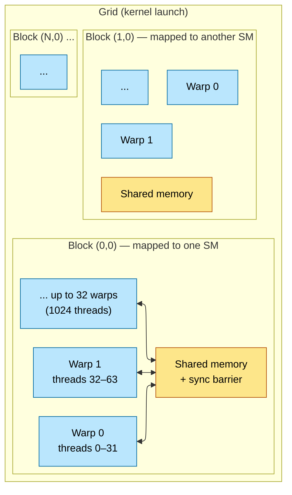
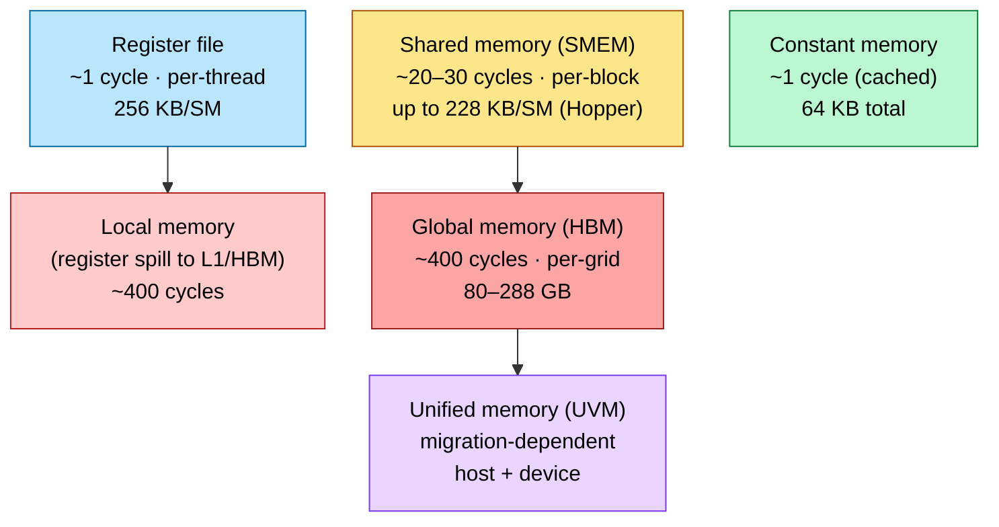
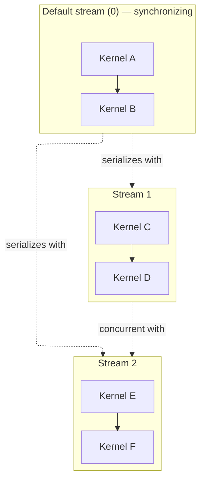
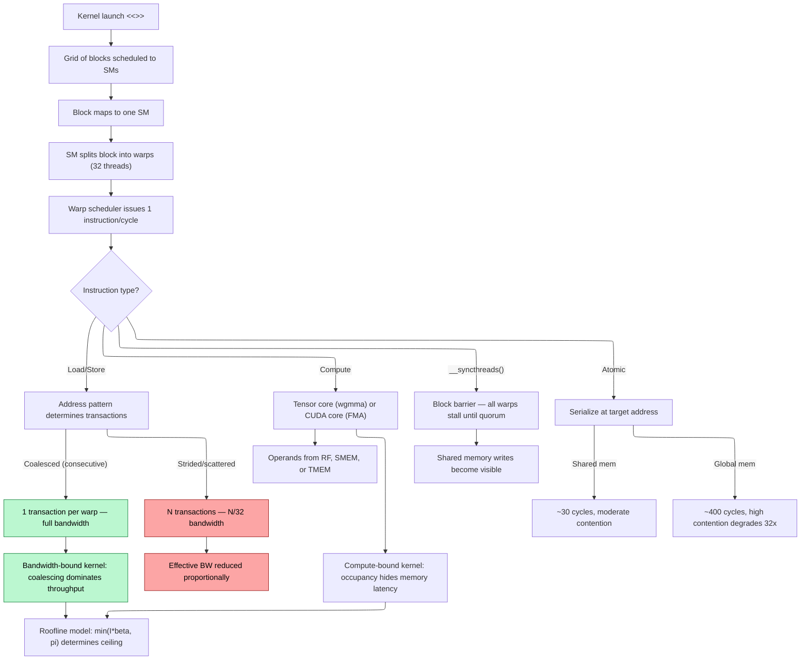

# CUDA Programming — The GPU Kernel Model

> **Layer:** L5.
> **Prerequisites:** [GPU_Architecture](../L3_Microarchitecture/02_GPU_Architecture.md), [Memory_Hierarchy_and_Roofline](../L3_Microarchitecture/03_Memory_Hierarchy_and_Roofline.md).
> **Hands off to:** [CUDA_Optimization](02_CUDA_Optimization.md), [Triton_and_Kernels](04_Triton_and_Kernels.md), [FlashAttention_Deep_Dive](05_FlashAttention_Deep_Dive.md).

---

## 0. The programming model in one paragraph

CUDA maps a C/C++ function onto a hierarchy of threads (grid $\to$ cluster $\to$ block $\to$ warp $\to$ thread) that mirrors the physical GPU hierarchy (device $\to$ GPC $\to$ SM $\to$ warp scheduler $\to$ lane). Every optimization in [CUDA_Optimization](02_CUDA_Optimization.md) and every algorithm in [FlashAttention_Deep_Dive](05_FlashAttention_Deep_Dive.md) derives from understanding how this mapping works: which memory space a pointer lives in, how a warp's 32 lanes map to memory transactions, and where synchronization barriers must be placed to enforce ordering. This page is the reference for that programming model — thread hierarchy, memory spaces, launch configuration, synchronization primitives, threadblock clusters and distributed shared memory (SM90+), memory access patterns, atomic operations, streams and events, and a complete tiled matmul kernel. It assumes fluency with the hardware in [GPU_Architecture](../L3_Microarchitecture/02_GPU_Architecture.md) and the roofline model in [Memory_Hierarchy_and_Roofline](../L3_Microarchitecture/03_Memory_Hierarchy_and_Roofline.md).

---

## 1. The Thread Hierarchy

### 1.1 Grid, block, warp, thread



- **Grid** — the totality of all blocks launched by a single `<<<grid, block>>>` invocation. Up to $2^{31}-1$ blocks in the x-dimension, $65535$ in y and z.
- **Block (thread block)** — a group of up to 1024 threads mapped entirely to one SM. Threads within a block share the SM's shared memory (SMEM) and can synchronize via `__syncthreads()`. Blocks are independent: no cross-block synchronization within a kernel (without cooperative groups).
- **Cluster (SM90+)** — a group of 1–8 threadblocks that execute on neighboring SMs within the same GPC. Blocks within a cluster can access each other's shared memory through Distributed Shared Memory (DSMEM) at ~50 GB/s, avoiding the need to route cross-block data through HBM. See [Section 5](#5-threadblock-clusters-and-distributed-shared-memory-sm90) for details.
- **Warp** — 32 threads that execute in lockstep on a single warp scheduler (pre-Volta) or with independent thread scheduling (Volta+). The warp is the *scheduling quantum*: one instruction is issued per warp per cycle.
- **Thread** — the finest granularity. Each thread has its own register state, program counter (post-Volta), and local memory for spills.

### 1.2 Built-in indexing variables

Every CUDA kernel has access to these implicit variables:

```c
threadIdx.{x,y,z}    // thread index within its block (0 .. blockDim-1)
blockIdx.{x,y,z}     // block index within the grid   (0 .. gridDim-1)
blockDim.{x,y,z}     // dimensions of each block
gridDim.{x,y,z}      // dimensions of the grid
warpSize             // always 32 on all NVIDIA GPUs to date
```

Linearized global thread ID for a 1D configuration:

$$
\text{tid} \;=\; \text{blockIdx}_x \cdot \text{blockDim}_x + \text{threadIdx}_x
$$

For 2D configurations (image processing, matrix kernels):

```c
int col = blockIdx.x * blockDim.x + threadIdx.x;
int row = blockIdx.y * blockDim.y + threadIdx.y;
int idx = row * width + col;  // row-major linearization
```

### 1.3 Function qualifiers

| Qualifier | Called from | Runs on | Notes |
|---|---|---|---|
| `__global__` | Host (or device on recent architectures) | Device | Kernel entry point; must return `void` |
| `__device__` | Device | Device | Helper function callable from kernels |
| `__host__` | Host | Host | Normal C++ function (default) |
| `__host__ __device__` | Both | Both | Compiled twice; useful for shared math utilities |

### 1.4 The classic first kernel

```c
__global__ void vecAdd(const float *a, const float *b, float *c, int n) {
    int i = blockIdx.x * blockDim.x + threadIdx.x;
    if (i < n) c[i] = a[i] + b[i];
}

int main() {
    int n = 1 << 20;  // 1M elements
    size_t bytes = n * sizeof(float);
    float *dA, *dB, *dC;
    cudaMalloc(&dA, bytes);
    cudaMalloc(&dB, bytes);
    cudaMalloc(&dC, bytes);
    // ... cudaMemcpy dA, dB from host ...

    int tpb = 256;
    int blocks = (n + tpb - 1) / tpb;  // ceiling division
    vecAdd<<<blocks, tpb>>>(dA, dB, dC, n);
    cudaDeviceSynchronize();
    // ... cudaMemcpy dC back to host, cudaFree ...
}
```

The `<<<blocks, tpb>>>` syntax is CUDA's launch extension, translated by `nvcc` into a `cudaLaunchKernel` call. The ceiling division ensures enough blocks to cover all $n$ elements; the `if (i < n)` guard prevents out-of-bounds writes from the last partial block.

---

## 2. Memory Spaces

### 2.1 The memory hierarchy from a programming perspective



### 2.2 Complete space comparison

| Space | Scope | Lifetime | Latency | Capacity | Declaration |
|---|---|---|---|---|---|
| Register | Thread | Kernel invocation | 1 cycle | 256 KB/SM (65 536 $\times$ 32-bit) | Automatic variables in kernel |
| Local | Thread | Kernel invocation | ~400 cycles (spills to L1 then HBM) | Unbounded (spill to HBM) | Array automatics exceeding RF |
| Shared | Block | Kernel invocation | 20–30 cycles | Up to 228 KB/SM (Hopper), 48 KB default max/block | `__shared__` |
| Constant | Grid | Application | ~1 cycle (if cached) | 64 KB total, 8 KB L1 cache/SM | `__constant__` (file scope) |
| Texture/Surface | Grid | Application | ~200 cycles (cached) | HBM-backed, texture cache | `texture<>` / `surf<>` |
| Global | Grid | Until `cudaFree` | ~400 cycles | HBM capacity (80–288 GB) | `cudaMalloc` pointers |
| Unified (UVM) | Host + Device | Until `cudaFree` | Migration-dependent | HBM + host RAM | `cudaMallocManaged` |

### 2.3 Declaration syntax

```c
__constant__ float c_bias[128];    // file scope, 64 KB budget total

__global__ void kernel(float *g_in, float *g_out) {
    float reg = g_in[threadIdx.x];        // register — automatic scalar
    float arr[4];                          // register if fits; local if spills

    __shared__ float smem[256];            // static shared memory, block-scoped
    extern __shared__ float dyn_smem[];    // dynamic shared memory, sized at launch

    reg += c_bias[0];                      // constant memory read
    g_out[threadIdx.x] = reg;             // global memory write
}
```

### 2.4 Host-side allocation APIs

```c
// (1) Standard device allocation — explicit transfer required
float *d_ptr;
cudaMalloc(&d_ptr, size);
cudaMemcpy(d_ptr, h_ptr, size, cudaMemcpyHostToDevice);

// (2) Pinned (page-locked) host memory — enables DMA, higher PCIe bandwidth
float *h_pinned;
cudaMallocHost(&h_pinned, size);
// Cannot be paged out by OS; enables async transfers and overlap
// Trade-off: reduces available system RAM; pin only for hot paths

// (3) Managed (unified) memory — single address space, on-demand migration
float *um_ptr;
cudaMallocManaged(&um_ptr, size);
// CPU and GPU access the same pointer; page faults trigger migration
// Convenient for prototyping; unpredictable perf for production

// (4) Corresponding free functions
cudaFree(d_ptr);
cudaFreeHost(h_pinned);
cudaFree(um_ptr);
```

### 2.5 Pinned vs pageable transfer bandwidth

| Path | Pageable `malloc` | Pinned `cudaMallocHost` |
|---|---|---|
| PCIe Gen4 x16 H2D peak | ~6 GB/s | ~27 GB/s |
| PCIe Gen5 x16 H2D peak | ~13 GB/s | ~55 GB/s |
| Mechanism | Runtime stages via internal pinned buffer | Direct DMA from pinned pages |

The 4–5x bandwidth advantage is why pinned memory is mandatory for any transfer exceeding ~1 MB, and why PyTorch's DataLoader uses `pin_memory=True` for training.

---

## 3. Launch Configuration

### 3.1 Choosing block size

```c
int tpb = 256;                          // common values: 128, 256, 512
int n_blocks = (N + tpb - 1) / tpb;    // ceiling division to cover all elements
```

Block size constraints:
- Must be a multiple of warp size (32) to avoid wasted lanes.
- Maximum 1024 threads per **block** (hardware limit; applies to a single block's `blockDim.x * blockDim.y * blockDim.z`).
- Maximum 2048 threads per **SM** resident simultaneously on Hopper (SM90) / Blackwell — this is the aggregate across all concurrent blocks on that SM, queried via `cudaDevAttrMaxThreadsPerMultiProcessor`. Do not confuse the per-block limit (1024) with the per-SM limit (2048); the SM can host multiple blocks whose threads sum to 2048.
- Typical sweet spot for bandwidth-bound kernels: 256–512 threads per block. For compute-bound tensor-core kernels (matmul), blocks of 128 threads (4 warps) are common because each warp group (4 warps) cooperates on one `wgmma` tile.

Occupancy model:

$$
\text{Occupancy} \;=\; \frac{\text{Active warps per SM}}{\text{Maximum resident warps per SM}}
$$

On Hopper: 64 warp slots, 2048 max threads. A block of 256 threads = 8 warps, allowing 8 blocks per SM at 100% occupancy. A block of 1024 threads = 32 warps, only 2 blocks per SM.

### 3.2 Multi-dimensional grids

```c
dim3 block(32, 16);    // 512 threads per block — 32 wide, 16 tall
dim3 grid((W + 31) / 32, (H + 15) / 16);
image_kernel<<<grid, block>>>(input, output, W, H);
```

Inside the kernel:

```c
int col = blockIdx.x * blockDim.x + threadIdx.x;
int row = blockIdx.y * blockDim.y + threadIdx.y;
if (col < W && row < H) {
    output[row * W + col] = input[row * W + col];
}
```

### 3.3 Dynamic shared memory

When the shared memory requirement depends on runtime parameters (tile size, sequence length):

```c
// Host side: third argument to <<<>>> is shared memory bytes
size_t smem_bytes = tile_size * tile_size * sizeof(float);
kernel<<<grid, block, smem_bytes>>>(args);

// Device side: declare with extern, no size
__global__ void kernel(...) {
    extern __shared__ float tile[];
    // tile has smem_bytes / sizeof(float) elements
}
```

### 3.4 Raising the shared memory limit

Default maximum shared memory per block is 48 KB. To access the full SM capacity (up to 228 KB on Hopper/Blackwell):

```c
cudaFuncSetAttribute(kernel,
    cudaFuncAttributeMaxDynamicSharedMemorySize, 228 * 1024);
```

Occupancy implication at 228 KB/block: only one block fits per SM (256 KB total SMEM minus overhead), limiting concurrency to 32 warps. This is acceptable for shared-memory-heavy kernels (FlashAttention, tiled matmul) where the data reuse amortizes the low occupancy.

---

## 4. Synchronization

### 4.1 Block-level: `__syncthreads()`

```c
__syncthreads();  // barrier: no thread in the block passes until all arrive
```

The CUDA memory model guarantees that all writes to shared memory (and global memory) before `__syncthreads()` are visible to all threads in the block after the barrier. Omitting it when threads communicate through shared memory is undefined behavior — not a race condition, but genuinely undefined.

Cost: near-zero within a warp (hardware scoreboard handles it). Across warps: a real stall, costing ~20–100 cycles depending on warp divergence at the barrier.

### 4.2 Warp-level: `__syncwarp()` and shuffle intrinsics

Post-Volta GPUs implement **independent thread scheduling**: threads within a warp can diverge and reconverge independently. Code that relied on implicit warp-synchronous behavior (pre-Volta lockstep) must use explicit primitives.

```c
__syncwarp(0xffffffff);                   // synchronize lanes specified by mask
float v = __shfl_sync(0xffffffff, val, src_lane);   // broadcast from src_lane
float d = __shfl_down_sync(0xffffffff, val, delta);  // shift down by delta lanes
unsigned mask = __ballot_sync(0xffffffff, pred);      // 32-bit mask: pred true per lane
int any = __any_sync(0xffffffff, pred);               // any lane has true?
int all = __all_sync(0xffffffff, pred);               // all lanes have true?
```

Classic warp-level reduction using shuffle down:

```c
__device__ float warp_reduce_sum(float val) {
    for (int offset = 16; offset > 0; offset >>= 1)
        val += __shfl_down_sync(0xffffffff, val, offset);
    return val;  // only lane 0 holds the final sum
}
```

This computes the sum of 32 values in 5 shuffle-add steps ($\log_2 32 = 5$) with zero shared memory traffic.

### 4.3 Cross-block: cooperative groups

CUDA has no primitive for cross-block synchronization within a standard kernel launch. Three alternatives:

1. **Kernel boundary as sync point.** Launch kernel A, then kernel B. All global memory writes from A are visible to B. This is the simplest and most common approach.

2. **Cooperative groups (CUDA 9+).** Launch with `cudaLaunchCooperativeKernel` to obtain a `cg::grid_group`. Calling `.sync()` on the grid group barriers all blocks. Constraint: all blocks must be resident simultaneously, limiting grid size to what fits on-chip.

3. **Atomic counter barrier.** Thread 0 in each block `atomicAdd`s a global counter, then spins until the counter equals the number of blocks. Fragile — easy to deadlock if any block hits an exception or early exit.

### 4.4 Cooperative groups API (modern usage)

```c
#include <cooperative_groups.h>
namespace cg = cooperative_groups;

__global__ void kernel(...) {
    cg::thread_block cta = cg::this_thread_block();   // block-level group
    cg::thread_block_tile<32> warp = cg::tiled_partition<32>(cta);

    // Block-level sync (equivalent to __syncthreads)
    cg::sync(cta);

    // Warp-level tile sync (equivalent to __syncwarp)
    cg::sync(warp);

    // Warp-level shuffle via tile
    float val = warp.shfl(val, src_lane);
}
```

Cooperative groups provide a uniform interface that generalizes `__syncthreads`, `__syncwarp`, and shuffle operations. CUTLASS 3.x and modern kernel libraries use cooperative groups exclusively.

---

## 5. Threadblock Clusters and Distributed Shared Memory (SM90+)

### 5.1 The cluster abstraction

Hopper (SM90) introduces **Threadblock Clusters** — a new level in the CUDA thread hierarchy that sits between a single threadblock and the full grid. A cluster is a group of 1–8 threadblocks that are guaranteed to execute on neighboring SMs within the same GPC (Graphics Processing Cluster) and can communicate directly through **Distributed Shared Memory (DSMEM)** without going through L2 cache or HBM.

The complete hierarchy is now:

$$
\text{Thread} \;<\; \text{Warp (32)} \;<\; \text{Block (up to 1024)} \;<\; \textbf{Cluster (1–8 blocks)} \;<\; \text{Grid}
$$

Clusters fill the communication gap between single-block SMEM (fast but isolated) and full-grid global memory (shared but slow). Before clusters, any cross-block data sharing had to route through L2/HBM at ~3 TB/s bandwidth and ~400 cycle latency. DSMEM provides ~50 GB/s cross-SM bandwidth within a cluster at significantly lower latency.

### 5.2 Launch configuration

Clusters require explicit opt-in through launch configuration:

```c
// Annotate the kernel with cluster dimensions
__global__ void __cluster_dims__(2, 1, 1)   // 2 blocks per cluster in x-dimension
my_cluster_kernel(float *data, int n) {
    // Each block in the cluster can access other blocks' shared memory
    // via DSMEM pointers
}

// Host-side launch using cudaLaunchKernelEx (or the <<<>>> extension on recent toolkits)
cudaLaunchConfig_t config = {0};
config.gridDim = grid;
config.blockDim = block;
config.dynamicSmemBytes = smem_bytes;
config.stream = stream;

cudaLaunchAttribute cluster_attr;
cluster_attr.id = cudaLaunchAttributeClusterDimension;
cluster_attr.val.clusterDim.x = 2;
cluster_attr.val.clusterDim.y = 1;
cluster_attr.val.clusterDim.z = 1;
config.attrs = &cluster_attr;
config.numAttrs = 1;

cudaLaunchKernelEx(&config, my_cluster_kernel, data, n);
```

Key constraints:
- Cluster dimensions: 1–8 blocks total (product of x, y, z cluster dims).
- All blocks in a cluster are scheduled to SMs within the same GPC. If insufficient SMs are available, the cluster waits.
- Cluster size affects occupancy: the SM must reserve resources for all blocks in the cluster that map to it.

### 5.3 Distributed Shared Memory (DSMEM)

DSMEM allows a thread in one block to read or write the shared memory of another block within the same cluster. This is the primary benefit of clusters — direct cross-block data exchange without global memory round-trips.

```c
__global__ void __cluster_dims__(2, 1, 1)
cluster_kernel(float *output, int n) {
    // Declare shared memory as normal
    __shared__ float my_smem[256];

    // Get the cluster group
    namespace cg = cooperative_groups;
    cg::cluster_group cluster = cg::this_cluster();

    int block_rank = cluster.block_rank();   // 0 or 1 in this 2-block cluster
    int cluster_size = cluster.num_blocks(); // 2

    // Each block fills its own SMEM
    int gid = blockIdx.x * blockDim.x + threadIdx.x;
    if (gid < n) my_smem[threadIdx.x] = output[gid];

    // Cluster-wide barrier: ensure all blocks have filled their SMEM
    cg::sync(cluster);

    // Block 0 reads block 1's shared memory via DSMEM
    if (block_rank == 0 && threadIdx.x < 128) {
        // Get a pointer to the other block's shared memory
        float *other_smem = my_smem + cluster.map_shared_rank(my_smem, 1);
        // The above returns a DSMEM pointer to block rank 1's SMEM
        float val = other_smem[threadIdx.x];  // read from block 1's SMEM
        // ... process val ...
    }
}
```

Bandwidth comparison for cross-block data sharing:

| Path | Bandwidth | Latency | Use case |
|---|---|---|---|
| DSMEM (cross-SM within cluster) | ~50 GB/s | Low | Direct block-to-block exchange |
| L2 cache | ~60 TB/s (hot) / 3.35 TB/s (miss) | Moderate | Default global memory path |
| HBM (global memory round-trip) | ~3.35 TB/s | ~400 cycles | Without clusters: the only option |

DSMEM's ~50 GB/s is far slower than local SMEM (~19 TB/s per SM), but for cross-block communication it is substantially better than the alternative of writing to HBM and reading back. The key advantage is **lower latency and no L2 pollution** — data moves directly between SMs without consuming L2 cache capacity.

### 5.4 Cluster synchronization and communication primitives

Cluster programming introduces several new primitives:

```c
namespace cg = cooperative_groups;
cg::cluster_group cluster = cg::this_cluster();

// Cluster-wide barrier (all threads in all blocks must reach)
cg::sync(cluster);

// Map a shared-memory pointer to a specific block rank in the cluster
float *remote_smem = cluster.map_shared_rank(my_smem, target_rank);

// Query cluster metadata
int rank = cluster.block_rank();       // this block's rank within the cluster
int size = cluster.num_blocks();       // total blocks in cluster
dim3 block_idx = cluster.block_index(); // this block's index in the cluster grid
```

For async data movement across the cluster, `memcpy_async` supports cluster-wide copies:

```c
// Async copy from one block's SMEM to another's (via DSMEM)
cg::memcpy_async(cluster, dst_smem, src_smem, copy_bytes);
cg::wait(cluster);  // wait for async copy to complete
```

Distributed barriers extend the named-barrier concept across the cluster, allowing fine-grained producer-consumer patterns between blocks.

### 5.5 Use cases

**Split-K reduction.** In a split-K matmul, multiple blocks compute partial products along the K dimension for the same output tile. Without clusters, each partial product is written to HBM and a separate reduction kernel sums them. With clusters, all split-K blocks for one output tile form a cluster; partial products are exchanged through DSMEM and reduced in-place, eliminating the intermediate HBM write and the second kernel launch.

**Producer-consumer pipelines (FlashAttention-3).** In FlashAttention-3, one block produces an intermediate result (e.g., a partial softmax normalization factor) that the next block in the sequence consumes. Clustering these blocks allows the producer to write normalization factors to its SMEM, and the consumer to read them via DSMEM — avoiding a global memory round-trip for every attention step.

**Collaborative loading.** Multiple blocks in a cluster can cooperatively load a large tile from HBM (each block loads a portion), then exchange portions via DSMEM so every block has the full tile without redundant HBM reads.

### 5.6 When to use clusters vs. alternatives

| Scenario | Recommended approach |
|---|---|
| Single block has sufficient parallelism | Regular threadblock (no cluster) |
| Cross-block data exchange, tight coupling (1–4 blocks) | **Cluster with DSMEM** |
| Many blocks need to share data (>8) | Global memory + kernel boundary sync |
| Producer-consumer between blocks | **Cluster with distributed barriers** |
| All blocks must synchronize (grid-wide) | Cooperative groups grid sync |

Clusters are most beneficial when the data exchange pattern involves a small number of tightly coupled blocks (2–8) that share intermediate results. They are not a replacement for global communication; they are a targeted optimization for the specific case where block-level SMEM isolation forces unnecessary HBM traffic.

---

## 6. Streams, Events, and Concurrency

### 6.1 CUDA streams



Streams are the primary mechanism for expressing concurrency:

```c
cudaStream_t s1, s2;
cudaStreamCreate(&s1);
cudaStreamCreate(&s2);

// Operations on the same stream are ordered
kernelA<<<grid, block, 0, s1>>>(args);
kernelB<<<grid, block, 0, s1>>>(args);    // waits for kernelA

// Operations on different streams can overlap (hardware permitting)
kernelC<<<grid, block, 0, s1>>>(args);    // compute on s1
cudaMemcpyAsync(d_data, h_data, bytes, cudaMemcpyHostToDevice, s2);  // copy on s2
```

The default stream (stream 0) is **synchronizing**: it waits for all prior work on all streams to complete, and all subsequent work on all streams waits for it. Use non-default streams for any concurrent execution.

### 6.2 Events for timing and inter-stream dependencies

```c
cudaEvent_t start, stop;
cudaEventCreate(&start);
cudaEventCreate(&stop);

cudaEventRecord(start, stream);
kernel<<<grid, block, 0, stream>>>();
cudaEventRecord(stop, stream);

cudaEventSynchronize(stop);
float ms;
cudaEventElapsedTime(&ms, start, stop);
// ms = kernel execution time in milliseconds
```

Inter-stream dependency via events:

```c
cudaEventRecord(done_event, compute_stream);
cudaStreamWaitEvent(copy_stream, done_event, 0);  // copy_stream stalls until compute finishes
```

### 6.3 Double-buffering pattern

Overlapping H2D transfer of chunk $i+1$ with computation on chunk $i$:

```c
cudaStream_t copy_stream, compute_stream;
cudaStreamCreate(&copy_stream);
cudaStreamCreate(&compute_stream);

for (int chunk = 0; chunk < n_chunks; chunk++) {
    int buf = chunk % 2;
    cudaStreamSynchronize(compute_stream);  // ensure buf is free
    cudaMemcpyAsync(d_in[buf], h_in[chunk], size, cudaMemcpyHostToDevice, copy_stream);
    process<<<grid, block, 0, compute_stream>>>(d_in[buf], d_out[buf]);
}
```

Requirements for overlap: pinned host memory, GPU with at least 2 copy engines (standard on datacenter GPUs; some consumer GPUs have only 1).

### 6.4 CUDA graphs

For kernels launched in a tight loop (decode inference, small-batch training), per-launch overhead is ~5–10 $\mu$s. CUDA graphs capture the operation DAG once, then replay it:

```c
cudaGraph_t graph;
cudaGraphExec_t instance;

// Capture phase
cudaStreamBeginCapture(stream, cudaStreamCaptureModeGlobal);
for (auto &k : kernels) k.launch(stream);
cudaStreamEndCapture(stream, &graph);

// Instantiate once
cudaGraphInstantiate(&instance, graph, nullptr, nullptr, 0);

// Replay many times — single launch call
for (int step = 0; step < N; step++)
    cudaGraphLaunch(instance, stream);
```

vLLM and TensorRT-LLM both use CUDA graphs for the decode loop, amortizing launch overhead across thousands of inference steps.

For variable batch sizes (common in LLM decode), re-capturing the graph per step defeats the purpose. Instead, use `cudaGraphExecKernelNodeSetParams` to update kernel node arguments and grid dimensions on an already-instantiated graph. The graph topology is preserved; only the launch parameters change. This reduces per-step overhead to the graph launch cost (~2-3 $\mu$s) versus ~50-100 $\mu$s for re-capture. See [Tensor_Core_Programming](03_Tensor_Core_Programming.md) §8 for a complete code example.

---

## 7. Memory Access Patterns

### 7.1 Coalescing

A warp's 32 threads issue a single load instruction. If the 32 addresses are consecutive 4-byte words aligned to a 128-byte segment, the hardware satisfies the load in **one memory transaction**. Any deviation requires additional transactions.

```c
float a = arr[threadIdx.x];           // coalesced: 1 transaction for 128 B
float b = arr[threadIdx.x * 2];       // strided by 2: 2 transactions
float c = arr[threadIdx.x * 32];      // worst case: 32 transactions (1/32 BW)
float d = arr[7];                      // broadcast: 1 transaction (same address)
```

The impact on effective bandwidth is proportional:

$$
\text{Effective BW} \;=\; \frac{\text{Peak BW}}{\text{Transactions per warp}}
$$

### 7.2 Array of Structures vs Structure of Arrays

```c
// AoS: each thread reads one field of its struct — strided access
struct Particle { float x, y, z, vx, vy, vz; };
Particle particles[N];
__global__ void bad(Particle *p) { float x = p[threadIdx.x].x; }
// Thread 0 reads offset 0, thread 1 reads offset 6, ..., stride = 6 words = 24 B
// => scattered, multiple transactions per warp

// SoA: each field is a contiguous array — coalesced access
struct Particles {
    float *x, *y, *z, *vx, *vy, *vz;
};
__global__ void good(Particles p) { float x = p.x[threadIdx.x]; }
// Thread 0 reads x[0], thread 1 reads x[1], ..., contiguous => 1 transaction
```

### 7.3 Shared memory bank conflicts

Shared memory is organized into 32 banks of 4-byte words. Bank $b$ holds addresses at offsets $b, b+128, b+256, \ldots$ bytes. The critical rule:

- **Different banks** $\to$ parallel access, 1 cycle.
- **Same bank, different addresses** $\to$ bank conflict, serialized ($n$-way conflict costs $n$ cycles).
- **Same bank, same address** $\to$ broadcast, no conflict (1 cycle).

```c
__shared__ float smem[32][32];

// Pattern A: smem[threadIdx.x][k] — row varies, column fixed
// All threads read column k => all hit the same bank => 32-way conflict

// Pattern B: smem[k][threadIdx.x] — column varies, row fixed
// Each thread hits a different bank => no conflict

// Fix: pad by 1 column to rotate bank assignments
__shared__ float smem_padded[32][33];  // 33 columns breaks the stride-32 pattern
// smem_padded[k][threadIdx.x] is now conflict-free for all k
```

### 7.4 Alignment and vector loads

`cudaMalloc` returns 256-byte-aligned pointers. For coalesced access, 128-byte alignment suffices. Vector types enforce alignment at the type level and improve bandwidth utilization:

```c
float4 *data = (float4*)d_ptr;  // 16-byte aligned
float4 v = data[threadIdx.x];   // each thread loads 16 B; warp loads 512 B
// At 4 B/float, one float4 per thread = 4 elements per thread
// Same memory traffic but fewer instructions, better ILP
```

For bandwidth-bound kernels, `float4` loads typically yield 20–30% speedup over scalar `float` loads by reducing address-arithmetic overhead and improving load/store unit utilization.

---

## 8. Atomic Operations

### 8.1 Available operations

```c
atomicAdd(&counter, 1);          // int, unsigned, float; double on CC >= 6.0
atomicSub(&counter, 1);          // int, unsigned
atomicMin(&min_val, x);          // int, unsigned
atomicMax(&max_val, x);          // int, unsigned
atomicCAS(&lock, 0, 1);          // compare-and-swap: returns old value
atomicExch(&ptr, new_val);       // exchange: returns old value
atomicAnd / atomicOr / atomicXor // bitwise operations
```

### 8.2 Latency and contention

| Target | Latency | Contention scaling |
|---|---|---|
| Global memory (HBM) | ~400 cycles | Linear degradation to ~1/32 throughput at high contention |
| Shared memory | ~30 cycles | Fewer conflicts due to lower latency |

Heavily contended atomics (many threads writing the same address) degrade throughput by up to 32x because each atomic serializes at the memory controller. For reduction patterns, reduce within shared memory first, then use a single atomic per block.

### 8.3 Block-reduce-then-atomic pattern

```c
__global__ void reduce_sum(const float *input, float *output, int n) {
    __shared__ float partial[256];
    int tid = threadIdx.x;
    int gid = blockIdx.x * blockDim.x + tid;

    // Load with bounds check
    partial[tid] = (gid < n) ? input[gid] : 0.0f;
    __syncthreads();

    // Tree reduction in shared memory
    for (int s = blockDim.x >> 1; s > 0; s >>= 1) {
        if (tid < s) partial[tid] += partial[tid + s];
        __syncthreads();
    }

    // One thread per block atomically adds block result to global total
    if (tid == 0) atomicAdd(output, partial[0]);
}
```

This pattern is the building block for all GPU reduction algorithms. The tree reduction costs $\log_2(\text{blockDim})$ steps in shared memory (fast), and only one atomic per block touches global memory (low contention).

---

## 9. Error Handling

### 9.1 The macro pattern

CUDA errors from runtime API calls are returned as `cudaError_t` codes. Kernel launches return errors asynchronously. The standard pattern:

```c
#define CUDA_CHECK(err) do { \
    cudaError_t _e = (err); \
    if (_e != cudaSuccess) { \
        fprintf(stderr, "CUDA error %s at %s:%d: %s\n", \
            cudaGetErrorName(_e), __FILE__, __LINE__, \
            cudaGetErrorString(_e)); \
        abort(); \
    } \
} while (0)

CUDA_CHECK(cudaMalloc(&d_ptr, size));
kernel<<<grid, block>>>(args);
CUDA_CHECK(cudaGetLastError());        // launch-time errors (e.g., invalid config)
CUDA_CHECK(cudaDeviceSynchronize());   // async runtime errors from kernel body
```

### 9.2 Common errors and their meaning

| Error | Cause | Severity |
|---|---|---|
| `cudaErrorInvalidConfiguration` | Block > 1024 threads, or shared mem > limit | Immediate, obvious |
| `cudaErrorIllegalAddress` | Out-of-bounds read/write in kernel | **Critical**: corrupts GPU context |
| `cudaErrorLaunchTimeout` | Kernel exceeded watchdog timeout (display GPUs) | Kernel too slow or infinite loop |
| `cudaErrorECCUncorrectable` | Hardware ECC error in HBM | GPU goes offline; hardware fault |
| `cudaErrorAssert` | `__assert()` triggered inside kernel | Similar to host assert; recoverable on newer drivers |

`cudaErrorIllegalAddress` is the most dangerous common error. It indicates a memory corruption bug (likely OOB access) that has corrupted the GPU context. Subsequent kernels produce undefined results even if they are themselves correct. The only recovery is to destroy the CUDA context (restart the process).

---

## 10. Complete Matmul Kernel

### 10.1 Tiled matrix multiplication

This kernel illustrates shared memory tiling, block-level synchronization, and coalesced access. It is pedagogically complete but not production-quality — real matmul uses tensor cores, double buffering, and asynchronous copies (covered in [CUDA_Optimization](02_CUDA_Optimization.md) and [Tensor_Core_Programming](03_Tensor_Core_Programming.md)).

```c
#define BM 128   // tile rows
#define BN 128   // tile columns
#define BK 16    // tile K-dimension

__global__ void matmul(const float * __restrict__ A,
                       const float * __restrict__ B,
                       float * __restrict__ C,
                       int M, int N, int K) {
    // Shared memory tiles for A and B
    __shared__ float sA[BM][BK];
    __shared__ float sB[BK][BN];

    // Output element assigned to this thread
    int row = blockIdx.y * BM + threadIdx.y;
    int col = blockIdx.x * BN + threadIdx.x;

    float acc = 0.0f;

    // Loop over K dimension in tiles of BK
    for (int k_tile = 0; k_tile < K; k_tile += BK) {
        // Cooperative load: each thread loads one element of A tile
        if (row < M && (k_tile + threadIdx.x) < K)
            sA[threadIdx.y][threadIdx.x] = A[row * K + k_tile + threadIdx.x];
        else
            sA[threadIdx.y][threadIdx.x] = 0.0f;

        // Cooperative load: each thread loads one element of B tile
        if (col < N && (k_tile + threadIdx.y) < K)
            sB[threadIdx.y][threadIdx.x] = B[(k_tile + threadIdx.y) * N + col];
        else
            sB[threadIdx.y][threadIdx.x] = 0.0f;

        __syncthreads();  // wait for tile to load

        // Compute partial dot product for this tile
        #pragma unroll
        for (int kk = 0; kk < BK; kk++) {
            acc += sA[threadIdx.y][kk] * sB[kk][threadIdx.x];
        }

        __syncthreads();  // wait before overwriting tiles
    }

    // Write result
    if (row < M && col < N)
        C[row * N + col] = acc;
}

// Launch configuration:
// dim3 block(BK, BM / BK);  // 16 x 8 = 128 threads (adjust for your blocking)
// dim3 grid((N + BN - 1) / BN, (M + BM - 1) / BM);
// matmul<<<grid, block>>>(d_A, d_B, d_C, M, N, K);
```

### 10.2 Why this kernel is far from optimal

| Optimization | Status in above kernel | Impact |
|---|---|---|
| Shared memory tiling | Done | ~10x over naive |
| Coalesced global loads | Partial | Depends on thread mapping |
| Tensor cores (`wmma`/`wgmma`) | Not used | ~30x additional throughput |
| Double buffering (prefetch) | Not done | Hides load latency |
| Async copies (`cp.async` / TMA) | Not used | Frees warp issue slots |
| Register tiling (per-thread accumulators) | Minimal | Reduces SMEM traffic |
| Warp-level cooperative MMA | Not done | Required for tensor cores |

A production matmul (cuBLAS / CUTLASS) achieves ~900 TFLOPS on H100 vs ~2 TFLOPS for the above naive tiled kernel — a 450x gap. Closing this gap is the subject of [CUDA_Optimization](02_CUDA_Optimization.md) (coalescing, tiling, occupancy), [Tensor_Core_Programming](03_Tensor_Core_Programming.md) (wgmma, TMA, warp specialization), and — at the tooling level — [Triton_and_Kernels](04_Triton_and_Kernels.md).

---

## 11. PyTorch Integration

### 11.1 C++/CUDA extension via setuptools

```python
# setup.py
from torch.utils.cpp_extension import BuildExtension, CUDAExtension
from setuptools import setup

setup(
    name="myops",
    ext_modules=[CUDAExtension("myops", ["kernel.cu"])],
    cmdclass={"build_ext": BuildExtension},
)
```

```cpp
// kernel.cu
#include <torch/extension.h>

__global__ void vec_add_kernel(const float* a, const float* b,
                                float* out, int n) {
    int i = blockIdx.x * blockDim.x + threadIdx.x;
    if (i < n) out[i] = a[i] + b[i];
}

torch::Tensor vec_add(torch::Tensor a, torch::Tensor b) {
    TORCH_CHECK(a.is_cuda() && b.is_cuda(), "Inputs must be CUDA tensors");
    auto out = torch::empty_like(a);
    int n = a.numel();
    int tpb = 256;
    vec_add_kernel<<<(n + tpb - 1) / tpb, tpb>>>(
        a.data_ptr<float>(), b.data_ptr<float>(), out.data_ptr<float>(), n);
    return out;
}

PYBIND11_MODULE(myops, m) {
    m.def("vec_add", &vec_add, "Element-wise vector addition");
}
```

Build and use:

```bash
pip install .            # JIT-compiles kernel.cu with the detected CUDA toolkit
```

```text
import myops, torch
a = torch.randn(1024, device='cuda')
b = torch.randn(1024, device='cuda')
c = myops.vec_add(a, b)
```

### 11.2 Production patterns

For production-quality kernels integrated with PyTorch:

- `at::cuda::CUDAStream` — stream management integrated with PyTorch's autograd engine.
- `at::cuda::CUDAGuard` — sets and restores the active CUDA device.
- `AT_DISPATCH_FLOATING_TYPES` — macro for dtype dispatch (handles float, double, half, bfloat16).
- `torch.utils.cpp_extension.CUDAExtension` — handles CUDA toolkit detection, architecture flags (`-gencode`), and include paths automatically.

### 11.3 Triton for rapid kernel development

Triton provides a Python-level DSL for GPU kernels that compiles to PTX via LLVM. For many workloads, Triton achieves 90–95% of hand-tuned CUDA performance with dramatically lower engineering cost. See [Triton_and_Kernels](04_Triton_and_Kernels.md) for the full treatment.

---

## 12. Warp Divergence

### 12.1 The divergence penalty

When threads within a warp take different branches of a conditional, the hardware executes each path serially with the non-participating threads masked off. A divergent warp with $p$ paths costs roughly $p\times$ the instruction throughput for that region.

```c
// Bad: half the warp is idle for each branch
if (threadIdx.x < 16) {
    // Path A — 16 active threads, 16 masked
    result = expensive_op_a(data);
} else {
    // Path B — 16 active threads, 16 masked
    result = expensive_op_b(data);
}
```

### 12.2 Mitigation strategies

1. **Align conditionals with warp boundaries.** Structure data so that all threads in a warp take the same branch. For a block of 256 threads (8 warps), the first 4 warps take path A, the last 4 take path B.

2. **Warp-specialized kernels (Hopper+).** Different warps within a block perform different roles (e.g., warps 0–3 load data via TMA, warps 4–7 compute `wgmma`). This is cooperative divergence, not accidental — the warp scheduler handles it natively.

3. **Predicate elimination.** Replace `if/else` with arithmetic: `result = mask * path_a + (1 - mask) * path_b`. Costs extra compute but avoids divergence. Worth it when both paths are cheap single instructions.

---

## 13. End-to-End Cause / Effect



---

## 14. Numbers to Memorize

| Quantity | Value | Significance |
|---|---|---|
| Warp size | 32 threads | Fundamental scheduling unit; all parallelism is in multiples of 32 |
| Max threads/block | 1024 | Hardware limit; 32 warps per block maximum |
| Max threads/SM (Hopper) | 2048 | 64 warp slots; determines occupancy ceiling |
| Max blocks/SM (Hopper) | 32 | Even at 1 thread/block, max 32 blocks |
| Register file/SM | 256 KB (65 536 $\times$ 32-bit) | Thread register budget = floor(65536 / resident_threads) |
| Shared memory/SM (Hopper) | 228 KB | Default max per block: 48 KB; opt in to full 228 KB |
| Constant memory total | 64 KB | Read-only, broadcast-optimized, cached per SM |
| SMEM latency | 20–30 cycles | ~15x faster than global memory (Hopper) |
| Global memory (HBM) latency | ~400 cycles | Why high occupancy and SMEM tiling matter |
| PCIe Gen4 x16 pinned BW | ~27 GB/s | H2D transfer ceiling; pageable is ~6 GB/s |
| PCIe Gen5 x16 pinned BW | ~55 GB/s | Next-gen transfer ceiling |
| NVLink 4 BW | 900 GB/s (bidirectional) | GPU-to-GPU on H100 |
| NVLink 5 BW | 1.8 TB/s (bidirectional) | GPU-to-GPU on B200 |
| Kernel launch overhead | ~5–10 $\mu$s | Why CUDA graphs exist for small kernels |
| SMEM banks | 32 (4-byte interleaved) | Bank conflicts serialize at same-bank accesses |
| Cluster size (SM90+) | 1–8 threadblocks | Group of blocks sharing DSMEM |
| DSMEM bandwidth (cross-SM) | ~50 GB/s | Direct SM-to-SM within cluster, bypasses L2 |
| Max grid dim x | $2^{31}-1$ blocks | Effectively unlimited for 1D grids |
| Max grid dim y, z | 65535 blocks | Common trap for 2D/3D grids |

---

## 15. References

- NVIDIA, *CUDA C++ Programming Guide* (v12.x) — canonical reference for the programming model, memory spaces, and API semantics.
- NVIDIA, *CUDA C++ Best Practices Guide* — coalescing rules, occupancy calculator, optimization checklist.
- Cheng, Grossman, McKercher, *Professional CUDA C Programming*, Wrox 2014 — thorough textbook treatment of the programming model.
- Cook, *CUDA Programming: A Developer's Guide to Parallel Computing with GPUs*, Morgan Kaufmann 2013.
- NVIDIA, *PTX ISA Reference* — the virtual ISA below CUDA C; essential for understanding `wgmma`, `cp.async`, and barrier semantics.
- NVIDIA, *Nsight Compute Documentation* — profiling methodology for memory throughput, stall reasons, and roofline analysis.
- Jia, Maggioni et al., *Dissecting the NVIDIA Hopper Architecture*, arXiv 2402.13499 (2024) — hardware context for Hopper-specific programming features.
- NVIDIA, *Hopper Architecture Threadblock Clusters* — programming guide for clusters, DSMEM, and distributed barriers (SM90 feature documentation).
- Harris, *CUDA Refresher: CUDA Programming Model*, NVIDIA Developer Blog — concise overview.

---

**Up the stack:** [CUDA_Optimization](02_CUDA_Optimization.md) — the optimization hierarchy from coalescing through occupancy and launch overhead. [Tensor_Core_Programming](03_Tensor_Core_Programming.md) — wgmma, TMA, warp specialization, and clusters. [Triton_and_Kernels](04_Triton_and_Kernels.md) — Triton DSL and CUTLASS overview. [FlashAttention_Deep_Dive](05_FlashAttention_Deep_Dive.md) — the canonical IO-aware kernel algorithm.
**Down the stack:** [GPU_Architecture](../L3_Microarchitecture/02_GPU_Architecture.md) — SM anatomy, tensor cores, warp scheduling. [Memory_Hierarchy_and_Roofline](../L3_Microarchitecture/03_Memory_Hierarchy_and_Roofline.md) — the roofline model that explains why each optimization matters.
