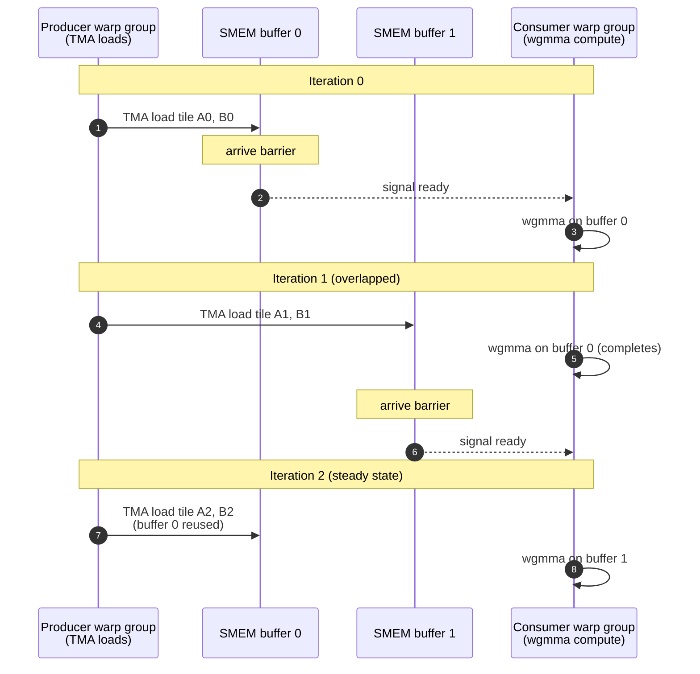

# Tensor Core Programming — WGMMA, TMA, and Warp Specialization

> **Layer:** L5.
> **Prerequisites:** [CUDA_Programming](01_CUDA_Programming.md), [CUDA_Optimization](02_CUDA_Optimization.md), [GPU_Architecture](../L3_Microarchitecture/02_GPU_Architecture.md), [Blackwell_Architecture](../L3_Microarchitecture/04_Blackwell_Architecture.md).
> **Hands off to:** [FlashAttention_Deep_Dive](05_FlashAttention_Deep_Dive.md), [Cutting_Edge_Kernels](06_Cutting_Edge_Kernels.md), [Triton_and_Kernels](04_Triton_and_Kernels.md).

---

## 0. Scope — the top rungs of the optimization ladder

[CUDA_Optimization](02_CUDA_Optimization.md) climbs the generic rungs of the kernel-optimization ladder: coalescing, shared-memory tiling, bank conflicts, occupancy. Past those rungs, throughput on modern NVIDIA GPUs is decided by a different discipline — feeding the tensor cores. Matrix instructions (`wmma`, `mma.sync`, `wgmma`) do the arithmetic; asynchronous data movement (`cp.async`, TMA) keeps operands flowing without spending warp issue slots; double buffering and warp-specialized producer-consumer pipelines overlap the two; clusters extend the pipeline across SMs. The Hopper architecture (SM90) made this a fundamentally different kernel execution model — warp groups take on specialized producer and consumer roles, coordinated by hardware-accelerated barrier objects — and CUTLASS 3.x kernels use this pattern exclusively. Blackwell (SM100) extends it again with TMEM, a dedicated operand-staging tier. Understanding this pipeline is essential for reasoning about Hopper- and Blackwell-era tensor-core performance.

This page covers the pipeline end to end: the instruction hierarchy from WMMA to WGMMA, FP8 and 2:4 sparsity, TMEM, `cp.async`/TMA, `mbarrier` synchronization, double buffering, warp specialization, cluster-level cooperation, and CUDA-graph techniques for replaying the resulting kernels at production batch sizes.

---

## 1. Tensor-core instructions and utilization

### 1.1 Instruction hierarchy

| Level | Instruction | Threads involved | Tile shape (FP16/BF16) | Tile shape (FP8) | Architecture |
|-------|------------|-----------------|----------------------|-----------------|-------------|
| WMMA | `wmma::mma_sync` | 1 warp (32) | $16 \times 16 \times 16$ | — | Volta+ |
| WGMMA | `wgmma.mma_async` | 1 warp group (128) | $64 \times N \times 16$ | $64 \times N \times 32$ | Hopper+ |
| MMA (PTX) | `mma.sync` | 1 warp (32) | $16 \times 8 \times 16$ | — | Ampere+ |

### 1.2 WMMA example (Volta through Ampere)

```c
#include <mma.h>
using namespace nvcuda::wmma;

fragment<matrix_a, 16, 16, 16, half, row_major> frag_a;
fragment<matrix_b, 16, 16, 16, half, col_major> frag_b;
fragment<accumulator, 16, 16, 16, float> frag_c;

fill_fragment(frag_c, 0.0f);

// Load tiles from SMEM
load_matrix_sync(frag_a, smem_a + k * 16, 16);
load_matrix_sync(frag_b, smem_b + k * 16, 16);

// Multiply-accumulate
mma_sync(frag_c, frag_a, frag_b, frag_c);

// Store result
store_matrix_sync(out + m * N + n, frag_c, N, mem_row_major);
```

Each `wmma` call performs $16 \times 16 \times 16 = 4\,096$ FMAs as a single instruction, issued to the tensor core. The warp's 32 threads cooperatively load and store the tile — each thread handles $(16 \times 16) / 32 = 8$ elements.

### 1.3 WGMMA on Hopper

Hopper's `wgmma.mma_async` instruction is warp-group-wide: a single call consumes 128 threads (4 warps) to compute a matrix product from shared-memory operands into register accumulators. It is also asynchronous — the warp group issues the instruction and continues executing independent instructions while the tensor core computes. This enables software pipelining of tensor-core operations with address arithmetic and data movement.

Key constraints:
- $M = 64$ (fixed).
- $N \in \{8, 16, 24, 32, ..., 256\}$ (multiples of 8).
- $K = 16$ (FP16/BF16), $K = 32$ (FP8), $K = 64$ (FP4).
- Operands in SMEM (not registers for A/B; accumulators in registers).
- Requires warp-group (4 warps, 128 threads) coordination.

**API (via PTX inline assembly or CUTLASS wrappers):**

```text
wgmma.mma_async.sync.aligned.m64n128k32.f32.f16.f16
    {%d0, ..., %d63},    // 64 accumulator registers (FP32)
    {%a0, ..., %a7},     // SMEM descriptor for A (FP16, 64x32 tile)
    {%b0, ..., %b15},    // SMEM descriptor for B (FP16, 32x128 tile)
    {};                   // accumulator scaling (identity for accumulate)
```

**Dataflow:**

1. **SMEM → tensor cores.** On Hopper, `wgmma` reads matrix tiles directly from shared memory — there is no explicit register-loading step. The matrix-multiply unit computes $D = A \times B + C$ where $A \in \mathbb{R}^{64 \times 32}$ (FP16), $B \in \mathbb{R}^{32 \times 128}$ (FP16), $C, D \in \mathbb{R}^{64 \times 128}$ (FP32 accumulators).

2. **Tensor cores → accumulator registers.** The output tile is distributed across the 128 threads of the warp group — each thread holds a slice in its FP32 registers (64 accumulator registers per thread for the m64n128 shape).

Key properties:
- **Asynchronous.** `wgmma` is fire-and-forget: the warp group issues it and the tensor-core pipeline executes independently. `wgmma_commit_group` + `wgmma_wait_group` provide ordering.
- **SMEM-direct.** Unlike `wmma` (Ampere), `wgmma` reads operands directly from shared memory — no explicit register loading step. (On Blackwell, operands stage through the new TMEM tier instead — see §2.)
- **Large tiles.** A single `wgmma.mma_async.m64n128k32` computes $64 \times 128 \times 32 = 262\,144$ FMA operations per invocation, amortizing instruction overhead.
- **Mixed precision.** Operands can be FP16, BF16, FP8 (E4M3/E5M2), or INT8. Accumulators are always FP32 (or FP32 with FP8 via `wgmma.mma_async` with scale factors).

On H100 SXM, `wgmma` delivers up to 989 TFLOPS (FP16/BF16 with FP32 accumulate) — the instruction is the performance-critical path in every Hopper matmul kernel. The CUTLASS library abstracts it via its `collective::Mma` construct, but understanding the hardware constraints is essential for debugging suboptimal utilization.

### 1.4 Tensor-core utilization metric

$$
\text{TC Util} = \frac{\text{achieved FLOPs}}{\text{peak FLOPs}} = \frac{\text{wgmma\_issued} \cdot \text{FLOPs\_per\_wgmma}}{\text{SM\_count} \cdot \text{freq} \cdot \text{TC\_FLOPs\_per\_cycle\_per\_SM}}
$$

Nsight Compute reports this as `smsp__inst_executed_pipe_tensor.sum` relative to the pipe utilization ceiling.

### 1.5 FP8 tensor-core programming

Hopper (SM90) introduced native FP8 support in the 4th-generation tensor cores. FP8 doubles the FLOPS throughput compared to FP16 on the same hardware: H100 SXM delivers 1 979 TFLOPS dense FP8 vs. 989 TFLOPS dense FP16. The throughput gain comes from halved operand size — twice as many values fit in the same register/SMEM tile, so the tensor core processes twice the K-dimension per instruction.

**FP8 formats.** Two encodings are defined by IEEE 754-like conventions:

| Format | Exponent bits | Mantissa bits | Use case | Special values |
|--------|--------------|---------------|----------|----------------|
| E4M3 | 4 | 3 | Forward pass, inference weights/activations | No Inf/NaN (larger dynamic range is not needed) |
| E5M2 | 5 | 2 | Backward pass (gradients) | Supports Inf/NaN (gradients can overflow) |

E4M3 trades dynamic range for precision (3 mantissa bits vs. 2), which is ideal for weights and activations that are typically well-conditioned after calibration. E5M2 trades precision for dynamic range, which is necessary for gradients that span wider magnitudes during training.

**WGMMA with FP8.** On Hopper, `wgmma.mma_async` accepts FP8 operands with MMA shape $M \times N \times K = 64 \times 128 \times 32$. The K-dimension doubles from 16 (FP16) to 32 (FP8) because each 128-byte SMEM tile holds twice as many FP8 elements. This doubling is the hardware mechanism behind the 2x FLOPS increase — a single `wgmma` instruction performs $64 \times 128 \times 32 = 262{,}144$ FMAs vs. $64 \times 128 \times 16 = 131{,}072$ FMAs for FP16.

```c
#include <cuda_fp8.h>

// FP8 types
__nv_fp8_e4m3 fp8_a = __nv_fp8_e4m3(fp16_val);   // cast from FP16
__nv_fp8_e5m2 fp8_b = __nv_fp8_e5m2(fp16_grad);

// WGMMA with FP8 operands (via CUTLASS or PTX)
// PTX: wgmma.mma_async.sync.aligned.m64n128k32.f32.e4m3.e5m2.f8
// Accumulator is always FP32 for numerical stability
```

**Quantization flow.** FP8 GEMM does not operate on raw FP8 values directly — it requires per-tensor scaling factors to preserve accuracy:

$$
\text{FP32 master weights} \xrightarrow{\text{cast + scale}} \text{FP8} \xrightarrow{\text{tensor core GEMM}} \text{FP32 accumulate}
$$

Each tensor (weight, activation, gradient) carries a 2-element scaling factor (scale + bias, or just scale for most LLM workloads). The overhead is negligible: 2 FP32 values per tensor regardless of tensor size.

**Transformer Engine integration.** NVIDIA's [Transformer Engine](https://github.com/NVIDIA/TransformerEngine) automates FP8 management:

- **Delayed scaling:** the scaling factor for the current FP8 tensor is computed from the maximum absolute value of the *previous* iteration's tensor (one-step lag). This avoids a costly max-reduction on the current tensor.
- **Calibration:** a short calibration run (100-500 iterations) collects per-tensor statistics to set initial scaling factors. Without calibration, FP8 accuracy degrades by 1-5% on most LLM workloads; with calibration, degradation is typically <0.5%.
- **Automatic mixed precision:** Transformer Engine wraps standard PyTorch modules (`Linear`, `LayerNorm`) and transparently dispatches FP8 GEMMs where safe, falling back to FP16/BF16 where not.

```python
import transformer_engine as te
import transformer_engine.pytorch as te_pytorch

# Wrap an nn.Linear with automatic FP8 management
fp8_linear = te_pytorch.Linear(in_features, out_features, bias=False)

# Calibration context manager
with te_pytorch.fp8_autocast(enabled=True):
    output = fp8_linear(input)
```

**Key considerations for FP8:**

1. **Accuracy requires calibration.** FP8 has only 3-4 mantissa bits. Tensors with wide dynamic ranges (e.g., attention scores, embedding tables) need careful scaling. Run calibration before production use.
2. **Per-tensor scaling overhead.** Each tensor needs its own scale factor — this is 2 FP32 values per tensor, negligible in memory but adds a small host-side bookkeeping cost.
3. **Accumulator is FP32.** FP8 operands are promoted to FP32 before accumulation. The output of an FP8 GEMM is FP32, which is then cast back to FP8 (or BF16) for the next layer.
4. **Not all layers benefit equally.** Matmuls in attention (QK^T, PV) and FFN (gate/up/down projections) benefit most. LayerNorm, softmax, and element-wise ops remain in FP32/BF16.

### 1.6 2:4 Structured sparsity on tensor cores

Starting with Ampere (SM80), NVIDIA tensor cores include hardware support for **2:4 structured sparsity**: in every contiguous group of 4 values, exactly 2 must be zero. The hardware doubles effective throughput by skipping the zero multiply-accumulate operations, yielding a 2x speedup on tensor-core GEMMs at constant accuracy (after fine-tuning).

**How it works.** The tensor core's sparse matrix path expects a "compressed" weight matrix where the non-zero pairs in each group-of-4 are packed into 2 values, plus a 2-bit index encoding which positions are non-zero. The hardware reconstructs the full 4-element dot product by inserting zeros at the indexed positions — this is transparent to the programmer using the `cusparselt` library.

**Hardware support timeline:**

| Architecture | Sparse tensor cores | Dense FP16 | Sparse FP16 | Dense FP8 | Sparse FP8 |
|-------------|--------------------|------------|-------------|-----------|------------|
| Ampere (A100) | Yes | 312 TFLOPS | 624 TFLOPS | N/A | N/A |
| Hopper (H100) | Yes | 990 TFLOPS | ~1 980 TFLOPS | 1 979 TFLOPS | ~3 958 TFLOPS |
| Blackwell (B200) | Yes | ~2 250 TFLOPS | ~4 500 TFLOPS | ~4 500 TFLOPS | ~9 000 TFLOPS |

Sparse throughput is exactly 2x dense for all supported precisions.

**Sparsity pattern constraints:**

1. **Static, not dynamic.** The 2:4 pattern is determined at model export time (post-training) and baked into the weight matrix. The pattern does not change at runtime. This means sparsity applies to weight-stationary inference and the forward pass of training — the backward pass uses dense weights because gradient sparsity patterns differ from weight sparsity patterns.
2. **Pruning then fine-tuning.** The typical workflow is: (a) train a dense model, (b) apply magnitude pruning to enforce the 2:4 constraint (zero out the 2 smallest-magnitude values in each group-of-4), (c) fine-tune for 1-10K steps to recover accuracy.
3. **Accuracy impact.** For LLM workloads (GPT-3, LLaMA, etc.), 2:4 sparsity typically causes <1% accuracy degradation after fine-tuning. For smaller models or tasks with high precision requirements (e.g., numerical simulation), degradation can be higher.

**API and usage:**

```c
// cuSPARSELt: sparse matrix operations
#include <cusparseLt.h>

// Create sparse matrix descriptor with 2:4 pruning
cusparseLtMatDescriptor_t matA;
cusparseLtMatDescriptor_t matB;
cusparseLtMatmulDescriptor_t matmul;
cusparseLtMatmulPlan_t plan;

// Initialize with 2:4 sparsity on matrix A
cusparseLtStructuredDescriptorInit(
    &handle, &matA, M, K, K, CUDA_R_16F,
    CUSPARSE_ORDER_ROW, CUSPARSE_SPARSITY_50_PERCENT
);

// Prune matrix to 2:4 pattern
cusparseLtSpMMAPrune(
    &handle, &matmul, d_A_dense, d_A_compressed,
    CUSPARSELT_PRUNE_CHECK, stream
);

// Sparse GEMM
cusparseLtMatmul(&handle, &plan, &alpha, d_A_compressed, d_B, &beta, d_C, ...);
```

```python
# PyTorch 2.x: semi-structured (2:4) sparsity
import torch
from torch.sparse import to_sparse_semi_structured

# Prune to 2:4 pattern
weight_pruned = torch._sparse_semi_structured_tensor.prune_2_4(weight_dense)

# Convert to sparse format
weight_sparse = to_sparse_semi_structured(weight_pruned)

# Matrix multiplication uses sparse tensor cores automatically
output = torch.nn.functional.linear(input, weight_sparse)
```

**Caveats:**

1. **Only the weight matrix can be sparse.** The activation matrix (input to the GEMM) is always dense. This limits applicability to weight-stationary operations — primarily linear layers in inference.
2. **Training backward pass is dense.** During training, the forward pass can use sparse weights (2x speedup), but the backward pass through the weight gradient uses dense weights (no speedup). Net training speedup is therefore <2x, typically 1.3-1.5x depending on the ratio of forward to backward compute.
3. **Pattern search cost.** Finding the optimal 2:4 pruning pattern is NP-hard in general. The practical approach (magnitude pruning) is a greedy heuristic. For some models, a slightly more sophisticated search (e.g., iterative pruning with small steps) can improve accuracy recovery during fine-tuning.

---

## 2. Blackwell TMEM (Tensor Memory) Programming

### 2.1 Why TMEM exists

Blackwell's 5th-generation tensor cores introduce a new memory tier called **TMEM (Tensor Memory)** that sits between shared memory and registers in the on-chip hierarchy. The motivation is bandwidth: FP4 tensor cores on Blackwell demand approximately ~50 TB/s/SM of operand bandwidth, far exceeding what SMEM can deliver at ~19 TB/s per SM. TMEM bridges this gap by providing a dedicated staging buffer for tensor-core operands, physically closer to the tensor-core datapath than SMEM.

### 2.2 Memory hierarchy with TMEM

The Blackwell on-chip memory hierarchy becomes:

$$\text{HBM} \xrightarrow{\sim 8 \text{ TB/s}} \text{L2} \xrightarrow{\sim 60 \text{ TB/s}} \text{SMEM} \xrightarrow{\sim 19 \text{ TB/s}} \text{TMEM} \xrightarrow{\sim 100+ \text{ TB/s}} \text{Tensor Cores}$$

Each tier is roughly 5-10x faster than the previous one. TMEM capacity is estimated at ~256 KB per SM (not officially confirmed by NVIDIA). Latency is approximately ~5 cycles, compared to ~20-30 cycles for SMEM and ~2-3 cycles for the register file.

### 2.3 Programming model

TMEM is managed by hardware, not directly by the programmer. The `wgmma` instruction on Blackwell implicitly reads its A and B operands from TMEM rather than from SMEM (as on Hopper). The programmer's responsibility is to **stage data into TMEM** before issuing `wgmma`. The data flow for a Blackwell GEMM kernel is:

$$\text{TMA async copy} \rightarrow \text{SMEM} \rightarrow \text{TMEM} \rightarrow \text{wgmma} \rightarrow \text{accumulate in RF}$$

This contrasts with Hopper, where `wgmma` reads directly from SMEM. The extra TMEM staging step is the key architectural difference.

### 2.4 TMEM load operations

The TMA (Tensor Memory Accelerator) hardware on Blackwell can load tiles directly into TMEM via new `tmem::load` operations. The CUDA PTX API exposes this through:

```c
// Load a tile from SMEM into TMEM (partitioned per warp group)
cuda::ptx::tmem::load_partition(smem_tile, tmem_tile, partition_id);

// Cross-warp reduction within TMEM (e.g., partial sum accumulation)
cuda::ptx::tmem::reduce_add(tmem_dst, tmem_src_a, tmem_src_b);
```

Key API elements:

| Operation | Description |
|---|---|
| `tmem::load_partition` | Loads a tile from SMEM into a TMEM partition owned by a specific warp group |
| `tmem::reduce_add` | Performs an addition reduction across warp groups within TMEM, without writing to registers |
| `wgmma.mma_async` | Implicitly reads A/B operands from TMEM (no explicit TMEM address in the instruction) |

The `tmem::reduce_add` operation is particularly important for cross-warp reduction within TMEM, enabling efficient partial-sum accumulation without involving the register file or shared memory.

### 2.5 Impact on kernel design

The TMEM staging step changes the optimal pipeline structure for Blackwell GEMM kernels:

```ascii-graph
Hopper:  TMA → SMEM → wgmma(SMEM) → RF accumulate
Blackwell: TMA → SMEM → TMEM → wgmma(TMEM) → RF accumulate
```

The extra stage means Blackwell kernels benefit from triple or quad buffering (vs. double buffering on Hopper) to keep the pipeline full. CUTLASS 3.x's Blackwell collective builders handle this automatically, but hand-written kernels must account for the additional latency of the SMEM → TMEM transfer.

**Occupancy impact**: TMEM is a shared resource within the SM, competing with SMEM for the on-chip memory budget. A kernel using 256 KB of TMEM per SM has less SMEM available for tiling, which may require smaller tile sizes or fewer concurrent blocks per SM.

---

## 3. Asynchronous data movement — cp.async and TMA

On pre-Ampere GPUs, a warp loads data from global memory by issuing load instructions that occupy issue slots and registers for the full ~400-cycle round trip. Modern architectures decouple data movement from warp execution through two mechanisms: the `cp.async` instruction family (Ampere+) and the Tensor Memory Accelerator (TMA, Hopper+).

### 3.1 cp.async (Ampere+)

The `cp.async` instruction copies data from global memory to shared memory without going through registers. The issuing warp does not stall — it proceeds to other work while the copy engine handles the transfer:

```c
// cp.async: copy 4/8/16 bytes from global to shared memory
// The warp issues the copy and continues — does not wait for completion
uint32_t smem_ptr = __cvta_generic_to_shared(smem_dst);
asm volatile(
    "cp.async.ca.shared.global [%0], [%1], %2;\n"
    :: "r"(smem_ptr), "l"(gmem_src), "n"(16)
);

// Commit all pending async copies
asm volatile("cp.async.commit_group;\n" ::);

// Wait for the Nth-most recent commit group
asm volatile("cp.async.wait_group %0;\n" :: "n"(0));
```

`cp.async` bypasses the register file entirely, freeing registers for tiling. Each thread can issue a 4, 8, or 16-byte copy. A warp collectively copies $32 \times 16 = 512$ bytes per instruction — one 128-byte cache line per quadrant of the warp.

**`cp.async.bulk.global.shared`** copies an entire block (up to 256 bytes) in one instruction. Combined with `cp.async.commit_group` and `cp.async.wait_group`, warps can pipeline multiple outstanding copies.

### 3.2 TMA (Hopper+)

The **Tensor Memory Accelerator** (TMA) is a hardware unit in the SM that handles multi-dimensional tile descriptors. Instead of each thread computing its own address, a single thread issues a multidimensional tensor load, and the TMA hardware handles address computation, bounds checking, and swizzling — transferring an entire tile (up to tens of KB) into shared memory autonomously. The issuing warp group is completely free during the transfer:

```c
// TMA load: one thread initiates the transfer for the entire warp group
// tensor_map describes the tensor dimensions, strides, and box size in global memory
// smem_ptr is the destination in shared memory
// mbarrier_ptr tracks completion

// Create a TMA descriptor (host side, once per tensor)
CUtensorMap tma_desc;
cuTensorMapEncodeTiled(
    &tma_desc,
    CU_TENSOR_MAP_DATA_TYPE_FLOAT32,
    2,                          // rank (2D)
    d_tensor,                   // global memory base
    dims,                       // global dimensions
    strides,                    // global strides
    box_dims,                   // SMEM tile dimensions
    tile_strides,               // element strides within tile
    CU_TENSOR_MAP_INTERLEAVE_NONE,
    CU_TENSOR_MAP_SWIZZLE_NONE,
    CU_TENSOR_MAP_L2_PROMOTION_NONE,
    CU_TENSOR_MAP_FLOAT_OOB_FILL_NONE
);

// Device side: issue TMA load from a single thread
if (threadIdx.x == 0) {
    cute::SM90_TMA_LOAD::copy(
        &tma_desc,
        smem_buffer,
        mbarrier_ptr,
        tile_coord   // {row, col} offset into the global tensor
    );
}
```

TMA advantages:
- **Single-thread programming.** One thread issues the descriptor; no per-thread address arithmetic.
- **Hardware swizzle.** The TMA engine applies on-the-fly XOR swizzle to match SMEM bank layout (`CU_TENSOR_MAP_SWIZZLE_128B`).
- **Multi-dimensional.** Handles 1D through 5D tensor slicing natively.
- **Frees the entire warp group.** All 128 threads can do compute while TMA loads the next tile.

TMA is the backbone of CUTLASS 3.x data loading. A single thread issues the load; the hardware streams the tile into shared memory; an `mbarrier` (§4) signals completion. The remaining 127 threads in the warp group are free to perform computation.

---

## 4. `mbarrier` — arrival-based synchronization

`mbarrier` is a hardware barrier object resident in shared memory. It replaces `__syncthreads()` for producer-consumer patterns between warp groups. Unlike `__syncthreads()` (which is monolithic — all-or-nothing), `mbarrier` supports partial arrivals and can track asynchronous operations like TMA transfers.

**Operations:**

| Operation | Semantics |
|---|---|
| `mbarrier.init(&bar, count)` | Initialize with `count` expected arrivals |
| `mbarrier.arrive(&bar)` | Thread arrives; decrements the pending count |
| `mbarrier.arrive_drop(&bar)` | Thread arrives AND reduces the expected count by 1 |
| `mbarrier.wait(&bar, phase)` | Spin until `phase` flips (all expected arrivals complete) |
| `mbarrier.test_wait(&bar, phase)` | Non-blocking test; returns `true` if phase flipped |

**Expect/arrive semantics.** The barrier tracks two counts: the number of *expected* arrivals and the number of *pending* arrivals. When a thread calls `mbarrier.arrive`, it decrements the pending count. When the TMA hardware completes a transfer, it also decrements the pending count. The barrier signals completion when pending reaches zero.

```c
__shared__ uint64_t bar;

// One thread initializes the barrier with expected arrival count = 2
// (one TMA load completion + one explicit warp-group arrival)
if (threadIdx.x == 0) {
    mbarrier::init(&bar, 2);  // expect 2 arrivals
}

// Producer thread 0: initiate TMA load (hardware will arrive on bar)
// Producer warp group: explicit arrive after initiating the load
mbarrier::arrive(&bar);

// Consumer: wait for both the TMA completion and the producer's explicit arrival
mbarrier::wait(&bar, /*phase=*/0);  // blocks until both arrivals
```

**Phase parity.** `mbarrier` uses a phase bit to distinguish between successive wait cycles. After all expected arrivals complete, the phase flips. A `wait(&bar, phase)` call blocks until the current phase differs from the specified phase. For double-buffering, the consumer alternates between `wait(&bar, 0)` and `wait(&bar, 1)` on successive iterations.

This mechanism is what enables zero-overlap synchronization between the TMA hardware and warp groups — no spin loops, no polling, no `__syncthreads()` that stalls the entire block.

---

## 5. Double buffering and software pipelining

### 5.1 The overlap principle

Without double buffering, a tiled kernel alternates between loading a tile and computing on it:

```ascii-graph
Load tile 0 → Compute tile 0 → Load tile 1 → Compute tile 1 → ...
```

The load latency (HBM round-trip: 200-800 cycles) is entirely exposed to the compute pipeline. Double buffering allocates two SMEM buffers: while the compute stage processes buffer $i$, the async copy stage fills buffer $i \oplus 1$.

```mermaid
%%{init: {"flowchart": {"defaultRenderer": "elk", "nodeSpacing": 60, "rankSpacing": 60, "htmlLabels": false}}}%%
gantt
    title Double-Buffered Pipeline
    dateFormat X
    axisFormat %s
    section Load
    Tile 0     :0, 1
    Tile 1     :1, 2
    Tile 2     :2, 3
    section Compute
    Tile 0     :1, 2
    Tile 1     :2, 3
```



### 5.2 Implementation

```c
__shared__ float smemA[2][BLOCK_M][BLOCK_K]; // double buffer
__shared__ float smemB[2][BLOCK_K][BLOCK_N];

int buf = 0;

// Prime: load first tile
cp_async_load(smemA[buf], gmem_A + 0 * BLOCK_K);
cp_async_load(smemB[buf], gmem_B + 0 * BLOCK_K);
cp_async_commit();
cp_async_wait(0);

for (int kk = BLOCK_K; kk < K; kk += BLOCK_K) {
    int next = buf ^ 1;

    // Issue async load for NEXT tile
    cp_async_load(smemA[next], gmem_A + kk);
    cp_async_load(smemB[next], gmem_B + kk * N);
    cp_async_commit();

    // Compute on CURRENT tile
    compute_tile(smemA[buf], smemB[buf], regC);

    // Wait for next tile, then swap
    cp_async_wait(0);
    buf = next;
}

// Compute last tile
compute_tile(smemA[buf], smemB[buf], regC);
```

Double buffering typically yields 20-40% speedup on memory-bound kernels by hiding HBM latency behind compute. On Hopper, triple buffering (or n-deep software pipelining) can extract additional gains for kernels with very short compute phases relative to load phases. For the warp-specialized TMA + `wgmma` version of this pipeline, see §6.4.

---

## 6. Warp specialization — producer-consumer

### 6.1 Motivation

On Hopper, `wgmma` is asynchronous and operates on SMEM-resident data. The optimal pipeline assigns one warp group (128 threads) to continuously issue `wgmma` instructions (consumer) and a second warp group to continuously issue TMA loads (producer). The two groups communicate through SMEM buffers with barrier synchronization.



### 6.2 The warp-specialized kernel pattern

The core pattern: within a single thread block, warp group 0 (warps 0–3, threads 0–127) acts as the **producer** (loads tiles via TMA), while warp group 1 (warps 4–7, threads 128–255) acts as the **consumer** (executes `wgmma` tensor-core operations on the loaded tiles). This is cooperative warp divergence — each warp group runs a different code path.

```c
__global__ void __launch_bounds__(256, 1)
wgmma_matmul(/* ... */) {
    // Identify warp group: 0 = producer (TMA), 1 = consumer (wgmma)
    int warp_group_idx = __shfl_sync(0xffffffff, threadIdx.x / 128, 0);

    // Shared memory: double-buffered tiles for A and B
    extern __shared__ uint128_t smem[];
    float *sA_buf0 = reinterpret_cast<float*>(smem);
    float *sB_buf0 = sA_buf0 + TILE_M * TILE_K;
    float *sA_buf1 = sB_buf0 + TILE_K * TILE_N;
    float *sB_buf1 = sA_buf1 + TILE_M * TILE_K;

    // Producer and consumer mbarriers
    __shared__ uint64_t mbarrier_produce[2];  // producer signals: buffer loaded
    __shared__ uint64_t mbarrier_consume[2];  // consumer signals: buffer consumed

    if (warp_group_idx == 0) {
        // === PRODUCER (TMA loader) ===
        for (int k_tile = 0; k_tile < K; k_tile += TILE_K) {
            int buf = (k_tile / TILE_K) % 2;

            // Wait for consumer to finish with this buffer
            mbarrier::wait_parity(&mbarrier_consume[buf], phase_consume[buf]);

            // Issue TMA loads for A and B tiles (single thread per warp group)
            if (threadIdx.x % 128 == 0) {
                cute::SM90_TMA_LOAD::copy(&tma_A, sA_buf[buf], &mbarrier_produce[buf], coord_A);
                cute::SM90_TMA_LOAD::copy(&tma_B, sB_buf[buf], &mbarrier_produce[buf], coord_B);
            }
            // Arrive on mbarrier: TMA hardware will also arrive (expect = 2)
            // When both TMA loads complete, mbarrier signals ready
        }
    } else {
        // === CONSUMER (wgmma compute) ===
        // Accumulator registers — one per thread in the warp group
        float accum[TILE_M * TILE_N / 128] = {0};

        for (int k_tile = 0; k_tile < K; k_tile += TILE_K) {
            int buf = (k_tile / TILE_K) % 2;

            // Wait for producer to load this buffer
            mbarrier::wait_parity(&mbarrier_produce[buf], phase_produce[buf]);

            // Issue wgmma on the loaded tiles
            wgmma_fence();
            wgmma::mma<A_layout, B_layout>(
                accum,
                sA_buf[buf],    // shared memory descriptor for A
                sB_buf[buf],    // shared memory descriptor for B
                accum
            );
            wgmma_commit_group();

            // Signal producer: this buffer is consumed
            mbarrier::arrive(&mbarrier_consume[buf]);
        }
        // Write accumulators to global memory
    }
}
```

This pattern is the foundation of CUTLASS 3.x collective operations. The producer warp group never computes; the consumer warp group never loads. Synchronization between them is handled entirely by `mbarrier` objects — no `__syncthreads()` needed.

### 6.3 Named-barrier synchronization between warp groups

Hopper provides hardware barriers (`bar.sync`, `bar.arrive`) that are far cheaper than `__syncthreads()` for inter-warp-group coordination. CUTLASS 3.x uses named barriers:

```c
// Producer signals "buffer is full"
asm volatile("bar.arrive.shared::cta 1, 128;\n" ::); // barrier 1, 128 threads

// Consumer waits for "buffer is full"
asm volatile("bar.sync.shared::cta 1, 128;\n" ::);

// Consumer signals "buffer is consumed"
asm volatile("bar.arrive.shared::cta 2, 128;\n" ::);

// Producer waits for "buffer is consumed"
asm volatile("bar.sync.shared::cta 2, 128;\n" ::);
```

Named barriers coordinate warp groups within a block; `mbarrier` objects (§4) additionally track completion of asynchronous TMA transfers. Production kernels use both.

### 6.4 Full pipeline — double buffering with warp specialization

The full pipeline: while the consumer warp group computes `wgmma` on buffer 0, the producer warp group loads the next tile into buffer 1 via TMA. The two warp groups never contend on the same buffer.

```c
__global__ void __launch_bounds__(256, 1)
pipeline_matmul(/* args */) {
    int wg = threadIdx.x / 128;  // 0 = producer, 1 = consumer

    extern __shared__ float smem[];
    float *buf[2] = { smem, smem + TILE_BYTES / sizeof(float) };
    __shared__ uint64_t bar_loaded[2], bar_consumed[2];

    if (threadIdx.x == 0) {
        for (int i = 0; i < 2; i++) {
            mbarrier::init(&bar_loaded[i], 2);   // TMA + explicit arrive
            mbarrier::init(&bar_consumed[i], 1);  // consumer arrive
        }
    }
    __syncthreads();

    int phase_l[2] = {0, 0}, phase_c[2] = {0, 0};
    int n_tiles = K / TILE_K;

    if (wg == 0) {
        // Producer: issue TMA loads, signal loaded, wait consumed
        // Prologue: load first two tiles
        for (int t = 0; t < min(2, n_tiles); t++) {
            int b = t % 2;
            mbarrier::wait_parity(&bar_consumed[b], phase_c[b] & 1);
            if (threadIdx.x % 128 == 0) {
                tma_load(buf[b], &bar_loaded[b], /*tile=*/t);
            }
            mbarrier::arrive(&bar_loaded[b]);
            phase_c[b]++;
        }
        // Steady state: load tile t while consuming tile t-2
        for (int t = 2; t < n_tiles; t++) {
            int b = t % 2;
            mbarrier::wait_parity(&bar_consumed[b], phase_c[b] & 1);
            if (threadIdx.x % 128 == 0) {
                tma_load(buf[b], &bar_loaded[b], /*tile=*/t);
            }
            mbarrier::arrive(&bar_loaded[b]);
            phase_c[b]++;
        }
    } else {
        // Consumer: wait loaded, compute wgmma, signal consumed
        float accum[NUM_ACCUM] = {0};

        for (int t = 0; t < n_tiles; t++) {
            int b = t % 2;

            // Wait for producer to finish loading this buffer
            mbarrier::wait_parity(&bar_loaded[b], phase_l[b] & 1);

            // Compute on the loaded tile
            wgmma_fence();
            wgmma_mma(accum, buf[b], buf[b] + TILE_A, accum);
            wgmma_commit_group();

            // Signal: buffer is consumed, producer can overwrite it
            mbarrier::arrive(&bar_consumed[b]);
            phase_l[b]++;
        }

        wgmma_wait_group<0>();
        // Store accumulators to global C
        store_accumulators(accum);
    }
}
```

The pipeline has three phases: **prologue** (load buffers 0 and 1), **steady state** (load tile $t$ into buffer $t \bmod 2$ while computing on tile $t-2$), and **epilogue** (drain remaining computation, store results). In steady state, the TMA load and `wgmma` execute concurrently on separate hardware units, achieving full overlap.

On H100, a well-tuned CUTLASS 3.x kernel with this pattern achieves $>90\%$ of peak tensor-core throughput for large matmuls ($M, N, K \geq 256$).

Warp specialization is the architecture of record for Hopper and Blackwell matmul kernels. FlashAttention-3 uses this pattern for its Q-tile producer and KV-tile consumer pipeline.

---

## 7. Cluster-level optimizations (SM90+)

### 7.1 When to use threadblock clusters

Clusters (groups of 1–8 threadblocks executing on neighboring SMs) are a Hopper-specific optimization that applies after warp specialization is already in place. They are beneficial when:

- **Cross-block data exchange is a bottleneck.** If your kernel splits work across blocks that must share intermediate results, DSMEM (~50 GB/s cross-SM) is faster than writing to HBM and reading back.
- **The producer-consumer pattern spans multiple blocks.** When one block produces data that another block consumes in the same kernel, clustering avoids the HBM round-trip.
- **Collaborative loading is needed.** Multiple blocks can cooperatively load a large tile, then exchange portions via DSMEM so each block has the full data without redundant HBM reads.

Clusters are **not** beneficial when blocks are fully independent (most elementwise kernels, simple reductions) or when the cross-block communication is sparse relative to per-block compute.

### 7.2 DSMEM bandwidth advantage

| Cross-block communication path | Bandwidth | Notes |
|---|---|---|
| DSMEM (direct SM-to-SM within cluster) | ~50 GB/s | Bypasses L2, no HBM traffic |
| L2 cache (warm) | Up to ~60 TB/s | Only if data is already cached |
| HBM (global memory write + read) | ~3.35 TB/s write + ~3.35 TB/s read | Default without clusters |

For small cross-block exchanges (a few KB of partial results), DSMEM's advantage is primarily latency, not throughput. For larger exchanges (full tiles), the bandwidth difference matters — DSMEM avoids consuming L2 capacity that other warps or blocks need.

### 7.3 Cluster-wide reduction patterns

The canonical cluster optimization is the **cluster-level reduction**, replacing the traditional two-kernel approach:

**Without clusters (traditional):**
```ascii-graph
Kernel 1: each block reduces its portion to 1 value → write to global memory
Kernel 2: single block reads all partial sums → reduces to final result
```

**With clusters:**
```ascii-graph
Single kernel: blocks in a cluster reduce locally in SMEM,
               then exchange partial results via DSMEM,
               one block produces the cluster's final partial sum → atomicAdd to global total
```

This eliminates one kernel launch and one HBM round-trip per cluster. For kernels with many small reductions (e.g., per-head attention normalization in FlashAttention-3), the savings are significant.

```c
// Cluster-wide reduction sketch (SM90)
__global__ void __cluster_dims__(CLUSTER_SIZE, 1, 1)
cluster_reduce(float *input, float *output, int n) {
    __shared__ float partial[BLOCK_SIZE];
    namespace cg = cooperative_groups;
    cg::cluster_group cluster = cg::this_cluster();

    // Step 1: Local block reduction (standard SMEM tree reduction)
    //     Each thread loads input elements, then sequential-addressing
    //     reduction in SMEM down to partial[0] = block's local sum.
    //     (See the reduction case study in [CUDA_Optimization](02_CUDA_Optimization.md) for the full optimized pattern.)

    // Step 2: Cluster-wide exchange
    cg::sync(cluster);  // all blocks have completed local reduction

    if (cluster.block_rank() == 0) {
        float cluster_sum = 0.0f;
        for (int r = 0; r < cluster.num_blocks(); r++) {
            // Read each block's partial[0] via DSMEM
            float *remote = cluster.map_shared_rank(partial, r);
            cluster_sum += remote[0];
        }
        // One atomic per cluster to global memory
        atomicAdd(output, cluster_sum);
    }
}
```

### 7.4 Decision flowchart

```ascii-graph
Is cross-block data exchange needed within a single kernel?
  |
  +-- No  → Regular threadblocks (no cluster needed)
  |
  +-- Yes → How many blocks need to communicate?
              |
              +-- 2-8 blocks  → Use a cluster with DSMEM
              |
              +-- >8 blocks  → Use global memory + kernel boundary sync
                                (or cooperative groups grid sync)
```

---

## 8. CUDA graph node update for dynamic shapes

CUDA-graph basics (capture, instantiate, replay) are covered in [CUDA_Optimization](02_CUDA_Optimization.md) §7.3. In inference serving, the decode phase processes variable batch sizes. Re-capturing a CUDA graph for each new batch size is expensive. Hopper-era drivers support **graph node update**: instantiate the graph once, then update kernel node parameters before each replay.

```c
// Capture the graph once with maximum batch size
cudaStreamBeginCapture(stream, cudaStreamCaptureModeGlobal);
decode_kernel<<<grid_max, block, smem, stream>>>(
    d_input, d_output, d_kv_cache, max_batch /* batch arg */);
cudaStreamEndCapture(stream, &graph);
cudaGraphInstantiate(&graph_exec, graph, NULL, NULL, 0);

// At inference time: update the batch-size argument without re-capturing
for (int step = 0; step < num_steps; step++) {
    int cur_batch = batch_sizes[step];

    // Update kernel node params: only the changed arguments
    cudaKernelNodeParams params = {};
    params.func = (void*)decode_kernel;
    params.gridDim = dim3((cur_batch + 63) / 64, num_heads);
    params.blockDim = dim3(64, 1, 1);
    params.sharedMemBytes = smem_bytes;
    params.kernelParams = new void*[4]{
        &d_input, &d_output, &d_kv_cache, &cur_batch
    };

    cudaGraphExecKernelNodeSetParams(graph_exec, node, &params);
    cudaGraphLaunch(graph_exec, stream);
}
```

`cudaGraphExecKernelNodeSetParams` modifies the launch configuration and kernel arguments of an existing node in the instantiated graph. The graph topology (dependencies between nodes) is preserved — only the kernel parameters change. This avoids the capture overhead ($\sim 50\text{--}100\ \mu\text{s}$) on each step, reducing the per-step overhead to the graph launch cost ($\sim 2\text{--}3\ \mu\text{s}$).

vLLM uses this technique for its decode runner: the graph is captured once with symbolic batch size, then updated with the actual batch size at each decoding step.

---

## 9. Numbers to memorize

| Number | Value | Context |
|--------|-------|---------|
| `wgmma` throughput per SM (Hopper, FP16) | ~7.5 TFLOPS | 4th gen tensor core (~990 TFLOPS total / 132 SMs) |
| `wgmma` throughput per SM (Hopper, FP8) | ~15 TFLOPS | FP8 doubles FLOPS vs. FP16 (~1 979 TFLOPS total / 132 SMs) |
| `wgmma` tile shape (Hopper, FP16) | $64 \times N \times 16$ | Fixed M and K |
| `wgmma` tile shape (Hopper, FP8) | $64 \times 128 \times 32$ | K doubles vs. FP16 |
| H100 dense FP8 throughput | ~1 979 TFLOPS | 2x FP16 dense (989 TFLOPS) |
| H100 sparse FP16 throughput | ~1 980 TFLOPS | 2x dense via 2:4 structured sparsity |
| B200 dense FP8 throughput | ~4 500 TFLOPS | Blackwell 5th gen tensor core |
| B200 sparse FP8 throughput | ~9 000 TFLOPS | 2x dense via 2:4 structured sparsity |
| Warp-group size | 128 threads (4 warps) | Unit of `wgmma` issue and warp specialization |
| TMEM capacity per SM (Blackwell) | ~256 KB (estimated) | Operand staging tier between SMEM and tensor cores |
| `cp.async` copy size per thread | 4, 8, or 16 bytes | Register bypass |
| TMA max descriptor dimensionality | 5D | Multi-dimensional tile DMA |
| DSMEM bandwidth (cross-SM within cluster) | ~50 GB/s | SM90+ cluster feature, bypasses L2 |
| Cluster size (SM90+) | 1–8 threadblocks | Group of blocks sharing DSMEM |

---

## 10. References

1. NVIDIA. *CUDA C++ Programming Guide*, v12.6. 2024. Sections on tensor cores, async copy, clusters.
2. NVIDIA. *CUTLASS 3.x Documentation*. 2024. Collective builders, TMA, wgmma, warp specialization.
3. NVIDIA. *Hopper Tuning Guide*. 2024. TMA, wgmma, barrier synchronization.
4. NVIDIA. *PTX ISA Reference*. Instruction-level semantics of `wgmma`, `cp.async`, `mbarrier`, and cluster operations.
5. Tri Dao et al. *FlashAttention-3: Fast and Accurate Attention with Asynchrony and Low-precision*. 2024. Warp specialization pipeline in production.
6. Scott Gray. *Tensor Cores: From WMMA to WGMMA*. 2023. Blog post on tensor-core programming evolution.

---

## 11. Up/down stack links

**Depends on (this page assumes you know):**
- [CUDA_Programming](01_CUDA_Programming.md) — thread hierarchy, memory model, streams, and the tiled-matmul capstone this page accelerates.
- [CUDA_Optimization](02_CUDA_Optimization.md) — coalescing, tiling, bank conflicts, occupancy: the ladder rungs below tensor-core work.
- [GPU_Architecture](../L3_Microarchitecture/02_GPU_Architecture.md) — SM anatomy, tensor core generations, warp scheduling.
- [Blackwell_Architecture](../L3_Microarchitecture/04_Blackwell_Architecture.md) — TMEM, 5th-generation tensor cores, and the hardware context for SM100 kernels.

**Feeds into (higher-layer pages that use this):**
- [FlashAttention_Deep_Dive](05_FlashAttention_Deep_Dive.md) — FA-2/FA-3 are warp-specialized TMA + wgmma pipelines end to end.
- [Cutting_Edge_Kernels](06_Cutting_Edge_Kernels.md) — CUTLASS 3.x collective builders package the patterns on this page as composable C++ templates.
- [Triton_and_Kernels](04_Triton_and_Kernels.md) — what the Triton compiler automates (and what it does not yet) of this pipeline.
