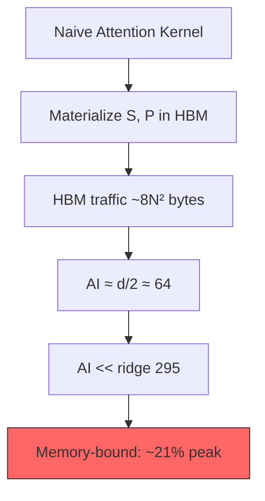
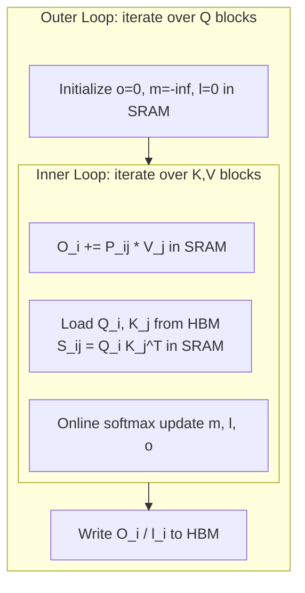
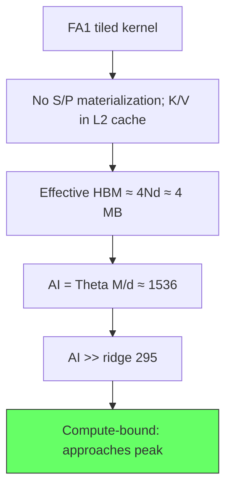
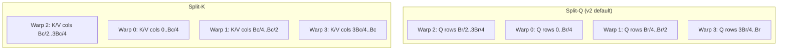
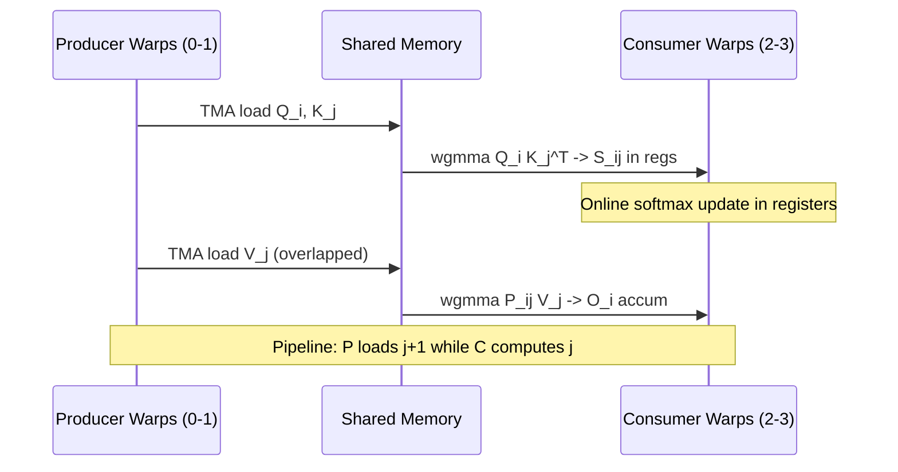
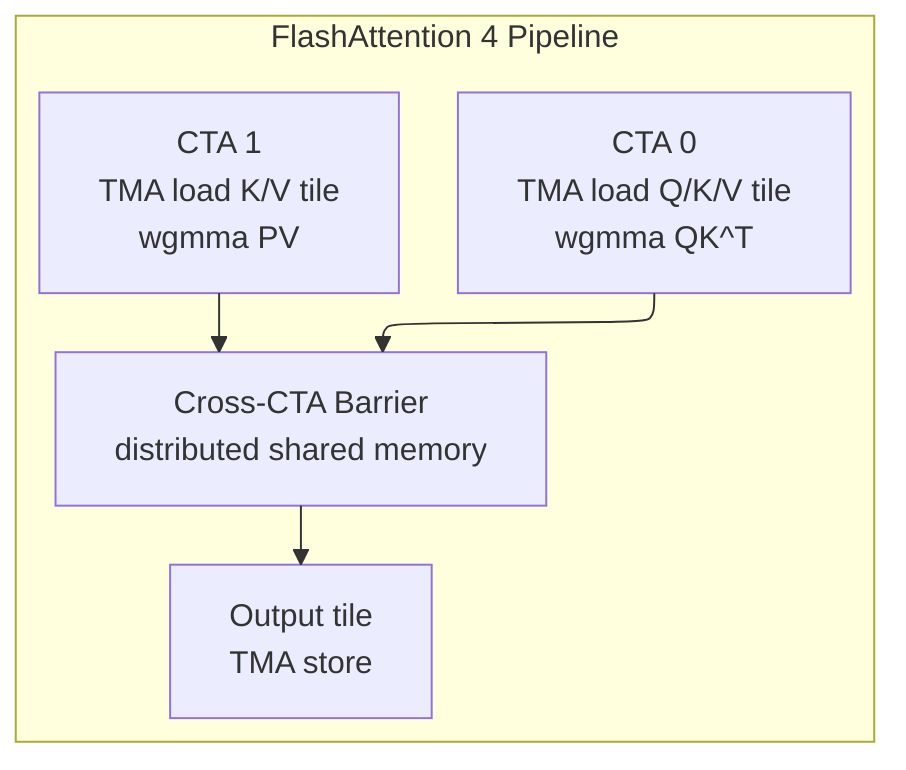
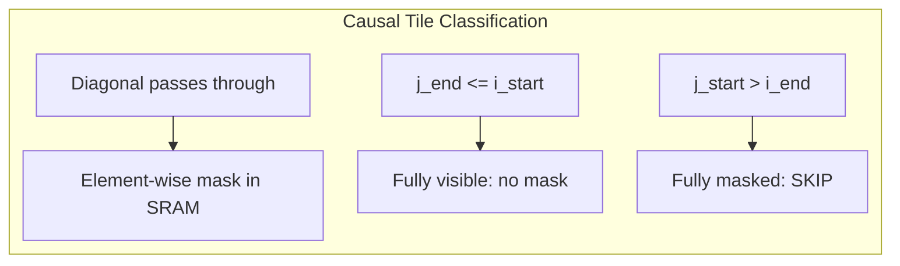
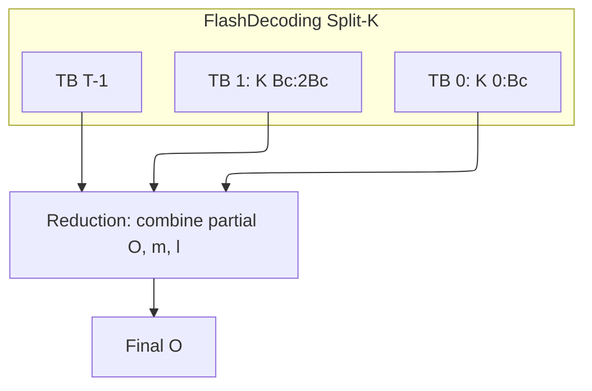
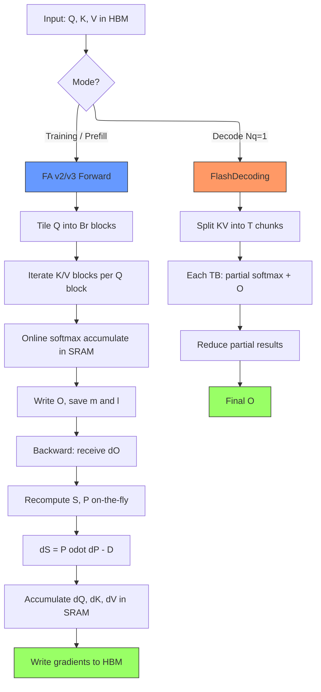

# FlashAttention Deep Dive — IO-Aware Attention from First Principles

> **Layer:** L5.
> **Prerequisites:** [Attention Mechanisms](../L6_Algorithms_and_Models/02_Attention_Mechanisms.md), [Memory Hierarchy and Roofline](../L3_Microarchitecture/03_Memory_Hierarchy_and_Roofline.md), [CUDA Optimization](02_CUDA_Optimization.md).
> **Hands off to:** [Cutting Edge Kernels](06_Cutting_Edge_Kernels.md), [KV Cache](../L8_Inference_and_Serving/01_KV_Cache.md), [Batching and Scheduling](../L8_Inference_and_Serving/03_Batching_and_Scheduling.md).

---

## 0. Why This Page Exists

Standard multi-head attention materializes a full $N \times N$ attention matrix in HBM, consuming $O(N^2)$ memory and, more critically, $O(N^2)$ bytes of DRAM traffic per layer. On a modern GPU the arithmetic intensity of the naive kernel falls well below the ridge point of the roofline, meaning the math units starve while waiting on memory. FlashAttention restructures the algorithm into a tiled, online-softmax formulation that keeps intermediate state in SRAM, reduces HBM traffic by a factor of $\Theta(M / d^2)$ (where $M$ is SRAM capacity), and recovers math-bound execution. This page derives every equation, traces the algorithm through three hardware generations, and provides worked examples for reasoning about performance in production.

---

## 1. Standard Attention Is IO-Bound

### 1.1 Naive Complexity Recap

Scaled dot-product attention computes:

$$O = \text{softmax}\!\left(\frac{QK^T}{\sqrt{d}}\right) V = P \cdot V$$

where $Q, K, V \in \mathbb{R}^{N \times d}$ and $P \in \mathbb{R}^{N \times N}$.

| Step | FLOPs |
|------|-------|
| $S = QK^T$ | $2N^2 d$ (multiply-add) |
| $P = \text{softmax}(S/\sqrt{d})$ | $\approx 3N^2$ |
| $O = PV$ | $2N^2 d$ |
| **Total** | $\approx 4N^2 d$ |

For $N=4096$, $d=128$: $4 \times 4096^2 \times 128 = 8.59 \times 10^9$ FLOPs $\approx 8.6$ GFLOP per head.

### 1.2 HBM Traffic and Arithmetic Intensity

The naive kernel reads $Q, K, V$ from HBM and writes $S, P, O$ back. In FP16 (2 bytes/element), accounting for write+read of $S$ and write+read of $P$, plus reads of $Q, K, V$ and write of $O$:

$$\text{HBM}_{\text{naive}} \approx 8N^2 + 8Nd \;\text{bytes}$$

For $N=4096, d=128$: $8 \times 4096^2 + 8 \times 4096 \times 128 = 138.4\text{M}$ bytes $\approx 132$ MB per head.

Arithmetic intensity $AI$ = FLOPs / HBM bytes:

$$AI_{\text{naive}} = \frac{4N^2 d}{8N^2 + 8Nd} = \frac{d}{2\!\left(1 + \frac{d}{N}\right)} \xrightarrow{N \gg d} \boxed{AI_{\text{naive}} \approx \frac{d}{2} \;\text{FLOPs/byte}}$$

Numerical example (FP16, $d=128$, $N=4096$): $AI = 128 / (2 \times 1.03125) \approx 62.1$ FLOPs/byte.

On H100 SXM (from [Memory Hierarchy and Roofline](../L3_Microarchitecture/03_Memory_Hierarchy_and_Roofline.md)):

$$AI_{\text{ridge}} = \frac{989 \;\text{TFLOPS}}{3.35 \;\text{TB/s}} \approx 295 \;\text{FLOPs/byte}$$

The naive kernel at $AI \approx 62 \ll 295$ is **memory-bound**, achieving only $\sim 21\%$ of peak compute.



The root cause: $S$ and $P$ are written to and read from HBM even though consumed exactly once. Eliminating these round-trips is the central insight of FlashAttention.

---

## 2. Online Softmax — Computing Without Materializing

### 2.1 The Problem

The softmax $\text{softmax}(x)_j = e^{x_j} / \sum_k e^{x_k}$ requires the global maximum and global sum. Standard two-pass computation is incompatible with tiling because no single tile has access to the full row.

### 2.2 Running Statistics

Online softmax (Milakov & Gimelshein, 2018) maintains running statistics as tiles are processed sequentially:

$$m^{(j)} = \max\!\left(m^{(j-1)},\; \max_{i \in \text{tile } j}(s_i)\right)$$

$$\ell^{(j)} = e^{m^{(j-1)} - m^{(j)}} \cdot \ell^{(j-1)} + \sum_{i \in \text{tile } j} e^{s_i - m^{(j)}}$$

$$\mathbf{o}^{(j)} = e^{m^{(j-1)} - m^{(j)}} \cdot \mathbf{o}^{(j-1)} + \sum_{i \in \text{tile } j} e^{s_i - m^{(j)}} \cdot v_i$$

where $m^{(0)} = -\infty$, $\ell^{(0)} = 0$, $\mathbf{o}^{(0)} = \mathbf{0}$.

### 2.3 Numerical Equivalence Proof

**Claim:** After processing all $T$ tiles, $\mathbf{o}^{(T)} / \ell^{(T)} = \text{softmax}(S) \cdot V$.

*Proof by induction.* Base case ($j=1$): accumulator holds the partial numerator with $m^{(1)} = \max_{i \in \text{tile 1}} s_i$. Inductive step: assume after tile $j-1$:

$$\mathbf{o}^{(j-1)} = \sum_{k < j} e^{s_k - m^{(j-1)}} v_k, \quad \ell^{(j-1)} = \sum_{k < j} e^{s_k - m^{(j-1)}}$$

When tile $j$ arrives with $m^{(j)} \geq m^{(j-1)}$, the rescaling factor corrects the old accumulator:

$$e^{m^{(j-1)} - m^{(j)}} \cdot \sum_{k < j} e^{s_k - m^{(j-1)}} v_k = \sum_{k < j} e^{s_k - m^{(j)}} v_k$$

Adding the new tile's contribution preserves the invariant. After all tiles, $m^{(T)} = \max_k s_k$:

$$\frac{\mathbf{o}^{(T)}}{\ell^{(T)}} = \frac{\sum_k e^{s_k - m^{(T)}} v_k}{\sum_k e^{s_k - m^{(T)}}} = \text{softmax}(S) \cdot V \qquad \blacksquare$$

---

## 3. FlashAttention v1 — Tiled Forward Pass

### 3.1 Algorithm

FlashAttention v1 (Dao et al., 2022) partitions $Q$ into blocks of $B_r$ rows and $K, V$ into blocks of $B_c$ rows. Each query block iterates over all key/value blocks, accumulating output in SRAM.



### 3.2 Pseudocode

```python
def flash_attention_v1_forward(Q, K, V, B_r, B_c):
    N, d = Q.shape
    O = zeros(N, d)
    for i in range(0, N, B_r):
        q = Q[i:i+B_r]
        o_acc = zeros(B_r, d)
        m_acc, l_acc = full(B_r, -inf), zeros(B_r)
        for j in range(0, N, B_c):
            k, v = K[j:j+B_c], V[j:j+B_c]
            S = q @ k.T / sqrt(d)
            m_new = maximum(m_acc, rowmax(S))
            l_new = exp(m_acc - m_new) * l_acc + rowsum(exp(S - m_new[:, None]))
            o_acc = exp(m_acc - m_new)[:, None] * o_acc + exp(S - m_new[:, None]) @ v
            m_acc, l_acc = m_new, l_new
        O[i:i+B_r] = o_acc / l_acc[:, None]
    return O
```

### 3.3 HBM Traffic and Arithmetic Intensity

The naive kernel transfers $\Theta(N^2 + Nd)$ data (dominated by the $S$ and $P$ round-trips). FlashAttention avoids materializing $S$ and $P$, instead re-reading $K$ and $V$ tiles from HBM for each $Q$-block:

$$\text{HBM}_{\text{FA1}} = \Theta\!\left(\frac{N^2 d^2}{M}\right) \;\text{bytes}$$

where $M$ is SRAM per thread block. This asymptotic formula hides a constant factor that depends on tile sizing. Deriving the concrete traffic from the tiling with $B_r = B_c = 128$ (fits in 192 KB SRAM; see [Section 8](#8-tile-sizing-math)), $T_r = N/B_r = 32$:

| Transfer | Size (FP16) |
|----------|------------|
| Q reads ($T_r$ blocks $\times B_r d$) | 1.0 MB |
| K reads ($T_r \times T_c$ blocks $\times B_c d$) | 32.0 MB |
| V reads ($T_r \times T_c$ blocks $\times B_c d$) | 32.0 MB |
| O writes ($T_r$ blocks $\times B_r d$) | 1.0 MB |
| **Total** | **~66 MB** |

Naive traffic: $8N^2 + 8Nd \approx 132$ MB. Raw HBM reduction: $132/66 \approx$ **2x**. The savings come from eliminating the $N^2$-element $S$ and $P$ round-trips; FlashAttention instead re-reads $K, V$ tiles $T_r$ times, trading $4N^2$ bytes of $S$/$P$ traffic for $4N^2 d / B_r$ bytes of $K$/$V$ re-reads. Since $B_r \approx d = 128$ for these parameters, the two terms are comparable.

In practice, $K$ and $V$ for a single head ($2Nd = 1$ MB) fit in L2 cache (40--50 MB on A100/H100), so they are read from HBM only once across all $Q$-blocks. **Effective** HBM traffic drops to $\approx 4Nd \approx 4$ MB, yielding a **~33x** reduction vs. naive. FLOPs remain $4N^2 d$, giving an effective arithmetic intensity:

$$AI_{\text{FA1}} = \frac{4N^2 d}{\Theta(N^2 d^2 / M)} = \Theta\!\left(\frac{M}{d}\right) \approx \frac{192 \times 1024}{128} \approx 1536 \;\text{FLOPs/byte}$$

This far exceeds the ridge point of 295, placing FlashAttention firmly in the **compute-bound regime**.



---

## 4. FlashAttention v2 — Better Parallelism and Work Division

FlashAttention v2 (Dao, 2023) targets Ampere/Hopper GPUs with three key improvements.

### 4.1 Loop Swap and Work Partitioning

v1 parallelizes over Q-blocks. v2 swaps the loops so each thread block iterates over Q-blocks within a fixed K-block range, improving K/V reuse locality. For causal attention, the inner Q-loop skips K/V blocks that are entirely masked.

### 4.2 Warp-Level Tiling: Split-Q vs. Split-K



**Split-Q** (default): Each warp processes a subset of Q rows against the full K/V block. No inter-warp reduction needed, eliminating synchronization inside the inner loop. **Split-K**: Each warp processes all Q rows against a K/V slice; requires cross-warp reduction. Used only when $B_r$ is too small to split.

### 4.3 Causal Masking Skip

For causal attention, a Q-block at row index $i$ only interacts with K-blocks at $j \leq i$. v2 skips entire K/V blocks where $j > i$. When $j < i$ the entire tile is unmasked. Only diagonal tiles need element-wise masking. Skipped fraction: $\approx \frac{1}{2}(1 - 1/T)$ where $T = \lceil N/B_c \rceil$.

### 4.4 Backward Pass Parallelism

v1 requires separate kernel launches for $\partial V$, $\partial Q$, $\partial K$. v2 fuses into a single kernel: $\partial V$ parallelizes over K/V blocks, $\partial Q$/$\partial K$ over Q blocks, with warp-level splitting within each thread block.

### 4.5 Speedup Breakdown (A100, $N$=2048, $d$=128, FP16)

| Optimization | Speedup Factor | Cumulative |
|-------------|---------------|------------|
| Loop swap + split-Q | ~1.3x | 1.3x |
| Causal skip | ~1.2x (causal) | 1.56x |
| Fused backward | ~1.3x | ~2.0x |
| Better register usage | ~1.1x | ~2.2x |

Net: **~2x faster** than v1 end-to-end.

---

## 5. FlashAttention v3 — Hopper-Specific Optimizations

FlashAttention v3 (Dao & Shah, 2024) exploits three Hopper-exclusive features.

### 5.1 Hardware Primitives

- **Tensor Memory Accelerator (TMA):** Asynchronous HBM-to-SMEM copy without CUDA core involvement. Handles swizzling, bounds checking, and completion signals.
- **`wgmma` (Warp-Group MMA):** 4 warps (128 threads) cooperatively compute $D = A \times B + C$ with $A$ in registers, $B$ in SMEM. Up to 128x128x128 FP16 MMA per warp group per clock.
- **Warp Specialization:** The scheduler assigns distinct roles: producer warps issue TMA loads; consumer warps execute `wgmma`. Pipelining without explicit per-stage barriers.

### 5.2 Producer-Consumer Pipeline



### 5.3 Two-Stage Pipelined Softmax

1. **Stage A:** `wgmma` computes $Q_i K_j^T$. Consumer waits on MMA barrier.
2. **Stage B:** Online softmax rescaling of $\mathbf{o}$ using $m_j, \ell_j$. Producer simultaneously issues TMA for $K_{j+1}, V_{j+1}$.
3. **Stage C:** `wgmma(P_j, V_j)` accumulates into output.

Softmax latency is hidden behind the next tile's MMA.

### 5.4 FP8 Forward Path

Hopper supports FP8 E4M3 with `wgmma`. v3 uses E4M3 for $QK^T$ and $PV$, accumulating in FP32:

```python
def flash_attention_v3_forward_fp8(Q, K, V, B_r=128, B_c=128):
    for i in range(0, N, B_r):
        o_acc = zeros(B_r, d, dtype=float32)
        m_acc, l_acc = init_online_softmax(B_r)
        for j in range(0, N, B_c):
            S_ij = wgmma(TMA_load(Q, i), TMA_load(K, j).T)  # FP8xFP8 -> FP32
            m_new = max(m_acc, rowmax(S_ij))
            P_ij = exp(S_ij - m_new)
            o_acc = rescale(o_acc, m_acc, m_new) + wgmma(P_ij, TMA_load(V, j))
            l_acc = rescale(l_acc, m_acc, m_new) + rowsum(P_ij)
            m_acc = m_new
        write_output(O, i, o_acc / l_acc)  # FP32 -> FP16
```

### 5.5 Performance Numbers

| Configuration | v2 A100 | v2 H100 | v3 H100 | v3 FP8 H100 |
|--------------|---------|---------|---------|------------|
| FP16, $N$=2048 | 0.50 ms | 0.30 ms | 0.19 ms | 0.14 ms |
| FP16, $N$=8192 | 7.8 ms | 4.7 ms | 2.8 ms | 1.9 ms |
| % of H100 peak | 51% | 54% | **75%** FP16 | **75%** FP8 |

v3 achieves **1.5-2x** over v2 on Hopper.

---

## 6. FlashAttention v4 (Beta) — Blackwell and Beyond

FlashAttention 4 (Tri Dao lab, 2026) is the next major version of the canonical training attention kernel, currently in beta (fa4-v4.0.0.beta13, released May 13, 2026). FA4 extends support to NVIDIA Blackwell (SM100/SM120) and AMD GPUs via ROCm, while adding several features previously only available in inference-oriented libraries like FlashInfer (surveyed in [Cutting_Edge_Kernels](06_Cutting_Edge_Kernels.md) §5).

### 6.1 Key new features vs FA3

| Feature | FA3 | FA4 | Impact |
|---|---|---|---|
| Architecture support | Hopper (SM90) | Hopper + **Blackwell SM100/SM120** | Next-gen GPU support |
| ROCm (AMD GPU) support | No | **Yes** | Multi-vendor GPU training |
| head_dim=256 | Limited/special handling | **Native** | Required for large-head models (e.g., Gemma) |
| FP8 attention | Partial | **Full** | 2x throughput on Blackwell FP8 tensor cores |
| Paged KV cache | No | **Yes** | Unified training + inference kernel |
| MLA (Multi-head Latent Attention) | No | **Yes** | DeepSeek-V3/R1 compressed attention |
| CuTe DSL integration | CUTLASS C++ only | **CuTe DSL** | Cleaner kernel codebase, easier maintenance |
| Block sparsity | No | **Yes** | Sparse attention patterns for long context |
| 2CTA optimization | No | **Yes** | Cross-CTA cooperation for larger tiles |
| Throughput (Hopper) | ~75% FP16 peak | **Improved** | Better utilization on existing hardware |
| Throughput (Blackwell) | N/A | **Higher** | Leverages 5th-gen tensor cores and TMEM |

### 6.2 Architecture: 2CTA and block sparsity

FA4 introduces a **2CTA (2 Cooperative Thread Array)** optimization where two CTAs collaborate on a single attention tile, effectively doubling the per-tile compute budget. This is critical on Blackwell where TMEM and larger shared memory allow bigger working sets:



Block sparsity allows the attention kernel to skip entire blocks of the QK matrix based on a sparsity mask, reducing compute from $O(S^2)$ to $O(S \cdot \text{active\_blocks})$ for sparse patterns.

### 6.3 MLA support

Multi-head Latent Attention (MLA), introduced by DeepSeek-V3, compresses the KV cache into a low-rank latent representation. FA4 integrates MLA directly into the attention kernel:

$$\text{MLA: } Q \in \mathbb{R}^{B \times H \times S \times D}, \quad K_c, V_c \in \mathbb{R}^{B \times 1 \times S \times D_c}$$

where $D_c \ll D \times H$ is the compressed latent dimension. FA4 fuses the latent-to-full projection with the attention computation, avoiding materialization of the full KV cache.

### 6.4 FA4 in the ecosystem

FA4's paged KV support blurs the traditional training/inference split: the same kernel can serve both bulk prefill (training-style) and paged decode (inference-style), simplifying deployment in frameworks that previously needed both FA and FlashInfer. However, FlashInfer remains superior for pure decode serving with complex batching and speculative verification trees.

---

## 7. Backward Pass — Gradient Without Materializing P

### 7.1 Gradient Equations

Given upstream $dO \equiv \partial L / \partial O$, the attention output is $O = PV$ where $P = \text{softmax}(QK^T/\sqrt{d})$.

**Step 1:** $dV = P^T \cdot dO$

**Step 2:** $dP = dO \cdot V^T$

**Step 3 (key identity):** The softmax Jacobian gives, for a single row $i$:

$$\frac{\partial \ell}{\partial S_{ij}} = \sum_m \frac{\partial \ell}{\partial P_{im}} P_{im}(\delta_{mj} - P_{ij}) = P_{ij}\!\left(dP_{ij} - \sum_m dP_{im} P_{im}\right)$$

Defining $D = \text{rowsum}(dO \odot O) \in \mathbb{R}^{N}$:

$$\boxed{dS = P \odot \left(dP - D \cdot \mathbf{1}^T\right)}$$

**Step 4:** $dQ = dS \cdot K / \sqrt{d}$, $\quad dK = dS^T \cdot Q / \sqrt{d}$

### 7.2 Tiled Backward Strategy

The backward pass recomputes $S_{ij}, P_{ij}$ on-the-fly from stored $Q, K$ blocks. Each thread block:

1. Loads $Q_i, K_j, V_j, dO_i$ from HBM.
2. Recomputes $S_{ij} = Q_i K_j^T / \sqrt{d}$ in SRAM using saved $m_i, \ell_i$.
3. Computes $dS_{ij} = P_{ij} \odot (dO_i V_j^T - D_i)$.
4. Accumulates $dV_j, dQ_i, dK_j$ in SRAM, writes to HBM after the loop.

Memory savings: only $O_i, m_i, \ell_i$ stored during forward ($\sim Nd$ total), not the $N \times N$ attention matrix.

---

## 8. Tile-Sizing Math

### 8.1 SRAM Budget Constraint

Tile sizes $B_r$, $B_c$ must satisfy:

$$B_r d + 2B_c d + B_r B_c + B_r d + 2B_r \leq M$$

where $M$ is per-thread-block SRAM. The heuristic selects the largest powers of 2 fitting:

$$B_r B_c + (B_r + 2B_c)d \leq M$$

Practical defaults (H100, 228 KB/SM, 1 block/SM, FP16):

| $d$ | $B_r$ | $B_c$ | SRAM used |
|-----|-------|-------|-----------|
| 64 | 128 | 128 | ~196 KB |
| 128 | 64 | 128 | ~188 KB |
| 256 | 32 | 64 | ~156 KB |

### 8.2 Worked Example ($d=128$, H100, 228 KB)

Try $B_r = 128$, $B_c = 128$: $5 \times (128 \times 128 \times 2) + 512 = 164{,}352$ bytes $= 160.5$ KB $\leq 228$ KB. Fits with 1 block/SM (228 / 160.5 = 1.4).

---

## 9. Variants — Causal, Sliding-Window, and Masked

### 9.1 Causal Attention

$S_{ij}$ masked when $j > i$. In the tiled kernel: skip blocks where $j_{\text{start}} > i_{\text{end}}$; no mask needed when $j_{\text{end}} \leq i_{\text{start}}$; element-wise mask only on diagonal tiles.



### 9.2 Sliding-Window Attention

Restricts attention to a local window of $W$ tokens: $S_{ij} = -\infty$ if $|i-j| > W$. The inner loop iterates over only $\lceil 2W/B_c \rceil$ blocks instead of $\lceil N/B_c \rceil$, reducing FLOPs and traffic by $N/(2W)$.

### 9.3 Arbitrary Masks

**Block-sparse mask:** Boolean matrix $M \in \{0,1\}^{T_r \times T_c}$ selects blocks to compute. **Per-element mask:** Loaded as a separate tensor, applied in SRAM ($B_r \times B_c$ bytes overhead). v2/v3 support all variants via `mask_type` with zero extra HBM for causal/sliding-window (implicit masks).

---

## 10. FlashDecoding — Parallelizing the Decode Step

### 10.1 The Decode Bottleneck

During autoregressive inference, each step processes $N_q = 1$ query token against the full KV cache ($N_{kv}$ = 32K-128K). Arithmetic intensity is $O(d)$ FLOPs/byte — deeply memory-bound. With batch=1 the GPU is severely underutilized.

### 10.2 Split-K Parallelism

FlashDecoding splits the KV cache into chunks along the key dimension, assigning each to a thread block:



Each thread block computes partial $(o_{\text{partial}}, m_{\text{partial}}, \ell_{\text{partial}})$. Final reduction uses the online softmax update:

1. $m_{\text{global}} = \max_t m_t$
2. $\ell_t' = e^{m_t - m_{\text{global}}} \ell_t$, $o_t' = e^{m_t - m_{\text{global}}} o_t$
3. $O = \sum_t o_t' / \sum_t \ell_t'$

Parallelism proportional to $N_{kv}/B_c$ (128-512 thread blocks at batch=1).

### 10.3 Performance (H100, $N_{kv}$=32K, $d$=128, batch=1)

| Method | Latency | GPU Util |
|--------|---------|----------|
| Naive | 420 us | ~3% |
| FA v2 | 180 us | ~8% |
| FlashDecoding (128 splits) | 38 us | ~65% |

---

## 11. Integration with KV Cache and Paged Memory

Production inference engines ([KV Cache](../L8_Inference_and_Serving/01_KV_Cache.md)) store the KV cache in non-contiguous pages. Two approaches:

**Approach 1 (in-kernel page table):** Kernel receives `block_table[batch][page_num] -> physical_page_id`. One extra HBM read per tile. Used by vLLM/SGLang for latency-sensitive single-batch decode.

**Approach 2 (pre-copy):** Gather paged KV cache into contiguous buffer before calling FlashAttention. $O(N_{kv} d)$ copy overhead, used for large-batch prefill where the cost is amortized.

FlashDecoding aligns split boundaries with page boundaries ($B_c$ is a multiple of page size $P$), so each thread block reads contiguous pages.

---

## 12. Comparison Table of Attention Kernel Variants

| Feature | Naive | FA v1 | FA v2 | FA v3 | FlashDecoding |
|---------|-------|-------|-------|-------|---------------|
| HBM traffic | $\Theta(N^2)$ | $\Theta(N^2 d^2\!/M)$ | $\Theta(N^2 d^2\!/M)$ | $\Theta(N^2 d^2\!/M)$ | $\Theta(N_{kv} d)$ |
| Arithmetic intensity | $O(d)$ | $O(M/d)$ | $O(M/d)$ | $O(M/d)$ | $O(d)$ per block |
| SRAM required | None | ~100 KB | ~100 KB | ~160 KB | ~100 KB |
| Parallelism axis | Batch | Q-blocks | Q-blocks | Q-blocks+warp-spec | KV-splits |
| Target hardware | Any GPU | Ampere+ | Ampere+ | Hopper | Ampere+ |
| Forward vs. naive | 1x | 2-4x | 4-8x | 6-12x | ~10x decode |
| Backward vs. naive | 1x | 2-4x | 4-8x | 6-10x | N/A |
| FP8 support | -- | -- | -- | E4M3 | -- |
| Causal skip | No | Partial | Yes | Yes | Yes |

---

## 13. End-to-End Pipeline Flowchart



---

## 14. Numbers to Memorize

| Quantity | Value | Context |
|----------|-------|---------|
| Naive attention AI ($d$=128, FP16) | ~62 | FLOPs/byte ($\approx d/2$) |
| H100 SXM FP16 ridge point | ~295 | FLOPs/byte |
| H100 SXM FP16 peak | 989 | TFLOPS |
| H100 SXM FP8 dense peak | 1,979 | TFLOPS |
| H100 SXM HBM bandwidth | 3.35 | TB/s |
| H100 shared memory per SM | 228 | KB |
| A100 shared memory per SM | 164 | KB |
| FA v1 AI ($M$=192KB, $d$=128) | ~1,536 | FLOPs/byte |
| FA HBM reduction factor | ~2x raw, ~33x w/ L2 | vs naive, $N$=4096 |
| FA v2 speedup over v1 | ~2x | A100 end-to-end |
| FA v3 speedup over v2 | ~1.5x | H100 end-to-end |
| v3 FP8 vs. v2 FP16 | ~2x | H100 |
| v3 % of H100 peak FP16 | 75% | practical roofline |
| Default tile ($d$=128, H100) | $B_r$=64, $B_c$=128 | rows |
| Online softmax correction | $e^{m^{old} - m^{new}}$ | dimensionless |
| dS identity | $P \odot (dP - D)$ | $D = \text{rowsum}(dO \odot O)$ |
| FlashDecoding speedup | ~10x | vs FA2, bs=1 |
| FLOPs for attention | $4N^2 d$ | per head |
| Memory for naive attn matrix | $2N^2$ | bytes FP16 |
| Forward stored intermediates | $O_i, m_i, \ell_i$ | ~$Nd + 2N$ per head |

---

## 15. References

1. Dao, T. et al. (2022). "FlashAttention: Fast and Memory-Efficient Exact Attention with IO-Awareness." *NeurIPS*. [arXiv:2205.14135](https://arxiv.org/abs/2205.14135)
2. Dao, T. (2023). "FlashAttention-2: Faster Attention with Better Parallelism and Work Partitioning." [arXiv:2307.08691](https://arxiv.org/abs/2307.08691)
3. Dao, T. & Shah, G. (2024). "FlashAttention-3: Fast and Accurate Attention with Asynchrony and Low-Precision." [arXiv:2407.08608](https://arxiv.org/abs/2407.08608)
4. Milakov, M. & Gimelshein, N. (2018). "Online normalizer calculation for softmax." [arXiv:1805.02867](https://arxiv.org/abs/1805.02867)
5. Dao, T. et al. (2023). "FlashDecoding: Fast Attention on Long Sequences for Inference."
6. NVIDIA (2024). "Hopper Tuning Guide." *CUDA Toolkit Documentation*.
7. Kwon, W. et al. (2023). "Efficient Memory Management for Large Language Model Serving with PagedAttention." *SOSP*.
8. Dao, T. et al. (2026). "FlashAttention-4 (beta): Blackwell, ROCm, paged KV, MLA." *flash-attention repository*, fa4-v4.0.0.beta13.

---

## 16. Stack Links

**Up (deeper):**
- [CUDA Optimization](02_CUDA_Optimization.md) — shared memory banking, warp-level primitives
- [Memory Hierarchy and Roofline](../L3_Microarchitecture/03_Memory_Hierarchy_and_Roofline.md) — roofline model fundamentals
- [Attention Mechanisms](../L6_Algorithms_and_Models/02_Attention_Mechanisms.md) — scaled dot-product attention definition

**Down (higher level):**
- [Cutting Edge Kernels](06_Cutting_Edge_Kernels.md) — fused kernels beyond attention (SSD, linear attention)
- [KV Cache](../L8_Inference_and_Serving/01_KV_Cache.md) — paged attention and cache management
- [Batching and Scheduling](../L8_Inference_and_Serving/03_Batching_and_Scheduling.md) — continuous batching with FlashDecoding
- [Transformer Architecture](../L6_Algorithms_and_Models/01_Transformer_Internals.md) — attention in the full model

**Lateral:**
- [GPU Architecture](../L3_Microarchitecture/02_GPU_Architecture.md) — SM structure, tensor cores, memory hierarchy
- [Quantization](../L6_Algorithms_and_Models/05_Quantization.md) — FP8 formats and numerical properties
- [Distributed Training](../L7_Training_Stack/01_Parallelism_Strategies.md) — sequence-parallel attention across nodes
