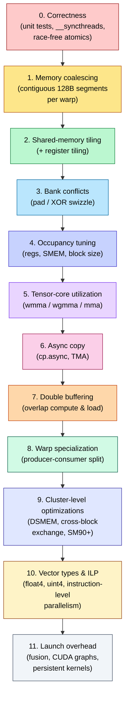
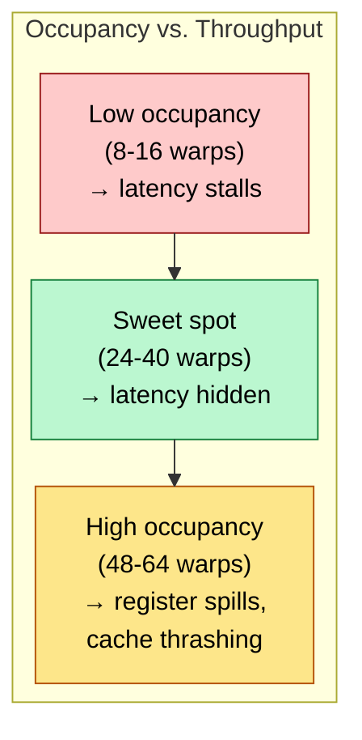
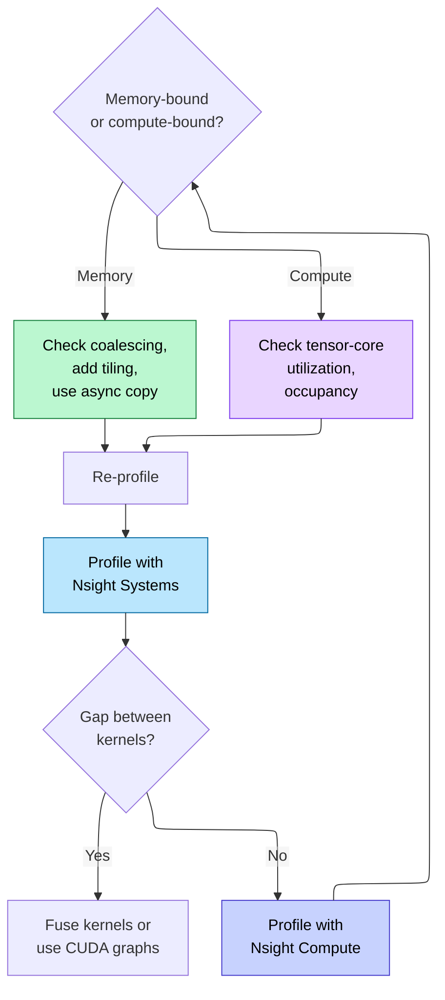
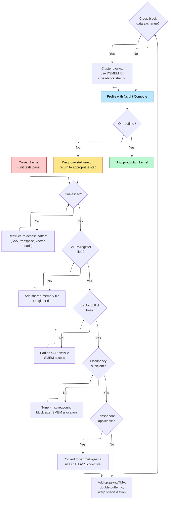

# CUDA Optimization — From Working Kernel to Peak Throughput

> **Layer:** L5.
> **Prerequisites:** [CUDA_Programming](CUDA_Programming.md), [On_Chip_Memory_Hardware](../L2_Digital_Design_for_AI/On_Chip_Memory_Hardware.md), [GPU_Architecture](../L3_Microarchitecture/GPU_Architecture.md).
> **Hands off to:** [Triton_and_Kernels](Triton_and_Kernels.md), [FlashAttention_Deep_Dive](FlashAttention_Deep_Dive.md).

---

## 0. The optimization ladder

A working CUDA kernel is the starting point, not the end. The gap between a functionally correct first draft and a production kernel operating at 80-90% of device peak is typically 10-50x in throughput. That gap is closed by applying a fixed sequence of optimizations, each one a precondition for the next: coalesced memory access before tiling, tiling before bank-conflict resolution, bank-conflict resolution before occupancy tuning, occupancy tuning before tensor-core offload, and so on. Skipping steps produces a kernel that profiles well on one metric but stalls on another. This page walks the generic rungs of that ladder — coalescing, tiling, bank conflicts, occupancy, vectorization, launch overhead — diagnoses failure modes with Nsight tools, and ends with a case study that ties everything together. The tensor-core rungs (tensor-core utilization, TMEM, async copy, double buffering, warp specialization, clusters) get their own page: [Tensor_Core_Programming](Tensor_Core_Programming.md).

---

## 1. The optimization checklist — order matters



Each step assumes the prior step is already satisfied. Applying tensor-core intrinsics to a kernel with uncoalesced accesses yields worse results than a coalesced FP32 kernel. The hierarchy is causal, not merely a preference. Steps 5–9 of the ladder (tensor-core utilization through cluster-level optimizations) are covered in depth in [Tensor_Core_Programming](Tensor_Core_Programming.md); sections 6–7 below pick the ladder back up at vectorization and launch overhead.

---

## 2. Memory coalescing

### 2.1 What the hardware expects

A warp's 32 threads issue memory transactions in **128-byte segments** (32 threads x 4 bytes for FP32). The GPU's load/store unit coalesces these into the minimum number of 32-byte (L1) or 128-byte (L2/HBM) transactions. Coalescing occurs when thread $t$ in a warp accesses address $A_{\text{base}} + t \cdot \text{sizeof}(T)$ for a contiguous, aligned range.

### 2.2 Diagnosing with Nsight Compute

```bash
ncu --set full --section MemoryWorkloadAnalysis ./my_kernel
```

Key metrics:

| Metric | Ideal | Diagnostic |
|--------|-------|-----------|
| `l1tex__t_sectors_pipe_lsu_mem_global_op_ld.sum` | Minimal | Excess sectors = uncoalesced |
| `l1tex__data_pipe_lsu_wavefronts_mem_shared_op_ld.sum` | Equal to warp count | Higher = bank conflicts |
| `smsp__sass_inst_executed_op_global_ld.sum` | Low | High count = too many separate loads |
| `lts__t_sectors_op_read.sum` | $N \cdot \text{elements} \cdot \text{sizeof} / 32$ | Anything above = waste |

Nsight Compute flags uncoalesced accesses in the `MEMORY` section with a "Sector Miss Ratio" above ~1.125x the ideal.

### 2.3 Common patterns and fixes

**AoS to SoA transformation.** An array of `struct { float x, y, z; }` produces stride-3 access per field. Transposing to three separate `float*` arrays yields stride-1 access per load. This is the single most impactful coalescing fix for particle, graph, and point-cloud kernels.

**2D row-major access.** Thread `(ty, tx)` reading `input[ty][tx]` is coalesced (adjacent tx = adjacent addresses). Reading `input[tx][ty]` is strided by the row pitch — typically 32-128x more transactions. Transpose the loop order or transpose the data layout.

```c
// BAD: strided access, 128x more transactions
float val = input[tx * WIDTH + ty];

// GOOD: coalesced, 1 transaction per warp
float val = input[ty * WIDTH + tx];
```

---

## 3. Shared-memory tiling

### 3.1 Why tile

Global memory on Hopper delivers ~3 TB/s (HBM3). The SM's compute units consume data at ~20-100 TB/s internally. The ratio is 7-33x. Tiling copies a reusable data block from HBM into SMEM (~19 TB/s on A100 with 164 KB SMEM; ~30 TB/s on Hopper/Blackwell with 228 KB SMEM) or registers (register file bandwidth ~64 TB/s), amortizing the slow HBM transfer across many arithmetic operations.

### 3.2 Matrix-multiply tiling

For $C = A \times B$ where $A$ is $M \times K$ and $B$ is $K \times N$, a tile of size $BM \times BK$ is loaded from $A$ and $BK \times BN$ from $B$. The outer loop iterates over $K/BK$ tiles. Each iteration loads two tiles into SMEM, computes a partial product, and accumulates into registers.

$$
\text{HBM bytes} = 2 \cdot BM \cdot BK \cdot \frac{K}{BK} \cdot \text{sizeof}(T) + M \cdot N \cdot \text{sizeof}(T)
$$

Without tiling, each thread reads one row of $A$ and one column of $B$ per output element: $K$ loads per element. With tiling, the $A$-tile is reused across $BN$ columns and the $B$-tile across $BM$ rows, reducing HBM traffic by a factor of $\sim \min(BM, BN)$.

```c
__shared__ float sA[BLOCK_M][BLOCK_K];
__shared__ float sB[BLOCK_K][BLOCK_N];

// Load tile from global to shared memory
sA[ty][tx] = A[row * K + k_iter * BLOCK_K + tx];
sB[ty][tx] = B[(k_iter * BLOCK_K + ty) * N + col];
__syncthreads();

// Compute partial product in registers
for (int kk = 0; kk < BLOCK_K; kk++) {
    float a_val = sA[ty][kk];
    for (int nn = 0; nn < BLOCK_N_PER_THREAD; nn++) {
        regC[nn] += a_val * sB[kk][tx * BLOCK_N_PER_THREAD + nn];
    }
}
__syncthreads();
```

### 3.3 Register tiling

Beyond SMEM tiling, each thread computes a small $RM \times RN$ block of the output in registers. This eliminates repeated SMEM reads of the same $A$-row or $B$-column within a thread's output tile. The compiler keeps these in registers (no spills) as long as $RM \cdot RN$ per thread stays below the register budget.

For a warp-level cooperative load of tile $BM \times BK$: each of 32 threads loads $(BM \cdot BK) / 32$ elements using vector loads (`float4`).

---

## 4. Bank conflicts

### 4.1 SMEM bank architecture

Shared memory on NVIDIA GPUs is organized as 32 banks. Bank $b$ holds every 32-bit word at address $a$ where $a \mod 32 = b$. Each bank services one address per cycle. When two or more threads in the same warp access different addresses in the same bank on the same instruction, a **bank conflict** serializes the accesses into multiple cycles.

- No conflict: all 32 threads access distinct banks (1 cycle).
- $n$-way conflict: accesses are split into $n$ serial rounds (n cycles).
- **Broadcast exception:** if all conflicting threads read the *same* address in a bank, the value is broadcast in 1 cycle (no penalty).

### 4.2 Padding

The simplest fix for a bank conflict in a 2D SMEM array is to pad each row by one element, shifting subsequent rows so their column-0 lands in a different bank.

```c
// Without padding: column access conflicts (same bank)
__shared__ float tile[64][32];   // column j always bank j

// With padding: column access is conflict-free
__shared__ float tile[64][33];   // row stride = 33, breaks alignment
```

Padding costs $(\text{rows}) \times 4$ bytes of SMEM. For a 64x33 float array: 8 448 bytes, negligible against the 256 KB budget.

### 4.3 XOR swizzle

Padding wastes SMEM and complicates indexing. XOR swizzling computes a transformed index that permutes banks without changing the array dimensions:

$$
\text{swizzle}(i) = i \oplus (i \gg \log_2 S)
$$

where $S$ is the number of rows in the access pattern. In code:

```c
__device__ int xor_swizzle(int row, int col, int rows) {
    // rows must be power of 2
    return row ^ (col & (rows - 1));
}

// Conflict-free column access:
float val = tile[xor_swizzle(row, col, TILE_ROWS)][col];
```

The XOR pattern ensures that threads accessing the same column across consecutive rows hit different banks. CUTLASS 3.x and CuTe use this extensively for Hopper tensor-core tile layouts.

---

## 5. Occupancy theory

### 5.1 Definition

Occupancy is the ratio of active warps per SM to the maximum warps per SM:

$$
\text{Occupancy} = \frac{W_{\text{active}}}{W_{\max}}
$$

For Hopper: $W_{\max} = 64$ warps (2 048 threads). Occupancy is limited by three resources:

1. **Registers.** $W_{\text{reg}} = \lfloor 65\,536 / (R_t \cdot 32) \rfloor$ where $R_t$ is registers per thread.
2. **Shared memory.** $W_{\text{smem}} = \lfloor S_{\text{SM}} / (S_b \cdot B_{\text{SM}}) \rfloor$ where $S_b$ is SMEM per block and $B_{\text{SM}}$ is blocks per SM.
3. **Threads per block.** $W_{\text{threads}} = B_{\text{SM}} \cdot \lfloor T_b / 32 \rfloor$ where $T_b$ is threads per block.

Effective occupancy = $\min(W_{\text{reg}}, W_{\text{smem}}, W_{\text{threads}})$.

### 5.2 The register-pressure tradeoff

More registers per thread enables register tiling (faster per-thread compute) but reduces $W_{\text{reg}}$, lowering occupancy. The tradeoff is not monotonic: beyond a certain occupancy floor ($\sim$25-50%), additional warps provide diminishing returns because the kernel becomes compute-bound, not latency-bound.



The compiler flag `-maxrregcount=N` or `__launch_bounds__` annotation controls this:

```c
__global__ void __launch_bounds__(256, 8)
my_kernel(/* ... */) {
    // 256 threads/block, min 8 blocks/SM
    // compiler infers max 32 regs/thread (65536 / 256 / 8)
}
```

### 5.3 Occupancy calculator

Nsight Compute reports the occupancy limiters directly:

```bash
ncu --section LaunchStats --section Occupancy ./my_kernel
```

Key fields:
- `block_limit_regs` — blocks limited by register count.
- `block_limit_shared_mem` — blocks limited by SMEM.
- `block_limit_warps` — blocks limited by max warps/SM.
- `achieved_occupancy` — measured over kernel lifetime (the only number that matters).

Rule of thumb: aim for $\ge$ 50% occupancy for memory-bound kernels. For compute-bound tensor-core kernels, occupancy of 25-40% is often optimal because the wgmma instruction hides its own latency (asynchronous, 16+ cycles).

---

## 6. Vector types and instruction-level parallelism

### 6.1 Vector loads and stores

CUDA provides built-in vector types: `char4`, `short4`, `int4`, `float4`, `uint4`, `double2`, etc. A single `float4` load moves 16 bytes in one instruction, reducing the total number of load instructions by 4x. This matters because each load instruction consumes an issue slot and a load/store unit cycle.

```c
// Scalar: 4 separate loads, 4 issue slots
float a0 = input[i + 0];
float a1 = input[i + 1];
float a2 = input[i + 2];
float a3 = input[i + 3];

// Vector: 1 load, 1 issue slot
float4 a = reinterpret_cast<float4*>(input)[i >> 2];
```

Vector loads also improve coalescing: a warp of `float4` loads accesses 128 bytes (one full cache line) in one transaction. The `memcpy_async` pipeline in Ampere+ requires 16-byte (`float4`) or 8-byte (`float2`) alignment.

### 6.2 ILP — independent instruction chains

A single thread can have multiple independent operations in flight simultaneously. If the compiler can prove two FMAs have no data dependency, it schedules them on different ALU pipelines within the same cycle (dual-issue on some architectures):

```c
// Dependent chain: serialized
float s = a[0] * b[0];
s += a[1] * b[1];
s += a[2] * b[2];

// ILP: three independent FMAs, then a reduction
float s0 = a[0] * b[0];
float s1 = a[1] * b[1];
float s2 = a[2] * b[2];
float s = s0 + s1 + s2;
```

On tensor-core kernels, ILP is less important because `wgmma` already issues asynchronously. On scalar (non-tensor-core) kernels, 2-4 way ILP can provide 10-20% speedup.

---

## 7. Kernel launch overhead

### 7.1 The cost

Each `cudaLaunchKernel` call costs 2-10 microseconds of host-side overhead (argument marshaling, driver queuing). For a kernel that runs in 5 us, the launch overhead is 30-60% of total wall time. This is catastrophic for shallow networks or inference with small batch sizes.

### 7.2 Kernel fusion

The primary mitigation: merge multiple kernels into one. If kernel A writes to global memory and kernel B reads the same data, fusing them eliminates the intermediate global round-trip and one launch overhead.

```c
// Separate: 2 launches, 1 global round-trip
kernel_relu<<<grid, block>>>(d_out, d_mid);
kernel_add_bias<<<grid, block>>>(d_out, d_bias);

// Fused: 1 launch, 0 intermediate global write
kernel_relu_add_bias<<<grid, block>>>(d_out, d_mid, d_bias);
```

### 7.3 CUDA graphs

CUDA graphs encode an entire DAG of kernel launches, memory operations, and events into a single "graph" object. The graph is instantiated once and replayed with minimal host involvement. Launch overhead drops to ~100 ns per node.

```c
cudaGraph_t graph;
cudaGraphExec_t instance;

// Capture mode
cudaStreamBeginCapture(stream, cudaStreamCaptureModeGlobal);
kernel_A<<<gridA, blockA, 0, stream>>>(...);
kernel_B<<<gridB, blockB, 0, stream>>>(...);
cudaStreamEndCapture(stream, &graph);

// Instantiate and replay
cudaGraphInstantiate(&instance, graph, NULL, NULL, 0);
cudaGraphLaunch(instance, stream);  // ~100ns overhead per node
```

CUDA graphs are critical for inference serving where the same model DAG executes millions of times. PyTorch's `torch.compile` with `mode="reduce-overhead"` uses CUDA graphs under the hood.

### 7.4 Persistent kernels

An alternative to graphs: launch a kernel that never returns. The kernel uses a work queue in global memory, and the host pushes work items into the queue. The kernel polls the queue, processes items, and signals completion via a flag.

```c
__global__ void persistent_kernel(WorkQueue* queue) {
    while (true) {
        int work_id = atomicAdd(&queue->head, 1);
        if (work_id >= queue->count) break;
        do_work(queue->items[work_id]);
    }
}
```

Persistent kernels eliminate launch overhead entirely but complicate error handling and multi-stream coordination. They are used in high-frequency trading GPUs and some inference engines.

---

## 8. Profiling with Nsight Compute and Nsight Systems

### 8.1 Nsight Systems — system-level timeline

```bash
nsys profile --trace=cuda,nvtx,osrt --gpu-metrics-device=all ./app
nsys-ui report1.qdrep
```

Nsight Systems provides a Gantt-chart timeline showing kernel launches, memory transfers, and CPU-side API calls. The key diagnostics:

- **Gaps between kernels** = launch overhead or CPU bottleneck.
- **Low SM utilization during transfers** = transfer/compute not overlapped.
- **Unbalanced stream usage** = serialization opportunity missed.

### 8.2 Nsight Compute — kernel-level roofline

```bash
ncu --set roofline --section MemoryWorkloadAnalysis --section ComputeWorkloadAnalysis ./app
```

Nsight Compute provides per-kernel metrics:

| Metric | What it tells you |
|--------|------------------|
| `Achieved FLOPs` | Compute throughput (compare to peak) |
| `Achieved Bytes` | Memory throughput (compare to HBM BW) |
| `SM Occupancy` | Latency-hiding headroom |
| `Stall reason breakdown` | Why warps are stalled (long scoreboard = memory, wait = barrier, etc.) |
| `Tensor pipe utilization` | Fraction of cycles tensor core is active |

The **roofline plot** places the kernel on a chart with FLOPs on the y-axis and arithmetic intensity (FLOPs/byte) on the x-axis. The roofline has two segments: a memory-bound slope (rising) and a compute-bound ceiling (flat). The kernel's position relative to the roofline reveals which bottleneck to attack next.

### 8.3 Iterative optimization workflow



---

## 9. Case study — parallel reduction

Reduction (sum, max, min) is the canonical CUDA optimization example because every optimization in the checklist applies. The goal: compute $\sum_{i=0}^{N-1} a_i$ with peak throughput.

### 9.1 Naive reduction

```c
__global__ void reduce_naive(float* input, float* output, int N) {
    int tid = threadIdx.x;
    float sum = (blockIdx.x * blockDim.x + tid < N)
                ? input[blockIdx.x * blockDim.x + tid] : 0.0f;

    for (int stride = 1; stride < blockDim.x; stride *= 2) {
        if (tid % (2 * stride) == 0) {
            sum += input[tid + stride]; // warp-divergent, uncoalesced
        }
        __syncthreads();
    }
    if (tid == 0) output[blockIdx.x] = sum;
}
```

Problems: (1) warp divergence (only even threads active after stride 1), (2) repeated global memory access instead of SMEM, (3) bank conflicts in SMEM access pattern, (4) low occupancy at large strides.

### 9.2 Optimized reduction — sequential addressing

```c
__shared__ float sdata[BLOCK_SIZE];

__global__ void reduce_opt(float* input, float* output, int N) {
    int tid = threadIdx.x;
    int i = blockIdx.x * blockDim.x * 2 + threadIdx.x;

    // Vector load + ILP: each thread sums 2 elements
    float sum = 0.0f;
    if (i < N) sum = input[i];
    if (i + blockDim.x < N) sum += input[i + blockDim.x];
    sdata[tid] = sum;
    __syncthreads();

    // Sequential addressing — no warp divergence for last warp
    for (int stride = blockDim.x / 2; stride > 0; stride >>= 1) {
        if (tid < stride) {
            sdata[tid] += sdata[tid + stride];
        }
        __syncthreads();
    }

    if (tid == 0) output[blockIdx.x] = sdata[0];
}
```

Improvements:
1. **Two-element initial load** doubles work per thread (ILP).
2. **Sequential addressing** eliminates modulo-based divergence for all but the last warp.
3. **SMEM tiling** avoids global re-reads.
4. **Last-warp optimization**: when stride <= 32, warp-level reduction uses `__shfl_down_sync` instead of SMEM, eliminating `__syncthreads` overhead:

```c
// Unroll last warp
if (tid < 32) {
    sdata[tid] += sdata[tid + 32]; __syncwarp();
    sdata[tid] += sdata[tid + 16]; __syncwarp();
    sdata[tid] += sdata[tid +  8]; __syncwarp();
    sdata[tid] += sdata[tid +  4]; __syncwarp();
    sdata[tid] += sdata[tid +  2]; __syncwarp();
    sdata[tid] += sdata[tid +  1]; __syncwarp();
}
```

Warp shuffle (`__shfl_down_sync`) reads directly from the register file of the source lane — no SMEM involvement, no bank conflicts, no synchronization barrier. For the final 32-lane reduction, this is 3-5x faster than SMEM-based reduction.

### 9.3 Performance progression

| Version | Bandwidth (GB/s) on A100 | % of peak | Bottleneck |
|---------|--------------------------|-----------|-----------|
| Naive (global atomics) | 120 | 6% | Contention |
| SMEM, sequential addressing | 1 200 | 59% | Bank conflicts |
| + warp shuffle | 1 650 | 81% | Launch overhead |
| + vector loads (float4) | 1 950 | 96% | Memory coalescing limit |
| + multi-stage (kernel fusion) | 2 039 | 100% | HBM bandwidth roofline |

> **Note:** A100 HBM2e bandwidth is 2,039 GB/s. The effective bandwidth can exceed this number when data is served from the L2 cache (40 MB on A100) rather than HBM. Earlier versions of this table quoted 2,400 GB/s and 80% utilization, which conflated L2-served bandwidth with the HBM roofline. The corrected peak above uses the actual HBM bandwidth limit of 2,039 GB/s as the denominator.

---

## 10. End-to-end optimization flow



---

## 11. Numbers to memorize

| Number | Value | Context |
|--------|-------|---------|
| HBM3 bandwidth (H100) | ~3.35 TB/s | Global memory ceiling |
| HBM3e bandwidth (B200) | ~8 TB/s | Blackwell global memory ceiling |
| SMEM bandwidth per SM | ~19 TB/s | Shared memory read/write (A100, 164 KB SMEM; Hopper/Blackwell with 228 KB SMEM is ~30 TB/s/SM) |
| Register file bandwidth per SM | ~64 TB/s | Register access per cycle |
| SMEM size per SM (Hopper/Blackwell) | 228 KB usable | After carveout for L1 |
| Register file per SM | 256 KB (65 536 x 32-bit) | Hard partition across warps |
| Max warps per SM (Hopper) | 64 (2 048 threads) | Occupancy ceiling |
| Max threads per block | 1 024 | CUDA hardware limit |
| SMEM banks | 32 | Conflict granularity |
| Bank width | 4 bytes (32-bit) | One float per bank |
| Cache line size (L1/L2) | 128 bytes | Coalescing granularity |
| HBM latency | 200-800 cycles | Why tiling matters |
| Kernel launch overhead | 2-10 us | Host-side API cost |
| CUDA graph node overhead | ~100 ns | Near-zero replay |
| Warp shuffle latency | ~5 cycles | Register-to-register |
| `__syncthreads` latency | ~20-40 cycles | SMEM barrier |
| Occupancy floor for memory-bound kernels | ~50% | Below = latency stalls |

> Tensor-core, TMA, DSMEM, and cluster numbers now live in [Tensor_Core_Programming](Tensor_Core_Programming.md) §9.

---

## 12. References

1. NVIDIA. *CUDA C++ Programming Guide*, v12.6. 2024. Sections on memory coalescing, shared memory, tensor cores, async copy.
2. NVIDIA. *CUDA Best Practices Guide*, v12.6. 2024. Occupancy calculator, optimization checklist.
3. Mark Harris. *Optimizing Parallel Reduction in CUDA*. NVIDIA Developer Technology, 2007. The canonical reduction optimization walkthrough.
4. NVIDIA. *Nsight Compute Documentation*, v2024. Profiling methodology, roofline analysis, stall metrics.
5. NVIDIA. *CUTLASS 3.x Documentation*. 2024. Collective builders, TMA, wgmma, warp specialization.
6. Ryo Kawahara et al. *Optimizing CUDA Kernel Performance: A Roofline-based Approach*. GTC 2024. Nsight workflow.
7. Stephen Jones. *CUDA Performance Checklist*. GTC 2023. The 10-step hierarchy this page follows.

---

## 13. Up/down stack links

**Depends on (this page assumes you know):**
- [CUDA_Programming](CUDA_Programming.md) — thread hierarchy, memory model, synchronization primitives.
- [On_Chip_Memory_Hardware](../L2_Digital_Design_for_AI/On_Chip_Memory_Hardware.md) — 6T SRAM, bank organization, bandwidth hierarchy.
- [GPU_Architecture](../L3_Microarchitecture/GPU_Architecture.md) — SM anatomy, tensor core generations, warp scheduling.
- [Memory_Hierarchy_and_Roofline](../L3_Microarchitecture/Memory_Hierarchy_and_Roofline.md) — arithmetic intensity, roofline model, compute vs. memory bound.

**Feeds into (higher-layer pages that use this):**
- [Tensor_Core_Programming](Tensor_Core_Programming.md) — the tensor-core rungs of this ladder: wgmma, TMEM, TMA, warp specialization, clusters.
- [Triton_and_Kernels](Triton_and_Kernels.md) — Triton autotuner automates this checklist; understanding the underlying optimizations is essential for interpreting autotuner results.
- [FlashAttention_Deep_Dive](FlashAttention_Deep_Dive.md) — applies every optimization in this page: coalesced Q-tile loads, SMEM tiling of K/V, async TMA copies, wgmma accumulation, warp-specialized producer-consumer pipeline.
- [Cutting_Edge_Kernels](Cutting_Edge_Kernels.md) — CUTLASS 3.x collective builders encode this optimization checklist as composable C++ template parameters.
