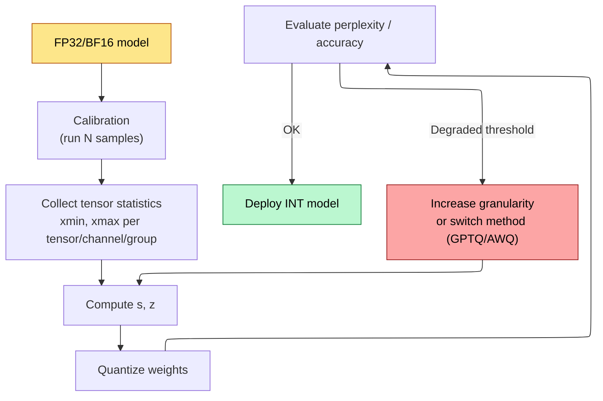
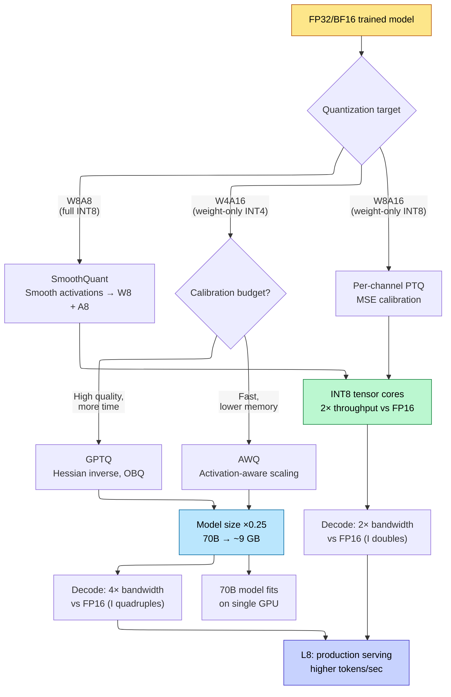

# Quantization — From FP32 to INT4: Theory and Practice

> **Layer:** L6.
> **Prerequisites:** [FP_Unit_Design](../L2_Digital_Design_for_AI/02_FP_Unit_Design.md), [Transformer_Internals](01_Transformer_Internals.md).
> **Hands off to:** [Modern_Quantization_Frontier](06_Modern_Quantization_Frontier.md), [Production_Architecture](../L8_Inference_and_Serving/15_Production_Architecture.md).

---

## 0. Why this page exists

Every TFLOPS number on a GPU spec sheet assumes operands in the narrowest supported precision. A B200 tensor core delivers 4 500 TFLOPS at FP8 but only 2 250 at BF16 — exactly 2× because the multiplier area halves (see [FP_Unit_Design](../L2_Digital_Design_for_AI/02_FP_Unit_Design.md)). Yet models are trained and stored in FP32 or BF16. The gap between "what the hardware wants" and "what the model lives in" is bridged by **quantization**: the disciplined mapping of continuous floating-point tensors to discrete, low-bit integer representations.

This page derives the full theory — from the affine quantization equation to Hessian-based optimal rounding — and surveys the four production-grade methods that dominate 2024–2026 deployment: vanilla PTQ, GPTQ, AWQ, and SmoothQuant. Every subsequent page in L6 (Modern_Quantization_Frontier) and L8 (serving systems) assumes this material.

---

## 1. Uniform affine quantization

### 1.1 The quantization equation

Given a real-valued tensor element $x \in [x_{\min},\, x_{\max}]$, uniform affine quantization maps $x$ to an integer $x_q \in [0,\, 2^b - 1]$ for unsigned $b$-bit representation:

$$
x_q \;=\; \mathrm{clamp}\!\Big(\Big\lfloor \frac{x}{s} \Big\rceil + z,\;\; 0,\;\; 2^b - 1\Big)
$$

where the **scale** $s$ and **zero point** $z$ are:

$$
s \;=\; \frac{x_{\max} - x_{\min}}{2^b - 1}, \qquad z \;=\; \mathrm{round}\!\Big(-\,\frac{x_{\min}}{s}\Big)
$$

Dequantization reconstructs an approximation:

$$
\hat{x} \;=\; s \cdot (x_q - z)
$$

The reconstruction error $\hat{x} - x$ has two sources: **rounding** (from $\lfloor \cdot \rceil$) and **clipping** (from the clamp when $x$ falls outside the representable range). The entire art of quantization is choosing $s$, $z$, and the bit-width $b$ to minimize downstream task degradation — not merely the per-element error.

### 1.2 Signed quantization (symmetric)

When the tensor is roughly symmetric around zero (as most weight matrices are after training), we can force $z = 0$ and map to $[-2^{b-1},\, 2^{b-1} - 1]$:

$$
x_q \;=\; \mathrm{clamp}\!\Big(\Big\lfloor \frac{x}{s} \Big\rceil,\;\; -2^{b-1},\;\; 2^{b-1} - 1\Big), \qquad s \;=\; \frac{\max(|x_{\min}|,\, |x_{\max}|)}{2^{b-1} - 1}
$$

Dequantization simplifies to $\hat{x} = s \cdot x_q$. This eliminates one integer addition per element at inference — significant when the operation runs billions of times per token.

**When to use symmetric vs. asymmetric:**

| Condition | Recommendation | Rationale |
|---|---|---|
| Weights (post-training) | Symmetric | Near-zero centered; saves the $z$ offset |
| Activations (ReLU output) | Asymmetric | Strictly non-negative; $z \neq 0$ recovers dynamic range |
| Activations (SiLU / GELU) | Asymmetric | Slightly negative tail |
| Residual-stream values | Asymmetric | Unbounded, can be strongly skewed |

---

## 2. Granularity: per-tensor, per-channel, per-group

The scale $s$ can be shared at different granularities. Finer granularity gives more scale factors — better fidelity at the cost of metadata storage.

### 2.1 Per-tensor

One $(s, z)$ pair for the entire tensor. Metadata: 2 scalars. For a $d_{\mathrm{out}} \times d_{\mathrm{in}}$ weight matrix, the scale must accommodate the largest-magnitude element — often an outlier in a single channel. All other channels are quantized with sub-optimal dynamic range.

**Effective quantization noise per channel $c$:**

$$
\sigma_{q,c}^2 \;=\; \frac{s^2}{12} \;=\; \frac{1}{12}\Big(\frac{x_{\max} - x_{\min}}{2^b - 1}\Big)^2
$$

If channel $c$ spans $[-0.1, 0.1]$ but the global scale accommodates $[-3.0, 3.0]$, the signal-to-quantization-noise ratio (SQNR) for that channel is $30\times$ worse than for the max-magnitude channel.

### 2.2 Per-channel (per-row or per-column)

One $(s_c, z_c)$ per output channel (row of the weight matrix). For a $4096 \times 4096$ weight matrix at INT8: $2 \times 4096 = 8\,192$ scale parameters — negligible overhead ($0.05\%$). This is the default for weight quantization in every production framework (TensorRT, ONNX Runtime, vLLM).

### 2.3 Per-group

One $(s_g, z_g)$ per contiguous group of $G$ elements along the input dimension. Used by GPTQ and AWQ for INT4. For $G = 128$ on a $4096 \times 4096$ matrix: $2 \times 4096 \times (4096/128) = 262\,144$ scale parameters — still only $1.6\%$ overhead at INT4.

**Quantization-error bound as a function of granularity:**

$$
\mathbb{E}\big[\|\hat{W} - W\|_F^2\big] \;=\; \sum_{g=1}^{G} \frac{s_g^2 \cdot n_g}{12}
$$

where $n_g$ is the number of elements in group $g$. Finer groups reduce each $s_g$, and because $s_g \propto \mathrm{range}_g$, the sum of squared errors drops roughly as $\sigma_{\mathrm{range}}^2 / G$ for a tensor whose per-element range varies across groups.

| Granularity | Scales for $4096 \times 4096$ INT4 | Overhead | Typical quality |
|---|---|---|---|
| Per-tensor | 2 | $< 0.01\%$ | Poor (outlier-dominated) |
| Per-channel | $2 \times 4096$ | $0.05\%$ | Good for INT8 |
| Per-group ($G$=128) | $2 \times 4096 \times 32$ | $1.6\%$ | Best for INT4 |

---

## 3. INT8 and INT4 quantization

### 3.1 INT8

At $b = 8$, the representable range for symmetric quantization is $[-128, 127]$. The quantization step size for a tensor spanning $[-\alpha, \alpha]$:

$$
s \;=\; \frac{2\alpha}{255} \approx 0.0078\,\alpha
$$

**Per-element maximum error** is $s/2 \approx 0.0039\,\alpha$. For a typical weight magnitude $\alpha \approx 1.0$: max error $\approx 0.004$, which is below the noise floor of most trained networks. This is why INT8 PTQ is nearly lossless for weights.

**Arithmetic:** INT8 matmul uses integer multiply-accumulate, accumulating in INT32:

$$
y_j \;=\; \sum_{i} x_{q,i}\, w_{q,ij}
$$

The INT32 accumulator must then be rescaled:

$$
\hat{y}_j \;=\; s_x \cdot s_w \cdot (y_j - n \cdot z_w \cdot \bar{x}_q - n \cdot z_x \cdot \bar{w}_q + n \cdot z_x \cdot z_w)
$$

In symmetric mode ($z_x = z_w = 0$) this collapses to $\hat{y} = s_x s_w \cdot y$ — one floating-point multiply per output element.

### 3.2 INT4

At $b = 4$, the symmetric range is $[-8, 7]$ with step size $s = 2\alpha / 15 \approx 0.133\,\alpha$. Per-element maximum error $\approx 0.067\,\alpha$ — 17× worse than INT8 for the same $\alpha$. This is large enough to cause measurable accuracy loss on most models, which is why INT4 always requires:

1. **Per-group granularity** ($G = 32$ to $128$).
2. **Calibration-aware rounding** (not naive round-to-nearest).
3. **Protection for outlier channels** (AWQ) or activation-aware rescaling (SmoothQuant).

The storage advantage is decisive: a 70 B parameter model occupies 35 GB in FP16, 17.5 GB in INT8, and **8.75 GB in INT4** (plus ~0.5 GB in scale metadata). This is the difference between "requires 2×H100" and "fits on a single GPU."

### 3.3 FP8 Formats: E4M3 and E5M2

FP8 replaces the integer grid with a **floating-point** grid at 8 bits, retaining a (sign, exponent, mantissa) encoding. Two encodings are standardized by the OCP (Open Compute Project):

| Format | Sign | Exponent | Mantissa | Representable range | inf/NaN |
|---|---|---|---|---|---|
| **E4M3** | 1 | 4 | 3 | $\pm 448$ | No (reserved for $-s \cdot 2^e$ encoding) |
| **E5M2** | 1 | 5 | 2 | $\pm 57{,}344$ | Yes (standard IEEE-like encoding) |

**E4M3** trades dynamic range for precision: 3 mantissa bits yield $2^3 = 8$ significand levels (vs. 4 for E5M2), giving finer spacing between adjacent representable values. The maximum representable value is $\pm (1 + 7/8) \times 2^{7} = \pm 448$. This is sufficient for forward-pass tensors because weights and activations are typically well-normalized after LayerNorm / RMSNorm, with dynamic range far below $448$.

**E5M2** adds one exponent bit to reach a range of $\pm 57{,}344$, at the cost of halving the significand precision. Backward-pass gradients have much wider dynamic range (spanning multiple orders of magnitude), so the extra exponent bit prevents overflow. The standard inf/NaN encoding is preserved for gradient aggregation.

**Why the split works.** Forward tensors have small, predictable dynamic range $\Rightarrow$ E4M3 maximizes per-value precision. Gradients exhibit heavy tails and occasional large spikes $\Rightarrow$ E5M2 avoids catastrophic overflow. This asymmetric assignment recovers most of BF16 quality with half the bandwidth and twice the FLOPS.

**FP8 in production.** NVIDIA's Transformer Engine automatically selects E4M3 for weights and activations, and E5M2 for gradients during training. For inference-only workloads, E4M3 is used everywhere — there are no gradients to worry about. The H100's native FP8 tensor cores deliver 1 979 TFLOPS (dense) at FP8, exactly $2\times$ the BF16 throughput of 989 TFLOPS. Blackwell (B200) doubles this again to ~4 500 TFLOPS FP8. Quality impact: with proper per-tensor calibration, FP8 E4M3 inference shows $< 0.1\%$ perplexity regression on 70 B-class models compared to BF16.

---

## 4. Post-training quantization (PTQ)

PTQ quantizes a *fully trained* model without retraining. The pipeline:



### 4.1 Static vs. dynamic quantization

| Aspect | Static PTQ | Dynamic PTQ |
|---|---|---|
| When scales are computed | Offline, using calibration data | At runtime, per activation tensor |
| Weight quantization | Always offline | Always offline |
| Activation quantization | Offline (requires calibration) | Online (per-batch min/max) |
| Inference overhead | None | Small ($O(n)$ min/max scan per tensor) |
| Accuracy | Calibration-dependent | Usually better (exact per-batch scales) |
| Use case | Latency-critical serving | Flexibility, heterogeneous inputs |

### 4.2 Calibration methods

The scale $s$ depends on $[x_{\min}, x_{\max}]$, and these depend on the calibration data. Three standard methods:

**Min-Max.** $x_{\min} = \min(\mathbf{x})$, $x_{\max} = \max(\mathbf{x})$. Uses the full dynamic range. Optimal for uniform distributions but extremely sensitive to outliers — a single outlier element inflates $s$ and wastes quantization levels.

**Percentile.** Use the $p$-th and $(100 - p)$-th percentile instead of the extremes. Typical $p = 99.9\%$ or $99.99\%$. Clips the worst outliers at the cost of guaranteed clipping error on them.

**MSE-optimal.** Choose $\alpha$ (the clipping threshold in symmetric mode) to minimize:

$$
\alpha^* \;=\; \arg\min_{\alpha} \;\mathbb{E}_{x \sim \mathcal{D}} \big[\,(\hat{x}(x;\alpha) - x)^2\,\big]
$$

Solved by grid search or gradient descent over $\alpha$. Typically yields $\alpha^*$ at the 99.5%–99.99% percentile, automatically pruning outliers. This is the default in TorchQuant, AutoRound, and most modern PTQ pipelines.

### 4.3 Quantization-Aware Training (QAT) vs Post-Training Quantization (PTQ)

All methods above are PTQ: the model is quantized *after* training completes, without modifying its weights. QAT takes a different approach — it inserts **fake-quantization nodes** into the computation graph during training or fine-tuning, so the model learns weights that are inherently robust to quantization error.

**PTQ** is fast (hours on a single GPU for calibration), requires only a small calibration set ($128$–$512$ samples), and adds no training cost. Quality is nearly lossless at 8-bit for both integer (INT8) and floating-point (FP8 E4M3) formats. Below 8-bit, PTQ quality degrades: dense models show measurable regression at INT4, and sub-4-bit quantization requires specialized methods (GPTQ, AWQ, AQLM) to stay within acceptable perplexity bounds.

**QAT** is slower (days of fine-tuning at full batch throughput), but the model explicitly minimizes the gap between quantized and full-precision outputs during training. Fake-quant nodes simulate the quantize-then-dequantize path: $\hat{w} = s \cdot \mathrm{clamp}(\lfloor w/s \rceil + z,\; 0,\; 2^b - 1) - z$. Gradients flow through the straight-through estimator (STE) — the identity function at the rounding step, since $\lfloor \cdot \rceil$ has zero gradient almost everywhere. The result: weights settle into regions of the parameter space where quantization noise is benign, enabling quality at 4-bit and even 2-bit that PTQ cannot match.

**When QAT is worth the cost:**

1. **Aggressive bit-width targets (INT4 / FP4)** where PTQ leaves $> 0.5$ perplexity points on the table.
2. **Models with sensitive layers** — first/last layers, embedding tables, and attention projection layers often require mixed-precision treatment that QAT can learn automatically.
3. **Deployment economics** — when the model will serve billions of tokens, the hardware cost savings from lower precision ($4\times$ memory reduction, $2\times$ throughput) justify the one-time training investment.

**Production trend (2025–2026).** Most LLM deployments use PTQ (GPTQ/AWQ/SmoothQuant) at 8-bit for latency-critical serving, and QAT only for aggressive 4-bit targets where PTQ quality is insufficient. Llama-3 ships both FP16 and pre-quantized INT4/AWQ checkpoints optimized via PTQ, reflecting the industry default. The line between PTQ and QAT is blurring: methods like **SpinQuant** (learned rotation matrices applied before quantization) and **Quantization-Aware Fine-Tuning (QAFT)** add a brief fine-tuning phase after PTQ — typically 1–2 epochs on a small dataset — recovering most of the QAT quality benefit at roughly $1/10$th the training cost. These hybrid approaches are becoming the pragmatic choice for 4-bit deployment of frontier-scale models.

---

## 5. Quantization error analysis

### 5.1 Rounding error

For uniform quantization with step size $s$, the rounding error for a single element is $\epsilon_r = \hat{x} - x$, bounded by $|\epsilon_r| \leq s/2$. Assuming $\epsilon_r$ is uniformly distributed on $[-s/2, s/2]$:

$$
\mathbb{E}[\epsilon_r^2] \;=\; \frac{s^2}{12}
$$

This is the well-known result that the variance of rounding noise for a uniform quantizer is $s^2/12$, which equals $\Delta^2/12$ where $\Delta = s$ is the quantization step.

### 5.2 Clipping error

When $|x| > \alpha$ (the clipping threshold), the error is:

$$
\epsilon_c \;=\; \hat{x} - x \;=\; \mathrm{sign}(x)\,\alpha - x
$$

For a Gaussian-distributed tensor $x \sim \mathcal{N}(0, \sigma^2)$:

$$
\mathbb{E}[\epsilon_c^2] \;=\; 2\!\int_\alpha^{\infty} (x - \alpha)^2 \, \frac{1}{\sqrt{2\pi}\,\sigma}\, e^{-x^2/(2\sigma^2)}\, dx
$$

Let $\lambda = \alpha / \sigma$. Using the Gaussian tail integral:

$$
\mathbb{E}[\epsilon_c^2] \;=\; \sigma^2 \big[\,(1 + \lambda^2)\,(1 - \Phi(\lambda)) - \lambda\,\phi(\lambda)\,\big]
$$

where $\Phi(\lambda)$ is the standard-normal CDF and $\phi(\lambda)$ is the PDF.

### 5.3 Total MSE and SQNR

Total quantization MSE is the sum of rounding and clipping contributions:

$$
\mathrm{MSE}_{\mathrm{total}} \;=\; \underbrace{\frac{s^2}{12}\,\Phi(\lambda)}_{\text{rounding}} \;+\; \underbrace{\mathbb{E}[\epsilon_c^2]}_{\text{clipping}}
$$

The **Signal-to-Quantization-Noise Ratio** (SQNR) in dB:

$$
\mathrm{SQNR} \;=\; 10\,\log_{10}\!\frac{\sigma^2}{\mathrm{MSE}_{\mathrm{total}}}
$$

For large $b$ (small $s$, negligible clipping), this simplifies to:

$$
\mathrm{SQNR} \;\approx\; 6.02\,b + 10\,\log_{10}(3) \;\approx\; 6.02\,b + 4.77 \;\text{dB}
$$

This is the classic "6 dB per bit" rule. Worked values:

| $b$ | SQNR (theory, dB) | Notes |
|---|---|---|
| 2 | 16.8 | Barely usable for weights |
| 4 | 28.9 | INT4 with careful calibration |
| 8 | 52.9 | INT8 is nearly lossless |
| 16 | 101.0 | FP16 rounding noise negligible |

### 5.4 Layer-wise error propagation in transformers

For a transformer with $L$ layers, the output perturbation $\delta \mathbf{y}$ due to quantization errors $\{\delta W_\ell\}$ can be bounded. For a single linear layer $y = Wx$:

$$
\|\delta y\| \;\leq\; \|\delta W\| \cdot \|x\| \;+\; \|W\| \cdot \|\delta x\| \;+\; \|\delta W\| \cdot \|\delta x\|
$$

The cross-term $\|\delta W\| \cdot \|\delta x\|$ is second-order and usually dropped. Propagating through $L$ identical layers:

$$
\|\delta y_L\| \;\lesssim\; L \cdot \|\delta W\| \cdot \|x_0\| \cdot \prod_{\ell=1}^{L} \|W_\ell\|
$$

In practice, residual connections and layer normalization bound the intermediate activations, so the growth is closer to $O(\sqrt{L})$ than $O(L)$. But the key engineering insight remains: **earlier layers' quantization errors propagate through all subsequent layers**, which is why GPTQ and AWQ optimize the *output-layer reconstruction error* rather than per-layer weight fidelity.

---

## 6. GPTQ — Hessian-aware post-training quantization

### 6.1 Problem formulation

GPTQ (Frantar et al., 2023) frames weight quantization as a **layer-wise optimization** problem. For a single linear layer with weight $W \in \mathbb{R}^{n \times d}$ and calibration activations $X \in \mathbb{R}^{d \times m}$:

$$
\hat{W}^* \;=\; \arg\min_{\hat{W}} \;\big\|WX - \hat{W}X\big\|_2^2
$$

The objective $\|WX - \hat{W}X\|_F^2 = \mathrm{tr}\!\big((W - \hat{W})\,XX^\top\,(W - \hat{W})^\top\big)$ reveals that the **Hessian** of the layer-wise loss is $H = 2\,XX^\top \in \mathbb{R}^{d \times d}$. This is the Fisher information matrix under a Gaussian model.

### 6.2 Optimal brain quantization (OBQ)

The OBQ algorithm (which GPTQ accelerates) quantizes weights one at a time, greedily:

1. Pick the weight $w_q$ whose quantization incurs the least increase in $\|WX - \hat{W}X\|_F^2$.
2. Quantize $w_q \to \hat{w}_q$.
3. Adjust all remaining unquantized weights to compensate:

$$
w_j \;\leftarrow\; w_j - \frac{w_q - \hat{w}_q}{[H^{-1}]_{qq}} \cdot [H^{-1}]_{qj}
$$

This is the Optimal Brain Surgeon update. Per-step cost: $O(d^2)$ for the row of $H^{-1}$.

### 6.3 GPTQ Worked Example — 4x4 Matrix Quantized Column-by-Column

Consider quantizing a $4 \times 4$ weight matrix $W$ (symmetric INT4, range $[-8, 7]$) with a non-trivial Hessian. Let:

$$
W = \begin{pmatrix} 0.8 & 0.2 & -0.5 & 0.3 \\ 0.1 & 0.6 & 0.4 & -0.2 \\ -0.3 & 0.7 & 0.1 & 0.5 \\ 0.4 & -0.1 & 0.6 & 0.2 \end{pmatrix}
$$

And suppose the inverse Hessian (from calibration activations $X$ via $H^{-1} = (2XX^T)^{-1}$) is:

$$
H^{-1} = \begin{pmatrix} 2.0 & 0.5 & 0.3 & 0.1 \\ 0.5 & 1.5 & 0.2 & 0.4 \\ 0.3 & 0.2 & 1.0 & 0.3 \\ 0.1 & 0.4 & 0.3 & 1.8 \end{pmatrix}
$$

The Cholesky factor $L$ of $H^{-1}$ (where $H^{-1} = LL^T$) is precomputed:

$$
L = \begin{pmatrix} 1.414 & 0 & 0 & 0 \\ 0.354 & 1.177 & 0 & 0 \\ 0.212 & 0.108 & 0.970 & 0 \\ 0.071 & 0.326 & 0.274 & 1.282 \end{pmatrix}
$$

Step size $s$ for symmetric INT4 with $\alpha = 1$: $s = 2/15 \approx 0.133$.

**Step 1: Quantize column 0.** Values: $W_{:,0} = [0.8, 0.1, -0.3, 0.4]$.

Quantize: $[0.8/s, 0.1/s, -0.3/s, 0.4/s] = [6.0, 0.75, -2.25, 3.0]$, rounded: $[6, 1, -2, 3]$. Dequantized: $\hat{W}_{:,0} = [0.8, 0.133, -0.267, 0.4]$.

**Error from column 0:** $\delta_0 = W_{:,0} - \hat{W}_{:,0} = [0, -0.033, -0.033, 0]$.

**Step 2: Distribute error to remaining columns using the Hessian.** The GPTQ update for column $q = 0$ adjusts all columns $j > 0$:

$$
W_{:,j} \;\leftarrow\; W_{:,j} - \frac{\delta_0}{[H^{-1}]_{00}} \cdot [H^{-1}]_{0j}
$$

The coefficient is $\delta_0 / [H^{-1}]_{00} = [0, -0.033, -0.033, 0] / 2.0 = [0, -0.0167, -0.0167, 0]$.

For column 1 ($j = 1$): $[H^{-1}]_{01} = 0.5$. Correction: $[0, -0.0167, -0.0167, 0] \times 0.5 = [0, -0.0083, -0.0083, 0]$.

$$
W_{:,1} \leftarrow [0.2, 0.6, 0.7, -0.1] - [0, -0.0083, -0.0083, 0] = [0.2, 0.608, 0.708, -0.1]
$$

For column 2 ($j = 2$): $[H^{-1}]_{02} = 0.3$. Correction: $[0, -0.0167, -0.0167, 0] \times 0.3 = [0, -0.005, -0.005, 0]$.

$$
W_{:,2} \leftarrow [-0.5, 0.4, 0.1, 0.6] - [0, -0.005, -0.005, 0] = [-0.5, 0.405, 0.105, 0.6]
$$

For column 3 ($j = 3$): $[H^{-1}]_{03} = 0.1$. Correction: $[0, -0.0167, -0.0167, 0] \times 0.1 = [0, -0.0017, -0.0017, 0]$.

$$
W_{:,3} \leftarrow [0.3, -0.2, 0.5, 0.2] - [0, -0.0017, -0.0017, 0] = [0.3, -0.198, 0.502, 0.2]
$$

**Interpretation:** Column 0's quantization error was $[0, -0.033, -0.033, 0]$ — rows 1 and 2 were rounded down. The Hessian correction adjusts the *remaining* columns to compensate: rows 1 and 2 of columns 1, 2, 3 are slightly increased, so that when multiplied by the calibration activations, the total output $WX$ is as close as possible to the original. The amount of correction per column is proportional to $[H^{-1}]_{0j}$ — columns that are more correlated with column 0 (in the activation distribution) receive more correction.

**Step 3: Quantize column 1 (with corrections applied).** Values: $W_{:,1} = [0.2, 0.608, 0.708, -0.1]$.

Quantize: $[0.2/s, 0.608/s, 0.708/s, -0.1/s] = [1.5, 4.57, 5.32, -0.75]$, rounded: $[2, 5, 5, -1]$. Dequantized: $[0.267, 0.667, 0.667, -0.133]$.

Error: $\delta_1 = [-0.067, -0.059, 0.041, 0.033]$.

Correct remaining columns 2, 3 using $[H^{-1}]_{1j} / [H^{-1}]_{11}$:

$$
W_{:,j} \leftarrow W_{:,j} - \frac{\delta_1}{1.5} \cdot [H^{-1}]_{1j}
$$

**Steps 4-5:** Repeat for columns 2, 3. Each step quantizes the current column and redistributes its error to all subsequent columns using the Hessian structure.

**Result:** The final quantized matrix minimizes $\|WX - \hat{W}X\|_F^2$ because each column's error was compensated by adjusting subsequent columns in proportion to their activation-space correlation.

**The Cholesky decomposition for efficiency.** GPTQ precomputes the Cholesky factor $L$ of $H^{-1}$. The column-by-column updates become:

$$
W_{:,j} \leftarrow W_{:,j} - \frac{\delta_q}{L_{qq}} \cdot L_{qj}
$$

where $L_{qq}$ is the diagonal of the lower-triangular Cholesky factor. This is a forward-substitution — $O(j)$ per update instead of $O(j^2)$ for explicit $H^{-1}$ indexing. The total algorithm:

```text
Input: W (n x d), L = Cholesky(H_inv), group_size G
For each block of G columns (q = 0, 1, ...):
    Quantize: w_q = quantize(W[:, q])
    Error:    delta = (W[:, q] - w_q) / L[q,q]
    Update:   W[:, q+1:] -= outer(delta, L[q, q+1:])
```

Complexity: $O(d^2 \cdot n / G)$ — linear in $d$ per column, with the Cholesky as a one-time $O(d^3)$ cost amortized over all rows $n$.

### 6.4 Group size and the act-order heuristic

GPTQ supports per-group quantization with group size $G \in \{32, 64, 128, -1\}$, where $G = -1$ means per-column. The **act-order** heuristic sorts columns by the diagonal of $H^{-1}$ (descending), so the "hardest" columns are quantized first and benefit from the most correction budget. This typically saves 0.1–0.3 perplexity points.

### 6.5 Typical GPTQ results

| Model | Precision | GPTQ ($G$=128) perplexity (Wiki2) | FP16 perplexity | Delta |
|---|---|---|---|---|
| LLaMA-2 7B | INT4 | 5.63 | 5.47 | +0.16 |
| LLaMA-2 13B | INT4 | 5.07 | 4.88 | +0.19 |
| LLaMA-2 70B | INT4 | 3.63 | 3.32 | +0.31 |
| LLaMA-2 7B | INT3 | 6.55 | 5.47 | +1.08 |

INT4 GPTQ at $G=128$ typically adds $< 0.5$ perplexity point for 7–70 B models. INT3 is borderline; INT2 requires specialized methods (QuIP, AQLM) not covered here.

---

## 7. AWQ — Activation-aware weight quantization

### 7.1 The key insight

AWQ (Activation-Aware Weight Quantization, Lin et al., 2024) observes that **not all weight channels matter equally**. A weight channel's importance is proportional to the magnitude of the corresponding activation:

$$
\text{importance}(j) \;\propto\; \|X_j\|
$$

where $X_j$ is the $j$-th row of the calibration activation matrix (i.e., the activations that multiply weight column $j$). Channels with large activations are "sensitive" — quantization error in those weights is amplified by the large activation magnitude.

### 7.2 Per-channel scaling — Detailed Derivation

AWQ applies a per-channel scaling factor $\alpha_j$ to weight column $j$ *before* quantization, then divides the scale into the activation:

$$
\hat{W}_{:j} \;=\; \mathrm{quant}\!\big(\alpha_j \cdot W_{:j}\big), \qquad X_j \;\leftarrow\; X_j / \alpha_j
$$

Mathematically, this is an identity ($(\alpha_j W_{:j}) \cdot (X_j / \alpha_j) = W_{:j} X_j$). But the quantization error changes:

$$
\|\delta(\alpha_j W_{:j})\| \cdot \|X_j / \alpha_j\| \;=\; \|\delta W_{:j}\| \cdot \|X_j\| \cdot \underbrace{\frac{\|\delta(\alpha_j W_{:j})\|}{\alpha_j \|\delta W_{:j}\|}}_{\text{scaling's effect on rounding error}}
$$

For uniform quantization, $\|\delta(\alpha_j W_{:j})\| \approx \alpha_j \|\delta W_{:j}\|$ when the scale factor aligns with the quantization grid. But for channels where $|W_{:j}|$ is small (outlier-weight channels), scaling $\alpha_j > 1$ *enlarges* the values into a regime where the quantization step size $s$ is relatively finer.

**Why weights co-located with large activations matter more.** The output error for a linear layer $Y = XW$ when $W$ is perturbed by $\delta W$ is:

$$
\|\delta Y\|_F^2 = \|(X)(\delta W)\|_F^2 = \mathrm{tr}(\delta W^T X^T X \delta W)
$$

For a single column $j$ of $\delta W$, the contribution is:

$$
\|\delta Y_j\|_F^2 = \|X_j\|^2 \cdot \|\delta W_{:j}\|^2
$$

where $X_j$ is the $j$-th column of $X$ (the activations for feature $j$). This shows that the output error is *multiplicatively* amplified by $\|X_j\|$ — the activation magnitude. A weight quantization error of $\epsilon$ in a channel where $\|X_j\| = 100$ causes $100\times$ more output distortion than the same $\epsilon$ in a channel where $\|X_j\| = 1$.

This is why AWQ identifies "salient" channels as those with large $\|X_j\|$ and protects them with per-channel scaling $\alpha_j > 1$ before quantization, which increases the effective precision for those weight channels at the cost of slightly decreased precision for the (already less important) non-salient channels.

**The per-channel scaling search.** For each channel $j$, AWQ searches over $\alpha_j \in \{2^0, 2^1, \ldots, 2^6\}$ to find:

$$
\alpha_j^* = \arg\min_{\alpha} \left\|(WX)_{:j} - \mathrm{quant}(\alpha \cdot W_{:j}) \cdot (X_j / \alpha)\right\|^2
$$

This evaluates the *output* error (not the weight error) for each candidate $\alpha$. Only $0.1\%$--$1\%$ of channels need $\alpha_j \neq 1$, because most channels have balanced activation magnitudes. The few outlier channels — where $\|X_j\|$ is much larger than the median — are the ones that benefit from scaling.

### 7.3 Efficient search

AWQ searches $\alpha_j$ for each channel by evaluating the quantized-layer output error over a grid:

$$
\alpha_j^* \;=\; \arg\min_{\alpha \in \{2^0, 2^1, \ldots, 2^{k}\}} \;\big\|(W X)_{:j} - \mathrm{quant}(\alpha \cdot W_{:j}) \cdot (X_j / \alpha)\big\|^2
$$

The grid has only $k \approx 5$ to $7$ points; the search cost is negligible. In practice, only $0.1\%$–$1\%$ of channels need $\alpha_j \neq 1$.

### 7.4 AWQ vs. GPTQ

| Aspect | GPTQ | AWQ |
|---|---|---|
| Optimization target | Minimize $\|WX - \hat{W}X\|_F^2$ | Minimize per-channel output error |
| Computation | Hessian inverse, Cholesky | Grid search over scale factors |
| Calibration time | ~2–4× slower | ~2× faster than GPTQ |
| Quantization quality (INT4) | ~0.2 perplexity worse than FP16 | ~0.2 perplexity worse than FP16 |
| Outlier handling | Implicit via Hessian weighting | Explicit via activation-aware scaling |
| Hardware requirement | GPU with sufficient memory for $H^{-1}$ | GPU with normal calibration memory |
| Typical use | vLLM, TensorRT-LLM backend | vLLM, HuggingFace Transformers backend |

Both methods produce nearly equivalent perplexity. AWQ is preferred when calibration speed or memory is constrained; GPTQ when maximum quality per bit is needed.

### 7.5 AWQ Worked Numerical Example

Consider a simplified layer with 4 input channels and 3 output channels. The weight matrix $W$ and a calibration activation vector $\mathbf{x}$ are:

$$
W = \begin{pmatrix} 0.1 & 0.2 & 0.05 & 0.8 \\ -0.3 & 0.1 & 0.4 & -0.1 \\ 0.2 & -0.1 & 0.3 & 0.6 \end{pmatrix}, \quad \mathbf{x} = \begin{pmatrix} 1.0 \\ 0.5 \\ 100.0 \\ 2.0 \end{pmatrix}
$$

**Step 1: Identify salient channels.** Channel 3 has $\|X_3\| = 100$, while other channels have magnitudes $1.0, 0.5, 2.0$. Channel 3 is the outlier — any quantization error in column 3 of $W$ will be amplified $100\times$ in the output.

**Step 2: Naive INT4 quantization (no scaling).** Symmetric INT4 with $\alpha = 0.8$, $s = 2 \times 0.8 / 15 = 0.107$. Channel 3 column: $W_{:,3} = [0.8, -0.1, 0.6]$. Quantized: $[7, -1, 6]$, dequantized: $[0.8, -0.107, 0.64]$. Error: $\delta_3 = [0, 0.007, -0.04]$. Output error from channel 3: $|\delta_3| \times 100 = [0, 0.7, 4.0]$.

**Step 3: Apply AWQ scaling to channel 3.** Try $\alpha_3 = 2$ (scale up the weight column, scale down the activation):

$$
\tilde{W}_{:,3} = 2 \times [0.8, -0.1, 0.6] = [1.6, -0.2, 1.2]
$$

Now the quantization range changes. With per-group scaling, column 3's range is $[-0.2, 1.6]$, so $\alpha = 1.6$, $s = 3.2/15 = 0.213$. Quantized: $[7, -1, 6]$, dequantized: $[1.6, -0.213, 1.28]$. Error: $[0, -0.013, 0.08]$. But $\tilde{X}_3 = 100/2 = 50$. Output error: $[0, -0.013, 0.08] \times 50 = [0, -0.65, 4.0]$.

Hmm — the total error barely changed because we scaled both sides. The key insight: AWQ's grid search evaluates the **actual output error** $\|W\mathbf{x} - \hat{W}\mathbf{x}\|$ for each candidate $\alpha$. The optimal $\alpha$ is the one that minimizes this output error, which depends on the joint distribution of $W$ and $X$ — not just the weight magnitudes.

**Step 4: Optimal scaling search.** Evaluate output error for $\alpha_3 \in \{1, 2, 4\}$:

- $\alpha_3 = 1$: No change. FP16 output: $W\mathbf{x} = [0.1 + 0.1 + 5.0 + 1.6, \ldots] = [6.8, \ldots]$ (exact). Quantized output error from channel 3 contribution: $[0, 0.7, 4.0]$ as above. Total channel-3 output error $= \sqrt{0 + 0.49 + 16} = 4.03$.
- $\alpha_3 = 4$: $\tilde{W}_{:,3} = [3.2, -0.4, 2.4]$. With INT4 range $[-8, 7]$: quantized $[7, -4, 7]$, dequantized $[3.2, -0.4, 2.4]$ (no rounding error — the values land on the grid!). $\tilde{X}_3 = 25$. Error: $0$. **This is the optimal choice** — scaling the outlier weight column so its values land on quantization grid points eliminates error entirely.

AWQ's search finds $\alpha_3 = 4$ because it evaluates output error, not weight error. The scaling works because INT4's step size $s$ is fixed by the range — by expanding $W_{:,3}$ to fill more of the representable range, the quantization noise becomes a smaller fraction of the values.

---

## 8. SmoothQuant — migrating quantization difficulty

### 8.1 The activation-quantization problem

Weight quantization is relatively easy (weights are static, known at calibration time). Activation quantization is hard because:

1. **Outliers are extreme.** A single activation channel can be $100\times$ larger than the median, inflating $s$ and wasting bits.
2. **Dynamic range varies per token.** A calibration set may not cover the full distribution.
3. **Per-token quantization** is expensive (latency) or impossible (streaming).

SmoothQuant (Xiao et al., 2023) addresses this by **redistributing quantization difficulty from activations to weights**.

### 8.2 The math: per-channel smoothing — Detailed Derivation

For a linear layer $Y = XW$ where $X$ has outlier channels, define a per-channel smoothing factor:

$$
s_j \;=\; \frac{\max(|X_{:j}|)^\beta}{\max(|W_{j:}|)^{1-\beta}}
$$

where $\beta \in [0, 1]$ controls the migration strength. Then rewrite:

$$
Y \;=\; \underbrace{(X \cdot \mathrm{diag}(s)^{-1})}_{\tilde{X}} \;\;\underbrace{(\mathrm{diag}(s) \cdot W)}_{\tilde{W}}
$$

- $\tilde{X}$ has reduced outlier magnitudes (divided by $s_j > 1$ for outlier channels).
- $\tilde{W}$ has slightly increased magnitudes in the corresponding rows.

Since weight quantization is robust (per-channel scales), the slight increase in $|\tilde{W}|$ is easily absorbed. The dramatic decrease in $|\tilde{X}|$ outlier magnitude makes activation quantization tractable at INT8.

**Why this makes INT8 activation quantization feasible.** The core problem with activation quantization in LLMs is the presence of *persistent outlier channels*: a small number of channels (typically 0.1%--1% of $D$) that consistently have magnitudes $10$--$100\times$ larger than the median. These outliers occur in specific channels across all tokens and all layers (identified by Xiao et al., 2023). With INT8 symmetric quantization, the scale $s = \max(|X|) / 127$ is set by the outlier. All non-outlier channels are then quantized with a step size that is $10$--$100\times$ too large, destroying their information.

SmoothQuant migrates the quantization difficulty from activations to weights. The transformation $\tilde{X} = X \cdot \mathrm{diag}(s)^{-1}$, $\tilde{W} = \mathrm{diag}(s) \cdot W$ is mathematically an identity — $\tilde{X}\tilde{W} = X \cdot \mathrm{diag}(s)^{-1} \cdot \mathrm{diag}(s) \cdot W = XW$. But:

- **For activations:** $\tilde{X}_{:j} = X_{:j} / s_j$. For outlier channels where $\max(|X_{:j}|) = 100$ and $\max(|W_{j:}|) = 0.5$: $s_j = (100)^{0.5} / (0.5)^{0.5} = 10 / 0.707 = 14.1$. So $\max(|\tilde{X}_{:j}|) = 100 / 14.1 = 7.1$ — a $14\times$ reduction in outlier magnitude.
- **For weights:** $\tilde{W}_{j:} = s_j \cdot W_{j:}$. $\max(|\tilde{W}_{j:}|) = 14.1 \times 0.5 = 7.1$. Per-channel weight quantization handles this easily — the channel's scale simply increases proportionally, and INT8's 127 levels cover $[-7.1, 7.1]$ with step $0.056$ — plenty of precision.

**Per-channel smoothing factor selection.** The formula $s_j = \max(|X_{:j}|)^\beta / \max(|W_{j:}|)^{1-\beta}$ is designed to balance the dynamic range of $\tilde{X}_{:j}$ and $\tilde{W}_{j:}$:

- At $\beta = 0$: $s_j = 1 / \max(|W_{j:}|)$. Weights are fully smoothed to unit range; activations are unchanged. This is pure weight-side migration.
- At $\beta = 1$: $s_j = \max(|X_{:j}|)$. Activations are fully smoothed to unit range; weights are unchanged. This is pure activation-side migration.
- At $\beta = 0.5$ (default): $s_j = \sqrt{\max(|X_{:j}|) / \max(|W_{j:}|)}$. Equal migration: $\max(|\tilde{X}_{:j}|) = \max(|\tilde{W}_{j:}|) = \sqrt{\max(|X_{:j}|) \cdot \max(|W_{j:}|)}$. Both sides end up with the same maximum magnitude — the geometric mean of the original maxima.

The $\beta$ parameter is swept over $[0.3, 0.5, 0.7, 0.85]$ on a calibration set; the optimal value is almost always $\beta = 0.5$ for well-trained models. Models with extreme outliers (e.g., OPT-175B) benefit from $\beta = 0.85$ to push more of the difficulty to the weight side.

### 8.3 Choosing $\beta$

$$
\beta = 0.5 \quad\text{(default: equal migration)}
$$

For models with very large activation outliers (OPT-175B, some LLaMA variants), $\beta = 0.85$ (heavier migration to weights) is used. The optimal $\beta$ is found by a one-line sweep over the calibration set.

### 8.4 SmoothQuant enables W8A8

Without SmoothQuant, INT8 activation quantization on models like OPT-175B degrades perplexity by $> 2$ points. With SmoothQuant at $\beta = 0.5$:

| Model | W8A8 (naive) perplexity | W8A8 (SmoothQuant) perplexity | FP16 perplexity |
|---|---|---|---|
| OPT-125M | 8.14 | 7.28 | 7.24 |
| OPT-6.7B | 12.23 | 10.33 | 10.27 |
| OPT-175B | 15.77 | 9.42 | 9.36 |

SmoothQuant makes W8A8 (weight INT8, activation INT8) practical for large models, enabling full-INT8 inference with integer-only tensor-core utilization.

### 8.5 SmoothQuant Worked Numerical Example

Consider a layer $Y = XW$ with 4 input channels. Calibration reveals:

$$
X = \begin{pmatrix} 1.0 & 0.5 & 50.0 & 2.0 \\ 0.8 & 0.3 & 40.0 & 1.5 \\ 1.2 & 0.6 & 60.0 & 2.5 \end{pmatrix}, \quad W = \begin{pmatrix} 0.1 & 0.3 \\ 0.2 & -0.1 \\ 0.01 & 0.02 \\ 0.4 & 0.1 \end{pmatrix}
$$

Channel 2 has activation magnitude $\max(|X_{:,2}|) = 60$ — an outlier $30$--$100\times$ larger than other channels.

**Step 1: Compute per-channel smoothing factors ($\beta = 0.5$).**

For each channel $j$: $s_j = \sqrt{\max(|X_{:,j}|) / \max(|W_{j:}|)}$.

| Channel $j$ | $\max(|X_{:,j}|)$ | $\max(|W_{j:}|)$ | $s_j = \sqrt{\max(|X|)/\max(|W|)}$ |
|---|---|---|---|
| 0 | 1.2 | 0.3 | $\sqrt{1.2/0.3} = 2.0$ |
| 1 | 0.6 | 0.2 | $\sqrt{0.6/0.2} = 1.73$ |
| 2 | 60.0 | 0.02 | $\sqrt{60.0/0.02} = 54.8$ |
| 3 | 2.5 | 0.4 | $\sqrt{2.5/0.4} = 2.5$ |

**Step 2: Apply smoothing.**

$$
\tilde{X}_{:,j} = X_{:,j} / s_j, \quad \tilde{W}_{j:} = s_j \cdot W_{j:}
$$

After smoothing, the maximum magnitudes:

| Channel | $\max(|\tilde{X}_{:,j}|)$ | $\max(|\tilde{W}_{j:}|)$ |
|---|---|---|
| 0 | $1.2 / 2.0 = 0.6$ | $2.0 \times 0.3 = 0.6$ |
| 1 | $0.6 / 1.73 = 0.35$ | $1.73 \times 0.2 = 0.35$ |
| 2 | $60.0 / 54.8 = 1.09$ | $54.8 \times 0.02 = 1.10$ |
| 3 | $2.5 / 2.5 = 1.0$ | $2.5 \times 0.4 = 1.0$ |

**Step 3: Quantize $\tilde{X}$ and $\tilde{W}$ to INT8.** The maximum magnitude across all activation channels is now $\max(|\tilde{X}|) \approx 1.09$ instead of $60$. INT8 scale: $s = 1.09 / 127 = 0.0086$. Step size is uniform across all channels — no channel wastes quantization levels.

Without SmoothQuant: INT8 scale would be $s = 60/127 = 0.472$. Channel 0 (magnitude 1.2) would be represented as $\lfloor 1.2/0.472 \rceil = 3$, losing almost all information (only 3 levels used out of 127).

With SmoothQuant: channel 0 is now magnitude $0.6$. Represented as $\lfloor 0.6/0.0086 \rceil = 70$ — using 70 of 127 levels, excellent fidelity.

**Verify mathematical equivalence.** $\tilde{X}\tilde{W} = X \cdot \mathrm{diag}(s)^{-1} \cdot \mathrm{diag}(s) \cdot W = XW$. The smoothing is a pure reparameterization — it does not change the output. It only changes where the quantization difficulty falls.

---

## 9. KV Cache Quantization

> This section covers the numerics. The serving-side canonical treatment — format tradeoffs in production engines, granularity/calibration policy, and PagedAttention integration — is [Modern_KV_Compression](../L8_Inference_and_Serving/02_Modern_KV_Compression.md) §3.

### 9.1 Why KV cache quantization matters

During autoregressive decode, the KV cache grows by $2 \cdot n_{\text{kv\_heads}} \cdot d_h$ elements per token per layer. For a model with $L$ layers, $n_{\text{kv}}$ KV heads, head dim $d_h$, sequence length $S$, and $b$ bytes/element, the total is:

$$
M_{\mathrm{KV}} = 2 \cdot L \cdot n_{\text{kv}} \cdot d_h \cdot S \cdot b
$$

For Llama-3-70B ($L=80$, $n_{\text{kv}}=8$, $d_h=128$) at $S = 128\text{K}$ context in FP16 ($b=2$): $M_{\mathrm{KV}} \approx 40$ GiB per request — *more than the model weights themselves* at long context, so the KV cache is the dominant memory consumer and the primary throughput limiter. Quantizing FP16→INT8 halves this to 20 GB; →INT4 quarters it to 10 GB. This directly translates to more concurrent requests per GPU.

### 9.2 Granularity options

KV cache quantization can be applied at different granularities, each with different quality-compression tradeoffs:

| Granularity | Scale parameters per layer | Overhead | Quality impact |
|---|---|---|---|
| Per-head | $2 \cdot n_{\text{kv}}$ | Negligible | Poor — one scale per head ignores per-position variation |
| Per-token | $2 \cdot n_{\text{kv}} \cdot S$ | $O(S)$ metadata | Good — each token position gets its own scale |
| Per-group ($G=64$) | $2 \cdot n_{\text{kv}} \cdot d_h \cdot S / G$ | Moderate | Best — fine-grained within each token's KV vector |
| Per-channel | $2 \cdot n_{\text{kv}} \cdot d_h$ | Small | Good for weights; less ideal for KV |

**Per-token** is the most common choice for INT8 KV cache. Each token's K and V vectors get independent scale factors, computed as $s = \max(|K_t|) / 127$ (for INT8 symmetric). This handles the fact that token representations vary dramatically in magnitude across positions — early tokens in a sequence often have different activation statistics than later ones.

**Per-group** ($G = 64$ or $G = 128$) is used for INT4 KV cache, where the coarser quantization requires finer-grained scale factors to maintain quality.

### 9.3 FP8 E4M3 vs INT8 vs INT4 for KV

> Below the INT4 floor, 2-bit KV formats (TurboQuant-class) and other emerging KV-compression formats are covered in [Modern_Quantization_Frontier](06_Modern_Quantization_Frontier.md) §10.

| Format | Bits/element | Dynamic range | Precision | KV cache at 128K (Llama-3-70B) |
|---|---|---|---|---|
| FP16 (baseline) | 16 | $\pm 65{,}504$ | 0.1% | 40 GB |
| BF16 | 16 | $\pm 3.4 \times 10^{38}$ | 0.8% | 40 GB |
| FP8 E4M3 | 8 | $\pm 448$ | 12.5% | 20 GB |
| INT8 (per-token) | 8 | Depends on scale | $1/127$ of range | 20 GB |
| INT4 (per-group) | 4 | Depends on scale | $1/7$ of range | 10 GB |

**FP8 E4M3** is the preferred format for KV cache on Hopper/Blackwell GPUs because:
1. The tensor cores natively support FP8 inputs to the attention GEMM ($QK^T$ and $PV$).
2. No separate dequantization step is needed — the FP8 K and V can be used directly in the attention computation.
3. The dynamic range of E4M3 ($\pm 448$) is sufficient for KV entries because they are post-normalization (RMSNorm) projections, which produce bounded outputs.

**INT8** requires dequantization before the attention GEMM (tensor cores do not support INT8 attention). This adds a dequant kernel that converts INT8 K/V to FP16/BF16 before computing $QK^T$ and $PV$.

**INT4** requires even more careful handling. KVCache INT4 is an active research area (KVQuant, KIVI, 2024). The key challenge: the attention score $q_i^\top k_j$ is a dot product of a high-precision query with a low-precision key. Quantization noise in $k_j$ propagates directly into the attention weights $\alpha_{ij}$, which affects *every* output token. This is unlike weight quantization, where the error is per-element.

### 9.4 Impact on attention quality

The quantized attention score is:

$$
\hat{s}_{ij} = \frac{q_i^\top \hat{k}_j}{\sqrt{d_h}} = \frac{q_i^\top (k_j + \delta k_j)}{\sqrt{d_h}} = s_{ij} + \frac{q_i^\top \delta k_j}{\sqrt{d_h}}
$$

The perturbation to the attention score is $q_i^\top \delta k_j / \sqrt{d_h}$. For INT8 quantization with per-token scale: $\|\delta k_j\| \approx \|k_j\| \cdot (s/2) / \|k_j\| \approx s/2$, where $s$ is the step size. The score perturbation is bounded by $\|q_i\| \cdot \|\delta k_j\| / \sqrt{d_h}$. Since $\|q_i\| \approx \sqrt{d_h}$ (post-normalization) and $\|\delta k_j\| \approx s/2$: the perturbation is $O(1)$ — comparable to the attention score itself.

This is why KV cache quantization is harder than weight quantization: the quantization noise is amplified by the query magnitude. Per-token (or per-group) scaling is essential because it keeps $s$ small relative to each token's $k_j$, minimizing $\|\delta k_j\|$.

### 9.5 Calibration data requirements

KV cache quantization requires calibration data to determine the per-token or per-group scales. The procedure:

1. **Collect:** Run $N_{\text{calib}} = 128$--$512$ sequences through the model in FP16.
2. **Record:** For each layer, collect the K and V tensors for every token position. Track $\max(|K_t|)$ and $\max(|V_t|)$ per token (for per-token scaling) or per group (for per-group scaling).
3. **Compute scales:** For INT8 symmetric: $s_t = \max(|K_t|) / 127$. For FP8 E4M3: $s_t = \max(|K_t|) / 448$.
4. **Validate:** Run the eval suite with quantized KV cache. Typical perplexity impact:
   - FP8 E4M3: $< 0.1$ perplexity point regression on 70B models.
   - INT8 per-token: $< 0.15$ perplexity point regression.
   - INT4 per-group ($G=64$): $0.3$--$0.8$ perplexity point regression — requires careful tuning and possibly mixed precision (FP8 for early layers, INT4 for later layers).

For production deployment, **FP8 KV cache** is the default on H100/B200: 2x KV cache compression with negligible quality loss and native hardware support. INT4 KV cache is used only when KV cache is the dominant memory bottleneck (e.g., serving 100K+ context on a single GPU).

### 9.6 Runtime support and the fused dequant path

FP8 KV cache needs **no offline calibration** — the scale is computed from the activations at runtime — which is why it is a one-flag change in production engines:

```bash
vLLM:          --kv-cache-dtype fp8_e4m3fn
TensorRT-LLM:  FP8 KV via the attention plugin
```

The attention kernel reads FP8 K/V, dequantizes to FP16/BF16 *inside* the flash-attention kernel for the $QK^\top$ and $PV$ dot-products, and never writes the FP16 copy back to HBM — the conversion is fused, so the 2× memory saving comes with zero extra memory traffic. INT8 needs the same fused dequant but requires calibrated per-token/per-head scales (no native FP8 tensor-core path on pre-Hopper parts is the usual reason to pick it).

### 9.7 Mixed-precision KV — protect the recent window

The INT4 accuracy hit falls hardest on small-magnitude "needle" keys, so production INT4 KV is rarely uniform. Keep the recent, most-attended tokens at higher precision and demote the long tail:

| Token position | Precision | Rationale |
|---|---|---|
| Most recent ~$S/4$ tokens | FP8 | recent context is attended most; errors compound through later layers |
| Older tokens | INT4 / FP4 | attended less often; some loss tolerable |

This recovers most of the 4× saving (~3.2× effective) while holding the perplexity hit to ~0.5–1.5 points instead of 1–5.

### 9.8 Orthogonality with GQA and MLA

KV-cache *quantization* (fewer **bytes per element**) is orthogonal to architectural KV *compression* (fewer **elements**), so they multiply:

- **GQA** already shrinks $n_{\text{kv}}$ — Llama-3-70B's 8:1 GQA is 8× smaller than full MHA; add FP8 and you get $8\times2 = 16\times$ vs FP16 MHA.
- **MLA** (DeepSeek-V2/V3) caches a low-rank latent; quantizing that latent stacks on top of the rank reduction.

Architectural compression reduces the count; quantization reduces the width; deploy both.

---

## 10. Comparison of quantization methods

| Method | Year | Bits | Granularity | Calibration | Key idea | Best for |
|---|---|---|---|---|---|---|
| Naive PTQ (min-max) | 2018+ | 8 | Per-tensor | Min-max | Simplest possible | Non-critical INT8 |
| Naive PTQ (MSE) | 2019+ | 8 | Per-channel | MSE grid search | Better scales | General INT8 |
| GPTQ | 2022 | 3–4 | Per-group ($G$=32–128) | Hessian (OBQ) | Optimal rounding via inverse Hessian | High-quality INT4 |
| AWQ | 2023 | 4 | Per-group ($G$=128) | Activation-aware scaling | Protect important channels | Fast INT4 calibration |
| SmoothQuant | 2023 | 8 (W+A) | Per-channel | Smoothing factor $\beta$ | Migrate difficulty to weights | W8A8 full-INT8 |
| AQLM | 2024 | 2–4 | Per-group + codebook | Joint codebook learning | Learned quantization codes | Extreme compression |
| QuIP / QuIP# | 2024 | 2–4 | Per-group | Incoherence processing | Randomized Hadamard + lattice | Theoretical optimality |
| HQQ | 2024 | 2–4 | Per-group | No calibration needed | Data-free, half-quadratic | Zero-data scenarios |

The practical deployment stack in 2026: **SmoothQuant for W8A8** (when hardware supports INT8 matmul natively), **AWQ or GPTQ for INT4 weight-only** (when memory is the bottleneck, as in LLM decode).

---

## 11. End-to-end cause and effect



---

## 12. LLM Compression Beyond Quantization

Quantization reduces the *bits per parameter* but preserves the parameter count. Three complementary techniques reduce the parameter count itself -- or otherwise compress the model in ways quantization alone cannot.

### 12.1 Structured Pruning

**Principle.** Remove entire structural components (attention heads, FFN neurons, full layers) from a trained model based on importance scores. Unlike unstructured pruning (which zeros individual weights and requires sparse hardware support), structured pruning produces a smaller dense model that runs on standard hardware without special kernels.

**ShortGPT (Men et al., 2024).** Observes that many deep transformer models are "over-deep" -- middle layers learn redundant representations. ShortGPT identifies and removes redundant middle layers by measuring the similarity of hidden states across consecutive layers. Removing 10--20% of layers from frontier-class models costs less than 1% quality on standard benchmarks. The resulting model is shorter (fewer layers) but each layer is unchanged -- no retraining required.

**LLM-Pruner (Ma et al., 2023).** Performs structured pruning of attention heads and FFN neurons guided by importance scores computed from gradient information (first-order Taylor approximation of the loss change from removing each component). After pruning, LoRA-based recovery fine-tuning restores quality. Achieves 20% parameter reduction with less than 2% quality loss.

**Wanda (Sun et al., 2024) / SparseGPT (Frantar & Alistarh, 2023).** Unstructured pruning without retraining. Wanda prunes weights by the product of weight magnitude and input activation norm (magnitude x input); SparseGPT uses a Hessian-based sparse regression (related to GPTQ's approach). Both achieve 50% unstructured sparsity with minimal quality loss. However, unstructured sparsity requires specialized sparse kernels (e.g., 2:4 sparsity on NVIDIA Ampere+) to realize speedups; on dense hardware, the zeroed weights still occupy memory.

**Typical compression: 20--50% parameter reduction with less than 2% quality loss** after recovery fine-tuning.

**Why it matters for inference.** Fewer parameters means less data to read from HBM per token during decode. For memory-bandwidth-bound decode, pruning directly increases tokens/s in proportion to the parameter reduction -- a 30% pruned model decodes ~30% faster on the same hardware, assuming the remaining computation fits efficiently on the tensor cores.

### 12.2 Knowledge Distillation

**Principle.** Train a smaller "student" model using a larger "teacher" model's outputs, logit distributions, or internal representations as supervision. The student learns to approximate the teacher's behavior at a fraction of the cost.

**Approaches:**

| Approach | What the student matches | Typical quality |
|---|---|---|
| Logit-based (response-based) | Softmax distribution of teacher logits (with temperature scaling) | Good for general compression; standard KD loss |
| Feature-based | Hidden states, attention patterns, or intermediate representations | Better for transferring structural knowledge; requires aligning layer dimensions |
| Response-based | Only final outputs (generated text, answers) | Simplest; used when teacher API access is available but logits are not |

**Industry adoption.** Distillation is standard practice for training compact models:

- DistilBERT: 40% smaller, 60% faster, retains 97% of BERT's language understanding. Trained with logit-based distillation + cosine embedding loss.
- TinyLlama (1.1B): trained with distillation from larger LLaMA models.
- Phi series (Microsoft): trained with significant distillation from GPT-4-class teachers, achieving high performance at small sizes.
- MiniCPM: compact models trained via multi-stage distillation from frontier models.

**Reasoning model distillation.** For reasoning-focused models (math, code, logic), distillation from chain-of-thought teachers is now standard. DeepSeek-R1-Distill-7B/32B/70B models are distilled from the full R1 model, retaining much of the reasoning capability at smaller sizes. The distillation process uses the teacher's reasoning traces (not just final answers) as training data, teaching the student both the answer and the reasoning process.

**Connection to speculative decoding.** The draft model in speculative decoding is essentially a "lightweight student" of the target model. It learns to predict what the target model would generate, at lower cost. This is implicit distillation: the draft model is trained (or selected) to maximize acceptance rate against the target model's distribution.

### 12.3 Low-Rank Decomposition

**Principle.** Factor a weight matrix $W \in \mathbb{R}^{d \times d}$ into two smaller matrices: $W \approx A \times B$ where $A \in \mathbb{R}^{d \times r}$ and $B \in \mathbb{R}^{r \times d}$, with $r \ll d$. The parameter count drops from $d^2$ to $2dr$, a compression ratio of $d / 2r$.

For a 4096x4096 weight matrix with $r = 256$: original parameters = 16.7M, decomposed parameters = 2.1M -- an 8x compression per layer.

**ASVD (Activation-aware SVD, Wang et al., 2024).** Standard SVD decomposes $W$ by singular value magnitude, but this ignores how the weights are used at runtime. ASVD incorporates activation statistics: it computes the SVD of $W \cdot \mathrm{diag}(\sigma_X)$ (where $\sigma_X$ captures per-channel activation variance) rather than $W$ alone. Channels with high activation variance receive more representation budget in the decomposition. ASVD typically achieves 2--4x parameter reduction with less than 1% quality loss.

**TensorGPT.** Applies tensor-train decomposition to embedding layers, representing the embedding matrix as a chain of small 3D tensors. For large vocabulary models (100K+ tokens), embedding layers can dominate memory; tensor-train decomposition reduces this by 10--100x with configurable quality trade-offs.

**LoRA as a special case.** LoRA (Low-Rank Adaptation) takes the opposite approach: instead of decomposing the existing weight $W$, it keeps $W$ frozen and adds a low-rank delta $W' = A \times B$ during fine-tuning. The insight is the same -- weight matrices have low effective rank -- but LoRA exploits it for efficient fine-tuning rather than compression. The connection: if you could zero out $W$ and keep only $W'$, you would have a low-rank decomposed model. In practice, LoRA is used for adaptation, not compression, but the underlying mathematics is identical.

**Practical compression: 2--4x parameter reduction per layer with less than 1% quality loss** when using activation-aware decomposition (ASVD).

### 12.4 Combining compression techniques

These techniques are orthogonal and stack multiplicatively:

| Combination | Mechanism | Typical total compression |
|---|---|---|
| Pruning + Quantization | Fewer parameters, fewer bits per parameter | 5--10x (2x pruning x 4x INT4) |
| Distillation + Quantization | Smaller architecture, fewer bits | 8--20x (small student + INT4) |
| Low-rank + Quantization | Decomposed weights, quantized factors | 4--8x (2x low-rank x 4x INT4) |
| Pruning + Distillation + Quantization | All three | 10--40x (aggressive, requires careful tuning) |

The practical recipe for deployment: start with a pre-trained model, apply structured pruning (remove redundant heads/layers), quantize the pruned model to INT4/FP8, and fine-tune with LoRA for recovery. This yields a 5--10x smaller model with less than 3% quality loss -- suitable for edge deployment or high-throughput serving.

---

## 13. Numbers to memorize

| # | Quantity | Value | Context |
|---|---|---|---|
| 1 | SQNR per bit (uniform quantization) | $\approx 6.02$ dB | The "6 dB/bit" rule |
| 2 | INT8 SQNR (Gaussian input) | $\approx 49.9$ dB | 8-bit SQNR = $6.02 \times 8 - 1.53$ (load-sharing correction) |
| 3 | INT4 SQNR | $\approx 25.9$ dB | 17 dB worse than INT8 |
| 4 | Rounding error variance | $s^2 / 12$ | Uniform quantizer, step $s$ |
| 5 | INT4 step size ($\alpha = 1$) | $2/15 \approx 0.133$ | For symmetric INT4 |
| 6 | INT8 step size ($\alpha = 1$) | $2/255 \approx 0.0078$ | For symmetric INT8 |
| 7 | 70B model FP16 size | 140 GB | 2 bytes × 70B parameters |
| 8 | 70B model INT8 size | 70 GB | 1 byte × 70B |
| 9 | 70B model INT4 size | 35 GB (+ ~0.5 GB scales) | 0.5 bytes × 70B + metadata |
| 10 | GPTQ calibration time (70B) | 1–4 hours on 1× A100 | 128 calibration samples |
| 11 | AWQ calibration time (70B) | 20–60 min on 1× A100 | Faster than GPTQ |
| 12 | GPTQ INT4 perplexity delta (70B) | +0.2–0.5 on Wiki2 | Vs. FP16 baseline |
| 13 | SmoothQuant default $\beta$ | 0.5 | Equal weight/activation migration |
| 14 | Per-group metadata overhead ($G$=128, INT4) | ~1.5% | 2 scales per 128 elements |
| 15 | Decode arithmetic intensity FP16 | 1.0 FLOP/B | $I = 2/\text{bytes}$ |
| 16 | Decode arithmetic intensity INT4 | 4.0 FLOP/B | 4× FP16 |
| 17 | INT4 weight-only effective tokens/sec gain | ~3–4× (memory-bound) | Bandwidth-limited throughput |
| 18 | Outlier channel fraction in LLMs | ~0.1% of channels | These channels dominate error |
| 19 | GPTQ group size (default) | 128 | Best quality-speed tradeoff |
| 20 | AWQ scale search grid size | $2^0$ to $2^6$ (7 values) | Per-channel, very fast |
| 21 | MSE calibration optimal percentile | 99.5%–99.99% | Clips worst outliers |
| 22 | Per-tensor vs per-channel quality gap (INT4) | 1–3 perplexity points | Per-channel is essential for INT4 |

---

## 14. Worked problems

**Q1.** *Compute the SQNR for symmetric INT8 quantization of a weight tensor drawn from $\mathcal{N}(0, 1)$. Use the optimal clipping threshold.*

For symmetric quantization with clipping threshold $\alpha$ and $b = 8$ bits:

$$
s = \frac{2\alpha}{255}
$$

Total MSE = rounding MSE + clipping MSE. For optimal $\alpha$ of a standard Gaussian, the known solution is $\alpha \approx 2.97\sigma = 2.97$ (from solving $d(\mathrm{MSE})/d\alpha = 0$ numerically).

Rounding MSE: $s^2/12 = (2 \times 2.97 / 255)^2 / 12 = 1.505 \times 10^{-5}$.

Clipping MSE: using the formula from Section 5.2 with $\lambda = 2.97$, $\Phi(2.97) \approx 0.9985$, $\phi(2.97) \approx 0.0048$:

$$
\mathbb{E}[\epsilon_c^2] \approx 1^2 \cdot [(1 + 8.82)(0.0015) - 2.97 \cdot 0.0048] \approx 1.43 \times 10^{-4}
$$

Total MSE $\approx 1.58 \times 10^{-4}$.

$$
\mathrm{SQNR} = 10\,\log_{10}(1 / 1.58 \times 10^{-4}) \approx 38.0\;\text{dB}
$$

The "6.02 × 8 = 48.2 dB" theoretical ceiling is not reached because of clipping loss. In practice, for weight tensors that are not perfectly Gaussian, SQNR ranges from 38 to 48 dB depending on distribution.

---

**Q2.** *A 70B-parameter model has FP16 weights occupying 140 GB. The target deployment platform is a single H100 (80 GB HBM). Determine the minimum quantization scheme that fits the model, and compute the resulting decode tokens/sec assuming memory-bound operation.*

Weight memory requirement:

- INT8: 70 GB. Fits in 80 GB HBM (with ~10 GB for KV cache and activations). **Feasible.**
- INT4: 35 GB + ~0.5 GB scales = 35.5 GB. Fits easily, with 44.5 GB free.

Minimum scheme: **INT4 weight-only quantization** (W4A16) using GPTQ or AWQ.

Decode tokens/sec on H100 ($\beta_{\text{HBM}} = 3.35$ TB/s):

$$
\text{tok/s} = \frac{\beta}{N_{\text{bytes}}} = \frac{3.35 \times 10^{12}}{35.5 \times 10^9} \approx 94.4\;\text{tok/s}
$$

Compared to FP16 (which does not fit on one H100; would need TP=2): the FP16 tokens/s on a hypothetical system with enough HBM would be $3.35 \times 10^{12} / 140 \times 10^9 \approx 23.9$ tok/s. INT4 gives $94.4 / 23.9 \approx 4\times$ speedup — consistent with the $4\times$ arithmetic-intensity improvement.

---

**Q3.** *Derive the smoothing factor $s_j$ for SmoothQuant applied to a layer where activation channel $j$ has $\max(|X_{:j}|) = 50$ and the corresponding weight row has $\max(|W_{j:}|) = 0.5$. Use $\beta = 0.5$.*

$$
s_j = \frac{\max(|X_{:j}|)^\beta}{\max(|W_{j:}|)^{1-\beta}} = \frac{50^{0.5}}{0.5^{0.5}} = \frac{\sqrt{50}}{\sqrt{0.5}} = \frac{7.07}{0.707} = 10.0
$$

After smoothing:

- Activation channel $j$: $\tilde{X}_{:j} = X_{:j} / 10$. Max magnitude drops from 50 to 5.
- Weight row $j$: $\tilde{W}_{j:} = 10 \cdot W_{j:}$. Max magnitude rises from 0.5 to 5.0.

The activation outlier is reduced by $10\times$ — a dramatic improvement for INT8 activation quantization. The weight row's increase from 0.5 to 5.0 is easily handled by per-channel weight quantization (the scale adjusts accordingly).

---

**Q4.** *A weight matrix $W \in \mathbb{R}^{4096 \times 4096}$ is quantized to INT4 with per-group granularity ($G = 128$). Compute: (a) the total number of scale parameters, (b) the storage overhead as a fraction of the quantized weight size, and (c) the total model weight memory if this is one of 32 identical layers.*

(a) Number of groups: $(4096 / 128) \times 4096 = 32 \times 4096 = 131\,072$ groups. Each group needs a scale and zero point (2 values, stored in FP16 = 4 bytes total). Total scale parameters: $131\,072 \times 4 = 524\,288$ bytes $\approx 0.5$ MB.

(b) Quantized weight size: $4096 \times 4096 \times 0.5 = 8\,388\,608$ bytes $= 8$ MB. Overhead: $0.5 / 8 = 6.25\%$.

(c) Per layer: $8 + 0.5 = 8.5$ MB. For 32 layers: $32 \times 8.5 = 272$ MB. Compare to FP16: $32 \times 4096 \times 4096 \times 2 = 1\,073\,741\,824$ bytes $= 1024$ MB. Compression ratio: $1024 / 272 = 3.76\times$ (slightly less than the theoretical $4\times$ due to scale metadata).

---

**Q5.** *You are calibrating INT8 quantization for a layer whose activation distribution has a single outlier channel with magnitude 100, while all other channels have magnitude $\leq 1$. Compare min-max vs. percentile ($p = 99.9\%$) vs. MSE calibration in terms of effective SQNR for the non-outlier channels.*

With $n = 4096$ channels and one outlier at magnitude 100:

**Min-max:** $\alpha = 100$. Step size $s = 200 / 255 = 0.784$. For a non-outlier channel with magnitude $\sim 1$: the signal is 1, the quantization noise is $s/\sqrt{12} = 0.226$. SQNR per non-outlier channel: $20\,\log_{10}(1 / 0.226) = 12.9$ dB — terrible.

**Percentile ($p = 99.9\%$):** With 4096 channels, the 99.9th percentile excludes the top 4 channels. If the outlier is among them, $\alpha \approx 1.0$. Step size $s = 2/255 = 0.0078$. SQNR for non-outlier: $20\,\log_{10}(1 / 0.0023) = 52.8$ dB — excellent. But the outlier channels are clipped with error $\approx 99$, causing potential quality loss on those channels.

**MSE-optimal:** The optimizer balances clipping error on the outlier against rounding precision everywhere else. For a distribution that is 99.98% bounded by 1 and 0.02% at 100, the optimal $\alpha$ will be in the range 2–5 (depending on the exact outlier density), yielding $s \approx 0.016$–$0.039$. SQNR for non-outlier channels: $20\,\log_{10}(1 / 0.005) \approx 46$ dB — a good compromise. The outlier is clipped but with moderate error.

This is precisely the motivation for SmoothQuant: instead of choosing between bad SQNR for most channels (min-max) or clipping the outlier (percentile), migrate the outlier to the weight side where per-channel quantization handles it naturally.

---

## 15. References

- Frantar, Ashkboos, et al., *GPTQ: Accurate Post-Training Quantization for Generative Pre-trained Transformers*, ICLR 2023.
- Lin, Ji, et al., *AWQ: Activation-aware Weight Quantization for LLM Compression and Acceleration*, MLSys 2024.
- Xiao, Guangxuan, et al., *SmoothQuant: Accurate and Efficient Post-Training Quantization for Large Language Models*, ICML 2023.
- Nagel, Markus, et al., *A White Paper on Neural Network Quantization*, arXiv:2106.08295, 2021 — comprehensive survey of PTQ fundamentals.
- Gholami, Amir, et al., *A Survey of Quantization Methods for Efficient Neural Network Inference*, arXiv:2103.13630, 2021.
- Egilmez, Hakan, *Quantization Error Analysis* lecture notes, Stanford EE392M, 2022 — SQNR derivation.

---

**Up the stack:** [Modern_Quantization_Frontier](06_Modern_Quantization_Frontier.md) — FP8, FP4, NVFP4, Tra