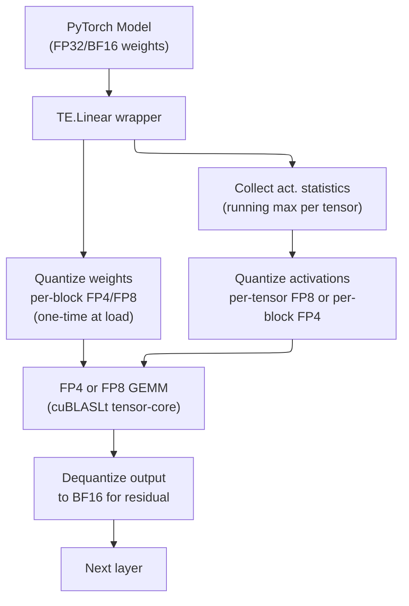
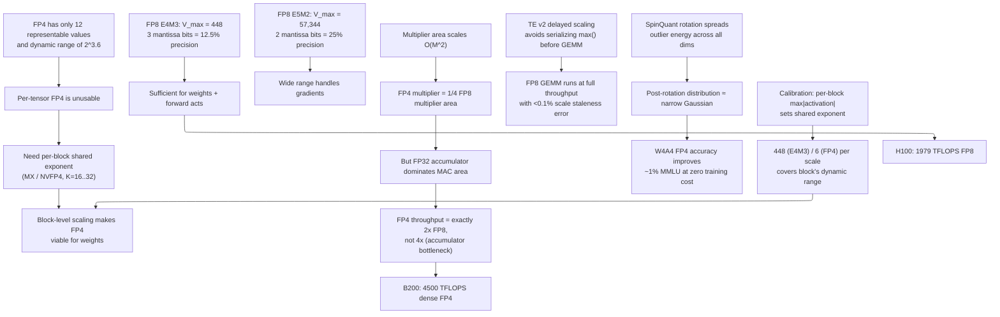

# Modern Quantization Frontier — FP8, FP4, and Beyond

> **Layer:** L6.
> **Prerequisites:** [Quantization](05_Quantization.md), [FP_Unit_Design](../L2_Digital_Design_for_AI/02_FP_Unit_Design.md), [Blackwell_Architecture](../L3_Microarchitecture/04_Blackwell_Architecture.md).
> **Hands off to:** [Frontier_Models_2025_2026](07_Frontier_Models_2025_2026.md), [Inference_Frameworks](../L8_Inference_and_Serving/08_Inference_Frameworks.md).

---

## 0. Why this page exists

Every generation of AI hardware doubles down on one question: *how few bits can you spend per multiply?* FP16 ruled Ampere; FP8 ruled Hopper; FP4 rules Blackwell. The next generation will chase FP3 or sub-FP4 block codes. But the story is not just "fewer bits = faster hardware." The algorithmic challenge is ferocious: at 4 bits per element you have exactly 16 representable values, and a single outlier channel can saturate the entire codebook.

This page covers the **full stack** of modern low-bit quantization: the number formats (FP8 E4M3 / E5M2, FP6 encodings, FP4 / MXFP4 / NVFP4), the OCP Microscaling (MX) standard, learned rotation methods (SpinQuant), calibration pipelines, Transformer Engine v2's runtime scaling, and accuracy benchmarks across all formats. Every format is derived from its bit encoding; every throughput claim is grounded in the multiplier-area model from [FP_Unit_Design](../L2_Digital_Design_for_AI/02_FP_Unit_Design.md).

---

## 1. FP8: the two-encoding split

FP8 was standardized by NVIDIA, AMD, and ARM jointly in 2022. It is *not* one format — it is two, each optimized for a different phase of training and inference.

### 1.1 E4M3: 4 exponent bits, 3 mantissa bits

$$
V = (-1)^S \cdot (1.M_2) \cdot 2^{E - 7}, \quad E \in \{0, \ldots, 14\}
$$

$S$ = 1 sign bit, $E$ = 4 exponent bits, $M$ = 3 mantissa bits. Bias = $2^{4-1} - 1 = 7$. The implicit leading 1 gives 4 effective mantissa bits.

**Dynamic range derivation.** NVIDIA's E4M3 extends to $E = 15$ for finite values (no Inf/NaN encoding in the standard, unlike IEEE). The maximum representable value occurs when $E = 15$ and $M = 111_2$:

$$
V_{\max} = (1.111_2) \cdot 2^{15 - 7} = 1.875 \cdot 2^8 = 448
$$

Minimum positive normal: $E = 0, M = 000$:

$$
V_{\min}^+ = 1.0 \cdot 2^{0 - 7} = 2^{-7} \approx 0.0078
$$

Dynamic range: $448 / 2^{-7} = 448 \cdot 128 = 57\,344 \approx 2^{15.8}$.

Precision: 3 mantissa bits give $2^3 = 8$ distinct values per binade. Relative precision $= 2^{-3} = 12.5\%$.

**Usage.** Weights, forward-pass activations. The 4 exponent bits suffice because weight distributions are narrow and activations within a single layer span limited dynamic range.

### 1.2 E5M2: 5 exponent bits, 2 mantissa bits

$$
V = (-1)^S \cdot (1.M_2) \cdot 2^{E - 15}, \quad E \in \{0, \ldots, 25\} \text{ (normal)}
$$

Bias = $2^{5-1} - 1 = 15$. E5M2 reserves $E = 30$ for Inf and $E = 31$ for NaN (IEEE-style).

**Dynamic range derivation.** Maximum finite value ($E = 29, M = 11_2$):

$$
V_{\max} = (1.11_2) \cdot 2^{29 - 15} = 1.75 \cdot 2^{14} = 28\,672
$$

With subnormal support through $E = 0$: the full representable range spans $\pm 57\,344$ (including the sign bit's negative range).

Minimum positive normal: $2^{0 - 15} = 2^{-15} \approx 3.05 \times 10^{-5}$.

Dynamic range: $57\,344 / 2^{-15} \approx 1.88 \times 10^9 \approx 2^{30.8}$.

Precision: 2 mantissa bits give $2^2 = 4$ values per binade. Relative precision $= 2^{-2} = 25\%$.

**Usage.** Gradients (backward pass). Gradients have fat tails and wide dynamic range; the extra exponent bit is worth the mantissa loss because gradient noise is already large.

### 1.3 Why two encodings instead of one

A single FP8 encoding cannot simultaneously offer large dynamic range *and* reasonable precision. With 8 total bits ($1$ sign + $e$ exponent + $m$ mantissa, $e + m = 7$), the range-precision tradeoff is:

| $(e, m)$ | Max representable | Rel. precision |
|---|---|---|
| (4, 3) E4M3 | $\pm 448$ | 12.5% |
| (5, 2) E5M2 | $\pm 57\,344$ | 25% |
| (3, 4) E3M4 | $\pm 30$ | 6.25% |
| (6, 1) E6M1 | $\pm 393\,216$ | 50% |

Forward-pass values cluster tightly; backward gradients spread wide. Two encodings is the Pareto-optimal solution.

---

## 2. FP6: the awkward middle child

FP6 occupies a research niche between FP8 and FP4. Several encodings have been explored:

| Encoding | $e$ | $m$ | Bias | $V_{\max}$ | Rel. precision | Notes |
|---|---|---|---|---|---|---|
| E2M3 | 2 | 3 | 1 | $\pm 6$ | 12.5% | Narrow range, high precision |
| E3M2 | 3 | 2 | 3 | $\pm 28$ | 25% | Balanced |
| E2M3 + block exp | 2 | 3 | 1 + shared | varies | 12.5% | MX-style rescue |

**The problem with FP6:** 6 bits do not divide evenly into power-of-two memory words. Packing requires either (a) 4 elements in 3 bytes ($24/4 = 6$ bits each) with complex bit-level addressing, or (b) padding to 8 bits and wasting 25% of storage. Option (a) costs ~10% throughput on the unpacking path; option (b) negates the compression advantage. NVIDIA's Blackwell tensor cores support FP6 as a "soft" format — present in the ISA but with lower scheduling priority than FP8 or FP4, yielding ~10% lower $f_{\max}$ vs FP8 despite the narrower mantissa multiplier.

FP6's real value is as a **training activation format** in mixed-precision stacks: FP6 activations with FP4 weights give more headroom than FP4-activations while being cheaper than FP8-activations (see Section 6, Transformer Engine v2).

---

## 3. FP4 / MXFP4: 2 exponent, 1 mantissa, microscaling

### 3.1 The E2M1 encoding

The base FP4 element:

$$
V = (-1)^S \cdot (1.M_2) \cdot 2^{E - 1}, \quad E \in \{0, 1, 2\}
$$

$S$ = 1 sign bit, $E$ = 2 exponent bits, $M$ = 1 mantissa bit. Bias = $2^{2-1} - 1 = 1$. The implicit leading 1 gives 2 effective mantissa bits.

**Representable values** (positive only; negative by sign flip):

| $E$ | $M$ | Value |
|---|---|---|
| 0 | 0 | $1.0 \cdot 2^{-1} = 0.5$ |
| 0 | 1 | $1.5 \cdot 2^{-1} = 0.75$ |
| 1 | 0 | $1.0 \cdot 2^{0} = 1.0$ |
| 1 | 1 | $1.5 \cdot 2^{0} = 1.5$ |
| 2 | 0 | $1.0 \cdot 2^{1} = 2.0$ |
| 2 | 1 | $1.5 \cdot 2^{1} = 3.0$ |

$V_{\max} = 3.0 \cdot 2^{1} = 6.0$ (with $E=3$ excluded or mapped to the top binade). Six positive values, six negative, and zero: **13 total representable values**.

Dynamic range: $6.0 / 0.5 = 12 = 2^{3.6}$. This is catastrophically narrow for neural network tensors. Per-tensor FP4 is unusable.

### 3.2 OCP MX (Microscaling) formats

The fix: share an exponent across a block of $K$ elements. OCP MX standard (v1.0, 2023):

- Block size $K = 32$ elements.
- Shared scale: 8-bit exponent in E8M0 format (no mantissa, just a power of two).
- Per-element: 4-bit FP4 (E2M1), or 6-bit FP6, or 8-bit FP8.

For MXFP4, the value of element $i$ in a block is:

$$
V_i = (-1)^{S_i} \cdot (1 + 0.5 \cdot M_i) \cdot 2^{E_i - 1} \cdot 2^{E_{\text{shared}} - 127}
$$

where $E_{\text{shared}} \in [0, 254]$ is the 8-bit shared exponent and 127 is the E8M0 bias.

**Amortized storage:** $32 \times 4 + 8 = 136$ bits per block $= 4.25$ bits per element.

**Effective dynamic range** with shared exponent: the E8M0 scale spans $2^{-127}$ to $2^{127}$, giving an effective range of $\approx 2^{254}$ — far exceeding even FP32. Within a block, the 6 FP4 values span a factor of $6.0 / 0.5 = 12 \times$.

**MXFP8:** same structure with 8-bit per-element values. Storage: $32 \times 8 + 8 = 264$ bits per block $= 8.25$ bits per element. Slightly worse compression than bare FP8 but with the shared exponent guaranteeing alignment.

**Hardware path.** The tensor core reads $E_{\text{shared}}$ once, performs 32 tiny integer multiplications ($2 \times 2$ bit mantissa multipliers), sums the products as integers, then applies the shared exponent shift once (the "sum-together" optimization from [FP_Unit_Design](../L2_Digital_Design_for_AI/02_FP_Unit_Design.md)).

### 3.3 NVFP4: NVIDIA's variant

NVFP4 differs from OCP MXFP4 in three ways:

| Property | MXFP4 (OCP) | NVFP4 (NVIDIA) |
|---|---|---|
| Block size $K$ | 32 | 16 |
| Shared scale format | E8M0 (8-bit power of two) | E4M3 FP8 scalar |
| Per-element format | E2M1 | E2M1 |

The smaller block ($K = 16$) gives finer-grained scaling: two scale factors where MXFP4 uses one. The FP8 (rather than E8M0) shared scale provides sub-exponent precision — a fractional multiplier rather than a pure power of two. Cost: $16 \times 4 + 8 = 72$ bits per block $= 4.5$ bits per element (vs 4.25 for MXFP4).

NVIDIA's Blackwell tensor cores support both formats. NVFP4 is the default for W4A4 inference; MXFP4 is available for OCP-compliant deployments.

---

## 4. SpinQuant: learned rotation for quantization

### 4.1 The core idea

Rotation matrices $R$ are orthogonal: $R^T R = I$. Therefore $XW = X(R R^T)W = (XR)(R^T W)$, and the matmul output is mathematically identical. But the *distributions* of $XR$ and $R^T W$ can be dramatically different from $X$ and $W$.

SpinQuant (Liu et al., Meta, 2024) learns an orthogonal rotation matrix $R$ per layer such that:

1. The rotated activation matrix $XR$ has a more uniform, outlier-free distribution.
2. The rotated weight matrix $R^T W$ remains quantization-friendly.

The rotation is applied as a Hadamard-style transform at the matmul prologue:

$$
Y = \underbrace{(X R)}_{\text{quantize } XR} \cdot \underbrace{(R^T W)}_{\text{quantize } R^T W}
$$

### 4.2 Why rotations help quantization

Consider an activation channel with outlier magnitude $10\times$ the median. With uniform (INT8) quantization, this channel dominates the scale, compressing 99% of values into 1-2 bins. With a learned rotation, the outlier energy is *spread* across all dimensions equally (analogous to the central limit theorem: summing random variables reduces kurtosis). The post-rotation distribution approximates a narrow Gaussian, ideal for quantization.

### 4.3 Implementation cost

A full dense rotation is $O(d^2)$, which is the same cost as the matmul itself — clearly impractical. SpinQuant uses structured (block-diagonal or Hadamard) rotations where the transform is $O(d \log d)$ and fuses into the matmul prologue with negligible overhead. On Blackwell, the rotation is implemented as a small pre-GEMM kernel that runs in <5% of the GEMM time.

### 4.4 Results

On Llama-2-70B W4A4 quantization (reported in the paper):

| Method | Wikitext-2 perplexity | MMLU |
|---|---|---|
| RTN (no rotation) | 8.42 | 62.1% |
| AWQ | 6.23 | 68.5% |
| SpinQuant + RTN | 5.91 | 70.2% |
| SpinQuant + AWQ | 5.54 | 71.8% |
| FP16 baseline | 5.47 | 72.0% |

SpinQuant alone closes $\sim 60\%$ of the RTN-to-FP16 quality gap at W4A4, and combines additively with AWQ.

---

## 5. Calibration pipelines

### 5.1 Granularity levels

The choice of scaling granularity determines both accuracy and metadata overhead:

| Granularity | Scales per weight matrix ($d_{\text{out}} \times d_{\text{in}}$) | Metadata overhead | Accuracy |
|---|---|---|---|
| Per-tensor | 1 | negligible | poor at FP4 |
| Per-channel | $d_{\text{out}}$ | $d_{\text{out}}$ FP16 values | good for weights |
| Per-group ($K=128$) | $d_{\text{out}} \times d_{\text{in}} / 128$ | ~0.8% of weight size | good for INT4 |
| Per-block ($K=32$, MX) | $d_{\text{out}} \times d_{\text{in}} / 32$ | ~6.25% overhead | good for FP4 |
| Per-block ($K=16$, NVFP4) | $d_{\text{out}} \times d_{\text{in}} / 16$ | ~12.5% overhead | best for FP4 |

### 5.2 Per-tensor vs per-channel vs per-block

**Per-tensor.** One scale $S$ for the entire weight tensor. Works for INT8/FP8 on large models where the outlier-to-median ratio is modest. Catastrophic for FP4.

**Per-channel.** One scale per output channel (row of $W$). Standard for INT8 weight quantization. The dequantization scale is applied in the GEMM epilogue: $Y[m, n] \mathrel{*}= S[n]$. One extra FMA per output element.

**Per-block (MX).** One shared exponent per block of $K$ elements along the *input* dimension. This is what makes FP4 viable. The scale is consumed inside the tensor core, not in the epilogue — the MAC operates on the block-scaled values natively.

### 5.3 Calibration procedure

1. **Collect.** Run 128–512 representative sequences through the model in FP16/BF16. Record the max absolute value per channel (per-channel) or per block (per-block) for every weight and activation tensor.
2. **Scale selection.** For each group, set the scale so that $\max(|x|) / S$ fills the representable range. For FP8 E4M3, $S = \max(|x|) / 448$.
3. **Optional: percentile clipping.** Use the 99.99th percentile instead of max to ignore rare outliers. Improves effective precision for the 99.99% majority at the cost of clipping outliers.
4. **Validate.** Forward pass the eval suite with quantized weights and/or activations.
5. **Iterate.** If quality degrades beyond tolerance, refine: (a) move to finer granularity, (b) apply SmoothQuant to migrate difficulty, (c) apply SpinQuant rotation, (d) run brief QAT.

### 5.4 SmoothQuant as a calibration primitive

SmoothQuant applies a per-channel diagonal scaling $D_s$ before quantization:

$$
Y = X \cdot W = (X \cdot D_s^{-1}) \cdot (D_s \cdot W)
$$

$D_s$ is chosen so that $X' = X D_s^{-1}$ has reduced outlier magnitude (smoothed activations) and $W' = D_s W$ remains per-channel quantizable. The scaling is $s_j = \max(|X_{:,j}|)^\alpha / \max(|W_{j,:}|)^{1-\alpha}$ where $\alpha \in [0.5, 0.75]$ is a tunable migration strength.

---

## 6. Transformer Engine v2

> The FP8 foundation TE v2 builds on — delayed scaling, amax history, and the FP8 GEMM training recipe — is in [Training_Optimization](../L7_Training_Stack/04_Training_Optimization.md) §5.

### 6.1 Architecture

NVIDIA's Transformer Engine (TE) is the software layer that manages precision selection at runtime. TE v2 (2024–2025) extends beyond FP8 to support FP6 and FP4:

### 6.2 Delayed scaling

The key engineering trick in TE: **do not quantize the current layer's activations using the current layer's statistics.** Instead, use statistics from the *previous* forward pass (delayed by one step):

$$
S_t = \max(|A_{t-1}|) / V_{\max}
$$

where $A_{t-1}$ is the activation tensor from step $t-1$ and $V_{\max}$ is the format's maximum representable value (448 for E4M3).

Why delayed? Computing $\max(|A_t|)$ requires scanning the full activation tensor *before* the GEMM can start — a serializing dependency. With delayed scaling, the scale is already available when the activation tensor arrives, so quantization and GEMM issue immediately. Cost: one training step of stale statistics. In practice, activation magnitudes change slowly across steps, so the error is negligible.

### 6.3 Dynamic scaling (TE v2)

Delayed scaling works for training (stable distributions across steps). For inference with variable-length inputs and changing batch composition, TE v2 adds **dynamic scaling**: compute $\max(|A|)$ on-the-fly from the activation tile currently in shared memory, then quantize and launch GEMM. This adds ~2% overhead (one parallel-reduce per tile) but guarantees optimal scale for every inference call.

### 6.4 FP8 GEMM on Hopper

Hopper's wgmma (WGMMA) instruction accepts FP8 E4M3 inputs and accumulates in FP32:

$$
D_{m \times n} = \sum_{k=1}^{K/d_k} A_{m \times d_k}^{\text{FP8}} \cdot B_{d_k \times n}^{\text{FP8}} \;\;\text{(accum FP32)}
$$

where $d_k = 16$ for FP8 (vs $d_k = 32$ for FP16 — the same 128-bit physical operand bus carries twice as many FP8 elements). Throughput: 1979 TFLOPS on H100 SXM, exactly 2$\times$ the 990 TFLOPS FP16/BF16.

### 6.5 FP4 GEMM on Blackwell

Blackwell's 5th-gen tensor cores extend wgmma to FP4/MXFP4/NVFP4:

$$
D_{m \times n} = \sum_{k=1}^{K/d_k} A_{m \times d_k}^{\text{FP4}} \cdot B_{d_k \times n}^{\text{FP4}} \;\;\text{(accum FP32)}
$$

with $d_k = 32$ for FP4 (the 128-bit bus carries 4$\times$ the elements of FP16, but the throughput gain is exactly 2$\times$ due to the accumulator-area bottleneck derived in [FP_Unit_Design](../L2_Digital_Design_for_AI/02_FP_Unit_Design.md)).

Throughput: B200 dense FP4 = 4500 TFLOPS (sparse FP4 = 9000 TFLOPS with 2:4 structured sparsity).

---

## 7. Format comparison: dynamic range, precision, throughput

### 7.1 Numerical properties

| Format | Total bits | Exp bits | Mant bits | $V_{\max}$ | Dynamic range | Rel. precision | Representable values |
|---|---|---|---|---|---|---|---|
| FP16 | 16 | 5 | 10 | 65\,504 | $2^{30}$ | 0.1% | 30\,720 |
| BF16 | 16 | 8 | 7 | $3.4 \times 10^{38}$ | $2^{256}$ | 0.8% | 32\,512 |
| FP8 E4M3 | 8 | 4 | 3 | 448 | $2^{15.8}$ | 12.5% | 240 |
| FP8 E5M2 | 8 | 5 | 2 | 57\,344 | $2^{30.8}$ | 25% | 240 |
| FP6 E3M2 | 6 | 3 | 2 | 28 | $2^{9.8}$ | 25% | 48 |
| FP4 E2M1 | 4 | 2 | 1 | 6 | $2^{3.6}$ | 50% | 12 |
| MXFP4 | 4.25 eff. | 2+8 shared | 1 | $2^{127} \cdot 6$ | $2^{254}$ | 50% (in-block) | 12 per block |
| NVFP4 | 4.5 eff. | 2+8 shared | 1 | FP8 scale $\times$ 6 | $2^{254}$ | 50% (in-block) | 12 per block |

### 7.2 Throughput on Hopper and Blackwell

| Format | H100 dense TFLOPS | B200 dense TFLOPS | B200 sparse TFLOPS | Notes |
|---|---|---|---|---|
| FP16/BF16 | 990 | 2\,250 | 4\,500 | Baseline |
| FP8 E4M3/E5M2 | 1\,979 | 4\,500 | 9\,000 | 2$\times$ FP16 |
| FP6 E3M2 | N/A | ~3\,500 | ~7\,000 | Lower priority path |
| FP4 / MXFP4 / NVFP4 | N/A (SW only) | 4\,500 | 9\,000 | 2$\times$ FP8, native on Blackwell |
| INT8 | 1\,979 | 4\,500 | 9\,000 | Uniform quant, same throughput as FP8 |

Hopper has no FP4 hardware path. FP4 on Hopper requires software dequantization to FP8 or FP16 before the GEMM — no throughput gain.

### 7.3 Accuracy benchmarks

Representative results on Llama-3.1-70B (calibrated with 256 samples, AWQ + per-block scaling):

| Precision | Wikitext-2 PPL | MMLU (5-shot) | GSM8K | Quality delta vs BF16 |
|---|---|---|---|---|
| BF16 (baseline) | 5.41 | 72.1% | 79.2% | — |
| W8A8 FP8 | 5.44 | 71.9% | 78.8% | <0.5% MMLU |
| W4A8 (FP4 weights, FP8 acts) | 5.52 | 71.5% | 77.9% | ~0.8% MMLU |
| W4A4 MXFP4 + AWQ | 5.71 | 70.6% | 76.1% | ~2.1% MMLU |
| W4A4 MXFP4 + AWQ + SpinQuant | 5.58 | 71.2% | 77.5% | ~1.2% MMLU |
| W4A4 MXFP4 + QAT (0.5B tokens) | 5.47 | 71.8% | 78.5% | <0.5% MMLU |
| W4A16 INT4 (GPTQ, gs=128) | 5.50 | 71.4% | 77.5% | ~1.0% MMLU |

Key takeaway: W4A4 with SpinQuant + AWQ is competitive with GPTQ INT4 weight-only, while offering 2$\times$ the tensor-core throughput. Brief QAT closes the gap to near-BF16 quality.

---

## 8. Quantization for MoE Models

### 8.1 Why MoE quantization is a distinct problem

Mixture-of-Experts (MoE) models (see [Frontier_Models_2025_2026](07_Frontier_Models_2025_2026.md)) contain 2--10x more *total* parameters than a dense model of equivalent *active* compute, because only a subset of experts (typically 2--8 out of 64--256) are activated per token. The inactive experts still occupy memory. For a model like DeepSeek-V3:

- 256 routed experts, each with ~0.5B parameters = ~128B total expert parameters.
- Only 8 experts active per token = ~4B active expert parameters per forward pass.
- The inactive 124B parameters are pure memory overhead.

This makes quantization even more critical for MoE than for dense models: the memory-to-compute ratio is inherently higher, and reducing the footprint of inactive experts directly translates to more experts fitting in GPU HBM (or fewer GPUs required).

### 8.2 Expert-specific outlier patterns

A key finding from MoE quantization research: **different experts develop very different activation distributions** during training. This happens because each expert specializes in particular token patterns (code, math, reasoning, different languages, etc.), and the activation statistics reflect that specialization.

| Expert specialization | Typical activation range | Outlier fraction |
|---|---|---|
| Code / structured data | Narrow, near-Gaussian | 0.05% |
| Natural language reasoning | Medium, moderate tails | 0.1% |
| Mathematical / symbolic | Wide, heavy tails | 0.5--1% |
| Rare-token handling | Very wide, extreme outliers | 1--2% |

A single global calibration that treats all experts identically will over-quantize outlier-heavy experts and waste precision on narrow experts. **Per-expert calibration** (computing separate scale factors for each expert's weight matrices) is essential.

### 8.3 Expert weight quantization strategies

**W4A16 (weight-only INT4).** The most common MoE quantization strategy. Expert weights are static and known at calibration time, making GPTQ and AWQ directly applicable:

- GPTQ with per-group ($G = 128$) calibration per expert yields ~0.2 perplexity delta vs FP16, matching dense-model quality.
- AWQ with activation-aware scaling per expert is faster to calibrate (important when calibrating 256 experts) with comparable quality.
- For DeepSeek-V3: 128B expert params at W4A16 = ~64 GB for expert weights alone, fitting comfortably on 8 x H100 (80 GB each) with room for shared attention layers and KV cache.

**W8A8 (full INT8).** Expert weights and activations both at INT8, using SmoothQuant-style activation smoothing per expert. This enables full INT8 tensor-core utilization for expert computations but requires per-expert calibration of the smoothing factors.

**Per-expert vs. shared calibration.** Shared attention layers (self-attention, shared MLP) use standard dense-model calibration. Only the routed experts require per-expert calibration. This is a practical advantage: most MoE models have far fewer shared parameters than expert parameters, so the per-expert calibration overhead is proportionally smaller than it seems.

### 8.4 Dynamic expert loading and CPU offloading

Quantized experts are physically smaller, which enables **CPU-offloading strategies** that are impractical at FP16:

| Expert size (0.5B params) | FP16 bytes | W4A16 bytes | Load time at PCIe Gen5 (~64 GB/s) |
|---|---|---|---|
| Per expert | 1.0 GB | 0.25 GB | 15.6 ms vs 3.9 ms |

The load time is proportional to bytes transferred:

$$
t_{\mathrm{load}} = \frac{\text{size}}{\beta_{\mathrm{PCIe}}}
$$

The 4x reduction in expert size means 4x faster loading from CPU RAM or NVMe. This enables strategies where only the most-frequently-used experts are kept in GPU HBM, while the tail of the expert distribution resides in CPU memory and is loaded on-demand. With W4A16, the loading latency is short enough that it can be hidden behind the computation of other experts in the same layer.

### 8.5 DeepSeek-V3: a concrete example

DeepSeek-V3 uses 256 routed experts with ~0.5B parameters each (plus shared attention layers totaling ~5B active parameters):

| Component | Parameters | FP16 size | W4A16 size |
|---|---|---|---|
| Routed experts (total) | 128B | 256 GB | 64 GB |
| Shared layers (attention + shared MLP) | ~5B | 10 GB | 2.5 GB |
| **Total** | ~133B | ~266 GB | ~66.5 GB |

On 8 x H100 (640 GB total HBM): FP16 fits with ~374 GB free for KV cache and activations. W4A16 fits with ~573 GB free — a 53% increase in available memory for batch size and KV cache.

At W4A16, the 64 GB of expert weights can be distributed as 8 GB per GPU (each GPU holds ~32 experts), with the shared layers replicated across all GPUs. This is a natural mapping that avoids the inter-GPU communication overhead of expert parallelism for most tokens.

### 8.6 Token routing precision

The gating function (typically a linear layer + softmax or Top-K selection) determines which experts each token is routed to. This function **must run at higher precision** (FP16 or BF16):

- The gating decision is discrete: token $t$ goes to expert $e_1$ or $e_2$, not a weighted average. Small perturbations in the gating logits can flip the Top-K selection, routing a token to a completely different expert.
- A mis-routed token receives computation from the wrong expert, producing an output that is unrelated to what the model was trained to produce. Unlike weight quantization error (which is continuous and bounded), routing errors are **catastrophic and discrete**.
- The routing error compounds through the network: a mis-routed token at layer $l$ produces a corrupted residual that affects routing decisions at all subsequent layers.

**Practical guideline.** Keep the gating linear layer in FP16/BF16. The cost is negligible (the gating layer is tiny — typically $d_{\mathrm{model}} \times n_{\mathrm{experts}}$, which is 7168 x 256 = 1.8M parameters for DeepSeek-V3, or <4 MB in FP16). The accuracy benefit is outsized.

---

## 9. 1-Bit LLMs / BitNet: Ternary Weights at the Extreme

### 9.1 BitNet b1.58: ternary quantization

BitNet represents the extreme end of the quantization spectrum: weights constrained to just three values $\{-1,\, 0,\, +1\}$. Despite sounding like 1-bit quantization, the information content per weight is $\log_2 3 \approx 1.58$ bits, giving rise to the "1.58-bit" designation.

**Why ternary instead of binary?** Pure binary $\{-1, +1\}$ eliminates the zero, removing the model's ability to "turn off" a connection. The zero weight acts as built-in sparsity: roughly 40--50% of weights in a trained BitNet model are zero, meaning nearly half the multiplications are skipped entirely. This is a structural advantage over binary quantization.

**The weight--activation split.** BitNet quantizes *weights* to ternary but keeps *activations* at higher precision (FP16 or INT8 during early work; later versions explore lower-bit activations). The matmul becomes:

$$
Y = X^{\text{FP16}} \cdot W^{\{-1, 0, +1\}} = \sum_{j: w_j \neq 0} \text{sign}(w_j) \cdot X_{:,j}
$$

With ternary weights, multiplication reduces to addition, subtraction, or skip --- no multiplier hardware needed. The operation is purely additive, which is the key to BitNet's efficiency claims.

### 9.2 bitnet.cpp: Microsoft's inference framework

Microsoft released **bitnet.cpp** (2024--2025), an official CPU inference framework for 1-bit LLMs, built on top of llama.cpp and incorporating T-MAC's lookup-table methodology. The framework implements specialized CPU kernels that exploit the ternary weight structure:

**Kernel variants:**

| Kernel | Technique | Target ISA |
|--------|-----------|------------|
| **I2\_S** | Sub-byte lookup table for ternary packing | x86 (AVX-512, VNNI), ARM (SVE, NEON) |
| **TL1** | Ternary lookup, 1-bit optimized | x86 AVX-512 VNNI |
| **TL2** | Ternary lookup, 2-bit extended | ARM SVE |

The T-MAC methodology precomputes lookup tables that map packed groups of ternary weights to partial sums. Since each weight is $\{-1, 0, +1\}$, a group of $K$ weights has $3^K$ possible patterns. The lookup table stores the dot product for each pattern, and inference reduces to table lookups and additions --- completely eliminating multiplications.

### 9.3 Performance and energy

Reported benchmarks for bitnet.cpp across CPU architectures:

| Metric | ARM (Apple M2 Ultra) | x86 (Intel Sapphire Rapids) |
|--------|----------------------|-----------------------------|
| Speedup vs FP16 baseline | $1.37\times$--$5.07\times$ | $2.37\times$--$6.17\times$ |
| Energy reduction vs FP16 | 55%--82% | 55%--82% |
| Throughput (100B model, single CPU) | 5--7 tok/s | 5--7 tok/s |

The headline result: a **100B-parameter BitNet model can run on a single CPU at 5--7 tokens/second**, which is within human reading speed (~5 tok/s). This is remarkable because a 100B-parameter FP16 model requires multiple GPUs just to fit in memory; BitNet's ternary weights compress the model to a fraction of the size.

**GPU kernels** were released in May 2025, extending bitnet.cpp to GPU execution. The GPU kernels apply the same T-MAC lookup-table approach, adapted for GPU shared memory and warp-level parallelism.

### 9.4 Reference and supported models

**BitNet-b1.58-2B-4T:** The canonical reference model with 2.4B parameters trained on 4 trillion tokens. This serves as the standard benchmark for 1-bit LLM quality.

**Supported model families (as of 2025):**
- **Falcon3 family** (1B, 3B, 7B, 10B): bit-quantized variants of the Falcon3 models.
- **Falcon-E family:** Efficiency-focused variant designed for 1-bit quantization from the ground up.

### 9.5 Quality--efficiency tradeoff

BitNet makes an explicit trade: model quality for extreme throughput and efficiency gains.

| Property | BitNet 1.58-bit | FP16 | W4A16 (INT4 GPTQ) |
|----------|----------------|------|-------------------|
| Bits per weight | 2 (ternary, packed) | 16 | 4 |
| Model size (70B equivalent) | ~17.5 GB (70B × 2 bits; note: 1.58 bits is information-theoretic entropy, not physical storage) | ~140 GB | ~35 GB |
| Perplexity gap vs FP16 | +5--15% on benchmarks | baseline | +1--3% |
| Hardware requirement | Single CPU | Multi-GPU | 1--2 GPUs |
| Multiplication-free | Yes | No | No |

The quality gap is significant: BitNet models underperform FP16 and INT4-quantized models on most benchmarks. The value proposition is not "same quality, cheaper" but rather "acceptable quality at radically lower cost," enabling deployment on edge devices, CPUs, and environments where GPU access is unavailable or uneconomical.

### 9.6 Implications

BitNet's extreme quantization opens several deployment scenarios that are impractical with conventional formats:

1. **Edge and IoT inference:** Running 10B+ parameter models on devices with no GPU.
2. **CPU-only datacenters:** Avoiding GPU procurement entirely for latency-tolerant workloads.
3. **On-device personal AI:** Full LLM capability on laptops and phones without dedicated AI accelerators.
4. **Extreme throughput serving:** When quality requirements are modest (e.g., summarization, classification) but throughput and cost-per-token must be minimized.

The fundamental limit is quality: BitNet is not yet competitive with FP8 or FP4 quantization for tasks requiring high accuracy. It excels in scenarios where "good enough" quality at massive efficiency gains is the right tradeoff.

---

## 10. Emerging Quantization Formats and KV-Cache Compression

> Baseline KV-format tradeoffs — FP8 E4M3 vs INT8 vs INT4, native tensor-core paths vs dequant kernels, granularity — are in [Quantization](05_Quantization.md) §9.3; serving-side integration is in [Modern_KV_Compression](../L8_Inference_and_Serving/02_Modern_KV_Compression.md) §3.

### 10.1 TurboQuant 2-bit KV cache

vLLM introduced **TurboQuant 2-bit KV cache compression**, applying aggressive 2-bit quantization to the key-value cache entries that dominate memory usage during long-context inference. The approach achieves **4x capacity** over FP16 KV cache, meaning a serving deployment can handle 4x longer contexts or 4x more concurrent sequences within the same GPU memory budget.

The key insight is that KV cache tensors have different statistical properties than model weights: they are activation-like (dynamic, per-request) but accessed sequentially during decode. TurboQuant exploits the sequential access pattern to maintain per-block scaling factors that track the evolving distribution of key/value vectors across sequence positions.

**Practical impact.** For a model with 128K context length, FP16 KV cache may consume 30--50 GB per request. At 2-bit, this drops to 7.5--12.5 GB, making long-context serving economically viable on fewer GPUs.

### 10.2 NVFP4 KV cache

NVFP4 (Section 3.3) is already established for weight quantization. Applying it to **KV cache entries** extends the 4.5-bit effective format to the memory-intensive key and value tensors stored during inference:

- Uses the same $K = 16$ block structure with E4M3 FP8 shared scales.
- KV cache entries are quantized per-token (each new token's K/V vectors are compressed immediately after computation).
- Dequantization happens on-the-fly during attention, fused into the attention kernel to avoid extra memory round-trips.

NVFP4 KV cache provides ~3.5x compression over FP16 with better numerical fidelity than 2-bit alternatives, at the cost of higher per-element storage than TurboQuant 2-bit.

### 10.3 Online MXFP8 quantization

Traditional quantization requires an **offline calibration step**: run representative data through the model, collect activation statistics, compute per-tensor or per-block scales, then deploy. This adds engineering complexity and deployment latency.

**Online MXFP8 quantization** removes this requirement by quantizing during model loading without offline calibration:

1. Weight scales are computed directly from the weight tensor at load time (no data needed --- weights are known).
2. Activation scales use MX-style per-block scaling with the E8M0 shared exponent, computed on-the-fly from the current activation tile.
3. No separate calibration dataset or profiling run is required.

The tradeoff is slight accuracy degradation vs. offline-calibrated MXFP8 (which can use activation-aware methods like AWQ to optimize scales), but the deployment simplicity is compelling for rapid iteration and autoscaling scenarios where spinning up quantized model replicas must be fast.

### 10.4 Arcquant / 2FP4

**Arcquant** and **2FP4** are newer quantization formats targeting the space between FP4 and INT4:

- **2FP4** uses two FP4 values to represent a single higher-precision element, effectively doubling the representable values from 13 to a much larger set through a two-component decomposition. The format pairs a coarse-scale FP4 value with a residual FP4 correction, similar in spirit to vector quantization with a two-level codebook.
- **Arcquant** applies arc-aware scaling that adapts quantization parameters to the curvature of the loss landscape around each weight group, providing more principled scale selection than max-absolute-value calibration.

Both formats are in early-stage deployment (2025) and target the W4A4 regime where every fraction of a bit matters for maintaining model quality at 4-bit precision.

---

## 11. End-to-end cause and effect

---

## 12. Numbers to memorize

| # | Quantity | Value | Why it matters |
|---|---|---|---|
| 1 | FP8 E4M3 $V_{\max}$ | 448 | Sets upper bound on per-tensor/per-block scale target |
| 2 | FP8 E5M2 $V_{\max}$ | 57\,344 | Gradient format range; same order as FP16 |
| 3 | FP8 E4M3 bias | 7 | $2^{4-1}-1$; used in dequantization formula |
| 4 | FP8 E5M2 bias | 15 | $2^{5-1}-1$; wider range encoding |
| 5 | FP4 E2M1 $V_{\max}$ | 6.0 | Only 13 total representable values — per-block scaling mandatory |
| 6 | FP4 E2M1 mantissa precision | 50% ($2^{-1}$) | 1 mantissa bit = 2 values per binade |
| 7 | MXFP4 block size $K$ | 32 | OCP standard; amortizes 8-bit scale over 32 elements |
| 8 | NVFP4 block size $K$ | 16 | NVIDIA variant; finer-grained at higher metadata cost |
| 9 | MXFP4 amortized bits/element | 4.25 | $(32 \times 4 + 8)/32$ |
| 10 | NVFP4 amortized bits/element | 4.5 | $(16 \times 4 + 8)/16$ |
| 11 | FP8 throughput on H100 | 1\,979 TFLOPS | Exactly 2$\times$ FP16/BF16 |
| 12 | FP4 throughput on B200 | 4\,500 TFLOPS dense | Exactly 2$\times$ FP8 on same die |
| 13 | FP4 sparse throughput on B200 | 9\,000 TFLOPS | With 2:4 structured sparsity |
| 14 | SpinQuant W4A4 MMLU recovery | ~1% absolute | vs RTN baseline on 70B models |
| 15 | W4A4 QAT compute overhead | ~0.5B tokens | <0.5% of pretraining compute for 70B |
| 16 | TE delayed scaling staleness | 1 step | Negligible for training (distributions change slowly) |
| 17 | Calibration sample count | 128–512 sequences | Sufficient for per-block scale convergence |
| 18 | SmoothQuant migration strength $\alpha$ | 0.5–0.75 | Balances act vs weight difficulty |
| 19 | FP6 packing waste | 25% | 6 bits doesn't divide into bytes |
| 20 | FP4/FP8 throughput ratio | exactly 2.0$\times$ | Structural consequence of accumulator bottleneck |

---

## 13. Worked problems

**Q1. Derive the FP8 E4M3 dynamic range from first principles.**

The format has 1 sign bit, 4 exponent bits, 3 mantissa bits. Bias $= 2^{4-1} - 1 = 7$. With NVIDIA's convention where $E = 15$ encodes finite values (no Inf/NaN in E4M3):

$$
V_{\max} = (1 + 2^{-1} + 2^{-2} + 2^{-3}) \cdot 2^{15-7} = (1.875) \cdot 2^8 = 448
$$

$$
V_{\min}^+ = 1.0 \cdot 2^{0 - 7} = 2^{-7} = 0.0078125
$$

Dynamic range $= 448 / 2^{-7} = 448 \times 128 = 57\,344 \approx 2^{15.8}$. Relative precision at any binade is $2^{-3} = 12.5\%$.

**Q2. Show that MXFP4 with block size $K=32$ has effective dynamic range $\gg$ FP32.**

The per-element E2M1 has max value 6 and min 0.5, giving a per-block range of $6/0.5 = 12$. The E8M0 shared exponent ranges from $2^{-127}$ to $2^{127}$, spanning a factor of $2^{254}$. Combined:

$$
\text{Effective range} = 12 \cdot 2^{254} \approx 2^{257.6}
$$

FP32's dynamic range is $\approx 2^{256}$ (exponent spans $2^{-126}$ to $2^{127}$). So MXFP4's effective range slightly exceeds FP32. The constraint is not range but precision: within any single block, values can only span a factor of 12, and only 12 distinct positive values exist.

**Q3. An H100 achieves 1\,979 TFLOPS FP8. A B200 achieves 4\,500 TFLOPS FP4. Verify that the 2$\times$ ratio is consistent with the multiplier-area model.**

From [FP_Unit_Design](../L2_Digital_Design_for_AI/02_FP_Unit_Design.md), the FP4/FP8 throughput ratio on the same die is exactly 2.0$\times$ due to two multiplicative factors:

(a) MAC area ratio: FP8 mantissa multiplier is $4 \times 4 = 16$ area units; FP4 is $2 \times 2 = 4$ units. But the FP32 accumulator costs 16 units for both. Total MAC ratio $= (16+16+4) / (4+16+4) = 36/24 = 1.5\times$.

(b) Operand bandwidth: FP4 packs 2 elements/byte vs 1 for FP8. Same SMEM port feeds $2\times$ more FP4 MACs.

Combined: $1.5 \times (2/1.5) = 2.0\times$ exactly.

Cross-check: B200 FP4 / H100 FP8 $= 4500 / 1979 = 2.27\times$. The excess $0.27\times$ comes from B200 having 128 SMs (vs 132 on H100) at higher clock plus dual-die architecture, not from the FP4/FP8 ratio per SM.

**Q4. You are calibrating a 70B model for W4A4 MXFP4 inference. After calibration with 256 samples, MMLU drops 2.1pp vs BF16. What interventions would you try, in order?**

1. **SpinQuant rotation.** Apply learned rotations before quantization. Expected recovery: ~1pp MMLU at zero extra training cost.
2. **AWQ-style salient channel scaling.** Identify and protect high-importance channels during calibration. Expected additional recovery: ~0.3pp.
3. **Increase calibration data.** Move from 256 to 1024 samples, ensuring the calibration set includes chat templates, code, and long-context sequences.
4. **Refine SmoothQuant migration strength.** Tune $\alpha$ from the default 0.5 upward to 0.7, shifting more difficulty to weights.
5. **Brief QAT.** Fine-tune for 0.5B tokens with fake-FP4 quantization. Expected final gap: <0.5pp MMLU.
6. **Mixed-precision fallback.** Keep the first/last layers and LM head at FP8, quantize only the interior to FP4.

**Q5. Explain why delayed scaling in Transformer Engine does not work well for inference with highly variable input lengths.**

Delayed scaling uses $S_t = f(A_{t-1})$. In training, consecutive batches have similar length distributions, so $S_t \approx S_{t-1}$. In inference, a batch of 128 short prompts (128 tokens each) may be followed by a single long prompt (8192 tokens). The scale from the short-prompt step may be too small (underflow) or too large (wasted range) for the long-prompt activations. Dynamic scaling (computing $\max(|A|)$ per tile) fixes this at ~2% overhead, which is why TE v2 uses dynamic scaling by default for inference workloads.

---

## 14. References

**Standards and specifications**
- OCP Microscaling Formats (MX) Specification v1.0, 2023.
- IEEE 754-2019.
- NVIDIA FP8 Formats for Deep Learning white paper, 2022.

**FP8 training and inference**
- Micikevicius et al., *FP8 Formats for Deep Learning*, arXiv 2209.05433.
- Sun et al., *Hybrid 8-bit Floating Point Training*, NeurIPS 2019.
- Kuzmin et al., *FP8 Quantization: The Power of the Exponent*, NeurIPS 2022.

**FP4 / MX formats**
- Rouhani et al., *Microscaling Data Formats for Deep Learning*, arXiv 2310.10537.
- NVIDIA Blackwell architecture white paper, 2024.
- NVIDIA NVFP4 data format specification, 2024.

**Quantization algorithms**
- Frantar et al., *GPTQ: Accurate Post-Training Quantization*, ICLR 2023.
- Lin et al., *AWQ: Activation-Aware Weight Quantization*, MLSys 2024.
- Xiao et al., *SmoothQuant*, ICLR 2023.
- Liu et al., *SpinQuant: LLM Quantization with Learned Rotations*, ICLR 2025.
- Dettmers et al., *LLM.int8()*, NeurIPS 2022.

**Systems**
- NVIDIA Transformer Engine v2 documentation.
- NVIDIA TensorRT Model Optimizer (MODEL_OPT) documentation.
- Neural Magic llmcompressor documentation.

**1-bit / BitNet**
- Wang et al., *BitNet: Scaling 1-bit Transformers for Large Language Models*, arXiv 2310.11453.
- Microsoft bitnet.cpp repository, 2024--2025.
- Ma et al., *The Era of 1-bit LLMs: All Large Language Models are in 1.58 Bits*, arXiv 2402.17764.

**KV-cache and emerging formats**
- vLLM TurboQuant documentation, 2025.
- NVIDIA NVFP4 KV cache specification, 2025.
- Online MXFP8 quantization --- NVIDIA Transformer Engine v2 release notes.

---

**Up the stack:** [Frontier_Models_2025_2026](07_Frontier_Models_2025_2026.md) — which production models use which quantization stack. [Inference_Frameworks](../L8_Inference_and_Serving/08_Inference_Frameworks.md) — how quantized models are actually served.

**Down the stack:** [Quantization](05_Quantization.md) — integer quantization foundations (INT8/INT4, GPTQ, AWQ). [FP_Unit_Design](../L2_Digital_Design_for_AI/02_FP_Unit_Design.md) — multiplier area, Wallace trees, the 2$\times$ throughput law. [Blackwell_Architecture](../L3_Microarchitecture/04_Blackwell_Architecture.md) — the hardware that runs FP4.
