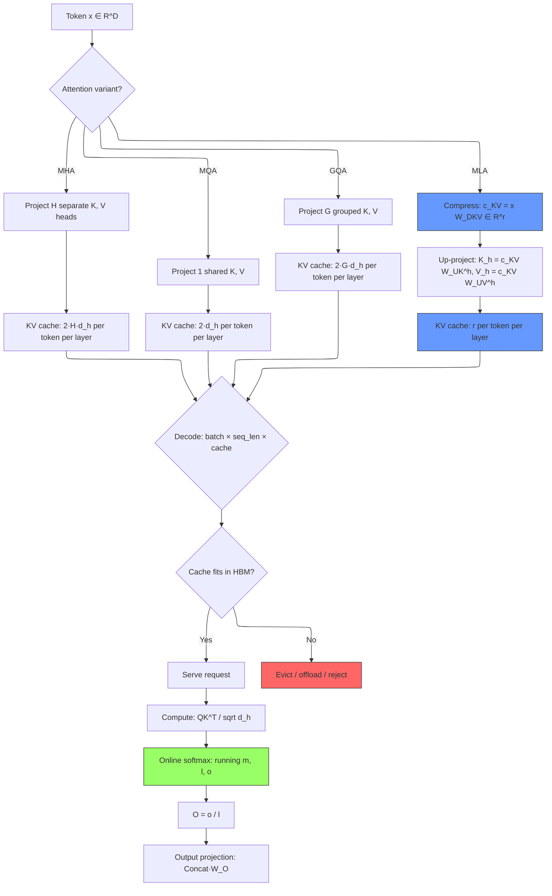

# Attention Mechanisms — From Dot-Product to Multi-Head Latent Attention

> **Layer:** L6.
> **Prerequisites:** [Transformer_Internals](Transformer_Internals.md), [FlashAttention_Deep_Dive](../L5_Kernels_and_Programming/FlashAttention_Deep_Dive.md).
> **Hands off to:** [Modern_MoE](Modern_MoE.md), [KV_Cache](../L8_Inference_and_Serving/KV_Cache.md), [Long_Context_Engineering](../L8_Inference_and_Serving/Long_Context_Engineering.md).

---

## 0. Why This Page Exists

Attention is the single most important operation in modern LLMs. Every token generated during inference requires one attention pass per layer; every training step computes attention over the full context. The core equation has not changed since 2017:

$$\text{Attention}(Q, K, V) = \text{softmax}\!\left(\frac{QK^T}{\sqrt{d}}\right)V$$

But the *instantiation* of that equation has evolved dramatically. Multi-head attention (MHA) gives each head independent key-value pairs. Multi-query attention (MQA) shares a single KV pair across all heads. Grouped-query attention (GQA) interpolates between the two. Multi-head latent attention (MLA, DeepSeek-V2/V3) compresses KV into a low-rank latent vector, achieving per-layer compression ratios of ~64x over MHA (comparing the compressed latent vs uncompressed per-layer KV). The end-to-end ratio including RoPE overhead is ~8.5x; see [Frontier_Models_2025_2026](Frontier_Models_2025_2026.md) for that comparison basis.

These choices have direct hardware consequences. The KV cache size during decode determines how many concurrent requests a GPU can serve. The attention variant determines whether decode is memory-bound (MHA, large KV) or compute-bound (MLA, small KV). The online softmax algorithm enables tiled attention kernels that avoid materializing the $N^2$ matrix.

This page derives every variant from first principles, proves the online softmax is numerically equivalent to the standard two-pass formulation, provides exact KV cache size formulas, and works through concrete numerical examples. The kernel-level tiling and SRAM management live at [FlashAttention_Deep_Dive](../L5_Kernels_and_Programming/FlashAttention_Deep_Dive.md).

### Invariants

Throughout this page the following notation is fixed:

| Symbol | Meaning | Typical value |
|--------|---------|---------------|
| $B$ | Batch size | 1 (decode) to 4096 (training) |
| $S$ | Sequence length | 1 (decode step) to 128K+ |
| $D$ | Model hidden dimension | 4096-7168 |
| $H$ | Number of query heads | 32-128 |
| $d_h$ | Head dimension, $D/H$ | 64-256 |
| $n_{\text{layers}}$ | Transformer layers | 32-61 |
| $b$ | Bytes per element | 2 (FP16/BF16) |

---

## 1. Scaled Dot-Product Attention — Full Derivation

### 1.1 The Motivating Problem

Given a sequence of $S$ tokens each represented as a $D$-dimensional vector, we want each token to aggregate information from other tokens based on *content relevance* — a form of differentiable dictionary lookup. The query $Q$ specifies "what I am looking for," the key $K$ specifies "what I contain as an index," and the value $V$ is the payload.

### 1.2 From Similarity to Weights to Output

**Step 1: Compute pairwise similarity.** For each query position $i$ and key position $j$:

$$s_{ij} = q_i \cdot k_j = \sum_{p=1}^{d_h} Q_{ip} \, K_{jp}$$

This produces an $S \times S$ score matrix $S = QK^T$.

**Step 2: Scale.** Divide by $\sqrt{d_h}$:

$$\hat{s}_{ij} = \frac{s_{ij}}{\sqrt{d_h}}$$

**Derivation of why scaling is necessary.** Assume entries of $Q$ and $K$ are drawn i.i.d. from $\mathcal{N}(0, \sigma^2)$. Then each $s_{ij}$ is a sum of $d_h$ products of independent Gaussians:

$$\mathbb{E}[s_{ij}] = 0, \quad \text{Var}(s_{ij}) = d_h \, \sigma^4$$

With $\sigma^2 = 1$ (typical post-initialization), $\text{Var}(s_{ij}) = d_h$, so the standard deviation is $\sqrt{d_h}$. For $d_h = 128$, raw dot products have std $\approx 11.3$. Softmax at those magnitudes produces near-one-hot distributions: $\exp(11.3)/\exp(0) \approx 80{,}000:1$. Gradients vanish.

Dividing by $\sqrt{d_h}$ restores unit variance:

$$\text{Var}\!\left(\frac{s_{ij}}{\sqrt{d_h}}\right) = \frac{d_h}{d_h} = 1$$

**Step 3: Softmax.** Convert scaled scores to a probability distribution over key positions:

$$\alpha_{ij} = \frac{\exp(\hat{s}_{ij})}{\sum_{k=1}^{S} \exp(\hat{s}_{ik})}$$

In matrix notation with the stable formulation (subtracting the row max $m_i = \max_j \hat{s}_{ij}$):

$$\alpha_{ij} = \frac{\exp(\hat{s}_{ij} - m_i)}{\sum_{k=1}^{S} \exp(\hat{s}_{ik} - m_i)}$$

**Step 4: Weighted sum.** The output for position $i$ is:

$$o_i = \sum_{j=1}^{S} \alpha_{ij} \, v_j$$

**Compact form:**

$$\boxed{O = \text{softmax}\!\left(\frac{QK^T}{\sqrt{d_h}}\right) V}$$

where $Q \in \mathbb{R}^{S \times d_h}$, $K \in \mathbb{R}^{S \times d_h}$, $V \in \mathbb{R}^{S \times d_h}$, and $O \in \mathbb{R}^{S \times d_h}$.

### 1.3 Causal Mask

For autoregressive decoders, position $i$ must not attend to positions $j > i$:

$$\hat{s}_{ij} \leftarrow \hat{s}_{ij} + M_{ij}, \quad M_{ij} = \begin{cases} 0 & j \leq i \\ -\infty & j > i \end{cases}$$

Adding $-\infty$ forces $\exp(-\infty) = 0$ in the softmax, zeroing out future positions. During decode with a KV cache, the mask is implicit — the single query token only sees existing KV entries.

### 1.4 FLOP Count

| Operation | FLOPs |
|-----------|-------|
| $S = QK^T$ | $2S^2 d_h$ |
| Scale + mask | $S^2$ |
| Softmax (row max, exp, sum, div) | $\approx 3S^2$ |
| $O = PV$ | $2S^2 d_h$ |
| **Total per head** | $\approx 4S^2 d_h$ |
| **Total (H heads)** | $\approx 4S^2 D$ |

For $S = 4096$, $D = 4096$: $4 \times 4096^2 \times 4096 = 274.9$ GFLOP per layer.

---

## 2. Multi-Head Attention (MHA)

### 2.1 Structure

Instead of a single attention function over the full $D$-dimensional space, MHA runs $H$ parallel attention heads, each operating in a $d_h = D/H$-dimensional subspace:

$$\text{head}_h = \text{Attention}(QW_h^Q, \, KW_h^K, \, VW_h^V)$$

$$\text{MHA}(Q, K, V) = \text{Concat}(\text{head}_1, \ldots, \text{head}_H) \, W^O$$

where $W_h^Q, W_h^K, W_h^V \in \mathbb{R}^{D \times d_h}$ and $W^O \in \mathbb{R}^{D \times D}$.

### 2.2 Why Multiple Heads?

A single head learns one attention pattern. Multiple heads allow the model to simultaneously attend to different types of relationships — syntactic, semantic, positional — in different subspaces. The total parameter count and FLOP count are unchanged versus a single head of dimension $D$ (each head is $d_h = D/H$, and there are $H$ of them), but the representational capacity increases.

### 2.3 KV Cache Size (MHA)

During autoregressive decode, each token generates one K vector and one V vector per head. Stored across all layers:

$$\boxed{C_{\text{MHA}} = 2 \cdot n_{\text{layers}} \cdot H \cdot d_h \cdot b}$$

**Example (Llama-2 70B):** $n_{\text{layers}} = 80$, $H = 64$, $d_h = 128$, $b = 2$ (FP16):

$$C_{\text{MHA}} = 2 \times 80 \times 64 \times 128 \times 2 = 2{,}621{,}440 \text{ bytes/token} \approx 2.5 \text{ MB/token}$$

At $S = 4096$: $\approx 10$ GB of KV cache per request. At $S = 128K$: $\approx 320$ GB — exceeding a single H100's 80 GB HBM.

---

## 3. Multi-Query Attention (MQA)

### 3.1 Structure

MQA (Shazeer, 2019) shares a single K head and single V head across all $H$ query heads:

$$Q_h = X W_h^Q \in \mathbb{R}^{S \times d_h}, \quad h = 1, \ldots, H$$

$$K = X W^K \in \mathbb{R}^{S \times d_h}, \quad V = X W^V \in \mathbb{R}^{S \times d_h}$$

$$\text{head}_h = \text{Attention}(Q_h, K, V)$$

The shared $K$ and $V$ are broadcast (or gathered) for each query head.

### 3.2 KV Cache Size (MQA)

Only one K and one V vector per token per layer:

$$\boxed{C_{\text{MQA}} = 2 \cdot n_{\text{layers}} \cdot d_h \cdot b}$$

This is $H$ times smaller than MHA. For the same 70B-class model ($n_{\text{layers}} = 80$, $d_h = 128$, $b = 2$):

$$C_{\text{MQA}} = 2 \times 80 \times 128 \times 2 = 40{,}960 \text{ bytes/token} \approx 40 \text{ KB/token}$$

A 64x reduction. At $S = 128K$: $\approx 5$ GB — feasible on a single H100.

### 3.3 Tradeoff

The single KV pair has $d_h$ dimensions to represent what all $H$ query heads need. For $H = 64$ and $d_h = 128$, the ratio is $128/64 = 2$ dimensions per query head. Quality degrades versus MHA, particularly on tasks requiring fine-grained positional distinctions within long contexts. PaLM, Falcon, and StarCoder use MQA.

---

## 4. Grouped-Query Attention (GQA)

### 4.1 Structure

GQA (Ainslie et al., 2023) partitions $H$ query heads into $G$ groups. Each group shares one KV head:

$$Q_h = X W_h^Q, \quad h = 1, \ldots, H$$

$$K_g = X W_g^K, \quad V_g = X W_g^V, \quad g = 1, \ldots, G$$

Each query head $h$ in group $g = \lfloor h \cdot G / H \rfloor$ attends to $K_g, V_g$. The group size is $H/G$ heads per KV head.

### 4.2 Interpolation Between MHA and MQA

| $G$ | Variant | KV heads | KV cache vs MHA |
|-----|---------|----------|-----------------|
| $H$ | MHA | $H$ | 1x |
| $G$ | GQA | $G$ | $H/G$ x smaller |
| $1$ | MQA | $1$ | $H$x smaller |

### 4.3 KV Cache Size (GQA)

$$\boxed{C_{\text{GQA}} = 2 \cdot n_{\text{layers}} \cdot n_{\text{kv\_heads}} \cdot d_h \cdot b}$$

where $n_{\text{kv\_heads}} = G$.

**Example (Llama-3 70B):** $n_{\text{layers}} = 80$, $n_{\text{kv\_heads}} = 8$, $d_h = 128$, $b = 2$:

$$C_{\text{GQA}} = 2 \times 80 \times 8 \times 128 \times 2 = 327{,}680 \text{ bytes/token} \approx 320 \text{ KB/token}$$

This is an 8x reduction versus MHA with $H = 64$. At $S = 128K$: $\approx 40$ GB — fits on one H100 with room for weights.

### 4.4 Implementation Detail

Two approaches to handle the group size mismatch at the kernel level:

**Repeat K/V (expand):** Replicate $K_g, V_g$ along the head dimension before the standard MHA kernel:

$$K_{\text{expanded}}[h, :, :] = K_g \quad \text{for all } h \in \text{group } g$$

Simple but wastes memory bandwidth copying $H/G$ times.

**Gathered attention:** The kernel directly indexes into $G$ KV heads. More efficient; used in FlashAttention v2/v3 with `num_kv_heads` parameter.

### 4.5 GQA Grouping — Worked Example

Consider Llama-3-70B: $H = 64$ query heads, $G = 8$ KV heads (group ratio = $H/G = 8$), $d_h = 128$.

**How queries map to KV groups.** Query heads are partitioned into $G = 8$ contiguous groups of size $H/G = 8$:

| KV head $g$ | Query heads $h$ | $K_g, V_g$ shared by |
|---|---|---|
| 0 | $h = 0, 1, 2, 3, 4, 5, 6, 7$ | 8 query heads |
| 1 | $h = 8, 9, 10, 11, 12, 13, 14, 15$ | 8 query heads |
| 2 | $h = 16, 17, 18, 19, 20, 21, 22, 23$ | 8 query heads |
| ... | ... | ... |
| 7 | $h = 56, 57, 58, 59, 60, 61, 62, 63$ | 8 query heads |

In code: group index for query head $h$ is $g = h \cdot G / H = h / 8$.

**Attention computation with shared K/V.** For query head $h = 3$ (group $g = 0$):

$$Q_3 = X W_3^Q \in \mathbb{R}^{S \times 128}$$

$$K_0 = X W_0^K \in \mathbb{R}^{S \times 128}, \quad V_0 = X W_0^V \in \mathbb{R}^{S \times 128}$$

$$\text{head}_3 = \text{softmax}\!\left(\frac{Q_3 K_0^T}{\sqrt{128}}\right) V_0$$

All 8 query heads $h = 0, \ldots, 7$ compute attention against the same $K_0, V_0$ — but with different $Q_h$ and different projection matrices, so each head learns a different attention pattern over the same key-value space.

**Memory savings calculation.** Without GQA (MHA), per-token KV cache per layer stores $2 \times 64 \times 128 = 16{,}384$ elements. With GQA ($G = 8$): $2 \times 8 \times 128 = 2{,}048$ elements. Savings: $16{,}384 / 2{,}048 = 8\times$.

The $8\times$ savings comes directly from the group ratio. In general, GQA with $G$ KV heads reduces KV cache by $H/G \times$ compared to MHA, at the cost of $G$ independent key-value subspaces instead of $H$. Empirically, $G = H/8$ (ratio = 8) gives quality nearly indistinguishable from MHA across standard benchmarks.

---

## 5. Multi-Head Latent Attention (MLA) — DeepSeek-V2/V3

### 5.1 Motivation

GQA reduces KV cache by reducing the *number* of heads. MLA takes a fundamentally different approach: it compresses the *content* of each KV pair into a low-dimensional latent vector using a learned low-rank projection. The compression ratio is determined by the latent dimension $r$, which is independent of $H$ and $d_h$.

> **MLA vs. MQA distinction.** Both MLA and MQA (Section 3) store a single compressed representation per token, but the mechanisms are fundamentally different. MQA shares a *single K/V head sequence* of dimension $d_h$ across all $H$ query heads — every query head attends to the same K/V vectors directly. MLA stores a *single latent vector* $\mathbf{c}_{KV} \in \mathbb{R}^r$ and then *up-projects* it via separate $W_{UK}^h, W_{UV}^h$ matrices to reconstruct distinct K and V for each of the $H$ query heads. The key difference: MQA's single KV head has only $d_h$ dimensions to serve all query heads (information bottleneck), while MLA's latent reconstructs all $H$ heads via learned up-projections (the bottleneck is compressible, not destructive). This is why MLA achieves higher quality than MQA at comparable KV cache sizes.

### 5.2 Architecture

Standard MHA computes:

$$K_h = X W_h^K, \quad V_h = X W_h^V \quad \text{(separate projection per head)}$$

MLA instead computes a single compressed latent per token, then *up-projects* to recover per-head K and V on the fly:

$$\mathbf{c}_{KV} = X W_{DKV} \in \mathbb{R}^{S \times r} \quad \text{(down-projection to latent)}$$

$$K_h = \mathbf{c}_{KV} \, W_{UK}^h \in \mathbb{R}^{S \times d_h} \quad \text{(up-projection to head } h\text{)}$$

$$V_h = \mathbf{c}_{KV} \, W_{UV}^h \in \mathbb{R}^{S \times d_h}$$

where $W_{DKV} \in \mathbb{R}^{D \times r}$ with $r \ll D$, and $W_{UK}^h, W_{UV}^h \in \mathbb{R}^{r \times d_h}$.

### 5.3 Full Derivation — Why the Low-Rank Projection Works

**Key insight:** In MHA, the matrices $W_h^K \in \mathbb{R}^{D \times d_h}$ map from the full hidden dimension $D$ to the head dimension $d_h$. Since $d_h \ll D$ (e.g., $d_h = 128$, $D = 7168$), these projection matrices are inherently low-rank — they map from a high-dimensional space to a low-dimensional one.

MLA exploits this by factoring the projection through an intermediate bottleneck $r$:

$$W_h^K = W_{DKV} \cdot W_{UK}^h$$

where $W_{DKV} \in \mathbb{R}^{D \times r}$ is shared across heads and $W_{UK}^h \in \mathbb{R}^{r \times d_h}$ is per-head. This is valid whenever $r \geq d_h$ (the bottleneck does not restrict the rank of the composed matrix). In practice $r$ is chosen to be much larger than $d_h$ (e.g., $r = 512$ for $d_h = 128$) to preserve model quality.

**Detailed dimension flow for a single token $x \in \mathbb{R}^D$:**

1. **Down-project (once, stored in KV cache):**

$$\mathbf{c}_{KV} = x^T W_{DKV} \in \mathbb{R}^{1 \times r}$$

2. **Up-project to key for head $h$ (on-the-fly at attention time):**

$$k_h = W_{UK}^{h\,T} \mathbf{c}_{KV}^T \in \mathbb{R}^{d_h \times 1}$$

3. **Similarly for value:**

$$v_h = W_{UV}^{h\,T} \mathbf{c}_{KV}^T \in \mathbb{R}^{d_h \times 1}$$

4. **Query projection (not compressed; queries are not cached):**

$$q_h = x^T W_h^Q \in \mathbb{R}^{1 \times d_h}$$

5. **Attention (standard scaled dot-product per head):**

$$\text{head}_h = \text{softmax}\!\left(\frac{q_h \, k_h^T}{\sqrt{d_h}}\right) v_h^T$$

6. **Output projection:**

$$O = \text{Concat}(\text{head}_1, \ldots, \text{head}_H) \, W^O$$

### 5.4 KV Cache Size (MLA)

Only $\mathbf{c}_{KV} \in \mathbb{R}^r$ is stored per token per layer (not per head):

$$\boxed{C_{\text{MLA}} = n_{\text{layers}} \cdot r \cdot b}$$

Note the factor of 2 disappears because a single latent $\mathbf{c}_{KV}$ reconstructs both K and V.

**Example (DeepSeek-V3):** $n_{\text{layers}} = 61$, $r = 512$, $b = 2$ (FP16):

$$C_{\text{MLA}} = 61 \times 512 \times 2 = 62{,}464 \text{ bytes/token} \approx 61 \text{ KB/token}$$

Compare with hypothetical MHA ($H = 128$, $d_h = 128$):

$$C_{\text{MHA}} = 2 \times 61 \times 128 \times 128 \times 2 = 4{,}005{,}376 \text{ bytes/token} \approx 3.8 \text{ MB/token}$$

**Compression ratio:** $3{,}800 / 61 \approx 62x$.

At $S = 128K$: MLA uses $\approx 7.6$ GB vs MHA's $\approx 475$ GB — making 128K context feasible on a single node.

### 5.5 Additional Compute Cost

MLA trades KV cache memory for extra FLOPs at attention time. For each token, reconstructing K and V for all heads costs:

$$\text{FLOPs}_{\text{reconstruct}} = 2 \cdot H \cdot (r \cdot d_h + r \cdot d_h) = 4 H r d_h$$

This is typically small compared to the attention FLOPs $4S^2 d_h H$ when $S$ is large, but becomes noticeable during decode ($S = 1$) where the reconstruction cost is comparable to the attention cost itself.

### 5.6 RoPE Compatibility — Detailed Derivation

A subtle issue: Rotary Position Embeddings (RoPE) are applied to $Q$ and $K$ before attention. If RoPE is applied to the up-projected $K_h$, the composition $K_h = \mathbf{c}_{KV} W_{UK}^h$ means RoPE interacts with the latent space. This is problematic because:

1. RoPE is a position-dependent rotation: $K_h^{(\text{rope})} = R(m) \cdot K_h$. If $K_h = \mathbf{c}_{KV} W_{UK}^h$, then $K_h^{(\text{rope})} = R(m) \cdot \mathbf{c}_{KV} W_{UK}^h$.
2. The latent $\mathbf{c}_{KV}$ is position-independent (it is a learned projection of the hidden state, without positional encoding). But $R(m) \cdot (\mathbf{c}_{KV} W_{UK}^h)$ cannot be precomputed — you need to know $m$ to apply the rotation, so the rotated key depends on the position at which the key is *used*, not just where it was *produced*.
3. This means the latent $\mathbf{c}_{KV}$ stored in the KV cache would need to be projected and rotated *per query position*, defeating the purpose of the compressed cache.

**DeepSeek-V2 solution:** Absorb the position-independent part into a matrix product that can be reordered. Write the attention score for head $h$ at query position $m$ attending to key at position $n$:

$$q_h^{(m)\top} \cdot k_h^{(n)} = q_h^{(m)\top} \cdot R(n) \cdot \mathbf{c}_{KV}^{(n)} \cdot W_{UK}^h$$

Since $R(n)$ is a block-diagonal rotation, it cannot commute with $W_{UK}^h$ in general. DeepSeek-V2 instead absorbs $W_{UK}^h$ into the query side. Define $\hat{q}_h = q_h W_{UK}^{h\top}$, then:

$$q_h^{(m)\top} R(m) \cdot R(n)^{-1} \cdot \mathbf{c}_{KV}^{(n)} W_{UK}^h \neq \hat{q}_h^{(m)\top} R(m-n) \cdot \mathbf{c}_{KV}^{(n)}$$

This does not factor cleanly because $R(n) W_{UK}^h \neq W_{UK}^h R(n)$ — the rotation and the projection do not commute.

**DeepSeek-V3 solution (decoupled RoPE):** Split the key into a position-independent content part and a position-dependent RoPE part:

$$k_h = \underbrace{\mathbf{c}_{KV} W_{UK}^h}_{\text{content: position-independent}} + \underbrace{\text{RoPE}(x^T W_h^{\text{rope}})}_{\text{positional: position-dependent}}$$

where $W_h^{\text{rope}} \in \mathbb{R}^{D \times d_h^{\text{rope}}}$ with $d_h^{\text{rope}} \ll d_h$ (typically $d_h^{\text{rope}} = d_h / 2 = 64$).

The attention score becomes:

$$q_h^{(m)\top} R(m) \cdot [R(n)^{-1} \mathbf{c}_{KV}^{(n)} W_{UK}^h + k_h^{\text{rope}(n)}]$$

For the content part, the trick is: if we absorb $W_{UK}^h$ into the query (making $\hat{q}_h = q_h W_{UK}^{h\top}$), then the content contribution to the score is $\hat{q}_h^{(m)\top} \mathbf{c}_{KV}^{(n)}$, which is position-independent and can be computed from the latent directly.

For the RoPE part, $k_h^{\text{rope}(n)}$ is small ($d_h^{\text{rope}}$ dimensions) and stored separately in the KV cache. The RoPE portion adds $d_h^{\text{rope}}$ floats per token per layer to the KV cache — a small overhead.

**Total KV cache per token per layer:** $r + d_h^{\text{rope}}$ floats. For DeepSeek-V3: $512 + 64 = 576$ floats $= 1152$ bytes (FP16). Still a massive savings over MHA's $2 \times 128 \times 128 = 32768$ floats $= 65536$ bytes.

**Concrete dimension walkthrough of decoupled RoPE.** For DeepSeek-V3 with $D = 7168$, $r = 512$, $d_h^{\text{rope}} = 64$, $H = 128$:

For token at position $n$:

1. **Content latent (position-independent, stored in KV cache):** $\mathbf{c}_{KV}^{(n)} = \mathbf{x}^T W_{DKV} \in \mathbb{R}^{512}$

2. **RoPE key (position-dependent, stored separately in KV cache):** $\mathbf{k}^{\text{rope}(n)} = \text{RoPE}_n(\mathbf{x}^T W^{\text{rope}})$ where $W^{\text{rope}} \in \mathbb{R}^{7168 \times 64}$ and $\text{RoPE}_n$ applies the rotation at position $n$. Result: $\mathbf{k}^{\text{rope}(n)} \in \mathbb{R}^{64}$.

3. **Query at position $m$ (computed fresh, not cached):**
   - Content query: $\hat{q}_h^{(m)} = (\mathbf{x}^T W_h^Q) W_{UK}^{h T} \in \mathbb{R}^{d_h = 128}$ (query side absorbs the up-projection)
   - RoPE query: $\mathbf{q}^{\text{rope}(m)} = \text{RoPE}_m(\mathbf{x}^T W^{\text{rope}}_Q) \in \mathbb{R}^{64}$

4. **Attention score (decoupled sum):**
$$\text{score}_h^{(m,n)} = \underbrace{\hat{q}_h^{(m)T} \cdot \mathbf{c}_{KV}^{(n)}}_{\text{content: no position}} + \underbrace{\mathbf{q}^{\text{rope}(m)T} \cdot \mathbf{k}^{\text{rope}(n)}}_{\text{RoPE: relative position } n-m}$$

The content term has *no position dependence* — it is computed directly from the cached latent $\mathbf{c}_{KV}^{(n)}$ without needing to know $n$. The RoPE term encodes relative position but operates on a small $64$-dimensional space. The total per-token KV storage is $512 + 64 = 576$ floats.

### 5.7 Worked MLA Derivation — Compression Ratio Calculation

Consider DeepSeek-V3 dimensions: $D = 7168$, $H = 128$, $d_h = 128$, $r = 512$, $d_h^{\text{rope}} = 64$.

**MHA baseline** (if DeepSeek-V3 used MHA): Per token per layer, K and V for each of $H = 128$ heads, each $d_h = 128$ dimensions. Total: $2 \times 128 \times 128 = 32{,}768$ elements $= 65{,}536$ bytes (FP16).

**MLA:** Per token per layer, one latent $\mathbf{c}_{KV} \in \mathbb{R}^{512}$ plus RoPE key $\in \mathbb{R}^{64}$. Total: $512 + 64 = 576$ elements $= 1{,}152$ bytes (FP16).

**Compression ratio:** $65{,}536 / 1{,}152 = 56.9\times$.

The compression works because the up-projection matrices $W_{UK}^h, W_{UV}^h$ are shared across all tokens and stored as model weights (not in the KV cache). The KV cache only stores the bottleneck representation $\mathbf{c}_{KV}$, and the per-head K/V are reconstructed on-the-fly during attention. The extra FLOPs for reconstruction ($4Hrd_h = 4 \times 128 \times 512 \times 128 = 33.6$ MFLOPs per token) are negligible compared to the attention FLOPs during prefill ($4S^2 D$), and during decode ($4T d_h H$ for $QK^T + PV$) the reconstruction cost is $33.6$ MFLOPs versus $\approx 4 \times 128000 \times 128 \times 128 = 8.39$ GFLOPs for the attention — a $0.4\%$ overhead.

### 5.8 MLA Worked Numerical Example — Compression and Reconstruction

Consider a simplified MLA with $D = 4$, $H = 2$, $d_h = 2$, $r = 2$ (compression ratio from $2 \times 2 \times 2 = 8$ elements to $2$ elements = 4x).

**Down-projection matrix:** $W_{DKV} \in \mathbb{R}^{4 \times 2}$. Let:

$$W_{DKV} = \begin{pmatrix} 1.0 & 0.0 \\ 0.5 & 0.5 \\ 0.0 & 1.0 \\ -0.5 & 0.5 \end{pmatrix}$$

**Up-projection matrices** (per head):
$$W_{UK}^{(1)} = \begin{pmatrix} 1.0 & 0.0 \\ 0.0 & 1.0 \end{pmatrix}, \quad W_{UK}^{(2)} = \begin{pmatrix} 0.5 & 0.5 \\ -0.5 & 0.5 \end{pmatrix}$$

$$W_{UV}^{(1)} = \begin{pmatrix} 1.0 & 0.5 \\ 0.0 & 0.5 \end{pmatrix}, \quad W_{UV}^{(2)} = \begin{pmatrix} 0.5 & 0.0 \\ 0.5 & 1.0 \end{pmatrix}$$

**Token:** $\mathbf{x} = [2.0, 1.0, -1.0, 0.5]^T$.

**Step 1: Compress (stored in KV cache).**

$$\mathbf{c}_{KV} = W_{DKV}^T \mathbf{x} = \begin{pmatrix} 1.0 & 0.5 & 0.0 & -0.5 \\ 0.0 & 0.5 & 1.0 & 0.5 \end{pmatrix} \begin{pmatrix} 2.0 \\ 1.0 \\ -1.0 \\ 0.5 \end{pmatrix} = \begin{pmatrix} 1.75 \\ -0.25 \end{pmatrix}$$

**KV cache stores only $\mathbf{c}_{KV} = [1.75, -0.25]$** — 2 elements instead of 8.

**Step 2: Reconstruct K and V per head (at attention time).**

Head 1:
$$k_1 = W_{UK}^{(1)T} \mathbf{c}_{KV} = \begin{pmatrix} 1.0 & 0.0 \\ 0.0 & 1.0 \end{pmatrix} \begin{pmatrix} 1.75 \\ -0.25 \end{pmatrix} = \begin{pmatrix} 1.75 \\ -0.25 \end{pmatrix}$$

$$v_1 = W_{UV}^{(1)T} \mathbf{c}_{KV} = \begin{pmatrix} 1.0 & 0.0 \\ 0.5 & 0.5 \end{pmatrix} \begin{pmatrix} 1.75 \\ -0.25 \end{pmatrix} = \begin{pmatrix} 1.75 \\ 0.75 \end{pmatrix}$$

Head 2:
$$k_2 = W_{UK}^{(2)T} \mathbf{c}_{KV} = \begin{pmatrix} 0.5 & -0.5 \\ 0.5 & 0.5 \end{pmatrix} \begin{pmatrix} 1.75 \\ -0.25 \end{pmatrix} = \begin{pmatrix} 1.0 \\ 0.75 \end{pmatrix}$$

$$v_2 = W_{UV}^{(2)T} \mathbf{c}_{KV} = \begin{pmatrix} 0.5 & 0.5 \\ 0.0 & 1.0 \end{pmatrix} \begin{pmatrix} 1.75 \\ -0.25 \end{pmatrix} = \begin{pmatrix} 0.75 \\ -0.25 \end{pmatrix}$$

**Step 3: Verify MHA-equivalent.** With MHA, the equivalent K projection would be $K_h = X W_h^K = X (W_{DKV} W_{UK}^h)$. For head 1: $W_1^K = W_{DKV} \cdot W_{UK}^{(1)} = \begin{pmatrix} 1 & 0 \\ 0.5 & 0.5 \\ 0 & 1 \\ -0.5 & 0.5 \end{pmatrix}$. Then $k_1 = W_1^{K T} \mathbf{x} = [1.75, -0.25]^T$ — identical to the MLA reconstruction. The low-rank factorization $W_h^K = W_{DKV} \cdot W_{UK}^h$ is exact; no information is lost as long as $r \geq d_h$.

**Why MLA effectively reduces KV cache by the compression ratio.** In MHA, each head stores its own $k_h, v_h \in \mathbb{R}^{d_h}$, totaling $2 H d_h$ elements per token per layer. MLA stores one shared $\mathbf{c}_{KV} \in \mathbb{R}^r$, totaling $r$ elements. The ratio is $2Hd_h / r$. Since the reconstruction matrices $W_{UK}^h, W_{UV}^h$ are model parameters (not per-token), they cost zero KV cache memory. The trade is: KV cache memory drops by $2Hd_h/r$, but each attention step pays $2Hrd_h$ extra FLOPs for the up-projections — a memory-compute tradeoff that is overwhelmingly favorable during decode, where KV cache size is the bottleneck.

---

## 6. Online Softmax — Derivation and Numerical Equivalence Proof

The online softmax is the algorithmic foundation of FlashAttention. It computes softmax without ever materializing the full row of logits, processing them in tiles while maintaining constant-size running state.

### 6.1 Standard (Two-Pass) Softmax

For a vector $\mathbf{x} \in \mathbb{R}^N$:

$$\text{softmax}(\mathbf{x})_i = \frac{e^{x_i}}{\sum_{j=1}^N e^{x_j}} = \frac{e^{x_i - m}}{\sum_{j=1}^N e^{x_j - m}}$$

where $m = \max_j x_j$ is subtracted for numerical stability. This requires two passes: one to find $m$, one to compute the result.

### 6.2 Online Softmax Algorithm

Process $\mathbf{x}$ in chunks $\mathbf{x}^{(1)}, \mathbf{x}^{(2)}, \ldots, \mathbf{x}^{(T)}$. Maintain running state $(m^{(t)}, \ell^{(t)})$:

**Initialization:**

$$m^{(0)} = -\infty, \quad \ell^{(0)} = 0$$

**After processing chunk $t$ (with local max $\hat{m}^{(t)} = \max_{i \in \text{chunk } t} x_i$):**

$$m^{(t)} = \max\!\left(m^{(t-1)}, \hat{m}^{(t)}\right)$$

$$\ell^{(t)} = e^{m^{(t-1)} - m^{(t)}} \cdot \ell^{(t-1)} + \sum_{i \in \text{chunk } t} e^{x_i - m^{(t)}}$$

**After all chunks, final softmax:**

$$\text{softmax}(\mathbf{x})_i = \frac{e^{x_i - m^{(T)}}}{\ell^{(T)}}$$

### 6.3 Numerical Equivalence Proof

**Theorem.** The online softmax produces the same output as the standard two-pass softmax for all inputs, in exact arithmetic.

**Proof.** By induction on the number of chunks $t$.

*Base case ($t = 1$):* $m^{(1)} = \hat{m}^{(1)}$ and $\ell^{(1)} = \sum_{i \in \text{chunk 1}} e^{x_i - m^{(1)}}$. This is exactly the standard softmax restricted to chunk 1.

*Inductive step:* Assume after $t$ chunks:

$$\ell^{(t)} = \sum_{i \in \text{chunks 1..t}} e^{x_i - m^{(t)}}$$

We show this holds after chunk $t+1$. Let $m^{(t+1)} = \max(m^{(t)}, \hat{m}^{(t+1)})$.

**Case 1:** $m^{(t)} \geq \hat{m}^{(t+1)}$, so $m^{(t+1)} = m^{(t)}$.

$$\ell^{(t+1)} = e^{m^{(t)} - m^{(t)}} \cdot \ell^{(t)} + \sum_{i \in \text{chunk } t+1} e^{x_i - m^{(t)}}$$

$$= \ell^{(t)} + \sum_{i \in \text{chunk } t+1} e^{x_i - m^{(t)}}$$

$$= \sum_{i \in \text{chunks 1..t}} e^{x_i - m^{(t)}} + \sum_{i \in \text{chunk } t+1} e^{x_i - m^{(t)}} = \sum_{i \in \text{chunks 1..}t+1} e^{x_i - m^{(t+1)}} \quad \checkmark$$

**Case 2:** $\hat{m}^{(t+1)} > m^{(t)}$, so $m^{(t+1)} = \hat{m}^{(t+1)}$.

$$\ell^{(t+1)} = e^{m^{(t)} - m^{(t+1)}} \cdot \ell^{(t)} + \sum_{i \in \text{chunk } t+1} e^{x_i - m^{(t+1)}}$$

By the inductive hypothesis:

$$= e^{m^{(t)} - m^{(t+1)}} \cdot \sum_{i \in \text{chunks 1..t}} e^{x_i - m^{(t)}} + \sum_{i \in \text{chunk } t+1} e^{x_i - m^{(t+1)}}$$

$$= \sum_{i \in \text{chunks 1..t}} e^{x_i - m^{(t)} + m^{(t)} - m^{(t+1)}} + \sum_{i \in \text{chunk } t+1} e^{x_i - m^{(t+1)}}$$

$$= \sum_{i \in \text{chunks 1..t}} e^{x_i - m^{(t+1)}} + \sum_{i \in \text{chunk } t+1} e^{x_i - m^{(t+1)}}$$

$$= \sum_{i \in \text{chunks 1..}t+1} e^{x_i - m^{(t+1)}} \quad \blacksquare$$

The rescale factor $e^{m^{(t)} - m^{(t+1)}}$ is always $\leq 1$ (since $m^{(t+1)} \geq m^{(t)}$), ensuring numerical stability — no term grows, only shrinks.

### 6.4 Online Softmax × V — Full Attention Output

To compute $O = \text{softmax}(S) \cdot V$ without materializing the full softmax matrix, maintain a third piece of state $\mathbf{o}^{(t)} \in \mathbb{R}^{d_h}$ per query row:

$$\mathbf{o}^{(t)} = e^{m^{(t-1)} - m^{(t)}} \cdot \mathbf{o}^{(t-1)} + \left(\sum_{i \in \text{chunk } t} e^{s_i - m^{(t)}} \cdot \mathbf{v}_i^T\right)$$

$$\mathbf{o}^{(t)} = e^{m^{(t-1)} - m^{(t)}} \cdot \mathbf{o}^{(t-1)} + \text{softmax\_weights}^{(t)} \cdot V^{(t)}$$

**Final output:**

$$\boxed{O = \frac{\mathbf{o}^{(T)}}{\ell^{(T)}}}$$

This is the exact attention output, computed with only $O(d_h + 2)$ state per query row (the running accumulator $\mathbf{o}$, the running max $m$, and the running sum $\ell$). The proof of equivalence follows identically from the induction above.

### 6.5 FlashAttention's Use of Online Softmax — Tile-by-Tile

FlashAttention tiles the attention computation to keep working data in SRAM (shared memory / L1 cache on GPUs). For query block size $B_r$ and key/value block size $B_c$, the algorithm processes the attention matrix in tiles of size $B_r \times B_c$:

**Why naive softmax fails for streaming (tiled) computation.** The standard two-pass softmax requires:
1. **Pass 1:** Scan all $S$ key positions to find $m_i = \max_j s_{ij}$.
2. **Pass 2:** Compute $e^{s_{ij} - m_i}$ and normalize by $\sum_j e^{s_{ij} - m_i}$.

In a tiled setting, we process one $B_r \times B_c$ tile at a time. After processing tile 1, we have a *local* maximum for those $B_c$ keys. But we cannot normalize yet — the global maximum over all $S$ keys is unknown. If we computed softmax using only the local max, the result would be wrong (the probabilities would not sum to 1 over the full row). And we cannot wait until all tiles are processed to find the global max — that would require storing all $S^2$ scores in HBM, which is exactly what FlashAttention avoids.

**The online softmax solution: track running max and running sum, rescale on the fly.** For each query row $i$, FlashAttention maintains state $(m_i, \ell_i, \mathbf{o}_i)$ where $\mathbf{o}_i \in \mathbb{R}^{d_h}$ is the unnormalized output accumulator. As each key-value tile is processed:

1. **Compute local scores:** $S^{(t)} = Q^{(t)} K^{(t)\top} / \sqrt{d_h} \in \mathbb{R}^{B_r \times B_c}$ (in SRAM).
2. **Local max:** $\hat{m}^{(t)} = \text{rowmax}(S^{(t)}) \in \mathbb{R}^{B_r}$.
3. **Update running max:** $m^{(t)} = \max(m^{(t-1)}, \hat{m}^{(t)})$.
4. **Rescale running sum and output:** The correction factor $e^{m^{(t-1)} - m^{(t)}} \leq 1$ is applied to $\ell^{(t-1)}$ and $\mathbf{o}^{(t-1)}$ to account for the new (larger) maximum.
5. **Local softmax-weighted values:** $\mathbf{P}^{(t)} = \exp(S^{(t)} - m^{(t)}) \in \mathbb{R}^{B_r \times B_c}$.
6. **Update accumulators:** $\ell^{(t)} = e^{m^{(t-1)} - m^{(t)}} \ell^{(t-1)} + \text{rowsum}(\mathbf{P}^{(t)})$ and $\mathbf{o}^{(t)} = e^{m^{(t-1)} - m^{(t)}} \mathbf{o}^{(t-1)} + \mathbf{P}^{(t)} V^{(t)}$.

After all tiles: $O_i = \mathbf{o}_i^{(T)} / \ell_i^{(T)}$.

**SRAM budget.** The state per query block is: $m \in \mathbb{R}^{B_r}$ ($B_r$ floats), $\ell \in \mathbb{R}^{B_r}$ ($B_r$ floats), $\mathbf{o} \in \mathbb{R}^{B_r \times d_h}$ ($B_r \cdot d_h$ floats), plus the current tile $S \in \mathbb{R}^{B_r \times B_c}$ ($B_r \cdot B_c$ floats). Total: $(B_r \cdot d_h + B_r \cdot B_c + 2 B_r)$ floats. For A100 (192 KB SRAM per SM, $d_h = 128$, FP32 accumulation): $B_r = 64$, $B_c = 64$ fits in $\approx 80$ KB. This is why FlashAttention's block sizes are small — they are determined by SRAM capacity, not by a software choice.

**HBM reads/writes.** FlashAttention reads $Q$, $K$, $V$ once each from HBM and writes $O$ once — total $4 \cdot S \cdot D$ bytes per layer (for $B = 1$, MHA). The naive implementation materializes the $S \times S$ attention matrix, requiring $H \cdot S^2 \cdot 4$ bytes of HBM I/O. For $S = 4096$, $H = 32$: naive $\approx 2$ GB of HBM I/O vs FlashAttention's $\approx 2$ MB — a $1000\times$ reduction in HBM traffic.

---

## 7. Comparison Table — All Attention Variants

| Property | MHA | MQA | GQA | MLA |
|----------|-----|-----|-----|-----|
| KV heads | $H$ | $1$ | $G$ | N/A (latent) |
| KV per token (elements) | $2Hd_h$ | $2d_h$ | $2Gd_h$ | $r$ (+ rope) |
| KV cache formula | $2 n_l H d_h b$ | $2 n_l d_h b$ | $2 n_l G d_h b$ | $n_l r b$ |
| Typical reduction vs MHA | 1x | $H$x | $H/G$x | $2Hd_h/r$x |
| Example model | Llama-2 | PaLM, Falcon | Llama-3, Mistral | DeepSeek-V2/V3 |
| Quality vs MHA | Baseline | Slight degradation | Near-parity | Near-parity |
| Extra decode compute | None | None | None | $4Hrd_h$ FLOPs/token |
| Kernel support | Universal | Universal | FA v2+ | Custom |

### Concrete KV Cache Comparison (per token, FP16)

| Model | Variant | $n_l$ | $H$ | $d_h$ | $G/r$ | Bytes/token |
|-------|---------|-------|-----|-------|--------|-------------|
| Llama-2 70B | MHA | 80 | 64 | 128 | — | 2,621 KB |
| Llama-3 8B | GQA | 32 | 32 | 128 | $G=8$ | 131 KB |
| Llama-3 70B | GQA | 80 | 64 | 128 | $G=8$ | 328 KB |
| Llama-3 405B | GQA | 126 | 128 | 128 | $G=8$ | 516 KB |
| PaLM 540B | MQA | 118 | ? | 256 | — | 121 KB |
| DeepSeek-V3 | MLA | 61 | 128 | 128 | $r=512$ | 61 KB |
| Hypothetical MHA | MHA | 61 | 128 | 128 | — | 3,909 KB |

DeepSeek-V3's MLA achieves **64x** KV cache reduction versus a hypothetical MHA with the same dimensions. Note: the 61 KB figure above counts only the compressed latent ($d_c = 512$) per layer. The full KV per token also includes the decoupled RoPE key projection ($d_R = 64$ per layer), which adds ~9 KB across 61 layers, bringing the total to ~70 KB per token. The 64x ratio compares per-layer latent-only sizes; the end-to-end ratio including RoPE is ~8.5x.

---

## 8. End-to-End Cause and Effect

---

## 9. Numbers to Memorize

| # | Quantity | Value | Context |
|---|----------|-------|---------|
| 1 | Attention FLOPs per head per layer | $4S^2 d_h$ | Forward pass |
| 2 | Naive attention matrix size ($S$=4K, FP16) | 32 MB | Per head, materialized in HBM |
| 3 | Naive attention matrix size ($S$=128K, FP16) | 32 GB | Per head — impossible |
| 4 | Scaling factor | $1/\sqrt{d_h}$ | Prevents softmax saturation |
| 5 | Variance of unscaled dot product | $d_h \sigma^4$ | Entries ~ $\mathcal{N}(0,1)$ |
| 6 | MHA KV per token (Llama-2 70B) | 2.5 MB | 80 layers, 64 heads, $d_h$=128 |
| 7 | GQA KV per token (Llama-3 70B) | 320 KB | 80 layers, 8 KV heads |
| 8 | MLA KV per token (DeepSeek-V3) | 61 KB | 61 layers, $r$=512 (excludes decoupled RoPE key; full KV including RoPE is ~70 KB) |
| 9 | MLA compression vs MHA | 64x | DeepSeek-V3 dimensions (per-layer latent KV vs per-layer full KV; total-KV ratio including RoPE overhead is ~8.5x, see below) |
| 10 | GQA typical group ratio | $H/G$ = 8 | Llama-3: 64 query / 8 KV |
| 11 | Online softmax state | $d_h + 2$ values | Per query row in SRAM |
| 12 | Rescale factor range | $(0, 1]$ | $e^{m_{old} - m_{new}} \leq 1$ |
| 13 | MLA reconstruction FLOPs | $4Hrd_h$ | Per token, all heads |
| 14 | DeepSeek-V3 context length | 128K | Served with MLA KV cache |
| 15 | MLA KV at 128K context | ~7.6 GB | Fits on one H100 |
| 16 | MHA KV at 128K (same model) | ~475 GB | Requires multi-GPU |
| 17 | Llama-3 405B GQA KV at 128K | ~64 GB | Fits on one H100 |
| 18 | Attention decode AI (MHA) | $\sim d_h / (2Hd_h) = 1/(2H)$ | FLOPs/byte, memory-bound |
| 19 | Attention decode AI (MLA) | Higher (smaller KV reads) | Less memory-bound |
| 20 | Standard softmax passes | 2 | One for max, one for output |
| 21 | Online softmax passes | 1 (streaming) | Process tiles incrementally |

---

## 10. Worked Problems

### Problem 1: KV Cache Budget — How Many Concurrent Requests?

**Q:** An H100 (80 GB HBM) serves Llama-3 70B (GQA, $n_l = 80$, $n_{\text{kv}} = 8$, $d_h = 128$) with 40 GB reserved for weights. Average context length is 4K tokens, FP16. How many concurrent requests fit?

**A:** KV per token = $2 \times 80 \times 8 \times 128 \times 2 = 327{,}680$ bytes = 320 KB. Per request: $320 \text{ KB} \times 4096 = 1{,}310{,}720$ KB $\approx 1.25$ GB. Available for KV: $80 - 40 = 40$ GB. Concurrent requests: $\lfloor 40 / 1.25 \rfloor = 32$.

### Problem 2: MLA vs GQA KV Cache at Scale

**Q:** Compare KV cache for DeepSeek-V3 (MLA, $n_l = 61$, $r = 512$) vs a hypothetical GQA version ($n_l = 61$, $n_{\text{kv}} = 8$, $d_h = 128$) at $S = 64K$ context, FP16.

**A:**

MLA: $C = 61 \times 512 \times 2 = 62{,}464$ bytes/token $\times 65{,}536 = 3.8$ GB per request.

GQA: $C = 2 \times 61 \times 8 \times 128 \times 2 = 250{,}624$ bytes/token $\times 65{,}536 = 15.6$ GB per request.

MLA is $4.1$x smaller. At 64K context on an 80 GB GPU (40 GB for KV), MLA serves $\lfloor 40/3.8 \rfloor = 10$ requests while GQA serves $\lfloor 40/15.6 \rfloor = 2$.

### Problem 3: Verify Online Softmax by Hand

**Q:** Compute softmax of $\mathbf{x} = [2, 1, 4, 3]$ using the online algorithm with chunks $[2, 1]$ and $[4, 3]$. Verify it matches the standard result.

**A:**

*Chunk 1: $[2, 1]$*

$m^{(1)} = \max(2, 1) = 2$

$\ell^{(1)} = e^{2-2} + e^{1-2} = 1 + e^{-1} = 1.3679$

*Chunk 2: $[4, 3]$*

$\hat{m}^{(2)} = \max(4, 3) = 4$

$m^{(2)} = \max(2, 4) = 4$

$\ell^{(2)} = e^{2-4} \times 1.3679 + e^{4-4} + e^{3-4}$

$= e^{-2} \times 1.3679 + 1 + e^{-1}$

$= 0.1353 \times 1.3679 + 1 + 0.3679$

$= 0.1851 + 1 + 0.3679 = 1.5530$

*Final softmax:*

$\text{softmax}(2) = e^{2-4}/1.5530 = e^{-2}/1.5530 = 0.1353/1.5530 = 0.0871$

$\text{softmax}(1) = e^{1-4}/1.5530 = e^{-3}/1.5530 = 0.0498/1.5530 = 0.0321$

$\text{softmax}(4) = e^{4-4}/1.5530 = 1/1.5530 = 0.6439$

$\text{softmax}(3) = e^{3-4}/1.5530 = e^{-1}/1.5530 = 0.3679/1.5530 = 0.2369$

*Verification (standard):* $Z = e^2 + e^1 + e^4 + e^3 = 7.389 + 2.718 + 54.598 + 20.086 = 84.791$

$e^2/Z = 7.389/84.791 = 0.0871$ $\checkmark$

$e^4/Z = 54.598/84.791 = 0.6439$ $\checkmark$

### Problem 4: Attention FLOPs — Training vs Decode

**Q:** A model has $D = 4096$, $H = 32$, $d_h = 128$, $n_l = 32$. Compute total attention FLOPs for one forward pass at $S = 4096$ (training). Compare with one decode step.

**A:**

*Training (full sequence):*

Per head per layer: $4S^2 d_h = 4 \times 4096^2 \times 128 = 8.59 \times 10^9$ FLOPs.

All heads all layers: $8.59 \times 10^9 \times 32 \times 32 = 8.80 \times 10^{12}$ FLOPs $\approx 8.8$ TFLOP.

Plus projections ($Q, K, V, O$): $4 \times 2SD^2 \times n_l = 4 \times 2 \times 4096 \times 4096^2 \times 32 = 4.40 \times 10^{13}$ FLOPs $\approx 44$ TFLOP.

Total: $\approx 53$ TFLOP.

*Decode ($S = 1$ query, $N_{\text{kv}} = 4096$ cached):*

Attention per head per layer: $4 \times 1 \times 4096 \times 128 = 2.1 \times 10^6$ FLOPs.

All heads all layers: $2.1 \times 10^6 \times 32 \times 32 = 2.15 \times 10^9$ FLOPs $\approx 2.1$ GFLOP.

Projections: $4 \times 2 \times 1 \times 4096^2 \times 32 = 4.29 \times 10^9 \approx 4.3$ GFLOP.

Total: $\approx 6.4$ GFLOP — **4 orders of magnitude less** than training. The decode step is memory-bound (reading KV cache), not compute-bound.

### Problem 5: Scaling the Attention Temperature

**Q:** A model uses $d_h = 256$. A researcher proposes using $1/d_h$ instead of $1/\sqrt{d_h}$ as the scaling factor. What happens?

**A:** With $1/d_h$ scaling, the variance of the scaled logits becomes:

$$\text{Var}\!\left(\frac{s_{ij}}{d_h}\right) = \frac{d_h}{d_h^2} = \frac{1}{d_h} = \frac{1}{256} \approx 0.004$$

The logits are *over-smoothed* — they have too little variance ($\sigma \approx 0.063$). Softmax produces near-uniform weights: all $\alpha_{ij} \approx 1/S$. The model cannot distinguish relevant from irrelevant tokens. Training loss plateaus at a high value because the attention mechanism degenerates into uniform averaging. Conversely, no scaling ($d_h = 256$, $\sigma \approx 16$) produces near-one-hot attention. The correct $1/\sqrt{d_h}$ gives unit variance: $\sigma = 1$, soft but peaked distributions.

---

## 11. References

1. Vaswani, A. et al. (2017). "Attention Is All You Need." *NeurIPS*. [arXiv:1706.03762](https://arxiv.org/abs/1706.03762)
2. Shazeer, N. (2019). "Fast Transformer Decoding: One Write-Head is All You Need." [arXiv:1911.02150](https://arxiv.org/abs/1911.02150)
3. Ainslie, J. et al. (2023). "GQA: Training Generalized Multi-Query Transformer Models from Multi-Head Checkpoints." [arXiv:2305.13245](https://arxiv.org/abs/2305.13245)
4. DeepSeek-AI (2024). "DeepSeek-V2: A Strong, Economical, and Efficient Mixture-of-Experts Language Model." [arXiv:2405.04434](https://arxiv.org/abs/2405.04434)
5. DeepSeek-AI (2024). "DeepSeek-V3 Technical Report." [arXiv:2412.19437](https://arxiv.org/abs/2412.19437)
6. Milakov, M. & Gimelshein, N. (2018). "Online Normalizer Calculation for Softmax." [arXiv:1805.02867](https://arxiv.org/abs/1805.02867)
7. Dao, T. et al. (2022). "FlashAttention: Fast and Memory-Efficient Exact Attention with IO-Awareness." *NeurIPS*. [arXiv:2205.14135](https://arxiv.org/abs/2205.14135)
8. Su, J. et al. (2024). "RoFormer: Enhanced Transformer with Rotary Position Embedding." *Neurocomputing*.

---

## 12. Stack Links

**Up (deeper):**
- [Transformer_Internals](Transformer_Internals.md) — the full forward pass, embedding, normalization, positional encodings
- [FlashAttention_Deep_Dive](../L5_Kernels_and_Programming/FlashAttention_Deep_Dive.md) — tiled kernel implementation, SRAM budgeting, v1/v2/v3 progression
- [GPU_Architecture](../L3_Microarchitecture/GPU_Architecture.md) — SM structure, HBM vs SRAM, tensor cores

**Down (higher level):**
- [Modern_MoE](Modern_MoE.md) — MoE routing operates alongside attention in each transformer layer
- [KV_Cache](../L8_Inference_and_Serving/KV_Cache.md) — paged KV cache, eviction, and memory management for the variants defined here
- [Long_Context_Engineering](../L8_Inference_and_Serving/Long_Context_Engineering.md) — ring attention, context parallelism, and sparse attention at 1M+ tokens

**Lateral:**
- [Quantization](Quantization.md) — FP8/FP4 attention, quantized KV cache
- [State_Space_Models_and_Hybrids](State_Space_Models_and_Hybrids.md) — attention alternatives (Mamba, RWKV)
- [Frontier_Models_2025_2026](Frontier_Models_2025_2026.md) — which models use which attention variant
