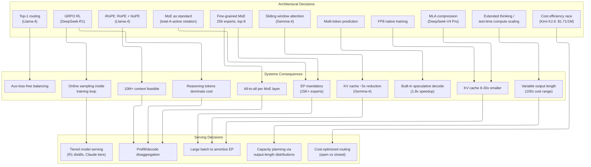

# Frontier Models 2025-2026 -- Architectural Survey

> **Layer:** L6.
> **Prerequisites:** [Transformer_Internals](Transformer_Internals.md), [Attention_Mechanisms](Attention_Mechanisms.md), [Modern_MoE](Modern_MoE.md), [Modern_Quantization_Frontier](Modern_Quantization_Frontier.md).
> **Hands off to:** [Reasoning_Models](../L7_Training_Stack/Reasoning_Models.md), [Production_Architecture](../L8_Inference_and_Serving/Production_Architecture.md).

---

## 0. Why this page exists

By mid-2026, every large-scale inference cluster runs one of roughly twelve model families. The architectural convergence is real -- MLA, MoE, FP8, and long-context attention appear in nearly every frontier release -- but the specific parameter counts, routing strategies, positional encodings, and KV-cache geometries differ enough that serving infrastructure must adapt per model. This page is a single-pass architectural survey of the models that matter for systems work. It is not a benchmark comparison; it is a specification sheet with consequences.

The models covered:

| Model | Open? | Intelligence Index | Primary innovation |
|---|---|---|---|
| DeepSeek-V4 Pro | Yes | 52 | MLA + fine-grained MoE + FP8 + MTP |
| DeepSeek-R1 | Yes | -- | Reasoning via long-CoT RL (GRPO) |
| Llama-4 (Scout / Maverick / Muse Spark) | Yes | 52 (Muse Spark) | Native MoE + iRoPE + early-fusion multimodal |
| Qwen-3/3.5/3.6 | Yes | 52 (3.6 Max Preview) | MoE + dense variants, thinking-mode toggle |
| Gemma-4 | Yes | -- | Four sizes, all multimodal, MoE variants |
| GPT-5 / GPT-5.5 | No | 60 (GPT-5.5) | Test-time compute scaling, reasoning search |
| Claude Opus 4.7 | No | 57 | Extended thinking, architectural innovations |
| Gemini-3 / 3.1 Pro | No | 57 (3.1 Pro Preview) | MoE + native multimodal + 1M+ context |
| Mistral (Medium 3.5 / Small 4 / Magistral) | Partial | 39 (Medium 3.5) | Reasoning-focused Magistral line |
| Kimi K2.6 (Moonshot AI) | Yes | 54 | Highest-ranked open-weights model, MoE |

For each: parameter count, architecture highlights, training approach, key innovations, KV cache implications, and serving considerations.

**MoE is now standard.** By mid-2026, Mixture-of-Experts is the default architecture across nearly all model families -- both open and closed. The "total-A-active" notation (e.g., 397B A17B, meaning 397B total parameters with 17B active per token) has become the industry standard for describing MoE models. Dense models remain important at smaller scales (Qwen3.6 27B, Gemma-4 E4B/E2B) but the frontier is overwhelmingly MoE. This has permanent systems implications: expert parallelism, all-to-all communication, and load balancing are now first-class concerns for every inference deployment.

---

## 1. DeepSeek-V4 Pro (671B total / 37B active)

The latest flagship in the DeepSeek lineage and the single most influential open architectural family of 2024-2026. V4 Pro carries forward the V3 architecture (MLA, fine-grained MoE, FP8, MTP) with iterative improvements to training data quality, expert routing, and reasoning capability. Intelligence Index score: **52**. MIT-licensed. In May 2026 DeepSeek made its 75% promotional discount the **permanent standard rate: $0.435/M input, $0.87/M output** — by far the cheapest frontier-class API. DeepSeek officially endorsed **SGLang** as its reference serving stack (native MTP integration: 1.8× decode speedup at batch 1 on H200).

The V3 generation was trained on 14.8T tokens for approximately $5.5M in compute, demonstrating that frontier quality is achievable at a fraction of the conventional cost through aggressive co-design of architecture, MoE routing, quantization, and training infrastructure. V4 Pro builds on this foundation with refined training recipes and scaled infrastructure.

### 1.1 Architecture specification

| Parameter | Value |
|---|---|
| Total parameters | 671B |
| Active parameters per token | 37B |
| Layers | 61 |
| Hidden dimension | 7168 |
| Attention heads | 128 |
| KV heads (MLA latent) | 1 (compressed to $d_c = 512$) |
| MoE experts (routed) | 256 per layer |
| MoE experts (shared) | 1 per layer |
| Top-k routing | 8 |
| Context length | 128K |
| Positional encoding | RoPE (decoupled, $d_R = 64$) |
| Attention variant | MLA (Multi-head Latent Attention) |
| Training precision | FP8 native (E4M3 forward/backward) |
| Training tokens | 14.8T |

### 1.2 MLA (Multi-head Latent Attention)

MLA replaces the standard per-head K and V projections with a single low-rank latent compression. For each layer, instead of storing full K and V matrices per head:

$$c_{KV} = W_{DKV} \cdot x \quad \text{(latent, } d_c = 512\text{)}$$
$$k_R = \text{RoPE}(W_{KR} \cdot x) \quad \text{(decoupled rotary, } d_R = 64\text{)}$$

At attention time, full K and V are reconstructed:

$$K_h = [W_{UK}^h \cdot c_{KV} \;\| \; k_R], \quad V_h = W_{UV}^h \cdot c_{KV}$$

**KV cache per token per layer:** $(d_c + d_R) \times 2 \text{ bytes} = (512 + 64) \times 2 = 1152$ bytes in FP16.

**Across 61 layers:** $1152 \times 61 = 70.3$ KB per token. Compare to dense MHA at the same head count: $\sim$600 KB per token. MLA achieves a **$\sim$8.5x compression** vs MHA and **$\sim$3x** vs GQA at equivalent $H_{KV}$. Note: the ~8.5x figure compares *total* KV per token (including the decoupled RoPE projection) against MHA total KV. The per-layer compression of the latent vector alone (512-d latent vs $2 \times 128 \times d_h$ full KV) is much higher (~64x), but the RoPE overhead reduces the effective end-to-end ratio.

The cost is extra projection bandwidth at attention time ($W_{UK}$, $W_{UV}$ are small matmuls), but these are negligible compared to the HBM bandwidth saved during decode when the KV cache is read every step.

### 1.3 Fine-grained MoE with shared expert

Each MoE layer contains:

- **1 shared expert** -- always active, absorbs general-purpose computation.
- **256 routed experts** -- each sized to $\frac{1}{k}$ of a standard dense FFN.
- **Top-8 routing** with sigmoid gating (not softmax).

$$\text{output} = \text{FFN}_{\text{shared}}(x) + \sum_{i \in \text{top-8}} g_i \cdot \text{Expert}_i(x)$$

The shared expert captures universal features (grammar, common patterns); the routed experts specialize. Fine granularity (256 small experts vs 8 large ones) yields $C(256, 8) \approx 4 \times 10^{14}$ possible expert combinations per token, vs $C(8, 2) = 28$ for Mixtral.

**Auxiliary-loss-free load balancing.** Instead of adding a load-balancing penalty to the training loss (which distorts the main-task gradient), DeepSeek-V3 maintains a per-expert bias $b_e$ updated via EMA:

$$b_e \leftarrow b_e - \gamma \cdot (f_e - 1/N)$$

where $f_e$ is the fraction of tokens routed to expert $e$. Overloaded experts get lower bias; underloaded experts get higher bias. The main task loss is never affected.

### 1.4 Multi-Token Prediction (MTP)

One auxiliary prediction head predicts token $t+2$ during training. At inference, the MTP head provides speculative draft tokens verified by the main model's next forward pass -- built-in speculative decoding with no separate draft model.

Reported acceptance rate: $\sim$85%. Effective decode speedup: $\sim$1.8x.

### 1.5 FP8 native training

All forward and backward matmuls use E4M3 FP8. Key details:

- Per-tile scaling factors (not per-tensor) for fine-grained range control.
- FP32 master weights and optimizer state.
- Custom scaling pipeline: weight gradient and activation gradient each have independent scale factors.
- Demonstrated $\sim$20-40% wall-clock savings at scale with negligible quality loss.

### 1.6 Serving implications

| Factor | Consequence |
|---|---|
| MLA (70 KB/token KV) | 1M-token contexts fit in a single 8xH100 node KV pool |
| 256 experts x 61 layers = 15K+ experts | Expert parallelism (EP) is mandatory; all-to-all per MoE layer |
| Top-8 routing | All-to-all sends 8 destination tokens per source token |
| MTP head | Continuous batching must handle speculative verify/rollback |
| FP8 native | Default serving precision is FP8; no post-training quantization needed |
| 37B active / 671B total | Compute cost of a 37B model; memory cost of a 671B model |

---

## 2. DeepSeek-R1 (Reasoning via Long-CoT RL)

R1 is not a new architecture -- it is DeepSeek-V3 pushed through a multi-stage reinforcement learning pipeline that produces models capable of extended chain-of-thought reasoning.

### 2.1 Training pipeline

The pipeline has three stages:

1. **R1-Zero.** Pure RL on the V3 base model using GRPO with rule-based rewards (math correctness, code test passing). No supervised fine-tuning. Demonstrates that reasoning can emerge from RL alone, but outputs are often unreadable (mixed languages, formatting issues).

2. **Cold-start SFT.** A small curated set of high-quality CoT examples provides a readable seed policy. This resolves the readability issues from R1-Zero.

3. **RL + distillation.** GRPO RL on the cold-started model. The resulting R1 model is then used as a teacher to distill smaller dense models (1.5B through 70B) by training them on R1's generated CoT outputs.

### 2.2 GRPO (Group Relative Policy Optimization)

GRPO eliminates the critic model required by PPO. Instead of estimating $V(s)$ with a separate network:

- Sample a group of $G$ completions $\{y_1, \ldots, y_G\}$ for prompt $q$.
- Score each with a reward function to get $\{r_1, \ldots, r_G\}$.
- Compute relative advantages via group normalization:

$$\hat{A}_i = \frac{r_i - \mu(\mathbf{r})}{\sigma(\mathbf{r})}$$

The GRPO loss:

$$\mathcal{L}_{GRPO}(\theta) = \mathbb{E}_{q, \{y_i\}} \left[ \frac{1}{G} \sum_{i=1}^{G} \min\left( \rho_i \hat{A}_i, \; \text{clip}(\rho_i, 1-\epsilon, 1+\epsilon) \hat{A}_i \right) - \beta \, D_{KL}(\pi_\theta \| \pi_{ref}) \right]$$

where $\rho_i = \pi_\theta(y_i|q) / \pi_{old}(y_i|q)$.

**Memory savings:** 2 model copies (policy + reference) instead of 4 (policy, reference, reward, critic). Critical for RL on 671B parameters.

### 2.3 Serving implications

| Factor | Consequence |
|---|---|
| Output length 5K-100K tokens | KV cache pressure 10-100x vs chat |
| Reasoning tokens billed separately | Inference cost proportional to reasoning length |
| Distilled variants (1.5B-70B) | Tiered serving: small models for easy tasks, R1 for hard |
| GRPO requires online sampling | Inference engine inside training loop (vLLM/SGLang) |
| Long generations dominate TPOT | Users wait minutes; spec-decode and disaggregation critical |

---

## 3. Llama-4 (Scout / Maverick / Muse Spark)

Released April 2025 as Meta's first native MoE model family, marking a complete departure from the dense Llama-3 architecture. The family has since expanded to include Muse Spark, the highest-capability variant.

### 3.1 Model specification

| Variant | Total params | Active params | Routed experts | Top-k | Context | Multimodal | Intelligence Index |
|---|---|---|---|---|---|---|---|
| Scout | 109B | 17B | 16 | 1 | **10M** | Yes (early-fusion) | -- |
| Maverick | 400B | 17B | 128 | 1 | 1M | Yes (early-fusion) | -- |
| Muse Spark | -- | -- | -- | -- | -- | Yes | **52** |

**Llama-4 Scout** holds the record for the **largest publicly available context window at 10M tokens**. Maverick provides a 1M token context window with a larger expert pool. **Muse Spark** is the higher-capability model in the family, achieving an Intelligence Index of 52 and matching DeepSeek-V4 Pro and Qwen3.6 Max Preview at the top of the open-weights leaderboard.

### 3.2 Architectural highlights

**Top-1 routing.** Each token routes to exactly one expert. Simpler and lower communication cost than top-k > 1, but less compute per token. The 17B active parameter count (Scout/Maverick) reflects the single-expert path.

**iRoPE (interleaved RoPE + NoPE).** Every fourth attention layer uses **no positional encoding** (NoPE) -- the remaining layers use RoPE with an extended base frequency. Empirically improves long-context generalization, particularly beyond the training context window. Zero additional inference cost; purely a per-layer configuration in the inference engine.

**Chunked attention for long context.** In layers supporting 10M context, window-based local attention is combined with periodic global attention layers. This reduces the attention cost from $O(N^2)$ to roughly $O(N \cdot W + N \cdot G)$ where $W$ is the local window size and $G$ is the number of global layers.

**Early-fusion multimodal.** Image and video tokens are embedded and flow through the same transformer backbone as text tokens. No separate vision encoder that cross-attends; the model processes all modalities in a unified sequence. This simplifies the serving stack (one model, one KV cache) but increases sequence length significantly when images are present.

### 3.3 Serving implications

| Factor | Consequence |
|---|---|
| Top-1 routing | Minimal all-to-all (1 destination per token), but high load imbalance risk |
| 10M context (Scout) | Even with KV compression, per-conversation memory is enormous |
| iRoPE | Zero serving cost -- architectural detail respected via per-layer config |
| Early-fusion multimodal | Image tokens increase KV cache proportionally; batch management harder |
| 17B active params | Compute cost comparable to a 17B dense model |
| 109B-400B total params | All experts must reside in HBM somewhere in the EP group |

---

## 4. Qwen-3 / 3.5 / 3.6 / 3.7 (MoE + Dense Variants)

The Qwen family (developed by Alibaba) has expanded rapidly through 2025-2026, progressing from Qwen-3 through Qwen-3.5/3.6 to **Qwen 3.7 Max (announced May 20, 2026 at Alibaba Cloud Summit)**, which posted benchmark wins against closed frontier models and displaced Qwen3.6 Max Preview at the top of the open-weights leaderboard. The family introduces a "thinking mode" toggle: the same weights produce either direct responses or extended chain-of-thought reasoning depending on a system prompt directive. MoE is now standard across the larger variants, with the "total-A-active" notation (e.g., 397B A17B) becoming the industry norm for describing MoE models.

### 4.1 Model variants

| Variant | Total params | Active params | Architecture | Context | Intelligence Index |
|---|---|---|---|---|---|
| Qwen3.6 Max Preview | -- | -- | MoE | -- | **52** |
| Qwen3.6 Plus | -- | -- | MoE | -- | 50 |
| Qwen3.6 27B | 27B | 27B | Dense | -- | 46 |
| Qwen3.6 35B A3B | 35B | 3B | MoE | -- | -- |
| Qwen3.5 397B A17B | 397B | 17B | MoE (128 experts, top-8) | 128K | -- |
| Qwen-3-235B-A22B | 235B | 22B | MoE (128 experts, top-8) | 128K | -- |
| Qwen-3-32B | 32B | 32B | Dense | 128K | -- |
| Qwen-3-30B-A3B | 30B | 3B | MoE | 128K | -- |
| Qwen3.6 14B / 7B / 4B / 1.5B / 0.6B | -- | -- | Dense | -- | -- |

**Qwen3.6 Max Preview** ties with DeepSeek-V4 Pro and Llama-4 Muse Spark at Intelligence Index 52, making it one of the top open-weights models globally. **Qwen3.5 397B A17B** uses the standard MoE notation: 397B total parameters with 17B active per token. The family spans a wide range of sizes down to 0.6B for edge deployment.

### 4.2 Key innovations

**Thinking-mode toggle.** The model exposes a system prompt switch (`/think` vs `/no_think`) that changes generation behavior. In thinking mode, the model generates long reasoning chains before producing the final answer. In non-thinking mode, it responds directly. Same weights, different inference paths. Capacity planning must account for the bimodal output-length distribution: 200-500 tokens in non-thinking mode, 5K-50K tokens in thinking mode.

**Agentic tool use at the token level.** Tool calls are integrated into the token stream rather than handled by a separate routing layer. The model emits special tokens to invoke tools, receives tool output as part of the context, and continues generation.

**Strong multilingual and code performance.** Competitive with DeepSeek-V3 on code benchmarks and with GPT-4 class models on multilingual tasks.

### 4.3 Serving implications

| Factor | Consequence |
|---|---|
| MoE 128 experts, top-8 | EP required; all-to-all cost similar to DeepSeek-V3 |
| Thinking-mode toggle | Bimodal output length distribution complicates capacity planning |
| 22B active params | Decode compute like a 22B dense model |
| 128K context | Standard KV cache sizing applies (no MLA) |
| Token-level tool use | Inference engine must parse special tokens mid-generation |

---

## 5. Gemma-4 (All-Multimodal, MoE Variants)

Google's Gemma-4 family (2026) represents a major evolution from Gemma-3. All four variants are natively multimodal (Image-Text-to-Text) and the family includes both dense and MoE architectures. Gemma-4 reached #1 trending on HuggingFace upon release.

### 5.1 Architecture specification

| Variant | Total params | Active params | Architecture | Modality |
|---|---|---|---|---|
| Gemma-4 31B | 31B | 31B | Dense (flagship) | Image-Text-to-Text |
| Gemma-4 26B-A4B | 26B | 4B | MoE | Image-Text-to-Text |
| Gemma-4 E4B | 8B | 8B | Dense (efficient) | Image-Text-to-Text |
| Gemma-4 E2B | 5B | 5B | Dense (efficient) | Image-Text-to-Text |

**Gemma-4 31B** is the dense flagship, providing the highest quality in the family. **Gemma-4 26B-A4B** uses MoE to achieve strong performance with only 4B active parameters per token, following the now-standard "total-A-active" notation. The **E4B** (8B efficient) and **E2B** (5B efficient) variants are optimized for on-device and edge deployment.

Gemma-3 (Feb 2025) introduced the 5:1 local-global sliding window attention pattern described below, and elements of this design persist in Gemma-4's architecture.

### 5.2 Local-global attention pattern

Gemma-3 alternates attention layers in a **5:1 ratio**:

- **5 layers** use **sliding-window attention** (window $W = 4096$): each query attends only to the last $W$ tokens. Cost is $O(N \cdot W)$. KV cache stores only $W$ entries per layer.
- **1 layer** uses **global attention**: each query attends to all prior positions. Full KV cache.
- Repeat through the full depth.

**KV cache savings.** For Gemma-3-27B at 128K context:

- Naive: 62 layers $\times$ 128K tokens $\times$ KV per token = full allocation.
- 5:1 sliding: per group of 6 layers, 5 layers store $\min(N, 4096)$ entries, 1 layer stores $N$ entries. At $N = 128K$: ratio = $(5 \times 4096 + 1 \times 128K) / (6 \times 128K) \approx 0.20$. Approximately **5x KV cache reduction**.

The pattern is purely a per-layer configuration. Inference engines implement it by simply capping the KV cache size for sliding-window layers and evicting entries beyond the window.

### 5.3 Serving implications

| Factor | Consequence |
|---|---|
| Dense 31B flagship | Simple TP/PP; no EP or all-to-all |
| MoE 26B-A4B variant | EP required for expert parallelism; all-to-all per MoE layer |
| All variants multimodal | Image tokens increase KV cache and sequence length |
| Efficient variants (E4B, E2B) | Single-GPU and on-device serving feasible |
| Sliding window (from Gemma-3 heritage) | KV cache ~5x smaller than naive at long context |

---

## 6. GPT-5 / GPT-5.5 (OpenAI)

Closed-source. Architectural details are inferred from behavior, pricing asymmetries, and limited public statements. The GPT-5 family represents OpenAI's reasoning-first design philosophy: invest large amounts of test-time compute in chain-of-thought search before producing a user-visible answer. Both GPT-5 and GPT-5.5 are reasoning models with extended thinking.

### 6.1 What is known

**GPT-5.5.** The current flagship. Intelligence Index score: **60** -- the highest recorded score on the benchmark. Priced at approximately **$11.25/1M tokens** (blended). Supports 922K context window. A reasoning model with extended thinking capabilities, representing the state of the art in closed-source model intelligence.

**GPT-5.** The major release preceding GPT-5.5. A reasoning model with extended thinking, multimodal input (images, audio), and large context windows. Likely MoE-based, as per-token pricing asymmetries (input cheaper than output, output cheaper than reasoning) are consistent with MoE where active parameter counts differ between prompt processing and generation.

**o3 / o4-mini.** Earlier reasoning models that consume variable amounts of "thinking tokens" before emitting visible output. Behavioral analysis suggests:

- A base LLM generates candidate reasoning steps.
- A search procedure (likely tree-search or best-of-N sampling with verification) explores multiple reasoning paths.
- The model selects and refines the best path before generating the final answer.
- Output length varies from 1K to 100K+ reasoning tokens depending on problem difficulty.

### 6.2 Test-time compute scaling

The key innovation is **variable compute at inference**:

| Model | Thinking tokens | Latency | Cost multiplier vs direct |
|---|---|---|---|
| GPT-5.5 (direct) | 0 | 1-3s | 1x |
| GPT-5.5 (extended thinking) | 5K-200K | 5s-5min | 3-200x |
| GPT-5 (direct) | 0 | 1-3s | 1x |
| o4-mini (easy) | 1K-5K | 5-30s | 3-10x |
| o3 (hard problem) | 50K-200K | 30s-5min | 50-200x |

This has profound systems implications: the same model can consume 100x more compute per request depending on problem difficulty. Capacity planning must reason about a distribution over thinking-token counts, not a fixed output length.

### 6.3 Serving implications

| Factor | Consequence |
|---|---|
| Variable thinking length | Capacity planning uses a distribution, not a fixed number |
| GPT-5.5 at $11.25/1M tokens | Highest per-token cost among frontier models |
| GPT-5.5 Intelligence Index 60 | Sets the ceiling for model intelligence benchmarks |
| 922K context (GPT-5.5) | Near-1M context requires aggressive KV management |
| MoE (inferred) | EP required for internal serving |
| Multimodal input | Vision/audio tokens increase prompt length |
| Reasoning search | Likely requires multiple parallel generations per request |
| Pricing asymmetries | Output-heavy workloads dominate cost |

---

## 7. Claude Opus 4.7 (Anthropic)

Anthropic's latest frontier model (2026). Claude Opus 4.7 is a reasoning model with extended thinking, representing the most capable model in the Claude lineage. Intelligence Index score: **57**. Priced at approximately **$10.94/1M tokens** (blended). Supports a 1M context window.

### 7.1 What is known

**Claude Opus 4.7.** The current flagship. Extended thinking with controllable reasoning budgets. Best on complex reasoning, math, code, and agentic tasks. Intelligence Index 57 places it second among closed-source models (behind GPT-5.5 at 60) and ahead of Gemini 3.1 Pro Preview (57 at lower cost).

The broader Claude family includes tiered models:

- **Opus tier.** Largest, most capable. Extended thinking with large budgets. Best on complex reasoning, math, and code.
- **Sonnet tier.** Mid-tier. Balanced performance and cost. Extended thinking with moderate budgets.
- **Haiku tier.** Smallest, fastest. Minimal or no extended thinking. Optimized for throughput.

Architectural details are not publicly disclosed. Observable characteristics suggest:

- Likely MoE for Opus and Sonnet (per-token cost asymmetries consistent with MoE).
- Extended thinking implemented as a long chain-of-thought phase before the visible response, similar to o3's approach but with an explicit budget parameter.
- Multimodal input (images, documents) integrated natively.
- Tool use (computer use, code execution) supported natively.

### 7.2 Serving implications

| Factor | Consequence |
|---|---|
| Extended thinking budget | Thinking tokens are generated but not visible; still consume KV and compute |
| 1M context window | KV cache is the dominant cost at full utilization |
| ~$10.94/1M tokens | Comparable pricing to GPT-5.5; both premium tier |
| Tiered model sizes | Routing layer can direct requests to appropriate tier |
| MoE (inferred) | EP for internal serving |
| Tool / computer use | Multi-turn agent loops; KV cache persists across tool invocations |

---

## 8. Gemini-3 / 3.1 (Google DeepMind)

Google's Gemini-3/3.1 family (2025-2026) represents the latest generation of Google's native multimodal architecture: a single model processes text, images, audio, and video in a unified context window.

### 8.1 What is known

- **Gemini 3.5 Flash (GA at I/O, May 2026).** Frontier-level intelligence at ~4× the speed of comparable models. $1.50/$9 per 1M tokens, 1M context, 76.2% Terminal-Bench 2.1 — beats Gemini 3.1 Pro on coding and agentic benchmarks despite being the Flash tier.
- **Gemini 3.1 Pro Preview.** Intelligence Index score: **57**. Priced at **$4.50/1M tokens**. Supports 1M context window. Strong price-performance — matching Claude Opus 4.7's intelligence score at less than half the cost. Native multimodal input and output (text, images, audio, video).
- **Gemini-3 Pro / Flash.** The preceding generation in the same family. Strong on long-context benchmarks, multimodal reasoning, and code. Flash variant optimized for throughput.
- Both generations likely use MoE (pricing asymmetries and throughput characteristics consistent with MoE).
- Google's infrastructure advantages (TPU v5p/v6 pods, massive interconnect) enable serving at context lengths (1M+) that are impractical on most GPU clusters.
- "Thinking budget" feature similar to Claude's extended thinking.

### 8.2 Serving implications

| Factor | Consequence |
|---|---|
| 1M context | KV cache is the dominant cost; compression essential |
| $4.50/1M tokens (3.1 Pro Preview) | Best price-performance among frontier models |
| Native multimodal | Image/audio/video tokens increase sequence length |
| MoE (inferred) | EP across TPU pods |
| Thinking budget | Variable thinking-token output length |
| TPU-native | Google serves internally on TPU; external API only |

---

## 9. Mistral (Medium 3.5 / Small 4 / Magistral)

Mistral AI's mid-2026 lineup spans general-purpose and reasoning-focused models. While not competing at the very top of the Intelligence Index, Mistral models are widely deployed in European enterprise and regulated environments.

### 9.1 Model variants

| Variant | Type | Intelligence Index | Notes |
|---|---|---|---|
| Mistral Medium 3.5 | General-purpose | 39 | Mid-tier general model |
| Mistral Small 4 | General-purpose | 28 | Small, fast, cost-effective |
| Magistral Medium 1.2 | Reasoning-focused | 27 | Extended chain-of-thought reasoning |

### 9.2 Serving implications

| Factor | Consequence |
|---|---|
| Smaller model sizes | Single-GPU or small-cluster serving feasible |
| Reasoning variant (Magistral) | Variable output length as with other reasoning models |
| European deployment focus | Data residency and sovereignty considerations |
| Competitive pricing | Budget-friendly alternative to frontier models |

---

## 10. Kimi K2.6 (Moonshot AI)

Kimi K2.6, from Moonshot AI (China), is the **highest-ranked open-weights model** on the Intelligence Index with a score of **54**, surpassing DeepSeek-V4 Pro, Qwen3.6 Max Preview, and Llama-4 Muse Spark (all at 52). Priced at approximately **$1.71/1M tokens** (blended), it offers remarkable cost efficiency -- approximately **6-7x cheaper than GPT-5.5** at roughly **90% of its intelligence score** (54 vs 60).

### 10.1 Key characteristics

- **Intelligence Index: 54** -- highest among open-weights models.
- **~$1.71/1M tokens** -- most cost-effective high-intelligence model available.
- **6-7x cheaper than GPT-5.5** at ~90% of its intelligence score.
- From Moonshot AI, one of China's leading AI labs.
- The K2 family has seen rapid iteration: K2, K2.5, and K2.6 represent successive capability improvements.

### 10.2 Serving implications

| Factor | Consequence |
|---|---|
| Highest open-weights intelligence | Default choice for cost-sensitive high-quality deployments |
| ~$1.71/1M tokens | Disruptive pricing vs closed-source models of similar quality |
| Rapid iteration cycle | Infrastructure must accommodate frequent model swaps |
| Open weights | Self-hosting feasible; no API dependency |

---

## 11. Cross-Model Comparison

### 11.1 Intelligence Index and Pricing

| Model | Open? | Intelligence Index | Price (/1M tokens) | Context | Notes |
|---|---|---|---|---|---|
| GPT-5.5 | No | **60** | ~$11.25 | 922K | Highest recorded intelligence |
| Claude Opus 4.7 | No | **57** | ~$10.94 | 1M | Second-highest closed-source |
| Gemini 3.1 Pro Preview | No | **57** | ~$4.50 | 1M | Best price-performance among frontier |
| Kimi K2.6 | Yes | **54** | ~$1.71 | -- | Highest open-weights; 6-7x cheaper than GPT-5.5 |
| DeepSeek-V4 Pro | Yes | **52** | ~$2.17 | 128K | Cost-effective frontier quality |
| Qwen3.6 Max Preview | Yes | **52** | -- | -- | Tied top open-weights |
| Llama-4 Muse Spark | Yes | **52** | -- | -- | Tied top open-weights |
| Qwen3.6 Plus | Yes | 50 | -- | -- | Strong mid-tier open |
| Qwen3.6 27B | Yes | 46 | -- | -- | Dense, efficient |
| Mistral Medium 3.5 | Partial | 39 | -- | -- | Enterprise / European focus |
| Mistral Small 4 | Partial | 28 | -- | -- | Budget-friendly |
| Magistral Medium 1.2 | Partial | 27 | -- | -- | Reasoning-focused |

### 11.2 Architecture Comparison

| Model | Total params | Active params | MoE? | Context | Attention type | Positional encoding | KV cache per token (approx.) |
|---|---|---|---|---|---|---|---|
| DeepSeek-V4 Pro | 671B | 37B | 256+1, top-8 | 128K | MLA | RoPE (decoupled) | ~70 KB (61 layers) |
| DeepSeek-R1 | 671B | 37B | 256+1, top-8 | 128K | MLA | RoPE (decoupled) | ~70 KB (61 layers) |
| Llama-4 Scout | 109B | 17B | 16, top-1 | **10M** | GQA + chunked | iRoPE | ~200 KB (est.) |
| Llama-4 Maverick | 400B | 17B | 128, top-1 | 1M | GQA + chunked | iRoPE | ~200 KB (est.) |
| Llama-4 Muse Spark | -- | -- | -- | -- | -- | -- | -- |
| Qwen3.5 397B | 397B | 17B | 128, top-8 | 128K | GQA | RoPE | ~250 KB (est.) |
| Qwen3.6 35B A3B | 35B | 3B | MoE | -- | GQA | RoPE | -- |
| Qwen-3-235B | 235B | 22B | 128, top-8 | 128K | GQA | RoPE | ~250 KB (est.) |
| Gemma-4 31B | 31B | 31B | No (dense) | -- | Sliding window | RoPE | -- |
| Gemma-4 26B-A4B | 26B | 4B | MoE | -- | -- | -- | -- |
| GPT-5.5 | Undisclosed | Undisclosed | Likely MoE | 922K | GQA (inferred) | RoPE (inferred) | Undisclosed |
| GPT-5 | Undisclosed | Undisclosed | Likely MoE | ~256K (est.) | GQA (inferred) | RoPE (inferred) | Undisclosed |
| Claude Opus 4.7 | Undisclosed | Undisclosed | Likely MoE | 1M | Undisclosed | Undisclosed | Undisclosed |
| Gemini 3.1 Pro Preview | Undisclosed | Undisclosed | Likely MoE | 1M | Undisclosed | Undisclosed | Undisclosed |
| Mistral Medium 3.5 | -- | -- | -- | -- | -- | -- | -- |
| Kimi K2.6 | -- | -- | MoE (inferred) | -- | -- | -- | -- |

Notes: KV cache estimates assume FP16 and include all layers. Closed-model entries are based on public signals and may not be accurate. The "total-A-active" notation (e.g., 397B A17B) has become the industry standard for describing MoE models and is used throughout this page.

---

## 12. End-to-End Cause and Effect

---

## 13. Numbers to memorize

| Quantity | Value | Context |
|---|---|---|
| DeepSeek-V4 Pro total params | 671B | 256 routed + 1 shared expert per MoE layer |
| DeepSeek-V4 Pro active params | 37B | Top-8 of 256 experts + shared expert |
| DeepSeek-V4 Pro Intelligence Index | 52 | Tied with Qwen3.6 Max Preview and Llama-4 Muse Spark |
| DeepSeek-V4 Pro price | ~$2.17/1M tokens | Blended; competitive with top open-weights |
| MLA KV cache (DeepSeek-V4 Pro) | 70 KB/token | 61 layers $\times$ (512+64) latent $\times$ 2 bytes |
| Dense MHA KV (equivalent) | ~600 KB/token | Same head count, no compression |
| MLA compression ratio vs MHA | ~8.5x | 70 KB vs 600 KB per token (total KV including RoPE; per-layer latent-only ratio is ~64x) |
| DeepSeek-V3 training cost | ~$5.5M | 14.8T tokens on H800 cluster |
| DeepSeek-V3 training tokens | 14.8T | FP8 native |
| MTP acceptance rate (DeepSeek) | ~85% | Speculative decode with MTP head |
| MTP decode speedup | ~1.8x | Built-in speculative decoding |
| DeepSeek MoE all-to-all per layer | 15K+ experts | 256 $\times$ 61 routed + 61 shared |
| Llama-4 Scout total params | 109B | 16 experts, top-1 |
| Llama-4 Scout context | **10M** | Largest publicly available; iRoPE + chunked attention |
| Llama-4 Maverick total params | 400B | 128 experts, top-1 |
| Llama-4 Muse Spark Intelligence Index | 52 | Top of Llama-4 family |
| Qwen3.5 397B A17B | 397B total / 17B active | MoE, 128 experts |
| Qwen3.6 35B A3B | 35B total / 3B active | MoE, smallest active footprint in Qwen family |
| Qwen3.6 Max Preview Intelligence Index | 52 | Tied top open-weights |
| Qwen3.6 Plus Intelligence Index | 50 | Strong mid-tier |
| Qwen3.6 27B Intelligence Index | 46 | Dense variant |
| Gemma-4 26B-A4B | 26B total / 4B active | MoE variant of Gemma-4 |
| GPT-5.5 Intelligence Index | **60** | Highest recorded |
| GPT-5.5 price | ~$11.25/1M tokens | Premium pricing |
| GPT-5.5 context | 922K | Near-1M context |
| Claude Opus 4.7 Intelligence Index | 57 | Second-highest closed-source |
| Claude Opus 4.7 price | ~$10.94/1M tokens | Premium pricing |
| Claude Opus 4.7 context | 1M | Full 1M context |
| Gemini 3.1 Pro Preview Intelligence Index | 57 | Matches Claude Opus 4.7 |
| Gemini 3.1 Pro Preview price | ~$4.50/1M tokens | **Best price-performance among frontier** |
| Kimi K2.6 Intelligence Index | **54** | **Highest open-weights** |
| Kimi K2.6 price | ~$1.71/1M tokens | **6-7x cheaper than GPT-5.5** at ~90% of intelligence |
| Mistral Medium 3.5 Intelligence Index | 39 | Enterprise focus |
| Reasoning model output range | 5K-100K tokens | 10-100x vs chat (100-300) |
| GRPO model copies in memory | 2 (policy + ref) | vs 4 for PPO (+ reward + critic) |
| FP8 training wall-clock savings | 20-40% | vs BF16 at frontier scale |
| Open MoE models at frontier | 5+ families | DeepSeek-V4 Pro, Llama-4, Qwen-3/3.5/3.6, Gemma-4, Kimi K2.6 |
| Dense frontier open models | 2+ families | Gemma-4 31B, Qwen3.6 27B |
| Typical EP degree for 256-expert MoE | 8-32 GPUs | All-to-all bandwidth bound |

---

## 14. Worked problems

**Problem 1.** *Estimate the KV cache memory required to serve DeepSeek-V4 Pro at batch size 64 and context length 32K.*

Per-token KV: 70.3 KB (Section 1.2). Per-sequence KV at 32K context: $70.3 \text{ KB} \times 32768 = 2.21$ GB. At batch 64: $2.21 \times 64 = 141.5$ GB. This fits comfortably in a single 8xH100 node (640 GB HBM total) with room for weights and activations. By comparison, an equivalent dense MHA model would require $600 \text{ KB} \times 32768 \times 64 = 1.21$ TB -- requiring multiple nodes for KV alone. MLA is the difference between single-node and multi-node serving at this batch/context product.

**Problem 2.** *Llama-4 Scout claims 10M context. How much KV cache does a single 10M-token sequence require if per-token KV is approximately 200 KB?*

$200 \text{ KB} \times 10^7 = 2 \times 10^{12}$ bytes = **2 TB** for a single sequence. This exceeds the HBM of an 8xH100 node (640 GB). Serving 10M context requires either: (a) offloading KV to host RAM or SSD with pipelined attention, (b) aggressive KV compression beyond what GQA provides, or (c) chunked sparse attention that only loads a subset of KV entries per layer. The 10M context claim is real but assumes systems-level KV management that goes far beyond naive GPU-resident serving.

**Problem 3.** *A reasoning model (o3-class) uses an average of 30K thinking tokens per request. If the base model has per-token KV of 100 KB and you serve at batch 16, how much KV memory is consumed?*

Average sequence length = thinking + output $\approx$ 30K + 500 = 30.5K tokens. Per-sequence KV: $100 \text{ KB} \times 30500 = 2.95$ GB. At batch 16: $2.95 \times 16 = 47.2$ GB. This is manageable. But the distribution matters: some requests use 200K thinking tokens, consuming $100 \text{ KB} \times 200000 = 19.1$ GB each. A single long-reasoning request at batch 16 can consume 19.1 GB, leaving only 47.2 - 19.1 = 28.1 GB for the other 15 sequences. The inference scheduler must either (a) isolate long-reasoning requests in a separate pool, or (b) evict completed sequences aggressively to make room for long ones. This is why disaggregated serving with separate prefill and decode pools is valuable for reasoning workloads.

**Problem 4.** *Compare the all-to-all communication cost for DeepSeek-V4 Pro (256 experts, top-8) vs Llama-4 Scout (16 experts, top-1) at EP=8.*

**DeepSeek-V4 Pro.** Each token is sent to 8 of 256 experts. With EP=8, each GPU holds $256/8 = 32$ experts. Per-token, 8 all-to-all sends (one per selected expert) with each send carrying the token's hidden state (~7168 $\times$ 2 bytes = 14 KB). Per layer: 8 messages $\times$ 14 KB = 112 KB sent, 112 KB received (assuming balanced routing). Across 61 layers: $\sim$6.7 MB per token per forward pass.

**Llama-4 Scout.** Each token is sent to 1 of 16 experts. With EP=8, each GPU holds 2 experts. Per token, 1 all-to-all send of 14 KB. Per MoE layer: 14 KB sent, 14 KB received. Total all-to-all volume is 8x lower than DeepSeek-V4 Pro per MoE layer.

The tradeoff: DeepSeek-V4 Pro's richer routing (top-8 of 256) produces better model quality but costs 8x more all-to-all bandwidth per MoE layer. For EP=8 on NVLink (1.8 TB/s on Blackwell), the all-to-all for a batch of 4096 tokens at 61 MoE layers takes $\sim$4096 $\times$ 112 KB $\times$ 61 / 1.8 TB/s $\approx$ 16 ms -- a non-trivial fraction of the step time.

**Problem 5.** *Gemma-3-27B (precursor to Gemma-4) uses 5:1 sliding window with W=4096. Calculate the KV cache reduction ratio at N=128K context vs full attention.*

Full attention: 62 layers $\times$ N tokens of KV cache.

Sliding window: In each group of 6 layers, 5 local layers store $\min(N, W) = 4096$ entries, 1 global layer stores $N$ entries.

Total KV entries = $\frac{62}{6} \times (5 \times 4096 + 1 \times N) \approx 10.33 \times (20480 + N)$.

At $N = 128K = 131072$:

- Sliding: $10.33 \times (20480 + 131072) = 10.33 \times 151552 = 1.57M$ entries.
- Full: $62 \times 131072 = 8.13M$ entries.
- Ratio: $1.57M / 8.13M = 0.193$.

**~5.2x reduction.** The local layers dominate the count, and their fixed window of 4096 makes the savings dramatic at long context.

---

## 15. References

- DeepSeek-AI, "DeepSeek-V3 Technical Report," December 2024.
- DeepSeek-AI, "DeepSeek-V4 Pro Technical Report," 2026.
- DeepSeek-AI, "DeepSeek-R1: Incentivizing Reasoning Capability in LLMs via Reinforcement Learning," January 2025.
- DeepSeek-AI, "DeepSeekMoE: Towards Ultimate Expert Specialization in Mixture-of-Experts Language Models," 2024.
- Meta AI, "Llama-4 Model Card and Release Notes," April 2025.
- Meta AI, "Llama-4 Muse Spark Release," 2026.
- Qwen Team, "Qwen-3 Technical Report," June 2025.
- Qwen Team, "Qwen-3.5 / 3.6 Technical Reports," 2025-2026.
- Google DeepMind, "Gemma-3 Technical Report," February 2025.
- Google DeepMind, "Gemma-4 Technical Report," 2026.
- OpenAI, "GPT-5 and GPT-5.5 System Cards," 2025-2026.
- Anthropic, "Claude Opus 4.7 Release Notes," 2026.
- Google DeepMind, "Gemini-3 / 3.1 Pro Technical Reports," 2025-2026.
- Mistral AI, "Mistral Medium 3.5 and Small 4 Release Notes," 2026.
- Mistral AI, "Magistral Medium 1.2 Release Notes," 2026.
- Moonshot AI, "Kimi K2 / K2.5 / K2.6 Technical Reports," 2025-2026.
- Shazeer et al., "Outrageously Large Neural Networks: The Sparsely-Gated Mixture-of-Experts Layer," ICLR 2017.
- DeepSeek-AI, "DeepSeekMath: Pushing the Limits of Mathematical Reasoning in Open Language Models," 2024 (origin of GRPO).
- AI21 Labs, "Jamba-1.5: Hybrid SSM-Transformer Architecture," 2025.
- Schulman et al., "Proximal Policy Optimization Algorithms," 2017.

---

**Up the stack:** [Reasoning_Models](../L7_Training_Stack/Reasoning_Models.md) for the full RL pipeline, [Production_Architecture](../L8_Inference_and_Serving/Production_Architecture.md) for serving these models at scale.
**Down the stack:** [Transformer_Internals](Transformer_Internals.md), [Attention_Mechanisms](Attention_Mechanisms.md), [Modern_MoE](Modern_MoE.md), [Modern_Quantization_Frontier](Modern_Quantization_Frontier.md).
