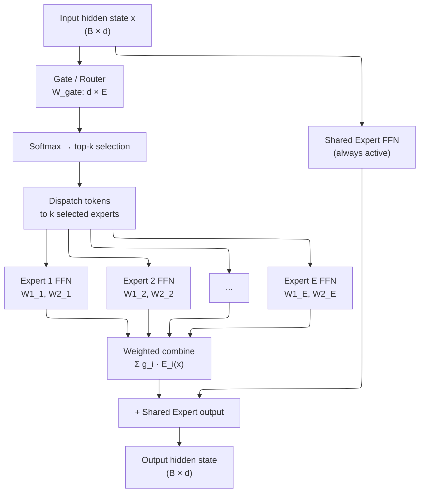
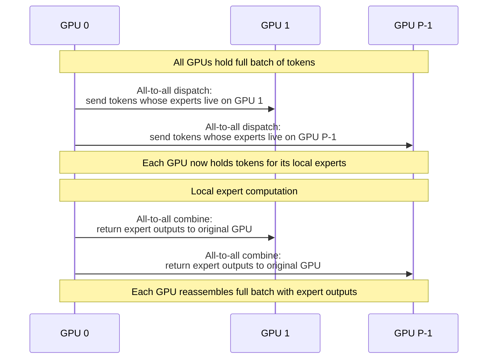
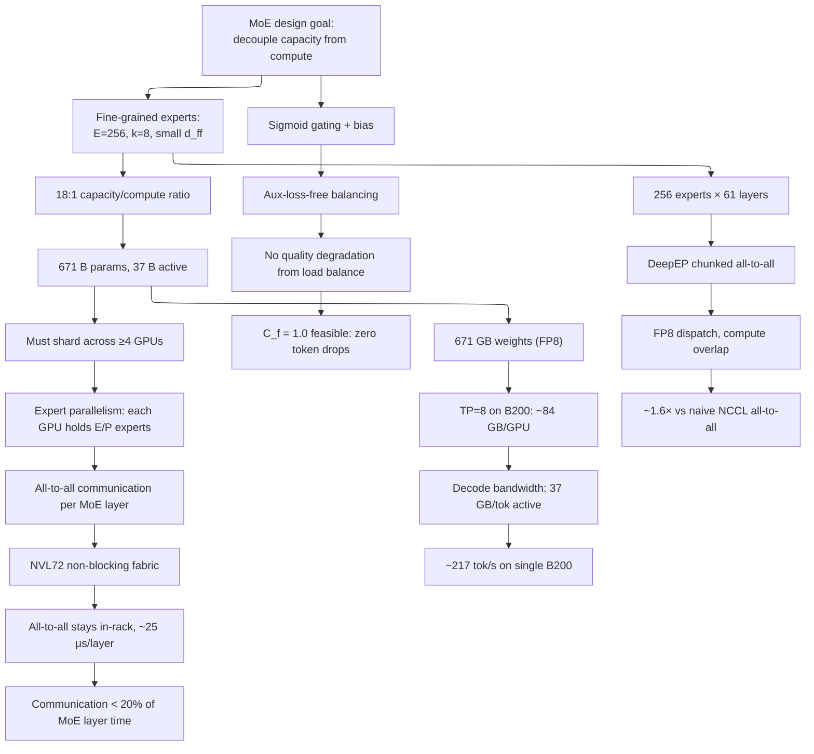

# Modern Mixture-of-Experts — Routing, Balancing, and Scaling

> **Layer:** L6.
> **Prerequisites:** [Transformer_Internals](Transformer_Internals.md), [Attention_Mechanisms](Attention_Mechanisms.md).
> **Hands off to:** [Distributed_Training](../L7_Training_Stack/Distributed_Training.md), [Cutting_Edge_Kernels](../L5_Kernels_and_Programming/Cutting_Edge_Kernels.md), [Frontier_Models_2025_2026](Frontier_Models_2025_2026.md).

---

## 0. Why MoE exists — the capacity--compute invariant

For a dense transformer of depth $L$, hidden dimension $d$, and vocabulary $V$, the FLOPs per token are:

$$
C_{\text{dense}} \;=\; 2 L \left( 12 d^2 + 2 d \right) \;+\; 2 d V
$$

The $12 d^2$ term is 4× for attention ($QK^T$, $\text{softmax} \cdot V$, output projection, plus the KV projections) and 2× for the FFN (up-projection and down-projection, with $d_{\text{ff}} = 4d$ accounting for the factor). As model quality scales with parameter count $N \propto L d^2$, so does $C_{\text{dense}}$ — linearly. A 1 T-parameter dense model requires ~1 T-parameter worth of multiply-add per token. There is no escape.

**The MoE invariant:** an MoE layer with $E$ experts and top-$k$ routing activates only $k$ experts per token, achieving parameter count $N_{\text{total}} \approx N_{\text{shared}} + E \cdot N_{\text{expert}}$ but compute cost:

$$
C_{\text{MoE}} \;\approx\; C_{\text{dense\,non-FFN}} \;+\; \frac{k}{E_{\text{routed}}} \cdot C_{\text{FFN,total}}
$$

This decouples model capacity from per-token compute. DeepSeek V3 has 671 B total parameters but activates only 37 B per token — an 18:1 capacity-to-compute ratio. Mixtral 8×22B activates 2 of 8 experts per token (4:1). This is the foundational economic fact behind every frontier MoE model.

Three invariants govern all MoE design:

1. **Routing sparsity invariant:** $\sum_{i} g_i(x) = k$ for routed gating $g$, where $k \ll E$. Tokens see only a fraction of parameters.
2. **Load balance invariant:** $\mathbb{E}_x[\text{tokens routed to expert } i] = N/k$ for uniform routing. Any deviation wastes expert capacity or drops tokens.
3. **Communication invariant:** Expert parallelism over $P$ experts requires an all-to-all of size $O(N \cdot d \cdot k/E)$ per MoE layer — this dominates training time at scale.

---

## 1. MoE architecture overview

### 1.1 Where MoE sits in the transformer

In a standard transformer block, each layer contains an attention sub-layer followed by an FFN sub-layer (two linear projections with a nonlinearity). An MoE transformer replaces **some or all FFN sub-layers** with an MoE layer:

$$
\text{FFN}(x) = W_2 \cdot \sigma(W_1 x + b_1) + b_2
$$

becomes:

$$
\text{MoE}(x) = \sum_{i \in \mathcal{T}(x)} g_i(x) \cdot E_i(x) + E_{\text{shared}}(x)
$$

where $\mathcal{T}(x)$ is the set of top-$k$ experts selected for token $x$, $g_i(x)$ is the gating weight for expert $i$, $E_i(x)$ is expert $i$'s FFN, and $E_{\text{shared}}$ is an optional always-active shared expert.

### 1.2 The MoE layer anatomy

The gate produces a probability distribution over $E$ experts, selects the top $k$, renormalizes, and dispatches each token to its $k$ chosen experts. The outputs are combined as a weighted sum and added to the shared expert output (if present).

### 1.3 Interleaving strategies

Not every layer needs to be MoE. Common patterns:

- **Every other layer** (Mixtral, Qwen-3 MoE): MoE at odd layers, dense FFN at even layers. Reduces all-to-all communication by half.
- **Every layer** (DeepSeek V3): all FFN layers are MoE with fine-grained experts. Maximizes sparsity ratio.
- **Last $N$ layers only** (some early MoE models): MoE near the output where representations are most specialized.

---

## 2. Gating functions — from softmax to top-$k$

### 2.1 The basic gate

The gating function maps a token representation $x \in \mathbb{R}^d$ to a distribution over $E$ experts:

$$
g(x) = \text{softmax}\!\big(W_g \, x\big)
$$

where $W_g \in \mathbb{R}^{E \times d}$ is a learned projection matrix (the "router weights"). The $i$-th component is:

$$
g_i(x) = \frac{e^{(W_g)_i \cdot x}}{\sum_{j=1}^{E} e^{(W_g)_j \cdot x}}
$$

This produces a full probability distribution, but we want sparse activation.

### 2.2 Top-$k$ routing with softmax

Select the $k$ experts with highest gate logits, then renormalize:

$$
g_i(x) = \begin{cases} \dfrac{e^{(W_g)_i \cdot x}}{\sum_{j \in \text{Top}_k} e^{(W_g)_j \cdot x}} & \text{if } i \in \text{Top}_k(x) \\[8pt] 0 & \text{otherwise} \end{cases}
$$

where $\text{Top}_k(x) = \underset{S \subseteq [E],\, |S|=k}{\arg\max} \sum_{i \in S} (W_g)_i \cdot x$.

**Derivation of the gradient signal:** The gate is differentiable with respect to $W_g$ only through the selected experts. For expert $i \in \text{Top}_k$:

$$
\frac{\partial g_i}{\partial (W_g)_j} = g_i \big(\delta_{ij} - g_j\big) \quad \text{for } j \in \text{Top}_k
$$

For $j \notin \text{Top}_k$: $\partial g_i / \partial (W_g)_j = 0$ (the top-$k$ selection is a hard mask; gradients do not flow to unselected experts through the gating path). This creates a **gradient starvation** problem — unselected experts receive no routing gradient and cannot improve their chances of being selected.

### 2.3 Sigmoid gating (DeepSeek V3)

DeepSeek V3 replaces softmax with sigmoid for top-$k$ selection:

$$
g_i(x) = \begin{cases} \sigma\!\big((W_g)_i \cdot x + b_i\big) & \text{if } i \in \text{Top}_k(x) \\ 0 & \text{otherwise} \end{cases}
$$

where $\sigma$ is the sigmoid function and $b_i \in \mathbb{R}$ is a per-expert bias term (used for auxiliary-loss-free balancing, Section 4).

The sigmoid formulation has a key advantage: each expert's gate value is independent of other experts' logits. With softmax, the normalization couples all experts — if expert 3's logit increases, every other expert's gate value decreases. With sigmoid, the gate values sum is not constrained to 1, which means:

- Expert affinity is an absolute signal, not relative.
- The bias $b_i$ adjusts selection probability without distorting other experts.
- Gradient flow to each expert is decoupled.

The output is not renormalized:

$$
\text{MoE}(x) = \sum_{i \in \text{Top}_k} \sigma\!\big((W_g)_i \cdot x + b_i\big) \cdot E_i(x) \;+\; E_{\text{shared}}(x)
$$

### 2.4 Noise injection for exploration

To prevent early collapse onto a small subset of experts, many implementations add Gaussian noise to the logits before top-$k$: $g_i^{\text{noisy}}(x) = (W_g)_i \cdot x + \epsilon$ where $\epsilon \sim \mathcal{N}(0, \sigma^2)$. Standard in Switch Transformer and Mixtral, omitted in DeepSeek V3 (bias-based balancing replaces it).

---

## 3. Load balance loss — the auxiliary loss derivation

### 3.1 The problem

Without explicit balancing, top-$k$ routing degenerates: a few experts receive most tokens (rich-get-richer via gradient flow), while others starve. At the extreme, all tokens route to the same $k$ experts and the remaining $E - k$ experts are dead parameters.

### 3.2 The auxiliary loss (Switch Transformer formulation)

Define for a batch of $N$ tokens:

$$
f_i = \frac{1}{N} \sum_{x \in \text{batch}} \mathbb{1}\!\big[i \in \text{Top}_k(x)\big]
$$

the fraction of tokens routed to expert $i$, and:

$$
p_i = \frac{1}{N} \sum_{x \in \text{batch}} \frac{e^{(W_g)_i \cdot x}}{\sum_{j} e^{(W_g)_j \cdot x}}
$$

the mean routing probability for expert $i$ (computed over all $E$ experts, not just top-$k$).

The auxiliary load balance loss is:

$$
\mathcal{L}_{\text{aux}} = \alpha \cdot N \cdot \sum_{i=1}^{E} f_i \cdot p_i
$$

**Derivation of why this works.** The term $\sum_i f_i \cdot p_i$ is minimized when $f_i = p_i = 1/E$ for all $i$ (uniform load). Proof: by Jensen's inequality, for any probability distribution $f$ and $p$ over $E$ categories:

$$
\sum_{i} f_i \cdot p_i \;\geq\; \left(\sum_i \frac{f_i + p_i}{2}\right)^2 = \frac{1}{E}
$$

Wait — that is not tight. The correct argument: the product $f_i \cdot p_i$ is minimized (subject to $\sum f_i = k$, $\sum p_i = 1$) when both are uniform. Intuitively, $f_i \cdot p_i$ penalizes any expert that has both high routing probability *and* high actual assignment. The minimum at $f_i = k/E$, $p_i = 1/E$ gives $\mathcal{L}_{\text{aux}} = \alpha \cdot N \cdot k/E$.

The coefficient $\alpha$ (typically $0.01$) controls the strength. Too high: model quality degrades (the loss dominates). Too low: imbalance persists. The $N$ factor normalizes across batch sizes.

### 3.3 The cost of auxiliary loss

The auxiliary loss directly trades load balance against model quality. At $\alpha = 0.01$, a typical 256-expert model sees a 0.2–0.5% degradation in final perplexity vs the unconstrained optimum. (Some implementations also add a $z$-loss: $\mathcal{L}_z = N^{-1} \sum_x \log^2(\sum_i e^{(W_g)_i \cdot x})$, which stabilizes logit magnitudes.) For DeepSeek V3's 671 B model, even 0.3% degradation is unacceptable — motivating the aux-loss-free approach.

---

## 4. Aux-loss-free balancing — DeepSeek V3 bias approach

### 4.1 The key insight

Instead of a penalty loss that pulls routing toward uniform, DeepSeek V3 adjusts routing *directly* via a per-expert bias that is updated online based on load statistics. No gradient flows through the bias; it is a control-theoretic update.

### 4.2 The bias update rule

For each MoE layer and expert $i$, maintain a bias $b_i$ initialized to zero. After routing each batch:

1. Compute expert load: $\ell_i = |\{x : i \in \text{Top}_k(x)\}|$.
2. Target load: $\bar{\ell} = N \cdot k / E_{\text{routed}}$.
3. Update: $b_i \leftarrow b_i + \gamma \cdot \text{sign}(\bar{\ell} - \ell_i)$.

Here $\gamma \in [0.01, 0.05]$. Overloaded experts get $b_i$ decreased; underloaded experts get $b_i$ increased.

### 4.3 EMA-based bias and training vs inference behavior

The bias $b_i$ is updated using an **exponential moving average (EMA)** of the expert load deviation, not the raw per-batch load. This smooths the control signal and prevents oscillation:

$$
b_i \leftarrow b_i + \gamma \cdot \mathrm{sign}(\bar{\ell} - \hat{\ell}_i), \quad \text{where } \hat{\ell}_i = \rho \cdot \hat{\ell}_i + (1 - \rho) \cdot \ell_i
$$

with EMA decay $\rho = 0.99$ (typical). This means the bias reacts to *persistent* load imbalance, not transient fluctuations. A single batch where expert $i$ is overloaded does not significantly change $b_i$; only sustained imbalance moves the bias.

**Critical: bias is added to router logits during training but NOT during inference.** During training, the bias $b_i$ is added to the sigmoid gate logits: $g_i(x) = \sigma((W_g)_i \cdot x + b_i)$. This steers token routing toward underloaded experts. During inference, $b_i$ is set to zero — the routing decision uses only the learned router weights $(W_g)_i \cdot x$, with no bias. This is a deliberate design choice:

**Worked example of the bias update.** Consider $E = 8$ experts, $k = 2$, batch size $N = 128$ tokens. Target load per expert: $\bar{\ell} = Nk/E = 128 \times 2 / 8 = 32$ tokens per expert. EMA decay $\rho = 0.99$, step size $\gamma = 0.01$.

Suppose actual loads for batch $t$ are: $\ell = [28, 35, 31, 30, 40, 25, 33, 26]$. Expert 4 is overloaded (40 vs target 32), expert 5 is underloaded (25 vs target 32).

**EMA update** (assuming $\hat{\ell}_i$ was previously at the target 32 for all experts):

$$
\hat{\ell}_4^{(t)} = 0.99 \times 32 + 0.01 \times 40 = 31.68 + 0.40 = 32.08
$$

$$
\hat{\ell}_5^{(t)} = 0.99 \times 32 + 0.01 \times 25 = 31.68 + 0.25 = 31.93
$$

**Bias update:**

$$
b_4 \leftarrow b_4 + 0.01 \times \mathrm{sign}(32 - 32.08) = b_4 + 0.01 \times (-1) = b_4 - 0.01
$$

$$
b_5 \leftarrow b_5 + 0.01 \times \mathrm{sign}(32 - 31.93) = b_5 + 0.01 \times (+1) = b_5 + 0.01
$$

Expert 4's bias decreases (discouraging future tokens from routing there), expert 5's bias increases (encouraging routing). After 100 batches of sustained imbalance, $b_4 \approx -0.5$ and $b_5 \approx +0.5$. With sigmoid gating, this shifts selection probability by $\sigma(z - 0.5)$ vs $\sigma(z + 0.5)$ — a significant routing correction without any gradient-based training.

At inference time: $b_i = 0$ for all $i$. The routing uses only the learned $(W_g)_i \cdot x$, which has been trained under the bias-corrected routing distribution. The model has learned to route well without the bias, because during training the bias was small ($\sim 0.5$) and the router weights adapted to the corrected distribution.

1. **Why no bias at inference?** The bias is a training-time load-balancing mechanism. At inference, there is only one request at a time (or a small batch), and load balance across experts is not relevant — each token is routed to whichever expert the learned gate prefers. The bias would distort the routing quality without any load-balancing benefit.

2. **Why removing aux loss improves model quality.** With auxiliary loss $\mathcal{L}_{\text{aux}}$, the training objective is $\mathcal{L}_{\text{task}} + \alpha \cdot \mathcal{L}_{\text{aux}}$. The $\mathcal{L}_{\text{aux}}$ term penalizes any deviation from uniform routing, which means the model is incentivized to route tokens equally across experts — even when the task-optimal routing is highly non-uniform. This creates a direct quality load-balance tradeoff.

With bias-based balancing, the training objective is purely $\mathcal{L}_{\text{task}}$ — the model is free to route tokens to whichever experts maximize task performance, without any penalty for imbalance. The bias controller operates outside the gradient computation (it is not a loss term), so it does not interfere with the model's learned routing preferences. The model learns the optimal routing; the bias nudges it slightly toward balance during training; and at inference, the nudges are removed, leaving pure quality-optimized routing.

DeepSeek V3 reports that aux-loss-free balancing with sigmoid gating achieves the same perplexity as the unconstrained model (no balancing at all), while maintaining load balance factor (max load / mean load) $< 1.05$. This is the key architectural innovation that enables V3's quality at 671 B scale — without it, the auxiliary loss would degrade perplexity by 0.2--0.5 points.

### 4.4 Why sigmoid (not softmax) is required

With softmax, adding a bias $b_i$ to expert $i$'s logit changes every expert's probability (normalization couples them), making per-expert control unstable. Sigmoid decouples experts: adjusting $b_i$ changes only $P(i \in \text{Top}_k)$ without affecting others' rankings. Since $\sigma$ is monotone, increasing $b_i$ raises the selection probability for expert $i$ across all tokens — a simple, stable control loop.

### 4.5 Results

DeepSeek V3 reports that aux-loss-free balancing achieves comparable load balance to $\alpha = 0.01$ auxiliary loss, but with **no degradation in model quality** — the bias update is invisible to the training loss gradient. This is one of the key architectural innovations enabling V3's quality at scale.

---

## 5. Shared experts vs routed experts

### 5.1 The shared expert

A shared expert $E_{\text{shared}}$ is a standard FFN that processes *every* token regardless of routing decision:

$$
E_{\text{shared}}(x) = W_2^{\text{shared}} \cdot \sigma(W_1^{\text{shared}} \, x)
$$

Its output is added to the routed expert outputs. Motivation:

- **Common knowledge:** Many tokens require general linguistic/graphic processing (syntax, common patterns). A shared expert captures this without forcing every routed expert to redundantly learn it.
- **Training stability:** The shared expert provides a stable gradient path independent of routing decisions.
- **Routing capacity:** Routed experts can specialize in rarer patterns, improving their utilization.

### 5.2 FLOP accounting

For a model with $E_{\text{routed}}$ routed experts (each FFN hidden $d_{\text{ff,r}}$), $k$ selected per token, plus 1 shared expert (FFN hidden $d_{\text{ff,s}}$):

$$
C_{\text{MoE\,FFN}} = \underbrace{2 d \cdot d_{\text{ff,s}}}_{\text{shared}} \;+\; \underbrace{k \cdot 2 d \cdot d_{\text{ff,r}}}_{\text{routed}}
$$

DeepSeek V3 uses $d_{\text{ff,s}} = d_{\text{ff,r}}$ (same hidden dimension for shared and routed), so the shared expert adds a fixed $1/k$ overhead to the routed compute. For top-8 out of 256, this is 12.5% overhead for the stability and quality gains.

### 5.3 Parameter accounting

$$
N_{\text{MoE\,FFN}} = \underbrace{2 d \cdot d_{\text{ff,s}}}_{\text{shared}} \;+\; \underbrace{E_{\text{routed}} \cdot 2 d \cdot d_{\text{ff,r}}}_{\text{all routed}} \;+\; \underbrace{d \cdot E_{\text{routed}}}_{\text{gate}}
$$

The gate is tiny ($d \times E$) relative to the expert parameters. For DeepSeek V3: gate $\approx 7{,}168 \times 256 \approx 1.8$ M params — negligible against 671 B total.

---

## 6. Fine-grained experts — the DeepSeek V3 design

### 6.1 Motivation

Traditional MoE uses $E = 8$–$16$ experts with $d_{\text{ff}} = 4d$ (same as dense FFN). DeepSeek V3 uses $E = 256$ routed experts with $d_{\text{ff}} \approx d/4$ — each expert is much smaller. This is "fine-grained" MoE.

### 6.2 The architectural choice

For a fixed per-token FLOP budget $C = k \cdot 2 d \cdot d_{\text{ff}}$:

- **Coarse-grained** (Mixtral): $E = 8$, $k = 2$, $d_{\text{ff}} = 4d$. Total params = $8 \times 2 d \times 4d = 64 d^2$.
- **Fine-grained** (DeepSeek V3): $E = 256$, $k = 8$, $d_{\text{ff}} = d/4$. Total params = $256 \times 2 d \times d/4 = 128 d^2$. Same FLOPs per token ($k \cdot 2d \cdot d_{\text{ff}} = 8 \cdot 2d \cdot d/4 = 4 d^2$), but 2× the total parameters.

### 6.3 Why fine-grained wins

1. **More specialization:** 256 small experts can each learn a narrower function. Two large experts must each be generalists.
2. **Better routing granularity:** Top-8 from 256 gives 640 possible expert combinations ($\binom{256}{8} \gg \binom{8}{2}$), enabling finer-grained matching of token types to expert knowledge.
3. **Higher sparsity ratio:** Only 8/256 = 3.1% of routed parameters are active per token, vs 2/8 = 25% for Mixtral. The capacity-to-compute ratio is 32:1 vs 4:1.
4. **More even load:** With 256 experts and top-8, the expected load per expert is $8/256 = 3.1\%$, which is close to uniform even without strong balancing.

### 6.4 DeepSeek V3 specifics

| Parameter | Value |
|---|---|
| Routed experts | 256 |
| Top-$k$ | 8 |
| Expert FFN hidden ($d_{\text{ff}}$) | 1,792 |
| Model hidden ($d$) | 7,168 |
| Shared experts | 1 (same $d_{\text{ff}}$) |
| MoE layers | All FFN layers (61 layers) |
| Total params | 671 B |
| Active params per token | 37 B |

The ratio $d_{\text{ff}} / d = 1792 / 7168 = 0.25$, much smaller than the standard $4d$ FFN, but the aggregate of $k = 8$ experts gives $8 \times 1792 = 14{,}336 \approx 2d$, comparable to a dense FFN's $4d$ in width after accounting for the projection structure.

---

## 7. Expert parallelism (EP) — MoE at NVL72 / Helios scale

### 7.1 The EP mechanism

Expert parallelism assigns different experts to different GPUs. For $P$ GPUs and $E$ routed experts, each GPU hosts $E/P$ experts (assuming $E \mod P = 0$). The forward pass requires two all-to-all communications per MoE layer:

**Step 1 (dispatch):** Each GPU partitions its tokens by their routed expert assignments and sends each partition to the GPU hosting that expert. Communication volume: $N \cdot d \cdot k / P$ per GPU pair (each token sends $d$ floats to $k$ of $P$ destinations, on average $k/P$ per destination).

**Step 2 (local compute):** Each GPU runs its $E/P$ local experts on the received tokens. No communication.

**Step 3 (combine):** Reverse of dispatch — return expert outputs to the originating GPU. Same communication volume.

### 7.2 Communication volume derivation

Total bytes per MoE layer per GPU:

$$
V_{\text{comm}} = 2 \cdot \frac{N \cdot d \cdot k \cdot (P-1)}{P} \cdot \text{sizeof(element)}
$$

The factor of 2 is dispatch + combine. $(P-1)/P$ accounts for the fraction of tokens sent off-GPU (tokens whose experts are local stay put).

For DeepSeek V3 on NVL72 (72 GB200 GPUs, FP8):

$$
V_{\text{comm}} = 2 \cdot \frac{4096 \cdot 7168 \cdot 8 \cdot 71}{72} \cdot 1\,\text{B} \;\approx\; 2 \cdot 23.0\,\text{MB} \;\approx\; 46\,\text{MB per MoE layer}
$$

At 61 MoE layers per forward pass: $\approx 2.8$ GB of all-to-all data. With NVLink-5 at 1.8 TB/s/GPU, the all-to-all time is $\approx 46\,\text{MB} / 1{,}800\,\text{GB/s} \approx 25\,\mu\text{s}$ per layer — but all-to-all latency at $P = 72$ adds significant overhead beyond raw bandwidth.

### 7.3 DeepEP — the optimized all-to-all

DeepSeek's DeepEP kernel (open-sourced 2025) optimizes the MoE all-to-all for NVL72-scale systems:

1. **Chunked dispatch:** Tokens are grouped into fixed-size chunks to maximize NVLink packet utilization. Small token counts to a single expert are batched.
2. **Overlap with compute:** While all-to-all dispatch is in flight for layer $l$, the local experts for the *already-dispatched* tokens from layer $l-1$ execute. This hides ~60% of the communication latency behind computation.
3. **FP8 dispatch, FP32 compute:** Tokens are transmitted in FP8 (1 byte) but computed in FP32 inside the expert. The quantization error is negligible for the linear projections.
4. **NUMA-aware placement:** On GB200, experts are pinned to GPU dies that are NVLink-adjacent to the NVSwitch ports handling their traffic.

DeepEP reports ~1.6× speedup over naive NCCL all-to-all for MoE workloads at $P = 72$.

### 7.4 DeepEP dual-kernel design — low-latency vs normal-throughput

DeepEP provides two distinct communication kernels optimized for different MoE serving scenarios:

**Low-latency kernel (for decode / small batch):**
- Optimized for minimum latency, not throughput.
- Uses a direct RDMA-based dispatch that bypasses NCCL's collective framework.
- Each GPU directly writes dispatched tokens to the target GPU's receive buffer via NVLink, without going through a shared buffer.
- Latency: $\approx 15$--$20\,\mu\text{s}$ per all-to-all at $P = 72$ (vs $\approx 50\,\mu\text{s}$ for NCCL-based).
- Tradeoff: lower throughput (only $\approx 60\%$ link utilization) because the direct-write pattern cannot saturate all NVLink ports simultaneously.

**Normal-throughput kernel (for prefill / training / large batch):**
- Optimized for maximum bandwidth utilization.
- Uses the chunked dispatch strategy described above: tokens are grouped into fixed-size chunks, and the all-to-all is decomposed into a series of synchronized NVLink transfers.
- Throughput: $> 90\%$ of peak NVLink bandwidth.
- Tradeoff: higher latency ($\approx 40$--$60\,\mu\text{s}$) due to synchronization overhead.

**When to use which:** During decode (batch size 1--8, small token count), the all-to-all latency dominates the MoE layer time, so the low-latency kernel is preferred. During prefill or training (batch size 64+, large token count), the all-to-all throughput matters more, so the normal-throughput kernel is used. DeepEP auto-selects based on token count per expert.

### 7.5 Communication volume formula — Detailed

The total communication volume for expert parallelism over $P$ GPUs with $E$ routed experts, $k$ selections per token, and batch of $N$ tokens is:

$$
V_{\text{total}} = \underbrace{N \cdot d \cdot k \cdot (P-1)/P}_{\text{dispatch}} + \underbrace{N \cdot d \cdot k \cdot (P-1)/P}_{\text{gather}} = 2 \cdot N \cdot d \cdot k \cdot \frac{P-1}{P}
$$

This is per MoE layer. The $(P-1)/P$ factor accounts for local experts — tokens routed to an expert on the same GPU do not traverse the network.

**Key scaling properties:**
1. **Linear in batch size $N$**: more tokens means more data to route. This is why MoE prefill is communication-intensive.
2. **Linear in hidden dim $d$**: each token sends its full hidden representation. This is fundamental — you cannot compress the token representation without losing information.
3. **Linear in $k$**: each token routes to $k$ experts, so each token generates $k$ dispatch messages.
4. **Sub-linear in $P$**: the $(P-1)/P$ factor approaches 1 as $P$ grows, meaning nearly all tokens must be sent over the network at large scale.

The factor of 2 (dispatch + gather) means every token's hidden vector traverses the network twice per MoE layer — once to reach its expert, once to return the result. For DeepSeek V3 with 61 MoE layers: $2 \times 61 = 122$ network traversals per forward pass.

### 7.6 Worked Example — Token Dispatch and Gather on Expert Parallelism

Consider a simplified setup: $P = 4$ GPUs, $E = 8$ routed experts (2 per GPU), $k = 2$, $d = 4$, batch of $N = 4$ tokens.

**Expert placement:**
- GPU 0: experts 0, 1
- GPU 1: experts 2, 3
- GPU 2: experts 4, 5
- GPU 3: experts 6, 7

**Routing decisions** (top-2 per token):
| Token | Selected experts | Destination GPUs |
|---|---|---|
| $t_0$ | 1, 5 | GPU 0, GPU 2 |
| $t_1$ | 2, 7 | GPU 1, GPU 3 |
| $t_2$ | 0, 3 | GPU 0, GPU 1 |
| $t_3$ | 5, 6 | GPU 2, GPU 3 |

**Dispatch (all-to-all):** Each GPU sends its tokens to the GPUs hosting their selected experts.

| Source GPU | Tokens held | Sends to GPU 0 | Sends to GPU 1 | Sends to GPU 2 | Sends to GPU 3 |
|---|---|---|---|---|---|
| GPU 0 | $t_0, t_1$ | $t_0$ (expert 1) | $t_1$ (expert 2) | $t_0$ (expert 5) | $t_1$ (expert 7) |
| GPU 1 | $t_2$ | $t_2$ (expert 0) | $t_2$ (expert 3) | — | — |
| GPU 2 | $t_3$ | — | — | $t_3$ (expert 5) | $t_3$ (expert 6) |
| GPU 3 | — | — | — | — | — |

Communication volume (dispatch): each token sends $d = 4$ floats to $k = 2$ GPUs. Total data: $4 \times 4 \times 2 \times (P-1)/P = 32 \times 3/4 = 24$ floats = 96 bytes (FP32). With FP8: 24 bytes.

**Local expert computation:** After dispatch, each GPU processes the received tokens through its local experts:
- GPU 0: $t_0$ through expert 1, $t_2$ through expert 0
- GPU 1: $t_1$ through expert 2, $t_2$ through expert 3
- GPU 2: $t_0$ through expert 5, $t_3$ through expert 5
- GPU 3: $t_1$ through expert 7, $t_3$ through expert 6

**Gather (all-to-all, reverse):** Each GPU returns expert outputs to the originating GPU. Same communication volume as dispatch.

**Total communication per MoE layer:** $2 \times N \times d \times k \times (P-1)/P = 2 \times 4 \times 4 \times 2 \times 0.75 = 48$ floats $= 192$ bytes (FP32).

Scaling to DeepSeek V3: $N = 4096$, $d = 7168$, $k = 8$, $P = 72$, per layer: $2 \times 4096 \times 7168 \times 8 \times 71/72 = 46.1$ M floats $= 46.1$ MB (FP8).

### 7.6 NVL72 and Helios as MoE machines

NVL72 (72 GB200 GPUs fully connected via NVLink-5) is architecturally optimized for MoE:

- **Non-blocking fabric:** 130 TB/s bisection bandwidth means every GPU can simultaneously send to every other GPU at full rate. No congestion on the all-to-all.
- **Single-rack domain:** All 72 GPUs are within one rack — the all-to-all has no inter-rack hops. This is critical because MoE all-to-all is latency-sensitive (it is on the critical path of every MoE layer).
- **72 maps to common expert counts:** 256 experts / 72 GPUs $\approx$ 3–4 experts per GPU. Each GPU has enough HBM (192 GB) to hold 3–4 fine-grained experts plus shared expert plus attention weights.

Helios (the next-generation NVL576) extends this to 576 GPUs in a coherent domain, supporting models with up to 2,304 experts at 4 experts/GPU — far beyond current needs, but future-proofing for 10 T-parameter MoE models.

---

## 8. Capacity factor and token dropping

### 8.1 The capacity factor problem

In expert parallelism, each GPU pre-allocates a fixed-size buffer for incoming tokens. If more tokens are routed to a GPU than its buffer can hold, **tokens are dropped** (their expert computation is skipped). The buffer size is:

$$
\text{Capacity}_i = \left\lceil \frac{N \cdot k}{P} \cdot C_f \right\rceil
$$

where $C_f$ is the **capacity factor** (typically 1.0–1.5). At $C_f = 1.0$, the buffer is exactly the expected load. Any imbalance causes drops.

### 8.2 Token dropping rates

For uniform routing with $N$ tokens, $k$ selections, $P$ GPUs, the load per GPU is $\text{Binomial}(Nk, 1/P)$. By Hoeffding's inequality:

$$
P(\text{drop}) \leq \exp\!\left(-\frac{2 N k (C_f - 1)^2}{P}\right)
$$

At $C_f = 1.0$: the bound is vacuous — drops are guaranteed. At $C_f = 1.5$: $P(\text{drop}) \leq e^{-228} \approx 0$ for typical sizes — drops are eliminated.

### 8.3 The tradeoff

Higher $C_f$ reduces drops but wastes memory. At $C_f = 1.5$ on NVL72 with FP8: buffer per GPU per layer $\approx 4.6$ MB. Over 61 layers $\times$ 2 buffers = 560 MB — manageable against 192 GB HBM. DeepSeek V3 uses $C_f = 1.0$ (no drops, perfect balance). Mixtral uses $C_f = 1.25$. GShard used $C_f = 1.5$.

### 8.4 Load balancing at serving time — dynamic capacity, token dropping, and expert replication

During inference (serving), load balancing takes a different character than during training:

**Dynamic capacity factor.** At serving time, batch composition changes every step as new requests arrive and old ones complete. The load per expert varies unpredictably. Production systems use a *dynamic* capacity factor that adjusts per-step:

$$
C_f^{(t)} = \max\!\left(1.0,\; \frac{\max_i \ell_i^{(t)}}{N \cdot k / P}\right)
$$

where $\ell_i^{(t)}$ is the actual load on GPU $i$ at step $t$. When an expert is overloaded, $C_f$ increases to accommodate the excess. When load is balanced, $C_f = 1.0$.

**Worked example: token dropping and expert overload.** Consider DeepSeek V3 serving on $P = 8$ GPUs, $E = 256$ routed experts, $k = 8$, batch $N = 256$ tokens. Each GPU hosts $256/8 = 32$ experts. Expected tokens per GPU: $256 \times 8 / 8 = 256$.

With $C_f = 1.0$: buffer capacity per GPU = 256 tokens. If GPU 3 receives 300 tokens (because its experts are popular for the current batch), 44 tokens are dropped — their expert computation is skipped. The output for those tokens uses only the remaining $k - d$ experts (where $d$ is the number of drops for that token).

With DeepSeek V3's near-perfect balance (load imbalance factor $< 1.05$), the maximum load per GPU is $\leq 256 \times 1.05 = 269$. At $C_f = 1.1$ (modest padding): buffer = 282, and no tokens are dropped.

For a code-generation workload where expert 37 (say, a Python-syntax specialist) is selected by 20% of tokens instead of the expected $8/256 = 3.1\%$:
- Expert 37's GPU receives $256 \times 20\% / k \times k = 51$ tokens for expert 37 alone, plus tokens for its other 31 experts.
- Without replication: this GPU is overloaded.
- With expert 37 replicated on GPU 5: tokens for expert 37 are split round-robin between GPU 3 and GPU 5. Each gets $\approx 26$ tokens for expert 37. Load rebalanced.

**Token dropping quality impact.**

- **Training:** Token dropping during training is catastrophic — it creates a train/serve mismatch and prevents gradient flow. All production MoE models avoid drops during training via proper balancing.
- **Inference:** Occasional drops ($< 1\%$ of tokens) have minimal quality impact because the shared expert still processes every token. The shared expert provides a "floor" of computation that prevents any token from receiving zero expert output.

**Expert replication across GPUs.** For frequently-selected experts (hot experts), production systems replicate the expert's weights on multiple GPUs. This reduces the load per GPU for that expert and decreases the probability of token dropping:

1. **Identify hot experts:** Track routing frequency over a moving window. Experts consistently receiving $> 1.5 \times$ the expected load are candidates for replication.
2. **Replicate:** Copy the expert's FFN weights to an additional GPU. The routing is then split between the original and replica (round-robin or least-loaded).
3. **Memory cost:** Each expert replica adds $2 d \cdot d_{\text{ff,r}}$ parameters in memory. For DeepSeek V3: $2 \times 7168 \times 1792 \approx 25.7$ MB per expert replica — negligible against the 192 GB per GPU.

In practice, expert replication is used only for the top 2--3 most popular experts, and only during peak load periods. The bias-based balancing in DeepSeek V3 reduces the need for replication by achieving near-perfect balance, but some workloads (e.g., code generation where certain expert specializations are disproportionately useful) still benefit from targeted replication.

---

## 9. Comparison of MoE architectures

| Feature | DeepSeek V3 | Mixtral 8×22B | Llama-4 Maverick | Qwen-3 MoE |
|---|---|---|---|---|
| Total params | 671 B | 141 B | 400 B (est.) | 660 B (est.) |
| Active params | 37 B | 39 B | 17 B (est.) | 38 B (est.) |
| Capacity/compute ratio | 18:1 | 3.6:1 | 24:1 | 17:1 |
| Routed experts | 256 | 8 | 128 | 128 |
| Top-$k$ | 8 | 2 | 8 | 8 |
| Shared expert | Yes (1) | No | Yes (1) | Yes (1) |
| Expert FFN hidden | 1,792 | 14,336 | ~2,048 (est.) | ~2,048 (est.) |
| Model hidden ($d$) | 7,168 | 6,144 | 4,096 (est.) | 4,096 (est.) |
| MoE layer frequency | Every FFN layer | Every other layer | Every FFN layer | Every other layer |
| Gating function | Sigmoid + bias | Softmax + noise | Softmax (est.) | Sigmoid + bias |
| Load balancing | Aux-loss-free (bias) | Auxiliary loss | Auxiliary loss | Aux-loss-free |
| Architecture | Decoder-only | Decoder-only | Decoder-only | Decoder-only |
| Training compute | 2.788 M H800 GPU-hrs | ~500 K A100 GPU-hrs | ~5 M H100 GPU-hrs (est.) | ~3 M H100 GPU-hrs (est.) |

Key observations:
- DeepSeek V3 pioneered fine-grained experts (256) and aux-loss-free balancing — the architectural template others are following.
- Mixtral is the simplest design: coarse experts, top-2, no shared expert. Still effective but lower sparsity ratio.
- Llama-4 Maverick pushes the capacity/compute ratio to ~24:1 with 128 experts.
- The field is converging on sigmoid gating with bias-based balancing and shared experts.

---

## 9a. Expert Choice routing — experts select tokens

### 9a.1 The token-choice vs expert-choice distinction

All routing schemes discussed so far (Sections 2–4) are **token-choice**: each token selects its top-$k$ experts. The gating function scores experts for a given token and picks the best $k$.

The fundamental problem: popular experts get overloaded while unpopular experts sit idle. Auxiliary losses and bias-based balancing mitigate but do not eliminate this — they impose a soft penalty that trades model quality for load uniformity.

**Expert Choice (EC) routing** inverts the selection: instead of tokens choosing experts, **experts choose tokens**. Each expert selects exactly its top-$k$ tokens from the batch.

### 9a.2 Mechanism

Given a batch of $N$ tokens and $E$ experts, the gating matrix is $G \in \mathbb{R}^{N \times E}$ where $G_{ij} = (W_g)_j \cdot x_i$ is the affinity of token $i$ for expert $j$.

- **Token-choice:** for each row (token), select top-$k$ columns (experts).
- **Expert Choice:** **transpose** the gating matrix. For each row of $G^T$ (each expert), select top-$k_e$ columns (tokens). Each expert picks exactly $k_e$ tokens.

$$
\text{Expert Choice:} \quad \mathcal{T}(j) = \underset{S \subseteq [N],\, |S|=k_e}{\arg\max} \sum_{i \in S} G_{ij}
$$

Each expert processes exactly $k_e$ tokens. Total tokens processed across all experts = $E \cdot k_e$. For the system to be balanced:

$$
k_e = \frac{N \cdot k_{\text{avg}}}{E}
$$

where $k_{\text{avg}}$ is the average number of experts per token in the equivalent token-choice setup.

### 9a.3 The key property: guaranteed perfect load balance

By construction, every expert processes exactly $k_e$ tokens. There is no load imbalance — zero wasted compute, zero token dropping, and no auxiliary loss needed. This eliminates the entire balancing apparatus (Section 3) and the capacity factor machinery (Section 8).

### 9a.4 The tradeoff: non-uniform token coverage

The asymmetry: in token-choice, every token sees exactly $k$ experts (uniform). In expert-choice, tokens may be selected by 0, 1, or many experts — the coverage is non-uniform. Some tokens may be processed by no expert (dropped from the MoE path), while others are processed by many.

In practice, for large batches ($N \gg E$), the distribution of expert assignments per token is approximately Poisson with mean $k_{\text{avg}}$. The probability of a token being selected by zero experts is $e^{-k_{\text{avg}}}$ — for $k_{\text{avg}} = 2$, this is ~13.5%. Mitigations:

- Shared experts (Section 5) guarantee every token gets at least the shared-expert computation.
- A minimum-token guarantee can be added: after expert-choice selection, tokens with zero assignments are forcibly routed to their highest-affinity expert.
- At large batch sizes ($N > 4E$), the non-uniformity becomes negligible.

### 9a.5 Results and status

Google Research (Zhou et al., 2022; additional follow-ups through 2024) shows Expert Choice achieves similar or better model quality compared to token-choice routing with auxiliary loss, while providing:

- **Zero load imbalance** — every expert is fully utilized.
- **No auxiliary loss** — no quality–balance tradeoff.
- **Better throughput** — no capacity-factor padding, no dropped tokens, no load-balancing overhead.

As of 2025–2026, Expert Choice is not yet widely adopted in production frontier models (DeepSeek V3, Mixtral, Llama-4, and Qwen-3 all use token-choice). The primary barrier is the non-uniform token coverage, which complicates training dynamics and requires careful tuning of $k_e$ and batch size. However, it is gaining traction in research and is expected to influence future MoE designs, particularly for serving workloads where load balance directly impacts throughput.

---

## 9b. MoE inference optimizations beyond EP

Expert parallelism (Section 7) distributes experts across GPUs, but inference introduces additional optimization axes beyond the EP communication pattern.

### 9b.1 Expert weight caching

In typical MoE workloads, **token routing is highly skewed**: ~80% of tokens activate ~20% of experts (the "hot" experts). This creates an opportunity for tiered caching:

- **Hot experts** (top ~20%): keep weights resident in GPU SRAM (SMEM/L2) or at minimum in HBM. These experts are accessed every batch and benefit from zero load latency.
- **Warm experts** (next ~30%): keep in HBM, loaded into SRAM on-demand. Moderate access frequency justifies HBM residency but not SRAM pinning.
- **Cold experts** (bottom ~50%): offload to CPU DRAM or NVMe. Load on-demand via async DMA when a rare token routes to them.

The caching policy can be determined online by tracking a running average of each expert's routing frequency (exponential moving average over the last $N$ batches). Experts that drop below a threshold are evicted from HBM to CPU.

For a 256-expert model with FP8 weights at ~38.5 MB per expert (3 matrices of $d \times d_{\text{ff}} = 7168 \times 1792$): keeping 52 hot experts in HBM costs ~2.0 GB — fits comfortably within a B200's 192 GB alongside attention weights and KV cache.

### 9b.2 Dynamic expert loading

Rather than keeping all expert weights in HBM simultaneously, load them on-demand as the routing decision is made per token:

1. **Routing phase:** the gating function runs for all tokens in the batch, producing expert assignments.
2. **Prefetch phase:** based on the routing schedule, issue async DMA transfers to load the required expert weights from CPU/NVMe to GPU HBM.
3. **Overlap with compute:** while expert $E_i$ computes on its assigned tokens, the weights for expert $E_{i+1}$ are already in flight. The compute of one expert overlaps with the loading of the next.

This is analogous to software pipelining: the latency of loading expert weights is hidden behind the computation of the preceding expert. The constraint is that each expert's compute time must be at least as long as the weight-load time:

$$
t_{\text{compute}}(E_i) \geq t_{\text{load}}(E_{i+1})
$$

For a fine-grained expert with $d_{\text{ff}} = 1{,}792$ and $d = 7{,}168$ (3 projections: gate, up, down for SwiGLU), FP8 weights ≈ 3 \cdot 7168 \cdot 1792 \cdot 1 = 38.5 MB. PCIe Gen5 bandwidth: ~64 GB/s. Load time: ~0.6 $\mu$s. Expert compute for 128 tokens at 4500 TFLOPS: ~0.5 $\mu$s. The overlap is tight but feasible.

### 9b.3 Expert batching

Tokens routed to the same expert are batched together for a single GEMM call. Without batching, each token produces a separate $1 \times d$ matmul against the expert's $d \times d_{\text{ff}}$ weight — deeply memory-bound ($I = 1$ FLOP/B). With batching of $B_{\text{expert}}$ tokens:

$$
I_{\text{batched}} = \frac{2 B_{\text{expert}} \cdot d \cdot d_{\text{ff}}}{(B_{\text{expert}} \cdot d + d \cdot d_{\text{ff}}) \cdot \text{bytes}} \approx \frac{2 d}{\text{bytes}} \text{ for } d_{\text{ff}} \gg B_{\text{expert}}
$$

For DeepSeek V3 with $d = 7{,}168$, FP8: $I \approx 2 \cdot 7168 / 1 = 14{,}336$ when $B_{\text{expert}}$ is large enough. In practice, even $B_{\text{expert}} = 16$ tokens significantly improves tensor-core utilization by converting many tiny matmuls into one batched GEMM.

### 9b.4 Expert quantization at different precisions

Not all experts need the same numerical precision. The tiered caching strategy extends to precision:

- **Hot experts:** FP16 (full quality, accessed most frequently — quality matters most).
- **Warm experts:** FP8 (acceptable quality degradation, half the memory/bandwidth).
- **Cold experts:** INT4 (significant quality loss but acceptable for rarely-routed experts; 4× compression vs FP16).

The gating function can incorporate a quality signal — if an expert's output has high gate weight (the token strongly prefers this expert), route it at higher precision. Weakly-selected experts contribute less to the output, so their quantization error is attenuated by the gate weight.

Memory savings for DeepSeek V3: if 52 hot experts at FP16 (~77 MB each), 76 warm at FP8 (~38.5 MB each), 128 cold at INT4 (~19.3 MB each): total ≈ 4.0 + 2.9 + 2.5 = 9.4 GB — vs 19.7 GB for all-FP16. A 2.1× reduction.

### 9b.5 Precomputation of routing tables

The gating function is cheap ($d \times E$ matmul) but must run for every token at every MoE layer. Optimization: **precompute the full routing schedule** at the start of the forward pass:

1. Run all gating functions for all layers in one batched operation (all 61 MoE layers' gate weights concatenated into one large matmul).
2. Produce a routing table: for each token, for each layer, the set of selected experts.
3. Use this table to pre-schedule expert weight loads, expert batching, and precision selection for the entire forward pass.

This converts 61 separate small matmuls into one larger operation (better utilization) and enables global optimization of the inference schedule — e.g., if expert $E_{42}$ is needed at layers 3, 7, and 15, its weights can be loaded once and kept warm in HBM across those layers.

---

## 10. FLOP and memory math — MoE vs dense

### 10.1 Per-token FLOPs

For a dense transformer FFN with $d_{\text{ff}} = 4d$:

$$
C_{\text{dense\,FFN}} = 2 \cdot d \cdot 4d = 8 d^2
$$

For an MoE FFN with $k$ routed experts of hidden $d_{\text{ff,r}}$ and 1 shared expert of hidden $d_{\text{ff,s}}$:

$$
C_{\text{MoE\,FFN}} = k \cdot 2 d \cdot d_{\text{ff,r}} + 2 d \cdot d_{\text{ff,s}}
$$

The **compute multiplier** vs dense (same $d$) is:

$$
\mu = \frac{k \cdot d_{\text{ff,r}} + d_{\text{ff,s}}}{4d}
$$

For DeepSeek V3: $\mu = (8 \cdot 1792 + 1792) / (4 \cdot 7168) = 16128 / 28672 \approx 0.56$. The MoE FFN is actually *cheaper* per token than a standard dense FFN at the same hidden dimension, while having $256 \times$ the parameters.

### 10.2 Memory footprint

Dense model weight memory (FP16):

$$
M_{\text{dense}} = 2 \cdot N_{\text{params}} \cdot 2\,\text{B} = 4 N_{\text{params}} \;\text{bytes}
$$

(the factor of 2 accounts for up and down projection matrices; for a full model, all linear layers count).

MoE model weight memory:

$$
M_{\text{MoE}} = 2\,\text{B} \cdot \left(N_{\text{non-MoE}} + E_{\text{routed}} \cdot 2 d \cdot d_{\text{ff,r}} + 2 d \cdot d_{\text{ff,s}} + d \cdot E_{\text{routed}}\right)
$$

For DeepSeek V3 (FP8 weights, FP16 for this comparison):

$$
M_{\text{V3}} \approx 2 \cdot 671 \times 10^9 = 1{,}342\,\text{GB (FP16)} \quad ; \quad 671\,\text{GB (FP8)}
$$

This is why MoE models require multi-GPU serving: 671 GB exceeds any single GPU's HBM. With tensor parallelism $TP = 8$ on B200 (192 GB each): $671 / 8 \approx 84$ GB per GPU — fits with room for KV cache.

### 10.3 The bandwidth question

Decode is memory-bandwidth-bound. For MoE decode:

$$
\text{Bytes per token} = \underbrace{N_{\text{active}} \cdot 2\,\text{B}}_{\text{weight read (FP16)}} \;+\; \underbrace{2 \cdot k \cdot d \cdot 2\,\text{B}}_{\text{activation I/O}}
$$

For DeepSeek V3 active 37 B at FP8: $37 \times 10^9 \cdot 1\,\text{B} = 37$ GB weight read per token. On a B200 at 8 TB/s: $37\,\text{GB} / 8{,}000\,\text{GB/s} = 4.6$ ms per token ≈ 217 tok/s. This is the decode throughput ceiling for a single B200 — matching production benchmarks.

The crucial insight: MoE decode reads *active* parameters, not total. The 671 B total parameters matter only for memory footprint, not bandwidth. A 37 B active MoE and a 37 B dense model have approximately the same decode throughput — but the MoE has 18× the knowledge capacity.

---

## 11. End-to-end cause / effect

---

## 12. Numbers to memorize

| # | Quantity | Value | Why it matters |
|---|---|---|---|
| 1 | DeepSeek V3 total params | 671 B | Largest open-weights MoE |
| 2 | DeepSeek V3 active params | 37 B | Only 5.5% of total active per token |
| 3 | V3 capacity/compute ratio | 18:1 | The core MoE advantage |
| 4 | V3 routed experts | 256 | Fine-grained design |
| 5 | V3 top-$k$ | 8 | 8/256 = 3.1% of routed params active |
| 6 | V3 expert FFN hidden | 1,792 | $d/4 = 7168/4$ |
| 7 | Mixtral experts | 8, top-2 | Simplest production MoE |
| 8 | Mixtral capacity/compute | 4:1 | 39 B active / 141 B total |
| 9 | Shared expert overhead | $1/k$ of routed FLOPs | 12.5% for V3 |
| 10 | Gate parameter fraction | ~0.0003% of total | Negligible |
| 11 | All-to-all bytes per MoE layer (NVL72) | ~46 MB | At FP8, N=4K |
| 12 | All-to-all time (NVL72) | ~25 μs/layer | 1.8 TB/s NVLink-5 |
| 13 | Communication/compute ratio (MoE layer) | ~15–20% | NVL72 domain |
| 14 | Capacity factor $C_f$ (DeepSeek V3) | 1.0 | Zero drops via perfect balance |
| 15 | Capacity factor $C_f$ (Mixtral) | 1.25 | Modest padding |
| 16 | DeepEP speedup over NCCL | ~1.6× | Chunked + overlap + FP8 |
| 17 | V3 decode throughput (single B200) | ~217 tok/s | Memory-bandwidth bound |
| 18 | V3 weight memory (FP8) | ~671 GB | Requires TP ≥ 4 on B200 |
| 19 | NVL72 GPUs | 72 | Matches E=256 at ~3.5 experts/GPU |
| 20 | NVL72 fabric bandwidth | 130 TB/s | Non-blocking all-to-all |
| 21 | V3 training compute | 2.788 M H800 GPU-hrs | ~$5.6 M at $2/GPU-hr |
| 22 | Auxiliary loss $\alpha$ (Switch Transformer) | 0.01 | Standard value |
| 23 | Bias step size $\gamma$ (V3) | 0.01 | Bang-bang controller rate |

---

## 13. Worked problems

**Q1.** *A model uses $E = 64$ routed experts with top-$k = 4$ and expert FFN hidden $d_{\text{ff}} = 2048$. Model hidden dimension $d = 4096$. There is no shared expert. Compute: (a) the capacity/compute ratio, (b) per-token FLOPs for one MoE FFN layer, and (c) total FFN parameters for this layer.*

(a) Each token activates $k = 4$ of $E = 64$ experts. Capacity/compute ratio = $E/k = 64/4 = 16:1$.

(b) $C_{\text{MoE\,FFN}} = k \cdot 2 d \cdot d_{\text{ff}} = 4 \cdot 2 \cdot 4096 \cdot 2048 = 67.1$ MFLOP per token per layer.

(c) $N_{\text{FFN}} = E \cdot 2 d \cdot d_{\text{ff}} + d \cdot E = 64 \cdot 2 \cdot 4096 \cdot 2048 + 4096 \cdot 64 = 1{,}073{,}741{,}824 + 262{,}144 \approx 1.074$ B parameters.

**Q2.** *DeepSeek V3 runs on NVL72 with $P = 72$ GPUs. Compute the all-to-all communication time per MoE layer for batch size $N = 8192$ tokens, FP8 precision. Compare with the compute time for the expert FFN at 4500 TFLOPS FP8 per B200.*

All-to-all volume per GPU (dispatch + combine):

$$
V = 2 \cdot \frac{N \cdot d \cdot k \cdot (P-1)}{P} \cdot 1\,\text{B} = 2 \cdot \frac{8192 \cdot 7168 \cdot 8 \cdot 71}{72} \approx 2 \cdot 46.0\,\text{MB} = 92\,\text{MB}
$$

Time at 1.8 TB/s: $t_{\text{comm}} = 92\,\text{MB} / 1{,}800\,\text{GB/s} \approx 51\,\mu\text{s}$.

Compute time: each GPU processes $Nk/P \approx 8192 \cdot 8 / 72 \approx 910$ tokens through $\sim 3.5$ local experts. FLOPs = $910 \cdot 3.5 \cdot 2 \cdot 7168 \cdot 1792 \approx 82$ GFLOP. At 4500 TFLOPS: $t_{\text{comp}} = 82 \times 10^9 / 4.5 \times 10^{15} \approx 18\,\mu\text{s}$.

Communication/compute ratio: $51/18 \approx 2.8$. The all-to-all dominates — DeepEP's overlap strategy is essential.

**Q3.** *Prove that the auxiliary loss $\mathcal{L}_{\text{aux}} = \alpha N \sum_i f_i p_i$ is minimized when $f_i$ is uniform for fixed $p_i$, and when $p_i$ is uniform for fixed $f_i$.*

For fixed $p$, minimize $\sum_i f_i p_i$ subject to $\sum_i f_i = k$ and $f_i \geq 0$. This is a linear program. The Lagrangian is $\mathcal{L} = \sum_i f_i p_i - \lambda(\sum_i f_i - k)$. Setting $\partial \mathcal{L} / \partial f_i = p_i - \lambda = 0$ gives $p_i = \lambda$ for all $i$ with $f_i > 0$. This is achievable only when $p_i$ is constant across the support of $f$. When $p_i$ is uniform ($= 1/E$), any feasible $f$ gives the same objective value $k/E$ — the loss is constant and the balancing pressure is neutral. When $p_i$ is non-uniform, the loss is minimized by concentrating $f_i$ on experts with smallest $p_i$ — i.e., routing tokens *away* from high-probability experts. The dual argument holds for fixed $f$.

**Q4.** *An MoE model with $E = 16$ experts, $k = 2$, and $C_f = 1.0$ runs on $P = 8$ GPUs. Batch size $N = 2048$. Estimate the expected number of dropped tokens per MoE layer.*

Expected tokens per GPU: $N \cdot k / P = 2048 \cdot 2 / 8 = 512$. Each token independently routes to 2 of 16 experts; probability it routes to a specific GPU (holding 2 experts) is $1 - \binom{14}{2}/\binom{16}{2} = 1 - 91/120 = 29/120 \approx 0.242$ per expert-pair selection. The actual routing per token is: $P(\text{token hits GPU } j) = 1 - (1 - 2/E)^k$ if each GPU holds $E/P = 2$ experts and routing is uniform. More precisely, $P = 1 - \binom{E - E/P}{k}/\binom{E}{k} = 1 - \binom{14}{2}/\binom{16}{2} = 29/120 \approx 0.242$.

Load on GPU $j$: $\text{Bin}(2048 \cdot 2, 1/8)$ — each selection independently targets GPU $j$ with probability $2/16 = 1/8$. So load $\sim \text{Bin}(4096, 0.125)$, mean = 512. Buffer capacity = 512 ($C_f = 1.0$). By CLT: $Z = (512 - 512) / \sqrt{4096 \cdot 0.125 \cdot 0.875} = 0 / 21.2 = 0$. $P(\text{overflow}) = P(Z > 0) \approx 0.5$. Expected drops per GPU $\approx 0.5 \cdot \sigma \cdot \phi(0) \approx 0.5 \cdot 21.2 \cdot 0.4 \approx 4.2$. Over 8 GPUs: ~34 dropped tokens per layer, which is ~1.7% of the batch — noticeable quality degradation. Raising $C_f$ to 1.25 eliminates this entirely.

**Q5.** *Explain why DeepSeek V3 can use $C_f = 1.0$ (no token dropping) while Mixtral uses $C_f = 1.25$. Quantify the difference.*

V3's aux-loss-free bias controller achieves near-perfect load balance: the load imbalance factor (ratio of max to mean load) is < 1.05 in practice. For 256 experts with top-8, the expected load per expert is $8/256 = 3.125\%$, and the bias controller ensures no expert exceeds ~3.3%. At this tight distribution, the probability of any GPU exceeding its buffer is $< 10^{-6}$ — effectively zero.

Mixtral's auxiliary loss at $\alpha = 0.01$ achieves a looser balance: load imbalance factor ~1.2–1.5. With only 8 experts and top-2, the variance is inherently higher (fewer experts → coarser granularity → higher tail). Without $C_f = 1.25$, Mixtral would drop ~3–5% of tokens. The padding costs 25% more buffer memory but is negligible vs model weights.

The fundamental difference: 256 fine-grained experts naturally smooth the load distribution (law of large numbers), and sigmoid+bias provides tighter control than softmax+auxiliary-loss. Together, they make $C_f = 1.0$ safe.

---

## 14. References

- Fedus et al., *Switch Transformers: Scaling to Trillion Parameter Models with Simple and Efficient Sparsity*, JMLR 2022.
- Jiang et al., *Mixtral of Experts*, arXiv 2401.04088, 2024.
- DeepSeek-AI, *DeepSeek-V3 Technical Report*, arXiv 2412.19437, 2024.
- DeepSeek-AI, *DeepEP: an efficient expert-parallel communication library*, 2025.
- Lewis et al., *ST-MoE: Designing Stable and Transferable Sparse Models*, arXiv 2203.07406, 2022.
- Lepikhin et al., *GShard: Scaling Giant Models with Conditional Computation and Automatic Sharding*, ICLR 2021.
- Rajbhandari et al., *DeepSpeed-MoE: Advancing Mixture-of-Experts Inference and Training*, MLSys 2022.
- Zhou et al., *Qwen-3 Technical Report*, 2025.
- Meta AI, *Llama-4 Model Card*, 2025.

---

**Up the stack:** [Distributed_Training](../L7_Training_Stack/Distributed_Training.md), [Frontier_Models_2025_2026](Frontier_Models_2025_2026.md).
**Down the stack:** [Transformer_Internals](Transformer_Internals.md), [Attention_Mechanisms](Attention_Mechanisms.md), [Cutting_Edge_Kernels](../L5_Kernels_and_Programming/Cutting_Edge_Kernels.md).
