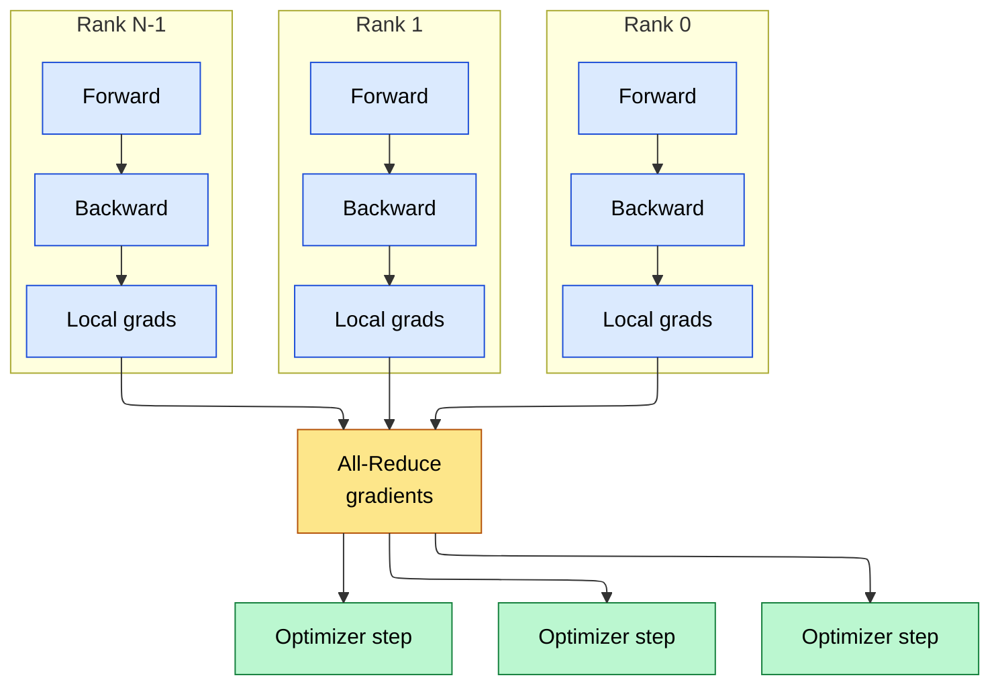
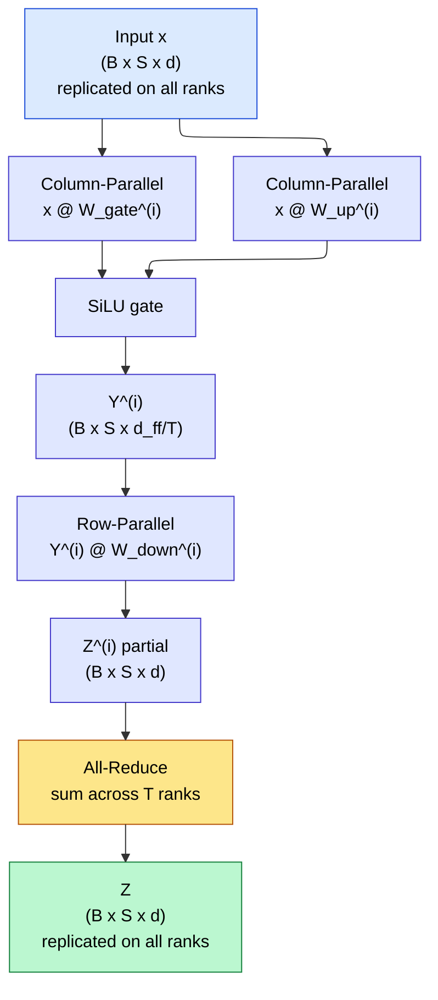
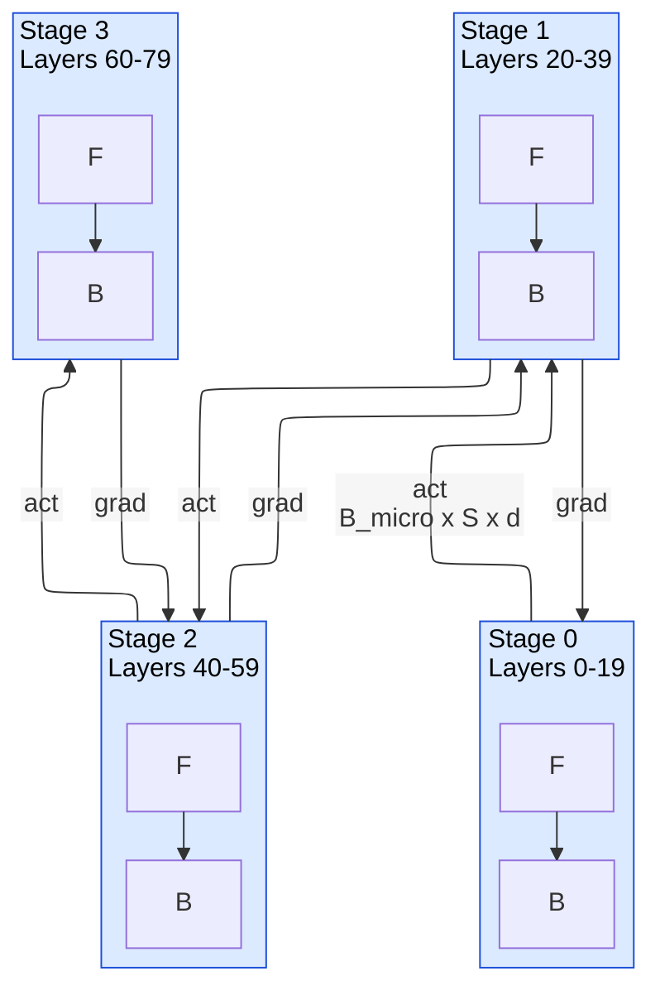
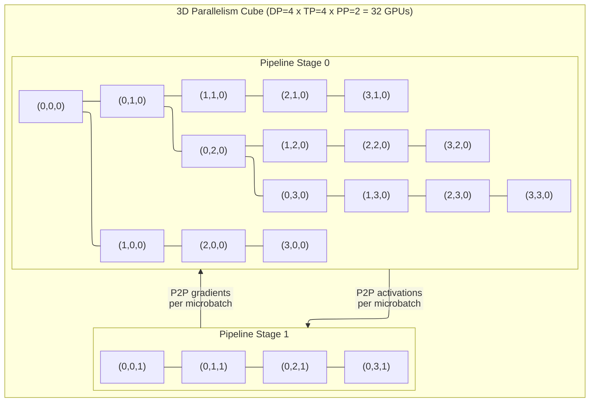

# Parallelism Strategies — Distributing Trillion-Parameter Training

> **Layer:** L7.
> **Prerequisites:** [Networking_and_Interconnect](../L4_Systems_and_Interconnects/01_Networking_and_Interconnect.md), [Transformer_Internals](../L6_Algorithms_and_Models/01_Transformer_Internals.md), [Modern_MoE](../L6_Algorithms_and_Models/03_Modern_MoE.md).
> **Hands off to:** [Collectives_and_NCCL](02_Collectives_and_NCCL.md), [Distributed_Training](03_Distributed_Training.md).

---

## 0. Why this page exists

A single H100 holds 80 GB of HBM. A 70 B-parameter model in BF16 requires 140 GB just for weights — 1.75x what fits on one chip. A 1 T-parameter dense model requires 2 TB. Even when weights fit, the optimizer state (Adam moments in FP32, master weights) inflates per-parameter memory to 16 bytes, pushing a 70 B model to 1.12 TB total. Training at frontier scale means the model cannot exist on any single device; every operation must be partitioned across a cluster.

This page specifies **how** to partition. There are six fundamental axes — data parallelism (DP), tensor parallelism (TP), pipeline parallelism (PP), expert parallelism (EP), context parallelism (CP), and sequence parallelism (SP) — and every frontier training run composes several of them simultaneously. For each axis this page derives the communication volume from first principles, states the memory savings, and identifies which interconnect it requires. The final sections compose these axes into 3D and 5D parallelism and provide concrete configurations for 70 B, 400 B MoE, and 1 T dense training.

**Five invariants that hold across all parallelism strategies:**

1. **Compute does not decrease with parallelism.** Partitioning adds communication overhead; it never removes FLOPs. The goal is to overlap communication with computation so the overhead is hidden.
2. **Memory per rank scales inversely with the sharding factor** — but only for the tensor dimension being sharded. TP shards weights; DP with ZeRO-3 shards optimizer state; PP shards layers. Memory reduction depends on which dimension is partitioned.
3. **Each axis has a natural interconnect domain.** TP demands NVLink-class bandwidth (hundreds of GB/s, microsecond latency) because every layer communicates. PP tolerates InfiniBand (tens of GB/s) because only stage boundaries communicate. DP with ZeRO-3 sits between them.
4. **The bubble fraction in PP is $(P-1)/M$ at best**, where $P$ is the number of stages and $M$ is the number of microbatches. Reducing the bubble requires more microbatches, which increases latency and activation memory.
5. **MoE models are communication-dominated.** Expert parallelism requires two all-to-all collectives per MoE layer, each of volume $O(B \cdot S \cdot d)$. At 256 experts and beyond, this dominates training time.

---

## 1. Data Parallelism (DP)

### 1.1 Principle

Each rank holds a complete copy of the model. The global batch is split into $N$ equal microbatches, one per rank. Each rank independently computes forward and backward passes on its microbatch, producing local gradients. An all-reduce synchronizes gradients across all ranks, after which each rank performs an identical optimizer step.



### 1.2 Communication volume derivation

The all-reduce transmits gradient tensors of size $P$ (parameter count) in BF16 ($b = 2$ bytes/element). A ring all-reduce moves each element across $2(N-1)/N$ hops on average; asymptotically the total data moved per rank is:

$$V_{\text{DP}} = 2 \cdot P \cdot b$$

The factor of 2 comes from the reduce-scatter and all-gather phases of the ring all-reduce. For a 70 B model in BF16:

$$V_{\text{DP}} = 2 \times 70 \times 10^9 \times 2 = 280 \;\text{GB per step}$$

At a single-rail NVLink bandwidth of 900 GB/s (bidirectional), this all-reduce takes approximately $280 / 900 \approx 0.31$ seconds. But the all-reduce is **blocking** — it cannot overlap with forward or backward computation in vanilla DP. This is the fundamental limitation that motivates sharded data parallelism.

### 1.3 Sharded Data Parallelism: ZeRO and FSDP

ZeRO (Zero Redundancy Optimizer) eliminates the three sources of redundancy in vanilla DP:

| Stage | Sharded tensor | Memory per rank | Communication pattern |
|---|---|---|---|
| ZeRO-1 | Optimizer state ($m_t$, $v_t$, FP32 master) | $P \cdot b + P \cdot b + 12P/N$ | All-reduce gradients (same as DP) |
| ZeRO-2 | Optimizer state + gradients | $P \cdot b + 2P/N + 12P/N$ | Reduce-scatter gradients |
| ZeRO-3 / FSDP | Optimizer state + gradients + parameters | $16P/N$ | All-gather params (fwd + bwd), reduce-scatter grads |

The critical insight for ZeRO-3: the all-gather of parameters happens **per layer**, not per step. Before layer $i$ executes, its parameters are gathered from all ranks. After the backward pass through layer $i$, gradients are reduce-scattered. This decomposition allows communication to overlap with computation in the layers that are not currently being gathered.

**Total communication volume per step under ZeRO-3:**

$$V_{\text{ZeRO-3}} = \underbrace{P \cdot b}_{\text{fwd all-gather}} + \underbrace{P \cdot b}_{\text{bwd all-gather}} + \underbrace{P \cdot b}_{\text{bwd reduce-scatter}} = 3Pb$$

This is 50% more bytes than vanilla DP, but the overlap with compute makes the **effective** blocking time much lower.

### 1.4 Memory scaling

For a model with $P$ parameters and DP degree $N$:

$$M_{\text{per-rank}}^{\text{ZeRO-3}} = \frac{16P}{N}$$

For Llama-3-70B with DP=8: $16 \times 70 \times 10^9 / 8 = 140$ GB. This fits on two H100s per rank, but with activation recomputation and gradient accumulation the practical DP size is much larger.

---

## 2. Tensor Parallelism (TP)

### 2.1 Principle

Tensor parallelism partitions individual weight matrices across ranks. Unlike DP (which replicates weights) or PP (which partitions layers), TP partitions **within a layer**. Each rank holds a vertical slice of each weight matrix; forward computation produces partial results that must be combined via collective operations.

TP is the highest-bandwidth parallelism strategy because every transformer layer requires communication. It must run within the NVLink domain.

### 2.2 Column-Parallel and Row-Parallel Linear

The Megatron-LM formulation pairs two linear layers — the up-projection and down-projection of the FFN — into a communication-efficient unit. Consider the FFN with SwiGLU:

$$\text{FFN}(x) = (x \cdot W_{\text{gate}} \odot \sigma(x \cdot W_{\text{up}})) \cdot W_{\text{down}}$$

**Column-parallel** splits $W_{\text{gate}}$ and $W_{\text{up}}$ along the output dimension. Each rank $i$ holds $W_{\text{gate}}^{(i)} \in \mathbb{R}^{d \times d_{\text{ff}}/T}$ and $W_{\text{up}}^{(i)} \in \mathbb{R}^{d \times d_{\text{ff}}/T}$:

$$Y^{(i)} = x \cdot W_{\text{gate}}^{(i)} \odot \sigma(x \cdot W_{\text{up}}^{(i)}) \quad \text{(no communication needed)}$$

**Row-parallel** splits $W_{\text{down}}$ along the input dimension. Each rank $i$ holds $W_{\text{down}}^{(i)} \in \mathbb{R}^{d_{\text{ff}}/T \times d}$:

$$Z^{(i)} = Y^{(i)} \cdot W_{\text{down}}^{(i)} \quad \text{(local partial result)}$$

$$Z = \sum_{i=0}^{T-1} Z^{(i)} \quad \text{(all-reduce to combine)}$$



### 2.3 Attention tensor parallelism

Multi-head attention partitions naturally: each rank owns $H/T$ attention heads (where $H$ is the total number of Q heads). The QKV projections are column-parallel; the output projection is row-parallel. After attention computation (which is purely local within each rank's heads), the row-parallel output projection requires an all-reduce.

### 2.4 Communication volume derivation

A single all-reduce in TP transmits activations of shape $[B, S, d]$ in BF16:

$$V_{\text{all-reduce}} = 2 \times B \times S \times d \times b$$

The factor of 2 is the ring all-reduce constant. Each transformer layer has **4 all-reduces**: 2 in the forward pass (attention output, FFN output) and 2 in the backward pass. Per layer:

$$V_{\text{TP/layer}} = 4 \times 2 \times B \times S \times d \times b = \frac{16 \cdot B \cdot S \cdot d \cdot b}{1}$$

For a full model with $L$ layers:

$$\boxed{V_{\text{TP}} = \frac{16 \cdot L \cdot B \cdot S \cdot d \cdot b}{T}}$$

The division by $T$ arises because with sequence parallelism (Section 6), the all-reduce is replaced by reduce-scatter and all-gather, each of volume $B \cdot S \cdot d \cdot b / T$ per rank, but the total bytes remain the same — the division by $T$ appears because each rank handles only $1/T$ of the activation in the overlapped formulation.

**Worked example — Llama-3-70B with TP=8, $B=64$, $S=4096$, $d=8192$, BF16:**

$$V_{\text{TP}} = \frac{16 \times 80 \times 64 \times 4096 \times 8192 \times 2}{8} = \frac{16 \times 80 \times 64 \times 4096 \times 8192 \times 2}{8}$$

Per all-reduce:

$$V_{\text{one}} = 2 \times 64 \times 4096 \times 8192 \times 2 = 8.59 \;\text{GB}$$

At NVLink bandwidth of 900 GB/s (bidirectional ring): $\approx 9.5$ ms per all-reduce. With 4 all-reduces per layer and 80 layers: $4 \times 80 \times 9.5 \;\text{ms} \approx 3.0$ seconds total TP communication per step. This is why TP must use NVLink — the same communication over 400 Gb/s InfiniBand ($\approx 50$ GB/s) would take $\sim 54$ seconds.

**TP communication volume — first-principles derivation:**

For a single transformer layer with TP degree $T$, the all-reduce at the output of the attention and FFN sub-layers aggregates partial results from all $T$ ranks. Each all-reduce communicates a tensor of shape $[B, S, d]$. Using the ring all-reduce formula, the volume per all-reduce per rank is:

$$V_{\text{TP, per-AR, per-rank}} = 2 \times \frac{T-1}{T} \times B \times S \times d \times b$$

With 4 all-reduces per layer and $L$ layers:

$$V_{\text{TP, total, per-rank}} = 4L \times 2 \times \frac{T-1}{T} \times B \times S \times d \times b = \frac{8L(T-1) \cdot B \cdot S \cdot d \cdot b}{T}$$

For TP=8 with $B=4$, $S=4096$, $d=8192$, $L=80$, BF16 ($b=2$):

$$V_{\text{TP, total}} = \frac{8 \times 80 \times 7 \times 4 \times 4096 \times 8192 \times 2}{8} = \frac{8 \times 80 \times 7 \times 4 \times 4096 \times 8192 \times 2}{8}$$

$$= 8 \times 80 \times 7 \times 4 \times 4096 \times 16384 = 236.2 \;\text{GB per rank per step}$$

At 900 GB/s NVLink: $236.2 / 900 = 0.263$ seconds. This is overlappable with compute — the total compute time for one training step (forward + backward) is ~2 seconds on 8 H100s, so TP communication at ~13% of step time is manageable.

### 2.5 Memory savings

With TP degree $T$, each rank holds $1/T$ of every weight matrix:

$$M_{\text{weights/rank}} = \frac{2P}{T}$$

For Llama-3-70B with TP=8: $2 \times 70 / 8 = 17.5$ GB per rank — fits in HBM. The optimizer state is not sharded by TP (unless combined with ZeRO).

---

## 3. Pipeline Parallelism (PP)

### 3.1 Principle

Pipeline parallelism partitions layers into $P$ stages, each assigned to a different rank (or group of ranks). Microbatches flow sequentially through stages in the forward direction; gradients flow in reverse. Communication occurs only at stage boundaries — point-to-point sends of activation tensors.



### 3.2 GPipe scheduling

GPipe runs all microbatches forward, then all backward:

$$\underbrace{F_1, F_2, \ldots, F_M}_{\text{forward passes}} \;\rightarrow\; \underbrace{B_M, B_{M-1}, \ldots, B_1}_{\text{backward passes}}$$

The pipeline has a **warmup phase** (stages are gradually filled) and a **cooldown phase** (stages gradually drain). During warmup and cooldown, some stages are idle — this idle time is the **bubble**.

**GPipe timing diagram ($P=4$ stages, $M=4$ microbatches):**

```ascii-graph
Time →   t0    t1    t2    t3    t4    t5    t6    t7    t8    t9    t10   t11   t12   t13
Stage 0: [F1]  [F2]  [F3]  [F4]  idle  idle  idle  [B4]  [B3]  [B2]  [B1]
Stage 1:       [F1]  [F2]  [F3]  [F4]  idle  idle  idle  [B4]  [B3]  [B2]  [B1]
Stage 2:             [F1]  [F2]  [F3]  [F4]  idle  idle  idle  [B4]  [B3]  [B2]  [B1]
Stage 3:                   [F1]  [F2]  [F3]  [F4]  idle  idle  idle  [B4]  [B3]  [B2]  [B1]

         |<--- forward (4 slots) --->|<--- bubble (3 slots) --->|<--- backward (4 slots) --->|
```

Each `[Fn]` or `[Bn]` slot represents one microbatch forward or backward pass on one stage. Total time: $(2M + P - 1)$ slots = $(8 + 3) = 11$ slots. Useful work: $2M = 8$ slots per stage. Bubble: $P - 1 = 3$ slots.

**Bubble fraction for GPipe:**

$$f_{\text{bubble}}^{\text{GPipe}} = \frac{P - 1}{M + P - 1}$$

where $P$ is the number of pipeline stages and $M$ is the number of microbatches.

| Stages ($P$) | Microbatches ($M$) | Bubble fraction | Utilization |
|---|---|---|---|
| 4 | 4 | 3/7 = 42.9% | 57.1% |
| 4 | 16 | 3/19 = 15.8% | 84.2% |
| 8 | 32 | 7/39 = 17.9% | 82.1% |
| 8 | 128 | 7/135 = 5.2% | 94.8% |
| 16 | 256 | 15/271 = 5.5% | 94.5% |

**Bubble overhead calculation — concrete example:** For PP=8 with $M=32$ microbatches, per-stage compute time $t_{\text{stage}} = 200$ ms:

- Ideal time (no bubble): $2M \times t_{\text{stage}} = 64 \times 200 = 12{,}800$ ms.
- Bubble time: $(P-1) \times t_{\text{stage}} = 7 \times 200 = 1{,}400$ ms.
- Actual time: $12{,}800 + 1{,}400 = 14{,}200$ ms.
- Wasted GPU-hours per step (8 GPUs): $8 \times 1{,}400 / 3600 = 3.1$ GPU-seconds per step. At 10,000 steps/day: 8.6 GPU-hours/day wasted on bubbles alone.

### 3.3 1F1B scheduling

The one-forward-one-backward (1F1B) schedule interleaves forward and backward passes to reduce peak activation memory. After the warmup phase, each rank alternates between one forward microbatch and one backward microbatch:

$$\underbrace{F_1, F_2, \ldots, F_P}_{\text{warmup}} \;\rightarrow\; \underbrace{(B_1, F_{P+1}), (B_2, F_{P+2}), \ldots}_{\text{steady state}} \;\rightarrow\; \underbrace{B_{M-P+1}, \ldots, B_M}_{\text{cooldown}}$$

**1F1B timing diagram ($P=4$ stages, $M=8$ microbatches):**

```ascii-graph
Time →   t0   t1   t2   t3   t4   t5   t6   t7   t8   t9   t10  t11  t12  t13  t14  t15  t16  t17
Stage 0: [F1] [F2] [F3] [F4] [B1] [F5] [B2] [F6] [B3] [F7] [B4] [F8] [B5] [B6] [B7] [B8]
Stage 1:      [F1] [F2] [F3] [F4] [B1] [F5] [B2] [F6] [B3] [F7] [B4] [F8] [B5] [B6] [B7] [B8]
Stage 2:           [F1] [F2] [F3] [F4] [B1] [F5] [B2] [F6] [B3] [F7] [B4] [F8] [B5] [B6] [B7] [B8]
Stage 3:                [F1] [F2] [F3] [F4] [B1] [F5] [B2] [F6] [B3] [F7] [B4] [F8] [B5] [B6] [B7] [B8]

         |<- warmup ->|<------------- steady state (1F1B) ------------->|<-- cooldown ->|
```

The bubble fraction is identical to GPipe: $(P-1)/(M+P-1)$. The advantage of 1F1B is **memory**: it holds at most $P$ in-flight microbatches worth of activations, whereas GPipe holds $M$. For $M=32$, $P=8$:
- GPipe activation memory per stage: $32 \times B_{\text{micro}} \times S \times d \times b$
- 1F1B activation memory per stage: $8 \times B_{\text{micro}} \times S \times d \times b$ (4× reduction)

### 3.4 Interleaved 1F1B (virtual stages)

Megatron-LM's interleaved schedule assigns each physical stage multiple non-contiguous "virtual stages." For example, with $P=4$ physical stages and $V=2$ virtual stages per physical stage, stage 0 owns layers $\{0, 4\}$, stage 1 owns $\{1, 5\}$, and so on. Microbatches cycle through stages $V$ times, reducing the per-chunk compute time by $V$ and thus the bubble time by $V$:

**Interleaved timing diagram ($P=4$ stages, $V=2$ virtual stages, $M=4$ microbatches):**

```ascii-graph
Time →   t0    t1    t2    t3    t4    t5    t6    t7    t8    t9    t10   t11
Stage 0: [F1a] [F2a] [F1b] [F2b] idle  [B1a] [B2a] [B1b] [B2b] [B3a] [B4a] [B3b] [B4b]
Stage 1:       [F1a] [F2a] [F1b] [F2b] idle  [B1a] [B2a] [B1b] [B2b] [B3a] [B4a] [B3b] [B4b]
Stage 2:             [F1a] [F2a] [F1b] [F2b] idle  [B1a] [B2a] [B1b] [B2b] [B3a] [B4a] [B3b] [B4b]
Stage 3:                   [F1a] [F2a] [F1b] [F2b] idle  [B1a] [B2a] [B1b] [B2b] [B3a] [B4a] [B3b] [B4b]

Where a/b denote the two virtual stage chunks per microbatch.
Per-chunk time = t_stage / V = half the non-interleaved time.
Bubble = (P-1)/V chunks = 3/2 = 1.5 slots instead of 3.
```

$$f_{\text{bubble}}^{\text{interleaved}} = \frac{P - 1}{V \cdot M + P - 1}$$

| Schedule | Bubble (P=8, M=32) | P2P messages |
|---|---|---|
| GPipe | 7/39 = 17.9% | $(P-1) \times M = 224$ |
| 1F1B | 7/39 = 17.9% | 224 |
| Interleaved 1F1B ($V=2$) | 7/71 = 9.9% | $224 \times 2 = 448$ |
| Interleaved 1F1B ($V=4$) | 7/135 = 5.2% | $224 \times 4 = 896$ |

The cost is $V$ times more point-to-point communications. Each P2P message is $V$ times smaller (per-virtual-stage chunk instead of per-full-stage), so the total P2P volume is unchanged, but the **latency** of $V$ times more messages can be a concern on high-latency interconnects.

### 3.5 Communication volume

Each stage boundary transmits an activation tensor of shape $[B_{\text{micro}}, S, d]$ in BF16:

$$V_{\text{PP/boundary}} = B_{\text{micro}} \times S \times d \times b$$

With $P$ stages, there are $P - 1$ boundaries. For both forward and backward:

$$V_{\text{PP/microbatch}} = 2(P-1) \times B_{\text{micro}} \times S \times d \times b$$

**Worked example — Llama-3-70B with PP=4, $B_{\text{micro}} = 4$, $S = 4096$, $d = 8192$, BF16:**

$$V_{\text{PP/microbatch}} = 2 \times 3 \times 4 \times 4096 \times 8192 \times 2 = 1.61 \;\text{GB}$$

Over 16 microbatches: $16 \times 1.61 = 25.8$ GB total. At 400 Gb/s InfiniBand ($\approx 50$ GB/s): $\sim 0.52$ seconds — much more manageable than TP over the same link.

### 3.6 Memory

Each stage holds $L/P$ layers worth of weights, but must store activations for all in-flight microbatches. With selective activation recomputation:

$$M_{\text{act/rank}} \approx P \times B_{\text{micro}} \times S \times d \times b$$

For PP=4 with 16 microbatches and 1F1B: at most 4 in-flight microbatches, so $4 \times 4 \times 4096 \times 8192 \times 2 \approx 1.07$ GB of activations per rank — very manageable.

---

## 4. Expert Parallelism (EP)

### 4.1 Principle

Mixture-of-Experts models contain $E$ expert FFN blocks per MoE layer. Each token is routed to its top-$k$ experts (typically $k \in \{1, 2\}$). Expert parallelism distributes experts across ranks so that each rank holds $E/P$ experts.

### 4.2 All-to-All dispatch and combine

Each MoE layer requires two all-to-all operations:

1. **Dispatch all-to-all:** After routing, each rank sends its tokens to the ranks that hold the assigned experts. Each rank receives tokens from all other ranks.
2. **Combine all-to-all:** After expert computation, each rank sends results back to the originating ranks.

> The communication-volume derivation — $V_{\text{comm}} = 2 \cdot N \cdot d \cdot k \cdot \frac{P-1}{P} \cdot b$ per MoE layer (dispatch + combine, with the $(P-1)/P$ local-expert discount), its scaling properties, and the DeepSeek-V3-on-NVL72 worked numbers — lives in [Modern_MoE](../L6_Algorithms_and_Models/03_Modern_MoE.md) §7.2.

**3D parallelism total communication — worked example:** Llama-3-70B, TP=8, PP=4, DP=4 (ZeRO-3), $B=64$, $S=4096$, $d=8192$, $L=80$, BF16.

- **TP (per rank):** 4 all-reduces/layer × 80 layers × $\frac{2 \times (T-1)}{T} \times B \times S \times d \times b$ per all-reduce. But with TP=8, each rank only processes $B \times S$ tokens with $d/T$ columns, and the all-reduce aggregates the $d$-dimensional output. Volume per rank:

$$V_{\text{TP}} = 4 \times 80 \times 2 \times \frac{7}{8} \times 64 \times 4096 \times 8192 \times 2 = 236.2 \;\text{GB}$$

At NVLink 900 GB/s: ~263 ms. Overlappable with compute.

- **PP (per rank):** $2(P-1)$ point-to-point transfers per microbatch × $M$ microbatches. With PP=4, $M=64/4=16$ microbatches (DP splits the global batch):

$$V_{\text{PP}} = 2 \times 3 \times 16 \times B_{\text{micro}} \times S \times d \times b = 6 \times 16 \times 4 \times 4096 \times 8192 \times 2 = 24.2 \;\text{GB}$$

At InfiniBand 50 GB/s: ~484 ms. Can be overlapped with compute via pipelining.

- **DP ZeRO-3 (per rank):** $3Pb / N_{\text{DP}}$ total, spread across layers:

$$V_{\text{DP}} = \frac{3 \times 70 \times 10^9 \times 2}{4} = 105 \;\text{GB}$$

At InfiniBand 50 GB/s: ~2.1 seconds. This is the bottleneck — overlapped across layers via FSDP prefetch, the effective blocking time is much lower (each layer's all-gather is ~1.3 GB, taking ~26 ms).

- **Total:** $236.2 + 24.2 + 105 = 365.4$ GB per rank per step. TP dominates in volume but runs on fast NVLink. DP is the highest-cost axis on the slow network.

### 4.3 Load imbalance

Routing is data-dependent: some experts receive more tokens than others. The imbalance ratio is:

$$\rho = \frac{\max_i(n_i)}{\bar{n}} \quad \text{where } n_i = \text{tokens routed to expert } i$$

A perfectly balanced system has $\rho = 1$. In practice $\rho \in [1.5, 3.0]$ without mitigation. Three strategies:

1. **Auxiliary load-balancing loss:** Add $\lambda \cdot \sum_i f_i \cdot p_i$ to the training loss, where $f_i$ is the fraction of tokens routed to expert $i$ and $p_i$ is the router probability for expert $i$. Encourages uniform routing without hard constraints.
2. **Expert capacity factor:** Set a hard cap $C = \lceil (B \cdot S \cdot k) / (E \cdot \text{cap\_factor}) \rceil$. Tokens exceeding capacity are dropped or routed to a backup expert.
3. **Dynamic expert replication:** Hot experts are replicated across multiple ranks. Increases memory but eliminates tail latency.

### 4.4 EP combined with TP

Large MoE models shard each expert with TP within a node and distribute different experts across nodes with EP. A typical layout for DeepSeek-V3 on 256 H100s:

$$\text{TP} = 8 \;\text{(intra-node)} \quad \times \quad \text{EP} = 32 \;\text{(inter-node)} \quad \times \quad \text{DP} = 1$$

Each rank holds $256/32 = 8$ experts, each sharded across 8 GPUs via TP.

### 4.5 Advanced EP techniques (2025–2026)

**Expert Parallel A2A Overlap (Megatron Core 0.16+).** The two all-to-all operations in each MoE layer (dispatch and combine) are the dominant communication cost. Megatron Core 0.16+ overlaps these all-to-alls with the attention and MLP compute of adjacent layers:

- **Dispatch overlap:** While layer $i$'s attention/MLP computes, the dispatch all-to-all for layer $i$'s MoE begins sending tokens to expert ranks. By the time attention/MLP finishes, tokens have arrived at their target experts and expert computation can begin immediately.
- **Combine overlap:** While experts in layer $i$ compute, the combine all-to-all from layer $i-1$'s MoE is in flight, returning expert outputs to their origin ranks.

This overlap reduces the effective EP communication cost by 40–60% in practice, as the all-to-all latency is hidden behind compute that must occur anyway.

**HybridEP (Megatron Core 0.17).** For models with many small experts (e.g., 256+ experts with small per-expert FFN dimensions), pure EP distributes experts across ranks but each rank may have low GPU utilization (small batch per expert). Pure TP solves utilization but replicates experts. HybridEP combines both:

- **Hybrid group:** A group of $T \times E$ GPUs where each expert is sharded across $T$ GPUs via TP, and $E$ unique expert groups are distributed across the EP dimension.
- **Improved utilization:** By choosing $T$ such that each TP shard of an expert is large enough to saturate the GPU's compute units, HybridEP achieves higher MFU than pure EP for models with many small experts.
- **Example:** For 256 experts on 64 GPUs, pure EP=64 gives 4 experts per rank. HybridEP with TP=4, EP=16 gives each rank 16 experts, each sharded 4-way. The larger per-rank expert count amortizes dispatch overhead, while TP within the expert increases per-GPU utilization.

**Ring Attention integration with EP.** Ring attention (Section 5.2) has been integrated into Megatron Core's EP implementation, enabling long-context MoE training where both the sequence and experts are distributed across devices. The communication patterns of ring attention and EP all-to-all can be pipelined: while K,V chunks rotate in the ring attention phase, expert dispatch tokens can be prepared in parallel.

---

## 5. Context Parallelism (CP)

### 5.1 Principle

For sequences exceeding 32 K tokens, the activation tensors $[B, S, d]$ become the dominant memory consumer. Context parallelism splits the sequence dimension across ranks, enabling training on sequences of $S \cdot C$ tokens where $C$ is the CP degree.

**PyTorch native CP (Prototype in PyTorch 2.7).** PyTorch introduced native context parallelism as a first-class parallelism dimension. Key properties:

- **Ring-style communication:** Uses ring-style communication to distribute KV cache across CP ranks, avoiding the need for all-gather of the full sequence on any single rank.
- **Composable with TP:** CP operates alongside tensor parallelism. A typical layout uses TP within a node and CP across a subset of the NVLink domain: each GPU's work is identified by $(t, c)$ where $t$ is the TP rank and $c$ is the CP rank.
- **New parallelism dimension:** CP is a separate dimension from SP (sequence parallelism). SP shards activations during norm/dropout operations within TP; CP shards the sequence itself across devices. They are orthogonal and can be combined.
- **API:** Accessible via `torch.distributed.tensor` placement APIs with a dedicated `SequenceParallel` / `ContextParallel` device mesh dimension.

### 5.2 Ring attention

Ring attention is the computational foundation of context parallelism. It distributes the FlashAttention computation across CP ranks. Each rank $i$ owns a local chunk of Q, K, V: $Q_i \in \mathbb{R}^{B \times S/C \times d}$, $K_i, V_i \in \mathbb{R}^{B \times S/C \times d}$.

In $C - 1$ rounds, each rank receives a K,V chunk from its neighbor, computes partial attention scores against its local Q chunk, and passes the K,V chunk forward:

$$\text{Attn}(Q_i, K_j, V_j) = \text{softmax}\!\left(\frac{Q_i K_j^T}{\sqrt{d}}\right) V_j$$

Online softmax accumulation (as in FlashAttention) merges partial statistics across rounds. After $C - 1$ rounds, each rank holds the complete attention output for its Q chunk.

Ring attention is now integrated into both PyTorch native CP and Megatron Core, providing production-grade implementations with communication-compute overlap.

#### 5.2.1 Ring attention algorithm in detail

Ring attention partitions the sequence dimension $S$ across $P_{\text{CP}}$ GPUs, so each rank holds $S / P_{\text{CP}}$ tokens. QKV projections are computed locally — no communication is needed for the linear algebra. The attention scores, however, require communication: each rank needs access to all K,V blocks but processes only its local Q.

The algorithm proceeds in $P_{\text{CP}}$ steps. At each step $t$, every rank simultaneously:

1. **Computes** partial attention for its local Q against the currently held K,V block, producing a local attention output $O_{\text{local}}^{(t)}$ along with running statistics $m_{\text{local}}^{(t)}$ (row-wise max of scores) and $\ell_{\text{local}}^{(t)}$ (row-wise sum of exponentiated scores).
2. **Rotates** its K,V block to the next rank via an asynchronous send/recv (point-to-point in a ring topology).
3. **Accumulates** the partial result into its running output using the online softmax correction derived below.

After $P_{\text{CP}}$ steps, each rank has seen every K,V block and holds the numerically exact attention output for its Q partition.

#### 5.2.2 Online softmax accumulation across the ring

The key challenge is merging partial softmax results from different K,V blocks. The FlashAttention online softmax trick maintains a running maximum $m$ and sum $\ell$ that are updated incrementally. For the ring, we extend this across communication steps.

Let $m^{(t)}$ be the running row-wise maximum after processing $t$ K,V blocks, $\ell^{(t)}$ the running sum of exponentiated scores, and $O^{(t)}$ the running weighted sum. At step $t$, the rank computes local statistics $m_{\text{local}}^{(t)}$ and $\ell_{\text{local}}^{(t)}$ for its local Q against K,V block $t$. The update rules are:

$$m^{(t)} = \max\!\left(m^{(t-1)},\; m_{\text{local}}^{(t)}\right)$$

$$\ell^{(t)} = e^{m^{(t-1)} - m^{(t)}} \cdot \ell^{(t-1)} + \ell_{\text{local}}^{(t)}$$

$$O^{(t)} = e^{m^{(t-1)} - m^{(t)}} \cdot O^{(t-1)} + P_{\text{local}}^{(t)} \cdot V_{\text{local}}^{(t)}$$

where $P_{\text{local}}^{(t)} = \text{softmax}_{\text{local}}(Q \cdot K_t^T / \sqrt{d_h})$ is the partial attention probability matrix for step $t$. The correction factor $e^{m^{(t-1)} - m^{(t)}}$ rescales the previously accumulated output to account for the updated maximum — this is numerically stable because the exponent is always non-positive. After all $P_{\text{CP}}$ steps, the final output is $O^{(P_{\text{CP}})} / \ell^{(P_{\text{CP}})}$, which is identical to computing the full softmax attention in one pass.

#### 5.2.3 Communication volume and independence from $P_{\text{CP}}$

Each rank sends/receives K,V blocks of size $2 \times B \times H \times (S / P_{\text{CP}}) \times d_h$ per step (factor of 2 for K and V), for $P_{\text{CP}}$ steps. The total communication volume per rank is:

$$V_{\text{CP/rank}} = P_{\text{CP}} \times \frac{2BSHd_h}{P_{\text{CP}}} = 2BSHd_h$$

The $P_{\text{CP}}$ cancels — **the total communication volume is independent of the CP degree.** This is a remarkable property: whether you use 2 GPUs or 64 GPUs for context parallelism, the aggregate data each rank transmits is the same. The benefit of more GPUs is reduced per-rank memory and a shorter sequence per rank, not less communication.

#### 5.2.4 Compute-communication overlap

Overlap is natural in ring attention. During step $t$, a rank simultaneously:

- Computes attention for its local Q against the current K,V block (step $t$ compute).
- Transmits the next K,V block to its neighbor and receives a new one (step $t+1$ communication).

This double-buffering hides nearly all communication latency as long as the attention computation for one K,V block takes longer than the transmission of one K,V block. At NVLink bandwidth ($\geq 300$ GB/s bidirectional), a K,V block of size $2 \times B \times (S / P_{\text{CP}}) \times d \times 2$ bytes transmits in $\sim 2BSd/(300 \times 10^9 \times P_{\text{CP}})$ seconds. For $B=2$, $S/P_{\text{CP}}=16\text{K}$, $d=8192$: $2 \times 2 \times 16384 \times 8192 \times 2 / (300 \times 10^9) \approx 3.6$ ms. The attention computation on the same block takes $\sim 2B(S/P_{\text{CP}})^2 d / (\text{FLOP/s})$, which at $\sim 500$ TFLOP/s (H100 BF16) is $\sim 17$ ms. Compute dominates by $\sim 5\times$, so overlap is effective.

### 5.3 SP-Ulysses: head-parallel sequence parallelism

An alternative to ring attention partitions the **attention heads** (not the sequence) across GPUs. SP-Ulysses assigns each of $P_U$ GPUs a subset of $H / P_U$ attention heads. Each GPU computes full-sequence attention for its assigned heads. The communication pattern is a single all-gather of Q,K,V (to give every GPU the full sequence for its heads) rather than a sequential ring:

$$V_{\text{Ulysses/layer}} = 3 \times B \times S \times d \times b \quad \text{(all-gather Q, K, V)}$$

This is larger per-step than ring attention but completes in one collective rather than $P_{\text{CP}}$ sequential steps, yielding lower latency. Ulysses is preferred for **short sequences** (where communication dominates over compute) and when head count is large (e.g., $H=128$ for Grouped Query Attention with many KV heads).

### 5.4 Hybrid SP: Ulysses $\times$ Ring

For very large clusters, combine Ulysses (head partition) with ring attention (sequence partition) across $P = P_U \times P_R$ GPUs:

- $P_U$ GPUs split the heads (Ulysses dimension, all-gather communication).
- $P_R$ GPUs split the sequence per head group (ring dimension, ring communication).

Total communication volume per layer per rank:

$$V_{\text{Hybrid/layer}} = \underbrace{3BSdb / P_U}_{\text{Ulysses all-gather}} + \underbrace{2BSdb}_{\text{ring (CP-independent)}}$$

**When to use which:**

| Strategy | Best for | Communication pattern | Latency |
|---|---|---|---|
| Ring attention (CP) | Long sequences ($S > 32\text{K}$), compute-dominated | $P_{\text{CP}}$ sequential P2P steps | Higher latency, higher throughput |
| SP-Ulysses | Short sequences ($S < 8\text{K}$), communication-dominated | Single all-gather | Lower latency |
| Hybrid | Very large clusters ($P > 8$ for SP) where neither alone provides enough parallelism | All-gather + ring | Balanced |

### 5.5 Communication volume summary

Each ring round transmits K and V chunks of shape $[B, S/C, d]$:

$$V_{\text{CP/round}} = 2 \times B \times \frac{S}{C} \times d \times b$$

Over $C - 1$ rounds per layer:

$$V_{\text{CP/layer}} = 2(C-1) \times B \times \frac{S}{C} \times d \times b \approx 2 \cdot B \cdot S \cdot d \cdot b \;\text{(for large } C\text{)}$$

**Worked example — CP=8, $S_{\text{total}} = 128\text{K}$, $B=2$, $d=8192$, BF16:**

$$V_{\text{CP/layer}} \approx 2 \times 2 \times 131072 \times 8192 \times 2 = 8.59 \;\text{GB}$$

With 80 layers: 687 GB total. At NVLink bandwidth, this is $\sim 0.76$ seconds. CP is communication-intensive and must run within the NVLink domain.

---

## 6. Sequence Parallelism (SP)

### 6.1 Principle

In standard TP, operations without weight matrices (LayerNorm, dropout, residual additions) still require the full $[B, S, d]$ activation on every rank — a redundant duplication. Sequence parallelism shards these operations along the sequence dimension.

### 6.2 The Megatron-SP transformation

The standard TP communication pattern is two all-reduces per layer (attention output, FFN output). Megatron-SP replaces these with reduce-scatter and all-gather:

- **Before attention:** reduce-scatter along the sequence dimension. Each rank receives $[B, S/T, d]$ — the unique local chunk.
- **LayerNorm and dropout** operate on the local chunk — no duplication.
- **Before attention matmuls:** all-gather to reconstruct $[B, S, d]$ for the weight operations.
- **After attention:** reduce-scatter back to the local chunk.
- **Repeat** for the FFN sub-layer.

$$V_{\text{SP}} = V_{\text{TP}} \quad \text{(same total bytes)}$$

The total communication volume is unchanged — each reduce-scatter + all-gather pair has the same aggregate bytes as one all-reduce. The benefit is **activation memory**: the $[B, S, d]$ tensors during norm/dropout are now $[B, S/T, d]$, saving $(T-1)/T$ of the activation memory for those operations.

---

## 7. Compute-Communication Overlap

Every parallelism strategy introduces communication that, if executed naively (blocking), wastes GPU time. The key insight: **any parallelism strategy that doesn't explicitly overlap communication is leaving 10-40% of potential throughput on the table.** The overlap techniques are specific to each parallelism axis:

**ZeRO-3 overlap.** ZeRO-3 all-gathers parameters layer by layer. The overlap strategy prefetches parameters for layer $i+1$ while computing layer $i$. The all-gather of layer $i+1$'s weights (size $\approx 2L_{\text{params}} \cdot b / D$ per rank) is issued as an asynchronous collective that runs on the NVLink/IB hardware while the GPU SMs execute the current layer's forward pass. Effective overlap requires that the all-gather completes within the compute time of one layer — typically $\sim 2B(S/P_{\text{CP}})d \cdot d_{\text{ff}} / \text{FLOP/s}$. For large batch sizes this holds comfortably; for small batches the all-gather may stall, degrading throughput by 15-30%.

**Pipeline overlap (interleaved 1F1B).** The pipeline bubble is $(P-1)/(VM+P-1)$ of total time. Interleaved scheduling with virtual stages ($V>1$) reduces the bubble by shrinking per-chunk compute time, but increases point-to-point communication frequency by $V\times$. The overlap is implicit: while stage $p$ computes microbatch $m$ forward, stage $p-1$ simultaneously transmits microbatch $m+1$'s activations. The point-to-point sends are small ($B_{\text{micro}} S d b$) and typically complete well within the compute window.

**TP overlap (delayed AllReduce).** Within a transformer layer, the AllReduce for the attention output can be delayed: issue the AllReduce asynchronously and immediately begin computing the FFN's column-parallel projections (which only need the local activation, not the AllReduced result). By the time the FFN needs the AllReduced attention output (at the row-parallel output), the collective has completed. This hides $\sim 50\%$ of TP communication behind useful compute. The same trick applies in reverse for the backward pass.

**Overlap summary:**

| Strategy | What is overlapped | Overlap mechanism | Typical throughput gain |
|---|---|---|---|
| ZeRO-3 | Parameter all-gather with forward compute | Prefetch layer $i+1$ during compute of layer $i$ | 15-30% |
| Interleaved PP | Pipeline bubble with other micro-batches | Virtual stages + pipelined P2P | 5-15% (bubble reduction) |
| TP delayed AllReduce | Attention AllReduce with FFN compute | Async AllReduce + immediate FFN start | 10-20% |
| Ring attention CP | K,V ring rotation with attention compute | Double-buffered send/recv + compute | 20-40% |

---

## 8. 3D Parallelism: TP x PP x DP

### 8.1 The cube

Every frontier training run composes at least three axes. Each GPU is identified by a tuple $(d, t, p)$ where $d \in [0, D-1]$ is the data-parallel rank, $t \in [0, T-1]$ is the tensor-parallel rank, and $p \in [0, P-1]$ is the pipeline-parallel rank. The total number of GPUs is $N = D \times T \times P$.



### 8.2 Communication group topology

| Axis | Communication pattern | Required bandwidth | Physical placement |
|---|---|---|---|
| TP | All-reduce per layer | $\geq 300$ GB/s bidirectional | Intra-node (NVLink) |
| PP | Point-to-point per microbatch | $\geq 25$ GB/s | Cross-node (InfiniBand) |
| DP | All-reduce per step (or reduce-scatter + all-gather with ZeRO) | $\geq 50$ GB/s | Cross-node or cross-rack |

The key constraint: **TP must fit within a single NVLink domain.** For H100, NVLink connects up to 8 GPUs (or 72 in NVL72). For B200, NVLink connects up to 72 GPUs in a rack. PP connects stages across nodes. DP connects replicas across the cluster.

### 8.3 Communication volume in 3D

The total communication volume per step for a model with $L$ layers, $P_{\text{total}}$ parameters, batch $B$, sequence $S$, hidden $d$:

$$V_{\text{total}} = \underbrace{\frac{16 \cdot L \cdot B \cdot S \cdot d \cdot b}{T}}_{\text{TP (all-reduces)}} + \underbrace{\frac{2(P_{\text{stages}} - 1) \cdot M \cdot B_{\text{micro}} \cdot S \cdot d \cdot b}{1}}_{\text{PP (P2P)}} + \underbrace{\frac{3 \cdot P_{\text{total}} \cdot b}{D}}_{\text{ZeRO-3 DP}}$$

Each term is the volume per rank. The dominant term depends on the model size and parallelism configuration.

---

## 9. Hybrid Strategies for Specific Model Sizes

### 9.1 70 B Dense (e.g., Llama-3-70B)

**Model parameters:** 70.6 B, $L=80$, $d=8192$, $H=64$, $d_{\text{ff}}=28672$.

**Constraint:** Weights in BF16 are 141 GB — requires at least TP=2 on 80 GB H100s.

| Configuration | GPUs | Layout | TP comm | PP comm | DP comm | Bubble |
|---|---|---|---|---|---|---|
| Single node | 8 | TP=8 | NVLink | none | none | none |
| 4 nodes | 32 | TP=8, DP=4 (ZeRO-3) | NVLink | none | IB | none |
| 16 nodes | 128 | TP=8, PP=4, DP=4 | NVLink | IB | IB | 15.8% |
| 64 nodes | 512 | TP=8, PP=8, DP=8 | NVLink | IB | IB | 17.9% |

**Recommended for 64 nodes (512 H100s):** TP=8 within each node, PP=8 across 8 node-groups (each stage has 10 layers), DP=8 across the remaining replicas. Microbatch count $M \geq 32$ for bubble $\leq 22\%$. With ZeRO-1 on the DP group, optimizer state is distributed across 8 replicas.

### 9.2 400 B MoE (e.g., DeepSeek-V3 class, 671 B total / 37 B active)

**Model parameters:** 671 B total, 256 experts, top-2 routing, 37 B active per token, $L=61$, $d=7168$.

**Constraint:** Expert weights alone are $\sim$600 GB — requires aggressive sharding.

**Recommended configuration on 256 H100s (32 nodes, NVL72):**

$$\text{TP} = 8 \times \text{EP} = 32 \times \text{DP} = 1$$

- Each of 32 EP ranks holds $256/32 = 8$ experts.
- Each expert is sharded across 8 GPUs via TP within a node.
- All-to-all dispatch/combine runs over the NVL72 fabric (72 GPUs per rack).
- No DP or PP needed at this scale; scale DP for larger clusters.

**For 2048 GPUs (256 nodes):**

$$\text{TP} = 8 \times \text{EP} = 32 \times \text{DP} = 8$$

DP=8 with ZeRO-1 distributes optimizer state. The EP all-to-all remains within an NVL72 domain, avoiding cross-rack all-to-all.

### 9.3 1 T Dense

**Model parameters:** $P \approx 10^{12}$, estimated $L=128$, $d=16384$, $d_{\text{ff}}=53248$.

**Constraint:** Weights in BF16 are 2 TB. Optimizer state at 16 bytes/param is 16 TB. Requires at minimum 200 GPUs just for optimizer state.

**Recommended configuration on 2048 H100s (256 nodes):**

$$\text{TP} = 8 \times \text{PP} = 16 \times \text{DP} = 16$$

- TP=8 within each node (NVLink).
- PP=16 across 16 node-groups (each stage has 8 layers). With $M=128$ microbatches: bubble $= 15/143 = 10.5\%$.
- DP=16 with ZeRO-3: each rank stores $16 \times 10^{12} / 16 = 1$ TB of optimizer state, distributed across 16 replicas $\Rightarrow$ 62.5 GB per rank — fits on H100 with room for activations.
- PP point-to-point over InfiniBand. DP all-reduce/all-gather over InfiniBand.

---

## 10. Comparison Table

| Strategy | What is sharded | Comm per step (per rank) | Comm pattern | Latency sensitivity | Memory reduction | Interconnect requirement |
|---|---|---|---|---|---|---|
| DP (vanilla) | Nothing (replicated) | $2Pb$ | All-reduce | Low (overlap with step) | None | Any |
| ZeRO-1 | Optimizer state | $2Pb$ | All-reduce | Low | $12P/N_{\text{DP}}$ saved | Any |
| ZeRO-2 | Optimizer + grads | $2Pb$ | Reduce-scatter | Low | $14P/N_{\text{DP}}$ saved | Any |
| ZeRO-3 / FSDP | All state | $3Pb$ | All-gather + reduce-scatter | Medium (per layer) | $16P/N_{\text{DP}}$ total | IB or better |
| TP | Weights within layer | $16L \cdot BSd \cdot b / T$ | All-reduce (per layer) | Very high (every layer) | $2P/T$ weights | NVLink only |
| PP | Layers across stages | $2(P{-}1) \cdot B_{\text{micro}} Sdb$ | Point-to-point | Medium (per microbatch) | $\approx P/P_{\text{stages}}$ | IB acceptable |
| EP | Experts across ranks | $2BSdb \cdot k / N_{\text{EP}}$ per layer | All-to-all | High (per MoE layer) | Expert params / $N_{\text{EP}}$ | NVLink preferred |
| CP | Sequence across ranks | $\approx 2BSdb$ per layer | Ring (P2P chain) | High (per layer) | Act memory $\times 1/C$ | NVLink |
| SP | Sequence during norms | Same as TP | Reduce-scatter + all-gather | Same as TP | Act memory $\times 1/T$ | NVLink |

---

## 11. Numbers Table

| Quantity | Symbol | Typical value | Unit | Notes |
|---|---|---|---|---|
| DP communication (vanilla) | $V_{\text{DP}}$ | $2Pb$ | bytes/step | 280 GB for 70B BF16 |
| ZeRO-3 communication | $V_{\text{ZeRO-3}}$ | $3Pb$ | bytes/step | 420 GB for 70B BF16 |
| TP communication per layer | $V_{\text{TP/layer}}$ | $8BSdb$ | bytes/step | 8.59 GB for 70B TP=8 |
| TP all-reduces per layer | — | 4 | count | 2 fwd + 2 bwd |
| PP activation per boundary | $V_{\text{PP/bdry}}$ | $B_{\text{micro}}Sdb$ | bytes/microbatch | 0.27 GB for $B_{\mu}{=}4$, 70B |
| GPipe bubble fraction | $f_{\text{bubble}}$ | $(P{-}1)/(M{+}P{-}1)$ | fraction | 42.9% for P=4, M=4 |
| 1F1B max in-flight microbatches | — | $P$ | count | vs $M$ for GPipe |
| Interleaved bubble fraction | $f_{\text{int}}$ | $(P{-}1)/(VM{+}P{-}1)$ | fraction | $V$ = virtual stages |
| EP communication per MoE layer | $V_{\text{EP/layer}}$ | $2BSdbk/N_{\text{EP}}$ | bytes | 235 MB for DS-V3 EP=64 |
| EP all-to-all count per MoE layer | — | 2 | count | Dispatch + combine |
| CP communication per layer | $V_{\text{CP/layer}}$ | $\approx 2BSdb$ | bytes | Independent of $C$ |
| CP rounds per layer | — | $C - 1$ | count | Ring rotation count |
| Memory per param (mixed-precision Adam) | — | 16 | bytes/param | 2+4+2+4+4 breakdown |
| Memory per rank (ZeRO-3) | $M_{\text{rank}}$ | $16P/N$ | bytes | All state sharded |
| Memory per rank (TP) | $M_{\text{weights}}$ | $2P/T$ | bytes | Weights only |
| NVLink bandwidth (H100) | $BW_{\text{NVLink}}$ | 900 | GB/s | Bidirectional, 8-GPU ring |
| NVLink bandwidth (B200 NVL72) | $BW_{\text{NVL72}}$ | 900 | GB/s | Per GPU, 72-GPU fabric |
| InfiniBand bandwidth (NDR400) | $BW_{\text{IB}}$ | 50 | GB/s | 400 Gb/s unidirectional |
| Transformer FLOPs per token | — | $\approx 2P$ | FLOP | Dense, forward + backward $\approx 6P$ |

---

## 12. Worked Problems

### Problem 1: Minimum parallelism for 70B on H100

A 70 B-parameter model in BF16 is trained with mixed-precision Adam. How many H100s (80 GB each) are needed minimum, and what parallelism layout?

**Solution:**

Total state per parameter: 16 bytes. Total memory: $70 \times 10^9 \times 16 = 1.12$ TB.

$$N_{\min} = \lceil 1120 / 80 \rceil = 14 \;\text{GPUs}$$

With TP=8: weights per rank = $2 \times 70 / 8 = 17.5$ GB. This fits on one H100. Optimizer state per rank (without ZeRO): $14 \times 70 / 8 = 122.5$ GB — does not fit. With ZeRO-3 and DP=2 (total 16 GPUs): optimizer state per rank = $16 \times 70 / 16 = 70$ GB. Activations (with selective recomputation) add $\sim 5$ GB. Total $\approx 92.5$ GB per rank — still does not fit.

**Minimum practical: TP=8, DP=4 (32 GPUs).** ZeRO-3 optimizer state per rank: $16 \times 70 / 32 = 35$ GB. Weights per rank: 17.5 GB. Total $\approx 57.5$ GB — fits comfortably.

### Problem 2: TP communication over InfiniBand

An engineer proposes running TP=8 for Llama-3-70B across 8 nodes connected by NDR400 InfiniBand. Estimate the TP communication time per step and explain why this is infeasible.

**Solution:**

Per-layer all-reduce volume (TP=8): $V_{\text{one}} = 2 \times 64 \times 4096 \times 8192 \times 2 = 8.59$ GB.

4 all-reduces per layer, 80 layers: $V_{\text{TP}} = 4 \times 80 \times 8.59 = 2749$ GB.

InfiniBand NDR400 bandwidth: $\approx 50$ GB/s (unidirectional). Ring all-reduce with 8 nodes over IB: effective bandwidth $\approx 50$ GB/s per link.

$$T_{\text{TP}} = \frac{2749}{50} \approx 55 \;\text{seconds}$$

A single training step (forward + backward compute) for 70B on 8 H100s takes $\sim 2$ seconds. The TP communication alone would be $27\times$ the compute time. This is why TP must use NVLink ($\sim 3$ seconds TP comm, overlappable with compute).

### Problem 3: Pipeline bubble optimization

A training run uses PP=8 with 32 microbatches under GPipe. The per-stage compute time is 200 ms. What is the total step time and utilization?

**Solution:**

Bubble fraction: $f_{\text{bubble}} = (8 - 1) / (32 + 8 - 1) = 7/39 = 17.9\%$.

Ideal step time (no bubble): $32 \times 200 = 6400$ ms.

Actual step time: $6400 / (1 - 0.179) = 7792$ ms (GPipe) or equivalently, the bubble adds $7 \times 200 = 1400$ ms.

Utilization: $82.1\%$.

With interleaved 1F1B ($V=2$ virtual stages): $f_{\text{bubble}} = 7 / (64 + 7) = 7/71 = 9.9\%$. Step time: $6400 / 0.901 = 7103$ ms. Utilization: $90.1\%$. But point-to-point communications double.

### Problem 4: EP all-to-all volume for MoE

DeepSeek-V3 has 256 experts with top-2 routing. Training uses EP=64, $B=128$, $S=4096$, $d=7168$, BF16. The model has 58 MoE layers. Compute total EP communication per step.

**Solution:**

Per-layer all-to-all volume:

$$V_{\text{EP/layer}} = \frac{2 \times 128 \times 4096 \times 7168 \times 2 \times 2}{64}$$

$$= \frac{2 \times 128 \times 4096 \times 7168 \times 4}{64} = 2 \times 128 \times 4096 \times 7168 \times 0.0625$$

$$= 470 \;\text{MB per MoE layer}$$

Total: $58 \times 470 \;\text{MB} = 26.5$ GB per step.

At NVLink bandwidth (900 GB/s): $26.5 / 900 \approx 29$ ms — acceptable. At InfiniBand (50 GB/s): $\sim 530$ ms — significant overhead.

### Problem 5: 3D parallelism configuration for 1T model

Configure a 1 T-parameter dense model ($L=128$, $d=16384$) training on 4096 H100s (512 nodes). Target bubble fraction below 10%.

**Solution:**

Constraint 1 — TP must fit in NVLink domain. TP=8 (single H100 node).

Constraint 2 — Memory per rank. ZeRO-3: $16P/N = 16 \times 10^{12} / 4096 = 3.91$ GB per rank for optimizer state. Weights per rank with TP=8: $2 \times 10^{12} / 8 = 250$ GB — does not fit on 80 GB H100. This means each PP stage must further reduce weight memory.

With PP=$P_s$ stages: weights per rank = $2 \times 10^{12} / (8 \times P_s)$. For this to fit: $250 / P_s < 60$ GB (leaving room for activations). $P_s > 4.2$, so $P_s \geq 5$.

Try PP=8: weights per rank = $250 / 8 = 31.25$ GB. Fits.

Total GPUs: $T \times P_s \times D = 8 \times 8 \times D = 4096 \Rightarrow D = 64$.

ZeRO-3 optimizer state per rank: $16 \times 10^{12} \times 128 / (8 \times 64) / 4096$... More precisely: each rank holds $1/64$ of the optimizer state for its stage. $16 \times 10^{12} / (8 \times 64) = 31.25$ GB. Total per-rank memory: $\approx 31.25 + 31.25 + 5 = 67.5$ GB — fits on 80 GB H100.

Bubble with PP=8 and $M$ microbatches: $(8-1)/(M+7) < 0.10 \Rightarrow M > 63$. Use $M=64$ microbatches.

**Configuration:** TP=8, PP=8, DP=64, ZeRO-3, $M=64$ microbatches. Total: $8 \times 8 \times 64 = 4096$ GPUs.

---

## 13. Common Pitfalls

1. **TP over slow interconnect:** TP all-reduces occur every layer with volumes proportional to $B \cdot S \cdot d$. Over InfiniBand, this dominates step time by 10-50x. TP must use NVLink.
2. **Insufficient microbatches for PP:** With PP=16 and $M=16$, the bubble fraction is $15/31 = 48\%$. At minimum, $M \geq 4P$ for reasonable utilization ($< 25\%$ bubble).
3. **EP all-to-all across rack boundaries:** All-to-all is the most topology-sensitive collective. It requires every rank to exchange data with every other rank simultaneously. Running EP across racks without rail-optimized topology causes severe incast congestion.
4. **Ignoring head divisibility for TP:** TP degree must divide the number of attention heads. For Llama-3-70B with $H=64$, TP can be 1, 2, 4, 8, 16, 32, or 64. TP=6 would require padding.
5. **MoE load imbalance:** Without auxiliary loss, routing collapse sends 80%+ of tokens to 20% of experts. The straggler rank determines the step time.
6. **CP without communication overlap:** Ring attention is communication-intensive ($\approx 2BSdb$ per layer). Without overlapping K,V rotation with attention computation, CP is purely latency-bound.

---

## 14. References

1. Shoeybi, M. et al., "Megatron-LM: Training Multi-Billion Parameter Language Models Using Model Parallelism," *arXiv:1909.08053*, 2019.
2. Korthikanti, V. et al., "Reducing Activation Recomputation in Large Transformer Models," *arXiv:2205.05198*, 2022.
3. Rajbhandari, S. et al., "ZeRO: Memory Optimizations Toward Training Trillion Parameter Models," *SC20*, 2020.
4. Liu, H. et al., "Ring Attention with Blockwise Transformers for Near-Infinite Context," *arXiv:2310.01889*, 2023.
5. Fedus, W. et al., "Switch Transformers: Scaling to Trillion Parameter Models with Simple and Efficient Sparsity," *JMLR*, 2022.
6. Narayanan, D. et al., "Efficient Large-Scale Language Model Training on GPU Clusters Using Megatron-LM," *SC21*, 2021.
7. DeepSeek-AI, "DeepSeek-V3 Technical Report," *arXiv:2412.19437*, 2024.
8. NVIDIA, "Megatron-Core Documentation," 2024–2026.
9. PyTorch Team, "PyTorch Native Context Parallelism (Prototype)," 2025.
10. NVIDIA, "Megatron-Core 0.16–0.17: HybridEP and A2A Overlap," 2025.

---

## 15. Navigation

**Previous (in layer):** This is the first page in L7. Start here.
**Next:** [Collectives_and_NCCL](02_Collectives_and_NCCL.md) — AllReduce algorithms, ring vs tree, bandwidth modeling, NCCL internals.
**Up:** [L7 Training Stack Index](00_Index.md).
**Down (prerequisites):** [Networking_and_Interconnect](../L4_Systems_and_Interconnects/01_Networking_and_Interconnect.md) — SerDes physics, Clos topology, congestion control.
**Down (prerequisites):** [Transformer_Internals](../L6_Algorithms_and_Models/01_Transformer_Internals.md) — Complete forward pass, dimension table, FLOP counts.
**Down (prerequisites):** [Modern_MoE](../L6_Algorithms_and_Models/03_Modern_MoE.md) — Expert routing, load balancing, DeepSeek-V3 architecture.
