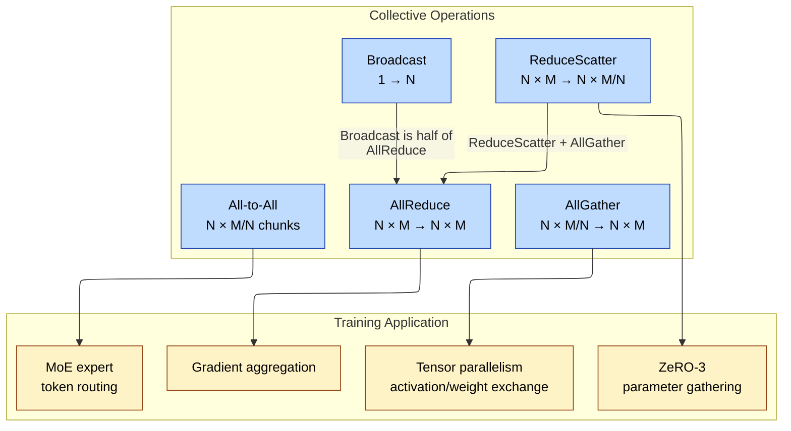
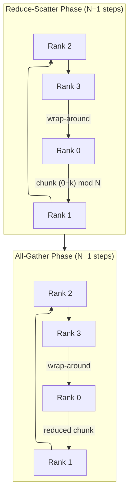
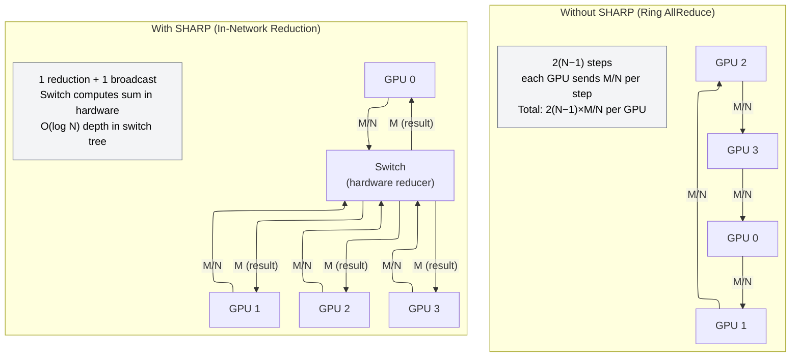

# Collectives and NCCL — Communication Primitives for Distributed Training

> **Layer:** L7.
> **Prerequisites:** [Parallelism_Strategies](Parallelism_Strategies.md), [Networking_and_Interconnect](../L4_Systems_and_Interconnects/Networking_and_Interconnect.md), [Rack_Scale_Design](../L4_Systems_and_Interconnects/Rack_Scale_Design.md).
> **Hands off to:** [Distributed_Training](Distributed_Training.md), [Training_Optimization](Training_Optimization.md).

---

## 0. Why this page exists

A single B200 GPU computes 4.5 PFLOP/s of FP4. Eight GPUs in an NVLink domain compute 36 PFLOP/s. But during distributed training every gradient step requires an AllReduce that must finish before the next step can begin. If the AllReduce takes longer than the compute, the training is *communication-bound* and most of those PFLOP/s sit idle. On a 1,024-GPU Llama 405B training run, each AllReduce aggregates ~2 GB of gradients across all ranks. The choice of collective algorithm and its implementation (NCCL, RCCL, oneCCL) determines whether that step takes 2 ms or 20 ms — a 10× difference in time-to-solution.

The five invariants:

1. **Collective communication dominates large-scale training time** — at 1,024+ GPUs, communication can consume 30–60% of step time for dense models.
2. **The ring algorithm is asymptotically optimal for bandwidth on a fully connected fabric** — its cost is $\frac{2(N-1)}{N} \cdot \frac{M}{B}$, approaching $\frac{2M}{B}$ as $N \to \infty$.
3. **Topology awareness is the difference between theory and practice** — an algorithm that assumes full bisection bandwidth fails on a hierarchical fabric unless the implementation maps rings to physical links.
4. **Small messages are latency-limited, large messages are bandwidth-limited** — the crossover is typically 64–256 KB; below it, tree algorithms win; above it, ring algorithms win.
5. **In-network reduction (SHARP) eliminates O(N) data movement** — the switch fabric computes partial sums, reducing AllReduce traffic by up to $\frac{N-1}{N}$.

---

## 1. Collective Operations: Definitions and Taxonomy

A collective is a communication pattern in which every participating rank (GPU) sends, receives, or both, following a well-defined data-movement specification. The MPI standard defines the canonical set; distributed training uses five primitives almost exclusively.

### 1.1 Operation Catalog

| Operation | Input per rank | Output per rank | Total data moved | Use case |
|-----------|---------------|-----------------|------------------|----------|
| **Broadcast** | Rank 0 has $M$ bytes; others have none | All ranks get $M$ bytes | $M \cdot (N-1)$ | Model init, config |
| **AllReduce** | Each rank has $M$ bytes | All ranks get $\bigoplus_{i} M_i$ (element-wise sum) | Depends on algorithm | Gradient aggregation |
| **ReduceScatter** | Each rank has $M$ bytes | Rank $i$ gets chunk $i$ of the reduction | $\frac{M(N-1)}{N}$ | TP+DP overlap, ZeRO-3 |
| **AllGather** | Each rank has $\frac{M}{N}$ bytes | All ranks get $M$ bytes (concatenation) | $M \cdot \frac{N-1}{N}$ | TP activation exchange |
| **All-to-All** | Each rank has $M$ bytes partitioned into $N$ chunks | Each rank receives one chunk from every rank | $M \cdot \frac{N-1}{N}$ | MoE expert parallelism |

Where $\bigoplus$ denotes the reduction operator (sum, max, min). In training, sum is overwhelmingly dominant (gradient accumulation).

### 1.2 Relationship Diagram

The five primitives decompose and compose:



### 1.3 Compositional identity

AllReduce is exactly ReduceScatter followed by AllGather on the same communicator:

$$\text{AllReduce}(M) = \text{ReduceScatter}(M) \parallel \text{AllGather}(M/N)$$

This identity is exploited by NCCL's "two-phase" schedule: the ReduceScatter phase reduces gradients and the AllGather phase distributes the result. Overlapping the two phases with computation is the core technique behind gradient accumulation overlap in Megatron-LM.

---

## 2. AllReduce Algorithms

### 2.1 Ring AllReduce

The ring AllReduce was introduced by Baidu in 2017 and remains the default for large messages in NCCL. It consists of two phases: reduce-scatter and all-gather, both executed as $N - 1$ sequential steps around a logical ring of $N$ ranks.

**Reduce-scatter phase.** Each rank partitions its $M$-byte buffer into $N$ equal chunks of size $M/N$. At step $k$, rank $i$ sends chunk $(i - k) \bmod N$ to rank $(i + 1) \bmod N$ and receives chunk $(i - k - 1) \bmod N$ from rank $(i - 1) \bmod N$, accumulating (summing) into the receiving buffer. After $N - 1$ steps, rank $i$ holds the fully reduced chunk $i$.

**All-gather phase.** The same ring pattern continues for another $N - 1$ steps, but now each rank forwards its fully reduced chunk rather than accumulating. After these steps, every rank has all $N$ reduced chunks.

**Bandwidth derivation.** Each step transfers $M/N$ bytes. There are $2(N-1)$ steps total. The ring is pipelined: at any given step, all $N$ links carry data simultaneously. The total time is:

$$T_{\text{ring}} = 2(N - 1) \cdot \frac{M/N}{B_{\text{link}}} = \frac{2(N-1)}{N} \cdot \frac{M}{B_{\text{link}}}$$

where $B_{\text{link}}$ is the per-link bandwidth. As $N \to \infty$:

$$T_{\text{ring}} \to \frac{2M}{B_{\text{link}}}$$

This is a remarkable result: the ring AllReduce cost is *independent of $N$* for large $N$ (it is always approximately $2M/B$). No algorithm can do better than $2M/B$ for a full reduction plus distribution (the factor of 2 arises because each byte must be sent once to contribute to the reduction and once to distribute the result).

**Latency term.** The ring also has a latency component: $2(N-1) \cdot \alpha$, where $\alpha$ is the per-step startup latency. For small $M$, this term dominates.

#### 2.1.1 Step-by-step Ring AllReduce worked example (4 GPUs, 4 elements each)

Four GPUs each hold a buffer of 4 elements. The goal: sum all corresponding elements and distribute the result to all GPUs.

**Initial state:**

```text
GPU 0: [ a0, a1, a2, a3 ]    GPU 1: [ b0, b1, b2, b3 ]
GPU 2: [ c0, c1, c2, c3 ]    GPU 3: [ d0, d1, d2, d3 ]
```

**Phase 1: Reduce-Scatter (3 steps)**

Step 1 — each GPU sends chunk (i-0) mod 4 to GPU (i+1) mod 4, and accumulates received data:

```ascii-graph
GPU 0 sends chunk 0 [a0] → GPU 1     GPU 0 receives [d3] from GPU 3, accumulates into chunk 3
GPU 1 sends chunk 1 [b1] → GPU 2     GPU 1 receives [a0] from GPU 0, accumulates into chunk 0
GPU 2 sends chunk 2 [c2] → GPU 3     GPU 2 receives [b1] from GPU 1, accumulates into chunk 1
GPU 3 sends chunk 3 [d3] → GPU 0     GPU 3 receives [c2] from GPU 2, accumulates into chunk 2

After Step 1:
GPU 0: [a0, a1, a2, a2+d3]    GPU 1: [a0+b0, b1, b2, b3]
GPU 2: [c0, b1+c1, c2, c3]    GPU 3: [d0, d1, c2+d2, d3]
```

Step 2 — each GPU sends the accumulated chunk from step 1:

```ascii-graph
GPU 0 sends chunk 3 [a2+d3] → GPU 1     GPU 0 receives [b1+c1] from GPU 3 into chunk 1
GPU 1 sends chunk 0 [a0+b0] → GPU 2     GPU 1 receives [a2+d3] from GPU 0 into chunk 3
GPU 2 sends chunk 1 [b1+c1] → GPU 3     GPU 2 receives [a0+b0] from GPU 1 into chunk 0
GPU 3 sends chunk 2 [c2+d2] → GPU 0     GPU 3 receives [b1+c1] from GPU 2 into chunk 1

After Step 2:
GPU 0: [a0, a1+b1+c1, a2, a2+d3]
GPU 1: [a0+b0, b1, b2, a2+b2+d2+d3]
GPU 2: [a0+b0+c0, b1+c1, c2, c3]
GPU 3: [d0, b1+c1+d1, c2+d2, d3]
```

Step 3 — each GPU sends the accumulated chunk from step 2:

```ascii-graph
GPU 0 sends chunk 2 [a2] → GPU 1         GPU 0 receives [c2+d2] from GPU 3 into chunk 2
GPU 1 sends chunk 3 [b2+d2+d3] → GPU 2   GPU 1 receives [a2] from GPU 0 into chunk 2
GPU 2 sends chunk 0 [a0+b0+c0] → GPU 3   GPU 2 receives [b2+d2+d3] from GPU 1 into chunk 3
GPU 3 sends chunk 1 [b1+c1+d1] → GPU 0   GPU 3 receives [a0+b0+c0] from GPU 2 into chunk 0

After Step 3 (reduce-scatter complete):
GPU 0: [a0, a1+b1+c1+d1, ...]     ← chunk 1 fully reduced ✓
GPU 1: [..., ..., a2+b2+c2+d2]     ← chunk 2 fully reduced ✓
GPU 2: [..., ..., a3+b3+c3+d3]     ← chunk 3 fully reduced ✓
GPU 3: [a0+b0+c0+d0, ...]          ← chunk 0 fully reduced ✓
```

**Phase 2: All-Gather (3 steps)**

The pattern is identical but each GPU forwards its fully reduced chunk instead of accumulating:

Step 4 — GPU 0 sends its reduced chunk 1, GPU 1 sends chunk 2, GPU 2 sends chunk 3, GPU 3 sends chunk 0.
Step 5 — forward the next chunk.
Step 6 — forward the last chunk.

After step 6, all GPUs hold $[a0{+}b0{+}c0{+}d0, \; a1{+}b1{+}c1{+}d1, \; a2{+}b2{+}c2{+}d2, \; a3{+}b3{+}c3{+}d3]$.

**Total data transferred per GPU:** 3 sends × 1 element + 3 sends × 1 element = 6 elements = $2(N-1) \times M/N = 2 \times 3 \times 1 = 6$ elements. For $M$ bytes total data: $\frac{2(N-1)}{N} \times M = \frac{6}{4} \times 4 = 6$ elements per GPU.



### 2.2 Tree AllReduce

The tree algorithm organizes ranks into a binary tree. The reduce phase fans in from leaves to root; the broadcast phase fans out from root to leaves.

**Reduce phase.** At each level, a parent receives two chunks from its children, reduces (sums) them, and forwards the result upward. The tree has $\lceil \log_2 N \rceil$ levels. At each level, the message size is the full $M$ bytes. Total data volume:

$$V_{\text{reduce}} = M \cdot \lceil \log_2 N \rceil$$

**Broadcast phase.** The root sends $M$ bytes down $\lceil \log_2 N \rceil$ levels.

$$V_{\text{bcast}} = M \cdot \lceil \log_2 N \rceil$$

Because only one link is active per level at any time (the tree is sequential), the bandwidth is not shared as efficiently as the ring. However, the latency is much lower:

$$T_{\text{tree}} = 2 \lceil \log_2 N \rceil \cdot \left(\alpha + \frac{M}{B_{\text{link}}}\right)$$

For small $M$, the $\log N$ factor in latency is vastly superior to the ring's $2(N-1)$ factor.

### 2.3 Recursive Halving-Doubling

This algorithm avoids the bandwidth inefficiency of the tree while maintaining $\log_2 N$ steps. It works only when $N$ is a power of 2.

**Halving phase (reduce-scatter).** At step $k$ (for $k = 0, 1, \ldots, \log_2 N - 1$), each rank exchanges the appropriate half of its current buffer with its partner at distance $2^k$. After $\log_2 N$ steps, each rank holds a fully reduced $M/N$ chunk.

**Doubling phase (all-gather).** The same pattern runs in reverse: at step $k$, ranks exchange their reduced chunks at distance $2^k$.

The data volume per step decreases geometrically during halving and increases during doubling. At step $k$ of the halving phase, each rank sends $M / 2^{k+1}$ bytes. The total time:

$$T_{\text{rhd}} = \sum_{k=0}^{\log_2 N - 1} \left(\alpha + \frac{M}{2^{k+1} B}\right) + \sum_{k=0}^{\log_2 N - 1} \left(\alpha + \frac{M}{2^{k+1} B}\right)$$

$$= 2 \log_2 N \cdot \alpha + \frac{2M}{B} \sum_{k=0}^{\log_2 N - 1} \frac{1}{2^{k+1}} = 2 \log_2 N \cdot \alpha + \frac{2M}{B} \left(1 - \frac{1}{N}\right)$$

The bandwidth term matches the ring ($\frac{2(N-1)}{N} \cdot \frac{M}{B}$) while the latency term is $2 \log_2 N \cdot \alpha$ versus $2(N-1) \cdot \alpha$ for the ring. The drawback: recursive halving-doubling requires a power-of-2 rank count and a fully connected (or at least hypercube-connected) topology to avoid link contention.

### 2.4 Algorithm Comparison

| Algorithm | Bandwidth cost | Latency cost | Topology requirement | Best regime |
|-----------|---------------|-------------|---------------------|-------------|
| Ring | $\frac{2(N-1)}{N} \cdot \frac{M}{B}$ | $2(N-1) \cdot \alpha$ | Ring or richer | $M > \frac{N(N-1) \cdot \alpha \cdot B}{N - 2} \approx N \alpha B$ (large $M$) |
| Tree | $2 \lceil \log_2 N \rceil \cdot \frac{M}{B}$ | $2 \lceil \log_2 N \rceil \cdot \alpha$ | Any | $M < \frac{2(N-1) - 2 \lceil \log_2 N \rceil}{2 \lceil \log_2 N \rceil - 2(N-1)} \cdot \alpha B$ (small $M$) |
| Recursive halving-doubling | $\frac{2(N-1)}{N} \cdot \frac{M}{B}$ | $2 \log_2 N \cdot \alpha$ | Power-of-2, hypercube-like | Medium $M$, power-of-2 $N$ |

---

## 3. Bandwidth Modeling: From Theory to Measured Throughput

### 3.1 The $\alpha$-$\beta$ Model

All collective costs can be expressed in the $\alpha$-$\beta$ model:

$$T = n_{\text{steps}} \cdot \alpha + \frac{V_{\text{total}}}{B}$$

where $n_{\text{steps}}$ is the number of sequential synchronization points, $\alpha$ is the per-step latency, $V_{\text{total}}$ is the total volume of data a single link must transfer, and $B$ is the achievable link bandwidth.

### 3.2 Per-algorithm Throughput Derivation

**Ring AllReduce throughput.** Rearranging the time formula:

$$\text{Throughput}_{\text{ring}} = \frac{M}{T_{\text{ring}}} = \frac{M}{\frac{2(N-1)}{N} \cdot \frac{M}{B} + 2(N-1) \cdot \alpha} = \frac{1}{\frac{2(N-1)}{NB} + \frac{2(N-1)\alpha}{M}}$$

For large $M$ (bandwidth-bound regime):

$$\text{Throughput}_{\text{ring}} \to \frac{NB}{2(N-1)} \approx \frac{B}{2}$$

The ring AllReduce achieves approximately half the link bandwidth, regardless of $N$. This half comes from the factor of 2 in the formula: each byte traverses the ring twice.

**Measured NVLink AllReduce.** On an 8-GPU H100 node with 900 GB/s bidirectional NVLink per GPU ($B = 900$ GB/s):

$$\text{Throughput}_{\text{ring, intra-node}} \approx \frac{900}{2} \times \frac{8}{7} \approx 514 \text{ GB/s}$$

Measured reality: ~470–510 GB/s (accounting for protocol overhead, protocol headers, and copy costs).

### 3.3 Numbers Table: Representative Systems (2025–2026)

| System | Scale | Link | $B_{\text{link}}$ | AllReduce BW (ring) | Latency $\alpha$ | Ring crossover $M^*$ |
|--------|-------|------|-------------------|--------------------|-----------------|---------------------|
| H100 NVL intra-node | 8 GPUs | NVLink-4 | 900 GB/s | ~500 GB/s | ~5 μs | ~20 KB |
| H100 + IB inter-node | 8–64 nodes | HDR IB 400 Gb/s | ~48 GB/s | ~24 GB/s | ~10 μs | ~1 MB |
| B200 NVL72 intra-rack | 72 GPUs | NVLink-5 | 1,800 GB/s | ~950 GB/s | ~8 μs | ~100 KB |
| MI355 XCD intra-node | 8 GCD | Infinity Fabric | 400 GB/s | ~200 GB/s | ~8 μs | ~50 KB |
| TPU v5p ICI pod | 8,960 chips | ICI | 1,600 GB/s | ~800 GB/s | ~5 μs | ~100 KB |

$M^* = N \alpha B$ is the message size at which ring bandwidth cost equals ring latency cost, the crossover from latency-dominated to bandwidth-dominated regime.

---

## 4. NCCL Internals

NVIDIA Collective Communications Library (NCCL) is the de facto standard for GPU collective communication on NVIDIA hardware. It is not a library in the traditional sense — it is a runtime that constructs optimized communication schedules by inspecting the hardware topology at initialization.

### 4.1 Ring Construction and Topology Discovery

When `ncclCommInitRank()` is called, NCCL performs three phases:

**Phase 1: Topology discovery.** Each rank queries CUDA for the number of GPUs, their PCI bus IDs, and the connectivity between them (NVLink, PCIe, or PCI). The result is a graph $G = (V, E)$ where $V$ is the set of GPUs and $E$ is the set of interconnect links with their bandwidths and types.

**Phase 2: Search for optimal rings/trees.** NCCL searches for rings (Hamiltonian cycles) that maximize the minimum link bandwidth. For an 8-GPU NVLink node, it finds rings using NVLink only. For a multi-node setup, it finds rings that traverse NVLink intra-node and network inter-node. Multiple rings are constructed to increase aggregate bandwidth — NCCL can use up to 4 independent rings simultaneously, striping data across them.

**Phase 3: Channel allocation.** Each ring is assigned a set of *channels*. A channel is a unit of parallelism — it corresponds to one GPU thread block managing one DMA engine. More channels means more parallel transfers but more memory for buffers. NCCL auto-tunes the channel count.

```mermaid
%%{init: {"flowchart": {"defaultRenderer": "elk", "nodeSpacing": 60, "rankSpacing": 60, "htmlLabels": false}}}%%
flowchart TB
    subgraph Init["NCCL Initialization"]
        TP[Topology Probe<br/>nvml, cudaGetDeviceProperties]:::phase
        RS[Ring Search<br/>maximize min-link BW]:::phase
        CA[Channel Allocation<br/>1–16 channels per ring]:::phase
        CP[Channel Setup<br/>register buffers, proxy threads]:::phase
    end

    TP --> RS --> CA --> CP

    subgraph Runtime["NCCL Runtime (per collective call)"]
        CK[Check size threshold]:::rt
        RM[Ring if M > threshold<br/>Tree if M < threshold]:::rt
        ST[Stripe M across channels<br/>M/channel = M / (rings × channels)]:::rt
        PX[Proxy thread issues DMA<br/>GPU kernel computes reduction]:::rt
    end

    CP --> CK --> RM --> ST --> PX

    classDef phase fill:#d1fae5,stroke:#065f46,color:#000
    classDef rt fill:#ede9fe,stroke:#5b21b6,color:#000
```

### 4.2 Channels and Proxy Threads

A *channel* in NCCL is the fundamental unit of data movement. Each channel has:

- **A send buffer and receive buffer** in GPU memory (pinned).
- **A proxy thread** on the CPU that manages DMA transfers.
- **A GPU kernel** (launched persistently or per-call) that performs the element-wise reduction.

The proxy thread is necessary because DMA between GPUs (via NVLink or PCIe) requires a CPU-side agent to set up the transfer descriptor. NCCL pre-creates these proxy threads during initialization so that during training, the CPU overhead is a simple queue submission rather than a thread spawn.

For an AllReduce of $M$ bytes with $R$ rings and $C$ channels per ring:

$$M_{\text{channel}} = \frac{M}{R \times C}$$

Each channel transfers $M_{\text{channel}} / N$ bytes per step. With 4 rings and 8 channels each, an 8-GPU AllReduce of 256 MB stripes across 32 channels, each handling 8 MB, with per-step transfers of 1 MB.

### 4.3 PCI/NVLink Topology Awareness

NCCL's topology graph distinguishes five link types, listed in decreasing bandwidth order:

| Link type | Bandwidth | Direction | Example |
|-----------|-----------|-----------|---------|
| NVLink | 900 GB/s (H100) / 1,800 GB/s (B200) | Bidirectional | GPU-to-GPU within node |
| NVSwitch | Same as NVLink (non-blocking) | Bidirectional | GPU-to-GPU via switch |
| PCIe (same switch) | 63 GB/s (Gen5 x16) | Bidirectional | GPU-to-GPU or GPU-to-NIC |
| PCIe (different switch) | 31.5 GB/s (Gen5 x16, through root complex) | Bidirectional | GPU-to-GPU across CPU |
| Network (IB/Ethernet) | 50–100 GB/s | Bidirectional | Node-to-node |

NCCL's ring search algorithm prefers higher-bandwidth links. In a typical 8-GPU HGX server:

- GPUs 0–3 connect to CPU socket 0 via PCIe; GPUs 4–7 connect to CPU socket 1.
- All 8 GPUs are connected via NVLink through NVSwitch.
- NICs connect to one or both CPU sockets via PCIe.

NCCL constructs intra-node rings using NVLink exclusively. Inter-node rings route GPU → NVLink → NVSwitch → NIC → network → NIC → CPU PCIe → GPU. The bottleneck is the NIC bandwidth, so NCCL ensures that inter-node rings use different NICs to maximize aggregate throughput.

### 4.4 NCCL Algorithm Selection

NCCL uses the following heuristic to select between ring and tree:

$$\text{Algorithm} = \begin{cases} \text{Tree} & \text{if } M < M_{\text{threshold}} \\ \text{Ring} & \text{if } M \geq M_{\text{threshold}} \end{cases}$$

where $M_{\text{threshold}}$ is computed as:

$$M_{\text{threshold}} = \frac{n_{\text{steps, ring}} - n_{\text{steps, tree}}}{\frac{1}{B_{\text{tree}}} - \frac{1}{B_{\text{ring}}}} \cdot \alpha$$

In practice, for 8 GPUs on NVLink with $\alpha \approx 5\,\mu\text{s}$: $M_{\text{threshold}} \approx 64\text{ KB}$ to $256\text{ KB}$ depending on the NCCL version. For inter-node collectives with $\alpha \approx 10\text{–}20\,\mu\text{s}$, the threshold rises to $1\text{–}4\text{ MB}$.

The environment variable `NCCL_ALGO=Ring|Tree|Collnet` can force a specific algorithm. `Collnet` invokes the SHARP path (Section 6).

---

## 5. Latency vs. Bandwidth Optimization

### 5.1 The Two Regimes

Collective operations operate in one of two regimes:

**Latency-bound** ($M \ll M^*$): The cost is dominated by the number of sequential synchronization steps. Optimization strategy: minimize steps by using tree ($\log N$) instead of ring ($N$), or use pipelining to overlap steps.

**Bandwidth-bound** ($M \gg M^*$): The cost is dominated by data volume. Optimization strategy: maximize usable bandwidth by using multiple rings, channels, and in-network reduction.

```mermaid
%%{init: {"flowchart": {"defaultRenderer": "elk", "nodeSpacing": 60, "rankSpacing": 60, "htmlLabels": false}}}%%
flowchart TD
    subgraph Decision["Algorithm Selection"]
        SIZE{Message size M}:::q
        SIZE -->|"M < 64 KB–1 MB<br/>(latency-bound)"| TREE[Tree AllReduce<br/>log₂N steps]:::choice
        SIZE -->|"M > 1 MB<br/>(bandwidth-bound)"| RING[Ring AllReduce<br/>2(N−1)/N × M/B]:::choice
        SIZE -->|"SHARP available<br/>(any M)"| SH[SHARP / CollNet<br/>switch does reduction]:::choice
    end

    subgraph Factors["Decision Factors"]
        L[Latency α]:::factor
        BW[Bandwidth B]:::factor
        N[Rank count N]:::factor
        TOPO[Topology]:::factor
    end

    Factors --> Decision

    classDef q fill:#fecaca,stroke:#991b1b,color:#000
    classDef choice fill:#bfdbfe,stroke:#1e40af,color:#000
    classDef factor fill:#e0e7ff,stroke:#3730a3,color:#000
```

### 5.2 Pipelining and Chunking

For large messages, NCCL splits the buffer into *chunks* and pipelines the chunks through the ring. If a message of size $M$ is split into $P$ chunks, each of size $M/P$, then:

- The first chunk completes after $2(N-1)$ steps of size $M/(P \cdot N)$.
- Subsequent chunks complete every step (pipeline steady state).
- Total time: $2(N-1) \cdot \frac{M}{P \cdot N \cdot B} + (P-1) \cdot \frac{M}{P \cdot N \cdot B}$

As $P \to \infty$, the pipeline overhead vanishes and the cost converges to the bandwidth-optimal $\frac{2(N-1)}{N} \cdot \frac{M}{B}$.

In practice, $P$ is set by the number of channels: $P = R \times C$. For 4 rings × 8 channels = 32 pipeline stages.

### 5.3 Tensor Fusion

During training, many small gradient tensors (from different layers) must be reduced. Reducing each individually would be catastrophically slow (latency-bound). NCCL's `ncclGroupStart()` / `ncclGroupEnd()` and PyTorch's `DistributedDataParallel` bucket mechanism coalesce small tensors into a single contiguous buffer before reduction.

If the model has $L$ layers with average gradient size $\bar{g}$ bytes each, the unfused approach requires $L$ AllReduce calls:

$$T_{\text{unfused}} = L \cdot T_{\text{AR}}(\bar{g}) \approx L \cdot 2(N-1) \cdot \alpha$$

The fused approach makes 1 call:

$$T_{\text{fused}} = T_{\text{AR}}(L \cdot \bar{g}) \approx \frac{2(N-1)}{N} \cdot \frac{L \bar{g}}{B} + 2(N-1) \cdot \alpha$$

For $L = 100$, $\bar{g} = 1\text{ MB}$, $N = 8$, $B = 500\text{ GB/s}$, $\alpha = 5\,\mu\text{s}$:

- Unfused: $100 \times 14 \times 5\,\mu\text{s} = 7.0\text{ ms}$
- Fused: $\frac{14}{8} \times \frac{100\text{ MB}}{500\text{ GB/s}} + 14 \times 5\,\mu\text{s} = 0.35\text{ ms} + 0.07\text{ ms} = 0.42\text{ ms}$

A 16.7× speedup from fusion alone.

---

## 6. Cross-Rack Collectives and SHARP

### 6.1 The Cross-Rack Bandwidth Problem

Intra-node bandwidth (NVLink, 900+ GB/s) vastly exceeds inter-node bandwidth (InfiniBand, 50–100 GB/s per NIC). When an AllReduce spans multiple racks, the ring must traverse the network bottleneck. For $R$ racks with $G$ GPUs per rack:

$$B_{\text{effective}} = \frac{B_{\text{inter-rack}} \cdot G}{2}$$

The factor of 2 arises because each inter-rack link carries data in both directions of the ring. For $B_{\text{inter-rack}} = 400\text{ Gb/s} = 50\text{ GB/s}$ per NIC and 8 GPUs per node:

$$B_{\text{effective}} = \frac{50 \times 1}{2} = 25\text{ GB/s}$$

Compare to intra-node: 500 GB/s. The cross-rack AllReduce is 20× slower.

### 6.2 Hierarchical AllReduce

NCCL addresses this with a *hierarchical* approach:

1. **Intra-node reduce-scatter**: Each node reduces its 8 GPUs' gradients to a single buffer.
2. **Inter-node AllReduce**: Reduce-scatter + all-gather across nodes using network links.
3. **Intra-node broadcast**: Distribute the result from the node's representative GPU to all 8 GPUs.

The inter-node phase transfers only $M/8$ per GPU per step (the data has been pre-reduced), so the effective bandwidth is:

$$T_{\text{hierarchical}} = \underbrace{\frac{2 \cdot 7}{8} \cdot \frac{M}{B_{\text{NVLink}}}}_{\text{intra-node}} + \underbrace{\frac{2(N_{\text{nodes}}-1)}{N_{\text{nodes}}} \cdot \frac{M}{B_{\text{network}}}}_{\text{inter-node}}$$

### 6.3 SHARP: In-Network Reduction

SHARP (Scalable Hierarchical Aggregation and Reduction Protocol) is an InfiniBand feature that offloads the reduction operation to the switch fabric. Instead of GPUs sending data to each other (which requires $O(N)$ data movement), GPUs send data to the switch, which computes the reduction in hardware and returns the result.

**How SHARP works:**

1. The NCCL runtime creates a SHARP collective group by registering with the SHARP agent on the management node.
2. A reduction tree is built *inside the switch fabric*. Each leaf switch aggregates data from its directly-connected GPUs.
3. Intermediate switches aggregate results from child switches.
4. The root switch holds the final result and broadcasts it back down the tree.

**Bandwidth savings.** In a standard ring AllReduce, each link carries $2(N-1)/N$ copies of the full message. With SHARP, each GPU sends $M$ bytes *once* (to its leaf switch) and receives $M$ bytes *once* (from the tree). Total data moved per GPU:

$$V_{\text{SHARP}} = 2M \quad \text{vs.} \quad V_{\text{ring}} = \frac{2(N-1)}{N} \cdot M \cdot (N-1)$$

Wait — the per-GPU send volume for SHARP is $M/N$ bytes (each GPU sends its contribution to the reduction), not $M$. Actually:

$$V_{\text{SHARP, per GPU}} = \frac{M}{N} + M = M \cdot \frac{N+1}{N}$$

The switch absorbs $N-1$ of the $N$ contributions and only forwards the aggregated result. This reduces network traffic by:

$$\text{Reduction ratio} = \frac{V_{\text{ring, per GPU}}}{V_{\text{SHARP, per GPU}}} = \frac{\frac{2(N-1)^2}{N}}{\frac{N+1}{N}} = \frac{2(N-1)^2}{N+1}$$

For $N = 32$: ratio $= 2 \times 31^2 / 33 \approx 58$. SHARP reduces network traffic by ~58× for 32 ranks.



**SHARP limitations:**

- Supports only sum and specific data types (FP32, FP16, BF16). FP8 support was added in SHARP v2.5 (2025).
- The switch must have SHARP-capable hardware (Mellanox/NVIDIA Quantum-2 or later).
- Maximum tree depth is limited by switch buffer size. Large $M$ can overflow switch SRAM, requiring fallback to software reduction.
- NCCL enables SHARP automatically when `NCCL_SHARP_DISABLE=0` (default) and the fabric supports it; `NCCL_SHARP_GROUP_SIZE` sets ranks per SHARP group.

**Measured payoff by message size:**

| Message size | AllReduce speedup with SHARP |
|---|---|
| Large messages (>1 MB) | ~2x |
| Medium messages | ~1.5-1.8x |
| Small messages (<64 KB) | ~30-50% |

Large messages benefit most because the in-switch reduction is amortized over more data; small messages are dominated by SHARP setup/synchronization overhead. In DGX SuperPOD-class clusters SHARP is enabled for large-message TP AllReduce; for MoE models with small, irregular All-to-All traffic it provides little benefit and is often disabled. The switch-ASIC hardware view (reduction-engine silicon, aggregation-tree embedding) lives in [Networking_and_Interconnect](../L4_Systems_and_Interconnects/Networking_and_Interconnect.md) §5c.

---

## 7. NCCL Environment Variables and Tuning

NCCL exposes hundreds of tuning knobs. The most important for production training:

### 7.1 Algorithm and Protocol

| Variable | Default | Purpose |
|----------|---------|---------|
| `NCCL_ALGO` | Auto (Ring for large, Tree for small) | Force `Ring`, `Tree`, or `Collnet` (SHARP) |
| `NCCL_PROTO` | Auto (Simple for small, LL for large) | `Simple` (no packing), `LL` (low-latency, packed into 128B blocks), `LL128` |
| `NCCL_MIN_NCHANNELS` | Auto | Minimum number of channels |
| `NCCL_MAX_NCHANNELS` | Auto | Maximum number of channels (typically 4–16) |

### 7.2 Network Tuning

| Variable | Default | Purpose |
|----------|---------|---------|
| `NCCL_SOCKET_IFNAME` | Auto-detect | Network interface for TCP bootstrap (e.g., `eth0`, `ib0`) |
| `NCCL_IB_DISABLE` | 0 | Set to 1 to disable IB and fall back to sockets |
| `NCCL_IB_HCA` | All HCAs | Specify which IB devices to use (e.g., `mlx5_0:1,mlx5_1:1`) |
| `NCCL_NET_GDR_LEVEL` | Auto | GPUDirect RDMA level: `0` (disabled), `1` (P2P), `2` (IP), `3` (full) |
| `NCCL_SHARP_DISABLE` | 0 | Set to 1 to disable SHARP even if available |

### 7.3 Debugging

| Variable | Default | Purpose |
|----------|---------|---------|
| `NCCL_DEBUG` | WARN | Set to `INFO` for per-call timing, `TRACE` for full dump |
| `NCCL_DEBUG_SUBSYS` | ALL | Restrict to `INIT`, `COLL`, `NET`, `GRAPH`, etc. |
| `NCCL_DUMP_ON_TIMEOUT` | 0 | Set to 1 to dump collective state on timeout (essential for debugging hangs) |
| `NCCL_COMM_BLOCKING` | 0 | Set to 1 to make `ncclCommInitAll` blocking (avoids deadlock during init) |

### 7.4 Performance Tuning Guidelines

**Rule 1: Do not tune unless there is a problem.** NCCL's auto-tuning is sophisticated. Override defaults only when profiling shows a clear bottleneck.

**Rule 2: Increase channels for bandwidth-bound workloads.** For large AllReduce ($M > 100\text{ MB}$), increasing `NCCL_MAX_NCHANNELS` from the default (typically 4) to 8 or 16 can improve throughput by 20–40% at the cost of more GPU memory for buffers (~16 MB per channel per ring).

**Rule 3: Use LL128 protocol for inter-node.** `NCCL_PROTO=LL128` packs data into 128-byte blocks with inline headers, reducing the number of DMA transactions. For IB inter-node, this can improve throughput by 10–15%.

**Rule 4: Verify topology.** `NCCL_DEBUG=INFO` prints the discovered topology during init. Check that all intra-node links are NVLink (not PCIe). A mis-seated NVLink cable degrades the entire ring to PCIe speeds.

**Rule 5: Enable SHARP for multi-node AllReduce.** When using Quantum-2 or later IB switches, verify that SHARP is active: look for `SHARP` in the NCCL init log. SHARP typically reduces AllReduce time by 30–50% for 16+ nodes.

---

## 8. Worked Problems

**Q1.** *Eight H100 GPUs in an HGX node perform a ring AllReduce of 256 MB of BF16 gradients. Each NVLink provides 900 GB/s bidirectional bandwidth. The per-step latency is 5 μs. Compute the total time and compare it to the compute time for a 2 trillion FLOP backward pass at 50% FP8 utilization.*

Ring AllReduce time:

$$T_{\text{ring}} = \frac{2(N-1)}{N} \cdot \frac{M}{B} + 2(N-1) \cdot \alpha = \frac{14}{8} \cdot \frac{256\text{ MB}}{900\text{ GB/s}} + 14 \times 5\,\mu\text{s}$$

$$= 1.75 \times 0.284\text{ ms} + 0.070\text{ ms} = 0.498\text{ ms} + 0.070\text{ ms} = 0.568\text{ ms}$$

Compute time at 50% FP8 utilization on 8 H100s (each 2 PFLOP/s FP8):

$$T_{\text{compute}} = \frac{2 \times 10^{12}}{0.5 \times 8 \times 2 \times 10^{15}} = \frac{2 \times 10^{12}}{8 \times 10^{15}} = 0.25\text{ ms}$$

Communication/compute ratio: $0.568 / 0.25 = 2.27$. The AllReduce takes 2.27× longer than the backward pass. This training step is communication-bound. Gradient accumulation overlap (pipelining compute and communication) is essential.

---

**Q2.** *A 64-node cluster (512 GPUs, 8 per node) performs an inter-node AllReduce of 512 MB. Each node has one HDR InfiniBand NIC at 400 Gb/s (50 GB/s). Intra-node AllReduce takes 1.0 ms. Compute the hierarchical AllReduce time and compare with a flat ring across all 512 GPUs.*

**Hierarchical approach:**

Intra-node reduce-scatter: 1.0 ms (same as full intra-node AllReduce — NCCL does ReduceScatter which takes half).

Inter-node ring across 64 nodes, each transferring $M/8 = 64$ MB (pre-reduced by the node):

$$T_{\text{inter}} = \frac{2 \times 63}{64} \cdot \frac{64\text{ MB}}{50\text{ GB/s}} + 2 \times 63 \times 10\,\mu\text{s} = 1.97 \times 1.28\text{ ms} + 1.26\text{ ms} = 2.52\text{ ms} + 1.26\text{ ms} = 3.78\text{ ms}$$

Intra-node broadcast: 1.0 ms.

Total hierarchical: $1.0 + 3.78 + 1.0 = 5.78\text{ ms}$.

**Flat ring across 512 GPUs:**

The flat ring must traverse both NVLink and IB links. The bottleneck is the IB link at 50 GB/s. The ring visits 512 ranks, sending $M/N = 512\text{ MB}/512 = 1\text{ MB}$ per step:

$$T_{\text{flat}} = 2 \times 511 \times \left(\frac{1\text{ MB}}{50\text{ GB/s}} + 10\,\mu\text{s}\right) = 1022 \times (0.02\text{ ms} + 0.01\text{ ms}) = 1022 \times 0.03\text{ ms} = 30.66\text{ ms}$$

Ratio: $30.66 / 5.78 = 5.3\times$. The hierarchical approach is 5.3× faster.

---

**Q3.** *A 32-GPU training job uses SHARP for AllReduce. Each GPU has 100 MB of gradients. The leaf switch reduces 8 GPUs per rack (4 racks). Compare the total bytes transferred over the network with and without SHARP.*

**Without SHARP (ring):** Each GPU sends $\frac{2(N-1)}{N} \cdot M = \frac{62}{32} \cdot 100\text{ MB} = 193.75\text{ MB}$ over the full ring. But only inter-rack hops traverse the network. With 4 racks of 8 GPUs, a ring visiting all 32 GPUs has $32 - 8 = 24$ inter-rack hops per half-ring, times 2 phases $= 48$ inter-rack hops. Each hop carries $100/32 = 3.125\text{ MB}$. Total inter-rack traffic: $48 \times 3.125 = 150\text{ MB}$ per ring traversal direction... Actually, let us compute total bytes over all inter-node links.

A simpler accounting: the ring carries $2(N-1)/N \times M = 193.75$ MB *per rank*. Total bytes over all links: the ring has $N$ links, each carrying $2(N-1)/N \times M/N$ bytes per step, over $2(N-1)$ steps. But many of these links are intra-node NVLink. Only the links between nodes consume network bandwidth. For 4 nodes of 8 GPUs, the ring has 4 inter-node links, each carrying $2 \times 31 \times 3.125\text{ MB} = 193.75\text{ MB}$. Total inter-node: $4 \times 193.75 = 775\text{ MB}$.

**With SHARP:** Each GPU sends $M/N = 100/32 = 3.125\text{ MB}$ to its leaf switch. Each rack (8 GPUs) sends $8 \times 3.125 = 25\text{ MB}$ to the root switch via the tree. The root switch sends the reduced result (100 MB) back to 4 leaf switches, each of which broadcasts to its 8 GPUs. Total inter-rack traffic: $4 \times 25\text{ MB}$ (up) $+ 4 \times 100\text{ MB}$ (down) $= 500\text{ MB}$.

Ratio: $775 / 500 = 1.55\times$. SHARP reduces inter-rack traffic by 35%. For larger $N$, the savings grow substantially.

---

**Q4.** *An LLM training run uses tensor parallelism (TP=8) within a node and data parallelism (DP=64) across nodes. Each micro-batch produces 200 MB of gradients. The gradient AllReduce is fused into a single call. Compute the time for the DP AllReduce across 64 nodes using HDR IB (50 GB/s per NIC), assuming NCCL uses 4 rings and the latency per step is 15 μs.*

Total gradient size: 200 MB (already the fused buffer).

With 4 rings, each ring handles 50 MB. The per-ring time (64 nodes):

$$T_{\text{ring}} = \frac{2 \times 63}{64} \cdot \frac{50\text{ MB}}{50\text{ GB/s}} + 2 \times 63 \times 15\,\mu\text{s} = 1.97 \times 1.0\text{ ms} + 1.89\text{ ms} = 1.97\text{ ms} + 1.89\text{ ms} = 3.86\text{ ms}$$

The 4 rings operate in parallel, so the total time is the max of any ring: 3.86 ms.

Adding intra-node overhead (ReduceScatter + AllGather within each node): ~1.0 ms.

Total: $1.0 + 3.86 = 4.86\text{ ms}$.

Without tensor fusion (assuming 100 layers, each 2 MB, called individually):

$$T_{\text{unfused}} = 100 \times 2(N-1) \times \alpha = 100 \times 126 \times 15\,\mu\text{s} = 189\text{ ms}$$

Fusion saves $189 / 4.86 = 38.9\times$.

---

**Q5.** *NCCL reports a topology where two GPUs in an 8-GPU HGX node are connected via PCIe instead of NVLink (cable failure). Compare the ring AllReduce throughput with and without this degradation for 256 MB of data.*

**Healthy topology:** All 8 GPUs connected via NVLink at 900 GB/s. Ring throughput:

$$\text{Throughput}_{\text{healthy}} \approx \frac{900}{2} \times \frac{8}{7} \approx 514\text{ GB/s}$$

**Degraded topology:** The ring must traverse one PCIe link (63 GB/s) between GPUs 3 and 4. The ring throughput is bounded by the slowest link:

$$\text{Throughput}_{\text{degraded}} \approx \frac{63}{2} \times \frac{8}{7} \approx 36\text{ GB/s}$$

Wait — this is the ring throughput limited by the PCIe bottleneck. Actually, the ring throughput is:

$$\text{Throughput}_{\text{ring}} = \frac{M}{T_{\text{ring}}} = \frac{M}{\frac{2(N-1)}{N} \cdot \frac{M}{B_{\text{min}}}} = \frac{N \cdot B_{\text{min}}}{2(N-1)}$$

where $B_{\text{min}}$ is the bandwidth of the slowest link in the ring:

$$\text{Throughput}_{\text{degraded}} = \frac{8 \times 63}{14} \approx 36\text{ GB/s}$$

Degradation factor: $514 / 36 = 14.3\times$. A single bad NVLink cable reduces AllReduce throughput by **14×**. This is why NCCL topology verification is critical: `NCCL_DEBUG=INFO` should show `NV12` (12 NVLinks) for every GPU pair in the ring.

---

## 9. References

**Foundational**
- R. Thakur, R. Rabenseifner, W. Gropp, "Optimization of Collective Communication Operations in MPICH," *International Journal of High Performance Computing Applications*, 2005.
- S. Baidu, "Bringing HPC Techniques to Deep Learning," *Baidu Research Blog*, 2017. (Original Ring AllReduce paper.)
- NVIDIA, *NCCL Documentation*, 2024–2026. https://docs.nvidia.com/deeplearning/nccl/
- J. Liu, B. Chandrasekaran, et al., "High Performance RDMA-Based Design of MPI over InfiniBand," *SC 2004*.

**Recent**
- NVIDIA, *SHARP v2.5 Programming Manual*, 2025.
- D. Mudigere, et al., "High-Performance Distributed Training at Meta Scale," *SC 2024*.
- A. Kalia, M. Kaminsky, D. G. Andersen, "Design Guidelines for High Performance RDMA Systems," *USENIX ATC 2016*.
- M. Cho, U. Finkler, et al., "BlueConnect: Decomposing All-Reduce for Deep Learning on Heterogeneous Network Hierarchies," *MLSys 2019*.
- S. Wang, D. Li, J. Geng, "Mathematical Modeling of Multi-level Ring AllReduce," *IEEE TPDS*, 2023.

**Cross-references**
- [Networking_and_Interconnect](../L4_Systems_and_Interconnects/Networking_and_Interconnect.md) — InfiniBand, NVLink, and topology primitives.
- [Rack_Scale_Design](../L4_Systems_and_Interconnects/Rack_Scale_Design.md) — how NVLink domains map to physical rack layout.
- [GPU_Architecture](../L3_Microarchitecture/GPU_Architecture.md) — NVLink and NVSwitch within t