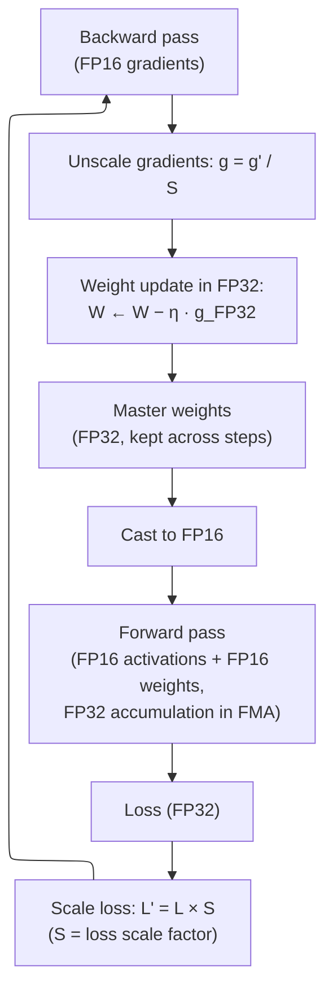
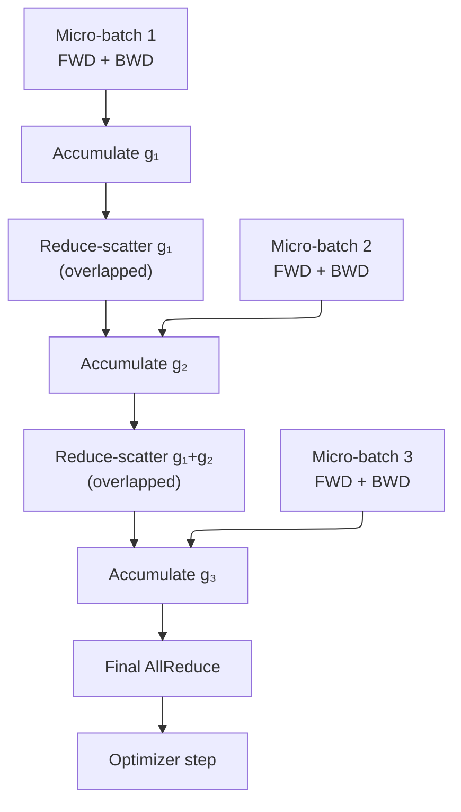
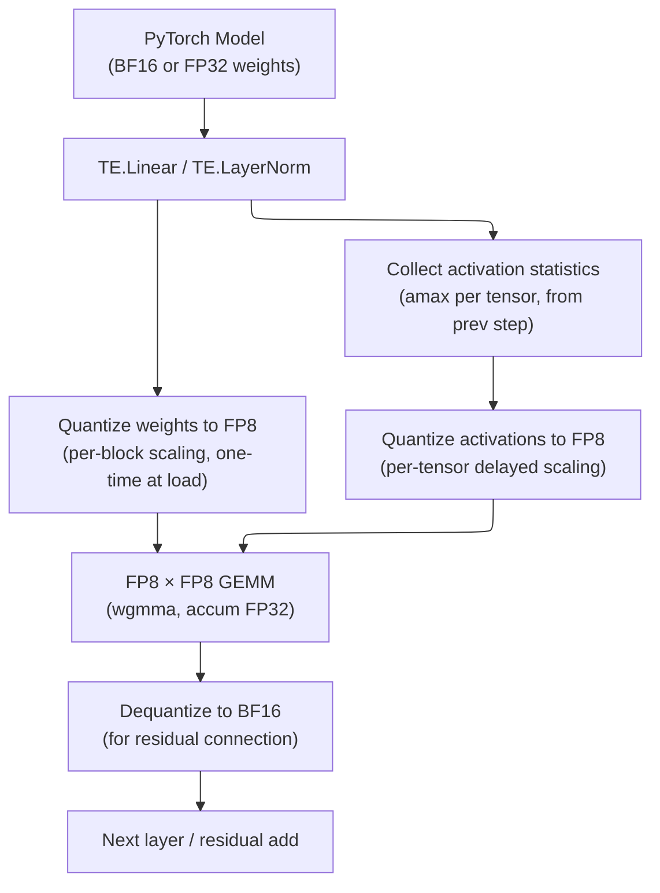
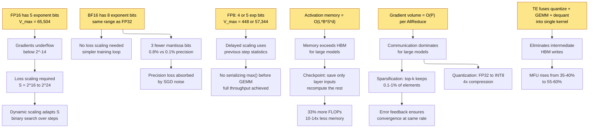

# Training Optimization — Mixed Precision, Checkpointing, and Acceleration

> **Layer:** L7.
> **Prerequisites:** [Distributed_Training](Distributed_Training.md), [FP_Unit_Design](../L2_Digital_Design_for_AI/FP_Unit_Design.md), [Modern_Quantization_Frontier](../L6_Algorithms_and_Models/Modern_Quantization_Frontier.md).
> **Hands off to:** [Modern_Post_Training](Modern_Post_Training.md), [Reasoning_Models](Reasoning_Models.md).

---

## 0. Why this page exists

A single H100 GPU delivers 989 TFLOPS in BF16 and 1,979 TFLOPS in FP8 — but only if every layer of the training stack cooperates. In practice, an unoptimized LLM training run achieves 30–45% model FLOPS utilization (MFU). The gap between peak silicon throughput and delivered throughput is the domain of **training optimization**: the collection of arithmetic, memory, and communication techniques that close the utilization gap without changing what the model learns.

This page covers four families of techniques that together account for most of the MFU recovery seen in production training runs:

1. **Mixed-precision training** — reducing operand precision from FP32/BF16 to FP16 or FP8, with loss scaling to protect small gradients from underflow.
2. **Activation checkpointing** — trading recomputation for memory, enabling larger batch sizes or deeper models on fixed hardware.
3. **Gradient accumulation and compression** — building large effective batch sizes from small micro-batches, and compressing gradients to reduce communication volume.
4. **Transformer Engine** — NVIDIA's fused-software stack for FP8 GEMM with delayed scaling, per-tensor statistics, and kernel fusion.

The core tension: **precision, memory, and communication are the three scarce resources in distributed training, and every optimization trades one against another.**

---

## 1. Mixed-precision training

### 1.1 The motivation

A matmul $Y = XW$ in FP32 stores every activation, weight, and gradient at 32 bits. For a $4096 \times 4096$ linear layer with batch size $B$ and sequence length $S$:

$$
\text{Activation memory per layer} = 2 \cdot B \cdot S \cdot 4096 \cdot 4 \text{ bytes (FP32)} = 32\,BS \text{ KB}
$$

$$
\text{FLOPs per layer} = 2 \cdot B \cdot S \cdot 4096^2 \approx 134 \cdot BS \text{ GFLOPs}
$$

At FP16 the memory halves and tensor-core throughput doubles (FP16 tensor cores: 989 TFLOPS on H100 vs 63 TFLOPS FP32 on the same die — a $15.7\times$ gap). The question is not whether to use lower precision, but **how low you can go without breaking training convergence**.

### 1.2 Automatic Mixed Precision (AMP)

AMP (Micikevicius et al., 2017) maintains a **master copy** of weights in FP32 while computing forward and backward passes in FP16. The key insight: FP32 accumulation inside the FMA unit preserves enough precision even when inputs are FP16, provided that gradient magnitudes are protected from underflow.

The critical question: **how to choose the loss scale $S$?**

### 1.3 Loss scaling derivation

FP16 represents positive values down to $2^{-14} \approx 6.1 \times 10^{-5}$ (subnormals extend to $2^{-24}$ but with reduced precision). Many gradients — particularly in the early layers of deep networks, in attention softmax denominators, and in LayerNorm — have magnitudes below this threshold. Without scaling, they flush to zero and the model stops learning.

**Static loss scaling.** Choose $S$ empirically (common values: $2^{16}$, $2^{20}$, $2^{24}$). The gradient $g$ becomes $g \cdot S$, shifting it into FP16's representable range. After the backward pass, divide by $S$ before the optimizer step. The risk: if $S$ is too large, gradient values overflow FP16's $\pm 65{,}504$ ceiling.

**Dynamic loss scaling (AMP default).** Start with $S = 2^{24}$. After each backward pass, check whether any gradient contains Inf or NaN (a single `isnan` check on the FP16 gradient tensor). If overflow is detected:

$$
S_{t+1} = S_t / 2
$$

If $N_{\text{safe}}$ consecutive steps pass without overflow:

$$
S_{t+1} = S_t \times 2
$$

This binary search converges to the largest safe scale within $O(\log_2(S_{\max}))$ steps. In practice, $S$ stabilizes within 50–200 steps and rarely changes thereafter.

**Derivation of the scaling ceiling.** The maximum FP16 value is 65,504. A gradient with maximum absolute value $|g|_{\max}$ requires:

$$
S \leq \frac{65\,504}{|g|_{\max}}
$$

For a typical Transformer layer, $|g|_{\max} \approx 0.1$–$1.0$ early in training and decays to $\approx 0.001$–$0.01$ later. Thus:

- Early training: $S \leq 65{,}504 / 1.0 = 65{,}504 \approx 2^{16}$
- Late training: $S \leq 65{,}504 / 0.001 = 6.55 \times 10^7 \approx 2^{26}$

Dynamic scaling tracks this decay automatically.

### 1.4 BF16 vs FP16 for training

| Property | FP16 | BF16 |
|---|---|---|
| Total bits | 16 | 16 |
| Exponent bits | 5 | 8 |
| Mantissa bits | 10 | 7 |
| Bias | 15 | 127 |
| $V_{\max}$ | 65,504 | $3.4 \times 10^{38}$ |
| Min positive normal | $2^{-14} \approx 6.1 \times 10^{-5}$ | $2^{-126} \approx 1.2 \times 10^{-38}$ |
| Dynamic range | $2^{30}$ | $2^{256}$ |
| Relative precision | 0.1% ($2^{-10}$) | 0.8% ($2^{-7}$) |
| Loss scaling required? | Yes | No |
| Tensor-core throughput (H100) | 989 TFLOPS | 989 TFLOPS |

**The key difference.** BF16's 8 exponent bits give it the same dynamic range as FP32. Gradients that would underflow in FP16 are representable in BF16 without any loss scaling. This eliminates the dynamic-loss-scale machinery entirely.

**The trade-off.** BF16 has 3 fewer mantissa bits (7 vs 10), giving 8$\times$ coarser relative precision. In practice, this precision loss is absorbed by the inherent noise in SGD and is invisible to final model quality. Every major training run since ~2022 uses BF16 by default.

### 1.5 FP8 training with delayed scaling

FP8 halves memory and doubles throughput again relative to BF16/FP16. But 8 bits provides very limited dynamic range (FP8 E4M3 max = 448; FP8 E5M2 max = 57,344). The solution: **delayed scaling**, pioneered by NVIDIA's Transformer Engine.

The principle: do not compute scaling statistics for the *current* tensor before launching the GEMM. Instead, use statistics from the *previous* training step:

$$
S_{\text{fwd},t}^{(l)} = \frac{\max(|A_{t-1}^{(l)}|)}{448} \qquad \text{(E4M3, forward pass)}
$$

$$
S_{\text{bwd},t}^{(l)} = \frac{\max(|G_{t-1}^{(l)}|)}{57\,344} \qquad \text{(E5M2, backward pass)}
$$

where $A_{t-1}^{(l)}$ is the activation tensor from layer $l$ at step $t-1$, and $G_{t-1}^{(l)}$ is the corresponding gradient tensor. The denominator is the maximum representable value of the target format.

**Why this works.** Activation and gradient distributions change slowly across consecutive training steps — typically $< 1\%$ shift in $\max(|A|)$ per step. The one-step lag introduces negligible quantization error.

**Why this is necessary.** Computing $\max(|A_t^{(l)}|)$ requires scanning the full activation tensor *before* the GEMM can begin. This is a serializing dependency that would stall the pipeline for tens of microseconds per layer. With delayed scaling, the scale is already available when the activation tensor is produced, so quantization and GEMM launch overlap with computation.

**FP8 training convergence.** With delayed scaling, FP8 training of Llama-scale models (7B to 405B) matches BF16 training loss curves to within 0.1% final perplexity on standard benchmarks. The remaining gap is closed by:

- Keeping the first and last layers in BF16 (sensitive to quantization noise).
- Using FP32 for the embedding table and final LM head.
- Accumulating weight updates in FP32 (master weight copy, same as AMP).

---

## 2. Activation checkpointing

### 2.1 The memory wall in training

During backpropagation, every intermediate activation must be stored for gradient computation. For a Transformer with $L$ layers, hidden dimension $d$, sequence length $S$, and batch size $B$, the activation memory (ignoring attention matrices) is approximately:

$$
M_{\text{acts}} \approx 2 \cdot L \cdot B \cdot S \cdot d \cdot \text{sizeof(dtype)}
$$

For GPT-3 (175B, $L = 96$, $d = 12{,}288$) with $B = 1$, $S = 2048$, BF16:

$$
M_{\text{acts}} = 2 \times 96 \times 1 \times 2048 \times 12{,}288 \times 2 = 9.66 \text{ GB}
$$

Adding attention matrices ($B \cdot S^2 \cdot d / n_h$ per layer, where $n_h$ is the number of heads) and LayerNorm statistics pushes this to 15–25 GB per sequence — exceeding the HBM of many GPU configurations. Activation checkpointing trades memory for compute by **selectively discarding activations during the forward pass and recomputing them during the backward pass**.

### 2.2 Full checkpointing

Discard *all* intermediate activations. During backpropagation, re-run the forward pass through each layer to reconstruct the needed activation. If the forward pass costs $C_{\text{fwd}}$ FLOPs, the total cost becomes:

$$
C_{\text{total}} = C_{\text{fwd}} + C_{\text{bwd}} + C_{\text{fwd}} = 2 \cdot C_{\text{fwd}} + C_{\text{bwd}}
$$

Since $C_{\text{bwd}} \approx 2 \cdot C_{\text{fwd}}$ (each matmul in the backward pass computes two gradients), the total FLOPs become:

$$
C_{\text{total}} \approx 4 \cdot C_{\text{fwd}}
$$

versus $3 \cdot C_{\text{fwd}}$ without checkpointing — a **33% overhead**.

Memory savings: $M_{\text{acts}}$ drops from $O(L)$ to $O(\sqrt{L})$ with optimal checkpointing (Chen et al., 2016), where only $\sqrt{L}$ activations are stored and the rest are recomputed from the nearest checkpoint.

### 2.3 Selective checkpointing

Not all layers are equally expensive to recompute. A Transformer layer contains:

| Operation | FLOPs (relative) | Memory (relative) | Worth saving? |
|---|---|---|---|
| QKV projection | 1.0× | 0.5× | No (cheap to recompute) |
| Attention scores ($S^2$) | $S/(2d)$× | $S/d$× | Yes (attention is memory-heavy, compute-light) |
| Attention $\times$ V | 1.0× | 0.5× | No |
| MLP up-projection | 4.0× | 2.0× | No (cheap to recompute from saved input) |
| Activation function | ~0 | $4d$ per element | No |
| MLP down-projection | 4.0× | 2.0× | No |
| LayerNorm / RMSNorm | ~0 | $d$ per element | No |

**Selective strategy.** Save only the *input* to each Transformer block (one tensor of shape $B \times S \times d$) and the attention softmax output. Recompute everything else during backprop.

$$
M_{\text{saved}} = L \cdot (B \cdot S \cdot d + B \cdot S^2) \cdot \text{sizeof(dtype)}
$$

vs. saving all intermediate tensors:

$$
M_{\text{full}} \approx L \cdot (14 \cdot B \cdot S \cdot d + B \cdot S^2) \cdot \text{sizeof(dtype)}
$$

The ratio $M_{\text{saved}} / M_{\text{full}} \approx 1/14$ for $S \ll 14d$ (typical: $S = 4096$, $d = 4096$–$8192$).

Recomputation cost: each layer's forward pass is re-run once during backprop. The overhead is:

$$
\text{Overhead} = \frac{C_{\text{recompute}}}{C_{\text{total}}} = \frac{C_{\text{fwd}}}{3 \cdot C_{\text{fwd}}} = 33\%
$$

identical to full checkpointing in FLOP count, but the memory savings are substantially better because only the layer input is saved (rather than $\sqrt{L}$ intermediate checkpoints).

### 2.4 Memory-vs-compute tradeoff math

Let $\alpha$ be the fraction of activations saved (versus recomputed). The total memory and compute are:

$$
M(\alpha) = \alpha \cdot M_{\text{full}} + (1 - \alpha) \cdot M_{\text{input-only}}
$$

$$
C(\alpha) = C_{\text{base}} + (1 - \alpha) \cdot C_{\text{recompute}}
$$

where $C_{\text{base}} = 3 \cdot C_{\text{fwd}}$ (standard forward + backward) and $C_{\text{recompute}} = C_{\text{fwd}}$.

The Pareto-optimal strategy for a given memory budget $M_{\text{budget}}$ is:

$$
\alpha^* = \frac{M_{\text{budget}} - M_{\text{input-only}}}{M_{\text{full}} - M_{\text{input-only}}}
$$

In practice, $\alpha = 0$ (save nothing except layer inputs) is almost always the right choice. The 33% FLOP overhead is an acceptable price for the 10–14× memory reduction, and modern GPUs are typically compute-bounded (not memory-bandwidth-bounded) during training.

---

## 3. Gradient accumulation

### 3.1 Effective batch size from micro-batches

Large-batch training is essential for both training stability (smoother gradient estimates) and throughput (better GPU utilization). But physical batch size is limited by GPU memory. The solution: **gradient accumulation** — run multiple forward-backward passes with small micro-batches, accumulate gradients in FP32, then perform a single optimizer step.

$$
g_{\text{accum}} = \frac{1}{N_{\text{micro}}} \sum_{i=1}^{N_{\text{micro}}} g_i
$$

The effective batch size becomes:

$$
B_{\text{effective}} = N_{\text{micro}} \times B_{\text{micro}} \times N_{\text{DP}}
$$

where $N_{\text{DP}}$ is the data-parallel degree and $B_{\text{micro}}$ is the per-GPU micro-batch size.

**Worked example.** Training a 70B model on 256 H100s with $N_{\text{micro}} = 4$, $B_{\text{micro}} = 1$, $S = 4096$, $N_{\text{DP}} = 64$ (256 GPUs / 4 TP):

$$
B_{\text{effective}} = 4 \times 1 \times 64 = 256 \text{ sequences}
$$

$$
\text{Tokens per step} = 256 \times 4096 = 1{,}048{,}576 \approx 1\text{M tokens}
$$

### 3.2 Memory impact of gradient accumulation

During accumulation, the optimizer does not update weights — it holds the accumulated gradient buffer. The memory for this buffer is:

$$
M_{\text{grad\_buffer}} = P \cdot 4 \text{ bytes (FP32)}
$$

where $P$ is the parameter count. For 70B parameters: $70 \times 10^9 \times 4 = 280$ GB.

Under ZeRO-1 (sharded optimizer states), this buffer is partitioned across $N_{\text{DP}}$ ranks:

$$
M_{\text{grad\_buffer, per rank}} = \frac{P \cdot 4}{N_{\text{DP}}}
$$

For $N_{\text{DP}} = 64$: $280 / 64 \approx 4.4$ GB per GPU — manageable alongside model states.

### 3.3 Overlapping accumulation with communication

In distributed training, the AllReduce of gradients across data-parallel ranks is a communication bottleneck. Gradient accumulation provides a natural opportunity for overlap: reduce-scatter gradients from micro-batch $i$ while computing micro-batch $i+1$.

With $N_{\text{micro}}$ steps of overlap, the effective communication cost approaches zero (fully hidden behind computation) when:

$$
T_{\text{compute}}(\text{one micro-batch}) \geq T_{\text{reduce-scatter}}(\text{one micro-batch's gradients})
$$

This inequality holds for most Transformer training configurations because the backward pass is compute-heavy and gradient volume scales as $O(P)$ while communication bandwidth scales as $O(P / N_{\text{DP}})$.

---

## 4. Gradient compression

### 4.1 Motivation

In large-scale distributed training, gradient communication volume scales linearly with model size and inversely with data-parallel degree. For a 405B-parameter model on 2,048 GPUs with $N_{\text{DP}} = 512$:

$$
\text{Gradient volume per AllReduce} = 405 \times 10^9 \times 2 \text{ bytes (BF16)} = 810 \text{ GB}
$$

Per-rank volume: $810 / 512 \approx 1.58$ GB. At 400 Gbps InfiniBand ($\approx 50$ GB/s), a single AllReduce takes $\approx 32$ ms — comparable to the compute time for one training step. Gradient compression reduces this volume.

### 4.2 Sparsification

**Top-$k$ sparsification.** Keep only the $k$ largest-magnitude gradient elements; zero out the rest:

$$
\tilde{g}_i = \begin{cases} g_i & \text{if } |g_i| \geq |g_{(k)}| \\ 0 & \text{otherwise} \end{cases}
$$

where $|g_{(k)}|$ is the $k$-th largest absolute value. Communication volume: $k \cdot (4 + \lceil \log_2 P \rceil / 8)$ bytes (value + index). Typical compression ratio: 100$\times$–1000$\times$ for $k/P \in [0.001, 0.01]$.

**Random-$k$ sparsification.** Sample $k$ elements uniformly at random and scale by $P/k$:

$$
\tilde{g}_i = \begin{cases} (P/k) \cdot g_i & \text{with probability } k/P \\ 0 & \text{otherwise} \end{cases}
$$

This is an **unbiased estimator**: $\mathbb{E}[\tilde{g}] = g$. Top-$k$ is biased (always underestimates small-gradient directions).

### 4.3 Quantization

**FP32 → INT8 quantization.** Quantize each gradient element to 8 bits using per-tensor scaling:

$$
\tilde{g}_i = \text{round}\!\left(\frac{g_i}{\Delta}\right), \quad \Delta = \frac{\max(|g|)}{127}
$$

Communication: 4$\times$ reduction (FP32 → INT8). Accuracy loss: negligible for convergence when combined with error feedback.

**FP32 → 1-bit (sign SGD).** Keep only the sign of each gradient element:

$$
\tilde{g}_i = \text{sign}(g_i)
$$

Communication: 32$\times$ reduction. Requires error feedback (see below) to converge.

### 4.4 Error feedback

Compression introduces error $e = g - \tilde{g}$. Without correction, this error accumulates and eventually diverges. **Error feedback** (EF) accumulates the compression residual across steps:

$$
e_t = e_{t-1} + g_t - \tilde{g}_t
$$

At each step, compress the *error-corrected* gradient:

$$
\tilde{g}_t = \text{Compress}(e_{t-1} + g_t)
$$

**Convergence guarantee.** With error feedback and unbiased compression, SGD converges at the same $O(1/\sqrt{T})$ rate as uncompressed SGD (Stich et al., 2018; Alistarh et al., 2017). The constant factor increases by at most $1 + \omega$ where $\omega = \mathbb{E}[\|\text{Compress}(x) - x\|^2] / \|x\|^2$ is the compression ratio.

**Practical adoption.** Error feedback is used in PowerSGD (Vogels et al., 2019), which low-rank approximates gradient matrices via randomized SVD. PowerSGD achieves 30–100$\times$ compression with $< 0.1\%$ convergence degradation on large Transformer models and is supported natively in PyTorch's DDP.

---

## 5. Transformer Engine: FP8 GEMM with delayed scaling

> This section covers the FP8 delayed-scaling foundation. The TE v2 extension — FP6/FP4 support, MXFP block scaling, and per-tensor current scaling — is in [Modern_Quantization_Frontier](../L6_Algorithms_and_Models/Modern_Quantization_Frontier.md) §6.

### 5.1 Architecture overview

Transformer Engine (TE) is NVIDIA's software library that manages mixed-precision GEMM operations, automatic precision selection, and fused kernels for Transformer training. TE wraps standard PyTorch modules (Linear, LayerNorm, softmax) and transparently handles precision management.

### 5.2 FP8 GEMM with delayed scaling: step-by-step

Consider a single linear layer $Y = XW + b$ during training step $t$.

**Forward pass:**

1. **Weight quantization (once, at load):** Compute per-block scale factors for $W$. Store $W^{\text{FP8}}$ with associated scale metadata. For E4M3, the per-block scale is:

$$
S_W^{(b)} = \frac{\max(|W_b|)}{448}
$$

where $W_b$ is the $b$-th block of $W$ and 448 is E4M3's $V_{\max}$.

2. **Activation quantization (delayed):** Use the scale from step $t-1$:

$$
S_{X,t} = S_{X,t-1} = \frac{\max(|X_{t-1}|)}{448}
$$

$$
X^{\text{FP8}}_{t} = \text{quantize}(X_t, S_{X,t})
$$

3. **FP8 GEMM:** Compute $Y = X^{\text{FP8}}_t \cdot W^{\text{FP8}}$ with FP32 accumulation inside the tensor core. Output is in FP32.

4. **Dequantization:** Apply output scale to convert back to BF16:

$$
Y^{\text{BF16}} = Y^{\text{FP32}} \cdot S_X \cdot S_W
$$

5. **Statistics collection:** Record $\max(|X_t|)$ for use at step $t+1$.

**Backward pass (E5M2 for gradients):**

$$
S_{G,t} = S_{G,t-1} = \frac{\max(|G_{t-1}|)}{57\,344}
$$

The wider range of E5M2 ($V_{\max} = 57{,}344$) accommodates gradient distributions that have fatter tails than activations.

### 5.3 Per-tensor scaling statistics

TE maintains an **amax history buffer** per tensor. The scaling factor is derived not from a single step's $\max(|A|)$ but from a smoothed estimate:

$$
\text{amax\_smooth}_t = \text{amax}_{t-1} \cdot \alpha + \text{amax}_{t-2} \cdot (1 - \alpha)
$$

with $\alpha = 0.001$ (exponential moving average over ~1000 steps). This prevents single-step outlier activations from inflating the scale factor and wasting dynamic range.

The final scale factor includes a margin:

$$
S = \frac{\text{amax\_smooth}_t}{V_{\max} \cdot \text{margin}}, \quad \text{margin} \in [1.0, 2.0]
$$

Default margin = 1.0 for training (activations near the format boundary are acceptable; occasional clipping is tolerated). For inference, margin is often set to 1.5–2.0 to prevent outlier-driven clipping.

### 5.4 Fused kernels

TE fuses multiple operations into single GPU kernels to eliminate memory round-trips:

| Fused operation | Separate kernels | Fused savings |
|---|---|---|
| Linear + bias + GELU | 3 kernels | ~15% latency |
| Linear + bias + residual add | 3 kernels | ~12% latency |
| LayerNorm + Linear + quantize | 3 kernels | ~20% latency |
| Dequantize + residual + dropout | 3 kernels | ~10% latency |

Each kernel launch incurs ~5–10 $\mu$s of driver overhead and requires writing intermediate results to HBM (1–2 TB/s bandwidth, but the latency matters for small tensors). Fusing eliminates both the launch overhead and the intermediate writes.

### 5.5 Throughput comparison: TE vs manual FP8

| Configuration | H100 FP8 TFLOPS | MFU | Notes |
|---|---|---|---|
| BF16 baseline (no TE) | 989 (peak BF16) | 45–50% | Standard PyTorch AMP |
| FP8 with manual quantization | 1,979 (peak FP8) | 35–40% | Quantization overhead kills MFU |
| FP8 with Transformer Engine | 1,979 (peak FP8) | 55–60% | Overlapped stats + fused kernels |
| FP8 TE + selective checkpointing | 1,979 (peak FP8) | 55–60% | Compute-bound, checkpointing is free |
| FP8 TE + FlashAttention-2 | 1,979 (peak FP8) | 60–65% | Attention is no longer memory-bound |

---

## 6. Multi-Token Prediction and MoE Training Optimizations (2025–2026)

### 6.1 Multi-Token Prediction (MTP)

Standard language model training predicts one future token per position. Multi-Token Prediction (MTP) predicts $n$ future tokens simultaneously, improving the training signal density per forward pass.

**Mechanism.** At each position $t$, the model produces not only the logits for token $t+1$ but also for $t+2, \ldots, t+n$. This is implemented via $n$ output heads that share the transformer backbone but have separate linear projections. The loss becomes:

$$
\mathcal{L}_{\text{MTP}} = \sum_{i=1}^{n} \lambda_i \cdot \mathcal{L}_{\text{CE}}(y_{t+i}, \hat{y}_{t+i})
$$

where $\lambda_i$ is a weighting term (typically $\lambda_i = 1/i$ or uniform). The additional heads add negligible parameter count ($n \times d \times V$ where $V$ is vocab size, versus $L \times 12d^2$ for the transformer body).

**Benefits:**
- **Denser training signal.** Each forward pass produces $n$ gradient signals per position instead of 1, improving sample efficiency by 10–20% (measured in tokens-to-convergence).
- **Better representation learning.** Predicting further into the future forces the model to learn more robust intermediate representations, which improves downstream performance on reasoning tasks.
- **Supported in Megatron Core 0.15+.** Production-grade implementation with the loss weights and head architectures used in Meta's original MTP paper.

**Cost:** The forward pass is ~5–10% slower due to the additional output projections and loss computation. The backward pass overhead is similar. Net MFU impact is minimal because the output projections are small relative to the transformer backbone.

### 6.2 LatentMoE

Standard MoE routes tokens to experts in the full hidden dimension $d$. For models with large $d$ (8192+) and many experts (256+), the per-expert computation is expensive even when each expert receives few tokens. LatentMoE projects the input to a lower-dimensional latent space before routing and expert computation:

$$
\text{LatentMoE}(x) = W_{\text{out}} \cdot \text{Expert}_i(W_{\text{in}} \cdot x)
$$

where $W_{\text{in}} \in \mathbb{R}^{d_{\text{latent}} \times d}$ projects down, $d_{\text{latent}} \ll d$ (e.g., $d_{\text{latent}} = d/4$), and $W_{\text{out}} \in \mathbb{R}^{d \times d_{\text{latent}}}$ projects back up. The routing decision is made on the latent representation.

**Benefits:**
- Expert FLOPs are reduced by $(d_{\text{latent}} / d)^2$ (the matmul cost scales quadratically with dimension). For $d_{\text{latent}} = d/4$: 16x reduction in expert FLOPs.
- The projection matrices $W_{\text{in}}$ and $W_{\text{out}}$ add $2 \cdot d \cdot d_{\text{latent}}$ parameters per MoE layer — negligible compared to the expert parameters saved.
- Supported in Megatron Core 0.17+.

### 6.3 NVFP4 quantization for MoE training

NVIDIA's NVFP4 (4-bit floating-point) format, originally designed for inference on Blackwell GPUs, has been applied to MoE weight storage during training:

- **Weight storage only:** Expert weights are stored in FP4 (1 bit sign, 2 bit exponent, 1 bit mantissa) with block-wise scaling factors. All compute remains in BF16 or FP8; weights are dequantized before the GEMM.
- **Memory reduction:** Expert parameter storage is halved relative to FP8 and quartered relative to BF16. For a 256-expert MoE model, this saves hundreds of GB of GPU memory.
- **Quality impact:** Negligible (< 0.1% perplexity degradation) when combined with appropriate block sizes (16–32 elements per scaling block) and mixed-precision accumulation during the dequantize-GEMM step.
- **Supported in Megatron Core 0.17+.**

### 6.4 Synthetic data pipelines at scale

A major trend in 2025–2026 training is using LLM-generated reasoning traces as training data for smaller models. This is distinct from distillation (which matches token-level distributions) — synthetic data pipelines generate novel problem-solution pairs:

**Pipeline architecture:**
1. **Prompt generation:** A strong model (e.g., GPT-4-class or DeepSeek-R1) generates diverse problem statements in math, code, and science.
2. **Solution generation:** The same model (or a specialized reasoning model) produces detailed chain-of-thought solutions.
3. **Verification:** Rule-based verifiers check correctness (math: symbolic verification; code: execution tests; logic: proof checkers).
4. **Quality filtering:** Remove solutions with errors, inconsistencies, or trivially short reasoning chains.
5. **Deduplication:** Remove near-duplicate problems and solutions to prevent memorization.

**Scale:** Production pipelines generate 10M–100M verified reasoning traces. These are mixed with traditional pretraining data (web text, code) at ratios of 5–20% synthetic content. Models trained on this mixed data show significant improvements on reasoning benchmarks (MATH, AIME, LiveCodeBench) even without RL fine-tuning.

**Key insight:** The value of synthetic data is not in the final answers (which are often extractable from existing datasets) but in the *reasoning traces* — the step-by-step problem-solving process that teaches the student model how to think.

---

## 7. End-to-end cause and effect

---

## 8. Numbers to memorize

| # | Quantity | Value | Why it matters |
|---|---|---|---|
| 1 | FP16 dynamic range | $\pm 65{,}504$ | Gradients can underflow; loss scaling required |
| 2 | BF16 dynamic range | $\pm 3.4 \times 10^{38}$ | Same as FP32; no loss scaling needed |
| 3 | FP8 E4M3 $V_{\max}$ | 448 | Forward-pass activations and weights |
| 4 | FP8 E5M2 $V_{\max}$ | 57,344 | Backward-pass gradients |
| 5 | FP16/BF16 TFLOPS on H100 | 989 | Baseline throughput |
| 6 | FP8 TFLOPS on H100 | 1,979 | Exactly 2$\times$ FP16 |
| 7 | BF16 vs FP16 mantissa bits | 7 vs 10 | BF16 trades precision for range |
| 8 | AMP default loss scale | $2^{24}$ (initial) | Dynamic scaling adjusts from here |
| 9 | Checkpoint memory savings | 10–14$\times$ | Save only layer inputs |
| 10 | Checkpoint FLOP overhead | 33% | Recompute one forward pass |
| 11 | Selective checkpoint $\alpha$ | 0 (save nothing extra) | Almost always the right choice |
| 12 | Gradient accumulation $B_{\text{eff}}$ | $N_{\text{micro}} \times B_{\text{micro}} \times N_{\text{DP}}$ | Effective batch size formula |
| 13 | Top-$k$ compression ratio | 100–1000$\times$ | For $k/P \in [0.001, 0.01]$ |
| 14 | INT8 gradient compression | 4$\times$ | FP32 $\to$ INT8 |
| 15 | Error feedback convergence | Same $O(1/\sqrt{T})$ rate | With unbiased compression |
| 16 | TE amax smoothing $\alpha$ | 0.001 | EMA over ~1000 steps |
| 17 | TE MFU on H100 FP8 | 55–60% | vs 45–50% BF16 without TE |
| 18 | Fused kernel savings | 10–20% latency | Eliminates intermediate HBM writes |
| 19 | Delayed scaling staleness | 1 step | $<$1% scale drift per step |
| 20 | PowerSGD compression | 30–100$\times$ | Low-rank approximation with $<$0.1% convergence loss |

---

## 9. Worked problems

**Q1. Derive the maximum safe loss scale for FP16 training, given gradient tensor $g$ with $\max(|g|) = 0.05$.**

FP16's maximum representable value is $V_{\max} = 65{,}504$. After scaling by $S$, the maximum scaled gradient is $S \times 0.05$. To avoid overflow:

$$
S \times 0.05 \leq 65{,}504 \implies S \leq \frac{65{,}504}{0.05} = 1{,}310{,}080 \approx 2^{20.0}
$$

The minimum representable positive FP16 normal is $2^{-14} \approx 6.1 \times 10^{-5}$. The smallest gradient that survives scaling is:

$$
g_{\min} = \frac{2^{-14}}{S} = \frac{6.1 \times 10^{-5}}{2^{20}} \approx 5.8 \times 10^{-11}
$$

Any gradient magnitude below $5.8 \times 10^{-11}$ still underflows even with scaling.

**Q2. A 70B-parameter model is trained on 256 H100 GPUs with 4-way tensor parallelism. Each GPU has 80 GB HBM. Activation checkpointing saves only layer inputs. Determine whether the model fits with $B_{\text{micro}} = 1$, $S = 4096$.**

Model parameters per GPU (4-way TP): $70 \times 10^9 / 4 = 17.5 \times 10^9$.

Memory breakdown per GPU:

- **Weights (BF16):** $17.5 \times 10^9 \times 2 = 35$ GB
- **Gradients (BF16):** $17.5 \times 10^9 \times 2 = 35$ GB (wait — with ZeRO-1, optimizer states are sharded across $N_{\text{DP}} = 64$ ranks)
- **Optimizer states (FP32, ZeRO-1 sharded):** $17.5 \times 10^9 \times 4 \times 2 / 64 = 2.19$ GB per GPU
- **Gradients (FP32, sharded):** $17.5 \times 10^9 \times 4 / 64 = 1.09$ GB per GPU
- **Activations with checkpointing:** $L \cdot B \cdot S \cdot d \cdot 2 / N_{\text{TP}}$

For 70B ($L = 80$, $d = 8192$): $80 \times 1 \times 4096 \times 8192 \times 2 / 4 = 1.07$ GB

Total: $35 + 35 + 2.19 + 1.09 + 1.07 = 74.35$ GB. Fits within 80 GB with 5.65 GB headroom for CUDA context and fragmentation.

Without checkpointing: activation memory would be $\approx 14$ GB per GPU, pushing total to $\approx 87$ GB — exceeding 80 GB.

**Q3. A gradient tensor of 10B FP32 elements (40 GB) is compressed using top-1% sparsification with error feedback. Compute the communication volume savings and the expected convergence slowdown.**

Top-1% keeps $k = 0.01 \times 10 \times 10^9 = 100$M elements. Each element requires 4 bytes (FP32 value) + 4 bytes (int32 index) = 8 bytes.

Compressed size: $100 \times 10^6 \times 8 = 800$ MB vs 40 GB original. **50$\times$ compression.**

Error feedback adds $\omega = \mathbb{E}[\|\tilde{g} - g\|^2 / \|g\|^2] \approx (1 - k/P) = 0.99$. With unbiased compression + EF, convergence rate is $O((1 + \omega) / \sqrt{T}) = O(1.99 / \sqrt{T})$, roughly **2$\times$ slower** — meaning you need $\sim$2$\times$ more steps. However, each step communicates 50$\times$ less data, so wall-clock time improves by $\sim$25$\times$ if communication-dominated.

**Q4. Derive the FP8 E4M3 scale factor for an activation tensor with $\text{amax\_smooth} = 3.2$.**

For E4M3, $V_{\max} = 448$. With margin = 1.0:

$$
S = \frac{\text{amax\_smooth}}{V_{\max} \times \text{margin}} = \frac{3.2}{448} = 0.007143
$$

Quantization: each activation element $a$ is mapped to:

$$
a^{\text{FP8}} = \text{round}\!\left(\frac{a}{S}\right) = \text{round}\!\left(\frac{a}{0.007143}\right) = \text{round}(140 \cdot a)
$$

The quantized tensor spans $\pm 3.2 / 0.007143 = \pm 448$, exactly filling E4M3's range.

After GEMM, the output scale is $S_{\text{out}} = S_A \times S_W$ and dequantization applies $Y^{\text{BF16}} = Y^{\text{FP32}} \times S_{\text{out}}$.

**Q5. Explain why gradient accumulation does not change the mathematical gradient compared to a single large batch.**

The gradient of the loss $\mathcal{L}$ over a batch $B$ is:

$$
g = \frac{1}{B} \sum_{i=1}^{B} \nabla \mathcal{L}_i
$$

With $N_{\text{micro}}$ micro-batches of size $B_{\text{micro}}$ where $B = N_{\text{micro}} \times B_{\text{micro}}$:

$$
g_{\text{accum}} = \frac{1}{N_{\text{micro}}} \sum_{j=1}^{N_{\text{micro}}} \underbrace{\frac{1}{B_{\text{micro}}} \sum_{i \in \text{micro}_j} \nabla \mathcal{L}_i}_{= g_j}
$$

$$
= \frac{1}{N_{\text{micro}} \cdot B_{\text{micro}}} \sum_{j=1}^{N_{\text{micro}}} \sum_{i \in \text{micro}_j} \nabla \mathcal{L}_i = \frac{1}{B} \sum_{i=1}^{B} \nabla \mathcal{L}_i = g
$$

The accumulated gradient is mathematically identical to the single-batch gradient. The only difference is implementation: intermediate activations are freed between micro-batches (saving memory) at the cost of $N_{\text{micro}}$ forward passes instead of one.

---

## 10. Comprehensive comparison tables

### 10.1 Precision formats for training

| Format | Memory vs FP32 | Throughput (H100) | Loss scaling | Typical use |
|---|---|---|---|---|
| FP32 | 1.0$\times$ | 63 TFLOPS | Not needed | Master weights, optimizer |
| TF32 | 0.59$\times$ | 989 TFLOPS | Not needed | Ampere matmul (legacy) |
| BF16 | 0.5$\times$ | 989 TFLOPS | Not needed | Default training format (2022+) |
| FP16 | 0.5$\times$ | 989 TFLOPS | Required | Legacy training (pre-2022) |
| FP8 E4M3 | 0.25$\times$ | 1,979 TFLOPS | Delayed scaling | Forward-pass activations/weights |
| FP8 E5M2 | 0.25$\times$ | 1,979 TFLOPS | Delayed scaling | Backward-pass gradients |
| FP4 | 0.125$\times$ | 4,500 TFLOPS (B200) | Block scaling | Blackwell inference only |

### 10.2 Activation checkpointing strategies

| Strategy | Memory savings | Compute overhead | Saved tensors | When to use |
|---|---|---|---|---|
| None | 1.0$\times$ | 0% | All | Small models, ample HBM |
| Full (recompute all) | 10–14$\times$ | 33% | None | Very large models |
| Selective (input only) | 10–14$\times$ | 33% | Layer inputs | Default for Transformers |
| Optimal ($\sqrt{L}$) | $O(\sqrt{L})$ | 33% | $\sqrt{L}$ checkpoints | Deep non-Transformer nets |
| Attention-only | 2–4$\times$ | 10% | Attention scores | Long sequences |

### 10.3 Gradient compression methods

| Method | Compression ratio | Biased? | Convergence guarantee | Implementation complexity |
|---|---|---|---|---|
| Top-$k$ sparsification | 100–1000$\times$ | Yes | With error feedback | Medium |
| Random-$k$ sparsification | 100–1000$\times$ | No | $O((1+\omega)/\sqrt{T})$ | Low |
| INT8 quantization | 4$\times$ | Yes | With error feedback | Low |
| Sign SGD (1-bit) | 32$\times$ | Yes | With error feedback | Low |
| PowerSGD (low-rank) | 30–100$\times$ | No | $O(1/\sqrt{T})$ | High |
| No compression | 1$\times$ | — | $O(1/\sqrt{T})$ | Trivial |

---

## 11. References

**Mixed-precision training**
- Micikevicius et al., *Mixed Precision Training*, ICLR 2018.
- NVIDIA AMP documentation, 2017–2024.
- NVIDIA BF16 training guide, 2020.

**FP8 training**
- Micikevicius et al., *FP8 Formats for Deep Learning*, arXiv 2209.05433, 2022.
- NVIDIA Transformer Engine documentation, 2023–2025.
- Sun et al., *Hybrid 8-bit Floating Point (HFP8) Training and Inference for Deep Neural Networks*, NeurIPS 2019.

**Activation checkpointing**
- Chen et al., *Training Deep Nets with Sublinear Memory Cost*, arXiv 1604.06174, 2016.
- Griewank and Walther, *Algorithm 799: Revolve: An Implementation of Checkpointing for the Reverse or Adjoint Mode of Computational Differentiation*, ACM TOMS, 2000.
- Korthikanti et al., *Reducing Activation Recomputation in Large Transformer Models*, MLSys 2023 (Megatron-LM selective checkpointing).

**Gradient compression**
- Alistarh et al., *QSGD: Communication-Efficient SGD via Gradient Quantization and Encoding*, NeurIPS 2017.
- Stich et al., *Sparsified SGD with Memory*, NeurIPS 2018.
- Vogels et al., *PowerSGD: Practical Low-Rank Gradient Compression for Distributed Optimization*, NeurIPS 2019.
- Bernstein et al., *signSGD: Compressed Optimisation for Non-Convex Problems*, ICML 2018.

**Transformer Engine and systems**
- NVIDIA Transformer Engine v1/v2 documentation and release notes.
- NVIDIA CUTLASS and cuBLASLt documentation for FP8 wgmma.
- Micikevicius et al., *FP8 Formats for Deep Learning*, arXiv 2209.05433.

**Multi-Token Prediction and MoE optimizations**
- Gloeckle, F. et al., *Better & Faster Large Language Models via Multi-token Prediction*, ICML 2024.
- NVIDIA, *Megatron-Core 0.15–0.17: MTP, LatentMoE, NVFP4*, 2025.
- NVIDIA, *NVFP4 Format Specification*, 2025.
- DeepSeek-AI, *DeepSeek-R1: Incentivizing Reasoning Capability in LLMs via Reinforcement Learning*, arXiv 2501.12948, 2025 (synthetic reasoning data discussion).

---

**Up the stack:** [Modern_Post_Training](Modern_Post_Training.md) — DPO, GRPO, RLHF, distillation. [Reasoning_Models](Reasoning_Models.md) — long-CoT RL, test-time compute scaling.

**Down the stack:** [Distributed_Training](Distributed_Training.md) — FSDP, ZeRO derivation, checkpointing at scale. [FP_Unit_Design](../L2_Digital_Design_for_AI/FP_Unit_Design.md) — multiplier area, Wallace trees, the 2$\times$ throughput law. [Modern_Quantization_Frontier](../L6_Algorithms_and_Models/Modern_Quantization_Frontier.md) — FP8/FP4 format encodings, Transformer Engine v2 internals, calibration pipelines.
