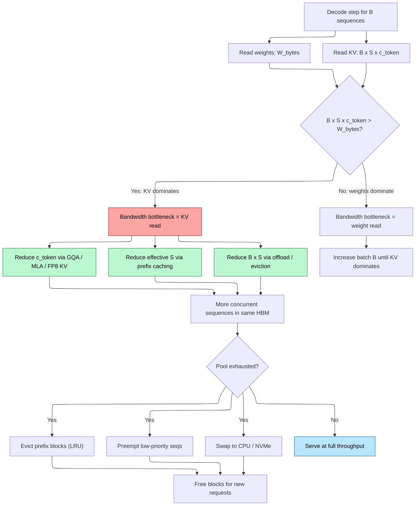

# KV Cache — Memory Layout, PagedAttention, and Offloading

> **Layer:** L8.
> **Prerequisites:** [Attention_Mechanisms](../L6_Algorithms_and_Models/02_Attention_Mechanisms.md), [Memory_Hierarchy_and_Roofline](../L3_Microarchitecture/03_Memory_Hierarchy_and_Roofline.md).
> **Hands off to:** [Modern_KV_Compression](02_Modern_KV_Compression.md), [Batching_and_Scheduling](03_Batching_and_Scheduling.md), [Storage_and_Model_Loading](../L4_Systems_and_Interconnects/03_Storage_and_Model_Loading.md).

---

## 0. Why This Page Exists

The KV cache is the single largest determinant of inference throughput economics. At decode time, every generated token requires reading the full cache back from HBM. The cache grows linearly with sequence length, batch size, and model depth, and it easily exceeds the weight footprint at production batch sizes. Understanding its layout, paging, sharing, and offload strategies is the prerequisite for reasoning about any serving system.

This page covers: the physical memory layout of the cache (per-layer, per-head, per-token), the memory math for every attention variant (MHA, MQA, GQA, MLA), PagedAttention and its virtual-memory analogy, prefix caching via hash chains and radix trees, KV cache offloading to CPU/disk tiers, and KV transfer between GPUs in disaggregated serving. Concrete worked examples ground every formula.

### Invariants

| Symbol | Meaning | Typical range |
|--------|---------|---------------|
| $B$ | Batch size (concurrent sequences) | 1 -- 4096 |
| $S$ | Sequence length (tokens) | 1 -- 128K+ |
| $n_l$ | Transformer layers | 32 -- 126 |
| $H$ | Number of query heads | 32 -- 128 |
| $n_{\text{kv}}$ | Number of KV heads ($H$ for MHA, $G$ for GQA, $1$ for MQA) | 1 -- 128 |
| $d_h$ | Head dimension | 64 -- 256 |
| $r$ | MLA latent dimension | 512 -- 1536 |
| $b$ | Bytes per element | 1 (FP8) or 2 (FP16/BF16) |

---

## 1. Why the KV Cache Exists

In autoregressive decoding, each new token attends to all previous tokens' keys and values. Without caching, every decode step recomputes $K$ and $V$ for the entire prefix from scratch, doing $O(S^2 d_h)$ work per step. The KV cache stores every layer's $K$ and $V$ activations for all positions seen so far. Each decode step then:

1. Computes $Q$, $K$, $V$ only for the **new** token (one row each).
2. Appends the new $K$, $V$ row to the cache.
3. Runs attention: $Q \cdot K_{\text{cache}}^T$, then $\text{softmax}(\cdot) \cdot V_{\text{cache}}$.

This reduces per-step work from $O(S^2 d_h)$ to $O(S d_h)$, a quadratic-to-linear improvement. The cost: the bottleneck shifts from compute to **memory bandwidth** (the entire cache is re-read every token) and **memory capacity** (the cache must reside in HBM during decode).

### The capacity--bandwidth double bind

Decode is memory-bound with arithmetic intensity $I = 2/b$ FLOP/B ([Memory_Hierarchy_and_Roofline](../L3_Microarchitecture/03_Memory_Hierarchy_and_Roofline.md) Section 3.2). For FP16: $I = 1$ FLOP/B, vs the H100 ridge point of 295. The decode kernel runs at $< 0.5\%$ of peak FLOPS. Every byte of KV cache moved is a byte of HBM bandwidth consumed. Reducing KV size improves both capacity (more concurrent requests) and bandwidth (faster per-token decode).

---

## 2. KV Cache Size — Complete Derivation

### 2.1 General formula

For a transformer with $n_l$ layers, $n_{\text{kv}}$ KV heads per layer, head dimension $d_h$, and element size $b$ bytes, the per-token KV cache cost is:

$$\boxed{c_{\text{token}} = 2 \cdot n_l \cdot n_{\text{kv}} \cdot d_h \cdot b \quad \text{bytes/token}}$$

The factor of 2 accounts for separate $K$ and $V$ tensors. For $B$ concurrent sequences of length $S$:

$$C_{\text{total}} = B \cdot S \cdot c_{\text{token}}$$

### 2.2 MHA (Multi-Head Attention)

$n_{\text{kv}} = H$. Every head has independent $K$ and $V$.

**Example — Llama-2 70B:** $n_l = 80$, $H = 64$, $d_h = 128$, $b = 2$:

$$c_{\text{MHA}} = 2 \times 80 \times 64 \times 128 \times 2 = 2{,}621{,}440 \text{ B} \approx 2.5 \text{ MB/token}$$

At $S = 4096$, $B = 1$: $\approx 10$ GB per request. At $S = 128K$: $\approx 320$ GB, exceeding an H100's 80 GB.

### 2.3 MQA (Multi-Query Attention)

$n_{\text{kv}} = 1$. All query heads share a single $K$ and $V$. The factor $H$ disappears from the formula:

$$c_{\text{MQA}} = 2 \cdot n_l \cdot d_h \cdot b$$

**Same 70B-class model:** $2 \times 80 \times 128 \times 2 = 40{,}960$ B $\approx 40$ KB/token. $H = 64\times$ reduction vs MHA. Quality degradation limits adoption to code-generation and short-context models (PaLM, Falcon, StarCoder).

### 2.4 GQA (Grouped-Query Attention)

$n_{\text{kv}} = G$, where $G < H$. Each group of $H/G$ query heads shares one KV pair.

$$c_{\text{GQA}} = 2 \cdot n_l \cdot G \cdot d_h \cdot b$$

**Example — Llama-3 70B:** $n_l = 80$, $G = 8$, $d_h = 128$, $b = 2$:

$$c_{\text{GQA}} = 2 \times 80 \times 8 \times 128 \times 2 = 327{,}680 \text{ B} \approx 320 \text{ KB/token}$$

$8\times$ reduction vs MHA with $H = 64$. Near-parity quality. The default in production models since 2024.

### 2.5 MLA (Multi-Head Latent Attention)

MLA stores a single compressed latent $\mathbf{c}_{KV} \in \mathbb{R}^r$ per token per layer, plus a small decoupled RoPE key of dimension $d_{\text{rope}}$. Full $K$ and $V$ are reconstructed at attention time via up-projection. Since one latent encodes both $K$ and $V$, the factor of 2 disappears:

$$\boxed{c_{\text{MLA}} = n_l \cdot (r + d_{\text{rope}}) \cdot b \quad \text{bytes/token}}$$

**Example — DeepSeek-V3:** $n_l = 61$, $r = 512$, $d_{\text{rope}} = 64$, $b = 2$:

$$c_{\text{MLA}} = 61 \times (512 + 64) \times 2 = 70{,}144 \text{ B} \approx 68 \text{ KB/token}$$

Compare hypothetical MHA with $H = 128$: $2 \times 61 \times 128 \times 128 \times 2 = 4{,}005{,}376$ B $\approx 3.8$ MB/token. MLA achieves $\approx 57\times$ compression.

### 2.6 Memory wall quick estimate

Given total GPU memory $M$, weight footprint $W$, and per-token cost $c$: $\text{Max tokens} = (M - W - \text{overhead}) / c$.

**Llama-3 70B on 2x H100 (160 GB total):** with FP16 weights (140 GB), KV budget is ~15 GB for ~47K tokens across batch. With FP8 weights (70 GB), KV budget jumps to ~85 GB for ~270K tokens. Weight quantization is a throughput multiplier because it frees HBM for KV cache.

---

## 3. Memory Layout

### 3.1 Naive contiguous layout

```text
kv_cache[layer][k_or_v][batch][head][seq][d_head]
shape: (n_l, 2, B, n_kv, S_max, d_h)
```

Pre-allocate the maximum sequence length for every slot. Wastes memory proportional to the gap between $S_{\max}$ and actual sequence lengths. Cannot easily grow, shrink, evict, or share.

Used by HuggingFace Transformers' default `past_key_values`. Acceptable for single-request offline inference; catastrophic for multi-tenant serving.

### 3.2 Per-layer, per-head physical organization

Within a single layer, the cache for one head of one sequence is a matrix:

$$K \in \mathbb{R}^{S \times d_h}, \quad V \in \mathbb{R}^{S \times d_h}$$

Row $i$ holds the $K$ (or $V$) vector for token position $i$. At decode, the query $q \in \mathbb{R}^{d_h}$ is multiplied against every row of $K$. The **row-major** layout means this is a sequential scan over $S \cdot d_h \cdot b$ bytes — a pure HBM bandwidth operation.

For GQA with group size $H/G$, the same $K$ and $V$ rows are read by $H/G$ different query heads. Production kernels (FlashAttention v2/v3 with `num_kv_heads`) handle this via broadcasting or gathered reads rather than physical replication, saving $(H/G - 1)$-fold bandwidth on the KV side.

### 3.3 Bandwidth crossover: KV vs weights

At decode, each step reads:
- Weights: $W_{\text{bytes}}$ (model parameters, once per step).
- KV cache: $B \cdot S \cdot c_{\text{token}}$ (every token of every sequence).

KV reads dominate when:

$$B \cdot S \cdot c_{\text{token}} > W_{\text{bytes}}$$

For Llama-3 70B FP16 ($W = 140$ GB, $c = 320$ KB):

$$B \cdot S > \frac{140 \times 10^9}{320{,}000} \approx 437{,}500$$

At $S = 4096$: $B > 107$. At $S = 8192$: $B > 53$. Production batches of 64--256 at moderate context easily cross this threshold. **At production serving scales, KV bandwidth dominates decode.**

---

## 4. PagedAttention

### 4.1 The fragmentation problem

With contiguous allocation, sequences of different lengths waste memory through:
- **Internal fragmentation**: the gap between allocated $S_{\max}$ and actual $S$.
- **External fragmentation**: freed slots leave holes that may not fit new requests.
- **Growth impossibility**: a sequence cannot grow beyond its pre-allocated slot.

At 64+ concurrent requests with varying context lengths, 30--60% of HBM is wasted on padding.

### 4.2 Block-based allocation

PagedAttention (Kwon et al., SOSP 2023) divides the KV cache into fixed-size **blocks** (pages), analogous to OS virtual memory:

$$\text{block\_size} = B_s \text{ tokens (typically 16)}$$

Each block holds $B_s$ tokens' worth of $K$ and $V$ for all layers and heads:

$$\text{block\_bytes} = B_s \cdot 2 \cdot n_l \cdot n_{\text{kv}} \cdot d_h \cdot b$$

For Llama-3 70B with $B_s = 16$: $16 \times 327{,}680 = 5.24$ MB per block.

A global **block pool** holds all physical blocks. Each sequence maintains a **block table** mapping logical block indices to physical block IDs:

```text
Sequence "Hello world, how are" (18 tokens, block_size=16):

  Logical:   [ Block 0 ]   [ Block 1         ]
  Tokens:    [ 0..15   ]   [ 16..17, pad..15 ]
  Physical:  [ Block #42 ] [ Block #781      ]

  block_table = [42, 781]
```

#### Block allocation during prefill

On prefill, the sequence's tokens are processed in order. The allocator assigns physical blocks greedily as the sequence grows:

1. **Chunk arrives**: the scheduler computes how many new logical blocks the chunk spans: $n_{\text{new}} = \lceil (S_{\text{chunk}} + S_{\text{prev}}) / B_s \rceil - \lceil S_{\text{prev}} / B_s \rceil$.
2. **Allocate**: pop $n_{\text{new}}$ physical block IDs from the free list. Append them to the sequence's block table.
3. **Write**: the GPU kernel scatters $K$, $V$ vectors into the allocated physical blocks via the slot mapping (physical_block $\times B_s$ + offset).
4. **Repeat**: the next chunk reuses already-allocated blocks and allocates new ones only for positions that spill into new logical blocks.

If the free list is exhausted mid-prefill, the scheduler either (a) triggers preemption of a lower-priority sequence to reclaim blocks, or (b) splits the prefill into a smaller chunk that fits within the remaining blocks.

#### Copy-on-write for forked sequences

When a sequence is **forked** (parallel generation from the same prefix, as in beam search or multi-sample generation), the forked sequences initially share all prefix blocks:

```text
Original sequence:  block_table = [42, 107, 203, ...]
Forked sequence:    block_table = [42, 107, 203, ...]  (same physical blocks)

At fork time: refcount on blocks 42, 107, 203 incremented.
```

Both sequences share the prefix KV data without copying. When either sequence writes a new token that lands in a fresh block, that block is exclusively owned (refcount = 1). Crucially, KV blocks are **append-only**: once a block's $B_s$ slots are filled, its content is never modified. This means copy-on-write never actually triggers a copy -- the "write" always goes to a newly allocated block, not a shared one. The COW mechanism exists for correctness guarantees but the append-only invariant makes it a no-op in practice.

When a sequence finishes and its block table is released, each block's reference count is decremented. Blocks reaching refcount = 0 return to the free list. Shared prefix blocks persist as long as at least one sequence references them, and can additionally be retained by the prefix cache (hash table entry).

#### Block freeing on sequence completion

When a sequence produces EOS or hits `max_tokens`:

1. Walk the block table from end to start.
2. For each block: decrement reference count. If refcount reaches 0 **and** the block has no prefix-cache hash entry, return it to the free list immediately.
3. If refcount reaches 0 but the block **does** have a prefix-cache hash entry, leave it in the cache. It will be evicted by the LRU policy when memory pressure demands it.

This ensures that prefix-cached blocks survive individual request lifetimes, enabling reuse by subsequent requests.

### 4.3 Virtual memory analogy (detailed)

| OS Virtual Memory | PagedAttention |
|-------------------|----------------|
| Virtual address space | Logical token positions $[0, S-1]$ |
| Physical pages | Physical KV blocks in pre-allocated GPU tensor |
| Page table (`cr3` register, per-process) | Block table (per-sequence `List[int]`) |
| Page fault (demand paging) | Block allocation on first write to a new logical block |
| Shared memory (`mmap`, refcounted pages) | Prefix sharing (refcounted physical blocks) |
| Copy-on-write after `fork()` | Copy-on-write for forked sequences (beam search) |
| Swap to disk | Swap to CPU RAM / NVMe |
| TLB (translation lookaside buffer) | Slot mapping cache (computed per-step, not cached) |
| Page size (4 KB typical) | Block size (16 tokens typical) |
| Overcommit (allocate more virtual than physical) | Admission control limits logical blocks to physical pool size |

The mapping from logical to physical is: logical block $j$ $\to$ `block_table[j]` $\to$ physical block ID. Given a token at position $p$:

$$\text{logical\_block} = \lfloor p / B_s \rfloor, \quad \text{offset} = p \bmod B_s, \quad \text{physical\_block} = \text{block\_table}[\text{logical\_block}]$$

The physical address in the KV tensor is: `kv_cache[layer][k_or_v][physical_block][offset][head][d]`. This is a two-level indirection: sequence $\to$ block table $\to$ physical tensor. The slot mapping pre-computes this into a flat array for the GPU kernel, avoiding per-token block-table lookups in the hot loop.

### 4.4 Fragmentation elimination

- **Internal fragmentation**: at most $B_s - 1$ tokens wasted per sequence (the partial last block). With $B_s = 16$ and per-token cost of 320 KB, max waste = 5 MB per sequence, negligible vs GB-scale total.
- **External fragmentation**: eliminated entirely. Freed blocks return to the global pool and can be reused by any sequence.
- **No pre-allocation**: sequences grow on demand. The system's only constraint is total pool size.

### 4.5 Block size tradeoff

Block size 16 (vLLM default) is the sweet spot: indirection cost < 5% vs contiguous (one integer lookup per 16 tokens), internal waste $\leq 6\%$ in the worst case. Smaller blocks (1--8) increase indirection; larger blocks (64--256) increase waste and reduce prefix-sharing granularity.

### 4.6 PagedAttention kernel sketch

```text
def paged_attention_decode(q, K_pool, V_pool, block_table, num_valid_in_last):
    """Decode-step attention via block-table indirection."""
    # q: (n_kv, d_h) -- query for the new token, possibly gathered for GQA
    O = zeros(d_h)
    m = -inf          # running max for online softmax
    ell = 0.0         # running sum for online softmax

    for logical in range(len(block_table)):
        phys = block_table[logical]
        K_blk = K_pool[phys]    # (block_size, n_kv, d_h)
        V_blk = V_pool[phys]

        # Compute attention scores for this block
        s = q @ K_blk.T / sqrt(d_h)   # (n_kv, block_size)

        # Mask invalid positions in the last block
        if logical == len(block_table) - 1:
            s[:, num_valid_in_last:] = -inf

        # Online softmax update (FlashAttention-style)
        m_new = max(m, s.max())
        alpha = exp(m - m_new)
        p = exp(s - m_new)
        ell = alpha * ell + p.sum()
        O = alpha * O + p @ V_blk
        m = m_new

    return O / ell
```

The block table lookup adds one integer read per logical block. With $B_s = 16$, that is one extra read per 16 tokens -- negligible compared to loading $16 \times d_h$ floats for the $K$ and $V$ data.

---

## 5. Prefix Caching

### 5.1 Motivation

Many production requests share common prefixes:

- **System prompts**: identical across all users of an application (hundreds to thousands of tokens).
- **Few-shot templates**: shared examples prepended to every query.
- **RAG documents**: the same retrieved chunk appears in multiple requests.
- **Multi-turn chat**: every new turn re-includes the entire conversation history.

Without caching, each request recomputes (prefills) the full prefix, wasting both compute and the time to first token (TTFT). With prefix caching, the KV cache of previously seen prefixes is stored and reused.

### 5.2 Hash-chain block sharing (vLLM, TRT-LLM)

Each block is identified by a hash computed over its content:

$$h_i = \text{Hash}(h_{i-1},\ \text{token\_ids}[i \cdot B_s : (i+1) \cdot B_s])$$

where $h_{-1} = 0$ (null hash for the root). This creates a hash chain that encodes both the block's content and its position in the prefix. The hash must also include the KV dtype to prevent cross-dtype collisions (e.g., an FP16-cached block matching an FP8 request).

**Matching algorithm:**

1. When a new request arrives, compute block hashes for its prompt greedily from position 0.
2. For each hash, probe the global hash table (a Python `dict` or equivalent). If a match is found:
   - Increment the physical block's reference count.
   - Add the physical block ID to the new sequence's block table (no KV data copied).
   - Move to the next block.
3. On first mismatch, stop. All subsequent blocks must be computed via prefill.
4. Prefill only the **suffix** -- the unmatched portion. The prefix KV is shared read-only.

**Cache hit detection during prefill.** The matching proceeds layer by layer in the hash chain. Because each hash $h_j$ depends on $h_{j-1}$, a match at block $j$ implies matches at blocks $0, 1, \ldots, j-1$. The first mismatch terminates the search -- there is no non-contiguous matching. The prefix match length is therefore always $j \cdot B_s$ tokens (block-aligned). This is a limitation: a prompt that shares 100 tokens of prefix but diverges at token 101 will only match $96$ tokens with $B_s = 16$ (the last 4 tokens of the matching block are different, so the entire block misses).

Reference-counted blocks are freed only when no active sequence references them. Eviction policies (LRU) apply to unreferenced blocks that still have hash entries.

**Eviction policy.** When the free list is exhausted and new blocks are needed:
1. Identify all unreferenced cached blocks (refcount = 0, hash entry exists).
2. Sort by last-access time (LRU). Evict the oldest first.
3. Remove the hash entry, return the physical block to the free list.
4. The evicted prefix can be recomputed on demand if a future request needs it.

This is a global LRU across all sequences' unreferenced cached blocks. The LRU ordering is maintained via a doubly-linked list updated on every cache hit (move-to-front). The overhead is $O(1)$ per eviction/insertion.

### 5.3 Radix tree (SGLang RadixAttention)

A radix tree (compact trie) indexes the cache by token sequence. Each node represents a token subsequence of arbitrary length (not necessarily block-aligned) and owns the corresponding KV blocks.

```text
Radix tree for prompts ["The cat sat", "The cat ran", "The dog sat"]:

          root
           |
         "The"     (node, owns KV for tokens 0-2)
        /     \
     "cat"   "dog" (nodes, own KV for tokens 3-5)
     /   \
  "sat" "ran"      (leaf nodes, own KV for tokens 6-8)
```

**Indexing and lookup.** The radix tree indexes KV blocks by their prefix hash at token granularity:

1. **Insert**: After prefill, each node's token subsequence is mapped to the physical KV blocks it occupies. The node stores: `(token_ids, physical_block_ids, refcount)`.
2. **Lookup on prefill**: When a new request arrives, traverse the tree from the root, matching tokens one by one:
   - At each node, compare the incoming tokens against the node's stored token sequence.
   - If full match, move to the matching child and continue.
   - If partial match (prefix of the node matches), the node is split: the common prefix becomes a new internal node, the remainder stays as a child. The new request follows the matching branch.
   - If no child matches, this is the cache miss point. All matched nodes contribute shared KV blocks.
3. **Match result**: The prefix match length can be at any token position, not just at block boundaries. This enables sub-block sharing -- the radix tree can save 3 tokens of a 16-token block that would be a complete miss under hash-chain.

**Eviction.** The radix tree supports LRU eviction of leaf nodes (or any node with refcount = 0). When a node is evicted, it is removed from the tree and its physical blocks are freed. If a parent node has only one remaining child after eviction, the parent and child are merged (radix tree compaction). The LRU is tracked via access timestamps on each node, with the same $O(1)$ move-to-front on cache hit.

**Advantages over hash-chain:**
- **Sub-block matching**: the radix tree can match at any node boundary, not just fixed-size block boundaries. A prompt sharing 100 tokens of prefix with an existing entry matches all 100 tokens; hash-chain matches only 96 ($6 \times 16$).
- **Automatic common-prefix detection**: no explicit hash computation; the trie structure makes shared prefixes structural.
- **Excellent for multi-turn chat**: each turn extends an existing path in the tree, so the entire history is a cache hit. The tree grows naturally with the conversation.
- **Branching support**: agentic workflows where multiple tool calls diverge from a shared system prompt create a branching structure in the tree, all sharing the common prefix KV.

Overhead: tree traversal is $O(S / B_s)$ node comparisons plus memory allocation for new nodes. In practice the cost is negligible ($< 0.01$ ms) compared to prefill time ($> 10$ ms).

### 5.4 Hit rates and throughput impact

Production hit rates from deployed systems: long system prompts save 80--95% of prompt bytes; multi-turn chat saves 50--90% on turn 2+; RAG with shared documents saves 10--60% depending on corpus overlap. Prefix caching is essentially free given paged allocation (blocks are already reference-counted). Every modern serving stack ships it as default.

---

## 6. KV Cache Offloading

When HBM is exhausted, frameworks spill KV blocks to slower tiers. The fundamental tradeoff: every offloaded byte must be transferred back when the sequence becomes active again.

### 6.1 Tier hierarchy

```text
Tier 0: GPU HBM      ~3.0--8.0 TB/s   ~80--192 GB     [hot: active sequences]
Tier 1: CPU DRAM     ~0.05-0.2 TB/s   ~256--2000 GB   [warm: idle sequences, prefix pool]
Tier 2: NVMe SSD     ~0.01-0.03 TB/s  ~2000--30000 GB [cold: long prefixes, RAG corpus]
Tier 3: Remote GPU   ~0.1--0.9 TB/s   ~cluster-wide   [disaggregated pool]
```

Bandwidth ratios: HBM is 20--100x faster than CPU DRAM, which is 2--10x faster than NVMe. Every tier-crossing adds latency proportional to the bytes moved divided by the tier bandwidth.

### 6.2 CPU offload (swap)

When the block pool is exhausted, the scheduler selects a victim sequence and copies its blocks to CPU DRAM via PCIe Gen5 (~64 GB/s per GPU). The freed blocks are returned to the pool.

On rescheduling:
- **Swap-in**: DMA the blocks back from CPU to GPU. For a 70B GQA sequence at $S = 8192$: $8192 \times 320$ KB = 2.5 GB. At 64 GB/s: ~39 ms transfer time.
- **Recompute**: discard the KV entirely and re-prefill from the saved token IDs. For $S = 8192$: prefill takes ~50 ms on H100. Recompute avoids PCIe transfer but burns FLOPS.

**Decision heuristic**: swap short sequences (small transfer), recompute long sequences (transfer cost exceeds prefill cost).

### 6.3 Worked example: 70B model offloading analysis

**Scenario.** A 70B model with GQA ($n_l=80$, $n_{\text{kv}}=8$, $d_h=128$, $b=2$ for FP16 KV) serves 100 concurrent requests at average context length 4096 tokens on a single H100 (80 GB HBM).

**Step 1: Total KV cache size.**

Per-token KV: $c = 2 \times 80 \times 8 \times 128 \times 2 = 327{,}680$ B = 320 KB.

Total KV: $100 \times 4096 \times 320{,}000 = 131{,}072{,}000{,}000$ B $\approx 122$ GB.

**Step 2: HBM capacity for KV.**

Model weights (FP8): 70 GB. Activation overhead: ~5 GB. Available for KV: $80 - 70 - 5 = 5$ GB.

FP8 KV per-token: 160 KB. FP8 KV for 100 requests at 4096: $100 \times 4096 \times 160{,}000 = 65{,}536{,}000{,}000$ B $\approx 61$ GB.

Even with FP8 KV, 61 GB exceeds the 5 GB budget. Only $\lfloor 5 \times 10^9 / (4096 \times 160{,}000) \rfloor \approx 7$ concurrent 4K-context sequences fit in HBM.

**Step 3: CPU RAM offload requirement.**

To serve 100 concurrent requests, we need $61 - 5 = 56$ GB of offloaded KV in CPU DRAM. With typical server configurations of 256--512 GB DDR5, this is feasible. The 5 GB of HBM holds the ~7 most active sequences; the remaining ~93 sequences have their KV in CPU DRAM.

**Step 4: Swap-in latency cost.**

When an offloaded sequence becomes active, its KV must be transferred from CPU to GPU:

$$t_{\text{swap-in}} = \frac{4096 \times 160{,}000}{64 \times 10^9} = \frac{655{,}360{,}000}{64 \times 10^9} \approx 10.2 \text{ ms}$$

This 10.2 ms is added to the first decode step's latency after rescheduling. Compared to the baseline decode step time of ~42 ms, this is a 24% increase. For the 93 sequences that are offloaded, each context switch incurs this penalty.

**Round-trip PCIe time** (swap-out + swap-in for preemption/re-admission): $2 \times 10.2 = 20.4$ ms.

**PCIe bandwidth saturation.** If multiple sequences are swapped simultaneously, the 64 GB/s bandwidth is shared. Two concurrent swaps of 4K-context sequences: $2 \times 655$ MB / 64 GB/s $\approx 20.4$ ms each. Four concurrent: $\approx 41$ ms. This is why production systems limit concurrent swap operations to 2--4 and queue the rest.

**Step 5: Comparison with recompute.**

Recompute cost for a 4096-token prompt: $2 \times 70 \times 10^9 \times 4096 = 573$ TFLOP. On H100 at 50% utilization: $573 / 495 \approx 1158$ ms. This is $114\times$ slower than swap-in (10.2 ms).

But with prefix caching: if 75% of the prompt is cached (3072 tokens), recompute only needs the 1024-token suffix: $2 \times 70 \times 10^9 \times 1024 = 143$ TFLOP, taking $\approx 289$ ms. Still much slower than swap.

**Conclusion for this scenario**: with 100 concurrent 4K-context requests and only 5 GB of HBM for KV, the system must aggressively offload. CPU swap is the primary mechanism because recompute is prohibitively expensive. The practical approach is to keep the 7 most active sequences in HBM and swap the rest, accepting 10 ms of swap-in latency when rescheduling. Alternatively, use 4 GPUs with TP=4 to increase the KV budget to $4 \times 5 = 20$ GB, serving $\sim 31$ sequences in HBM with the rest offloaded -- a more manageable ratio.

### 6.4 NVMe offload

For cold prefixes (long system prompts, RAG document caches), NVMe provides cheap capacity at 2--30 TB per node. A multi-tenant chat service with 1000 unique 4K-token system prompts needs $\sim 1.25$ TB of KV -- too large for GPU HBM or CPU DRAM on a single node. Store on NVMe; load on demand. At 15 GB/s, a 1.25 GB prefix loads in ~83 ms: acceptable for TTFT, not for mid-generation swap-in.

### 6.5 NIXL (NVIDIA Inference Xfer Library)

NIXL abstracts KV movement across all tiers with a unified non-blocking API. It handles GPU-to-GPU (NVLink, IB/RoCE RDMA), GPU-to-CPU (PCIe DMA), and GPU-to-NVMe (GPUDirect Storage), overlapping transfers with computation. See [Networking_and_Interconnect](../L4_Systems_and_Interconnects/01_Networking_and_Interconnect.md) for transport-layer details.

### 6.6 KV Cache Quantization

Offloading moves KV data to slower tiers; quantization shrinks it before it ever leaves the GPU, attacking capacity and bandwidth simultaneously. For arbitrary bit width $b_{\text{kv}}$ (bits per element):

$$c_{\text{quantized}} = 2 \cdot n_l \cdot n_{\text{kv}} \cdot d_h \cdot \lceil b_{\text{kv}} / 8 \rceil$$

Representative point: FP8 E4M3 halves Llama-3 70B GQA per-token cost from 320 KB to 160 KB at $< 0.1\%$ perplexity loss — calibration-free, and the default in vLLM/TensorRT-LLM/SGLang for 2025+ serving.

> Full treatment — FP8 vs INT8 vs INT4/KIVI formats, the per-format compression table, granularity and calibration choices, mixed-precision recency policies, and PagedAttention per-block scale metadata — lives in [Modern_KV_Compression](02_Modern_KV_Compression.md) §3.

### 6.7 When offloading helps vs hurts

Offload **cold** data (high hit rate, low urgency): prefix pools, idle sequences, RAG document caches. Never offload **hot** data (active decode sequences) -- the transfer latency stalls every decode step. Production systems (vLLM, Dynamo) use priority-based scheduling: high-priority sequences stay in HBM; low-priority sequences are preempted and swapped.

---

## 7. KV Cache Transfer Between GPUs

### 7.1 Prefill-decode disaggregation

In disaggregated serving ([Prefill_Decode_Disaggregation](05_Prefill_Decode_Disaggregation.md)), the prefill GPU computes the full KV cache for the prompt and must transfer it to the decode GPU. This is a multi-GB transfer per request that must complete before decode can begin.

### 7.2 Transfer mechanisms

| Path | Bandwidth | Latency for 1.25 GB KV (70B, S=4K) |
|------|-----------|--------------------------------------|
| NVLink P2P (intra-node) | ~900 GB/s | ~1.4 ms |
| PCIe P2P (intra-node) | ~64 GB/s | ~20 ms |
| IB/RoCE RDMA (inter-node) | ~50--400 GB/s per NIC | 3--25 ms |
| Ethernet (TCP fallback) | ~10--25 GB/s | 50--125 ms |

NVLink is fast enough that KV transfer is negligible vs prefill time (~50 ms for S=4K on H100). Even RDMA at 200 GB/s effective moves 1.25 GB in ~6 ms.

### 7.3 KV block serialization for transfer

In disaggregated serving, KV blocks must be serialized at the prefill worker and deserialized at the decode worker. The serialization format is optimized for zero-copy where possible:

**Serialization at prefill worker:**

1. **Block identification**: for each block in the sequence's block table, record `(logical_block_id, physical_block_id, num_valid_tokens)`.
2. **Data extraction**: for each layer $l$, extract the KV tensor slice: `kv_cache[l][k_or_v][physical_block_id][:num_valid]`, yielding a tensor of shape `(num_valid, n_kv / TP, d_h)` per KV type per layer.
3. **Packing**: concatenate the per-layer tensors into a contiguous buffer. The buffer layout is `[layer_0_K, layer_0_V, layer_1_K, layer_1_V, ..., layer_{L-1}_K, layer_{L-1}_V]`. Each segment has a fixed size for full blocks and a variable size for the final partial block.
4. **Metadata**: a header block containing `(request_id, sequence_length, num_blocks, dtype, [block_sizes])` precedes the data.

Total serialization overhead: one GPU memcpy per layer per block to pack into the contiguous buffer. On H100, memcpy bandwidth is ~3.35 TB/s, so serializing 1.25 GB takes ~0.4 ms -- negligible.

**RDMA write transfer:**

1. The prefill worker **registers** the serialized buffer's GPU memory with the NIC via GPUDirect RDMA (e.g., `ibv_reg_mr` on the GPU buffer). This pins the memory for DMA.
2. The decode worker **pre-allocates** a matching buffer in its GPU memory and registers it as an RDMA receive region.
3. The prefill worker issues an **RDMA write** directly from GPU memory to the decode worker's GPU memory: `GPU_P -> NIC_P -> fabric -> NIC_D -> GPU_D`. No CPU involvement. No intermediate copies.
4. A completion queue entry signals transfer done. The decode worker is notified via polling or event.

**Bandwidth requirements for real-time transfer.** The transfer must complete within the TTFT budget. For the 70B model at $S = 4096$ with a TTFT target of 200 ms:

- KV payload: 1.25 GB (FP16) or 625 MB (FP8).
- Transfer budget: typically 10--50 ms of the TTFT (the rest is prefill compute).
- Minimum bandwidth: $1.25 \text{ GB} / 0.05 \text{ s} = 25$ GB/s. Any RDMA link (50+ GB/s) satisfies this comfortably.
- At $S = 32K$ (KV = 10 GB), the requirement rises to $10 \text{ GB} / 0.05 \text{ s} = 200$ GB/s. This requires NVLink or multi-port IB NDR, motivating layer pipelining to overlap transfer with compute.

**Deserialization at decode worker:**

1. Receive the contiguous buffer via RDMA.
2. Parse the metadata header to determine block layout.
3. **Allocate** physical blocks in the local block pool: pop `num_blocks` block IDs from the free list.
4. **Scatter** the per-layer KV data from the receive buffer into the local `kv_cache` tensor at the allocated physical block positions. This is the inverse of the serialization packing: `kv_cache[l][k_or_v][new_physical_id][:] = received_data[offset:offset+block_size]`.
5. Build the decode worker's block table mapping logical blocks to the newly allocated physical blocks.

The decode worker's physical block IDs differ from the prefill worker's -- the mapping is logical-block-index-based, not physical-block-ID-based. This abstraction is essential because the two workers have independent block pools.

### 7.4 Layer-pipelined transfer

The prefill GPU streams KV layers as they are computed rather than waiting for the full forward pass. The decode GPU begins attending to early layers while later layers are still in transit, overlapping transfer with prefill computation. Effective transfer overhead is near-zero for multi-layer models.

### 7.5 Cross-GPU KV sharing in tensor-parallel serving

When a model is split across multiple GPUs via tensor parallelism (TP), each GPU holds a slice of the KV cache for every layer. The attention kernel requires all-gather or reduce-scatter across the TP group for each attention head, but the **KV cache itself is not replicated** -- each GPU stores its partition ($n_{\text{kv}} / \text{TP}$ heads).

For MLA models with TP, the latent $\mathbf{c}_{KV}$ is split along the latent dimension $r$. Each GPU stores $r / \text{TP}$ elements, and the up-projection is done locally. This keeps MLA's bandwidth advantage intact under TP.

---

## 8. Eviction and Admission Control

### 8.1 Block pool exhaustion

When the free block count drops to zero, the scheduler must make room:

1. **Evict unreferenced prefix-cache blocks** (LRU). These can be recomputed on demand. Zero impact on active requests.
2. **Preempt the lowest-priority active sequence**: free its blocks. The sequence is either swapped to CPU or fully evicted (forcing recomputation when rescheduled).
3. **Reject new requests**: admission control refuses to schedule a new request whose KV requirement would push the pool below a safety margin.

### 8.2 Preemption policy (vLLM)

vLLM distinguishes new requests (preempted via recomputation -- cheap, no prior investment) from in-flight requests (preempted via swap -- preserves prefill compute at PCIe bandwidth cost). A minimum free-block watermark (5--10% of pool) absorbs sudden arrivals; breaching it triggers aggressive preemption of low-priority sequences.

---

## 9. End-to-End Cause and Effect



---

## 10. Numbers to Memorize

| # | Quantity | Value | Why |
|---|----------|-------|-----|
| 1 | Per-token KV, Llama-3 8B (GQA, FP16) | 131 KB | $2 \times 32 \times 8 \times 128 \times 2$ |
| 2 | Per-token KV, Llama-3 70B (GQA, FP16) | 320 KB | $2 \times 80 \times 8 \times 128 \times 2$ |
| 3 | Per-token KV, Llama-3 405B (GQA, FP16) | 516 KB | $2 \times 126 \times 8 \times 128 \times 2$ |
| 4 | Per-token KV, DeepSeek-V3 (MLA, FP16) | 68 KB | $61 \times 576 \times 2$ |
| 5 | MHA per-token KV, 70B-class (FP16) | 2.5 MB | $2 \times 80 \times 64 \times 128 \times 2$ |
| 6 | GQA reduction vs MHA (Llama-3 70B) | 8x | $H / G = 64 / 8$ |
| 7 | MLA reduction vs MHA (DeepSeek-V3) | ~57x | $2 H d_h / (r + d_{\text{rope}})$ |
| 8 | Block size (vLLM default) | 16 tokens | Balance of waste and overhead |
| 9 | Block size (Llama-3 70B, GQA, FP16) | 5.24 MB | $16 \times 327{,}680$ |
| 10 | Internal fragmentation (block=16) | $\leq$ 6.25% | $(B_s - 1) / B_s$ worst case |
| 11 | PagedAttention indirection overhead | < 5% | 1 int lookup per 16 tokens |
| 12 | HBM bandwidth (H100 SXM5) | 3.35 TB/s | Decode ceiling |
| 13 | PCIe Gen5 x16 bandwidth | ~64 GB/s | CPU swap bottleneck |
| 14 | NVLink P2P bandwidth | ~900 GB/s | Intra-node KV transfer |
| 15 | NVMe read bandwidth | ~10--25 GB/s | Cold prefix tier |
| 16 | KV budget, 2x H100, FP8 weights | ~85 GB | $160 - 70 - 5$ |
| 17 | Max tokens, Llama-3 70B, 2x H100 FP8 | ~270K | $85 \text{ GB} / 320 \text{ KB}$ |
| 18 | KV crossover B (70B FP16, S=4K) | ~107 | $W / (S \cdot c) = 140\text{G} / 1.3\text{G}$ |
| 19 | Prefix cache TTFT savings (system prompt) | 80--95% | Long shared prefix |
| 20 | 70B S=4K KV transfer via NVLink | ~1.4 ms | $1.25 \text{ GB} / 900 \text{ GB/s}$ |
| 21 | 70B S=4K KV transfer via RDMA 200 GB/s | ~6 ms | $1.25 \text{ GB} / 200 \text{ GB/s}$ |
| 22 | FP8 KV per-token (70B GQA) | 160 KB | $2 \times 80 \times 8 \times 128 \times 1$ |
| 23 | INT4 KV per-token (70B GQA) | 80 KB | $c_{\text{FP16}} / 4$ |
| 24 | FP8 KV quality impact | $< 0.1\%$ ppl | E4M3, calibration-free |
| 25 | CPU swap-in time, 2.5 GB via PCIe | ~39 ms | $2.5 \text{ GB} / 64 \text{ GB/s}$ |

---

## 11. Worked Problems

### Problem 1: Concurrent Request Capacity

**Q:** An H100 (80 GB HBM) serves Llama-3 70B (GQA: $n_l=80$, $n_{\text{kv}}=8$, $d_h=128$) with 40 GB reserved for FP16 weights and 5 GB overhead. Average context length is 4K tokens, FP16 KV. How many concurrent requests fit?

**A:**

Per-token cost: $c = 2 \times 80 \times 8 \times 128 \times 2 = 327{,}680$ B = 320 KB.

Per request: $320 \text{ KB} \times 4096 = 1{,}310{,}720$ KB $\approx 1.25$ GB.

KV budget: $80 - 40 - 5 = 35$ GB.

Concurrent requests: $\lfloor 35 / 1.25 \rfloor = 28$.

If we quantize the KV to FP8: per-token cost halves to 160 KB, per-request to 625 MB. Concurrent requests: $\lfloor 35 / 0.625 \rfloor = 56$. A 2x improvement from KV quantization alone.

### Problem 2: MLA vs GQA Capacity at Long Context

**Q:** Compare DeepSeek-V3 (MLA: $n_l=61$, $r=512$, $d_{\text{rope}}=64$) against a hypothetical GQA version ($n_l=61$, $n_{\text{kv}}=8$, $d_h=128$) at $S=64K$ context, FP16, on an 80 GB GPU with 40 GB available for KV.

**A:**

MLA per-token: $61 \times (512+64) \times 2 = 70{,}144$ B $\approx 68$ KB. Per request: $68 \text{ KB} \times 65{,}536 = 4.36$ GB.

GQA per-token: $2 \times 61 \times 8 \times 128 \times 2 = 250{,}624$ B $\approx 245$ KB. Per request: $245 \text{ KB} \times 65{,}536 = 15.67$ GB.

MLA serves $\lfloor 40 / 4.36 \rfloor = 9$ concurrent 64K-context requests. GQA serves $\lfloor 40 / 15.67 \rfloor = 2$. MLA provides 4.5x higher concurrency at identical context length.

### Problem 3: PagedAttention Block Budget

**Q:** A server uses 2x H100 (160 GB) for Llama-3 70B with FP8 weights (70 GB) and 5 GB overhead. Block size is 16 tokens. How many KV blocks fit in the pool? How many 4K-token sequences can be served simultaneously?

**A:**

KV budget: $160 - 70 - 5 = 85$ GB.

Bytes per block: $16 \times 2 \times 80 \times 8 \times 128 \times 1 = 16 \times 163{,}840 = 2{,}621{,}440$ B $\approx 2.5$ MB (FP8 KV, $b=1$).

Total blocks: $85 \times 10^9 / 2{,}621{,}440 \approx 32{,}420$ blocks.

Blocks per 4K sequence: $\lceil 4096 / 16 \rceil = 256$ blocks.

Max concurrent sequences: $\lfloor 32{,}420 / 256 \rfloor = 126$.

Remaining blocks: $32{,}420 - 126 \times 256 = 164$ blocks (safety margin for partial blocks).

### Problem 4: Decode Bandwidth Budget

**Q:** Llama-3 70B FP16 (weights = 140 GB) runs decode on H100 (3.35 TB/s HBM bandwidth). With batch $B=64$ at average context $S=2048$, what fraction of HBM bandwidth goes to KV reads vs weight reads? What is the tokens-per-second estimate?

**A:**

Weight read per step: 140 GB.

KV read per step: $B \times S \times c_{\text{token}} = 64 \times 2048 \times 320{,}640$ B $\approx 64 \times 0.625$ GB $\approx 40$ GB.

Total bytes per step: $140 + 40 = 180$ GB.

KV fraction: $40 / 180 = 22.2\%$. Weight fraction: $77.8\%$.

At 3.35 TB/s: time per step = $180 \text{ GB} / 3350 \text{ GB/s} \approx 53.7$ ms.

Tokens per second per sequence: $1000 / 53.7 \approx 18.6$ tok/s.

Aggregate throughput: $64 \times 18.6 \approx 1{,}191$ tok/s.

Note: at $S=8192$ (KV = 160 GB, exceeding weights), the step time doubles to ~90 ms and throughput drops to ~711 tok/s. **KV cache size directly governs throughput at long context.**

### Problem 5: Prefix Caching Savings

**Q:** A chat application has a 2048-token system prompt shared by all users. Requests arrive with an average user message of 512 tokens. Without prefix caching, what is the prefill FLOPs per request? With prefix caching (full hit), what fraction of prefill FLOPs is saved? Model: Llama-3 70B ($N = 70 \times 10^9$ parameters).

**A:**

Prefill FLOPs = $2 N S$.

Without caching: $S = 2048 + 512 = 2560$. FLOPs = $2 \times 70 \times 10^9 \times 2560 = 358.4$ TFLOP.

With caching: only the 512-token suffix is prefilled. FLOPs = $2 \times 70 \times 10^9 \times 512 = 71.68$ TFLOP.

Savings: $(358.4 - 71.68) / 358.4 = 80\%$.

TTFT reduction is proportional: if the original TTFT was 60 ms, it drops to ~12 ms. At 1000 requests/second, this saves $1000 \times (0.060 - 0.012) = 48$ seconds of GPU compute per second, effectively freeing one GPU's worth of prefill capacity.

---

## 12. Common Pitfalls

- **Using $H$ instead of $n_{\text{kv}}$**: The most common error. For Llama-3 70B, $H = 64$ but $n_{\text{kv}} = 8$. Using $H$ overestimates KV by 8x.
- **Ignoring dtype mismatch**: Weights may be FP8 but KV stays FP16/BF16 unless explicitly configured. The KV bytes-per-element $b$ is determined by the KV cache dtype, not the weight dtype.
- **Forgetting the layer count**: A 405B model has 126 layers vs 8B's 32. Per-token KV scales linearly with $n_l$.
- **MLA factor-of-2 error**: MLA's formula has no factor of 2 (one latent encodes both K and V). Don't multiply by 2 for MLA.
- **Counting padding in block waste**: PagedAttention wastes at most $B_s - 1$ tokens per sequence, not per block. Only the last block can be partial.
- **Offloading active sequences**: Swapping a sequence's KV to CPU during active decode stalls every step by the swap-in latency (~40 ms for 2.5 GB). Only offload idle or preempted sequences.
- **Prefix cache hash without dtype**: Block hashes must include the KV dtype. A block cached in FP16 does not match the same tokens cached in FP8. Include dtype in the hash input.

---

## 13. References

1. Kwon, W. et al. (2023). "Efficient Memory Management for Large Language Model Serving with PagedAttention." *SOSP 2023*.
2. Zheng, L. et al. (2024). "SGLang: Efficient Execution of Structured Language Model Programs." *NeurIPS 2024* -- RadixAttention.
3. DeepSeek-AI (2024). "DeepSeek-V2: A Strong, Economical, and Efficient MoE Language Model." [arXiv:2405.04434](https://arxiv.org/abs/2405.04434).
4. DeepSeek-AI (2024). "DeepSeek-V3 Technical Report." [arXiv:2412.19437](https://arxiv.org/abs/2412.19437).
5. Ainslie, J. et al. (2023). "GQA: Training Generalized Multi-Query Transformer Models from Multi-Head Checkpoints." *EMNLP 2023*. [arXiv:2305.13245](https://arxiv.org/abs/2305.13245).
6. Shazeer, N. (2019). "Fast Transformer Decoding: One Write-Head is All You Need." [arXiv:1911.02150](https://arxiv.org/abs/1911.02150).
7. Yu, G.I. et al. (2022). "Orca: A Distributed Serving System for Transformer-Based Generative Models." *OSDI 2022* -- continuous batching.
8. Liu, Z. et al. (2024). "KIVI: A Tuning-Free Asymmetric 2bit Quantization for KV Cache." [arXiv:2402.02750](https://arxiv.org/abs/2402.02750).

---

## 14. Stack Links

**Up (deeper):**
- [Attention_Mechanisms](../L6_Algorithms_and_Models/02_Attention_Mechanisms.md) -- MHA, MQA, GQA, MLA derivations and online softmax proof
- [Memory_Hierarchy_and_Roofline](../L3_Microarchitecture/03_Memory_Hierarchy_and_Roofline.md) -- decode arithmetic intensity and bandwidth analysis
- [FlashAttention_Deep_Dive](../L5_Kernels_and_Programming/05_FlashAttention_Deep_Dive.md) -- tiled attention kernel that consumes the KV cache

**Down (higher level):**
- [Modern_KV_Compression](02_Modern_KV_Compression.md) -- FP8/INT4 KV, eviction, Quest, MoBA, SnapKV
- [Batching_and_Scheduling](03_Batching_and_Scheduling.md) -- continuous batching, prefill-decode interference, admission control
- [Storage_and_Model_Loading](../L4_Systems_and_Interconnects/03_Storage_and_Model_Loading.md) -- NVMe tiers, GPUDirect Storage, checkpoint formats

**Lateral:**
- [Prefill_Decode_Disaggregation](05_Prefill_Decode_Disaggregation.md) -- KV transfer between prefill and decode pools
- [Quantization](../L6_Algorithms_and_Models/05_Quantization.md) -- FP8/INT4 weight and KV quantization
- [Long_Context_Engineering](06_Long_Context_Engineering.md) -- ring attention, context parallelism, sparse attention at 1M+ tokens
