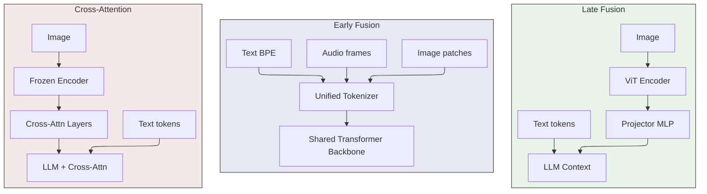
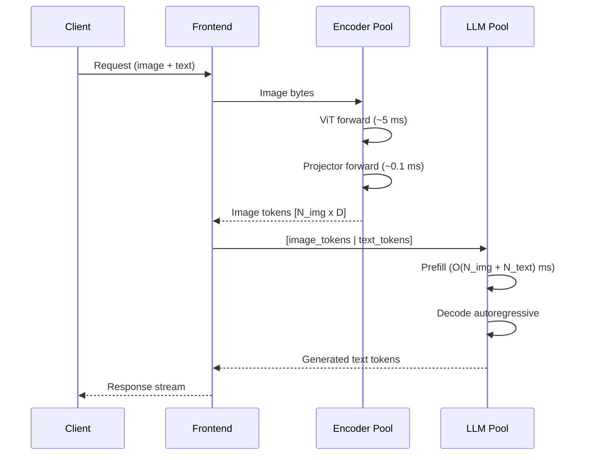
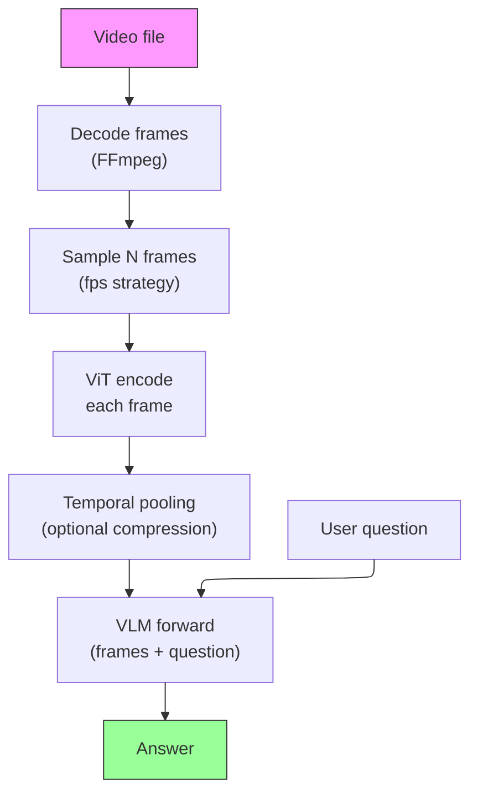
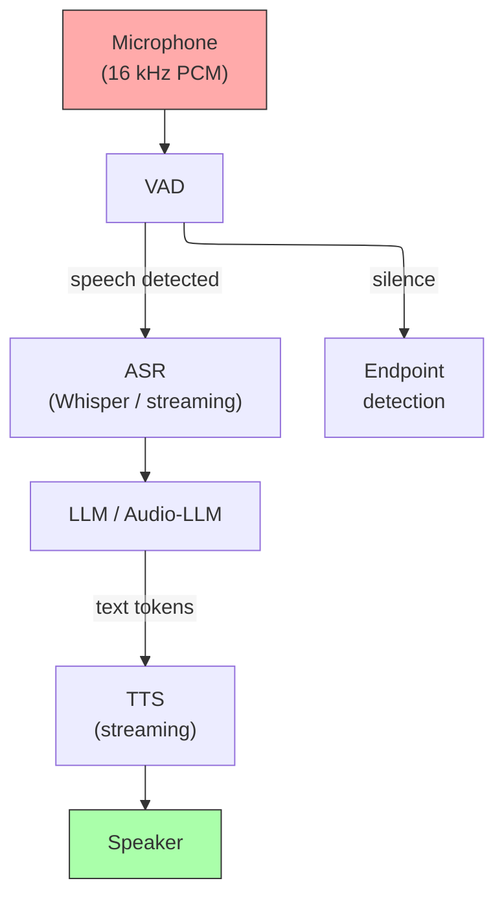
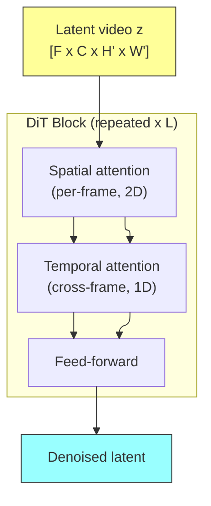
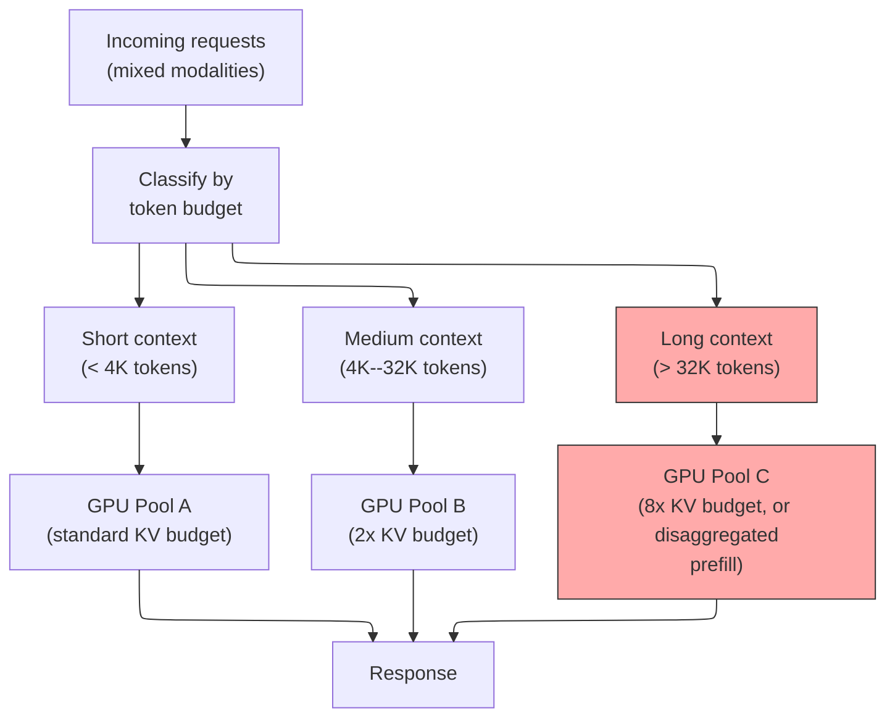

# Multimodal Inference — Vision, Audio, and Unified Models

> **Layer:** L8. **Prerequisites:** [Transformer_Internals](../L6_Algorithms_and_Models/01_Transformer_Internals.md), [KV_Cache](01_KV_Cache.md), [FlashAttention_Deep_Dive](../L5_Kernels_and_Programming/05_FlashAttention_Deep_Dive.md). **Hands off to:** [Inference_Frameworks](08_Inference_Frameworks.md), [Production_Architecture](15_Production_Architecture.md).

---

## 0. Why This Page Exists

Text-only LLM serving has well-understood latency, memory, and throughput models. Multimodal inference shatters those models. A single high-resolution image can inject 2,000--10,000 tokens into the context -- equivalent to an entire essay -- before a single word of user text arrives. A one-hour video at 1 fps produces 3600 frames, each tokenized into 50--256 embeddings, yielding 180K--920K tokens of KV cache pressure. Real-time audio demands sub-500 ms end-to-end turn latency with bidirectional streaming. Video generation requires 50--200 forward passes through a multi-billion-parameter denoiser.

This page specifies the architectures, the serving math, and the systems tricks that make multimodal inference tractable in production. It covers vision-language models (Qwen-VL, InternVL, Llama-4), audio models (Whisper, Moshi), video generation (Sora/Veo diffusion), and unified any-to-any models -- with the same depth of mechanistic detail applied throughout the L8 layer.

**Four invariants that hold across all multimodal inference:**

1. **Non-text modalities become tokens.** Every modality -- pixels, spectrograms, waveforms -- is discretized into a token sequence that enters the transformer context identically to text tokens. The KV cache does not distinguish them.
2. **Token count variance is the dominant scheduling challenge.** Text prompts have predictable lengths. Image tokens vary by 20x with resolution. Audio tokens arrive at a fixed clock rate. The serving engine must handle all three simultaneously.
3. **Prefill dominates decode for multimodal.** A 4K-image prefill is as expensive as a 4K-text prefill, but the user measures only the first-token latency. Aggressive prefill optimization is not optional.
4. **Encoder and LLM can be disaggregated.** The vision encoder is small (0.4--6B params) and compute-bound. The LLM is large and memory-bound. Running them on separate GPU pools with pipelining improves utilization.

---

## 1. The Multimodal Architecture Spectrum

Three coupling patterns dominate. The choice determines training cost, inference latency, modality extensibility, and KV cache geometry.

### 1.1 Late fusion (encoder + projector + LLM)

The most common pattern in open models. Two independent models composed at inference time.

**Forward pass:**

$$\mathbf{z}_{\text{img}} = \text{Projector}(\text{ViT}(\text{Image})) \in \mathbb{R}^{N_{\text{img}} \times D_{\text{LLM}}}$$

$$\text{logits} = \text{LLM}([\mathbf{z}_{\text{img}} \;\|\; \text{Embed}(\text{text\_ids})])$$

The projector is typically a 2-layer MLP with GELU activation: $D_{\text{ViT}} \to D_{\text{LLM}}$. Image tokens are concatenated with text embeddings into a single sequence. The LLM cannot distinguish image tokens from text tokens -- they are just embeddings in the context.

| Aspect | Detail |
|---|---|
| Encoder size | 0.4B (SigLIP) to 6B (InternViT-6B) |
| Projector | 2-layer MLP, ~100M params |
| Image token count | Fixed (256, 576, 729) or dynamic (256--10K) |
| Modularity | Swap encoder or LLM independently |
| Training cost | Cheap: freeze LLM, train projector only |
| Examples | Qwen2.5-VL, InternVL-2.5, LLaVA, Pixtral |

### 1.2 Early fusion (native multimodal)

One shared backbone trained on interleaved multimodal data from pretraining. Image patches, audio frames, and text tokens share the same embedding space and transformer layers.

$$\text{tokens} = [\text{Tok}_{\text{img}}(I) \;\|\; \text{Tok}_{\text{audio}}(A) \;\|\; \text{BPE}(T)]$$

$$\text{logits} = \text{Transformer}(\text{tokens})$$

No encoder-decoder boundary. No projector. The backbone learns joint representations end-to-end.

| Aspect | Detail |
|---|---|
| Backbone | Standard transformer, often MoE |
| Tokenizer per modality | VQ-VAE (image), RVQ (audio), BPE (text) |
| Training cost | Very high: full multimodal pretraining |
| Advantage | Deep cross-modal integration; any-to-any output |
| Examples | Llama-4, GPT-4o, Gemini-2.5, Janus-Pro |

### 1.3 Cross-attention (frozen LLM + adapter)

Insert cross-attention layers into a frozen LLM that attend to encoder outputs. Used in Flamingo, Idefics, BLIP-2.

$$\mathbf{y} = \mathbf{x} + \text{CrossAttn}(Q=\mathbf{x},\; K=\mathbf{z}_{\text{enc}},\; V=\mathbf{z}_{\text{enc}})$$

Where $\mathbf{z}_{\text{enc}} = \text{Encoder}(\text{image})$ are cached once and reused across layers. This pattern adds inference cost (extra cross-attention matmuls) but was important historically for adapting strong LLMs before early-fusion pretraining was economically feasible.

### 1.4 Comparison

| Dimension | Late fusion | Early fusion | Cross-attention |
|---|---|---|---|
| Training cost | Low (projector only) | Very high (full) | Medium (adapter) |
| Cross-modal depth | Shallow (encoder bottleneck) | Deep (shared layers) | Medium (cross-attn) |
| Output modalities | Text only | Any (any-to-any) | Text only |
| Inference stages | 2 (encoder + LLM) | 1 (unified) | 2+ (encoder + cross-attn + LLM) |
| KV cache | Standard LLM cache | Standard cache | LLM cache + encoder cache |
| Modularity | High (swap parts) | Low (monolithic) | Medium |
| 2025--2026 trend | Dominant in open models | Frontier direction | Declining |

---

## 2. Vision-Language Models -- Architecture Deep Dive

### 2.1 The ViT encoder

The Vision Transformer divides an image $I \in \mathbb{R}^{H \times W \times 3}$ into non-overlapping patches of size $p \times p$:

$$N_{\text{patches}} = \frac{H}{p} \times \frac{W}{p}, \quad \text{patch}_i \in \mathbb{R}^{p^2 \cdot 3}$$

Each patch is linearly projected to dimension $D_{\text{ViT}}$, augmented with positional embeddings, and processed by $L_{\text{ViT}}$ transformer layers with self-attention.

**FLOPs for the ViT encoder:**

$$\text{FLOPs}_{\text{ViT}} \approx 4 \cdot N_{\text{patches}} \cdot D_{\text{ViT}}^2 \cdot L_{\text{ViT}}$$

For SigLIP-400M ($L_{\text{ViT}}=26$, $D_{\text{ViT}}=1152$) encoding a 1024x1024 image with $p=14$:

$$N_{\text{patches}} = (1024/14)^2 = 5329, \quad \text{FLOPs} \approx 4 \times 5329 \times 1152^2 \times 26 \approx 733 \text{ GFLOP}$$

This is compute-bound on a single GPU, completing in ~5 ms on H100. The encoder is rarely the bottleneck.

### 2.2 Dynamic resolution and token count

Fixed-resolution models (LLaVA, InternVL with 336x336 crops) produce a constant number of tokens per image. Dynamic-resolution models (Qwen2-VL, Pixtral) scale token count with image size.

**Qwen2-VL M-RoPE approach:** The image is resized such that each patch maps to a token, with the number of tokens proportional to aspect ratio. For a 2048x1024 image with $p=14$:

$$N_{\text{tokens}} = \lceil 2048/14 \rceil \times \lceil 1024/14 \rceil = 147 \times 74 = 10,878 \text{ tokens}$$

A single HD image produces more tokens than the LLM context of many text-only workloads.

**Token count vs. resolution (Qwen2-VL, $p=14$):**

| Image size | Tokens | KV cache (FP16, 32 layers, $D$=4096) |
|---|---|---|
| 336x336 | 576 | 18 MB |
| 672x672 | 2304 | 72 MB |
| 1024x1024 | 5329 | 167 MB |
| 2048x1024 | 10878 | 340 MB |
| 3840x2160 (4K) | 21094 | 660 MB |

A batch of 8 concurrent requests each carrying one 1080p image requires ~2 GB of KV cache for image tokens alone -- before any text.

### 2.3 Frontier VLM table (2025--2026)

| Model | Architecture | Encoder | Backbone | Image tokens | Video | Open? |
|---|---|---|---|---|---|---|
| Qwen2.5-VL-72B | Late fusion | InternViT-style | Qwen-2.5-72B | Dynamic (M-RoPE) | Yes | Yes |
| InternVL-3 (78B) | Late fusion | InternViT-6B | Qwen-2.5-72B | Dynamic (AnyRes) | Yes | Yes |
| Llama-4 Maverick | Early fusion | -- | Llama-4 MoE | Patch tokens | Yes | Yes |
| Pixtral-Large | Late fusion | Custom ViT | Mistral-Large | Dynamic | Limited | Yes |
| Gemma-3 27B | Late fusion | SigLIP-400M | Gemma-3-27B | Fixed (256) | No | Yes |
| GPT-4o | Early fusion | -- | Unified | Dynamic | Yes | No |
| Gemini-2.5 Pro | Early fusion | -- | Unified MoE | Dynamic | Yes (1hr+) | No |
| Claude-4 Sonnet | Late fusion | ViT | Claude-4 | Dynamic | Limited | No |

---

## 3. Inference Engineering for VLMs

### 3.1 Two-stage forward pass

The encoder runs once per image. The LLM runs once for prefill and $T$ times for decode. Because encoder FLOPs are small and compute-bound while LLM decode is memory-bound, disaggregating onto separate GPU pools improves hardware utilization.

### 3.2 Encoder caching

Given a fixed encoder + projector, the image token output is a deterministic function of the image bytes. Cache by image hash:

$$\text{cache\_key} = \text{SHA256}(\text{image\_bytes}) \parallel \text{model\_version}$$

Hit rate depends on workload. Agentic flows that revisit screenshots and document QA over the same PDF page achieve 30--60% hit rates. General chat with unique images achieves near 0%.

### 3.3 Image token prefix caching

The LLM's KV cache treats image tokens identically to text tokens. When a user sends follow-up messages referencing the same image, the image token prefix is already in the KV cache:

$$\text{KV prefix} = [\underbrace{\text{sys\_prompt}}_{\text{cached}} \;\|\; \underbrace{\text{image\_tokens}}_{\text{cached}} \;\|\; \underbrace{\text{user\_text}}_{\text{prefill}} \;\|\; \underbrace{\text{assistant\_text}}_{\text{cached}} \;\|\; \underbrace{\text{new\_user\_text}}_{\text{prefill}}]$$

For a 1080p image with 5,329 cached tokens, prefix caching saves ~5,329 token positions of prefill computation -- a significant TTFT reduction on multi-turn conversations.

### 3.4 Prefill-heavy workload math

A VLM prefill is dominated by image tokens. For a batch of $B$ requests each with $N_{\text{img}}$ image tokens and $N_{\text{text}}$ text tokens:

$$\text{Prefill FLOPs} \approx 2P \cdot B \cdot (N_{\text{img}} + N_{\text{text}})$$

where $P$ is active parameter count. For Qwen2.5-VL-72B ($P$=72B) with $N_{\text{img}}$=5000, $N_{\text{text}}$=200, prefill per request = 749 TFLOP. On H100 FP8, single-request math takes ~0.76 ms, but memory-bound attention adds ~5--10 ms wall time. Batch 8 requests and prefill dominates for ~40--80 ms.

### 3.5 Dynamic resolution capping

Production deployments cap image token count at $N_{\text{cap}}$ (e.g., 2048 for standard, 8192 for premium tier). Images exceeding the cap are downsampled before encoding. A single 4K image uncapped produces 21K tokens -- equal to a 21K-token text prompt in KV cost.

---

## 4. Long-Context Visual Workloads

Document understanding and video QA push context lengths into the hundreds of thousands of tokens.

### 4.1 Token budget estimation

| Workload | Calculation | Token count |
|---|---|---|
| 50-page PDF (high-res) | 50 pages x ~1000 tokens/page | ~50K |
| 10-min video (1 fps, 256 tok/frame) | 600 frames x 256 | ~154K |
| 1-hour video (1 fps, 128 tok/frame) | 3600 frames x 128 | ~461K |
| 10-min screen recording (5 fps, 64 tok/frame) | 3000 frames x 64 | ~192K |
| 50-slide presentation | 50 x 1000 tokens | ~50K |

### 4.2 Mitigations for long visual context

1. **Frame sampling.** Reduce effective fps via keyframe detection or uniform sampling. A 1-hour video at 0.1 fps produces only 360 frames.
2. **Token compression.** Average adjacent patch embeddings, apply learned compression, or use hierarchical encoders (Qwen2-VL groups video frames temporally).
3. **Chunked processing.** Process video in temporal chunks, summarize each, attend to summaries for the final answer.
4. **Sparse attention.** NSA-style or MoBA-style sparse attention over the full visual token sequence.
5. **KV compression.** MLA, KIVI, or SnapKV applied to visual tokens -- visual tokens may tolerate more aggressive compression than text.

### 4.3 Video understanding pipeline

---

## 5. Audio Models

### 5.1 ASR -- Whisper architecture

Whisper is an encoder-decoder transformer. The encoder processes mel-spectrogram features; the decoder autoregressively generates transcript tokens.

**Encoder:** Mel spectrogram $\in \mathbb{R}^{T \times 80}$ $\to$ 2 conv layers $\to$ $L_{\text{enc}}$ transformer blocks $\to$ encoded features $\in \mathbb{R}^{T' \times D}$.

**Decoder:** Standard autoregressive transformer with cross-attention to encoder output. Generates text tokens with special timestamp tokens.

| Variant | Params | $L_{\text{enc}}$ | $L_{\text{dec}}$ | $D$ | Relative speed |
|---|---|---|---|---|---|
| tiny | 39M | 4 | 4 | 384 | 32x |
| base | 74M | 6 | 6 | 512 | 16x |
| small | 244M | 12 | 12 | 768 | 6x |
| medium | 769M | 24 | 24 | 1024 | 2x |
| large-v3 | 1550M | 32 | 32 | 1280 | 1x |

**Inference patterns:** Batched 30-second chunks (Whisper's native window), streaming via sliding window (Faster-Whisper, WhisperX), VAD integration (Silero VAD) to split on silence, and CTranslate2 INT8 backend for 4x throughput with negligible accuracy loss.

### 5.2 Audio tokenization for LLMs

Audio LLMs represent waveforms as discrete tokens via Residual Vector Quantization (RVQ): Audio $\to$ encoder $\to$ latent $\to$ RVQ($K$ codebooks $\times$ $T_{\text{frames}}$). At 12.5 Hz frame rate with 8 codebooks, one second of audio produces $12.5 \times 8 = 100$ tokens; a 5-minute conversation is 30,000 tokens. The interleaving pattern matters: either flatten all codebooks per frame or use a delay pattern across time.

### 5.3 Moshi-style full-duplex audio LLM

Moshi (Kyutai, 2024) achieves full-duplex voice interaction through interleaved audio token streams at 12.5 Hz with RVQ tokenization. At each timestep the model consumes user audio tokens and generates its own audio tokens, with a small "inner monologue" text stream for grounding.

**Serving constraints:** end-to-end turn latency < 500 ms, 80 ms audio chunks (12.5 Hz frame), bidirectional streaming, interrupt handling (cancel current decode on new user speech), and persistent KV cache with streaming eviction.

### 5.4 Real-time voice agent stack

**Latency budget breakdown (target: < 500 ms):** VAD + chunking (50--100 ms), ASR (50--150 ms), LLM TTFT (100--200 ms), LLM decode first phrase (50--100 ms), TTS first audio (50--100 ms), network (20--50 ms) = **320--700 ms total**. Audio-LLMs (Moshi, GPT-4o voice) collapse ASR + LLM + TTS into a single model, eliminating two pipeline stages and cutting latency to ~200--300 ms.

---

## 6. Video and Image Generation -- Diffusion Architecture

### 6.1 Diffusion inference loop

A diffusion model generates samples by iteratively denoising a Gaussian latent over $N_{\text{steps}}$ steps:

$$\mathbf{z}_{t-1} = \mathbf{z}_t - \sigma_t \cdot \epsilon_\theta(\mathbf{z}_t, t, \mathbf{c})$$

where $\epsilon_\theta$ is the denoiser network, $t$ is the timestep, and $\mathbf{c}$ is the conditioning (text embedding from CLIP/T5).

**Key property: each denoising step is a full forward pass through the model.** A 50-step image generation runs the denoiser 50 times. A 200-step video generation runs it 200 times.

### 6.2 Architecture variants

| Component | U-Net (SDXL, SD3) | DiT (Sora, Veo, Flux) |
|---|---|---|
| Backbone | U-Net with skip connections | Transformer with patch attention |
| Temporal modeling | N/A (image only) | Temporal attention across frames |
| Scaling behavior | Limited (architecture fixed) | Predictable (scale layers + tokens) |
| FLOPs per step | ~200 GFLOP (SDXL) | ~1--50 TFLOP (Sora-class) |
| Steps (standard) | 20--50 | 40--200 |

### 6.3 Temporal attention in video diffusion

Video diffusion models extend image diffusion by adding temporal attention across frames. The latent representation is $\mathbf{z} \in \mathbb{R}^{F \times C \times H' \times W'}$ where $F$ is the number of frames.

**FLOPs per denoising step:**

$$\text{FLOPs}_{\text{step}} \approx 4 \cdot F \cdot N_{\text{spatial}} \cdot D^2 \cdot L + 4 \cdot N_{\text{spatial}} \cdot F^2 \cdot D \cdot L$$

The first term is spatial self-attention (per frame). The second term is temporal attention (per spatial position across frames). For long videos ($F \gg 1$), temporal attention dominates.

### 6.4 Video generation cost estimation

| Config | Frames | Resolution | Steps | Model size | Total TFLOPs | H100 time (FP8) |
|---|---|---|---|---|---|---|
| Short clip | 16 | 512x512 | 50 | 5B | ~400 | ~0.4s |
| Standard video | 60 | 720p | 100 | 20B | ~12,000 | ~12s |
| Long-form (Sora-class) | 240 | 1080p | 200 | 30B | ~300,000 | ~5 min |
| HD long (Veo-class) | 600 | 1080p | 150 | 30B | ~600,000 | ~10 min |

These are math times; memory and communication overhead on multi-GPU setups add 2--5x wall time.

### 6.5 Diffusion inference optimizations

| Technique | Mechanism | Speedup | Quality impact |
|---|---|---|---|
| Distillation (LCM, DMD) | Train student for few-step generation | 10--50x (steps: 50 $\to$ 1--4) | Moderate |
| FP8/FP4 quantization | Quantize denoiser weights | 1.5--2x | Low |
| Flash Attention | Tiled attention in denoiser | 1.2--1.5x | None |
| Step caching | Reuse outputs for similar prompts | 1.2--2x (batch) | Low |
| KV cache for cross-attn | Cache text conditioning across steps | 1.1--1.3x | None |
| Temporal parallelism | Split frames across GPUs | Near-linear with GPU count | None |

### 6.6 Distributed inference for video generation

xDiT implements tensor parallelism (TP), sequence parallelism (SP), and context parallelism (CP) for video diffusion. TP shards the denoiser weights across GPUs; SP shards the spatial token sequence per frame; CP shards the frame dimension across GPUs for temporal attention. A 30B-parameter video model at 1080p requires at minimum 4x H100 (80 GB) for weight + activation memory, typically 8x for reasonable latency.

---

## 7. Unified Any-to-Any Models

### 7.1 The unified token stream

GPT-4o, Gemini-2.5, and Janus-Pro represent the convergence toward a single model that accepts and generates arbitrary modalities:

$$\text{Input: } [\text{Tok}_{\text{text}}(T) \;\|\; \text{Tok}_{\text{image}}(I) \;\|\; \text{Tok}_{\text{audio}}(A)]$$
$$\text{Output: } [\text{Tok}_{\text{text}} \;\|\; \text{Tok}_{\text{image}} \;\|\; \text{Tok}_{\text{audio}}]$$

The backbone is a standard transformer. Each modality has its own tokenizer (front-end) and detokenizer (back-end):

| Modality | Tokenizer | Detokenizer | Token rate |
|---|---|---|---|
| Text | BPE (tiktoken, SentencePiece) | String lookup | ~4 char/token |
| Image | VQ-VAE / VQ-GAN | Decoder network | ~256--1024 tokens/image |
| Audio | RVQ (Encodec, DAC) | Decoder + vocoder | ~100 tokens/second |
| Video | 3D VAE (temporal VQ) | Decoder network | ~256 tokens/frame |

### 7.2 Architecture of Janus-Pro (open any-to-any)

Janus-Pro (DeepSeek, 2025) demonstrates the unified approach in an open model:

- **Understanding path:** SigLIP encoder $\to$ understanding adaptor $\to$ LLM. Image is encoded into continuous embeddings.
- **Generation path:** LLM $\to$ generation adaptor $\to$ VQ-VAE decoder. Image is generated autoregressively as discrete codes.

The dual-path design uses separate tokenizers for understanding vs. generation, avoiding the tension between continuous embeddings (better for understanding) and discrete codes (necessary for generation).

### 7.3 Serving implications of unified models

| Aspect | Impact |
|---|---|
| Routing | Simplified: one model handles all modalities, no per-modality replica pools |
| KV cache | Variable and unpredictable: a mixed image+audio+text context has no fixed budget |
| Output streaming | Must handle modality switches: text $\to$ image $\to$ audio within one response |
| Prefill cost | Higher on average: multimodal inputs are token-denser than pure text |
| Batch scheduling | Mixed-modality batches have wider variance in token counts; harder to pack efficiently |
| Model weight | Larger: image/audio tokenizer + detokenizer + backbone in one serving unit |

---

## 8. Serving Considerations -- Systems View

### 8.1 Variable sequence length challenge

Text-only workloads have predictable prompt lengths (typically 100--2000 tokens). Multimodal workloads exhibit 10--50x variance:

$$N_{\text{total}} = N_{\text{sys}} + N_{\text{img}} + N_{\text{text}} + N_{\text{audio}}$$

| Request type | Typical $N_{\text{total}}$ |
|---|---|
| Text-only chat | 500--2,000 |
| Single image QA | 1,000--8,000 |
| Multi-image (4x) | 4,000--32,000 |
| Video (1 min) | 10,000--154,000 |
| Document (50 pages) | 40,000--60,000 |
| Long video (1 hr) | 200,000--900,000 |

The serving engine must allocate KV cache blocks based on the maximum possible token count, or risk mid-request OOM. Admission control must account for image token overhead.

### 8.2 Prefill-heavy workload scheduling

In text-only serving, prefill and decode are balanced (~30% prefill, ~70% decode by compute time for typical chat). In multimodal serving, prefill dominates:

$$\frac{\text{Prefill time}}{\text{Decode time}} = \frac{2P \cdot (N_{\text{img}} + N_{\text{text}})}{2P \cdot T_{\text{gen}} \cdot \frac{1}{B}} \approx \frac{N_{\text{img}} + N_{\text{text}}}{T_{\text{gen}} / B}$$

For a VLM request with 5000 image tokens generating 200 output tokens at batch size 1: prefill/decode ratio $\approx 25$. Even at batch size 8, the ratio is ~3.

**Implication:** Chunked prefill (see [Batching_and_Scheduling](03_Batching_and_Scheduling.md)) is essential for multimodal workloads to avoid head-of-line blocking. A single 10K-image-token prefill should not block decode of shorter requests.

### 8.3 Image token throughput

On H100 with FP8, a 72B model achieves ~30K tokens/sec prefill throughput. Processing one 5K-token image takes ~170 ms; a batch of 8 takes ~1.3 seconds. Image prefill throughput $\approx N_{\text{img}} \cdot B \;/\; t_{\text{prefill}}$ tokens/sec.

### 8.4 Multimodal-aware scheduling

Production deployments often tier GPU pools by KV cache budget. Short-context text requests go to cheap instances; long-context video/document requests go to instances with more HBM or disaggregated prefill.

### 8.5 Framework support (2025--2026)

| Framework | VLM support | Audio support | Video gen | Key features |
|---|---|---|---|---|
| vLLM | Qwen-VL, InternVL, Phi-4, Pixtral | Phi-4-multimodal | No | Multi-modal prefix caching |
| SGLang | Qwen-VL, InternVL, Llama-4 | Limited | No | RadixAttention for multimodal |
| TensorRT-LLM | LLaVA, Qwen-VL | Whisper | No | FP8 quantized VLM inference |
| LMDeploy | InternVL, Qwen-VL | No | No | Turbomind backend |
| Diffusers | No | No | Wan, CogVideo | Standard diffusion pipeline |
| xDiT | No | No | Sora-class models | TP/SP/CP for video diffusion |
| NVIDIA NIM | Multiple VLMs | Whisper, Canary | No | Production containers |

---

## 9. Comprehensive Comparison Table

| Dimension | VLM (late fusion) | VLM (early fusion) | ASR (Whisper) | Audio-LLM (Moshi) | Video gen (Sora/Veo) | Unified (GPT-4o) |
|---|---|---|---|---|---|---|
| Input modalities | Image + text | Image + text + video | Audio | Audio + text | Text (prompt) | Any |
| Output modalities | Text | Text | Text | Audio + text | Video | Any |
| Model stages | 2 (encoder + LLM) | 1 (unified) | 2 (enc + dec) | 1 (unified) | 1 (denoiser) + VAE | 1 (unified) |
| Typical params | 7B--72B LLM + 0.4--6B enc | 70B--400B | 74M--1.5B | 7B | 5B--30B | 200B+ (est.) |
| Tokens per input | 500--10K (image) | 500--10K | 1500 (30s audio) | Streaming (~100/s) | Prompt only | Variable |
| Prefill/decode ratio | High (5--25x) | High | N/A (enc-dec) | Streaming | N/A (iterative) | High |
| KV cache pressure | High (image tokens) | High | Low (enc-dec) | Moderate (streaming) | N/A | High (mixed) |
| Latency critical path | TTFT (image prefill) | TTFT | Streaming chunk | Turn latency (<500 ms) | Total gen time | TTFT |
| Primary bottleneck | Image token prefill | Unified prefill | Encoder compute | Streaming decode | Step count x model size | Mixed-modality prefill |
| Multi-GPU needed | LLM only (large models) | Often (large models) | Rarely | Sometimes | Always (video gen) | Often |
| Key optimization | Prefix cache image tokens | Joint prefill opt | INT8 + batching | Full-duplex streaming | Few-step distillation | Modality routing |

---

## 10. Common Pitfalls

1. **Underestimating image token counts.** Dynamic-resolution VLMs produce 5K+ tokens per HD image. A multi-image chat with 4 attachments and conversation history easily exceeds 32K tokens. Set per-request caps.
2. **Ignoring video KV memory.** An hour-long video produces 200K--900K tokens. Even with FP8 KV, this is 200--900 MB per request. Cap concurrent video sessions or use sparse attention.
3. **Cold-starting ViT encoders.** The ViT model must be loaded and warmed up separately from the LLM. A cold encoder load takes 2--5 seconds. Maintain a warm encoder pool.
4. **Audio buffer bloat.** Audio chunks larger than 100 ms add latency to real-time voice agents. Chunk at 50--80 ms and overlap for continuity.
5. **Prefix cache invalidation on image variation.** Even minor image edits (resize, crop) change the hash and miss the encoder cache. Use perceptual hashing for near-duplicate detection if the use case allows approximate caching.
6. **Batching text-only with multimodal.** Mixed-modality batches have extreme variance in prefill cost. A single video prefill can stall decode for all text-only requests in the same batch. Use separate queues or chunked prefill.
7. **TTS step count dominating voice agent latency.** A 20-step vocoder adds 200+ ms for short utterances. Distilled few-step vocoders (1--4 steps) are necessary for sub-500 ms targets.
8. **Neglecting diffusion VAE decode cost.** The final VAE decode of a video latent is itself a significant computation ($F \times$ spatial decode). Budget for it separately from denoiser steps.

---

## 11. Numbers to Memorize

| Quantity | Value | Why it matters |
|---|---|---|
| Image tokens (Qwen2-VL, p=14) | 336²→576, 1024²→5329, 4K→21094 | one HD image ≫ most text prompts |
| KV per 1080p image | ~167 MB FP16 (32 layers, D=4096); batch-8 ≈ 2 GB | image KV alone before any text |
| ViT encode (SigLIP-400M, 1024²) | ~733 GFLOP ≈ 5 ms on H100 | encoder is **rarely** the bottleneck |
| Audio token rate (RVQ) | 12.5 Hz × 8 codebooks = **100 tok/s**; 5 min ≈ 30K | audio context grows fast |
| Voice-agent turn-latency target | **< 500 ms**; audio chunk 50–80 ms | pipeline budget is tight |
| Audio-LLM (Moshi/4o-voice) collapse | 3 stages → 1 → **~200–300 ms** | removes ASR+TTS hops |
| Diffusion step cost | **1 full forward / step**; 50 (image), 40–200 (video) | step count = latency |
| Few-step distillation (LCM/DMD) | 50 → **1–4 steps** (10–50×) | the dominant gen speedup |
| 1-hour video (1 fps, 128 tok/frame) | ~**461K tokens** | cap concurrent video sessions |
| Prefill/decode ratio | text ~30/70; **VLM 5–25× (B=1), ~3× (B=8)** | why chunked prefill is mandatory |
| VLM prefill throughput | ~same tok/s per token as text-only prefill (still compute-bound) | image token count, not rate, is the real cost driver |
