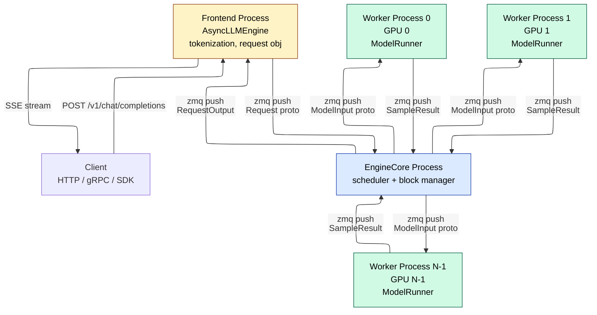
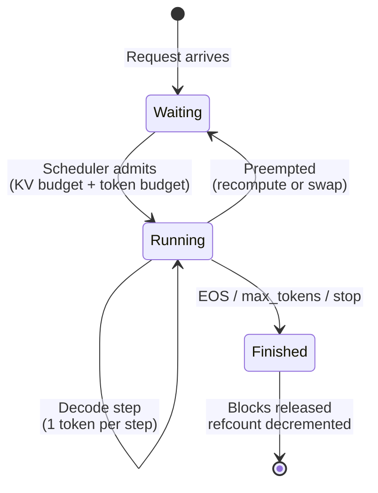
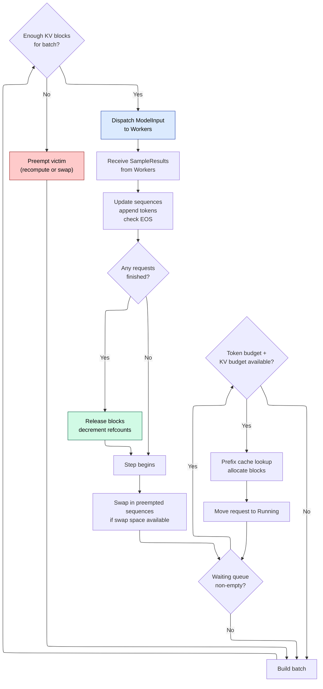
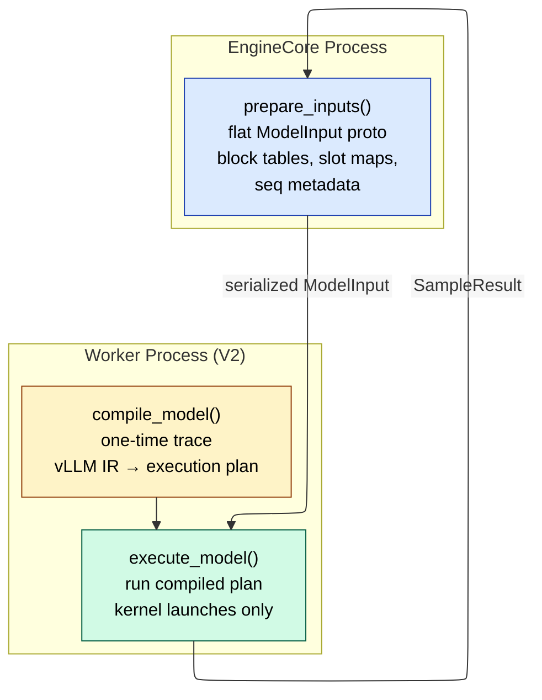
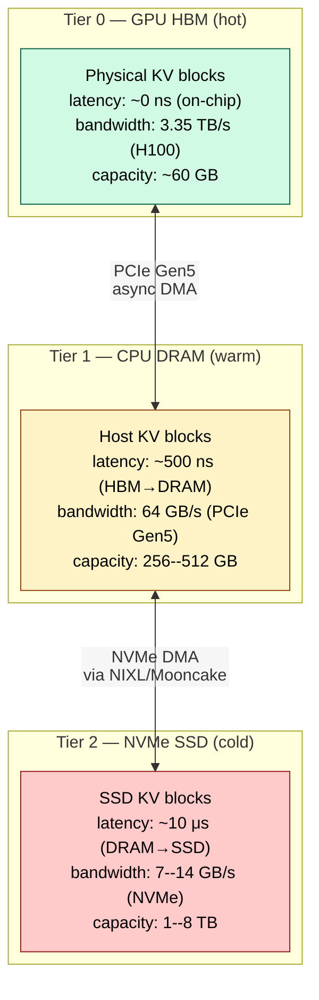
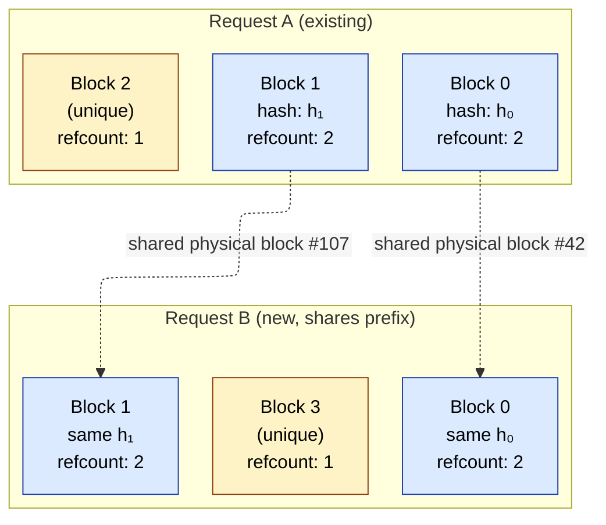
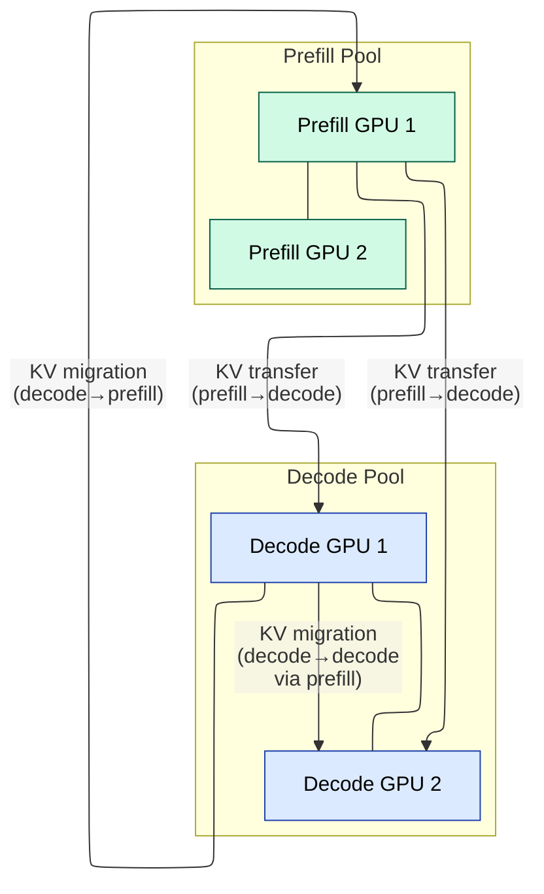
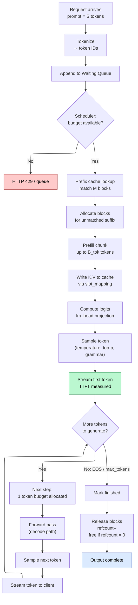
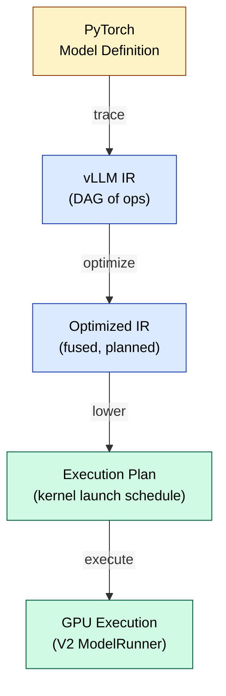

# vLLM Internals — Engine Architecture, Scheduler, and Block Manager

> **Version covered:** v0.21.0 (May 2025). **Layer:** L8. **Prerequisites:** [Inference_Frameworks](08_Inference_Frameworks.md), [KV_Cache](01_KV_Cache.md), [Batching_and_Scheduling](03_Batching_and_Scheduling.md). **Hands off to:** [Production_Architecture](15_Production_Architecture.md), [Kubernetes_and_Orchestration](13_Kubernetes_and_Orchestration.md).

---

## 0. Why This Page Exists

vLLM is the most studied open-source LLM inference engine and the reference implementation for PagedAttention, continuous batching, and automatic prefix caching. Understanding its internals is a forcing function for understanding every other serving system: SGLang, TensorRT-LLM, Dynamo, and llm-d all implement variants of the same scheduler--block-manager--worker decomposition.

This page is a code-level architectural tour. It traces a single request from HTTP arrival to streamed output, dissects the V1 engine's process topology, derives the scheduler's per-step decision loop, explains the block manager's virtual-memory-inspired allocation and copy-on-write prefix sharing, and maps every component back to its source module. v0.21.0 brings a redesigned ModelRunner (V2), a compiler-style IR layer, heterogeneous multi-tier memory, 2-bit KV compression, FlashAttention-4 for MLA, bi-directional disaggregated KV transfers, NIXL/Mooncake connectors, thinking budgets for reasoning models, and adaptive speculative decoding V2. Every design choice is grounded in the scheduling theory from [Batching_and_Scheduling](03_Batching_and_Scheduling.md) and the memory math from [KV_Cache](01_KV_Cache.md).

### Invariants

| Symbol | Meaning | Typical range |
|--------|---------|---------------|
| $B_{\text{tok}}$ | Per-step token budget (`max_num_batched_tokens`) | 2048--8192 |
| $B_{\text{seq}}$ | Maximum concurrent sequences (`max_num_seqs`) | 64--4096 |
| $B_s$ | KV block size in tokens | 16 (default) |
| $M_{\text{KV}}$ | Total KV cache memory pool | 10--85 GB |
| $N_{\text{blk}}$ | Number of physical KV blocks in pool | 5K--40K |
| $n_l$ | Transformer layers | 32--126 |
| $n_{\text{kv}}$ | KV heads per layer | 1--128 |
| $d_h$ | Head dimension | 64--256 |
| $b$ | Bytes per KV element | 0.25 (TQ2), 1 (FP8), or 2 (FP16/BF16) |
| $T_{\text{budget}}$ | Thinking token budget for reasoning models | 0--32768 |

---

## 1. V1 Engine Architecture

### 1.1 Process topology

The V1 engine (shipped late 2024, default since v0.6) separates the scheduling critical path from the model execution path by placing them in different processes connected via shared-memory queues.



Each Worker process is pinned to one GPU and holds its own model-weight copy (or shard under tensor parallelism). The EngineCore process owns the scheduler and block manager -- it never touches the GPU. Communication is entirely via zero-copy shared-memory queues (multiprocessing queues for intra-node, zmq for the API layer), eliminating Python GIL contention between scheduling and execution.

### 1.2 Component responsibilities

| Component | Process | Responsibilities |
|-----------|---------|-----------------|
| AsyncLLMEngine | Frontend | HTTP/gRPC API, tokenization, Request object creation, output streaming |
| EngineCore | Core | Admission, scheduling, KV block allocation, prefix cache lookup, preemption |
| Worker | Per-GPU | ModelRunner forward pass, KV cache tensors, sampling, custom kernel dispatch |
| ModelRunner | Inside Worker | Layer-by-layer execution, input tensor packing, slot mapping |

### 1.3 Why the split?

The V0 engine ran scheduler and workers in the same Python process. The GIL serialized Python work on the scheduling path against Python work on the post-processing path. At high batch sizes this added 2--5 ms of scheduling overhead per step -- material when decode steps themselves are 20--50 ms. The V1 split removes scheduling from the GPU-critical path entirely: by the time the Worker finishes one forward pass, the next step's ModelInput is already waiting in the queue.

Performance impact: roughly 1.5--2$\times$ higher peak throughput at identical model code, with the gains concentrated at high batch sizes where scheduling overhead was previously the binding constraint.

---

## 2. Request Lifecycle — End to End

### 2.1 Arrival

The client sends an OpenAI-compatible request:

```json
POST /v1/chat/completions
{
  "model": "meta-llama/Llama-3.1-70B-Instruct",
  "messages": [{"role": "system", "content": "You are..."}, {"role": "user", "content": "Explain..."}],
  "stream": true,
  "max_tokens": 512,
  "temperature": 0.7
}
```

The frontend tokenizes the chat template into token IDs, wraps them into an internal `Request` object (request ID, token IDs, sampling parameters, output stream reference), and pushes it to the EngineCore via shared memory.

### 2.2 Waiting queue

The EngineCore appends the request to the **waiting queue**. The request remains here until the scheduler admits it (Section 3). If the queue is full or the system is overloaded, the frontend returns HTTP 429 immediately.

### 2.3 Admission and prefix cache lookup

On the next scheduling step, the scheduler evaluates admission (Section 3.1). If admitted, the block manager computes block hashes for the prompt's token IDs and checks the prefix cache (Section 5). Matching blocks are shared via reference-count increment; the unmatched suffix becomes the prefill workload.

### 2.4 Prefill

The scheduler allocates a prefill chunk: up to $B_{\text{tok}}$ tokens of the prompt suffix, minus tokens consumed by concurrent decode sequences. For a 4096-token prompt with $B_{\text{tok}} = 2048$ and 32 active decodes: first chunk gets $\min(4096, 2048 - 32) = 2016$ tokens. The remaining 2080 tokens are deferred to subsequent steps.

The scheduler builds a `ModelInput` containing packed token IDs, position IDs, per-sequence block tables, and slot mappings (which physical cache slot each token writes to). This is dispatched to all workers.

### 2.5 Forward pass and KV write

Each worker's ModelRunner executes the forward pass layer by layer. At each attention layer, the new $K$, $V$ vectors are written into the physical KV cache at the slot locations specified by the slot mapping. The PagedAttention kernel reads existing cached $K$, $V$ through the block table and computes attention output for the new tokens.

### 2.6 Sampling and output

After the final layer, logits are computed ($\text{lm\_head}$ projection). The sampler applies temperature, top-$k$, top-$p$, repetition penalties, and grammar masks per-sequence on GPU. Sampled token IDs are returned to the EngineCore. If the request streams, the frontend pushes the token to the client immediately.

### 2.7 Decode loop

On subsequent steps, the scheduler includes the request in the decode batch (1 token budget per sequence). Each step produces one more token. The request remains in the **running** set until EOS, stop string, or `max_tokens`.

### 2.8 Completion

When the sampler emits EOS or `max_tokens` is reached, the request moves to the **finished** state. Its block table is released: each block's reference count is decremented. Blocks with refcount zero return to the free list (or remain in the prefix cache if they are hash-registered). The final output is streamed to the client.



---

## 3. The Scheduler

### 3.1 Per-step decision loop

The scheduler runs once per step and must decide: which waiting requests to admit, which running sequences to schedule, and whether any preemption is necessary. The decision is greedy and order-dependent.



### 3.2 Budget enforcement

At each step the scheduler enforces three hard constraints:

$$\sum_{\text{prefill chunks}} C_i + |\text{decodes}| \le B_{\text{tok}}$$

$$|\text{running sequences}| \le B_{\text{seq}}$$

$$\sum_{i \in \text{running}} \left\lceil \frac{S_i}{B_s} \right\rceil \le N_{\text{blk}}$$

The token budget ($B_{\text{tok}}$) limits total compute per step. The sequence budget ($B_{\text{seq}}$) caps the batch dimension. The block budget ($N_{\text{blk}}$) limits total KV memory.

### 3.3 Chunked prefill within the scheduler

A request with a prompt longer than the remaining token budget is split across steps. The scheduler tracks how many prompt tokens have been prefilled so far and only schedules the remaining chunk. Between chunks, the request stays in the running set but does not consume decode tokens -- it is purely in the prefill phase.

The interleaving of prefill chunks with decode tokens is governed by the token budget. If 32 decode sequences consume 32 tokens from the budget and $B_{\text{tok}} = 4096$, the prefill chunk gets at most 4064 tokens. This ensures decode TPOT is not disrupted by large prefills, as analyzed in [Batching_and_Scheduling](03_Batching_and_Scheduling.md) Section 5.

### 3.4 V1 vs V0 scheduler differences

The V0 scheduler was a single Python class (`Scheduler`) that maintained separate `self.waiting`, `self.running`, and `self.swapped` deques. It ran inside the same Python process as the API server and workers, serialized by the GIL. The V1 scheduler introduces several fundamental changes:

| Dimension | V0 Scheduler | V1 Scheduler |
|-----------|-------------|--------------|
| Process | Same Python process as API server + workers | Dedicated EngineCore process |
| Language | Pure Python (Scheduler class) | C++ core with Python bindings |
| Queue structure | Separate `waiting`, `running`, `swapped` deques | Unified priority queue with state flags |
| Prefill/decode distinction | Explicit: requests move between `waiting` (prefill) and `running` (decode) | Implicit: every request in the running set has a `num_computed_tokens` counter; prefill vs decode is determined by whether `num_computed_tokens < total_num_tokens` |
| Scheduling overhead | ~500 $\mu$s/step (Python iteration + GIL contention) | ~50 $\mu$s/step (C++ iteration, no GIL) |
| Chunked prefill | Supported but required explicit `running_queue` management for partial prefills | Native: partial-prefill sequences stay in the unified queue with their `num_computed_tokens` counter |
| Communication | Python `multiprocessing.Queue` (pickle serialization) | Zero-copy shared-memory queues (zmq) |

**Unified scheduling in V1.** The V0 scheduler treated prefill and decode as distinct phases with separate code paths. In V1, the scheduler makes no explicit distinction: it simply iterates over all requests in the running set and checks each request's state:

```text
for req in running_set:
    if req.num_computed_tokens < req.num_prompt_tokens:
        # This request still needs prefill
        chunk = min(remaining_tokens, tokens_budget)
        schedule_prefill_chunk(req, chunk)
        tokens_budget -= chunk
    else:
        # This request is in decode phase
        if tokens_budget >= 1:
            schedule_decode(req)
            tokens_budget -= 1
```

This eliminates the V0 pattern of shuffling requests between separate waiting/running/swapped lists. The unified queue simplifies the code and avoids list-management overhead.

**How V1 handles chunked prefill internally.** When a request with a 6K-token prompt arrives and the token budget is 4096 with 48 active decodes:

1. V1 computes the available prefill budget: $4096 - 48 = 4048$ tokens.
2. The first chunk processes 4048 tokens. After the forward pass, `req.num_computed_tokens = 4048`.
3. The request stays in the running set. On the next step, the scheduler sees `num_computed_tokens (4048) < num_prompt_tokens (6144)` and schedules the remaining 1952 tokens as chunk 2.
4. After chunk 2, `num_computed_tokens = 6144 = num_prompt_tokens`. The first output token is sampled. On subsequent steps, the request is decoded normally.

No explicit state machine transitions between "waiting," "prefilling," and "decoding" -- the `num_computed_tokens` counter implicitly encodes the phase.

### 3.5 Preemption decisions

When the block pool is exhausted but a higher-priority request must be admitted, the scheduler selects a victim for preemption. The decision matrix:

| Victim type | Mechanism | When preferred |
|-------------|-----------|---------------|
| New request not yet decoded | Recompute (drop blocks) | Always: no investment lost |
| Decode sequence, short context | Recompute | Re-prefill cost is low |
| Decode sequence, long context, low prefix hit | Swap to CPU | Preserves expensive KV |
| Decode sequence, long context, high prefix hit | Recompute | Prefix cache absorbs most re-prefill cost |

Victim selection among equal-priority candidates: largest KV footprint first (maximizes freed blocks per eviction). Among different priorities: always preempt the lowest priority.

### 3.6 Scheduling policy

V1 uses FCFS (first-come-first-served) as the default admission policy. Priority can be set per-request via the API, mapping to integer priority levels. Within the same priority level, FCFS applies. The scheduler does not implement SRJF or EDF natively; these are left to the routing layer above (see [Production_Architecture](15_Production_Architecture.md)).

### 3.6 Thinking budget (v0.21.0)

Reasoning models (e.g., DeepSeek-R1, o-series) interleave visible "thinking" tokens with the final answer. A single request can consume tens of thousands of thinking tokens before producing any user-visible output, monopolizing KV blocks and decode budget.

The thinking budget ($T_{\text{budget}}$) is a new per-request scheduler parameter that caps the number of thinking tokens a request may generate:

```text
# API parameter
"thinking_budget": 8192  # max thinking tokens before forced transition
```

The scheduler enforces this by tracking a per-sequence thinking token counter. When the counter reaches $T_{\text{budget}}$, the scheduler injects a special control token that signals the model to exit its thinking loop and begin generating the answer. This mechanism:

- **Bounds KV consumption**: A request with `thinking_budget=8192` uses at most $(S_{\text{prompt}} + 8192 + S_{\text{answer}}) / B_s$ blocks, making capacity planning predictable.
- **Prevents starvation**: Without the budget, a burst of reasoning requests can exhaust the KV pool, forcing preemption of shorter non-reasoning requests.
- **Enables SLO differentiation**: Different API tiers can offer different thinking budgets (e.g., 2048 for free tier, 32768 for premium).

The budget applies only to thinking tokens (identified by special token IDs that demarcate the thinking region). Tokens in the answer region are governed by `max_tokens` as before.

### 3.7 Adaptive speculative decoding V2 (v0.21.0)

Speculative decoding (see [Speculative_Decoding](04_Speculative_Decoding.md)) in vLLM uses a draft model or self-speculation to propose multiple candidate tokens per step, then verifies them in a single forward pass. The original implementation used static draft length and temperature parameters.

V2 integrates adaptive spec decoding directly into the scheduler's per-step loop:

**Dynamic draft length adjustment.** The scheduler tracks the per-sequence acceptance rate $\alpha_i$ (fraction of draft tokens accepted by the verifier over a sliding window of 32 steps). The draft length for sequence $i$ at step $t$ is:

$$L_i^{(t)} = \max\!\Big(1,\;\min\!\big(L_{\max},\;\lfloor \bar{\alpha}_i \times L_{\max} \rfloor\big)\Big)$$

where $L_{\max}$ is the configured maximum draft length (default 5) and $\bar{\alpha}_i$ is the exponentially-weighted moving average of the acceptance rate. Sequences with consistently high acceptance rates get longer drafts (up to $L_{\max}$); sequences with low acceptance revert to non-speculative decode ($L = 1$).

**Scheduler integration.** The draft tokens are accounted for in the token budget:

$$\sum_{\text{prefill chunks}} C_i + \sum_{\text{decodes}} L_i^{(t)} \le B_{\text{tok}}$$

Each speculative sequence consumes $L_i^{(t)}$ tokens from the budget rather than 1. This means the scheduler dynamically adjusts how many speculative sequences it can batch based on their acceptance rates. A batch of sequences with high acceptance rates ($\alpha \approx 0.9$, $L \approx 4$) consumes more budget per sequence but yields 3--4$\times$ the tokens per step.

**Draft model switching.** For multi-tenant serving, the scheduler can switch between different draft models based on the active request's source model family. The draft model is loaded in a separate weight buffer and swapped via CUDA stream-ordered memory operations with minimal overhead (~2 ms swap time for a 1B draft model on H100).

---

## 4. The Worker and Model Runner

### 4.1 Worker process

Each Worker is a Python subprocess pinned to one GPU. It holds:

- **Model weights**: loaded at startup, possibly sharded for tensor parallelism.
- **KV cache tensors**: pre-allocated per-layer tensors of shape $(N_{\text{blk}}, 2, B_s, n_{\text{kv}} / \text{TP}, d_h)$.
- **ModelRunner**: the object that orchestrates the forward pass.

The Worker receives a `ModelInput` from the EngineCore, calls `ModelRunner.execute()`, and returns `SampleResult` (sampled token IDs and related metadata).

### 4.1.1 How the LLMEngine dispatches to workers

The EngineCore communicates with Workers via shared-memory queues (V1) or multiprocessing queues (V0). The dispatch flow:

1. **EngineCore** runs the scheduler (Section 3), producing a `SchedulerOutput` containing: which sequences are scheduled, their prefill chunks, and any preemption/swapping directives.
2. The `SchedulerOutput` is serialized into a `ModelInput` proto containing packed `input_ids`, `positions`, `block_tables`, `slot_mapping`, and `seq_lens` tensors.
3. The `ModelInput` is pushed to each Worker's input queue via zero-copy shared memory. Under TP, all workers receive the *same* `ModelInput` (identical input IDs and block tables; each worker uses its own weight shard).
4. Each Worker's `ModelRunner.execute()` deserializes the `ModelInput`, moves tensors to GPU, and runs the forward pass.
5. After the forward pass, the sampler produces `SampleResult` (one token ID per sequence). This is pushed back to the EngineCore via a return queue.
6. The EngineCore updates sequence states, emits streaming outputs, and begins the next scheduling step.

Under TP, Workers execute in lockstep because the forward pass includes NCCL all-reduce operations that synchronize all ranks. The EngineCore does not proceed to the next step until all Workers have returned their `SampleResult`.

### 4.1.2 Model weight loading

At startup, each Worker loads model weights through the following path:

1. **Safetensors scan**: read the model's `model.safetensors.index.json` to determine the weight file layout and tensor metadata.
2. **Shard selection**: under TP, each Worker loads only its shard of each tensor. For column-parallel layers (QKV, gate, up projections), Worker $i$ loads column range $[i \cdot H/\text{TP}, (i+1) \cdot H/\text{TP})$. For row-parallel layers (output, down projections), Worker $i$ loads row range $[i \cdot d/\text{TP}, (i+1) \cdot d/\text{TP})$.
3. **Quantization**: if `--quantization` is set, weights are quantized during loading (e.g., FP16 $\to$ FP8 via absmax per-tensor or per-channel).
4. **GPU transfer**: each weight tensor is moved to GPU via `cudaMemcpy` (PCIe) or direct HBM mapping. Total load time: ~30 seconds for a 70B model from local NVMe, dominated by storage read bandwidth.
5. **Memory accounting**: after all weights are loaded, the remaining GPU memory is computed and the KV cache tensor is allocated to fill the available space (subject to `gpu_memory_utilization`).

### 4.1.3 Attention backend selection

vLLM supports multiple attention backends, selected at startup based on GPU architecture, block size, and kernel availability:

| Backend | When selected | Implementation |
|---------|--------------|----------------|
| FlashAttention v3 | Hopper GPUs (H100+), FP16/BF16 KV | `flash_attn_varlen_func` with paged KV support |
| FlashAttention v2 | Ampere+ GPUs (A100+), FP16/BF16 KV | `flash_attn_varlen_func` with block-table wrapper |
| xFormers | Ampere GPUs, custom block sizes | `memory_efficient_attention_forward` with paged wrapper |
| ROCm FlashAttention | AMD MI300X, MI250 | ROCm-ported FlashAttention kernel |
| PagedAttention v1/v2 (custom CUDA) | Fallback for all GPUs | `csrc/attention/attention_kernels.cu` |

Selection priority: FlashAttention v3 > FlashAttention v2 > xFormers > custom PagedAttention. The selection happens in `vllm/attention/selector.py` based on `torch.cuda.get_device_capability()`, KV dtype, and block size. Users can override via `--attention-backend`.

The PagedAttention kernel wraps the selected backend by: (1) resolving block tables to physical memory addresses, (2) constructing the `seq_lens` and `block_tables` tensors in the format expected by the backend, and (3) handling the slot mapping for KV writes. The backend kernel itself is unaware of paging -- the indirection is handled in the wrapper layer.

### 4.2 ModelRunner forward pass

The ModelRunner unpacks the `ModelInput` into GPU tensors and executes the model layer by layer:

| Tensor | Shape | Purpose |
|--------|-------|---------|
| `input_ids` | $(T,)$ | Packed token IDs for all sequences ($T = \sum$ tokens in step) |
| `positions` | $(T,)$ | Position IDs (RoPE input) |
| `block_tables` | $(B, \text{max\_blocks})$ | Per-sequence logical-to-physical block mapping |
| `slot_mapping` | $(T,)$ | Physical KV slot for each token's new K, V |
| `seq_lens` | $(B,)$ | Current cached length per sequence |

At each layer:

1. **RMSNorm** on hidden states.
2. **QKV projection** (column-parallel under TP): $x \to Q, K, V$.
3. **RoPE**: apply rotary positional embeddings to $Q$ and $K$.
4. **KV write**: scatter new $K$, $V$ into the cache at `slot_mapping` locations.
5. **PagedAttention**: attend over cached $K$, $V$ via `block_tables`.
6. **Output projection** (row-parallel under TP, followed by all-reduce).
7. **Residual addition** + **RMSNorm** (post-attention).
8. **MLP** (gate/up projections, SwiGLU activation, down projection; TP all-reduce after down).
9. **Residual addition**.

After the final layer, the **LM head** projects hidden states to logits of shape $(T, V)$ where $V$ is the vocabulary size. For prefill sequences, only the last token's logits are needed (the rest produced KV but do not generate output). The sampler operates on these final logits.

### 4.3 Sampler

The sampler applies per-sequence parameters entirely on GPU:

1. Scale logits by temperature: $\ell_i / \tau$.
2. Apply repetition, frequency, and presence penalties by scanning recent token IDs.
3. Apply logit bias (per-token additive adjustments).
4. Apply structured-output mask (xgrammar / Outlines grammar constraints).
5. Top-$k$ filtering: retain only the $k$ highest logits.
6. Top-$p$ (nucleus) filtering: cumulative probability cutoff.
7. Multinomial sample (or argmax for $\tau = 0$).

All stages operate on batched tensors with no host round-trip. The sampler returns one token ID per sequence.

### 4.4 ModelRunner V2 (v0.21.0)

The original ModelRunner was a monolithic `execute()` method that interleaved Python orchestration with CUDA kernel dispatch. Every layer's Python call overhead, dynamic-shape tensor construction, and conditional branching was paid on every forward pass. At high batch sizes on small models (where step time can be under 10 ms), this Python overhead consumed 15--30% of total step time.

The V2 redesign decomposes execution into a **prepare-compile-execute** pipeline:

1. **Prepare phase** (`prepare_inputs`): Runs in the EngineCore process. Builds a `ModelInput` proto containing all scheduling decisions (block tables, slot mappings, sequence metadata) in a flat, GPU-friendly layout. No Python logic remains in the Worker for this stage.

2. **Compile phase** (`compile_model`): Runs once at startup (and on architecture change). Traces the model's forward pass through the new vLLM IR layer (Section 17) and produces an optimized execution plan. The plan records the exact sequence of kernel launches, memory addresses for intermediate tensors, and fused-operator boundaries. This is analogous to `torch.compile` but tailored for the inference serving loop -- it bakes in the PagedAttention dispatch, quantization dequantization, and all-reduce placement.

3. **Execute phase** (`execute_model`): The hot path. The Worker receives a pre-built `ModelInput`, feeds it to the compiled execution plan, and runs a sequence of pre-scheduled CUDA graph segments or eager kernel launches. Python overhead drops to a single function call per step rather than $2 n_l$ Python-to-C++ transitions.

**Key architectural change:** The V2 ModelRunner no longer owns scheduling logic or dynamic shape computation. Those responsibilities moved to the EngineCore's prepare phase. The Worker is now a pure execution engine -- receive plan, run kernels, return samples.



**Performance impact:** For Llama-3-8B on a single H100, V2 reduces per-step Python overhead from ~3 ms to ~0.4 ms. At batch size 256, this is a 15--20% throughput improvement. The gains are most pronounced for small models and short decode steps where Python overhead was a larger fraction of total step time.

### 4.5 Execution plan caching

The compiled execution plan is keyed on `(model_architecture, TP_size, PP_rank, kv_cache_dtype, block_size)`. When these parameters do not change across engine restarts, the plan can be serialized and reloaded, eliminating the one-time compile cost (typically 10--60 seconds for large models). This is particularly valuable in Kubernetes environments where pods restart frequently.

---

## 5. The Block Manager

### 5.1 BlockSpaceManager

The `BlockSpaceManager` is the single owner of all KV cache memory. It maintains:

- **Free list**: a stack of available physical block IDs.
- **Block tables**: `Dict[request_id, List[int]]` mapping each sequence's logical block indices to physical block IDs.
- **Reference counts**: `Dict[block_id, int]` tracking how many sequences or cache entries reference each block.
- **Prefix hash table**: `Dict[block_hash, block_id]` for automatic prefix caching.

### 5.2 Physical vs virtual blocks

The analogy to OS virtual memory is exact:

| OS Virtual Memory | vLLM Block Manager |
|-------------------|-------------------|
| Virtual address space | Logical token positions (0, 1, ..., $S-1$) |
| Physical pages | Physical KV blocks in the pre-allocated tensor |
| Page table | Block table per sequence |
| Page fault (demand paging) | Block allocation on first write to a logical slot |
| Shared memory (`mmap`) | Prefix-shared blocks (refcounted) |
| Swap to disk | Swap to CPU host memory |

Logical block $j$ of a sequence spans token positions $[j \cdot B_s,\; (j+1) \cdot B_s - 1]$. When a sequence generates a token at position $p$ that falls into a new logical block, the block manager pops a fresh physical block from the free list and appends it to the sequence's block table.

### 5.3 Memory math

The pre-allocated KV cache tensor per layer per GPU has shape:

$$\text{cache\_shape} = (N_{\text{blk}},\; 2,\; B_s,\; n_{\text{kv}} / \text{TP},\; d_h)$$

Total memory:

$$M_{\text{KV}} = N_{\text{blk}} \times 2 \times B_s \times \frac{n_{\text{kv}}}{\text{TP}} \times d_h \times b \times n_l$$

The system computes $N_{\text{blk}}$ at startup:

$$N_{\text{blk}} = \left\lfloor \frac{M_{\text{GPU}} \times \text{gpu\_mem\_util} - W - M_{\text{act}}}{B_s \times 2 \times (n_{\text{kv}} / \text{TP}) \times d_h \times b \times n_l} \right\rfloor$$

where $M_{\text{GPU}}$ is total GPU HBM, $W$ is model weight memory, and $M_{\text{act}}$ is activation scratch space.

### 5.4 Slot mapping

For each token in the step, the slot mapping determines where in the physical KV cache to write the new $K$ and $V$ vectors. Given token at logical position $p$ in a sequence with block table $T$:

$$\text{logical\_block} = \lfloor p / B_s \rfloor, \quad \text{offset} = p \mod B_s$$
$$\text{physical\_block} = T[\text{logical\_block}]$$
$$\text{slot} = \text{physical\_block} \times B_s + \text{offset}$$

The GPU kernel uses `slot_mapping` as a scatter index: `kv_cache[slot] = new_kv_value`. This is a single integer indirection per token -- negligible cost compared to the $d_h$-dimensional write.

### 5.5 Heterogeneous Memory Architecture -- HMA (v0.21.0)

The original block manager operated on a single memory tier: GPU HBM. CPU DRAM existed only as a swap target for preempted sequences (Section 3.4). HMA extends the block manager to treat GPU HBM, CPU DRAM, and NVMe SSD as a **unified three-tier memory pool**, with PagedAttention spanning all tiers transparently.

#### Tier topology



#### Tiered block tables

Each logical block can reside in any tier. The block table is extended with a tier tag:

```text
# Block table entry: (physical_block_id, tier)
block_table[seq_id] = [ (42, "hbm"), (107, "hbm"), (0, "dram"), (3, "dram"), ... ]
```

The PagedAttention kernel is tier-aware: it reads HBM blocks directly, issues asynchronous DMA prefetch for DRAM blocks (copying them into a temporary HBM staging buffer before the attention kernel launches), and signals the scheduler when all required blocks are in HBM. NVMe blocks are never read directly by the GPU -- they must be promoted to DRAM first, then to HBM.

#### Tiered eviction policy

When the HBM free list is exhausted, the block manager evicts blocks to the next tier:

1. **HBM eviction**: Select the least-recently-accessed unreferenced block. If DRAM has capacity, DMA the block's KV data to a DRAM physical block and update the tier tag. If DRAM is full, evict a DRAM block to NVMe first.

2. **DRAM eviction**: Select the least-recently-prefetched block. DMA to NVMe, update the tier tag to `"ssd"`.

3. **Promotion on access**: When a sequence's attention step requires a block that is in DRAM or SSD, the scheduler schedules an asynchronous DMA promotion before the forward pass. The sequence waits (or is preempted) until the block arrives in HBM.

The eviction order respects prefix cache reference counts: shared prefix blocks are never evicted from HBM while any active sequence references them. Private decode blocks (refcount = 1, no prefix hash) are evicted first.

#### Memory math with HMA

Effective KV capacity with HMA becomes:

$$N_{\text{blk}}^{\text{eff}} = N_{\text{blk}}^{\text{HBM}} + N_{\text{blk}}^{\text{DRAM}} + N_{\text{blk}}^{\text{SSD}}$$

For a 2$\times$H100 system with 512 GB CPU DRAM and 4 TB NVMe:

| Tier | Capacity for KV | Blocks (Llama-3-70B, FP16, 5.24 MB/block) |
|------|----------------|-------------------------------------------|
| HBM | ~60 GB | ~11,440 |
| DRAM | ~400 GB | ~76,300 |
| SSD | ~2 TB | ~381,000 |
| **Total** | **~2.46 TB** | **~468,740** |

This is a 40$\times$ increase over HBM-only capacity, enabling the scheduler to keep far more concurrent sequences resident. The tradeoff is that sequences with blocks in SSD or DRAM incur additional latency for block promotion, increasing TTFT and occasionally TPOT when promotion is needed mid-decode.

### 5.6 TurboQuant 2-bit KV Compression (v0.21.0)

The block manager now supports 2-bit quantized KV cache blocks alongside the existing FP16 and FP8 formats. TurboQuant (TQ2) applies vector quantization to compress each $d_h$-dimensional KV vector from 16 bits (FP16) or 8 bits (FP8) to 2 bits per element -- a **4$\times$ capacity increase over FP16** and a **2$\times$ increase over FP8**.

#### Quantization scheme

TurboQuant uses a per-block codebook approach:

- Each block of $B_s = 16$ tokens has a per-head, per-layer codebook of $2^2 = 4$ centroids.
- The codebook is computed online when KV vectors are written to the block. For each $d_h$-dimensional vector, the 4 centroids are found via mini-k-means (4 iterations) on the $B_s$ vectors in the block.
- Each element is encoded as a 2-bit index into the codebook. The codebook itself (4 $\times$ $d_h$ $\times$ 2 bytes = $8 d_h$ bytes per head per block) is stored alongside the compressed data.

#### Physical layout

The compressed KV cache tensor per layer has shape:

$$\text{tq2\_cache\_shape} = (N_{\text{blk}},\; 2,\; B_s,\; n_{\text{kv}} / \text{TP},\; d_h / 4)$$

where $d_h / 4$ reflects the 4$\times$ compression (each original $d_h$-element FP16 vector becomes $d_h / 4$ 2-bit indices, packed into uint8). The codebook is stored in a separate tensor:

$$\text{codebook\_shape} = (N_{\text{blk}},\; 2,\; 4,\; n_{\text{kv}} / \text{TP},\; d_h) \quad\text{(FP16 centroids)}$$

#### Integration with PagedAttention

The PagedAttention kernel is extended with a TQ2 dequantization path:

1. Load the 2-bit packed indices from the compressed cache via the block table.
2. Load the per-block codebook (4 centroids per head).
3. Dequantize: gather from the codebook using the 2-bit indices to reconstruct approximate FP16 KV vectors.
4. Proceed with standard attention computation on the dequantized vectors.

The dequantization is fused into the attention kernel -- the reconstructed vectors never materialize in full in HBM. This fusion is critical: without it, the dequantized data would exceed the original FP16 memory, negating the compression benefit.

#### Quality and capacity tradeoff

| KV dtype | Bits/elem | Relative capacity | Perplexity degradation (Llama-3-70B) |
|----------|-----------|-------------------|--------------------------------------|
| FP16 (baseline) | 16 | 1.0$\times$ | 0 |
| FP8 (E4M3) | 8 | 2.0$\times$ | < 0.1% |
| TQ2 (TurboQuant) | 2 | 4.0$\times$ (net ~3.2$\times$ with codebook) | 0.5--1.2% |

The codebook overhead reduces the raw 8$\times$ compression (16 bit to 2 bit) to a net ~3.2$\times$ capacity gain after accounting for codebook storage. The quality impact is acceptable for most production serving workloads; for math and code tasks where precision matters, FP8 or FP16 remains preferable.

#### Mixed-dtype block tables

The block manager allows per-block KV dtype, enabling mixed precision:

```text
block_table[seq_id] = [
    (42,  "hbm",  "fp16"),  # recent decode blocks: full precision
    (107, "hbm",  "tq2" ),  # older decode blocks: compressed
    (0,   "dram", "tq2" ),  # offloaded blocks: compressed
]
```

The scheduler can configure a policy such as "compress to TQ2 after $N_{\text{keep\_fp16}}$ blocks from the tail," maintaining full precision for recent context while compressing older KV data. This is analogous to the "sliding window attention with full KV compression" pattern.

---

## 6. Automatic Prefix Caching (APC)

### 6.1 Motivation

Production workloads share prompt prefixes across requests: system prompts, few-shot examples, RAG documents, multi-turn conversation history. Without caching, every request reprefills the entire prefix, wasting compute and inflating TTFT. With APC, the block manager reuses KV blocks computed by prior requests for any matching prefix.

### 6.2 Hash chain

Each block is identified by a content hash that encodes both the block's tokens and its position in the prefix:

$$h_j = \text{Hash}(h_{j-1} \;\|\;\; \text{token\_ids}[j \cdot B_s : (j+1) \cdot B_s])$$

with $h_{-1} = 0$ (null seed). The hash chain ensures that identical tokens at different prefix positions produce different hashes (because the parent hash differs), and that two prompts sharing a prefix share the same hash values for the shared blocks.

### 6.3 Copy-on-write sharing

When a new request's prefix hash matches an existing cached block, the block manager does **not** copy the KV data. Instead, it increments the block's reference count and points the new sequence's block table entry at the shared physical block.



Copy-on-write semantics: if a sequence later modifies a shared block (which cannot happen for KV cache -- blocks are append-only), the modification would trigger a physical copy first. In practice, KV blocks are immutable once written, so sharing is always safe without copies.

### 6.4 Lookup algorithm

When a new request is admitted:

1. Walk the prompt tokens block-by-block, computing $h_0, h_1, \ldots$.
2. For each $h_j$, probe the hash table:
   - **Hit**: increment `refcount[block_id]`, add `block_id` to the sequence's block table. Move to $h_{j+1}$.
   - **Miss**: stop. All tokens from this position onward must be prefilled. Allocate fresh physical blocks for them and register their hashes as they are computed.
3. The **prefix match length** is $j \cdot B_s$ tokens. The remaining prompt length is $S_{\text{prompt}} - j \cdot B_s$.

### 6.5 Eviction

Unreferenced cached blocks (refcount = 0) are eligible for eviction when the free list is empty. Eviction policy: LRU (least recently used). Evicted blocks are removed from the hash table and returned to the free list. The cost of eviction is zero for active requests because only unreferenced blocks are evicted.

### 6.6 Throughput impact

For a chat application with a 2048-token shared system prompt and 512-token average user message:

- **Without APC**: every request prefills 2560 tokens. Prefill FLOPs = $2 N \times 2560$.
- **With APC (full hit)**: only 512 tokens are prefilled. Prefill FLOPs = $2 N \times 512$.
- **Savings**: $(2560 - 512) / 2560 = 80\%$ of prefill compute eliminated.

TTFT drops proportionally. At 1000 req/s, this frees approximately one GPU's worth of prefill capacity.

### 6.7 APC integration with the V1 scheduler and block manager

APC in V1 is not a separate subsystem -- it is deeply integrated into the scheduler's admission path and the block manager's allocation path.

**Integration at admission time.** When the scheduler considers admitting a new request from the waiting queue (Section 3.1), the prefix cache lookup happens *before* block allocation:

1. The block manager walks the request's prompt tokens, computing hash chain values $h_0, h_1, \ldots$.
2. For each hash hit, the block manager increments the physical block's refcount and appends the block ID to the request's block table -- **without allocating new blocks**.
3. At the first hash miss, the walk stops. The remaining suffix length determines how many new blocks to allocate.
4. The scheduler now knows the *effective* prefill cost: only the suffix tokens need computation. If the suffix is small enough to fit in the remaining token budget, the request is admitted even if the full prompt would not fit.

This means APC directly affects admission control: a request with a 90% prefix cache hit has 10% of the prefill cost and requires 10% of the new blocks. The scheduler can admit more such requests than cold requests.

**Integration with KV block manager V1.** The block manager maintains:

- **Free list**: a stack (LIFO) of available physical block IDs, stored as a bitmask for $O(1)$ pop/push.
- **Block tables**: `Dict[request_id, List[int]]` -- one list per sequence, mapping logical block index to physical block ID.
- **Reference counts**: `Dict[int, int]` -- tracks how many sequences and cache entries reference each physical block.
- **Hash table**: `Dict[Tuple[int, bytes], int]` -- maps `(parent_hash, token_ids)` to physical block ID. The parent hash is the hash of the preceding block, ensuring positional uniqueness.
- **LRU list**: a doubly-linked list of unreferenced cached blocks, ordered by last access time. Supports $O(1)$ move-to-front on cache hit and $O(1)$ eviction of the tail.

**GPU memory pool management.** At startup, the block manager computes the total number of physical blocks:

$$N_{\text{blk}} = \left\lfloor \frac{M_{\text{GPU}} \times \text{gpu\_mem\_util} - W - M_{\text{act}}}{B_s \times 2 \times (n_{\text{kv}} / \text{TP}) \times d_h \times b \times n_l} \right\rfloor$$

The KV cache is allocated as a single contiguous tensor of shape $(N_{\text{blk}}, 2, B_s, n_{\text{kv}} / \text{TP}, d_h)$ per layer. The total memory reserved is:

$$M_{\text{KV}} = N_{\text{blk}} \times 2 \times B_s \times (n_{\text{kv}} / \text{TP}) \times d_h \times b \times n_l$$

This memory is pre-allocated at startup and never grows or shrinks. The block manager never calls `cudaMalloc` during serving -- all allocation is a metadata operation (pop from free list). This eliminates GPU memory fragmentation and makes allocation latency deterministic ($< 1\;\mu$s per block).

The split between KV cache memory and activation memory is determined by `gpu_memory_utilization` (default 0.90). The remaining 10% is reserved for activation tensors (intermediate layer outputs during the forward pass). If the activation spikes exceed this reservation, the forward pass triggers a CUDA OOM. This is why the default is 0.90 rather than 0.99.

**How APC reduces prefill compute.** When the prefix cache hits $M$ blocks for a new request:

1. The request's block table is pre-populated with $M$ shared physical blocks.
2. The scheduler constructs the `ModelInput` with `input_ids` containing only the suffix tokens (positions $M \cdot B_s$ through $S-1$).
3. The `positions` tensor maps these suffix tokens to their correct positions in the sequence (not starting from 0).
4. The PagedAttention kernel during the forward pass reads the cached prefix KV from the shared blocks and the newly computed suffix KV from the freshly allocated blocks.
5. The forward pass computes FLOPs proportional to the suffix length, not the full prompt length. For a 90% cache hit: 10% of the FLOPs.

---

## 7. Executor Backends

### 7.1 Single GPU

The simplest configuration: one EngineCore process, one Worker process. The Worker holds the full model and the full KV block pool. No inter-GPU communication.

### 7.2 Tensor parallelism (TP)

For models too large for one GPU, vLLM uses Megatron-style TP:

- **QKV projections**: column-parallel. Each rank computes $H / \text{TP}$ query heads and its share of KV heads.
- **Output projection**: row-parallel with all-reduce via NCCL.
- **MLP**: gate+up column-parallel; down row-parallel with all-reduce.
- **KV cache**: naturally sharded. Each rank stores $n_{\text{kv}} / \text{TP}$ heads' worth of KV data. Block pool is per-rank.

Workers run in lockstep: every step, all ranks receive the same ModelInput and execute the same forward pass. All-reduce at two points per layer (attention output, MLP output) via NCCL.

### 7.3 Pipeline parallelism (PP)

Less commonly used for inference (adds pipeline bubbles), but supported. The model is split into $P$ stages, each running on a separate GPU or GPU group. Micro-batches flow through stages sequentially. PP is beneficial when model depth is large enough to amortize the bubble overhead (e.g., 405B models on 8 GPUs).

### 7.4 Configuration mapping

| CLI flag | Executor | Communication |
|----------|----------|--------------|
| `--tensor-parallel-size 1` | UniProcExecutor | None |
| `--tensor-parallel-size N` (N > 1) | MPClient (multiprocess) | NCCL all-reduce |
| `--pipeline-parallel-size P` | PipelineParallel | Point-to-point (inter-stage) |
| Both TP and PP | Combined | NCCL within stage, P2P across stages |

---

## 8. The PagedAttention Kernel

### 8.1 Decode kernel

At decode time, each sequence contributes one query token. The kernel is launched with one threadblock per (sequence, head) pair. Each threadblock:

1. Loads the query vector $q \in \mathbb{R}^{d_h}$ into registers.
2. Iterates over the sequence's logical blocks, looking up the physical block ID from the block table.
3. For each physical block, loads $K$ and $V$ from the cache tensor.
4. Computes partial attention scores ($q \cdot K$), applies online softmax accumulation.
5. Produces the output vector $o \in \mathbb{R}^{d_h}$.

The block-table indirection adds one integer read per $B_s$ tokens. With $B_s = 16$ and $d_h = 128$, the indirection reads 4 bytes per $16 \times 128 \times 2 = 4096$ bytes of KV data -- an overhead below 0.1%.

### 8.2 Split-K parallelism (v2)

For long sequences where a single threadblock would iterate over many blocks, the v2 kernel splits the KV dimension across multiple threadblocks, each computing a partial attention output. A final reduction kernel combines the partial results. This improves SM utilization for $S > 4096$.

### 8.3 Prefill kernel

Prefill processes multiple query tokens per sequence. vLLM uses FlashAttention-style tiled attention adapted to accept block-table indirection. The query tile is a $C \times d_h$ matrix (where $C$ is the chunk size), and the KV tiles are loaded block-by-block through the block table.

### 8.4 Kernel variants shipped

| Variant | Use case |
|---------|----------|
| `paged_attention_v1` | Short-to-medium decode ($S \le 4096$) |
| `paged_attention_v2` | Long-sequence decode ($S > 4096$), split-K |
| FlashAttention v3 (Hopper) | FA-native paged attention on H100+ |
| FlashAttention v4 (Hopper) | MLA backend for DeepSeek-V3/V4; replaces FA3 on MLA paths |
| Quantized variants | FP8 KV cache, INT8 KV cache |
| TQ2 dequant variant | 2-bit TurboQuant KV cache with fused dequant+attention |

### 8.5 FlashAttention 4 as MLA Backend (v0.21.0)

Multi-head Latent Attention (MLA), introduced in DeepSeek-V2 and used in DeepSeek-V3/V4, compresses the KV cache by projecting $K$ and $V$ through a low-rank bottleneck into a compressed latent vector of dimension $d_{\text{latent}} \ll d_h \times n_{\text{kv}}$. This fundamentally changes the attention kernel's access pattern: the cached "KV" is a single latent vector per token, not separate $K$ and $V$ matrices.

**Why FA4 replaces FA3 for MLA.** FlashAttention v3 was designed for standard multi-head and grouped-query attention where $K$ and $V$ are separate tensors of shape $(S, n_{\text{kv}}, d_h)$. MLA requires:

1. **Latent-to-KV upprojection** fused with attention: the compressed latent $c \in \mathbb{R}^{d_{\text{latent}}}$ is projected to $K$ and $V$ on-the-fly inside the attention kernel.
2. **Asymmetric head count**: MLA uses $n_q$ query heads but a single latent per token, requiring a broadcast-style attention pattern where all query heads share the same KV source.
3. **Absorbed RoPE**: position-dependent projections are absorbed into the upprojection, requiring a modified RoPE application point.

FlashAttention v4 introduces a dedicated MLA kernel path that:

- Loads the compressed latent cache ($d_{\text{latent}} = 512$ for DeepSeek-V3, vs $d_h \times n_{\text{kv}} = 128 \times 128 = 16384$ for standard MHA) -- a **32$\times$ reduction** in cache data movement per attention step.
- Performs the upprojection $c \to K, V$ inside the SRAM tile, avoiding intermediate writes to HBM.
- Applies absorbed RoPE during the upprojection.
- Computes paged attention over the projected $K$, $V$ using the standard block-table indirection.

**Architectural implication for DeepSeek-V3/V4 serving.** With FA4, DeepSeek-V3's effective KV cache per token drops to $2 \times d_{\text{latent}} \times b = 2 \times 512 \times 2 = 2$ KB (FP16) or 1 KB (FP8), compared to $2 \times n_{\text{kv}} \times d_h \times b = 2 \times 128 \times 128 \times 2 = 64$ KB for a standard MHA model with equivalent head configuration. This 32$\times$ cache reduction means that:

- A single H100 can serve DeepSeek-V3 (671B, 37B active per MoE expert) with KV cache for hundreds of concurrent sequences.
- The PagedAttention block manager's effective capacity (in sequences) increases by ~32$\times$ compared to a hypothetical non-MLA DeepSeek-V3.
- The bottleneck shifts from KV memory to compute (MoE expert routing and MLP), changing the scheduling optimization target.

---

## 9. Disaggregated Serving (v0.21.0 Enhancements)

Disaggregated serving separates prefill and decode onto different GPU pools (see [Prefill_Decode_Disaggregation](05_Prefill_Decode_Disaggregation.md) for the full design space). vLLM v0.21.0 introduces three major enhancements to the disaggregated path: bi-directional KV transfers, NIXL native transport, and Mooncake SSD-offload connector.

### 9.1 Bi-directional KV transfers

Previous disaggregated implementations supported only unidirectional KV movement: prefill instance computes KV, transfers to decode instance. v0.21.0 adds **bi-directional** transfer, enabling:

1. **Prefill to decode (existing)**: KV computed during prefill is serialized and sent to the decode pool. This remains the primary flow for new requests.

2. **Decode to prefill (new)**: KV from an active decode instance can be migrated back to a prefill instance. This enables:
   - **Context extension**: A request that needs more context (e.g., tool-use augmentation, RAG document injection) has its existing KV migrated from the decode pool to a prefill pool, new tokens are prefilled and appended, and the combined KV is migrated back.
   - **Load-aware migration**: When a decode instance is overloaded, its KV blocks for selected sequences are migrated to a less-loaded decode instance via the prefill pool as intermediary, enabling dynamic load balancing without recomputation.



The KV transfer protocol uses a block-level checksum to ensure consistency: each block's hash (the same SHA-256 used by APC) is included in the transfer header. The receiver verifies block hashes before installing them in its block table. A mismatch triggers a discard-and-recompute fallback.

Transfer granularity is at the block level ($B_s$ tokens per transfer unit). This means partial-context transfers are efficient: only the blocks that differ between sender and receiver need to be transmitted.

### 9.2 NIXL connector

NIXL (NVIDIA Inference Exchange Layer) is NVIDIA's high-performance transport layer for disaggregated serving data movement. v0.21.0 adds a native NIXL connector that replaces the previous custom NCCL-based transfer path.

**Architecture.** NIXL provides:

- **RDMA-based zero-copy transfers**: KV block data is transferred directly between GPU memory spaces without staging through host memory. The sender registers its KV cache tensor memory region with NIXL; the receiver does the same. NIXL handles the RDMA setup and transfer scheduling.
- **Multi-path striping**: For large KV transfers (e.g., a 4096-token prompt's KV for 70B model = ~2.1 GB), NIXL stripes data across all available NVLink and PCIe paths, saturating aggregate bandwidth.
- **Topology-aware routing**: NIXL queries the system topology (NVLink mesh, PCIe tree, NUMA affinity) and selects optimal paths. For intra-node transfers (prefill and decode GPUs on the same machine), NVLink provides ~900 GB/s. For inter-node transfers, InfiniBand/Ethernet RDMA is used.

**Integration point.** The NIXL connector plugs into vLLM's `KVTransferBackend` abstraction:

```python
class NIXLConnector(KVTransferBackend):
    def register_kv_memory(self, kv_cache_tensors: List[torch.Tensor])
    def send_blocks(self, request_id: str, block_ids: List[int], peer: str)
    def recv_blocks(self, request_id: str, block_ids: List[int], peer: str)
    def barrier(self)
```

The connector is activated via `--kv-transfer-config '{"connector": "nixl"}'`. It coexists with the HMA tier system: blocks can be transferred from any tier on the sender to any tier on the receiver, with NIXL handling the staging (e.g., SSD on sender → DRAM staging → RDMA → HBM on receiver).

### 9.3 MooncakeStoreConnector

Mooncake is a distributed KV cache store that uses SSD as the primary storage tier for disaggregated KV sharing. v0.21.0 integrates Mooncake as a first-class connector for the disaggregated serving path.

**Use case.** In a disaggregated deployment with many prefill instances and many decode instances, KV blocks produced by any prefill instance need to be accessible by any decode instance. Without a shared store, each prefill instance must send KV blocks directly to the target decode instance, requiring $O(P \times D)$ connections and complex routing.

Mooncake provides a **shared SSD-backed KV store** that decouples producers from consumers:

```ascii-graph
Prefill Instance → write KV blocks → Mooncake SSD Store → read KV blocks → Decode Instance
```

**Architecture.** The MooncakeStoreConnector:

1. **Writes**: After prefill, the prefill instance serializes KV blocks and writes them to the Mooncake store, keyed by `(request_id, block_index)`.
2. **Indexing**: A metadata service maps request IDs to the Mooncake nodes holding their blocks.
3. **Reads**: When a decode instance needs to begin decoding a request, it fetches the KV blocks from Mooncake, deserializes them into its local KV cache, and begins decode.
4. **SSD tier**: Mooncake stores blocks on local NVMe SSDs with a DRAM buffer for hot blocks. This provides 100 TB+ aggregate KV storage across a cluster, sufficient for millions of concurrent request contexts.

**Performance characteristics.** For a typical 70B model prefill of 4096 tokens:

- KV data size: ~2.1 GB (FP16) or ~1.05 GB (FP8)
- Mooncake write throughput: ~12 GB/s (NVMe Gen5)
- Mooncake read throughput: ~12 GB/s
- End-to-end transfer latency (prefill write + decode read): ~350 ms for FP16, ~175 ms for FP8

The transfer latency is amortized by batching: a decode instance pulls multiple requests' KV data in parallel, saturating the SSD bandwidth. For workloads with high concurrency (>100 concurrent requests), the per-request transfer cost becomes negligible compared to the compute savings from disaggregation.

**Configuration.** Enabled via `--kv-transfer-config '{"connector": "mooncake", "mooncake_config": "/path/to/mooncake.yaml"}'`. The Mooncake config specifies the cluster membership, SSD mount paths, and metadata service endpoint.

---

## 10. Cause and Effect: Request Flow



---

## 11. Step-by-Step Scheduling Trace

Consider Llama-3-70B on 2$\times$ H100 with TP=2:

- $B_{\text{tok}} = 4096$, $B_{\text{seq}} = 256$
- $B_s = 16$, $N_{\text{blk}} = 12{,}000$ blocks (~60 GB KV pool)
- Per-block cost: 5.24 MB (from [KV_Cache](01_KV_Cache.md) Section 4.2)

**Trace:**

| Time | Event | Running | Waiting | Blocks used | Step tokens |
|------|-------|---------|---------|-------------|-------------|
| $t_0$ | R1 arrives (prompt=2048) | 0 | 1 | 0 | -- |
| $t_1$ | Admit R1. Prefix cache miss. Allocate 128 blocks. Prefill 2048 tokens. | 1 | 0 | 128 | 2048 |
| $t_2$ | R1 produces first token. Enters decode. R2 arrives (prompt=512). | 1 | 1 | 129 | -- |
| $t_3$ | Admit R2. Prefill 512 + R1 decode(1) = 513 tokens. | 2 | 0 | 161 | 513 |
| $t_4$ | R1 decode + R2 decode. | 2 | 0 | 162 | 2 |
| $t_5$ | R3 arrives (prompt=8192). Admit. Allocate 512 blocks needed. Prefill chunk 1: 4094 tokens (4096 - 2 decodes). | 3 | 0 | 674 | 4096 |
| $t_6$ | R3 chunk 2: 4094 tokens + 2 decodes. | 3 | 0 | 674+ | 4096 |
| $t_7$ | R3 produces first token. 3 decodes. R1 finishes (generated 50 tokens). Release 131 blocks. | 2 | 0 | ~548 | 3 |

**Key observation**: chunked prefill spreads R3's 8192-token prompt across two steps, keeping each step's total tokens at $B_{\text{tok}} = 4096$. Without chunking, R3 would consume 8192 tokens in one step, pushing step time to ~240 ms and causing a TPOT spike for R1 and R2.

---

## 12. Numbers to Know

| # | Quantity | Value | Derivation |
|---|----------|-------|------------|
| 1 | Default block size ($B_s$) | 16 tokens | Balance of waste vs. overhead |
| 2 | Internal fragmentation | $\le 6.25\%$ | $(B_s - 1) / B_s$ worst case |
| 3 | Block size (Llama-3-70B, GQA, FP16) | 5.24 MB | $16 \times 2 \times 80 \times 8 \times 128 \times 2$ |
| 4 | Blocks per 4K-token sequence | 256 | $\lceil 4096 / 16 \rceil$ |
| 5 | KV pool blocks (2x H100, FP8 weights) | ~32K | $(160 - 70 - 5) \text{ GB} / 2.62 \text{ MB}$ |
| 6 | Default `gpu_memory_utilization` | 0.90 | 90% of HBM for KV after weights |
| 7 | Typical `max_num_batched_tokens` ($B_{\text{tok}}$) | 2048--8192 | Controls step time |
| 8 | Typical `max_num_seqs` ($B_{\text{seq}}$) | 64--256 | Caps batch dimension |
| 9 | V1 scheduling overhead per step | < 0.5 ms | Shared-memory IPC, no Python GIL |
| 10 | Prefix cache TTFT savings (shared system prompt) | 80--95% | Long prefix fully cached |
| 11 | APC hash computation cost | ~0.01 ms/block | SHA-256 on 16 token IDs |
| 12 | PagedAttention indirection overhead | < 0.1% | 1 int read per 4096 B KV |
| 13 | Prefill chunk compute time (512 tokens, 70B, H100) | ~15--25 ms | Compute-bound on tensor cores |
| 14 | Decode step time (B=64, S=2K, 70B, 2xH100) | ~45 ms | Bandwidth-bound |
| 15 | PCIe swap-in time (2.5 GB) | ~39 ms | $2.5 / 64$ GB/s |
| 16 | V1 vs V0 throughput improvement | 1.5--2x | Eliminates GIL scheduling overhead |
| 17 | NCCL all-reduce per layer (TP=2, NVLink) | ~0.05 ms | 900 GB/s interconnect |
| 18 | Sampler latency (B=128, top-p) | ~0.2 ms | All-GPU, no host trip |
| 19 | Block allocation latency | ~0.001 ms | Free-list pop |
| 20 | APC prefix match length (shared chat template) | 64--2048 tokens | Depends on template length |
| 21 | V2 ModelRunner Python overhead per step | ~0.4 ms | Eliminates $2n_l$ Python-to-C++ transitions |
| 22 | HMA effective capacity increase (2×H100 + 512 GB DRAM + 4 TB NVMe) | ~40$\times$ over HBM-only | $N_{\text{blk}}^{\text{HBM}} + N_{\text{blk}}^{\text{DRAM}} + N_{\text{blk}}^{\text{SSD}}$ |
| 23 | TQ2 net capacity gain (incl. codebook) | ~3.2$\times$ over FP16 | 2-bit quant + 4-centroid codebook overhead |
| 24 | TQ2 perplexity degradation (Llama-3-70B) | 0.5--1.2% | Acceptable for most serving workloads |
| 25 | FA4 MLA cache data reduction (DeepSeek-V3) | 32$\times$ vs standard MHA | Latent dim 512 vs $n_{\text{kv}} \times d_h = 16384$ |
| 26 | NIXL intra-node KV transfer bandwidth (NVLink) | ~900 GB/s | Zero-copy RDMA |
| 27 | NIXL inter-node KV transfer bandwidth (InfiniBand) | ~50--100 GB/s | Depends on IB fabric |
| 28 | Mooncake SSD write throughput | ~12 GB/s | NVMe Gen5 |
| 29 | Mooncake end-to-end KV transfer (4096 tokens, 70B, FP16) | ~350 ms | Write + read, amortized by batching |
| 30 | vLLM IR compilation time | 10--60 seconds | At startup, not offline |
| 31 | vLLM IR throughput vs TRT-LLM | ~85--95% | Trades peak perf for dynamic shapes + PagedAttention |
| 32 | Adaptive spec dec V2 acceptance rate EWMA window | 32 steps | Exponentially weighted |
| 33 | Thinking budget default range | 0--32768 tokens | Per-request scheduler parameter |

---

## 13. Worked Problems

### Problem 1: Block Pool Capacity

**Q:** Llama-3-70B ($n_l=80$, $n_{\text{kv}}=8$, $d_h=128$) runs on a single H100 (80 GB) with FP16 weights (140 GB is too large; use FP8 at 70 GB) and 5 GB activation overhead. Block size $B_s = 16$, FP16 KV. How many KV blocks fit? How many concurrent 4K-token sequences?

**A:**

KV budget: $80 - 70 - 5 = 5$ GB.

Per-block bytes: $16 \times 2 \times 80 \times 8 \times 128 \times 2 = 5{,}242{,}880$ B $\approx 5.24$ MB.

Total blocks: $\lfloor 5 \times 10^9 / 5{,}242{,}880 \rfloor = 953$ blocks.

Blocks per 4K sequence: $\lceil 4096 / 16 \rceil = 256$ blocks.

Concurrent sequences: $\lfloor 953 / 256 \rfloor = 3$ sequences.

This is why 70B on a single H100 requires FP8 KV cache or multi-GPU TP. With FP8 KV ($b = 1$), per-block cost halves to 2.62 MB, yielding 1906 blocks and 7 concurrent 4K sequences.

### Problem 2: Prefill Budget Allocation

**Q:** The server runs with $B_{\text{tok}} = 4096$ and currently has 48 decode sequences. A new request arrives with prompt length 6000 tokens. No prefix cache hit. How many chunks is the prefill split into? How many steps before the first token?

**A:**

Step 1: decode budget = 48 tokens. Prefill budget = $4096 - 48 = 4048$. Chunk 1 = 4048 tokens. Remaining: $6000 - 4048 = 1952$ tokens.

Step 2: decode budget = 48 (same sequences, plus the new one now in running state adds 1 decode token = 49). Prefill budget = $4096 - 49 = 4047$. Chunk 2 = 1952 tokens (fits in budget).

Total steps: 2. TTFT = $2 \times T_{\text{step}}$. At $T_{\text{step}} \approx 45$ ms: TTFT $\approx 90$ ms.

Without chunked prefill: TTFT would be dominated by a single step processing all 6000 + 48 = 6048 tokens, taking $\sim 180$ ms and causing a TPOT spike for all 48 decoders.

### Problem 3: Prefix Caching Hit Rate

**Q:** A chat service has a 1024-token system prompt shared by all users. Average user message is 256 tokens. Block size $B_s = 16$. What fraction of prompt blocks are served from cache for the second and subsequent requests?

**A:**

System prompt: 1024 tokens = 64 blocks. User message: 256 tokens = 16 blocks. Total: 80 blocks.

Prefix cache hit: the first 64 blocks (1024 tokens) are an exact match of the shared system prompt. The 65th block straddles the boundary: tokens 1024--1039 contain the tail of the system prompt (0 tokens) and the start of the user message (16 tokens). The hash for block 64 depends on the user message content -- different for each request. So only blocks 0--63 (the full 1024-token prefix) are shared.

Hit rate: $64 / 80 = 80\%$ of blocks served from cache.

Prefill work reduction: only 256 tokens (the user message) need prefilling, vs 1280 without caching. Savings: $(1280 - 256) / 1280 = 80\%$.

### Problem 4: Preemption Cost Analysis

**Q:** The block pool is full. A high-priority request (prompt = 4096 tokens) arrives. Two candidates for preemption: Sequence A (generated 200 tokens, 0 prefix cache hits, total context = 8192), Sequence B (generated 10 tokens, 75% prefix cache hit, total context = 1024). Block size = 16. Which should be preempted and why?

**A:**

**Sequence A:** 8192 tokens = 512 blocks. Recompute cost = re-prefill all 8192 tokens ($2 N \times 8192$ FLOPs) because prefix cache hit rate is 0. Swap cost = $8192 \times 320 \text{ KB} / 64 \text{ GB/s} \approx 41$ ms.

**Sequence B:** 1024 tokens = 64 blocks. Recompute cost = re-prefill only $0.25 \times 1024 = 256$ tokens (75% hits prefix cache). Swap cost = $1024 \times 320 \text{ KB} / 64 \text{ GB/s} \approx 5$ ms.

**Decision:** Preempt Sequence A. Although it frees more blocks (512 vs 64), the high-priority request needs $4096/16 = 256$ blocks -- Sequence A frees enough in one eviction; Sequence B would require evicting multiple victims. The recompute cost is irrelevant to the decision because it is borne by Sequence A when it is re-admitted, not by the high-priority request. The priority system explicitly accepts this cost to serve the urgent request.

If Sequence B were sufficient (only 256 blocks needed): preempt Sequence B. Its recompute cost is minimal (256 tokens with 75% cache hit = 64 tokens to re-prefill), and it frees enough blocks.

### Problem 5: TP Memory Math

**Q:** Llama-3-70B ($n_l=80$, $n_{\text{kv}}=8$, $d_h=128$, FP16 weights = 140 GB) is served on 4x H100 with TP=4. How much memory per GPU is available for KV cache with `gpu_memory_utilization=0.9`?

**A:**

Per GPU: 80 GB HBM. Weight shard: $140 / 4 = 35$ GB. Activation overhead: ~3 GB per GPU.

Usable per GPU: $80 \times 0.9 = 72$ GB. KV budget per GPU: $72 - 35 - 3 = 34$ GB.

Per-block cost per GPU (TP=4, so $n_{\text{kv}} / 4 = 2$ heads per rank):
$16 \times 2 \times 80 \times 2 \times 128 \times 2 = 1{,}310{,}720$ B $\approx 1.31$ MB per block per rank.

Blocks per GPU: $\lfloor 34 \times 10^9 / 1{,}310{,}720 \rfloor = 25{,}936$ blocks.

Total logical blocks across all 4 GPUs: 25{,}936 (each block is sharded across ranks; the block table is identical on all ranks). This serves $\lfloor 25{,}936 / 256 \rfloor = 101$ concurrent 4K-token sequences -- a significant improvement over the single-GPU case (3 sequences).

---

## 14. Source Map

The V1 codebase (approximate; rapidly evolving, as of v0.21.0):

```mermaid
%%{init: {"flowchart": {"defaultRenderer": "elk", "nodeSpacing": 60, "rankSpacing": 60, "htmlLabels": false}}}%%
flowchart TB
    subgraph vllm["vllm/"]
        subgraph eng["engine/"]
            A["async_llm_engine.py — AsyncLLMEngine (frontend entry point)"]:::py
            B["engine_core.py — EngineCore (scheduler + coordinator)"]:::py
        end
        subgraph core["core/"]
            C["scheduler.py — Per-step scheduling, thinking budget, adaptive spec dec"]:::py
            D["block_manager.py — KV pool, block tables, free list, HMA tiers"]:::py
            E["prefix_caching.py — Hash-chain prefix cache"]:::py
        end
        subgraph wrk["worker/"]
            F["worker.py — Per-GPU process, weight loading"]:::py
            G["model_runner.py — V2 prepare-compile-execute pipeline"]:::py
        end
        subgraph mx["model_executor/"]
            H["models/ — Per-architecture model definitions"]:::py
            I["layers/ — TP-aware building blocks"]:::py
        end
        subgraph ir["compiler/"]
            J["ir/ — IR node definitions, tracer, optimization passes"]:::py
            K["execution_plan.py — Lowered execution plan for V2 ModelRunner"]:::py
        end
        subgraph disagg["distributed/"]
            L["kv_transfer/ — Bi-directional KV transfer protocol"]:::py
            M["nixl_connector.py — NIXL RDMA transport"]:::py
            N["mooncake_connector.py — Mooncake SSD store connector"]:::py
        end
        subgraph kv["kv_cache/"]
            O["tq2_quantizer.py — TurboQuant 2-bit KV compression"]:::py
            P["hma_block_manager.py — Heterogeneous memory tier management"]:::py
        end
    end
    classDef py fill:#fde68a,stroke:#b45309,color:#000
```



Additional key directories: `attention/` (PagedAttention dispatch, FA3/FA4 backend selection including MLA path), `csrc/` (custom CUDA/Triton kernels for paged attention, TQ2 dequantization, FA4 MLA), `entrypoints/openai/` (OpenAI-compatible HTTP frontend), and `sampling/sampler.py` (top-k, top-p, grammar, penalties, thinking token detection).

Major debugging concentrates in `engine_core.py` (scheduling decisions), `block_manager.py` (KV allocation and prefix cache), and `model_runner.py` (forward pass correctness).

---

## 15. Performance Tuning Knobs

| Flag | Default | Effect |
|------|---------|--------|
| `--max-num-batched-tokens` | 2048 (varies) | Per-step token budget. Higher = bigger prefill chunks, lower = smoother decode TPOT |
| `--max-num-seqs` | 256 | Maximum concurrent sequences. Increase until TPOT SLO breaks |
| `--gpu-memory-utilization` | 0.90 | Fraction of HBM for KV pool after weights. Too high risks OOM during activation spikes |
| `--block-size` | 16 | KV block size in tokens. Rarely needs changing |
| `--swap-space` | 4 GB | CPU swap buffer for preempted sequences |
| `--enable-prefix-caching` | On (V1) | Toggle APC. Off for workloads with no prefix sharing |
| `--enable-chunked-prefill` | On (V1) | Toggle chunked prefill. Off only for latency-insensitive batch processing |
| `--tensor-parallel-size` | 1 | TP degree. Must match GPU count |
| `--pipeline-parallel-size` | 1 | PP degree. Rarely needed for inference |
| `--kv-cache-dtype` | auto | FP8 KV halves cache memory at minor quality cost. `tq2` enables 2-bit TurboQuant (3.2$\times$ gain, 0.5--1.2% quality loss) |
| `--quantization` | None | Weight quantization (awq, gptq, fp8). Frees HBM for KV |
| `--kv-transfer-config` | None (v0.21.0) | JSON config for disaggregated KV transfer. `"connector": "nixl"` or `"mooncake"` |
| `--thinking-budget` | None (v0.21.0) | Per-request cap on thinking tokens for reasoning models |
| `--speculative-max-model-len` | 5 (v0.21.0) | Max draft length for adaptive speculative decoding V2 |
| `--hma-enabled` | False (v0.21.0) | Enable heterogeneous memory architecture (GPU + CPU + NVMe tiers) |
| `--hma-dram-size` | 0 (v0.21.0) | CPU DRAM allocation for HMA tier 1 (bytes) |
| `--hma-ssd-path` | None (v0.21.0) | NVMe mount path for HMA tier 2 |

**Tuning heuristic:** increase `max_num_seqs` until p99 TPOT reaches the SLO limit. Then increase `max_num_batched_tokens` until TTFT meets its target. If KV pool is the bottleneck (frequent preemption), either quantize weights or enable FP8 KV. If KV pool is still insufficient, enable HMA with `--hma-enabled` and configure DRAM/SSD tiers. For reasoning models, set `--thinking-budget` to bound KV consumption per request.

---

## 15B. Speculative Decoding Integration

Speculative decoding (draft-then-verify) accelerates decode throughput by having a small draft model propose $k$ candidate tokens that the target model verifies in a single batched forward pass. In vLLM, this flows through the scheduler and block manager as follows.

### 15.1 Draft token generation and speculative slots

When speculative decoding is enabled, the scheduler allocates **speculative slots** in the block table for $k$ draft tokens (typically $k = 5$) *before* verification. The draft model (a smaller model sharing the same tokenizer) runs a lightweight forward pass to produce the $k$ candidates. These tokens are appended to the sequence's KV cache speculatively -- the block manager allocates blocks for them as if they were real decode output, but marks them as unverified.

### 15.2 Block manager handling of draft tokens

Draft tokens are written into the KV cache immediately. The block manager appends them to the sequence's block table using the normal allocation path (pop from free list). If the verification pass rejects some or all draft tokens, the block manager **truncates back** to the last verified position: the blocks beyond the accepted length have their reference counts decremented and return to the free list. If all $k$ tokens are accepted, the blocks are committed and the sequence advances by $k+1$ positions (the $k$ draft tokens plus the one token the target model itself produces at the acceptance boundary).

### 15.3 Verification pass

The target model runs a single batched verification forward pass over all $k$ draft tokens simultaneously -- not sequentially. The acceptance check produces a mask that determines how many tokens to keep. The acceptance criterion is the standard rejection-sampling check: draft token $t_i$ is accepted iff the target model's probability $p_{\text{target}}(t_i) \ge p_{\text{draft}}(t_i)$, with a resampled token drawn from $p_{\text{target}} - p_{\text{draft}}$ (clamped to non-negative) at the first rejection point.

### 15.4 Scheduler changes

The token budget must account for both draft and verified tokens. When a speculative sequence is scheduled for verification, the scheduler reserves $k$ tokens in the budget (one per draft position to verify), not just the single decode token. The scheduler must know the draft model's speculative length $k$ at configuration time (`--speculative-max-model-len` or `num_speculative_tokens`). Prefill sequences are never speculatively decoded -- only decode-phase sequences participate.

### 15.5 Integration with PagedAttention

Speculative blocks use the same block pool as normal decode blocks. Rejected draft tokens simply free their blocks via the standard free-list return path. No copy-on-write is needed because speculative blocks are only referenced by one sequence -- there is no sharing scenario. The slot mapping for draft tokens uses the same `physical_block * B_s + offset` computation as regular decode tokens.

---

## 16. V1 vs V0 Benchmark Comparison

The V1 architectural changes (Section 1.3) yield measurable throughput and latency improvements. The table below summarizes approximate figures from public benchmarks (vLLM blog posts, SGLang comparison papers, and community benchmarks). Exact numbers vary by hardware, model, and workload.

| Metric | V0 (async engine) | V1 (single-process) | Improvement |
|--------|-------------------|---------------------|-------------|
| TTFT (Llama-3-8B, $S=1024$) | ~45 ms | ~32 ms | 1.4x |
| Decode throughput (8B, $B=256$) | ~12,000 tok/s | ~18,500 tok/s | 1.54x |
| Decode throughput (70B, $B=64$) | ~1,100 tok/s | ~1,400 tok/s | 1.27x |
| End-to-end latency (streaming) | Higher (IPC overhead) | Lower (no IPC) | ~30% |
| GIL contention (Python-heavy) | Present | Eliminated | Major |
| Scheduling overhead per step | ~500 $\mu$s | ~50 $\mu$s | 10x |

**Sources of V1 gains:**

1. **Eliminating inter-process IPC.** The V0 engine used Python `multiprocessing.Queue` between the API server, scheduler, and workers. Each queue hop added serialization and deserialization overhead. V1 uses zero-copy shared-memory queues.
2. **Removing the Python GIL from the scheduling hot path.** V0's scheduler ran in the same Python interpreter as post-processing code. V1 isolates scheduling into a dedicated path with minimal Python.
3. **Fused scheduling + sampling kernel.** V1 co-designs the scheduler output format with the sampler input, avoiding redundant tensor construction.
4. **Zero-copy tensor sharing.** The scheduler and model runner share GPU tensor memory directly, avoiding host-device copies for metadata.

---

## 17. KV Transfer for Disaggregated Prefill

vLLM supports a KV transfer API (`--kv-transfer-config` or the `kv_transfer` flag) that serializes KV blocks from dedicated prefill workers to dedicated decode workers, enabling **disaggregated prefill** (see [Prefill_Decode_Disaggregation](05_Prefill_Decode_Disaggregation.md)).

**Block-level granularity.** Entire PagedAttention blocks are transferred, not individual token KV vectors. When a prefill worker finishes computing the prompt's KV cache, it serializes the filled blocks (physical block IDs + their KV tensor data) and sends them to the decode worker pool.

**Transport.** Intra-node transfer uses NCCL (GPU-to-GPU over NVLink or PCIe). Inter-node transfer uses PyNIXL or custom RDMA transports. The transfer is pipelined: the prefill worker begins sending completed blocks before the full prefill finishes.

**Decode-side allocation.** The decode worker allocates matching blocks in its local pool and populates them from the received data. The block table on the decode side mirrors the prefill worker's logical-to-physical mapping, but with the decode worker's own physical block IDs.

**Mooncake-style disaggregation.** This enables architectures where prefill runs on a pool of high-compute GPUs (e.g., H100 with high tensor-core FLOPS) and decode runs on a pool of high-bandwidth GPUs (e.g., H100 with high HBM bandwidth), connected via RDMA. The prefill workers never run decode steps; the decode workers never run prefill. KV transfer is the bridge.

---

## 18. Common Failure Modes

| Symptom | Root cause | Fix |
|---------|-----------|-----|
| `CUDA OOM during init` | `gpu_memory_utilization` too high for model + activations | Reduce to 0.85 or quantize weights |
| Requests stuck (never stream) | Stop tokens or grammar deadlock in sampler | Check structured-output grammar; test with `temperature > 0` |
| TPOT spikes correlate with long-prompt arrivals | Chunked prefill not aggressive enough | Lower `max_num_batched_tokens` |
| Prefix cache hit rate near zero | Prompt prefixes vary (e.g., dynamic system prompts, different tokenizers) | Fix shared prefix length; verify tokenizer consistency |
| Workers hung on NCCL | NCCL timeout or GPU link failure | Set `NCCL_DEBUG=INFO`; increase `NCCL_TIMEOUT_MS` |
| High scheduling overhead (>5 ms/step) | V0 engine (Python GIL) | Upgrade to V1; check that EngineCore runs in separate process |
| Frequent preemption under load | KV pool too small for offered concurrency | Quantize weights to free HBM; reduce `max_num_seqs`; add GPUs |

---

## 19. vLLM Intermediate Representation (IR) (v0.21.0)

### 19.1 Motivation

vLLM's original execution path was pure eager-mode PyTorch: the ModelRunner called each layer as a Python function, PyTorch's autograd dispatcher routed to CUDA kernels via the PyTorch operator registry, and every forward pass traversed the full Python-to-C++ dispatch chain. This is flexible but leaves optimization opportunities on the table:

- **No global view of the compute graph**: Each layer is an island. The runtime cannot fuse operations across layer boundaries (e.g., fusing the attention output projection with the subsequent RMSNorm).
- **No ahead-of-time memory planning**: Activation tensors are allocated on-the-fly by PyTorch's caching allocator, which can cause fragmentation and suboptimal reuse.
- **No target-specific lowering**: The same eager PyTorch code runs on every GPU architecture, missing opportunities for hardware-specific optimization.

TensorRT-LLM takes the opposite extreme: the entire model is compiled to a static execution plan at build time. This yields excellent performance but at the cost of long build times (10--60 minutes), limited dynamism (changing batch sizes or sequence lengths requires recompilation), and poor support for features like prefix caching that require runtime-determined memory access patterns.

The vLLM IR is a middle ground: a compiler-style intermediate representation that captures the model's computation graph once at startup, applies graph-level optimizations, and produces an execution plan that retains the dynamism needed for inference serving (variable batch sizes, dynamic block tables, chunked prefill).

### 19.2 IR structure

The IR is a directed acyclic graph (DAG) of **operations** connected by **tensors**. Each operation corresponds to a logical compute step:

```python
@dataclass
class IROperation:
    op_type: str              # e.g., "attention", "linear", "rms_norm", "all_reduce"
    inputs: List[IRTensor]    # input tensor references
    outputs: List[IRTensor]   # output tensor references
    attrs: Dict[str, Any]     # operation-specific attributes
    metadata: OpMetadata      # scheduling hints (memory estimate, kernel preference)
```

The IR is produced by tracing the model's forward pass with dummy inputs and capturing the operator calls. Unlike `torch.fx` tracing, the vLLM IR tracer handles:

- **Data-dependent control flow**: MoE models like DeepSeek-V3 use routing decisions that vary per-token. The IR captures both branches and marks the routing gate as a runtime-resolved selector.
- **Dynamic shapes**: PagedAttention's block tables and slot mappings change every step. The IR represents these as symbolic dimensions that are resolved at execution time.
- **Custom CUDA kernels**: PagedAttention, FlashAttention, and quantization kernels are represented as opaque IR operations with known input/output signatures.

### 19.3 Optimization passes

Once the IR is constructed, the compiler applies a sequence of optimization passes:

| Pass | Description |
|------|-------------|
| **FuseNorm** | Fuses RMSNorm with the preceding linear projection into a single kernel launch |
| **FuseQKV** | Fuses Q, K, V projections into a single GEMM, reducing kernel launch overhead and improving tensor core utilization |
| **FuseMLP** | Fuses gate + up projections and SwiGLU activation into one kernel |
| **MemoryPlan** | Assigns activation tensors to pre-allocated memory pools with planned reuse, eliminating PyTorch allocator overhead |
| **QuantizeInsert** | Inserts quantization/dequantization nodes for FP8/INT8 weight and KV cache paths |
| **AllReduceSchedule** | Schedules NCCL all-reduce operations to overlap with compute (compute next layer's independent ops during all-reduce) |
| **KernelSelect** | Chooses the optimal kernel variant per operation (FA3 vs FA4, paged vs FlashAttention, cuBLAS vs custom GEMM) based on GPU architecture and input sizes |

### 19.4 Execution plan

After optimization, the IR is lowered to an **execution plan**: an ordered list of kernel launches with pre-computed memory offsets. The execution plan is executed by the V2 ModelRunner's `execute_model()` method (Section 4.4).



### 19.5 Relationship to TensorRT-LLM

| Aspect | vLLM IR (v0.21.0) | TensorRT-LLM |
|--------|--------------------|---------------|
| Compilation time | 10--60 seconds (at startup) | 10--60 minutes (offline build) |
| Dynamic shapes | Full support (symbolic dims) | Limited (requires padding/recompilation) |
| PagedAttention | First-class IR operation | Not supported (contiguous KV only) |
| Prefix caching | Compatible (block tables are runtime inputs) | Not supported |
| Quantization | Runtime-inserted dequant nodes | Baked into engine at build time |
| Kernel fusion | Conservative (proven-safe fusions) | Aggressive (extensive fusion) |
| Peak throughput | ~85--95% of TRT-LLM | Baseline (100%) |

The vLLM IR trades some peak performance for operational flexibility: no offline build step, support for runtime-dynamic features (PagedAttention, prefix caching, variable batch sizes), and fast iteration during development. As the optimization passes mature, the throughput gap is expected to narrow further.

---

## 20. References

1. Kwon, W. et al. (2023). "Efficient Memory Management for Large Language Model Serving with PagedAttention." *SOSP 2023*.
2. vLLM Project. "vLLM: Easy, Fast, and Cheap LLM Serving." [GitHub](https://github.com/vllm-project/vllm).
3. vLLM Blog (2024--2025). "V1 Engine Architecture," "Automatic Prefix Caching," "Structured Output," "v0.21.0 Release Notes."
4. Yu, G.I. et al. (2022). "Orca: A Distributed Serving System for Transformer-Based Generative Models." *OSDI 2022*.
5. Zheng, L. et al. (2024). "SGLang: Efficient Execution of Structured Language Model Programs." *NeurIPS 2024*.
6. Holmes, C. et al. (2024). "Sarathi-Serve: Taming Compute-Utilization and Memory-Bottlenecks in LLM Serving." *OSDI 2024*.
7. Dao, T. (2023). "FlashAttention-2: Faster Attention with Better Parallelism and Work Partitioning." *ICLR 2024*.
8. DeepSeek-AI (2024). "DeepSeek-V2: A Strong, Economical, and Efficient Mixture-of-Experts Language Model." *arXiv:2405.04434*.
9. Mooncake (2024). "Mooncake: A Serverless Architecture for LLM Serving." [GitHub](https://github.com/kvcache-ai/mooncake).
10. NVIDIA (2025). "NIXL: NVIDIA Inference Exchange Layer." [Developer Documentation](https://developer.nvidia.com/nixl).

---

## 21. Stack Links

**Up (deeper):**
- [KV_Cache](01_KV_Cache.md) -- PagedAttention memory layout, block math, prefix caching derivations
- [Batching_and_Scheduling](03_Batching_and_Scheduling.md) -- continuous batching theory, chunked prefill, preemption policies
- [FlashAttention_Deep_Dive](../L5_Kernels_and_Programming/05_FlashAttention_Deep_Dive.md) -- tiled attention kernel consumed by the PagedAttention dispatch
- [Parallelism_Strategies](../L7_Training_Stack/01_Parallelism_Strategies.md) -- Megatron-style TP pattern used by the executor

**Down (higher level):**
- [Production_Architecture](15_Production_Architecture.md) -- capacity planning, SLO targets, deployment topology
- [Kubernetes_and_Orchestration](13_Kubernetes_and_Orchestration.md) -- GPU operator, pod placement, autoscaling

**Lateral:**
- [Inference_Frameworks](08_Inference_Frameworks.md) -- vLLM vs SGLang vs TRT-LLM feature comparison
- [Speculative_Decoding](04_Speculative_Decoding.md) -- draft-then-verify integrated into the vLLM step loop
- [Prefill_Decode_Disaggregation](05_Prefill_Decode_Disaggregation.md) -- splitting the engine across prefill and decode GPU pools, NIXL and Mooncake connectors
