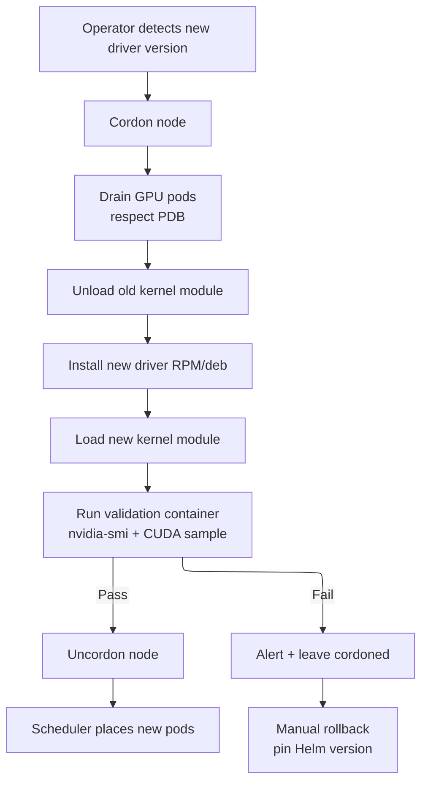
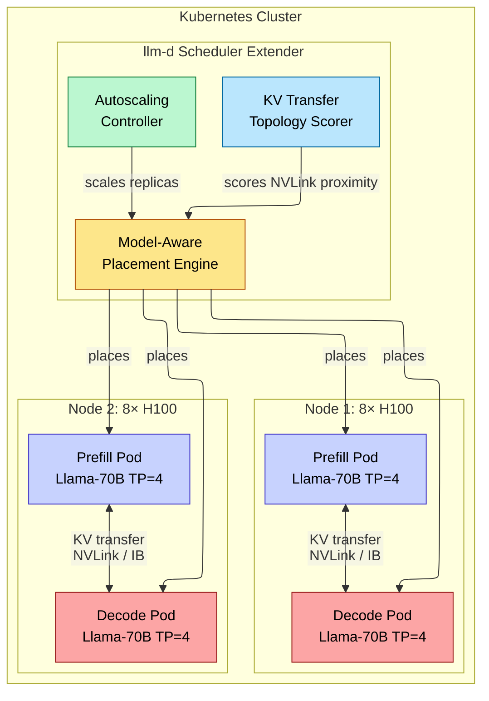
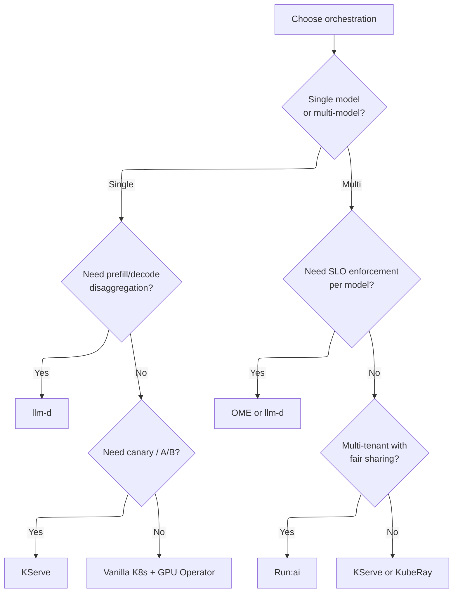
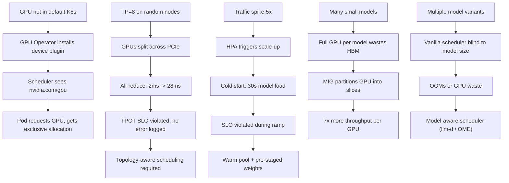

# Kubernetes and Orchestration — GPU Scheduling, MIG, and Autoscaling

> **Layer:** L8.
> **Prerequisites:** [Rack_Scale_Design](../L4_Systems_and_Interconnects/02_Rack_Scale_Design.md), [Inference_Frameworks](08_Inference_Frameworks.md), [Production_Architecture](15_Production_Architecture.md).
> **Hands off to:** [Observability_and_Debugging](14_Observability_and_Debugging.md).

---

## 0. Why this page exists

Every concept in the preceding layers — NVLink topology, HBM bandwidth, tensor parallelism, KV cache sizing, batching strategies — must be *deployed* onto physical hardware in a way that is reproducible, elastic, fault-tolerant, and observable. That deployment substrate is almost always Kubernetes. This page covers the machinery that makes GPUs first-class citizens in a Kubernetes cluster: how the scheduler discovers them, how they are partitioned (MIG), how topology-aware placement avoids silent performance collapse, how autoscaling copes with the uniquely slow cold-start of LLM replicas, and how purpose-built orchestrators (llm-d, OME) extend vanilla K8s with model-aware scheduling.

Four invariants frame the discussion:

1. **GPUs are not default-schedulable in Kubernetes** — the NVIDIA device plugin and GPU operator must be installed before any pod can request `nvidia.com/gpu`.
2. **Topology ignorance is catastrophic** — a tensor-parallel group split across PCIe instead of NVLink suffers 10–15× collective slowdown, invisible to the scheduler without explicit topology hints.
3. **LLM cold starts are 10–100× slower than web-app cold starts** — autoscaling must be supplemented with warm pools and pre-staged weights.
4. **GPU memory is the primary scheduling constraint** — not CPU, not RAM, but HBM capacity determines which models can be colocated, how many replicas fit per node, and whether MIG partitioning is worthwhile.

---

## 1. The NVIDIA GPU Operator

### 1.1 Role and Scope

The GPU Operator is a Helm-chart meta-controller that installs and manages the full GPU software stack on every node in the cluster. Without it, fleet management of GPU drivers, container runtimes, and monitoring agents is a manual, error-prone process that does not scale beyond a handful of nodes.

Components managed by the operator:

| Component | Function | Runs as |
|---|---|---|
| NVIDIA driver | Kernel module, CUDA userspace libraries | DaemonSet |
| Container Toolkit | Runtime hook exposing GPUs to containerd/CRI-O | DaemonSet |
| Device plugin | Advertises `nvidia.com/gpu` to kubelet | DaemonSet |
| DCGM exporter | Prometheus metrics for GPU health, utilization, memory | DaemonSet |
| MIG manager | Configures MIG profiles per node | DaemonSet |
| GPU Feature Discovery | Labels nodes with GPU model, driver version, CUDA version | DaemonSet |
| Node Feature Discovery | Labels nodes with CPU topology, NUMA, PCIe tree | DaemonSet |
| Validator | Post-install sanity check (`nvidia-smi`, CUDA sample) | Job |

The operator reconciles continuously: if a node's driver is accidentally removed, the operator re-installs it; if the device plugin crashes, it is restarted by the K8s controller manager.

### 1.2 Upgrade Lifecycle

Driver upgrades are the most dangerous operation. The operator performs a rolling update:

1. Cordon the node (mark unschedulable).
2. Evict GPU workloads (respecting `PodDisruptionBudget`).
3. Unload the old kernel module.
4. Install the new driver and kernel module.
5. Run the validation container.
6. If validation passes, uncordon the node.
7. If validation fails, leave the node cordoned and alert.



**Driver–CUDA compatibility.** Every CUDA toolkit version requires a minimum driver version. The operator enforces this via a compatibility matrix embedded in its Helm values. A mismatch between operator version and the host OS kernel can block the upgrade entirely — the kernel module build fails. Always verify the operator's supported OS matrix before upgrading.

**Rollback strategy.** Pin a known-good operator version in the Helm release. If a driver causes regressions (spurious CUDA errors, NVLink instability), revert the Helm release:

$$
\text{Rollback command: } \texttt{helm rollback gpu-operator <revision>}
$$

### 1.3 Resource Advertising Flow

The device plugin is the bridge between physical GPUs and the Kubernetes scheduler. Its operation proceeds in four phases:

1. **Discovery.** On startup, the plugin enumerates all GPUs via NVML (`nvidia-smi -a`).
2. **Advertising.** The plugin registers with kubelet, exposing `nvidia.com/gpu` as an extended resource with a quantity equal to the number of GPUs on the node.
3. **Allocation.** When the scheduler places a pod requesting `nvidia.com/gpu: N`, kubelet calls the plugin's `Allocate()` gRPC. The plugin returns the device IDs of N GPUs and configures the container's CUDA_VISIBLE_DEVICES environment variable.
4. **Exclusive allocation.** By default, each GPU is assigned to at most one pod. The plugin tracks allocations and refuses to over-subscribe.

```yaml
# Minimal pod requesting one GPU
apiVersion: v1
kind: Pod
metadata:
  name: gpu-test
spec:
  containers:
  - name: cuda
    image: nvidia/cuda:12.6.0-base-ubuntu22.04
    command: ["nvidia-smi"]
    resources:
      limits:
        nvidia.com/gpu: 1
```

After allocation, the container sees exactly the assigned GPUs. Running `nvidia-smi` inside the container shows only those devices. This is **exclusive allocation** — no other pod on the same node can use those GPUs until the owning pod terminates.

### 1.4 NVIDIA K8s Device Plugin v0.17--0.19 (2025--2026)

The v0.17--0.19 release series brings substantial changes for Blackwell architecture support and multi-device injection:

**Blackwell architecture labels.** The device plugin and GPU Feature Discovery (GFD) now expose detailed Blackwell-specific labels. Nodes with B200/B300 GPUs receive labels including GPU product identifier, HBM3e capacity (192 GB or 288 GB), FP4/FP8 compute capability flags, and NVLink generation (NVLink 5). This enables the scheduler to distinguish Blackwell from Hopper nodes for heterogeneous pool placement in disaggregated serving.

**CDI (Container Device Interface) support.** CDI is becoming the standard mechanism for injecting devices into containers in Kubernetes, replacing the older device plugin `Allocate()` gRPC approach for multi-device scenarios. In the CDI model:

1. The device plugin generates CDI specification files (JSON) describing available devices.
2. The container runtime (containerd v2.0+, CRI-O v1.30+) reads CDI specs and injects devices directly into the container's OCI spec.
3. Pods request devices using CDI names: `nvidia.com/gpu=GPU-abcdef01-...`.

CDI solves several problems with the legacy device plugin approach:
- **Multi-device scenarios.** A pod requesting 8 GPUs, RDMA HCAs, and IMEX channels requires coordinated injection across multiple device types. CDI provides a unified mechanism; the legacy approach requires each plugin to independently modify the container spec, which can conflict.
- **Reproducibility.** CDI specs are declarative and inspectable. The exact device configuration for any container can be reconstructed from the CDI files, simplifying debugging.
- **Runtime-level enforcement.** Device isolation is enforced by the container runtime, not the device plugin. This is more robust than environment-variable-based approaches (`CUDA_VISIBLE_DEVICES`), which can be overridden or misconfigured.

CDI is now the recommended injection mode for production clusters. The device plugin v0.18+ defaults to CDI when the container runtime supports it. Legacy mode remains available as a fallback.

**IMEX channel injection.** Blackwell introduces IMEX (Inter-Module Exchange) channels for high-bandwidth communication between GPU complexes within a rack. The device plugin v0.18+ exposes IMEX channels as CDI devices, enabling pods to request them alongside GPUs. IMEX is critical for NVL72 disaggregated deployments where prefill and decode instances communicate over the rack-scale fabric.

**Integrated GPU Feature Discovery.** Previously a separate DaemonSet, GFD is now integrated into the device plugin binary (v0.17+). This reduces the number of DaemonSets the GPU Operator must manage and eliminates version skew between the plugin and GFD. Labels are now emitted by the same process that discovers and allocates devices, ensuring consistency.

---

## 2. MIG — Multi-Instance GPU

### 2.1 Hardware-Isolated Partitioning

A100, H100, and B200 GPUs support Multi-Instance GPU (MIG), which partitions a single physical GPU into hardware-isolated slices. Each slice receives a dedicated portion of:

- **Streaming multiprocessors (SMs)** — compute units, statically assigned.
- **HBM** — memory controllers and address space, statically partitioned.
- **L2 cache** — partitioned so one instance cannot evict another's data.
- **NVDEC/NVJPG** — media engines, shared or partitioned by profile.

H100 SXM MIG profiles:

| Profile | SMs | HBM | Memory BW fraction | Typical use |
|---|---|---|---|---|
| `1g.10gb` | 14 | 10 GB | 12.5% | Small models (< 8B), embeddings, LoRA adapters |
| `1g.20gb` | 14 | 20 GB | 25% | Medium models (8B–14B FP16) |
| `2g.20gb` | 28 | 20 GB | 25% | Medium models with larger KV cache |
| `3g.40gb` | 42 | 40 GB | 50% | 70B models in FP8 / INT4 |
| `4g.40gb` | 60 | 40 GB | 50% | 70B models with room for KV cache |
| `7g.80gb` | 132 | 80 GB | 100% | Full GPU (no partitioning) |

The GPU operator's MIG manager configures profiles declaratively per node via a `ConfigMap`:

```yaml
apiVersion: v1
kind: ConfigMap
metadata:
  name: mig-partition-config
data:
  config.yaml: |
    version: v1
    mig-configs:
      all-1g.10gb:
        - devices: all
          mig-enabled: true
          mig-devices:
            1g.10gb: 7
```

This creates 7 MIG devices of 10 GB each on every H100. The device plugin then advertises 7 `nvidia.com/mig-1g.10gb` resources instead of 1 `nvidia.com/gpu`.

### 2.2 MIG Throughput Analysis

For a decode-only workload that is memory-bandwidth-bound, the throughput of a MIG slice scales linearly with the memory bandwidth fraction:

$$
\text{Tokens/s}_{\text{slice}} = \frac{\text{BW}_{\text{fraction}} \times \text{HBM BW}_{\text{peak}}}{\text{Model size (bytes)}}
$$

For a Llama-3 8B model in FP8 ($\approx$ 8 GB weights) on a `1g.10gb` slice of H100 (HBM BW = 3,350 GB/s, fraction = 0.125):

$$
\text{Tokens/s} = \frac{0.125 \times 3{,}350}{8} \approx 52.3 \text{ tokens/s}
$$

Compare with the full GPU:

$$
\text{Tokens/s}_{\text{full}} = \frac{3{,}350}{8} \approx 418.8 \text{ tokens/s}
$$

Seven `1g.10gb` slices deliver $7 \times 52.3 = 366$ tokens/s aggregate, or 87.4% of the full GPU. The 12.6% overhead comes from SM partitioning granularity and per-slice scheduler overhead. This is an excellent trade-off when you need throughput for many independent small-model requests rather than throughput for a single large model.

### 2.3 MIG vs. Time-Slicing vs. MPS

| Property | MIG | Time-slicing | MPS |
|---|---|---|---|
| Isolation | Hardware (SM + HBM + L2) | None (temporal multiplex) | Partial (shared address space) |
| Performance predictability | Deterministic | Unpredictable, noisy-neighbor | Good for cooperative workloads |
| Configuration | Static (requires planning) | Dynamic (per-pod) | Dynamic |
| Over-subscription | No (fixed slices) | Yes (time-quantum sharing) | Yes (cooperative multiprocess) |
| NVLink access | No inter-slice NVLink | Full GPU access | Full GPU access |
| Production suitability | Multi-tenant production | Dev/test only | Same-team batch |

**When to use MIG:** multi-tenant inference hosting many small models; latency-critical workloads requiring guaranteed QoS; development environments where each user gets an isolated slice.

**When not to use MIG:** large-model inference spanning multiple GPUs (MIG slices cannot participate in tensor parallelism); workloads needing NVLink between slices; training jobs that need the full GPU.

### 2.4 MIG Scheduling in Kubernetes

The device plugin advertises MIG slices as distinct resource types. A pod requests a specific profile:

```yaml
resources:
  limits:
    nvidia.com/mig-1g.10gb: 1
```

The scheduler matches this to nodes that have the requested MIG profile configured. If the MIG configuration on a node changes (e.g., from `all-1g.10gb` to `all-3g.40gb`), existing pods must be drained first — MIG reconfiguration requires all GPU workloads on that node to stop.

---

## 3. Topology-Aware Scheduling

### 3.1 The Problem: Invisible Topology Mismatch

Kubernetes' default scheduler places pods based on resource requests (CPU, memory, GPU count) without considering *where* those resources are physically located. For LLM inference, this creates a silent catastrophe: a tensor-parallel group of 8 GPUs may be split across two PCIe switches, or across NUMA domains, with no error and no warning — just a 10–15× collective slowdown.

The bandwidth difference is stark:

| Interconnect | Bandwidth | Latency |
|---|---|---|
| NVLink 4 (H100) | 900 GB/s bidirectional | ~1 $\mu$s |
| PCIe Gen5 x16 | 64 GB/s bidirectional | ~500 ns + switch hops |
| NUMA remote (cross-socket) | 40–80 GB/s | ~100–200 ns additional |
| NUMA local | 200+ GB/s | ~50 ns |

For TP = 8 where every forward and backward pass requires an all-reduce across all 8 GPUs, the collective time scales inversely with the bottleneck link bandwidth:

$$
T_{\text{allreduce}} \propto \frac{\text{Message size}}{\min(\text{link BW across group})}
$$

An NVLink-connected group completes the all-reduce in $\sim$2 ms. A PCIe-split group takes $\sim$28 ms. For a decode step that should take 15 ms total, the PCIe-split group spends 28 ms in communication alone — throughput drops to near zero.

### 3.2 Topology Discovery

Node Feature Discovery (NFD) labels each node with its GPU topology. Combined with NVIDIA's GPU Feature Discovery, nodes receive labels such as:

```text
labels:
  nvidia.com/gpu.count: "8"
  nvidia.com/gpu.product: "NVIDIA-H100-80GB-HBM3"
  nvidia.com/gpu.topology: "NV12"  # all-to-all NVLink
  topology.kubernetes.io/zone: "us-west-2a"
  node.kubernetes.io/instance-type: "p5.48xlarge"
```

The `nvidia-smi topo -m` command reveals the actual topology:

```text
      GPU0   GPU1   GPU2   GPU3   GPU4   GPU5   GPU6   GPU7
GPU0    X    NV12   NV12   NV12   NV12   NV12   NV12   NV12
GPU1  NV12     X    NV12   NV12   NV12   NV12   NV12   NV12
...
```

All-to-all NV12 means every GPU pair is connected via NVLink with 12 links (900 GB/s). If even one entry shows `SYS` (cross-socket PCIe) or `NODE` (same-socket PCIe), a TP group spanning that pair will bottleneck.

### 3.3 Topology-Aware Scheduling Strategies

**Pod affinity / anti-affinity.** The simplest approach: label nodes with their NVLink domain and use `podAffinity` to colocate tensor-parallel workers on the same domain.

```yaml
affinity:
  podAffinity:
    requiredDuringSchedulingIgnoredDuringExecution:
    - labelSelector:
        matchLabels:
          app: llama-70b-tp8
      topologyKey: kubernetes.io/hostname
```

This ensures all 8 replicas land on the same node — the only topology that guarantees full NVLink connectivity for TP = 8.

**NUMA-aware cPU and GPU pinning.** For workloads that are sensitive to NUMA locality (e.g., GPUDirect RDMA, data-loading pipelines), the device plugin supports NUMA-aware allocation. When enabled, the plugin assigns GPUs that share a NUMA node with the requested CPUs:

$$
\text{Allocation score} = \text{match}(\text{GPU NUMA node}, \text{CPU NUMA node})
$$

This is critical for training pods where the data-loading pipeline runs on CPU and feeds the GPU via pinned host memory. A cross-NUMA allocation adds 100–200 ns per memcpy, which compounds across millions of minibatch transfers.

**Custom topology scheduler.** NVIDIA provides a topology-aware scheduling plugin that extends the K8s scheduler with NVLink-aware scoring. Each node receives a topology score:

$$
\text{Score}(n, G) = \min_{i,j \in G} \text{BW}(n_i, n_j)
$$

where $G$ is the set of GPUs requested and $\text{BW}(n_i, n_j)$ is the interconnect bandwidth between GPUs $i$ and $j$ on node $n$. The scheduler picks the node with the highest score — the node where the worst-case link in the group is still fast.

### 3.4 Gang Scheduling for Distributed Workloads

A distributed inference or training job requires all pods to start simultaneously. Without gang scheduling, partial allocations deadlock: 4 of 8 TP workers start but cannot proceed because the all-reduce requires all 8. Meanwhile, they hold 4 GPUs idle.

**Kueue** (Kubernetes SIG-scheduling) and **Volcano** provide gang scheduling as first-class primitives:

```yaml
apiVersion: kueue.x-k8s.io/v1beta1
kind: LocalQueue
metadata:
  name: inference-queue
spec:
  clusterQueue: gpu-cluster-queue
---
apiVersion: jobset.x-k8s.io/v1alpha2
kind: JobSet
metadata:
  name: llama-70b-tp8
spec:
  replicatedJobs:
  - name: workers
    replicas: 1
    template:
      spec:
        parallelism: 8
        completions: 8
        template:
          spec:
            containers:
            - name: vllm
              resources:
                limits:
                  nvidia.com/gpu: 1
```

Kueue's `ClusterQueue` enforces fair sharing across tenants, supports preemption, and guarantees all-or-nothing allocation. If 8 GPUs are not available in the right topology, the job waits rather than partially allocating.

### 3.5 Dynamo Grove Operator — Topology-Aware Gang Scheduling on NVL72

Dynamo Grove is a Kubernetes operator from the NVIDIA Dynamo 1.0 ecosystem, purpose-built for topology-aware gang scheduling on NVL72 racks. NVL72 racks contain 72 GPUs connected by a full NVLink fabric, and placing workloads correctly within this fabric is critical for both training and disaggregated inference.

**Problem.** A standard Kubernetes scheduler sees 72 GPUs on an NVL72 node and treats them as interchangeable. But NVL72 topology has NUMA domains, PCIe switches, and NVLink hops that affect performance. A disaggregated inference deployment placing prefill instances on one NVLink domain and decode instances on another domain within the same rack suffers higher inter-domain latency than intra-domain placement.

**Grove's approach.** Grove maintains a topology model of each NVL72 rack:

1. **Discovery.** On startup, Grove queries NVML topology for all 72 GPUs, their NVLink connectivity matrix, NUMA affinity, and PCIe switch hierarchy.
2. **Topology scoring.** When a gang-scheduled workload requests N GPUs, Grove scores all possible placements by the minimum inter-GPU bandwidth across the allocation: $\text{Score}(G) = \min_{i,j \in G} \text{BW}(i, j)$.
3. **Gang reservation.** Grove creates a `GrovePlacement` CRD that atomically reserves the selected GPUs. The reservation is all-or-nothing: if the optimal placement is not available, the job waits.
4. **Inter-workload awareness.** Grove tracks all active placements on the rack and scores new placements to minimize interference with existing workloads (e.g., avoiding placing a bandwidth-intensive training job on GPUs that share a PCIe switch with latency-sensitive inference).

```yaml
apiVersion: grove.dynamo.nvidia.com/v1alpha1
kind: GrovePlacement
metadata:
  name: llama-70b-pd-disagg
spec:
  gpuCount: 16
  topologyConstraint: "min-bottleneck"
  minBandwidth: "900GB/s"  # require full NVLink within allocation
  workloadType: "inference-pd"
  prefillPool:
    gpuCount: 4
    placement: "compact"  # minimize inter-prefill hops
  decodePool:
    gpuCount: 12
    placement: "compact"
```

Grove is particularly important for disaggregated serving where prefill and decode pools share an NVL72 rack. Without topology-aware placement, the KV transfer between pools may traverse a suboptimal path within the NVLink fabric, adding latency that is invisible to standard monitoring.

### 3.6 Dynamo K8s Inference Gateway Plugin

Dynamo 1.0 includes a native Kubernetes Gateway API plugin for inference traffic management. The Gateway API (SIG-NETWORK) is the successor to Ingress, providing a more expressive, role-oriented API for L7 traffic routing. The Dynamo plugin extends the standard Gateway API with inference-specific features:

**SLO-aware routing.** The gateway plugin tracks per-model TTFT and TPOT metrics via Prometheus and routes traffic to the replica (or pool) most likely to satisfy the client's SLO. If a decode pool is experiencing elevated TPOT, the gateway redirects new requests to a less-loaded pool, even if that requires a fresh prefill on the new pool.

**Prefix-aware request affinity.** For disaggregated deployments with global KV pools, the gateway hashes incoming prompt prefixes and routes to the prefill replica with the highest cache locality. This is the gateway-level analog of the application-level routing described in [Disaggregated_Serving_2025](10_Disaggregated_Serving_2025.md).

**Priority and preemption.** The gateway supports per-tenant priority levels. When a high-priority tenant's queue grows, the gateway can preempt low-priority in-flight requests (returning a retryable error to the client) to free decode capacity.

```yaml
apiVersion: gateway.networking.k8s.io/v1
kind: HTTPRoute
metadata:
  name: inference-route
spec:
  parentRefs:
  - name: dynamo-inference-gateway
  rules:
  - backendRefs:
    - name: llama-70b-prefill
      port: 8000
    filters:
    - type: ExtensionRef
      extensionRef:
        group: inference.dynamo.nvidia.com
        kind: InferenceRoutingPolicy
        name: slo-aware-policy
```

---

## 4. Autoscaling for LLM Inference

### 4.1 The Cold-Start Problem

LLM autoscaling is fundamentally different from web-app autoscaling because of cold-start latency. A new LLM replica must:

1. **Load model weights** from storage into GPU HBM.
2. **Initialize CUDA context** and allocate KV cache memory pools.
3. **Warm up** the inference engine (first few inferences are slower due to kernel compilation and cache warming).

Cold-start times by model size and storage tier:

| Model | Weight size (FP8) | Local NVMe | Shared FS (Lustre) | S3 single-stream |
|---|---|---|---|---|
| 8B | 8 GB | ~1 s | ~2 s | ~16 s |
| 70B | 70 GB | ~10 s | ~25 s | ~140 s |
| 405B | 405 GB | ~58 s | ~200 s | ~810 s |
| 1T MoE (FP8) | ~200 GB active | ~29 s | ~80 s | ~400 s |

The Kubernetes Horizontal Pod Autoscaler (HPA) reacts in 15–60 seconds to metric changes, then triggers pod creation. The pod then takes 10–200 seconds to become ready. Total reaction time from traffic spike to new capacity: 25–260 seconds. This is far too slow for latency-critical inference.

### 4.2 Warm Pools and Pre-Staging

The standard mitigation is a **warm pool** — a set of pre-loaded but idle replicas that can begin serving immediately.

Sizing the warm pool requires modeling the traffic spike dynamics:

$$
N_{\text{warm}} = \left\lceil \frac{(S - 1) \cdot R_{\text{baseline}} \cdot T_{\text{start}}}{R_{\text{per\_replica}} \cdot (T_{\text{start}} - T_{\text{ramp}})} \right\rceil
$$

where $S$ is the spike multiplier (e.g., $5\times$), $R_{\text{baseline}}$ is baseline RPS, $R_{\text{per\_replica}}$ is per-replica throughput, $T_{\text{start}}$ is cold-start time, and $T_{\text{ramp}}$ is the acceptable ramp-up time.

**Example.** Baseline 100 RPS, spike to 500 RPS ($S = 5$), per-replica capacity 50 RPS, cold-start 30 s, acceptable ramp-up 10 s:

$$
N_{\text{warm}} = \left\lceil \frac{4 \times 100 \times 30}{50 \times (30 - 10)} \right\rceil = \left\lceil \frac{12{,}000}{1{,}000} \right\rceil = 12
$$

Baseline requires 2 replicas; the warm pool adds 12 for a total of 14 replicas. This is expensive but necessary for SLO compliance.

**Pre-staging weights.** A DaemonSet on every GPU node continuously syncs hot model weights from object storage to local NVMe. When a new replica starts, it reads from local NVMe rather than the network:

```yaml
apiVersion: apps/v1
kind: DaemonSet
metadata:
  name: model-cacher
spec:
  selector:
    matchLabels:
      app: model-cacher
  template:
    spec:
      containers:
      - name: sync
        image: model-cache-sync:latest
        volumeMounts:
        - name: nvme
          mountPath: /models
      volumes:
      - name: nvme
        hostPath:
          path: /mnt/nvme-models
```

### 4.3 Horizontal Pod Autoscaler (HPA) with Custom Metrics

Standard HPA scales on CPU utilization — useless for LLM inference where GPU utilization and queue depth are the relevant signals. HPA v2 supports custom and external metrics:

```yaml
apiVersion: autoscaling/v2
kind: HorizontalPodAutoscaler
metadata:
  name: llama-70b-hpa
spec:
  scaleTargetRef:
    apiVersion: apps/v1
    kind: Deployment
    name: llama-70b-vllm
  minReplicas: 2
  maxReplicas: 50
  metrics:
  - type: Pods
    pods:
      metric:
        name: vllm_num_requests_waiting
      target:
        type: AverageValue
        averageValue: "10"
  - type: External
    external:
      metric:
        name: vllm_tpot_p95_seconds
      target:
        type: Value
        value: "0.060"
  behavior:
    scaleUp:
      stabilizationWindowSeconds: 0
      policies:
      - type: Percent
        value: 100
        periodSeconds: 60
    scaleDown:
      stabilizationWindowSeconds: 300
      policies:
      - type: Pods
        value: 1
        periodSeconds: 120
```

**Metric selection guide for LLM inference:**

| Metric | Good for | Caveat |
|---|---|---|
| Queue depth (`num_requests_waiting`) | Reactive scaling, load signal | Must distinguish prefill vs. decode |
| TPOT p95 | Latency SLO enforcement | Noisy at low batch sizes |
| KV cache utilization | Memory pressure signal | Model-specific threshold |
| GPU SM utilization | Compute utilization | Decode is BW-bound, SM% is misleadingly low |
| Requests per second | Throughput-based planning | Requires PromQL aggregation |

### 4.4 KEDA — Event-Driven Autoscaling

KEDA extends HPA with event-driven triggers: scale from Prometheus queries, Kafka lag, cloud queue depth, or any custom source. KEDA can also scale to zero — critical for cost optimization when traffic is bursty.

```yaml
apiVersion: keda.sh/v1alpha1
kind: ScaledObject
metadata:
  name: llama-70b-scaler
spec:
  scaleTargetRef:
    name: llama-70b-vllm
  minReplicaCount: 2
  maxReplicaCount: 50
  cooldownPeriod: 300
  triggers:
  - type: prometheus
    metadata:
      serverAddress: http://prometheus:9090
      metricName: vllm_tpot_p95
      query: |
        histogram_quantile(0.95,
          rate(vllm_request_latency_tpot_seconds_bucket[5m]))
      threshold: "0.060"
  - type: prometheus
    metadata:
      serverAddress: http://prometheus:9090
      metricName: vllm_queue_depth
      query: |
        sum(vllm_num_requests_waiting)
      threshold: "50"
```

KEDA evaluates both triggers and scales if *either* exceeds its threshold. This provides defense-in-depth: even if TPOT is within SLO, a growing queue triggers scale-up before latency degrades.

### 4.5 Autoscaling Stability

A poorly tuned autoscaler oscillates — scaling up, then immediately scaling down, then scaling up again. This is especially damaging for LLM inference because each scale-up triggers a cold start.

**Stability parameters:**

$$
T_{\text{stabilization, up}} = 0 \text{ s (react immediately to load spikes)}
$$

$$
T_{\text{stabilization, down}} = 300\text{--}600 \text{ s (hysteresis to prevent flapping)}
$$

$$
\text{Scale-up rate} = 100\%/60\text{s (double replicas every minute)}
$$

$$
\text{Scale-down rate} = 1 \text{ pod}/120\text{s (remove one pod every 2 minutes)}
$$

The asymmetry is intentional: scale-up is aggressive (cold starts already cost latency, so minimize the number of scale-up events by overshooting slightly), scale-down is conservative (removing a warm replica costs the warm-pool investment).

---

## 5. Model-Aware Scheduling

### 5.1 GPU Memory as the Scheduling Constraint

For LLM inference, the primary resource constraint is not GPU compute but GPU memory (HBM). A model's memory footprint determines how many replicas fit per node:

$$
\text{Memory per replica} = W_{\text{model}} + KV_{\text{cache}} + O_{\text{overhead}}
$$

where $W_{\text{model}}$ is the weight footprint, $KV_{\text{cache}}$ is the allocated KV cache pool, and $O_{\text{overhead}} \approx 1\text{--}2$ GB accounts for CUDA context, activation memory, and framework overhead.

**Packing examples on an H100 (80 GB HBM):**

| Model | Weights (FP8) | KV cache pool | Total per replica | Replicas per H100 |
|---|---|---|---|---|
| 8B | 8 GB | 10 GB | 20 GB | 4 |
| 70B (TP=1, FP8) | 70 GB | — | 70 GB+ | 0 (needs > 80 GB) |
| 70B (TP=2, FP8) | 35 GB/GPU | 15 GB/GPU | 52 GB/GPU | 1 per 2 GPUs |
| 70B (TP=8, FP8) | 8.75 GB/GPU | 5 GB/GPU | 15 GB/GPU | Fits on 1 node (8 GPUs) |

The vanilla K8s scheduler has no awareness of model size. It sees `nvidia.com/gpu: 8` and places one pod, unaware that the pod needs all 8 GPUs for a single model. Model-aware schedulers extend this with additional predicates.

### 5.2 llm-d — LLM-Disaggregated Orchestrator

llm-d (part of the llm-d open-source project) is a Kubernetes scheduler extender purpose-built for LLM inference. It adds:

1. **Model-aware placement.** The scheduler knows the HBM requirements of each model variant and packs replicas to maximize GPU utilization.
2. **Prefill/decode disaggregation awareness.** Prefill and decode pods have different resource profiles (prefill needs compute, decode needs memory bandwidth). The scheduler places them on appropriate hardware.
3. **KV cache transfer topology.** Prefers placements where prefill and decode pods share NVLink or high-BW network for KV cache transfer.
4. **Autoscaling with model-aware metrics.** Scaling decisions account for per-model throughput characteristics rather than generic queue depth.

#### 5.2.1 llm-d CNCF Sandbox (March 2026)

In March 2026, llm-d was accepted as a CNCF Sandbox project, founded by Red Hat, Google Cloud, IBM Research, CoreWeave, and NVIDIA. This marks llm-d's transition from a single-vendor project to a vendor-neutral, community-governed standard for LLM inference orchestration on Kubernetes. Key aspects of the CNCG-hosted llm-d:

**Kubernetes Gateway API integration.** llm-d uses the standard Kubernetes Gateway API (not a custom CRD) for inference traffic management. This means llm-d works with any conformant Gateway API implementation (Envoy Gateway, Istio, Kong) rather than requiring a proprietary proxy. The llm-d scheduler extender integrates with the gateway via `HTTPRoute` filters that provide SLO-aware routing, prefix-aware affinity, and priority-based preemption.

**SLO-aware cost optimization.** llm-d's autoscaling controller optimizes for cost subject to SLO constraints. The objective function:

$$
\min \sum_{i} C_i \cdot R_i \quad \text{subject to} \quad \text{TPOT}_{m} \le \text{SLO}_{m},\; \text{TTFT}_{m} \le \text{SLO}_{m} \quad \forall m \in M
$$

where $C_i$ is the cost per replica of model $i$ and $R_i$ is the number of replicas. This produces the cheapest deployment that meets all SLO targets, rather than a fixed-ratio or heuristic-based approach.

**Wide expert parallelism for MoE.** llm-d adds native support for wide expert parallelism (EP) in Mixture-of-Experts models. MoE models like Mixtral and DeepSeek-V3 have 128+ experts, and EP degrees of 64--256 are common. llm-d's scheduler understands the expert-to-GPU mapping and places pods to minimize the all-to-all communication overhead between expert groups. This is critical for MoE models where the expert all-to-all can dominate decode latency if pods are poorly placed.



### 5.3 OME (Orchestration for Model Execution)

NVIDIA's OME (Orchestration for Model Execution) provides a higher-level abstraction: declare *what* model to serve and *how* (SLOs, throughput targets, model spec), and OME determines *where* to place replicas and *how many* to run.

OME's scheduling loop:

1. **Model registration.** Register a model with its HBM requirement, compute profile, and SLO targets.
2. **Capacity planning.** Given cluster state (available GPUs, current placements), compute the minimum replica set that satisfies all registered models' SLOs.
3. **Placement optimization.** Pack replicas to minimize GPU waste while respecting topology constraints.
4. **Continuous rebalancing.** As traffic shifts, OME dynamically reassigns GPUs between models.

This is analogous to a bin-packing problem with multiple bin sizes (different GPU types) and items of varying sizes (model memory footprints). The objective function:

$$
\min \sum_{i=1}^{N_{\text{nodes}}} \mathbb{1}[\text{node } i \text{ has any allocation}] \cdot C_{\text{node}}
$$

subject to:

$$
\sum_{m \in M} R_{m} \cdot \text{HBM}_{m} \le \text{HBM}_{\text{node}} \quad \forall \text{ nodes}
$$

$$
R_{m} \cdot \text{throughput}_{m} \ge \text{RPS}_{m}^{\text{target}} \quad \forall m \in M
$$

where $R_m$ is the number of replicas for model $m$, $\text{HBM}_m$ is HBM per replica, $C_{\text{node}}$ is the cost of using a node, and $\text{RPS}_m^{\text{target}}$ is the target throughput for model $m$.

---

## 6. Orchestration Approaches Compared

### 6.1 Landscape

| Platform | Abstraction level | GPU awareness | LLM-specific features | Best for |
|---|---|---|---|---|
| Vanilla K8s + GPU Operator | Pod/Deployment | Device plugin / CDI | None | Simple single-model deploys |
| KServe | InferenceService CRD | GPU resources, autoscaling | Canary, transformers | Platform teams, multi-model |
| KubeRay | RayCluster CRD | Ray-native GPU management | Ray Serve, RLHF pipelines | RLHF, multi-stage pipelines |
| llm-d (CNCF Sandbox) | Scheduler extender + Gateway API | Model-aware, topology-aware, MoE EP-aware | Prefill/decode disaggregation, SLO-aware cost optimization | High-throughput LLM fleets |
| OME (NVIDIA) | Model-level intent | Full capacity planning | SLO-driven auto-placement | Enterprise GPU fleet management |
| Run:ai (NVIDIA) | Queue + quota layer | GPU sharing, MIG, fairness | Dynamic quota, oversubscription | Shared multi-tenant clusters |
| Dynamo Grove | Rack-level placement | NVL72 topology-aware | Gang scheduling for NVL72 disaggregation | NVL72 inference racks |

### 6.2 Decision Framework



### 6.3 KServe InferenceService Pattern

KServe wraps the model deployment in a CRD that handles autoscaling, canary rollouts, and pre/post-processing:

```yaml
apiVersion: serving.kserve.io/v1beta1
kind: InferenceService
metadata:
  name: llama-70b-fp8
spec:
  predictor:
    model:
      modelFormat:
        name: vllm
      runtime: kserve-vllm
      storageUri: "s3://models/llama-70b-fp8"
      resources:
        limits:
          nvidia.com/gpu: 4
    minReplicas: 2
    maxReplicas: 20
    scaleTarget: 10
  transformer:
    containers:
    - name: tokenizer
      image: tokenizer-service:latest
```

KServe adds: scale-to-zero (with serverless Knative), canary traffic splitting between revisions, transformer pipeline (pre/post-processing containers chained before/after the predictor), and pluggable runtimes (vLLM, TensorRT-LLM, ONNX Runtime).

### 6.4 KubeRay for LLM Inference

KubeRay maps Ray Serve applications onto Kubernetes. The key advantage for LLM inference is Ray's fine-grained autoscaling: individual serve replicas (vLLM instances) can be added or removed without creating or destroying Kubernetes pods. A single `RayService` CRD manages:

1. A `RayCluster` (head pod + worker pods with GPUs).
2. A Ray Serve application (multiple inference replicas within the cluster).
3. Autoscaling policies at the Ray level (finer-grained than K8s HPA).

KubeRay excels for RLHF/GRPO pipelines where inference, reward scoring, and training must share the same cluster with low-latency data exchange.

---

## 7. Networking for GPU Workloads

### 7.1 RDMA and GPUDirect in Kubernetes

Training and disaggregated inference require RDMA over InfiniBand or RoCE. The standard pod network (Cilium, Calico) does not support RDMA. The solution:

- **Multus** — attaches multiple network interfaces to each pod.
- **SR-IOV CNI** — exposes virtual functions of physical HCAs as pod network devices.
- **NVIDIA Network Operator** — installs Mellanox drivers, RDMA device plugin, and configures SR-IOV.

```yaml
metadata:
  annotations:
    k8s.v1.cni.cncf.io/networks: rdma-network
spec:
  containers:
  - name: trainer
    resources:
      limits:
        nvidia.com/gpu: 8
        rdma/hca: 1
```

NCCL detects the RDMA interface and uses GPUDirect RDMA for GPU-to-GPU communication, bypassing CPU and host memory. The bandwidth gain:

$$
\text{GPUDirect RDMA}: \text{GPU} \xrightarrow{\text{DMA}} \text{HCA} \xrightarrow{\text{IB/RoCE}} \text{HCA} \xrightarrow{\text{DMA}} \text{GPU}
$$

$$
\text{Without GPUDirect}: \text{GPU} \xrightarrow{\text{PCIe}} \text{CPU} \xrightarrow{\text{memcpy}} \text{HCA} \xrightarrow{\text{IB/RoCE}} \text{HCA} \xrightarrow{\text{memcpy}} \text{CPU} \xrightarrow{\text{PCIe}} \text{GPU}
$$

GPUDirect eliminates two CPU round-trips, reducing latency by ~5–10 $\mu$s per message and freeing CPU cycles for data loading.

### 7.2 Service Mesh Considerations

Istio/Envoy sidecars add 1–3 ms per-hop latency and 5–15% CPU overhead per pod. For streaming inference (SSE/WebSocket), each token traverses the proxy, compounding to measurable TPOT regression.

**Recommendation:** disable sidecar injection on inference pods and handle TLS at the ingress gateway:

```text
metadata:
  annotations:
    sidecar.istio.io/inject: "false"
```

---

## 8. Storage for Model Loading

### 8.1 Weight Loading Performance

The time to load model weights into GPU HBM determines cold-start duration. Options, from fastest to slowest:

| Source | Effective bandwidth | 70B FP8 load time | Operational complexity |
|---|---|---|---|
| Local NVMe (pre-staged) | 7–14 GB/s | 5–10 s | DaemonSet sync required |
| Shared parallel FS (Lustre) | 2–5 GB/s | 14–35 s | CSI driver + tuning |
| S3 multi-stream (64 threads) | 7–12 GB/s | 6–10 s | Requires multi-threaded loader |
| S3 single-stream | 0.3–0.5 GB/s | 140–230 s | Unacceptable for production |
| OCI image (baked weights) | Image pull BW | 60–300 s | Large image layers |

**Recommended pattern.** A DaemonSet pre-stages hot model weights on every GPU node's local NVMe. An init container in each inference pod verifies the local copy and falls back to S3 multi-stream if the local copy is stale or missing.

### 8.2 Checkpoint Storage

Training checkpoints are large ($\sim$2–3× model size with optimizer states) and written infrequently. S3 via CSI driver or shared parallel FS is appropriate. For a 70B model with AdamW:

$$
\text{Checkpoint size} = 70\text{B} \times 2\text{B (BF16 weights)} + 70\text{B} \times 4\text{B} \times 2\text{ (FP32 optimizer)} = 700 \text{ GB}
$$

With FSDP sharded checkpointing, each rank writes $700 / N_{\text{ranks}}$ GB, enabling parallel I/O that saturates the storage system's aggregate bandwidth.

---

## 9. Failure and Recovery

### 9.1 Failure Rate Math

For a cluster with $N$ GPUs, each with per-day failure probability $p$:

$$
P(\text{at least one GPU failure per day}) = 1 - (1 - p)^{N}
$$

With $p = 0.001$ and $N = 1024$:

$$
P = 1 - 0.999^{1024} \approx 1 - e^{-1.024} \approx 0.641
$$

Expect a GPU failure roughly every 1.5 days on a 1024-GPU cluster. For inference, a single GPU failure takes down all colocated replicas (if TP spans the failed GPU). Recovery time:

$$
T_{\text{recovery}} = T_{\text{detect}} + T_{\text{reschedule}} + T_{\text{cold start}}
$$

Typical values: $T_{\text{detect}} \approx 30$ s (K8s health check), $T_{\text{reschedule}} \approx 10$ s, $T_{\text{cold start}} \approx 10\text{--}30$ s. Total: 50–70 s of degraded service per failure.

### 9.2 PodDisruptionBudget

During voluntary disruptions (node upgrades, scale-down), PDBs ensure enough replicas remain available:

```yaml
apiVersion: policy/v1
kind: PodDisruptionBudget
metadata:
  name: inference-pdb
spec:
  minAvailable: "80%"
  selector:
    matchLabels:
      app: llama-70b-vllm
```

Combined with `terminationGracePeriodSeconds: 300` and a pre-stop hook that drains in-flight requests, this ensures SLO compliance during maintenance.

---

## 10. Multi-Tenancy and Fair Sharing

### 10.1 Quota and Isolation

```yaml
apiVersion: v1
kind: ResourceQuota
metadata:
  name: team-a-gpu-quota
  namespace: team-a
spec:
  hard:
    requests.nvidia.com/gpu: "32"
    limits.nvidia.com/gpu: "32"
```

### 10.2 Fair-Share Priority

Without fairness, a tenant submitting many jobs monopolizes the cluster. Fair-share schedulers track cumulative GPU-hours per tenant and prioritize under-served tenants:

$$
\text{Priority}(t) = \frac{\text{Quota}(t)}{\text{Used}(t) + \epsilon}
$$

Tenants who have used less than their fair share receive higher scheduling priority. Kueue implements this via `ClusterQueue` with `Cohort` fair-sharing.

---

## 11. End-to-End Cause / Effect



---

## 12. Numbers to Memorize

| Quantity | Value | Why it matters |
|---|---|---|
| NVLink 4 BW (H100) | 900 GB/s bidirectional | TP group *must* stay on NVLink domain |
| PCIe Gen5 x16 BW | 64 GB/s bidirectional | 14× slower than NVLink — catastrophic for TP |
| H100 HBM | 80 GB | Determines model/replica packing |
| H100 HBM BW | 3,350 GB/s | Decode throughput bound |
| H100 MIG `1g.10gb` slice | 14 SMs, 10 GB, 12.5% BW | 7 slices at 87% aggregate efficiency |
| Cold start (70B FP8, NVMe) | ~10 s | Minimum scale-up reaction time |
| Cold start (70B FP8, S3) | ~140 s | Unacceptable without pre-staging |
| Warm pool heuristic | 20–30% of peak replicas | Covers typical traffic spikes |
| HPA scale-down stabilization | 300–600 s | Prevents flapping from LLM cold starts |
| TP=8 all-reduce (NVLink) | ~2 ms | Normal, expected |
| TP=8 all-reduce (PCIe) | ~28 ms | 14× degradation — invisible without topology check |
| GPU failure rate | ~0.1%/day/GPU | 64% chance per day in 1024-GPU cluster |
| Checkpoint size (70B, AdamW) | ~700 GB | Storage planning for training |
| Model weight load (70B, local NVMe) | ~10 s | Cold-start lower bound |
| Istio sidecar overhead | 1–3 ms/hop, 5–15% CPU | Disable on inference data plane |
| CDI device injection overhead | < 100 ms per pod | vs legacy Allocate() gRPC; negligible in practice |
| IMEX channel bandwidth (Blackwell) | ~800 GB/s per channel | NVL72 inter-complex communication |
| Dynamo Grove topology scoring | ~50 ms per placement decision | Trivial vs cold-start time |
| llm-d CNCF founding members | 5 (Red Hat, Google, IBM, CoreWeave, NVIDIA) | Sandbox since March 2026 |
| B200 HBM3e capacity | 192 GB | 2.4x H100; changes replica packing math |
| B300 HBM3e capacity | 288 GB | Largest GPU memory tier; dense model hosting |

---

## 13. Common Pitfalls

- **Wrong resource name.** Use `nvidia.com/gpu`, not `nvidia/gpu`. Pods schedule but receive no GPUs.
- **MIG enabled but workload expects full GPU.** Tensor parallelism will not work on MIG slices — no inter-slice NVLink.
- **No topology pinning for TP.** TP=8 scattered across PCIe links causes 5–15× slowdown, invisible until p99 latency explodes.
- **HPA on CPU utilization.** LLM inference is GPU-BW-bound, not CPU-bound. CPU% is meaningless; use queue depth or TPOT.
- **Missing `terminationGracePeriodSeconds`.** Default 30 s is too short for an LLM server draining in-flight requests. Set 120–300 s.
- **Liveness probe too aggressive.** A long prefill can block the probe, triggering a kill loop. Use startup probes with longer timeouts.
- **No resource requests (only limits).** The scheduler cannot bin-pack without requests; GPUs are wasted on under-utilized nodes.
- **Shared HCA contention.** Two pods on the same HCA halve bandwidth silently. Pin HCAs per pod.
- **Baking weights into OCI images.** A 70 GB image layer takes 60–300 s to pull. Use init containers with multi-stream S3 downloads instead.
- **Forgetting hugepages.** CUDA performance suffers without 2 MB hugepages enabled on the host kernel.
- **Legacy device plugin mode with multi-device pods.** When a pod requests GPUs + RDMA HCAs + IMEX channels, the legacy device plugin `Allocate()` gRPC path can produce conflicting or incomplete container specs. Use CDI mode (device plugin v0.18+) to get coordinated, declarative device injection.
- **Ignoring NVL72 topology for disaggregated inference.** Placing prefill and decode pods on GPUs within an NVL72 rack without considering the NVLink fabric topology (which GPUs share which NVLink switches) can result in suboptimal inter-pool KV transfer paths. Use Grove or a topology-aware scheduler.
- **Assuming Gateway API is just Ingress v2.** The Kubernetes Gateway API provides extension points (filters, backend refs) that are essential for inference-specific routing (SLO-aware, prefix-aware). Treating it as a drop-in Ingress replacement misses the key features that llm-d and Dynamo leverage.
- **Not updating container runtime for CDI.** CDI requires containerd v2.0+ or CRI-O v1.30+. Running an older runtime silently falls back to legacy device plugin mode, losing the multi-device coordination benefits. Verify runtime version before enabling CDI in the device plugin.

---

## 14. Further Reading

**Foundational**
- Kubernetes documentation: Scheduling, Device Plugins, HPA.
- NVIDIA GPU Operator documentation and Helm chart values.
- NVIDIA MIG User Guide: profiles, partitioning, and constraints.

**Recent**
- llm-d CNCF Sandbox project (March 2026): model-aware scheduling, Gateway API integration, SLO-aware cost optimization, wide EP for MoE.
- NVIDIA K8s Device Plugin v0.17--0.19: Blackwell labels, CDI support, IMEX channel injection, integrated GPU Feature Discovery.
- NVIDIA Dynamo Grove operator: NVL72 topology-aware gang scheduling.
- NVIDIA Dynamo K8s Inference Gateway plugin: Gateway API extension for inference routing.
- Container Device Interface (CDI) specification: tag-rs/cdi project, Kubernetes CRI integration.
- Kueue documentation (Kubernetes SIG-scheduling): gang scheduling, fair sharing, Cohorts.
- KServe documentation: InferenceService CRD, canary rollouts, autoscaling.
- KubeRay documentation: Ray Serve on Kubernetes, autoscaling internals.
- NVIDIA OME (Orchestration for Model Execution): capacity planning, SLO-driven placement.
- "Operating LLMs at Scale" — NVIDIA GTC 2025, Anyscale, and Databricks engineering blog posts.

**Cross-references**
- [Rack_Scale_Design](../L4_Systems_and_Interconnects/02_Rack_Scale_Design.md) — physical infrastructure these orchestration tools manage.
- [Inference_Frameworks](08_Inference_Frameworks.md) — vLLM, SGLang, TensorRT-LLM, the engines being orchestrated.
- [Production_Architecture](15_Production_Architecture.md) — end-to-end serving stack design.
- [Observability_and_Debugging](14_Observability_and_Debugging.md) — DCGM, Nsight, TTFT/TPOT metrics for debugging scheduling issues.

---

**Up the stack:** [Observability_and_Debugging](14_Observability_and_Debugging.md).
**See also:** [Inference_Frameworks](08_Inference_Frameworks.md), [Production_Architecture](15_Production_Architecture.md), [Rack_Scale_Design](../L4_Systems_and_Interconnects/02_Rack_Scale_Design.md).
