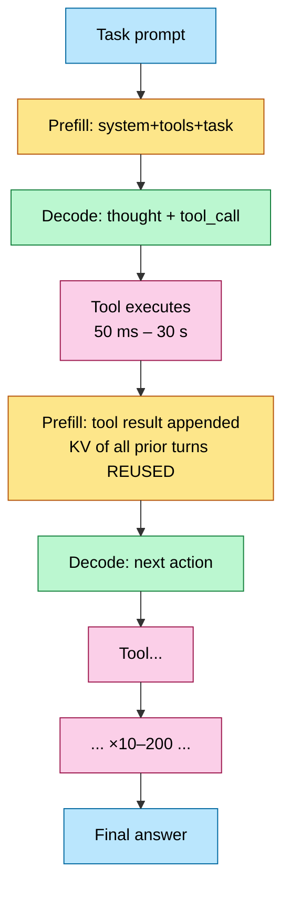

# Agentic Inference — Serving Tool-Calling, Multi-Turn, Long-Horizon Workloads

> **Position in the stack:** the 2026 successor workload to chat. Builds directly on [KV_Cache](KV_Cache.md), [Prefill_Decode_Disaggregation](Prefill_Decode_Disaggregation.md), [Batching_and_Scheduling](Batching_and_Scheduling.md), and [Long_Context_Engineering](Long_Context_Engineering.md); the model-side mechanics are in [Reasoning_Models](../L7_Training_Stack/Reasoning_Models.md).

---

## 0. Why this page exists

By 2026 the dominant production workload is no longer "one prompt → one answer." It is an **agent loop**: the model thinks, emits a structured tool call, an external system executes it (code sandbox, browser, search, MCP server), the result is appended to the context, and the model continues — tens to hundreds of times per task. This changes every serving assumption: requests become *sessions*, context grows monotonically, input tokens dwarf output tokens, latency SLOs apply per-step *and* end-to-end, and KV cache reuse becomes the single biggest cost lever. Vendors now build silicon for exactly this (TPU 8i's 384 MB SRAM, NVIDIA Rubin CPX); engines compete on prefix-cache hit rate as much as raw throughput. Interviews for serving roles in 2026 almost always include "design inference for an agent product."

---

## 1. The workload, quantified

A representative coding-agent task vs a chat request:

| Property | Chat | Agent task |
|---|---|---|
| Turns per request | 1 | 10–200 model steps |
| Context at step $k$ | prompt | system + tools + $\sum_{i<k}$ (thoughts + calls + tool outputs) — monotone growing |
| Input:output token ratio | ~3:1 | **10:1 – 100:1** (tool outputs are big, actions are small) |
| Output per step | 200–2 000 tok | 50–500 tok (a tool call), occasionally long (final answer / code) |
| Latency SLO | TTFT + stream rate | **per-step latency** (agent is blocked on you) + end-to-end task time |
| State | none | session: KV cache, tool sandbox, memory files |

Two structural consequences:

1. **Each step's prefill is an *incremental append*.** Everything before the new tool output is byte-identical to the previous step. Without prefix caching you re-prefill $O(L)$ tokens per step → $O(L^2)$ total work over a task; with it, $O(\Delta)$ per step. For a 100-step task ending at 120K context, that is the difference between ~6M and ~120K+Δ-sum prefill tokens — **a 10–50× cost factor**, bigger than any kernel optimization on this page of the stack.
2. **The session is stateful but the fleet is load-balanced.** KV locality vs load spreading becomes the central routing tension (§2.3).

---

## 2. KV reuse — the dominant optimization

### 2.1 Prefix caching mechanics

Paged KV (see [KV_Cache](KV_Cache.md)) hashes each block of token IDs (chained: block hash includes prefix hash). On a new request, the engine walks the longest cached prefix and only prefills the suffix. SGLang's **RadixAttention** generalizes this: all live and recent sequences live in one radix tree over token IDs, so reuse happens across *requests that share any prefix* — system prompts, few-shot headers, the agent's whole history — with LRU eviction on tree leaves.

Hit-rate arithmetic: step $k$ has context $L_k$, new suffix $\Delta_k$ (tool output + last action). Cache hit fraction per step $= 1 - \Delta_k/L_k \to$ typically **90–99% token reuse** by mid-task. Published agentic traces (Claude-style coding agents, 2025–26) report cluster-wide prefix-cache hit rates of 70–90% — and provider pricing reflects it (cached input tokens billed at ~10% of fresh).

### 2.2 Where the cached KV lives — the offload hierarchy

A 100-step session may idle for seconds-to-minutes during tool execution; HBM is too expensive to hold every idle session's KV.

| Tier | Capacity/GPU-node | BW | Restore cost for 50K-token KV (8B, GQA, FP8 ≈ 3 GB) |
|---|---|---|---|
| HBM | 100s GB | 3–22 TB/s | 0 (resident) |
| CPU DRAM (LMCache/Mooncake tier) | 1–4 TB | ~50 GB/s PCIe5 ×16 | ~60 ms |
| Local NVMe | 10s TB | 5–14 GB/s | ~0.3–0.6 s |
| Remote KV store / object | ∞ | 1–10 GB/s | 0.3–3 s |

Design rule: **restore time must hide inside tool-execution time.** A 5 s sandbox command gives you a free NVMe round-trip; a 50 ms search call means the session must stay in HBM or DRAM. Engines (vLLM V1 + LMCache connector, Mooncake, Dynamo's KV-aware tiers) restore asynchronously on tool-completion events, before the continuation request arrives.

### 2.3 Cache-aware routing

With N replicas, a session's KV lives on the replica that served it. The router must trade:

$$
\text{score(replica)} = \alpha \cdot \text{prefix\_overlap} - \beta \cdot \text{load} 
$$

Pure session-affinity (sticky routing) maximizes hits but hotspots; pure least-loaded gets ~1/N hit rate. Production routers (SGLang router, vLLM Production Stack, NVIDIA Dynamo) approximate the radix-tree state of each replica and route on overlap-minus-load; measured gains are 2–5× TTFT at equal load vs round-robin on agentic traffic.

---

## 3. Structured output — every step must parse

Agent steps are not prose: they must be valid JSON / tool-call grammar / code-diff format. Constrained decoding masks invalid tokens per step.

- **Naive guided decoding**: evaluate grammar against the full vocab each step on CPU → can dominate decode latency; even optimized grammar masking costs ~5–15% of decode throughput when not overlapped with the forward pass.
- **Compressed FSM (SGLang/XGrammar/llguidance class)**: compile the JSON-schema/grammar to a token-level FSM offline; per-step mask = current-state lookup; **overlap mask computation with the GPU forward pass** so its cost hides entirely. ~3× faster structured generation than naive guidance.
- **Jump-forward decoding**: when the FSM has a single legal continuation (e.g., `","` `"name"` `":"` inside fixed JSON syntax), emit those tokens *without model forward passes* — multi-token skips. Synergizes with agent formats which are syntax-heavy.

Failure mode to design for: schema changes per step (different tool subsets enabled) → FSM compile cost on the request path. Cache compiled grammars by schema hash; compile async at tool-registration time.

---

## 4. Scheduling agents — sessions, not requests

### 4.1 The continuation-priority problem

A continuation (step $k{+}1$ of a live task) and a fresh task arrive together. FCFS treats them equally — but the continuation has a human/agent blocked end-to-end, its KV is hot (cheap to serve), and finishing tasks drains system state. Production policy:

- **Priority = f(turn depth, KV-hotness, task deadline)** — continuations preempt fresh prefills.
- **Admission control at the task level**, not request level: admitting a new agent task commits you to ~50–200 future steps of load. Token-bucket on *projected* step volume, or the system oscillates.
- **Speculative continuation**: for tools with predictable output schemas, some stacks pre-prefill the expected-shape continuation during tool execution and patch the diff (advanced; only pays when tool latency ≫ prefill time).
- **Session-aware scheduling with KV reservation** — the scheduler tracks which sequences belong to which agent session and keeps their KV warm across turns, which may mean reserving KV blocks for paused agents even when other requests could use them. Paused-on-tool agents get lower priority than actively decoding agents or fresh requests, so idle sessions do not monopolize GPU work.
- **GPU sharing during tool pauses** — while an agent waits on a tool (milliseconds for a calculator, seconds for a web search), its KV occupies memory but generates no GPU work; the scheduler backfills with other requests and preserves the paused session's KV in HBM or an offload tier (§2.2).

### 4.2 Interaction with disaggregation

Agentic traffic sharpens the prefill/decode split ([Prefill_Decode_Disaggregation](Prefill_Decode_Disaggregation.md)): steps are long-prefill + short-decode. The 2026 hardware answer is heterogeneous: **Rubin CPX** (GDDR7, compute-dense, cheap per prefill FLOP) handles the incremental prefills; HBM4 Rubin handles KV-resident decode; **TPU 8i**'s 384 MB on-chip SRAM exists to keep decode working sets (attention state, small-batch KV tiles) off HBM entirely. When asked "why are vendors splitting inference silicon" — *agentic prefill:decode asymmetry* is the answer.

### 4.3 Tool execution off the critical path

- Run sandboxes/browsers on separate CPU fleets; never co-host with model servers (noisy neighbors vs deterministic decode latency).
- **Parallel tool calls** (model emits N calls in one step): scatter-gather, append all results in one continuation → one prefill instead of N.
- Stream tool output into the prompt as it arrives (chunked prefill of the growing suffix) when tools emit slowly.

### 4.4 Engine support — NVIDIA Dynamo's agentic hints

NVIDIA Dynamo (the inference framework succeeding TensorRT-LLM and Triton Inference Server) ships explicit agentic-workload optimizations, indicative of where engines are heading:

- **Session affinity** — requests from the same agent session route to the same inference replica, keeping the KV cache local and avoiding cross-node transfers (the routing policy of §2.3).
- **KV cache persistence** — KV blocks can be pinned to specific sessions, marked as reserved and excluded from the normal eviction policy during tool-execution pauses.
- **Tool-call streaming** — structured output streams incrementally, so tool execution can begin before the full call is generated (e.g., fire the HTTP request as soon as the URL argument completes).
- **Disaggregated agent scheduling** — the scheduler tracks session states (active decoding / tool-waiting / tool-executing) and adjusts batch composition accordingly, prioritizing active agents.

These optimizations are early but indicate the direction: inference frameworks are evolving from single-request optimization to session-aware, agent-optimized serving.

---

## 5. Long-horizon context management

Context grows ~ (tool output size) per step and tasks die at the context limit. Mitigations, in order of production prevalence:

1. **Tool-output truncation/structuring** — cap each observation (head+tail of logs), or have a smaller model (or the agent itself) summarize verbose tool outputs before appending — typically 5–10× reduction for structured data (JSON API responses, web pages). Biggest single lever; costs accuracy if too aggressive.
2. **Compaction** — model summarizes its own history into a compact state, old turns evicted; restart with summary + recent turns. Costs one summarize step + a cold full prefill; schedule compaction *during a long tool call* to hide it.
3. **KV-cache compression** ([Modern_KV_Compression](Modern_KV_Compression.md)) — quantized (FP8/FP4) KV, eviction (H2O/SnapKV-class) for tolerant workloads; MLA-style architectural compression solves it at the model level.
4. **Memory files / external state** — agent writes durable notes to disk and re-reads selectively; converts context tokens into retrieval. A sliding-window variant keeps only the most recent N tokens active and retrieves older context from a vector store (RAG) when relevant.

The serving-side accounting: per-step cost ≈ $c_{\text{prefill}}\Delta_k + c_{\text{decode}}O_k + c_{\text{KV-hold}} L_k \tau_k$ where $\tau_k$ is tool wait time. For long tasks the **KV-hold term dominates the marginal cost** — which is why offload tiers (§2.2) and compaction are economic, not just capacity, decisions.

---

## 6. SLOs and capacity math

Define per-step TTFT $t_s$ (continuation latency), step decode time $d$, tool time $x$. End-to-end task latency over $n$ steps:

$$
T = \sum_{k=1}^{n} \left( t_{s,k} + d_k + x_k \right)
$$

With $n = 50$, shaving 200 ms off mean $t_s$ saves 10 s per task — per-step latency *multiplies* in a way chat never did. Conversely a 1% per-step failure rate compounds to $1 - 0.99^{50} \approx 39\%$ task failure: **per-step reliability requirements are 10–100× stricter** than chat. This drives retry-with-same-KV design (idempotent continuations, KV pinned until step ack'd).

---

## 7. Numbers to memorize

| Quantity | Value | Why |
|---|---|---|
| Agent input:output token ratio | 10:1 – 100:1 | prefill-dominant economics |
| Steps per agent task | 10–200 | session-level capacity planning |
| Per-step token reuse by mid-task | 90–99% | prefix caching is mandatory |
| Cluster prefix-cache hit rates (agentic) | 70–90% | routing + caching done right |
| Cached-token price discount (typical API) | ~90% off | reflects real cost structure |
| KV restore over PCIe5 (3 GB) | ~60 ms | hides in tool latency |
| Per-step failure → 50-step task failure | 1% → ~39% | reliability compounding |
| Compressed-FSM structured output speedup | ~3× | overlapped grammar masks |
| Cache-aware routing TTFT gain | 2–5× | vs round-robin on agent traffic |
| TPU 8i on-chip SRAM | 384 MB (3× Ironwood) | silicon built for agentic decode |

---

## 8. Worked problems

**Problem 1 — what prefix caching is worth.** Coding agent: 60 steps, context grows linearly from 8K to 128K tokens, mean Δ per step = 2K. Cluster prefills at an effective 20K tok/s/GPU. Compare GPU-seconds of prefill per task with 0% vs 95% prefix reuse.

*Solution.* No reuse: total prefill = Σ Lₖ ≈ 60 × (8K+128K)/2 = 4.08M tokens → 204 GPU-s. With 95% reuse: charged tokens ≈ 0.05 × 4.08M = 204K, but floor is the genuinely-new suffix Σ Δₖ = 120K; take ≈ 204K → ~10.2 GPU-s. **20× prefill cost reduction**; at 3 000 tasks/hour that's ~170 GPU(s) of continuous prefill capacity saved — more than any kernel-level win available.

**Problem 2 — offload tier choice.** Session KV = 6 GB (70B GQA FP8 @ 96K ctx). Tool latency distribution: 50% of calls 200 ms, 50% are 8 s. HBM hold cost is the bottleneck; PCIe5 restore BW 50 GB/s, NVMe 10 GB/s. Design the eviction policy.

*Solution.* Restore times: DRAM 6/50 = 120 ms; NVMe 6/10 = 600 ms. Policy: on tool dispatch, classify the call (tool type predicts latency). Fast-tool steps (200 ms): keep KV in HBM — even DRAM restore (120 ms) would ~1.6× the effective step gap and DRAM round-trip adds offload write traffic too. Slow-tool steps (8 s): evict to DRAM (or NVMe if DRAM pressure) immediately; 120–600 ms restore hides fully inside 8 s, triggered on tool-completion webhook, not on continuation arrival. Expected HBM residency halves with zero added latency.

**Problem 3 — task admission.** Each live task averages 1 step / 10 s, costing 0.5 GPU-s/step (prefill+decode amortized, with caching). A 64-GPU cluster must keep per-step p99 TTFT < 500 ms, which empirically requires ≤ 70% utilization. Max concurrent tasks?

*Solution.* Capacity at 70%: 64 × 0.7 = 44.8 GPU-s/s. Demand per task = 0.5/10 = 0.05 GPU-s/s. Max ≈ 44.8/0.05 = **~900 concurrent tasks**. Note the lever ordering: raising cache hit rate from 95→98% cuts the 0.5 GPU-s/step materially (prefill-dominated), worth more than 10% more GPUs.

---

## Cross-references

- Prerequisites: [KV_Cache](KV_Cache.md), [Batching_and_Scheduling](Batching_and_Scheduling.md), [Prefill_Decode_Disaggregation](Prefill_Decode_Disaggregation.md).
- Siblings: [Long_Context_Engineering](Long_Context_Engineering.md), [Modern_KV_Compression](Modern_KV_Compression.md), [Disaggregated_Serving_2025](Disaggregated_Serving_2025.md), [Speculative_Decoding](Speculative_Decoding.md).
- Model side: [Reasoning_Models](../L7_Training_Stack/Reasoning_Models.md), [Frontier_Models_2025_2026](../L6_Algorithms_and_Models/Frontier_Models_2025_2026.md).
- Hardware: [Google_TPU](../L3_Microarchitecture/Google_TPU.md) (TPU 8i), [Accelerator_Landscape_2026](../L3_Microarchitecture/Accelerator_Landscape_2026.md) (Rubin CPX).
