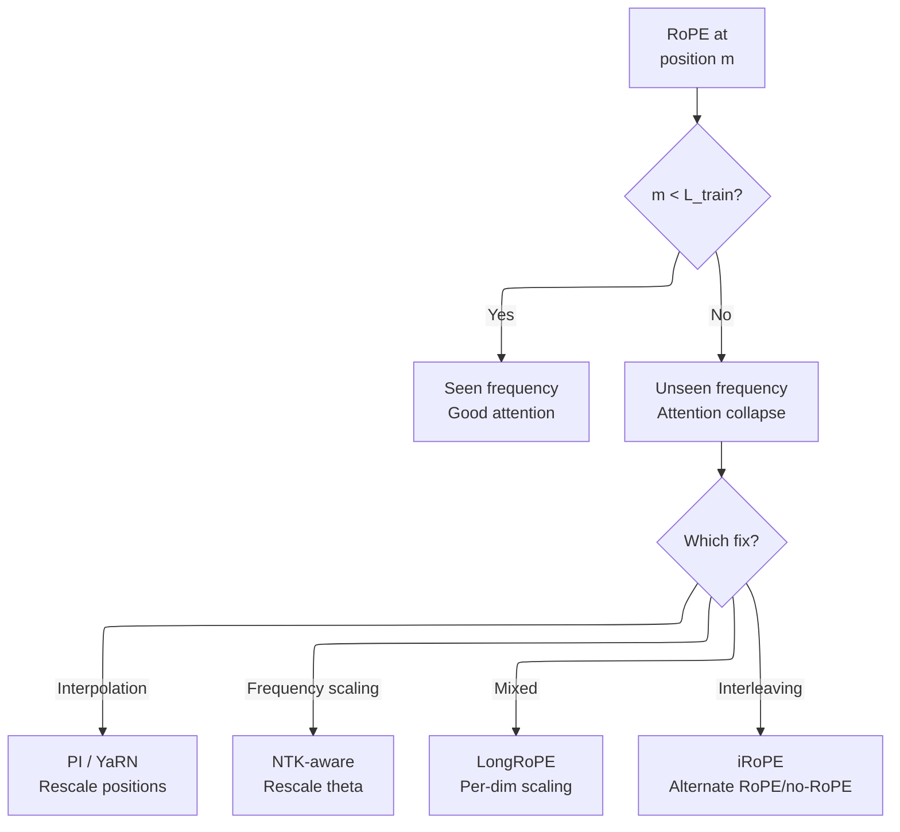
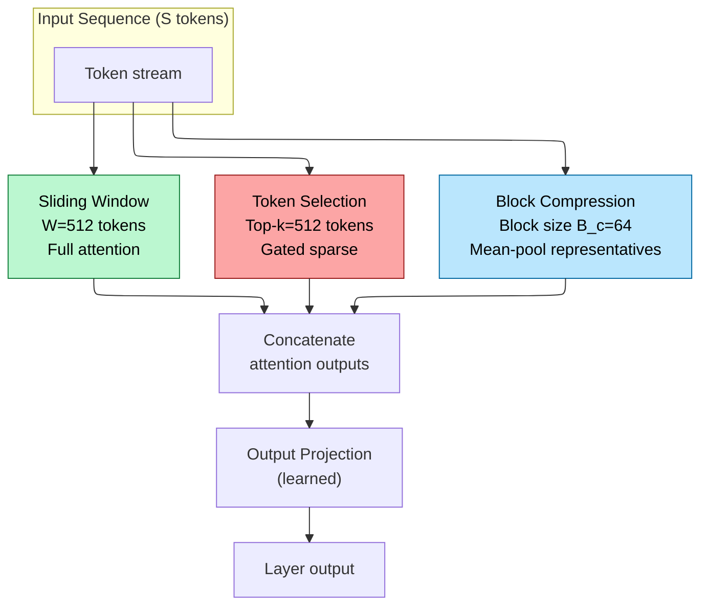
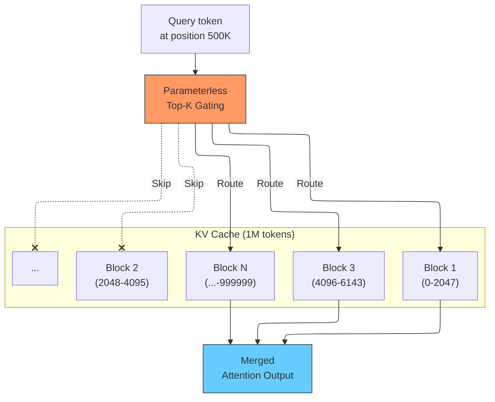
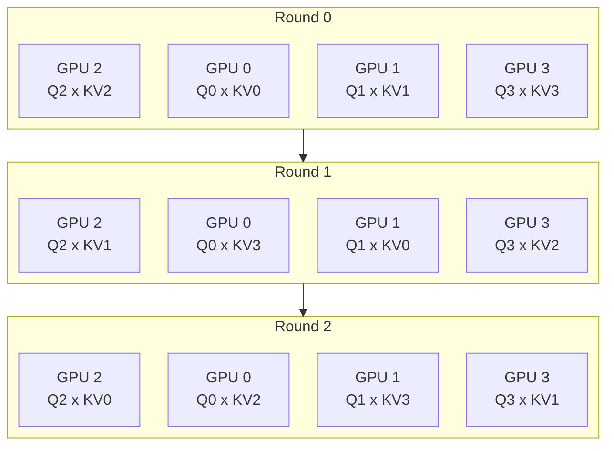
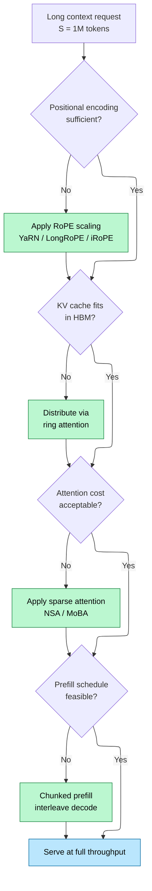

# Long Context Engineering -- From 8K to 1M+ Tokens

> **Layer:** L8. **Prerequisites:** [Attention_Mechanisms](../L6_Algorithms_and_Models/Attention_Mechanisms.md), [KV_Cache](KV_Cache.md), [Modern_KV_Compression](Modern_KV_Compression.md). **Hands off to:** [Production_Architecture](Production_Architecture.md).

---

## 0. Why This Page Exists

Every mainstream frontier model in 2025--2026 ships with a context window between 128K and 10M tokens. Gemini 1.5 Pro demonstrated 1M-token inference in early 2024; Gemini 2 pushed to 2M; Llama-4 Scout targets 10M. But a model's *training* context window and its *serving* context window are fundamentally different problems. Training at 1M tokens demands distributed attention across hundreds of GPUs with sequence parallelism; serving at 1M tokens demands fitting an enormous KV cache into finite HBM and maintaining acceptable decode latency. Both demand principled positional encoding extrapolation, because RoPE-based models trained at 8K--128K cannot naively attend to position indices an order of magnitude larger.

This page covers the full engineering stack that bridges 8K pretraining to 1M+ production inference:

1. **Positional encoding scaling** -- how RoPE-based models extrapolate beyond their training length (YaRN, LongRoPE, iRoPE).
2. **Sparse and structured attention** -- how to reduce the $O(S^2)$ cost of full attention at million-token scale (NSA, MoBA).
3. **Distributed context parallelism** -- ring attention and sequence-parallel strategies for training and prefill.
4. **Chunked prefill** -- how serving systems break up million-token prompts without blowing the schedule.
5. **Memory math at extreme sequence lengths** -- concrete KV cache budgets from 128K to 10M tokens.

### Notation

| Symbol | Meaning | Typical value |
|--------|---------|---------------|
| $S$ | Sequence length (tokens) | 8K -- 10M |
| $d_h$ | Head dimension | 64 -- 256 |
| $H$ | Number of query heads | 32 -- 128 |
| $n_{\text{kv}}$ | KV heads (GQA) | 1 -- 8 |
| $n_l$ | Transformer layers | 32 -- 126 |
| $b$ | Bytes per element | 2 (FP16), 1 (FP8) |
| $\theta$ | RoPE base frequency | 10000 |
| $L_{\text{train}}$ | Training context length | 4K -- 128K |
| $L_{\text{target}}$ | Target context length | 128K -- 10M |
| $s$ | Scale factor $L_{\text{target}} / L_{\text{train}}$ | 8 -- 1000 |

---

## 1. The RoPE Extrapolation Problem

### 1.1 Why RoPE Fails at Unseen Lengths

Rotary Position Embedding (RoPE) encodes position by rotating query and key vectors in 2D subspaces at frequencies $\{\theta_i\} = \{10000^{-2i/d_h}\}$. For a token at absolute position $m$, the rotation applied to the $i$-th dimension pair is:

$$f(q, m) = q \cdot e^{i m \theta_i}$$

At training time, the model has only seen positions $m \in [0, L_{\text{train}})$. At inference with $m > L_{\text{train}}$, two pathologies emerge:

1. **Frequency aliasing.** High-frequency rotation dimensions ($\theta_i$ large) wrap many full cycles even within the training window. At longer positions these dimensions produce angles the model has never seen, causing catastrophic attention-weight distortion.

2. **Resolution loss.** Low-frequency dimensions ($\theta_i$ small) barely rotate within the training window, providing fine positional discrimination. Extrapolating naively stretches them to coarser-than-trained angular separations.

### 1.2 Position Interpolation (PI)

The simplest approach: linearly compress the position index so that $[0, L_{\text{target}})$ maps to $[0, L_{\text{train}})$:

$$m' = \frac{m \cdot L_{\text{train}}}{L_{\text{target}}} = \frac{m}{s}$$

This replaces $m$ with $m' = m/s$ in the RoPE equation. All positions now lie within the trained range, so no unseen angles appear. The cost: every dimension's angular resolution is degraded by factor $s$. For $s = 16$ (128K to 2M), effective resolution drops 16x, hurting fine-grained local attention.

### 1.3 NTK-Aware Scaling

Rather than interpolating positions, NTK-aware scaling modifies the base frequency $\theta$ directly. The key insight: the RoPE frequency spectrum spans many orders of magnitude. High-frequency dimensions need different treatment from low-frequency ones.

The NTK-aware formula rescales the base:

$$\theta' = \theta \cdot s^{d_h/(d_h - 2)}$$

**Derivation.** We seek a base $\theta'$ such that the frequency at each dimension $i$ is scaled by a factor that depends on $i$. Substituting $\theta'$ into the frequency formula:

$$\theta'_i = (\theta')^{-2i/d_h} = \left(\theta \cdot s^{d_h/(d_h-2)}\right)^{-2i/d_h} = \theta^{-2i/d_h} \cdot s^{-2i/(d_h - 2)}$$

For low-frequency dimensions ($i$ large, near $d_h/2$): the exponent $-2i/(d_h-2)$ approaches $-1$, so the frequency is scaled by nearly $s^{-1}$ -- equivalent to PI.

For high-frequency dimensions ($i$ small, near $0$): the exponent approaches $0$, so the frequency is barely changed -- preserving local resolution.

This is strictly better than uniform PI, but for very large $s$ it still distorts the frequency distribution beyond what the model can compensate for.

---

## 2. YaRN: Unified Scaling with Attention Temperature

### 2.1 Three Frequency Regimes

YaRN (Yet another RoPE extensioN method, Peng et al. 2023) observes that RoPE dimensions naturally partition into three regimes based on wavelength $\lambda_i = 2\pi / \theta_i$ relative to the training context:

| Regime | Condition | Behavior |
|--------|-----------|----------|
| Low-frequency | $\lambda_i \ge L_{\text{train}}$ | Never completes one cycle during training; safe to interpolate |
| High-frequency | $\lambda_i \ll L_{\text{train}}$ | Many cycles; extrapolation causes aliasing |
| Middle-frequency | In between | Both effects present |

YaRN applies a *mixed* strategy: NTK-aware frequency scaling for high-frequency dimensions, PI for low-frequency dimensions, and a smooth blend for the middle band. The per-dimension scale factor is:

$$\gamma_i = \begin{cases} 1 & \text{if } \lambda_i \ge L_{\text{train}} \quad \text{(low freq, interpolate)} \\ \frac{1}{s} + \left(1 - \frac{1}{s}\right) \cdot \frac{2i}{d_h} & \text{otherwise} \quad \text{(NTK blend)} \end{cases}$$

The position encoding for dimension $i$ at position $m$ becomes:

$$f_{\text{YaRN}}(q, m, i) = q \cdot e^{i \, m \, \gamma_i \, \theta_i}$$

**Derivation of the blend formula.** Consider the RoPE rotation angle at dimension $i$ and position $m$:

$$\phi_i(m) = m \cdot \theta_i = m \cdot 10000^{-2i/d_h}$$

The wavelength $\lambda_i = 2\pi / \theta_i$ measures how many positions elapse before the angle completes a full $2\pi$ cycle. For $\lambda_i \ge L_{\text{train}}$, the dimension never completes one cycle in the training context, so linearly compressing position (PI) introduces no aliasing -- the model has never "seen" a full rotation. For $\lambda_i \ll L_{\text{train}}$, the dimension wraps many times, and PI would compress the angular separation between adjacent positions, degrading local discrimination. NTK-aware scaling modifies the frequency instead of the position, preserving high-frequency resolution. YaRN blends between these two extremes using the dimension index $2i/d_h$ as a smooth interpolation knob.

### 2.2 Attention Temperature Correction

YaRN identifies a subtle but critical issue: scaling the frequencies changes the magnitude distribution of the dot-product attention scores. When the frequency spectrum shifts, the variance of $q^T k$ changes, which effectively alters the softmax temperature. Without correction, attention distributions become either too sharp or too flat.

The variance analysis proceeds as follows. Under standard RoPE, the dot product between a rotated query $q$ and rotated key $k$ at relative distance $d$ is:

$$q^T R_d \, k = \sum_{j} (q_{2j} k_{2j} + q_{2j+1} k_{2j+1}) \cos(d \theta_j) + (q_{2j} k_{2j+1} - q_{2j+1} k_{2j}) \sin(d \theta_j)$$

When YaRN scales frequencies by $\gamma_j \ne 1$, the $\cos$ and $\sin$ terms shift. Some dimensions that previously contributed large positive products now contribute oscillating terms, reducing the expected dot-product magnitude. This is equivalent to raising the softmax temperature.

YaRN adds a temperature correction $\sqrt{t}$ to the attention scaling:

$$\alpha_{ij} = \frac{\exp(q_i^T k_j / (\sqrt{d_h} \cdot \sqrt{t}))}{\sum_k \exp(q_i^T k_k / (\sqrt{d_h} \cdot \sqrt{t}))}$$

Where $t$ is calibrated empirically. For typical 8K-to-128K extensions, $t \approx 0.7$--$1.0$. The correction recovers the expected entropy of the attention distribution. Without it, perplexity at the target length is 5--15% worse even with correct frequency scaling.

### 2.3 Fine-Tuning Budget

YaRN requires only 0.1% of the original pretraining compute for extension fine-tuning:

| Extension | Tokens | Steps | Training length |
|-----------|--------|-------|-----------------|
| 8K to 64K | ~400M | ~200 | 64K |
| 8K to 128K | ~1B | ~400 | 128K |
| 8K to 256K | ~2B | ~800 | 256K |

This is 10x fewer tokens and 2.5x fewer steps than prior methods (PI + full fine-tuning).

---

## 3. LongRoPE: Non-Uniform Per-Dimension Search

### 3.1 Two Non-Uniformities

LongRoPE (Ding et al. 2024) extends models to 2M+ tokens by identifying two forms of non-uniformity that YaRN's analytic formula misses:

1. **Inter-dimension non-uniformity.** Different RoPE dimensions benefit from different scale factors, and the optimal factor is not a smooth function of the dimension index. It depends on the learned weight distribution.

2. **Position non-uniformity.** The optimal scaling varies with absolute position. Early positions (local context) need different treatment from distant positions (global context).

LongRoPE searches for the optimal per-dimension scale factor $\{\lambda_i\}_{i=0}^{d_h/2 - 1}$ via an evolutionary algorithm that minimizes perplexity on a short calibration set. Each $\lambda_i$ is a continuous multiplier on the base frequency for dimension $i$:

$$\theta_i^{\text{LongRoPE}} = \lambda_i \cdot \theta_i$$

### 3.2 Progressive Extension Strategy

Directly extending from 8K to 2M with a single rescaling is unreliable because the optimization landscape for $\{\lambda_i\}$ at such extreme ratios contains many poor local minima. LongRoPE uses a three-stage progressive strategy:

**Stage 1:** Extend from $L_{\text{train}}$ to $L_{\text{mid}}$ (e.g., 8K to 256K). Search for optimal $\{\lambda_i\}$ via evolutionary optimization on a held-out calibration set, minimizing perplexity. Fine-tune with ~1000 steps at length $L_{\text{mid}}$.

**Stage 2:** Apply a second rescaling from $L_{\text{mid}}$ to $L_{\text{target}}$ (e.g., 256K to 2M). Search for a second set of scale factors on the already-extended model, exploiting the fact that the model has already adapted to longer contexts.

**Stage 3:** Readjust the rescaled RoPE at short context (8K) to recover original short-context performance. This step uses a non-uniform position rescaling that applies different interpolation to different position ranges, ensuring the model does not lose local precision.

The progressive approach works because each extension stage covers a modest ratio (32x), keeping each individual rescaling within the model's adaptive capacity.

### 3.3 Evolutionary Search Procedure

The search for $\{\lambda_i\}$ proceeds as follows:

1. **Initialize** the population with $N_p$ candidate solutions. Each candidate is a vector of $d_h/2$ scale factors. The initial population includes YaRN's analytic solution, NTK-aware scaling, and random perturbations.

2. **Evaluate** each candidate by running a forward pass over the calibration set at the target length and recording perplexity.

3. **Select** the top $N_p/2$ candidates by perplexity.

4. **Crossover and mutate:** pair selected candidates, exchange subsequences of scale factors, and apply Gaussian perturbation.

5. **Repeat** for $N_g$ generations (typically 50--100).

The search cost is modest because each evaluation requires only a single forward pass over a short calibration set (~1000 tokens) at the target length, not full training.

### 3.4 Zero-Shot Extrapolation

After fine-tuning at 256K, LongRoPE models extrapolate to 2M tokens without any training at 2M length. The evolutionary search produces frequency schedules that generalize because low-frequency dimensions (which carry long-range information) receive appropriate interpolation, while high-frequency dimensions are barely modified. The resulting perplexity at 2M is within 2--5% of the perplexity at the fine-tuned length.

---

## 4. iRoPE: Interleaved RoPE for Extreme Context (Llama-4)

### 4.1 Design Motivation

Llama-4 (Meta, 2025) targets 10M-token context. A fundamental obstacle: even with the best RoPE scaling, purely positional attention degrades at extreme distances because the angular representations for positions $m_1$ and $m_2$ become nearly indistinguishable when $|m_1 - m_2| \gg L_{\text{train}}$. The RoPE rotation angles at distant positions are separated by many multiples of $2\pi$, and the model cannot reliably discriminate between positions that differ by the same high-frequency rotation modulo $2\pi$.

iRoPE (interleaved RoPE) addresses this by alternating between RoPE-applied and RoPE-free attention layers:

$$\text{Layer } l = \begin{cases} \text{RoPE attention} & \text{if } l \bmod k = 0 \\ \text{No positional encoding} & \text{otherwise} \end{cases}$$

Typically $k = 3$--$6$, meaning only 1 in 3--6 layers uses RoPE.

### 4.2 Why Interleaving Works

The key insight: not all layers need explicit positional encoding. Lower layers capture local patterns (adjacent token co-occurrence) where positional information is implicit in the token order. Higher layers need global positional awareness for tasks like "retrieve the value from position 500K."

By removing RoPE from most layers:

1. **No extrapolation limit** in RoPE-free layers. These layers perform purely content-based attention, which generalizes to any length without positional distortion.

2. **Reduced positional confusion.** The interleaved RoPE layers provide sparse but sufficient positional anchors. Since only 1 in $k$ layers encodes position, the frequency budget per RoPE layer can be more aggressively scaled without exceeding the total positional encoding capacity.

3. **Implicit positional propagation.** Even RoPE-free layers receive hidden states that already contain positional information from the preceding RoPE layer. The positional signal propagates through residual connections and layer normalization, so removing explicit RoPE does not remove all positional awareness.

### 4.3 Practical Configuration

| Component | Value |
|-----------|-------|
| Total layers | 48--128 |
| RoPE period $k$ | 4--6 |
| RoPE layers | 12--21 |
| RoPE base $\theta$ | 500,000 -- 10,000,000 |
| Training length | 256K -- 512K |
| Target inference | 10M |

The elevated RoPE base ($\theta$ up to 10M, compared to the standard 10000) ensures that even the highest-frequency dimensions complete fewer than one cycle within the training window, reducing aliasing. Combined with interleaving, this allows the model to maintain positional discrimination at distances 20--40x beyond the training length.

---

## 5. NSA: Native Sparse Attention (DeepSeek)

### 5.1 The Sparse Attention Landscape

Full attention over $S$ tokens costs $O(S^2)$ per layer. At $S = 1\text{M}$, this is $10^{12}$ attention scores per head per layer -- infeasible for both training and inference. NSA (Yuan et al. 2025, DeepSeek) proposes a *natively trainable* sparse attention mechanism that combines three attention patterns per layer:

1. **Token-level sparse selection.** A lightweight gating network scores each token for relevance; only the top-$k$ tokens receive full-resolution attention.
2. **Block-level compression.** The sequence is divided into blocks of size $B_c$ (typically 32--64). Each block's KV pairs are compressed into a single representative via mean pooling or learned projection. The compressed sequence provides global context.
3. **Sliding window.** A local window of the most recent $W$ tokens (typically 256--512) always receives full attention, preserving local coherence.

### 5.2 Arithmetic Intensity Balancing

A naive combination of these patterns would create a kernel with irregular memory access and poor GPU utilization. NSA's key engineering contribution is *arithmetic intensity balancing*: designing the sparsity pattern so that the memory-bound and compute-bound phases have matched execution time, achieving high SM utilization.

The three paths produce attention outputs that are concatenated and projected:

$$O = \text{Proj}\left(\left[O_{\text{sparse}};\; O_{\text{compressed}};\; O_{\text{window}}\right]\right)$$

The compute costs for each path over a sequence of length $S$ with block size $B_c$ and top-$k$ selected tokens:

| Path | Compute | Memory (KV read) |
|------|---------|-------------------|
| Sparse selection | $O(k \cdot S \cdot d_h)$ | $O(k \cdot d_h)$ per query |
| Block compression | $O(S \cdot (S / B_c) \cdot d_h)$ | $O((S / B_c) \cdot d_h)$ per query |
| Sliding window | $O(S \cdot W \cdot d_h)$ | $O(W)$ per query |

With $k = 512$, $B_c = 64$, $W = 512$, and $S = 64\text{K}$: the total compute is approximately $O(S \cdot (k + S/B_c + W) \cdot d_h) = O(S \cdot 2048 \cdot d_h)$, compared to $O(S^2 \cdot d_h)$ for full attention -- a 32x reduction.

### 5.3 Gating Network

The token selection gating network computes a relevance score for each KV token given the current query. For query $q \in \mathbb{R}^{d_h}$ and block $j$ with compressed key $\bar{k}_j$:

$$s_j = \frac{q^T \bar{k}_j}{\sqrt{d_h}}$$

The top-$k$ blocks with the highest $s_j$ are selected for full-resolution attention. This gating adds negligible overhead: the compressed keys are precomputed once during the forward pass, and the scoring is a single matrix multiply against the compressed sequence of length $S/B_c$.

### 5.4 End-to-End Trainability

Unlike post-hoc sparse attention (StreamingLLM, H2O), NSA is trained from scratch. The gating network, compression projection, and output projection are all learned jointly with the rest of the model. This eliminates the distribution shift between training (full attention) and inference (sparse attention) that plagues post-hoc methods. The training FLOPs reduction is proportional to the sparsity ratio: for a 32x sparse attention pattern, the attention layers consume 32x fewer FLOPs during pretraining.

### 5.5 Speedup Results (DeepSeek Report)

| Sequence length | Forward speedup | Decode speedup | Backward speedup |
|----------------|-----------------|----------------|------------------|
| 8K | 1.0x | 1.1x | 1.0x |
| 32K | 2.3x | 2.8x | 2.1x |
| 64K | 5.2x | 6.1x | 4.8x |
| 128K | 9.6x | 11.4x | 8.7x |

Speedups grow roughly linearly with sequence length because the sparse budget ($k + S/B_c + W$) grows sublinearly while the full-attention cost grows as $S^2$.

---

## 6. MoBA: Mixture of Block Attention (Moonshot)

### 6.1 MoE Applied to Attention

MoBA (Lu et al. 2025, Moonshot AI / Kimi) applies the Mixture-of-Experts paradigm to the attention mechanism itself. The sequence is divided into blocks, and each query token routes to only the top-$k$ most relevant blocks -- analogous to how MoE routes tokens to expert FFNs.

The gating decision for query $q_i$ attending to block $b_j$:

$$g_{ij} = \begin{cases} 1 & \text{if } j \in \text{TopK}_k\left(\frac{q_i^T \bar{k}_j}{\sqrt{d_h}}\right) \\ 0 & \text{otherwise} \end{cases}$$

where $\bar{k}_j$ is the mean key vector of block $b_j$. Critically, this gating mechanism is **parameterless** -- it uses the existing key projections and a simple mean pooling, adding zero additional parameters to the model.

### 6.2 Block Structure

The block size is a tunable hyperparameter. Smaller blocks (256--512) give finer routing granularity but more gating overhead. Larger blocks (2048--4096) reduce overhead but may route to irrelevant tokens within a selected block. Production deployments (Kimi) use block sizes of 2048--4096 with top-3 routing.

### 6.3 Seamless Full-to-Sparse Transition

MoBA's most elegant property: setting top-$k$ equal to the total number of blocks recovers full attention exactly. There is no architectural change, no approximation, and no accuracy loss when switching from sparse to dense. This enables:

- **Training with full attention** (top-$k$ = all blocks), then deploying sparse (top-$k$ = 3).
- **Hybrid serving:** easy tasks get sparse attention (faster); hard tasks get full attention (more accurate).
- **Progressive sparsification:** gradually reduce top-$k$ during training as the model learns to rely on fewer blocks.

The mathematical proof of equivalence is straightforward. When every block is selected, the attention output is:

$$O = \sum_{j} \text{softmax}\left(\frac{q^T K_j}{\sqrt{d_h}}\right) V_j = \text{softmax}\left(\frac{q^T K_{\text{all}}}{\sqrt{d_h}}\right) V_{\text{all}}$$

because the block-wise softmax with all blocks present is numerically identical to the global softmax. The online softmax accumulation in FlashAttention handles this naturally: as each block is processed, the running maximum and sum are updated, and when all blocks are included, the result converges to the global softmax.

### 6.4 FlashAttention Integration

MoBA's efficient kernel implementation builds on FlashAttention's tiling strategy. For each query block, the kernel iterates over only the selected KV blocks, loading them from HBM into SRAM, computing the attention tile, and updating the output in-place. Unselected blocks are never loaded, saving both memory bandwidth and compute.

The production kernel achieves up to 40x speedup over a naive masked-attention implementation, and 6--10x speedup over full FlashAttention at 1M tokens with top-3 routing.

---

## 7. Ring Attention: Distributed Context Parallelism

### 7.1 The Memory Wall at Million-Token Scale

At $S = 1\text{M}$ tokens, the KV cache for a single layer of a 70B model (GQA, FP8) occupies:

$$C_{\text{KV}} = 2 \cdot n_{\text{kv}} \cdot d_h \cdot S \cdot b = 2 \times 8 \times 128 \times 10^6 \times 1 = 2.048 \;\text{GB per layer}$$

Across 80 layers: 163 GB just for one sequence's KV state. This exceeds any single GPU's HBM (H100 has 80 GB). The sequence must be distributed across multiple devices.

### 7.2 Blockwise Attention Over a Ring

Ring Attention (Liu et al. 2023) distributes the KV cache across $P$ devices arranged in a logical ring. Each device holds a contiguous chunk of the sequence: device $p$ owns positions $[p \cdot S/P,\; (p+1) \cdot S/P)$. The algorithm operates in $P$ rounds.

**Round $r$ for device $p$:**

1. Compute attention between local query chunk $Q_p$ and the KV chunk currently residing on device $p$: $O_p^{(r)} = \text{FlashAttn}(Q_p,\; K_{\text{current}},\; V_{\text{current}})$.
2. Simultaneously, send the local KV chunk to device $(p+1) \bmod P$ and receive a new KV chunk from device $(p-1) \bmod P$ via NCCL send/recv.
3. Update the running attention output using the online softmax merge from FlashAttention.

After $P$ rounds, every device has computed attention between its local queries and all KV chunks, yielding the same result as monolithic attention but distributed across devices.

### 7.3 Communication-Computation Overlap

The critical property: the KV transfer (NCCL send/recv) is fully overlapped with the attention computation. Each round computes one block of attention and simultaneously passes the next KV block along the ring. The overlap is feasible because:

- **Compute time per round:** $O\left(\frac{S}{P} \cdot \frac{S}{P} \cdot d_h\right)$ (attention over local chunks).
- **Communication time per round:** $O\left(\frac{S}{P} \cdot 2 \cdot n_{\text{kv}} \cdot d_h \cdot b / \beta_{\text{NVLink}}\right)$ (sending one KV chunk).

For $S/P = 64\text{K}$, $d_h = 128$, $b = 2$: the KV chunk is $\sim$32 MB. Over NVLink at 400 GB/s, transfer takes $\sim$80 $\mu$s -- negligible compared to the attention compute. The overlap holds as long as the compute per round exceeds the communication, which is true for $S/P \ge$ a few hundred tokens.

### 7.4 Context-Length Scaling

Ring attention scales context linearly with device count. With $P$ devices, the maximum achievable context is:

$$S_{\max} = P \cdot S_{\text{local}}$$

where $S_{\text{local}}$ is the per-device context that fits in HBM. For 8 H100s (80 GB each, 10 GB reserved for weights and activations per device):

$$S_{\text{local}} \approx \frac{70 \;\text{GB}}{C_{\text{KV}}^{\text{per-token}} \cdot n_l} = \frac{70 \times 10^9}{256 \times 80} \approx 3.4\text{M tokens (FP8)}$$

With $P = 8$: $S_{\max} \approx 27\text{M}$ tokens. In practice, communication overhead and activation memory reduce this to 5--10M.

### 7.5 Limitations

- **Prefill only.** Ring attention is most useful during prefill (training or long-prompt inference). During decode, only one new token is generated per step; the $O(S)$ cost of reading the KV cache is already manageable with standard tensor parallelism.
- **Load imbalance.** If the sequence length is not divisible by $P$, some devices hold more tokens than others, causing idle time. Padding to the nearest multiple of $P$ wastes memory.
- **Causal masking complexity.** For autoregressive models, the attention mask is lower-triangular. When a device receives a KV chunk from an earlier position, it must apply the causal mask correctly. The online softmax in FlashAttention handles this naturally by masking out future positions within each tile.

---

## 8. Chunked Prefill for Long Contexts

### 8.1 The Problem with Monolithic Prefill

A 1M-token prompt processed in a single prefill pass requires:

$$W_{\text{prefill}} = 2 N S = 2 \times 70 \times 10^9 \times 10^6 = 1.4 \times 10^{17} \;\text{FLOP}$$

On 8 H100s at 70% utilization: $\sim$25 seconds of pure compute. But the real problem is memory: the attention matrix for a single layer is $S^2 = 10^{12}$ elements. Even with FlashAttention (never materializing the full matrix), the per-layer activation memory for a single sequence at $S = 1\text{M}$ exceeds 2 GB.

### 8.2 Chunked Prefill Algorithm

Chunked prefill (see [Batching_and_Scheduling](Batching_and_Scheduling.md) for the full scheduling treatment) breaks the prompt into chunks of $C$ tokens (typically 512--4096). Each chunk is processed as a separate prefill operation, accumulating the KV cache incrementally.

For chunk $c$ covering positions $[c \cdot C,\; (c+1) \cdot C)$:

1. Compute $Q_c = X_c W_Q$, $K_c = X_c W_K$, $V_c = X_c W_V$.
2. Append $K_c, V_c$ to the running KV cache.
3. Compute attention: $O_c = \text{FlashAttn}(Q_c,\; K_{[0:(c+1)C]},\; V_{[0:(c+1)C]})$.
4. Feed $O_c$ through FFN, produce output hidden states for this chunk.

At long context, step 3 dominates: each chunk must attend to all preceding KV entries. The cost per chunk grows linearly with the chunk index:

$$W_{\text{chunk } c} = 2 N C + 4 \cdot n_l \cdot H \cdot d_h \cdot C \cdot (c+1) C$$

The total prefill cost is $O(N \cdot S + n_l \cdot H \cdot d_h \cdot S^2)$ -- the same as monolithic prefill, but spread across many smaller operations that fit in HBM.

### 8.3 Scheduling Considerations for Long Contexts

At million-token scale, chunked prefill creates scheduling challenges:

1. **Priority inversion.** A 1M-token prefill occupies the GPU for tens of seconds, blocking short-request decodes. Production systems (vLLM, SGLang) interleave decode iterations between prefill chunks.

2. **KV cache fragmentation.** As chunks are processed, the KV cache grows incrementally. PagedAttention (see [KV_Cache](KV_Cache.md)) allocates new pages dynamically, but at 1M tokens the page table itself becomes large (4K--16K pages).

3. **Cross-attention cost growth.** Later chunks attend to a much larger KV cache than earlier chunks. A system processing chunks in FIFO order sees monotonically increasing per-chunk latency.

4. **Memory pressure during early chunks.** The first chunk must allocate the page table for the full anticipated sequence length. Conservative over-allocation wastes memory; under-allocation triggers preemption.

### 8.4 Optimal Chunk Size

The chunk size $C$ trades off scheduling granularity against kernel efficiency:

- **Small chunks ($C = 256$--$512$):** fine-grained interleaving with decode batches, but FlashAttention kernel overhead increases because the inner dimension ($C$) is small relative to the outer dimension ($c \cdot C$).
- **Large chunks ($C = 4096$--$8192$):** FlashAttention runs at high utilization, but each chunk monopolizes the GPU for longer, increasing decode latency tail.
- **Production sweet spot:** $C = 1024$--$2048$ on H100. This provides a good balance: each chunk takes 50--200 ms (depending on context length), allowing 1--4 decode iterations to be interleaved per chunk.

---

## 9. Memory Math at Extreme Sequence Lengths

### 9.1 KV Cache Size Table

KV cache per sequence (GQA, $n_l$ layers, $n_{\text{kv}}$ KV heads, $d_h$ head dim, $b$ bytes):

$$C_{\text{KV}}(S) = 2 \cdot n_l \cdot n_{\text{kv}} \cdot d_h \cdot S \cdot b$$

| Model | $n_l$ | $n_{\text{kv}}$ | $d_h$ | Context | Bytes/token | Total KV cache |
|-------|-------|------------------|-------|---------|-------------|----------------|
| Llama-3-8B | 32 | 8 | 128 | 128K | 65,536 B (64 KB) | 8 GB |
| Llama-3-8B | 32 | 8 | 128 | 1M | 65,536 B | 64 GB |
| Llama-3-70B | 80 | 8 | 128 | 128K | 163,840 B (160 KB) | 20 GB |
| Llama-3-70B | 80 | 8 | 128 | 1M | 163,840 B | 160 GB |
| Llama-3-70B | 80 | 8 | 128 | 10M | 163,840 B | 1.6 TB |
| Llama-4-Scout (109B MoE) | 48 | 4 | 128 | 10M | 49,152 B (48 KB) | 480 GB |
| DeepSeek-V3 (671B MoE) | 61 | MLA | -- | 128K | ~4,096 B (4 KB) | 0.5 GB |
| DeepSeek-V3 (671B MoE) | 61 | MLA | -- | 1M | ~4,096 B | 4 GB |
| Gemini-2 (est.) | ~60 | ~8 | ~128 | 2M | ~122,880 B | 240 GB |

### 9.2 Implications for Serving

The numbers above are for a *single* sequence. Production serving requires concurrent requests. The maximum concurrent requests per GPU is:

$$B_{\max} = \frac{\text{HBM}_{\text{avail}} - \text{Weights} - \text{Activations}}{C_{\text{KV}}(S)}$$

| Scenario | HBM | Weights | Available | Context | KV/seq | $B_{\max}$ |
|----------|-----|---------|-----------|---------|--------|-----------|
| 70B FP16 on 2xH100 | 160 GB | 140 GB | 20 GB | 4K | 0.6 GB | 33 |
| 70B FP16 on 2xH100 | 160 GB | 140 GB | 20 GB | 128K | 20 GB | 1 |
| 70B FP8 on H100 | 80 GB | 70 GB | 10 GB | 4K | 0.3 GB | 33 |
| 70B FP8 on H100 | 80 GB | 70 GB | 10 GB | 128K | 10 GB | 1 |
| 70B FP8 on 8xH100 | 640 GB | 70 GB | 570 GB | 1M | 80 GB | 7 |
| 8B FP8 on H100 | 80 GB | 8 GB | 72 GB | 128K | 8 GB | 9 |

At 1M context with a 70B model, a single 8-GPU node serves at most 7 concurrent requests. At 10M context, it serves at most 1 request across the entire node. This is why KV compression (from [Modern_KV_Compression](Modern_KV_Compression.md)) is essential for long-context serving.

### 9.3 Decode Latency at Long Context

During decode, each token generation requires reading the full KV cache from HBM. The memory-bound decode time per token is:

$$T_{\text{decode}} = \frac{C_{\text{KV}}(S) + W}{\beta_{\text{HBM}}}$$

where $W$ is the weight size and $\beta_{\text{HBM}}$ is HBM bandwidth.

| Model | Context | KV cache | Weights | Read/step | $T_{\text{decode}}$ (H100) |
|-------|---------|----------|---------|-----------|---------------------------|
| 70B FP8 | 4K | 0.3 GB | 70 GB | 70.3 GB | 21 ms (48 tok/s) |
| 70B FP8 | 128K | 10 GB | 70 GB | 80 GB | 24 ms (42 tok/s) |
| 70B FP8 | 1M | 80 GB | 70 GB | 150 GB | 45 ms (22 tok/s) |
| 70B FP8 (8 GPU) | 1M | 80 GB | 70 GB | 150/8 GB | 5.6 ms (179 tok/s) |
| 70B FP8 (8 GPU) | 10M | 800 GB | 70 GB | 870/8 GB | 32 ms (31 tok/s) |

With 8-GPU tensor parallelism, the KV cache is distributed, and each GPU reads $1/8$ of the total. But at 10M tokens, even distributed decode is 32 ms per token -- barely above real-time thresholds.

---

## 10. End-to-End Cause and Effect

---

## 11. Worked Problems

### Problem 1: YaRN Frequency Schedule

A Llama-3-8B model ($d_h = 128$, $L_{\text{train}} = 8192$, $\theta = 10000$) is extended to $S = 128\text{K}$ using YaRN ($s = 16$). Compute the YaRN scale factor $\gamma_i$ for dimension indices $i = 0$, $i = 32$, and $i = 63$ (the highest RoPE dimension pair).

**Solution.** First compute wavelengths $\lambda_i = 2\pi / \theta_i = 2\pi \cdot 10000^{2i/128}$:

- $i = 0$: $\lambda_0 = 2\pi \cdot 1 = 6.28$. Since $6.28 \ll 8192$, this is high-frequency.
- $i = 32$: $\lambda_{32} = 2\pi \cdot 10000^{0.5} = 628$. Since $628 \ll 8192$, still high-frequency.
- $i = 63$: $\lambda_{63} = 2\pi \cdot 10000^{0.984} = 2\pi \cdot 9663 = 60{,}693$. Since $60{,}693 > 8192$, this is low-frequency.

For high-frequency dimensions, YaRN applies NTK-aware blending:

$$\gamma_i = \frac{1}{s} + \left(1 - \frac{1}{s}\right) \cdot \frac{2i}{d_h}$$

- $i = 0$: $\gamma_0 = 1/16 + (15/16) \cdot 0 = 0.0625$ (heavy scaling, nearly PI).
- $i = 32$: $\gamma_{32} = 1/16 + (15/16) \cdot 64/128 = 0.0625 + 0.4688 = 0.5313$ (moderate scaling).
- $i = 63$: low-frequency regime, $\gamma_{63} = 1$ (no scaling, pure interpolation).

---

### Problem 2: NSA Compute Savings

A 70B model ($n_l = 80$, $H = 64$, $d_h = 128$) processes $S = 128\text{K}$ tokens. NSA uses block size $B_c = 64$, top-$k = 512$ selected tokens, and sliding window $W = 512$. Compute the attention FLOPs per layer for full attention vs. NSA.

**Solution.** Full attention per layer:

$$F_{\text{full}} = 4 H d_h S^2 = 4 \times 64 \times 128 \times (131072)^2 = 4 \times 64 \times 128 \times 1.72 \times 10^{10} = 5.63 \times 10^{14} \;\text{FLOP}$$

NSA has three paths. The total effective attended length per query is $k + S/B_c + W = 512 + 2048 + 512 = 3072$:

$$F_{\text{NSA}} = 4 H d_h S \cdot 3072 = 4 \times 64 \times 128 \times 131072 \times 3072 = 1.32 \times 10^{13} \;\text{FLOP}$$

Speedup: $5.63 \times 10^{14} / 1.32 \times 10^{13} \approx 42.7$x. (The DeepSeek paper reports 9.6x at 128K; the difference arises from gating overhead, block-compressed key computation, and the cost of the output projection layer.)

---

### Problem 3: Ring Attention Latency

A 70B FP16 model runs on 8 H100s ($P = 8$) with ring attention for a 1M-token sequence. Each device holds $S/P = 128\text{K}$ tokens. HBM bandwidth per GPU is 3.35 TB/s, NVLink bandwidth is 400 GB/s bidirectional. Estimate the prefill attention time per layer.

**Solution.** Per round, each device computes attention for $Q_{\text{local}}$ (128K tokens) against one KV chunk (128K tokens):

$$F_{\text{round}} = 4 H d_h (S/P)^2 = 4 \times 64 \times 128 \times (131072)^2 = 6.87 \times 10^{13} \;\text{FLOP}$$

With 8 H100s at 990 TFLOPS peak, 70% utilization:

$$T_{\text{compute}} = \frac{6.87 \times 10^{13}}{0.7 \times 990 \times 10^{12}} \approx 99 \;\text{ms per round}$$

KV transfer per round: $2 \cdot n_{\text{kv}} \cdot d_h \cdot (S/P) \cdot b = 2 \times 8 \times 128 \times 131072 \times 2 = 537 \;\text{MB}$. At 400 GB/s: $T_{\text{comm}} = 1.34 \;\text{ms}$.

Communication is fully overlapped with compute ($1.34 \ll 99$), so total time per layer = $P \times T_{\text{compute}} = 8 \times 99 = 792 \;\text{ms}$.

For 80 layers: $80 \times 792 \;\text{ms} = 63 \;\text{s}$ total prefill attention time.

---

### Problem 4: KV Budget for 10M Context

A Llama-4-Scout model ($n_l = 48$, $n_{\text{kv}} = 4$, $d_h = 128$) serves 10M-token requests on a node with 8 H200s (141 GB each, 1128 GB total). Weights in FP8 are 109 GB. How many concurrent 10M-token requests can be served?

**Solution.** KV cache per token (FP8, $b = 1$):

$$C_{\text{per-token}} = 2 \cdot n_l \cdot n_{\text{kv}} \cdot d_h \cdot b = 2 \times 48 \times 4 \times 128 \times 1 = 49{,}152 \;\text{bytes} \approx 48 \;\text{KB}$$

KV cache per 10M-token sequence:

$$C_{\text{seq}} = 49{,}152 \times 10^7 = 481.5 \;\text{GB}$$

Available HBM for KV (total HBM minus weights minus 50 GB overhead for activations, CUDA, etc.):

$$\text{Available} = 1128 - 109 - 50 = 969 \;\text{GB}$$

Maximum concurrent requests:

$$B_{\max} = \lfloor 969 / 481.5 \rfloor = 2$$

With MLA-style compression (4 KB/token): $C_{\text{seq}} = 40 \;\text{GB}$, $B_{\max} = 24$. Compression changes the economics entirely.

---

### Problem 5: Chunked Prefill Scheduling

A serving system processes a 500K-token prompt in chunks of $C = 2048$ tokens on a single H100. The model is 70B FP8 (70 GB weights). Decode batch is paused during prefill chunks. Estimate total prefill time and the number of decode iterations that can be interleaved.

**Solution.** Number of chunks: $500{,}000 / 2048 = 244$ chunks.

Total attention FLOPs across all chunks:

$$F_{\text{total}} = 4 H d_h C^2 \sum_{c=0}^{243} (c+1) = 4 \times 64 \times 128 \times 2048^2 \times \frac{244 \times 245}{2}$$

$$= 4 \times 8192 \times 4{,}194{,}304 \times 29{,}890 = 4.11 \times 10^{15} \;\text{FLOP}$$

Plus FFN FLOPs: $2 N S = 2 \times 70 \times 10^9 \times 500{,}000 = 7 \times 10^{16}$ FLOP. Total: $\sim 7.4 \times 10^{16}$ FLOP.

On H100 at 70%: $T = 7.4 \times 10^{16} / (0.7 \times 990 \times 10^{12}) \approx 107 \;\text{s}$.

If each decode iteration takes 20 ms and the system interleaves one decode batch per chunk: 244 decode iterations = 4.9 s of decode work, adding less than 5% overhead.

---

## 12. Key Numbers Reference

| # | Quantity | Value | Note |
|---|----------|-------|------|
| 1 | Llama-3-8B KV per token (FP16) | 64 KB | $2 \times 32 \times 8 \times 128 \times 2$ |
| 2 | Llama-3-70B KV per token (FP16) | 160 KB | $2 \times 80 \times 8 \times 128 \times 2$ |
| 3 | DeepSeek-V3 KV per token (MLA, FP16) | ~4 KB | Latent dim 512, 61 layers |
| 4 | 70B KV at 1M tokens (FP8) | 80 GB | Exceeds one H100 |
| 5 | 70B KV at 10M tokens (FP8) | 800 GB | Requires full 8-GPU node |
| 6 | YaRN extension fine-tune tokens | 0.1% of pretrain | ~1B tokens for 128K |
| 7 | LongRoPE extension (8K to 2M) | ~1000 steps | At 256K training length |
| 8 | NSA speedup at 64K | 5.2x forward, 6.1x decode | Over full attention |
| 9 | MoBA speedup at 1M (top-3) | 6--10x | Over full FlashAttention |
| 10 | Ring attention rounds | $P$ (device count) | Full overlap when compute-bound |
| 11 | Chunked prefill chunk size | 512--4096 tokens | Tune for schedule granularity |
| 12 | 70B decode latency at 1M (8 GPU) | ~5.6 ms/tok | 179 tokens/s |
| 13 | 70B decode latency at 10M (8 GPU) | ~32 ms/tok | 31 tokens/s |
| 14 | iRoPE RoPE fraction (Llama-4) | 1/4 to 1/6 layers | Alternating RoPE/no-RoPE |
| 15 | MoBA block size (production) | 2048--4096 tokens | Kimi deployment |
| 16 | NSA block size | 32--64 tokens | Fine-grained compression |
| 17 | NSA sliding window | 256--512 tokens | Local coherence |
| 18 | YaRN temperature correction $t$ | 0.7--1.0 | Recovers attention entropy |
| 19 | NTK-aware base rescale exponent | $d_h / (d_h - 2)$ | Approximately 1.016 for $d_h=128$ |
| 20 | LongRoPE progressive extension ratio | ~32x per stage | 8K to 256K to 2M |
| 21 | iRoPE RoPE base (Llama-4) | 500K--10M | vs 10K standard |
| 22 | Ring attention NVLink transfer (64K chunk) | ~80 $\mu$s | Negligible vs compute |
| 23 | Chunked prefill optimal chunk (H100) | 1024--2048 tokens | Balance granularity and kernel eff. |
| 24 | MoBA parameterless gating | 0 extra params | Uses existing key projections |

---

## 13. References

1. Peng, B., Quesnelle, J., Fan, H., Shippole, E. "YaRN: Efficient Context Window Extension of Large Language Models." arXiv:2309.00071, 2023.
2. Ding, Y., Zhang, L.L., et al. "LongRoPE: Extending LLM Context Window Beyond 2 Million Tokens." arXiv:2402.13753, 2024.
3. Yuan, J., Gao, H., Dai, D., et al. "Native Sparse Attention: Hardware-Aligned and Natively Trainable Sparse Attention." arXiv:2502.11089, 2025.
4. Lu, E., Jiang, Z., et al. "MoBA: Mixture of Block Attention for Long-Context LLMs." arXiv:2502.13189, 2025.
5. Liu, H., Zaharia, M., Abbeel, P. "Ring Attention with Blockwise Transformers for Near-Infinite Context." arXiv:2310.01889, 2023.
6. Su, J., Ahmed, M., Lu, Y., et al. "RoFormer: Enhanced Transformer with Rotary Position Embedding." NeuroComputing, 2024.
7. Chen, S., Li, J., et al. "Extending Context Window of Large Language Models via Positional Interpolation." arXiv:2306.15595, 2023.
8. Meta AI. "Llama 4 Model Card." 2025.

---

## 14. Navigation

| Direction | Link |
|-----------|------|
| Prerequisite | [Attention_Mechanisms](../L6_Algorithms_and_Models/Attention_Mechanisms.md) |
| Prerequisite | [KV_Cache](KV_Cache.md) |
| Prerequisite | [Modern_KV_Compression](Modern_KV_Compression.md) |
| Prerequisite | [Batching_and_Scheduling](Batching_and_Scheduling.md) |
| Next | [Production_Architecture](Production_Architecture.md) |
