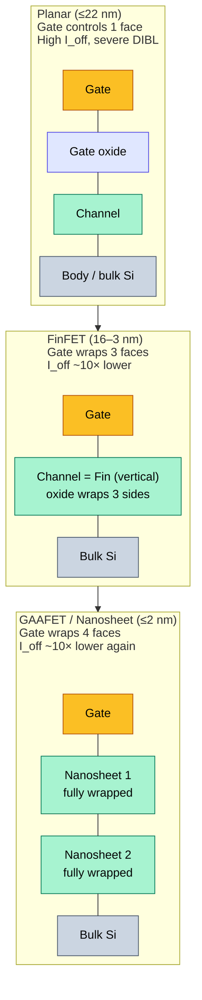
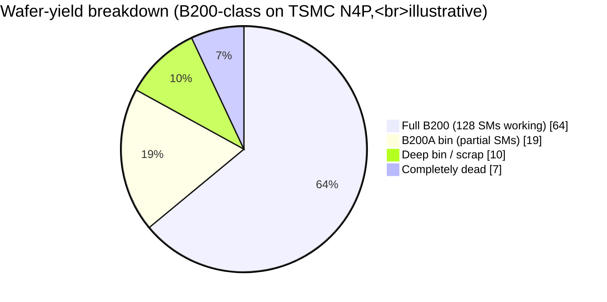
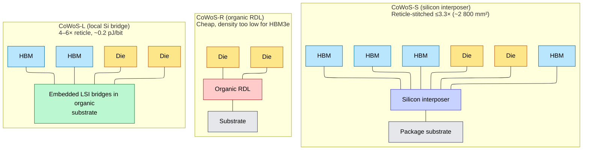
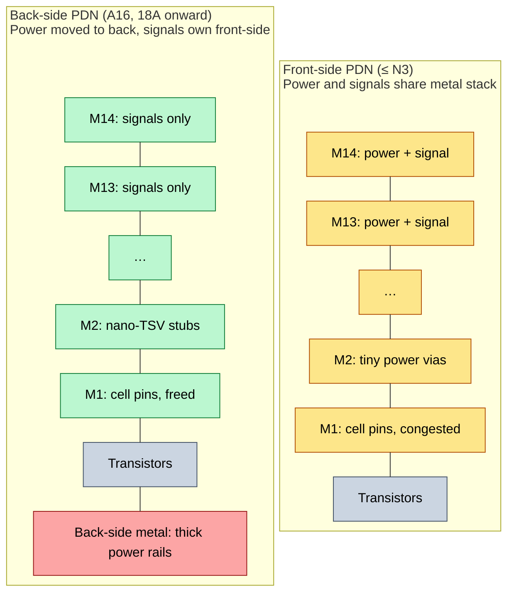
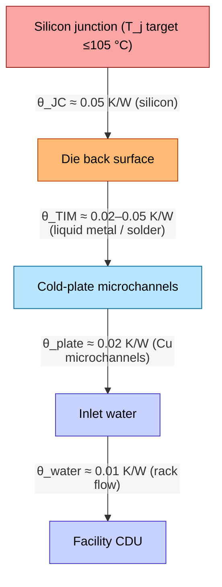
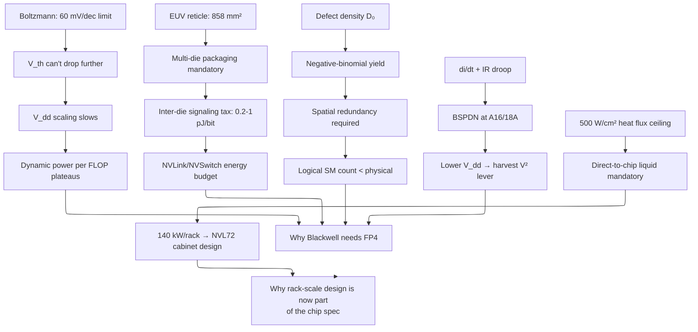

# Silicon for AI — Physics, Process, Yield, Power

> **Layer:** L0 (bottom of the stack).
> **Prerequisites:** Boltzmann statistics, basic transistor operation (gate / source / drain / V_th), elementary electromagnetism (capacitance, inductance, parasitic resistance).
> **Reading time:** ~60 min for full derivations; ~25 min skim.
> **Hands off to:** [L1 — Packaging & Memory](../L1_Packaging_and_Memory/Index.md), [L2 — Digital Design for AI](../L2_Digital_Design_for_AI/Index.md), [L3 — Microarchitecture](../L3_Microarchitecture/Index.md).

---

## 0. The L0 reading frame

Every higher-layer claim — "decode is bandwidth-bound", "Blackwell halves FP4 bytes", "CoWoS-L is gating B200 supply" — is downstream of one of four L0 invariants:

1. **The 60 mV/decade subthreshold-swing limit** caps how aggressively V_th, and therefore V_dd, can be lowered, which caps dynamic-power scaling.
2. **The 858 mm² reticle limit** caps monolithic die area, which forces multi-die packaging and creates the inter-die signaling tax.
3. **The negative-binomial yield curve** punishes large dies super-linearly, which forces spatial redundancy and chiplet disaggregation.
4. **The 500 W/cm² heat-flux ceiling** caps power density at the die surface, which dictates cooling regime, rack power budget, and ultimately TCO per FLOP.

Pin those four numbers in your head; everything in this chapter is the math behind one of them.

---

## 1. The physics floor

### 1.1 Why subthreshold swing has a 60 mV/decade limit

A MOSFET is a thermal device. Even with the gate "off", carriers in the channel obey Boltzmann statistics, so the drain current decays exponentially as the gate voltage falls below threshold:

$$
I_D(V_{GS}) \;\propto\; \exp\!\left(\frac{q\,(V_{GS} - V_{th})}{n\,k_B T}\right)
$$

where $n \ge 1$ is the body-effect factor (=1 for an ideal device). The **subthreshold swing** $S$ is defined as the gate-voltage change required to alter $I_D$ by one decade:

$$
S \;\equiv\; \left(\frac{d\log_{10} I_D}{dV_{GS}}\right)^{-1}
\;=\; n \cdot \frac{k_B T}{q} \cdot \ln 10
$$

At room temperature $k_B T / q \approx 25.85$ mV, so

$$
S_{\min} \;=\; 1 \cdot 25.85\,\text{mV} \cdot \ln 10
\;=\; 25.85 \cdot 2.3026
\;\approx\; 59.5\ \text{mV/decade}
$$

This is **the** room-temperature thermal limit. Real FinFETs land at ~70 mV/decade; GAAFETs push toward ~65 mV/decade. Beating 60 mV/dec at room temperature requires changing the carrier-injection mechanism entirely — tunnel FETs, NCFETs, ferroelectric gates — none of which are in production for AI silicon as of 2026.

### 1.2 Why this matters: leakage drives idle SRAM power

Off-state current scales as

$$
I_{\text{off}} \;\propto\; 10^{-V_{th}/S}
$$

so **every 60 mV reduction in V_th raises leakage by 10×.** A modern accelerator carries 100–300 MB of on-die SRAM (L2, TMEM, register file), much of it idle during memory-bound decode. If S relaxes from 70 to 100 mV/decade because of a half-baked GAAFET ramp, idle leakage jumps roughly $10^{(100-70)/70} \approx 2.7\times$ — easily 50 W extra burned in the L2 bank, with zero useful FLOPS produced.

This is why N2 (GAAFET) matters more for **idle** than for peak: peak power is dominated by switching, but idle is dominated by leakage, and leakage *is* subthreshold swing.

### 1.3 Drain-induced barrier lowering (DIBL) and short-channel effects

As gate length $L$ shrinks, the drain electric field starts to influence the channel barrier. The threshold voltage rolls off:

$$
V_{th}(L, V_{DS}) \;=\; V_{th,\text{long}} \;-\; \eta\,V_{DS} \;-\; \delta(L)
$$

with $\eta$ the DIBL coefficient and $\delta(L)$ a length-dependent rolloff. Below ~20 nm physical gate length, planar bulk MOSFETs lose so much electrostatic control that V_th becomes a *function of operating point*, not a constant. This is what killed planar at 22 nm and what's killing FinFET below 3 nm — the gate simply cannot dominate the channel from one face.



GAAFET wraps the gate around the entire channel (a stack of horizontal nanosheets, each fully surrounded). The improved electrostatic control is what restores subthreshold swing toward 60 mV/decade and what makes N2's leakage budget viable for >150 MB SRAM cells.

---

## 2. Standard cells: the architect's first knob

A "process node" is necessary but not sufficient. When a designer instantiates an FMA tree or a register-file bitcell, they're really choosing a **standard-cell library** at that node.

### 2.1 Track height

Cells are quantized in metal-track units. A "9T" cell is 9 metal-track pitches tall.

| Library | Track height | Drive current $I_{\text{on}}$ | Density | Best for |
|---|---|---|---|---|
| Ultra-HD (UHD) | 5T | very low | very high | I/O pads, deep-sleep logic |
| High-density (HD) | 6T | low | high | L2 cache, TMEM, control |
| Mid (HP/HD) | 7.5T | medium | medium | Datapath glue |
| High-perf (HP) | 9T | high | low | Tensor-core FMA pipelines, clock distribution |
| Ultra-HP | 12T | very high | very low | Critical clock paths, SerDes |

The drive current scales roughly linearly with fin/nanosheet count, which scales with track height; so $I_{\text{on}}^{HP}/I_{\text{on}}^{HD} \approx 9/6 = 1.5\times$, enabling $\sim 1.5\times$ higher $f_{\max}$ at iso-V_dd.

### 2.2 Why blended libraries dominate AI dies

A real B200 SM is a *patchwork*. The math:

- **FMA datapath:** target 2.0 GHz at V_dd = 0.95 V → 9T HP cells.
- **TMEM / L2 SRAM:** density-bound, runs at 1.0 GHz, idle most cycles → 6T HD cells.
- **Crossbar / NoC:** mid frequency, contention-bound → 7.5T mixed.

Choosing 9T everywhere wastes ~40% of die area; choosing 6T everywhere caps tensor cores at ~1.2 GHz, halving FP4 throughput. Blending is mandatory.

### 2.3 Pin access and the new bottleneck

At sub-3 nm, the limiter is no longer transistor density but **pin access**: the metal layer above the cell must reach every input pin without DRC (design-rule check) violations. EDA tools route below 50% utilization on N2 for this reason. Backside power delivery (§7) directly addresses this by removing power rails from the front-side metal, recovering ~10–20% of the routing budget.

---

## 3. Process node taxonomy

### 3.1 What a node name actually encodes

Since ~28 nm, node numbers stopped corresponding to physical gate length. The honest metrics are:

- **CPP** (Contacted Poly Pitch): minimum spacing between gate centers. Bounds horizontal cell area.
- **MP** (Metal Pitch): minimum spacing between Metal-1 wires. Bounds wiring density.
- **FP** (Fin Pitch) or **NSP** (Nanosheet Pitch): bounds drive current per cell-track.
- **MTr/mm²** (Megatransistors per mm²): the density metric, computed via standard NAND2 + SRAM bitcell weighting (60% logic / 40% SRAM by industry convention):

$$
\rho_{\text{eff}} \;=\; 0.6 \cdot \rho_{\text{logic, NAND2}} \;+\; 0.4 \cdot \rho_{\text{SRAM, 6T}}
$$

### 3.2 The 2024–2026 node matrix

| Node | Foundry | Device | CPP / MP (nm) | $\rho_{\text{eff}}$ (MTr/mm²) | $V_{dd}$ nominal | Frontier AI part |
|---|---|---|---|---|---|---|
| TSMC 4N / 4NP | TSMC | FinFET | ~50 / 28 | 140–150 | 0.75 V | H100, B100, B200, B300 |
| TSMC N3E / N3P | TSMC | FinFET | ~45 / 22 | 200–215 | 0.65–0.70 V | MI355X, Trainium-3 |
| TSMC N2 / N2P | TSMC | GAAFET (nanosheet) | ~40 / 20 | 250–290 | 0.60–0.65 V | MI400 (late 2026), Rubin R100 |
| TSMC A16 | TSMC | GAAFET + BSPDN | ~38 / 18 | ~310 | 0.60 V | Rubin Ultra (2027) |
| Intel 18A | Intel | RibbonFET + PowerVia | ~38 / 19 | ~270 | 0.60 V | Gaudi-4-class (2027) |
| Samsung SF2 | Samsung | GAAFET | ~42 / 21 | ~230 | 0.65 V | (limited AI volume) |
| SMIC N+1 (7 nm class) | SMIC | FinFET, DUV multi-patterning | ~57 / 36 | ~85 | 0.78 V | Ascend 910B / 910C |
| SMIC N+2 (5 nm class, est.) | SMIC | FinFET | ~52 / 32 | ~110 | 0.74 V | Ascend 910D (rumored) |

### 3.3 The voltage scaling lever

Dynamic switching power is

$$
P_{\text{dyn}} \;=\; \alpha \cdot C \cdot V_{dd}^2 \cdot f
$$

so a node-shrink V_dd cut from 0.75 V → 0.65 V at iso-$f$ saves

$$
\frac{P_{\text{dyn,new}}}{P_{\text{dyn,old}}} \;=\; \left(\frac{0.65}{0.75}\right)^2
\;\approx\; 0.751 \quad \Rightarrow\quad \approx 25\%\ \text{savings}
$$

This is the dominant reason node migrations matter for power. Density and area are secondary; **V²·f is the lever.** The catch is that V_dd cannot be cut without raising V_th to maintain noise margin — and raising V_th means slower transistors, which means hitting the same frequency now requires more drive (wider cells), partially negating the area savings. This is the perennial node-migration tradeoff.

### 3.4 Node-vs-node power penalty (worked example)

A logical 800 mm² die laid out for TSMC N4 (V_dd = 0.75 V, f = 2.0 GHz, P = 700 W) re-mapped to SMIC N+1 (V_dd = 0.78 V, f = 1.7 GHz):

$$
\frac{P_{\text{N+1}}}{P_{\text{N4}}}
\;=\; \frac{C_{\text{N+1}}}{C_{\text{N4}}} \cdot \left(\frac{0.78}{0.75}\right)^2 \cdot \frac{1.7}{2.0}
$$

With $C_{\text{N+1}}/C_{\text{N4}} \approx 1.6$ (lower density → longer wires → more parasitic capacitance), the ratio comes out to $\approx 1.6 \cdot 1.082 \cdot 0.85 \approx 1.47\times$. A 700 W TSMC-N4 part becomes ~1030 W on SMIC N+1 to deliver only 85% of the throughput. This is the structural disadvantage that bounds Ascend's per-card competitive position.

---

## 4. Lithography and the reticle wall

### 4.1 EUV resolution

Optical resolution follows Rayleigh's criterion:

$$
R \;=\; k_1 \cdot \frac{\lambda}{\text{NA}}
$$

with $k_1 \in [0.25, 0.4]$ a process-dependent constant, $\lambda$ the source wavelength, and NA the numerical aperture of the projection optics.

| Generation | $\lambda$ | NA | $R$ (best, $k_1 \approx 0.27$) | Field size |
|---|---|---|---|---|
| Immersion DUV (193i) | 193 nm | 1.35 | 38 nm | 26 × 33 mm |
| EUV 0.33-NA | 13.5 nm | 0.33 | 11 nm | 26 × 33 mm |
| EUV 0.55-NA (High-NA) | 13.5 nm | 0.55 | 7 nm | 26 × **16.5** mm |

Depth-of-focus collapses faster than resolution improves:

$$
\text{DoF} \;=\; k_2 \cdot \frac{\lambda}{\text{NA}^2}
$$

so doubling NA cuts DoF by ~4×. High-NA's tiny DoF (~30 nm) is why it requires resist re-engineering and is rolling out cautiously.

### 4.2 The 858 mm² reticle limit (and 429 mm² for High-NA)

At 0.33 NA, the maximum image field projected from one mask exposure is

$$
A_{\text{reticle}} \;=\; 26\,\text{mm} \times 33\,\text{mm} \;=\; 858\ \text{mm}^2
$$

This is the **largest monolithic die that can ever be made on a 0.33-NA EUV scanner**, full stop. The H100 die is ~814 mm². The B200 reaches the wall by being two ~800 mm² dies bridged together (NV-HBI, see L1).

High-NA halves the field in one axis to 26 × 16.5 mm = **429 mm²**, a brutal regression. Two sub-options exist:

- **Stitched exposures** — print two adjacent fields and align them to <1 nm. Adds yield and registration risk; only TSMC and Intel are pursuing this for production.
- **Smaller die + more aggressive packaging** — break logic into 4–6 chiplets and accept the inter-die signaling tax.

For the entire Rubin / Rubin-Ultra generation, expect the second option: **die area shrinks, package area grows**.

### 4.3 EUV scanner economics

A single ASML NXE:3800E EUV tool: ~$200 M, ~5 wafers per hour at full reticle exposure with 30 mJ/cm² source. A High-NA EXE:5200: ~$380 M, ~3 wph. EUV throughput, not transistor cost, is what limits frontier-node wafer volumes — TSMC has fewer than 200 EUV tools globally as of 2026, and ASML's EUV lead time is 18+ months. **This is why your Blackwell allocation has a quota.**

---

## 5. Yield modeling

### 5.1 Three competing models

The fundamental question: given a die area $A$ on a wafer with defect density $D_0$, what fraction of dies are defect-free?

**Poisson model (no defect clustering):**

$$
Y_{\text{Poisson}} \;=\; e^{-A D_0}
$$

Optimistic — assumes defects are independent and uniformly distributed. Real wafers have clustered defects (edge effects, particle showers).

**Murphy's model (uniform clustering):**

$$
Y_{\text{Murphy}} \;=\; \left(\frac{1 - e^{-A D_0}}{A D_0}\right)^2
$$

A simple cluster model. Better fit to real fabs than Poisson.

**Negative-binomial model (the industry standard):**

$$
Y_{\text{NB}} \;=\; \left(1 + \frac{A D_0}{\alpha}\right)^{-\alpha}
$$

with $\alpha$ a clustering parameter ($\alpha \in [1, 5]$ typical for mature nodes; $\alpha \to \infty$ recovers Poisson). This is the model fab-extracted parameters target.

### 5.2 Worked example: B200-class die

$A = 8\,\text{cm}^2$, $D_0 = 0.10\,/\text{cm}^2$, $\alpha = 2$:

$$
Y_{\text{NB}} \;=\; \left(1 + \frac{0.8}{2}\right)^{-2} \;=\; 1.4^{-2} \;\approx\; 0.51
$$

So ~51% of fabricated dies are *fully* defect-free. The other 49% would be discarded if the design had no redundancy — which is why nobody designs without redundancy.

### 5.3 Spatial redundancy: how the 49% gets recovered

The B200 has **128 SMs per die** (confirmed by NVIDIA). The earlier claim of 152 physical / 144 logical SMs was based on pre-release estimates and has been corrected. With 128 SMs per die, the dual-die B200 presents 256 SMs as a single GPU. The spare-SM redundancy model still applies: physically more than 128 SMs are fabricated, with spares fused off post-test. The "recoverable" yield is:

$$
Y_{\text{rec}} \;=\; \Pr[\text{at least 128 of } N_{\text{phys}} \text{ SMs work}]
$$

with $p$ the per-SM functional probability. If per-SM defect rate ~ $D_0 \cdot a_{\text{SM}}$ and $a_{\text{SM}} \approx 5$ mm², then $p \approx 1 - 0.005 \approx 0.995$ in the simple Poisson limit. Plugging in: $Y_{\text{rec}} \approx 0.99$.

Effective yield jumps from 51% (zero defects, no redundancy) to ~99% (any defects, with spares). This is why **every** modern accelerator advertises a logical SM count below the physical count — and why the spare ratio stays roughly constant (~5%) across nodes even as die area grows.

### 5.4 Binning

Dies that retain fewer than the full 128 working SMs are sold as a lower SKU (e.g., "B200A"). The economics work because foundry cost is per-wafer, not per-good-die; binning recovers revenue from dies that would otherwise be scrap.



### 5.5 Edge-of-wafer yield

Wafer edges have higher defect density due to edge-bead effects, handler scratches, and uneven CMP. A 300 mm wafer hosts ~70 reticle-sized dies; the outer ring of ~14 dies typically yields 30–40% lower than the center. This is why a wafer's *edge dies* often end up in the deepest bin regardless of design.

### 5.6 Wafer cost per die: why H100 costs $25 K

Process wafers are the raw material; everything downstream (packaging, HBM, testing) is where the margin multiplies.

**Wafer prices (2025–2026, approximate):**

| Node | Wafer price | Notes |
|---|---|---|
| TSMC N5 / N4 | ~$16,000 | Mature volume, multi-source mask sets |
| TSMC N3E / N3P | ~$20,000 | EUV-heavy (20+ layers), tight supply |
| TSMC N2 (projected) | ~$25,000 | First GAAFET, mask cost dominates |

**Dies per wafer.** A 300 mm wafer has area $\pi \cdot 150^2 \approx 70{,}686$ mm². A reticle-limited H100-class die at ~814 mm² yields ~72 gross dies after accounting for wafer-edge exclusion and die-to-die scribe streets (simple geometric packing; real layouts lose the perimeter ring).

**Yield at N5 for large dies.** With $D_0 \approx 0.1/\text{cm}^2$ and $\alpha = 2$ (§5.2), raw yield for an 8 cm² die is ~51%. With 8 spare SMs (§5.3), recoverable yield is ~80%. Net good dies: $72 \times 0.80 \approx 58$.

**Die cost, unpackaged:**

$$
C_{\text{die}} \;=\; \frac{\$16{,}000}{58} \;\approx\; \$276\ \text{per die}
$$

Just the silicon — before packaging, testing, or HBM.

**Assembled GPU cost buildup (H100-class, approximate):**

| Component | Cost |
|---|---|
| Silicon die (N4) | ~$275 |
| CoWoS-S / CoWoS-L packaging | $500–1{,}000$ |
| 6× HBM3 stacks | $2{,}000–4{,}000$ |
| Burn-in + functional test | ~$200 |
| **Total, pre-markup** | **~$3{,}000–5{,}500** |

NVIDIA sells the H100 for $25{,}000–40{,}000. The 5–10× markup reflects software-ecosystem lock-in (CUDA), supply scarcity (CoWoS capacity), and the fact that the buyer is valuing the *FLOP-year*, not the silicon. The wafer cost is a rounding error in the final price — which is why TSMC's pricing power over NVIDIA is weaker than it appears, and why NVIDIA can absorb a 25% wafer-price increase without flinching.

**High-NA EUV impact on die economics.** The reticle shrinks from 858 mm² to ~429 mm². A B200-class monolithic die (2 × ~800 mm²) cannot be printed in a single exposure. The options are stitched exposures (yield risk) or splitting into chiplets (packaging cost). This is a major driver of chiplet adoption in the Blackwell/Rubin era: not a design preference, but a lithographic necessity that restructures the cost model toward more dies at smaller area, with higher inter-die connectivity cost absorbed by advanced packaging.

---

## 6. Advanced packaging (preview — full detail in L1)

The reticle wall forces multi-die packaging. The three CoWoS variants matter at L0 only insofar as they bound *what kinds of dies you can build*:



Key L0-level facts for upper layers:

- **CoWoS-S ceiling:** ~2 800 mm² interposer ⇒ no room for 2× B200 dies + 8× HBM3e stacks. This is *exactly* why B200 ships on CoWoS-L.
- **Inter-die signaling cost:** ~1 pJ/bit on organic, ~0.2 pJ/bit on silicon bridge, ~0.05 pJ/bit on hybrid bonding. NV-HBI at 10 TB/s and ~0.2 pJ/bit dissipates ~16 W just for bit transport — already a meaningful chunk of the package power budget.
- **HBM stack height:** 12-Hi (HBM3e) and 16-Hi (HBM4) stacks sit on a base die that itself burns 5–8 W. The HBM thermal load is *not* negligible relative to the logic die.

Full HBM and CoWoS treatment in [L1 — Packaging & Memory](../L1_Packaging_and_Memory/Index.md).

---

## 7. Power delivery: IR droop, di/dt, and the move to back-side

### 7.1 The current numbers are insane

| Part | TDP | $V_{dd}$ | $I_{dd}$ |
|---|---|---|---|
| H100 SXM5 | 700 W | 0.75 V | ≈ 933 A |
| B200 (HGX) | 1 000 W | 0.70 V | ≈ 1 430 A |
| MI355X (OAM) | 1 400 W | 0.70 V | ≈ 2 000 A |
| GB200 (1× B200 + Grace) | 2 700 W | mixed | > 3 800 A peak |

Two thousand amps through a postage-stamp die. For comparison, a 30-amp household circuit breaker.

### 7.2 IR droop (DC steady state)

Power flows through bumps, TSVs, and on-die metal grids, all of which have non-zero resistance. The voltage actually delivered to the transistors is:

$$
V_{\text{trans}} \;=\; V_{dd,\text{nom}} \;-\; I_{dd} \cdot R_{\text{PDN}}
$$

For $R_{\text{PDN}} = 50\,\mu\Omega$ (a typical front-side PDN at frontier nodes) and $I_{dd} = 1430$ A, the DC droop is

$$
\Delta V_{\text{IR}} \;=\; 1430 \cdot 50 \times 10^{-6} \;=\; 71.5\ \text{mV}
$$

That's already ~10% of a 700 mV supply, eaten before any transistor switches.

Power dissipated as $I^2R$ heat in the PDN itself:

$$
P_{\text{PDN}} \;=\; I_{dd}^2 \cdot R_{\text{PDN}} \;=\; 1430^2 \cdot 5 \times 10^{-5} \;\approx\; 102\ \text{W}
$$

Roughly 10% of the package's TDP burned just delivering electrons. This is the structural reason BSPDN exists.

### 7.3 di/dt droop (the hard one)

Sudden current surges interact with parasitic inductance:

$$
\Delta V_{\text{ac}} \;=\; L \cdot \frac{di}{dt}
$$

A `wgmma` instruction wakes ~64 tensor pipes simultaneously. Order-of-magnitude: $\Delta i = 500$ A in $\Delta t = 1$ ns ⇒ $di/dt = 5 \times 10^{11}$ A/s. With $L_{\text{pkg}} = 100$ pH (a realistic flip-chip + TSV inductance):

$$
\Delta V_{\text{ac}} \;=\; 10^{-10} \cdot 5 \times 10^{11} \;=\; 50\ \text{mV}
$$

Stack on top of the 71 mV IR droop and the supply collapses to $700 - 71 - 50 = 579$ mV. If the cell library's $V_{dd,\min}$ is 600 mV, **the chip silently fails timing on that cycle** — manifesting as an XID error or, worse, silent data corruption.

```mermaid
%%{init: {"flowchart": {"defaultRenderer": "elk", "nodeSpacing": 60, "rankSpacing": 60, "htmlLabels": false}}}%%
xychart-beta
    title "Voltage at transistor during a wgmma current burst"
    x-axis "Time (ns)" [0, 1, 2, 3, 4, 5, 6, 7, 8]
    y-axis "V_dd at transistor (V)" 0.55 --> 0.72
    line "V_dd nominal (0.70 V)" [0.70, 0.70, 0.70, 0.70, 0.70, 0.70,<br/>0.70, 0.70, 0.70]
    line "V_dd_min floor (0.60 V)" [0.60, 0.60, 0.60, 0.60, 0.60, 0.60,<br/>0.60, 0.60, 0.60]
    line "Actual transistor V (IR + di/dt)" [0.70, 0.70, 0.63, 0.58, 0.59, 0.62,<br/>0.65, 0.68, 0.70]
```

Below `V_dd_min`, flip-flops fail to latch — silent data corruption or hard XID error.

### 7.4 The deep-trench-cap defense

To absorb the di/dt transient, dies embed **deep-trench capacitors (DTCs)** directly in the substrate, sized via charge balance:

$$
Q_{\text{DTC}} \;=\; C_{\text{DTC}} \cdot V_{dd} \;\geq\; I_{\text{burst}} \cdot t_{\text{burst}}
$$

For $I_{\text{burst}} = 500$ A over $t_{\text{burst}} = 1$ ns and $V_{dd} = 0.7$ V:

$$
C_{\text{DTC}} \;\geq\; \frac{500 \cdot 10^{-9}}{0.7} \;\approx\; 715\ \text{nF}
$$

Several hundred nanofarads of on-die capacitance, distributed across the floor plan. DTCs typically eat 5–10% of die area on frontier accelerators — pure overhead, no FLOPS, but mandatory.

### 7.5 Front-side vs back-side PDN

Up to and including TSMC N3, both signals and power share the front-side metal stack (M0 through M14). Power rails compete with signal routing, and tiny power vias become the bottleneck:



Backside PDN (TSMC's term) / PowerVia (Intel's term) moves all power rails to the *back* of the wafer. Two consequences:

- **Big metal for power:** the back-side metal can be 5–10× thicker than M1/M2 on the front, dropping $R_{\text{PDN}}$ by ~5×, which directly cuts both IR droop and PDN $I^2R$ loss.
- **Front-side routing freed:** the signal routing budget grows ~15–20%, partially recovering the pin-access bottleneck of §2.3.

Both of these compound: lower droop ⇒ can run at lower V_dd_nom ⇒ V² lever harvested again ⇒ another ~10% dynamic power reduction. This is why **A16 and 18A are the first nodes where 2.5 GHz tensor cores at <1 W per FMA pipeline are seriously projected**.

### 7.6 BSPDN implementations: Super Power Rail and PowerVia

The concept of §7.5 is realized in two production-grade flows:

**TSMC A16 "Super Power Rail" (SPR).** Power rails are routed on the **backside** of the wafer — below the transistor layer — while all signal routing stays on the front side. After front-end-of-line (FEOL) transistor fabrication, the wafer is flipped, thinned, and backside silicon is etched to expose buried oxide contacts. Thick copper or tungsten metallization on the back forms a low-resistance power mesh that connects to front-side transistors through nano-TSVs (nTSVs) punched through the buried oxide. Front-side metal layers M0–M14 are then dedicated entirely to signal routing.

**Intel PowerVia (Intel 4 / Intel 3).** The same structural idea: a dedicated power layer on the die backside, connected to transistors through through-silicon vias that pass through the buried oxide layer. Intel demonstrated PowerVia on a test chip in mid-2023, with production integration on Intel 18A for 2025–2026 products.

**Quantified benefits:**

| Metric | Front-side PDN (N3) | Back-side PDN (A16 / 18A) |
|---|---|---|
| $R_{\text{PDN}}$ | ~50 $\mu\Omega$ | ~10 $\mu\Omega$ (~5× lower) |
| IR drop at 1 430 A | ~71 mV (10% of 0.7 V) | ~14 mV (~2% of 0.7 V) |
| Front-side metal for signals | ~85% (power steals 15%) | ~100% |
| Signal routing layers freed | — | 2–3 layers recovered |
| Max current density | ~1 A/$\mu$m² (EM-limited) | ~5 A/$\mu$m² (thicker backside metal) |

The IR drop reduction of ~30% at the transistor level is the headline number, but the routability gain is equally important: freeing 2–3 metal layers on the front side directly alleviates the pin-access bottleneck of §2.3, raising achievable utilization from ~50% to ~65% on N2-class standard cells.

**Manufacturing challenge.** Thinning the wafer to ~500 $\mu$m after FEOL, then selectively removing more silicon to expose backside contacts, is a high-risk step. The wafer becomes fragile and must be handled on a carrier substrate. Alignment of backside vias to frontside contacts requires sub-10 nm overlay accuracy — comparable to the metal-layer alignment budget itself. Defect density on the backside metal adds a new yield term that did not previously exist.

**Production timeline:** Intel PowerVia on 18A in 2025; TSMC A16 SPR in 2026–2027. This is the most significant process innovation since FinFET for high-power designs.

**Why BSPDN is not optional for 1 000 W+ accelerators.** At 1 000 W per die, the IR drop budget is ~5% of $V_{dd}$. On a front-side PDN at N3 dimensions, power delivery alone would consume 3–4% of $V_{dd}$ in IR drop, leaving almost no margin for di/dt transients (§7.3) and voltage-guardband variation. The B300 targets 1 000 W at 0.65 V — that's ~1 540 A through a PDN that simply cannot exist on the front side at these dimensions. BSPDN is a prerequisite, not an optimization, for the Blackwell/Rubin power envelope.

---

## 8. Thermal: the 500 W/cm² wall

### 8.1 Junction-to-case math

Heat leaves the die through a stacked thermal-resistance network:

$$
T_{\text{junction}} \;=\; T_{\text{coolant}} \;+\; P \cdot \big(\theta_{\text{JC}} + \theta_{\text{TIM}} + \theta_{\text{cold-plate}} + \theta_{\text{coolant}}\big)
$$

The dominant term at this power density is $\theta_{\text{TIM}}$ (thermal-interface material).



For a 1 400 W MI355X with combined $\theta = 0.06$ K/W and 35 °C inlet water:

$$
T_j \;=\; 35 + 1400 \cdot 0.06 \;=\; 35 + 84 \;=\; 119\ {}^\circ\text{C}
$$

Already above the 105 °C silicon-degradation threshold. With slightly worse TIM ($\theta_{\text{TIM}}$ from 0.02 to 0.05), $T_j$ creeps to ~140 °C and chips throttle hard or fail. **This is why TIM materials science is on the AI-infra critical path.**

### 8.2 Heat-flux ceilings by cooling regime

| Regime | Max heat flux | Practical part |
|---|---|---|
| Forced air, heatsink | ~75 W/cm² | < 400 W parts (consumer GPU) |
| Direct-to-chip cold plate, water | ~500 W/cm² | H100, B200, MI355X |
| Two-phase D2C / immersion | ~800 W/cm² | GB300 (projected) |
| Microfluidic etched in silicon | ~1 500 W/cm² | research, possibly Rubin-Ultra |

A B200 die at 1 000 W over ~1 600 mm² ⇒ 62.5 W/cm² *averaged*, but local hotspots in the tensor core arrays exceed 400 W/cm². Cold-plate flow rate (typical ~5 L/min per accelerator at 35 °C inlet) determines whether the local hotspot makes it out before the junction crosses 100 °C.

### 8.3 Rack-scale thermal: the 140 kW number

A GB200 NVL72 rack houses 72 GPUs + 36 Grace CPUs + NVSwitch trays:

- 72 × 1 000 W + 36 × 300 W + switching ≈ 87 kW logic
- Add HBM, voltage regulators, fans: total ~140 kW per rack

Traditional data centers provision **10–20 kW/rack**. Hosting NVL72 requires:

- 480 V three-phase power feeders (the 415 V US rack-PDU standard cannot deliver 140 kW within reasonable amperage).
- In-rack CDUs (coolant distribution units) connected to a facility chilled-water loop.
- Floor-load engineering: NVL72 rack masses ~1 360 kg loaded.

**Implication for L4 (rack-scale design):** the network topology and the cooling loop are co-designed. NVL72 happens to have 72 GPUs partly because that's what the cooling loop and the NVLink-5 switch fabric agreed they could support inside one cabinet's thermal envelope.

### 8.4 Data-center-level thermal and power context

The die-level and rack-level thermal math of §8.1–8.3 exists within a facility envelope that constrains what is economically deployable.

**Cooling regimes by rack power density:**

| Regime | Inlet temperature | $\Delta T$ to exhaust | Max rack power | Typical deployment |
|---|---|---|---|---|
| Air, ASHRAE A1 | 35 °C max inlet | ~15 °C | ~40 kW | Legacy enterprise, inference |
| Direct-to-chip liquid (D2C) | 25–40 °C coolant | ~10–15 °C | 100–150 kW | H100, B200, MI355X clusters |
| Rear-door heat exchanger | 35 °C air in | 20–30 °C drop at door | ~60 kW (hybrid) | Retrofit air-cooled facilities |

Air cooling hits a hard ceiling around 40 kW/rack due to the heat capacity of air (~1.2 kg/m³, ~1.0 kJ/kg·K). Above 40 kW, the volumetric airflow required exceeds what is practical in a raised-floor plenum. NVL72 at 120–140 kW mandates direct-to-chip liquid cooling — not as a preference, but as a thermodynamic necessity.

**Liquid cooling plumbing.** Each accelerator's cold plate connects via blind-mate quick-disconnect fittings to an in-rack CDU (coolant distribution unit). The CDU circulates facility water at 15–25 °C through a heat exchanger that dumps 100–150 kW to the building chilled-water loop. A single CDU typically serves 2–4 racks; the facility side requires cooling towers or dry coolers sized for the total IT load.

**PUE (Power Usage Effectiveness):**

$$
\text{PUE} \;=\; \frac{P_{\text{total facility}}}{P_{\text{IT equipment}}}
$$

| Facility class | PUE | Overhead fraction |
|---|---|---|
| State-of-art (Google, Meta, hyperscale purpose-built) | 1.05–1.15 | 5–15% |
| Good enterprise AI cluster | 1.2–1.4 | 20–40% |
| Average data center (mixed workload) | 1.5–1.8 | 50–80% |

For a 100 MW AI training cluster at PUE 1.1: 91 MW goes to compute, 9 MW to cooling, lighting, power-distribution losses, and networking overhead. At PUE 1.5 (an older retrofit facility), the split is 67 MW compute / 33 MW overhead — the same 100 MW of utility feed delivers 27% fewer FLOP-years.

**Electricity cost in TCO.** At $0.05–0.12/kWh (US industrial rates, 2025), a 100 MW cluster running 90% uptime at $0.08/kWh:

$$
C_{\text{electricity}} \;=\; 100\,\text{MW} \cdot 8{,}760\,\text{h} \cdot 0.9 \cdot \$0.08/\text{kWh} \;\approx\; \$63\,\text{M/year}
$$

At PUE 1.1: ~$70 M/year. For a 3-year deployment with $500 M in GPU hardware, electricity is ~14% of TCO. In regions with $0.12/kWh and PUE 1.5, electricity rises to ~25% of TCO — which is why training-cluster siting is increasingly driven by power cost and PUE rather than by network latency.

**Why NVL72 is the thermal unit.** Liquid cooling is most efficient when the CDU serves a complete, self-contained thermal zone. A single NVL72 rack at 120 kW can be cooled by one in-rack CDU with two supply/return connections to the facility loop. Decomposing into smaller units (e.g., 8-GPU pods) would multiply plumbing connections, leak points, and CDU overhead. The rack is the smallest unit that can be efficiently liquid-cooled as a system — and that is why the NVLink fabric, the cooling loop, and the rack form factor were co-designed as a single product.

---

## 9. Dark Silicon

### 9.1 Definition

**Dark silicon** refers to the fraction of transistors on a chip that cannot be simultaneously powered on during normal operation due to thermal and power constraints. As process nodes shrink, transistor density increases faster than power per transistor decreases, resulting in more transistors than can be active at once.

The term was coined by researchers at the University of California, San Diego and popularized in the landmark 2011 paper *Dark Silicon and the End of Multicore Scaling*. The core observation: Dennard scaling (which held that power density remained constant as transistors shrank) broke down around 2005–2006. Since then, each generation packs more transistors per mm², but the total power budget of the package (set by the cooling solution and TDP) cannot grow proportionally.

### 9.2 The utilizable fraction

At modern process nodes (5 nm, 3 nm), only approximately **30–50% of transistors** can be active simultaneously within typical TDP limits. The exact fraction depends on:

- The mix of standard-cell libraries (9T HP cells in the tensor cores burn far more power per mm² than 6T HD cells in SRAM).
- The voltage-frequency operating point.
- The cooling capability of the package and system.

For a B200-class die at ~800 mm² on TSMC N4P with a ~1,000 W TDP envelope, the chip physically contains enough transistors to deliver perhaps 1.5× its rated FP4 throughput — if you could power and cool them all. You cannot. The silicon that exceeds the TDP budget is "dark."

### 9.3 Implications for AI accelerators

**SRAM and register files consume significant static power even when idle.** A modern accelerator carries 100–300 MB of on-chip SRAM (L2 cache, tensor memory, register files). Leakage power in these arrays is non-trivial: at N3P, ~100 MB of 6T SRAM leaks ~20–30 W at nominal V_dd, regardless of whether the memory is being accessed. This limits how much on-chip memory can be powered — you cannot simply add more SRAM without accounting for the static power tax.

**Tensor cores are the most power-hungry blocks.** A dense matmul kernel exercising all tensor-core FMA pipelines draws 2–3× the power of a memory-bound kernel that only exercises the L2/HBM path. Dark silicon means you cannot activate all streaming multiprocessors (SMs) at peak FLOPS simultaneously for sustained periods without exceeding TDP. GPU boost algorithms already exploit this: they run all SMs at peak clock for short bursts (seconds), then thermally throttle.

**HBM PHYs consume ~15–20% of TDP just for signaling.** The physical-layer transceivers that drive signals between the die and HBM stacks draw significant power regardless of bandwidth utilization. At 1,000 W TDP, this is 150–200 W committed to I/O before any compute happens. This I/O power floor limits how much bandwidth you can provision at a fixed power envelope — you cannot simply add more HBM stacks without paying the PHY power tax.

### 9.4 Design strategies

Several techniques improve the utilizable fraction of silicon:

1. **Power gating**: completely disconnect the power supply from unused blocks (e.g., SMs that are idle during memory-bound kernels). Power gating reduces leakage to near-zero for the gated block. Modern GPUs gate individual SMs, L2 slices, and even portions of the register file on a per-kernel basis.

2. **Dynamic voltage and frequency scaling (DVFS)**: reduce V_dd and clock frequency for blocks that do not need peak performance. Since dynamic power scales as $V^2 \cdot f$, even modest voltage reductions yield significant power savings. A tensor core at 80% V_dd and 80% clock consumes only $\approx 0.8^3 = 51\%$ of its peak power.

3. **Workload-specific activation**: only turn on the functional units needed for the current kernel. A matmul kernel activates tensor cores and L2; an attention kernel may activate only the tensor cores and SRAM; a memory-bound decode kernel may activate primarily the HBM controllers and a small number of SMs. The compiler and runtime jointly schedule which blocks are active each cycle.

### 9.5 Connection to chiplet rationale

Dark silicon is one of the structural motivations for chiplet-based designs. Splitting a large monolithic die into smaller chiplets with independent power domains improves the utilizable fraction:

- Each chiplet has its own TDP envelope and can be power-gated independently.
- A chiplet that is idle (e.g., an I/O die during pure-compute phases) can be fully power-gated without affecting the compute dies.
- The power delivery network is simpler per chiplet, reducing IR droop and enabling higher utilization of the active silicon.
- Manufacturing yield improves (smaller dies yield better, per §5), but the power-management advantage is equally important.

This is why the Blackwell B200 uses two ~800 mm² dies on CoWoS-L rather than one ~1,600 mm² monolithic die (which would exceed the reticle limit anyway) — and why future Rubin Ultra designs with quad-die packages carry independent power domains per die.

---

## 10. Bringing it together: cross-layer cause-and-effect



Every higher-layer optimization in this notebook is, somewhere, a workaround for one of these arrows.

---

## 11. Numbers to memorize

| Quantity | Value | Why it matters |
|---|---|---|
| Subthreshold-swing room-temp limit | 59.5 mV/decade | Caps how low V_th and V_dd can fall |
| Reticle field, 0.33-NA EUV | 26 × 33 mm = 858 mm² | Max monolithic die area |
| Reticle field, 0.55-NA High-NA | 26 × 16.5 mm = 429 mm² | Forces more chiplets in Rubin-class |
| Si interposer stitching ceiling | ~3.3× reticle ≈ 2 800 mm² | Why CoWoS-S can't host B200 |
| Inter-die signaling, organic | ~1 pJ/bit | Cross-package link energy floor |
| Inter-die signaling, Si bridge | ~0.2 pJ/bit | NV-HBI, EMIB |
| Inter-die signaling, hybrid bonding | ~0.05 pJ/bit | SoIC, future die stacking |
| Defect density (mature N4) | ~0.1 / cm² | Drives yield curves |
| B200 die-area, single-die | ~800 mm² | Near reticle limit |
| B200 spare-SM ratio | ~5% | Standard redundancy budget |
| B200 currents | ~1 430 A @ 0.70 V | Why PDN engineering is brutal |
| MI355X currents | ~2 000 A @ 0.70 V | The 2026 high-water mark |
| Heat flux, air ceiling | ~75 W/cm² | Why air cooling is dead at >400 W |
| Heat flux, D2C water ceiling | ~500 W/cm² | Current frontier |
| Junction-temp degradation threshold | ~105 °C | TIM materials margin |
| Rack power, GB200 NVL72 | ~140 kW | Forces facility re-engineering |
| BSPDN $R_{\text{PDN}}$ reduction | ~5× vs front-side | Enables 1 000 W+ at 0.65 V |
| TSMC N5 wafer price | ~$16,000 | Die cost is a fraction of assembled-GPU price |
| H100-class die cost (silicon only) | ~$275 | Packaging + HBM = 10× the silicon cost |
| High-NA reticle field | 429 mm² | Forces chiplet disaggregation in Rubin+ |
| Air-cooling rack ceiling | ~40 kW | Below NVL72's 120 kW; liquid mandatory |
| PUE, state-of-art AI cluster | 1.05–1.15 | 5–15% overhead on top of IT load |
| 100 MW cluster electricity | ~$70 M/year at PUE 1.1 | 10–25% of 3-year TCO depending on region |

---

## 12. Worked interview problems

These are not "name the term" questions — each requires deriving from L0 invariants.

**Q1.** *A foundry quotes you a defect density of 0.12/cm² with α = 1.8. What die area gives 50% raw yield (no redundancy)?*

Solve $0.5 = (1 + AD_0/\alpha)^{-\alpha}$ for $A$:
$1 + 0.12A/1.8 = 0.5^{-1/1.8} = 1.470$
$0.12A/1.8 = 0.470 \Rightarrow A = 7.05\,\text{cm}^2 = 705\,\text{mm}^2$.
Just under the reticle limit. Adding 5% spare SMs would push effective yield ~95%+.

**Q2.** *A 1 000 W package switches 600 A in 0.8 ns. PDN inductance is 80 pH. What's the di/dt droop, and is it survivable on a 0.7 V rail with 0.6 V V_dd_min?*

$di/dt = 600 / 0.8\times 10^{-9} = 7.5 \times 10^{11}$ A/s.
$\Delta V = 80\times 10^{-12} \cdot 7.5\times 10^{11} = 60\,\text{mV}$.
With ~50 mV IR droop on top, $V_{\text{trans}} = 700 - 50 - 60 = 590\,\text{mV} < 600\,\text{mV}$.
**Not survivable** without DTC — would corrupt or crash. Fix: add ~700 nF of DTC, or move to BSPDN to halve IR droop.

**Q3.** *Why does Rubin's roadmap re-introduce silicon-bridge cost reductions even though TSMC perfected CoWoS-L?*

High-NA EUV halves the reticle field to 429 mm². Rubin's logic budget per package roughly doubles vs B200, so per-package die count goes from 2 → 4–6. The number of silicon bridges per package scales super-linearly; bridge yield, alignment, and inter-die latency all become bigger problems. Cost-down silicon bridges (thinner, hybrid-bonded, smaller area) are how the package economics stay sane.

**Q4.** *Walk through why N2 (GAAFET) matters more for idle SRAM power than for tensor-core peak power.*

Tensor cores are dynamic-dominated: $P = \alpha C V^2 f$. Going from 0.70 V to 0.65 V buys ~14% — useful but not transformative.
SRAM idle is leakage-dominated: $P_{\text{leak}} \propto I_{\text{off}} \propto 10^{-V_{th}/S}$. GAAFET cuts $S$ from ~70 to ~62 mV/decade, which at constant $V_{th}$ reduces $I_{\text{off}}$ by $10^{V_{th} (1/62 - 1/70)} \approx 10^{0.020}\approx 1.05$ at $V_{th}=200$ mV — but the *real* GAAFET advantage is enabling lower $V_{th}$ at constant leakage, recovering frequency at lower V_dd. Stacking both effects, total SRAM idle leakage drops ~3×.

**Q5.** *Estimate the maximum HBM-stack count on a CoWoS-S package given 800 mm² logic die.*

CoWoS-S interposer ceiling ~2 800 mm². Each HBM3e 12-Hi stack footprint ~110 mm² + ~30 mm² perimeter. Logic die + 8 HBM = $800 + 8 \cdot 140 = 1\,920$ mm². Fits. 12 HBM = $800 + 1\,680 = 2\,480$ mm². Tight. 16 HBM doesn't fit, period — that's the structural reason 8-stack and 12-stack HBM packaging is the practical ceiling on CoWoS-S, and why CoWoS-L was needed to break it.

---

## 13. References

**Primary technical sources**
- TSMC Technology Symposium proceedings (annual: process node disclosures).
- ASML Investor Days and EUV / High-NA technical disclosures.
- IEEE IEDM (International Electron Devices Meeting) proceedings — definitive transistor-device papers each December.
- Hot Chips proceedings — Blackwell, MI355X, Trainium-2/3 architecture disclosures.

**Foundational textbooks**
- Weste & Harris, *CMOS VLSI Design: A Circuits and Systems Perspective*, 4th ed. — the canonical CMOS reference.
- Rabaey, *Digital Integrated Circuits*, 2nd ed. — depth on noise margin, leakage, and scaling.
- Plummer, Deal, Griffin, *Silicon VLSI Technology* — the fab-process side.

**Cross-references in this vault**
- [`digital_design/Fabrication_Process.md`](../../hardware_design/07_Manufacturing_and_Bringup/Fabrication_Process.md) — wafer-flow chemistry.
- [`digital_design/CMOS_Fundamentals.md`](../../hardware_design/00_Fundamentals/CMOS_Fundamentals.md) — device-level companion.
- [`digital_design/IC_Packaging.md`](../../hardware_design/07_Manufacturing_and_Bringup/IC_Packaging.md) — package-engineer view of the same ground.
- [`power/Power_Analysis_and_Signoff.md`](../../hardware_design/02_Power_and_Low_Power/Power_Analysis_and_Signoff.md) — IR/EM signoff math.

---

**Up the stack:** [L1 — Packaging & Memory Stack](../L1_Packaging_and_Memory/Index.md) → [L2 — Digital Design for AI](../L2_Digital_Design_for_AI/Index.md) → [L3 — Microarchitecture](../L3_Microarchitecture/Index.md).
