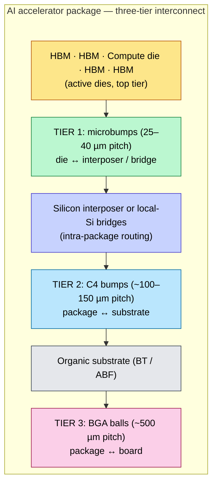
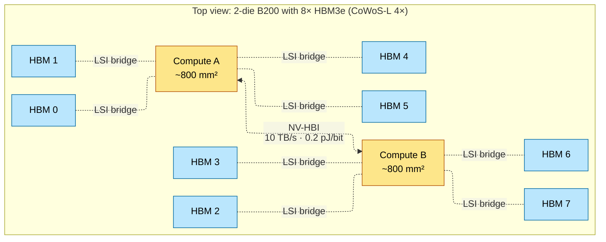
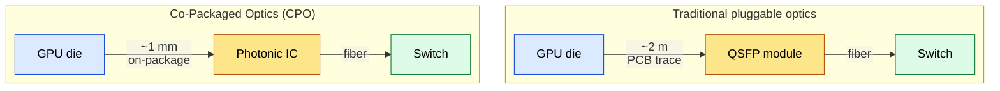
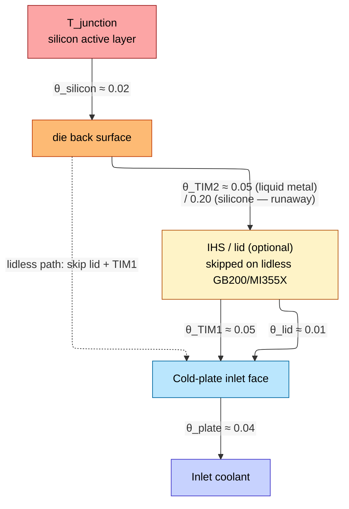
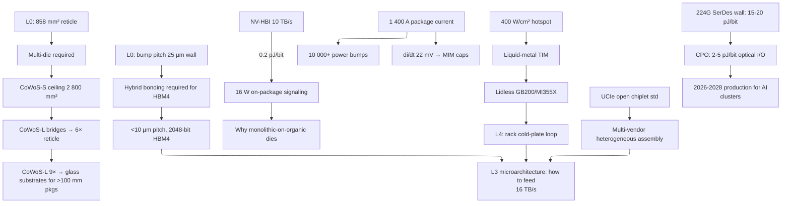

# Advanced Packaging — Interposers, Bridges, NV-HBI, Hybrid Bonding

> **Layer:** L1 (sits on L0 silicon, hands bandwidth to L2 datapaths and L3 microarchitecture).
> **Prerequisites:** [L0 Silicon_For_AI](../L0_Silicon_and_Process/Silicon_For_AI.md). Helpful: basic transmission-line theory, RC delay, eye-diagram analysis.
> **Hands off to:** [HBM_Deep_Dive](HBM_Deep_Dive.md) for the memory specialization, [L3 Microarchitecture](../L3_Microarchitecture/Index.md) for how the bandwidth is consumed.

---

## 0. Why this layer exists at all

L0 established the 858 mm² reticle wall (429 mm² for High-NA EUV). Frontier accelerators want **2 000–6 000 mm² of active silicon and 8–16 HBM stacks** sitting next to a logic die. Standard PCB packaging dies trying to handle this at four points:

1. **Bump density.** A C4 bump pitch of 150 µm gives ~44 bumps/mm². The HBM3e interface alone requires >1 024 signal lines into a ~10 mm edge — minimum ~100 lines/mm linear density, an order of magnitude beyond what a normal substrate can route.
2. **Trace impedance.** At 9.6 Gbps the signal has a Nyquist of 4.8 GHz; an organic substrate has ~3 dB skin-effect loss per cm at that frequency. Even 5 mm of organic trace eats 1.5 dB and closes the eye.
3. **Power delivery.** Pushing 1 400 A at 0.7 V through a substrate without exceeding ~50 mV droop means $R_{\text{PDN,pkg}} \le 35\,\mu\Omega$. Achievable only by parallelizing >5 000 power bumps.
4. **Thermal.** A 1 000 W package dissipates ~62 W/cm² *averaged*, but local hotspots in tensor-core arrays exceed 400 W/cm². Standard heat spreaders cannot evacuate that without direct-to-chip liquid cooling.

Advanced packaging is the set of techniques that convert those four "impossible" numbers into "expensive but doable".

---

## 1. The packaging hierarchy

### 1.1 Three tiers of interconnect

The integration hierarchy nests three pitch regimes, each ~4× coarser than the next:



### 1.2 Pitch-density math

Areal bump density scales as $1/p^2$. So a pitch reduction from 40 µm to 25 µm gives

$$
\frac{\rho_{25}}{\rho_{40}} \;=\; \left(\frac{40}{25}\right)^2 \;=\; 2.56\times
$$

That single number is exactly why HBM4's 2 048-bit interface is feasible only at sub-30 µm pitch.

Pitch progression we're tracking through 2026:

| Tier | 2020 | 2024 | 2026 | Hybrid-bond era |
|---|---|---|---|---|
| Microbump | 55 µm | 40 µm | 25 µm | < 10 µm (Cu-Cu) |
| C4 bump | 200 µm | 150 µm | 100 µm | n/a |
| BGA ball | 800 µm | 600 µm | 500 µm | n/a |

Beyond ~25 µm pitch, **solder runs out**. SnAg microbumps at <25 µm bridge during reflow (intermetallic compound — IMC — formation widens the bump faster than the solder mask can constrain it). Below ~10 µm pitch you must use hybrid bonding (§6).

### 1.3 Rent's rule and why pitch must keep shrinking

Empirical Rent's rule says the I/O count $T$ scales with the gate count $G$ as

$$
T \;=\; t \cdot G^p, \qquad p \in [0.5, 0.75]
$$

Doubling logic on the die roughly grows I/O by $2^p \approx 1.4$–$1.7\times$. Without a pitch shrink, you'd need a larger die *just to escape the bumps*, which collides with the L0 reticle wall. Bump pitch shrink is thus mandatory to keep package I/O count growing in parallel with logic.

---

## 2. Substrate options: the four real choices

```mermaid
%%{init: {"flowchart": {"defaultRenderer": "elk", "nodeSpacing": 60, "rankSpacing": 60, "htmlLabels": false}}}%%
flowchart TD
    subgraph ORG["Organic substrate (FCBGA)<br/>Cheap · low density · ≤4 Gb/s · ~1 pJ/bit"]
        direction TB
        OD[Die]:::die
        OS[Organic substrate]:::organic
        OD --- OS
    end
    subgraph S["CoWoS-S (Si interposer)<br/>Very high density · ≤3.3× reticle (~2 800 mm²) · ~0.2 pJ/bit<br/>A100, H100, MI300X"]
        direction TB
        SD1[Die]:::die
        SD2[Die]:::die
        SI[Silicon interposer (reticle-stitched)]:::interposer
        SD1 & SD2 --- SI
    end
    subgraph L["CoWoS-L (Si bridges in organic)<br/>High density only where needed · scales to 6× · ~0.2 pJ/bit<br/>B200, B300, MI355X"]
        direction TB
        LD1[Die]:::die
        LD2[Die]:::die
        LD3[Die]:::die
        LB[Organic + embedded LSI bridges]:::bridge
        LD1 & LD2 & LD3 --- LB
    end
    subgraph SOIC["SoIC (3D hybrid-bonded)<br/>Ultra-high density · ~0.05 pJ/bit<br/>V-Cache, future base-die-on-logic"]
        direction TB
        SOA[Die A — top]:::die
        SOHB[Cu-Cu hybrid bond]:::hb
        SOB[Die B — bottom]:::die
        SOA --- SOHB --- SOB
    end
    classDef die fill:#fde68a,stroke:#b45309,color:#000
    classDef organic fill:#fecaca,stroke:#b91c1c,color:#000
    classDef interposer fill:#c7d2fe,stroke:#4338ca,color:#000
    classDef bridge fill:#bbf7d0,stroke:#15803d,color:#000
    classDef hb fill:#fcd34d,stroke:#92400e,color:#000
```

### 2.1 CoWoS-S — the silicon interposer

A monolithic silicon wafer becomes a giant passive RDL. Logic + HBM dies sit on it via microbumps; TSVs through the interposer drop to C4 bumps. Pros: highest signal density anywhere, ~0.2 pJ/bit. Cons:

- **Reticle stitching ceiling ~3.3× field ≈ 2 800 mm²** because the interposer is itself printed on a stepper. Beyond that, stitch alignment errors compound.
- **CTE mismatch.** Silicon ($\alpha_{\text{Si}} \approx 2.6$ ppm/°C) vs. organic substrate ($\alpha_{\text{org}} \approx 16$ ppm/°C) creates shear at the perimeter C4 bumps:

  $$
  \tau \;\propto\; (\alpha_{\text{org}} - \alpha_{\text{Si}}) \cdot \Delta T \cdot E_{\text{Cu}}
  $$

  For ΔT = 70 °C, the ~13 ppm/°C mismatch scaled by Cu's Young's modulus (~110 GPa) gives shear stresses ~100 MPa at the corners — close to the SnAg fatigue limit, which is why CoWoS-S yields fall as interposer area grows.

A100, H100, H200, MI300X (variant): all CoWoS-S.

### 2.2 CoWoS-R — the cheap one

Replace the silicon interposer with organic redistribution layers (RDL). Cost per package falls 3–5×. But routing density falls below what HBM3e needs; at 9.6 Gbps the eye closes after a few millimeters. Used for inferior tiers and non-AI HBM packages.

### 2.3 CoWoS-L — the 2024+ workhorse

Organic substrate with **embedded local silicon interconnect (LSI) bridges** placed exactly where high-density routing is needed (compute↔compute, compute↔HBM). Bypasses both the interposer reticle ceiling and the CTE-shear problem.



LSI variants in production:

| Variant | Reticle multiplier | Die area budget | Used by |
|---|---|---|---|
| CoWoS-L 4× | ~2 400 mm² | 2 dies + 8 HBM | B100 / B200 |
| CoWoS-L 5.5× | ~3 300 mm² | 2 dies + 8 HBM3e + margin | B300, MI355X |
| CoWoS-L 6×–9× | 3 500–5 800 mm² | 4-die compute clusters | Rubin, Rubin Ultra (proj.) |

### 2.4 SoIC — true 3D bonding

Cu-Cu hybrid bonding (§6) of full dies face-to-face. AMD's 3D V-Cache stacks SRAM atop CCX. Energy/bit drops to ~0.05 pJ/bit and the latency is sub-nanosecond. Limitation: the bottom die's heat must escape through the top die — only viable if the upper die is low-power (cache, base die, sensor).

### 2.5 EMIB — Intel's bridge-only variant

Functionally similar to CoWoS-L: silicon bridges directly embedded in an ABF substrate, no fan-out RDL. Comparable energy/bit, comparable density. Manufacturing differences:

- EMIB embeds the bridge into a *cavity* etched into the substrate before lamination → tighter co-planarity but lower bridge count per package.
- CoWoS-L places bridges in an organic molding compound that's then planarized → more bridges per package, slightly higher cost.

Used in: Sapphire Rapids HBM, Ponte Vecchio (Aurora), Gaudi-3.

### 2.6 IF-AP (Infinity Fabric Advanced Package)

AMD's chiplet philosophy — small XCD compute chiplets stacked or 2.5D-adjacent to a large I/O die (IOD). The IOD is on a mature node (e.g., N6) and hosts memory controllers, PCIe/CXL PHYs, Infinity Cache. XCDs stack on it via SoIC (3D) or sit beside it via CoWoS-L (2.5D).

Tradeoff: better wafer economics (small XCDs yield much better than monolithic), worse latency (NUMA between chiplets demands runtime-aware scheduling).

---

## 3. Inter-die signaling derivations

### 3.1 USR (ultra-short-reach) bandwidth budget

For a die-to-die link of total bidirectional bandwidth $B$:

$$
B \;=\; N_{\text{wires}} \cdot R_{\text{signal}} \cdot 2_{\text{(BiDir)}}
$$

USR signaling on a silicon bridge stays in the **single-ended, ground-referenced** regime to halve the wire count vs. differential. Typical $R_{\text{signal}}$ is 2–4 Gbps/wire — conservative because the energy/bit budget dominates.

### 3.2 NV-HBI worked example

Blackwell NV-HBI bridges two reticle-sized compute dies at ~10 TB/s bidirectional ≈ 80 Tbps. At $R_{\text{signal}} = 2$ Gbps/wire single-ended:

$$
N_{\text{wires}} \;=\; \frac{80\times 10^{12}}{2 \cdot 2\times 10^9} \;=\; 20\,000 \text{ wires}
$$

Across an edge of ~20 mm: linear density ≈ **1 000 wires/mm**, requiring ~2 µm metal pitch on the LSI bridge. Add ground shielding (G-S-S-G or G-S-G patterns) and you're at the absolute edge of what RDL lithography allows.

### 3.3 Power: pJ/bit derivation

Energy per bit on a CMOS link:

$$
E_{\text{bit}} \;\approx\; \frac{1}{2}\, C_{\text{wire}}\, V_{\text{swing}}^2 \;+\; E_{\text{driver}} \;+\; E_{\text{receiver}}
$$

For a 5 mm organic trace ($C \approx 1.5$ pF) at $V_{\text{swing}} = 0.6$ V the wire term alone is ~0.27 pJ/bit; add driver/receiver energy and the total is ~1 pJ/bit. For a 2 µm-pitch silicon-bridge trace ($C \approx 50$ fF for a 1 mm short link) at $V_{\text{swing}} = 0.4$ V the wire term collapses to ~0.004 pJ/bit; total system energy ~0.2 pJ/bit. Hybrid bonding pushes the wire term essentially to zero (just gate capacitance), getting to ~0.05 pJ/bit.

For a 10 TB/s link this matters:

$$
P_{\text{link}} \;=\; B \cdot E_{\text{bit}} \;=\; 80 \times 10^{12}\,\text{bits/s} \cdot 0.2 \times 10^{-12}\,\text{J/bit} \;=\; 16\ \text{W}
$$

A non-trivial fraction of the package power budget — and **80 W if the link were on organic instead of silicon-bridge**. This is the structural reason monolithic-on-organic isn't a viable alternative.

### 3.4 Eye-opening at 9.6 Gbps (HBM3e Nyquist)

Frequency-dependent loss collapses the eye opening exponentially. For an organic trace of length $\ell$ at frequency $f$ with skin-effect attenuation $\alpha(f) \approx \alpha_0 \sqrt{f}$:

$$
A_{\text{eye}} \;=\; A_0 \cdot e^{-\alpha(f) \cdot \ell}
$$

For an organic substrate with $\alpha_0 \approx 0.1$ dB/mm/√GHz at 4.8 GHz Nyquist:

- Trace length 5 mm: $\alpha \cdot \ell = 0.1 \cdot \sqrt{4.8} \cdot 5 \approx 1.1$ dB → eye still ~88% open.
- Trace length 20 mm: $\alpha \cdot \ell \approx 4.4$ dB → eye <40% open, requiring DFE/CTLE in the receiver.

Silicon-bridge traces, in contrast, have $\alpha_0 \approx 0.02$ dB/mm/√GHz with much shorter $\ell$ — eye closure is negligible. This is why HBM3e+ traces *must* go over silicon, not organic.

---

## 4. TSV physics

TSVs are the vertical wires that punch through the silicon interposer (CoWoS-S) or the HBM die stack. Drilled by deep reactive-ion etch (DRIE), lined with SiO₂ + barrier metal, electroplated with Cu, then back-thinned via CMP.

### 4.1 Capacitance derivation

Modeled as a coaxial capacitor (Cu core inside a cylindrical oxide liner inside silicon ground):

$$
C_{\text{TSV}} \;=\; \frac{2\pi \varepsilon_{\text{ox}} L}{\ln(r_{\text{liner}}/r_{\text{Cu}})}
$$

For a typical HBM TSV: $r_{\text{Cu}} = 2.5$ µm, $r_{\text{liner}} = 3.0$ µm, $L = 50$ µm, $\varepsilon_{\text{ox}} = 3.9 \cdot 8.85 \times 10^{-12}$ F/m:

$$
C_{\text{TSV}} \;=\; \frac{2\pi \cdot 3.45\times 10^{-11} \cdot 50\times 10^{-6}}{\ln(3.0/2.5)} \;\approx\; 60\ \text{fF}
$$

A 16-Hi stack puts 16 TSVs in series (well, in parallel on the bus but each die contributes capacitance), so total bus capacitance scales toward ~1 pF — comparable to a short on-die wire.

### 4.2 Resistance and RC delay

$R_{\text{TSV}} = \rho_{\text{Cu}} \cdot L / A_{\text{Cu}}$. For $\rho_{\text{Cu}} = 1.68 \times 10^{-8}\,\Omega\cdot$m, $L = 50$ µm, $A = \pi r_{\text{Cu}}^2 = 19.6\,\mu$m²:

$$
R_{\text{TSV}} \;=\; \frac{1.68\times 10^{-8} \cdot 50\times 10^{-6}}{19.6\times 10^{-12}} \;\approx\; 43\ \text{m}\Omega
$$

RC delay $\tau \approx 0.69 \cdot R \cdot C \approx 0.69 \cdot 0.043 \cdot 60\times 10^{-15} \approx 1.8$ ps per TSV. Negligible per-via, but *RC scales linearly with stack height*. A 16-Hi stack with all bus TSVs in series adds ~30 ps to bus latency vs. an 8-Hi stack — non-trivial at 10 Gbps signaling.

### 4.3 Keep-out zones (KOZ) from CTE

CTE mismatch (Cu ≈ 17 ppm/°C, Si ≈ 2.6 ppm/°C) means the Cu fill expands ~6.5× faster than surrounding silicon during thermal cycles. Resulting tangential stress at the TSV/Si boundary:

$$
\sigma_t \;=\; (\alpha_{\text{Cu}} - \alpha_{\text{Si}}) \cdot \Delta T \cdot E_{\text{eff}}
$$

For ΔT = 80 °C, $E_{\text{eff}} \approx 80$ GPa: $\sigma_t \approx 90$ MPa. Within ~5 µm of the TSV the silicon stress alters mobility by 10–15%, breaking transistor matching. Keep-out zones of ~5–10 µm radius are mandatory; in a high-TSV-density region the KOZ can eat 20% of die area.

### 4.4 TSV electromigration and "pumping"

Continuous high current density through the TSV plus thermal cycling drives slow Cu atomic migration. After 10⁵ cycles, Cu can extrude *out* the back of the via — "pumping" — fracturing the microbump above. Mitigation: redundant TSVs, fuse-based remapping (the base die selects working TSVs at boot), and electromigration-aware current-density limits ($J < 5 \times 10^5$ A/cm² typical).

---

## 5. Power delivery at the package level

### 5.1 IR-droop budget

For 1 400 W at 0.7 V (MI355X-class), $I_{dd} \approx 2 000$ A. Allocating ~20 mV droop to the package level (rest is consumed by on-die PDN):

$$
R_{\text{PDN,pkg}} \;\le\; \frac{0.020}{2000} \;=\; 10\ \mu\Omega
$$

Achievable only by paralleling thousands of power C4 bumps. At each bump's contact resistance ~100 µΩ:

$$
N_{\text{bumps}} \;\ge\; \frac{100\,\mu\Omega}{10\,\mu\Omega} \;=\; 10\,000\ \text{power bumps in parallel}
$$

Half the bump field of a B200 substrate is dedicated to power and ground — not signaling.

### 5.2 di/dt droop (the inductive term)

Sudden current surges trip the parasitic inductance. For $L_{\text{PDN,pkg}} \approx 30$ pH (a well-engineered substrate) and a step of 600 A in 0.8 ns:

$$
\Delta V_{\text{ac}} \;=\; L\,\frac{di}{dt} \;=\; 30\times 10^{-12} \cdot \frac{600}{0.8\times 10^{-9}} \;=\; 22.5\ \text{mV}
$$

Stack on top of static IR droop and you eat ~50 mV of margin. Mitigation hierarchy:

1. **MIM caps in the interposer** — 100s of nF, sub-ns response, absorbs the fastest transients.
2. **Land-side capacitors (LSCs)** — bigger ceramic caps glued to the substrate underside, absorb 10–100 ns transients.
3. **VRM bulk capacitors** — board-level, microsecond-scale.
4. **VRM current-control loop** — millisecond-scale.

The on-die deep-trench caps (covered in [L0](../L0_Silicon_and_Process/Silicon_For_AI.md)) handle the sub-100-ps regime that even MIM caps can't catch.

### 5.3 Why backside power delivery (BSPDN) helps the package too

L0 introduced BSPDN at A16/18A. Its package-level effect: power feeds the die directly from the back, completely bypassing the front-side metal stack. The package can route signal C4 bumps in the area previously eaten by power vias, raising signal density on the *substrate* side as well. Effective bump-density gain ~15–20%.

---

## 6. Hybrid bonding (Cu-Cu direct bonding)

### 6.1 Why solder dies at <10 µm pitch

SnAg microbumps at 25 µm pitch are at the SnAg solder limit:

- **IMC formation**: at reflow temperatures, Sn diffuses into Cu forming Cu₆Sn₅ / Cu₃Sn intermetallic compounds. These IMC layers are brittle and grow over time. Below 25 µm pitch, the IMC layer becomes a meaningful fraction of the bump volume after a few thermal cycles, fracturing under shear.
- **Bridging**: solder mask tolerance is ~half the pitch. At 25 µm pitch, that's 12 µm; at 10 µm, that's 5 µm — below the solder mask process limit.

### 6.2 Hybrid-bond physics

Hybrid bonding eliminates solder entirely:

1. Both wafers planarized to RMS roughness < 1 nm. Both surfaces are SiO₂ with embedded Cu pads (~3 µm diameter).
2. Wafers contact at room temperature; van der Waals attraction bonds the oxide.
3. Anneal at 300–400 °C; Cu has CTE ~17 ppm/°C vs SiO₂ ~0.5 ppm/°C, so Cu pads expand vertically and press into each other. Solid-state Cu diffusion fuses the pads.

Result: pad-to-pad joint at sub-µm pitch, sub-mΩ resistance, sub-fF capacitance, no IMC.

### 6.3 Electrical impact

| Parameter | SnAg microbump (25 µm) | Cu-Cu hybrid (5 µm) |
|---|---|---|
| Joint resistance | 20–50 mΩ | < 1 mΩ |
| Joint capacitance | ~50 fF | ~5 fF |
| Energy per bit (10 mm link) | ~1 pJ/bit | ~0.05 pJ/bit |
| Pitch ceiling | 25 µm | <5 µm demonstrated |
| Current capacity per joint | ~50 mA | >100 mA |

The 10× capacitance reduction is what makes 3D-stacked SRAM (V-Cache) feasible — bus capacitance to the upper die is comparable to an on-die wire.

### 6.4 Manufacturing constraints

- **Particle defect kills**: a 50 nm dust particle between two wafers being hybrid-bonded contaminates an area ~10 µm across, killing thousands of joints. Class-1 cleanroom only.
- **Yield**: as of 2026, hybrid-bond yield on 12-inch wafer pairs is ~95% for SoIC-class processes. SoIC is therefore high-cost and used surgically (V-Cache, base-die-on-logic).
- **Throughput**: a hybrid-bond aligner processes ~10 wafer-pairs/hour vs. 30+ for microbump reflow. Capacity is the gating function for AI deployment in 2026–2027.

---

## 7. Emerging interconnect and substrate technologies

The packaging techniques in §§1–6 are in production today. The three technologies below address the next set of walls: multi-vendor chiplet assembly, electrical I/O reach at 224 Gbps+, and organic substrate scaling limits for reticle-exceeding packages.

### 7.1 UCIe (Universal Chiplet Interconnect Express)

#### What it is

UCIe is an **open industry standard for die-to-die chiplet interconnect**, initially released in 2022 by a consortium led by Intel, AMD, ARM, TSMC, and others. It defines a complete stack — from the physical bump map up through the protocol layer — so that chiplets from different vendors can be mixed and matched on a single package, much like PCIe standardized board-level interconnect across vendors.

**Specification timeline:**

| Version | Released | Key additions |
|---|---|---|
| UCIe 1.0 | 2022 | Initial spec; advanced + standard packaging; 32 GT/s |
| UCIe 1.1 | 2023 | CXL 3.0 support, improved RAS, extended reach |
| UCIe 2.0 (in progress) | 2025–2026 | 64 GT/s target, enhanced flit modes |

#### Physical layer

UCIe defines two packaging regimes:

| Parameter | Advanced packaging | Standard packaging |
|---|---|---|
| Bump pitch | ≤ 25–55 µm (sub-1 mm reach) | 100–500 µm (~2 mm reach) |
| Data rate | Up to 32 GT/s per lane | Up to 32 GT/s per lane |
| Flit width | 256b (mainstream), 64B (optional) | 256b, 64B |
| Reach | ≤ 2 mm die-to-die | ≤ 2 mm (organics, ABF) |

At 32 GT/s with a 256b flit, a single UCIe module delivers **32 GT/s × 256b / 8 = 1 TB/s** per module. Modules can be ganged; bump-level aggregate bandwidth reaches up to **4 TB/s per mm²** of bump area for advanced packaging — a direct consequence of the sub-25 µm pitch.

Energy target: **≤ 0.5 pJ/bit** for advanced packaging, ≤ 1.0 pJ/bit for standard packaging. Competitive with proprietary links (NV-HBI at ~0.2 pJ/bit, Infinity Fabric at ~0.3 pJ/bit) while offering vendor neutrality.

#### Protocol layer

UCIe supports two modes:

1. **Transparent mode** — PCIe or CXL traffic is tunneled directly over UCIe, with the UCIe link appearing as a standard PCIe/CXL link to the protocol layer. This enables drop-in interoperability: any chiplet with a PCIe/CXL controller can communicate over UCIe without protocol changes.

2. **Raw mode** — a vendor-defined protocol (e.g., a custom cache-coherent interconnect) rides directly on the UCIe flit. This is for tightly-coupled chiplet ensembles where latency must be lower than PCIe's transaction-layer overhead allows.

The two modes map to different use cases: transparent mode for I/O chiplets (NICs, accelerators), raw mode for compute chiplets in a coherent domain.

#### Comparison with proprietary die-to-die links

| Link | Vendor | Bandwidth | Energy/bit | Open? | Use case |
|---|---|---|---|---|---|
| **UCIe** | Consortium | Up to 4 TB/s/mm² | ~0.5 pJ/bit | Yes | Multi-vendor chiplet assembly |
| **NV-HBI** | NVIDIA | ~10 TB/s per link | ~0.2 pJ/bit | No | Compute-die-to-compute-die in Blackwell |
| **Infinity Fabric** | AMD | ~5 TB/s (MI300X) | ~0.3 pJ/bit | No | XCD↔IOD in EPYC/Instinct |
| **EMIB / Foveros** | Intel | Variable | ~0.2 pJ/bit | No | Compute↔HBM, 3D stacking |

NV-HBI and Infinity Fabric achieve lower energy/bit because they are tightly optimized for a single vendor's die topology and do not carry the overhead of protocol generality. UCIe trades a modest energy penalty for the ability to mix chiplets across vendors — the "PCIe of die-to-die" analogy.

#### Why it matters

Without UCIe, assembling a package from chiplets built on different process nodes by different vendors requires bilateral protocol agreements (as AMD did with TSMC for MI300X's XCD+IOD integration). UCIe commoditizes the die-to-die link, enabling:

- **Heterogeneous chiplet assembly** — CPU from vendor A, GPU from vendor B, I/O die from vendor C, all on one interposer.
- **Process-node mixing** — compute chiplets on N3, I/O chiplets on N6, analog/RF on older nodes — each optimized for cost.
- **Ecosystem scaling** — startups building specialized chiplets (e.g., crypto accelerators, custom NPUs) that plug into standard UCIe sockets on a base die.

Adoption is growing through 2025–2026: Intel's Falcon Shores planned UCIe, AMD has signaled support for future chiplet architectures, and ARM's Total Compute strategy references UCIe for die-to-die coherence.

### 7.2 Co-Packaged Optics (CPO)

#### The problem it solves

Electrical SerDes at 112 Gbps (NRZ) and 224 Gbps (PAM-4) face a hard wall: the **reach-power tradeoff**. At 224G PAM-4, a PCB trace attenuates the signal by ~30 dB/m at Nyquist (56 GHz). Even with advanced equalization (DFE + CTLE), practical electrical reach on FR-4 is ~1–2 m. The DSP, CDR, and driver/receiver circuits at 224G consume **15–20 pJ/bit** — and this number is rising with each generation because equalization complexity scales with channel loss.

For AI training clusters where each GPU needs 8 × 400 GbE (3.2 Tbps host interface), the electrical SerDes alone draws:

$$
P_{\text{SerDes}} \;=\; 3.2 \times 10^{12}\,\text{bits/s} \cdot 17 \times 10^{-12}\,\text{J/bit} \;\approx\; 54\ \text{W}
$$

That is 3–5% of total GPU package power, just for the I/O PHY. At next-generation speeds (448G, 896G), this escalates unsustainably.

#### What CPO does

Co-Packaged Optics moves the **electrical-to-optical conversion** from the board-edge transceiver module onto the package itself (or onto a silicon photonics die adjacent to the compute die on the interposer). Instead of driving a 2 m PCB trace electrically, the signal traverses ~1 mm of electrical trace on-package, then converts to optical for the multi-meter link to the switch.



#### Technical approaches

| Approach | Mechanism | Status |
|---|---|---|
| **Silicon photonics on interposer** | Photonic waveguides etched into a Si photonics die, co-packaged with the compute die on CoWoS | Intel, Broadcom (2025–2026 demos) |
| **Micro-ring modulators** | Resonant modulators that encode data via refractive-index shifts; ultra-compact (~10 µm diameter) | Ayar Labs TeraPHY (shipping samples) |
| **Grating couplers** | Surface-emitting couplers that route light from the photonic IC into fiber arrays attached to the package top | Standard in Si photonics; yield improving |

The photonic die needs its own laser source. Options: off-package lasers coupled via fiber (simpler thermal management), or on-package lasers (lower coupling loss, harder thermal).

#### Energy and performance targets

| Metric | 224G Electrical SerDes | CPO target |
|---|---|---|
| Energy per bit | 15–20 pJ/bit | 2–5 pJ/bit |
| Reach | ~2 m (FR-4) | >2 km (fiber) |
| Bandwidth density (package edge) | ~1 Tbps/mm | ~5 Tbps/mm |
| DSP complexity | Heavy (DFE + CTLE + FEC) | Minimal (direct modulation) |

The 4–10× energy improvement comes from eliminating the DSP-heavy electrical equalization. The photonic modulator operates at essentially the speed of light through a low-loss waveguide; the receiver needs only a transimpedance amplifier (TIA), not a multi-tap DFE.

#### Key players

| Company | Approach | Notable |
|---|---|---|
| **Intel** | Silicon photonics platform; integrated SiPh dies on EMIB | Largest SiPh volume production (PLR transceivers) |
| **Broadcom** | CPO switch ASICs (Tomahawk 6 CPO variant) | First CPO switch product announced |
| **Ayar Labs** | TeraPHY optical I/O chiplets (UCIe-adjacent) | DARPA-funded; ~3 pJ/bit demonstrated |
| **Lightmatter** | Passage photonic interconnect platform | Wafer-scale photonic interposer concept |

#### Timeline

- **2024–2025**: CPO demonstrations in lab and early silicon (Ayar Labs TeraPHY, Broadcom Tomahawk 6 CPO).
- **2026–2028**: Production deployment in AI training clusters. First targets are the switch-to-GPU links in large-scale clusters (NVL72, Ultra Ethernet), where the reach×bandwidth product makes CPO's cost premium worthwhile.
- **2028+**: If yield and packaging costs decline, CPO could displace electrical SerDes entirely for any link >0.5 m, reshaping rack-level system architecture.

### 7.3 Glass Substrates

#### What they are

At SEMICON West 2024, Intel announced **glass substrate technology** for advanced packaging — replacing the organic BT/ABF substrate with a thin glass panel. Glass offers fundamentally different material properties that address several scaling walls of organic substrates.

#### Advantages over organic substrates

| Property | Organic (BT/ABF) | Glass | Impact |
|---|---|---|---|
| **I/O density** | ~44 bumps/mm² (150 µm C4) | ~400+ bumps/mm² (sub-50 µm) | ~10× higher bump density |
| **Dielectric loss (tan δ)** | ~0.02 at 10 GHz | ~0.001 at 10 GHz | 20× lower signal loss; eye stays open at 224G+ |
| **CTE** | ~16 ppm/°C | ~3–5 ppm/°C (tunable) | Matches silicon (~2.6 ppm/°C); eliminates CTE-shear failures |
| **Warpage** | Significant at >60 mm × 60 mm | Minimal (rigid) | Enables larger packages |
| **Dimensional stability** | ±50 µm across panel | ±5 µm | Fine-pitch routing over large area |
| **Panel size** | ~510 mm × 510 mm | ~510 mm × 510 mm (comparable) | Similar panel economics |

#### Why it matters for next-gen AI accelerators

Current frontier packages (B200, MI355X) are at ~80 mm × 80 mm on organic substrates. Next-generation designs — NVIDIA Rubin Ultra (4 compute dies + 12 HBM), potential 8-die configurations — need package sizes >100 mm × 100 mm. Organic substrates warp beyond ~60–80 mm on a side because of CTE mismatch and lamination stress, making fine-pitch routing unreliable at those sizes.

Glass substrates, with CTE closely matching silicon and negligible warpage, enable:

- **Larger package footprints** (>100 mm × 100 mm) with fine-pitch routing maintained across the full area.
- **Higher signaling speeds** on the substrate itself — the low dielectric loss of glass means 224G SerDes traces can run longer distances on-substrate without the eye closing, reducing the need for silicon bridges for every high-speed link.
- **Higher bump density** — sub-50 µm bump pitch on glass is feasible because the rigid, flat surface allows finer solder mask registration.

#### Timeline

| Milestone | Target |
|---|---|
| Intel glass substrate announcement | 2024 |
| Initial production (server/AI) | 2026–2027 |
| Volume ramp for reticle-exceeding designs | 2027–2028 |

Intel is the primary driver; TSMC and Samsung have also disclosed glass-substrate R&D. If glass substrates mature on schedule, they become the enabling technology for the 5 800+ mm² packages required by Rubin Ultra and beyond — a direct extension of the CoWoS-L 9× roadmap.

---

## 8. Thermal at the package level

### 8.1 The 1D thermal stack

Heat path from the die junction to liquid coolant, modeled as a series of thermal resistances:



Units throughout: $°\text{C·cm}^2\text{/W}$.

For a B200 hotspot at $q = 400$ W/cm² with full lid stack and liquid-metal TIM2:

$$
\Delta T \;=\; q \cdot (0.02 + 0.05 + 0.01 + 0.05 + 0.04)\,°\text{C·cm}^2/\text{W} \;=\; 400 \cdot 0.17 \;=\; 68\ °\text{C}
$$

35 °C inlet → $T_j = 103\,°$C, just at the 105 °C silicon-degradation limit. Now redo with traditional silicone TIM2 (0.20 instead of 0.05):

$$
\Delta T \;=\; 400 \cdot 0.32 \;=\; 128\ °\text{C} \quad\Rightarrow\quad T_j = 163\,°\text{C} \;\;(\text{thermal runaway})
$$

This is why **liquid-metal or solder TIM is mandatory at frontier TDPs**. It's also why GB200/MI355X are commonly *lidless* — removing the lid eliminates the θ_lid + θ_TIM1 layers and the cold-plate sits directly on the die.

### 8.2 HBM thermal coupling

HBM dies tolerate $T_j \le 95\,°$C (refresh-rate ceiling). Logic die at 100 °C creates a lateral conduction path across the package; HBM stacks ~15 mm from a hot logic core can see +5 to +8 °C of secondary heating. Modern packages add **vapor chambers** spreading laterally above the dies (and below the cold plate) to reduce the spatial temperature gradient across the package.

### 8.3 The 500 W/cm² package wall

Direct-to-chip cold plates with microchannels handle ~500 W/cm² steady-state. Beyond that:

- **Two-phase D2C**: coolant boils inside the cold plate; phase change extracts latent heat; ~800 W/cm² achievable. GB300 projection.
- **Microfluidic-in-silicon**: channels etched directly into the back of the silicon die; ~1 500 W/cm². Research; likely Rubin Ultra+.

These are L4-rack-scale problems but originate at the package interface.

---

## 9. Yield: known-good-die (KGD) economics

### 9.1 Combinatorial yield

A B200 package = 2 compute dies + 8 HBM stacks + 1 substrate + 1 LSI bridge complex = ~12 critical components. Without pre-screening, if each survives at $p = 0.90$:

$$
Y_{\text{pkg}} \;=\; p^{12} \;=\; 0.282
$$

That's 70% of finished packages discarded — at $30 000+ per package this is uneconomic.

### 9.2 KGD strategy

- Every logic die: full wafer-probe test, burn-in, parametric binning before assembly.
- Every HBM stack: independent BIST run on the stack, including TSV-fault detection and base-die-driven self-repair via redundant TSV remap.
- Every LSI bridge: pre-tested for known shorts/opens.

After KGD screening, $p \to 0.999$ per component:

$$
Y_{\text{pkg}} \;=\; 0.999^{12} \;\approx\; 0.988
$$

Now the dominant loss is mechanical defects of the assembly itself (misalignment, void in TIM, microbump bridging). Modern advanced-packaging assembly yields run 95–98%.

### 9.3 Why KGD slows everything down

KGD adds a 4–6 week test cycle to every die *before* it can be packaged. This is a real component of the 6+ month lead time on Blackwell allocations: the dies have been printed, but they're sitting in burn-in.

---

## 10. The full picture — from L0 substrate to L4 system



---

## 11. Numbers to memorize

| Quantity | Value | Why it matters |
|---|---|---|
| HBM3e per-stack BW | 1024 b × 9.6 Gbps / 8 = 1.23 TB/s | The L1 bandwidth atom |
| 8-stack HBM3e package BW | ~9.8 TB/s | B200 / MI355X spec sheet |
| HBM4 per-stack BW | 2048 b × ~10 Gbps / 8 ≈ 2 TB/s | Rubin / MI400 generational doubling |
| NV-HBI bidirectional BW | ~10 TB/s | Two-die B200 looks unified |
| NV-HBI energy/bit | ~0.2 pJ/bit | Silicon-bridge floor |
| Hybrid-bond energy/bit | ~0.05 pJ/bit | Future floor |
| Microbump pitch wall | ~25 µm | Why HBM4 needs hybrid bonding |
| C4 bump pitch (frontier) | ~100 µm | TSMC 2026 |
| BGA ball pitch (frontier) | ~500 µm | Board-level |
| CoWoS-S interposer ceiling | ~2 800 mm² (3.3× reticle) | Why CoWoS-L was needed |
| CoWoS-L 6× target | ~3 500–5 800 mm² | Rubin package envelope |
| Package power-bump count (1.4 kW) | ~10 000 | Half the bump field is power/ground |
| TSV typical capacitance | ~60 fF/via | Bus loading per stack die |
| TSV current-density limit | ~5 × 10⁵ A/cm² | Electromigration |
| KOZ radius around TSV | ~5–10 µm | Up to 20% area overhead |
| Package-level $R_{\text{PDN}}$ target | ~10 µΩ | At 2 000 A, 20 mV droop |
| HBM stack power | ~5–8 W/stack | Drives refresh-thermal loop |
| HBM $T_j$ ceiling | ~95 °C | Refresh-rate cap |
| Frontier hotspot heat flux | ~400 W/cm² | Liquid-metal TIM mandatory |
| Hybrid-bond wafer-pair throughput | ~10/hr | Capacity-gating for 2026 |
| UCIe bandwidth (advanced pkg) | Up to 4 TB/s per mm² | Open chiplet interconnect |
| UCIe energy/bit | ≤ 0.5 pJ/bit (adv), ≤ 1.0 pJ/bit (std) | Multi-vendor chiplet floor |
| CPO target energy/bit | 2–5 pJ/bit | vs 15–20 pJ/bit electrical at 224G |
| Electrical SerDes reach @ 224G | ~1–2 m (FR-4) | Why CPO is needed for rack-scale |
| Glass substrate I/O density | ~10× organic | Sub-50 µm bump pitch feasible |
| Glass substrate CTE | ~3–5 ppm/°C | Matches Si; eliminates warpage at >100 mm |

---

## 12. Worked interview problems

**Q1.** *A new accelerator wants 4 compute dies + 12 HBM4 stacks on one package. HBM4 footprint with margin is ~140 mm²; compute die is ~700 mm² each. Will it fit on CoWoS-L 6× (3 500 mm²)? What about CoWoS-L 9× (5 800 mm²)?*

Active-die area: $4 \cdot 700 + 12 \cdot 140 = 2 800 + 1 680 = 4 480\,\text{mm}^2$. Add ~15% for routing/power-fanout perimeter: $\sim 5 150\,\text{mm}^2$. Doesn't fit on CoWoS-L 6×; fits on CoWoS-L 9× with little margin. The "9× by 2027" roadmap is exactly to enable this geometry.

**Q2.** *Why is hybrid bonding mandatory for HBM4 but optional for HBM3e?*

HBM3e is 1 024 bits @ 40 µm bump pitch — fits within the SnAg microbump regime. HBM4 doubles the bus to 2 048 bits within roughly the same base-die footprint, halving per-pin pitch into the 20–25 µm region where SnAg bridging and IMC-fatigue defects spike. Hybrid bonding's <10 µm pitch handles this, plus drops energy/bit ~10× — critical because doubling pin count doubles the PHY power budget unless energy/bit is cut.

**Q3.** *A package draws 600 A in 0.5 ns from idle. Substrate inductance is 25 pH; on-die deep-trench cap is 1.2 µF. Is the di/dt droop survivable?*

$di/dt = 1.2 \times 10^{12}$ A/s. $\Delta V = 25\times 10^{-12} \cdot 1.2\times 10^{12} = 30$ mV. The DTC absorbs the sub-ns transient (its impedance at 1 GHz is $1/(2\pi f C) \approx 0.13$ mΩ — vanishing). So the 30 mV droop appears at the package level; with ~50 mV IR droop on top, total is ~80 mV. On a 0.7 V rail with V_dd_min ~0.6 V, margin ~20 mV. Tight but survivable; engineers would likely add LSCs to absorb the longer-tail of the transient, leaving more headroom.

**Q4.** *Estimate B200 package-level signaling power assuming 8 HBM3e stacks at 1.23 TB/s each + 10 TB/s NV-HBI, both at 0.2 pJ/bit.*

Total signaling BW: $8 \cdot 1.23 + 10 = 19.84$ TB/s = $1.587 \times 10^{14}$ bits/s. At 0.2 pJ/bit:

$$
P \;=\; 1.587\times 10^{14} \cdot 0.2\times 10^{-12} \;=\; 31.7\ \text{W}
$$

About 3% of the 1 000 W package — non-trivial, and the reason silicon-bridge (not organic) routing is a forced choice. On organic at 1 pJ/bit it'd be 158 W, ~16% of TDP.

**Q5.** *Why does AMD's IF-AP architecture have a NUMA penalty NVIDIA's NV-HBI doesn't? Estimate the latency difference.*

NV-HBI: ~10–20 ns die-to-die (cache-coherent, single GPU view). IF-AP across the IOD: every cross-XCD memory access traverses XCD→IOD fabric (~10 ns) → IOD routing (~10 ns) → IOD→destination XCD (~10 ns) → HBM access (~80 ns). Local: ~80 ns. Remote: ~110 ns. The runtime must place tensor blocks on the local XCD or pay a 30%+ access-latency tax — exactly what NCCL+ROCm topology-aware scheduling tries to do.

---

## 13. References

**Standards & primary sources**
- TSMC Technology Symposium proceedings, CoWoS-S/L disclosures (annual).
- Intel Foveros, EMIB technical briefs (Hot Chips, ECTC).
- JEDEC HBM3 (JESD238), HBM4 (JESD270) standards.
- UCIe Consortium, *UCIe Specification* 1.0 (2022), 1.1 (2023).
- Intel, "Intel Introduces Glass Substrates for Next-Gen Advanced Packaging" (2024).

**Books**
- John Lau, *Heterogeneous Integration*, Springer.
- King-Ning Tu, *Solder Joint Reliability of Advanced Packages*.
- Rao Tummala, *Fundamentals of Microsystems Packaging*.

**Conferences**
- IEEE ECTC (Electronic Components and Technology Conf) — the canonical venue.
- IEEE IEDM — device-physics side.
- ISSCC — PHY and base-die designs.
- OFC (Optical Fiber Communication) — silicon photonics and CPO developments.

**Cross-references in this vault**
- [`digital_design/IC_Packaging.md`](../../hardware_design/07_Manufacturing_and_Bringup/IC_Packaging.md) — package-engineer view.
- [`digital_design/Signal_Integrity_Reliability.md`](../../hardware_design/05_Backend_Physical_Design/Signal_Integrity_Reliability.md) — eye/jitter/ISI analysis.
- [`power/Power_Analysis_and_Signoff.md`](../../hardware_design/02_Power_and_Low_Power/Power_Analysis_and_Signoff.md) — IR/EM signoff.

---

**Up the stack:** [HBM_Deep_Dive](HBM_Deep_Dive.md) → [L2 — Digital Design for AI](../L2_Digital_Design_for_AI/Index.md) → [L3 — Microarchitecture](../L3_Microarchitecture/Index.md).
