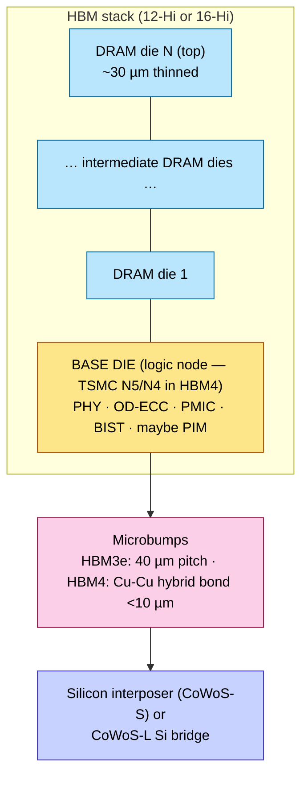
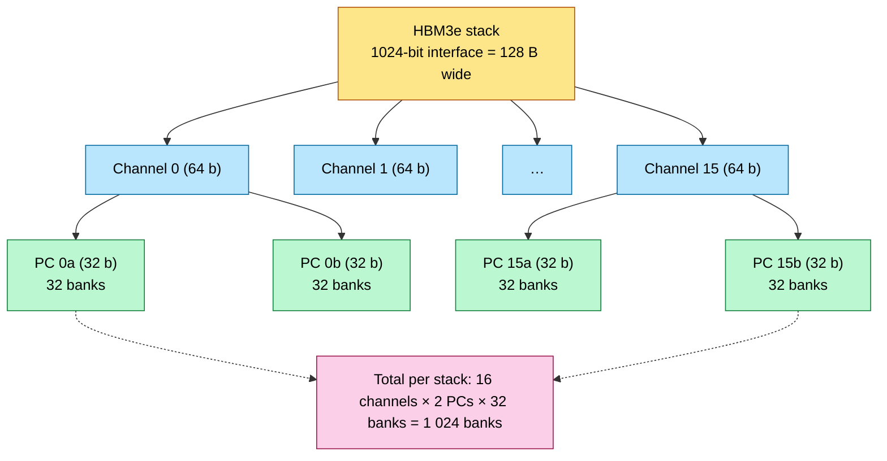
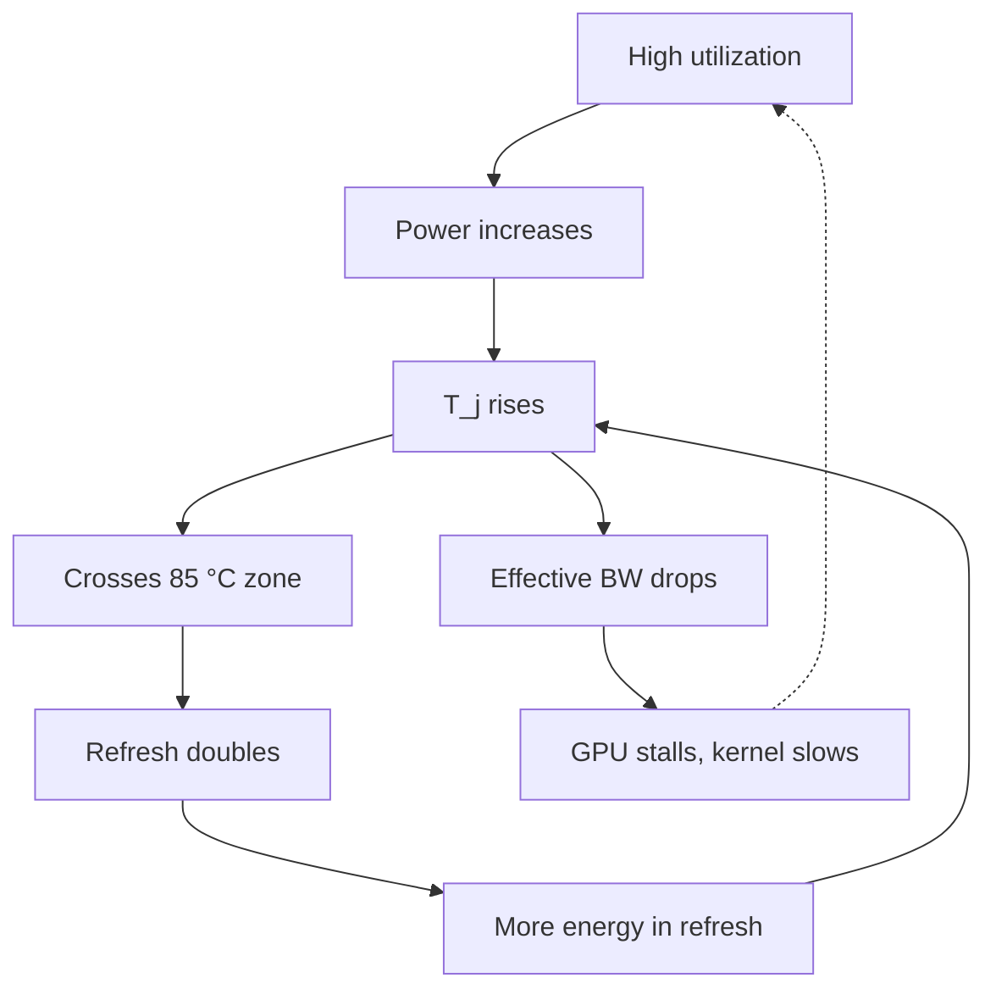

# HBM Deep Dive — Channels, TSVs, Sense Amps, Base Die

> **Layer:** L1.
> **Prerequisites:** [L0 Silicon_For_AI](../L0_Silicon_and_Process/Silicon_For_AI.md), [Advanced_Packaging](Advanced_Packaging.md). DRAM device-physics primer in [`digital_design/Memory.md`](../../hardware_design/01_Architecture_and_PPA/Memory.md) helps.
> **Hands off to:** [L3 Memory_Hierarchy_and_Roofline](../L3_Microarchitecture/Memory_Hierarchy_and_Roofline.md), then everything in [L8 inference engines](../L8_Inference_and_Serving/Index.md) that depends on the bandwidth wall.

---

## 0. Why HBM matters more than the logic die

LLM **decode** is bandwidth-bound — every generated token streams the full active parameter set (or the active experts, for MoE) from memory through the compute units. The capacity *and the speed* of this memory dominate decode latency.

Worked example. A 70 B-parameter model in FP8 = 70 GB. Target: 100 tokens/s/request at batch 1.

$$
B_{\text{required}} \;=\; M_{\text{weights}} \cdot R_{\text{tok}} \;=\; 70\ \text{GB} \cdot 100\ \text{s}^{-1} \;=\; 7.0\ \text{TB/s}
$$

Achievable on **any** memory system that lives off the same package as the logic die. Specifically:

- 1× HBM3e stack: 1.23 TB/s → would need 6 stacks just for one request.
- 8× HBM3e (B200): ~9.8 TB/s → comfortable, ~70% efficiency = 6.9 TB/s effective ≈ 100 tok/s for one request.

Now scale to batch 32 (typical chat workload). Weights are *amortized* across the batch:

$$
R_{\text{tok,batch}} \;=\; \frac{B_{\text{eff}} \cdot N_{\text{batch}}}{M_{\text{weights}}}
\;=\; \frac{6.9\,\text{TB/s} \cdot 32}{70\,\text{GB}}
\;\approx\; 3 150\ \text{tok/s aggregate}
$$

This is the entire reason continuous batching exists (covered at L8). HBM bandwidth is the single biggest lever on tokens-per-dollar.

### 0.1 Why HBM, not GDDR or DDR

GDDR7 per chip: ~144 GB/s (32 b @ 36 Gbps). To deliver 9.8 TB/s would require **68 GDDR7 chips**, but GPU substrate edge perimeter is only ~120 mm — there is physically no room for >24 chips around the periphery. HBM trades off-package edge perimeter for **on-package shoreline** (the edge of the logic die facing each HBM stack), where bump density is 100× higher.

| Memory | Width | Pin rate | BW per unit | pJ/bit | Where it fits |
|---|---|---|---|---|---|
| HBM3 | 1024 b | 6.4 Gbps | 819 GB/s | ~5.0 | Legacy training (H100 launch) |
| HBM3e (12-Hi) | 1024 b | 9.6 Gbps | 1.23 TB/s | ~4.0 | Frontier (B200, MI355X) |
| HBM4 (16-Hi) | 2048 b | ~10 Gbps | ~2.5 TB/s | <3.5 | Rubin, MI400 |
| GDDR7 | 32 b | 36 Gbps | 144 GB/s | ~7.0 | Consumer GPU |
| DDR5-6400 | 64 b | 6.4 Gbps | 51.2 GB/s | ~10.0 | Host CPU |
| LPDDR5X | 64 b | 8.5 Gbps | 68 GB/s | ~5.0 | Mobile / Grace CPU |

---

## 1. Stack anatomy

### 1.1 Vertical structure



### 1.2 Horizontal logical decomposition

A single 1 024-b HBM3e interface is **not one big bus**:



Each pseudo-channel (PC) is independently addressable, has its own command queue, and can be active simultaneously with all the others. This is the parallelism that hides analog DRAM latency.

---

## 2. Bandwidth: from channels up

### 2.1 First-principles derivation

Per stack:

$$
B_{\text{stack}} \;=\; W_{\text{interface}} \cdot R_{\text{pin}}
$$

For HBM3e: $W = 1024$ bits, $R_{\text{pin}} = 9.6$ Gbps.

$$
B_{\text{stack}} \;=\; 1024 \cdot 9.6\times 10^9 \;=\; 9.83\times 10^{12}\ \text{bits/s}
\;=\; 1.23\ \text{TB/s}
$$

Per package with $K$ stacks:

$$
B_{\text{pkg}} \;=\; K \cdot B_{\text{stack}}
$$

8-stack B200: $B_{\text{pkg}} = 8 \cdot 1.23 = 9.83$ TB/s peak. Effective bandwidth tops out at 80–90% of peak due to refresh, address overhead, and bank conflicts (§3.4).

### 2.2 The HBM4 doubling

HBM4 holds $R_{\text{pin}} \approx 10$ Gbps but doubles the bus to 2 048 bits. So $B_{\text{stack}} \approx 2.5$ TB/s and 8-stack packages reach ~20 TB/s peak.

Why double the *width* instead of the *frequency*? Energy. Power per bit on a frequency-pushed PHY scales worse than linearly:

$$
P_{\text{PHY}} \;\sim\; \alpha \cdot C \cdot V^2 \cdot f \;+\; P_{\text{eq}}(f)
$$

The $P_{\text{eq}}(f)$ term — equalizers, CDR loops, training circuits — grows superlinearly above ~12 Gbps single-ended on USR signaling. Doubling width at constant frequency stays in the linear-energy regime; doubling frequency would push the PHY into a regime where $P/B$ rises ~2.5×. The width-doubling is *cheaper in pJ/bit* even though it requires hybrid bonding to fit the 2× pin count.

### 2.3 Why per-pin frequency caps near ~10 Gbps

Single-ended USR signaling over a TSV-stack bus has a Nyquist frequency at $f/2$. At $f = 10$ Gbps, Nyquist = 5 GHz. Skin-effect loss in a Cu TSV bus + bond-wire assembly compounds with reflections from impedance discontinuities at every die boundary. The eye opening derivation (cf. [Advanced_Packaging §3.4](Advanced_Packaging.md)) closes below 30% above ~12 Gbps without expensive on-die equalization, which would burn the pJ/bit budget.

---

## 3. The DRAM cell and its analog reality

### 3.1 The 1T1C cell and charge sharing

A DRAM bit lives in the charge stored on a tiny capacitor $C_s \approx 25$ fF, accessed through a single transistor whose gate is the wordline. To read:

1. Precharge the bitline to $V_{dd}/2 \approx 0.55$ V.
2. Assert the wordline → access transistor turns on.
3. The cell capacitor (containing either ~0 V or ~$V_{dd}$) shares charge with the (much larger) bitline.

Resulting bitline perturbation:

$$
\Delta V \;=\; \frac{C_s}{C_s + C_{\text{bl}}}\,(V_{\text{cell}} - V_{\text{precharge}})
$$

For $C_{\text{bl}} \approx 200$ fF (8× $C_s$) and $V_{\text{cell}} - V_{\text{precharge}} = 0.55$ V (a "1" reading):

$$
\Delta V \;=\; \frac{25}{225} \cdot 0.55 \;\approx\; 61\ \text{mV}
$$

Sixty millivolts. That's all the sense amplifier has to work with. Crank the bitline length up to lower routing density and $C_{\text{bl}}$ rises proportionally — at $C_{\text{bl}}/C_s = 16$, $\Delta V$ falls to 32 mV, below typical sense-amp threshold.

### 3.2 The sense amplifier

A pair of cross-coupled inverters latches the bitline differential. The fundamental dynamics: positive feedback at gain $A > 1$ drives the latch from 60 mV separation to full $V_{dd}$ swing in ~3 ns. This 3 ns is dominated by the regenerative time constant

$$
\tau_{\text{regen}} \;=\; \frac{C_{\text{latch}}}{g_m},
$$

where $g_m$ is the latch transistor transconductance. *You cannot make this faster by clocking faster*. Sense amps are the DRAM speed floor.

### 3.3 The command sequence: ACT → RD/WR → PRE

Every DRAM access goes through three commands:

```mermaid
sequenceDiagram
    autonumber
    participant MC as Memory controller
    participant BD as HBM base die
    participant BNK as DRAM bank
    Note over MC,BNK: One bank, full ACT → RD → PRE cycle
    MC->>BD: ACT(row)
    BD->>BNK: assert wordline; sense-amp regenerates
    Note over BNK: t_RCD ≈ 14 ns (sense-amp regen, analog floor)
    MC->>BD: RD(col)
    BD->>BNK: column select
    BNK-->>MC: data burst on DQ pins
    Note over MC,BNK: t_CAS ≈ 2 ns + burst (variable)
    MC->>BD: PRE
    BD->>BNK: lower wordline; precharge bitlines to V_dd/2
    Note over BNK: t_RP ≈ 14 ns (must complete before next ACT to same bank)
    Note right of MC: Same-bank, different-row access ⇒ t_RP + t_RCD + t_CAS ≈ 30 ns penalty
```

Timing parameters (HBM3e-typical):

| Param | Meaning | Value |
|---|---|---|
| $t_{\text{RCD}}$ | Row activate to column command | ~14 ns |
| $t_{\text{CAS}}$ | Column command to data on bus | ~2 ns |
| $t_{\text{RP}}$ | Precharge to next ACT | ~14 ns |
| $t_{\text{RC}} = t_{\text{RAS}} + t_{\text{RP}}$ | Full row cycle | ~45 ns |
| $t_{\text{REFI}}$ | Average refresh interval per row | 7.8 µs |
| $t_{\text{RFC}}$ | Refresh cycle time | ~350 ns |

These numbers haven't moved much in 15 years. **Latency is not improving; only bandwidth is.**

### 3.4 Bank conflicts and row-buffer locality

If two consecutive accesses hit the *same* bank but *different* rows:

$$
t_{\text{conflict}} \;=\; t_{\text{RP}} + t_{\text{RCD}} + t_{\text{CAS}} \;\approx\; 30\ \text{ns}
$$

If two accesses hit the same bank and the *same* row (row-buffer hit):

$$
t_{\text{hit}} \;=\; t_{\text{CAS}} \;\approx\; 2\ \text{ns}
$$

15× latency difference. High-performance kernels stripe data so consecutive accesses go to different *banks* (bank-level parallelism), and within a bank exhibit row-buffer locality. **The address-bit interleaving in the memory controller is one of the single most under-discussed performance levers in the entire stack.**

### 3.5 Effective bandwidth utilization

Real-world utilization $\eta$:

$$
\eta \;=\; \underbrace{(1 - f_{\text{refresh}})}_{\sim 0.93}
    \cdot \underbrace{(1 - f_{\text{cmd-overhead}})}_{\sim 0.97}
    \cdot \underbrace{(1 - f_{\text{conflict}})}_{0.85\text{–}0.95}
$$

Refresh fraction:

$$
f_{\text{refresh}} \;=\; \frac{t_{\text{RFC}}}{t_{\text{REFI}}}
\;=\; \frac{350\,\text{ns}}{7\,800\,\text{ns}} \;\approx\; 4.5\%
$$

(Doubles when the stack heats above 85 °C and refresh interval halves — see §6.)

Realistic effective BW: 80–90% of peak. A 1.23 TB/s HBM3e stack delivers ~1.0–1.1 TB/s in production code.

---

## 4. TSV physics (HBM-specific)

For general TSV physics see [Advanced_Packaging §4](Advanced_Packaging.md). The HBM-specific issues:

### 4.1 Stack-height-dependent loading

A 16-Hi stack puts 16 die-load capacitances on every shared TSV. With per-die TSV-bus capacitance ~70 fF:

$$
C_{\text{bus,total}} \;=\; 16 \cdot 70\,\text{fF} \;=\; 1.12\ \text{pF}
$$

PHY drive strength must scale to charge this in <100 ps for 10 Gbps signaling, burning ~$\frac{1}{2} C V^2 f = \frac{1}{2} \cdot 1.12\,\text{pF} \cdot 0.7^2 \cdot 10^{10} \approx 2.7$ mW per pin. Multiply by 1 024 pins: ~2.8 W just driving the bus.

### 4.2 Die-thinning to manage TSV length

To keep TSV length manageable in a 16-Hi stack, individual DRAM dies are thinned to ~30 µm. This thinning is a separate process step with low yield: aggressive CMP can cause die warpage and cracks during stacking. Per-die thinning yield is one of the gating factors on HBM4 ramp.

### 4.3 Redundant TSVs and fuse-based remap

Every HBM stack has spare TSVs. The base-die self-test at boot scans all TSVs by driving known patterns and verifying readback; failed TSVs are fused off and traffic is routed through spares. This is *transparent to the GPU memory controller* — the OD-ECC + remap state lives in the base die. Modern HBM3e stacks have ~10% TSV redundancy.

---

## 5. The base die — increasingly a real chip

Through HBM2/3, the base die was a glorified PHY-and-buffer chip on an old DRAM process. **HBM4 changes the rules** by moving the base die onto a real logic node. Confirmed: TSMC HBM4 base dies on both 12nm and 5nm nodes. SK hynix is building a dedicated $3.87B HBM4 packaging fab in Indiana to support volume production. What this enables:

### 5.1 Better PHY

Logic-node transistors deliver ~2× the FoM (gain × bandwidth / power) of DRAM-process transistors. Per-pin PHY power drops from ~5 pJ/bit (HBM3) to <3.5 pJ/bit (HBM4). On a 16 TB/s package, that 1.5 pJ/bit gap is 24 W — half the package signaling budget.

### 5.2 On-die ECC (OD-ECC)

Every 256-bit codeword carries SECDED + chip-kill. The base die corrects single-bit errors *before* they reach the memory controller, dropping uncorrectable BER by 4+ orders of magnitude. Critical at 16 TB/s, where even 10⁻¹⁵ raw BER is one error every minute.

### 5.3 Power management (PMIC)

Per-PC voltage regulation. Banks sleeping → lower V_dd. Active banks under thermal pressure → reduce $V_{dd}$, raise refresh, and signal back-pressure to the GPU. The thermal feedback loop (§6) becomes manageable.

### 5.4 Direct-to-compute integration

Because the base die is a logic die, the GPU vendor can put **GPU-specific logic** in the base die: portions of the memory controller, atomic-operation engines, prefetchers. NVIDIA's roadmap implies parts of the L2 cache controller may live in the base die for Rubin.

### 5.5 Processing-in-memory (PIM)

Samsung's HBM-PIM and SK hynix's AiM put SIMD ALUs in the base die that operate on data without ever moving it through the PHY. For workloads that are *pure* memory-streaming (e.g., embedding lookup, simple GEMV), PIM cuts data movement by 5–10× and energy by 70%+. Not yet mainstream because programming models are immature, but a real 2026–2027 vector.

---

## 6. The thermal-refresh feedback loop

DRAM cell retention falls exponentially with temperature:

$$
t_{\text{retention}}(T) \;\propto\; \exp\!\left(\frac{E_a}{k_B T}\right)
$$

with $E_a \approx 0.6$ eV (typical for sub-threshold leakage in DRAM access transistors). Doubling temperature ~halves retention.

JEDEC partitions HBM into temperature zones. At each zone-crossing, refresh interval halves, *doubling refresh overhead*:

| Zone | Temp range | $t_{\text{REFI}}$ | Refresh % | Effective BW |
|---|---|---|---|---|
| 1 | < 85 °C | 7.8 µs | 4.5% | 95% |
| 2 | 85 – 95 °C | 3.9 µs | 9% | 91% |
| 3 | > 95 °C | 1.95 µs | 18% | 82% |

The catch: refresh cycles dissipate energy, *raising* the temperature, which forces *more* refresh. Without active cooling this is a positive-feedback runaway:



This is why **liquid cooling is non-negotiable for frontier accelerators**. Air-cooled HBM3e at >75% utilization spends 18% of its bandwidth budget on refresh — destroying the price-per-FLOP argument.

---

## 7. Signaling: write leveling, deskewing, eye training

### 7.1 Why per-pin training

At 9.6 Gbps, the unit interval (UI) is 104 ps. A single-ended signal must be sampled within ±15 ps of the eye center to maintain BER < 10⁻¹². With 1 024 parallel signals over a multi-cm path, manufacturing variation alone produces ±20 ps skew per pin — insufficient margin without per-pin compensation.

### 7.2 Training procedure

At every cold boot (and triggered by ECC-error spikes during runtime):

1. **Read leveling**: strobe DQS sweeps a programmable delay line; capture the data-eye edges.
2. **Write leveling**: GPU drives known patterns; HBM base die reports back the captured value vs. expected.
3. **Per-pin deskew**: each DQ has its own delay line trimmed to center the eye.
4. **CDR lock**: clock-data recovery loops settle.

Training takes ~50 ms at boot. During runtime, periodic re-training (every ~hour) corrects for thermal drift.

---

## 8. Reliability / failure modes

### 8.1 TSV electromigration

Cu atoms drift along grain boundaries under sustained current density. Above $J = 5\times 10^5$ A/cm², lifetime drops to <5 years. Mitigation: redundant TSVs + fuse-remap (§4.3) + current-density limits in the spec.

### 8.2 Microbump fatigue

CTE-driven thermal cycling creates microcracks in SnAg microbumps. Each cycle propagates the crack ~100 nm; after $\sim 10^4$ cycles, macro-cracks open. Mitigation: hybrid bonding (no solder to crack), aggressive thermal management to limit ΔT per cycle.

### 8.3 Row Hammer

Repeated access to one wordline ("aggressor") couples capacitively to neighboring rows ("victims"). Victim cells leak charge faster than the normal refresh cycle replenishes; eventually a bit flips. JEDEC mandates **TRR (Target Row Refresh)**: the base die monitors hot rows and refreshes neighbors preemptively. This raises the bar significantly compared to commodity DDR4, but it is not a complete defense: newer RowHammer variants such as **Double-sided RowHammer** (hammering rows on *both* sides of a victim simultaneously) and **Half-Double** (many accesses to near-aggressor rows at moderate distance) have been demonstrated to bypass TRR mitigations on DDR4/5 and LPDDR4X. HBM's wider bus and finer-grained bank-level scheduling make exploitation harder, yet the analog coupling mechanism remains. The claim that HBM is "RowHammer-immune" should be treated as a practical engineering advantage, not an absolute guarantee.

### 8.4 Signal integrity drift

Aging shifts the optimal eye-sample point. Symptom: ECC correctable-error rate creeping upward. Treatment: trigger re-training (§7.2). When re-training fails to recover the eye, the stack is marked degraded and traffic is steered to redundant TSVs / spare pseudo-channels.

---

## 9. The 2025–2027 HBM roadmap

```mermaid
gantt
    title HBM generation rollout
    dateFormat  YYYY-MM
    axisFormat  %Y-%m

    section HBM3
    Production peak               :2023-06, 2024-12

    section HBM3e
    First product (B200, MI355X)  :2024-04, 2026-06
    8/12-Hi mainstream            :2024-06, 2027-12

    section HBM4
    Sampling / early production   :2025-Q3, 2026-Q2
    Hybrid-bond ramp              :2026-Q1, 2027-Q4
    Mainstream (Rubin, MI400)     :2026-Q4, 2028-12

    section HBM4e (proj)
    Sampling                      :2027-Q4, 2028-12
```

Stack-height ceiling rises 8 → 12 → 16 → likely 20-Hi; per-pin frequency rises 6.4 → 9.6 → ~10 → ~12 Gbps; bus width jumps from 1 024 to 2 048 with HBM4. Energy/bit drops by ~30% per generation thanks to base-die logic-node migration.

**HBM4 production status (updated May 2026):** TSMC HBM4 base dies confirmed on 12nm and 5nm nodes. SK hynix building a $3.87B HBM4 packaging fab in Indiana. HBM4 status upgraded from "projected" to **sampling / early production** — base dies are in volume, with hybrid-bond ramp underway for mainstream 2026-Q4 deployment in Rubin and MI400.

Capacity per stack:

| Gen | Stack height | Per-die capacity | Per-stack |
|---|---|---|---|
| HBM3 | 8-Hi | 2 GB | 16 GB |
| HBM3e | 12-Hi | 3 GB | 36 GB |
| HBM4 | 16-Hi | 4 GB | 64 GB |
| HBM4e (proj) | 16-Hi | 6 GB | 96 GB |

8-stack package capacities: 128 GB → 288 GB → 512 GB → ~768 GB. Fits Llama-4-Maverick-class models in BF16 on a single package by HBM4e.

---

## 10. Interplay with logic-die microarchitecture (preview)

Decisions made at L1 propagate up:

- **Channel count** dictates how many independent memory-controller queues live in the GPU L2 cache subsystem. B200's 8 stacks × 16 channels = 128 independent channels per package. The L2 partitioning at L3 mirrors this.
- **Bank parallelism** dictates the GPU's prefetch depth. A kernel issuing fewer concurrent requests than there are banks underutilizes the memory subsystem.
- **Refresh latency** determines worst-case load latency. Memory-controller schedulers aware of refresh-cycle timing can reorder loads to avoid the refresh window.
- **OD-ECC presence** changes how the GPU's L2 ECC is configured (no need to duplicate single-bit detection).

Full coverage in [L3 Memory_Hierarchy_and_Roofline](../L3_Microarchitecture/Memory_Hierarchy_and_Roofline.md).

---

## 11. Numbers to memorize

| Quantity | Value | Why |
|---|---|---|
| HBM3e per-stack BW | 1.23 TB/s | 1024 b × 9.6 Gbps / 8 |
| HBM4 per-stack BW | ~2.5 TB/s | 2048 b × ~10 Gbps / 8 |
| HBM stack capacity (12-Hi/3 GB) | 36 GB | HBM3e peak |
| HBM stack capacity (16-Hi/4 GB) | 64 GB | HBM4 launch |
| 8-stack package BW (HBM3e) | ~9.83 TB/s | B200 / MI355X |
| 8-stack package capacity (HBM4) | 512 GB | Rubin target |
| Per-pin signaling rate | 9.6 → ~10 Gbps | Energy-driven cap |
| Bus width per stack | 1024 → 2048 b | HBM4 doubling |
| Energy per bit (HBM3 → HBM4) | ~5 → <3.5 pJ/bit | Base-die logic node |
| $t_{\text{RCD}}$ (row activate) | ~14 ns | Sense-amp regen floor |
| $t_{\text{CAS}}$ (column read) | ~2 ns | Burst latency |
| $t_{\text{RP}}$ (precharge) | ~14 ns | Bank close |
| Bank-conflict penalty | ~30 ns | $t_{\text{RP}} + t_{\text{RCD}} + t_{\text{CAS}}$ |
| Row-buffer hit latency | ~2 ns | Stream from open row |
| Refresh % at <85 °C | ~4.5% | $t_{\text{RFC}}/t_{\text{REFI}}$ |
| Refresh % at >95 °C | ~18% | Halved interval |
| HBM stack power | 5–8 W | Thermal coupling target |
| HBM $T_j$ ceiling | 95 °C | Refresh-doubling threshold |
| Channels per stack | 16 | Independent address spaces |
| Pseudo-channels per stack | 32 | Fine-grain parallelism |
| Banks per PC | 32 | Total ~1024 banks/stack |
| TSV-bus capacitance (16-Hi) | ~1.1 pF | PHY drive budget |
| TSV current-density limit | $5 \times 10^5$ A/cm² | Electromigration |
| HBM-stack microbump pitch (HBM3e/HBM4) | 40 / <10 µm | Solder vs. hybrid-bond |
| Per-stack bank parallelism (concurrent open rows) | up to 32 PCs × 16 = 512 | Why bank-aware schedulers matter |

---

## 12. Worked interview problems

**Q1.** *A B200 8-HBM3e package serves 64 concurrent requests of a 70 B FP8 model. How many tokens/sec aggregate? Identify the bottleneck.*

Effective BW ≈ 0.85 × 9.83 = 8.36 TB/s. Per-step weight read = 70 GB. Tokens/step = 64 (one per request). So tokens/sec = $\frac{8.36\,\text{TB/s} \cdot 64}{70\,\text{GB}} \approx 7 640$ tok/s aggregate. Bottleneck: HBM bandwidth (decode-bound). Compute is barely touched at this batch size; FP8 tensor-core capacity is ~10× idle.

**Q2.** *Why can't HBM raise per-pin to 20 Gbps to double bandwidth without doubling pin count?*

Three compounding reasons: (a) eye opening collapses — single-ended USR signaling at 20 Gbps requires equalization (DFE/CTLE) that quintuples PHY power; (b) the TSV-stack acts as a lossy bus with skin-effect attenuation rising as √f, so 4× higher loss at 4× the Nyquist; (c) the protocol overhead (training, refresh) becomes a larger fraction of throughput. Total energy per bit at 20 Gbps would rise 2.5×, defeating the purpose. Doubling pin count via hybrid bonding stays linear in pJ/bit.

**Q3.** *Estimate the HBM stack power that pushes a stack from refresh zone 1 to zone 2.*

In the steady state, $T_j = T_{\text{ambient}} + P \cdot \theta_{\text{stack}}$. With $T_{\text{ambient}} = 35\,°$C (cold-plate inlet), zone 2 at 85 °C, and $\theta_{\text{stack}} \approx 8\,°$C/W (typical 12-Hi):

$$
P_{\text{zone2}} \;=\; \frac{85 - 35}{8} \;=\; 6.25\ \text{W}
$$

So a 12-Hi HBM3e stack hits zone-2 at roughly steady ~6 W. A peak workload putting >6 W per stack will halve refresh interval and cost ~9% of bandwidth. Realistic ops budget: hold each stack to ≤5 W average.

**Q4.** *Why does HBM4 require a logic-node base die?*

Three reasons stacking: (a) PHY power per bit must drop ~30% to keep total package signaling power flat as bus width doubles; only logic-node transistors get there; (b) on-die ECC scoring at 16 TB/s requires nontrivial error-correction circuits, which need logic-density transistors; (c) the optionality of putting GPU memory-controller fragments and PIM in the base die is unlocked, reducing inter-package data movement.

**Q5.** *A kernel does fully random 64 B reads from a 70 B model. Estimate effective HBM bandwidth on B200.*

Random access destroys row-buffer locality. Each access pays ~30 ns. 64 B per access ⇒ effective per-channel BW = 64 / (30 ns) = 2.13 GB/s. With 8 stacks × 16 channels × 2 PCs = 256 independent channels: 256 × 2.13 = 545 GB/s. Versus 9.8 TB/s peak: **5.5% of peak**. This is why prefix-cached / structured attention patterns dominate decode-time access in production engines.

---

## 13. References

**Standards**
- JEDEC JESD238 (HBM3), JESD270 (HBM4), JESD235D (HBM2e legacy).

**Conferences**
- ISSCC — HBM PHY and base-die designs (annual).
- Hot Chips — vendor architectural disclosures (NVIDIA, AMD, SK hynix, Samsung, Micron).
- IEDM — DRAM device-physics papers.
- VLSI Symposium — process-side HBM TSV / hybrid-bonding work.

**Academic**
- Onur Mutlu's research group (CMU/ETH) — DRAM controller design, RowHammer, refresh scheduling.
- Brian Wong et al., *DRAM Refresh Mechanisms, Penalties, and Trade-Offs* (TC 2014) — canonical refresh analysis.

**Cross-references in this vault**
- [`digital_design/Memory.md`](../../hardware_design/01_Architecture_and_PPA/Memory.md) — DRAM device-physics primer.
- [`digital_design/Signal_Integrity_Reliability.md`](../../hardware_design/05_Backend_Physical_Design/Signal_Integrity_Reliability.md) — signaling-side companion.
- [`power/Power_Analysis_and_Signoff.md`](../../hardware_design/02_Power_and_Low_Power/Power_Analysis_and_Signoff.md) — PHY power signoff.

---

**Up the stack:** [L2 Digital Design for AI](../L2_Digital_Design_for_AI/Index.md) → [L3 Memory_Hierarchy_and_Roofline](../L3_Microarchitecture/Memory_Hierarchy_and_Roofline.md).
**See also:** [Advanced_Packaging](Advanced_Packaging.md) (the packaging substrate that makes HBM possible).
