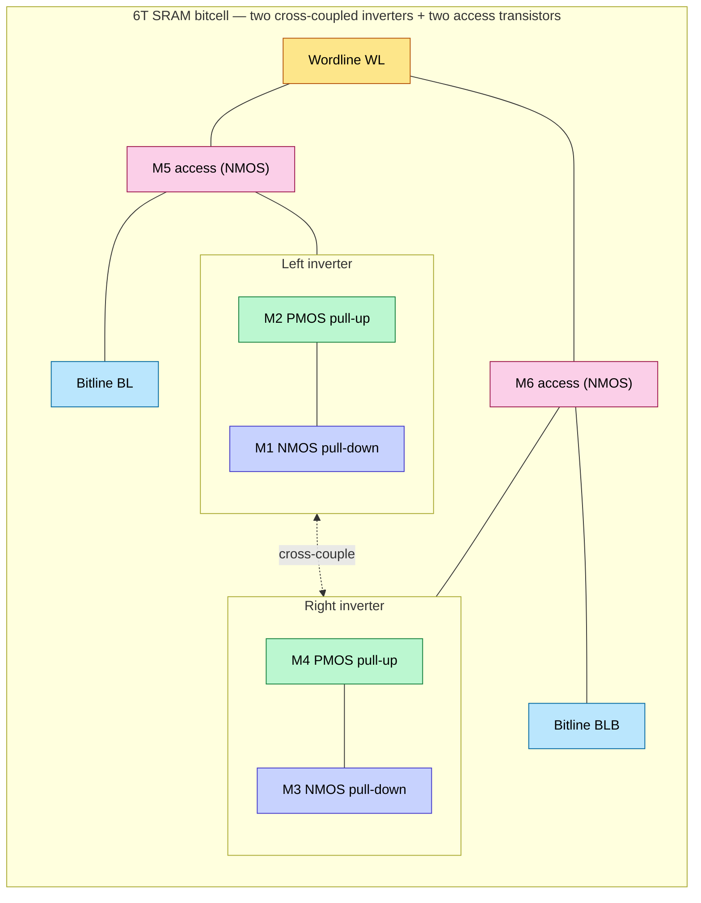
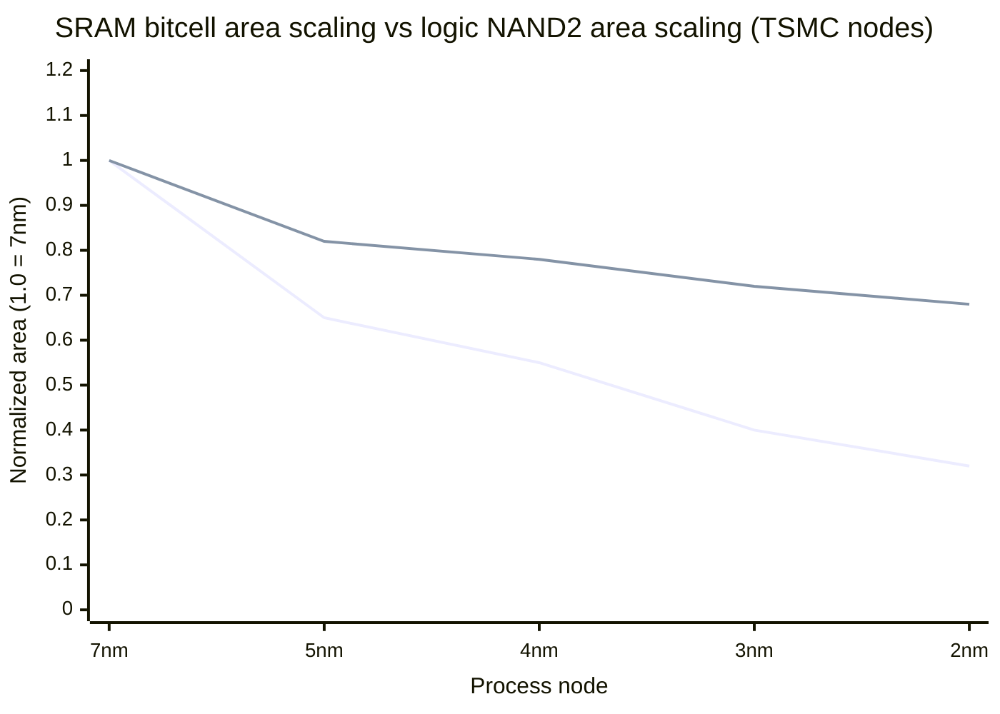
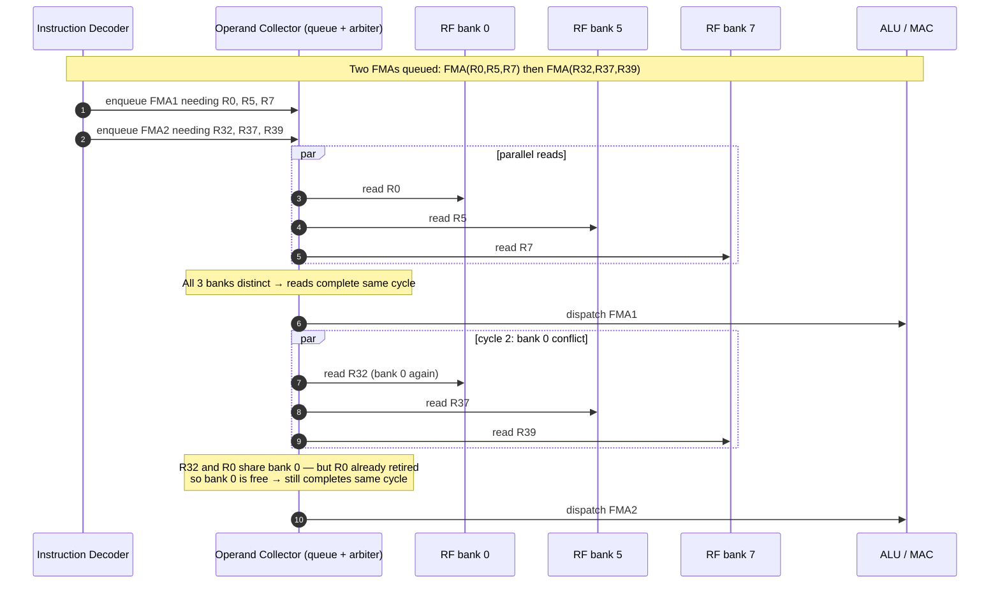
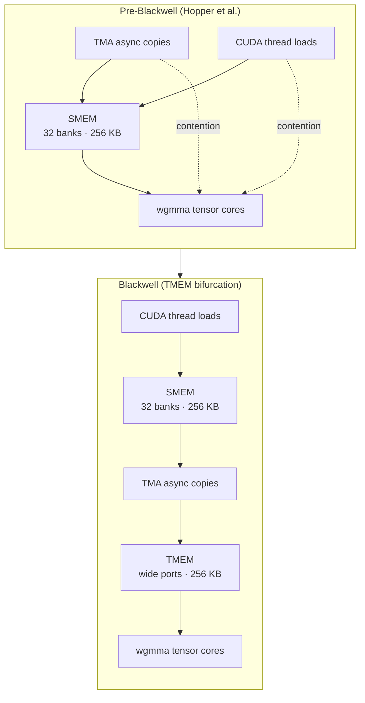
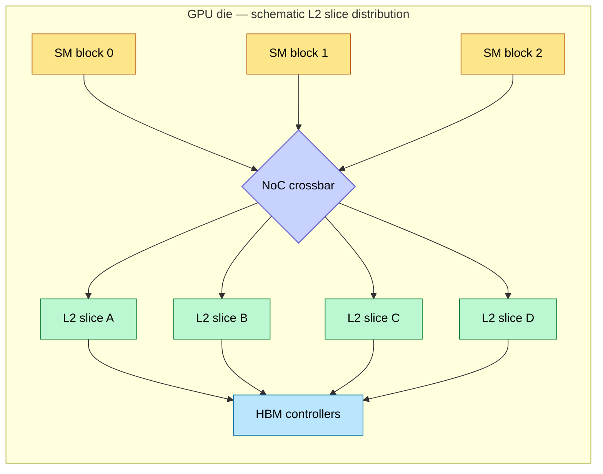

# On-Chip Memory Hardware — SRAM, Register File, TMEM, L2

> **Layer:** L2.
> **Prerequisites:** [L0 Silicon_For_AI](../L0_Silicon_and_Process/Silicon_For_AI.md), [L1 HBM_Deep_Dive](../L1_Packaging_and_Memory/HBM_Deep_Dive.md). CMOS-cell familiarity.
> **Hands off to:** [FP_Unit_Design](FP_Unit_Design.md), [Systolic_Arrays_and_Dataflow](Systolic_Arrays_and_Dataflow.md), [L3 Microarchitecture](../L3_Microarchitecture/Index.md).

---

## 0. The argument in one paragraph

A modern AI accelerator is a *bandwidth* machine, not a FLOPS machine. Every higher-layer optimization — FlashAttention's tiling, vLLM's PagedAttention, Mooncake's KV pool — exists to reduce *bytes moved per useful FLOP*. The L2 layer determines the absolute ceiling on how fast bytes can be moved between memory cells and compute units. That ceiling is set by the physics of the **6T SRAM bitcell** and the architecture of the **register file / TMEM / L2 hierarchy** stacked on top of it. Once you understand why a 6T cell cannot have 8 read ports and why FP4 requires a brand-new memory tier (TMEM), every higher-layer architectural choice becomes inevitable rather than mysterious.

---

## 1. The bandwidth cliff

### 1.1 The numbers a B300 SM has to feed

A Blackwell B300 SM at FP4 peak: ~10.8 PFLOPS at ~1.6 GHz. That is

$$
N_{\text{ops/cycle}} \;=\; \frac{10.8\times 10^{15}}{1.6\times 10^9} \;\approx\; 6\,750\ \text{ops/cycle}
$$

each op = one FMA (multiply + add), reading 2 inputs + 1 accumulator and writing 1 accumulator. At FP4 inputs (½ byte each) and FP32 accumulator (4 bytes):

$$
B_{\text{op}} \;=\; \tfrac{1}{2} + \tfrac{1}{2} + 4 + 4 \;=\; 9\ \text{B per op}
$$

Per-SM operand bandwidth demand:

$$
B_{\text{SM}} \;=\; 6\,750 \cdot 9\,\text{B} \cdot 1.6\times 10^9\,\text{Hz} \;\approx\; 97\ \text{TB/s}
$$

Multiply by ~144 SMs in a B300 die: ~14 PB/s of *internal* operand traffic per die. HBM tops out at ~10 TB/s. The ratio of internal-to-external bandwidth demand is **~1 400×** — the entire purpose of L2 memory hierarchy is to bridge that ratio.

### 1.2 The hierarchy with bandwidth budgets

```mermaid
flowchart TD
    HBM[HBM3e / HBM4<br/>~10 TB/s/package · 300–500 cycle latency<br/>capacity ~96–512 GB]:::offchip
    L2[L2 cache (distributed slices)<br/>~10 TB/s · 30–80 cycle latency<br/>~50 MB chip-wide]:::l2
    SMEM[SMEM / LDS<br/>~30 TB/s/SM · 8–20 cycle latency<br/>~256 KB/SM · 32 banks]:::smem
    TMEM[TMEM (Blackwell+)<br/>~50–80 TB/s/SM · 2–4 cycle latency<br/>~256 KB/SM · ultra-wide read ports]:::tmem
    RF[Register file<br/>~100 TB/s/SM · 1 cycle latency<br/>~256 KB/SM · 32 banks via operand collector]:::rf
    MAC[Tensor-core MAC array<br/>operand demand ~97 TB/s/SM at FP4]:::mac

    HBM --> L2 --> SMEM
    SMEM --> TMEM
    SMEM --> RF
    TMEM --> MAC
    RF --> MAC

    classDef offchip fill:#fca5a5,stroke:#991b1b,color:#000
    classDef l2 fill:#fdba74,stroke:#c2410c,color:#000
    classDef smem fill:#fde68a,stroke:#b45309,color:#000
    classDef tmem fill:#bbf7d0,stroke:#15803d,color:#000
    classDef rf fill:#bae6fd,stroke:#0369a1,color:#000
    classDef mac fill:#c7d2fe,stroke:#4338ca,color:#000
```

Bandwidth grows ~10× per tier as you climb. The "bandwidth cliff" is what happens when an algorithm's working set exceeds a tier and falls to the next.

---

## 2. The 6T SRAM bitcell

### 2.1 Topology



Six transistors store one bit. The cross-coupled inverters create two stable states (Q = 0, Q̄ = 1 or vice versa); access transistors gate the bitlines into and out of the cell.

### 2.2 Read operation and SNM

To read: precharge BL and BLB to $V_{dd}$, then assert WL.

If the cell stores Q=0, current flows BL → M5 → M1 → GND. Q rises to some intermediate voltage:

$$
V_Q \;=\; V_{dd} \cdot \frac{R_{M1}}{R_{M1} + R_{M5}}
$$

If $V_Q$ exceeds the switching threshold of the right inverter (M3/M4), the cell *flips*. To prevent this destructive read:

$$
\beta_{M1} \;\gg\; \beta_{M5} \quad\Rightarrow\quad R_{M1} \;\ll\; R_{M5}
$$

The **cell ratio** $CR = \beta_{M1}/\beta_{M5}$ must satisfy $CR \ge 1.2$–$1.5$. Physically: M1's channel must be *wider* than M5's. Static Noise Margin (SNM) — the largest DC noise voltage a cell can absorb without flipping — is plotted as the largest square that fits inside the butterfly curve of the cross-coupled inverter VTCs.

### 2.3 Write operation and write margin

To write a 0 to a cell currently holding 1: drive BL low, BLB high. M5 must drag Q down through M2's pull-up resistance. Now M5 must *win* against M2:

$$
\beta_{M5} \;>\; \beta_{M2} \quad\Rightarrow\quad PR \;=\; \frac{\beta_{M2}}{\beta_{M5}} \;<\; 1.0
$$

The **pull-up ratio** $PR < 1$ — M2 (PMOS) must be physically smaller than M5 (NMOS).

Combining both constraints:

$$
\beta_{M1} \;>\; \beta_{M5} \;>\; \beta_{M2}
$$

This is the **6T sizing inequality**. Cell area is dominated by M1's required width.

### 2.4 The SNM derivation (sketch)

For an inverter pair with VTC $V_{\text{out}} = f(V_{\text{in}})$, define a butterfly plot ($V_{\text{out},R}$ vs $V_{\text{out},L}$). The SNM is the side of the largest square that fits between the two VTC curves. Approximation by Seevinck:

$$
\text{SNM} \;\approx\; \frac{V_{\text{th},n}}{1 + r} \;-\; \frac{V_{dd} - V_{\text{th},p}}{1 + r}\cdot\frac{1}{q\cdot k}
$$

where $r = (\mu_p \cdot W_p / L_p)/(\mu_n \cdot W_n / L_n)$ etc. Practical takeaway: SNM scales linearly with $V_{dd} - 2V_{\text{th}}$. As $V_{dd}$ falls below ~0.5 V, SNM collapses, and the cell becomes unreliable.

### 2.5 Why density scaling stalled at N3

At N3 and below, three sources of variation conspire to break the 6T cell:

1. **Random Dopant Fluctuation (RDF)** — channels are so narrow that the absolute number of dopant atoms (~tens) becomes statistically significant. Per-transistor $V_{\text{th}}$ varies by ±50 mV at 1σ.
2. **Line Edge Roughness (LER)** — photolithography edge sharpness becomes comparable to feature size; W/L ratios become probabilistic.
3. **Random Telegraph Noise (RTN)** — single-electron trap/release events flip $V_{\text{th}}$ by 10–30 mV at random.

For a cell to pass yield with $\ge 6\sigma$ SNM, the mean SNM must absorb 6 standard deviations of variation. At N3, the only way to do this is to keep transistors *wider* than logic minimum — so SRAM density scales at <0.85× per node vs. logic at 0.6× per node. Over four generations, SRAM has fallen from being area-comparable to logic to being ~3× the relative cost.



This is *the* structural reason GPU L1/SMEM has been frozen at ~256 KB across Volta → Ampere → Hopper → Blackwell. There is no node-shrink dividend for SRAM.

---

## 3. Memory architecture: banking and conflict math

### 3.1 Why banking exists

A monolithic 256 KB SRAM has bitlines several mm long with $C_{\text{BL}} \sim 1$ pF. Read access time:

$$
t_{\text{access}} \;\approx\; \frac{C_{\text{BL}} \cdot \Delta V_{\text{sense}}}{I_{\text{cell}}}
$$

For $\Delta V_{\text{sense}} = 100$ mV and $I_{\text{cell}} = 30\,\mu$A: $t_{\text{access}} \approx 3.3$ ns — far slower than a 1 ns clock period. Solution: split into N banks, each with short bitlines.

For SMEM organized as 32 banks of 8 KB each, bitline length is ~32× shorter, so $C_{\text{BL}}$ falls ~32×, and access time falls into the sub-ns regime. Theoretical aggregate bandwidth scales as $N \times$ bandwidth-per-bank.

### 3.2 The bank-index function

CUDA SMEM uses 32-bank, 4-byte word-interleaved layout. Address-to-bank mapping:

$$
\text{bank}(A) \;=\; \left\lfloor \frac{A}{4} \right\rfloor \bmod 32
$$

A warp = 32 threads. If thread $i$ accesses address $A_i$, the warp issues 32 simultaneous bank requests. Conflict iff two distinct accesses hit the same bank.

### 3.3 Worked stride examples

**Stride 1** (each thread reads consecutive 4 B):
$$
\text{bank}(4i) \;=\; i \bmod 32 \;=\; i \quad\text{for } i\in[0,31]
$$
All 32 threads → distinct banks → **0-way conflict, full bandwidth**.

**Stride 2** (each thread reads 8 B apart):
$$
\text{bank}(8i) \;=\; 2i \bmod 32
$$
Threads $i=0$ and $i=16$ both → bank 0. Threads $i=1$ and $i=17$ both → bank 2. Etc.
Result: **2-way conflict, ½ bandwidth**.

**Stride 32** (each thread reads 128 B apart):
$$
\text{bank}(128i) \;=\; 32i \bmod 32 \;=\; 0
$$
*All* 32 threads → bank 0. CUDA hardware special-cases this: if the access is a *broadcast* (same address), bank 0 returns once and broadcasts. If addresses differ but all collide on bank 0: **32-way conflict**, 1/32 bandwidth (catastrophic).

**Stride 33** (one byte off):
$$
\text{bank}(132i) \;=\; 33i \bmod 32 \;=\; i \bmod 32
$$
0-way conflict. The infamous "+1 padding trick" used by CUTLASS / Triton to break stride-32 conflicts when transposing tiles.

### 3.4 Conflict-free padding theorem

If you allocate a $K \times N$ tile in SMEM and access it column-major (stride $N$) in a warp, you get a stride-$N$ conflict. Padding the row to $N+1$ instead of $N$ shifts every access by one byte per row, breaking the modulo periodicity. For row stride $N+p$:

$$
\text{bank}(\text{thread } i, \text{ row } r) \;=\; (Ni + p \cdot r) \bmod 32
$$

Choose $p$ coprime with 32 (e.g., $p=1$ when $N$ is even) → all 32 accesses distinct → conflict-free.

This is what the Triton autotuner's `pad` knob is doing. At L5 we'll see it used in attention kernels; the why is here.

---

## 4. Register file: the ultimate bandwidth tier

### 4.1 The multi-port problem

A warp scheduler issuing one FMA per cycle needs 3 reads (A, B, C) + 1 write per cycle, per warp lane. If 4 warps are issued back-to-back, that's 12R + 4W per cycle on the same RF.

A true $P$-read $W$-write SRAM cell needs $P + W$ wordlines and $2(P+W)$ bitlines (for differential sensing) per bitcell. Cell area scales as

$$
A_{\text{cell}} \;\propto\; (P + W)^2
$$

because both wordlines and bitlines grow linearly, and they share the cell's silicon area in two dimensions. An 8R/4W cell has area ~$(12)^2/4 = 36\times$ a 1R/1W cell — totally infeasible for 256 KB.

### 4.2 The operand collector

GPUs cheat: build the RF identically to SMEM (32 banks, 1R/1W each), then put a hardware **operand collector** between the instruction decoder and the ALU.



The collector has $\sim 8$ entries per warp scheduler. As long as the kernel's register-allocation distribution spreads accesses across banks, the operand collector achieves >95% of peak RF bandwidth without needing an actual multi-ported cell.

### 4.3 RF size budget

Per SM register file: 256 KB total = 65 536 × 32-bit registers. With 64 warp lanes × 32 threads = 2 048 active threads max, that's ~32 registers per thread.

Why this matters for kernel writers: if your CUDA kernel uses 64 registers/thread, max active threads per SM falls to 1 024, halving warp occupancy. **Register pressure is set at L2 by the bitcell budget.**

---

## 5. TMEM — the Blackwell-era second memory tier

### 5.1 The structural argument

§1 showed the operand demand at FP4 is ~97 TB/s per SM. SMEM at 32 banks × 4 B/bank/cycle × 1.6 GHz = ~204 GB/s/bank × 32 = ~6.5 TB/s/SM. **15× short.**

Three theoretical ways to close the gap:

1. **More banks** — say 128 banks. Crossbar-routing area scales as $O(N^2)$; 128-bank SMEM eats half the SM area for the crossbar alone.
2. **Wider bitcells** — 8R/4W cells. §4.1 derivation: 36× area per bit.
3. **A separate dedicated memory** — TMEM. Wide bitlines, ports geometrically matched to `wgmma`, addressable only by tensor-core ops.

NVIDIA chose option 3 in Blackwell.

### 5.2 TMEM characteristics

- ~256 KB per SM.
- ~16 ultra-wide read ports, each 1 024 b wide (one full `wgmma` operand row per cycle).
- Reads only — writes happen via TMA (async copy) from SMEM.
- Decoupled from CUDA-thread loads → no probabilistic collision with warp accesses.

### 5.3 Why this is a permanent change, not a one-off

FP4 was the trigger; FP6/FP4 packed tensors and future FP3 will multiply demand again. The bitcell physics from §2.5 says SMEM cannot scale further. Every future architecture from Blackwell onwards will keep tensor-operand staging *physically separate* from general SMEM. AMD CDNA-4 doesn't have an explicit TMEM but achieves similar isolation via aggressively double-buffered LDS regions managed by the compiler.



---

## 6. The L2 cache

### 6.1 Topology

L2 is ~50 MB chip-wide on Blackwell, ~64 MB Infinity Cache on MI355X. Not a monolith: 32–64 distributed slices, each $\sim 1$ MB, geographically spread around the die so every SM has roughly equal NoC distance to its nearest few slices.



Address hashing distributes traffic uniformly across slices: `slice_id = (addr >> 12) % N_slices` — analogous to SMEM banking, just at the die scale.

### 6.2 What L2 actually does in AI workloads

In legacy graphics, L2 captures *spatial locality* of texture accesses. In LLM workloads:

- Working set (70 GB weights + 100k-token KV cache) ≫ 50 MB L2 → no chance of holding the whole model.
- L2's job is to absorb **transient reductions** (FlashAttention partial sums between tile passes) and **forward-pass activations** that get re-read in the immediate backward pass before being evicted.

Effective L2 hit rate for inference decode: 5–15%. Effective for training forward+backward windows: 60–80%.

### 6.3 Coherency

Modern GPUs use **relaxed memory consistency** — writes from one SM are not immediately visible to another without explicit fence/barrier. Coherency overhead is paid only at synchronization boundaries (kernel launch, `__syncthreads`, `cuda::pipeline::release`). At full coherency (CPU-style MOESI), the cross-SM bandwidth would burn ~30% of L2 capacity in coherency traffic.

---

## 7. SerDes and PHYs (preview to L4)

L2 owns the PHY blocks that drive off-chip. Brief touch:

- **HBM PHY** (covered fully at L1): per-pin write leveling, sub-50 ps eye centering, single-ended ground-referenced 9.6 Gbps.
- **NVLink/UALink PHY**: PAM4 differential, 224 Gbps/lane in NVLink-5/6 era. RTL implements DSP-style equalizers (CTLE in analog front-end; FFE/DFE in digital baseband). Each lane PHY consumes ~50 mW at 224 Gbps — at 18 lanes per NVLink port, that's ~1 W per port just for PHY.
- **PCIe Gen6 PHY**: PAM4 64 GT/s. Uses similar architecture to NVLink, lower bandwidth per lane.

Full coverage at [L4 — Networking & Interconnects](../L4_Systems_and_Interconnects/Index.md).

---

## 8. Where memory hierarchy meets the algorithm: tile sizing math

A FlashAttention-style kernel tiles the $Q \cdot K^T$ matrix into blocks small enough to fit in SMEM/TMEM. The tile size $B_r \times B_c$ is bounded by:

$$
B_r \cdot d \cdot \text{bytes}_{\text{Q}} \;+\; B_c \cdot d \cdot \text{bytes}_{\text{K}} \;+\; B_r \cdot B_c \cdot \text{bytes}_{\text{intermediate}}
\;\le\; \text{SMEM/TMEM size}
$$

For $d=128$ head dim, FP16 Q/K (2 B), FP32 intermediates (4 B), 256 KB TMEM:

$$
128 \cdot 2 (B_r + B_c) + 4\,B_r B_c \;\le\; 256\,000
$$

If $B_r = B_c = B$: $512 B + 4 B^2 \le 256\,000$ → $B \le 220$. Choose $B = 128$ (next power of two below). This 128 is exactly the FlashAttention-3 tile dimension on Hopper, *because the L2 page told you so*.

---

## 9. End-to-end cause / effect

```mermaid
flowchart TD
    A[6T SRAM β-ratio inequalities] --> B[SRAM density stalls at N3]
    B --> C[SMEM frozen at 256 KB]
    C --> D[FP4 demand exceeds SMEM port budget]
    D --> E[TMEM introduced as 2nd memory tier]

    F[1R/1W bank → bank conflict math] --> G[CUTLASS / Triton padding tricks]
    G --> H[L5 kernels can ignore most conflicts]

    I[Multi-port cell area O(P²)] --> J[True 8R/4W RF infeasible]
    J --> K[Operand collector hides bank conflicts]

    L[L2 50 MB ≪ 70 GB working set] --> M[L2 = transient reduction buffer]
    M --> N[L8 inference engines design KV cache around L2 misses]

    E --> O[Blackwell wgmma exposes TMEM directly to programmer]
    K --> P[Register pressure = L5 kernel-tuning lever]
    H --> P
    O --> P
```

---

## 10. Numbers to memorize

| Quantity | Value | Why |
|---|---|---|
| 6T SRAM cell ratio CR = β_M1/β_M5 | ≥ 1.2–1.5 | Read SNM |
| 6T SRAM pull-up ratio PR = β_M2/β_M5 | < 1.0 | Write margin |
| Subthreshold 6σ SNM at N3 | ~120 mV | After variation |
| SRAM bitcell shrink per node (recent) | 0.78–0.88× | Stalled vs logic |
| Logic NAND2 shrink per node | 0.60–0.70× | For comparison |
| GPU SMEM size (5 generations) | ~256 KB | Driven by SRAM stall |
| SMEM bank count (NVIDIA) | 32 | Mod-32 conflict math |
| SMEM bank width | 4 B (32 b word) | Conflict map unit |
| GPU register-file size | ~256 KB/SM | 65 536 × 32-bit |
| Max threads / SM (Hopper) | 2 048 | Register-budget constrained |
| Operand collector queue depth | ~8 entries/scheduler | Hides 1R/1W contention |
| TMEM size | ~256 KB/SM | Blackwell+ |
| TMEM read-port width | ~1 024 b | Matches `wgmma` operand row |
| L2 cache size (Blackwell) | ~50 MB | Distributed slices |
| L2 cache size (MI355X Infinity) | ~64 MB | AMD label |
| L2 slice count | 32–64 | Per die |
| L2 hit rate (LLM decode) | 5–15% | Working set ≫ L2 |
| L2 hit rate (training fwd+bwd) | 60–80% | Activation reuse window |
| HBM access latency | 300–500 cycles | The wall |
| SMEM access latency | 8–20 cycles | One bank-bounce |
| RF access latency | 1 cycle | Operand-collected |
| FlashAttention tile dim on Hopper | 128 | TMEM size dictates |
| RF cell area scaling vs ports | O((P+W)²) | Why >2R/1W is rare |

---

## 11. Worked interview problems

**Q1.** *A B200 SM at FP8 needs ~50 TB/s of operand bandwidth. SMEM provides 30 TB/s. Why doesn't the SM stall?*

Two reasons. (a) Not every cycle is a wgmma — about 60–70% of cycles execute tensor ops; the rest are scheduling, address calc, etc. Effective demand is ~32 TB/s, which fits. (b) Register-file reuse: each operand fetched into TMEM/RF is reused across multiple wgmma instructions in the same tile. Effective SMEM→RF traffic is much lower than the per-FMA gross figure. With FP4 (B300), neither hides the gap and TMEM becomes mandatory.

**Q2.** *You're allocating a 64×64 tile in SMEM as `__shared__ float A[64][64]` and 32 threads in a warp transpose-load column-major (each thread reads `A[k][threadIdx.x]` for k∈[0,63]). What's the bank conflict?*

Stride per thread is 64 * 4 = 256 B = stride 64 in 4-B words. Bank = 64·i mod 32 = 0 for all i. **32-way conflict** on every load. Fix: pad to `A[64][65]` — stride becomes 260 B = 65 in words, bank = 65i mod 32 = (i + 32i) mod 32 = i mod 32 → 0-way conflict. Cost: ~1.6% extra SMEM. Speedup: ~32×.

**Q3.** *Why isn't TMEM just a renamed bigger SMEM?*

Three reasons. (a) Read-port topology: TMEM has wide (1024-bit) read ports geometrically matched to wgmma tile rows; SMEM has 32 narrow (32-bit) banks for arbitrary thread-pattern access. (b) Isolation: SMEM can be touched by any CUDA thread instruction, creating probabilistic conflict with wgmma. TMEM is addressable only by tensor-core ops — zero contention. (c) Address mapping: SMEM is byte-addressed and bank-interleaved; TMEM uses tensor-tile addressing matched to mma matrix layout. Effectively, TMEM is an *operand cache* for the tensor core, not a general scratchpad.

**Q4.** *Estimate the bitcell area cost of a true 6R/2W register file vs 1R/1W banked + operand collector, both for 256 KB.*

Multi-port: $A_{cell} \propto (P+W)^2 = 64$. So 64× the area-per-bit of a single-port cell. 256 KB at 64× ≈ 16 MB-equivalent of 1R/1W bitcell area — about 200 mm² at frontier nodes, larger than a whole SM. Banked + collector: 256 KB at 1× = ~3 mm². The operand collector itself adds maybe 0.1 mm² of FFs and arbitration logic. Total: ~50× area savings, comparable bandwidth. This is why the GPU industry universally chose the second path.

**Q5.** *Why does an LLM with a 70 GB working set still benefit from L2 at all?*

The full working set doesn't fit, but *transient* working sets do: FlashAttention's row sums and exp-max statistics live entirely in L2 across tile passes (~MB scale); KV-cache pages just fetched from HBM are reused once (in fmha epilogue) before being evicted; activations from forward pass are re-read by the next layer's backward pass within microseconds. L2 catches these short-lived high-reuse buffers. Without L2, every reduction would round-trip through HBM and decode would slow ~3×.

---

## 12. References

**Foundational**
- Weste & Harris, *CMOS VLSI Design*, 4th ed. — SNM derivation, β-ratios.
- Rabaey, *Digital Integrated Circuits*, 2nd ed. — sense amps, bitline sensing.
- Kirk & Hwu, *Programming Massively Parallel Processors*, 4th ed. — SMEM banking, conflict examples.

**Recent**
- Jia, Maggioni et al., *Dissecting the NVIDIA Hopper Architecture*, arXiv 2402.13499.
- *Dissecting the NVIDIA Blackwell Architecture* community papers (2025).
- ISSCC bitcell papers from TSMC, Intel, Samsung — annual SRAM-cell area trends.
- Triton compiler source — `padding` autotuner heuristics.

**Cross-references**
- [`digital_design/Memory.md`](../../digital_design/Memory.md) — primitive memory cells.
- [`digital_design/Physical_Design.md`](../../digital_design/Physical_Design.md) — SRAM macro placement.

---

**Up the stack:** [FP_Unit_Design](FP_Unit_Design.md) → [Systolic_Arrays_and_Dataflow](Systolic_Arrays_and_Dataflow.md) → [Digital_Design_For_AI](Digital_Design_For_AI.md) → [L3 Microarchitecture](../L3_Microarchitecture/Index.md).
