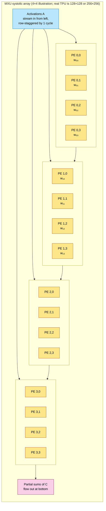
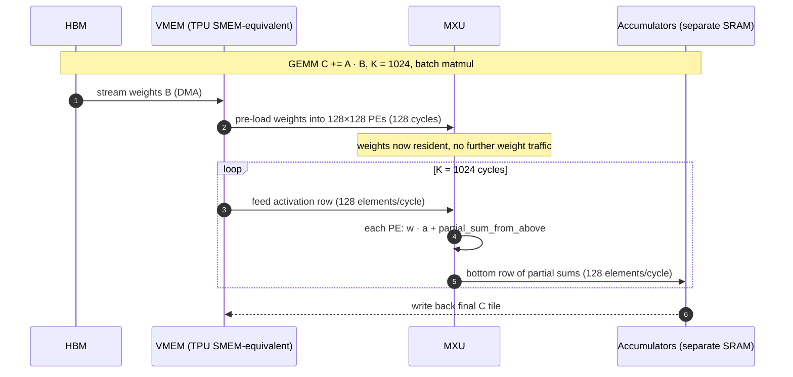
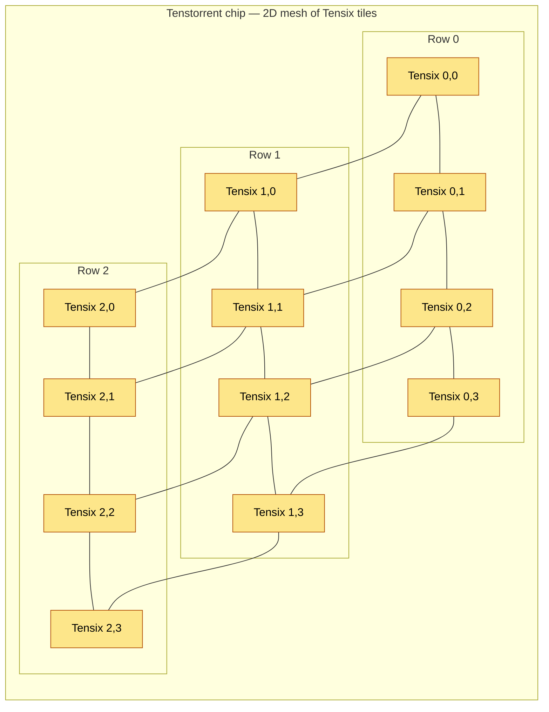
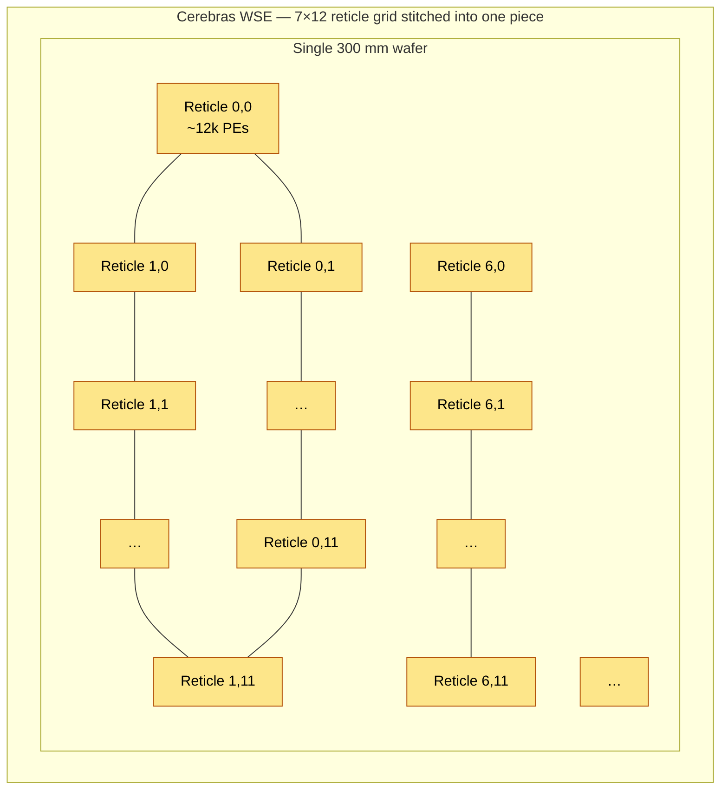
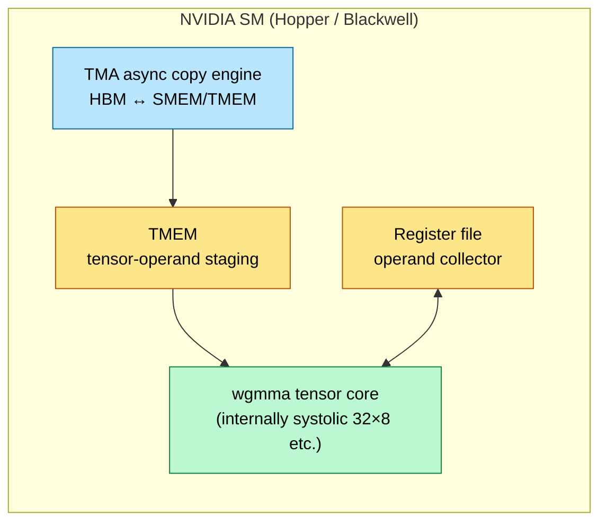
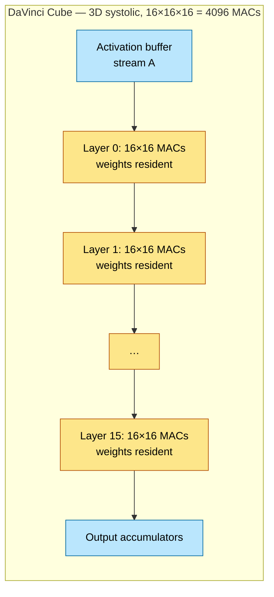
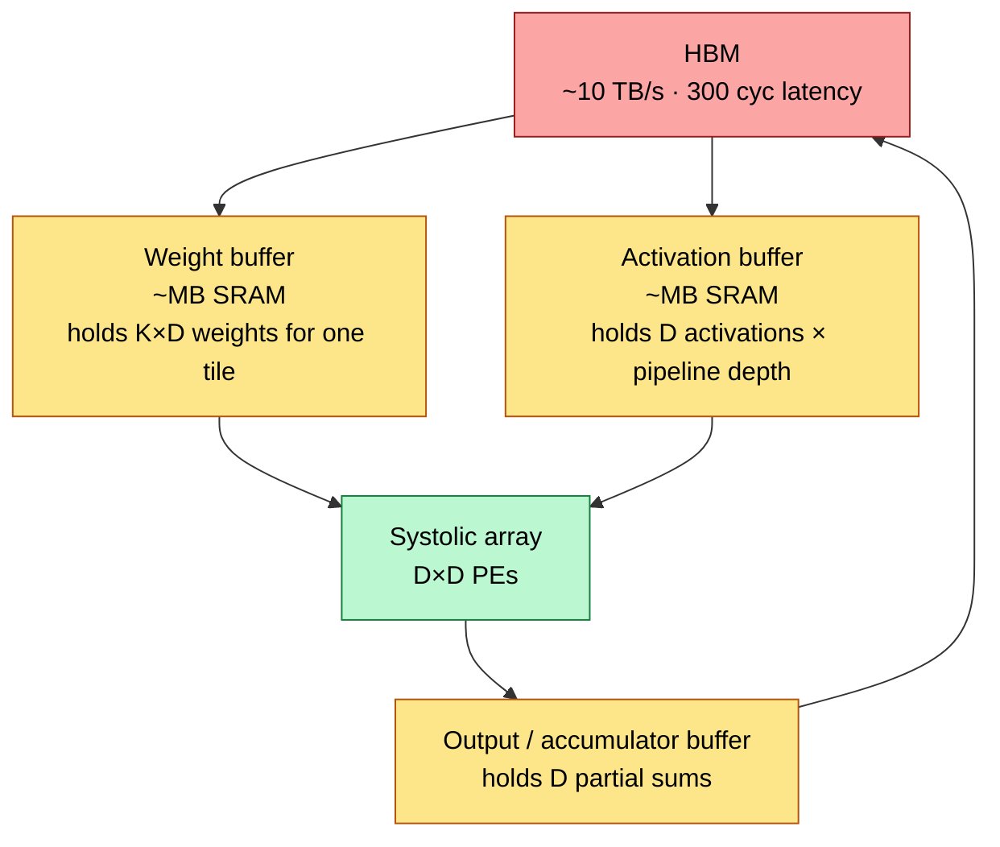
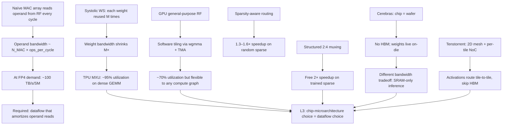

# Systolic Arrays & Dataflow — Spatial MAC Organization

> **Layer:** L2.
> **Prerequisites:** [On_Chip_Memory_Hardware](On_Chip_Memory_Hardware.md), [FP_Unit_Design](FP_Unit_Design.md).
> **Hands off to:** [Digital_Design_For_AI](Digital_Design_For_AI.md), [L3 Microarchitecture](../L3_Microarchitecture/Index.md) (specifically `Google_TPU.md`, `Specialty_Accelerators.md`, `GPU_Architecture.md`).

---

## 0. Why dataflow is half the architecture

L2 has so far given us two things: memory cells (with bandwidth ceilings) and FP units (with area costs). The remaining question is **how to arrange the FP units in space** so each operand fetched from memory is used as many times as possible. This is *dataflow*. Two architectures with identical memory bandwidth and identical FMA counts can differ by **5–10× in real-world performance** purely because of dataflow choice.

The TPU achieves >85% MXU utilization on dense GEMM at FP8 with HBM bandwidth that, naively interpreted, should support only ~30% utilization. The gap is dataflow: the systolic array reuses each weight $N$ times before it's evicted. The GPU, by contrast, runs warps with general-purpose registers and has to amortize through software tiling. This is a structural difference, not a software lever.

---

## 1. The reuse arithmetic

For a GEMM $C = A \cdot B$ where $A \in \mathbb{R}^{M \times K}$, $B \in \mathbb{R}^{K \times N}$:

- Total FMAs: $M \cdot N \cdot K$.
- Total bytes loaded (naïve): $M K + K N + M N$ (load $A$, $B$, write $C$).
- Arithmetic intensity: $\text{AI} = \dfrac{M N K}{M K + K N + M N}$.

Each element of $A$ participates in $N$ FMAs (once per column of $B$). Each element of $B$ participates in $M$ FMAs. Each element of $C$ accumulates $K$ FMAs.

The dataflow choice is which element type stays *resident* in the MAC array between cycles, vs. which streams through:

- **Weight-stationary (WS):** each weight (one $B_{kn}$) stays in a MAC for $M$ cycles, accumulating $A_{*,k} \cdot B_{kn}$.
- **Output-stationary (OS):** each output (one $C_{mn}$) stays in a MAC for $K$ cycles, accumulating across all the K-dim products.
- **Input-stationary (IS):** each input ($A_{mk}$) stays for $N$ cycles, broadcasting across all output columns.

Each gives different memory traffic and is right for different shapes.

```mermaid
flowchart TD
    subgraph WS["Weight-stationary (TPU MXU style)"]
        direction TB
        WS_W[Weights B<br/>resident in PEs<br/>1 load per K·N PEs]:::stay
        WS_A["Activations A<br/>stream in (M elements per col)"]:::flow
        WS_C["Outputs C<br/>stream out (M·N total)"]:::flow
        WS_W --> WS_A --> WS_C
    end
    subgraph OS["Output-stationary (Eyeriss, NVDLA)"]
        direction TB
        OS_C[Outputs C<br/>resident in PEs<br/>1 load per M·N PEs]:::stay
        OS_W[Weights B<br/>stream]:::flow
        OS_A[Activations A<br/>stream]:::flow
        OS_W --> OS_C
        OS_A --> OS_C
    end
    subgraph IS["Input-stationary (rare)"]
        direction TB
        IS_A[Activations A<br/>resident in PEs]:::stay
        IS_W[Weights B<br/>stream]:::flow
        IS_C[Outputs C<br/>stream]:::flow
        IS_W --> IS_A --> IS_C
    end
    classDef stay fill:#bbf7d0,stroke:#15803d,color:#000
    classDef flow fill:#bae6fd,stroke:#0369a1,color:#000
```

### 1.1 Reuse-factor numbers

For a 1024 × 1024 × 1024 GEMM with byte-level operands:

| Dataflow | Resident bytes per PE per tile | Reuse per resident byte | Memory traffic |
|---|---|---|---|
| Weight-stationary | $K = 1024$ | $M = 1024$ | $A$: $MK \cdot N/N_{PE,col}$ + $C$ writes |
| Output-stationary | $1$ | $K = 1024$ | $A + B$: $MK + KN$, $C$: 1 write |
| Input-stationary | $K = 1024$ | $N = 1024$ | symmetric to WS |

Output-stationary minimizes accumulator-write traffic but maximizes input traffic. Weight-stationary minimizes weight traffic — *the right choice when weights are larger than activations* (which is true for transformer FFN layers). Input-stationary is symmetric to WS and used in convolutional kernels where activation reuse dominates.

---

## 2. The systolic array

A systolic array is a 2D mesh of MAC processing elements (PEs) where data **moves with the clock** in regular spatiotemporal patterns. Each PE talks only to its 4 neighbors. No global broadcast, no random-access memory inside the array.

### 2.1 The canonical TPU MXU (weight-stationary)

Operation:

1. Pre-load: 16 weights $w_{ij}$ are loaded into the 16 PEs (one cycle per row × 4 rows = 4 cycles of pre-load).
2. Activations stream in from the left, one column per cycle, with each row staggered by one cycle (the "skew" in systolic arrays).
3. Each cycle, every PE: reads its input activation from the left neighbor, multiplies by its resident weight, adds to a partial sum flowing down from above, and forwards the activation to the right and the new partial sum down.
4. After $K + (\text{array dim}) - 1$ cycles, the bottom row emits the completed $C$ values.

For a $D \times D$ array doing a $D \times K$ GEMM:
- Throughput: $D^2$ FMAs per cycle.
- Latency: $K + 2(D-1)$ cycles (filling pipeline + draining).
- Operand bandwidth needed: $D$ activations/cycle in + $D$ partial sums/cycle out — only the array *edges* talk to memory.

### 2.2 The bandwidth advantage

A $128 \times 128$ MXU at 1 GHz has a peak of $128^2 = 16\,384$ FMAs/cycle = 16 384 GFLOPS = 16.4 TFLOPS BF16. The operand bandwidth requirement at the *array boundary* is $128$ activations + $128$ partial sums per cycle = ~512 B/cycle = 512 GB/s. A non-systolic equivalent (16 384 independent MAC units fed from a register file) would need $16\,384 \cdot 2 \cdot 2$ B = 65 KB/cycle = **65 TB/s**. The systolic structure cuts operand bandwidth by **~128×**.

### 2.3 The latency cost

The flip side: systolic arrays add 2(D−1) cycles of fill+drain latency. For a $128 \times 128$ array, that's 254 cycles. For long $K$ (~thousands), this is amortized; for short $K$ (e.g., a single attention head with $K=64$), the array runs nearly empty. **TPU MXUs are catastrophically inefficient on small matmuls**, which is why TPU compilers fuse and pad aggressively.

---

## 3. TPU MXU dataflow in detail

### 3.1 The pre-load + stream cycle

Notice the asymmetry:
- Pre-load: 128 cycles of weight loading per tile — paid **once** per tile.
- Streaming: $K = 1024$ cycles of activation feeding — paid each cycle, but operands come from VMEM (~30 TB/s) at modest bandwidth.

For a 1024 × 1024 × 1024 GEMM tiled into 8 × 8 = 64 tiles per output, weight pre-load is amortized across 64 reuses → ~2 cycles of weight overhead per useful tile. Effective utilization: ~98%.

### 3.2 The TPU vs GPU contrast

A GPU SM with 4096 BF16 FMA units running at 1.6 GHz → 13 TFLOPS BF16 — comparable raw throughput to a 128×128 MXU. But the GPU's MAC operands come from the register file (general-purpose, ~100 TB/s/SM). The GPU pays:

- High operand fetch energy (~10× the systolic version).
- Software-managed tiling via `wgmma` and TMEM.
- Lower utilization on perfectly dense ops (~70% vs 95% systolic).

But it gains:

- Programmability: any compute graph, not just GEMM.
- Efficiency on small / irregular shapes.
- General-purpose floating-point support (transcendentals, gather/scatter).

This is the structural reason TPUs win on inference at scale (uniform GEMM workloads), and GPUs win on training and small-batch inference (irregular workloads, debuggability, ecosystem).

---

## 4. Tenstorrent: 2D mesh of Tensix tiles

Tenstorrent rejects the rigid systolic array. A Wormhole or Blackhole chip is a 2D mesh of ~120 **Tensix cores**, each containing a small 32×32 systolic-ish MAC engine, scratchpad, and a NoC router.

Each Tensix has:
- ~1 MB scratchpad (SRAM).
- 5 RISC-V "baby cores" for control and irregular work.
- ~32×32 BF16/FP8 MAC engine.
- 4 directional NoC links (1.6 TB/s aggregate).

Dataflow philosophy: **chip-as-mesh**. A neural network is mapped as a *spatial graph* across tiles. Layer outputs flow tile-to-tile via the NoC; activations never round-trip through HBM if they don't have to. This is how Tenstorrent sustains useful throughput with HBM bandwidth ~½ of NVIDIA's at comparable die size.

---

## 5. Cerebras WSE: full-wafer mesh

Cerebras pushes the mesh to its logical extreme: an **entire 300mm wafer** as one chip — 2.6 trillion transistors, ~900,000 PEs. No reticle stitching, no inter-die signaling — just on-wafer routing.

Per-PE: ~50 KB SRAM, single FMA. Total wafer: ~40 GB on-die SRAM, ~125 PFLOPS BF16. No HBM at all (model weights live in on-wafer SRAM); HBM-class memory is in *external* MemoryX nodes connected via SwarmX fabric.

The cost: the wafer is the chip — yield is managed by *redundant rows* of PEs (à la disabled-SM binning at L0). Cerebras claims sub-1% defective PE rate at delivery.

Dataflow: trained neural networks are mapped to the spatial mesh; data streams through the wafer as a continuous pipeline. Especially good for sparse models, weight-streaming inference, and large-context language models.

---

## 6. NVIDIA hybrid: warp + TMA + wgmma

NVIDIA's GPU is *not* a pure systolic array but blends approaches:

- **Within an SM:** wgmma instructions execute on a tensor-core sub-array that is *internally* systolic for the duration of the instruction (MMA tile), but the array is small (32×8 or 16×16, not 128×128).
- **Operand fetch:** TMA (Tensor Memory Accelerator) does async DMA between HBM/L2 and SMEM/TMEM, decoupling memory latency from compute.
- **Cross-SM:** no spatial mesh; SMs communicate via L2 cache and global memory.

Dataflow result: each `wgmma` is itself a small weight-stationary operation; software tiling chains them across the K-dim to amortize weight loads. Because the systolic dimension is small (32×8 ≈ 256 MACs per `wgmma`), latency of fill/drain is low, but the per-`wgmma` operand-fetch demand is non-trivial — hence TMEM (L2 page §5).

This hybrid is the right answer when you need both GEMM efficiency (tensor cores) and general-purpose programmability (warp-style threads). It's the structural reason GPUs *beat* TPUs on training despite having lower theoretical GEMM efficiency.

---

## 7. Ascend (Huawei) Cube: weight-stationary, small grain

Huawei Ascend 910B/910C uses a **DaVinci Cube** — a 16×16×16 3D systolic array (256 MACs per layer × 16 layers = 4 096 MACs per Cube), each cube weight-stationary.

The 3D structure stacks systolic in K-dim: 16 layers each handle 16 K-dim elements simultaneously, then summed across layers. Effective: $16 \times 16$ tile in $M, N$ at $K = 16$ per cycle. Reuse: each weight is used $M \cdot 1$ times per cycle of K-streaming.

Tradeoff vs TPU MXU: smaller systolic dimension (16 vs 128) → less fill/drain overhead, better for short K. But also lower per-cube throughput; Ascend compensates with many cubes per die.

---

## 8. Sparsity-aware dataflow

Pure-dense systolic arrays cannot exploit sparsity — the array is rectangular and every PE is occupied. Two coping mechanisms:

### 8.1 Structured (2:4) sparsity in dense arrays

Covered in [FP_Unit_Design §7](FP_Unit_Design.md). Each PE doubles as a 2-of-4 picker; metadata-driven MUXes route the surviving operands. Fits inside a systolic array with ~8% area overhead. Doubles throughput on sparse-trained models.

### 8.2 Unstructured sparsity → dynamic mesh routing

For random sparsity (e.g., LLM activations after ReLU/GELU, ~50% zeros), dense systolic arrays waste cycles. **Sparse cores** (e.g., NVIDIA Sparsity Cores in research, Cerebras structured sparsity, Tenstorrent's NoC-based sparse routing) skip zero MACs by *not feeding* them. Throughput gain ≈ density⁻¹ in the limit, but routing overhead means real-world gains are 1.3–1.6× rather than 2× at 50% sparsity.

---

## 9. Memory-coupled dataflow: weight + activation buffers

Real systolic arrays are surrounded by buffers that decouple HBM latency from streaming cadence:

Buffers are sized for **double-buffering**: while tile $t$ is computing in the array, tile $t+1$'s weights are being prefetched from HBM. This hides ~300-cycle HBM latency behind the array's compute latency. Without double-buffering, the systolic array would stall every tile boundary.

For a 128×128 MXU at 1 GHz with K=512 per tile: tile compute time ≈ 512 + 254 = 766 ns. HBM latency is ~300 ns. Double-buffer covers it; quadruple-buffer covers HBM contention spikes. Buffer size: $2 \cdot D \cdot K \cdot \text{bytes}$ ≈ 256 KB for BF16 — well within the SMEM-equivalent budget.

---

## 10. Scoring matrix: which dataflow when

| Workload | Best dataflow | Why |
|---|---|---|
| Dense GEMM, large K (transformer FFN) | Weight-stationary | Maximize weight reuse |
| Dense GEMM, small K (per-head attention) | Output-stationary or hybrid | Avoid systolic fill/drain |
| Convolution (CNN) | Input-stationary or output-stationary | Activation reuse via sliding window |
| Random-sparse activation (post-ReLU) | Dynamic mesh routing | Skip zeros |
| Structured-sparse weight (2:4 trained) | WS systolic + mux | Free 2× on dense array |
| Long-context attention (FlashAttention) | Output-stationary on tile, WS within tile | Tile fits SMEM, weight reuse within tile |
| MoE routing | Hybrid: gather → dense GEMM per expert | Per-expert WS |
| Embedding lookup | Input-stationary or PIM | Activation reuse trivial |

---

## 11. End-to-end cause / effect

---

## 12. Numbers to memorize

| Quantity | Value | Why |
|---|---|---|
| GEMM arithmetic intensity (large K) | $\sim K/2$ | Reuse per byte loaded |
| TPU MXU dimension (v5/v6 era) | 128 × 128 or 256 × 256 | Per chip |
| TPU MXU peak BF16 | ~16–32 TFLOPS | Per MXU at 1 GHz |
| TPU MXU fill+drain cycles | 2(D−1) | 254 cycles for 128×128 |
| MXU bandwidth advantage vs RF-fed | ~D× | D = array dim |
| TPU dense-GEMM utilization | ~85–95% | When K is long |
| TPU short-K utilization | ~30–50% | Fill/drain dominates |
| Tenstorrent Tensix tile MAC dim | ~32 × 32 | Per tile |
| Tensix per Wormhole / Blackhole chip | ~120 | 2D mesh |
| Cerebras WSE PE count | ~900 000 | Full wafer |
| Cerebras WSE on-die SRAM | ~40 GB | Replaces HBM |
| GPU `wgmma` tile (Hopper / Blackwell) | 32×8 or 16×16 etc. | Small systolic |
| GPU dense-GEMM utilization | ~70% | Pure MMA |
| Ascend DaVinci Cube | 16×16×16 = 4096 MACs | 3D systolic |
| WS reuse factor | $M$ | per resident weight |
| OS reuse factor | $K$ | per resident output |
| 2:4 structured sparsity gain | 2× | Dense-style mux + clock gate |
| Random-sparse gain at 50% density | 1.3–1.6× | Routing overhead |
| Double-buffer SRAM cost | $2 \cdot D \cdot K \cdot B$ | bytes per tile |

---

## 13. Worked interview problems

**Q1.** *A 128×128 systolic array does $C = A \cdot B$ where $A \in \mathbb{R}^{128 \times 1024}$, $B \in \mathbb{R}^{1024 \times 128}$. How many cycles total? Effective utilization?*

Pre-load weights: 128 cycles. Stream activations: K = 1024 cycles. Drain output: 127 cycles. Total: ≈ 1 280 cycles. Useful work: $128 \cdot 128 \cdot 1024 = 16.78$ M FMAs across $128^2 = 16\,384$ MACs. Each MAC averages ~$16.78\text{ M}/(16\,384 \cdot 1\,280) \approx 80\%$ utilization. The 20% loss is the fill+drain — amortizable by tiling.

**Q2.** *Why does a TPU MXU outperform a GPU SM on dense GEMM despite having fewer total MACs?*

Three reasons: (a) Weight-stationary dataflow reuses each weight 128 times before eviction → ~128× lower weight bandwidth. (b) Operands flow PE-to-PE through register-style pipelined links — no SMEM/RF round-trips. (c) The systolic array is uniformly utilized (no operand-collector arbitration losses). The GPU pays for general-purpose flexibility with operand-fetch bandwidth.

**Q3.** *Why is output-stationary preferred for FlashAttention's per-tile inner loop?*

Within an FA tile, $K = $ tile-dim × head-dim, which is small (~64–128). Weight-stationary's fill/drain cost is large relative to K — wastes cycles. Output-stationary keeps the partial sums of $S = QK^T$ in registers; both Q and K stream through. K dominates so this minimizes shifts and updates — the OS choice gives ~2× higher utilization than WS at this granularity.

**Q4.** *Cerebras has no HBM. How does it serve a 70 B-parameter LLM at 8-bit?*

70 GB at FP8 doesn't fit on the wafer's 40 GB on-die SRAM. Cerebras streams weights from external MemoryX nodes via SwarmX (~1.2 TB/s aggregate). The wafer holds activations + KV cache + a sliding window of weights. For inference, this works because each layer's weights are touched once per token — streaming throughput suffices. For training, MemoryX bandwidth limits batch size; Cerebras typically uses batch parallelism across multiple wafers.

**Q5.** *Estimate the operand-bandwidth saving of weight-stationary 128×128 systolic vs equivalent throughput general-purpose MAC array.*

Systolic at 1 GHz × 16 384 FMAs/cycle = 16 K FMAs/ns. Operand bandwidth at array boundary: 128 in + 128 out = 256 B/cycle × 1 GHz = 256 GB/s. General-purpose: 16 K FMAs × 2 inputs × 2 B = 64 KB/cycle = 64 TB/s. Ratio: 256× lower for systolic. This is the structural energy advantage of TPUs over GPUs on pure GEMM workloads.

---

## 14. References

**Foundational**
- H.T. Kung, *Why Systolic Architectures?*, IEEE Computer 1982. The seminal paper.
- Jouppi et al., *In-Datacenter Performance Analysis of a Tensor Processing Unit*, ISCA 2017. The TPU v1 paper.
- Chen et al., *Eyeriss: An Energy-Efficient Reconfigurable Accelerator*, ISSCC 2016. Output-stationary CNN architecture.

**Recent / vendor**
- Sahin et al., *Tenstorrent: A Spatial Architecture for AI Compute*, Hot Chips 2024.
- Lie, *The Cerebras CS-3 Wafer-Scale Engine*, Hot Chips 2024.
- Yan et al., *Hardware Architecture of Huawei Ascend 910B*, Hot Chips 2023.

**Cross-references**
- [On_Chip_Memory_Hardware](On_Chip_Memory_Hardware.md) — buffer sizing.
- [FP_Unit_Design](FP_Unit_Design.md) — the MAC at each PE.
- Future: [L3 Google_TPU.md](../L3_Microarchitecture/Google_TPU.md), [L3 Specialty_Accelerators.md](../L3_Microarchitecture/Specialty_Accelerators.md) — full microarch survey.

---

**Up the stack:** [Digital_Design_For_AI](Digital_Design_For_AI.md) → [L3 Microarchitecture](../L3_Microarchitecture/Index.md).
**Down the stack:** [On_Chip_Memory_Hardware](On_Chip_Memory_Hardware.md), [FP_Unit_Design](FP_Unit_Design.md).
