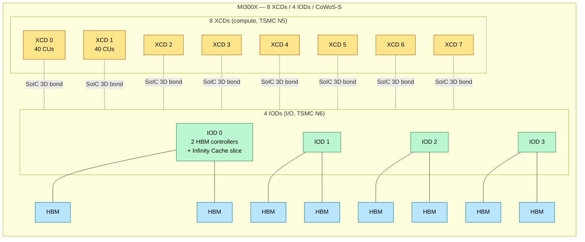
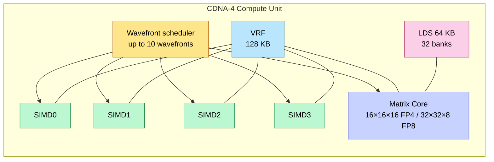
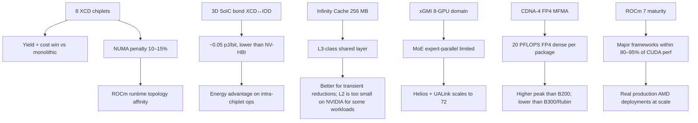

# AMD Instinct — CDNA 3 / CDNA 4 / Helios

> **Layer:** L3.
> **Prerequisites:** [GPU_Architecture](GPU_Architecture.md), [Memory_Hierarchy_and_Roofline](Memory_Hierarchy_and_Roofline.md), [Blackwell_Architecture](Blackwell_Architecture.md).
> **Hands off to:** [L4 Networking & Interconnects](../L4_Systems_and_Interconnects/Index.md), [L5 CUDA_Programming](../L5_Kernels_and_Programming/CUDA_Programming.md) (HIP equivalences).

---

## 0. AMD's structural bet

AMD's bet is **chiplet-first**: smaller compute dies (XCDs) on a leading-edge node, glued to a larger I/O die (IOD) on a mature node. The MI300X uses 8 XCDs on N5 + 4 IODs on N6. The bet is that yield economics + memory-controller density beat NVIDIA's monolithic-dual-die approach.

The catch: chiplet boundaries introduce NUMA. Software must be topology-aware. ROCm's runtime tries to hide this; on MoE workloads it sometimes shows.

This page covers CDNA 3 (MI300X), CDNA 4 (MI355X), and the rack-scale Helios architecture (MI400-class).

---

## 1. Generation map

| Family | Part | Year | Process | Memory | TDP | Highlights |
|---|---|---|---|---|---|---|
| CDNA 3 | MI300X | 2023 | TSMC N5 (XCD) + N6 (IOD) | 192 GB HBM3 | 750 W | First widely-deployed AMD AI GPU; 8 XCDs + 4 IODs |
| CDNA 3 | MI300A | 2023 | N5 + N6 | 128 GB HBM3 | 760 W | APU: GPU + Zen 4 cores in one package |
| CDNA 3 | MI325X | 2024 | N5 + N6 | 256 GB HBM3e | 1 000 W | Memory-capacity refresh |
| CDNA 4 | MI350X | 2025 | TSMC N3 (XCD) + N6 base | 288 GB HBM3e | 750 W (air) | Matrix-core overhaul; FP4/FP6 support |
| CDNA 4 | MI355X | 2025 | N3 + N6 | 288 GB HBM3e | 1 000 W (liquid) | Liquid-cooled, full FP4/FP6 throughput |
| CDNA 5 | MI455X (Altair, flagship) | H2 2026 | TSMC N2 ×12 XCD + N3 ×3 base | 432 GB HBM4, 19.6 TB/s | ~1 200 W | 320 B transistors; 40 PF FP4 / 20 PF FP8 dense; Helios, native UALink |
| CDNA 5 | MI450 (Altair, volume) | H2 2026 | TSMC N2 | 432 GB HBM4, 19.6 TB/s | lower envelope | Volume hyperscale SKU; same memory subsystem as MI455X |
| CDNA 5 | MI430X (Altair, HPC) | H2 2026 | TSMC N2 | 432 GB HBM4, 19.6 TB/s | ~1 100 W | FP64-optimized for HPC / sovereign AI |
| CDNA 4 | MI350P | 2025 | PCIe card | 144 GB HBM3E | 350 W (air) | PCIe accelerator; ~40% faster FP16/FP8 than H200 NVL |

---

## 2. The chiplet architecture



Key design choices:

- **8 XCDs on TSMC N5**: each ~115 mm², well below reticle limit. Yield ~95% per XCD.
- **4 IODs on TSMC N6**: hosts memory controllers, PCIe/CXL PHYs, Infinity Cache (256 MB). N6 is mature; high yield, lower cost per mm².
- **3D SoIC stacking** (Cu-Cu hybrid bonding): XCDs sit *on top of* IODs, not beside them. Energy/bit ~0.05 pJ — much better than NV-HBI's 0.2.
- **Coherent across all 8 XCDs**: Infinity Cache acts as the L3-equivalent shared layer.

### 2.1 NUMA topology

A memory access from XCD 0 to HBM controlled by IOD 3:

- XCD 0 → local IOD (XCD 0 sits on IOD 0): ~10 ns.
- IOD 0 → IOD 3 via Infinity Fabric: ~30 ns (depending on path).
- IOD 3 → HBM: ~250 ns.
- **Total: ~290 ns** vs ~260 ns for fully local access.

11% worst-case penalty. Workload must be topology-aware (or accept the loss). ROCm's tensor-parallel runtime does affinity-based block scheduling; for naïve PyTorch code, the difference shows up as ~10–15% slowdown vs NVIDIA on memory-intensive ops.

---

## 3. CDNA Compute Unit (CU)

Per XCD: 40 CUs. Per CU:

- **4 SIMD32 vector ALUs** (wave64 native; wave32 supported in CDNA-3+).
- **1 Matrix Core** (MFMA — Matrix Fused Multiply-Add).
- **64 KB LDS** (Local Data Share — equivalent to NVIDIA SMEM).
- **128 KB Vector Register File** + scalar registers.
- **L1 cache + scheduler + AGUs.**

### 3.1 The Matrix Core (MFMA)

AMD's tensor-core equivalent. CDNA 3 supports FP16/BF16/INT8/FP8. CDNA 4 adds FP6/FP4/MXFP4.



### 3.2 MFMA throughput

CDNA-4 MFMA per CU: ~1 TFLOPS BF16, ~2 TFLOPS FP8, ~4 TFLOPS FP4.

Per package (MI355X, 8 XCDs × 40 CUs = 320 CUs):

- BF16: ~5 050 TFLOPS (MI355X spec)
- FP8: ~10 100 TFLOPS
- FP4: ~20 100 TFLOPS

These are **higher** than B200's 9 000 FP4 TFLOPS. AMD wins on raw FLOPS per package at FP4. NVIDIA wins on:

- Software stack maturity (CUDA vs ROCm)
- Coherent NVLink at NVL72 scale
- TMEM-style operand-fetch optimization

### 3.3 VGPR forwarding (CDNA 4)

CDNA 4 introduced VGPR-to-MFMA forwarding: vector register file outputs feed directly into MFMA inputs without writing back to RF. Saves ~1 cycle per MFMA issue. Important for short-K matmuls where the win is large (~15% throughput).

---

## 4. Memory hierarchy

| Tier | Capacity | Bandwidth | Latency |
|---|---|---|---|
| VRF (per CU) | 128 KB | ~50 TB/s | 1 cycle |
| LDS (per CU) | 64 KB | ~10 TB/s | ~10 cycles |
| L1 cache (per CU) | 16 KB | ~1 TB/s | ~30 cycles |
| L2 cache (per XCD) | 4 MB | ~5 TB/s aggregate | ~50 cycles |
| Infinity Cache (chip-wide) | 256 MB | ~10 TB/s | ~100 cycles |
| HBM | 192–288 GB | 5.3–8 TB/s | ~400 cycles |

Note: AMD MI300X has *more* on-die SRAM (Infinity Cache) than B200's L2 (256 MB vs 50 MB). Effective for L2-resident reductions but mostly irrelevant at LLM scale (working set ≫ Infinity Cache).

---

## 5. xGMI vs UALink — the scale-up fabric

### 5.1 xGMI on MI300X / MI355X

- 7 xGMI links per GPU.
- ~64 GB/s/link unidirectional → ~448 GB/s/GPU unidirectional.
- ~128 GB/s/link bidirectional aggregate.
- **8-GPU coherent domain** (one server) — MUCH smaller than NVL72.

This is AMD's structural disadvantage for MoE training: 8-GPU all-to-all bandwidth caps EP capacity. NVIDIA's NVL72 supports 9× more GPUs in the coherent domain.

### 5.2 UALink (Helios / MI400)

To close the gap, AMD + Broadcom + Cisco + others formed the UALink consortium. UALink-1.0 (Helios):

- ~200 GB/s/link bidirectional.
- 72-GPU coherent domain (matching NVL72).
- Open standard (no NVIDIA royalty).
- Transparent switch fabric — competitor to NVLink + NVSwitch.

Helios racks (MI400-class "Altair" series) target 2026 deployment. The bet: open-standard rack fabrics undercut NVLink lock-in.

**Confirmed Helios rack configurations:** 64, 72, or 128 GPUs per rack. The UALoE72 configuration (72-GPU UALink domain) is confirmed, matching NVL72's scale-up domain.

**Supply chain:** ZT Systems ($4.9B acquisition by AMD) provides rack-level engineering and integration. Sanmina serves as NPI (New Product Introduction) partner for manufacturing. Engineering samples are on track for H2 2026.

---

## 6. ROCm software stack

AMD's CUDA equivalent. Layers:

| Component | NVIDIA equivalent |
|---|---|
| HIP | CUDA Runtime API |
| ROCm Compiler (clang/llvm) | nvcc |
| rocBLAS | cuBLAS |
| MIOpen | cuDNN |
| RCCL | NCCL |
| MIGraphX | TensorRT |
| ROCm-Triton | Triton (forked) |

**HIP** (Heterogeneous Interface for Portability) lets you write code in a CUDA-like language and target both AMD and NVIDIA. Realistically, performance-tuned kernels need per-vendor specialization — `__shfl_sync` semantics differ, MFMA vs wgmma have different tile shapes, etc.

ROCm has caught up dramatically since 2023 (when it was barely usable for production). As of ROCm 7 (2025), most major frameworks (PyTorch, JAX, vLLM, SGLang, TRT-LLM port "ALG-LLM") run on AMD with ~80–95% of equivalent performance.

---

## 7. ROCm Kernel Optimization

This section covers the low-level hardware primitives that kernel authors use on AMD GPUs, and how they compare to NVIDIA equivalents.

### MFMA (Matrix Fused Multiply-Add) Instructions

AMD's equivalent to NVIDIA's MMA/wgmma instructions. MFMA issues a matrix multiply-accumulate operation where the hardware multiplies an M×K matrix by a K×N matrix and accumulates into an M×N result.

- **MFMA instruction shapes**: 16×16×16, 32×32×8, 16×32×16, etc. (M×N×K). The tile shape determines how many VGPRs are consumed for operands and results.
- **CDNA-4 MFMA data types**: BF16, FP16, FP8 (both E4M3 and E5M2), INT8. CDNA-4 also adds FP6 and FP4 support.
- **FP8 MFMA throughput**: 2× the throughput of FP16 MFMA, similar to NVIDIA's FP8 tensor-core behavior. The doubling comes from packing two FP8 values into the same register width as one FP16 value.

Per-CU MFMA throughput (CDNA-4): ~1 TFLOPS BF16, ~2 TFLOPS FP8, ~4 TFLOPS FP4.

### LDS (Local Data Share)

AMD's equivalent to NVIDIA's shared memory (SMEM):

- **Capacity**: 64 KB per CU on CDNA-3, configurable by the kernel.
- **Bank structure**: 32 banks of 4-byte words. Same bank-conflict behavior as NVIDIA SMEM — simultaneous accesses to different addresses in the same bank serialize. The conflict-avoidance strategies (padding, swizzling) are identical in principle.
- **Copy mechanisms**: both synchronous and asynchronous copy from global memory to LDS are supported. The async copy uses a DMA engine that can transfer data without occupying SIMD lanes.

### Key Differences from CUDA

Understanding these differences is essential when porting high-performance kernels from NVIDIA to AMD:

| Feature | AMD (CDNA-3/4) | NVIDIA (Hopper/Blackwell) |
|---|---|---|
| Wavefront / warp size | 64 on CDNA-3; CDNA-4 supports both wave32 and wave64 | 32 |
| Tensor memory accessor (TMA) | No TMA equivalent; AMD uses async_copy intrinsics but not descriptor-based TMA | TMA hardware unit for async global→shared transfers with descriptor-based addressing |
| Threadblock clusters | No threadblock clusters; cross-CU sharing goes through L2 cache | Threadblock clusters enable cooperative SM groups with distributed shared memory |
| VGPR count | 256 per thread on CDNA-3, 512 on CDNA-4 | 255 per thread on Hopper, 256 on Blackwell |
| Register file | Vector Register File (VRF) per CU: 128 KB | Register file per SM: 256 KB (Hopper), 256 KB (Blackwell) |

The wavefront-size difference (64 vs 32) has subtler implications than it appears: a wave64 executing an MFMA instruction covers twice the output tile per scheduling slot, which can improve throughput on compute-bound kernels but worsens occupancy on register-heavy kernels.

### Kernel Authoring

- **HIP** (Heterogeneous Interface for Portability) is the primary language for AMD kernel development, providing a CUDA-like API. Most CUDA kernel code can be translated to HIP with mechanical substitutions (`__shfl_sync` → `__shfl`, `__syncthreads()` → `__syncthreads()`, `wmma` → `MFMA` intrinsics).
- **rocBLAS / MIOpen**: AMD's equivalents to cuBLAS / cuDNN. Provide optimized BLAS and DNN operations. rocBLAS internally dispatches to architecture-specific MFMA microkernels.
- **Triton-ROCm**: AMD's fork of OpenAI's Triton compiler. Generates HIP/AMDGPU code from high-level tile-based Python DSL. The primary high-level option for kernel authors who want performance without writing inline assembly.

### Performance Tip

MFMA throughput is highest when LDS is used for input staging. The same tiling pattern used in CUDA tensor-core kernels (global → SMEM → registers → tensor core) applies directly: load a tile of A and B into LDS, then issue MFMA instructions consuming from LDS-resident data. This hides global-memory latency and keeps the Matrix Core fed at its peak rate. On CDNA-4, kernels that skip LDS and load directly from global memory into VGPRs before MFMA typically achieve only 60–70% of peak throughput due to bandwidth bottlenecks on the global-memory path.

---

## 8. Helios rack architecture

```mermaid
flowchart TB
    subgraph HELIOS["Helios rack — MI430X / MI455X class (Altair)"]
        direction TB
        subgraph GPUS[64/72/128 × MI455X (configurable)]
            G0[GPU 0]:::g
            G1[GPU 1]:::g
            GD[…]:::g
            G71[GPU N-1]:::g
        end
        subgraph SW[UALink switches]
            S0[UALink switch 0]:::sw
            S1[UALink switch 1]:::sw
            SD[…]:::sw
        end
        EPYC[EPYC CPUs<br/>via xGMI-CPU coherent]:::cpu
        HBM[432 GB HBM4 per GPU]:::hbm
        GPUS <--> SW
        GPUS --> HBM
        EPYC <--> GPUS
    end
    classDef g fill:#fde68a,stroke:#b45309,color:#000
    classDef sw fill:#bae6fd,stroke:#0369a1,color:#000
    classDef cpu fill:#bbf7d0,stroke:#15803d,color:#000
    classDef hbm fill:#fbcfe8,stroke:#9d174d,color:#000
```

Confirmed Helios rack configurations: **64, 72, or 128 GPUs** per rack. The UALoE72 configuration (72 GPUs) directly matches NVIDIA's NVL72 domain size. Official CES 2026 numbers for the 72× MI455X config: **31 TB aggregate HBM4, 1.4 PB/s aggregate memory bandwidth, 2.9 EFLOPS FP4 dense (inference) / 1.4 EFLOPS FP8 (training)** — directly comparable to GB300 NVL72 and positioned against Vera Rubin VR200 NVL144 (which claims 3.3× GB300 FP4). Host CPUs: EPYC **"Venice"** (Zen 6), >4 600 cores per rack.

**Supply chain and manufacturing:** ZT Systems ($4.9B AMD acquisition) handles rack-level engineering and system integration. Sanmina serves as NPI manufacturing partner. AMD reconfirmed (Feb 2026) Helios racks and the full MI400 lineup are **on track for H2 2026**; MI500 series committed for 2027.

---

## 9. End-to-end cause / effect



---

## 10. Numbers to memorize

| Quantity | Value | Why |
|---|---|---|
| MI300X XCDs | 8 (each 40 CUs = 320 total) | Chiplet count |
| MI300X IODs | 4 (memory controllers) | I/O die count |
| MI300X HBM | 192 GB HBM3 | spec |
| MI300X BW | 5.3 TB/s | HBM3 peak |
| MI355X CUs | 320 (8 XCDs × 40) | Same as MI300X |
| MI355X HBM | 288 GB HBM3e | spec |
| MI355X BW | 8 TB/s | HBM3e peak |
| MI355X BF16 | 5 050 TFLOPS | spec |
| MI355X FP8 | 10 100 TFLOPS | spec |
| MI355X FP4 | 20 100 TFLOPS | spec |
| MI355X TDP | 1 000 W (liquid) | spec |
| MI455X HBM | 432 GB HBM4 | confirmed CES 2026 |
| MI455X BW | 19.6 TB/s | confirmed CES 2026 |
| MI455X FP4 / FP8 | 40 / 20 PFLOPS dense | confirmed CES 2026 |
| MI455X transistors | 320 B (12× N2 XCD + 3× N3 base) | confirmed CES 2026 |
| Helios 72-GPU rack | 31 TB HBM4, 1.4 PB/s, 2.9 EF FP4 / 1.4 EF FP8 | official |
| Wavefront size | 64 (CDNA), 32 (RDNA + CDNA-3+) | SIMD lanes |
| Infinity Cache | 256 MB chip-wide | L3-equivalent |
| xGMI BW per GPU | ~448 GB/s | scale-up |
| xGMI domain | 8 GPUs | one server |
| UALink BW per GPU | ~200 GB/s/link | Helios |
| UALink domain | 72 GPUs | matches NVL72 |
| Cross-XCD NUMA penalty | ~10–15% on memory-bound ops | Topology-aware scheduling |

---

## 11. Worked interview problems

**Q1.** *Why does AMD's chiplet approach work despite the NUMA penalty?*

Yield economics. An 800 mm² monolithic die at TSMC N5 with $D_0 = 0.1 / cm²$ yields ~50% (negative-binomial). 8 × 100 mm² chiplets at the same defect density yield ~95% per chiplet → ~67% combined good packages (any chiplet bad → reject). But wafer cost amortization across many small dies plus binning gives ~30% lower per-package cost than monolithic. Combined with 3D-SoIC bonding eliminating most of the inter-chiplet latency, NUMA cost is small enough to be worth the silicon savings.

**Q2.** *MI355X has higher peak FP4 (20 PFLOPS) than B200 (9 PFLOPS). Why isn't it dominating in production?*

Three reasons: (a) **Software** — ROCm has caught up but lags CUDA in obscure-kernel optimization; many production fp4 kernels aren't yet co-tuned for AMD. (b) **Scale-up** — xGMI tops out at 8 GPUs vs NVL72's 72; MoE / large TP workloads need the wider domain. (c) **Ecosystem** — vLLM, SGLang, TensorRT-LLM all ship CUDA-first; AMD ports come with delay. Helios/UALink+ROCm 7 closes the scale-up and software gaps; expect AMD's market share to rise through 2026–2027.

**Q3.** *Estimate cross-chiplet bandwidth available on MI300X for an 8-way tensor parallel within one package.*

Each XCD has Infinity Fabric to the IOD layer. Aggregate intra-package BW (XCD↔IOD): ~10 TB/s (matches Infinity Cache BW). Spread across 8 XCDs in TP: ~1.25 TB/s/XCD bidirectional. For TP all-reduce of activations (~8 GB activation matrix), reduce time ~6.4 ms — comparable to NVL72 NVLink for the same operation but without NVSwitch hop overhead.

**Q4.** *Why does AMD prefer 64-thread wavefronts when NVIDIA chose 32?*

Historical: AMD's GCN ISA used 64-lane SIMD; CDNA inherited it. Pros of wave64: amortizes scheduler overhead (one issue per cycle drives twice the threads), better for graphics-style large pixel groups. Cons: divergence cost is twice as bad (a 50/50 if-else stalls 32 lanes instead of 16); harder to occupy fully on small kernels. CDNA-3 added wave32 support to address this; modern AMD code paths choose width per kernel.

**Q5.** *Compare ROCm RCCL with NCCL for AllReduce performance.*

Both implement ring + tree algorithms. RCCL's bandwidth in xGMI domain (8 GPUs, MI300X) reaches ~85% of peak (~380 GB/s out of 448). NCCL on NVL8 (H100) reaches ~95% (~850 GB/s out of 900). NVIDIA's edge: lower-overhead algorithm-selector that switches ring/tree/recursive halving by message size dynamically. RCCL ships with similar logic but less battle-tested. At rack scale (NVL72 vs Helios), the gap narrows because both fabrics are limited by the same physics.

---

## 12. References

- AMD Instinct MI300X / MI350X / MI355X Architecture Briefs.
- ROCm Documentation — ROCm 7 release notes.
- *Hot Chips 2024 / 2025*: AMD MI355X disclosure.
- UALink Consortium 1.0 specification.
- *AMD CDNA-3 Architecture White Paper*.

---

**Up the stack:** [L4 Networking & Interconnects](../L4_Systems_and_Interconnects/Index.md), [L7 Distributed Training](../L7_Training_Stack/Index.md).
**Down the stack:** [GPU_Architecture](GPU_Architecture.md), [Blackwell_Architecture](Blackwell_Architecture.md).
