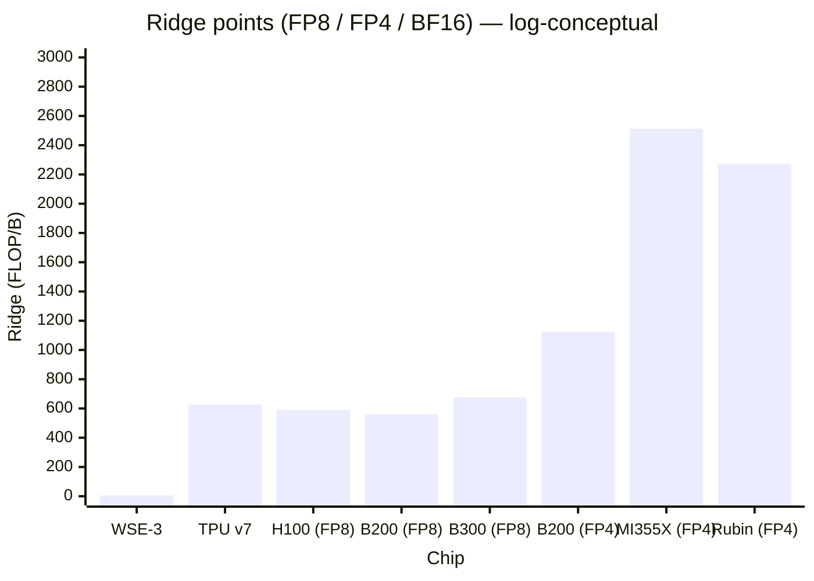
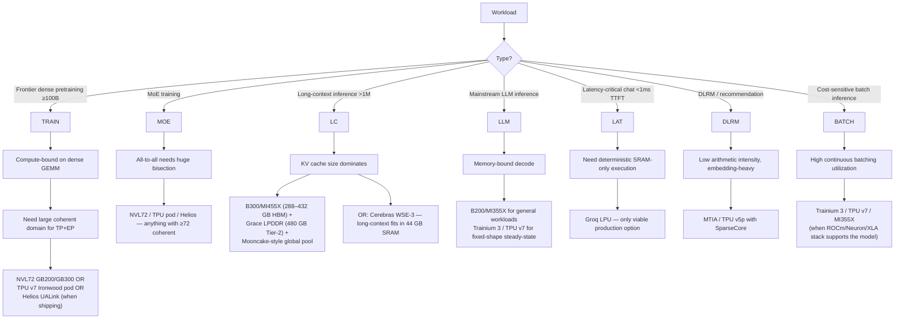
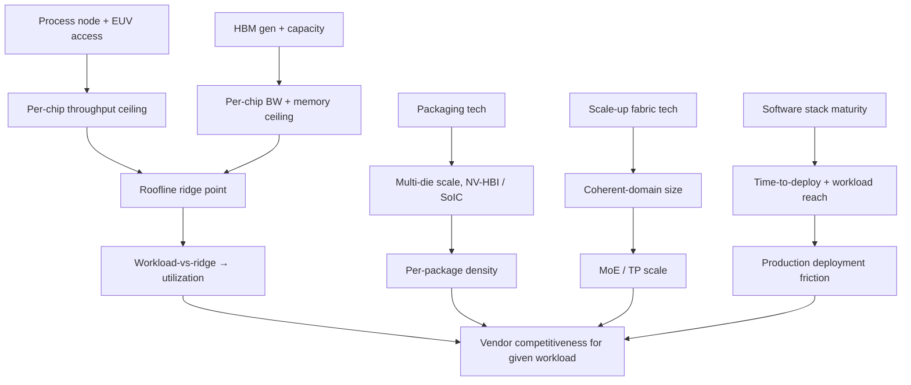

# Accelerator Landscape 2026 — Comparative Survey

> **Layer:** L3 (closing summary).
> **Prerequisites:** every other L3 page (this is the synthesis).
> **Hands off to:** L4 (networking), L8 (inference engines), L7 (training), and the production-architecture decisions throughout.

---

## 0. The map of the territory

Eleven distinct families ship AI silicon at scale in 2026. Each occupies a niche defined by execution model, scale-up domain, and software ecosystem. This page is the comparative cross-section that lets you pick the right chip for a workload — or understand why a given workload is going to a given chip.

---

## 1. The 2026 production lineup

| Vendor | Part | Microarch | Process | HBM (GB) | Mem BW (TB/s) | FP8 dense (PFLOPS) | FP4 dense (PFLOPS) | Scale-up domain | Software | TDP (W) |
|---|---|---|---|---|---|---|---|---|---|---|
| NVIDIA | H100 | Hopper | TSMC 4N | 80 | 3.35 | 1.98 | – | NVLink-4 (8) | CUDA | 700 |
| NVIDIA | H200 | Hopper | TSMC 4N | 141 | 4.8 | 1.98 | – | NVLink-4 (8) | CUDA | 700 |
| NVIDIA | B200 | Blackwell | TSMC 4NP dual-die | 192 | 8.0 | 4.5 | 9.0 | NVL72 (72) | CUDA + TE2 | 1 000 |
| NVIDIA | B300 | Blackwell Ultra | TSMC 4NP dual-die | 288 | 8.0 | 5.4 | 10.8 | NVL72 (72) | CUDA + TE2 | 1 200 |
| NVIDIA | R100 | Rubin | TSMC 3NP dual-die | 288 (HBM4) | 22.0 | ~25 | ~50 | NVL576 (576) | CUDA + TE3 | ~1 500 |
| AMD | MI300X | CDNA 3 | N5 + N6 | 192 | 5.3 | 2.6 | – | xGMI (8) | ROCm 6 | 750 |
| AMD | MI355X | CDNA 4 | N3 + N6 | 288 | 8.0 | 10.1 | 20.1 | xGMI (8) | ROCm 7 | 1 000 |
| AMD | MI455X | CDNA-Next | TSMC N2 | 432 (HBM4) | 19.6 | ~20 | ~40 | UALink (72) | ROCm 7+ | 1 200 |
| Google | TPU v5p | TPU v5p | – | 95 | 2.7 | – (BF16: 0.46) | – | ICI (8 960) + OCS | XLA / JAX | ~600 |
| Google | TPU v6e | Trillium | – | 32 | 1.6 | ~1.8 INT8 | – | ICI (256) | XLA / JAX | ~400 |
| Google | TPU v7 | Ironwood | – | 192 | 7.37 | 4.6 | – | ICI (9 216) + OCS | XLA / JAX / Pallas | ~900 |
| AWS | Trainium 2 | NeuronCore-v3 | TSMC 5nm | 96 | 2.9 | 1.3 | – | NeuronLink (16) | Neuron + NKI | ~700 |
| AWS | Trainium 3 | NeuronCore-v4 | TSMC 3nm | 144 | 4.9 | 2.52 | (MXFP4) | NeuronLink (16) | Neuron + NKI | ~900 |
| Meta | MTIA v2 | Artemis mesh | TSMC 5nm | 128 LPDDR5 | 0.2 | inference-tier | – | PCIe / Meta-internal | Triton-MTIA | 90 |
| Meta | MTIA v3 | Iris | TSMC 3nm + HBM | TBD | TBD | TBD | – | TBD | Triton-MTIA | TBD |
| Cerebras | WSE-3 | wafer mesh | TSMC 5nm wafer | 0.044 (SRAM) | 21 000 (SRAM) | – (FP16: 125) | – | SwarmX (192 nodes) | Cerebras SDK | 23 000 (system) |
| Groq | LPU | TSP | TSMC 14nm | 0.23 (SRAM) | (huge SRAM BW) | (~0.75 INT8) | – | GroqLink (600+) | Groq compiler | ~300 |
| Tenstorrent | Blackhole | NoC mesh + RISC-V | TSMC 5nm | ~30 GB HBM3 | ~1.6 | ~1.0 | – | Ethernet NoC | TT-NN + Triton | ~300 |
| Huawei | Ascend 910C | DaVinci 3.0 | SMIC 7nm dual-die | 128 HBM3 | 3.2 | (INT8 emul.) | – | HCCS / CM-384 (384) | CANN + MindIE | ~600 |

Performance numbers are dense steady-state thermal-budget throughput. Sparse (2:4) effectively doubles for vendors that support it (NVIDIA, AMD CDNA-4).

---

## 2. Roofline ridge points (the universal scoring metric)

Recall (from [Memory_Hierarchy_and_Roofline](Memory_Hierarchy_and_Roofline.md)): **ridge point = π/β**. Below ridge → memory-bound, above → compute-bound.

The lower the bar, the more workloads are compute-bound on that chip. Cerebras inverts the regime entirely; FP4 generations push the ridge so high that essentially everything becomes memory-bound.

---

## 3. Scale-up fabric comparison

| Vendor | Fabric | Per-chip BW | Coherent domain | Topology | Switch tech |
|---|---|---|---|---|---|
| NVIDIA | NVLink 5 | 1.8 TB/s unidirectional | NVL72 (72) → NVL576 (576) | Folded Clos | Electrical NVSwitch |
| NVIDIA | NVLink 6 (Rubin) | 3.6 TB/s | NVL576 / 576 | Optical-augmented Clos | Electrical + optical |
| AMD | xGMI | 0.45 TB/s (MI300X) | 8 | Direct mesh | none (direct) |
| AMD | UALink (Helios) | ~1 TB/s | 72 | Switch-based | UALink switch |
| Google | ICI | ~50–100 GB/s/link | 9 216 (Ironwood pod) | 3D torus + OCS | Electrical (intra-rack) + MEMS optical (inter-rack) |
| AWS | NeuronLink | ~200 GB/s/pair | 16 | Direct mesh | none |
| Cerebras | SwarmX | 1.2 TB/s aggregate | 192 wafers | Broadcast tree | Optical switches |
| Huawei | HCCS / CM-384 | ~0.4 TB/s | 384 (CM-384) | Mesh + optical | Custom |
| Tenstorrent | Ethernet NoC | depends | Ethernet-scale | Standard Ethernet | Ethernet switches |

Two design philosophies:

- **Coherent domain wins** (NVIDIA, AMD, Google, AWS) — make every accelerator addressable as a single logical machine via cache-coherent interconnect.
- **Scale-out everywhere** (Cerebras, Tenstorrent, sometimes AMD) — accept non-coherent inter-chip traffic, optimize the message-passing layer.

For MoE training and large-TP workloads, coherent domain wins. For weight-streaming inference and dataflow architectures, scale-out is fine.

---

## 4. Software ecosystem comparison

| Stack | First-class user code | Compiler | Distributed | Inference engine | Custom kernel DSL |
|---|---|---|---|---|---|
| CUDA / NVIDIA | C++, Python | nvcc | NCCL | TensorRT-LLM, vLLM, SGLang | CUDA C, Triton |
| ROCm / AMD | HIP, Python | clang/LLVM | RCCL | vLLM-AMD, SGLang-AMD | HIP, Triton-AMD |
| Neuron / AWS | PyTorch (via plugin) | Neuron Compiler | NeuronLink CCL | Neuron Inference | NKI |
| XLA / Google | JAX, TF, PyTorch-XLA | XLA | JAX pjit | Vertex AI inference | Pallas |
| CANN / Huawei | MindSpore, PyTorch (via torch_npu) | CCE | HCCL | MindIE | AscendC |
| Cerebras | PyTorch / TF (graph-only) | Cerebras compiler | builtin | builtin | none |
| Groq | proprietary | Groq compiler | builtin | builtin | none |
| Tenstorrent | Python | TT compiler | TT-NN | TT-NN | TT-NN, Triton (forked) |

Maturity ranking (approximate, 2026):

1. CUDA — gold standard.
2. XLA / JAX — strong in JAX users; weaker for PyTorch.
3. ROCm 7 — caught up dramatically; ~85–95% perf parity for major frameworks.
4. CANN — strong in China; bumpy outside the Huawei ecosystem.
5. Neuron / NKI — production-ready for AWS Bedrock customers.
6. Triton-MTIA — early adopter only.
7. Cerebras / Groq / Tenstorrent — vendor-managed; rare for users to drop low-level.

---

## 5. Workload → chip decision tree

---

## 6. The economic axis

Per-token cost ≈ (capex amortization + power + facility) / throughput. Rough estimates for Llama-3 70B inference:

| Chip | $/1M tokens (approx) | Caveat |
|---|---|---|
| B200 (NVL72, batched) | $0.20 | best $/token for general-purpose |
| MI355X (xGMI, batched) | $0.25 | catching up via ROCm 7 |
| Trainium 3 | $0.18 | only with AWS Bedrock |
| TPU v7 (batched) | $0.22 | only via Vertex AI |
| Cerebras WSE-3 | $1.50 | premium — long-context advantage |
| Groq LPU | $20.00 | latency-critical only |
| Ascend 910C (CM-384) | $0.30 | China-restricted ecosystem |

Numbers are illustrative; real numbers depend on contract pricing and workload mix.

---

## 7. The 2026 bottlenecks

What's gating each platform's growth:

| Platform | Bottleneck |
|---|---|
| NVIDIA | TSMC CoWoS-L capacity, HBM3e supply, EUV scanner allocation |
| AMD | TSMC N3 + HBM3e supply (downstream of NVIDIA), ROCm software polish for niche models |
| Google | TPU manufacturing capacity (TSMC + Broadcom), pod construction time |
| AWS | Trainium 3 fab ramp, Neuron Compiler maturity for non-mainstream models |
| Meta | MTIA v3 ramp, Triton-MTIA polish |
| Cerebras | Wafer yield (44 GB SRAM yield + cost), SwarmX scale-out |
| Groq | Total capex per Llama-class deployment; not viable below latency-sensitive niches |
| Huawei | SMIC node maturity, HBM supply (geopolitical), SW ecosystem outside China |
| Tenstorrent | Ecosystem; per-chip throughput vs GPUs |

---

## 8. End-to-end cause / effect

---

## 9. Numbers to memorize

| Quantity | Value | Why |
|---|---|---|
| Frontier per-chip BF16 (2026) | ~5 PF (MI355X), ~4.5 PF (B200), ~25 PF (R100) | range across vendors |
| Frontier HBM capacity per chip | 192 GB (B200) → 432 GB (MI455X) | HBM4 era jump |
| Largest coherent domain | NVL576 (576) → TPU v7 (9 216 with OCS) | by tech |
| Largest aggregate-BW domain | TPU v7 pod — exabyte-scale aggregate | by chip count |
| Fastest single-chip inference | Groq LPU sub-1ms TTFT | latency niche |
| Lowest ridge point | Cerebras 6 FLOP/B | inverts roofline |
| Highest ridge point | MI355X FP4 ~2 513 FLOP/B | hardest to feed |
| Best cost / token (general) | Trainium 3 ~$0.18/M | AWS Bedrock |
| Most software-mature | NVIDIA CUDA | gold standard |
| Most efficient W/FLOP | TPU v7, Trainium 3 (no scheduler overhead) | VLIW advantage |

---

## 10. Worked decision problems

**Q1.** *You're building a startup serving Llama-4 inference at 100K req/day, latency target 200 ms TTFT. Which chip family?*

100K req/day = ~1 req/sec average — small. Latency target is GPU-comfortable (200 ms allows BS=8+ batching). Cost-optimize: B200 or MI355X via vLLM/SGLang. Skip Groq (latency overkill, cost prohibitive) and Cerebras (scale overkill). Skip TPU/Trainium unless you're already on GCP/AWS — vendor lock-in plus model-availability cost. Recommendation: rent B200 instances from any cloud, run vLLM with continuous batching.

**Q2.** *Frontier lab pretraining 1T-parameter dense model. Chip family?*

Need: huge compute + huge memory + scale-up domain for TP/EP. Options: (a) NVL576 with R100 (~2027 timeline) — fits 1T at FP16 across the domain; (b) TPU v7 Ironwood pod (9 216 chips) — bigger domain, mature XLA distributed; (c) Helios MI455X cluster — comparable to NVL576 in 2026. Decision factor: software stack. JAX-native lab → TPU. PyTorch-native lab → NVIDIA. Cost-sensitive → AMD if ROCm 7 supports your model.

**Q3.** *Long-context (4M tokens) inference for legal research. Chip?*

KV cache for 4M tokens at 70B FP16 GQA = ~1 TB. Doesn't fit on any single GPU. Two paths:
(a) **Mooncake/Dynamo on B300 NVL72** — KV cache global pool across 72 GPUs (288 GB × 72 = 20 TB) → fits with margin. Good for batched workloads.
(b) **Cerebras** — model fits if 70B in FP8 = 70 GB > 44 GB on-wafer; needs MemoryX streaming. Good for single long-context queries with deterministic latency.
Decision: B300 if cost-sensitive, Cerebras if "longest possible context per query" is the spec.

**Q4.** *Why is Groq economically only viable for latency-critical inference?*

Per-Llama-70B replica = 600 chips × $20K = $12M capex. Throughput ~500 tok/s. Even at 100% utilization = 43M tok/day. At $20/M tokens revenue = $864/day → $315K/year. ROI: 38 years on capex. Only works if customers pay 100× normal $/token for sub-1ms TTFT — niche but real (high-frequency trading, robotics, premium chat).

**Q5.** *What workload makes Cerebras WSE-3 economically dominant?*

(a) **Per-query long-context** (no batching) where each query is a 1M-token document → Cerebras's deterministic per-query throughput beats GPU's batched amortization. (b) **Few-shot training of small models** — small model fits in 44 GB SRAM; CS-3's compute density is excellent for dense training of <22B parameter models. (c) **Streaming-inference where latency variance is unacceptable** — biological / pharmaceutical seq-modeling. Outside these niches, Cerebras's ~10× higher $/parameter loses to GPU economics.

---

## 11. References

- All other L3 pages in this notebook.
- *Hot Chips 2024 / 2025* proceedings.
- *MLPerf Training v4 / v5 / Inference v4 / v5* benchmark results.
- Vendor architecture white papers (NVIDIA Blackwell, AMD CDNA-4, Google TPU v7, etc.).
- Sasha Levin's *AI Hardware in 2025* survey blog (good cross-vendor synthesis).

---

**Up the stack:** [L4 Networking & Interconnects](../L4_Systems_and_Interconnects/Index.md), [L7 Distributed Training](../L7_Training_Stack/Index.md), [L8 Inference & Serving](../L8_Inference_and_Serving/Index.md).
**Down the stack:** every other page in L3 — this is the synthesis.
