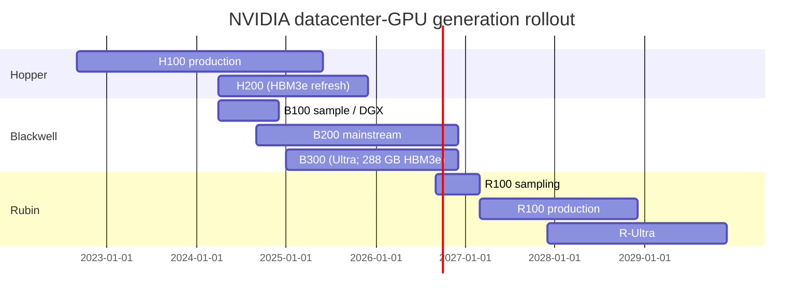
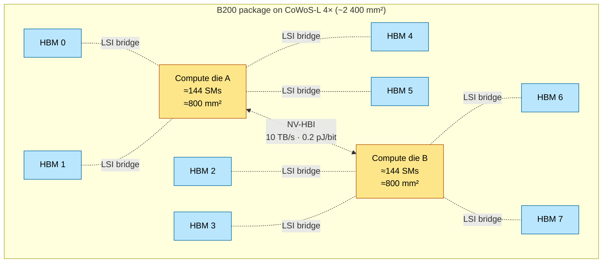
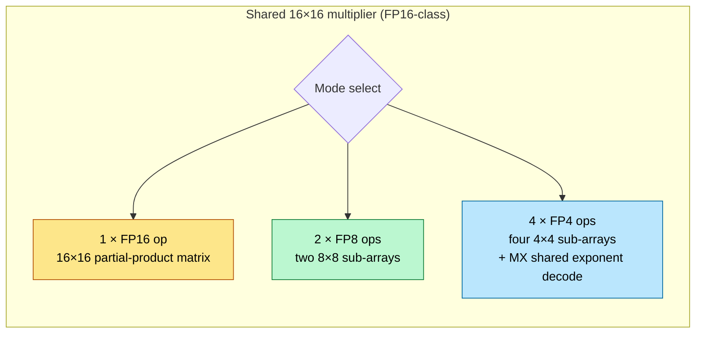
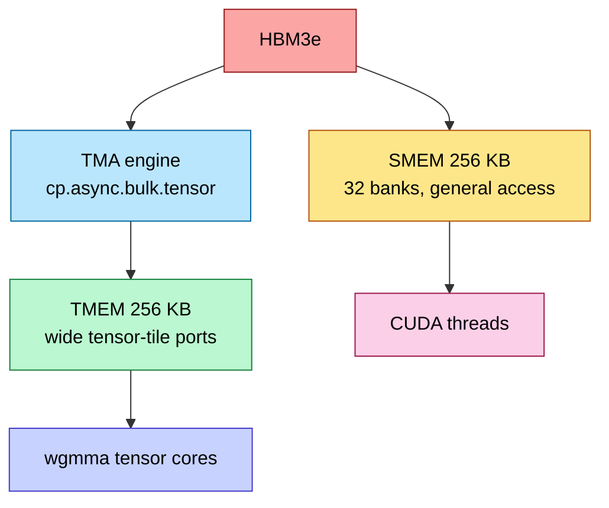
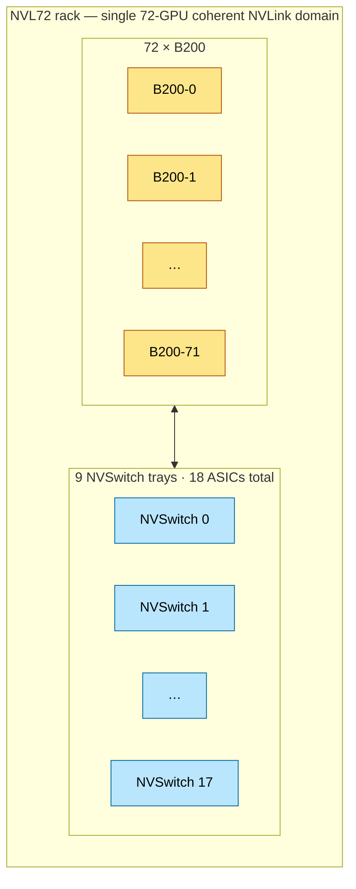
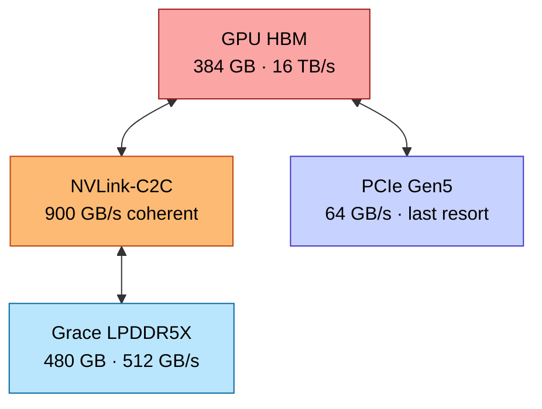
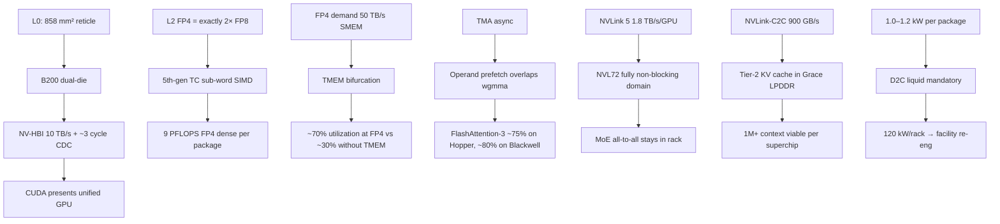

# Blackwell Architecture — B100 / B200 / B300 / GB200 / GB300, Rubin Outlook

> **Layer:** L3 (frontier-NVIDIA specialization).
> **Prerequisites:** [GPU_Architecture](GPU_Architecture.md), [Memory_Hierarchy_and_Roofline](Memory_Hierarchy_and_Roofline.md), [L1 Advanced_Packaging](../L1_Packaging_and_Memory/Advanced_Packaging.md), [L2 FP_Unit_Design](../L2_Digital_Design_for_AI/FP_Unit_Design.md).
> **Hands off to:** [L4 Rack_Scale_Design](../L4_Systems_and_Interconnects/Rack_Scale_Design.md), [L6 Modern_Quantization_Frontier](../L6_Algorithms_and_Models/Modern_Quantization_Frontier.md), all L8 inference pages.

---

## 0. What's actually new in Blackwell

Blackwell is **the** generation that made FP4 a hardware-supported tensor-core format. Five concrete things changed vs Hopper:

1. **Dual-die packaging** (NV-HBI bridge) — first NVIDIA datacenter GPU exceeding the EUV reticle limit.
2. **5th-gen tensor cores** with native FP4, FP6, MXFP4, NVFP4 support.
3. **TMEM** — a dedicated tensor-operand SRAM tier separating wgmma traffic from SMEM.
4. **NVLink 5** at 1.8 TB/s/GPU, supporting NVL72 (and eventually NVL576) coherent domains.
5. **HBM3e at 8 TB/s/package**, growing to 12 TB/s on Blackwell Ultra (B300).

This page covers all five; per-page focus on the architectural mechanisms, derivations, and L4 implications.

---

## 1. Generation map

| Family | First ship | Process | Die config | HBM | TDP | Highlights |
|---|---|---|---|---|---|---|
| Hopper H100 | 2022 | TSMC 4N | monolithic (~814 mm²) | 80 GB HBM3 | 700 W | wgmma, TMA, FP8, NVLink-4 |
| Hopper H200 | 2024 | TSMC 4N | monolithic | 141 GB HBM3e | 700 W | HBM3e refresh, more capacity |
| Blackwell B100 | 2024 | TSMC 4NP | dual-die | 192 GB HBM3e | 700 W | early sample / DGX |
| Blackwell B200 | 2024 | TSMC 4NP | dual-die | 192 GB HBM3e | 1000 W | mainstream FP4 part |
| Blackwell Ultra B300 | 2025 | TSMC 4NP | dual-die | 288 GB HBM3e | 1200 W | larger HBM, higher TDP |
| Rubin R100 (proj.) | 2026 | TSMC 3NP | dual-die | 288 GB HBM4 | ~1500 W | NVLink-6, FP3 likely |
| Rubin Ultra (proj.) | 2027 | TSMC 3NP / A16 | quad-die | ~512 GB HBM4 | ~1800 W | NVL576 domain |

---

## 2. Dual-die microarchitecture

### 2.1 Why two dies

L0 fact: EUV reticle limit ≈ 858 mm². NVIDIA wants ~1 600 mm² of compute → must split. Two ~800 mm² dies bridged by NV-HBI on a CoWoS-L 4× substrate.

### 2.2 NV-HBI cross-die bridge

- 10 TB/s bidirectional aggregate.
- ~20 000 wires at 2 Gbps each, single-ended USR signaling.
- ~0.2 pJ/bit → ~16 W of power dissipated in the bridge alone.
- Mesochronous CDC; ~2–4 cycle penalty for cross-die access.
- Cache-coherent at L2 → CUDA presents both dies as one GPU.

### 2.3 Programming-model implications

CUDA's **co-located block** abstraction extends across dies; an SM on die A reads die-B HBM transparently. But:

- **Cross-die HBM access** pays NV-HBI traversal (~50 ns) on top of the ~250 ns local HBM latency → ~20% latency penalty.
- **Cross-die L2 access** is the bigger penalty — local L2 ~30 ns, cross-die ~80 ns due to NoC + NV-HBI.
- **Optimal kernels** affinity-bind thread blocks to dies (via cluster API) so weight streams stay local. NCCL collectives handle this for tensor-parallel work.

For most workloads the penalty is negligible (decode is HBM-bound; the few extra ns don't matter). For latency-critical small kernels (e.g., per-step KV updates), affinity matters.

---

## 3. 5th-gen tensor cores

### 3.1 Format support matrix

| Format | New in | Peak relative (vs FP16) | Use case |
|---|---|---|---|
| FP16 | V100 | 1× | training baseline |
| BF16 | A100 | 1× | gradient training |
| TF32 | A100 | 0.5× | drop-in for FP32 |
| FP8 E4M3 | H100 | 2× | forward, activations |
| FP8 E5M2 | H100 | 2× | backward, gradients |
| **MXFP4** | B200 | 4× | OCP block-scaled inference |
| **NVFP4** | B200 | 4× | NVIDIA variant (K=16, FP8 scale) |
| **FP6 E3M2** | B200 | 3× | research |
| **MX-FP8** | B200 | 2× | block-scaled FP8 |
| FP3 (proj.) | R100 | 8× | Rubin frontier |

### 3.2 Sub-word SIMD inside the tensor core

Blackwell does **not** have separate physical FP4 multipliers. The hardware reuses the same Wallace tree, dynamically reconfigured:

The same silicon area runs at 1× FP16 OR 2× FP8 OR 4× FP4 throughput depending on the format. The MX shared exponent is decoded once per 32-element block, applied to all elements in the block — covered fully in [L2 FP_Unit_Design §6](../L2_Digital_Design_for_AI/FP_Unit_Design.md).

### 3.3 Throughput numbers

| Format | B200 dense (per package, dual-die) | B300 dense |
|---|---|---|
| BF16 | 2 250 TFLOPS | 2 700 TFLOPS |
| FP8 | 4 500 TFLOPS | 5 400 TFLOPS |
| FP6 | 6 750 TFLOPS | 8 100 TFLOPS |
| FP4 (MXFP4 / NVFP4) | 9 000 TFLOPS | 10 800 TFLOPS |
| Sparse (2:4 multiplier) | 2× the above | 2× |

These are *spec sheet dense* numbers. Real-world utilization at FP4 caps around 60–70% on optimized kernels, since the 2× FP4 advantage (proven at L2) is bottlenecked by operand-fetch from TMEM.

---

## 4. TMEM — operand-fetch bifurcation

### 4.1 Why TMEM exists

Covered in detail at [L2 On_Chip_Memory_Hardware §5](../L2_Digital_Design_for_AI/On_Chip_Memory_Hardware.md). TL;DR:

- FP4 wgmma demands ~50 TB/s/SM operand bandwidth.
- SMEM provides ~30 TB/s/SM (32 banks, mod-32 conflict-prone).
- Doubling SMEM doubles capacity, not port count → doesn't help.
- TMEM = 256 KB/SM with wide read ports (1 024 b each) geometrically matched to wgmma tile rows, accessible *only* by tensor cores.

### 4.2 Programming model

- TMA copies tiles HBM → TMEM via async DMA (with mbarrier signal).
- wgmma reads operands directly from TMEM (no SMEM round-trip).
- General CUDA threads cannot touch TMEM → no contention with wgmma.

### 4.3 Performance impact

A FlashAttention-3 kernel on Hopper hits ~75% of FP8 peak. The same algorithm refactored for Blackwell TMEM hits ~80% of FP4 peak — and FP4 peak is 2× FP8 peak. Net: **~2× speedup at iso-quality** with calibrated quantization.

---

## 5. Transformer Engine v2 (software)

Transformer Engine (TE) is NVIDIA's framework integration that:

- Automatically calibrates per-tensor scaling for FP8 / FP4.
- Inserts dynamic-range probes into training to track activation/gradient distributions.
- Selects per-layer precision (e.g., embedding layers FP8, MoE expert FFN FP4).
- Manages the MX shared-exponent metadata.

TE v2 (Blackwell) adds:

- NVFP4 support (16-element blocks, FP8 shared scale).
- Per-channel scaling for gradients (more robust than per-tensor).
- Automatic loss-scale management for FP4 backward.

Without TE, FP4 training is ~95% likely to diverge. With TE, it converges within 1% of BF16 quality on most architectures.

---

## 6. NVLink-5 and the NVL72 fabric

### 6.1 NVLink-5 signaling

- 224 Gbps PAM4 SerDes, single-ended-equivalent differential pair.
- 100 GB/s unidirectional per lane.
- 18 lanes per B200 → 1.8 TB/s unidirectional / 3.6 TB/s bidirectional per GPU.
- ~5 W per port for the PHY (significant share of TDP).

### 6.2 NVL72 topology

72 GPUs in one rack form a single 72-GPU NVLink domain via 9 NVSwitch trays (2 ASICs per tray).

- **NVSwitch ASIC radix:** 144 ports × 50 GB/s = 7.2 TB/s switching capacity.
- **Total switch capacity:** 18 × 7.2 = 130 TB/s — matches GPU aggregate (72 × 1.8 = 130 TB/s).
- **Topology:** non-blocking 1-tier; every pair of GPUs has guaranteed 1.8 TB/s injection bandwidth.

This is **the** fabric for tensor-parallel MoE: the all-to-all of expert routing requires every-pair bandwidth at the rack scale.

### 6.3 NVL576 (announced for Rubin)

- 576-GPU coherent domain via 2-tier NVSwitch + optical interconnects.
- Required for trillion-parameter dense models in TP+EP mode.
- Scale-out (multi-NVL576) still goes via InfiniBand at L4.

---

## 7. GB200 Superchip and NVLink-C2C

### 7.1 The Grace–Blackwell pairing

Each GB200 Superchip = 1 Grace ARM CPU (72 cores Neoverse V2) + 2 B200 GPUs, glued by NVLink-C2C at 900 GB/s coherent.

- Grace has 480 GB LPDDR5X (~512 GB/s).
- NVLink-C2C makes Grace memory addressable by GPU at ~900 GB/s — much faster than PCIe Gen5 (64 GB/s).
- Total addressable memory per Superchip: 480 GB LPDDR + 384 GB HBM = 864 GB.

### 7.2 Tier-2 KV cache

For long-context decode (1M+ tokens), KV cache exceeds HBM. Without C2C, swapping to host memory over PCIe stalls the GPU. With C2C, host LPDDR becomes a viable Tier-2:

This unlocks ~10× higher concurrent batch size for million-token-context workloads. Mooncake-style global KV pools (L8) build on this.

---

## 8. Power and thermal

### 8.1 Per-package

| Part | TDP | Currents @ 0.7 V |
|---|---|---|
| H100 SXM5 | 700 W | ~933 A |
| B200 (HGX) | 1 000 W | ~1 430 A |
| B300 (HGX) | 1 200 W | ~1 715 A |
| GB200 Superchip (2 GPUs + 1 CPU) | 2 700 W | mixed |
| GB300 (proj.) | ~3 200 W | mixed |

Drives mandatory direct-to-chip liquid cooling on every Blackwell-class part.

### 8.2 Rack-level

NVL72 GB200 rack:

- 36 GB200 superchips × 2 700 W = 97 kW logic
- HBM, voltage regulators, NVSwitch trays, PSUs: ~25 kW more
- **~120–140 kW per rack** depending on configuration

Coolant flow rate from $Q = \dot{m} C_p \Delta T$:

$$
\dot{m} \;=\; \frac{120\,000\,\text{W}}{4184\,\text{J/(kg·K)} \cdot 10\,\text{K}} \;\approx\; 2.87\,\text{kg/s} \;\approx\; 45\,\text{gal/min}
$$

at a strict 10 °C inlet-to-outlet rise (HBM thermal-zone-2 requires inlet ≤ 35 °C).

---

## 9. Rubin outlook

Public projections (NVIDIA roadmap disclosures):

- **Process:** TSMC 3NP (Rubin) → A16 (Rubin Ultra)
- **Die config:** dual-die (Rubin) → quad-die (Rubin Ultra)
- **HBM:** HBM4 → HBM4e
- **Compute:** ~25 PFLOPS FP8 / ~50 PFLOPS FP4 (Rubin), 2× more for Ultra
- **NVLink:** NVLink-6 at 3.6 TB/s/GPU
- **Coherent domain:** NVL576 → NVL576-Ultra
- **TDP:** ~1 500 W → ~1 800 W

The headline architectural change: with **High-NA EUV** halving the reticle field, dies must shrink in area and packages must grow in die-count. Rubin will normalize 4-die compute clusters; Rubin Ultra will push to 6-die. NV-HBI evolves to NV-HBI-2 with hybrid bonding.

---

## 10. End-to-end cause / effect

---

## 11. Numbers to memorize

| Quantity | Value | Why |
|---|---|---|
| B200 die count | 2 | NV-HBI bridged |
| B200 SMs (logical) | 288 (144 × 2) | dual-die unified |
| B200 BF16 dense | 2 250 TFLOPS | spec |
| B200 FP8 dense | 4 500 TFLOPS | spec |
| B200 FP4 dense | 9 000 TFLOPS | NVFP4 |
| B200 HBM | 192 GB HBM3e @ 8 TB/s | spec |
| B300 HBM | 288 GB HBM3e @ 8 TB/s | Ultra refresh |
| B200 ridge FP4 | 1 125 FLOP/B | π/β |
| B200 TMEM | 256 KB/SM | new tier |
| NV-HBI BW | 10 TB/s bidirectional | die-to-die |
| NV-HBI energy | ~0.2 pJ/bit | silicon-bridge floor |
| NVLink-5 per-GPU | 1.8 TB/s (3.6 bidir) | 18 lanes × 100 GB/s |
| NVL72 GPUs | 72 | non-blocking domain |
| NVL72 fabric capacity | 130 TB/s | matches GPU aggregate |
| NVLink-C2C | 900 GB/s | Grace ↔ B200 |
| GB200 LPDDR (Grace) | 480 GB | Tier-2 KV cache |
| B200 TDP | 1 000 W | HGX baseboard |
| GB200 NVL72 rack power | ~120–140 kW | facility reengineering |
| Liquid coolant flow | ~45 gal/min/rack | sensible-heat math |

---

## 12. Worked interview problems

**Q1.** *Why does Blackwell need TMEM but Hopper doesn't?*

Hopper's tensor cores operate on FP8 (1 byte/operand). FP8 wgmma operand demand ≈ 25 TB/s/SM, fitting within SMEM's ~30 TB/s budget. Blackwell adds FP4 (½ byte/operand) which doubles the *effective* operand throughput requirement to ~50 TB/s/SM — exceeding SMEM. Doubling SMEM doesn't help (port count, not capacity, is the bottleneck). TMEM is a separate SRAM with wide ports geometrically matched to wgmma tile shapes.

**Q2.** *Estimate the cross-die latency penalty for accessing remote HBM on B200.*

Local HBM access: ~250 ns (DRAM activation + return). Cross-die: + NV-HBI traversal (~10–20 ns) + remote-die NoC (~6 cycles ≈ 4 ns at 1.6 GHz). Total ~270 ns, or ~8% slower. Well within HBM's normal latency variance — usually invisible. For L2-resident data the penalty is bigger (30 ns local vs 80 ns cross-die ≈ 2.7×) but L2 hits are rare in LLM workloads.

**Q3.** *NVL72 is non-blocking with 130 TB/s switch capacity matching GPU aggregate. What workload does this enable that NVL8 (Hopper) couldn't?*

MoE expert-parallel all-to-all. For a 16-expert MoE with 16 GPUs, each GPU sends ~1/16 of its activation to every other GPU. Bandwidth required: $N \cdot d \cdot \text{bytes} \cdot (E-1)/E$ where N is batch tokens, d is hidden, E is expert count. At rack scale (E = 32, N = 4 K, d = 8 K), this is ~10 TB/s of all-to-all per second. NVL72 sustains this; NVL8 saturates the inter-rack network (~400 Gb/s IB) and prefill stalls. NVL72 brings expert-parallel MoE training "into the rack".

**Q4.** *How does NVLink-C2C change long-context decode economics?*

KV cache for 1M tokens at 70 B FP16 model with GQA = ~140 GB → exceeds B200's 192 GB HBM (after weights). Without C2C, swapping to host PCIe (64 GB/s) means each KV read costs 100× HBM time → decode collapses. With C2C (900 GB/s), KV bytes from Grace LPDDR cost ~10× HBM time but stays workable. Effective context length per GB200 superchip rises from ~512 K to ~4 M tokens.

**Q5.** *Why does Blackwell's FP4 throughput reach only ~70% in real benchmarks despite the 2× theoretical advantage?*

Three factors: (a) FP4 wgmma's K dimension doubles to 64 — more partial-product accumulation in a single instruction lengthens the tensor-core pipeline, increasing per-issue latency; (b) MX shared-exponent decode adds ~1 extra cycle of overhead per block; (c) operand-fetch from TMEM is at the bandwidth ceiling already, so any cache miss into SMEM costs a full HBM round-trip. In aggregate, sustained FP4 throughput is ~2/3 of theoretical 2× peak — still a huge speedup, just not the marketing number.

---

## 13. References

- NVIDIA Blackwell Architecture white paper (2024).
- Choquette et al., *NVIDIA Hopper Architecture*, IEEE Micro 2023 — for what Blackwell extends.
- *Dissecting the NVIDIA Hopper Architecture*, Jia, Maggioni et al. arXiv 2402.13499.
- Community Blackwell reverse-engineering papers (2025).
- OCP Microscaling Formats v1.0 + NVIDIA NVFP4 white paper.
- Hot Chips 2024 — NVL72 / NV-HBI disclosures.

---

**Up the stack:** [AMD_Instinct](AMD_Instinct.md), [L4 Networking & Interconnects](../L4_Systems_and_Interconnects/Index.md), [L6 Modern_Quantization_Frontier](../L6_Algorithms_and_Models/Modern_Quantization_Frontier.md).
**Down the stack:** [GPU_Architecture](GPU_Architecture.md), [L1 Advanced_Packaging](../L1_Packaging_and_Memory/Advanced_Packaging.md), [L2 FP_Unit_Design](../L2_Digital_Design_for_AI/FP_Unit_Design.md).
