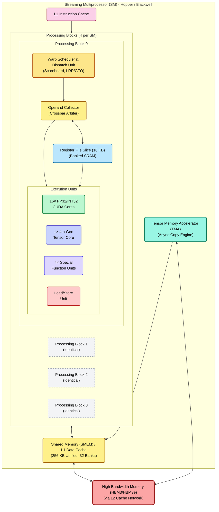
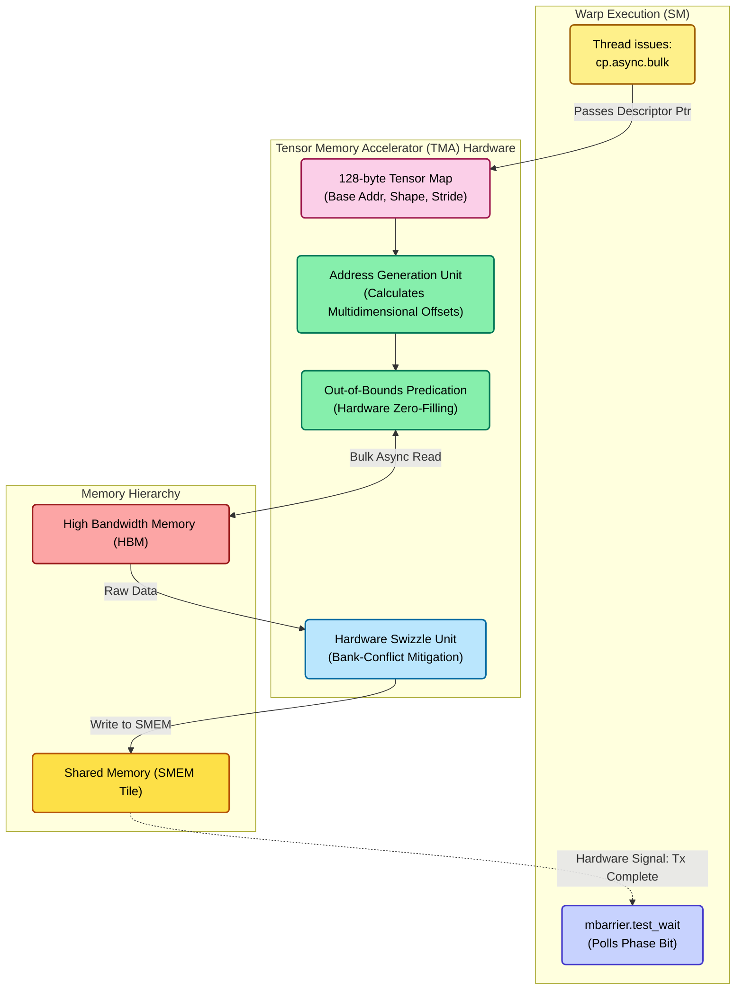
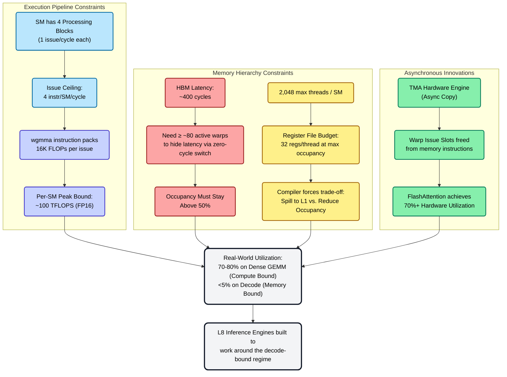

# GPU Architecture — The SIMT Reference Chip

> **Layer:** L3.
> **Prerequisites:** [ISA_and_Execution_Model](ISA_and_Execution_Model.md), [L2 On_Chip_Memory_Hardware](../L2_Digital_Design_for_AI/On_Chip_Memory_Hardware.md), [L2 FP_Unit_Design](../L2_Digital_Design_for_AI/FP_Unit_Design.md).
> **Hands off to:** [Memory_Hierarchy_and_Roofline](Memory_Hierarchy_and_Roofline.md), [Blackwell_Architecture](Blackwell_Architecture.md), [AMD_Instinct](AMD_Instinct.md).

---

## 0. Why GPUs won AI

Three structural advantages explain GPU dominance over CPUs for AI:

1. **Throughput orientation.** A CPU optimizes for *single-thread latency* via OOO execution, deep caches, and branch prediction. A GPU optimizes for *aggregate throughput* via thousands of in-flight threads. AI workloads are throughput-dominated (no branchy single-thread critical path; lots of independent FMAs).

2. **Tensor cores.** A CPU's SIMD ALU does ~16 BF16 FMAs per cycle. A GPU's tensor core does 256–4 096 FMAs per cycle as a single instruction. The throughput-per-watt ratio is ~30× in favor of tensor cores on dense GEMM.

3. **HBM bandwidth.** A CPU has DDR at ~50 GB/s/socket. A GPU has HBM at ~10 TB/s/package. Without the bandwidth, the FMAs starve.

This page covers the canonical SIMT GPU at the L3 level: SM organization, warp scheduling, tensor cores, register file, SMEM, TMA, and the roofline implications. Architecture-specific pages (Blackwell, MI300/MI355) specialize this material.

---

## 1. The Streaming Multiprocessor (SM)

### 1.1 The Execution Hierarchy: Software to Hardware

Before dissecting the SM, we must map the software hierarchy to the hardware that executes it. The GPU scales out via hierarchical groupings:

- **Thread / Core:** The fundamental unit of execution. In software, a thread computes a single sequence of instructions. In hardware, a thread's instruction executes on a CUDA Core (for INT/FP32), a Tensor Core (for matrix math), or a Load/Store Unit (for memory ops) during a given cycle.
- **Warp / Processing Block:** A **Warp** is a group of 32 threads that execute in lockstep (SIMT). The hardware **Processing Block** (PB, also called a partition or warp scheduler) manages these warps, fetching and issuing one instruction to be executed by all 32 threads simultaneously.
- **Thread Block (CTA) / SM:** A **Thread Block** (Cooperative Thread Array) is a software grouping of up to 1024 threads (32 warps). A Thread Block is scheduled onto a *single* **Streaming Multiprocessor (SM)** and remains there until completion. Threads within a block can synchronize and share data via the SM's Shared Memory (SMEM).
- **Cluster (Hopper+) / GPC:** A **Thread Block Cluster** is a new software grouping (introduced in Hopper) of up to 8 Thread Blocks. These blocks are scheduled concurrently onto SMs within the same **GPC (Graphics Processing Cluster)**. A GPC is a hardware partition containing multiple TPCs (Texture Processing Clusters, which hold 2 SMs each), a raster engine, and an L1.5/L2 cache partition. Blocks in a cluster can access each other's SMEM directly (DSMEM).
- **Grid / GPU:** A **Grid** represents the entire kernel launch, containing many Thread Blocks (or Clusters). The hardware GigaThread Engine assigns these blocks across all available GPCs/SMs on the entire GPU.

**Key Rule:** Threads map to Cores. Warps map to Processing Blocks. Blocks map to SMs. Clusters map to GPCs. Grids map to the GPU.

### 1.2 Anatomy of the SM



The Hopper / Blackwell SM is structurally divided to sustain massive concurrency:

- **4 Processing Blocks (Warp Schedulers):** The SM is partitioned into four independent PBs. Each PB manages its own pool of active warps and issues 1 instruction per cycle.
- **Compute Density (Per PB):** Each PB contains 16 FP32 CUDA cores, 16 INT32 cores, 4 Special Function Units (SFUs for transcendentals like `sin`, `exp`), and 1 Tensor Core.
- **Unified L1/SMEM:** A massive 256 KB SRAM structure acts as both software-managed Shared Memory and hardware-managed L1 cache.
- **Register File:** 256 KB of total registers (65,536 × 32-bit registers), distributed equally as 16 KB slices per PB.

### 1.3 Issue Rate and the Instruction Mix

Each Processing Block issues exactly 1 instruction per cycle. Across the 4 PBs, the SM hits an **issue ceiling** of 4 instructions/SM/cycle. This dispatch limit defines the fundamental bounds of the GPU:

- A single `FMA` instruction computes 64 FLOPs (32 threads × 2 ops).
- A single `wgmma.mma_async` (Tensor Core) instruction computes $64 \times 16 \times 16 = 16,384$ FLOPs.
- Therefore, hitting 100+ TFLOPS/SM relies entirely on mixing standard instructions with ultra-dense Tensor Core instructions that amortize a single "issue slot" over thousands of mathematical operations. 

If a kernel relies heavily on scalar address arithmetic or standard CUDA cores, it will hit the issue ceiling long before it hits the theoretical compute ceiling.

### 1.4 Expert-Level Pipeline Mechanics: From Fetch to Execute

The process of taking an instruction from a warp and executing it on the silicon is extraordinarily complex, designed specifically to hide memory latency without paying the context-switching penalties of a CPU.

#### A. The Scoreboard and Dependency Tracking
The Warp Scheduler does not randomly guess which warp is ready; it relies on a hardware **Scoreboard** (a highly scaled version of the CDC 6600 algorithm). 
- Every warp maintains a small dedicated SRAM bitmask representing its physical registers.
- When an instruction is issued (e.g., `LDG R1, [R2]`), the scoreboard marks the destination register (`R1`) as **pending**.
- A warp is mathematically ineligible for scheduling if the source registers for its *next* instruction have their pending bits set. 
- When the memory controller finally writes the payload from HBM back to the Register File, it signals the scoreboard to clear the pending bit. On the very next clock cycle, the warp enters the "Ready/Eligible" pool.

#### B. Scheduling Policies: GTO vs. LRR
Once the scoreboard identifies the pool of eligible warps, the scheduler must select exactly one warp to issue to the execution units. The choice of algorithm profoundly impacts L1 cache hit rates:

1. **Loose Round Robin (LRR):** Iterates through all eligible warps fairly. 
   - *The Hardware Flaw:* Because all warps progress at the exact same rate, they all reach memory-fetch instructions simultaneously. This creates a "thundering herd" effect that completely saturates the L1 cache, evicting each other's data, causing massive pipeline stalls.
2. **Greedy-Then-Oldest (GTO):** The dominant scheduling policy for modern throughput architectures.
   - *Greedy:* The scheduler selects one warp and hammers instructions from it back-to-back as long as it remains eligible. This maximizes temporal locality in the L1 Instruction Cache and keeps the internal data pathways warm.
   - *Then-Oldest:* When the "greedy" warp inevitably hits a scoreboard stall, the scheduler falls back and selects the *oldest* ready warp (typically based on arrival time or Warp ID) to become the new greedy warp.
   - *The Rationale:* GTO aggressively staggers execution. It forces some warps to run far ahead of others. While the leading warps are stalled waiting on HBM, the trailing warps are busy executing math, perfectly hiding the DRAM latency.
3. **Two-Level Scheduling:** Modern schedulers (Volta+) dynamically toggle between GTO and LRR depending on real-time SMEM queue saturation and register pressure.

#### C. The Operand Collector and Register Bank Conflicts
Before an instruction reaches the ALU, its operands must be fetched from the Register File (RF). For a 32-thread `FFMA` instruction, the hardware requires 3 source operands per thread simultaneously. That is **96 registers per cycle**.
- **Banked SRAM Architecture:** Building a 96-read-port SRAM is physically impossible (SRAM area scales quadratically, $O(ports^2)$). Instead, the RF is physically divided into ~32 single-ported banks.
- **The Crossbar Network:** To satisfy the instruction, a hardware unit called the **Operand Collector (OC)** sits between the scheduler and the ALUs. The OC contains small buffers (Collector Units) connected to the RF via a crossbar. Over 1-3 clock cycles, the OC requests registers from different banks, buffering them until the full 96-register vector is assembled.
- **Register Bank Conflicts:** If multiple threads within a warp require source registers that physically map to the *exact same SRAM bank*, the read cannot happen in parallel. The Operand Collector's arbiter must serialize the reads, injecting physical "bubble" stalls into the pipeline. Compilers fiercely optimize register allocation to minimize bank conflicts, but they are a primary cause of low IPC in unoptimized kernels.

#### D. Independent Thread Scheduling and the SSR (Volta+)
Prior to the Volta architecture, a warp shared a single **Program Counter (PC)** and a hardware SIMT reconvergence stack. If a branch diverged, the hardware serialized execution, pushing the non-taken path to the stack. *Critical Flaw:* A thread could not yield to another thread in the same warp, making fine-grained synchronization (like mutexes) deadlock-prone.
- **Per-Thread State:** Volta eliminated the hardware SIMT stack. Modern GPUs maintain a distinct **Program Counter and Call Stack per thread**.
- **Schedule State Register (SSR):** To maintain the massive power efficiency of SIMT, the hardware still groups threads. The warp scheduler maintains an SSR mask that dynamically indicates which threads share the same PC and should be executed together on the current clock cycle.
- **Convergence Barrier Unit (CBU):** Because threads own their own PCs, they must be explicitly told to wait for each other. The compiler emits PTX synchronization instructions (`BSSY` / `BSYNC`). The hardware CBU utilizes dedicated barrier registers (`B0`-`B7`) to track a "Participation Mask" (who should arrive) and an "Arrival Mask" (who has arrived). Once the masks match, the threads are grouped back into a SIMT wave.
- **Starvation-Free Locks:** This architecture means Thread A can execute a spin-lock while the hardware pauses it and advances Thread B (which holds the lock) within the *same* warp. Intra-warp deadlocks are essentially eliminated.

#### E. The Physical Reality of the Zero-Cycle Context Switch
The phrase "context switch" on a GPU is a software illusion. The GPU *never* saves or restores thread state to memory during a switch.
- **Static RF Allocation:** When a Thread Block launches, all its required registers are permanently carved out of the massive 256 KB RF. The data physically resides in those exact SRAM transistors for the lifetime of the kernel.
- **The CAM Ready Vector:** The Warp Scheduler maintains a Content-Addressable Memory (CAM) tracking the scoreboard status of its resident warps.
- **Zero-Cost Muxing:** The physical RF address for any register is mathematically evaluated on the fly: `(Warp_ID * Registers_Per_Warp) + Register_Index`. Therefore, "switching context" is literally just a hardware multiplexer in the dispatch unit flipping the `Warp_ID` wire from `0` to `1`. Because the new warp's data is already hardwired in place, the switch costs exactly zero clock cycles.

### 1.5 Global Scheduling: The GigaThread Engine
While Warp Schedulers manage execution *inside* an SM, the **GigaThread Engine** is the global hardware scheduler that manages the entire chip. 

- **Two-Level Hierarchy:** The GigaThread Engine sits at the front end, receiving Grids from the CPU via PCIe. It evaluates the exact resource requirements of a Thread Block (Registers, SMEM, Thread Count) and dispatches it to an SM with available capacity. Once dispatched, control is handed off to the SM's internal Warp Schedulers.
- **Hyper-Q and Hardware Queues:** Prior to the Kepler architecture, GPUs processed kernels from a single hardware queue, leading to false serialization (a large kernel would block small kernels). Modern GigaThread engines implement **Hyper-Q (32+ hardware queues)**, allowing independent streams and even different CPU processes to feed the GPU concurrently, filling execution holes and maintaining 100% SM utilization.
- **Immediate Replacement:** When a Thread Block retires, the GigaThread Engine immediately dispatches a new block to that specific SM without CPU intervention, minimizing tail latency and keeping the SM oversubscribed.

---

## 2. Tensor Cores

### 2.1 The Architectural Paradigm Shift
A Tensor Core is not merely a wider ALU; it is a **tightly coupled matrix-processing engine** embedded within each processing block. It bridges the gap between general-purpose SIMT execution and dedicated systolic arrays (like Google's TPU). 

Unlike standard scalar CUDA cores where each thread computes independently, Tensor Cores operate strictly at the **warp level**. A single instruction (e.g., `HMMA` or `WGMMA`) is a cooperative operation: the hardware expects all 32 threads in a warp to provide fragments of the input matrices $A$ and $B$, and the accumulator $C$, in a highly specific register layout.

### 2.2 Microarchitecture: Datapath and "Systolic" Flow
While frequently marketed as systolic arrays, Tensor Cores (Volta through Ampere) are physically implemented using **Four-Element Dot Product (FEDP)** units. 

**The Inner Product (Volta/Ampere):**
A $4 \times 4 \times 4$ MMA is executed by 16 parallel FEDP units. Each unit calculates one element of the $4 \times 4$ output tile. The datapath is a 4-stage pipeline:
1. **Operand Collection:** Fragments of $A$ and $B$ are fetched from the warp's registers.
2. **Multiplication:** Parallel FP16/BF16 multipliers compute the products.
3. **Accumulation:** Products are added to the partial sums (FP32/FP16) using a reduction tree.
4. **Write-back:** The resulting tile fragments are distributed back to the register file.

**The Outer Product Shift (Hopper/Blackwell):**
To scale up throughput for the massive $16 \times 8 \times 16$ and $64 \times 256 \times 16$ tile sizes, newer architectures transition toward an **Outer Product datapath**. 
- Instead of computing dot products (inner-joins), the hardware takes a "tall and skinny" column of $A$ and a "short and wide" row of $B$, broadcasting them across a grid of accumulators.
- **TMEM (Blackwell):** Because the outer product flow requires immense, sustained bandwidth, Blackwell introduces **Tensor Memory (TMEM)**. TMEM acts as a staging ground strictly for Tensor Cores, feeding the outer product accumulators directly without saturating the standard Register File or SMEM crossbars.

### 2.3 Generation History

| Gen | Year | Architecture | New Formats | Peak FMA / Instruction | Primary Datapath |
|---|---|---|---|---|---|
| 1st | 2017 | Volta V100 | FP16 | 64 (4×4×4) | FEDP (Inner) |
| 2nd | 2020 | Turing | INT8/INT4 | 128 | FEDP (Inner) |
| 3rd | 2020 | Ampere A100 | BF16, TF32, Sparse 2:4 | 256 | Enhanced FEDP |
| 4th | 2022 | Hopper H100 | FP8, Async `wgmma` | 4 096 (64×16×16) | Outer Product |
| 5th | 2024 | Blackwell B200 | FP4/FP6, MXFP4 | 8 192 (FP4) | Outer Product + TMEM |

### 2.4 The `wgmma` Instruction and Async Semantics
Introduced in Hopper, `wgmma` (Warp-Group MMA) expands collaboration from 1 warp to **4 warps (128 threads)** computing collaboratively.

```ptx
wgmma.mma_async.sync.aligned.m64n256k16.f32.f16.f16
    {acc_regs},          // Destination FP32 accumulator registers 
    desc_a,              // 64-bit descriptor pointing to A in SMEM/TMEM
    desc_b,              // 64-bit descriptor pointing to B in SMEM/TMEM
    1, 1, 0, 0           // scale_a, scale_b, transpose flags
```

**Asynchronous Execution:** 
`wgmma` is fundamentally asynchronous. When a warp issues `wgmma`, it immediately moves to the next instruction while the Tensor Core churns in the background. The warp explicitly synchronizes using `wgmma.commit_group` and `wgmma.wait_group` barriers when the math result is actually needed. This hardware feature physically enables the overlapping compute-and-fetch pipelines (Double Buffering) required by FlashAttention.

### 2.5 Tensor-Core Throughput Math
A $64 \times 256 \times 16$ FP16 `wgmma` operation performs:
$$ \text{ops} \;=\; 2 \cdot 64 \cdot 256 \cdot 16 \;=\; 524\,288\ \text{FLOPs} $$

At a pipeline depth of ~16 cycles:
$$ \text{rate} \;=\; \frac{524\,288}{16} \;=\; 32\,768\ \text{FLOPs/cycle/tensor core} $$

× 4 tensor cores per SM × 144 SMs × 1.6 GHz ≈ **30 PFLOPS FP16** (matching the B200 BF16 specification).

---

## 3. Memory Hierarchy from the SM's Perspective

### 3.1 Tier Latencies

| Tier | Latency | Bandwidth (per SM) | Capacity |
|---|---|---|---|
| Register file | 1 cycle | ~100 TB/s | 256 KB |
| TMEM (Blackwell+) | 2–4 cycles | ~50 TB/s | 256 KB |
| SMEM | 8–20 cycles | ~30 TB/s | 256 KB |
| L2 cache | 30–80 cycles | ~10 TB/s aggregate | 50 MB chip-wide |
| HBM | ~400 cycles | ~10 TB/s aggregate | 192–288 GB |

Each tier is ~10× the next in latency and ~10× in capacity. This logarithmic ratio physically mandates "tiled" algorithm design (GEMM blocking, FlashAttention).

### 3.2 SMEM Banking and Strides
SMEM contains 32 banks, word-interleaved (4-bytes). Bank index = `(addr/4) mod 32`. 
- **Stride-1:** Hits all 32 banks $\rightarrow$ 0-way conflict (Maximum throughput).
- **Stride-32:** All threads hit bank 0 $\rightarrow$ 32-way conflict (Serialized pipeline stall, IPC crushed).
- **Stride-33:** The classic software workaround. Padding the matrix dimension by +1 forces the layout to stagger across banks, restoring a 0-way conflict state.

### 3.3 Memory Coalescing (Global Memory)
When the 32 threads of a warp execute a global memory load (HBM), the hardware Load/Store Unit (LSU) aggressively attempts to *coalesce* the 32 individual physical addresses into as few 32-byte cache line transactions as possible.
- **Perfect Coalescing:** Threads access contiguous memory (`A[threadIdx.x]`). The LSU groups this into exactly four 32-byte transactions. 100% bus utilization.
- **Uncoalesced Access:** Threads stride through memory (`A[threadIdx.x * 32]`). The LSU must issue 32 totally separate 32-byte transactions. Because only 4 bytes of each 32-byte cache line are actually needed, the remaining 28 bytes are thrown away. HBM bandwidth drops by up to ~87% ($1/8$). This is fatal for inference workloads.

### 3.4 Thread Block Clusters and DSMEM (Hopper+)
Pre-Hopper, SMs were isolated; they could only share data via the slow global L2 cache or HBM. 
- **GPC Interconnect:** Hopper introduced **Clusters** mapped to a physical GPC (Graphics Processing Cluster). SMs within a GPC have a direct, high-speed routing fabric.
- **DSMEM (Distributed Shared Memory):** A thread in Block A can directly read/write the SMEM of Block B. DSMEM latency is slightly higher than local SMEM (~1.5×) but orders of magnitude faster than L2. 
- **The Rationale:** FlashAttention-3 utilizes Clusters to cooperative-fetch massive $256 \times 256$ tiles, pooling the SMEM capacities and TMA bandwidths of multiple SMs together while keeping synchronization hardware-bound and fast.

### 3.5 TMA — The Async Copy Revolution
Pre-Hopper, memory copies were strictly synchronous. A 32-thread warp cooperatively loaded a tile by calculating 32 individual addresses and issuing 32 `LDG` instructions. This consumed ~50 cycles of precious warp scheduler issue bandwidth just to move data, severely degrading compute utilization.

The **Tensor Memory Accelerator (TMA)** offloads this completely to an independent hardware **Proxy Engine**:



**TMA Expert Microarchitectural Breakdown:**

1.  **The Tensor Map Descriptor:** The host prepares a 128-byte descriptor containing the global base pointer, 5D shapes, strides, and the target tile dimensions. The warp issues a single `cp.async.bulk` instruction pointing to this descriptor.
2.  **The Address Generation Unit (AGU):** The TMA hardware takes over. The AGU evaluates the strides natively. If the requested tile crosses the boundary of the tensor, the TMA's **OOB Predication** logic automatically injects zeros into SMEM. No software bounds-checking (`if row < M`) is required, removing branching overhead.
3.  **Hardware Swizzle:** The TMA understands matrix layouts. As it streams data from HBM, the hardware swizzle unit intentionally permutes the bits (XORing addresses) as they land in SMEM. This guarantees that when the Tensor Core reads the tile later, it encounters exactly 0 bank conflicts.
4.  **The `mbarrier` Dual-Counter Mechanism:** To synchronize, TMA uses hardware transaction barriers (`mbarrier`). An `mbarrier` is a 64-bit object in SMEM tracking two things:
    - *Arrival Count:* The number of threads that have reached the barrier.
    - *Transaction Count (tx-count):* The exact number of bytes expected from the TMA.
5.  **Phase Bit Parity:** The `mbarrier` uses a "Phase Bit" (0 or 1) to enable seamless double-buffering. When the expected bytes arrive from the TMA and all threads check in, the hardware flips the phase bit. Threads polling the barrier simply execute `mbarrier.test_wait(phase)`—they sleep in a low-power state until the hardware flips the bit, indicating the payload is ready.

### 3.6 L2 Cache
L2 is ~50 MB on Hopper / Blackwell, distributed across 32–64 slices around the die. Address hashing distributes traffic uniformly. Hit latency ~30 cycles for nearest slice, ~80 cycles for far slice. For LLMs, weights almost never hit L2 (working set $\gg$ 50 MB), but L2 captures crucial transient reductions (FlashAttention partial sums). Hit rate: 5–15% for decode, 60–80% for training.

### 3.7 Virtual Memory, TLBs, and Unified Memory (UVM)
Modern GPUs do not deal in physical addresses directly; they utilize a robust Virtual Memory subsystem managed by the **GPU Memory Management Unit (GMMU)**.
- **Multi-Level TLB:** Because thousands of threads can request memory simultaneously, the GPU utilizes a massively parallel, multi-level Translation Lookaside Buffer (L1 and L2 TLB) to cache virtual-to-physical address mappings. 
- **Unified Memory and Demand Paging:** Unified Virtual Memory (UVM) creates a seamless address space between CPU and GPU. If a warp accesses an address that misses the TLB, the GMMU walks the page tables. If the page physically resides in CPU RAM, a **Page Fault** is triggered.
- **The Page Migration Engine (PME):** Upon a fault, the hardware suspends the warp and invokes the PME. The PME migrates the 4KB or 2MB page from System RAM to GPU VRAM over PCIe/NVLink autonomously. Once the TLB is updated, the warp resumes. While elegant, the migration latency (~tens of microseconds) is catastrophic for real-time performance, making prefetching (`cudaMemPrefetchAsync`) essential.

### 3.8 Hardware Memory Compression
Bandwidth is the ultimate bottleneck. To artificially inflate effective memory bandwidth, GPUs implement transparent, lossless **Hardware Delta Color Compression (DCC)** in the L2 and Memory Controllers.
- **The Delta Mechanism:** Instead of storing raw bytes, the hardware calculates a baseline reference value for a block of data and only stores the "deltas" (differences) for the remaining elements. A hidden metadata surface tracks the compression state of each tile.
- **The Fault Penalty:** DCC is proprietary to the GPU. If the CPU triggers a page fault to read a unified memory page that the GPU compressed, the GPU must physically **decompress** the page in VRAM before the Page Migration Engine can send it over PCIe, incurring a massive hidden latency penalty.

---

## 4. The Interconnect Fabric

### 4.1 Network on Chip (NoC) and The Partitioned Crossbar
Connecting 144 SMs to massive L2 caches and HBM stacks requires a sophisticated internal fabric.
- **Partitioned Xbar:** The primary interconnect is a massive hierarchical crossbar. However, the L2 cache is physically partitioned across the die.
- **Near vs. Far Hits:** An SM accessing an L2 slice physically adjacent to it (Near Hit) experiences low latency. Accessing an L2 slice on the opposite side of the chip (Far Hit) requires traversing the main crossbar, adding ~40-70 cycles of latency. Hashing algorithms ensure memory addresses are uniformly striped across L2 slices to prevent hotspotting.

### 4.2 NVLink and NV-HBI (Die-to-Die)
To scale beyond a single reticle limit, NVIDIA uses extremely dense point-to-point interconnects.
- **NVLink (Node-Scale):** Operates at up to 1.8 TB/s per GPU (Blackwell). NVLink utilizes proprietary packet framing (FLITs) and signaling to connect multiple GPUs on a board or across a rack via **NVSwitch** ASICs, maintaining shared address spaces and atomic operations at speeds an order of magnitude faster than PCIe.
- **NV-HBI (Chiplet-Scale):** In the dual-die Blackwell B200, the two silicon dies are stitched together via the NV-HBI (High Bandwidth Interface), delivering 10 TB/s. The NoC routes traffic across this bridge natively. To the software, the two dies maintain L2 cache coherency and present as a single monolithic logical GPU.

---

## 5. Hopper vs Blackwell — what changed

### 5.1 Architectural deltas

| Feature | Hopper H100 | Blackwell B200 |
|---|---|---|
| Process | TSMC 4N | TSMC 4NP, dual-die |
| Die area | 814 mm² | 2 × ~800 mm² (NV-HBI bridged) |
| SMs | 132 (H100), 144 logical | 144 per die, 288 logical (one GPU view) |
| FP8 TFLOPS | ~1 980 (dense) | ~4 500 (dense) |
| FP4 TFLOPS | n/a | ~9 000 (dense, MXFP4) |
| HBM | 80 GB HBM3 (3.35 TB/s) | 192 GB HBM3e (8 TB/s) |
| TMEM | n/a | 256 KB/SM |
| 5th-gen TC formats | FP8, BF16 | + FP4, FP6, MXFP4, NVFP4 |
| NVLink | 4 (900 GB/s/GPU) | 5 (1.8 TB/s/GPU) |
| Domain | NVL8/NVL256 | NVL72 / NVL576 |

### 4.2 NV-HBI mesochronous bridge

Two compute dies bridged via 10 TB/s die-to-die link. CUDA presents them as one GPU; cache-coherent at L2. Cross-die access penalty: 2–4 cycles + ~50 cycles (NoC traversal on remote die). Negligible for HBM accesses (already 400 cycles), modest for L2 accesses.

### 4.3 TMEM (covered fully in Blackwell page)

256 KB dedicated tensor-operand SRAM per SM, separating wgmma traffic from general SMEM. Required because FP4 demand on operand bandwidth exceeds SMEM port budget.

---

## 5. Achievable utilization in practice

### 5.1 Roofline-bound

Peak TFLOPS only achieved when:

- Workload arithmetic intensity exceeds ridge point (~295 FLOP/B on H100 FP16, ~1 125 on B200 FP4).
- Operand fetch keeps tensor cores fed (TMA + double-buffered tiles).
- Occupancy ≥ $W_{\min}$ to hide HBM latency on misses.

### 5.2 Real-world utilization

| Workload | Typical utilization on H100 | On B200 |
|---|---|---|
| Dense BF16 GEMM (large M,K,N) | 70–80% | 65–75% |
| FlashAttention fwd | 70–80% | 60–70% |
| Decode (bs=1, 70B model) | <5% (memory-bound) | <5% |
| MoE prefill | 50–65% | 50–60% |
| MoE decode | 10–20% | 10–20% |

The FP4 generation often shows *lower* % utilization than FP8 because peak FLOPS doubled but operand bandwidth didn't keep up everywhere. Absolute throughput still rises ~1.6×.

---

## 6. Microarchitectural Cause and Effect

The physical constraints of the GPU hardware fundamentally dictate algorithm design at the software layer:



---

## 7. Numbers to memorize

| Quantity | Value | Why |
|---|---|---|
| H100 SMs | 132 (132 active, 144 physical) | Architecture spec |
| Blackwell B200 SMs (dual-die) | 288 (144 per die) | Architecture spec |
| Threads / SM | 2 048 | 64 warps × 32 |
| Registers / SM | 65 536 × 32-bit | 256 KB |
| Tensor cores / SM | 4 | 1 per PB |
| FP16 wgmma rate per SM | ~100 TFLOPS | At 1.6 GHz |
| H100 FP16 peak | ~990 TFLOPS dense | 1.98 PF FP8 |
| B200 FP8 peak | ~4 500 TFLOPS dense | Both dies |
| B200 FP4 peak | ~9 000 TFLOPS dense | NVFP4 |
| H100 HBM BW | 3.35 TB/s | HBM3 |
| B200 HBM BW | 8 TB/s | HBM3e |
| H100 ridge point (FP16) | ~295 FLOP/B | π/β |
| B200 ridge point (FP4) | ~1 125 FLOP/B | Why decode is bad |
| TMEM size (Blackwell) | 256 KB/SM | New tier |
| L2 size (H100/B200) | ~50 MB | Distributed |
| HBM latency | ~400 cycles | Drives oversubscription |
| L2 latency | 30–80 cycles | Per slice distance |
| SMEM latency | 8–20 cycles | Bank-bounce |
| RF latency | 1 cycle | After operand collector |
| NV-HBI BW (die-to-die) | ~10 TB/s | Cross-die |
| NV-HBI penalty | 2–4 cycles | CDC overhead |
| Min warps to hide HBM | ~80 | $L/I$ rule |

---

## 8. Worked interview problems

**Q1.** *A kernel uses 80 registers/thread on Blackwell. What's the max occupancy?*

Per-SM RF = 65 536 regs. Threads = 65 536 / 80 = 819 threads. Warp count = ⌊819/32⌋ = 25 warps. Out of 64 warp slots → ~39% occupancy. Whether this is acceptable depends on $W_{\min}$ for the kernel's HBM dependency pattern. If the kernel is compute-bound (dense GEMM) then 25 warps is plenty (independent wgmmas hide each other). If memory-bound, occupancy is the limit.

**Q2.** *Why does Blackwell add TMEM as a *new* memory tier instead of just doubling SMEM?*

SMEM has 32 banks × 4 B = 128 B/cycle/bank → ~30 TB/s/SM. FP4 wgmma operand demand on Blackwell is ~50 TB/s/SM. Doubling SMEM doubles capacity, not port count, so it doesn't help. TMEM has wide read ports (1 024 b each) geometrically matched to wgmma tile rows, and is accessible only by tensor cores → no contention with general SMEM ops. Two separate memory tiers ≠ doubling one.

**Q3.** *Estimate the dense BF16 GEMM throughput on B200 for $M=N=K=8192$.*

$2 \cdot M \cdot N \cdot K = 1.1 \times 10^{12}$ FLOPs. Bytes loaded ≈ $2(MK + KN) + 4 MN = 2.4 \times 10^9$ bytes. AI = 458 FLOP/B. B200 FP16/BF16 ridge ≈ 280 FLOP/B → compute-bound. At 70% utilization of the ~4 500 TFLOPS peak: 3.1 PFLOPS effective. Elapsed: $1.1 \text{ TFLOPs} / 3.1 \text{ PFLOPS} = 0.35$ ms.

**Q4.** *Why does GPU decode (bs=1, 70B model) get <5% utilization regardless of generation?*

Decode reads all 70 GB of weights per token. AI = $2 \cdot 70\text{B} / (70\text{B} \cdot 2 B) = 1$ FLOP/B. Ridge point on B200 FP4 = 1 125 FLOP/B. Operating at AI = 1 means **1/1 125 ≈ 0.09%** of compute used. Throughput = $2 \cdot 70\text{B} / 8\text{TB/s} = 17.5$ ms/token = 57 tok/s. Compute-FLOPS-utilization is meaningless here; HBM-BW utilization is the meaningful metric and approaches 100%.

**Q5.** *How does TMA improve decode throughput when decode is HBM-bound, not issue-bound?*

It mostly doesn't. TMA helps prefill (compute-bound) by freeing scheduler issue slots for wgmma. In decode, the bottleneck is HBM reads of weights — TMA does the same number of HBM reads as a manual loop, just packaged into one descriptor. The marginal gain on decode is the small overhead of warp-issue-side address calculation, which is ~2% of total decode time. Decode-bound kernels can use TMA but it's not a step-function speedup.

---

## 9. References

- NVIDIA H100 / Hopper / Blackwell Tuning Guides — official ISA + microarch docs.
- Choquette et al., *NVIDIA Hopper Architecture*, IEEE Micro 2023.
- Jia, Maggioni et al., *Dissecting the NVIDIA Hopper Architecture*, arXiv 2402.13499.
- Patterson & Hennessy, *Computer Architecture: A Quantitative Approach*, 6th ed. — SIMT chapter.

---

**Up the stack:** [Memory_Hierarchy_and_Roofline](Memory_Hierarchy_and_Roofline.md) → [Blackwell_Architecture](Blackwell_Architecture.md).
**Down the stack:** [ISA_and_Execution_Model](ISA_and_Execution_Model.md), [L2 Digital_Design_For_AI](../L2_Digital_Design_for_AI/Digital_Design_For_AI.md).
