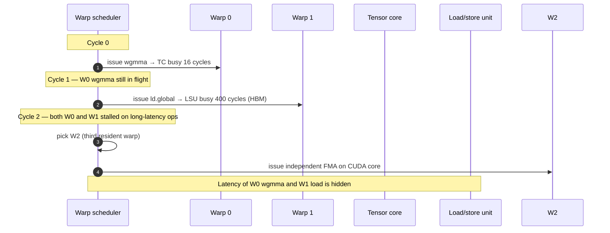
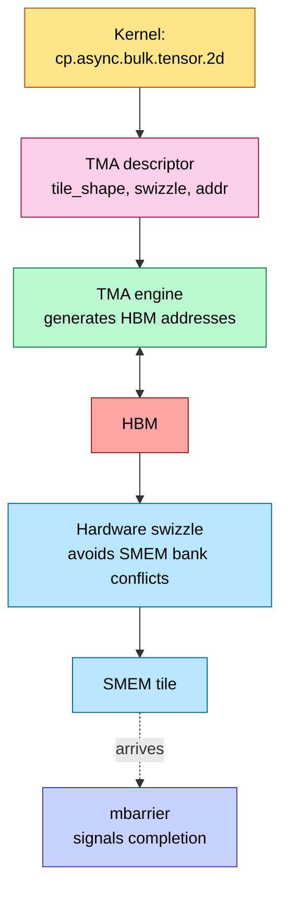
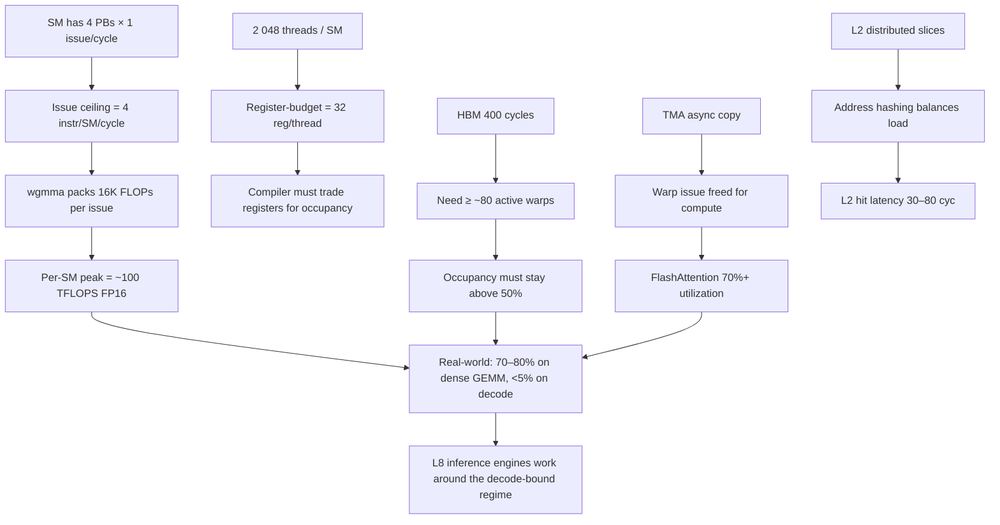

# GPU Architecture — The SIMT Reference Chip

> **Layer:** L3.
> **Prerequisites:** [ISA_and_Execution_Model](ISA_and_Execution_Model.md), [L2 On_Chip_Memory_Hardware](../L2_Digital_Design_for_AI/On_Chip_Memory_Hardware.md), [L2 FP_Unit_Design](../L2_Digital_Design_for_AI/FP_Unit_Design.md).
> **Hands off to:** [Memory_Hierarchy_and_Roofline](Memory_Hierarchy_and_Roofline.md), [Blackwell_Architecture](Blackwell_Architecture.md), [AMD_Instinct](AMD_Instinct.md).

---

## 0. Why GPUs won AI

Three structural advantages explain GPU dominance over CPUs for AI:

1. **Throughput orientation.** A CPU optimizes for *single-thread latency* via OOO execution, deep caches, and branch prediction. A GPU optimizes for *aggregate throughput* via thousands of in-flight threads. AI workloads are throughput-dominated (no branchy single-thread critical path; lots of independent FMAs).

2. **Tensor cores.** A CPU's SIMD ALU does ~16 BF16 FMAs per cycle. A GPU's tensor core does 256–4 096 FMAs per cycle as a single instruction. The throughput-per-watt ratio is ~30× in favor of tensor cores on dense GEMM.

3. **HBM bandwidth.** A CPU has DDR at ~50 GB/s/socket. A GPU has HBM at ~10 TB/s/package. Without the bandwidth, the FMAs starve.

This page covers the canonical SIMT GPU at the L3 level: SM organization, warp scheduling, tensor cores, register file, SMEM, TMA, and the roofline implications. Architecture-specific pages (Blackwell, MI300/MI355) specialize this material.

---

## 1. The Streaming Multiprocessor (SM)

### 1.1 Anatomy

```mermaid
flowchart TB
    subgraph SM["NVIDIA SM (Hopper reference) — ~144 SMs per H100 / ~144 per Blackwell die"]
        direction TB
        L1I[L1 instruction cache]:::ic
        subgraph PB[4 processing blocks per SM]
            direction LR
            subgraph PB0[Processing block 0]
                direction TB
                WS0[Warp scheduler<br/>+ dispatch unit]:::sched
                RF0[16 KB RF slice]:::rf
                CC0[16 FP32 CUDA cores<br/>+ INT cores + SFU]:::cuda
                TC0[Tensor core<br/>4th gen]:::tc
                LSU0[Load-store unit]:::lsu
                WS0 --> CC0 & TC0 & LSU0
                RF0 --- CC0
                RF0 --- TC0
            end
            PB1[Processing block 1<br/>(identical)]:::pb
            PB2[Processing block 2<br/>(identical)]:::pb
            PB3[Processing block 3<br/>(identical)]:::pb
        end
        SMEM[SMEM / L1 cache<br/>~256 KB unified]:::mem
        TMA[TMA engine<br/>async copy to SMEM]:::tma
        L1I --> PB
        PB <--> SMEM
        TMA --> SMEM
    end
    HBM[HBM via L2]:::hbm
    SMEM <--> HBM
    classDef ic fill:#fbcfe8,stroke:#9d174d,color:#000
    classDef sched fill:#fde68a,stroke:#b45309,color:#000
    classDef rf fill:#bae6fd,stroke:#0369a1,color:#000
    classDef cuda fill:#bbf7d0,stroke:#15803d,color:#000
    classDef tc fill:#c7d2fe,stroke:#4338ca,color:#000
    classDef lsu fill:#fecaca,stroke:#b91c1c,color:#000
    classDef pb fill:#e5e7eb,stroke:#374151,color:#000
    classDef mem fill:#fde68a,stroke:#b45309,color:#000
    classDef tma fill:#bae6fd,stroke:#0369a1,color:#000
    classDef hbm fill:#fca5a5,stroke:#991b1b,color:#000
```

Hopper / Blackwell SM:

- 4 processing blocks (often called "warp schedulers"). Each can issue 1 instruction per cycle to one of: a CUDA core lane, a tensor core, a load/store unit, or special-function unit (SFU for transcendentals).
- 4 × 16 = 64 FP32 CUDA cores per SM.
- 4 tensor cores per SM (one per processing block).
- 256 KB unified L1/SMEM.
- 256 KB register file (65 536 × 32-bit).
- TMA engine (Hopper+) for async tile transfers.

### 1.2 Issue rate and instruction mix

Each processing block issues 1 instruction per cycle. Across 4 PBs: 4 instructions/SM/cycle. This is the **issue ceiling** — it caps the achievable throughput regardless of memory or compute.

But: a single `wgmma` instruction does $64 \times 16 \times 16 = 16\,384$ FLOPs. So 1 wgmma issue per PB per cycle = 65 536 FLOPs/SM/cycle. At 1.6 GHz: 105 TFLOPS/SM (FP16/BF16). Across 144 SMs: ~15 PFLOPS. This matches Blackwell's spec sheet.

Instruction mix matters: a typical kernel issues ~30% wgmma, ~40% loads/stores (TMA + RF), ~20% address arithmetic, ~10% scheduling. Tensor-core utilization peaks at the wgmma fraction, capped by issue slots.

### 1.3 Register file budget

Per-SM RF = 65 536 × 32-bit = 256 KB. Distributed across 4 PBs = 16 KB per PB.

Per-thread register budget:

$$
R_{\max} \;=\; \left\lfloor \frac{65\,536}{T_{\text{resident}}} \right\rfloor
$$

For 2 048 resident threads: 32 registers/thread. For 1 024: 64. Compiler controls this via the `-maxrregcount` flag.

**Spill economics.** If the compiler needs more registers than $R_{\max}$, two paths:

1. **Reduce occupancy** — fit fewer threads, give each more registers. Cost: less latency hiding. Recoverable if $W_{\min} \le$ remaining warps.
2. **Spill to local memory** — actually L1 cache, but a load/store every register access. Cost: ~5× slowdown on register-pressured instructions.

Real choice: profile with both, pick whichever wins. Triton autotuner does this automatically.

### 1.4 Warp scheduler internals

Each PB has a warp scheduler tracking up to 16 resident warps (so the SM holds 4 × 16 = 64 warps × 32 threads = 2 048 threads).



Zero-cycle warp switch is the whole magic: the scheduler picks the next ready warp from a CAM-style ready vector each cycle. As long as $\ge W_{\min}$ warps are resident *and* at least one has a ready instruction each cycle, the SM stays full.

---

## 2. Tensor cores

### 2.1 Generation history

| Gen | Year | Architecture | New formats | Peak FMA / instruction |
|---|---|---|---|---|
| 1st | 2017 | Volta V100 | FP16 | 64 (4×4×4) |
| 2nd | 2020 | Turing | INT8/INT4 | 128 |
| 3rd | 2020 | Ampere A100 | BF16, TF32, sparse 2:4 | 256 |
| 4th | 2022 | Hopper H100 | FP8, async wgmma | 4 096 (64×16×16) |
| 5th | 2024 | Blackwell B200 | FP4, FP6, MXFP4, NVFP4 | 4 096 (FP8) / 8 192 (FP4) |
| 6th | 2026 (proj) | Rubin R100 | dense FP3 + sparser MX | TBD |

### 2.2 The wgmma instruction

`wgmma` (Warp-Group MMA, Hopper+) coordinates 4 warps (128 threads) to compute a tile collaboratively:

```
wgmma.mma_async.sync.aligned.m64n256k16.f32.f16.f16
    {acc_regs},          // 32 destination FP32 regs per thread
    desc_a,              // descriptor pointing to A in TMEM/SMEM
    desc_b,              // descriptor pointing to B in TMEM/SMEM
    1, 1, 0, 0           // scale_a, scale_b, transpose flags
```

Tile shapes are limited: $M \in \{64\}$, $N \in \{8, 16, ..., 256\}$, $K = 16$ (FP16/BF16), $K = 32$ (FP8), $K = 64$ (FP4). Larger tiles → more amortization of operand fetch, higher utilization.

### 2.3 Async semantics

`wgmma` is *asynchronous*: the warp issues the instruction and immediately moves to the next instruction. The tensor core executes in the background; the warp synchronizes via a `wgmma.commit_group + wgmma.wait_group` barrier when it needs the result.

This async pattern is what enables the FlashAttention double-buffered pipeline (see L2 Digital_Design_For_AI §3): wgmma runs on tile $i$ while TMA fetches tile $i+1$ in parallel.

### 2.4 Tensor-core throughput math

A 64×256×16 FP16 wgmma:

$$
\text{ops} \;=\; 2 \cdot 64 \cdot 256 \cdot 16 \;=\; 524\,288\ \text{FLOPs}
$$

at one wgmma every ~16 cycles (the tensor core's pipeline depth):

$$
\text{rate} \;=\; \frac{524\,288}{16} \;=\; 32\,768\ \text{FLOPs/cycle/tensor core}
$$

× 4 tensor cores per SM × 144 SMs × 1.6 GHz ≈ **30 PFLOPS FP16** (Blackwell B200 BF16 spec).

For FP4 wgmma: tile dim doubles (K=64), 2× throughput → 60 PFLOPS — actually 9 PFLOPS in the spec because Blackwell's spec is for *one die* and dual-die B200 is at half-utilization on this metric. NVIDIA marketing varies. The point: the math gives you the right order.

---

## 3. Memory hierarchy from the SM's perspective

### 3.1 Tier latencies

| Tier | Latency | Bandwidth (per SM) | Capacity |
|---|---|---|---|
| Register file | 1 cycle | ~100 TB/s | 256 KB |
| TMEM (Blackwell+) | 2–4 cycles | ~50 TB/s | 256 KB |
| SMEM | 8–20 cycles | ~30 TB/s | 256 KB |
| L2 cache | 30–80 cycles | ~10 TB/s aggregate | 50 MB chip-wide |
| HBM | ~400 cycles | ~10 TB/s aggregate | 192–288 GB |

Each tier is ~10× the next in latency and ~10× in capacity. This 10× ratio is what makes blocked algorithms (FlashAttention, GEMM tiling) work — pull a tile up the hierarchy once, reuse it many times.

### 3.2 SMEM banking (recap from L2)

32 banks, 4-byte word interleave. Bank index = `(addr/4) mod 32`. Conflict-free patterns include:

- Stride-1: hits all 32 banks → 0-way conflict.
- Stride-32: hits bank 0 only → 32-way conflict (or broadcast if single value).
- Stride 33 (padding +1): hits all 32 banks → 0-way.

Triton/CUTLASS autotuners explicitly insert padding to avoid stride-32. This is L5-level kernel work but L2/L3 hardware sets the constraint.

### 3.3 TMA — the async copy revolution

Pre-Hopper, a 32-thread warp cooperatively loads a 32-element tile by issuing 32 individual loads. ~50 cycles of warp issue per tile.

Post-Hopper, TMA does it as one descriptor:



Properties: ~2 cycles of warp issue per tile transfer; hardware-managed swizzle avoids SMEM bank conflicts; barrier-synchronized completion. This is *the* reason Hopper/Blackwell get >70% utilization on FlashAttention vs ~40% on Ampere.

### 3.4 L2 cache

L2 is ~50 MB on Hopper / Blackwell, distributed across 32–64 slices around the die. Address hashing distributes traffic uniformly. Hit latency ~30 cycles for nearest slice, ~80 cycles for far slice.

For LLM workloads: working set ≫ L2 size, so L2 hit rate is low for weights. But L2 catches transient reductions (FlashAttention partial sums) and forward-pass activations re-read in backward pass. Hit rate: 5–15% for decode, 60–80% for training fwd+bwd.

---

## 4. Hopper vs Blackwell — what changed

### 4.1 Architectural deltas

| Feature | Hopper H100 | Blackwell B200 |
|---|---|---|
| Process | TSMC 4N | TSMC 4NP, dual-die |
| Die area | 814 mm² | 2 × ~800 mm² (NV-HBI bridged) |
| SMs | 132 (H100), 144 logical | 144 per die, 288 logical (one GPU view) |
| FP8 TFLOPS | ~1 980 (dense) | ~4 500 (dense) |
| FP4 TFLOPS | n/a | ~9 000 (dense, MXFP4) |
| HBM | 80 GB HBM3 (3.35 TB/s) | 192 GB HBM3e (8 TB/s) |
| TMEM | n/a | 256 KB/SM |
| 5th-gen TC formats | FP8, BF16 | + FP4, FP6, MXFP4, NVFP4 |
| NVLink | 4 (900 GB/s/GPU) | 5 (1.8 TB/s/GPU) |
| Domain | NVL8/NVL256 | NVL72 / NVL576 |

### 4.2 NV-HBI mesochronous bridge

Two compute dies bridged via 10 TB/s die-to-die link. CUDA presents them as one GPU; cache-coherent at L2. Cross-die access penalty: 2–4 cycles + ~50 cycles (NoC traversal on remote die). Negligible for HBM accesses (already 400 cycles), modest for L2 accesses.

### 4.3 TMEM (covered fully in Blackwell page)

256 KB dedicated tensor-operand SRAM per SM, separating wgmma traffic from general SMEM. Required because FP4 demand on operand bandwidth exceeds SMEM port budget.

---

## 5. Achievable utilization in practice

### 5.1 Roofline-bound

Peak TFLOPS only achieved when:

- Workload arithmetic intensity exceeds ridge point (~295 FLOP/B on H100 FP16, ~1 125 on B200 FP4).
- Operand fetch keeps tensor cores fed (TMA + double-buffered tiles).
- Occupancy ≥ $W_{\min}$ to hide HBM latency on misses.

### 5.2 Real-world utilization

| Workload | Typical utilization on H100 | On B200 |
|---|---|---|
| Dense BF16 GEMM (large M,K,N) | 70–80% | 65–75% |
| FlashAttention fwd | 70–80% | 60–70% |
| Decode (bs=1, 70B model) | <5% (memory-bound) | <5% |
| MoE prefill | 50–65% | 50–60% |
| MoE decode | 10–20% | 10–20% |

The FP4 generation often shows *lower* % utilization than FP8 because peak FLOPS doubled but operand bandwidth didn't keep up everywhere. Absolute throughput still rises ~1.6×.

---

## 6. End-to-end cause / effect



---

## 7. Numbers to memorize

| Quantity | Value | Why |
|---|---|---|
| H100 SMs | 132 (132 active, 144 physical) | Architecture spec |
| Blackwell B200 SMs (dual-die) | 288 (144 per die) | Architecture spec |
| Threads / SM | 2 048 | 64 warps × 32 |
| Registers / SM | 65 536 × 32-bit | 256 KB |
| Tensor cores / SM | 4 | 1 per PB |
| FP16 wgmma rate per SM | ~100 TFLOPS | At 1.6 GHz |
| H100 FP16 peak | ~990 TFLOPS dense | 1.98 PF FP8 |
| B200 FP8 peak | ~4 500 TFLOPS dense | Both dies |
| B200 FP4 peak | ~9 000 TFLOPS dense | NVFP4 |
| H100 HBM BW | 3.35 TB/s | HBM3 |
| B200 HBM BW | 8 TB/s | HBM3e |
| H100 ridge point (FP16) | ~295 FLOP/B | π/β |
| B200 ridge point (FP4) | ~1 125 FLOP/B | Why decode is bad |
| TMEM size (Blackwell) | 256 KB/SM | New tier |
| L2 size (H100/B200) | ~50 MB | Distributed |
| HBM latency | ~400 cycles | Drives oversubscription |
| L2 latency | 30–80 cycles | Per slice distance |
| SMEM latency | 8–20 cycles | Bank-bounce |
| RF latency | 1 cycle | After operand collector |
| NV-HBI BW (die-to-die) | ~10 TB/s | Cross-die |
| NV-HBI penalty | 2–4 cycles | CDC overhead |
| Min warps to hide HBM | ~80 | $L/I$ rule |

---

## 8. Worked interview problems

**Q1.** *A kernel uses 80 registers/thread on Blackwell. What's the max occupancy?*

Per-SM RF = 65 536 regs. Threads = 65 536 / 80 = 819 threads. Warp count = ⌊819/32⌋ = 25 warps. Out of 64 warp slots → ~39% occupancy. Whether this is acceptable depends on $W_{\min}$ for the kernel's HBM dependency pattern. If the kernel is compute-bound (dense GEMM) then 25 warps is plenty (independent wgmmas hide each other). If memory-bound, occupancy is the limit.

**Q2.** *Why does Blackwell add TMEM as a *new* memory tier instead of just doubling SMEM?*

SMEM has 32 banks × 4 B = 128 B/cycle/bank → ~30 TB/s/SM. FP4 wgmma operand demand on Blackwell is ~50 TB/s/SM. Doubling SMEM doubles capacity, not port count, so it doesn't help. TMEM has wide read ports (1 024 b each) geometrically matched to wgmma tile rows, and is accessible only by tensor cores → no contention with general SMEM ops. Two separate memory tiers ≠ doubling one.

**Q3.** *Estimate the dense BF16 GEMM throughput on B200 for $M=N=K=8192$.*

$2 \cdot M \cdot N \cdot K = 1.1 \times 10^{12}$ FLOPs. Bytes loaded ≈ $2(MK + KN) + 4 MN = 2.4 \times 10^9$ bytes. AI = 458 FLOP/B. B200 FP16/BF16 ridge ≈ 280 FLOP/B → compute-bound. At 70% utilization of the ~4 500 TFLOPS peak: 3.1 PFLOPS effective. Elapsed: $1.1 \text{ TFLOPs} / 3.1 \text{ PFLOPS} = 0.35$ ms.

**Q4.** *Why does GPU decode (bs=1, 70B model) get <5% utilization regardless of generation?*

Decode reads all 70 GB of weights per token. AI = $2 \cdot 70\text{B} / (70\text{B} \cdot 2 B) = 1$ FLOP/B. Ridge point on B200 FP4 = 1 125 FLOP/B. Operating at AI = 1 means **1/1 125 ≈ 0.09%** of compute used. Throughput = $2 \cdot 70\text{B} / 8\text{TB/s} = 17.5$ ms/token = 57 tok/s. Compute-FLOPS-utilization is meaningless here; HBM-BW utilization is the meaningful metric and approaches 100%.

**Q5.** *How does TMA improve decode throughput when decode is HBM-bound, not issue-bound?*

It mostly doesn't. TMA helps prefill (compute-bound) by freeing scheduler issue slots for wgmma. In decode, the bottleneck is HBM reads of weights — TMA does the same number of HBM reads as a manual loop, just packaged into one descriptor. The marginal gain on decode is the small overhead of warp-issue-side address calculation, which is ~2% of total decode time. Decode-bound kernels can use TMA but it's not a step-function speedup.

---

## 9. References

- NVIDIA H100 / Hopper / Blackwell Tuning Guides — official ISA + microarch docs.
- Choquette et al., *NVIDIA Hopper Architecture*, IEEE Micro 2023.
- Jia, Maggioni et al., *Dissecting the NVIDIA Hopper Architecture*, arXiv 2402.13499.
- Patterson & Hennessy, *Computer Architecture: A Quantitative Approach*, 6th ed. — SIMT chapter.

---

**Up the stack:** [Memory_Hierarchy_and_Roofline](Memory_Hierarchy_and_Roofline.md) → [Blackwell_Architecture](Blackwell_Architecture.md).
**Down the stack:** [ISA_and_Execution_Model](ISA_and_Execution_Model.md), [L2 Digital_Design_For_AI](../L2_Digital_Design_for_AI/Digital_Design_For_AI.md).
