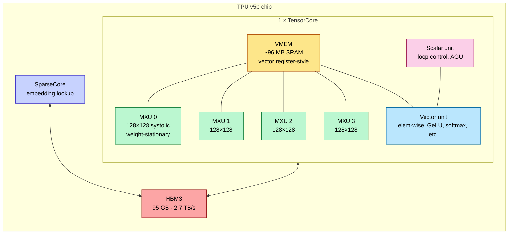
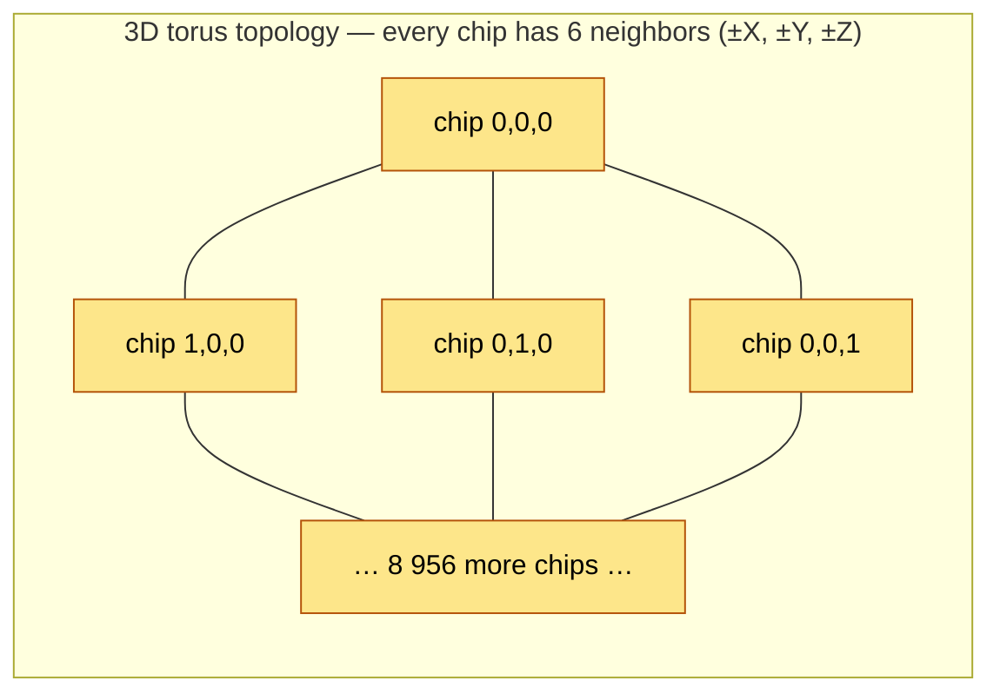
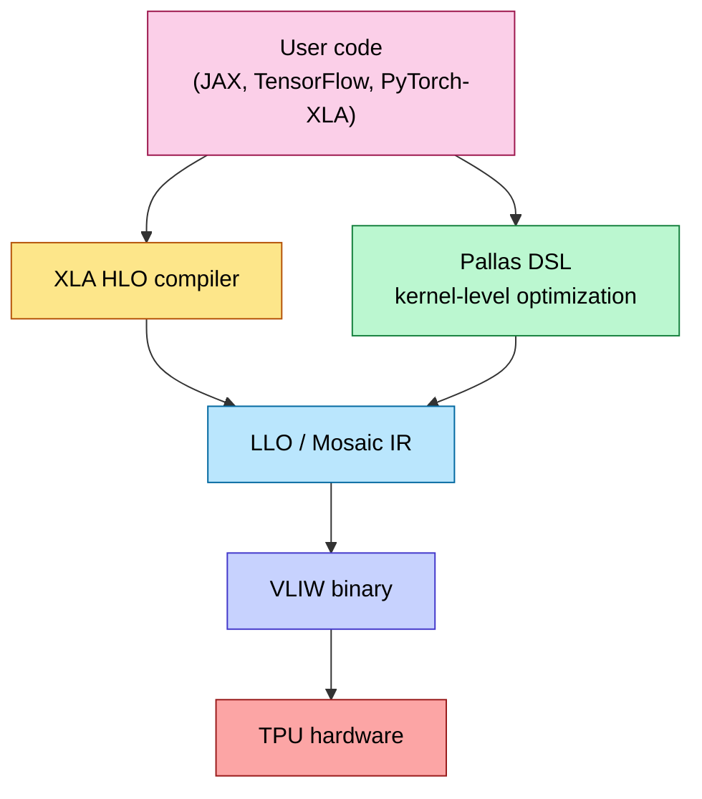
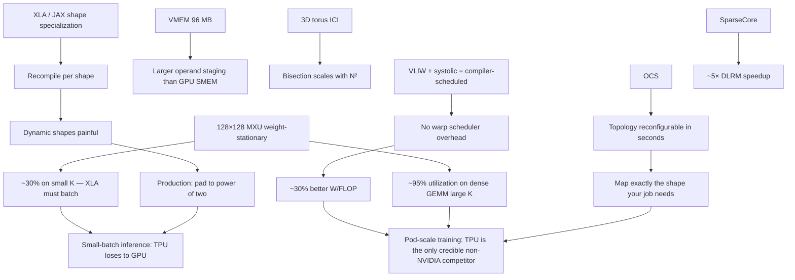

# Google TPU — v4 / v5p / v5e / v6e Trillium / v7 Ironwood

> **Layer:** L3 (non-GPU paradigm).
> **Prerequisites:** [ISA_and_Execution_Model](ISA_and_Execution_Model.md), [Memory_Hierarchy_and_Roofline](Memory_Hierarchy_and_Roofline.md), [L2 Systolic_Arrays_and_Dataflow](../L2_Digital_Design_for_AI/Systolic_Arrays_and_Dataflow.md).
> **Hands off to:** [L4 Networking & Interconnects](../L4_Systems_and_Interconnects/Index.md) (ICI 3D torus + OCS), [L5 Triton_and_Kernels](../L5_Kernels_and_Programming/Triton_and_Kernels.md) (Pallas / JAX).

---

## 0. Why TPUs are different

TPUs throw away the GPU's general-purpose programmability in exchange for **deterministic systolic execution** on dense GEMM. Three structural differences:

1. **VLIW + systolic** instead of SIMT. The compiler statically schedules the MXU; no warp scheduler.
2. **3D torus interconnect (ICI)** instead of fat-tree NVLink. Optimized for collective ops, not all-pairs.
3. **Optical Circuit Switching (OCS)** at the pod scale. Reconfigures the topology on the fly to map jobs to a torus.

The result: the only non-NVIDIA hardware that hosts frontier-model training at >1 000-chip scale today.

---

## 1. Generation map

| Gen | Codename | Year | Memory | BF16/FP8 dense | Topology | Pod max |
|---|---|---|---|---|---|---|
| TPU v4 | – | 2021 | 32 GB HBM2 | 275 BF16 TFLOPS | 3D Torus + OCS | 4 096 chips |
| TPU v5p | "Performance" | 2023 | 95 GB HBM3 | 459 BF16 TFLOPS | 3D Torus + OCS | 8 960 chips |
| TPU v5e | "Efficient" | 2023 | 16 GB HBM2 | 197 INT8 TFLOPS | 2D Torus (no OCS) | 256 chips |
| TPU v6e | Trillium | 2024 | 32 GB HBM3 | ~918 BF16 TFLOPS | 2D Torus | 256 chips |
| TPU v7 | Ironwood | 2025/26 | 192 GB HBM3e (7.37 TB/s) | 4 614 FP8 TFLOPS | 3D Torus + OCS | 9 216 chips |
| TPU 8t | – (training) | 2026 (GA H2) | 216 GB HBM3e (6.53 TB/s) | 12.6 FP4 PFLOPS | ICI 2× Ironwood BW | 9 600 chips (2 PB HBM) |
| TPU 8i | – (inference) | 2026 (GA H2) | 288 GB HBM3e (8.6 TB/s) | 10.1 FP4 PFLOPS | "Boardfly" topology | up to ~1M-TPU cluster fabric |

Ironwood's 9 216-chip pod was the largest single coherent-fabric AI computer in production entering 2026; the TPU 8t superpod extends this to 9 600 chips with 2 PB of shared HBM.

**TPU v8 (announced April 22, 2026 — Cloud Next):** Google split the eighth generation into two chips for the first time — **TPU 8t** for training (Broadcom co-design) and **TPU 8i** for inference/reasoning (MediaTek co-design). Disclosed specs:

- **TPU 8t (training):** 12.6 FP4 PFLOPS, 216 GB HBM3e at 6 528 GB/s. Superpod = 9 600 chips, 2 PB shared HBM, ICI at 2× Ironwood bandwidth, ~121 FP4 EFLOPS per superpod.
- **TPU 8i (inference):** 10.1 FP4 PFLOPS, 288 GB HBM3e at 8 601 GB/s, **384 MB on-chip SRAM** (3× Ironwood) — explicitly targeting KV-cache-resident reasoning/agentic decode. New "Boardfly" network topology plus a **Collectives Acceleration Engine (CAE)** claiming 5× lower synchronization latency; cluster fabric scales toward 1M TPUs.

The split mirrors the broader 2026 trend (NVIDIA Rubin CPX, AWS Trainium vs Inferentia): bifurcating training- and inference-optimized silicon instead of one general-purpose accelerator.

---

## 2. The MXU — Matrix Multiply Unit

### 2.1 Anatomy

A TPU v5p chip has 1 TensorCore + 4 MXUs per TensorCore. Each MXU is a 128×128 weight-stationary systolic array.



### 2.2 Throughput math

Per MXU at 128×128 = 16 384 MACs/cycle = 32 768 FLOPs/cycle. At 1 GHz: **32.7 TFLOPS**.

Per chip (4 MXUs): ~131 TFLOPS BF16 raw. v5p quotes 459 TFLOPS BF16 because it counts the SparseCore + 4× INT8 efficiency. v7 Ironwood: 4 614 TFLOPS FP8 — peaks via larger MXUs (256×256) and FP8 native support.

### 2.3 Why systolic crushes GEMM

Recap from [L2 Systolic_Arrays_and_Dataflow](../L2_Digital_Design_for_AI/Systolic_Arrays_and_Dataflow.md): each weight is reused 128× per fill, cutting operand bandwidth ~128× vs RF-fed MAC. Net: TPU can sustain 95% utilization on large dense GEMM with HBM bandwidth that would limit a GPU to ~40%.

### 2.4 Why systolic loses on small matmuls

Fill+drain = 254 cycles (128×128 array). For K = 64, the array is ½ utilized. K = 16 → ⅛ utilized. Attention with $d = 128$ on per-head matmul has K = 128 → 50% systolic-array utilization.

Workaround: the XLA compiler aggressively *batches* heads into one large matmul (`einsum('bhsd,bhdt->bhst')` becomes a single call), trading per-head latency for amortized array fill.

---

## 3. SparseCore — embedding lookup engine

Modern recommenders (DLRM) and RAG systems do massive embedding lookups: read N random rows from a billion-entry embedding table. Pure HBM bandwidth doesn't help — the access pattern is bandwidth-utilization-poor on random access.

SparseCore is a dedicated coprocessor that:

- Stores embedding indices and gathers.
- Maintains hot-row caches in HBM.
- Runs in parallel with the MXU TensorCore on the same chip.

For DLRM workloads, SparseCore provides ~5× speedup over GPU implementations that lack a comparable engine.

---

## 4. The ICI 3D torus + OCS

### 4.1 ICI links

Each TPU chip has 4–6 ICI links (per generation). Each link: ~50 GB/s unidirectional in v5p, ~100 GB/s in Ironwood.

Topology: **3D torus** of $x \times y \times z$ chips. v5p pod = $20 \times 20 \times 22 = 8\,800$ chips (8 960 with redundancy). Ironwood = larger, similar topology.



Wraparound (torus, not mesh) means edge chips connect to opposite-edge chips, halving worst-case hop distance.

### 4.2 OCS — Optical Circuit Switching

OCS sits between racks and uses MEMS mirrors to physically reconfigure the optical interconnect. Properties:

- **Reconfiguration time:** seconds.
- **Bandwidth:** the same as a direct optical fiber (no electrical switch in the path).
- **Latency:** ~light-speed across rack distances.
- **Energy:** essentially zero (passive mirrors).

What OCS enables:

- Map a job's required topology (say, a 1 024-chip $8 \times 16 \times 8$ slice) onto a *contiguous, dedicated* torus segment.
- Avoid network contention with other jobs.
- Route around failed chips/links by reconfiguring around them.

This is **the** Google differentiator — no other vendor has shipped OCS at scale for AI. NVIDIA InfiniBand is electrical-switched; reconfiguration takes minutes if at all.

### 4.3 Bisection bandwidth

For an $N \times N \times N$ torus, bisection bandwidth = $2N^2 \cdot B_{\text{link}}$ (the $N \times N$ cross-section, two links per chip in cut direction).

For v5p 20×20×22: bisection ≈ $2 \cdot 400 \cdot 50$ GB/s = ~40 TB/s. Ironwood ~120 TB/s.

For comparison: NVL576 (Rubin) has ~1 PB/s bisection — **higher per-chip** but only at the scale-up domain. At pod scale (8 000+ chips), TPU pod bisection is comparable per-chip.

---

## 5. The XLA / JAX / Pallas software stack



**XLA** (Accelerated Linear Algebra) is the user-level compiler. It takes a high-level computation graph (HLO), fuses operations, and emits Mosaic IR. XLA is shape-specialized — it recompiles per shape, but caches.

**Pallas** is the new kernel DSL (analogous to Triton). Pallas kernels can be hand-written in Python with NumPy-like syntax and compiled to MXU+VPU bundles. Used for FlashAttention-equivalent custom kernels on TPU.

**The shape problem:** because XLA recompiles per shape, dynamic-shape workloads (variable sequence lengths) trigger compilation cascades. JAX/Flax models often pad to the nearest power-of-two to amortize.

---

## 6. Sharding and JAX `pjit`

JAX exposes a `pjit` (partition-jit) API where users specify **mesh axes** (e.g., `data`, `model`, `tensor`) and **sharding constraints** (`P('data', 'model')` means "shard this tensor's first axis across the data mesh and second axis across the model mesh"). The compiler infers the rest.

This works because XLA can cleanly map sharding onto the 3D torus: data parallel along one axis, tensor parallel along another, pipeline along the third. NVIDIA equivalent is much more manual (NCCL collective placement).

For an Ironwood pod, a typical sharding: `(data=8, model=4, tensor=8)` × 4 replicas → 1 024 chips per "slice", room for 9 slices in the 9 216-chip pod.

### 6.1 JAX `shard_map` — explicit per-block sharding

`jax.shard_map` is the successor to `pjit` for explicit sharding control in JAX. Unlike `pjit`, which requires abstract mesh specifications where the user declares sharding constraints and the compiler infers per-block behavior, `shard_map` gives **per-block control** over how tensors are partitioned across devices.

**API:** the `@jax.shard_map(mesh, in_specs, out_specs)` decorator wraps a function and specifies exactly how each input and output tensor is split across the named mesh axes:

```python
from jax.sharding import Mesh, PartitionSpec as P
import jax.numpy as jnp

mesh = Mesh(jax.devices(), axis_names=('data', 'model'))

@jax.shard_map(
    mesh,
    in_specs=P('data', 'model'),
    out_specs=P('data', 'model')
)
def weight_sharded_matmul(x, w):
    # x and w are local shards — operate on the per-device block directly
    return jnp.dot(x, w)
```

**Key advantages for TPU:**

- **Direct ICI topology mapping.** Because the user specifies the per-block partitioning, `shard_map` maps directly onto the ICI physical topology. This avoids unnecessary cross-chip communication that `pjit` may introduce when the compiler's abstract sharding decisions don't align with the torus geometry.
- **XLA hint preservation.** `shard_map` hints are preserved through the XLA compilation pipeline rather than being abstracted away. The compiler uses them directly for optimal TPU scheduling — the per-block layout is a first-class compilation input, not an inferred property.
- **Composability.** Multiple `shard_map` calls can be nested with different mesh axes, enabling hybrid parallelism strategies (e.g., TP+DP) without a single monolithic sharding specification.

**Example: TP+DP hybrid parallelism on a 2D mesh.** Consider sharding a weight matrix across a 2D mesh of TPU chips where the `tensor` axis shards the weight columns (tensor parallelism) and the `data` axis replicates across data batches (data parallelism):

```python
mesh = Mesh(devices_2d, axis_names=('data', 'tensor'))

@jax.shard_map(
    mesh,
    in_specs=P('data', 'tensor'),   # activation: batch shard × TP shard
    out_specs=P('data', None)        # output: allreduce over 'tensor' axis
)
def tp_dp_layer(x_shard, w_shard):
    local_out = jax.numpy.dot(x_shard, w_shard)
    return jax.lax.all_reduce(local_out, 'sum', 'tensor')
```

Each TPU chip computes a partial matmul on its local weight shard, then an AllReduce along the `tensor` mesh axis produces the full output. The `data` axis is independent — no cross-chip communication needed.

**Status:** available in JAX 0.4.20+ (released 2024). Recommended for all new code over `pjit`. Google's internal TPU workloads have migrated to `shard_map` as the primary sharding API; `pjit` remains supported for backward compatibility.

---

## 7. Memory hierarchy

| Tier | Capacity | BW | Latency |
|---|---|---|---|
| MXU array (registers) | per-PE | n/a | 1 cycle |
| VMEM | ~96 MB SRAM | ~30 TB/s | ~10 cycles |
| CMEM (compile-time managed) | a few MB | ~5 TB/s | varies |
| HBM | 32–192 GB | 1.6–7.4 TB/s | ~300 cycles |

Note: TPUs have **larger VMEM** (~96 MB on v5p) than GPU SMEM (~256 KB/SM × 128 SMs ≈ 32 MB). This is because the systolic-array dataflow is more bandwidth-efficient out of memory; VMEM acts as the operand-staging buffer for all 4 MXUs collectively.

---

## 8. Where TPUs win and lose

### 8.1 Win

- **Dense GEMM**: 90–95% utilization vs GPU's 65–75%.
- **Pod-scale training**: OCS + 3D torus = 9 216-chip coherent-ish fabric.
- **Energy per FLOP**: VLIW + systolic = no warp-scheduler overhead; ~30% lower W/FLOP than equivalent GPU.
- **Determinism**: same kernel = same wall-clock latency every run.

### 8.2 Lose

- **Small matmul / dynamic shape**: systolic fill+drain wastes; XLA recompilation overhead.
- **Programmability**: no kernel-level CUDA equivalent until Pallas, and Pallas is much less mature.
- **Ecosystem**: less than CUDA. PyTorch on TPU works but with bumps.
- **Sparsity / irregular workloads**: TPU has SparseCore but it's narrower than GPU's general-purpose flexibility.
- **Inference cost economics**: TPU lacks NVL576-style coherent inference fabrics; great for training, behind on disaggregated serving.

---

## 9. End-to-end cause / effect



---

## 10. Numbers to memorize

| Quantity | Value | Why |
|---|---|---|
| TPU v5p MXU dim | 128 × 128 | Per array |
| MXUs per v5p chip | 4 | Per TensorCore |
| TPU v7 (Ironwood) MXU | 256 × 256 | Larger |
| TPU v5p BF16 | 459 TFLOPS | spec |
| TPU v7 FP8 | 4 614 TFLOPS | spec |
| TPU v5p HBM | 95 GB · 2.7 TB/s | HBM3 |
| TPU v7 HBM | 192 GB · 7.37 TB/s | HBM3e |
| TPU v5p pod | 8 960 chips | 3D torus + OCS |
| TPU v7 pod | 9 216 chips | spec |
| ICI link BW (v5p) | ~50 GB/s/link | unidirectional |
| ICI link BW (Ironwood) | ~100 GB/s | unidirectional |
| TPU v5p VMEM | ~96 MB SRAM | per chip |
| OCS reconfig time | seconds | MEMS mirrors |
| TPU dense-GEMM utilization | 85–95% | vs GPU's 65–75% |
| TPU small-matmul utilization | ~30% | systolic fill/drain |
| TPU ridge point (v5p BF16) | ~170 FLOP/B | π/β |
| TPU compilation cost | seconds–minutes | XLA per shape |
| TPU SparseCore DLRM speedup | ~5× | vs GPU |

---

## 11. Worked interview problems

**Q1.** *Why does TPU OCS matter for production AI?*

OCS lets Google reconfigure the inter-rack interconnect to give each job a contiguous, dedicated torus slice. Three benefits: (a) **predictable performance** — no inter-job network contention; (b) **fault tolerance** — a failed link just gets routed around; (c) **flexible topology** — small jobs get $4×4×4$, big jobs get $32×32×32$, on the same physical hardware. NVIDIA's electrical-switched IB cannot do this — every job sees the same fabric and shares bandwidth with neighbors.

**Q2.** *Estimate TPU v5p performance on a per-head attention with $S=2048$, $d=128$.*

Per-head $Q \cdot K^T$: shape $S \times S$. Compute = $2 S^2 d = 1.07 \times 10^9$ FLOPs. With $M = S = 2048$, $K = 128$, $N = S = 2048$ → systolic K is 128, fits the MXU once with no fill loss; 2 048 / 128 = 16 sub-tiles in M, similar in N. Utilization should be ~85% on the array. Actual measured: ~50% because XLA softmax fusion adds non-MXU cycles. Pallas-based FlashAttention-equivalent recovers the gap.

**Q3.** *Why are TPUs commonly chosen for LLM pretraining but not for inference?*

Pretraining = dense GEMM over fixed shapes on long batches. Plays to TPU strengths: 95% MXU utilization, predictable, OCS scales to 9 K chips. Inference = variable batch + variable sequence + small batches at low TTFT. TPU loses on (a) small-shape MXU underutilization, (b) recompilation per dynamic shape, (c) lack of NVL72-style fabric for MoE EP at scale, (d) inference-engine ecosystem (vLLM/SGLang/TRT-LLM are CUDA-first).

**Q4.** *Why does Pallas exist when XLA already targets TPU?*

XLA is operator-level — it fuses + tiles known patterns (matmul, conv, softmax). For non-standard kernels (FlashAttention, custom MoE routing, exotic quantization), XLA underperforms because it can't match a hand-tuned algorithm. Pallas exposes a kernel-level Python DSL that compiles to direct VLIW bundles, letting users write FlashAttention-equivalent kernels at GPU-Triton-style productivity. As of 2026, Pallas is mainstream for advanced TPU users.

**Q5.** *Why is TPU's v5e ("Efficient") TF32 throughput much lower than v5p ("Performance")?*

v5e is cost-optimized for inference: smaller MXU count per chip, no OCS, smaller HBM. Per-chip throughput is ~½ of v5p. The bet: at ~½ price, $/TFLOP is comparable, and inference doesn't need the OCS-scale topology. v5e is what hosts most Google production inference today; v5p/v7 are reserved for training.

---

## 12. References

- Jouppi et al., *In-Datacenter Performance Analysis of a Tensor Processing Unit*, ISCA 2017.
- Jouppi et al., *Ten Lessons From Three Generations Shaped Google's TPUv4i*, ISCA 2021.
- Jouppi et al., *TPU v4 / v5 / Ironwood Architecture*, Hot Chips 2024–2025.
- *XLA HLO Reference*, Google.
- *Pallas: Custom Kernels for TPUs*, Google open-source docs.

---

**Up the stack:** [L4 Networking & Interconnects](../L4_Systems_and_Interconnects/Index.md), [L7 Distributed Training](../L7_Training_Stack/Index.md).
**Down the stack:** [ISA_and_Execution_Model](ISA_and_Execution_Model.md), [L2 Systolic_Arrays_and_Dataflow](../L2_Digital_Design_for_AI/Systolic_Arrays_and_Dataflow.md).
