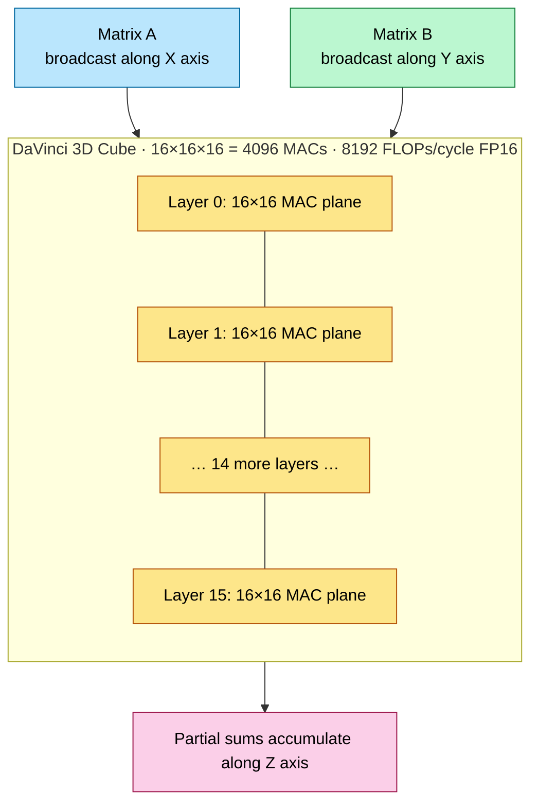
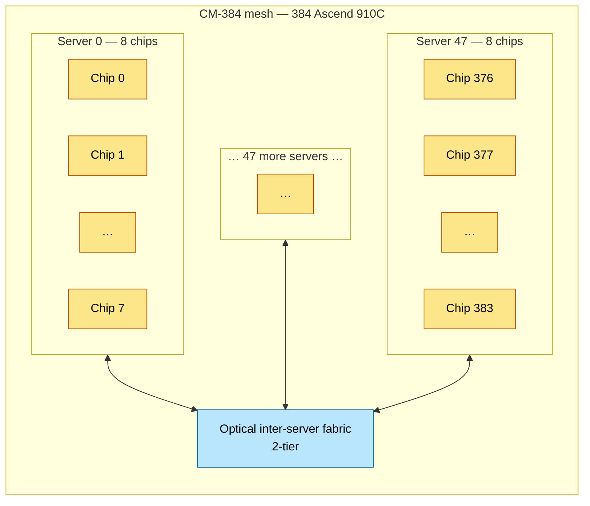
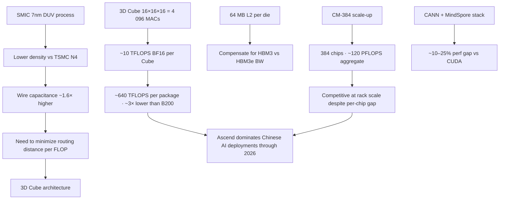

# Huawei Ascend — 910B / 910C / 910D

> **Layer:** L3.
> **Prerequisites:** [GPU_Architecture](GPU_Architecture.md), [L2 Systolic_Arrays_and_Dataflow](../L2_Digital_Design_for_AI/Systolic_Arrays_and_Dataflow.md).
> **Hands off to:** [L4 Networking & Interconnects](../L4_Systems_and_Interconnects/Index.md) (HCCS), [Accelerator_Landscape_2026](Accelerator_Landscape_2026.md).

---

## 0. The geopolitical context

Huawei is on the US Entity List → no access to TSMC EUV → Ascend is built on **SMIC's 7 nm-class node** (DUV multi-patterning). This is the *only* fully-vertically-integrated, non-US AI ecosystem deployed at frontier-model scale in 2026.

The architecture compensates for the older process node with:

1. **Aggressive 2.5D / 3D packaging** to aggregate silicon area.
2. **Lower per-FLOP frequency** (~1.2 GHz vs ~1.6 GHz on Blackwell) to keep within thermal/power budgets.
3. **3D Cube Matrix Engine** that minimizes intra-chip data-movement distance, reducing dynamic power $P = \alpha C V^2 f$.
4. **Wide HCCS interconnect** (similar to NVLink) for in-domain coherency.

Result: per-chip throughput ~1/3 of B200, but rack-scale CM-384 (384-chip mesh) delivers competitive aggregate inference throughput on Chinese-ecosystem deployments.

---

## 1. Generation map

| Gen | Year | Process | Architecture | Memory | BF16 dense (TFLOPS) | Topology | Domain |
|---|---|---|---|---|---|---|---|
| Ascend 910 | 2019 | TSMC 7nm+ | DaVinci v1 | 32 GB HBM2 | 256 | HCCS mesh | 8 |
| Ascend 910B | 2023 | SMIC 7nm | DaVinci v2 | 64 GB HBM2e | ~300 | HCCS | 8 |
| Ascend 910C | 2024–25 | SMIC 7nm dual-die | DaVinci v3 | 128 GB HBM3 | ~150 (per die, 300 dual) | HCCS / CM-384 | 384 |
| Ascend 910D | 2026 | SMIC 5nm-class multi-die | DaVinci-Next | 256+ GB HBM3e | ~300+ (FP8, est) | HCCS-Next | 384–1024 |

The Ascend 910C is the production part for 2024–2026; 910D is on the roadmap pending SMIC's 5 nm ramp.

---

## 2. The DaVinci AI Core

### 2.1 The 3D Cube Matrix Engine

Unlike NVIDIA's small-tile 2D tensor cores or TPU's large 2D MXU, DaVinci uses a **3D Cube** — a $16 \times 16 \times 16$ array of MAC cells:

Operation:

- $A$ broadcasts horizontally (X-axis): one row of A into all 16 columns per layer.
- $B$ broadcasts vertically (Y-axis): one column of B into all 16 rows per layer.
- Each layer's $16 \times 16 = 256$ MAC cells produce an $A_i B_j$ partial product.
- Partial sums accumulate along the Z-axis (16 layers stacked).

Total: $16 \times 16 \times 16 = 4\,096$ MACs per cycle = 8 192 FLOPs/cycle at FP16. At ~1.2 GHz: ~10 TFLOPS BF16 per Cube.

### 2.2 Why 3D, not 2D?

The 3D structure minimizes the Manhattan distance between operand SRAM and the MAC sites. For a 2D systolic array, operands travel up to $D$ wires (where $D$ is the array side). For a 3D cube, max distance is $D$ on any one axis but the *third* dimension reduces operand-fetch routing by half.

At SMIC 7 nm, wire capacitance is ~1.6× higher than TSMC N4 (longer wires due to lower density). Reducing routing distance by 30% directly cuts dynamic power $\alpha C V^2 f$ by ~30%, recovering the thermal budget needed to fit a useful chip.

### 2.3 AI Core composition

Each Ascend 910C die has multiple AI Cores. Per AI Core:

- 1 × Cube Engine (16×16×16).
- 1 × Vector Engine (SIMD ALU for elementwise ops).
- 1 × Scalar Engine (loop control, address generation).
- L1 buffer (~256 KB).
- L0 buffers feeding the Cube directly.

The 910C has 32 AI Cores per die × 2 dies = 64 AI Cores per package. Theoretical peak: 64 × ~10 TFLOPS = ~640 BF16 TFLOPS dense. **Spec-sheet value is ~300 TFLOPS.** The gap arises from: (a) the dual-die package cannot sustain ~1.2 GHz across all 64 Cubes simultaneously — thermal and power delivery constraints force clock-frequency reduction (~750–900 MHz typical sustained); (b) cross-die synchronization overhead on the SMIC 7nm interposer adds stalls that reduce achievable throughput; (c) the quoted ~300 TFLOPS reflects a realistic sustained envelope with a ~0.45–0.50 utilization factor, which is typical for multi-die designs on a constrained process node. Report the ~300 TFLOPS figure for comparisons; the ~640 TFLOPS is the architectural ceiling that real silicon cannot reach.

---

## 3. Memory hierarchy

| Tier | Capacity | BW (per package) | Latency |
|---|---|---|---|
| Cube registers | per-MAC | n/a | 1 cycle |
| L0 buffer | per-Cube ~32 KB | high | ~2 cycles |
| L1 buffer | per-AI Core ~256 KB | ~3 TB/s | ~10 cycles |
| L2 buffer | per-die ~64 MB | ~5 TB/s | ~50 cycles |
| HBM | 128 GB HBM3 | 3.2 TB/s | ~400 cycles |

L2 buffer is *huge* (64 MB per die, 128 MB per dual-die package) — much larger than B200's 50 MB L2. This compensates for HBM3 bandwidth that's ~½ of HBM3e.

---

## 4. CANN software stack

CANN (Compute Architecture for Neural Networks) is Huawei's CUDA-equivalent. Layers:

| CANN component | NVIDIA equivalent |
|---|---|
| ACL (Ascend Computing Language) | CUDA Runtime |
| CCE (CANN Custom Engine) compiler | nvcc |
| HCCL (Huawei Collective Comm Lib) | NCCL |
| MindSpore | PyTorch (deep integration) |
| MindIE | TensorRT |
| TBE (Tensor Boost Engine) | cuDNN |
| AscendC kernel DSL | CUDA C / Triton |

CANN is the most mature non-CUDA stack outside ROCm. PyTorch on Ascend works via the `torch_npu` plugin; loss is ~10–25% vs same-precision CUDA at the kernel level (compiler is less optimized but improving rapidly).

---

## 5. HCCS and CM-384 fabric

### 5.1 HCCS (Huawei Cache Coherent System)

Per-chip: 7 HCCS links × ~56 GB/s/link = ~392 GB/s/chip. Domain: 8 chips per server (similar to xGMI on AMD).

### 5.2 CM-384 cluster mesh

To scale beyond 8, Huawei built **CM-384** — a 384-chip rack-scale mesh fabric. Topology:

- 48 servers × 8 chips = 384 chips.
- Each server has internal HCCS (8-chip coherent).
- Servers connect via a **2-tier optical fabric** for inter-server traffic.
- Aggregate domain: 384 chips treated as one logical training cluster.

Aggregate CM-384 capacity:

- ~120 PFLOPS BF16 dense (384 × ~300 / 1 000)
- ~50 TB HBM3 (384 × 128 GB / 1 000)
- Sufficient to host a Llama-3-405B-class model in BF16 with TP/PP across the mesh.

### 5.3 Comparison with NVL72 / Helios

| | CM-384 | NVL72 (B200) | Helios (MI455X) |
|---|---|---|---|
| Chip count | 384 | 72 | 72 |
| Per-chip BF16 TFLOPS | ~300 | ~2 250 | ~5 050 |
| Aggregate BF16 PFLOPS | ~120 | ~162 | ~360 |
| Per-chip HBM | 128 GB HBM3 | 192 GB HBM3e | 432 GB HBM4 |
| Aggregate HBM | ~50 TB | ~14 TB | ~31 TB |
| Domain coherency | partial (server-level fully, mesh logically) | fully coherent NVL | fully coherent UALink |

CM-384 wins on aggregate HBM capacity (largest in 2026), loses on per-chip throughput. The bet: large memory + many chips compensates for slower per-chip silicon.

---

## 6. End-to-end cause / effect

---

## 7. Numbers to memorize

| Quantity | Value | Why |
|---|---|---|
| Ascend 910C process | SMIC 7nm | Geopolitical |
| 910C die | dual-die (2 dies) | Reticle workaround |
| 910C HBM | 128 GB HBM3 | spec |
| 910C HBM BW | 3.2 TB/s | spec |
| 910C BF16 dense | ~300 TFLOPS (per package) | spec |
| AI Cores per 910C package | 64 (32 per die) | structure |
| DaVinci 3D Cube | 16×16×16 = 4 096 MACs | per Cube |
| Per-Cube throughput | ~10 TFLOPS BF16 at 1.2 GHz | derived |
| L2 buffer per die | ~64 MB | larger than B200 L2 |
| HCCS per chip | ~392 GB/s | 7 links × 56 GB/s |
| HCCS coherent domain | 8 chips | per server |
| CM-384 chip count | 384 | rack scale |
| CM-384 aggregate BF16 | ~120 PFLOPS | spec |
| CM-384 aggregate HBM | ~50 TB | largest in 2026 |
| Ascend 910D HBM | 256 GB HBM3e (proj) | future |

---

## 8. Worked interview problems

**Q1.** *Why does the DaVinci 3D Cube help on SMIC 7nm specifically?*

SMIC's 7 nm has ~1.6× higher wire capacitance vs TSMC N4. Dynamic power = $\alpha C V^2 f$ — wire capacitance dominates at high frequency. The 3D Cube reduces operand-routing distance by ~30% relative to a 2D systolic array of equivalent throughput. Result: ~30% lower dynamic power for the same FLOPS, fitting within thermal budget. On TSMC N4, this effect is smaller and the 2D approach (NVIDIA, AMD, TPU) is fine; on SMIC 7nm, 3D is necessary.

**Q2.** *Estimate CM-384's aggregate FP8 throughput vs an NVL72 B200 rack.*

CM-384: 384 × ~600 TFLOPS FP8 (estimated, given 910C lacks native FP8) ≈ 230 PFLOPS. NVL72 B200: 72 × 4 500 = 324 PFLOPS. NVL72 wins ~40% on raw FP8 throughput, but CM-384 has ~3.5× the HBM (50 TB vs 14 TB). For inference (memory-bound), CM-384 can serve more concurrent requests; for training (compute-bound), NVL72 is faster.

**Q3.** *Why is the 910C's per-package throughput so much lower than B200's?*

Three multiplicative factors: (a) **process** — SMIC 7 nm has ~½ the transistor density of TSMC N4 → fewer Cubes fit per die; (b) **frequency** — 910C runs ~1.2 GHz vs B200's ~1.6 GHz, ~25% throughput delta; (c) **format** — 910C native is BF16; B200's FP4 doubles peak again. Combined: ~3× throughput gap at iso-precision, ~6× at FP4.

**Q4.** *What's the path forward for Ascend if SMIC can't access EUV?*

Two paths: (1) **Multi-patterning DUV all the way** — SMIC has demonstrated 5 nm-class via aggressive double-patterning, at lower yield. Ascend 910D is built on this. Cost is yield economics worse than TSMC by ~3×. (2) **Architectural innovation** — bigger packages (more dies stitched), more aggressive 3D stacking (logic-on-logic via SoIC equivalents), spatial-dataflow techniques. Long-term: SMIC EUV indigenization (5+ year horizon) or moving to non-CMOS (carbon nanotubes, tunnel FETs — research only).

**Q5.** *Why does CANN's PyTorch performance lag CUDA by 10–25%?*

Three reasons: (a) **Compiler maturity** — Huawei's CCE compiler is ~5 years behind nvcc in optimization passes; common patterns work, exotic kernels lose; (b) **Library coverage** — TBE has ~80% of cuDNN's primitive coverage; missing primitives fall back to slower vector-engine paths; (c) **Hardware** — DaVinci's 3D Cube is best for square matmuls; non-square shapes need padding or kernel restructuring.

---

## 9. References

- Liao, Bai et al., *Ascend Native AI Software Stack*, Hot Chips 2023.
- *Ascend 910 Architecture Overview*, Huawei white papers (2019–2024).
- *MindSpore Documentation*, Huawei.
- SMIC technology disclosures (limited; mostly inferred from Ascend benchmarks).

---

**Up the stack:** [L4 Networking & Interconnects](../L4_Systems_and_Interconnects/Index.md), [Accelerator_Landscape_2026](Accelerator_Landscape_2026.md).
**Down the stack:** [GPU_Architecture](GPU_Architecture.md), [L2 Systolic_Arrays_and_Dataflow](../L2_Digital_Design_for_AI/Systolic_Arrays_and_Dataflow.md).
