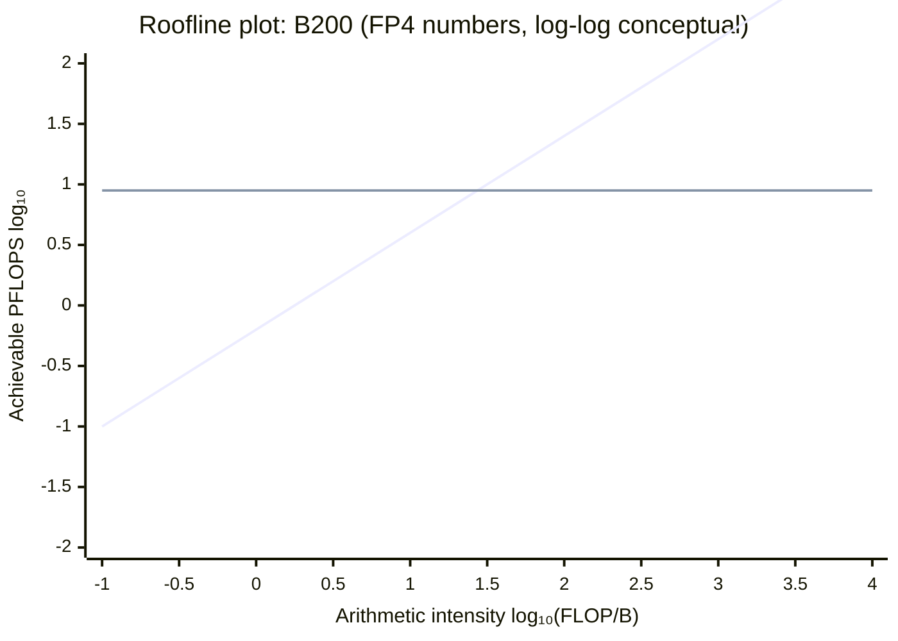
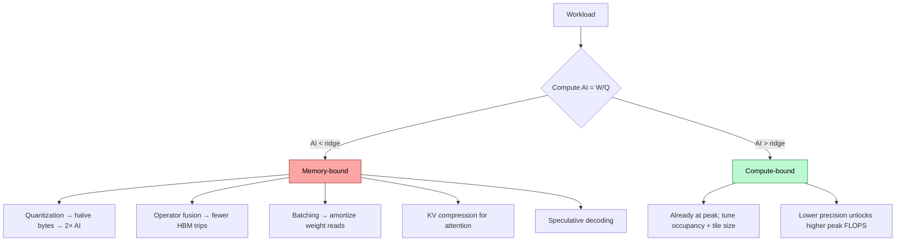
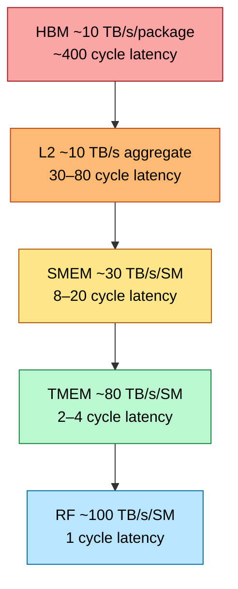
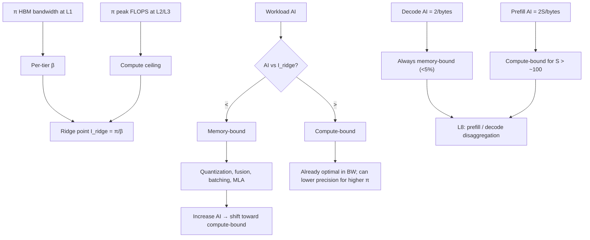

# Memory Hierarchy & Roofline — The Universal Performance Model

> **Layer:** L3 (analytical-framework page).
> **Prerequisites:** [GPU_Architecture](GPU_Architecture.md), [L1 HBM_Deep_Dive](../L1_Packaging_and_Memory/HBM_Deep_Dive.md), [L2 On_Chip_Memory_Hardware](../L2_Digital_Design_for_AI/On_Chip_Memory_Hardware.md).
> **Hands off to:** every per-vendor page in L3, every kernel page in L5, and the entire L8 inference layer.

---

## 0. Why this page exists at L3

The roofline model is the single most important analytical tool in AI-systems engineering. It predicts:

- Whether a workload is compute-bound or memory-bound on a given chip.
- How precision changes (FP16 → FP8 → FP4) affect achievable throughput.
- Why decode is fundamentally limited at <5% of peak FLOPS regardless of how good your kernel is.
- Which memory tier optimizations actually help and which are theatrics.

Every other page in this layer (Blackwell, MI355, TPU, etc.) gives you $\pi$ and $\beta$. This page gives you the **map** that turns those numbers into achievable performance.

---

## 1. The roofline model

### 1.1 The fundamental inequality

Achievable performance $P$ for a kernel on a given hardware tier:

$$
P \;=\; \min\!\big(\pi,\; I \cdot \beta\big)
$$

where:

- $\pi$ — peak compute throughput (FLOPS).
- $\beta$ — peak memory bandwidth at the bottleneck tier (B/s).
- $I$ — arithmetic intensity (FLOP/B), defined as $W/Q$ for $W$ ops and $Q$ bytes moved.

The minimum is the **performance ceiling**. Real performance is always at or below; the gap is "the rest of the architecture not getting in your way" (warp scheduling, instruction issue, memory-system interference, etc.).

### 1.2 The ridge point

$$
I_{\text{ridge}} \;\equiv\; \frac{\pi}{\beta}
$$

Geometrically, this is where the diagonal $I \cdot \beta$ crosses the horizontal $\pi$ ceiling. Workloads with $I < I_{\text{ridge}}$ are **memory-bound**; those with $I > I_{\text{ridge}}$ are **compute-bound**.

(Conceptual log-log roofline for B200. Actual ridge: $\pi/\beta = 9\,000\text{ TFLOPS}/8\text{ TB/s} = 1\,125$ FLOP/B.)

Below the ridge: $P = I \cdot \beta$ — every byte of HBM bandwidth turns into $I$ FLOPs. To go faster, increase $I$ or $\beta$.
Above the ridge: $P = \pi$ — flat. Cannot exceed the compute ceiling regardless of $I$.

### 1.3 Per-tier rooflines

The roofline is *per memory tier*: HBM, L2, SMEM, RF each have their own $\beta$, hence their own ridge. A kernel can be HBM-bound but L2-compute-bound. The HBM roofline is what dominates LLM serving; the SMEM roofline matters for kernel-internal optimizations (FlashAttention).

---

## 2. The ridge points of every major chip

| Chip | $\pi$ (FP16/BF16, TFLOPS) | $\pi$ (FP8) | $\pi$ (FP4) | $\beta$ HBM (TB/s) | $I_{\text{ridge}}$ FP16 | $I_{\text{ridge}}$ FP8 | $I_{\text{ridge}}$ FP4 |
|---|---|---|---|---|---|---|---|
| H100 SXM5 | 990 | 1 980 | – | 3.35 | 295 | 591 | – |
| H200 | 990 | 1 980 | – | 4.8 | 206 | 412 | – |
| B200 | 2 250 | 4 500 | 9 000 | 8.0 | 281 | 562 | 1 125 |
| B300 | 2 700 | 5 400 | 10 800 | 8.0 | 337 | 675 | 1 350 |
| Rubin R100 (proj.) | 12 500 | 25 000 | 50 000 | 22.0 | 568 | 1 136 | 2 273 |
| MI300X | 1 300 | 2 600 | – | 5.3 | 245 | 491 | – |
| MI355X | 5 050 | 10 100 | 20 100 | 8.0 | 631 | 1 263 | 2 513 |
| TPU v5p | 459 (BF16) | – | – | 2.7 | 170 | – | – |
| TPU v7 Ironwood | 2 307 (BF16) | 4 614 | – | 7.37 | 313 | 626 | – |
| Cerebras WSE-3 | 125 000 (FP16) | – | – | 21 000 (SRAM) | **6** | – | – |

Cerebras inverts the roofline: with on-die SRAM at 21 PB/s instead of HBM at TB/s, the ridge point collapses to 6 FLOP/B — almost every kernel becomes compute-bound. This is the entire reason wafer-scale exists.

---

## 3. Worked AI workload analyses

### 3.1 Dense GEMM (compute-bound regime)

GEMM $C = A B$ with $A \in \mathbb{R}^{M\times K}$, $B \in \mathbb{R}^{K\times N}$:

- $W = 2 M N K$ FLOPs.
- $Q = (M K + K N + M N) \cdot \text{bytes}$ (loads of A, B; stores of C).

Arithmetic intensity:

$$
I \;=\; \frac{2 M N K}{M K + K N + M N} \cdot \frac{1}{\text{bytes}}
$$

For square $M = N = K = 8192$, FP16 (2 B): $I = 2 \cdot 8192 / 3 \cdot 2 = 2730$ FLOP/B. Vastly above any modern ridge → compute-bound. B200 BF16 effective: ~70% of 2 250 = 1 575 TFLOPS.

For small matrices ($M=N=K=128$), FP16: $I = 2 \cdot 128 / 3 \cdot 2 = 42$ FLOP/B. Below B200's BF16 ridge of 281 → memory-bound.

### 3.2 LLM decode (catastrophic memory-bound regime)

Decode = matmul of a $1 \times d$ activation against a $d \times d$ weight matrix per layer, repeated for every layer.

For one decode token of an $N$-parameter model:

- $W = 2 N$ FLOPs.
- $Q = N \cdot \text{bytes}_{\text{weight}}$ (weights streamed once per token).

$$
I \;=\; \frac{2 N}{N \cdot \text{bytes}} \;=\; \frac{2}{\text{bytes}}
$$

| Precision | I (FLOP/B) |
|---|---|
| FP16 | 1.0 |
| FP8 | 2.0 |
| FP4 | 4.0 |

Below ANY chip's ridge by 100×. Effective decode performance:

$$
P_{\text{decode}} \;=\; I \cdot \beta \;=\; \text{constant in HBM bandwidth}
$$

For a 70 B FP8 model on B200: $P = 2 \cdot 8 = 16$ TFLOPS effective vs 4 500 peak ⇒ **0.36% utilization**. Tokens/s = $\beta / N \cdot \text{bytes} = 8 \text{ TB/s} / 70 \text{ GB} = 114$ tok/s.

This is the entire L8 problem. Every "speed up decode" technique (KV compression, MQA/GQA/MLA, speculative decoding, batching) is a way to *increase $I$* by reusing weight reads across more tokens / requests.

### 3.3 LLM prefill (compute-bound regime)

Prefill processes $S$ tokens against the same weights:

- $W = 2 N S$ FLOPs.
- $Q = N \cdot \text{bytes}$ (weights loaded once for the batch).

$$
I \;=\; \frac{2 N S}{N \cdot \text{bytes}} \;=\; \frac{2 S}{\text{bytes}}
$$

For $S = 4 096$ FP8: $I = 2 \cdot 4096 / 1 = 8 192$ FLOP/B. **Compute-bound**. B200 FP8 effective: ~70% of 4 500 ≈ 3 150 TFLOPS. Prefill is the easy part.

### 3.4 The decode/prefill bifurcation drives serving architecture

Different rooflines per phase ⇒ different optimal hardware ⇒ disaggregated serving (L8). Prefill needs FLOPS; decode needs HBM bandwidth. Mixing them on the same GPU creates head-of-line blocking. NVIDIA Dynamo, llm-d, Mooncake, DistServe, Splitwise all separate prefill and decode pools.

### 3.5 Attention (FlashAttention regime)

Attention is the interesting middle case. Naïve implementation:

- $W = O(S^2 d)$ FLOPs for sequence length $S$, head dim $d$.
- $Q = O(S^2)$ HBM bytes for the $S \times S$ score matrix.

$I = O(d) \approx 64$ — borderline compute-bound on H100 (ridge ~295), memory-bound on B200 FP4 (ridge ~1 125).

FlashAttention's trick: fuse the softmax into the matmul, avoid materializing the $S \times S$ score matrix in HBM. New:

- $W = O(S^2 d)$ unchanged.
- $Q = O(S d)$ — only Q/K/V/O moved to HBM.

$I = O(S/2)$ — for $S = 2048$, $I = 1024$ FLOP/B → compute-bound everywhere. This is why FlashAttention exists: it converts an HBM-bound algorithm into an SMEM-bound one.

---

## 4. The roofline-shifting toolkit

To move a kernel from memory-bound to compute-bound, increase $I$ via:

### 4.1 Quantization (decrease bytes-per-element)

Dropping precision from FP16 → FP8 → FP4 doubles $I$ at each step (since $I \propto 1/\text{bytes}$). For decode this is the single biggest lever:

- 70B model FP16: $I = 1$, decode = 4 TFLOPS effective.
- 70B model FP8: $I = 2$, decode = 8 TFLOPS effective.
- 70B model FP4: $I = 4$, decode = 16 TFLOPS effective.

Compute-utilization is still tiny but absolute throughput doubles.

### 4.2 Operator fusion (decrease HBM round-trips)

Naïve: matmul → write to HBM → load from HBM → GeLU → write. $Q = 3 M N$ for the activation alone.

Fused: matmul → in-register GeLU → write final. $Q = M N$ — eliminate two HBM round-trips.

$I$ rises 3×; the workload shifts toward compute-bound. Triton / cudnn / cuBLASLt all do this fusion automatically for common epilogues.

### 4.3 Tiling (capture data in faster tier)

Block the kernel so the working set fits in L2 or SMEM. The relevant $\beta$ becomes the higher tier's bandwidth, raising effective $\pi/\beta$ on the *outer* loop while staying compute-bound on the inner loop.

For GEMM tiled to fit SMEM: outer loop sees $\beta_{\text{HBM}}$ and a coarse arithmetic intensity proportional to $K_{\text{outer}}$; inner loop sees $\beta_{\text{SMEM}}$ and is always compute-bound.

### 4.4 Batching (amortize across requests)

For decode, batching $B$ requests through the same weight read changes:

- $W = 2 N B$ (per step).
- $Q = N \cdot \text{bytes}$ (weights loaded once).

$I = 2B / \text{bytes}$. At $B = 32$ FP8: $I = 64$ — still memory-bound on B200 (ridge 562) but **64× higher than batch-1**, so 64× more tokens/sec aggregate.

This is the entire reason continuous batching exists.

### 4.5 KV-cache compression (MLA, MQA, GQA)

For attention specifically, KV cache reads dominate decode HBM traffic at long context. MLA (DeepSeek) cuts KV bytes by 30×, raising $I$ on the decode path proportionally.

### 4.6 Speculative decoding

Verify $K$ candidate tokens in one weight read; if $\alpha$ are accepted, you got $\alpha K$ tokens for one weight load. Effective $I$ rises by $\alpha K$.

---

## 5. The roofline visualized for decision-making

---

## 6. Memory tiers re-examined

### 6.1 Bandwidth ratios

The 10× per-tier rule. Each tier-shift is a step-function in throughput. Kernel design = choreographing *which tier each access lands in*.

### 6.2 The implicit roofline per tier

For SMEM-resident operands, $\beta_{\text{SMEM}} = 30$ TB/s/SM, $\pi_{\text{SM}} = 100$ TFLOPS at FP16 → $I_{\text{ridge,SMEM}} \approx 3$ FLOP/B. Trivially compute-bound. So once you're tile-resident in SMEM, throughput is bounded by tensor-core arithmetic, not memory.

This is *why* tiling works.

---

## 7. End-to-end cause / effect

---

## 8. Numbers to memorize

| Quantity | Value | Why |
|---|---|---|
| H100 ridge point FP16 | 295 FLOP/B | $\pi/\beta$ |
| H100 ridge point FP8 | 591 FLOP/B | Doubled by precision |
| B200 ridge point FP4 | 1 125 FLOP/B | Frontier reference |
| B300 ridge point FP4 | 1 350 FLOP/B | Slightly higher π |
| Rubin ridge point FP4 | ~2 273 FLOP/B | Wider gap, more challenging |
| Cerebras ridge point FP16 | ~6 FLOP/B | SRAM only — flips the model |
| Decode AI FP16 | 1 FLOP/B | $2/\text{bytes}$ |
| Decode AI FP8 | 2 FLOP/B | doubled |
| Decode AI FP4 | 4 FLOP/B | doubled again |
| Prefill AI (S=4096) FP8 | ~8 192 FLOP/B | compute-bound |
| FlashAttention AI | $O(S/2)$ | 1 024 at S=2048 |
| Tiled-GEMM SMEM ridge | ~3 FLOP/B | trivially compute-bound |
| Continuous batching at B=32 FP8 | I = 64 FLOP/B | 32× decode tokens/s |
| MLA KV reduction | 30× | Effective decode AI ×30 |
| Speculative-decode gain | $\alpha K$ on AI | typically 2–4× |

---

## 9. Worked interview problems

**Q1.** *A kernel reports 2 TFLOPS on B200 (peak 4 500 TFLOPS FP8). Memory-bound or compute-bound? How do you tell?*

Achieved P = 2 TF; π = 4.5 PF. Way below peak ⇒ **suspected memory-bound**. To confirm, measure $Q$ (bytes moved). If $Q$ corresponds to ~0.25 TB/s of HBM (2 TF / 8 ridge ≈), and $\beta_{\text{HBM}} = 8$ TB/s, then BW utilization is only 3% → **neither bound** — kernel has issue/scheduling overhead. If $Q$ shows 7+ TB/s of HBM traffic → bw-bound, peak in this regime. Use Nsight Compute to get $Q$.

**Q2.** *Compute decode tokens/sec for a 405B FP8 model on B200 with 192 GB HBM.*

Weights = 405 GB → doesn't fit on one B200. Need 3+ B200 in TP. Tokens/sec per replica: $\beta / N\text{bytes} = 8 \text{ TB/s} / 405 \text{ GB} = 19.7$ tok/s. With TP=4 (one B200 holds ~100 GB of weights), each B200 reads ~100 GB/token but bandwidth scales: tokens/sec = 8 / 101 = ~79 tok/s. Per-replica throughput ~79 tok/s; at batch 64: 5 056 tok/s aggregate.

**Q3.** *Why doesn't doubling HBM bandwidth from 8 TB/s to 16 TB/s double prefill throughput?*

Prefill is compute-bound (AI = 8 192 ≫ ridge 562). Bandwidth is not the bottleneck. $P = \pi$ regardless of $\beta$. Doubling β shifts the ridge from 562 to 281 — a kernel formerly at AI = 400 (memory-bound) becomes compute-bound, but a kernel at AI = 8 192 was already compute-bound and gets nothing. Bandwidth doubling helps decode (linear gain) and short-context attention; doesn't help prefill or large GEMM.

**Q4.** *What's the AI of FlashAttention v2 forward on Hopper for $S = 4096$, $d = 128$?*

FA-2 keeps Q, K, V, O in HBM; everything else in SMEM. Per-block: load $B_r d$ Q + $S d$ K + $S d$ V; compute attention. Across whole sequence: load $S d$ Q (1×), full K and V $S/B_r$ times. Total Q ≈ $3 S d$ bytes loaded, vs $W \approx 4 S^2 d$ FLOPs. AI ≈ $4 S^2 d / (3 S d \cdot 2) = 2 S / 3$ ≈ 2 730. Way above H100 ridge → compute-bound. Hence FA-2 hits 70%+ utilization on H100.

**Q5.** *On Cerebras WSE-3 with ridge 6, why is utilization still not 100% on every kernel?*

Three reasons: (a) **inter-PE communication overhead** — even SRAM-only ops require routing across the 2D mesh, adding NoC cycles. (b) **Tile size mismatch** — fixed PE granularity wastes cycles when the kernel doesn't divide evenly. (c) **MemoryX streaming** — large models exceed on-die 44 GB; weights must stream from external MemoryX nodes, reintroducing a slower memory tier. Achieved utilization on 70B inference: ~50–70%, very impressive for the workload but not "all kernels at 100%".

---

## 10. References

- Williams, Waterman, Patterson, *Roofline: An Insightful Visual Performance Model for Multicore Architectures*, CACM 2009 — original paper.
- *FlashAttention: Fast and Memory-Efficient Exact Attention with IO-Awareness*, Dao et al., NeurIPS 2022 — applied roofline.
- Patterson & Hennessy, *Computer Architecture: A Quantitative Approach*, 6th ed.
- NVIDIA Performance Guides for H100 / B200 — vendor-specific ridge tables.

---

**Up the stack:** [Blackwell_Architecture](Blackwell_Architecture.md) → all per-vendor pages → [L4 Networking & Interconnects](../L4_Systems_and_Interconnects/Index.md).
**Down the stack:** [GPU_Architecture](GPU_Architecture.md), [L1 HBM_Deep_Dive](../L1_Packaging_and_Memory/HBM_Deep_Dive.md).
