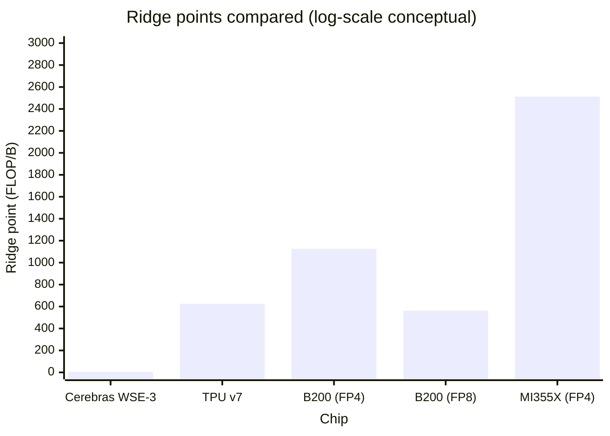
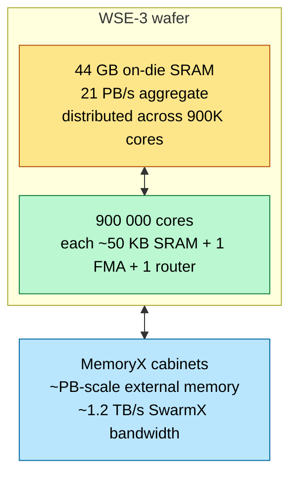
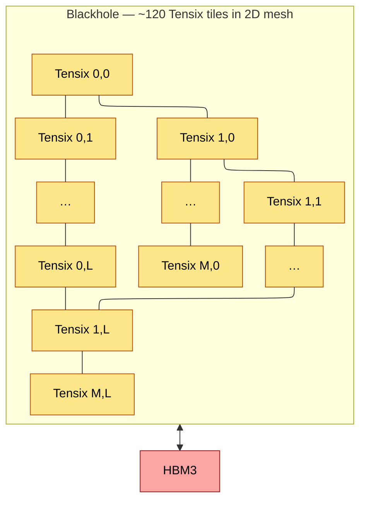
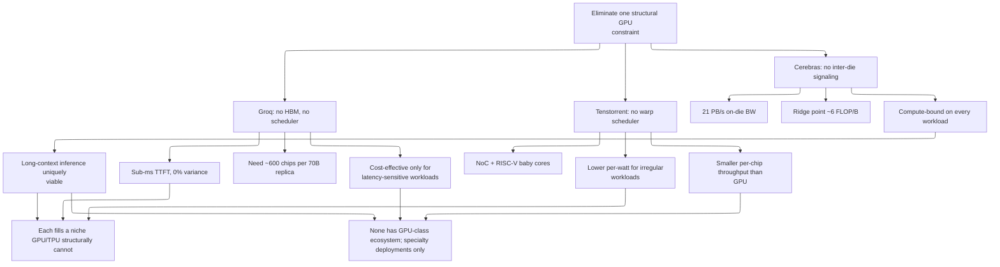

# Specialty Accelerators — Cerebras, Groq, Tenstorrent

> **Layer:** L3.
> **Prerequisites:** [Memory_Hierarchy_and_Roofline](Memory_Hierarchy_and_Roofline.md), [L2 Systolic_Arrays_and_Dataflow](../L2_Digital_Design_for_AI/Systolic_Arrays_and_Dataflow.md), [ISA_and_Execution_Model](ISA_and_Execution_Model.md).
> **Hands off to:** [Accelerator_Landscape_2026](Accelerator_Landscape_2026.md), [L8 inference engines](../L8_Inference_and_Serving/Index.md) (where these chips compete with GPUs).

---

## 0. Why specialty chips exist

Three architectural niches that GPUs/TPUs structurally can't fill:

1. **Wafer-scale** (Cerebras) — eliminate inter-die signaling entirely by not dicing the wafer. Get ~21 PB/s on-die bandwidth.
2. **SRAM-only deterministic** (Groq) — eliminate HBM, run everything from SRAM, hit microsecond-precise latency.
3. **NoC-coupled tile mesh** (Tenstorrent) — eliminate the warp-scheduler/operand-collector overhead by giving each tile its own RISC-V baby cores and per-tile NoC routing.

Each chip flips the roofline in a way GPUs/TPUs cannot. None has GPU-class ecosystem maturity, but each occupies a market niche where the architectural advantage is decisive.

---

## 1. Cerebras WSE-3 — wafer-scale integration

### 1.1 Scale

- **Die size:** 46 225 mm² — an entire 300 mm wafer.
- **Transistors:** 4 trillion.
- **Cores:** 900 000 (lightweight; each ~50 KB SRAM + 1 FMA).
- **On-die SRAM:** 44 GB total, distributed across cores.
- **TDP:** 23 kW per CS-3 system (one wafer + power + cooling).
- **No HBM** — model weights live in on-die SRAM.

### 1.2 The roofline inversion

A ridge point of **6 FLOP/B** means almost every AI kernel is compute-bound. Decode (which on a GPU runs at <5% of peak) runs near peak on Cerebras — the structural cost is that compute density is lower per dollar than a GPU, so peak FLOPS are lower in absolute terms.

### 1.3 Memory hierarchy

For models <44 GB (anything ≤22 B parameters in FP16): everything fits on-wafer, throughput is exceptional.

For larger models (70 B, 405 B): weights stream from MemoryX via SwarmX fabric. SwarmX uses a *broadcast tree* topology — when a weight is loaded, it's broadcast to all wafer cores that need it, amortizing bandwidth. Effective MemoryX bandwidth: ~1.2 TB/s, similar to what an 8-GPU NVLink server gets across 8 HBM stacks.

### 1.4 Programming model

No CUDA equivalent. User submits a PyTorch / TensorFlow graph; Cerebras compiler partitions onto the wafer mesh. **No kernel API** — you cannot hand-tune at the assembly level.

Tradeoff: data scientists never need to write low-level code; ML systems engineers cannot squeeze the last 5% out.

### 1.5 Where Cerebras wins

- **Long-context inference** — 1M+ token context on Llama-3 because all weights stay on-wafer; KV cache also lives in fast SRAM.
- **High-throughput training of small/mid models** — weight-streaming MemoryX architecture gives perfect compute utilization.
- **Sparse models** — random sparsity is handled gracefully because the 2D mesh routes around zeros.

### 1.6 Where Cerebras loses

- **Frontier-model dense pretraining** — TPU/NVL576 + standard transformers wins on $/parameter at the largest scale.
- **Ecosystem** — no PyTorch native, custom toolchain.
- **Per-system cost** — a CS-3 is ~$3 M; comparable to ~10 GB200 superchips. Throughput for typical workload is ~5× a B200, so ~50% per-FLOPS premium for the architectural advantages.

---

## 2. Groq LPU — deterministic SRAM-only

### 2.1 Architecture

A Groq **LPU (Language Processing Unit)** is a single chip with:

- ~230 MB on-chip SRAM, multi-ported, compiler-managed.
- ~750 TFLOPS INT8 / ~150 TFLOPS BF16.
- **No HBM, no caches, no warp scheduler.**
- VLIW instruction stream — every cycle's behavior is set at compile time.
- ~300 W TDP.

### 2.2 The deterministic-latency claim

Because every memory access is to compiler-managed SRAM and every functional unit fires on a known cycle, the wall-clock latency of any workload is *exactly predictable* — to the picosecond. For a transformer decode step with $N$ sequential operations:

$$
L_{\text{decode}} \;=\; \sum_{i=1}^{N} \frac{T_i}{f_{\text{clock}}}
$$

with all $T_i$ known at compile time. This gives Groq:

- Sub-millisecond TTFT on chat workloads.
- Consistent token-generation rates regardless of system load.
- Zero performance variance between runs.

### 2.3 The cost: chip count for big models

A 70 B-param model in FP16 = 140 GB. Each LPU has 230 MB. So:

$$
N_{\text{chips}} \;\ge\; \frac{140\,000}{230} \;\approx\; 610\ \text{chips}
$$

Groq deploys 600+ LPU "GroqRack" systems for 70 B-class serving. Connected via **GroqLink** — a high-bandwidth optical fabric that moves activations between chips while weights stay stationary in SRAM. Each chip holds a fraction of the total weight; activations flow through the fabric like a giant pipelined GEMM.

### 2.4 Where Groq wins

- **Latency-critical inference** — sub-300 µs TTFT, 500+ tokens/s/user.
- **Predictable SLA** — every request runs in N±0% time.
- **Energy per token** — ~30% lower than equivalent GPU at iso-throughput (no scheduler overhead).

### 2.5 Where Groq loses

- **Large models** — $/inference is dominated by chip count; 600 chips × $20K = $12M for one 70B-server replica.
- **Long context** — KV cache adds to working-set; doesn't fit easily in SRAM.
- **Training** — Groq is inference-only; no backward-pass support.

### 2.6 Comparison with TPU on inference

Both are systolic + VLIW. Differences:

| | Groq LPU | TPU v7 |
|---|---|---|
| Memory | SRAM only (230 MB) | HBM (192 GB) |
| Latency variance | ~0% | ~10% |
| TTFT | <1 ms | 5–20 ms |
| $/inference (Llama-3 70B) | High (chip count) | Low (single chip can host) |

Groq is the latency play; TPU is the cost play.

### 2.7 Groq LPU II — next-generation deterministic inference

Groq's LPU II is the successor to the original LPU, preserving the deterministic execution model while roughly doubling on-chip capacity and throughput.

**Key improvements over LPU I:**

| | LPU I | LPU II |
|---|---|---|
| On-chip SRAM | ~230 MB | ~460 MB |
| INT8 throughput | ~750 TFLOPS | ~1,500 TFLOPS |
| BF16 throughput | ~150 TFLOPS | ~300 TFLOPS (est.) |
| Inter-chip fabric | GroqLink | GroqLink 2 (higher BW) |
| TDP | ~300 W | ~400–500 W (est.) |

**Architecture changes:**

- **Larger SRAM** (~460 MB vs ~230 MB) enables either larger models per chip or larger batch sizes within the same chip count. A 7 B-parameter model at FP8 (~7 GB) can now fit across ~15 LPU II chips vs ~30 LPU I chips, halving the cost and power per inference replica.
- **Higher INT8 throughput** (~1.5 TFLOPS per chip) comes from a wider functional-unit array and higher clock, maintaining the same cycle-accurate determinism.
- **GroqLink 2** provides higher inter-chip bandwidth for activation streaming, reducing pipeline bubble overhead in multi-chip deployments.
- **Deterministic execution model preserved**: software still schedules every cycle at compile time. No caches, no HBM, no dynamic scheduling — every operation's latency is known exactly before the chip runs.

**Target workloads:**

- **Single-chip inference for 7 B-class models at FP8**: ~7 GB weights fit comfortably across a small LPU II pod (~15 chips), with room for KV cache in SRAM.
- **Multi-chip for 70 B-class models**: chip count drops from ~600 (LPU I) to ~300 (LPU II) for a 70 B FP16 model, significantly improving $/inference.

**Timeline**: announced 2025, production 2026.

**Revised 70 B estimate:**

$$
N_{\text{chips,II}} \;\ge\; \frac{140\,000}{460} \;\approx\; 305\ \text{chips}
$$

Halving the chip count roughly halves the capital cost per replica (from ~$12M to ~$6M at $20K/chip), narrowing the cost gap with GPU-based serving while preserving the sub-millisecond TTFT advantage.

---

## 3. Tenstorrent — RISC-V + Tensix mesh

### 3.1 Architecture overview

Tenstorrent's chips (Wormhole, Blackhole, Quasar) are **2D meshes of Tensix tiles**. Each Tensix tile contains:

- **5 RISC-V "baby cores"** for control and irregular work.
- A **dense math engine** for tensor ops (~32×32 systolic-ish FMA array).
- **~1 MB scratchpad SRAM**.
- **4 directional NoC links** (1.6 TB/s aggregate per tile).

### 3.2 NoC programming

The differentiator: instead of warp-scheduling threads to access shared memory, each Tensix tile *explicitly routes* its activations to neighboring tiles via the NoC. The programmer (or a higher-level compiler) writes simple data-movement code in C++ on the baby cores; the math engine autonomously runs the FMAs.

This is **closer to a CPU programming model than a GPU one**. Trade off: less parallel-thread overhead, more manual data movement.

### 3.3 Where Tenstorrent wins

- **Per-watt cost-effectiveness** — NoC mesh is more energy-efficient than warp scheduler at scale.
- **Spatial dataflow with HBM** — combines Cerebras-style mesh with conventional HBM for unbounded model size.
- **Open architecture** — RISC-V ISA is documented; less vendor lock-in.
- **Sparse / irregular workloads** — RISC-V cores handle dynamic routing well.

### 3.4 Where Tenstorrent loses

- **Smaller dense GEMM throughput** — per-tile math engine is smaller than NVIDIA tensor core; fewer tiles than CUDA cores total.
- **Less software maturity** — TT-NN library is good but lacks ecosystem breadth.
- **Smaller scale-up domain** — no NVL72/Helios equivalent yet.

---

## 4. FPGA-based AI Acceleration

FPGAs fill the niche between GPU flexibility and ASIC efficiency: lower volume deployments, custom data types, and ultra-low latency inference where the NRE cost of a full custom ASIC cannot be justified.

### 4.1 Current FPGA AI platforms

| Platform | Vendor | AI Performance | Key Feature |
|---|---|---|---|
| Versal AI Core (V70) | AMD/Xilinx | ~130 TOPS INT8 | Adaptive AI engine array with INT8/BF16 support, programmable via Vitis AI |
| Agilex 7 | Intel | up to 40 TOPS | DSP blocks with AI-optimized BF16/FP8 support, oneAPI programmable |

### 4.2 Programming model

- **Vitis AI** (AMD/Xilinx): high-level flow that quantizes, compiles, and deploys ML models onto Versal AI engines. Supports TensorFlow, PyTorch, and ONNX as frontends.
- **Intel oneAPI for FPGAs**: SYCL-based programming with FPGA-specific pragmas for pipeline parallelism and memory banking.
- **HLS (High-Level Synthesis)**: C/C++ input that generates RTL. The standard entry point for custom FPGA kernels; requires understanding of pipeline initiation interval (II), loop unrolling, and on-chip memory banking.

### 4.3 Use cases where FPGAs win

- **Financial inference** (ultra-low latency): FPGA-based inference achieves < 1 us end-to-end latency for small models (e.g., options pricing, order-book prediction) — below what any GPU or even Groq can deliver because the FPGA eliminates scheduler overhead entirely and implements the inference graph as a spatial pipeline with zero-latency inter-stage communication.
- **Custom quantization formats**: FPGAs can implement arbitrary fixed-point or floating-point formats (e.g., log-quantized, block-FP with non-standard block sizes) without waiting for GPU tensor-core support in future silicon.
- **Early-stage hardware prototyping**: FPGA prototyping of novel AI accelerator architectures (e.g., analog compute, spiking neural networks) before tape-out.

### 4.4 Tradeoffs

- **5-10x lower FLOPS/Watt** than an equivalent ASIC: FPGAs pay a reconfigurability tax in routing overhead, larger configuration SRAM, and suboptimal DSP placement.
- **Higher development cost than GPU**: FPGA development cycles are measured in weeks-to-months (HLS compilation, timing closure, floorplanning) vs hours-to-days for GPU kernel development in CUDA/Triton.
- **Throughput ceiling**: even the highest-end FPGA (Versal V70 at ~130 TOPS INT8) is ~10x below a B200 at FP8 (~4,500 TOPS). FPGAs compete on latency and customizability, not throughput.

---

## 5. Comparison summary

| | Cerebras WSE-3 | Groq LPU | Groq LPU II | Tenstorrent Blackhole |
|---|---|---|---|---|
| Form factor | Wafer (1 chip = 1 wafer) | Single chip | Single chip | Single chip |
| On-die SRAM | 44 GB | 230 MB | ~460 MB | ~120 MB (1 MB × 120 tiles) |
| HBM | none | none | none | HBM3 |
| Peak FLOPS | ~125 PF FP16 | ~150 TF BF16 | ~300 TF BF16 (est.) | ~1 PF FP8 |
| INT8 throughput | — | ~750 TF | ~1,500 TF | — |
| Ridge point | ~6 FLOP/B | ~5 FLOP/B (SRAM) | ~5 FLOP/B (SRAM) | ~50 FLOP/B (HBM-bound) |
| Determinism | ~1% variance | ~0% variance | ~0% variance | normal |
| Programming | graph-only, no kernel | VLIW compiler | VLIW compiler | RISC-V + ML compiler |
| Domain | Wafer = 1 system | 600+ chips per Llama-70B replica | ~300 chips per Llama-70B replica | rack-scale via Ethernet NoC |
| Best workload | long-context + dense small models | latency-critical chat | latency-critical chat (larger models) | per-watt inference |
| TDP per chip/system | 23 kW (system) | 300 W | ~400–500 W (est.) | 300 W |
| Timeline | shipping | shipping | announced 2025, prod 2026 | shipping |

---

## 6. End-to-end cause / effect

---

## 7. Numbers to memorize

| Quantity | Value | Why |
|---|---|---|
| Cerebras WSE-3 die area | 46 225 mm² | full wafer |
| Cerebras WSE-3 cores | 900 000 | mesh tiles |
| Cerebras WSE-3 SRAM | 44 GB | on-die |
| Cerebras aggregate SRAM BW | 21 PB/s | derived |
| Cerebras ridge point | ~6 FLOP/B | flips roofline |
| Cerebras peak | ~125 PFLOPS FP16 | per wafer |
| Cerebras CS-3 system TDP | ~23 kW | full system |
| Groq LPU SRAM | ~230 MB | per chip |
| Groq LPU INT8 peak | ~750 TFLOPS | per chip |
| Groq LPU TDP | ~300 W | per chip |
| Groq LPU II SRAM | ~460 MB | per chip (2× LPU I) |
| Groq LPU II INT8 peak | ~1,500 TFLOPS | per chip (2× LPU I) |
| Groq LPU II TDP | ~400–500 W (est.) | per chip |
| Groq LPU II chips for 70 B FP16 | ~305 | halved vs LPU I |
| Groq variance | ~0% | deterministic (both generations) |
| Groq chips for 70 B FP16 | ~600 | spread weights across SRAM (LPU I) |
| Tenstorrent Tensix tiles per Blackhole | ~120 | 2D mesh |
| Tensix tile SRAM | ~1 MB | per tile |
| Tensix RISC-V baby cores | 5 per tile | control |
| Tensix NoC bandwidth | ~1.6 TB/s | per tile |

---

## 8. Worked interview problems

**Q1.** *Why does Cerebras "invert the roofline"?*

GPU ridge: π/β ≈ 1 000 FLOP/B (FP4 B200) — most workloads are far below ridge → memory-bound. Cerebras ridge: 125 PFLOPS / 21 PB/s ≈ 6 FLOP/B — every workload above 6 FLOP/B (which is essentially everything: matmul has ~K, attention ~$d$, even decode at FP16 is 1 FLOP/B → just barely below). Compute-bound regime → tensor cores stay full → ~95% silicon utilization vs ~30% on a GPU running decode.

**Q2.** *Estimate per-token cost on a Groq 70 B inference vs B200.*

Groq: ~600 chips × $20K capex / 5-year amortization / 86 400 s/day / 365 days = ~$0.075 per chip-hour aggregate ⇒ ~$45/hr for the 600-chip pod. Throughput: ~500 tok/s → $0.025 per 1K tokens.

B200: $30K / 5 yr / hr → $0.7/hr. With batching, single B200 serves ~2 000 tok/s aggregate at FP8 70B. → ~$0.0001 per 1K tokens.

Groq is **250× more expensive per token but offers <1ms TTFT vs B200's 200 ms**. For latency-sensitive use cases, Groq wins; for cost-sensitive, B200.

**Q3.** *Why doesn't Cerebras dominate frontier-model training?*

Three reasons: (a) **per-system cost** — $3 M per CS-3, similar to 10 B200s. For a 100 K-chip equivalent training cluster, Cerebras is ~10 K wafers = $30 B, vs ~$3 B for GPU equivalent. (b) **weight streaming bottleneck** for >44 GB models — MemoryX is fast (~1.2 TB/s) but constrained vs HBM aggregate; large dense models bottleneck on weight load. (c) **ecosystem** — frontier-model researchers iterate on PyTorch + CUDA. Cerebras requires graph-level rewrites that slow R&D.

**Q4.** *Why is Tenstorrent Blackhole not a Cerebras competitor despite having a similar mesh structure?*

Tenstorrent uses HBM (chip + memory boards), so it's a normal accelerator with NoC dataflow. Cerebras eliminates HBM entirely. Tenstorrent inherits HBM's bandwidth ceiling (~10 TB/s) → same memory wall as a GPU. Cerebras beats the ceiling by going to on-die SRAM. Different architectural philosophies despite both using meshes.

**Q5.** *What workload would convince you to deploy specialty silicon over GPUs in production?*

(a) **Realtime trading or robotics inference** — sub-ms TTFT requirement → Groq.
(b) **Pharmaceutical sequence modeling** — long-context (1M+ tokens) on a small model → Cerebras.
(c) **Inference-only DLRM at <10K-chip scale where you can't justify MTIA NRE** — Tenstorrent.
For typical LLM serving, GPUs win on $/inference at any scale where ecosystem maturity matters more than architectural niche optimization.

---

## 9. References

- Lie, *Scaling Deep Learning to Wafer Scale*, Hot Chips 2024 (Cerebras WSE-3).
- Abts et al., *Think Fast: A Tensor Streaming Processor (TSP)*, ISCA 2020 (Groq).
- *The Tenstorrent Blackhole Architecture*, Hot Chips 2024.
- Cerebras CS-3 product brief.
- *Wafer-Scale Models for Long-Context Inference*, Cerebras blog, 2024.

---

**Up the stack:** [Accelerator_Landscape_2026](Accelerator_Landscape_2026.md), [L8 inference engines](../L8_Inference_and_Serving/Index.md).
**Down the stack:** [Memory_Hierarchy_and_Roofline](Memory_Hierarchy_and_Roofline.md), [L2 Systolic_Arrays_and_Dataflow](../L2_Digital_Design_for_AI/Systolic_Arrays_and_Dataflow.md).
