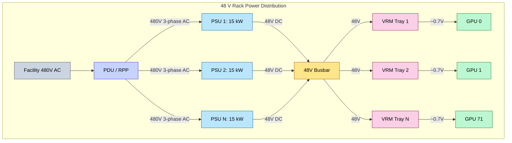
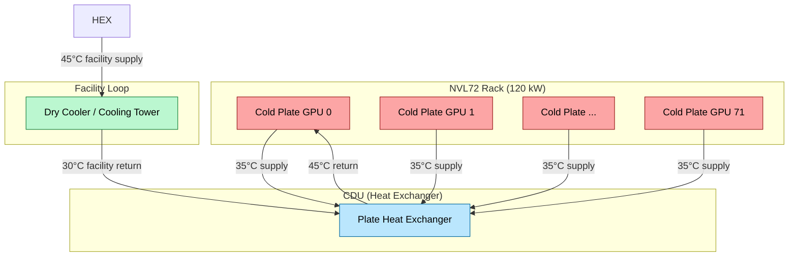
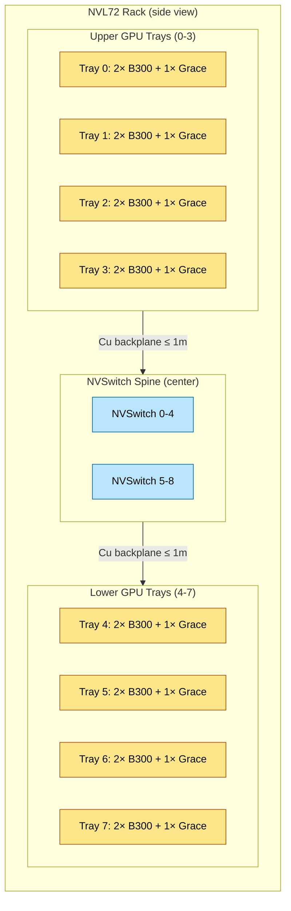

# Rack-Scale Design — Power, Thermal, and Mechanical Engineering of AI Racks

> **Layer:** L4.
> **Prerequisites:** [Networking_and_Interconnect](Networking_and_Interconnect.md), [Blackwell_Architecture](../L3_Microarchitecture/Blackwell_Architecture.md), [Advanced_Packaging](../L1_Packaging_and_Memory/Advanced_Packaging.md).
> **Hands off to:** [Storage_and_Model_Loading](Storage_and_Model_Loading.md), [Production_Architecture](../L8_Inference_and_Serving/Production_Architecture.md), [Distributed_Training](../L7_Training_Stack/Distributed_Training.md).

---

## 0. Why this page exists

A single B300 GPU draws 1,200 W. An NVL72 rack with 72 GPUs, 9 NVSwitch ASICs, 36 Grace CPUs, and associated memory draws 120–140 kW. This is 10–15× the power density of a traditional data center rack (8–12 kW). The rack is no longer a convenient housing for servers — it is a carefully engineered system with its own power distribution, liquid cooling loops, mechanical constraints, and cabling architecture. Every design choice (48 V vs 12 V distribution, copper backplane vs optical, air vs liquid) cascades into the economics and reliability of the entire cluster.

The four invariants:

1. **48 V distribution is mandatory above ~40 kW/rack** — I²R losses at 12 V would melt copper busbars.
2. **Direct-to-chip liquid cooling is mandatory above ~60 kW/rack** — air cooling cannot remove heat fast enough.
3. **Copper backplane length limits topology** — NVL72's copper spine forces NVSwitch trays to the rack center, dictating the physical layout.
4. **Rack mass and floor loading constrain density** — a fully loaded NVL72 weighs ~3,000 kg, requiring reinforced concrete floors rated at 2,500+ kg/m².

---

## 1. Power Distribution

### 1.1 The 48 V Transition

Traditional data center racks distribute 12 V DC from the power supply unit (PSU) to the motherboard. As rack power scales, the current at 12 V becomes prohibitive:

$$I_{12V} = \frac{P}{V} = \frac{120{,}000 \text{ W}}{12 \text{ V}} = 10{,}000 \text{ A}$$

The power dissipated in the busbar (resistance $R$):

$$P_{loss} = I^2 R = 10{,}000^2 \times R = 10^8 \cdot R$$

Even a busbar with $R = 0.1\,m\Omega$ (a thick copper bar) dissipates:

$$P_{loss} = 10^8 \times 10^{-4} = 10{,}000 \text{ W} = 10 \text{ kW}$$

That is 8.3% of the total rack power lost as heat in the busbar alone.

At 48 V:

$$I_{48V} = \frac{120{,}000}{48} = 2{,}500 \text{ A}$$

$$P_{loss,48V} = 2{,}500^2 \times R = 6.25 \times 10^6 \times R = 625 \text{ W}$$

Reduction factor: $\left(\frac{12}{48}\right)^2 = 16\times$. Losses drop from 10 kW to 625 W — a savings of 9.375 kW per rack. Across a 10,000-rack cluster: 93.75 MW saved, worth ~$82M/year at $0.10/kWh.



### 1.2 Point-of-Load (PoL) Voltage Regulation

At the GPU, 48 V must be stepped down to the core voltage $V_{dd} \approx 0.7$ V — a ratio of 68:1. A single B300 GPU at 1,200 W and 0.7 V draws:

$$I_{core} = \frac{1{,}200}{0.7} \approx 1{,}714 \text{ A}$$

Delivering 1,714 A requires multiphase buck converters (VRMs) placed within millimeters of the die. A typical VRM design uses 16–24 phases, each carrying ~70–100 A. The key constraint is **di/dt voltage droop**:

$$\Delta V = L \cdot \frac{di}{dt} + R_{trace} \cdot I$$

A GPU executing a kernel can ramp from idle (~100 A) to full load (~1,714 A) in ~10 ns:

$$\frac{di}{dt} = \frac{1{,}614}{10 \times 10^{-9}} = 1.614 \times 10^{11} \text{ A/s}$$

With PCB trace inductance $L \approx 0.5$ nH and resistance $R \approx 0.1\,m\Omega$:

$$\Delta V = 0.5 \times 10^{-9} \times 1.614 \times 10^{11} + 0.1 \times 10^{-3} \times 1{,}714 = 80.7 \text{ mV} + 0.17 \text{ mV}$$

The inductive term dominates: 80.7 mV of droop on a 700 mV rail is 11.5%. Modern GPUs tolerate ±5%, so decoupling capacitors (tens of mF of MLCCs) are placed on the package substrate to supply the transient current. The capacitors must provide charge for the duration of the transient (~100 ns) before the VRM can respond:

$$Q = I \cdot \Delta t = 1{,}714 \times 100 \times 10^{-9} = 171 \text{ μC}$$

$$C_{min} = \frac{Q}{\Delta V_{max}} = \frac{171 \times 10^{-6}}{0.05 \times 0.7} = \frac{171 \times 10^{-6}}{0.035} \approx 4.9 \text{ mF}$$

This is why AI accelerator packages have massive decoupling capacitor arrays on the substrate — the interposer and package together carry ~5–10 mF of MLCCs.

---

## 2. Thermal Engineering

### 2.1 Why Air Cooling Fails Above 40 kW

Air cooling removes heat via forced convection. The heat transfer rate:

$$Q = \dot{V}_{air} \cdot \rho \cdot C_p \cdot \Delta T$$

where $\dot{V}_{air}$ is volumetric flow rate, $\rho \approx 1.2$ kg/m³, $C_p \approx 1{,}005$ J/(kg·K), and $\Delta T$ is the allowed temperature rise (typically 15–20°C).

For a 120 kW rack with $\Delta T = 15$°C:

$$\dot{V}_{air} = \frac{120{,}000}{1.2 \times 1{,}005 \times 15} \approx 6.63 \text{ m³/s} = 14{,}000 \text{ CFM}$$

A typical CRAC (Computer Room Air Conditioning) unit delivers ~10,000 CFM. A single NVL72 rack needs more air than one CRAC unit can provide. With 10 racks per row, the facility needs dedicated HVAC larger than most commercial buildings. Air cooling is physically and economically infeasible.

### 2.2 Direct-to-Chip Liquid Cooling

Direct-to-chip (D2C) liquid cooling circulates coolant through cold plates mounted directly on the GPU package. The governing equation is sensible heat:

$$Q = \dot{m} \cdot C_p \cdot \Delta T$$

where:
- $Q = 120{,}000$ W (rack power)
- $C_p = 4{,}184$ J/(kg·K) (water)
- $\Delta T = 10$°C (coolant temperature rise — limited by the HBM thermal limit of 95°C)

Solving for mass flow rate:

$$\dot{m} = \frac{120{,}000}{4{,}184 \times 10} = 2.87 \text{ kg/s}$$

Converting to volumetric flow (water density $\rho = 1{,}000$ kg/m³):

$$\dot{V} = \frac{2.87}{1{,}000} = 2.87 \times 10^{-3} \text{ m³/s} \approx 45.5 \text{ GPM}$$

At 45 GPM, the coolant loop pressure drop through 72 cold plates in series would be enormous. In practice, cold plates are arranged in parallel groups of 4–8, with manifold headers distributing flow. Each cold plate sees ~5–10 GPM.

The coolant enters at ~35°C and exits at ~45°C. This warm water is then piped to a Coolant Distribution Unit (CDU) which exchanges heat with the facility water loop, which in turn goes to outdoor dry coolers or cooling towers.



**Dry cooler sizing**: At 120 kW per rack and 100 racks per cluster: 12 MW of heat rejection. A typical dry cooler handles ~500 kW per unit. 24 dry coolers are needed, each requiring ~50 m² of footprint — roughly half a football field.

### 2.3 Two-Phase (Evaporative) Cooling

For future racks exceeding 200 kW (e.g., NVL144, Rubin Ultra), single-phase liquid cooling requires impractical flow rates. Two-phase cooling uses the latent heat of vaporization $h_{fg}$:

$$Q = \dot{m}_{evap} \cdot h_{fg} + \dot{m}_{total} \cdot C_p \cdot \Delta T$$

For water at 1 atm: $h_{fg} \approx 2{,}260$ kJ/kg — 540× more energy per kg than a 10°C sensible heat rise ($C_p \cdot \Delta T = 4{,}184 \times 10 = 41.8$ kJ/kg).

For a 200 kW rack with 90% evaporation:

$$\dot{m}_{evap} = \frac{0.9 \times 200{,}000}{2{,}260 \times 10^3} \approx 0.08 \text{ kg/s}$$

$$\dot{m}_{sensible} = \frac{0.1 \times 200{,}000}{4{,}184 \times 10} \approx 0.48 \text{ kg/s}$$

Total flow: ~0.56 kg/s = 8.9 GPM — 5× less than single-phase at 120 kW. However, two-phase introduces engineering challenges:

1. **Vapor quality management**: partial boiling creates two-phase flow regimes (bubbly, slug, annular) with very different heat transfer coefficients
2. **Pressure containment**: vapor pressure increases exponentially with temperature; system must be rated for peak pressure
3. **Critical heat flux (CHF)**: if local heat flux exceeds CHF, a vapor film forms and temperature spikes catastrophically ($\Delta T > 100$°C in milliseconds)

Common two-phase coolants: R-1234ze (low GWP refrigerant), Novec 7100 (3M dielectric fluid), or water at sub-atmospheric pressure.

---

## 3. Rack-Scale System Architectures

### 3.1 NVIDIA GB200 NVL72

The NVL72 is the reference AI rack for 2025–2026.

**Compute**: 72 B200/B300 GPUs + 36 Grace CPUs (2 GPUs per Grace CPU, 18 compute trays × 2 GPUs each).

**Interconnect**: 9 NVSwitch ASICs in a copper backplane spine.



**Key numbers**:
- Total GPU compute (FP4): $72 \times 4.5 = 324$ PFLOP/s
- Total GPU HBM3e: $72 \times 192 = 13{,}824$ GB $= 13.5$ TB
- Total NVLink BW: 129.6 TB/s (non-blocking)
- TDP: ~120–140 kW (depending on B200 vs B300 mix)
- Power: 48 V distribution, ~10 PSUs × 15 kW
- Cooling: D2C liquid, ~45 GPM
- Mass: ~3,000 kg fully loaded
- Network uplinks: 9 × NDR400 (3.6 Tb/s per NVSwitch × 9 = 32.4 Tb/s total scale-out BW)

### 3.2 NVIDIA NVL576

NVL576 extends NVL72 to 576 GPUs by connecting 8 NVL72 racks via NVLink Network (extended NVLink over active optical cables):

- 576 GPUs, 416 Grace CPUs
- Intra-rack: NVSwitch spine (129.6 TB/s per rack)
- Inter-rack: NVLink Network at 400 GB/s per GPU, 8 links per GPU dedicated to inter-rack
- Total inter-rack BW: $576 \times 400 / 2 = 115.2$ TB/s bidirectional
- Note: this is NOT non-blocking — each GPU only has 8 inter-rack links out of 18 total

### 3.3 AMD Helios (UALink Rack)

AMD's Helios rack architecture uses UALink 1.0 to connect MI355X GPUs:

- **Scale-up domain**: up to 1,024 MI355X GPUs via UALink
- **Per-GPU UALink BW**: 800 GB/s (4 links × 200 GB/s)
- **Topology**: fat-tree of UALink switches within the rack/pod
- **CPU**: AMD EPYC Turin
- **TDP**: estimated 100–120 kW per rack
- **Key differentiator**: the 1,024-accelerator scale-up domain means tensor parallelism can extend across racks within the UALink fabric, without going through the Ethernet/IB scale-out network

### 3.4 Google TPU v7 Pod

Google's TPU v7 (expected 2026) scales to ~8,960 chips per pod:

- **Intra-pod topology**: 3D torus via ICI (Inter-Chip Interconnect)
- **Per-chip ICI BW**: ~1,600 GB/s bidirectional (6 links × ~267 GB/s)
- **Optical Circuit Switching (OCS)**: MEMS mirrors reconfigure torus links dynamically
- **TDP per chip**: ~400 W
- **Pod power**: ~3,600 kW
- **Cooling**: D2C liquid + air hybrid

The OCS is the key innovation: by physically reconfiguring optical paths, Google can remap the torus topology on the fly to match the communication pattern of the current training job.

### 3.5 Cerebras CS-3 + MemoryX + SwarmX

Cerebras takes a fundamentally different approach: one wafer-scale engine (WSE-3) per system:

- **WSE-3**: 4 trillion transistors, 900,000 AI-optimized cores, 44 GB on-chip SRAM
- **MemoryX**: external DRAM pool (up to 1.2 TB) connected via high-BW links
- **SwarmX**: multi-system interconnect for training across multiple CS-3 units
- **On-die BW**: 21 PB/s (unmatched by any GPU)
- **TDP**: ~15 kW per CS-3 system (not rack — a single desktop-sized unit)
- **Scaling**: SwarmX connects up to 2,048 CS-3 units = ~1.8 billion cores

The Cerebras approach eliminates the traditional memory wall by placing all parameters in on-chip SRAM during compute, streaming weights from MemoryX as needed.

### 3.6 Comparison Table

| Property | NVL72 | NVL576 | Helios | TPU v7 Pod | CS-3 |
|---|---|---|---|---|---|
| Accelerators | 72 B300 | 576 B300 | 1,024 MI355X | ~8,960 TPU v7 | 1 WSE-3 |
| FP4/FP8 Compute | 324 PFLOP/s | 2,592 PFLOP/s | ~2,048 PFLOP/s (FP8) | ~1,800 PFLOP/s (BF16) | 125 PFLOP/s (FP16) |
| Total HBM/SRAM | 13.5 TB | 108 TB | ~192 TB | ~179 TB | 44 GB SRAM |
| Scale-up BW | 129.6 TB/s | 115.2+ TB/s | ~819 TB/s | ~14.3 TB/s (ICI) | 21 PB/s (on-die) |
| Scale-up topology | Clos (NVSwitch) | Extended Clos | Fat-tree (UALink) | 3D torus + OCS | Wafer-scale mesh |
| TDP | ~120 kW | ~960 kW | ~100 kW/rack | ~3,600 kW/pod | ~15 kW/unit |
| Cooling | D2C liquid | D2C liquid | D2C liquid | D2C + air hybrid | Air (per unit) |
| Mass | ~3,000 kg | ~24,000 kg | ~2,500 kg/rack | Custom | ~50 kg/unit |
| Inter-rack link | NDR400 per NVSwitch | NVLink Network | UALink + Ethernet | ICI + OCS | SwarmX Ethernet |

---

## 4. Mechanical Constraints

### 4.1 Floor Loading

A standard data center floor is rated for 500–1,000 kg/m² (raised floor) or 2,000 kg/m² (reinforced concrete). An NVL72 at 3,000 kg in a 0.6 m × 1.2 m footprint:

$$P_{floor} = \frac{3{,}000}{0.6 \times 1.2} = \frac{3{,}000}{0.72} = 4{,}167 \text{ kg/m}^2$$

This exceeds even reinforced concrete ratings. The solution: spread the load with base plates or use structural steel pedestals. Many NVL72 deployments require custom floor reinforcement.

### 4.2 Cabling Density

NVL72 uses a copper backplane for NVLink, avoiding external cabling within the rack. However, scale-out cabling is significant:

- Each NVSwitch has 4 NDR400 uplinks (200 Gb/s per direction × 4 = 800 Gb/s per NVSwitch)
- 9 NVSwitches × 4 = 36 NDR400 cables exiting the rack
- Each NDR400 cable is a bundle of 8× 50G SerDes pairs in a QSFP-DD form factor
- Cable diameter: ~6 mm per cable, 36 cables = ~2,000 mm² of cable cross-section

At 36 cables per rack and 100 racks per cluster: 3,600 NDR cables to manage. Cable routing and bending radius (minimum ~40 mm for NDR) becomes a significant physical planning exercise.

### 4.3 Acoustics

Air-cooled AI servers produce 80–90 dBA at 1 m. A row of 10 racks exceeds 100 dBA — requiring hearing protection. Liquid-cooled racks reduce fan speeds dramatically: the coolant handles most heat removal, and fans only provide airflow for SSDs, DIMMs, and VRMs. Typical liquid-cooled rack: 60–70 dBA — still loud, but within OSHA 8-hour exposure limits.

---

## 5. End-to-end Cause / Effect

```mermaid
flowchart TD
    A["B300 TDP = 1,200 W"] --> B["72 GPUs = ~120 kW/rack"]
    B --> C["Air cooling infeasible (>40 kW limit)"]
    C --> D["D2C liquid cooling mandatory"]
    D --> E["45 GPM coolant flow + CDU + dry coolers"]

    F["224G PAM4 Nyquist = 56 GHz"] --> G["Cu trace ≤ 1 m"]
    G --> H["NVSwitch spine in rack center"]
    H --> I["Physical layout: GPU trays above/below"]

    J["120 kW at 12V = 10,000 A"] --> K["I²R loss = 10 kW in busbar"]
    K --> L["48V distribution (16× loss reduction)"]
    L --> M["PoL VRM: 48V→0.7V at 1,714 A"]

    N["Rack mass = 3,000 kg"] --> O["Floor loading > 4,000 kg/m²"]
    O --> P["Reinforced concrete or structural steel"]

    Q["36 NDR uplinks per rack"] --> R["3,600 cables per 100-rack cluster"]
    R --> S["Cable management = major planning exercise"]

---

## 6. Numbers to memorize

| Quantity | Value | Why it matters |
|---|---|---|
| NVL72 TDP | ~120–140 kW | 10–15× traditional rack; liquid cooling mandatory |
| NVL72 GPU count | 72 B200/B300 | Largest NVLink domain; TP ≤ 72 without leaving rack |
| NVL72 total HBM | 13.5 TB (72 × 192 GB) | Can host a 700B FP16 model split across GPUs |
| NVL72 NVLink aggregate | 129.6 TB/s | Strictly non-blocking by design |
| NVL72 NVSwitch count | 9 × 144-port ASICs | Copper backplane spine in rack center |
| 48V vs 12V I²R loss | 16× reduction | 10 kW busbar loss → 625 W at 48V |
| GPU core current | ~1,714 A at 0.7 V | Requires VRM within mm of die |
| Decoupling capacitance needed | ~5–10 mF on package | di/dt transient: 0→1,714 A in ~10 ns |
| D2C coolant flow (120 kW) | ~45 GPM | Water at ΔT=10°C; ~2.87 kg/s |
| Air cooling limit | ~40 kW/rack | 14,000 CFM needed for 120 kW — impractical |
| Two-phase h_fg (water) | 2,260 kJ/kg | 540× more than sensible heat (C_p·ΔT = 41.8 kJ/kg) |
| NVL72 mass | ~3,000 kg | Floor loading ~4,167 kg/m² — needs reinforcement |
| NVL72 scale-out links | 36 NDR400 cables | 9 NVSwitches × 4 uplinks each |
| Helios UALink domain | 1,024 MI355X | 14× larger scale-up than NVL72 |
| TPU v7 pod size | ~8,960 chips | 3D torus + OCS |
| Cerebras WSE-3 on-die BW | 21 PB/s | Inverts the roofline; compute-bound on almost everything |
| Dry cooler capacity | ~500 kW per unit | 24 units for 12 MW cluster (100 NVL72s) |
| Coolant supply temperature | ~35°C (inlet) | Limited by HBM thermal limit of 95°C |

---

## 7. Worked interview problems

**Q1.** *A data center operator plans to deploy 50 NVL72 racks. Each rack draws 130 kW. The facility receives power at $0.08/kWh. Calculate the annual power cost and the required cooling plant capacity.*

Per-rack power: 130 kW.

50 racks: $50 \times 130 = 6{,}500$ kW = 6.5 MW.

Annual energy: $6.5 \times 10^6 \times 8{,}760 = 5.694 \times 10^{10}$ Wh = 56,940 MWh.

Annual cost: $56{,}940 \times 1{,}000 \times \$0.08 = \$4{,}555{,}200 \approx \$4.56$ M/year.

Cooling plant: PUE (Power Usage Effectiveness) for liquid-cooled data centers is ~1.15–1.25. Total facility power:

$$P_{facility} = P_{IT} \times PUE = 6.5 \text{ MW} \times 1.2 = 7.8 \text{ MW}$$

Cooling plant capacity: $7.8 - 6.5 = 1.3$ MW for CDUs, dry coolers, pumps, lighting, and overhead.

Dry coolers needed (at 500 kW each): $1{,}300 / 500 \approx 3$ dry coolers (with redundancy, 4–5 units).

**Q2.** *A B300 GPU draws 1,200 W at 0.7 V. The PCB trace from VRM to die has inductance L = 0.3 nH and resistance R = 0.05 mΩ. The GPU transitions from 10% to 100% load in 20 ns. Calculate the voltage droop. Is it within the ±5% tolerance?*

Steady-state current at 100%: $I_{ss} = 1{,}200 / 0.7 = 1{,}714$ A.

Transient current change: $\Delta I = 1{,}714 \times 0.9 = 1{,}543$ A.

di/dt: $\frac{di}{dt} = \frac{1{,}543}{20 \times 10^{-9}} = 7.71 \times 10^{10}$ A/s.

Inductive droop: $\Delta V_L = L \cdot \frac{di}{dt} = 0.3 \times 10^{-9} \times 7.71 \times 10^{10} = 23.1$ mV.

Resistive droop (at full current): $\Delta V_R = R \cdot I = 0.05 \times 10^{-3} \times 1{,}714 = 0.086$ mV.

Total droop: $23.1 + 0.086 \approx 23.2$ mV.

Allowable: $\pm 5\% \times 700 = 35$ mV. The droop of 23.2 mV is within tolerance (3.3%). The inductive term dominates; the resistive term is negligible.

**Q3.** *Compare coolant flow rates for (a) single-phase water cooling of a 140 kW rack with ΔT = 8°C, and (b) two-phase cooling using R-1234ze where 80% of heat is removed by evaporation and 20% by sensible heat with ΔT = 5°C. For R-1234ze: h_fg ≈ 180 kJ/kg, C_p ≈ 1,200 J/(kg·K).*

(a) Single-phase water:

$$\dot{m}_{water} = \frac{140{,}000}{4{,}184 \times 8} = 4.18 \text{ kg/s} \approx 66.3 \text{ GPM}$$

(b) Two-phase R-1234ze:

$$\dot{m}_{evap} = \frac{0.8 \times 140{,}000}{180{,}000} = 0.622 \text{ kg/s}$$

$$\dot{m}_{sensible} = \frac{0.2 \times 140{,}000}{1{,}200 \times 5} = 4.67 \text{ kg/s}$$

$$\dot{m}_{total} = 0.622 + 4.67 = 5.29 \text{ kg/s}$$

Comparison: single-phase water requires 4.18 kg/s of water; two-phase requires 5.29 kg/s of R-1234ze. The mass flow is actually higher for two-phase because R-1234ze's C_p and h_fg are much lower than water's. However, the **volumetric** flow differs: R-1234ze density at saturation is ~1,150 kg/m³, giving $\dot{V}_{R1234ze} = 5.29/1{,}150 = 4.6$ L/s vs $\dot{V}_{water} = 4.18/1{,}000 = 4.18$ L/s. Nearly the same. The real benefit of two-phase is **lower pump power** (lower pressure drop) and the ability to maintain near-constant temperature (isothermal boiling), which simplifies thermal management.

**Q4.** *An NVL72 rack needs to load a 1 Trillion parameter model in FP16 (2 TB total) distributed across 72 GPUs. Each GPU needs 2 TB/72 ≈ 27.8 GB. If the model is stored on a shared NVMe array delivering 56 GB/s via GDS to each GPU node, and loading is pipelined across 72 GPUs, how long does the full load take? Compare with loading over 100 GbE (12.5 GB/s per GPU).*

Each GPU loads 27.8 GB from local NVMe (56 GB/s available from 8 drives):

$$T_{local} = \frac{27.8}{56} = 0.50 \text{ s}$$

If all 72 GPUs load simultaneously from their local NVMe, the load is parallel:

$$T_{parallel} = 0.50 \text{ s}$$

Total time is bounded by the slowest GPU, not the aggregate bandwidth.

Over 100 GbE (12.5 GB/s per GPU), loading from a remote storage server:

$$T_{network} = \frac{27.8}{12.5} = 2.22 \text{ s}$$

The 100 GbE path is 4.4× slower. For a multi-rack deployment where each rack loads from a central model store, the network becomes the bottleneck: a single 400 GbE link serving 72 GPUs would give only $50/72 = 0.69$ GB/s per GPU, resulting in $27.8/0.69 = 40$ s.

**Q5.** *A 10,000-GPU cluster uses NVL72 racks (139 racks, with one partial). Each rack has 36 NDR400 uplinks. Calculate the total scale-out bandwidth and the number of spine switches needed for a two-tier fat-tree.*

Total uplinks per rack: 36 × 400 Gb/s = 14.4 Tb/s = 1,800 GB/s per rack.

Total scale-out BW: 139 × 1,800 = 250,200 GB/s ≈ 250 TB/s.

For a fat-tree: 10,000 GPUs, each connected via one NDR400 link (400 Gb/s). Number of edge switches: 10,000 / 32 (half ports down, half up) = 313 edge switches (with 7 unused ports on the last one).

Total uplinks from edge to spine: 313 × 32 = 10,016 uplinks.

Spine switches (64-port): 10,016 / 64 = 157 spine switches.

Total switches: 313 + 157 = 470 NDR switches.

---

## 8. References

**Foundational**
- ASHRAE, *Thermal Guidelines for Data Processing Environments*, 5th Edition, 2021.
- The Green Grid, *PUE: A Comprehensive Examination of the Metric*, White Paper #49, 2012.
- JEDEC, *Thermal Measurement Methodology for Semiconductor Devices*, JESD51, 2023.

**Recent**
- NVIDIA, *GB200 NVL72 Rack Architecture White Paper*, GTC 2025.
- AMD, *Helios Rack Architecture Overview*, Financial Analyst Day 2025.
- Google, "TPU v7 System Design," *ISCA 2026* (projected).
- Cerebras, *CS-3 System Architecture Guide*, 2025.
- Microsoft, "Lessons from Building Large-Scale AI Infrastructure," *ISCA 2025*.

**Cross-references**
- [Networking_and_Interconnect](Networking_and_Interconnect.md) — the topologies these racks implement.
- [Blackwell_Architecture](../L3_Microarchitecture/Blackwell_Architecture.md) — B200/B300 GPU specs.
- [Advanced_Packaging](../L1_Packaging_and_Memory/Advanced_Packaging.md) — package-level thermal interface.
- [Production_Architecture](../L8_Inference_and_Serving/Production_Architecture.md) — how racks become serving clusters.

---

**Up the stack:** [Storage_and_Model_Loading](Storage_and_Model_Loading.md), [Production_Architecture](../L8_Inference_and_Serving/Production_Architecture.md), [Distributed_Training](../L7_Training_Stack/Distributed_Training.md).
**Down the stack:** [Networking_and_Interconnect](Networking_and_Interconnect.md), [Blackwell_Architecture](../L3_Microarchitecture/Blackwell_Architecture.md), [Advanced_Packaging](../L1_Packaging_and_Memory/Advanced_Packaging.md).
