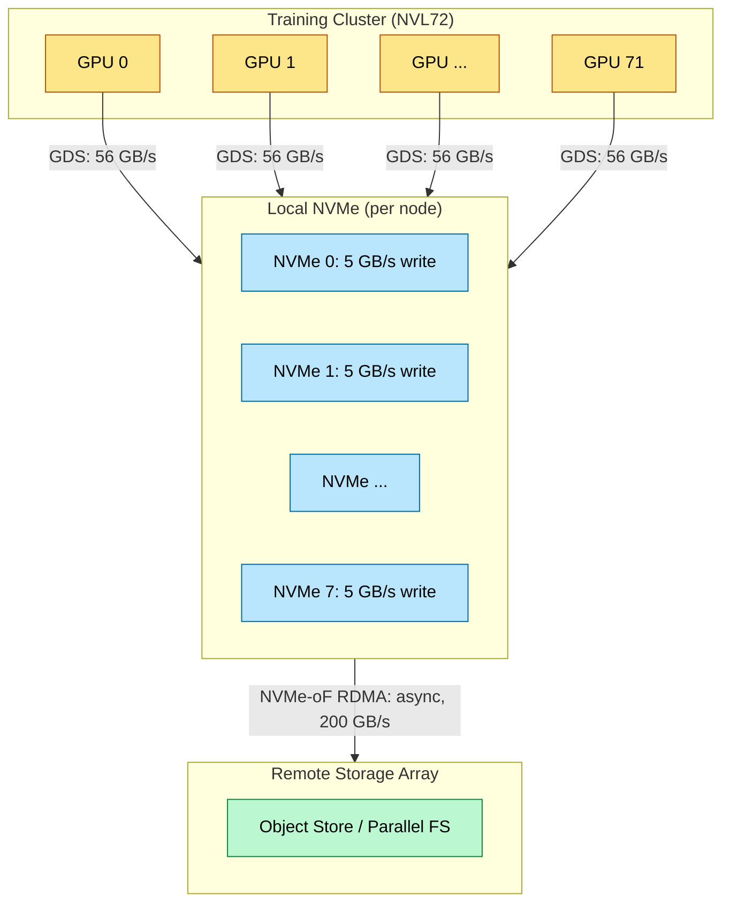
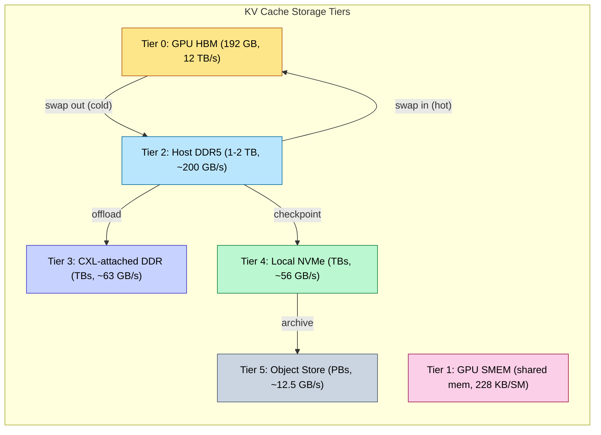

# Storage and Model Loading — From NVMe to HBM

> **Layer:** L4.
> **Prerequisites:** [Networking_and_Interconnect](Networking_and_Interconnect.md), [Rack_Scale_Design](Rack_Scale_Design.md), [HBM_Deep_Dive](../L1_Packaging_and_Memory/HBM_Deep_Dive.md).
> **Hands off to:** [KV_Cache](../L8_Inference_and_Serving/KV_Cache.md), [Distributed_Training](../L7_Training_Stack/Distributed_Training.md), [Production_Architecture](../L8_Inference_and_Serving/Production_Architecture.md).

---

## 0. Why this page exists

A 1-Trillion-parameter model in FP16 occupies 2 TB of storage. Loading it onto 72 GPUs across an NVL72 rack takes 0.5–40 seconds depending on the I/O path. During training, checkpointing a 2 TB model with Adam optimizer states (6 TB total) must complete in under 10 seconds to avoid catastrophic efficiency loss — the cluster saves checkpoints every 100–1,000 steps, and every second spent writing is a second of $130 kW × 72 = 9.36$ MW wasted.

The storage subsystem is the least glamorous but most critical part of AI infrastructure. A GPU that cannot load its weights is a very expensive space heater. This page covers the full storage path: from checkpoint format on disk, through the I/O stack (NVMe → PCIe → HBM), to the disaggregated storage architectures that serve fleet-scale inference.

The four invariants:

1. **Checkpoint size scales as 3× model weight size** — Adam optimizer stores momentum + variance alongside weights.
2. **PCIe is the bottleneck between NVMe and HBM** — 63 GB/s per GPU (Gen5 x16), compared to 7 GB/s per NVMe drive and 1,800 GB/s NVLink.
3. **GPUDirect Storage eliminates the CPU bounce buffer** — but the throughput ceiling is still the slower of NVMe or PCIe.
4. **Safetensors is the only format that enables zero-copy mmap loading** — PyTorch pickle requires deserialization, adding 2–5× latency overhead.

---

## 1. Model and Checkpoint Formats

### 1.1 PyTorch Native (Pickle)

PyTorch's default `torch.save()` uses Python's pickle protocol to serialize model state dicts. For a 70B-parameter model in FP16 (140 GB):

- **Serialization**: pickle writes a dictionary of tensors, each with its storage metadata
- **Deserialization**: unpickling reconstructs Python objects, allocates new tensors, copies data
- **Overhead**: pickle deserialization is single-threaded and CPU-bound. For a 140 GB checkpoint, deserialization takes ~30–60 seconds on a 64-core CPU
- **Security risk**: pickle can execute arbitrary Python code during deserialization (`__reduce__`, `__setstate__`). Loading an untrusted checkpoint is equivalent to running untrusted code.

The deserialization overhead makes pickle unsuitable for production inference, where model loading must complete in seconds.

### 1.2 Safetensors

HuggingFace's safetensors format addresses pickle's shortcomings:

- **Zero-copy memory mapping**: the file is laid out so that `mmap()` returns pointers directly into tensor data, without copying
- **Layout**: a flat binary format — 8-byte header length, JSON header (tensor names, dtypes, shapes, offsets), then raw tensor data
- **No deserialization overhead**: `mmap()` completes in microseconds regardless of file size; the OS lazily pages in data on first access
- **Security**: no code execution; the format is a pure data specification

For a 140 GB safetensors file:

$$T_{mmap} = \text{syscalls + page table setup} \approx 1{-}5 \text{ ms}$$

$$T_{actual\_load} = \frac{140 \text{ GB}}{BW_{path}}$$

where $BW_{path}$ is the I/O path bandwidth (NVMe, PCIe, or network). The format overhead is negligible.

### 1.3 GGUF (llama.cpp)

GGUF is the format used by llama.cpp for CPU-based inference:

- **Quantization-aware**: tensors are stored in quantized form (Q4_0, Q5_1, Q8_0, etc.) directly in the file
- **Self-describing**: contains metadata (tokenizer, hyperparameters, tensor info) alongside weights
- **Memory-mappable**: designed for `mmap()` with alignment guarantees for quantized block sizes
- **Use case**: edge inference, CPU-only servers, and low-memory environments where loading the full FP16 model is not feasible

GGUF is not typically used in data-center inference (where FP16/BF16 is loaded directly to GPU), but is relevant for understanding the quantization landscape (see [Quantization](../L6_Algorithms_and_Models/Quantization.md)).

### 1.4 Format Comparison

| Property | PyTorch Pickle | Safetensors | GGUF |
|---|---|---|---|
| Zero-copy mmap | No (pickle deserialize) | Yes | Yes |
| Load 140 GB model | 30–60 s | 2–5 s (I/O bound) | 1–3 s (quantized, ~40 GB) |
| Security | Arbitrary code exec | Safe (data only) | Safe (data only) |
| Lazy loading | No (must deserialize all) | Yes (mmap + offset read) | Yes (mmap + offset read) |
| Quantized storage | No | No (raw tensors) | Yes (Q4_0, Q5_1, Q8_0, etc.) |
| Metadata | Python dict | JSON header | Structured KV pairs |
| Adopters | PyTorch default | HuggingFace Hub, vLLM, SGLang | llama.cpp, Ollama |

---

## 2. The I/O Path: NVMe to HBM

### 2.1 The Traditional Path (Without GPUDirect)

Without GPUDirect, data traverses the following path:

```
NVMe SSD → PCIe DMA → Host RAM (bounce buffer) → PCIe DMA → GPU HBM
```

Each step:

1. **NVMe read**: The NVMe controller DMA's data from NAND flash into a host RAM buffer. Bandwidth per drive: ~7 GB/s (PCIe Gen4 x4). With 8 drives: ~56 GB/s aggregate.
2. **CPU copy**: A CPU thread copies data from the NVMe buffer to a GPU-pinned (page-locked) buffer in host RAM. This is a memcpy of ~140 GB: at ~50 GB/s memory bandwidth (one DDR5 channel), ~2.8 s. But memcpy is parallelizable across cores, so with 16 threads: ~0.5 s.
3. **PCIe DMA to GPU**: `cudaMemcpy(host_pinned, device, size, cudaMemcpyHostToDevice)`. At PCIe Gen5 x16 = 63 GB/s: $140/63 = 2.2$ s.

Total (without GDS): $2.2 \text{ s (NVMe)} + 0.5 \text{ s (copy)} + 2.2 \text{ s (PCIe)} \approx 4.9 \text{ s}$ for a 140 GB model.

### 2.2 GPUDirect Storage (GDS)

GDS eliminates the host RAM bounce buffer:

```
NVMe SSD → PCIe P2P DMA → GPU HBM
```

The NVMe controller DMAs directly into GPU HBM via PCIe peer-to-peer. Steps:

1. **Pin GPU memory**: `cuMemHostAlloc()` pins a region of GPU HBM for PCIe P2P access.
2. **NVMe read with GPU address**: The NVMe controller receives a read command with a GPU-side DMA address. It reads from NAND and writes directly to GPU HBM over PCIe.
3. **No CPU involvement**: The CPU only issues the initial I/O command; data never touches host RAM.

Bandwidth: $\min(BW_{NVMe}, BW_{PCIe}) = \min(56, 63) = 56$ GB/s.

$$T_{GDS} = \frac{140}{56} = 2.5 \text{ s}$$

Savings: 4.9 s → 2.5 s = 49% reduction. More importantly, CPU utilization drops from ~100% (16 cores doing memcpy) to near-zero, freeing the CPU for other work.

### 2.3 Model Load Time Math

For a range of model sizes and storage configurations:

| Model | Params | FP16 Size | 1× NVMe (7 GB/s) | 8× NVMe GDS (56 GB/s) | NVLink P2P (1.8 TB/s) |
|---|---|---|---|---|---|
| Llama-3 8B | 8B | 16 GB | 2.3 s | 0.29 s | 8.9 ms |
| Llama-3 70B | 70B | 140 GB | 20.0 s | 2.5 s | 78 ms |
| Llama-4 400B (MoE) | 400B | 800 GB | 114 s | 14.3 s | 444 ms |
| DeepSeek-V3 671B (MoE) | 671B | 1,342 GB | 192 s | 24.0 s | 746 ms |
| 1T Dense | 1T | 2,000 GB | 286 s | 35.7 s | 1.11 s |

For MoE models, not all parameters need to be loaded for inference — only the active expert parameters. DeepSeek-V3 with 256 routed experts and top-8 activation needs only ~8/256 = 3.1% of expert weights per token. But for training, all expert weights must be in memory.

### 2.4 Sharded Checkpoint Formats

In distributed training, the model is sharded across GPUs. The checkpoint must be saved and loaded in a way that respects the sharding:

**FSDP (Fully Sharded Data Parallel)**: Each rank saves only its local shard. A 1T model with 72 ranks creates 72 files, each ~28 GB (FP16). Loading requires each rank to read only its own file.

$$T_{FSDP\_load} = \frac{28 \text{ GB}}{56 \text{ GB/s (GDS)}} = 0.50 \text{ s per rank}$$

All ranks load in parallel: total time = 0.50 s.

**Megatron-LM TP/PP sharding**: Tensor-parallel and pipeline-parallel sharding creates one file per combination of (TP rank, PP rank). For TP=8, PP=4: 32 files. Each file is smaller but the loading requires all TP ranks in a pipeline stage to load before the pipeline can start.

**Consolidated checkpoint**: A single file containing the full model (used for distribution and conversion). This requires a "consolidation" step that gathers all shards onto one node. For a 2 TB model:

$$T_{consolidate} = \frac{2 \text{ TB}}{BW_{network}}$$

Over NDR (400 Gb/s = 50 GB/s per link): $2{,}000 / 50 = 40$ s. Over NVLink within an NVL72: $2{,}000 / 1{,}800 = 1.1$ s.

---

## 3. Checkpoint I/O in Training

### 3.1 The MTBF Problem

Large GPU clusters experience hardware failures at predictable rates. Empirical MTBF (Mean Time Between Failures) for GPU training clusters:

- 1,000 GPUs: MTBF ≈ 1 failure per 5 days
- 10,000 GPUs: MTBF ≈ 1 failure per 12 hours
- 100,000 GPUs: MTBF ≈ 1 failure per 1–2 hours

The training efficiency loss from checkpointing is:

$$E = \frac{T_{compute}}{T_{compute} + T_{ckpt}} \times (1 - P_{failure} \times T_{wasted})$$

where $T_{compute}$ is the compute time between checkpoints, $T_{ckpt}$ is the checkpoint save time, and $T_{wasted}$ is the compute lost when a failure occurs between checkpoints.

Optimal checkpoint interval (Young's formula):

$$T_{interval} = \sqrt{2 \cdot T_{ckpt} \cdot MTBF} - T_{ckpt}$$

For $T_{ckpt} = 10$ s and $MTBF = 12$ hours = 43,200 s:

$$T_{interval} = \sqrt{2 \times 10 \times 43{,}200} - 10 = \sqrt{864{,}000} - 10 = 929.5 - 10 \approx 920 \text{ s} \approx 15.3 \text{ min}$$

With $T_{ckpt} = 60$ s (slow storage):

$$T_{interval} = \sqrt{2 \times 60 \times 43{,}200} - 60 = \sqrt{5{,}184{,}000} - 60 = 2{,}277 - 60 = 2{,}217 \text{ s} \approx 37 \text{ min}$$

Faster checkpointing enables more frequent saves with less wasted compute.

### 3.2 Checkpoint Bandwidth Math

For a 1T-parameter FP16 model with Adam optimizer:

| Component | Size | Notes |
|---|---|---|
| Model weights | 2 TB | 1T × 2 bytes (FP16) |
| Adam momentum | 2 TB | 1T × 2 bytes (FP32 momentum) |
| Adam variance | 2 TB | 1T × 2 bytes (FP32 variance) |
| LR scheduler state | ~4 GB | Negligible |
| **Total** | **~6 TB** | Per checkpoint |

For $T_{ckpt} = 10$ s, the aggregate write bandwidth:

$$BW_{write} = \frac{6{,}000 \text{ GB}}{10 \text{ s}} = 600 \text{ GB/s}$$

A single NVMe drive writes at ~5 GB/s (sequential write, SLC cache). With 8 drives per node: 40 GB/s. For a 72-GPU NVL72 rack, the aggregate is $72/2 \times 40 = 1{,}440$ GB/s (36 Grace CPUs, each with 8 NVMe drives). This exceeds the 600 GB/s requirement, so the bottleneck is the PCIe bus or the network, not the drives.

### 3.3 NVMe over Fabrics (NVMe-oF)

NVMe-oF extends the NVMe protocol across the network fabric, allowing remote NVMe arrays to appear as local block devices. The data path:

1. **GPU HBM → RDMA Write → Remote NVMe array**: GPUDirect RDMA + NVMe-oF allows GPUs to write checkpoints directly to remote storage without CPU involvement.
2. **Protocol**: NVMe-oF runs over RDMA (RoCE v2 or InfiniBand), using RDMA Write operations to push data to the target.
3. **Bandwidth**: limited by the network fabric. A single NDR400 link delivers 50 GB/s. With 4 uplinks per NVL72: 200 GB/s aggregate.

For a 6 TB checkpoint:

$$T_{ckpt, NVMe-oF} = \frac{6{,}000}{200} = 30 \text{ s}$$

This is too slow for the 10 s target. The solution: **local NVMe + async replication**. Each node saves its shard to local NVMe (fast: ~0.5 s), then asynchronously replicates to the remote array over the network (30 s, but overlapped with training).



### 3.4 S3 / Object Storage Streaming

For inference serving, models are often stored in S3-compatible object storage:

- **Latency**: first-byte latency ~100–200 ms, then streaming at network bandwidth
- **Throughput**: limited by the network path from S3 to the inference node
- **Cost**: ~$0.023/GB/month (S3 Standard), ~$0.004/GB/month (S3 Glacier Instant Retrieval)

For cold-start inference (loading a model not present on local NVMe):

$$T_{cold\_start} = T_{first\_byte} + \frac{size}{BW_{network}}$$

For a 140 GB model over 100 GbE (12.5 GB/s):

$$T_{cold\_start} = 0.15 + \frac{140}{12.5} = 0.15 + 11.2 = 11.35 \text{ s}$$

This is the motivation for model pre-warming (loading models onto local NVMe before they're needed) and model caching (keeping recently-used models on local NVMe for fast re-loading).

### 3.5 Asynchronous Checkpointing

#### Problem: Synchronous Checkpointing Blocks Training

Traditional (synchronous) checkpointing freezes model state, serializes tensors, and writes them to storage before the training loop resumes. For large models the I/O latency dominates:

| Model | Checkpoint Size (weights + Adam) | Sync Checkpoint Time | Utilization Loss |
|---|---|---|---|
| 8B FP16 | ~96 GB | ~1.7 s (local NVMe) | ~0.3% at 10-min interval |
| 70B FP16 | ~840 GB | ~15 s (local NVMe) | ~2.5% at 10-min interval |
| 400B FP16 | ~4.8 TB | ~86 s (local NVMe) | ~12.5% at 10-min interval |

At 400B scale, every checkpoint wastes over a minute of GPU time. In a 10,000-GPU cluster with MTBF ≈ 12 hours and Young's-optimal interval of ~15 minutes, synchronous checkpointing burns ~12.5% of all compute — tens of millions of dollars per training run.

#### Process Fork (Copy-on-Write) Approach

The core idea: **fork the training process** so that a child process handles the slow I/O while the parent continues training immediately.

```
Training Process (parent)
    │
    ├── step N complete
    ├── fork()                          ← ~1-2 ms overhead
    │       │
    │       ├── Parent: resumes step N+1 immediately
    │       │
    │       └── Child (COW snapshot):
    │               ├── GPU memory is COW-shared with parent
    │               ├── Serializes state dict to CPU buffers
    │               ├── Writes checkpoint to local NVMe / network storage
    │               └── exits() when done
    │
    ├── step N+1, N+2, ...
```

**How copy-on-write works here**: After `fork()`, parent and child share the same physical memory pages (GPU memory mapped via `cudaMallocManaged` or similar unified-memory APIs, plus host-side state). The OS marks these pages as read-only. When the parent modifies a page during continued training, the kernel intercepts the write, allocates a fresh page, copies the original data, and lets the parent write to the new page. The child retains the unmodified snapshot.

**Fork overhead**: the `fork()` system call itself costs ~1–2 ms (page table duplication). The COW pages consume extra memory only as the parent mutates them. During a typical checkpoint window of 30–60 s, the parent advances through a few training steps, modifying roughly 10–20% of model pages.

**GPU memory snapshot**: NVIDIA's `cudaMemcpy` can be issued from the forked child to capture the exact GPU state at fork time. Because the fork inherits the CUDA context, the child can DMA GPU memory to host buffers without disrupting the parent. The key constraint is that the parent must not free or reallocate GPU buffers during the brief window between fork and the child's snapshot read. In practice, training frameworks insert a brief "quiesce" point (a few ms) where no GPU kernels are in flight, then fork, then resume.

#### PyTorch Implementation

PyTorch provides two complementary async-checkpoint pathways:

**`torch.distributed.checkpoint` (DCP) async save**:

```python
import torch.distributed.checkpoint as dcp

# Inside training loop, at checkpoint boundary:
dcp.save(
    state_dict={"model": model, "optimizer": optimizer, "step": step},
    checkpoint_id="ckpt_step_1000",
    async_save=True,       # returns immediately; writes in background thread
)
# Training resumes immediately; DCP handles serialization + I/O in a
# background thread pool.  A later dcp.wait() or barrier confirms completion.
```

Key behavior:
- `async_save=True` spawns a background thread that serializes each rank's state-dict shard and writes to the checkpoint path.
- The caller must not modify the state dict until the async save completes. Internally, DCP copies tensors to CPU buffers before returning, decoupling the GPU from I/O.
- For multi-rank training, DCP coordinates via a distributed barrier so that all ranks enter the save region together, ensuring a globally consistent checkpoint.

**`torch.save` with background threads** (lower-level alternative):

```python
import torch
from concurrent.futures import ThreadPoolExecutor

executor = ThreadPoolExecutor(max_workers=4)

def async_torch_save(state_dict, path):
    # Move tensors to CPU first (frees GPU memory for continued training)
    cpu_state = {k: v.cpu().clone() for k, v in state_dict.items()}
    # Write to disk in background thread
    executor.submit(torch.save, cpu_state, path)

# Usage — returns after CPU clone, not after disk write:
async_torch_save(model.state_dict(), f"ckpt_{step}.pt")
```

Tradeoff: CPU clone is fast (~1–2 s for 140 GB at ~80 GB/s DDR5 bandwidth) but temporarily doubles memory usage (GPU + CPU copy). The fork approach avoids this clone at the cost of COW page faults during continued training.

#### Distributed Coordination

In distributed training, all ranks must checkpoint a mutually consistent global state. Two strategies:

**Barrier-then-fork**: Before forking, all ranks execute a `torch.distributed.barrier()`. This ensures every rank has completed the same training step. After the barrier, each rank forks independently. The checkpoints are consistent because they all capture the same step.

```
Rank 0 ── step N ── barrier ── fork ── resume step N+1
Rank 1 ── step N ── barrier ── fork ── resume step N+1
Rank 2 ── step N ── barrier ── fork ── resume step N+1
  ...
```

**Distributed Checkpoint Protocol (DCP) for sharded async saves**: DCP handles the coordination internally. Each rank saves its FSDP/ZeRO shard asynchronously. DCP writes a metadata file after all ranks confirm completion, ensuring the checkpoint directory is only marked "valid" when every shard is on disk. This prevents torn checkpoints (some ranks written, others not) from being loaded.

#### Tradeoff: Extra Memory Overhead

The copy-on-write mechanism introduces memory overhead proportional to the rate at which the parent modifies pages during the checkpoint window:

$$M_{overhead} \approx f_{mutate} \times M_{model}$$

where $f_{mutate}$ is the fraction of model pages modified during the write window. Typical values:

| Phase | $f_{mutate}$ (over ~30 s) | Overhead for 70B model |
|---|---|---|
| Forward pass (weights read-only) | ~0% | ~0 GB |
| Backward pass (gradients, optimizer step) | ~10–20% | ~14–28 GB |
| Full train step (fwd + bwd + optim) | ~15–25% | ~21–35 GB |

The overhead is ~10–20% of model size during the checkpoint window. This is acceptable on modern GPUs (B300 has 192 GB HBM; a 70B model uses ~140 GB, leaving ~52 GB headroom). For larger models where headroom is tighter, the checkpoint window must be kept short (fast local NVMe writes) to minimize $f_{mutate}$.

#### Integration with Object Storage

In production, checkpoints must be durably stored in object storage (S3, GCS) for disaster recovery and cross-region access. The async pipeline has two stages:

```
Stage 1: GPU → local NVMe (fast, ~seconds)
Stage 2: local NVMe → S3/GCS (slow, ~tens of seconds to minutes)
```

```python
# Stage 1: local async checkpoint (returns in ~1-2 s)
dcp.save(state_dict, checkpoint_id="/local_nvme/ckpt_1000", async_save=True)

# Stage 2: background upload to S3 (overlapped with training)
def upload_to_s3(local_path, s3_uri):
    # boto3 multipart upload, ~50 MB/s per stream
    s3_client.upload_file(local_path, "my-bucket", s3_uri)

executor.submit(upload_to_s3, "/local_nvme/ckpt_1000", "checkpoints/ckpt_1000")
```

This decouples checkpoint **frequency** (set by MTBF/Young's formula) from **network bandwidth** (set by S3 throughput). A cluster can checkpoint every 5 minutes locally but upload every 30 minutes to S3, with local NVMe acting as a write-through cache. If a node fails before the S3 upload completes, the checkpoint is lost — but other nodes' shards survive, and the training run can restart from the previous S3-durable checkpoint.

**Bandwidth math for S3 upload**: A 6 TB checkpoint (1T model + Adam) uploaded over a 400 Gb/s link (50 GB/s):

$$T_{S3\_upload} = \frac{6{,}000}{50} = 120 \text{ s} = 2 \text{ min}$$

With S3 multipart upload (10 concurrent streams at 5 GB/s each): ~120 s. This is comfortably overlapped with a 15-minute training interval.

---

## 4. KV Cache Offload Tiers

### 4.1 The KV Cache Memory Problem

During inference, the KV cache grows linearly with sequence length and batch size. For a 70B model with 64 layers, 64 KV heads, head dimension 128, BF16:

$$KV\_cache\_per\_token = 2 \times n_{layers} \times n_{kv\_heads} \times d_{head} \times sizeof(dtype)$$
$$= 2 \times 64 \times 64 \times 128 \times 2 = 4{,}194{,}304 \text{ bytes} \approx 4 \text{ MB/token}$$

For a batch of 256 sequences at average 2,048 tokens:

$$KV_{total} = 256 \times 2{,}048 \times 4 \text{ MB} = 2{,}097{,}152 \text{ MB} \approx 2 \text{ TB}$$

This exceeds the HBM of a single GPU (192 GB on B300). The solution is a tiered storage hierarchy for KV cache.

### 4.2 The KV Cache Tier Stack



| Tier | Latency | Bandwidth | Capacity (per node) | Use Case |
|---|---|---|---|---|
| GPU HBM | ~1 ns | 12 TB/s | 192 GB | Active token KV, hot prefix |
| Host DDR5 | ~100 ns | ~200 GB/s | 1–2 TB | Swapped-out KV pages, prefix cache |
| CXL-attached | ~500 ns | ~63 GB/s | Multi-TB | Extended KV pool, disaggregated |
| Local NVMe | ~10 μs | ~56 GB/s | 30+ TB | KV checkpoint, cold offload |
| Object Store | ~100 ms | ~12.5 GB/s | PBs | Archive, cross-region replication |

### 4.3 NIXL (NVIDIA IO Extension Library)

NIXL (introduced 2025) provides a unified API for KV cache movement between all tiers:

- **Zero-copy transfers**: GPU-initiated DMA between HBM and host memory via PCIe P2P
- **Async operations**: non-blocking transfers with completion notification
- **Tier-aware placement**: automatic placement based on access recency and available capacity

Typical swap performance for a 70B model:
- HBM ↔ DDR5: ~50 GB/s (PCIe Gen5 x16, limited by smaller of HBM read BW and PCIe BW)
- Swap-in latency for 1 token of KV (4 MB): $4/50{,}000 = 0.08$ ms = 80 μs. Acceptable for prefill but adds latency to decode.

### 4.4 Cross-reference to Disaggregated Serving

In disaggregated serving architectures (Mooncake, DistServe), the KV cache is stored in a global pool shared across all inference instances. The storage tier is typically host DDR5 or CXL-attached memory, accessed via RDMA over the data center network. See [Disaggregated_Serving_2025](../L8_Inference_and_Serving/Disaggregated_Serving_2025.md) for the full architecture.

---

## 5. End-to-end Cause / Effect

```mermaid
flowchart TD
    A["1T model + Adam = 6 TB checkpoint"] --> B["600 GB/s write BW for 10 s save"]
    B --> C["Local NVMe + async replication"]

    D["PyTorch pickle deserialization"] --> E["30-60 s load time (CPU-bound)"]
    E --> F["Safetensors: mmap in ms, I/O-bound"]

    G["PCIe Gen5 x16 = 63 GB/s"] --> H["NVMe → HBM bottleneck"]
    H --> I["GDS eliminates bounce buffer: 2× speedup"]

    J["KV cache = 4 MB/token for 70B"] --> K["2 TB for 256 × 2048 batch"]
    K --> L["Tiered offload: HBM → DDR → CXL → NVMe"]

    M["MTBF ≈ 12 hours at 10k GPUs"] --> N["Checkpoint every 15 min"]
    N --> O["Young's formula: T_interval = sqrt(2 × T_ckpt × MTBF)"]

    P["Sync checkpoint: 30-60 s for 70B"] --> Q["12.5% utilization loss at 400B scale"]
    Q --> R["Async checkpoint: fork + COW snapshot"]
    R --> S["1-2 ms fork overhead; parent resumes immediately"]
    R --> T["10-20% memory overhead during checkpoint window"]
    S --> U["Local NVMe write → background S3 upload"]

---

## 6. Numbers to memorize

| Quantity | Value | Why it matters |
|---|---|---|
| Safetensors mmap overhead | ~1–5 ms | Negligible vs I/O time; zero-copy |
| Pickle deserialization (140 GB) | 30–60 s | 6–12× slower than safetensors |
| NVMe Gen4 x4 throughput | ~7 GB/s per drive | 8 drives = 56 GB/s |
| PCIe Gen5 x16 throughput | ~63 GB/s | Bottleneck between NVMe and HBM |
| GDS speedup over staging | ~2× | Eliminates host RAM bounce buffer |
| 70B FP16 model size | 140 GB | Canonical reference model |
| 1T FP16 + Adam checkpoint | ~6 TB | 3× model weight size |
| Checkpoint BW for 10 s save | 600 GB/s aggregate | Requires parallel NVMe or NVMe-oF |
| MTBF at 10k GPUs | ~12 hours | Checkpoint every ~15 min |
| Young's checkpoint interval | sqrt(2 × T_ckpt × MTBF) | Optimal tradeoff: overhead vs lost work |
| NVMe-oF throughput (NDR) | ~50 GB/s per link | Remote checkpoint for multi-rack |
| S3 first-byte latency | ~100–200 ms | Cold-start overhead |
| KV cache per token (70B) | ~4 MB/token | Drives memory tier architecture |
| HBM ↔ DDR5 swap BW | ~50 GB/s via PCIe | Tier-0 to tier-1 KV offload |
| NVLink P2P load (1.8 TB/s) | 78 ms for 140 GB | Warm-pool model distribution |
| Fork overhead for async checkpoint | ~1–2 ms | vs 30–60 s sync checkpoint for 70B |
| COW memory overhead during ckpt | ~10–20% of model size | Extra pages during checkpoint window |
| S3 upload for 6 TB checkpoint | ~120 s over 400 Gb/s | Overlapped with training; decoupled from ckpt frequency |

---

## 7. Worked interview problems

**Q1.** *A training cluster of 8 NVL72 racks (576 GPUs) trains a 400B-parameter FP16 model. The model uses FSDP with optimizer state sharding. Calculate: (a) the per-GPU checkpoint size, (b) the per-GPU checkpoint save time with local NVMe (56 GB/s), (c) the total checkpoint bandwidth across all 576 GPUs, and (d) the network bandwidth needed to replicate all checkpoints to a remote array.*

(a) Model weights: 400B × 2 bytes = 800 GB. Adam states: 400B × 2 × 4 bytes (FP32 momentum + variance) = 3,200 GB. Total: 4,000 GB.

Per GPU (FSDP sharding): $4{,}000 / 576 = 6.94$ GB per GPU.

(b) Save time with local NVMe at 56 GB/s:

$$T_{save} = \frac{6.94}{56} = 0.124 \text{ s} \approx 124 \text{ ms}$$

(c) Total aggregate checkpoint bandwidth:

$$BW_{total} = \frac{576 \times 6.94}{0.124} = \frac{3{,}997}{0.124} \approx 32{,}234 \text{ GB/s} \approx 32 \text{ TB/s}$$

(d) For async replication to remote storage: each GPU replicates its 6.94 GB shard over the network. With 4 NDR uplinks per rack (200 GB/s per rack), and 8 racks: $8 \times 200 = 1{,}600$ GB/s aggregate network bandwidth.

$$T_{replicate} = \frac{576 \times 6.94}{1{,}600} = \frac{3{,}997}{1{,}600} = 2.5 \text{ s}$$

This overlaps with training, so the effective impact is zero if training continues during replication.

**Q2.** *A 70B model in BF16 generates KV cache at 4 MB per token. An inference server has 8 × B300 GPUs (192 GB HBM each, 1,536 GB total). The model weights occupy 140 GB, leaving 1,396 GB for KV cache. What is the maximum batch size × sequence length product that fits in HBM? If 50% of KV is offloaded to host DDR5, what does the effective capacity become?*

Available HBM for KV: 1,396 GB = 1,396,000 MB.

KV per (batch × seq_len): 4 MB.

$$batch \times seq\_len = \frac{1{,}396{,}000}{4} = 349{,}000$$

For example: batch=256, seq_len=1,363 tokens. Or batch=128, seq_len=2,727 tokens.

With 50% offload to DDR5: 698 GB stays in HBM, 698 GB in DDR5. HBM holds:

$$batch \times seq\_len = \frac{698{,}000}{4} = 174{,}500$$

But the **effective** batch×seq_len doubles because the offloaded KV is still accessible (with higher latency). Total capacity: 1,396 GB (HBM) + host DDR5 capacity. If the host has 1 TB DDR5:

$$batch \times seq\_len = \frac{1{,}396{,}000 + 1{,}000{,}000}{4} = 599{,}000$$

This is 1.7× the HBM-only capacity, at the cost of ~100 ns latency per offloaded KV access.

**Q3.** *Using Young's formula, calculate the optimal checkpoint interval for a 100,000-GPU cluster. Assume MTBF = 1.5 hours and checkpoint save time = 15 s (network-bottlenecked).*

$MTBF = 1.5 \times 3{,}600 = 5{,}400$ s. $T_{ckpt} = 15$ s.

$$T_{interval} = \sqrt{2 \times 15 \times 5{,}400} - 15 = \sqrt{162{,}000} - 15 = 402.5 - 15 = 387.5 \text{ s} \approx 6.5 \text{ min}$$

Training efficiency: fraction of time doing useful work:

$$E = \frac{T_{interval}}{T_{interval} + T_{ckpt}} = \frac{387.5}{387.5 + 15} = 96.3\%$$

Lost work per failure: on average, half the interval ($T_{interval}/2 = 193.75$ s). With MTBF = 5,400 s, the expected fraction of lost work:

$$\frac{T_{interval}/2}{MTBF} = \frac{193.75}{5{,}400} = 3.6\%$$

Total efficiency: $96.3\% \times (1 - 0.036) = 92.8\%$. About 7.2% of compute is lost to checkpointing and failures.

**Q4.** *Compare cold-start times for a 140 GB model across three paths: (a) S3 over 100 GbE, (b) local NVMe via GDS, (c) NVLink P2P from a warm-pool GPU. Assume S3 first-byte latency = 150 ms.*

(a) S3 over 100 GbE (12.5 GB/s):

$$T_{S3} = 0.15 + \frac{140}{12.5} = 11.35 \text{ s}$$

(b) Local NVMe via GDS (56 GB/s):

$$T_{GDS} = \frac{140}{56} = 2.5 \text{ s}$$

(c) NVLink P2P (1.8 TB/s):

$$T_{NVLink} = \frac{140}{1{,}800} = 0.078 \text{ s} = 78 \text{ ms}$$

Speedups: GDS is 4.5× faster than S3; NVLink P2P is 145× faster than S3. This is why disaggregated serving architectures maintain warm pools of GPUs that can transfer models via NVLink in milliseconds.

---

## 8. References

**Foundational**
- HuggingFace, *Safetensors Specification*, 2023.
- J. W. Young, "A first order approximation to the optimum checkpoint interval," *Communications of the ACM*, 1974.
- NVMe, *NVM Express Base Specification 2.0*, 2021.
- SNIA, *NVMe over Fabrics Specification*, 2022.

**Recent**
- NVIDIA, *GPUDirect Storage Design Guide*, 2024.
- NVIDIA, *NIXL: NVIDIA IO Extension Library*, GTC 2025.
- Meta, "Checkpointing at Scale for Llama-3 Training," *NSDI 2025*.
- Mooncake Team, "Mooncake: A Serverless Architecture for LLM Serving," *SOSP 2025*.

**Cross-references**
- [KV_Cache](../L8_Inference_and_Serving/KV_Cache.md) — detailed KV cache layout and management.
- [Disaggregated_Serving_2025](../L8_Inference_and_Serving/Disaggregated_Serving_2025.md) — Mooncake-style KV pool and warm-pool model distribution.
- [Distributed_Training](../L7_Training_Stack/Distributed_Training.md) — FSDP, ZeRO, and checkpoint coordination.
- [Networking_and_Interconnect](Networking_and_Interconnect.md) — NVMe-oF and RDMA transport.

---

**Up the stack:** [KV_Cache](../L8_Inference_and_Serving/KV_Cache.md), [Disaggregated_Serving_2025](../L8_Inference_and_Serving/Disaggregated_Serving_2025.md), [Production_Architecture](../L8_Inference_and_Serving/Production_Architecture.md).
**Down the stack:** [Networking_and_Interconnect](Networking_and_Interconnect.md), [Rack_Scale_Design](Rack_Scale_Design.md), [HBM_Deep_Dive](../L1_Packaging_and_Memory/HBM_Deep_Dive.md).
