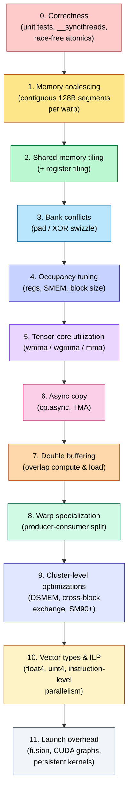
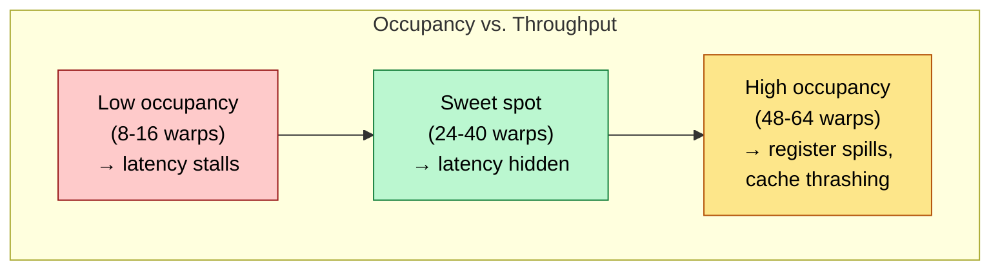
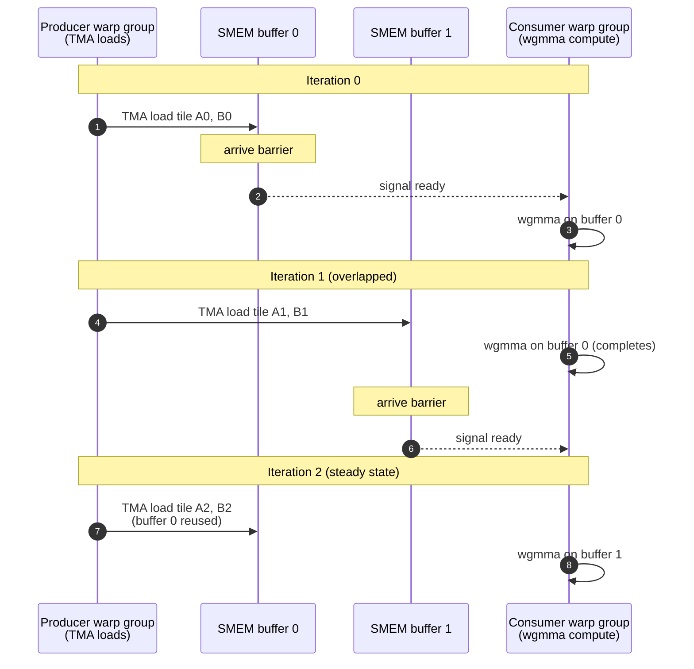
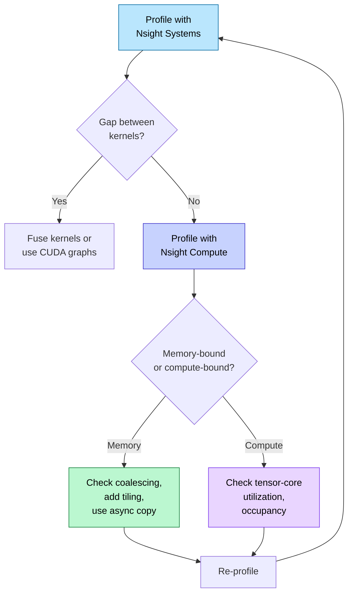
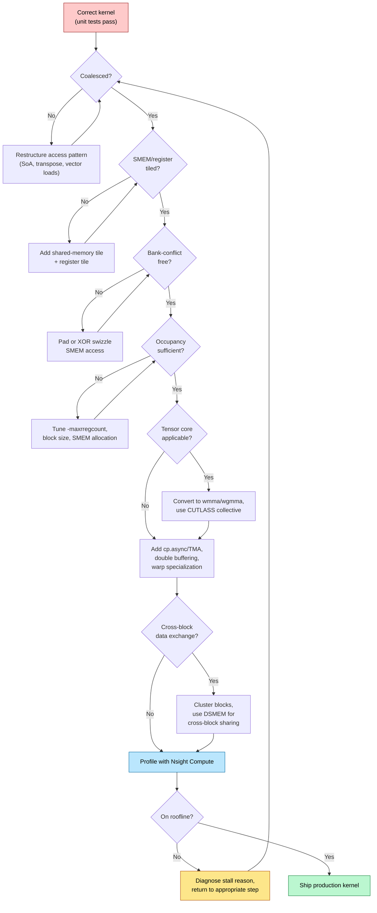

# CUDA Optimization — From Working Kernel to Peak Throughput

> **Layer:** L5.
> **Prerequisites:** [CUDA_Programming](CUDA_Programming.md), [On_Chip_Memory_Hardware](../L2_Digital_Design_for_AI/On_Chip_Memory_Hardware.md), [GPU_Architecture](../L3_Microarchitecture/GPU_Architecture.md).
> **Hands off to:** [Triton_and_Kernels](Triton_and_Kernels.md), [FlashAttention_Deep_Dive](FlashAttention_Deep_Dive.md).

---

## 0. The optimization ladder

A working CUDA kernel is the starting point, not the end. The gap between a functionally correct first draft and a production kernel operating at 80-90% of device peak is typically 10-50x in throughput. That gap is closed by applying a fixed sequence of optimizations, each one a precondition for the next: coalesced memory access before tiling, tiling before bank-conflict resolution, bank-conflict resolution before occupancy tuning, occupancy tuning before tensor-core offload, and so on. Skipping steps produces a kernel that profiles well on one metric but stalls on another. This page walks through every rung of that ladder, diagnoses failure modes with Nsight tools, and ends with a case study that ties everything together.

---

## 1. The optimization checklist — order matters



Each step assumes the prior step is already satisfied. Applying tensor-core intrinsics to a kernel with uncoalesced accesses yields worse results than a coalesced FP32 kernel. The hierarchy is causal, not merely a preference.

---

## 2. Memory coalescing

### 2.1 What the hardware expects

A warp's 32 threads issue memory transactions in **128-byte segments** (32 threads x 4 bytes for FP32). The GPU's load/store unit coalesces these into the minimum number of 32-byte (L1) or 128-byte (L2/HBM) transactions. Coalescing occurs when thread $t$ in a warp accesses address $A_{\text{base}} + t \cdot \text{sizeof}(T)$ for a contiguous, aligned range.

### 2.2 Diagnosing with Nsight Compute

```bash
ncu --set full --section MemoryWorkloadAnalysis ./my_kernel
```

Key metrics:

| Metric | Ideal | Diagnostic |
|--------|-------|-----------|
| `l1tex__t_sectors_pipe_lsu_mem_global_op_ld.sum` | Minimal | Excess sectors = uncoalesced |
| `l1tex__data_pipe_lsu_wavefronts_mem_shared_op_ld.sum` | Equal to warp count | Higher = bank conflicts |
| `smsp__sass_inst_executed_op_global_ld.sum` | Low | High count = too many separate loads |
| `lts__t_sectors_op_read.sum` | $N \cdot \text{elements} \cdot \text{sizeof} / 32$ | Anything above = waste |

Nsight Compute flags uncoalesced accesses in the `MEMORY` section with a "Sector Miss Ratio" above ~1.125x the ideal.

### 2.3 Common patterns and fixes

**AoS to SoA transformation.** An array of `struct { float x, y, z; }` produces stride-3 access per field. Transposing to three separate `float*` arrays yields stride-1 access per load. This is the single most impactful coalescing fix for particle, graph, and point-cloud kernels.

**2D row-major access.** Thread `(ty, tx)` reading `input[ty][tx]` is coalesced (adjacent tx = adjacent addresses). Reading `input[tx][ty]` is strided by the row pitch — typically 32-128x more transactions. Transpose the loop order or transpose the data layout.

```c
// BAD: strided access, 128x more transactions
float val = input[tx * WIDTH + ty];

// GOOD: coalesced, 1 transaction per warp
float val = input[ty * WIDTH + tx];
```

---

## 3. Shared-memory tiling

### 3.1 Why tile

Global memory on Hopper delivers ~3 TB/s (HBM3). The SM's compute units consume data at ~20-100 TB/s internally. The ratio is 7-33x. Tiling copies a reusable data block from HBM into SMEM (~19 TB/s on A100 with 164 KB SMEM; ~30 TB/s on Hopper/Blackwell with 228 KB SMEM) or registers (register file bandwidth ~64 TB/s), amortizing the slow HBM transfer across many arithmetic operations.

### 3.2 Matrix-multiply tiling

For $C = A \times B$ where $A$ is $M \times K$ and $B$ is $K \times N$, a tile of size $BM \times BK$ is loaded from $A$ and $BK \times BN$ from $B$. The outer loop iterates over $K/BK$ tiles. Each iteration loads two tiles into SMEM, computes a partial product, and accumulates into registers.

$$
\text{HBM bytes} = 2 \cdot BM \cdot BK \cdot \frac{K}{BK} \cdot \text{sizeof}(T) + M \cdot N \cdot \text{sizeof}(T)
$$

Without tiling, each thread reads one row of $A$ and one column of $B$ per output element: $K$ loads per element. With tiling, the $A$-tile is reused across $BN$ columns and the $B$-tile across $BM$ rows, reducing HBM traffic by a factor of $\sim \min(BM, BN)$.

```c
__shared__ float sA[BLOCK_M][BLOCK_K];
__shared__ float sB[BLOCK_K][BLOCK_N];

// Load tile from global to shared memory
sA[ty][tx] = A[row * K + k_iter * BLOCK_K + tx];
sB[ty][tx] = B[(k_iter * BLOCK_K + ty) * N + col];
__syncthreads();

// Compute partial product in registers
for (int kk = 0; kk < BLOCK_K; kk++) {
    float a_val = sA[ty][kk];
    for (int nn = 0; nn < BLOCK_N_PER_THREAD; nn++) {
        regC[nn] += a_val * sB[kk][tx * BLOCK_N_PER_THREAD + nn];
    }
}
__syncthreads();
```

### 3.3 Register tiling

Beyond SMEM tiling, each thread computes a small $RM \times RN$ block of the output in registers. This eliminates repeated SMEM reads of the same $A$-row or $B$-column within a thread's output tile. The compiler keeps these in registers (no spills) as long as $RM \cdot RN$ per thread stays below the register budget.

For a warp-level cooperative load of tile $BM \times BK$: each of 32 threads loads $(BM \cdot BK) / 32$ elements using vector loads (`float4`).

---

## 4. Bank conflicts

### 4.1 SMEM bank architecture

Shared memory on NVIDIA GPUs is organized as 32 banks. Bank $b$ holds every 32-bit word at address $a$ where $a \mod 32 = b$. Each bank services one address per cycle. When two or more threads in the same warp access different addresses in the same bank on the same instruction, a **bank conflict** serializes the accesses into multiple cycles.

- No conflict: all 32 threads access distinct banks (1 cycle).
- $n$-way conflict: accesses are split into $n$ serial rounds (n cycles).
- **Broadcast exception:** if all conflicting threads read the *same* address in a bank, the value is broadcast in 1 cycle (no penalty).

### 4.2 Padding

The simplest fix for a bank conflict in a 2D SMEM array is to pad each row by one element, shifting subsequent rows so their column-0 lands in a different bank.

```c
// Without padding: column access conflicts (same bank)
__shared__ float tile[64][32];   // column j always bank j

// With padding: column access is conflict-free
__shared__ float tile[64][33];   // row stride = 33, breaks alignment
```

Padding costs $(\text{rows}) \times 4$ bytes of SMEM. For a 64x33 float array: 8 448 bytes, negligible against the 256 KB budget.

### 4.3 XOR swizzle

Padding wastes SMEM and complicates indexing. XOR swizzling computes a transformed index that permutes banks without changing the array dimensions:

$$
\text{swizzle}(i) = i \oplus (i \gg \log_2 S)
$$

where $S$ is the number of rows in the access pattern. In code:

```c
__device__ int xor_swizzle(int row, int col, int rows) {
    // rows must be power of 2
    return row ^ (col & (rows - 1));
}

// Conflict-free column access:
float val = tile[xor_swizzle(row, col, TILE_ROWS)][col];
```

The XOR pattern ensures that threads accessing the same column across consecutive rows hit different banks. CUTLASS 3.x and CuTe use this extensively for Hopper tensor-core tile layouts.

---

## 5. Occupancy theory

### 5.1 Definition

Occupancy is the ratio of active warps per SM to the maximum warps per SM:

$$
\text{Occupancy} = \frac{W_{\text{active}}}{W_{\max}}
$$

For Hopper: $W_{\max} = 64$ warps (2 048 threads). Occupancy is limited by three resources:

1. **Registers.** $W_{\text{reg}} = \lfloor 65\,536 / (R_t \cdot 32) \rfloor$ where $R_t$ is registers per thread.
2. **Shared memory.** $W_{\text{smem}} = \lfloor S_{\text{SM}} / (S_b \cdot B_{\text{SM}}) \rfloor$ where $S_b$ is SMEM per block and $B_{\text{SM}}$ is blocks per SM.
3. **Threads per block.** $W_{\text{threads}} = B_{\text{SM}} \cdot \lfloor T_b / 32 \rfloor$ where $T_b$ is threads per block.

Effective occupancy = $\min(W_{\text{reg}}, W_{\text{smem}}, W_{\text{threads}})$.

### 5.2 The register-pressure tradeoff

More registers per thread enables register tiling (faster per-thread compute) but reduces $W_{\text{reg}}$, lowering occupancy. The tradeoff is not monotonic: beyond a certain occupancy floor ($\sim$25-50%), additional warps provide diminishing returns because the kernel becomes compute-bound, not latency-bound.



The compiler flag `-maxrregcount=N` or `__launch_bounds__` annotation controls this:

```c
__global__ void __launch_bounds__(256, 8)
my_kernel(/* ... */) {
    // 256 threads/block, min 8 blocks/SM
    // compiler infers max 32 regs/thread (65536 / 256 / 8)
}
```

### 5.3 Occupancy calculator

Nsight Compute reports the occupancy limiters directly:

```
ncu --section LaunchStats --section Occupancy ./my_kernel
```

Key fields:
- `block_limit_regs` — blocks limited by register count.
- `block_limit_shared_mem` — blocks limited by SMEM.
- `block_limit_warps` — blocks limited by max warps/SM.
- `achieved_occupancy` — measured over kernel lifetime (the only number that matters).

Rule of thumb: aim for $\ge$ 50% occupancy for memory-bound kernels. For compute-bound tensor-core kernels, occupancy of 25-40% is often optimal because the wgmma instruction hides its own latency (asynchronous, 16+ cycles).

---

## 6. Tensor-core utilization

### 6.1 Instruction hierarchy

| Level | Instruction | Threads involved | Tile shape (FP16/BF16) | Tile shape (FP8) | Architecture |
|-------|------------|-----------------|----------------------|-----------------|-------------|
| WMMA | `wmma::mma_sync` | 1 warp (32) | $16 \times 16 \times 16$ | — | Volta+ |
| WGMMA | `wgmma.mma_async` | 1 warp group (128) | $64 \times N \times 16$ | $64 \times N \times 32$ | Hopper+ |
| MMA (PTX) | `mma.sync` | 1 warp (32) | $16 \times 8 \times 16$ | — | Ampere+ |

### 6.2 WMMA example (Volta through Ampere)

```c
#include <mma.h>
using namespace nvcuda::wmma;

fragment<matrix_a, 16, 16, 16, half, row_major> frag_a;
fragment<matrix_b, 16, 16, 16, half, col_major> frag_b;
fragment<accumulator, 16, 16, 16, float> frag_c;

fill_fragment(frag_c, 0.0f);

// Load tiles from SMEM
load_matrix_sync(frag_a, smem_a + k * 16, 16);
load_matrix_sync(frag_b, smem_b + k * 16, 16);

// Multiply-accumulate
mma_sync(frag_c, frag_a, frag_b, frag_c);

// Store result
store_matrix_sync(out + m * N + n, frag_c, N, mem_row_major);
```

Each `wmma` call performs $16 \times 16 \times 16 = 4\,096$ FMAs as a single instruction, issued to the tensor core. The warp's 32 threads cooperatively load and store the tile — each thread handles $(16 \times 16) / 32 = 8$ elements.

### 6.3 WGMMA on Hopper

Hopper's `wgmma` instruction is asynchronous: the warp group issues the instruction and continues executing independent instructions while the tensor core computes. This enables software pipelining of tensor-core operations with address arithmetic and data movement.

Key constraints:
- $M = 64$ (fixed).
- $N \in \{8, 16, 24, 32, ..., 256\}$ (multiples of 8).
- $K = 16$ (FP16/BF16), $K = 32$ (FP8), $K = 64$ (FP4).
- Operands in SMEM (not registers for A/B; accumulators in registers).
- Requires warp-group (4 warps, 128 threads) coordination.

The CUTLASS library abstracts this via its `collective::Mma` construct, but understanding the hardware constraint is essential for debugging suboptimal utilization.

### 6.4 Tensor-core utilization metric

$$
\text{TC Util} = \frac{\text{achieved FLOPs}}{\text{peak FLOPs}} = \frac{\text{wgmma\_issued} \cdot \text{FLOPs\_per\_wgmma}}{\text{SM\_count} \cdot \text{freq} \cdot \text{TC\_FLOPs\_per\_cycle\_per\_SM}}
$$

Nsight Compute reports this as `smsp__inst_executed_pipe_tensor.sum` relative to the pipe utilization ceiling.

### 6.5 FP8 tensor-core programming

Hopper (SM90) introduced native FP8 support in the 4th-generation tensor cores. FP8 doubles the FLOPS throughput compared to FP16 on the same hardware: H100 SXM delivers 1 979 TFLOPS dense FP8 vs. 989 TFLOPS dense FP16. The throughput gain comes from halved operand size — twice as many values fit in the same register/SMEM tile, so the tensor core processes twice the K-dimension per instruction.

**FP8 formats.** Two encodings are defined by IEEE 754-like conventions:

| Format | Exponent bits | Mantissa bits | Use case | Special values |
|--------|--------------|---------------|----------|----------------|
| E4M3 | 4 | 3 | Forward pass, inference weights/activations | No Inf/NaN (larger dynamic range is not needed) |
| E5M2 | 5 | 2 | Backward pass (gradients) | Supports Inf/NaN (gradients can overflow) |

E4M3 trades dynamic range for precision (3 mantissa bits vs. 2), which is ideal for weights and activations that are typically well-conditioned after calibration. E5M2 trades precision for dynamic range, which is necessary for gradients that span wider magnitudes during training.

**WGMMA with FP8.** On Hopper, `wgmma.mma_async` accepts FP8 operands with MMA shape $M \times N \times K = 64 \times 128 \times 32$. The K-dimension doubles from 16 (FP16) to 32 (FP8) because each 128-byte SMEM tile holds twice as many FP8 elements. This doubling is the hardware mechanism behind the 2x FLOPS increase — a single `wgmma` instruction performs $64 \times 128 \times 32 = 262{,}144$ FMAs vs. $64 \times 128 \times 16 = 131{,}072$ FMAs for FP16.

```c
#include <cuda_fp8.h>

// FP8 types
__nv_fp8_e4m3 fp8_a = __nv_fp8_e4m3(fp16_val);   // cast from FP16
__nv_fp8_e5m2 fp8_b = __nv_fp8_e5m2(fp16_grad);

// WGMMA with FP8 operands (via CUTLASS or PTX)
// PTX: wgmma.mma_async.sync.aligned.m64n128k32.f32.e4m3.e5m2.f8
// Accumulator is always FP32 for numerical stability
```

**Quantization flow.** FP8 GEMM does not operate on raw FP8 values directly — it requires per-tensor scaling factors to preserve accuracy:

$$
\text{FP32 master weights} \xrightarrow{\text{cast + scale}} \text{FP8} \xrightarrow{\text{tensor core GEMM}} \text{FP32 accumulate}
$$

Each tensor (weight, activation, gradient) carries a 2-element scaling factor (scale + bias, or just scale for most LLM workloads). The overhead is negligible: 2 FP32 values per tensor regardless of tensor size.

**Transformer Engine integration.** NVIDIA's [Transformer Engine](https://github.com/NVIDIA/TransformerEngine) automates FP8 management:

- **Delayed scaling:** the scaling factor for the current FP8 tensor is computed from the maximum absolute value of the *previous* iteration's tensor (one-step lag). This avoids a costly max-reduction on the current tensor.
- **Calibration:** a short calibration run (100-500 iterations) collects per-tensor statistics to set initial scaling factors. Without calibration, FP8 accuracy degrades by 1-5% on most LLM workloads; with calibration, degradation is typically <0.5%.
- **Automatic mixed precision:** Transformer Engine wraps standard PyTorch modules (`Linear`, `LayerNorm`) and transparently dispatches FP8 GEMMs where safe, falling back to FP16/BF16 where not.

```python
import transformer_engine as te
import transformer_engine.pytorch as te_pytorch

# Wrap an nn.Linear with automatic FP8 management
fp8_linear = te_pytorch.Linear(in_features, out_features, bias=False)

# Calibration context manager
with te_pytorch.fp8_autocast(enabled=True):
    output = fp8_linear(input)
```

**Key considerations for FP8:**

1. **Accuracy requires calibration.** FP8 has only 3-4 mantissa bits. Tensors with wide dynamic ranges (e.g., attention scores, embedding tables) need careful scaling. Run calibration before production use.
2. **Per-tensor scaling overhead.** Each tensor needs its own scale factor — this is 2 FP32 values per tensor, negligible in memory but adds a small host-side bookkeeping cost.
3. **Accumulator is FP32.** FP8 operands are promoted to FP32 before accumulation. The output of an FP8 GEMM is FP32, which is then cast back to FP8 (or BF16) for the next layer.
4. **Not all layers benefit equally.** Matmuls in attention (QK^T, PV) and FFN (gate/up/down projections) benefit most. LayerNorm, softmax, and element-wise ops remain in FP32/BF16.

### 6.6 2:4 Structured sparsity on tensor cores

Starting with Ampere (SM80), NVIDIA tensor cores include hardware support for **2:4 structured sparsity**: in every contiguous group of 4 values, exactly 2 must be zero. The hardware doubles effective throughput by skipping the zero multiply-accumulate operations, yielding a 2x speedup on tensor-core GEMMs at constant accuracy (after fine-tuning).

**How it works.** The tensor core's sparse matrix path expects a "compressed" weight matrix where the non-zero pairs in each group-of-4 are packed into 2 values, plus a 2-bit index encoding which positions are non-zero. The hardware reconstructs the full 4-element dot product by inserting zeros at the indexed positions — this is transparent to the programmer using the `cusparselt` library.

**Hardware support timeline:**

| Architecture | Sparse tensor cores | Dense FP16 | Sparse FP16 | Dense FP8 | Sparse FP8 |
|-------------|--------------------|------------|-------------|-----------|------------|
| Ampere (A100) | Yes | 312 TFLOPS | 624 TFLOPS | N/A | N/A |
| Hopper (H100) | Yes | 990 TFLOPS | ~1 980 TFLOPS | 1 979 TFLOPS | ~3 958 TFLOPS |
| Blackwell (B200) | Yes | ~2 250 TFLOPS | ~4 500 TFLOPS | ~4 500 TFLOPS | ~9 000 TFLOPS |

Sparse throughput is exactly 2x dense for all supported precisions.

**Sparsity pattern constraints:**

1. **Static, not dynamic.** The 2:4 pattern is determined at model export time (post-training) and baked into the weight matrix. The pattern does not change at runtime. This means sparsity applies to weight-stationary inference and the forward pass of training — the backward pass uses dense weights because gradient sparsity patterns differ from weight sparsity patterns.
2. **Pruning then fine-tuning.** The typical workflow is: (a) train a dense model, (b) apply magnitude pruning to enforce the 2:4 constraint (zero out the 2 smallest-magnitude values in each group-of-4), (c) fine-tune for 1-10K steps to recover accuracy.
3. **Accuracy impact.** For LLM workloads (GPT-3, LLaMA, etc.), 2:4 sparsity typically causes <1% accuracy degradation after fine-tuning. For smaller models or tasks with high precision requirements (e.g., numerical simulation), degradation can be higher.

**API and usage:**

```c
// cuSPARSELt: sparse matrix operations
#include <cusparseLt.h>

// Create sparse matrix descriptor with 2:4 pruning
cusparseLtMatDescriptor_t matA;
cusparseLtMatDescriptor_t matB;
cusparseLtMatmulDescriptor_t matmul;
cusparseLtMatmulPlan_t plan;

// Initialize with 2:4 sparsity on matrix A
cusparseLtStructuredDescriptorInit(
    &handle, &matA, M, K, K, CUDA_R_16F,
    CUSPARSE_ORDER_ROW, CUSPARSE_SPARSITY_50_PERCENT
);

// Prune matrix to 2:4 pattern
cusparseLtSpMMAPrune(
    &handle, &matmul, d_A_dense, d_A_compressed,
    CUSPARSELT_PRUNE_CHECK, stream
);

// Sparse GEMM
cusparseLtMatmul(&handle, &plan, &alpha, d_A_compressed, d_B, &beta, d_C, ...);
```

```python
# PyTorch 2.x: semi-structured (2:4) sparsity
import torch
from torch.sparse import to_sparse_semi_structured

# Prune to 2:4 pattern
weight_pruned = torch._sparse_semi_structured_tensor.prune_2_4(weight_dense)

# Convert to sparse format
weight_sparse = to_sparse_semi_structured(weight_pruned)

# Matrix multiplication uses sparse tensor cores automatically
output = torch.nn.functional.linear(input, weight_sparse)
```

**Caveats:**

1. **Only the weight matrix can be sparse.** The activation matrix (input to the GEMM) is always dense. This limits applicability to weight-stationary operations — primarily linear layers in inference.
2. **Training backward pass is dense.** During training, the forward pass can use sparse weights (2x speedup), but the backward pass through the weight gradient uses dense weights (no speedup). Net training speedup is therefore <2x, typically 1.3-1.5x depending on the ratio of forward to backward compute.
3. **Pattern search cost.** Finding the optimal 2:4 pruning pattern is NP-hard in general. The practical approach (magnitude pruning) is a greedy heuristic. For some models, a slightly more sophisticated search (e.g., iterative pruning with small steps) can improve accuracy recovery during fine-tuning.

---

## 7. Blackwell TMEM (Tensor Memory) Programming

### 7.1 Why TMEM exists

Blackwell's 5th-generation tensor cores introduce a new memory tier called **TMEM (Tensor Memory)** that sits between shared memory and registers in the on-chip hierarchy. The motivation is bandwidth: FP4 tensor cores on Blackwell demand approximately ~50 TB/s/SM of operand bandwidth, far exceeding what SMEM can deliver at ~19 TB/s per SM. TMEM bridges this gap by providing a dedicated staging buffer for tensor-core operands, physically closer to the tensor-core datapath than SMEM.

### 7.2 Memory hierarchy with TMEM

The Blackwell on-chip memory hierarchy becomes:

$$\text{HBM} \xrightarrow{\sim 8 \text{ TB/s}} \text{L2} \xrightarrow{\sim 60 \text{ TB/s}} \text{SMEM} \xrightarrow{\sim 19 \text{ TB/s}} \text{TMEM} \xrightarrow{\sim 100+ \text{ TB/s}} \text{Tensor Cores}$$

Each tier is roughly 5-10x faster than the previous one. TMEM capacity is estimated at ~256 KB per SM (not officially confirmed by NVIDIA). Latency is approximately ~5 cycles, compared to ~20-30 cycles for SMEM and ~2-3 cycles for the register file.

### 7.3 Programming model

TMEM is managed by hardware, not directly by the programmer. The `wgmma` instruction on Blackwell implicitly reads its A and B operands from TMEM rather than from SMEM (as on Hopper). The programmer's responsibility is to **stage data into TMEM** before issuing `wgmma`. The data flow for a Blackwell GEMM kernel is:

$$\text{TMA async copy} \rightarrow \text{SMEM} \rightarrow \text{TMEM} \rightarrow \text{wgmma} \rightarrow \text{accumulate in RF}$$

This contrasts with Hopper, where `wgmma` reads directly from SMEM. The extra TMEM staging step is the key architectural difference.

### 7.4 TMEM load operations

The TMA (Tensor Memory Accelerator) hardware on Blackwell can load tiles directly into TMEM via new `tmem::load` operations. The CUDA PTX API exposes this through:

```c
// Load a tile from SMEM into TMEM (partitioned per warp group)
cuda::ptx::tmem::load_partition(smem_tile, tmem_tile, partition_id);

// Cross-warp reduction within TMEM (e.g., partial sum accumulation)
cuda::ptx::tmem::reduce_add(tmem_dst, tmem_src_a, tmem_src_b);
```

Key API elements:

| Operation | Description |
|---|---|
| `tmem::load_partition` | Loads a tile from SMEM into a TMEM partition owned by a specific warp group |
| `tmem::reduce_add` | Performs an addition reduction across warp groups within TMEM, without writing to registers |
| `wgmma.mma_async` | Implicitly reads A/B operands from TMEM (no explicit TMEM address in the instruction) |

The `tmem::reduce_add` operation is particularly important for cross-warp reduction within TMEM, enabling efficient partial-sum accumulation without involving the register file or shared memory.

### 7.5 Impact on kernel design

The TMEM staging step changes the optimal pipeline structure for Blackwell GEMM kernels:

```
Hopper:  TMA → SMEM → wgmma(SMEM) → RF accumulate
Blackwell: TMA → SMEM → TMEM → wgmma(TMEM) → RF accumulate
```

The extra stage means Blackwell kernels benefit from triple or quad buffering (vs. double buffering on Hopper) to keep the pipeline full. CUTLASS 3.x's Blackwell collective builders handle this automatically, but hand-written kernels must account for the additional latency of the SMEM → TMEM transfer.

**Occupancy impact**: TMEM is a shared resource within the SM, competing with SMEM for the on-chip memory budget. A kernel using 256 KB of TMEM per SM has less SMEM available for tiling, which may require smaller tile sizes or fewer concurrent blocks per SM.

---

## 8. Async copy — cp.async and TMA

### 7.1 cp.async (Ampere+)

The `cp.async` instruction copies data from global memory to shared memory without going through registers. The thread issues the copy and can overlap with compute.

```c
// Async copy of 4, 8, or 16 bytes per thread
uint32_t bar = 0; // barrier token
asm volatile(
    "cp.async.ca.shared.global [%0], [%1], %2;\n"
    :: "r"(smem_ptr), "l"(gmem_ptr), "n"(16)
);

// Commit all pending async copies
asm volatile("cp.async.commit_group;\n" ::);

// Wait for the Nth-most recent commit group
asm volatile("cp.async.wait_group %0;\n" :: "n"(0));
```

`cp.async` bypasses the register file entirely, freeing registers for tiling. Each thread can issue a 4, 8, or 16-byte copy. A warp collectively copies $32 \times 16 = 512$ bytes per instruction — one 128-byte cache line per quadrant of the warp.

### 7.2 TMA (Hopper+)

The **Tensor Memory Accelerator** (TMA) is a hardware unit in the SM that handles multi-dimensional tile descriptors. Instead of each thread computing its own address, a single thread programs a TMA descriptor with the source tensor's dimensions, strides, and the desired sub-tile. The TMA engine then DMAs the entire tile into SMEM autonomously.

```c
// Create TMA descriptor (host side)
CUtensorMap desc;
cuTensorMapEncodeTiled(
    &desc,
    CU_TENSOR_MAP_DATA_TYPE_FLOAT32,
    2,                    // rank
    d_ptr,                // global memory base
    dims,                 // global dims [M, K]
    strides,              // global strides [K*sizeof(float), sizeof(float)]
    tile_dims,            // tile dims [TM, TK]
    strides_interleave,   // (unused for simple cases)
    swizzle,              // CU_TENSOR_MAP_SWIZZLE_128B
    0, 0                  // padding
);

// Issue TMA load (device side, one thread per block)
tma_load(&smem_tile[0], &desc, coord_m, coord_k);
```

TMA advantages:
- **Single-thread programming.** One thread issues the descriptor; no per-thread address arithmetic.
- **Hardware swizzle.** The TMA engine applies on-the-fly XOR swizzle to match SMEM bank layout.
- **Multi-dimensional.** Handles 1D through 5D tensor slicing natively.
- **Frees the entire warp group.** All 128 threads can do compute while TMA loads the next tile.

---

## 8. Double buffering and software pipelining

### 8.1 The overlap principle

Without double buffering, a tiled kernel alternates between loading a tile and computing on it:

```
Load tile 0 → Compute tile 0 → Load tile 1 → Compute tile 1 → ...
```

The load latency (HBM round-trip: 200-800 cycles) is entirely exposed to the compute pipeline. Double buffering allocates two SMEM buffers: while the compute stage processes buffer $i$, the async copy stage fills buffer $i \oplus 1$.

```mermaid
gantt
    title Double-Buffered Pipeline
    dateFormat X
    axisFormat %s
    section Load
    Tile 0     :0, 1
    Tile 1     :1, 2
    Tile 2     :2, 3
    section Compute
    Tile 0     :1, 2
    Tile 1     :2, 3
```



### 8.2 Implementation

```c
__shared__ float smemA[2][BLOCK_M][BLOCK_K]; // double buffer
__shared__ float smemB[2][BLOCK_K][BLOCK_N];

int buf = 0;

// Prime: load first tile
cp_async_load(smemA[buf], gmem_A + 0 * BLOCK_K);
cp_async_load(smemB[buf], gmem_B + 0 * BLOCK_K);
cp_async_commit();
cp_async_wait(0);

for (int kk = BLOCK_K; kk < K; kk += BLOCK_K) {
    int next = buf ^ 1;

    // Issue async load for NEXT tile
    cp_async_load(smemA[next], gmem_A + kk);
    cp_async_load(smemB[next], gmem_B + kk * N);
    cp_async_commit();

    // Compute on CURRENT tile
    compute_tile(smemA[buf], smemB[buf], regC);

    // Wait for next tile, then swap
    cp_async_wait(0);
    buf = next;
}

// Compute last tile
compute_tile(smemA[buf], smemB[buf], regC);
```

Double buffering typically yields 20-40% speedup on memory-bound kernels by hiding HBM latency behind compute. On Hopper, triple buffering (or n-deep software pipelining) can extract additional gains for kernels with very short compute phases relative to load phases.

---

## 9. Warp specialization — producer-consumer

### 9.1 Motivation

On Hopper, `wgmma` is asynchronous and operates on SMEM-resident data. The optimal pipeline assigns one warp group (128 threads) to continuously issue `wgmma` instructions (consumer) and a second warp group to continuously issue TMA loads (producer). The two groups communicate through SMEM buffers with barrier synchronization.



### 9.2 Barrier synchronization

Hopper provides hardware barriers (`bar.sync`, `bar.arrive`) that are far cheaper than `__syncthreads()` for inter-warp-group coordination. CUTLASS 3.x uses named barriers:

```c
// Producer signals "buffer is full"
asm volatile("bar.arrive.shared::cta 1, 128;\n" ::); // barrier 1, 128 threads

// Consumer waits for "buffer is full"
asm volatile("bar.sync.shared::cta 1, 128;\n" ::);

// Consumer signals "buffer is consumed"
asm volatile("bar.arrive.shared::cta 2, 128;\n" ::);

// Producer waits for "buffer is consumed"
asm volatile("bar.sync.shared::cta 2, 128;\n" ::);
```

Warp specialization is the architecture of record for Hopper and Blackwell matmul kernels. FlashAttention-3 uses this pattern for its Q-tile producer and KV-tile consumer pipeline.

---

## 10. Cluster-level optimizations (SM90+)

### 10.1 When to use threadblock clusters

Clusters (groups of 1–8 threadblocks executing on neighboring SMs) are a Hopper-specific optimization that applies after warp specialization is already in place. They are beneficial when:

- **Cross-block data exchange is a bottleneck.** If your kernel splits work across blocks that must share intermediate results, DSMEM (~50 GB/s cross-SM) is faster than writing to HBM and reading back.
- **The producer-consumer pattern spans multiple blocks.** When one block produces data that another block consumes in the same kernel, clustering avoids the HBM round-trip.
- **Collaborative loading is needed.** Multiple blocks can cooperatively load a large tile, then exchange portions via DSMEM so each block has the full data without redundant HBM reads.

Clusters are **not** beneficial when blocks are fully independent (most elementwise kernels, simple reductions) or when the cross-block communication is sparse relative to per-block compute.

### 10.2 DSMEM bandwidth advantage

| Cross-block communication path | Bandwidth | Notes |
|---|---|---|
| DSMEM (direct SM-to-SM within cluster) | ~50 GB/s | Bypasses L2, no HBM traffic |
| L2 cache (warm) | Up to ~60 TB/s | Only if data is already cached |
| HBM (global memory write + read) | ~3.35 TB/s write + ~3.35 TB/s read | Default without clusters |

For small cross-block exchanges (a few KB of partial results), DSMEM's advantage is primarily latency, not throughput. For larger exchanges (full tiles), the bandwidth difference matters — DSMEM avoids consuming L2 capacity that other warps or blocks need.

### 10.3 Cluster-wide reduction patterns

The canonical cluster optimization is the **cluster-level reduction**, replacing the traditional two-kernel approach:

**Without clusters (traditional):**
```
Kernel 1: each block reduces its portion to 1 value → write to global memory
Kernel 2: single block reads all partial sums → reduces to final result
```

**With clusters:**
```
Single kernel: blocks in a cluster reduce locally in SMEM,
               then exchange partial results via DSMEM,
               one block produces the cluster's final partial sum → atomicAdd to global total
```

This eliminates one kernel launch and one HBM round-trip per cluster. For kernels with many small reductions (e.g., per-head attention normalization in FlashAttention-3), the savings are significant.

```c
// Cluster-wide reduction sketch (SM90)
__global__ void __cluster_dims__(CLUSTER_SIZE, 1, 1)
cluster_reduce(float *input, float *output, int n) {
    __shared__ float partial[BLOCK_SIZE];
    namespace cg = cooperative_groups;
    cg::cluster_group cluster = cg::this_cluster();

    // Step 1: Local block reduction (standard SMEM tree reduction)
    //     Each thread loads input elements, then sequential-addressing
    //     reduction in SMEM down to partial[0] = block's local sum.
    //     (See Section 15 for the full optimized reduction pattern.)

    // Step 2: Cluster-wide exchange
    cg::sync(cluster);  // all blocks have completed local reduction

    if (cluster.block_rank() == 0) {
        float cluster_sum = 0.0f;
        for (int r = 0; r < cluster.num_blocks(); r++) {
            // Read each block's partial[0] via DSMEM
            float *remote = cluster.map_shared_rank(partial, r);
            cluster_sum += remote[0];
        }
        // One atomic per cluster to global memory
        atomicAdd(output, cluster_sum);
    }
}
```

### 10.4 Decision flowchart

```
Is cross-block data exchange needed within a single kernel?
  |
  +-- No  → Regular threadblocks (no cluster needed)
  |
  +-- Yes → How many blocks need to communicate?
              |
              +-- 2-8 blocks  → Use a cluster with DSMEM
              |
              +-- >8 blocks  → Use global memory + kernel boundary sync
                                (or cooperative groups grid sync)
```

---

## 11. Vector types and instruction-level parallelism

### 11.1 Vector loads and stores

CUDA provides built-in vector types: `char4`, `short4`, `int4`, `float4`, `uint4`, `double2`, etc. A single `float4` load moves 16 bytes in one instruction, reducing the total number of load instructions by 4x. This matters because each load instruction consumes an issue slot and a load/store unit cycle.

```c
// Scalar: 4 separate loads, 4 issue slots
float a0 = input[i + 0];
float a1 = input[i + 1];
float a2 = input[i + 2];
float a3 = input[i + 3];

// Vector: 1 load, 1 issue slot
float4 a = reinterpret_cast<float4*>(input)[i >> 2];
```

Vector loads also improve coalescing: a warp of `float4` loads accesses 128 bytes (one full cache line) in one transaction. The `memcpy_async` pipeline in Ampere+ requires 16-byte (`float4`) or 8-byte (`float2`) alignment.

### 11.2 ILP — independent instruction chains

A single thread can have multiple independent operations in flight simultaneously. If the compiler can prove two FMAs have no data dependency, it schedules them on different ALU pipelines within the same cycle (dual-issue on some architectures):

```c
// Dependent chain: serialized
float s = a[0] * b[0];
s += a[1] * b[1];
s += a[2] * b[2];

// ILP: three independent FMAs, then a reduction
float s0 = a[0] * b[0];
float s1 = a[1] * b[1];
float s2 = a[2] * b[2];
float s = s0 + s1 + s2;
```

On tensor-core kernels, ILP is less important because `wgmma` already issues asynchronously. On scalar (non-tensor-core) kernels, 2-4 way ILP can provide 10-20% speedup.

---

## 12. Kernel launch overhead

### 12.1 The cost

Each `cudaLaunchKernel` call costs 2-10 microseconds of host-side overhead (argument marshaling, driver queuing). For a kernel that runs in 5 us, the launch overhead is 30-60% of total wall time. This is catastrophic for shallow networks or inference with small batch sizes.

### 12.2 Kernel fusion

The primary mitigation: merge multiple kernels into one. If kernel A writes to global memory and kernel B reads the same data, fusing them eliminates the intermediate global round-trip and one launch overhead.

```c
// Separate: 2 launches, 1 global round-trip
kernel_relu<<<grid, block>>>(d_out, d_mid);
kernel_add_bias<<<grid, block>>>(d_out, d_bias);

// Fused: 1 launch, 0 intermediate global write
kernel_relu_add_bias<<<grid, block>>>(d_out, d_mid, d_bias);
```

### 12.3 CUDA graphs

CUDA graphs encode an entire DAG of kernel launches, memory operations, and events into a single "graph" object. The graph is instantiated once and replayed with minimal host involvement. Launch overhead drops to ~100 ns per node.

```c
cudaGraph_t graph;
cudaGraphExec_t instance;

// Capture mode
cudaStreamBeginCapture(stream, cudaStreamCaptureModeGlobal);
kernel_A<<<gridA, blockA, 0, stream>>>(...);
kernel_B<<<gridB, blockB, 0, stream>>>(...);
cudaStreamEndCapture(stream, &graph);

// Instantiate and replay
cudaGraphInstantiate(&instance, graph, NULL, NULL, 0);
cudaGraphLaunch(instance, stream);  // ~100ns overhead per node
```

CUDA graphs are critical for inference serving where the same model DAG executes millions of times. PyTorch's `torch.compile` with `mode="reduce-overhead"` uses CUDA graphs under the hood.

### 12.4 Persistent kernels

An alternative to graphs: launch a kernel that never returns. The kernel uses a work queue in global memory, and the host pushes work items into the queue. The kernel polls the queue, processes items, and signals completion via a flag.

```c
__global__ void persistent_kernel(WorkQueue* queue) {
    while (true) {
        int work_id = atomicAdd(&queue->head, 1);
        if (work_id >= queue->count) break;
        do_work(queue->items[work_id]);
    }
}
```

Persistent kernels eliminate launch overhead entirely but complicate error handling and multi-stream coordination. They are used in high-frequency trading GPUs and some inference engines.

---

## 13. Profiling with Nsight Compute and Nsight Systems

### 13.1 Nsight Systems — system-level timeline

```bash
nsys profile --trace=cuda,nvtx,osrt --gpu-metrics-device=all ./app
nsys-ui report1.qdrep
```

Nsight Systems provides a Gantt-chart timeline showing kernel launches, memory transfers, and CPU-side API calls. The key diagnostics:

- **Gaps between kernels** = launch overhead or CPU bottleneck.
- **Low SM utilization during transfers** = transfer/compute not overlapped.
- **Unbalanced stream usage** = serialization opportunity missed.

### 13.2 Nsight Compute — kernel-level roofline

```bash
ncu --set roofline --section MemoryWorkloadAnalysis --section ComputeWorkloadAnalysis ./app
```

Nsight Compute provides per-kernel metrics:

| Metric | What it tells you |
|--------|------------------|
| `Achieved FLOPs` | Compute throughput (compare to peak) |
| `Achieved Bytes` | Memory throughput (compare to HBM BW) |
| `SM Occupancy` | Latency-hiding headroom |
| `Stall reason breakdown` | Why warps are stalled (long scoreboard = memory, wait = barrier, etc.) |
| `Tensor pipe utilization` | Fraction of cycles tensor core is active |

The **roofline plot** places the kernel on a chart with FLOPs on the y-axis and arithmetic intensity (FLOPs/byte) on the x-axis. The roofline has two segments: a memory-bound slope (rising) and a compute-bound ceiling (flat). The kernel's position relative to the roofline reveals which bottleneck to attack next.

### 13.3 Iterative optimization workflow



---

## 14. Case study — parallel reduction

Reduction (sum, max, min) is the canonical CUDA optimization example because every optimization in the checklist applies. The goal: compute $\sum_{i=0}^{N-1} a_i$ with peak throughput.

### 14.1 Naive reduction

```c
__global__ void reduce_naive(float* input, float* output, int N) {
    int tid = threadIdx.x;
    float sum = (blockIdx.x * blockDim.x + tid < N)
                ? input[blockIdx.x * blockDim.x + tid] : 0.0f;

    for (int stride = 1; stride < blockDim.x; stride *= 2) {
        if (tid % (2 * stride) == 0) {
            sum += input[tid + stride]; // warp-divergent, uncoalesced
        }
        __syncthreads();
    }
    if (tid == 0) output[blockIdx.x] = sum;
}
```

Problems: (1) warp divergence (only even threads active after stride 1), (2) repeated global memory access instead of SMEM, (3) bank conflicts in SMEM access pattern, (4) low occupancy at large strides.

### 14.2 Optimized reduction — sequential addressing

```c
__shared__ float sdata[BLOCK_SIZE];

__global__ void reduce_opt(float* input, float* output, int N) {
    int tid = threadIdx.x;
    int i = blockIdx.x * blockDim.x * 2 + threadIdx.x;

    // Vector load + ILP: each thread sums 2 elements
    float sum = 0.0f;
    if (i < N) sum = input[i];
    if (i + blockDim.x < N) sum += input[i + blockDim.x];
    sdata[tid] = sum;
    __syncthreads();

    // Sequential addressing — no warp divergence for last warp
    for (int stride = blockDim.x / 2; stride > 0; stride >>= 1) {
        if (tid < stride) {
            sdata[tid] += sdata[tid + stride];
        }
        __syncthreads();
    }

    if (tid == 0) output[blockIdx.x] = sdata[0];
}
```

Improvements:
1. **Two-element initial load** doubles work per thread (ILP).
2. **Sequential addressing** eliminates modulo-based divergence for all but the last warp.
3. **SMEM tiling** avoids global re-reads.
4. **Last-warp optimization**: when stride <= 32, warp-level reduction uses `__shfl_down_sync` instead of SMEM, eliminating `__syncthreads` overhead:

```c
// Unroll last warp
if (tid < 32) {
    sdata[tid] += sdata[tid + 32]; __syncwarp();
    sdata[tid] += sdata[tid + 16]; __syncwarp();
    sdata[tid] += sdata[tid +  8]; __syncwarp();
    sdata[tid] += sdata[tid +  4]; __syncwarp();
    sdata[tid] += sdata[tid +  2]; __syncwarp();
    sdata[tid] += sdata[tid +  1]; __syncwarp();
}
```

Warp shuffle (`__shfl_down_sync`) reads directly from the register file of the source lane — no SMEM involvement, no bank conflicts, no synchronization barrier. For the final 32-lane reduction, this is 3-5x faster than SMEM-based reduction.

### 14.3 Performance progression

| Version | Bandwidth (GB/s) on A100 | % of peak | Bottleneck |
|---------|--------------------------|-----------|-----------|
| Naive (global atomics) | 120 | 6% | Contention |
| SMEM, sequential addressing | 1 200 | 59% | Bank conflicts |
| + warp shuffle | 1 650 | 81% | Launch overhead |
| + vector loads (float4) | 1 950 | 96% | Memory coalescing limit |
| + multi-stage (kernel fusion) | 2 039 | 100% | HBM bandwidth roofline |

> **Note:** A100 HBM2e bandwidth is 2,039 GB/s. The effective bandwidth can exceed this number when data is served from the L2 cache (40 MB on A100) rather than HBM. Earlier versions of this table quoted 2,400 GB/s and 80% utilization, which conflated L2-served bandwidth with the HBM roofline. The corrected peak above uses the actual HBM bandwidth limit of 2,039 GB/s as the denominator.

---

## 15. End-to-end optimization flow



---

## 16. Numbers to memorize

| Number | Value | Context |
|--------|-------|---------|
| HBM3 bandwidth (H100) | ~3.35 TB/s | Global memory ceiling |
| HBM3e bandwidth (B200) | ~8 TB/s | Blackwell global memory ceiling |
| SMEM bandwidth per SM | ~19 TB/s | Shared memory read/write (A100, 164 KB SMEM; Hopper/Blackwell with 228 KB SMEM is ~30 TB/s/SM) |
| Register file bandwidth per SM | ~64 TB/s | Register access per cycle |
| SMEM size per SM (Hopper/Blackwell) | 228 KB usable | After carveout for L1 |
| Register file per SM | 256 KB (65 536 x 32-bit) | Hard partition across warps |
| Max warps per SM (Hopper) | 64 (2 048 threads) | Occupancy ceiling |
| Max threads per block | 1 024 | CUDA hardware limit |
| SMEM banks | 32 | Conflict granularity |
| Bank width | 4 bytes (32-bit) | One float per bank |
| Cache line size (L1/L2) | 128 bytes | Coalescing granularity |
| HBM latency | 200-800 cycles | Why tiling matters |
| `wgmma` throughput per SM (Hopper, FP16) | ~7.5 TFLOPS | 4th gen tensor core (~990 TFLOPS total / 132 SMs) |
| `wgmma` throughput per SM (Hopper, FP8) | ~15 TFLOPS | FP8 doubles FLOPS vs. FP16 (~1 979 TFLOPS total / 132 SMs) |
| `wgmma` tile shape (Hopper, FP16) | $64 \times N \times 16$ | Fixed M and K |
| `wgmma` tile shape (Hopper, FP8) | $64 \times 128 \times 32$ | K doubles vs. FP16 |
| H100 dense FP8 throughput | ~1 979 TFLOPS | 2x FP16 dense (989 TFLOPS) |
| H100 sparse FP16 throughput | ~1 980 TFLOPS | 2x dense via 2:4 structured sparsity |
| B200 dense FP8 throughput | ~4 500 TFLOPS | Blackwell 5th gen tensor core |
| B200 sparse FP8 throughput | ~9 000 TFLOPS | 2x dense via 2:4 structured sparsity |
| Kernel launch overhead | 2-10 us | Host-side API cost |
| CUDA graph node overhead | ~100 ns | Near-zero replay |
| `cp.async` copy size per thread | 4, 8, or 16 bytes | Register bypass |
| TMA max descriptor dimensionality | 5D | Multi-dimensional tile DMA |
| Warp shuffle latency | ~5 cycles | Register-to-register |
| `__syncthreads` latency | ~20-40 cycles | SMEM barrier |
| DSMEM bandwidth (cross-SM within cluster) | ~50 GB/s | SM90+ cluster feature, bypasses L2 |
| Cluster size (SM90+) | 1–8 threadblocks | Group of blocks sharing DSMEM |
| Occupancy floor for memory-bound kernels | ~50% | Below = latency stalls |

---

## 17. Worked interview problems

### Problem 1: Coalescing diagnosis

**Question.** A kernel has threads reading `data[tid * 3]` where `data` is `float*` and `tid` is `threadIdx.x`. The kernel achieves 200 GB/s on an A100. Diagnose and fix.

**Solution.**

Stride-3 access means thread 0 reads byte 0, thread 1 reads byte 12, thread 2 reads byte 24, etc. A warp's 32 threads span bytes 0 through $31 \times 12 = 372$. This requires $\lceil 372 / 128 \rceil = 3$ cache-line transactions per warp instead of the ideal 1. Efficiency = 33%.

Fix: convert from AoS to SoA. Instead of `struct { float x, y, z; } data[N]`, use three arrays `float data_x[N], data_y[N], data_z[N]`. Now `data_x[tid]` is stride-1, fully coalesced (1 transaction per warp).

Expected improvement: from 200 GB/s to ~1 800 GB/s (9x).

### Problem 2: Occupancy calculation

**Question.** A kernel uses 128 registers per thread, 48 KB of shared memory per block, and 256 threads per block. How many blocks can run concurrently on a Hopper SM? What is the occupancy?

**Solution.**

Three limiters:

1. **Registers.** $W_{\text{reg}} = \lfloor 65\,536 / (128 \cdot 32) \rfloor = \lfloor 65\,536 / 4\,096 \rfloor = 16$ warps per SM. At 256 threads/block = 8 warps/block: $B_{\text{reg}} = \lfloor 16 / 8 \rfloor = 2$ blocks.

2. **Shared memory.** $W_{\text{smem}} = \lfloor 228\,608 / 49\,152 \rfloor = \lfloor 4.65 \rfloor = 4$ blocks (48 KB = 49 152 bytes, SM budget 228 KB usable). $B_{\text{smem}} = 4$ blocks.

3. **Threads.** Max 2 048 threads / SM. At 256/block: $B_{\text{threads}} = 8$ blocks.

The register limiter binds: $B = \min(2, 4, 8) = 2$ blocks. Occupancy = $2 \cdot 8 / 64 = 16 / 64 = 25\%$.

To improve: reduce registers to 64 with `-maxrregcount=64`, which gives $W_{\text{reg}} = 32$ warps, $B_{\text{reg}} = 4$ blocks. New occupancy = $4 \cdot 8 / 64 = 50\%$. The cost is potential register spills; profile to confirm net gain.

### Problem 3: Tile sizing for matmul

**Question.** Design the SMEM tile sizes for an FP16 matmul kernel targeting Hopper's wgmma. The kernel should use 2 SMEM buffers (double buffering) for both A and B tiles. Constraints: stay under 200 KB SMEM per SM, target 4 blocks/SM.

**Solution.**

Available SMEM per block: $200\,000 / 4 = 50\,000$ bytes $\approx 48$ KB.

Four buffers total (2 for A, 2 for B): each buffer gets $\approx 12$ KB.

For wgmma with $M = 64$, $K = 16$ (FP16): tile A is $64 \times 16 = 1\,024$ elements = 2 KB (FP16). Tile B is $16 \times N$ elements.

Buffer B size = 12 KB = 12 288 bytes = 6 144 FP16 elements. So $N = 6\,144 / 16 = 384$. But wgmma max $N = 256$. So tile B = $16 \times 256 = 4$ KB per buffer.

Total per block: $2 \times 2\text{KB} + 2 \times 4\text{KB} = 12$ KB per block. Four blocks = 48 KB. Well under the 200 KB limit.

This is the CUTLASS 3.x default tiling for Hopper FP16: $64 \times 256 \times 16$ with double buffering.

### Problem 4: Bank conflict analysis

**Question.** A kernel has `__shared__ float tile[32][32];`. Each thread in a warp reads `tile[threadIdx.x][col]` for a fixed `col`. Analyze the bank conflicts.

**Solution.**

SMEM bank assignment: word at address $a$ is in bank $a \mod 32$. For `tile[row][col]`, the address of element `tile[r][c]` is $(r \cdot 32 + c) \cdot 4$ bytes. Bank = $(r \cdot 32 + c) \mod 32 = c \mod 32 = c$ (since $c < 32$).

Wait — the question says each thread reads `tile[threadIdx.x][col]`, i.e., thread $t$ reads row $t$, column `col`. Since column is fixed, all 32 threads access the same column index, meaning they all access different rows but the same column. The address for thread $t$ is $(t \cdot 32 + col) \cdot 4$, so bank = $(t \cdot 32 + col) \mod 32 = col \mod 32 = col$.

All 32 threads hit the **same bank** (bank $= col$). This is a **32-way bank conflict**, serializing into 32 separate accesses. The single read value is broadcast, so only 1 cycle is actually needed (broadcast exception applies — all threads read the same address). Wait, no: each thread reads a *different* address (`tile[0][col]`, `tile[1][col]`, ...) but they all land in the same bank. The broadcast exception only applies when multiple threads read the *same address*. Here they read different addresses in the same bank, so it is a genuine 32-way conflict.

Fix: pad the row dimension. `__shared__ float tile[32][33];` changes stride to 33. Now thread $t$ accesses bank $(t \cdot 33 + col) \mod 32 = (t + col) \mod 32$, which is distinct for each $t$. Zero-way conflict.

### Problem 5: Double-buffering speedup estimate

**Question.** A tiled matmul kernel has compute time $T_c = 500$ ns per tile and load time $T_l = 600$ ns per tile (HBM round-trip). Without double buffering, total time for $K$ tiles is $K \cdot (T_c + T_l)$. With double buffering, estimate the speedup.

**Solution.**

Without double buffering: $T_{\text{total}} = K \cdot (500 + 600) = 1100K$ ns.

With double buffering: the first tile loads in $T_l = 600$ ns. Subsequently, load and compute overlap. Since $T_l > T_c$ (memory-bound regime), the load dominates: $T_{\text{total}} = T_l + K \cdot \max(T_c, T_l) = 600 + K \cdot 600 = 600(K + 1)$ ns.

Speedup $= \frac{1100K}{600(K+1)}$. For large $K$: speedup $\to 1100 / 600 = 1.83\times$.

If the kernel is compute-bound ($T_c > T_l$), the speedup converges to $(T_c + T_l) / T_c$. In the balanced case ($T_c = T_l$), speedup = 2x (ideal overlap).

---

## 18. References

1. NVIDIA. *CUDA C++ Programming Guide*, v12.6. 2024. Sections on memory coalescing, shared memory, tensor cores, async copy.
2. NVIDIA. *CUDA Best Practices Guide*, v12.6. 2024. Occupancy calculator, optimization checklist.
3. Mark Harris. *Optimizing Parallel Reduction in CUDA*. NVIDIA Developer Technology, 2007. The canonical reduction optimization walkthrough.
4. NVIDIA. *Nsight Compute Documentation*, v2024. Profiling methodology, roofline analysis, stall metrics.
5. NVIDIA. *CUTLASS 3.x Documentation*. 2024. Collective builders, TMA, wgmma, warp specialization.
6. Tri Dao et al. *FlashAttention-3: Fast and Accurate Attention with Asynchrony and Low-precision*. 2024. Warp specialization pipeline in production.
7. Ryo Kawahara et al. *Optimizing CUDA Kernel Performance: A Roofline-based Approach*. GTC 2024. Nsight workflow.
8. Stephen Jones. *CUDA Performance Checklist*. GTC 2023. The 10-step hierarchy this page follows.
9. NVIDIA. *Hopper Tuning Guide*. 2024. TMA, wgmma, barrier synchronization.
10. Scott Gray. *Tensor Cores: From WMMA to WGMMA*. 2023. Blog post on tensor-core programming evolution.

---

## 19. Up/down stack links

**Depends on (this page assumes you know):**
- [CUDA_Programming](CUDA_Programming.md) — thread hierarchy, memory model, synchronization primitives.
- [On_Chip_Memory_Hardware](../L2_Digital_Design_for_AI/On_Chip_Memory_Hardware.md) — 6T SRAM, bank organization, bandwidth hierarchy.
- [GPU_Architecture](../L3_Microarchitecture/GPU_Architecture.md) — SM anatomy, tensor core generations, warp scheduling.
- [Memory_Hierarchy_and_Roofline](../L3_Microarchitecture/Memory_Hierarchy_and_Roofline.md) — arithmetic intensity, roofline model, compute vs. memory bound.

**Feeds into (higher-layer pages that use this):**
- [Triton_and_Kernels](Triton_and_Kernels.md) — Triton autotuner automates this checklist; understanding the underlying optimizations is essential for interpreting autotuner results.
- [FlashAttention_Deep_Dive](FlashAttention_Deep_Dive.md) — applies every optimization in this page: coalesced Q-tile loads, SMEM tiling of K/V, async TMA copies, wgmma accumulation, warp-specialized producer-consumer pipeline.
- [Cutting_Edge_Kernels](Cutting_Edge_Kernels.md) — CUTLASS 3.x collective builders encode this optimization checklist as composable C++ template parameters.
