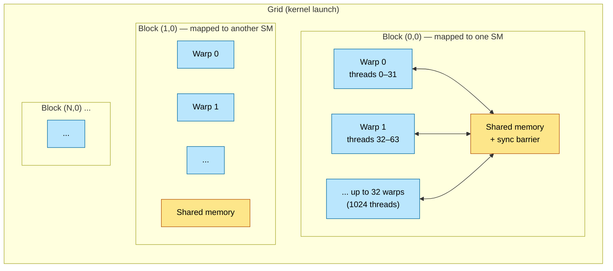
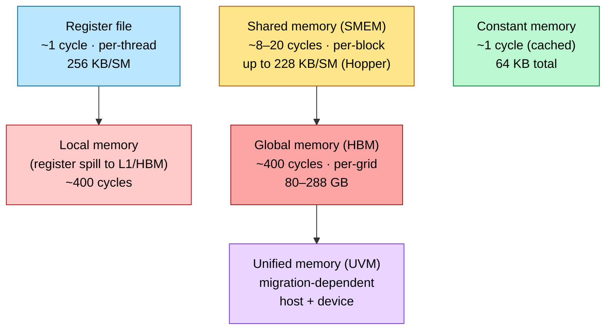
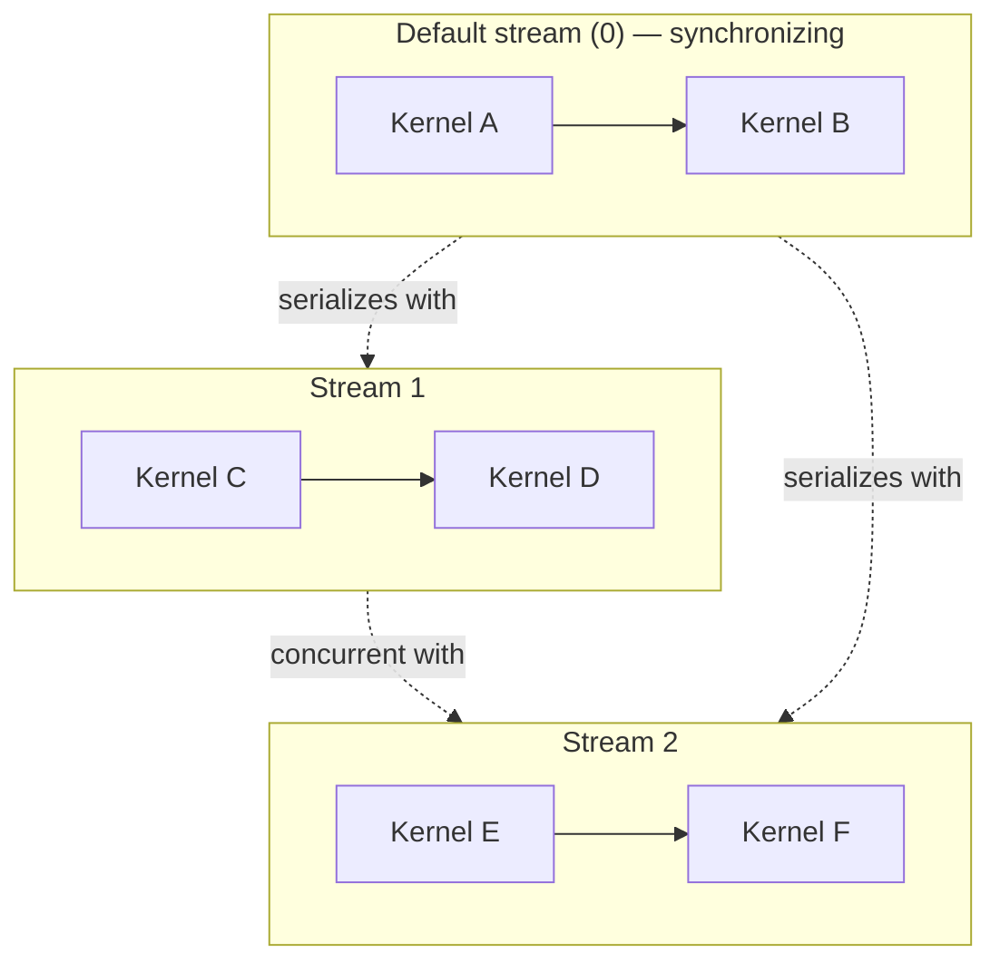
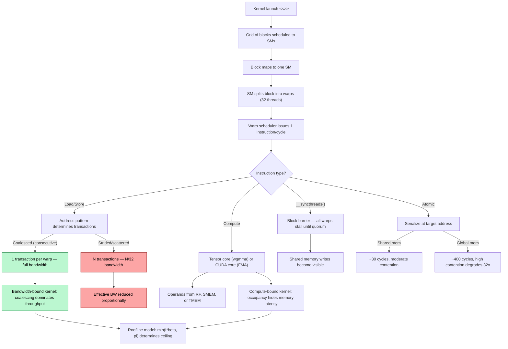

# CUDA Programming — The GPU Kernel Model

> **Layer:** L5.
> **Prerequisites:** [GPU_Architecture](../L3_Microarchitecture/GPU_Architecture.md), [Memory_Hierarchy_and_Roofline](../L3_Microarchitecture/Memory_Hierarchy_and_Roofline.md).
> **Hands off to:** [CUDA_Optimization](CUDA_Optimization.md), [Triton_and_Kernels](Triton_and_Kernels.md), [FlashAttention_Deep_Dive](FlashAttention_Deep_Dive.md).

---

## 0. The programming model in one paragraph

CUDA maps a C/C++ function onto a hierarchy of threads (grid $\to$ block $\to$ warp $\to$ thread) that mirrors the physical GPU hierarchy (device $\to$ SM $\to$ warp scheduler $\to$ lane). Every optimization in [CUDA_Optimization](CUDA_Optimization.md) and every algorithm in [FlashAttention_Deep_Dive](FlashAttention_Deep_Dive.md) derives from understanding how this mapping works: which memory space a pointer lives in, how a warp's 32 lanes map to memory transactions, and where synchronization barriers must be placed to enforce ordering. This page is the reference for that programming model — thread hierarchy, memory spaces, launch configuration, synchronization primitives, memory access patterns, atomic operations, streams and events, and a complete tiled matmul kernel. It assumes fluency with the hardware in [GPU_Architecture](../L3_Microarchitecture/GPU_Architecture.md) and the roofline model in [Memory_Hierarchy_and_Roofline](../L3_Microarchitecture/Memory_Hierarchy_and_Roofline.md).

---

## 1. The Thread Hierarchy

### 1.1 Grid, block, warp, thread



- **Grid** — the totality of all blocks launched by a single `<<<grid, block>>>` invocation. Up to $2^{31}-1$ blocks in the x-dimension, $65535$ in y and z.
- **Block (thread block)** — a group of up to 1024 threads mapped entirely to one SM. Threads within a block share the SM's shared memory (SMEM) and can synchronize via `__syncthreads()`. Blocks are independent: no cross-block synchronization within a kernel (without cooperative groups).
- **Warp** — 32 threads that execute in lockstep on a single warp scheduler (pre-Volta) or with independent thread scheduling (Volta+). The warp is the *scheduling quantum*: one instruction is issued per warp per cycle.
- **Thread** — the finest granularity. Each thread has its own register state, program counter (post-Volta), and local memory for spills.

### 1.2 Built-in indexing variables

Every CUDA kernel has access to these implicit variables:

```c
threadIdx.{x,y,z}    // thread index within its block (0 .. blockDim-1)
blockIdx.{x,y,z}     // block index within the grid   (0 .. gridDim-1)
blockDim.{x,y,z}     // dimensions of each block
gridDim.{x,y,z}      // dimensions of the grid
warpSize             // always 32 on all NVIDIA GPUs to date
```

Linearized global thread ID for a 1D configuration:

$$
\text{tid} \;=\; \text{blockIdx}_x \cdot \text{blockDim}_x + \text{threadIdx}_x
$$

For 2D configurations (image processing, matrix kernels):

```c
int col = blockIdx.x * blockDim.x + threadIdx.x;
int row = blockIdx.y * blockDim.y + threadIdx.y;
int idx = row * width + col;  // row-major linearization
```

### 1.3 Function qualifiers

| Qualifier | Called from | Runs on | Notes |
|---|---|---|---|
| `__global__` | Host (or device on recent architectures) | Device | Kernel entry point; must return `void` |
| `__device__` | Device | Device | Helper function callable from kernels |
| `__host__` | Host | Host | Normal C++ function (default) |
| `__host__ __device__` | Both | Both | Compiled twice; useful for shared math utilities |

### 1.4 The classic first kernel

```c
__global__ void vecAdd(const float *a, const float *b, float *c, int n) {
    int i = blockIdx.x * blockDim.x + threadIdx.x;
    if (i < n) c[i] = a[i] + b[i];
}

int main() {
    int n = 1 << 20;  // 1M elements
    size_t bytes = n * sizeof(float);
    float *dA, *dB, *dC;
    cudaMalloc(&dA, bytes);
    cudaMalloc(&dB, bytes);
    cudaMalloc(&dC, bytes);
    // ... cudaMemcpy dA, dB from host ...

    int tpb = 256;
    int blocks = (n + tpb - 1) / tpb;  // ceiling division
    vecAdd<<<blocks, tpb>>>(dA, dB, dC, n);
    cudaDeviceSynchronize();
    // ... cudaMemcpy dC back to host, cudaFree ...
}
```

The `<<<blocks, tpb>>>` syntax is CUDA's launch extension, translated by `nvcc` into a `cudaLaunchKernel` call. The ceiling division ensures enough blocks to cover all $n$ elements; the `if (i < n)` guard prevents out-of-bounds writes from the last partial block.

---

## 2. Memory Spaces

### 2.1 The memory hierarchy from a programming perspective



### 2.2 Complete space comparison

| Space | Scope | Lifetime | Latency | Capacity | Declaration |
|---|---|---|---|---|---|
| Register | Thread | Kernel invocation | 1 cycle | 256 KB/SM (65 536 $\times$ 32-bit) | Automatic variables in kernel |
| Local | Thread | Kernel invocation | ~400 cycles (spills to L1 then HBM) | Unbounded (spill to HBM) | Array automatics exceeding RF |
| Shared | Block | Kernel invocation | 8–20 cycles | Up to 228 KB/SM (Hopper), 48 KB default max/block | `__shared__` |
| Constant | Grid | Application | ~1 cycle (if cached) | 64 KB total, 8 KB L1 cache/SM | `__constant__` (file scope) |
| Texture/Surface | Grid | Application | ~200 cycles (cached) | HBM-backed, texture cache | `texture<>` / `surf<>` |
| Global | Grid | Until `cudaFree` | ~400 cycles | HBM capacity (80–288 GB) | `cudaMalloc` pointers |
| Unified (UVM) | Host + Device | Until `cudaFree` | Migration-dependent | HBM + host RAM | `cudaMallocManaged` |

### 2.3 Declaration syntax

```c
__constant__ float c_bias[128];    // file scope, 64 KB budget total

__global__ void kernel(float *g_in, float *g_out) {
    float reg = g_in[threadIdx.x];        // register — automatic scalar
    float arr[4];                          // register if fits; local if spills

    __shared__ float smem[256];            // static shared memory, block-scoped
    extern __shared__ float dyn_smem[];    // dynamic shared memory, sized at launch

    reg += c_bias[0];                      // constant memory read
    g_out[threadIdx.x] = reg;             // global memory write
}
```

### 2.4 Host-side allocation APIs

```c
// (1) Standard device allocation — explicit transfer required
float *d_ptr;
cudaMalloc(&d_ptr, size);
cudaMemcpy(d_ptr, h_ptr, size, cudaMemcpyHostToDevice);

// (2) Pinned (page-locked) host memory — enables DMA, higher PCIe bandwidth
float *h_pinned;
cudaMallocHost(&h_pinned, size);
// Cannot be paged out by OS; enables async transfers and overlap
// Trade-off: reduces available system RAM; pin only for hot paths

// (3) Managed (unified) memory — single address space, on-demand migration
float *um_ptr;
cudaMallocManaged(&um_ptr, size);
// CPU and GPU access the same pointer; page faults trigger migration
// Convenient for prototyping; unpredictable perf for production

// (4) Corresponding free functions
cudaFree(d_ptr);
cudaFreeHost(h_pinned);
cudaFree(um_ptr);
```

### 2.5 Pinned vs pageable transfer bandwidth

| Path | Pageable `malloc` | Pinned `cudaMallocHost` |
|---|---|---|
| PCIe Gen4 x16 H2D peak | ~6 GB/s | ~27 GB/s |
| PCIe Gen5 x16 H2D peak | ~13 GB/s | ~55 GB/s |
| Mechanism | Runtime stages via internal pinned buffer | Direct DMA from pinned pages |

The 4–5x bandwidth advantage is why pinned memory is mandatory for any transfer exceeding ~1 MB, and why PyTorch's DataLoader uses `pin_memory=True` for training.

---

## 3. Launch Configuration

### 3.1 Choosing block size

```c
int tpb = 256;                          // common values: 128, 256, 512
int n_blocks = (N + tpb - 1) / tpb;    // ceiling division to cover all elements
```

Block size constraints:
- Must be a multiple of warp size (32) to avoid wasted lanes.
- Maximum 1024 threads per block (hardware limit).
- Maximum 1024 threads per SM resident simultaneously on Hopper/Blackwell (2048 with `cudaDevAttrMaxThreadsPerMultiProcessor`).
- Typical sweet spot for bandwidth-bound kernels: 256–512 threads per block. For compute-bound tensor-core kernels (matmul), blocks of 128 threads (4 warps) are common because each warp group (4 warps) cooperates on one `wgmma` tile.

Occupancy model:

$$
\text{Occupancy} \;=\; \frac{\text{Active warps per SM}}{\text{Maximum resident warps per SM}}
$$

On Hopper: 64 warp slots, 2048 max threads. A block of 256 threads = 8 warps, allowing 8 blocks per SM at 100% occupancy. A block of 1024 threads = 32 warps, only 2 blocks per SM.

### 3.2 Multi-dimensional grids

```c
dim3 block(32, 16);    // 512 threads per block — 32 wide, 16 tall
dim3 grid((W + 31) / 32, (H + 15) / 16);
image_kernel<<<grid, block>>>(input, output, W, H);
```

Inside the kernel:

```c
int col = blockIdx.x * blockDim.x + threadIdx.x;
int row = blockIdx.y * blockDim.y + threadIdx.y;
if (col < W && row < H) {
    output[row * W + col] = input[row * W + col];
}
```

### 3.3 Dynamic shared memory

When the shared memory requirement depends on runtime parameters (tile size, sequence length):

```c
// Host side: third argument to <<<>>> is shared memory bytes
size_t smem_bytes = tile_size * tile_size * sizeof(float);
kernel<<<grid, block, smem_bytes>>>(args);

// Device side: declare with extern, no size
__global__ void kernel(...) {
    extern __shared__ float tile[];
    // tile has smem_bytes / sizeof(float) elements
}
```

### 3.4 Raising the shared memory limit

Default maximum shared memory per block is 48 KB. To access the full SM capacity (up to 228 KB on Hopper/Blackwell):

```c
cudaFuncSetAttribute(kernel,
    cudaFuncAttributeMaxDynamicSharedMemorySize, 228 * 1024);
```

Occupancy implication at 228 KB/block: only one block fits per SM (256 KB total SMEM minus overhead), limiting concurrency to 32 warps. This is acceptable for shared-memory-heavy kernels (FlashAttention, tiled matmul) where the data reuse amortizes the low occupancy.

---

## 4. Synchronization

### 4.1 Block-level: `__syncthreads()`

```c
__syncthreads();  // barrier: no thread in the block passes until all arrive
```

The CUDA memory model guarantees that all writes to shared memory (and global memory) before `__syncthreads()` are visible to all threads in the block after the barrier. Omitting it when threads communicate through shared memory is undefined behavior — not a race condition, but genuinely undefined.

Cost: near-zero within a warp (hardware scoreboard handles it). Across warps: a real stall, costing ~20–100 cycles depending on warp divergence at the barrier.

### 4.2 Warp-level: `__syncwarp()` and shuffle intrinsics

Post-Volta GPUs implement **independent thread scheduling**: threads within a warp can diverge and reconverge independently. Code that relied on implicit warp-synchronous behavior (pre-Volta lockstep) must use explicit primitives.

```c
__syncwarp(0xffffffff);                   // synchronize lanes specified by mask
float v = __shfl_sync(0xffffffff, val, src_lane);   // broadcast from src_lane
float d = __shfl_down_sync(0xffffffff, val, delta);  // shift down by delta lanes
unsigned mask = __ballot_sync(0xffffffff, pred);      // 32-bit mask: pred true per lane
int any = __any_sync(0xffffffff, pred);               // any lane has true?
int all = __all_sync(0xffffffff, pred);               // all lanes have true?
```

Classic warp-level reduction using shuffle down:

```c
__device__ float warp_reduce_sum(float val) {
    for (int offset = 16; offset > 0; offset >>= 1)
        val += __shfl_down_sync(0xffffffff, val, offset);
    return val;  // only lane 0 holds the final sum
}
```

This computes the sum of 32 values in 5 shuffle-add steps ($\log_2 32 = 5$) with zero shared memory traffic.

### 4.3 Cross-block: cooperative groups

CUDA has no primitive for cross-block synchronization within a standard kernel launch. Three alternatives:

1. **Kernel boundary as sync point.** Launch kernel A, then kernel B. All global memory writes from A are visible to B. This is the simplest and most common approach.

2. **Cooperative groups (CUDA 9+).** Launch with `cudaLaunchCooperativeKernel` to obtain a `cg::grid_group`. Calling `.sync()` on the grid group barriers all blocks. Constraint: all blocks must be resident simultaneously, limiting grid size to what fits on-chip.

3. **Atomic counter barrier.** Thread 0 in each block `atomicAdd`s a global counter, then spins until the counter equals the number of blocks. Fragile — easy to deadlock if any block hits an exception or early exit.

### 4.4 Cooperative groups API (modern usage)

```c
#include <cooperative_groups.h>
namespace cg = cooperative_groups;

__global__ void kernel(...) {
    cg::thread_block cta = cg::this_thread_block();   // block-level group
    cg::thread_block_tile<32> warp = cg::tiled_partition<32>(cta);

    // Block-level sync (equivalent to __syncthreads)
    cg::sync(cta);

    // Warp-level tile sync (equivalent to __syncwarp)
    cg::sync(warp);

    // Warp-level shuffle via tile
    float val = warp.shfl(val, src_lane);
}
```

Cooperative groups provide a uniform interface that generalizes `__syncthreads`, `__syncwarp`, and shuffle operations. CUTLASS 3.x and modern kernel libraries use cooperative groups exclusively.

---

## 5. Streams, Events, and Concurrency

### 5.1 CUDA streams



Streams are the primary mechanism for expressing concurrency:

```c
cudaStream_t s1, s2;
cudaStreamCreate(&s1);
cudaStreamCreate(&s2);

// Operations on the same stream are ordered
kernelA<<<grid, block, 0, s1>>>(args);
kernelB<<<grid, block, 0, s1>>>(args);    // waits for kernelA

// Operations on different streams can overlap (hardware permitting)
kernelC<<<grid, block, 0, s1>>>(args);    // compute on s1
cudaMemcpyAsync(d_data, h_data, bytes, cudaMemcpyHostToDevice, s2);  // copy on s2
```

The default stream (stream 0) is **synchronizing**: it waits for all prior work on all streams to complete, and all subsequent work on all streams waits for it. Use non-default streams for any concurrent execution.

### 5.2 Events for timing and inter-stream dependencies

```c
cudaEvent_t start, stop;
cudaEventCreate(&start);
cudaEventCreate(&stop);

cudaEventRecord(start, stream);
kernel<<<grid, block, 0, stream>>>();
cudaEventRecord(stop, stream);

cudaEventSynchronize(stop);
float ms;
cudaEventElapsedTime(&ms, start, stop);
// ms = kernel execution time in milliseconds
```

Inter-stream dependency via events:

```c
cudaEventRecord(done_event, compute_stream);
cudaStreamWaitEvent(copy_stream, done_event, 0);  // copy_stream stalls until compute finishes
```

### 5.3 Double-buffering pattern

Overlapping H2D transfer of chunk $i+1$ with computation on chunk $i$:

```c
cudaStream_t copy_stream, compute_stream;
cudaStreamCreate(&copy_stream);
cudaStreamCreate(&compute_stream);

for (int chunk = 0; chunk < n_chunks; chunk++) {
    int buf = chunk % 2;
    cudaStreamSynchronize(compute_stream);  // ensure buf is free
    cudaMemcpyAsync(d_in[buf], h_in[chunk], size, cudaMemcpyHostToDevice, copy_stream);
    process<<<grid, block, 0, compute_stream>>>(d_in[buf], d_out[buf]);
}
```

Requirements for overlap: pinned host memory, GPU with at least 2 copy engines (standard on datacenter GPUs; some consumer GPUs have only 1).

### 5.4 CUDA graphs

For kernels launched in a tight loop (decode inference, small-batch training), per-launch overhead is ~5–10 $\mu$s. CUDA graphs capture the operation DAG once, then replay it:

```c
cudaGraph_t graph;
cudaGraphExec_t instance;

// Capture phase
cudaStreamBeginCapture(stream, cudaStreamCaptureModeGlobal);
for (auto &k : kernels) k.launch(stream);
cudaStreamEndCapture(stream, &graph);

// Instantiate once
cudaGraphInstantiate(&instance, graph, nullptr, nullptr, 0);

// Replay many times — single launch call
for (int step = 0; step < N; step++)
    cudaGraphLaunch(instance, stream);
```

vLLM and TensorRT-LLM both use CUDA graphs for the decode loop, amortizing launch overhead across thousands of inference steps.

For variable batch sizes (common in LLM decode), re-capturing the graph per step defeats the purpose. Instead, use `cudaGraphExecKernelNodeSetParams` to update kernel node arguments and grid dimensions on an already-instantiated graph. The graph topology is preserved; only the launch parameters change. This reduces per-step overhead to the graph launch cost (~2-3 $\mu$s) versus ~50-100 $\mu$s for re-capture. See Section 9.5.6 for a complete code example.

---

## 6. Memory Access Patterns

### 6.1 Coalescing

A warp's 32 threads issue a single load instruction. If the 32 addresses are consecutive 4-byte words aligned to a 128-byte segment, the hardware satisfies the load in **one memory transaction**. Any deviation requires additional transactions.

```c
float a = arr[threadIdx.x];           // coalesced: 1 transaction for 128 B
float b = arr[threadIdx.x * 2];       // strided by 2: 2 transactions
float c = arr[threadIdx.x * 32];      // worst case: 32 transactions (1/32 BW)
float d = arr[7];                      // broadcast: 1 transaction (same address)
```

The impact on effective bandwidth is proportional:

$$
\text{Effective BW} \;=\; \frac{\text{Peak BW}}{\text{Transactions per warp}}
$$

### 6.2 Array of Structures vs Structure of Arrays

```c
// AoS: each thread reads one field of its struct — strided access
struct Particle { float x, y, z, vx, vy, vz; };
Particle particles[N];
__global__ void bad(Particle *p) { float x = p[threadIdx.x].x; }
// Thread 0 reads offset 0, thread 1 reads offset 6, ..., stride = 6 words = 24 B
// => scattered, multiple transactions per warp

// SoA: each field is a contiguous array — coalesced access
struct Particles {
    float *x, *y, *z, *vx, *vy, *vz;
};
__global__ void good(Particles p) { float x = p.x[threadIdx.x]; }
// Thread 0 reads x[0], thread 1 reads x[1], ..., contiguous => 1 transaction
```

### 6.3 Shared memory bank conflicts

Shared memory is organized into 32 banks of 4-byte words. Bank $b$ holds addresses at offsets $b, b+128, b+256, \ldots$ bytes. The critical rule:

- **Different banks** $\to$ parallel access, 1 cycle.
- **Same bank, different addresses** $\to$ bank conflict, serialized ($n$-way conflict costs $n$ cycles).
- **Same bank, same address** $\to$ broadcast, no conflict (1 cycle).

```c
__shared__ float smem[32][32];

// Pattern A: smem[threadIdx.x][k] — row varies, column fixed
// All threads read column k => all hit the same bank => 32-way conflict

// Pattern B: smem[k][threadIdx.x] — column varies, row fixed
// Each thread hits a different bank => no conflict

// Fix: pad by 1 column to rotate bank assignments
__shared__ float smem_padded[32][33];  // 33 columns breaks the stride-32 pattern
// smem_padded[k][threadIdx.x] is now conflict-free for all k
```

### 6.4 Alignment and vector loads

`cudaMalloc` returns 256-byte-aligned pointers. For coalesced access, 128-byte alignment suffices. Vector types enforce alignment at the type level and improve bandwidth utilization:

```c
float4 *data = (float4*)d_ptr;  // 16-byte aligned
float4 v = data[threadIdx.x];   // each thread loads 16 B; warp loads 512 B
// At 4 B/float, one float4 per thread = 4 elements per thread
// Same memory traffic but fewer instructions, better ILP
```

For bandwidth-bound kernels, `float4` loads typically yield 20–30% speedup over scalar `float` loads by reducing address-arithmetic overhead and improving load/store unit utilization.

---

## 7. Atomic Operations

### 7.1 Available operations

```c
atomicAdd(&counter, 1);          // int, unsigned, float; double on CC >= 6.0
atomicSub(&counter, 1);          // int, unsigned
atomicMin(&min_val, x);          // int, unsigned
atomicMax(&max_val, x);          // int, unsigned
atomicCAS(&lock, 0, 1);          // compare-and-swap: returns old value
atomicExch(&ptr, new_val);       // exchange: returns old value
atomicAnd / atomicOr / atomicXor // bitwise operations
```

### 7.2 Latency and contention

| Target | Latency | Contention scaling |
|---|---|---|
| Global memory (HBM) | ~400 cycles | Linear degradation to ~1/32 throughput at high contention |
| Shared memory | ~30 cycles | Fewer conflicts due to lower latency |

Heavily contended atomics (many threads writing the same address) degrade throughput by up to 32x because each atomic serializes at the memory controller. For reduction patterns, reduce within shared memory first, then use a single atomic per block.

### 7.3 Block-reduce-then-atomic pattern

```c
__global__ void reduce_sum(const float *input, float *output, int n) {
    __shared__ float partial[256];
    int tid = threadIdx.x;
    int gid = blockIdx.x * blockDim.x + tid;

    // Load with bounds check
    partial[tid] = (gid < n) ? input[gid] : 0.0f;
    __syncthreads();

    // Tree reduction in shared memory
    for (int s = blockDim.x >> 1; s > 0; s >>= 1) {
        if (tid < s) partial[tid] += partial[tid + s];
        __syncthreads();
    }

    // One thread per block atomically adds block result to global total
    if (tid == 0) atomicAdd(output, partial[0]);
}
```

This pattern is the building block for all GPU reduction algorithms. The tree reduction costs $\log_2(\text{blockDim})$ steps in shared memory (fast), and only one atomic per block touches global memory (low contention).

---

## 8. Error Handling

### 8.1 The macro pattern

CUDA errors from runtime API calls are returned as `cudaError_t` codes. Kernel launches return errors asynchronously. The standard pattern:

```c
#define CUDA_CHECK(err) do { \
    cudaError_t _e = (err); \
    if (_e != cudaSuccess) { \
        fprintf(stderr, "CUDA error %s at %s:%d: %s\n", \
            cudaGetErrorName(_e), __FILE__, __LINE__, \
            cudaGetErrorString(_e)); \
        abort(); \
    } \
} while (0)

CUDA_CHECK(cudaMalloc(&d_ptr, size));
kernel<<<grid, block>>>(args);
CUDA_CHECK(cudaGetLastError());        // launch-time errors (e.g., invalid config)
CUDA_CHECK(cudaDeviceSynchronize());   // async runtime errors from kernel body
```

### 8.2 Common errors and their meaning

| Error | Cause | Severity |
|---|---|---|
| `cudaErrorInvalidConfiguration` | Block > 1024 threads, or shared mem > limit | Immediate, obvious |
| `cudaErrorIllegalAddress` | Out-of-bounds read/write in kernel | **Critical**: corrupts GPU context |
| `cudaErrorLaunchTimeout` | Kernel exceeded watchdog timeout (display GPUs) | Kernel too slow or infinite loop |
| `cudaErrorECCUncorrectable` | Hardware ECC error in HBM | GPU goes offline; hardware fault |
| `cudaErrorAssert` | `__assert()` triggered inside kernel | Similar to host assert; recoverable on newer drivers |

`cudaErrorIllegalAddress` is the most dangerous common error. It indicates a memory corruption bug (likely OOB access) that has corrupted the GPU context. Subsequent kernels produce undefined results even if they are themselves correct. The only recovery is to destroy the CUDA context (restart the process).

---

## 9. Complete Matmul Kernel

### 9.1 Tiled matrix multiplication

This kernel illustrates shared memory tiling, block-level synchronization, and coalesced access. It is pedagogically complete but not production-quality — real matmul uses tensor cores, double buffering, and asynchronous copies (covered in [CUDA_Optimization](CUDA_Optimization.md)).

```c
#define BM 128   // tile rows
#define BN 128   // tile columns
#define BK 16    // tile K-dimension

__global__ void matmul(const float * __restrict__ A,
                       const float * __restrict__ B,
                       float * __restrict__ C,
                       int M, int N, int K) {
    // Shared memory tiles for A and B
    __shared__ float sA[BM][BK];
    __shared__ float sB[BK][BN];

    // Output element assigned to this thread
    int row = blockIdx.y * BM + threadIdx.y;
    int col = blockIdx.x * BN + threadIdx.x;

    float acc = 0.0f;

    // Loop over K dimension in tiles of BK
    for (int k_tile = 0; k_tile < K; k_tile += BK) {
        // Cooperative load: each thread loads one element of A tile
        if (row < M && (k_tile + threadIdx.x) < K)
            sA[threadIdx.y][threadIdx.x] = A[row * K + k_tile + threadIdx.x];
        else
            sA[threadIdx.y][threadIdx.x] = 0.0f;

        // Cooperative load: each thread loads one element of B tile
        if (col < N && (k_tile + threadIdx.y) < K)
            sB[threadIdx.y][threadIdx.x] = B[(k_tile + threadIdx.y) * N + col];
        else
            sB[threadIdx.y][threadIdx.x] = 0.0f;

        __syncthreads();  // wait for tile to load

        // Compute partial dot product for this tile
        #pragma unroll
        for (int kk = 0; kk < BK; kk++) {
            acc += sA[threadIdx.y][kk] * sB[kk][threadIdx.x];
        }

        __syncthreads();  // wait before overwriting tiles
    }

    // Write result
    if (row < M && col < N)
        C[row * N + col] = acc;
}

// Launch configuration:
// dim3 block(BK, BM / BK);  // 16 x 8 = 128 threads (adjust for your blocking)
// dim3 grid((N + BN - 1) / BN, (M + BM - 1) / BM);
// matmul<<<grid, block>>>(d_A, d_B, d_C, M, N, K);
```

### 9.2 Why this kernel is far from optimal

| Optimization | Status in above kernel | Impact |
|---|---|---|
| Shared memory tiling | Done | ~10x over naive |
| Coalesced global loads | Partial | Depends on thread mapping |
| Tensor cores (`wmma`/`wgmma`) | Not used | ~30x additional throughput |
| Double buffering (prefetch) | Not done | Hides load latency |
| Async copies (`cp.async` / TMA) | Not used | Frees warp issue slots |
| Register tiling (per-thread accumulators) | Minimal | Reduces SMEM traffic |
| Warp-level cooperative MMA | Not done | Required for tensor cores |

A production matmul (cuBLAS / CUTLASS) achieves ~900 TFLOPS on H100 vs ~2 TFLOPS for the above naive tiled kernel — a 450x gap. Closing this gap is the subject of [CUDA_Optimization](CUDA_Optimization.md) and [Triton_and_Kernels](Triton_and_Kernels.md).

### 9.5 Hopper Warp-Specialized Programming

The Hopper architecture (SM90) introduces a fundamentally different kernel execution model where warp groups take on specialized producer and consumer roles, coordinated by hardware-accelerated barrier objects and asynchronous memory copies. CUTLASS 3.x kernels use this pattern exclusively. Understanding it is essential for reasoning about Hopper-era tensor-core performance.

#### 9.5.1 Asynchronous memory copies (`cp.async`) and TMA

On pre-Hopper GPUs, a warp loads data from global memory by issuing load instructions that occupy issue slots for ~400 cycles. Hopper decouples data movement from warp execution through two mechanisms: the `cp.async` instruction family and the Tensor Memory Accelerator (TMA).

**`cp.async`** initiates a copy from global memory to shared memory without stalling the issuing warp. The warp proceeds to other work while the copy engine handles the transfer:

```c
// cp.async: copy 4/8/16 bytes from global to shared memory
// The warp issues the copy and continues — does not wait for completion
uint32_t smem_ptr = __cvta_generic_to_shared(smem_dst);
asm volatile(
    "cp.async.ca.shared.global [%0], [%1], %2;\n"
    :: "r"(smem_ptr), "l"(gmem_src), "n"(16)
);
```

**`cp.async.bulk.global.shared`** copies an entire block (up to 256 bytes) in one instruction. Combined with `cp.async.commit_group` and `cp.async.wait_group`, warps can pipeline multiple outstanding copies.

**TMA (Tensor Memory Accelerator)** goes further: a single thread issues a multidimensional tensor load, and the TMA hardware handles address computation, bounds checking, and swizzling — transferring an entire tile (up to tens of KB) to shared memory. The issuing warp group is completely free during the transfer:

```c
// TMA load: one thread initiates the transfer for the entire warp group
// tensor_map describes the tensor dimensions, strides, and box size in global memory
// smem_ptr is the destination in shared memory
// mbarrier_ptr tracks completion

// Create a TMA descriptor (host side, once per tensor)
CUtensorMap tma_desc;
cuTensorMapEncodeTiled(
    &tma_desc,
    CU_TENSOR_MAP_DATA_TYPE_FLOAT32,
    2,                          // rank (2D)
    d_tensor,                   // global memory base
    dims,                       // global dimensions
    strides,                    // global strides
    box_dims,                   // SMEM tile dimensions
    tile_strides,               // element strides within tile
    CU_TENSOR_MAP_INTERLEAVE_NONE,
    CU_TENSOR_MAP_SWIZZLE_NONE,
    CU_TENSOR_MAP_L2_PROMOTION_NONE,
    CU_TENSOR_MAP_FLOAT_OOB_FILL_NONE
);

// Device side: issue TMA load from a single thread
if (threadIdx.x == 0) {
    cute::SM90_TMA_LOAD::copy(
        &tma_desc,
        smem_buffer,
        mbarrier_ptr,
        tile_coord   // {row, col} offset into the global tensor
    );
}
```

TMA is the backbone of CUTLASS 3.x data loading. A single thread issues the load; the hardware streams the tile into shared memory; an `mbarrier` signals completion. The remaining 127 threads in the warp group are free to perform computation.

#### 9.5.2 Warp-specialized kernel pattern

The core pattern: within a single thread block, warp group 0 (warps 0–3, threads 0–127) acts as the **producer** (loads tiles via TMA), while warp group 1 (warps 4–7, threads 128–255) acts as the **consumer** (executes `wgmma` tensor-core operations on the loaded tiles). This is cooperative warp divergence — each warp group runs a different code path.

```c
__global__ void __launch_bounds__(256, 1)
wgmma_matmul(/* ... */) {
    // Identify warp group: 0 = producer (TMA), 1 = consumer (wgmma)
    int warp_group_idx = __shfl_sync(0xffffffff, threadIdx.x / 128, 0);

    // Shared memory: double-buffered tiles for A and B
    extern __shared__ uint128_t smem[];
    float *sA_buf0 = reinterpret_cast<float*>(smem);
    float *sB_buf0 = sA_buf0 + TILE_M * TILE_K;
    float *sA_buf1 = sB_buf0 + TILE_K * TILE_N;
    float *sB_buf1 = sA_buf1 + TILE_M * TILE_K;

    // Producer and consumer mbarriers
    __shared__ uint64_t mbarrier_produce[2];  // producer signals: buffer loaded
    __shared__ uint64_t mbarrier_consume[2];  // consumer signals: buffer consumed

    if (warp_group_idx == 0) {
        // === PRODUCER (TMA loader) ===
        for (int k_tile = 0; k_tile < K; k_tile += TILE_K) {
            int buf = (k_tile / TILE_K) % 2;

            // Wait for consumer to finish with this buffer
            mbarrier::wait_parity(&mbarrier_consume[buf], phase_consume[buf]);

            // Issue TMA loads for A and B tiles (single thread per warp group)
            if (threadIdx.x % 128 == 0) {
                cute::SM90_TMA_LOAD::copy(&tma_A, sA_buf[buf], &mbarrier_produce[buf], coord_A);
                cute::SM90_TMA_LOAD::copy(&tma_B, sB_buf[buf], &mbarrier_produce[buf], coord_B);
            }
            // Arrive on mbarrier: TMA hardware will also arrive (expect = 2)
            // When both TMA loads complete, mbarrier signals ready
        }
    } else {
        // === CONSUMER (wgmma compute) ===
        // Accumulator registers — one per thread in the warp group
        float accum[TILE_M * TILE_N / 128] = {0};

        for (int k_tile = 0; k_tile < K; k_tile += TILE_K) {
            int buf = (k_tile / TILE_K) % 2;

            // Wait for producer to load this buffer
            mbarrier::wait_parity(&mbarrier_produce[buf], phase_produce[buf]);

            // Issue wgmma on the loaded tiles
            wgmma_fence();
            wgmma::mma<A_layout, B_layout>(
                accum,
                sA_buf[buf],    // shared memory descriptor for A
                sB_buf[buf],    // shared memory descriptor for B
                accum
            );
            wgmma_commit_group();

            // Signal producer: this buffer is consumed
            mbarrier::arrive(&mbarrier_consume[buf]);
        }
        // Write accumulators to global memory
    }
}
```

This pattern is the foundation of CUTLASS 3.x collective operations. The producer warp group never computes; the consumer warp group never loads. Synchronization between them is handled entirely by `mbarrier` objects — no `__syncthreads()` needed.

#### 9.5.3 `wgmma` (Warp Group Matrix Multiply Accumulate)

The `wgmma` instruction is Hopper's tensor-core operation for warp-group-wide matrix multiply. A single `wgmma` call consumes 128 threads (4 warps) to compute a matrix product from shared memory operands into register accumulators.

**API (via PTX inline assembly or CUTLASS wrappers):**

```
wgmma.mma_async.sync.aligned.m64n128k32.f32.f16.f16
    {%d0, ..., %d63},    // 64 accumulator registers (FP32)
    {%a0, ..., %a7},     // SMEM descriptor for A (FP16, 64x32 tile)
    {%b0, ..., %b15},    // SMEM descriptor for B (FP16, 32x128 tile)
    {};                   // accumulator scaling (identity for accumulate)
```

**Dataflow:**

1. **SMEM → TMEM.** The `wgmma` hardware reads matrix tiles from shared memory into Tensor Memory (TMEM), a 32 KB register file dedicated to the warp group's tensor-core pipeline.

2. **TMEM → Tensor cores.** The tensor-core matrix multiply unit operates on the TMEM-resident operands: $D = A \times B + C$ where $A \in \mathbb{R}^{64 \times 32}$ (FP16), $B \in \mathbb{R}^{32 \times 128}$ (FP16), $C, D \in \mathbb{R}^{64 \times 128}$ (FP32 accumulators).

3. **Tensor cores → Accumulator registers.** The 128 output values are distributed across the 128 threads of the warp group — each thread holds a slice of the output tile in its FP32 registers.

Key properties:
- **Asynchronous.** `wgmma` is fire-and-forget: the warp group issues it and the tensor-core pipeline executes independently. `wgmma_commit_group` + `wgmma_wait_group` provide ordering.
- **SMEM-direct.** Unlike `wmma` (Ampere), `wgmma` reads operands directly from shared memory — no explicit register loading step.
- **Large tiles.** A single `wgmma.mma_async.m64n128k32` computes $64 \times 128 \times 32 = 262\,144$ FMA operations per invocation, amortizing instruction overhead.
- **Mixed precision.** Operands can be FP16, BF16, FP8 (E4M3/E5M2), or INT8. Accumulators are always FP32 (or FP32 with FP8 via `wgmma.mma_async` with scale factors).

On H100 SXM, `wgmma` delivers up to 989 TFLOPS (FP16/BF16 with FP32 accumulate) — the instruction is the performance-critical path in every Hopper matmul kernel.

#### 9.5.4 `mbarrier` arrival-based synchronization

`mbarrier` is a hardware barrier object resident in shared memory. It replaces `__syncthreads()` for producer-consumer patterns between warp groups. Unlike `__syncthreads()` (which is monolithic — all-or-nothing), `mbarrier` supports partial arrivals and can track asynchronous operations like TMA transfers.

**Operations:**

| Operation | Semantics |
|---|---|
| `mbarrier.init(&bar, count)` | Initialize with `count` expected arrivals |
| `mbarrier.arrive(&bar)` | Thread arrives; decrements the pending count |
| `mbarrier.arrive_drop(&bar)` | Thread arrives AND reduces the expected count by 1 |
| `mbarrier.wait(&bar, phase)` | Spin until `phase` flips (all expected arrivals complete) |
| `mbarrier.test_wait(&bar, phase)` | Non-blocking test; returns `true` if phase flipped |

**Expect/arrive semantics.** The barrier tracks two counts: the number of *expected* arrivals and the number of *pending* arrivals. When a thread calls `mbarrier.arrive`, it decrements the pending count. When the TMA hardware completes a transfer, it also decrements the pending count. The barrier signals completion when pending reaches zero.

```c
__shared__ uint64_t bar;

// One thread initializes the barrier with expected arrival count = 2
// (one TMA load completion + one explicit warp-group arrival)
if (threadIdx.x == 0) {
    mbarrier::init(&bar, 2);  // expect 2 arrivals
}

// Producer thread 0: initiate TMA load (hardware will arrive on bar)
// Producer warp group: explicit arrive after initiating the load
mbarrier::arrive(&bar);

// Consumer: wait for both the TMA completion and the producer's explicit arrival
mbarrier::wait(&bar, /*phase=*/0);  // blocks until both arrivals
```

**Phase parity.** `mbarrier` uses a phase bit to distinguish between successive wait cycles. After all expected arrivals complete, the phase flips. A `wait(&bar, phase)` call blocks until the current phase differs from the specified phase. For double-buffering, the consumer alternates between `wait(&bar, 0)` and `wait(&bar, 1)` on successive iterations.

This mechanism is what enables zero-overlap synchronization between the TMA hardware and warp groups — no spin loops, no polling, no `__syncthreads()` that stalls the entire block.

#### 9.5.5 Double-buffering with warp specialization

The full pipeline: while the consumer warp group computes `wgmma` on buffer 0, the producer warp group loads the next tile into buffer 1 via TMA. The two warp groups never contend on the same buffer.

```c
__global__ void __launch_bounds__(256, 1)
pipeline_matmul(/* args */) {
    int wg = threadIdx.x / 128;  // 0 = producer, 1 = consumer

    extern __shared__ float smem[];
    float *buf[2] = { smem, smem + TILE_BYTES / sizeof(float) };
    __shared__ uint64_t bar_loaded[2], bar_consumed[2];

    if (threadIdx.x == 0) {
        for (int i = 0; i < 2; i++) {
            mbarrier::init(&bar_loaded[i], 2);   // TMA + explicit arrive
            mbarrier::init(&bar_consumed[i], 1);  // consumer arrive
        }
    }
    __syncthreads();

    int phase_l[2] = {0, 0}, phase_c[2] = {0, 0};
    int n_tiles = K / TILE_K;

    if (wg == 0) {
        // Producer: issue TMA loads, signal loaded, wait consumed
        // Prologue: load first two tiles
        for (int t = 0; t < min(2, n_tiles); t++) {
            int b = t % 2;
            mbarrier::wait_parity(&bar_consumed[b], phase_c[b] & 1);
            if (threadIdx.x % 128 == 0) {
                tma_load(buf[b], &bar_loaded[b], /*tile=*/t);
            }
            mbarrier::arrive(&bar_loaded[b]);
            phase_c[b]++;
        }
        // Steady state: load tile t while consuming tile t-2
        for (int t = 2; t < n_tiles; t++) {
            int b = t % 2;
            mbarrier::wait_parity(&bar_consumed[b], phase_c[b] & 1);
            if (threadIdx.x % 128 == 0) {
                tma_load(buf[b], &bar_loaded[b], /*tile=*/t);
            }
            mbarrier::arrive(&bar_loaded[b]);
            phase_c[b]++;
        }
    } else {
        // Consumer: wait loaded, compute wgmma, signal consumed
        float accum[NUM_ACCUM] = {0};

        for (int t = 0; t < n_tiles; t++) {
            int b = t % 2;

            // Wait for producer to finish loading this buffer
            mbarrier::wait_parity(&bar_loaded[b], phase_l[b] & 1);

            // Compute on the loaded tile
            wgmma_fence();
            wgmma_mma(accum, buf[b], buf[b] + TILE_A, accum);
            wgmma_commit_group();

            // Signal: buffer is consumed, producer can overwrite it
            mbarrier::arrive(&bar_consumed[b]);
            phase_l[b]++;
        }

        wgmma_wait_group<0>();
        // Store accumulators to global C
        store_accumulators(accum);
    }
}
```

The pipeline has three phases: **prologue** (load buffers 0 and 1), **steady state** (load tile $t$ into buffer $t \bmod 2$ while computing on tile $t-2$), and **epilogue** (drain remaining computation, store results). In steady state, the TMA load and `wgmma` execute concurrently on separate hardware units, achieving full overlap.

On H100, a well-tuned CUTLASS 3.x kernel with this pattern achieves $>90\%$ of peak tensor-core throughput for large matmuls ($M, N, K \geq 256$).

#### 9.5.6 CUDA Graph node update for dynamic shapes

In inference serving, the decode phase processes variable batch sizes. Re-capturing a CUDA graph for each new batch size is expensive. Hopper-era drivers support **graph node update**: instantiate the graph once, then update kernel node parameters before each replay.

```c
// Capture the graph once with maximum batch size
cudaStreamBeginCapture(stream, cudaStreamCaptureModeGlobal);
decode_kernel<<<grid_max, block, smem, stream>>>(
    d_input, d_output, d_kv_cache, max_batch /* batch arg */);
cudaStreamEndCapture(stream, &graph);
cudaGraphInstantiate(&graph_exec, graph, NULL, NULL, 0);

// At inference time: update the batch-size argument without re-capturing
for (int step = 0; step < num_steps; step++) {
    int cur_batch = batch_sizes[step];

    // Update kernel node params: only the changed arguments
    cudaKernelNodeParams params = {};
    params.func = (void*)decode_kernel;
    params.gridDim = dim3((cur_batch + 63) / 64, num_heads);
    params.blockDim = dim3(64, 1, 1);
    params.sharedMemBytes = smem_bytes;
    params.kernelParams = new void*[4]{
        &d_input, &d_output, &d_kv_cache, &cur_batch
    };

    cudaGraphExecKernelNodeSetParams(graph_exec, node, &params);
    cudaGraphLaunch(graph_exec, stream);
}
```

`cudaGraphExecKernelNodeSetParams` modifies the launch configuration and kernel arguments of an existing node in the instantiated graph. The graph topology (dependencies between nodes) is preserved — only the kernel parameters change. This avoids the capture overhead ($\sim 50\text{--}100\ \mu\text{s}$) on each step, reducing the per-step overhead to the graph launch cost ($\sim 2\text{--}3\ \mu\text{s}$).

vLLM uses this technique for its decode runner: the graph is captured once with symbolic batch size, then updated with the actual batch size at each decoding step.

---

## 11. PyTorch Integration

### 11.1 C++/CUDA extension via setuptools

```python
# setup.py
from torch.utils.cpp_extension import BuildExtension, CUDAExtension
from setuptools import setup

setup(
    name="myops",
    ext_modules=[CUDAExtension("myops", ["kernel.cu"])],
    cmdclass={"build_ext": BuildExtension},
)
```

```cpp
// kernel.cu
#include <torch/extension.h>

__global__ void vec_add_kernel(const float* a, const float* b,
                                float* out, int n) {
    int i = blockIdx.x * blockDim.x + threadIdx.x;
    if (i < n) out[i] = a[i] + b[i];
}

torch::Tensor vec_add(torch::Tensor a, torch::Tensor b) {
    TORCH_CHECK(a.is_cuda() && b.is_cuda(), "Inputs must be CUDA tensors");
    auto out = torch::empty_like(a);
    int n = a.numel();
    int tpb = 256;
    vec_add_kernel<<<(n + tpb - 1) / tpb, tpb>>>(
        a.data_ptr<float>(), b.data_ptr<float>(), out.data_ptr<float>(), n);
    return out;
}

PYBIND11_MODULE(myops, m) {
    m.def("vec_add", &vec_add, "Element-wise vector addition");
}
```

Build and use:

```bash
pip install .            # JIT-compiles kernel.cu with the detected CUDA toolkit
```

```python
import myops, torch
a = torch.randn(1024, device='cuda')
b = torch.randn(1024, device='cuda')
c = myops.vec_add(a, b)
```

### 11.2 Production patterns

For production-quality kernels integrated with PyTorch:

- `at::cuda::CUDAStream` — stream management integrated with PyTorch's autograd engine.
- `at::cuda::CUDAGuard` — sets and restores the active CUDA device.
- `AT_DISPATCH_FLOATING_TYPES` — macro for dtype dispatch (handles float, double, half, bfloat16).
- `torch.utils.cpp_extension.CUDAExtension` — handles CUDA toolkit detection, architecture flags (`-gencode`), and include paths automatically.

### 11.3 Triton for rapid kernel development

Triton provides a Python-level DSL for GPU kernels that compiles to PTX via LLVM. For many workloads, Triton achieves 90–95% of hand-tuned CUDA performance with dramatically lower engineering cost. See [Triton_and_Kernels](Triton_and_Kernels.md) for the full treatment.

---

## 12. Warp Divergence

### 12.1 The divergence penalty

When threads within a warp take different branches of a conditional, the hardware executes each path serially with the non-participating threads masked off. A divergent warp with $p$ paths costs roughly $p\times$ the instruction throughput for that region.

```c
// Bad: half the warp is idle for each branch
if (threadIdx.x < 16) {
    // Path A — 16 active threads, 16 masked
    result = expensive_op_a(data);
} else {
    // Path B — 16 active threads, 16 masked
    result = expensive_op_b(data);
}
```

### 12.2 Mitigation strategies

1. **Align conditionals with warp boundaries.** Structure data so that all threads in a warp take the same branch. For a block of 256 threads (8 warps), the first 4 warps take path A, the last 4 take path B.

2. **Warp-specialized kernels (Hopper+).** Different warps within a block perform different roles (e.g., warps 0–3 load data via TMA, warps 4–7 compute `wgmma`). This is cooperative divergence, not accidental — the warp scheduler handles it natively.

3. **Predicate elimination.** Replace `if/else` with arithmetic: `result = mask * path_a + (1 - mask) * path_b`. Costs extra compute but avoids divergence. Worth it when both paths are cheap single instructions.

---

## 13. End-to-End Cause / Effect



---

## 14. Numbers to Memorize

| Quantity | Value | Significance |
|---|---|---|
| Warp size | 32 threads | Fundamental scheduling unit; all parallelism is in multiples of 32 |
| Max threads/block | 1024 | Hardware limit; 32 warps per block maximum |
| Max threads/SM (Hopper) | 2048 | 64 warp slots; determines occupancy ceiling |
| Max blocks/SM (Hopper) | 32 | Even at 1 thread/block, max 32 blocks |
| Register file/SM | 256 KB (65 536 $\times$ 32-bit) | Thread register budget = floor(65536 / resident_threads) |
| Shared memory/SM (Hopper) | 228 KB | Default max per block: 48 KB; opt in to full 228 KB |
| Constant memory total | 64 KB | Read-only, broadcast-optimized, cached per SM |
| SMEM latency | 8–20 cycles | ~20x faster than global memory |
| Global memory (HBM) latency | ~400 cycles | Why high occupancy and SMEM tiling matter |
| PCIe Gen4 x16 pinned BW | ~27 GB/s | H2D transfer ceiling; pageable is ~6 GB/s |
| PCIe Gen5 x16 pinned BW | ~55 GB/s | Next-gen transfer ceiling |
| NVLink 4 BW | 900 GB/s (bidirectional) | GPU-to-GPU on H100 |
| NVLink 5 BW | 1.8 TB/s (bidirectional) | GPU-to-GPU on B200 |
| Kernel launch overhead | ~5–10 $\mu$s | Why CUDA graphs exist for small kernels |
| SMEM banks | 32 (4-byte interleaved) | Bank conflicts serialize at same-bank accesses |
| Max grid dim x | $2^{31}-1$ blocks | Effectively unlimited for 1D grids |
| Max grid dim y, z | 65535 blocks | Common trap for 2D/3D grids |

---

## 15. Worked Interview Problems

### Problem 1: Occupancy calculation

**Question.** A kernel uses 64 registers per thread and launches blocks of 256 threads. What is the occupancy on Hopper? Is it sufficient for a memory-bound kernel?

**Derivation.** Per-SM register file: 65 536 registers. Threads per block: 256. Registers per thread: 64. Registers needed per block: $256 \times 64 = 16\,384$. Blocks per SM limited by registers: $\lfloor 65\,536 / 16\,384 \rfloor = 4$. Blocks per SM limited by threads: $\lfloor 2048 / 256 \rfloor = 8$. Register limit is binding: 4 blocks. Active warps: $4 \times 256 / 32 = 32$. Occupancy: $32 / 64 = 50\%$.

For a memory-bound kernel, 50% occupancy provides 32 active warps. The rule of thumb for hiding ~400-cycle HBM latency is $W_{\min} \approx 80$ warps (latency / issue interval). At 32 warps, some memory latency stalls will occur. Either reduce register pressure (recompile with `-maxrregcount 48` to get 5 blocks/SM = 40 warps) or accept the stalls if the kernel is actually compute-bound with sufficient ILP.

### Problem 2: Shared memory capacity and occupancy

**Question.** A kernel allocates 64 KB of shared memory per block. How many blocks fit per SM on Hopper? What is the maximum occupancy?

**Derivation.** Total SMEM per SM: 228 KB. Must call `cudaFuncSetAttribute` to raise the per-block limit above 48 KB. Blocks per SM limited by SMEM: $\lfloor 228 / 64 \rfloor = 3$ (with some overhead for the SMEM carveout). At 3 blocks with 256 threads each: $3 \times 256 = 768$ threads = 24 warps. Occupancy: $24 / 64 = 37.5\%$.

This is the classic SMEM-occupancy trade-off. If the kernel is compute-bound with heavy SMEM reuse (e.g., tiled matmul), 37.5% occupancy may be acceptable because the SMEM tiling raises arithmetic intensity well above the ridge point. If memory-bound, the low occupancy hurts latency hiding.

### Problem 3: Coalescing analysis

**Question.** A warp of 32 threads executes `float x = data[threadIdx.x * 33]` where `data` is a `float*` in global memory. How many memory transactions does this require? What is the effective bandwidth utilization?

**Derivation.** Thread $i$ reads address $\text{base} + 4 \times (33i)$ bytes. The 32 addresses span from offset 0 to $4 \times 33 \times 31 = 4092$ bytes. CUDA memory transactions are 128-byte aligned segments. The span of 4092 bytes covers $4092 / 128 = 31.97$ segments, so **32 segments** are touched. However, because stride-33 means threads hit addresses $0, 132, 264, \ldots$ and these are not aligned to the same 128-byte segment boundaries, each thread likely requires its own transaction.

More precisely: thread $i$ reads byte address $132i$. Segment containing byte $132i$ is $\lfloor 132i / 128 \rfloor$. For $i = 0, 1, 2, \ldots$: segments $0, 1, 2, \ldots$. Each thread touches a unique segment. Result: **32 transactions**, meaning effective bandwidth is $1/32$ of peak. This is the worst case for non-overlapping addresses.

Fix: restructure to stride-1 access, or use shared memory as a transpose buffer.

### Problem 4: Warp-level reduction

**Question.** Implement a complete block-level reduction that uses warp shuffles for the final stage. Assume block size is 1024 threads.

**Derivation.** Strategy: (1) reduce in shared memory from 1024 to 32 values, (2) use warp shuffle to reduce 32 to 1.

```c
__global__ void block_reduce(const float *input, float *output, int n) {
    __shared__ float smem[1024];
    int tid = threadIdx.x;
    int gid = blockIdx.x * blockDim.x + tid;

    smem[tid] = (gid < n) ? input[gid] : 0.0f;
    __syncthreads();

    // Shared memory tree: 1024 -> 512 -> 256 -> 128 -> 64 -> 32
    for (int s = 512; s > 32; s >>= 1) {
        if (tid < s) smem[tid] += smem[tid + s];
        __syncthreads();
    }

    // Final 32 elements reduced via warp shuffle (no SMEM sync needed)
    float val = (tid < 32) ? smem[tid] : 0.0f;
    if (tid < 32) {
        for (int offset = 16; offset > 0; offset >>= 1)
            val += __shfl_down_sync(0xffffffff, val, offset);
        if (tid == 0) atomicAdd(output, val);
    }
}
```

The warp-shuffle stage eliminates 5 `__syncthreads()` calls (for $s = 32, 16, 8, 4, 2$), each costing ~20–100 cycles. Net savings: ~100–500 cycles per block.

### Problem 5: Kernel timing and roofline analysis

**Question.** A kernel processes a $4096 \times 4096$ matrix transpose using shared memory tiling. The kernel takes 1.2 ms on H100 (HBM BW = 3.35 TB/s). Is it bandwidth-bound? What is the achieved bandwidth?

**Derivation.** Matrix size: $4096 \times 4096 \times 4$ bytes (FP32) = 64 MB. Transpose reads 64 MB and writes 64 MB: total data movement $Q = 128$ MB = $1.28 \times 10^8$ bytes. With shared memory tiling, the kernel avoids the naive 32x coalescing penalty on the write path.

Achieved bandwidth: $Q / t = 1.28 \times 10^8 / (1.2 \times 10^{-3}) = 106.7$ GB/s. Peak HBM: 3350 GB/s. Utilization: $106.7 / 3350 = 3.2\%$.

Is this bandwidth-bound? The transpose does $\sim 16.8$M FLOPs (index arithmetic only — a transpose is not a FLOP-heavy operation). Arithmetic intensity: $\sim 0.13$ FLOP/B — well below the H100 ridge of 295 FLOP/B. Yes, firmly **memory-bound**. The question is why utilization is only 3.2%.

Likely causes: (a) the transpose has no data reuse beyond one tile, so it is fundamentally limited by how fast the kernel can issue loads and stores; (b) shared memory bank conflicts on the transpose path; (c) suboptimal tile size. Profiling with Nsight Compute would distinguish these.

---

## 16. References

- NVIDIA, *CUDA C++ Programming Guide* (v12.x) — canonical reference for the programming model, memory spaces, and API semantics.
- NVIDIA, *CUDA C++ Best Practices Guide* — coalescing rules, occupancy calculator, optimization checklist.
- Cheng, Grossman, McKercher, *Professional CUDA C Programming*, Wrox 2014 — thorough textbook treatment of the programming model.
- Cook, *CUDA Programming: A Developer's Guide to Parallel Computing with GPUs*, Morgan Kaufmann 2013.
- NVIDIA, *PTX ISA Reference* — the virtual ISA below CUDA C; essential for understanding `wgmma`, `cp.async`, and barrier semantics.
- NVIDIA, *Nsight Compute Documentation* — profiling methodology for memory throughput, stall reasons, and roofline analysis.
- Jia, Maggioni et al., *Dissecting the NVIDIA Hopper Architecture*, arXiv 2402.13499 (2024) — hardware context for Hopper-specific programming features.
- Harris, *CUDA Refresher: CUDA Programming Model*, NVIDIA Developer Blog — concise overview.

---

**Up the stack:** [CUDA_Optimization](CUDA_Optimization.md) — the optimization hierarchy from coalescing through tensor cores and TMA. [Triton_and_Kernels](Triton_and_Kernels.md) — Triton DSL and CUTLASS overview. [FlashAttention_Deep_Dive](FlashAttention_Deep_Dive.md) — the canonical IO-aware kernel algorithm.
**Down the stack:** [GPU_Architecture](../L3_Microarchitecture/GPU_Architecture.md) — SM anatomy, tensor cores, warp scheduling. [Memory_Hierarchy_and_Roofline](../L3_Microarchitecture/Memory_Hierarchy_and_Roofline.md) — the roofline model that explains why each optimization matters.
